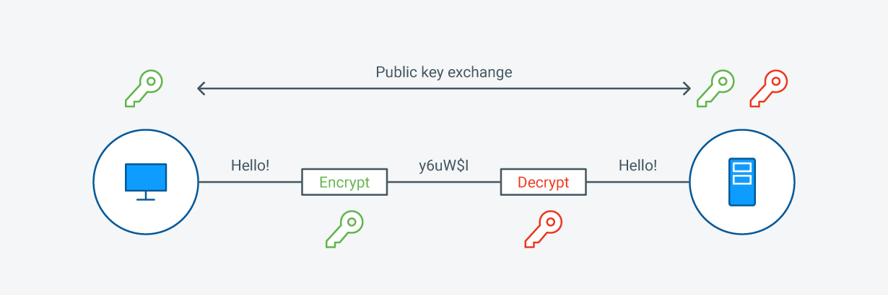
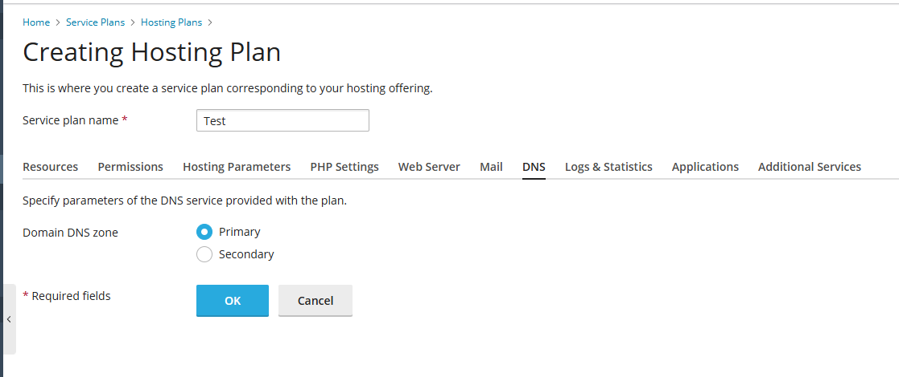
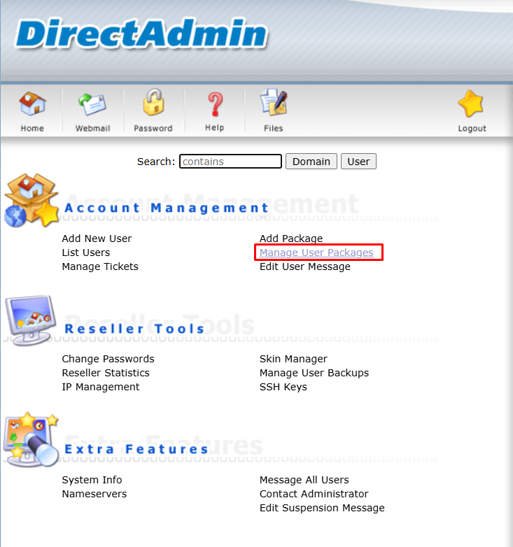
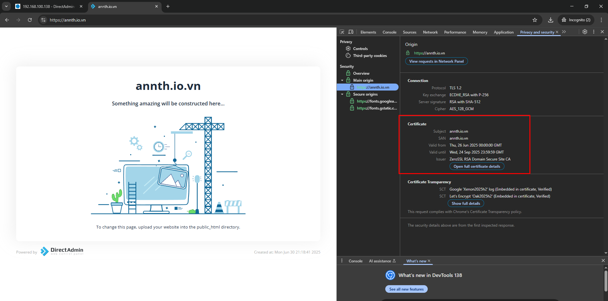
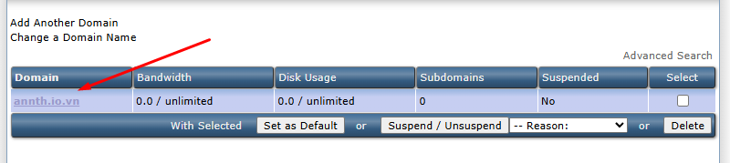
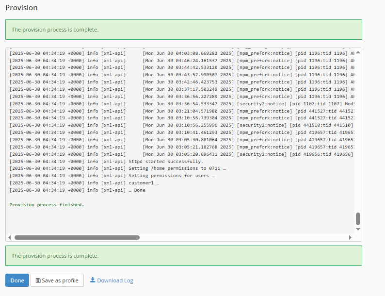

# SSL (Secure Sockets Layer) - TLS (Transport Layer Security)

## 1. Tổng quan SSL/TLS
### 1.1 SSL/TLS  
- SSL, hay Secure Sockets Layer, là một giao thức bảo mật trên Internet dựa trên mã hóa. Nó được phát triển lần đầu tiên bởi Netscape vào năm 1995 nhằm đảm bảo tính riêng tư, xác thực và toàn vẹn dữ liệu trong các giao tiếp qua Internet. SSL là tiền thân của giao thức mã hóa hiện đại TLS được sử dụng ngày nay.
- Transport Layer Security, hay TLS, là một giao thức bảo mật được sử dụng rộng rãi nhằm hỗ trợ quyền riêng tư và bảo mật dữ liệu trong các giao tiếp qua Internet. Một trong những ứng dụng chính của TLS là mã hóa thông tin trao đổi giữa các ứng dụng web và máy chủ, ví dụ như khi trình duyệt tải một trang web. TLS cũng có thể được sử dụng để mã hóa các hình thức giao tiếp khác như email, tin nhắn và thoại qua IP (VoIP).
- Giao thức TLS được đề xuất bởi Internet Engineering Task Force (IETF), một tổ chức tiêu chuẩn quốc tế, và phiên bản đầu tiên được công bố vào năm 1999. Phiên bản mới nhất là TLS 1.3, được phát hành vào năm 2018.
- Sự khác biệt cốt lõi giữa SSL và TLS nằm ở việc TLS giới thiệu một loạt cải tiến quan trọng như thuật toán mã hóa mạnh mẽ hơn, cơ chế xác thực tốt hơn và phương pháp trao đổi khóa an toàn hơn. Những nâng cấp này giúp giảm đáng kể nguy cơ bị tấn công và đảm bảo mức độ bảo mật cao hơn trong truyền tải dữ liệu. Một số điểm nổi bật của TLS bao gồm:
	- Mã hóa mạnh hơn: TLS hỗ trợ các thuật toán mã hóa tiên tiến như AES (Advanced Encryption Standard), mang lại khả năng bảo vệ tốt hơn trước các cuộc tấn công brute-force.
	- Khác biệt về mật mã học: Mặc dù cả hai giao thức đều dựa trên nguyên tắc tương tự, TLS áp dụng các kỹ thuật mật mã mạnh mẽ hơn. Ví dụ, TLS sử dụng HMAC (Mã xác thực thông điệp dựa trên hàm băm) cho tính toàn vẹn của dữ liệu, an toàn hơn so với MAC trong SSL. Ngoài ra, TLS cũng hỗ trợ các bộ mã hóa (cipher suite) an toàn hơn.
	- Xác thực cải tiến: TLS sử dụng phương thức xác thực bảo mật hơn để xác minh danh tính giữa các bên giao tiếp, giảm nguy cơ tấn công giả mạo trung gian. Quy trình bắt tay (handshake) của TLS cũng an toàn hơn với các cơ chế xác thực mạnh mẽ.
	- Hiệu suất cao hơn: TLS được thiết kế tối ưu hơn, giảm tải khi thiết lập kết nối bảo mật, từ đó giúp quy trình bắt tay diễn ra nhanh hơn và độ trễ thấp hơn—phù hợp cho các ứng dụng web hiện đại đòi hỏi tốc độ cao và thời gian phản hồi nhanh.
	- Trao đổi khóa nâng cao: TLS sử dụng các giao thức trao đổi khóa an toàn hơn như Diffie-Hellman và Elliptic Curve Diffie-Hellman để thiết lập kết nối bảo mật.
### 1.2 Lịch sử, phiên bản 
- SSL và TLS là những giao thức dùng để bảo mật các kết nối mạng. SSL, do Netscape phát triển, là giao thức được sử dụng rộng rãi đầu tiên, nhưng sau đó đã được thay thế bởi TLS – một phiên bản nâng cấp với các tính năng bảo mật và hiệu suất cải tiến vượt trội. TLS, được giới thiệu lần đầu vào năm 1999 như bản nâng cấp của SSL 3.0, hiện nay đã trở thành tiêu chuẩn cho việc bảo mật giao tiếp trên Internet.
**SSL (Secure Sockets Layer):**  
- Được phát triển bởi Netscape vào giữa những năm 1990  
- *SSL 1.0* chưa từng được phát hành công khai do có nhiều lỗ hổng bảo mật  
- *SSL 2.0* phát hành vào năm 1995, là phiên bản công khai đầu tiên nhưng cũng tồn tại nhiều điểm yếu  
- *SSL 3.0* ra mắt năm 1996, là một bản thiết kế lại với cải tiến rõ rệt, nhưng theo thời gian vẫn bị phát hiện có lỗ hổng  

**TLS (Transport Layer Security):**  
- TLS 1.0: Đây là phiên bản đầu tiên được phát hành vào năm 1999. Là phiên bản tiếp nối và chứa nhiều đặc điểm tương đồng với SSL 3.0. Phiên bản này đã được cải tiến và cập nhật các giao thức và quy trình để tương thích với các máy tính và kết nối Internet trong giai đoạn đầu của thập kỷ 2000. Phiên bản 1.0 được công bố theo RFC 2246, định nghĩa các yêu cầu và quy định chi tiết cho giao thức này.
- TLS 1.1: Đây là phiên bản thứ hai được ra mắt vào năm 2006, đại diện cho sự tiến bộ đáng kể đầu tiên của giao thức này. Phiên bản này đã mang đến nhiều thay đổi và cải tiến đáng kể, bao gồm việc thay thế Vectơ Khởi tạo bằng một phiên bản rõ ràng hơn để cung cấp khả năng bảo vệ tốt hơn chống lại các cuộc tấn công mạng.
	- Ngoài ra, phiên bản 1.1 cũng đã cải thiện quá trình xử lý lỗi và xác thực để phù hợp với môi trường sử dụng Internet vào năm 2006. Bên cạnh đó, các ghi chú và giải thích liên quan đến các hình thức tấn công mạng mới đã được bổ sung vào phiên bản này. Phiên bản 1.1 đã được công bố theo RFC 4346.
- TLS 1.2: Đây là phiên bản thứ ba và được ra mắt vào năm 2008. Là phiên bản cập nhật quan trọng thứ hai của giao thức và hiện vẫn là phiên bản tiêu chuẩn được sử dụng rộng rãi. Được coi là phiên bản mới nhất, Phiên bản 1.2 mang đến nhiều cải tiến bảo mật đáng kể cùng với việc cải thiện tốc độ và khả năng của cả máy chủ và máy khách trong quá trình thiết lập kết nối và sử dụng tất cả các thuật toán liên quan đến quy trình TLS.
	- Một cải tiến quan trọng của phiên bản 1.2 là việc áp dụng các thuật toán bảo mật mạnh hơn để đảm bảo tính toàn vẹn và bảo mật dữ liệu. Phiên bản này đã được công bố theo RFC 5246.
- TLS 1.3: Đây là phiên bản mới nhất của giao thức này, được công bố vào năm 2016 và đang trong giai đoạn thử nghiệm. Mục tiêu chính của bản cập nhật này là cải thiện đáng kể giao thức bảo mật hiện có, tăng cường tính an toàn trên internet và đảm bảo tính toàn vẹn của việc truyền dữ liệu. Phiên bản 1.3 đã áp dụng các cải tiến để đối phó với các kỹ thuật hack phức tạp, nhằm bảo vệ dữ liệu nhạy cảm và thông tin cá nhân, chẳng hạn như thông tin tài khoản ngân hàng và thanh toán.

| Protocol | Published | Status |
|----------|-----------|--------|
| 🔴 SSL 1.0 | Unpublished | Unpublished |
| 🔴 SSL 2.0 | 1995 | Deprecated in 2011 (RFC 6176) |
| 🔴 SSL 3.0 | 1996 | Deprecated in 2015 (RFC 7568) |
| 🔴 TLS 1.0 | 1999 | Deprecated in 2021 (RFC 8996) |
| 🔴 TLS 1.1 | 2006 | Deprecated in 2021 (RFC 8996) |
| 🟡 TLS 1.2 | 2008 | In use since 2008 |
| 🟢 TLS 1.3 | 2018 | In use since 2018 |

### 1.3 Vai trò của SSL trong bảo mật mạng (HTTPS, email, VPN, v.v.)
- HTTPS (Hypertext Transfer Protocol Secure): SSL/TLS là nền tảng của HTTPS – một phiên bản bảo mật của HTTP. Giao thức này mã hóa dữ liệu truyền giữa trình duyệt và máy chủ, giúp bảo vệ thông tin khỏi bị nghe lén hoặc chỉnh sửa. Nó cũng thực hiện xác thực máy chủ để người dùng biết họ đang kết nối với đúng website.
- Email: Các giao thức email như SMTPS, POP3S và IMAPS sử dụng SSL/TLS để bảo vệ nội dung thư điện tử trong quá trình truyền tải. Điều này ngăn chặn việc rò rỉ hoặc giả mạo email, đồng thời đảm bảo tính toàn vẹn của thông tin.
- VPN (Virtual Private Network): Một số giao thức VPN (ví dụ: OpenVPN) dựa trên SSL/TLS để mã hóa dữ liệu giữa thiết bị của người dùng và máy chủ VPN. Điều này tạo ra một kênh truyền thông an toàn, đặc biệt hữu ích khi sử dụng mạng công cộng.
- Các ứng dụng khác: SSL/TLS được ứng dụng trong bảo mật các dịch vụ như nhắn tin, thoại qua IP (VoIP), truy cập từ xa, và API trong kiến trúc microservices hoặc hệ thống đám mây. Việc sử dụng SSL giúp bảo vệ các tương tác giữa các thành phần phần mềm khác nhau khỏi rò rỉ hoặc can thiệp dữ liệu.
### 1.4 Lợi ích
- Lợi ích của SSL/TLS:
	- Bảo vệ dữ liệu: Mã hóa thông tin giúp ngăn chặn nghe lén, đánh cắp và chỉnh sửa dữ liệu.
	- Xác thực danh tính: Đảm bảo người dùng đang truy cập đúng website hợp pháp.
	- Tuân thủ tiêu chuẩn: Bắt buộc với các website thanh toán để đáp ứng yêu cầu PCI-DSS.
	- Ngăn chặn tấn công: Bảo vệ khỏi giả mạo, nghe lén và đánh cắp danh tính.
	- Chống lừa đảo: Khó có trang giả mạo nào đạt được chứng chỉ bảo mật cao cấp như EV/OV.
	- Cải thiện thứ hạng tìm kiếm: Google ưu tiên các website sử dụng HTTPS.
	- Tăng niềm tin người dùng: Biểu tượng ổ khóa và HTTPS tạo cảm giác an toàn khi giao dịch.

### 1.5 Các vấn đề khi sử dụng SSL/TLS
- Mặc dù SSL/TLS mang lại nhiều lợi ích, nhưng các nhà phát triển có thể gặp phải một số thách thức khi triển khai:
	- Tác động đến hiệu suất: SSL/TLS tạo ra một mức độ tải bổ sung do quá trình mã hóa và giải mã. Điều này có thể ảnh hưởng đến hiệu suất ứng dụng, đặc biệt khi xử lý lượng lớn dữ liệu hoặc giao tiếp theo thời gian thực.
	- Vấn đề tương thích: Việc triển khai SSL/TLS có thể khác nhau giữa các nền tảng, thư viện và phiên bản. Điều này có thể dẫn đến sự cố tương thích khi thiết lập kết nối bảo mật giữa máy khách và máy chủ.
	- Khả năng mở rộng: Các ứng dụng nhắn tin và chat theo thời gian thực thường phải xử lý nhiều kết nối đồng thời. Việc mở rộng SSL/TLS có thể gặp khó khăn vì cần thêm tài nguyên tính toán để thực hiện mã hóa và giải mã. Cần xem xét triển khai các chiến lược cân bằng tải và bộ đệm (caching) để xử lý lưu lượng tăng cao.
	- Độ phức tạp trong tích hợp: Tích hợp SSL/TLS vào ứng dụng có thể phức tạp, đặc biệt là đối với kiến trúc phân tán hoặc các hệ thống phụ thuộc vào nhiều dịch vụ bên thứ ba.
	- Quản lý chứng chỉ: Việc quản lý và gia hạn chứng chỉ số có thể tốn thời gian và công sức, đặc biệt trong các hệ thống quy mô lớn với nhiều máy chủ và tên miền.
	- Chi phí phát triển và bảo trì bổ sung: Việc triển khai SSL/TLS cho các ứng dụng chat thời gian thực đòi hỏi thêm nỗ lực về mặt phát triển và bảo trì.

### 1.6 So sánh SSL/TLS

| Tiêu chí                  | SSL                                                                      | TLS                                                                      |
| ------------------------- | ------------------------------------------------------------------------ | ------------------------------------------------------------------------ |
| Viết tắt                  | SSL là viết tắt của *Secure Sockets Layer*.                              | TLS là viết tắt của *Transport Layer Security*.                          |
| Lịch sử phiên bản         | SSL hiện đã bị thay thế bởi TLS. Bao gồm các phiên bản 1.0, 2.0 và 3.0.  | TLS là phiên bản nâng cấp từ SSL. Có các phiên bản 1.0, 1.1, 1.2 và 1.3. |
| Tình trạng hoạt động      | Tất cả các phiên bản SSL đều đã bị khai tử (deprecated).                 | TLS 1.2 và 1.3 vẫn đang được sử dụng phổ biến.                           |
| Thông báo cảnh báo        | Chỉ có hai loại thông báo cảnh báo. Các thông báo này không được mã hóa. | Thông báo cảnh báo được mã hóa và đa dạng hơn.                           |
| Xác thực thông điệp       | Sử dụng MAC (Message Authentication Code).                               | Sử dụng HMAC (Hash-based MAC), an toàn hơn.                              |
| Bộ mã hóa (Cipher Suites) | Hỗ trợ các thuật toán cũ, nhiều thuật toán đã có lỗ hổng.                | Sử dụng thuật toán mã hóa tiên tiến, bảo mật cao.                        |
| Bắt tay (Handshake)       | Quá trình bắt tay phức tạp và chậm.                                      | Bắt tay đơn giản hơn, thiết lập kết nối nhanh hơn.                       |


## 2. Cách thức hoạt động của SSL 
### 2.1 Hoạt động của SSL/TLS 
- Giao tiếp an toàn bắt đầu bằng quá trình bắt tay TLS (TLS handshake), trong đó hai bên tham gia sẽ thiết lập kết nối bảo mật và trao đổi khóa công khai.
- Trong quá trình bắt tay, cả hai bên sẽ tạo ra khóa phiên (session key), và các khóa này sẽ được sử dụng để mã hóa và giải mã toàn bộ dữ liệu truyền sau đó.
- Mỗi phiên giao tiếp mới sử dụng một khóa phiên khác nhau, đảm bảo tính riêng tư và bảo mật.
- TLS đảm bảo rằng bên máy chủ (hoặc website mà người dùng đang tương tác) thực sự là đối tượng chính xác như họ tuyên bố.
- TLS cũng đảm bảo rằng dữ liệu không bị thay đổi trong quá trình truyền, nhờ sử dụng mã xác thực thông điệp (MAC – Message Authentication Code).
- Với TLS, tất cả dữ liệu HTTP mà người dùng gửi đến website (như nhấp chuột, điền biểu mẫu…) và dữ liệu mà website gửi lại cho người dùng đều được mã hóa. Dữ liệu này chỉ có thể được giải mã bởi bên nhận bằng khóa thích hợp.

### 2.2 Handshake SSL/TLS: Cách thiết lập kết nối an toàn.
- Các "SSL handshakes" thực chất là TLS handshakes, mặc dù tên “SSL” vẫn được sử dụng phổ biến trong thực tế.
- TLS handshake xảy ra khi người dùng truy cập vào dịch vụ sử dụng SSL/TLS và client liên lạc với server.
- Lưu ý: TLS handshake được thực hiện sau khi kết nối TCP đã được thiết lập thông qua quá trình TCP handshake.
- Trong quá trình TLS handshake, máy khách (client) và máy chủ (server) sẽ thực hiện các bước sau:
	- Xác định phiên bản TLS sẽ sử dụng (ví dụ: TLS 1.0, 1.2, 1.3, v.v.)
	- Thỏa thuận lựa chọn bộ thuật toán mã hóa (cipher suites) được hỗ trợ và sử dụng
	- Xác thực danh tính của máy chủ thông qua khóa công khai (public key) và chữ ký số từ tổ chức phát hành chứng chỉ SSL
	- Tạo khóa phiên (session key) để sử dụng mã hóa đối xứng sau khi handshake hoàn tất
- TLS handshake là một chuỗi các datagram (gói tin) hoặc thông điệp được trao đổi giữa máy khách (client) và máy chủ (server). Quá trình handshake bao gồm nhiều bước, trong đó hai bên trao đổi các thông tin cần thiết để hoàn tất handshake và thiết lập khả năng giao tiếp bảo mật tiếp theo.
- Các bước cụ thể trong một TLS handshake có thể khác nhau tùy thuộc vào thuật toán trao đổi khóa được sử dụng và các bộ mã hóa (cipher suites) mà cả hai bên hỗ trợ. Thuật toán trao đổi khóa RSA – hiện nay không còn được coi là an toàn – từng được sử dụng trong các phiên bản TLS trước 1.3. Quy trình điển hình như sau:
	1. Thiết lập kết nối bảo mật (Quy trình Handshake)
	- Client Hello: Máy khách (trình duyệt của bạn) gửi một thông điệp đến máy chủ để yêu cầu thiết lập kết nối bảo mật. Thông điệp này bao gồm các thuật toán mã hóa được hỗ trợ và một số ngẫu nhiên dùng để khởi tạo mã hóa.
	- Server Hello: Máy chủ phản hồi bằng số ngẫu nhiên của riêng nó, chọn thuật toán mã hóa phù hợp từ danh sách của máy khách và gửi kèm chứng chỉ SSL/TLS (chứa khóa công khai và danh tính của máy chủ).
	2. Xác thực
	- Máy khách kiểm tra tính hợp lệ của chứng chỉ SSL/TLS thông qua tổ chức chứng thực (CA) đã cấp chứng chỉ đó. Việc này đảm bảo máy chủ là đúng đối tượng được khai báo.
	- Nếu chứng chỉ hợp lệ và đáng tin cậy, máy khách sẽ tiếp tục kết nối. Nếu không, sẽ xuất hiện cảnh báo (ví dụ: “kết nối không đáng tin”).
	3. Trao đổi khóa
	- Client Key Exchange: Máy khách tạo một số ngẫu nhiên gọi là "pre-master secret" và mã hóa nó bằng khóa công khai của máy chủ rồi gửi đến máy chủ.
	- Server Decrypts: Máy chủ giải mã pre-master secret bằng khóa bí mật của mình.
	- Cả hai bên sau đó sử dụng pre-master secret cùng với các số ngẫu nhiên từ handshake để tạo ra khóa phiên (session key). Khóa này sẽ được sử dụng để mã hóa và giải mã dữ liệu trong suốt phiên làm việc.
	4. Mã hóa dữ liệu và giao tiếp an toàn
	- Khi cả hai đã có chung một khóa phiên, họ có thể mã hóa và giải mã dữ liệu trao đổi. Nhờ đó, ngay cả khi kẻ tấn công chặn được dữ liệu, họ cũng không thể đọc nội dung nếu không có khóa phiên.
	5. Kết thúc phiên làm việc
	- Sau khi trao đổi xong, máy khách và máy chủ gửi thông báo cho nhau rằng phiên làm việc đã kết thúc. Việc này đảm bảo khóa phiên được hủy bỏ và kết nối bảo mật được đóng lại.
	- 
- Handshake trong TLS 1.3 
	- TLS 1.3 không hỗ trợ RSA hay các bộ mã hóa và tham số dễ bị tấn công. Giao thức này cũng rút gọn quá trình handshake, giúp TLS 1.3 handshake diễn ra nhanh hơn và an toàn hơn.
	- Các bước cơ bản trong TLS 1.3 handshake:
		- Client Hello: Máy khách gửi thông điệp hello chứa phiên bản giao thức, client random và danh sách các cipher suite được hỗ trợ. Do TLS 1.3 đã loại bỏ các thuật toán yếu, danh sách cipher suite đã được rút gọn đáng kể. Thông điệp cũng bao gồm các tham số cần thiết để tính toán "premaster secret". Trên thực tế, máy khách gần như đoán trước được phương pháp trao đổi khóa mà máy chủ ưa dùng — điều này giúp rút ngắn tổng thời gian handshake, là điểm khác biệt chính so với các phiên bản TLS cũ hơn (1.0 – 1.2).
		- Máy chủ tạo master secret: Sau khi nhận được client random và các tham số, máy chủ tự tạo server random và có đủ thông tin để tính master secret.
		- Server Hello + Finished: Server hello bao gồm chứng chỉ số, chữ ký số, server random và cipher suite đã chọn. Vì đã có master secret, máy chủ cũng gửi luôn thông điệp "Finished".
		- Bước cuối – Client Finished: Máy khách xác minh chữ ký và chứng chỉ, tạo master secret và gửi lại thông điệp "Finished".
		→ Mã hóa đối xứng an toàn được thiết lập.
	- 0-RTT (Zero Round Trip Time) cho tái sử dụng phiên: TLS 1.3 còn hỗ trợ chế độ 0-RTT cho các lần kết nối tiếp theo: nếu client và server đã từng kết nối trước đó, họ có thể tạo ra một "resumption main secret" từ phiên đầu tiên. Trong phiên đầu, server gửi cho client một vé phiên (session ticket). Khi client kết nối lại, nó dùng shared secret này và session ticket để mã hóa dữ liệu ngay từ thông điệp đầu tiên, không cần mất thời gian trao đổi thông điệp qua lại.

### 2.3 Vai trò của khóa công khai (public key) và khóa bí mật (private key).
- Trong SSL, khóa công khai (public key) và khóa bí mật (private key) là hai thành phần cốt lõi trong hệ thống mã hóa được sử dụng cho giao tiếp an toàn.
	- Khóa công khai được dùng để mã hóa dữ liệu.
	- Khóa bí mật được dùng để giải mã dữ liệu đã mã hóa.
- Đây là phương pháp mã hóa bất đối xứng, đảm bảo rằng chỉ người nhận dự kiến sở hữu khóa bí mật tương ứng mới có thể giải mã và truy cập thông tin. Nhờ vậy, dữ liệu được bảo vệ ngay cả khi truyền qua các kênh không an toàn.
- Khóa công khai (Public Key):
	- Khả dụng: Khóa công khai được chia sẻ tự do và sẵn sàng cho bất kỳ ai muốn gửi dữ liệu được mã hóa đến người sở hữu khóa.
	- Mã hóa: Khóa này được dùng để mã hóa các thông điệp hoặc dữ liệu mà chỉ người giữ khóa bí mật tương ứng mới có thể giải mã và đọc được.
	- Ví dụ: Nếu Alice muốn gửi một thông điệp an toàn cho Bob, cô ấy sẽ mã hóa thông điệp bằng khóa công khai của Bob. Khi Bob nhận được thông điệp, anh ấy sẽ giải mã nó bằng khóa bí mật của mình.
- Khóa bí mật (Private Key):
	- Bảo mật: Khóa bí mật được giữ kín tuyệt đối và không bao giờ được chia sẻ. Nó được sử dụng để giải mã dữ liệu đã được mã hóa bằng khóa công khai tương ứng.
	- Giải mã: Đây là khóa duy nhất có khả năng giải mã dữ liệu đã được mã hóa bằng khóa công khai của nó.
	- Ví dụ: Chỉ Bob sở hữu khóa bí mật tương ứng với khóa công khai được dùng để mã hóa thông điệp do Alice gửi.
	- 

## 3. Chứng chỉ SSL (SSL Certificate)
### 3.1 Khái niệm và mục đích 
- SSL/TLS Certificate hay Chứng chỉ SSL/TLS là một đối tượng số cho phép các hệ thống xác minh danh tính và thiết lập kết nối mạng được mã hóa với một hệ thống khác thông qua giao thức SSL/TLS (Secure Sockets Layer/Transport Layer Security).
- Các chứng chỉ này hoạt động trong một hệ thống mật mã gọi là cơ sở hạ tầng khóa công khai (PKI – Public Key Infrastructure). PKI cho phép một bên xác minh danh tính của bên kia nếu cả hai cùng tin tưởng vào một bên thứ ba – gọi là tổ chức chứng thực (Certificate Authority – CA).
- Chứng chỉ SSL/TLS đóng vai trò như một thẻ căn cước số, giúp bảo vệ các kết nối mạng, xác thực danh tính của các website trên Internet cũng như các tài nguyên trong mạng nội bộ.
- Lợi ích của chứng chỉ SSL/TLS:
	- Bảo vệ dữ liệu cá nhân: Trình duyệt kiểm tra chứng chỉ SSL/TLS trước khi cho phép kết nối bảo mật. Công nghệ này giúp mã hóa toàn bộ thông tin giữa người dùng và máy chủ web.
	- Tăng độ tin cậy với khách hàng: Người dùng hiểu biết về Internet quan tâm đến quyền riêng tư và tin tưởng hơn vào các website có biểu tượng ổ khóa xanh. SSL/TLS giúp khẳng định rằng dữ liệu của họ đang được bảo vệ.
	- Tuân thủ quy định pháp lý: Một số ngành, như ngành thanh toán, bắt buộc phải tuân thủ các quy định bảo mật như PCI DSS – trong đó yêu cầu cài chứng chỉ SSL/TLS để đảm bảo giao dịch an toàn.
	- Cải thiện thứ hạng SEO: Các công cụ tìm kiếm lớn xem SSL/TLS là yếu tố đánh giá xếp hạng. Website được bảo mật bằng SSL/TLS thường có vị trí cao hơn so với website không có bảo vệ, từ đó thu hút nhiều lượt truy cập hơn.
- Xác thực và thời hạn của chứng chỉ 
	- Cơ quan cấp chứng chỉ (CA – Certificate Authority) là tổ chức chuyên cung cấp các chứng chỉ SSL/TLS cho chủ sở hữu trang web, công ty lưu trữ web hoặc doanh nghiệp. CA sẽ xác minh thông tin tên miền và người sở hữu trước khi cấp chứng chỉ SSL/TLS.
	- Chứng chỉ SSL/TLS hiện có thời hạn tối đa là 13 tháng. Trong những năm qua, thời hạn này đã dần được rút ngắn nhằm giảm thiểu rủi ro bảo mật cho doanh nghiệp và người dùng web. Ví dụ, bên thứ ba không đáng tin có thể tận dụng chứng chỉ vẫn còn hiệu lực của một tên miền đã hết hạn để tạo ra một trang web trái phép.
	- Việc rút ngắn thời gian hiệu lực sẽ giúp hạn chế khả năng bị lạm dụng. Khi chứng chỉ SSL/TLS hết hạn, trình duyệt sẽ cảnh báo người dùng rằng trang web không còn an toàn. Do đó, tổ chức cần thu hồi chứng chỉ cũ và thay thế bằng chứng chỉ mới được gia hạn. Quá trình gia hạn này cần hoàn tất trước khi chứng chỉ hiện tại hết hạn để tránh các sự cố bảo mật.

### 3.2 Các loại chứng chỉ SSL:
#### 3.2.1 Theo cấp độ xác thực 
- Mục đích chính của chứng chỉ SSL là nhằm xác minh danh tính máy chủ trên mạng 
- Để thực hiện điều đó, mỗi chứng chỉ chứa thông tin về thực thể được cấp chứng chỉ. Mức độ chi tiết của thông tin phụ thuộc vào cấp độ xác thực của chứng chỉ. SSL có ba cấp độ xác thực.
	- DV (Domain Validation) 
		- Xác thực tên miền (Domain Validation) là cấp độ xác thực nhẹ nhất trong các loại chứng chỉ SSL. Với chứng chỉ DV, điều duy nhất được xác thực về danh tính của người sở hữu chứng chỉ là họ thực sự có quyền kiểm soát tên miền mà chứng chỉ được cấp cho.
		- Ưu điểm chính của chứng chỉ DV là có thể được cấp trong vài phút. Chứng chỉ DV được khuyến nghị sử dụng trong các trường hợp chỉ cần mã hóa hoặc yêu cầu có chứng chỉ, nhưng không phải mục tiêu của các cuộc tấn công lừa đảo và không đòi hỏi phải tạo dựng sự tin tưởng đặc biệt với người truy cập trang web.
	- OV (Organization Validation)
		- Xác thực tổ chức là cấp độ xác thực trung bình trong các loại chứng chỉ SSL. Chứng chỉ OV đưa ra tuyên bố về danh tính của tổ chức được cấp chứng chỉ và nơi tổ chức đó hoạt động.
		- Việc xác thực OV chủ yếu do từng tổ chức cấp chứng chỉ (CA) quyết định. Mặc dù chứng chỉ này cung cấp thông tin về danh tính tổ chức, nhưng do quy trình xác thực không được thực hiện và kiểm toán ở một tiêu chuẩn chung toàn cầu nên các trình duyệt phổ biến không hiển thị tên công ty trong thanh địa chỉ.
	- EV (Extended Validation)
		- Xác thực mở rộng (Extended Validation – EV) là cấp độ xác thực SSL cao nhất. Danh tính của chủ sở hữu chứng chỉ EV được xác minh theo một bộ giao thức tiêu chuẩn, được đánh giá là có độ tin cậy cao và đã được kiểm chứng qua thực tiễn sử dụng rộng rãi.
		- Vì mức độ tin tưởng cao đối với thông tin trong loại chứng chỉ này, hầu hết các trình duyệt phổ biến đều hiển thị biểu tượng tin cậy màu xanh lá (thanh địa chỉ màu xanh), kèm theo tên của tổ chức ở bên trái đường dẫn URL. Nhiều trình duyệt còn cung cấp thêm thông tin như thành phố nơi tổ chức hoạt động và tên của cơ quan cấp chứng chỉ.
		- Chứng chỉ EV được khuyến nghị sử dụng cho các ứng dụng cần tối đa hóa giao dịch hoặc xây dựng lòng tin với người dùng, các ứng dụng xử lý thông tin giá trị cao như dữ liệu nhận dạng cá nhân (PII) hoặc số thẻ tín dụng, hay các ứng dụng yêu cầu tuân thủ tiêu chuẩn cần EV. EV hiện là chuẩn mặc định cho các doanh nghiệp trực tuyến như ngân hàng, cửa hàng, sàn giao dịch, cổng khai thuế, dịch vụ y tế và các tài khoản mạng xã hội.
#### 3.2.2 Theo phạm vi bảo vệ
- Mặc dù mỗi tên miền cụ thể cần được bảo vệ bằng chứng chỉ SSL để kích hoạt mã hóa và các chỉ báo tin cậy trên trình duyệt, nhưng vẫn có thể sử dụng các loại chứng chỉ có thể bảo vệ nhiều tên miền cùng lúc.
- Xét về phạm vi bảo vệ tên miền, chứng chỉ SSL được chia thành ba loại.
	- Basic SSL certificates
		- Chứng chỉ SSL cơ bản chỉ bảo vệ một tên miền hoặc tên miền phụ. Muốn bảo vệ nhiều tên miền, bạn cần nhiều chứng chỉ tương ứng. Tuy nhiên, phần lớn CA sẽ cấp chứng chỉ cho cả www.domain.com và domain.com trong cùng một chứng chỉ.
		- Chứng chỉ cơ bản có thể áp dụng ở cả 3 mức xác thực: DV, OV, và EV. Dù bảo mật tốt, nhưng sử dụng nhiều chứng chỉ riêng lẻ sẽ tốn công quản lý hơn, đặc biệt trong hệ thống phức tạp.
	- Wildcard SSL certificates 
		- Chứng chỉ SSL Wildcard có thể bảo vệ nhiều tên miền phụ dưới một tên miền gốc chính. 
		- Ví dụ, một chứng chỉ wildcard cho domain.com sẽ bảo vệ được các tên miền như:
			- www.domain.com
			- login.domain.com
			- cart.domain.com
			- ftp.domain.com
		- và bất kỳ tên miền phụ nào khác của domain.com. Trong trường hợp này, tên miền gốc domain.com cũng sẽ được bảo vệ.
		- Wildcard cũng có thể áp dụng cho một tên miền phụ cụ thể, từ đó bảo vệ các tên miền con sâu hơn. Ví dụ, một chứng chỉ wildcard cho shop.domain.com sẽ áp dụng được cho:
			- a.shop.domain.com
			- b.shop.domain.com
		- Tuy nhiên, một wildcard không thể áp dụng cho nhiều tên miền gốc khác nhau. Ví dụ, wildcard của domain.com sẽ không thể bảo vệ example.com hoặc bất kỳ tên miền phụ nào của nó. Tương tự, wildcard cho shop.domain.com sẽ không hoạt động với checkout.domain.com.
		- Wildcard thuận tiện hơn đáng kể trong việc cấp phát và quản lý nếu bạn có nhiều tên miền phụ. Có thể tạo thêm các tên miền phụ mới sau khi chứng chỉ được phát hành mà vẫn sử dụng cùng chứng chỉ đó.
		- Chứng chỉ Wildcard có thể được cấp ở mức DV (Domain Validation) và OV (Organization Validation). Tuy nhiên, theo tiêu chuẩn hiện hành, không được phép cấp chứng chỉ Wildcard ở mức EV (Extended Validation). Vì vậy, với các website hướng tới công chúng yêu cầu độ tin cậy cao (như trang thương mại điện tử có các tên miền phụ như www., shop., checkout.), nên cân nhắc dùng chứng chỉ đa miền EV.
	- Multi-domain or SAN certificates 
		- Chứng chỉ đa miền (Multi-domain) hoặc SAN cho phép một chứng chỉ duy nhất bảo vệ tối đa 100 tên miền cụ thể. Không giống như chứng chỉ wildcard, chứng chỉ đa miền có thể bảo vệ bất kỳ tập hợp tên miền nào bằng cùng một chứng chỉ. Ví dụ, một chứng chỉ đa miền có thể bảo vệ:
			- www.domain.com
			- ftp.domain.net
			- shop.domain.com
			- a.shop.domain.mobi
			- www.example.com
			- login.example.com
		- Chứng chỉ đa miền có thể được cấp ở các mức xác thực DV, OV và EV. Mỗi tên miền bổ sung được bảo vệ trong chứng chỉ đa miền được gọi là SAN (Subject Alternative Name). Các chứng chỉ có SAN đôi khi được gọi là chứng chỉ SAN thay vì chứng chỉ đa miền, nhưng cả hai thuật ngữ đều mang cùng một ý nghĩa.
		- Chứng chỉ đa miền có thể thuận tiện hơn so với chứng chỉ cơ bản trong các môi trường phức tạp. Tuy nhiên, vì nhiều tên miền được bảo vệ bởi một chứng chỉ duy nhất, nên chúng không được khuyến nghị cho các môi trường nhạy cảm đòi hỏi mức độ bảo mật cao nhất. Do chứng chỉ đa miền có thể được phát hành ở mức xác thực mở rộng (EV), chúng là lựa chọn phù hợp cho các trang web doanh nghiệp hướng đến người dùng có nhiều tên miền phụ, chẳng hạn như các trang bán lẻ trực tuyến.
#### 3.2.3 Theo nguồn cấp 
- Ngoài việc phân loại chứng chỉ SSL theo phạm vi bảo vệ tên miền (cơ bản, wildcard, đa miền) và cấp độ xác thực (DV, OV, EV), chứng chỉ SSL còn được phân loại dựa trên nguồn cấp phát
	- Chứng chỉ tự ký (Self-Signed Certificates):
		- Được tạo và ký bởi chính thực thể sử dụng chứng chỉ (ví dụ: chủ sở hữu website).
		- Không được các trình duyệt hoặc hệ thống tin tưởng mặc định.
		- Yêu cầu thiết lập tin cậy thủ công (ví dụ: thêm chứng chỉ vào danh sách tin cậy).
		- Thường được sử dụng cho kiểm thử nội bộ, phát triển hoặc mạng riêng — nơi mức độ tin cậy không quá quan trọng.
		- Không trải qua quy trình xác thực của tổ chức cấp chứng chỉ (CA).
		- Tiềm ẩn rủi ro bảo mật do thiếu xác thực từ bên thứ ba.
	- Chứng chỉ do CA cấp (CA-Signed Certificates):
		- Được tạo và ký bởi một tổ chức cấp chứng chỉ đáng tin cậy (CA).
		- Được hầu hết các trình duyệt và hệ thống tin tưởng tự động.
		- Trải qua quy trình xác thực bởi CA.
		- Được ưu tiên sử dụng cho các website và ứng dụng hướng ra công chúng nhờ mức độ tin cậy cao.
		- Cung cấp sự đảm bảo về danh tính của website.
		- Có thể bị thu hồi bởi CA khi cần thiết.


### 3.3 Mã hóa trong SSL/TLS:
- Mã hóa (Encryption) là quá trình chuyển đổi thông tin từ dạng ban đầu thành dạng không đọc được bằng cách sử dụng thuật toán và khóa mật mã.
`Dữ liệu + Khóa >>> Thuật toán mã hóa >>> Dữ liệu được mã hóa`
- Giải mã (Decryption)là quá trình chuyển dữ liệu đã được mã hóa trở lại dưới dạng thông tin có thể đọc được
`Dữ liệu được mã hóa + Khóa >>> Thuật toán giải mã >>> Dữ liệu`
- Mã hóa SSL/TLS thiết lập một kết nối an toàn và được mã hóa giữa máy khách (như trình duyệt web) và máy chủ (như một trang web) bằng cách sử dụng kết hợp giữa mã hóa bất đối xứng và đối xứng. Điều này ngăn chặn các bên không được phép đọc hoặc can thiệp vào dữ liệu được truyền trong suốt phiên làm việc đó.
	- Bước 1: Mã hóa bất đối xứng (Asymmetric Encryption):	Khi trình duyệt (client) kết nối đến máy chủ (server), máy chủ gửi chứng chỉ số chứa khóa công khai. Trình duyệt xác minh chứng chỉ này thông qua một Tổ chức cấp chứng chỉ (CA) trong hệ thống PKI. Sau đó, trình duyệt sử dụng khóa công khai này để mã hóa một khóa phiên (session key) và gửi lại cho máy chủ.
	- Bước 2: Mã hóa đối xứng (Symmetric Encryption): Máy chủ sử dụng khóa riêng tư để giải mã khóa phiên. Từ thời điểm đó, cả hai bên sử dụng khóa phiên đối xứng này để mã hóa và giải mã dữ liệu truyền đi — vì mã hóa đối xứng nhanh hơn và hiệu quả hơn cho truyền dữ liệu liên tục.
- Ví dụ quy trình giao tiếp giữa client-server 
	- Máy khách liên hệ với máy chủ bằng một URL bảo mật (HTTPS…).
	- Máy chủ gửi cho máy khách chứng chỉ và khóa công khai của mình.
	- Máy khách xác minh chứng chỉ này với một Tổ chức chứng thực gốc đáng tin cậy để đảm bảo tính hợp lệ.
	- Máy khách và máy chủ đàm phán loại mã hóa mạnh nhất mà cả hai bên hỗ trợ.
	- Máy khách mã hóa một khóa phiên (bí mật) bằng khóa công khai của máy chủ và gửi lại cho máy chủ.
	- Máy chủ sử dụng khóa riêng để giải mã thông tin từ máy khách và thiết lập phiên kết nối.
	- Khóa phiên (mã hóa đối xứng) giờ đây được sử dụng để mã hóa và giải mã dữ liệu truyền giữa máy khách và máy chủ.
#### 3.3.1 Mã hóa đối xứng (Symmetric Encryption).
- Mã hóa đối xứng (hay mã hóa bằng khóa chia sẻ trước) sử dụng một khóa duy nhất để mã hóa và giải mã dữ liệu. Cả người gửi và người nhận đều cần có cùng một khóa để giao tiếp.
- Kích thước khóa đối xứng thường là 128 hoặc 256 bit — khóa càng dài thì càng khó bị phá vỡ.
- Việc sử dụng khóa 128 hay 256 bit phụ thuộc vào khả năng mã hóa của cả máy chủ và phần mềm phía máy khách. Chứng chỉ TLS/SSL không quyết định kích thước khóa được sử dụng.
- Phương pháp này có tốc độ xử lý nhanh và thường dùng để mã hóa dữ liệu trong suốt phiên làm việc sau khi khóa được trao đổi an toàn. Tuy nhiên, điểm yếu của nó là việc phân phối khóa — nếu khóa bị lộ, toàn bộ dữ liệu có thể bị giải mã.
- 
#### 3.3.2 Mã hóa bất đối xứng (Asymmetric Encryption).
- Mã hóa bất đối xứng, còn được gọi là Mật mã khóa công khai sử dụng hai khóa riêng biệt để mã hóa và giải mã. Với mã hóa bất đối xứng, bất kỳ ai cũng có thể sử dụng khóa công khai để mã hóa một thông điệp. Tuy nhiên, khóa giải mã được giữ bí mật. Nhờ đó, chỉ người nhận dự kiến mới có thể giải mã thông điệp.
- Thuật toán mã hóa bất đối xứng phổ biến nhất là RSA. RSA là viết tắt của Ron Rivest, Adi Shamir và Leonard Adleman — những người đầu tiên công bố thuật toán này vào năm 1977. Các khóa bất đối xứng thường có độ dài 1024 hoặc 2048 bit. Tuy nhiên, các khóa nhỏ hơn 2048 bit hiện không còn được xem là an toàn. Khóa 2048 bit có hàng loạt mã hóa duy nhất với độ dài lên tới 617 chữ số.
- Dù có thể tạo ra các khóa lớn hơn, nhưng gánh nặng tính toán tăng lên đáng kể khiến các khóa lớn hơn 2048 bit hiếm khi được sử dụng. Để dễ hình dung, một máy tính trung bình sẽ mất hơn 14 tỷ năm để phá vỡ một chứng chỉ 2048 bit.
- 

| Tiêu chí                    | Mã hóa đối xứng                         | Mã hóa bất đối xứng                           |
| --------------------------- | --------------------------------------- | --------------------------------------------- |
| **Số lượng khóa sử dụng**   | 1 khóa (dùng chung để mã hóa & giải mã) | 2 khóa (khóa công khai & khóa riêng tư)       |
| **Tốc độ xử lý**            | Nhanh hơn                               | Chậm hơn do tính toán phức tạp hơn            |
| **Bảo mật khi truyền khóa** | Cần kênh an toàn để chia sẻ khóa        | Không cần chia sẻ khóa riêng tư               |
| **Ứng dụng phổ biến**       | Mã hóa dữ liệu trong phiên làm việc     | Trao đổi khóa an toàn, xác thực danh tính     |
| **Thuật toán tiêu biểu**    | AES, DES, RC4                           | RSA, ECC                                      |
| **Độ dài khóa phổ biến**    | 128 hoặc 256 bit                        | 2048 bit trở lên                              |
| **Rủi ro bảo mật**          | Nếu khóa bị lộ, toàn bộ dữ liệu bị nguy | Khó bị tấn công nếu giữ khóa riêng tư an toàn |


#### 3.3.3 Thuật toán trao đổi khóa (Diffie-Hellman, RSA, ECC).
##### DH (Diffie-Hellman)
- Trao đổi khóa Diffie–Hellman (D-H) là một phương pháp trao đổi khóa được phát minh sớm nhất trong mật mã học. Phương pháp trao đổi khóa Diffie–Hellman cho phép hai bên (người, thực thể giao tiếp) thiết lập một khóa bí mật chung để mã hóa dữ liệu sử dụng trên kênh truyền thông không an toàn mà không cần có sự thỏa thuận trước về khóa bí mật giữa hai bên. Khóa bí mật tạo ra sẽ được sử dụng để mã hóa dữ liệu với phương pháp mã hóa khóa đối xứng.
- Giao thức này được công bố đầu tiên bởi Whitfield Diffie và Martin Hellman vào năm 1976
- Giao thức này tận dụng các đặc tính toán học của logarit rời rạc và số học mô-đun để đảm bảo rằng ngay cả khi kẻ thù chặn được đường truyền, chúng cũng không thể lấy được khóa bí mật chung.
- Tính bảo mật của trao đổi khóa Diffie-Hellman dựa trên độ khó của Bài toán logarit rời rạc (DLP). DLP tuyên bố rằng với một số nguyên tố lớn nhất định p, một gốc nguyên thủy g hình thức p, và một số y như vậy mà y = g^x \mod p, về mặt tính toán không thể xác định được x được y, gvà p. Tính khó điều chỉnh này là nền tảng cho tính bảo mật của giao thức.
- Các bước giao thức
1. Tạo tham số:
– Alice và Bob đồng ý về một số nguyên tố lớn p và một gốc nguyên thủy g hình thức p. Những giá trị này không cần phải giữ bí mật và có thể được chia sẻ một cách công khai. Sự lựa chọn của p và g là rất quan trọng; p phải đủ lớn để chống lại các cuộc tấn công, thường ít nhất là 2048 bit trong các triển khai hiện đại.
2. Lựa chọn khóa riêng tư:
– Alice chọn khóa riêng a, là một số nguyên ngẫu nhiên sao cho 1 < a < p-1.
– Bob chọn khóa riêng b, tương tự như vậy là một số nguyên ngẫu nhiên sao cho 1 < b < p-1.
3. Tính toán khóa công khai:
– Alice tính toán khóa công khai của mình A as A = g^a \mod p.
– Bob tính khóa công khai của mình B as B = g^b \mod p.
4. Trao đổi khóa công khai:
– Alice gửi khóa công khai của mình A gửi Bob.
– Bob gửi khóa công khai của mình B tới Alice.
5. Tính toán bí mật được chia sẻ:
– Alice tính toán bí mật được chia sẻ S as S = B^a \mod p.
– Bob tính toán bí mật được chia sẻ S as S = A^b \mod p.
- Do đặc tính của số học mô-đun, cả hai phép tính đều dẫn đến cùng một bí mật chung S
  \[ S = (g^b \mod p)^a \mod p = g^{ba} \mod p \]
  \[ S = (g^a \mod p)^b \mod p = g^{ab} \mod p \]
- Vì vậy, Alice và Bob bây giờ chia sẻ một bí mật chung S có thể được sử dụng để liên lạc an toàn hơn.
- Ví dụ 
- 
- Ưu điểm:
	- Hỗ trợ trao đổi khóa an toàn: Thuật toán Diffie-Hellman cho phép hai thực thể thiết lập một khóa chung bí mật qua kênh truyền không bảo mật, khóa này sau đó được sử dụng trong các hệ thống mã hóa đối xứng.
	- Perfect Forward Secrecy: Việc lộ khóa riêng không ảnh hưởng đến tính bảo mật của các phiên giao tiếp trước đó, do mỗi phiên sử dụng khóa tạm thời khác nhau.
	- Không yêu cầu dữ liệu tiền chia sẻ: Các bên tham gia không cần có kiến thức hay khóa bảo mật chung trước đó để thiết lập phiên làm việc bảo mật.
- Nhược điểm: 
	- Dễ bị tấn công kiểu Man-in-the-Middle: Nếu không áp dụng biện pháp xác thực bổ sung, kẻ tấn công có thể giả mạo một trong hai bên, chèn vào quá trình trao đổi và kiểm soát phiên giao tiếp.
	- Thiếu cơ chế xác thực tích hợp: Giao thức không bao gồm thành phần xác minh danh tính, làm tăng rủi ro bị giả mạo.
	- Tốn tài nguyên khi sử dụng khóa kích thước lớn: Việc sử dụng khóa có độ dài lớn để tăng tính bảo mật sẽ làm gia tăng chi phí tính toán.
	- Không thích hợp cho chữ ký số: Diffie-Hellman không hỗ trợ việc tạo và xác minh chữ ký điện tử, do mục đích thiết kế chỉ nhằm trao đổi khóa.
	- Không an toàn trước tấn công lượng tử: Thuật toán dựa trên độ khó của bài toán logarit rời rạc, vốn có thể bị giải quyết hiệu quả bằng máy tính lượng tử thông qua thuật toán Shor.

##### RSA (Rivest–Shamir–Adleman)
- RSA là một thuật toán mã hóa khóa công khai, được sử dụng rộng rãi trong nhiều ứng dụng bảo mật, như chữ ký số, xác thực, mã hóa đường truyền, v.v. RSA được đặt theo tên của ba nhà khoa học đã phát minh ra nó: Ron Rivest, Adi Shamir và Leonard Adleman.
- RSA được phát minh vào năm 1977 bởi ba nhà khoa học làm việc tại Viện Công nghệ Massachusetts (MIT). 
- Trao đổi khóa RSA là quá trình hai bên liên lạc chia sẻ khóa công khai của họ để có thể mã hóa và giải mã thông tin một cách an toàn. Điều này cho phép họ trao đổi thông tin mật mà không cần phải chia sẻ khóa riêng tư, vốn là bí mật và chỉ được giữ bởi chủ sở hữu.
- Thuật toán RSA dựa trên việc phân tích số nguyên lớn thành thừa số nguyên tố và sử dụng số học modulo để mã hóa và giải mã dữ liệu. Nó bao gồm ba giai đoạn chính:
- **Sinh khóa**: Tạo ra Khóa công khai và Khóa riêng  
- **Mã hóa**: Người gửi mã hóa dữ liệu bằng Khóa công khai để tạo ra bản mã (cipher text)  
- **Giải mã**: Giải mã bản mã bằng Khóa riêng để khôi phục dữ liệu ban đầu
- 
- Cụ thể các quá trình
	- Sinh khoá 
		- Chọn hai số nguyên tố lớn, gọi là p và q. Hai số nguyên tố này cần được giữ bí mật.
		- Tính tích của hai số nguyên tố: n = p × q. Giá trị n là một phần của cả khóa công khai lẫn khóa riêng.
		- Tính hàm phi Euler Φ(n) theo công thức:
		`Φ(n) = Φ(p × q) = Φ(p) × Φ(q) = (p − 1) × (q − 1)`
		- Chọn số mũ mã hóa e, sao cho:
		`1 < e < Φ(n)` và `gcd(e, Φ(n)) = 1`, nghĩa là e phải nguyên tố cùng nhau với Φ(n).
		- Tính số mũ giải mã d, sao cho:`(d × e) ≡ 1 mod Φ(n)`, tức là d là nghịch đảo modular của e theo modulo Φ(n).
		- Một số phương pháp phổ biến để tính nghịch đảo modular là: Thuật toán Euclid mở rộng, Định lý Fermat nhỏ, v.v.
		- Có thể tồn tại nhiều giá trị d thỏa mãn (d × e) ≡ 1 mod Φ(n), nhưng không quan trọng chọn giá trị nào, vì tất cả đều là khóa hợp lệ và sẽ giải mã ra cùng một thông điệp.
		- Cuối cùng:
			- Khóa công khai = (n, e)
			- Khóa riêng = (n, d)
	- Mã hoá: Sử dụng khóa công khai (n, e) để mã hóa thông điệp và tạo bản mã (cipher text) theo công thức: `C = Mᵉ mod n`, trong đó C là bản mã, còn e và n là các thành phần của khóa công khai.
	- Giải mã: Để giải mã bản mã C, sử dụng khóa riêng (n, d) để khôi phục dữ liệu ban đầu theo công thức: `M = Cᵈ mod n`, trong đó M là thông điệp gốc, còn d và n là các thành phần của khóa riêng.
- Ví dụ 
```
Chọn p = 3 và q = 11  
Tính n = p × q = 3 × 11 = 33  
Tính φ(n) = (p − 1) × (q − 1) = 2 × 10 = 20  
Chọn e sao cho 1 < e < φ(n) và e nguyên tố cùng nhau với φ(n). Chọn e = 7  
Tính d sao cho (d × e) % φ(n) = 1. Một nghiệm là d = 3 [(3 × 7) % 20 = 1]  
Khóa công khai là (e, n) => (7, 33)  
Khóa riêng là (d, n) => (3, 33)  
Mã hóa m = 2 được: c = 2⁷ % 33 = 29  
Giải mã c = 29 được: m = 29³ % 33 = 2
```
- Ưu điểm
	- Bảo mật cao: Thuật toán RSA được xem là rất an toàn và được sử dụng rộng rãi trong việc truyền dữ liệu bảo mật.
	- Mật mã khóa công khai: RSA là thuật toán mật mã bất đối xứng, sử dụng hai khóa khác nhau—khóa công khai để mã hóa và khóa riêng để giải mã.
	- Trao đổi khóa an toàn: Cho phép hai bên thiết lập một khóa bí mật mà không cần truyền trực tiếp khóa này qua mạng.
	- Chữ ký số: Có thể được sử dụng để tạo chữ ký số, trong đó người gửi ký bằng khóa riêng và người nhận xác minh bằng khóa công khai của người gửi.
	- Ứng dụng rộng rãi: Được triển khai trong các lĩnh vực như ngân hàng trực tuyến, thương mại điện tử và truyền thông an toàn.
- Nhược điểm
	- Tốc độ xử lý chậm: Chậm hơn so với nhiều thuật toán mã hóa khác, đặc biệt là khi xử lý dữ liệu có dung lượng lớn.
	- Kích thước khóa lớn: Đòi hỏi khóa có độ dài lớn để đảm bảo an toàn, dẫn đến việc tiêu tốn nhiều tài nguyên tính toán và không gian lưu trữ.
	- Dễ bị tấn công kênh phụ: Có thể bị tấn công thông qua các kênh rò rỉ như tiêu thụ năng lượng, bức xạ điện từ hoặc phân tích thời gian thực thi để lấy khóa riêng.
	- Hạn chế trong một số ứng dụng: Không phù hợp với những ứng dụng yêu cầu mã hóa và giải mã liên tục với lượng lớn dữ liệu do tốc độ thấp.
	- Độ phức tạp cao: Là một thuật toán toán học phức tạp, có thể gây khó khăn trong việc hiểu và triển khai.
	- Quản lý khóa khó khăn: Việc bảo mật khóa riêng là điều bắt buộc, nhưng đôi khi có thể gặp nhiều khó khăn trong quá trình triển khai thực tế.
	- Không an toàn trước máy tính lượng tử: RSA có thể bị phá vỡ bởi máy tính lượng tử, vì các thuật toán như Shor có thể giải được bài toán phân tích thừa số rất nhanh.

##### ECC (Elliptic Curve Cryptography)
- Mã hoá đường cong elliptic (Elliptic Curve Cryptography – ECC) là một phương pháp mạnh mẽ và hiệu quả trong lĩnh vực mật mã khóa công khai, cung cấp mức độ bảo mật cao với kích thước khóa nhỏ hơn so với các phương pháp truyền thống. 
- ECC (Elliptic Curve Cryptography) là một hệ thống mật mã khóa công khai dựa trên cấu trúc đại số của các đường cong elliptic trên trường hữu hạn.  
- Nó cung cấp mức độ bảo mật tương đương với RSA nhưng sử dụng độ dài khóa ngắn hơn nhiều, từ đó giúp tăng tốc độ xử lý và giảm mức tiêu thụ tài nguyên.  
- ECC được ứng dụng rộng rãi trong nhiều lĩnh vực như truyền thông an toàn, chữ ký số và tiền mã hóa.
- Elliptic Curve
	- Đường cong elliptic là một đường cong toán học được xác định bởi phương trình:
	`y² = x³ + ax + b`
	- Trong đó a và b là các hằng số. Trong lĩnh vực mật mã, đường cong elliptic được sử dụng trên các trường hữu hạn, tức là các tọa độ x và y bị giới hạn trong một phạm vi giá trị nguyên nhất định.
	- 
	- Các tính chất chính của đường cong elliptic:
		- Đối xứng qua trục hoành (x-axis)
		- Không kỳ dị (không có điểm nhọn hoặc tự cắt)
		- Mỗi đường thẳng đứng cắt đường cong tại nhiều nhất ba điểm
- ECC tận dụng các tính chất toán học của đường cong elliptic để xây dựng hệ thống mật mã an toàn. Mô tả đơn giản hóa về quy trình:
	- Chọn một đường cong elliptic cùng với một điểm trên đường cong đó làm điểm sinh (G).
	- Chọn một khóa riêng, là một số nguyên ngẫu nhiên.
	- Nhân điểm sinh G với khóa riêng để thu được khóa công khai.
	- Sử dụng khóa công khai để mã hóa hoặc xác minh chữ ký.
- Ví dụ: Giả sử:
	- Chọn một đường cong elliptic công khai và một điểm sinh G trên đường cong.
		- Alice chọn khóa riêng là a = 5, tính khóa công khai A = aG.
		- Bob chọn khóa riêng là b = 7, tính khóa công khai B = bG.
	- Trao đổi khóa:
		- Alice nhận B từ Bob và tính S = aB = a(bG) = abG.
		- Bob nhận A từ Alice và tính S = bA = b(aG) = abG.
	- Cả hai bên đều tính được cùng một điểm S = abG, được dùng làm khóa phiên để mã hóa dữ liệu.
- Ví dụ khác về ECC ứng dụng với Diffie-Hellman -> ECDH: 
	- Các bước để Alice và Bob trao đổi khóa một cách an toàn (trong khi Cathy là kẻ tấn công nghe lén), mà không cần chia sẻ khóa trước:
		- Alice, Bob và Cathy cùng thống nhất về một đường cong elliptic công khai và một điểm cố định trên đường cong đó, gọi là G.
		- Alice chọn một số nguyên ngẫu nhiên α làm khóa riêng của mình.
		- Alice tính khóa công khai: A = αG (nhân vô hướng). Cô công khai A.
		- Bob chọn một số nguyên ngẫu nhiên β làm khóa riêng của mình.
		- Bob tính khóa công khai: B = βG và công khai B.
		- Cathy cũng thực hiện tương tự để tạo khóa riêng và khóa công khai của mình.
	- Giả sử Alice muốn gửi thông điệp cho Bob:
		- Alice tính P = αB = α(βG) và dùng P làm khóa riêng của phiên liên lạc.
		- Bob tính P = βA = β(αG) và cũng dùng P cho phiên liên lạc.
		- Do αB = α(βG) = β(αG) = βA, nên chỉ có Alice và Bob biết khóa phiên P.
	- Còn nếu Cathy muốn đọc cuộc trò chuyện giữa Alice và Bob:
		- Cathy biết đường cong elliptic, điểm G, bậc của G và khóa công khai A và B của Alice và Bob.
		- Tuy nhiên, Cathy không biết α và β (các khóa riêng), và để tính được P, cô ta cần giải được Bài toán logarit rời rạc trên đường cong elliptic—điều này được coi là cực kỳ khó trong thực tế.
	- 
- Tính bảo mật của ECC dựa trên độ khó của Bài toán Logarit rời rạc trên đường cong elliptic (ECDLP)—tức là bài toán tìm giá trị vô hướng (scalar) đã được dùng để nhân một điểm trên đường cong.
- Ưu điểm của ECC
	- Kích thước khóa nhỏ hơn: ECC cung cấp mức độ bảo mật tương đương RSA nhưng với độ dài khóa ngắn hơn đáng kể. Ví dụ: một khóa ECC 256-bit có mức bảo mật tương đương với khóa RSA 3072-bit.
	- Tốc độ tính toán nhanh hơn: Kích thước khóa nhỏ hơn giúp giảm thời gian xử lý, làm cho ECC hiệu quả hơn trên các thiết bị có tài nguyên hạn chế.
	- Tốn ít tài nguyên hơn: ECC yêu cầu ít bộ nhớ và băng thông hơn, lý tưởng cho các thiết bị di động và ứng dụng IoT.
	- Tính thích ứng trong tương lai: Khi năng lực tính toán tăng lên, ECC mở rộng bảo mật hiệu quả hơn so với RSA, chỉ cần tăng nhẹ độ dài khóa để duy trì mức độ an toàn.
- Một số hạn chế của ECC
	- Vấn đề bằng sáng chế: Một số thuật toán ECC từng được cấp bằng sáng chế, điều này ban đầu đã làm chậm quá trình phổ biến. Tuy nhiên, nhiều bằng sáng chế quan trọng hiện nay đã hết hiệu lực.
	- Độ phức tạp khi triển khai: Việc triển khai chính xác ECC có thể phức tạp hơn so với RSA, đòi hỏi sự cẩn trọng trong từng chi tiết kỹ thuật.
	- Mối đe dọa từ máy tính lượng tử: Tương tự như các hệ mật mã khóa công khai khác, ECC cũng có thể bị tấn công bởi các máy tính lượng tử quy mô lớn (mặc dù ít chịu ảnh hưởng hơn so với RSA).
	- Hạn chế trong mức độ triển khai: Dù có nhiều lợi thế, ECC vẫn chưa được áp dụng rộng rãi như RSA trong một số lĩnh vực, điều này có thể dẫn đến các vấn đề về khả năng tương thích.
##### So sánh 

| Tiêu chí                        | Diffie-Hellman (DH)                    | RSA                                            | Elliptic Curve Diffie-Hellman (ECDH)               |
| ------------------------------- | -------------------------------------- | ---------------------------------------------- | -------------------------------------------------- |
| **Loại thuật toán**             | Mật mã khóa công khai (trao đổi khóa)  | Mật mã khóa công khai (mã hóa & trao đổi khóa) | Mật mã khóa công khai dựa trên đường cong elliptic |
| **Cơ sở toán học**              | Logarit rời rạc trong trường số nguyên | Phân tích thừa số nguyên lớn                   | Logarit rời rạc trên đường cong elliptic (ECDLP)   |
| **Kích thước khóa tương đương** | 2048 bit (an toàn hiện tại)            | 3072 bit                                       | 256 bit ECC ≈ 3072 bit RSA                         |
| **Hiệu suất**                   | Trung bình                             | Chậm với khóa lớn                              | Nhanh, hiệu quả trên thiết bị hạn chế tài nguyên   |
| **Tính bảo mật**                | Bảo mật tốt, nhưng không xác thực      | Bảo mật tốt, hỗ trợ xác thực                   | Bảo mật cao, cần xác thực bổ sung                  |
| **Chống tấn công lượng tử**     | Không an toàn                          | Không an toàn                                  | Không an toàn, nhưng tốt hơn RSA                   |

#### 3.3.4 Các thuật toán mã hóa phổ biến (AES, 3DES, ChaCha20).
##### AES
- Chuẩn mã hóa nâng cao (Advanced Encryption Standard – AES) là một thuật toán mã hóa rất đáng tin cậy, được sử dụng để bảo vệ dữ liệu bằng cách chuyển đổi nó thành dạng không thể đọc được nếu không có khóa giải mã phù hợp. Thuật toán này được phát triển bởi Viện Tiêu chuẩn và Công nghệ Quốc gia Hoa Kỳ (NIST) vào năm 2001.
- Hiện nay, AES được sử dụng rộng rãi vì mạnh hơn nhiều so với DES và Triple DES, dù việc triển khai có phần phức tạp hơn. AES hỗ trợ nhiều độ dài khóa khác nhau (128, 192 hoặc 256 bit), mang lại khả năng bảo mật mạnh mẽ chống lại truy cập trái phép. Giải pháp bảo mật này hiệu quả và được áp dụng phổ biến trong việc đảm bảo an toàn truyền thông trên Internet, bảo vệ dữ liệu nhạy cảm và mã hóa tệp tin.
- Đặc điểm của AES
	- AES là một mã khối (Block Cipher).
	- Kích thước khóa có thể là 128, 192 hoặc 256 bit.
	- AES mã hóa dữ liệu theo các khối 128 bit.
- AES là một thuật toán mã hóa khối đối xứng với độ dài khóa là 128 bít (một chữ số nhị phân có giá trị 0 hoặc 1), 192 bít và 256 bít tương ứng dọi là AES-128, AES-192 và AES-256. AES-128 sử dụng 10 vòng (round), AES-192 sử dụng 12 vòng và AES-256 sử dụng 14 vòng.
- Quy trình mã hóa AES: Mã hóa AES bao gồm một chuỗi bước nhằm biến plaintext thành ciphertext, với các giai đoạn chính như sau:
	- Mở rộng khóa (Key Expansion): Khóa mã hóa được mở rộng thành một dãy các khóa vòng (round keys), mỗi vòng sẽ sử dụng một khóa riêng biệt được suy ra từ khóa ban đầu.
	- Vòng khởi đầu – AddRoundKey: Khối plaintext được kết hợp với khóa vòng đầu tiên bằng phép XOR (loại trừ theo bit), bắt đầu quá trình trộn dữ liệu với khóa mã hóa.
	- Các vòng biến đổi (Transformation Rounds)
	- Mỗi vòng (trừ vòng cuối) thực hiện các bước sau:
		- SubBytes (Thay thế): Mỗi byte trong khối được thay bằng một byte khác từ S-box – một bảng tra phi tuyến được xác định trước – để tăng mức độ nhiễu giữa plaintext và ciphertext.
		 - ShiftRows (Hoán vị hàng): Ma trận dữ liệu 4×4 bị dịch theo hàng:
			- Hàng 0: giữ nguyên
			- Hàng 1: dịch trái 1 byte
			- Hàng 2: dịch trái 2 byte
			- Hàng 3: dịch trái 3 byte
			- Việc này làm thay đổi vị trí byte, gia tăng tính phức tạp của dữ liệu.
		- MixColumns (Trộn cột): Mỗi cột được biến đổi bằng toán học trên trường Galois, làm lan tỏa ảnh hưởng của mỗi byte tới toàn bộ khối.
		- AddRoundKey: XOR khối dữ liệu hiện tại với khóa vòng tương ứng, tiếp tục đưa yếu tố khóa vào quá trình mã hóa.
	- Vòng cuối cùng (Final Round): Vòng cuối không thực hiện MixColumns, chỉ bao gồm:
		- SubBytes
		- ShiftRows
		- AddRoundKey
	- Kết quả tạo thành ciphertext hoàn chỉnh sau cùng.
- Quy trình giải mã AES: Giải mã AES thực hiện quá trình ngược lại với mã hóa, sử dụng cùng một khóa. Các thao tác được đảo ngược theo thứ tự ngược lại:
	- Inverse SubBytes: Đảo ngược bước thay thế byte.
	- Inverse ShiftRows: Đảo ngược việc dịch chuyển các hàng.
	- Inverse MixColumns: Đảo ngược quá trình trộn các cột.
	- AddRoundKey: Áp dụng lại phép XOR như trong quá trình mã hóa.
	- Quá trình giải mã được thiết kế để hiệu quả tương đương với mã hóa, đảm bảo tính đối xứng của thuật toán.
- Ưu điểm:
	- Bảo mật mạnh mẽ: AES là một thuật toán mã hóa mạnh mẽ, được chính phủ Hoa Kỳ và nhiều quốc gia khác công nhận. Mã hóa AES 256 bit, đặc biệt, gần như không thể bị phá vỡ, là một trong những tiêu chuẩn mã hóa mạnh nhất hiện nay.
	- Tính linh hoạt: AES có thể được sử dụng trong nhiều ứng dụng khác nhau, từ bảo vệ dữ liệu trên các thiết bị lưu trữ đến bảo mật các kết nối mạng.
	- Hiệu suất tốt: AES có hiệu suất tương đối tốt, đặc biệt là khi được triển khai trên phần cứng.
	- Tiêu chuẩn quốc tế: AES là một tiêu chuẩn mã hóa được công nhận trên toàn cầu, giúp đảm bảo khả năng tương tác và tính bảo mật nhất quán.
	- Được nghiên cứu kỹ lưỡng: AES đã được nghiên cứu và kiểm tra kỹ lưỡng trong nhiều năm, giúp đảm bảo tính bảo mật của nó. 
- Nhược điểm:
	- Độ phức tạp: Việc triển khai và quản lý AES có thể phức tạp, đặc biệt là đối với các hệ thống lớn hoặc phức tạp.
	- Yêu cầu về phần cứng: Để đạt được hiệu suất tối ưu, AES có thể yêu cầu phần cứng chuyên dụng hoặc các bộ xử lý hỗ trợ mã hóa AES.
	- Vấn đề quản lý khóa: Quản lý khóa mã hóa AES là một yếu tố quan trọng và có thể gây ra các vấn đề bảo mật nếu không được thực hiện đúng cách.
	- Tấn công kênh phụ: Mặc dù AES là mạnh mẽ, nó vẫn có thể bị tấn công thông qua các kênh phụ như phân tích thời gian hoặc phân tích năng lượng. 

##### 3DES
- Triple DES là một thuật toán mã hóa được phát triển dựa trên Tiêu chuẩn Mã hóa Dữ liệu (DES) ban đầu. Đây là thuật toán mã hóa đối xứng sử dụng nhiều vòng DES để tăng cường bảo mật. Nó có tên là "Triple DES" vì sử dụng cơ chế DES ba lần để mã hóa dữ liệu. Về bản chất, đây là một thuật toán mã khối, hoạt động với khối dữ liệu 64 bit. Về mặt bảo mật, Triple DES vượt trội hơn so với DES gốc, nhưng hiệu suất thấp hơn và chậm hơn so với Chuẩn Mã hóa Nâng cao (AES).
- Đặc điểm của Triple DES
	- Áp dụng mã hóa ba lớp, nghĩa là sử dụng ba khóa khác nhau để mã hóa plaintext ba lần.
	- Hỗ trợ kích thước khóa linh hoạt, từ 128 bit đến 192 bit.
	- Sử dụng hệ mã hóa đối xứng, tức là cùng một khóa được dùng cho cả mã hóa và giải mã.
	- Là thuật toán mã khối hoạt động với các khối plaintext có kích thước 64 bit.
	- Phù hợp với các hệ thống cũ cần mã hóa bảo mật nhưng chưa thể chuyển sang công nghệ mới hơn.
- Quy trình mã hóa Triple DES
	- Tạo khóa (Key Generation): Đây là bước đầu tiên trong quá trình mã hóa của Triple DES. Trong bước này, ba khóa riêng biệt được tạo ra bằng thuật toán dẫn xuất khóa.
	- Hoán vị ban đầu (Initial Permutation): Sau khi tạo khóa, các bit của plaintext sẽ được sắp xếp lại theo một bảng hoán vị được định nghĩa sẵn.
	- Ba vòng mã hóa (Three Rounds of Encryption): Đây được xem là giai đoạn quan trọng nhất. Toàn bộ quá trình thường gồm 48 vòng biến đổi. Plaintext sẽ được xử lý ba lần, mỗi lần sử dụng một khóa khác nhau, tạo nên ba lớp mã hóa liên tiếp.
	- Hoán vị cuối cùng (Final Permutation): Kết thúc quá trình mã hóa Triple DES. Khối ciphertext cuối cùng được xử lý thông qua bước hoán vị cuối – là phép đảo ngược của hoán vị ban đầu – nhằm trả các bit về đúng trật tự mong muốn.
- 3DES tăng cường bảo mật của DES bằng cách sử dụng không phải một, không phải hai, mà là ba khóa DES có độ dài 56 bit. Thuật toán mã hóa 3DES được mô tả như sau, trong đó K1, K2 và K3 là ba khóa 56-bit:
	- Thuật toán mã hóa 3DES
		- Mã hóa plaintext bằng thuật toán DES với khóa K1.
		- Giải mã kết quả thu được bằng thuật toán DES với khóa K2.
		- Mã hóa lại kết quả bằng thuật toán DES với khóa K3.
		→ Kết quả cuối cùng là ciphertext của 3DES.
	- Thuật toán giải mã 3DES
		- Giải mã ciphertext bằng thuật toán DES với khóa K3.
		- Mã hóa kết quả vừa giải mã bằng DES với khóa K2.
		- Giải mã kết quả đó bằng DES với khóa K1.
		→ Kết quả cuối cùng là phục hồi lại plaintext ban đầu.
- Ưu điểm:
	- Bảo mật nâng cao: 3DES cung cấp mức độ bảo mật tốt hơn so với thuật toán DES gốc bằng cách áp dụng DES ba lần với các khóa khác nhau, giúp chống lại các cuộc tấn công vét cạn (brute-force) hiệu quả hơn.
	- Tương thích với hệ thống cũ: 3DES từng được sử dụng rộng rãi và vẫn tương thích với nhiều hệ thống hoặc giao thức cũ.
	- Chống lại một số hình thức tấn công: Nhờ cấu trúc ba lớp khóa, 3DES có khả năng chống lại các phương pháp phân tích mật mã cổ điển như phân tích sai biệt (differential) và tuyến tính (linear).
- Nhược điểm:
	- Hiệu suất chậm: 3DES thực hiện thuật toán DES ba lần trên mỗi khối dữ liệu, khiến nó chậm hơn đáng kể so với các thuật toán hiện đại như AES.
	- Hạn chế độ dài khóa thực tế: Mặc dù sử dụng tổng cộng 168 bit (3 khóa DES 56 bit), độ dài khóa hiệu dụng bị giảm xuống còn khoảng 112 bit do lỗ hổng meet-in-the-middle.
	- Dễ bị tấn công lượng tử: Cũng giống như DES, 3DES dễ bị tổn thương trước các cuộc tấn công bằng máy tính lượng tử.
	- Bị loại bỏ bởi NIST: Viện Tiêu chuẩn và Công nghệ Quốc gia Hoa Kỳ (NIST) đã chính thức ngừng khuyến nghị sử dụng 3DES và đề xuất chuyển sang các thuật toán mạnh hơn như AES.
	- Không phù hợp cho ứng dụng mới: Do hiệu suất thấp và không đáp ứng được yêu cầu bảo mật hiện đại, 3DES không còn được khuyến nghị cho các hệ thống mới, và đang dần được thay thế bởi các thuật toán mã hóa hiện đại, hiệu quả hơn.

##### ChaCha20
- ChaCha20 là một thuật toán mã hóa dòng (stream cipher) 256-bit được phát triển bởi Daniel J. Bernstein. Nó được sử dụng rộng rãi để mã hóa dữ liệu trực tuyến, như email, tin nhắn, lưu lượng truy cập web và các tệp tải lên đám mây. ChaCha20 được biết đến với hiệu suất cao và khả năng bảo mật mạnh mẽ, đặc biệt là khi kết hợp với Poly1305 để tạo thành ChaCha20-Poly1305, một hệ mã hóa dòng có xác thực. 
- Đặc điểm nổi bật của ChaCha20
	- Là một thuật toán mã hóa đối xứng (symmetric key encryption).
	- Thiết kế đơn giản và dễ triển khai, giúp nhanh hơn AES trong nhiều trường hợp.
	- Nổi tiếng với tính bảo mật cao và tốc độ xử lý nhanh.
	- Tạo ra một chuỗi bit giả ngẫu nhiên gọi là key-stream, sau đó XOR với plaintext để tạo ra ciphertext.
	- Được hỗ trợ rộng rãi trong nhiều nền tảng và giao thức hiện đại.
- ChaCha20 là một mã dòng (stream cipher). Đầu vào của nó bao gồm: một khóa 256 bit, một bộ đếm 32 bit, một nonce 96 bit và plaintext.
	- Trạng thái khởi tạo ban đầu là một ma trận 4×4 gồm các từ 32 bit:
		- Hàng đầu tiên là chuỗi hằng số "expand 32-byte k" được chia thành 4 từ 32 bit.
		- Hàng thứ hai và thứ ba chứa khóa 256 bit (tức là 8 từ 32 bit).
		- Hàng cuối cùng gồm: từ đầu là bộ đếm 32 bit, ba từ còn lại là nonce 96 bit.
	- ChaCha20 tạo ra một keystream dài 512 bit trong mỗi vòng lặp để mã hóa một khối plaintext 512 bit.
	- Khi phần còn lại của plaintext nhỏ hơn 512 bit sau nhiều lần mã hóa, cần đệm thêm các bit 0 vào bên trái (bit có trọng số cao – MSB) trong dữ liệu đầu vào cuối cùng, và loại bỏ số bit tương ứng không cần thiết khỏi dữ liệu đầu ra cuối cùng.
	- Quá trình mã hóa và giải mã là giống nhau, miễn là sử dụng cùng một khóa, bộ đếm và nonce ban đầu.
- Quy trình mã hóa ChaCha20:
	- Tạo khóa (Key Generation): Thuật toán ChaCha20 tạo ra một khóa 256 bit từ khóa do người dùng cung cấp và một nonce 96 bit được tạo ngẫu nhiên.
	- Khởi tạo (Initialization): Thuật toán sử dụng khóa và nonce để khởi tạo trạng thái nội bộ của bộ mã hóa.
	- Mã hóa dữ liệu (Data Encryption): ChaCha20 mã hóa từng khối dữ liệu bằng trạng thái hiện tại của bộ mã, và trạng thái này được cập nhật sau mỗi khối.
	- Xuất kết quả (Output): Ciphertext được tạo ra bằng cách thực hiện phép XOR giữa plaintext và đầu ra của bước mã hóa dữ liệu.
- Kết hợp với Poly1305 tạo thành ChaCha20-Poly1305 là một thuật toán mã hóa xác thực dữ liệu liên kết (AEAD), kết hợp thuật toán mã dòng ChaCha20 và mã xác thực thông báo Poly1305. Nó cung cấp tính bảo mật và xác thực, thường được sử dụng trong các giao thức bảo mật như TLS 1.3 và WireGuard. 
	- ChaCha20: Một thuật toán mã dòng, tạo ra một chuỗi các byte ngẫu nhiên để mã hóa dữ liệu. 
	- Poly1305: Một thuật toán mã xác thực thông báo, tạo ra một mã tag để xác thực tính toàn vẹn của dữ liệu. 
- AEAD: ChaCha20-Poly1305 là một thuật toán AEAD, có nghĩa là nó không chỉ mã hóa dữ liệu mà còn tạo ra một mã tag để xác minh rằng dữ liệu không bị thay đổi trong quá trình truyền. 
- Cách hoạt động: Thuật toán này sử dụng một khóa 256-bit và một số ngẫu nhiên (nonce) 96-bit. Dữ liệu liên kết (nếu có) và dữ liệu cần mã hóa được đưa vào thuật toán ChaCha20 để tạo ra dữ liệu đã mã hóa. Sau đó, dữ liệu đã mã hóa và dữ liệu liên kết (nếu có) được đưa vào thuật toán Poly1305 để tạo ra mã tag xác thực. 
- Ứng dụng: ChaCha20-Poly1305 được sử dụng trong nhiều giao thức bảo mật như TLS 1.3, WireGuard, S/MIME v4. Nó thường được sử dụng trong môi trường mà việc tăng tốc phần cứng cho AES không có sẵn, vì nó có thể nhanh hơn AES-GCM trong các trường hợp như vậy. 
- Bảo mật: ChaCha20-Poly1305 được coi là một thuật toán an toàn, tuy nhiên, việc sử dụng đúng cách là rất quan trọng, đặc biệt là việc sử dụng nonce không được lặp lại cho cùng một khóa. 
### 3.4 Cấu trúc của chứng chỉ SSL (Common Name, SAN, Issuer, Validity Period).
- Chứng chỉ SSL về bản chất là một chứng chỉ X.509. X.509 là một tiêu chuẩn xác định cấu trúc của chứng chỉ, bao gồm các trường dữ liệu cần có trong chứng chỉ SSL. X.509 sử dụng một ngôn ngữ hình thức gọi là Abstract Syntax Notation One (ASN.1) để biểu diễn cấu trúc dữ liệu của chứng chỉ.
- Có nhiều định dạng khác nhau của chứng chỉ X.509 như PEM, DER, PKCS#7 và PKCS#12. Các định dạng PEM và PKCS#7 sử dụng mã hóa ASCII dạng Base64, trong khi DER và PKCS#12 sử dụng mã hóa nhị phân. Các tệp chứng chỉ có phần mở rộng khác nhau tùy theo định dạng và kiểu mã hóa được sử dụng.
- `X.509` là một định dạng chuẩn cho chứng chỉ khóa công khai, các tài liệu kỹ thuật số liên kết an toàn các cặp khóa mật mã với các danh tính như trang web, cá nhân hoặc tổ chức.
- Được giới thiệu lần đầu tiên vào năm 1988 cùng với tiêu chuẩn X.500 cho các dịch vụ thư mục điện tử, X.509 đã được điều chỉnh để sử dụng internet bởi Cơ sở hạ tầng khóa công khai của IETF (X.509) (PKIX) nhóm làm việc. RFC 5280 cấu hình chứng chỉ X.509 v3, danh sách thu hồi chứng chỉ X.509 v2 (CRL) và mô tả thuật toán để xác thực đường dẫn chứng chỉ X.509.
- Các thành phần của chứng chỉ X.509:
	- Version – Phiên bản của tiêu chuẩn X.509 (thường là v3).
	- Serial Number – Số định danh duy nhất của chứng chỉ.
	- Signature Algorithm – Thuật toán dùng để ký chứng chỉ (ví dụ: SHA256withRSA).
	- Issuer – Tổ chức phát hành chứng chỉ (CA).
	- Validity Period
	- Not Before: Ngày bắt đầu hiệu lực
	- Not After: Ngày hết hạn
	- Subject – Thông tin của thực thể sở hữu chứng chỉ (tên miền, tổ chức, v.v.)
	- Subject Public Key Info
	- Thuật toán khóa công khai
	- Giá trị khóa công khai
	- Extensions (chỉ có ở v3)
	- Subject Alternative Name (SAN)
	- Key Usage
	- Extended Key Usage
	- Basic Constraints
	- Và nhiều mục khác tùy theo mục đích sử dụng
	- Signature – Chữ ký số của CA để xác thực chứng chỉ.
- Cụ thể cần chú ý tới 
- Common Name (CN) nằm bên trong phần Subject — phần mô tả danh tính của thực thể sở hữu chứng chỉ: Là tên miền chính mà chứng chỉ bảo vệ. Ví dụ: www.example.com. Trình duyệt sẽ kiểm tra tên miền truy cập có khớp với CN không (hoặc với SAN nếu có). Trong các chứng chỉ hiện đại, CN thường chỉ mang tính tham khảo vì trình duyệt ưu tiên kiểm tra SAN.
- Subject Alternative Name (SAN): Là phần mở rộng cho phép chứng chỉ bảo vệ nhiều tên miền hoặc địa chỉ IP cùng lúc. Ví dụ: example.com, www.example.com, mail.example.com. Đây là trường được ưu tiên kiểm tra trong xác thực tên miền hiện nay.
- Issuer: Là tổ chức phát hành chứng chỉ (Certificate Authority – CA), ví dụ: DigiCert, Let's Encrypt, GlobalSign. Trường này xác định ai là người cấp chứng chỉ và có thể được dùng để xác minh độ tin cậy của chứng chỉ.
- Validity Period: Khoảng thời gian chứng chỉ có hiệu lực, bao gồm:
	- Not Before: ngày bắt đầu có hiệu lực
	- Not After: ngày hết hạn
	- Thông thường, chứng chỉ SSL có thời hạn từ vài tháng đến tối đa 13 tháng (theo quy định mới của CA/B Forum).
- 

### 3.5 Các phương pháp xác minh chứng chỉ SSL
- Chứng chỉ SSL/TLS được xác minh thông qua một quy trình nhiều bước nhằm đảm bảo danh tính của website và mã hóa dữ liệu trao đổi giữa trình duyệt và máy chủ. Các bước chính bao gồm xác thực chứng chỉ, kiểm tra chuỗi chứng chỉ, xác minh tên miền và (tùy chọn) kiểm tra trạng thái thu hồi. Cụ thể:
	- Xác thực chứng chỉ:
		- Mật mã khóa công khai: Trình duyệt tải chứng chỉ từ máy chủ, trong đó chứa khóa công khai.
		- Xác minh chữ ký: Trình duyệt sử dụng khóa công khai của CA để giải mã chữ ký số trên chứng chỉ và so sánh với nội dung chứng chỉ.
		- CA gốc đáng tin cậy: Trình duyệt kiểm tra xem CA phát hành chứng chỉ có nằm trong danh sách CA tin cậy được cài sẵn hay không.
	- Kiểm tra chuỗi chứng chỉ:
		- Chuỗi tin cậy: Chứng chỉ máy chủ thường là một phần của chuỗi gồm chứng chỉ trung gian và chứng chỉ gốc.
		- Xác minh chuỗi: Trình duyệt xác thực từng chứng chỉ trong chuỗi cho đến khi đạt đến CA gốc đáng tin cậy.
	- Xác minh tên miền:
		- So khớp tên miền: Trình duyệt so sánh tên miền truy cập với Common Name (CN) hoặc Subject Alternative Name (SAN) trong chứng chỉ.
		- Xác minh quyền sở hữu: Đảm bảo chứng chỉ thực sự được cấp cho website mà người dùng đang truy cập.
	- Kiểm tra trạng thái thu hồi (tùy chọn): Trình duyệt có thể kiểm tra xem chứng chỉ có bị thu hồi trước thời hạn hay không thông qua OCSP hoặc CRL.
	- Thiết lập kết nối an toàn:
		- Mã hóa: Nếu tất cả bước trên hợp lệ, trình duyệt và máy chủ thiết lập kết nối được mã hóa.
		- Tải trang an toàn: Trình duyệt hiển thị biểu tượng ổ khóa để báo hiệu kết nối bảo mật.

## 4. Nhà cung cấp chứng chỉ (CA – Certificate Authority)
### 4.1 Các CA uy tín:
- Các CA đóng vai trò trung tâm trong hạ tầng khóa công khai (PKI) bằng cách phát hành và quản lý chứng chỉ số. 
- Sectigo
	- Tiền thân là Comodo CA, đổi tên thành Sectigo vào năm 2018.
	- Phát hành nhiều chứng chỉ SSL cho cá nhân, doanh nghiệp và tổ chức chính phủ.
	- Hỗ trợ đầy đủ các loại chứng chỉ: DV, OV, EV, Wildcard, Multi-Domain.
	- Được các nền tảng hosting và control panel tích hợp rộng rãi.
- DigiCert
	- CA thương mại lớn, có độ tin cậy cao trong lĩnh vực bảo mật số.
	- Là nhà cung cấp của các thương hiệu chứng chỉ như GeoTrust, Thawte và RapidSSL.
	- Được sử dụng phổ biến trong các hệ thống doanh nghiệp, ngân hàng, và chính phủ.
	- Cung cấp công cụ quản lý vòng đời chứng chỉ chuyên nghiệp.
- GlobalSign
	- CA lâu đời có nguồn gốc từ Nhật Bản, được công nhận quốc tế.
	- Tập trung vào khách hàng doanh nghiệp và dịch vụ PKI quy mô lớn.
	- Hỗ trợ cấp chứng chỉ tự động qua API, quản lý tập trung và triển khai linh hoạt.
- Let's Encrypt
	- CA phi lợi nhuận do Internet Security Research Group (ISRG) vận hành.
	- Phát hành chứng chỉ miễn phí, tự động, chủ yếu dành cho mục đích phổ thông.
	- Chỉ hỗ trợ chứng chỉ DV, không hỗ trợ OV hoặc EV.
	- Sử dụng giao thức ACME để tự động cài đặt và gia hạn chứng chỉ.

### 4.2 Cơ chế xác minh chứng chỉ: 
- Domain Control Validation (DCV) là quá trình xác minh quyền sở hữu tên miền trước khi cấp chứng chỉ SSL/TLS, nhằm đảm bảo tính tin cậy và an toàn.
- Các phương pháp DCV phổ biến bao gồm:
	- Email: Gửi mã xác minh đến địa chỉ email quản trị tên miền.
	- DNS: Thêm bản ghi DNS (TXT hoặc CNAME) vào cấu hình tên miền.
	- HTTP: Tải tệp xác minh lên máy chủ web tại đường dẫn cụ thể.
	- Thông qua bản ghi CAA record
	- WHOIS: (ít dùng hiện nay) Kiểm tra thông tin liên hệ trong cơ sở dữ liệu WHOIS.
- Xác minh qua email
- Tổ chức cấp chứng chỉ (CA) sẽ gửi một email đến địa chỉ email mặc định liên kết với tên miền được sử dụng để tạo yêu cầu ký chứng chỉ (CSR). Các địa chỉ email này thường là các địa chỉ quản trị chung như postmaster@domain.com, hostmaster@example.com, hoặc webmaster@domain.com. Người đăng ký chứng chỉ sẽ đăng nhập vào tài khoản email đó và làm theo hướng dẫn trong email, ví dụ như nhập mã xác minh hoặc nhấp vào liên kết trong email DCV để xác nhận quyền sở hữu tên miền.
- Phương pháp xác minh qua email áp dụng được cho tất cả các loại chứng chỉ SSL/TLS, bao gồm Domain Validation (DV), Organization Validation (OV) và Extended Validation (EV). Tuy nhiên, các tên miền sử dụng dịch vụ ẩn thông tin WHOIS có thể cần dùng phương pháp xác minh khác.
- 

- Xác minh qua DNS
- Phương pháp này yêu cầu người đăng ký chứng chỉ tạo một bản ghi TXT trong vùng DNS của tên miền, với nội dung cụ thể do CA cung cấp. Sau đó, hệ thống xác minh của CA sẽ kiểm tra bản ghi DNS để xác nhận quyền kiểm soát tên miền. DNS validation thường được sử dụng cho chứng chỉ DV và OV. Phương pháp này không phổ biến với chứng chỉ EV, nhưng lại là lựa chọn ưu tiên khi xác minh chứng chỉ Wildcard TLS.
- 

- Xác minh qua HTTP
- Người đăng ký chứng chỉ sẽ tải lên một tệp văn bản chứa nội dung đặc biệt do CA cung cấp vào thư mục gốc của máy chủ web, hoặc vào vị trí được CA chỉ định. Sau đó, hệ thống xác minh của CA sẽ gửi yêu cầu HTTP đến URL tương ứng để kiểm tra sự tồn tại của tệp. Phương pháp này thường không được sử dụng cho chứng chỉ Wildcard TLS vì nó không đủ bằng chứng xác minh quyền kiểm soát tất cả các tên miền con, dẫn đến rủi ro bảo mật tiềm ẩn.
- Xác minh dựa trên WHOIS (WHOIS-based validation)
- Khi đăng ký chứng chỉ SSL/TLS, người đăng ký cung cấp thông tin liên quan đến tên miền (ví dụ: tên chủ sở hữu và thông tin liên hệ). Tổ chức cấp chứng chỉ (CA) sẽ truy vấn cơ sở dữ liệu WHOIS và so sánh thông tin đó với dữ liệu trong đơn đăng ký chứng chỉ. Nếu thông tin trùng khớp, CA sẽ coi quá trình xác minh là thành công.
- Phương pháp xác minh này thường được sử dụng cho chứng chỉ DV (Domain Validation). Tuy nhiên, nó ít phổ biến hơn đối với OV (Organization Validation) và hầu như không được dùng cho EV (Extended Validation) do các yêu cầu xác minh nghiêm ngặt hơn. Nếu tên miền của bạn sử dụng dịch vụ ẩn thông tin WHOIS (WHOIS privacy), bạn có thể không sử dụng được phương pháp DCV này.
- 

- Xác minh bằng bản ghi CAA (CAA-based validation)
- Phương pháp này sử dụng bản ghi CAA trong hệ thống DNS để kiểm soát việc cấp phát chứng chỉ SSL/TLS cho tên miền. Chủ sở hữu tên miền tạo một bản ghi CAA để chỉ định rõ tổ chức cấp chứng chỉ (CA) nào được phép phát hành chứng chỉ cho tên miền đó.
- Khi có yêu cầu cấp chứng chỉ, CA sẽ truy vấn DNS để kiểm tra bản ghi CAA. Nếu CA được liệt kê trong bản ghi, quá trình xác minh được coi là hợp lệ. Nếu không, CA sẽ từ chối cấp chứng chỉ.
- Cấu trúc bản ghi CAA:
`example.com.  CAA  0 issue "letsencrypt.org"`
→ Chỉ cho phép Let’s Encrypt cấp chứng chỉ cho example.com.
- Đặc điểm:
	- Áp dụng: Cho tất cả các loại chứng chỉ (DV, OV, EV), nhưng thường được dùng như một lớp kiểm soát bổ sung chứ không phải là phương pháp xác minh duy nhất.
	- Tính năng: Có thể chỉ định nhiều CA, hoặc ngăn chặn hoàn toàn việc cấp chứng chỉ bằng cách không cho phép CA nào (issue ";").
	- Tính kế thừa: CA sẽ kiểm tra bản ghi CAA từ tên miền con đến tên miền gốc, dừng lại ở bản ghi đầu tiên tìm thấy.
	- Tự động hóa: Có thể cấu hình dễ dàng trong hệ thống DNS của nhà cung cấp tên miền.
- Lưu ý: Nếu không có bản ghi CAA, CA được phép cấp chứng chỉ theo mặc định. Tuy nhiên, nếu có bản ghi, CA bắt buộc phải tuân thủ theo quy định trong đó

### 4.3 So sánh ưu/nhược điểm

| Tiêu chí                | Sectigo                            | DigiCert                                     | GlobalSign                         | Let's Encrypt                       |
| ----------------------- | ---------------------------------- | -------------------------------------------- | ---------------------------------- | ----------------------------------- |
| Loại chứng chỉ hỗ trợ   | DV, OV, EV, Wildcard, Multi-Domain | DV, OV, EV, Wildcard, Multi-Domain           | DV, OV, EV, Wildcard, Multi-Domain | DV (chỉ hỗ trợ Domain Validation)   |
| Chi phí                 | Thấp đến trung bình                | Cao                                          | Trung bình đến cao                 | Miễn phí                            |
| Tốc độ cấp phát         | Nhanh (DV: vài phút)               | Rất nhanh (DV/OV: vài phút đến giờ)          | Nhanh (DV: vài phút)               | Tự động, gần như tức thì            |
| Tự động hóa (ACME)      | Có (qua API riêng)                 | Có (API doanh nghiệp)                        | Có (API doanh nghiệp)              | Có (chuẩn ACME)                     |
| Thời hạn chứng chỉ      | Tối đa 13 tháng                    | Tối đa 13 tháng                              | Tối đa 13 tháng                    | 90 ngày (tự động gia hạn)           |
| Hỗ trợ doanh nghiệp lớn | Có                                 | Rất mạnh                                     | Rất mạnh                           | Không                               |
| Tính năng quản lý       | Có bảng điều khiển quản lý         | Có hệ thống quản lý vòng đời (CertCentral)   | Có hệ thống quản lý tập trung      | Không có giao diện quản lý          |
| Mức độ tin cậy          | Cao                                | Rất cao (được dùng bởi chính phủ, ngân hàng) | Cao                                | Cao (dù miễn phí, vẫn được tin cậy) |
| Hỗ trợ kỹ thuật         | Có (24/7, nhiều cấp độ)            | Có (24/7, chuyên sâu)                        | Có (đa ngôn ngữ, chuyên nghiệp)    | Không hỗ trợ trực tiếp              |


## 5. Thành phần kỹ thuật cần làm rõ hơn
### 5.1 Public key – Private key 
- Trong mật mã khóa công khai – khóa riêng (public-private key cryptography), khóa công khai và khóa riêng hoạt động cùng nhau để đảm bảo an toàn cho dữ liệu được trao đổi. Một thông điệp sẽ được mã hóa bằng khóa công khai, vốn có thể được chia sẻ rộng rãi, và chỉ có thể được giải mã bằng khóa riêng tương ứng, vốn chỉ thuộc về chủ sở hữu.
- Khóa công khai thường được ví như địa chỉ công ty – ai cũng có thể tra cứu và chia sẻ. Trong mã hóa bất đối xứng, khóa công khai có thể được phân phối cho bất kỳ ai trong hệ thống. Khi người gửi có khóa công khai, họ sử dụng nó để mã hóa thông điệp.
- Mỗi khóa công khai luôn đi kèm với một khóa riêng duy nhất. Có thể hình dung khóa riêng giống như chìa khóa cửa chính của một doanh nghiệp – chỉ bạn mới có bản sao. Đây chính là điểm khác biệt cốt lõi giữa hai loại khóa: khóa công khai để mã hóa, khóa riêng để giải mã. Trong trường hợp thông điệp được mã hóa, bạn sẽ sử dụng khóa riêng để giải mã và đọc nội dung.
- Ví dụ sử dụng cặp khoá 
	- Bob muốn gửi cho Alice một email được mã hóa. Để làm điều này, Bob sử dụng khóa công khai của Alice để mã hóa thông điệp của mình. Khi Alice nhận được thông điệp, cô ấy sẽ sử dụng khóa riêng tương ứng (chỉ mình cô ấy biết) để giải mã thông điệp từ Bob.
	- Kẻ tấn công có thể cố gắng xâm nhập vào máy chủ để truy cập thông tin đã mã hóa, nhưng sẽ không thể giải mã được vì không có khóa riêng. Alice là người duy nhất sở hữu khóa riêng, do đó cũng là người duy nhất có thể giải mã và đọc được nội dung thông điệp.
	- Khi Alice muốn trả lời Bob, cô ấy chỉ cần lặp lại quy trình: sử dụng khóa công khai của Bob để mã hóa thông điệp gửi lại cho anh ấy.
- 
- Sự khác biệt giữa **khóa công khai** và **khóa riêng**:

| **Khóa công khai (Public Key)**                  | **Khóa riêng (Private Key)**                         |
|--------------------------------------------------|------------------------------------------------------|
| Dùng để mã hóa dữ liệu                           | Dùng để giải mã dữ liệu                              |
| Được chia sẻ công khai                           | Chỉ chủ sở hữu mới có quyền truy cập                 |
| Có thể dùng để mã hóa hoặc ký                    | Dùng để giải mã hoặc xác minh chữ ký                 |
| Không thể dùng để suy ra khóa riêng              | Không thể dùng để suy ra khóa công khai              |

- Sử dụng cặp khóa công khai và khóa riêng giúp bảo vệ dữ liệu khi truyền thông tin qua mạng, đảm bảo ba yếu tố:
	- Bí mật: Dữ liệu được mã hóa bằng khóa công khai chỉ người sở hữu khóa riêng mới giải mã được.
	- Toàn vẹn: Quá trình giải mã cho phép kiểm tra dữ liệu có bị thay đổi hay không.
	- Xác thực: Chữ ký số bằng khóa riêng cho phép người nhận xác minh đúng người gửi bằng khóa công khai.

### 5.2 CSR (Certificate Signing Request)
- CSR (Certificate Signing Request) là một trong những bước đầu tiên để lấy chứng chỉ SSL/TLS. Tệp này được tạo trên chính máy chủ nơi chứng chỉ sẽ được cài đặt, và chứa các thông tin (ví dụ: common name, organization, country) mà Tổ chức cấp chứng chỉ (CA) sẽ sử dụng để tạo chứng chỉ. CSR cũng bao gồm khóa công khai sẽ được đưa vào chứng chỉ và được ký bằng khóa riêng tương ứng. \
- Tổ chức cấp chứng chỉ (CA) sẽ sử dụng dữ liệu từ CSR để tạo chứng chỉ SSL. Các thông tin chính bao gồm:
	- Thông tin về doanh nghiệp và website cần cài đặt SSL, bao gồm:
		- Common Name (CN):
			- Ví dụ: *.example.com, www.example.com, mail.example.com
			- Đây là tên miền đầy đủ (FQDN) của máy chủ.
		- Organization (O):
			- Tên pháp lý đầy đủ của tổ chức. Không viết tắt và cần bao gồm hậu tố như Inc., Corp., hoặc LLC nếu có.
			- Đối với chứng chỉ SSL loại EV và OV, thông tin này sẽ được CA xác minh và đưa vào chứng chỉ.
		- City/Locality (L): Thành phố nơi tổ chức đặt trụ sở. Không viết tắt.
		- State/County/Region (S): Bang hoặc khu vực nơi tổ chức đặt trụ sở. Không viết tắt.
		- Country (C): Mã quốc gia gồm hai chữ cái theo chuẩn ISO (ví dụ: VN cho Việt Nam).
		- Email Address: Địa chỉ email dùng để liên hệ với tổ chức.
	- Khóa công khai sẽ được đưa vào chứng chỉ. SSL sử dụng mã hóa bất đối xứng (public-key cryptography) để bảo vệ dữ liệu truyền tải. Khóa công khai dùng để mã hóa, còn khóa riêng tương ứng dùng để giải mã.
	- Thông tin về loại và độ dài khóa: Kích thước khóa phổ biến nhất là RSA 2048 bit. Một số CA (như GlobalSign) hỗ trợ khóa lớn hơn (ví dụ: RSA 4096+) hoặc khóa dạng ECC.
- CSR thường được tạo ở định dạng PEM dựa trên mã hóa Base-64.
```
-----BEGIN NEW CERTIFICATE REQUEST-----MIIDVDCCAr0CAQAweTEeMBwGA1UEAxMVd3d3Lmpvc2VwaGNoYXBtYW4uY29tMQ8w DQYDVQQLEwZEZXNpZ24xFjAUBgNVBAoTDUpvc2VwaENoYXBtYW4xEjAQBgNVBAcT CU1haWRzdG9uZTENMAsGA1UECBMES2VudDELMAkGA1UEBhMCR0IwgZ8wDQYJKoZI hvcNAQEBBQADgY0AMIGJAoGBAOEFDpnOKRabQhDa5asDxYPnG0c/neW18e8apjOk 1yuGRk+3GD7YQvuhBVS1x6wkw1D2RnmnZgN1nNUK0cRK7sIvOyCh1+jgD7u46mLk 81j+b4YSEmYZGPLIuclyocPDm0hXayjCUqWt7z6LMIKpLym8gayEZzz9Gn97PsbP kVFBAgMBAAGgggGZMBoGCisGAQQBgjcNAgMxDBYKNS4xLjI2MDAuMjB7BgorBgEE AYI3AgEOMW0wazAOBgNVHQ8BAf8EBAMCBPAwRAYJKoZIhvcNAQkPBDcwNTAOBggq hkiG9w0DAgICAIAwDgYIKoZIhvcNAwQCAgCAMAcGBSsOAwIHMAoGCCqGSIb3DQMH MBMGA1UdJQQMMAoGCCsGAQUFBwMBMIH9BgorBgEEAYI3DQICMYHuMIHrAgEBHloA TQBpAGMAcgBvAHMAbwBmAHQAIABSAFMAQQAgAFMAQwBoAGEAbgBuAGUAbAAgAEMA cgB5AHAAdABvAGcAcgBhAHAAaABpAGMAIABQAHIAbwB2AGkAZABlAHIDgYkAk0kf HSkr4jsEVya3mgUoyaYMO456ECNZr4Cb+WhPgexfjOO5qwOG1oDOTaKycrkc5pG+ IPBQnq+4cotT8hWJQwpc+qGb8xUETpxCokhrhN5079vFXq/5dsHkmtOTwkSqSnz9 yruVoxYeDQ8jI3KG3HTgxwFto8oZnm+E+Y4oshUAAAAAAAAAADANBgkqhkiG9w0B AQUFAAOBgQAuAxetLzgfjBdWpjpixeVYZXuPZ+6jvZNL/9hOw7Fk5pVVXWdr8csJ 6JUW8QdH9KB6ZlM4yg8Df+vat1/DG6GuD2hiIR7fQ0NtPFBQmbrSm+TTBo95lwP+ ZSZTusPFTLKaqValdnS9Uw+6Vq7/I4ouDA8QBIuaTFtPOp+8wEGBHQ==
-----END NEW CERTIFICATE REQUEST-----
```
- Quy trình lấy chứng chỉ CSR
	- Tạo cặp khóa trên máy chủ (khóa công khai và khóa riêng).
	- Điền thông tin CSR: tên miền, tổ chức, địa chỉ, khóa công khai...
	- Đảm bảo thông tin khớp với tên miền đã đăng ký để tránh bị từ chối.
	- Gửi CSR đến CA để được xác minh và phát hành chứng chỉ.

### 5.3 Các định dạng file chứng chỉ X.509
- Tất cả chứng chỉ SSL đều là chứng chỉ x.509 — đây là định dạng tiêu chuẩn cho chứng chỉ khóa công khai, được biểu diễn bằng một ngôn ngữ hình thức gọi là Abstract Syntax Notation One (ASN.1). 
- Một cách đơn giản để phân biệt các định dạng này là dựa vào kiểu mã hóa:
	- PEM và PKCS#7 sử dụng mã hóa ASCII dạng Base64, phổ biến cho các tệp văn bản.
	- DER và PKCS#12 sử dụng mã hóa nhị phân (binary), tức là hệ nhị phân chỉ gồm các số 0 và 1.
- Do sự khác biệt về định dạng và mã hóa, chứng chỉ SSL có thể có nhiều phần mở rộng tệp (file extension) khác nhau.
- Các định dạng chứng chỉ SSL bao gồm PEM, DER, PFX và PKCS#7, mỗi định dạng phù hợp với các mục đích sử dụng khác nhau. Một số phần mở rộng tệp phổ biến là:

| **Format**      | **Extension**            | **Description**                                                |
|-----------------|--------------------------|----------------------------------------------------------------|
| PEM             | .pem, .crt, .cer         | Base64 encoded, used in Unix/Linux systems                     |
| DER             | .der, .cer               | Binary format, used in Windows                                 |
| PFX / PKCS#12   | .pfx, .p12               | Stores certificate and private key, used in Windows            |
| PKCS#7          | .p7b, .p7c               | Certificate chain, used in Java environments                   |

- Định dạng DER: DER là viết tắt của Distinguished Encoding Rules, một định dạng mã hóa nhị phân, hiếm khi được sử dụng ngoài môi trường Windows. Các tệp DER thường có phần mở rộng là .der hoặc .cer.
- Định dạng PEM: 
	- PEM là định dạng chứng chỉ SSL phổ biến nhất và thường gặp nhất. Phần lớn các tổ chức cấp chứng chỉ (CA) cung cấp chứng chỉ SSL ở định dạng PEM với các phần mở rộng tệp như .pem, .crt, .cer hoặc .key.
	- PEM là viết tắt của Privacy-Enhanced Email, mặc dù mục đích ban đầu liên quan đến email không thành công, nhưng định dạng này lại được sử dụng rộng rãi như một định dạng chứa dữ liệu.
	- Về bản chất, tệp PEM là tệp DER được mã hóa theo chuẩn Base64, trong đó các bit nhị phân được chuyển thành chuỗi ký tự có thể đọc được. Nhờ đó, có thể mở tệp PEM bằng bất kỳ trình soạn thảo văn bản nào, kể cả Notepad.
	- Một tệp .pem có thể chứa chứng chỉ máy chủ, chứng chỉ trung gian và cả khóa riêng. Ngoài ra, cũng có thể nhận chứng chỉ máy chủ và trung gian dưới dạng tệp .crt hoặc .cer, còn khóa riêng nằm trong tệp .key.
- Định dạng PKCS#7
	- PKCS là viết tắt của Public Key Cryptography Standards.
	- PKCS#7 là định dạng chứng chỉ SSL đa năng dùng để phân phối dữ liệu được mã hóa. Nó chủ yếu được sử dụng trên nền tảng Windows và máy chủ Java Tomcat.
	- Hiện nay, định dạng kế nhiệm của nó là CMS (Cryptographic Message Syntax) đang được sử dụng, nhưng tên gọi PKCS#7 vẫn phổ biến như cách gọi SSL thay vì TLS.
	- PKCS#7 có hai phần mở rộng tệp: .p7b hoặc .p7c. Khác với PEM, PKCS#7 không thể chứa khóa riêng, mà chỉ chứa chứng chỉ chính và chứng chỉ trung gian.
- Định dạng PKCS#12
	- PKCS#12 là một tiêu chuẩn mã hóa công khai khác với tính bảo mật cao hơn. Giống như PEM, nó có thể chứa toàn bộ chuỗi chứng chỉ SSL và cặp khóa trong một tệp .pfx.
	- Điểm khác biệt chính là PKCS#12 là một container được bảo vệ bằng mật khẩu.
	- Một số hệ thống máy chủ sẽ yêu cầu nhập mật khẩu trong quá trình tạo CSR, và mật khẩu này có thể được sử dụng để mở tệp .pfx.

### 5.4 Intermediate CA, Root CA và Chuỗi chứng chỉ (Certificate Chain)
- Certificate Chain
	- Chuỗi chứng chỉ (Certificate Chain) là một danh sách có thứ tự các chứng chỉ, bao gồm chứng chỉ SSL/TLS và các chứng chỉ của Tổ chức cấp chứng chỉ (CA), cho phép bên nhận xác minh rằng người gửi và tất cả các CA trong chuỗi đều đáng tin cậy.
	- Chuỗi này bắt đầu từ chứng chỉ SSL/TLS của máy chủ, và mỗi chứng chỉ trong chuỗi được ký bởi tổ chức được xác định trong chứng chỉ kế tiếp.
- Intermediate CA
	- Chuỗi tin cậy: Intermediate CA được liên kết với Root CA thông qua việc chứng chỉ của nó được ký bởi Root CA hoặc một Intermediate CA khác.
	- Ký chéo (Cross-Signed): Chứng chỉ của Intermediate CA có thể được ký chéo bởi Root CA hoặc Intermediate CA khác để chứng minh độ tin cậy.
	- Hoạt động trực tuyến: Intermediate CA được sử dụng trong các hoạt động trực tuyến như cấp chứng chỉ cho website hoặc người dùng.
	- Bảo mật: Intermediate CA đóng vai trò như một lớp bảo vệ; nếu khóa riêng của nó bị lộ, Root CA vẫn không bị ảnh hưởng trực tiếp.
	- Thời hạn ngắn hơn: Chứng chỉ trung gian thường có thời hạn hiệu lực ngắn hơn (ví dụ: 1–2 năm) so với chứng chỉ gốc.
	- Bất kỳ chứng chỉ nào nằm giữa chứng chỉ SSL/TLS và chứng chỉ gốc (Root Certificate) đều được gọi là chứng chỉ trung gian (Intermediate Certificate) hoặc chuỗi chứng chỉ (chain certificate).
		- Chứng chỉ trung gian là bên ký/phát hành chứng chỉ SSL/TLS.
		- Chứng chỉ gốc (Root CA Certificate) là bên ký/phát hành chứng chỉ trung gian.
	- Nếu chứng chỉ trung gian không được cài đặt trên máy chủ (nơi chứng chỉ SSL/TLS được triển khai), một số trình duyệt, thiết bị di động hoặc ứng dụng có thể không tin tưởng chứng chỉ SSL/TLS đó.
	- Để đảm bảo chứng chỉ SSL/TLS tương thích với tất cả các máy khách, việc cài đặt đầy đủ chứng chỉ trung gian là bắt buộc.
- Root CA
	- Trust Anchor: Root CA là nền tảng của sự tin cậy trong hạ tầng khóa công khai (PKI), với chứng chỉ được cài sẵn trong phần mềm hoặc phân phối qua các kênh bảo mật.
	- Tự ký (Self-Signed): Root CA tự ký chứng chỉ của chính mình, thiết lập gốc của chuỗi tin cậy.
	- Bảo mật: Root CA thường được lưu trữ ngoại tuyến trong các mô-đun bảo mật phần cứng (HSM) để bảo vệ khóa riêng và giảm thiểu rủi ro bị xâm phạm.
	- Giới hạn cấp phát: Root CA chỉ cấp chứng chỉ cho các Intermediate CA, không cấp trực tiếp cho người dùng cuối (như website hoặc người dùng).
	- Thời hạn dài: Chứng chỉ gốc có thời hạn hiệu lực dài hơn (ví dụ: 10–20 năm).
	- Chuỗi chứng chỉ kết thúc bằng chứng chỉ gốc (Root CA Certificate). CA đóng vai trò là điểm khởi đầu của chuỗi tin cậy.
	- Tất cả các chứng chỉ trong chuỗi — từ chứng chỉ SSL/TLS đến các chứng chỉ trung gian — đều phải được xác minh chữ ký số liên tiếp cho đến khi đạt đến chứng chỉ gốc. Việc xác minh này đảm bảo rằng mỗi chứng chỉ đều được phát hành bởi một CA hợp lệ trong hệ thống hạ tầng khóa công khai (PKI).
- 

## 6. Cài đặt SSL trên máy chủ
- Thông thường, sau khi được CA cấp chứng chỉ, sẽ có các tệp sau:
	- your_domain.crt: Chứng chỉ SSL cho domain .
	- your_domain.key: Khóa riêng (private key) – được tạo cùng lúc với CSR.
	- intermediate.crt hoặc ca_bundle.crt: Chứng chỉ trung gian từ CA.
	- (Tùy chọn): Có thể được hợp nhất thành một chuỗi chứng chỉ fullchain.crt

### 6.1 Trên các Webserver 
#### Apache
- Tạo Private key và CSR 
```
openssl req -new -newkey rsa:2048 -nodes -keyout server.key -out server.csr
```
	- Lệnh trên tạo ra hai tệp sau:
		- Tệp Private Key: Dùng để tạo CSR và sau đó dùng để bảo mật và xác minh các kết nối thông qua chứng chỉ SSL.
		- Tệp Certificate Signing Request (CSR): Dùng để yêu cầu cấp chứng chỉ SSL và sau này để mã hóa các thông điệp mà chỉ khóa riêng tương ứng mới giải mã được.
	- Cấu hình domain cần bảo vệ, các thông tin địa lý liên quan. 
- Thực hiện gửi CSR tới CA xin cấp chứng chỉ, thực hiện quá trình xác minh domain hoặc các trường hợp xác minh sâu hơn tuỳ theo loại SSL cert DV, EV hay OV.
- Sau khi quá trình xác minh xong, CA cấp chứng chỉ thu được các file domain cert, intermediate CA cert. Tiến hành cài đặt:
- Chỉnh sửa file `virtualhost` tương ứng của website trong apache thường nằm trong `/etc/apache2/sites-enabled/`
	- Trường hợp website chạy trên cả 80 và 443 thì cần 2 file riêng biệt, cấu hình ssl trên virtual host sử dụng port 443 
	- Ví dụ file virtual host mẫu 
	```
	<VirtualHost 192.168.0.1:443>
	DocumentRoot /var/www/
	SSLEngine on
	SSLCertificateFile /path/to/your_domain_name.crt
	SSLCertificateKeyFile /path/to/your_private.key
	SSLCertificateChainFile /path/to/intermediate.crt
	</VirtualHost>
	```
	- Các tham số cần cấu hình: 
		- SSLCertificateFile là tệp chứng chỉ cho domain được cấp (ví dụ: your_domain_name.crt).
		- SSLCertificateKeyFile là tệp .key được tạo ra khi tạo CSR (ví dụ: your_private.key).
		- SSLCertificateChainFile là tệp chứng chỉ trung gian của CA cấp (ví dụ: intermediate.crt).
	- Sau khi cấu hình thực hiện kiểm tra 
	```
	apachectl configtest
	```
	- Enable module SSL 
	```
	sudo a2enmod ssl
	```
	- Restart Apache2
	```
	systemctl restart apache2 
	```
#### Nginx
- Qúa trình sinh CSR và thực hiện xác minh tương tự Apache2 
- Cài đặt SSL trên Nginx 
- Khi triển khai SSL trên máy chủ Nginx, cần đảm bảo rằng chuỗi chứng chỉ được cung cấp đầy đủ và theo đúng thứ tự. Điều này thường yêu cầu kết hợp (concatenate) chứng chỉ chính và các chứng chỉ trung gian vào một tệp duy nhất.
- Thành phần chứng chỉ
	- Chứng chỉ chính (server certificate): Được cấp cho tên miền cụ thể.
	- Chứng chỉ trung gian (intermediate certificate): Được dùng để liên kết chứng chỉ chính với chứng chỉ gốc.
	- Chứng chỉ gốc (root certificate): Thường đã được trình duyệt và hệ điều hành tin cậy sẵn, không bắt buộc phải cung cấp.
- Tạo tệp chứng chỉ hợp nhất: 
	- Trên hệ thống Linux hoặc macOS, sử dụng lệnh sau để nối các tệp chứng chỉ:
	`cat server.crt intermediate.crt > fullchain.pem`
		- Trong đó:
			- server.crt là chứng chỉ chính.
			- intermediate.crt là chứng chỉ trung gian.
			- fullchain.pem là tệp kết quả chứa chuỗi chứng chỉ đầy đủ.
	- Nếu có thêm chứng chỉ gốc, có thể nối thêm vào cuối:
	`cat server.crt intermediate.crt root.crt > fullchain.pem`
	- Lưu ý: Thứ tự các chứng chỉ trong tệp hợp nhất phải là: chứng chỉ chính → trung gian → gốc.

- Tạo file cấu hình VirtualHost tương ứng với domain thường nằm trong `/etc/nginx/conf.d/`
	- Thực hiện sao chép virtual host không sử dụng ssl và cấu hình thêm ssl trên đó. 
	- Cấu hình mẫu: 
	```
	server {
		listen   443;
		
		ssl    on;
		ssl_certificate    /etc/ssl/your_domain_name.pem; (or bundle.crt)
		ssl_certificate_key    /etc/ssl/your_domain_name.key;
		
		server_name your.domain.com;
		access_log /var/log/nginx/nginx.vhost.access.log;
		error_log /var/log/nginx/nginx.vhost.error.log;
		location / {
		root   /home/www/public_html/your.domain.com/public/;
		index  index.html;
		}
	}
	```
	- Cần chú ý các cấu hình 
		- ssl on; Kích hoạt chế độ SSL cho máy chủ. 
		- ssl_certificate /etc/ssl/your_domain_name.pem; Chỉ định đường dẫn đến chứng chỉ SSL công khai của máy chủ. Tệp .pem hoặc .crt này có thể bao gồm cả chứng chỉ trung gian (intermediate certificate) nếu cần thiết.
		- ssl_certificate_key /etc/ssl/your_domain_name.key; Chỉ định đường dẫn đến khóa riêng tư (private key) tương ứng với chứng chỉ ở trên. Tệp .key này được tạo khi tạo CSR (Certificate Signing Request)
- Sau khi cấu hình thực hiện kiểm tra 
```
nginx -t
```
- Restart Nginx
```
systemctl restart nginx 
```
#### IIS
- Tạo yêu cầu cấp chứng chỉ (CSR) bằng IIS 10:
	- Mở menu Start của Windows, nhập Internet Information Services (IIS) Manager và khởi chạy công cụ.
	- Trong cửa sổ IIS Manager, ở cây thư mục Connections (bên trái), chọn tên máy chủ.
	- Ở trang chính (center pane) của tên máy chủ, trong mục IIS, nhấp đúp Server Certificates.
	- Tại trang Server Certificates, trong menu Actions (bên phải), nhấp vào liên kết Create Certificate Request.
	- Trình hướng dẫn Request Certificate sẽ mở ra. Ở trang Distinguished Name Properties, nhập các thông tin sau và nhấn Next:
		- Common Name: Nhập tên miền đầy đủ (FQDN), ví dụ www.example.com
		- Organization: Nhập tên pháp lý đầy đủ của tổ chức
		- Organizational Unit: Nhập tên phòng ban (ví dụ: IT, Web Security); trường này có thể để trống
		- City/Locality: Thành phố nơi tổ chức được đăng ký hợp pháp
		- State/Province: Tỉnh hoặc bang nơi tổ chức được đăng ký hợp pháp
		- Country: Chọn quốc gia từ danh sách
	- Ở trang Cryptographic Service Provider Properties, nhập các lựa chọn:
		- Cryptographic service provider: Chọn Microsoft RSA SChannel Cryptographic Provider (trừ khi có nhu cầu khác)
		- Bit length: Chọn 2048 (trừ khi có yêu cầu đặc biệt)
	- Tại trang File Name, dưới mục Specify a file name for the certificate request, nhấp nút […] để duyệt đến vị trí lưu tệp CSR.
		- Lưu ý: Nếu chỉ nhập tên tệp mà không chỉ định đường dẫn, tệp CSR (csr.txt) sẽ được lưu ở C:\Windows\System32.
	- Nhấn Finish để hoàn tất quá trình tạo CSR.
- Sử dụng CSR gửi tới CA xin cấp cert, thực hiện quá trình xác minh và cấp chứng chỉ.
- Cài đặt chứng chỉ SSL
	- Trên máy chủ đã tạo CSR, lưu tệp chứng chỉ .cer (ví dụ: your_domain_com.cer) được cấp bởi CA.
	- Mở Internet Information Services (IIS) Manager từ menu Start của Windows. Trong cửa sổ IIS Manager, tại cây thư mục Connections (bên trái), chọn tên máy chủ.
	- Tại trang chính của máy chủ (center pane), trong mục IIS, nhấp đúp vào Server Certificates. Trong trang Server Certificates, tại menu Actions (bên phải), chọn Complete Certificate Request.
	- Trong trình hướng dẫn Complete Certificate Request, tại trang Specify Certificate Authority Response:
		- File name containing the certificate authority's response: Nhấp nút […] để duyệt và chọn tệp .cer đã nhận từ CA.
		- Friendly name: Nhập tên định danh dễ nhớ cho chứng chỉ. Nên thêm tên CA và ngày hết hạn, ví dụ: yoursite-2026, để dễ phân biệt và quản lý.
		- Certificate store: Chọn Web Hosting từ danh sách.
	- Nhấn OK để hoàn tất cài đặt chứng chỉ.
- Gán chứng chỉ SSL cho website
	- Trong IIS Manager, tại cây thư mục Connections, mở rộng tên máy chủ đã cài chứng chỉ. Mở rộng mục Sites và chọn website cần bảo mật.
	- Tại trang chính của website, trong menu Actions (bên phải), chọn Bindings. Trong cửa sổ Site Bindings, nhấn Add.
	- Trong cửa sổ Add Site Binding:
		- Type: Chọn https.
		- IP address: Chọn địa chỉ IP cụ thể hoặc All Unassigned.
		- Port: Nhập 443.
		- SSL certificate: Chọn chứng chỉ SSL vừa cài đặt (ví dụ: yourdomain.com).
	- Nhấn OK để lưu cấu hình. Website hiện đã được cấu hình để chấp nhận kết nối HTTPS an toàn.
- Chú ý trong trường hợp gán cert với server IIS host nhiều website, từ website thứ hai được thêm SSL trong cửa sổ Add Site Binding, phần Hostname cần tích chọn `Require Server Name Indication` 

#### Tomcat 
- Tạo keystore và CSR cho Tomcat
	- Bước 1: Tạo keystore mới bằng Keytool
		- Tạo một keystore mới được khuyến nghị để tránh lỗi khi cài đặt chứng chỉ hoặc khiến chứng chỉ không hoạt động đúng.
		- Trước khi thực hiện, cần sao lưu và xóa các keystore cũ.
		- Di chuyển đến thư mục dự kiến quản lý keystore và chứng chỉ SSL/TLS.
		- Thực thi lệnh:
		```
		keytool -genkey -alias server -keyalg RSA -keysize 2048 -keystore your_site_name.jks
		```
			- Trong đó your_site_name là tên miền cần bảo mật. Không dùng dấu * nếu là chứng chỉ Wildcard.
		- Khi được nhắc, tạo mật khẩu cho keystore: Mật khẩu này sẽ được khai báo trong cấu hình Tomcat, dùng để tạo CSR và cài đặt chứng chỉ.
		- Khi được yêu cầu nhập tên (first and last name), nhập đầy đủ tên miền (FQDN), ví dụ: www.domain.com hoặc *.domain.com nếu là chứng chỉ Wildcard.
		- Nhập thông tin tổ chức theo yêu cầu.
		- Xác nhận thông tin bằng cách nhập y hoặc yes.
		- Khi được hỏi "key password for <server>", nhấn Enter để dùng lại mật khẩu keystore.
		- Keystore your_site_name.jks sẽ được tạo trong thư mục hiện tại.

	- Bước 2: Tạo CSR từ keystore vừa tạo
		- Thực thi lệnh:
		```
		keytool -certreq -alias server -file csr.txt -keystore your_site_name.jks
		```
		- Thay thế your_site_name bằng tên của keystore đã tạo.
		- Nhập lại mật khẩu keystore khi được yêu cầu.
		- Tệp csr.txt (hoặc your_site_domain.txt) chứa CSR sẽ được tạo trong thư mục hiện tại.

- Sử dụng CSR trên xin CA cấp , xác minh Domain.
- Convert định dạng chứng chỉ 
	- Chuyển đổi tệp chứng chỉ từ định dạng PEM (.cer hoặc .crt) sang định dạng PKCS#7 (.p7b). Có thể thực hiện trực tiếp trên hệ thống bằng cách sử dụng lệnh OpenSSL sau:
	```
	openssl crl2pkcs7 -nocrl -certfile certificate.cer -out certificate.p7b -certfile CACert.cer
	```
	- Trong đó:
		- certificate.cer: là tệp chứng chỉ chính cần chuyển đổi.
		- CACert.cer: là chứng chỉ của Tổ chức phát hành (CA).
		- certificate.p7b: là tệp đầu ra ở định dạng PKCS#7.
	- Lệnh này kết hợp chứng chỉ chính và chuỗi chứng chỉ trung gian, tạo ra tệp .p7b dùng để cài đặt trên một số máy chủ và nền tảng yêu cầu định dạng PKCS#7.
- Lưu tệp chứng chỉ được cấp ví dụ `your_domain_com.p7b` vào cùng thư mục với keystore Java.
- Cài đặt tệp chứng chỉ vào keystore
- Lưu ý: Phải cài đặt tệp chứng chỉ SSL/TLS vào đúng keystore và sử dụng đúng alias (ví dụ: -alias server) đã dùng khi tạo CSR. Nếu cài vào keystore khác hoặc dùng alias khác, lệnh import sẽ không hoạt động.
- Thực hiện lệnh sau để import chứng chỉ vào keystore:
	```
	keytool -import -alias server -file your_site_name.p7b -keystore your_site_name.jks
	```
	- Trong đó:
		- your_site_name.p7b: tệp chứng chỉ đã tải về.
		- your_site_name.jks: keystore đã tạo từ Bước 1 .
		- server: tên alias đã dùng khi tạo CSR.
	- Nếu thực hiện thành công, xuất hiện thông báo "Certificate reply was installed in keystore".
	- Nếu được hỏi có tin tưởng chứng chỉ không, nhập y hoặc yes.
	- Việc cài đặt này sẽ nạp toàn bộ chuỗi chứng chỉ cần thiết vào keystore.
	- Tệp your_site_name.jks hiện đã sẵn sàng để sử dụng trên máy chủ Tomcat.
- Cấu hình SSL/TLS Connector
- Trước khi Tomcat có thể chấp nhận kết nối an toàn, cần cấu hình SSL Connector.
- Mở tệp server.xml thông thường, tệp server.xml nằm trong thư mục conf của thư mục cài đặt Tomcat.
- Tìm đoạn cấu hình connector mà keystore mới sẽ được sử dụng.
- Thông thường sử dụng cổng 443 hoặc 8443. Có thể cần bỏ dấu chú thích (<!-- -->) để kích hoạt connector.
- Cấu hình lại đoạn connector, khai báo đầy đủ đường dẫn keystore và mật khẩu.Cấu hình mẫu như sau:
```
<Connector port="443"
           maxHttpHeaderSize="8192"
           maxThreads="100"
           minSpareThreads="25"
           maxSpareThreads="75"
           enableLookups="false"
           disableUploadTimeout="true"
           acceptCount="100"
           scheme="https"
           secure="true"
           SSLEnabled="true"
           clientAuth="false"
           sslProtocol="TLS"
           keyAlias="server"
           keystoreFile="/home/user_name/your_site_name.jks"
           keystorePass="your_keystore_password" />
```
- Trong đó:
	- keystoreFile: đường dẫn đầy đủ tới keystore.
	- keystorePass: mật khẩu đã đặt khi tạo keystore.
	- keyAlias: tên alias đã dùng khi tạo CSR (ví dụ: "server").
	Ghi chú: Nếu sử dụng Tomcat phiên bản cũ hơn Tomcat 7, cần thay keystorePass bằng keypass.
- Lưu lại tệp server.xml.
- Khởi động lại dịch vụ Tomcat.
```
sudo systemctl restart tomcat
```

### 6.2 Trên các Web hosting control panel 
#### CPanel
- CPanel hỗ trợ cài đặt và gia hạn chứng chỉ SSL tự động cho các tên miền trên máy chủ thông qua giao diện Manage AutoSSL trong WHM (WHM » Home » SSL/TLS » Manage AutoSSL). Theo mặc định, hệ thống sử dụng nhà cung cấp Let’s Encrypt™. Gói bản quyền cPanel đã bao gồm dịch vụ miễn phí này.
- 
- Sinh CSR sử dụng CPanel 
	- Đăng nhập vào tài khoản cPanel.
	- Trong mục Security, chọn SSL/TLS Manager.
	- 
	- Trong phần Certificate Signing Requests (CSR), nhấp vào Generate, view, or delete SSL certificate signing requests.
	- 
	- Trên màn hình tiếp theo, điền các thông tin chứng chỉ như sau:
		- Để nguyên tùy chọn “Generate a New 2048 bit key” trong trường Key*.
		- Trong trường Domains*, nhập tên miền (hoặc tên miền con) sẽ sử dụng chứng chỉ.
			- Lưu ý: Phải sử dụng tên miền đầy đủ (FQDN).
			- Lưu ý: Nếu sử dụng chứng chỉ Wildcard, khai báo tên miền có dấu hoa thị ở đầu, ví dụ: *.testcert.us. Chứng chỉ dạng này sẽ áp dụng cho testcert.us và tất cả các tên miền con.
		- Nhập thông tin vị trí tổ chức tại các trường City*, State* và Country*.
		- Nhập tên công ty vào trường Company*. Nếu không có tổ chức chính thức, có thể nhập “NA”.
		- Trường Company Division là không bắt buộc, có thể để trống hoặc nhập “NA”.
		- Trong trường Email, nhập bất kỳ địa chỉ email hợp lệ nào.
			- Lưu ý: Trường này không được dùng để xác thực quyền sở hữu miền hoặc nhận chứng chỉ.
		- Để trống các trường Passphrase và Description.
		- 
	- Sau khi điền đầy đủ thông tin, nhấp Generate. CSR đã được tạo thành công.
	- 
- Sử dụng CSR đã tạo xin CA cấp chứng chỉ, xác minh. 
- Cài đặt chứng chỉ SSL 
	- Đăng nhập vào tài khoản cPanel >> mục Security >> menu SSL/TLS Manager.
	- .png)
	- Tại phần Install and Manage SSL for your site (HTTPS), nhấn vào Manage SSL Sites.
	- 
		- Lưu ý: Nếu không thấy tùy chọn này, có thể tài khoản không có đủ quyền quản trị để cài đặt SSL. Cần liên hệ nhà cung cấp dịch vụ lưu trữ để được hỗ trợ.
		- Mở tệp chứng chỉ bằng trình soạn thảo văn bản như Notepad.
		- Sao chép toàn bộ nội dung bao gồm cả phần đầu và phần cuối:
		```
		-----BEGIN CERTIFICATE-----
		...
		-----END CERTIFICATE-----
		```
		- Dán nội dung này vào ô Certificate: (CRT) trong giao diện cPanel.
		- Nhấn vào "Autofill by Certificate" để hệ thống tự động tìm và điền khóa riêng tương ứng (Private Key).
		- Khóa riêng này phải được lưu trên cùng máy chủ nơi đã tạo CSR.
		- Nếu CSR và Private Key không được tạo trên cùng máy chủ đang dùng để cài đặt chứng chỉ SSL, cần xuất Private Key từ máy chủ đã tạo, rồi dán thủ công vào ô Private Key: (KEY).
	- Cài đặt tệp CA-Bundle do Tổ chức phát hành chứng chỉ (CA) gửi kèm với chứng chỉ SSL chính.
		- Tệp CA-Bundle chứa chứng chỉ gốc và chứng chỉ trung gian, cần thiết để hoàn chỉnh chuỗi xác thực SSL.
		- Dù là tùy chọn, vẫn nên cài đặt CA-Bundle để tránh cảnh báo bảo mật trên thiết bị di động và trình duyệt cũ.
		- Tất cả chứng chỉ (gốc và trung gian) trong CA-Bundle cần được dán vào ô Certificate Authority Bundle: (CABUNDLE) trong quá trình cài đặt SSL qua cPanel.
	- 
	- Nhấn "Install Certificate" để hoàn tất
	- 

#### Plesk
- Let's Encrypt dùng để tạo chứng chỉ SSL miễn phí thường được kích hoạt tự động theo mặc định. Tuy nhiên, nếu chưa được bật, có thể thực hiện kích hoạt thủ công từ giao diện Plesk.
	- Bước 1: Đăng nhập vào Plesk và nhấp vào mục Let's Encrypt.
	- 
	- Bước 2: Nhấn Install (trong trường hợp đã cài Let's Encrypt, nút này sẽ là Renew nếu muốn gia hạn chứng chỉ).
	- 
- Sinh CSR
	- Đăng nhập vào Plesk Panel.
	- 
	- Tìm đến tên miền cần cài đặt chứng chỉ SSL trong tab Websites & Domains. Mở trình đơn thả xuống bên dưới tên website.
	- 
	- Tại tab Dashboard, truy cập mục Security và nhấp vào SSL/TLS Certificates.
		- Nhấp vào "Advanced Settings" ở bên phải màn hình để mở bảng thiết lập SSL mới.
		- 
		- Chọn tùy chọn Add SSL/TLS Certificate để thêm một mục chứng chỉ mới.
		- 
		- Trong trang mới:
			- Nhập Certificate Name để đặt tên cho chứng chỉ SSL mới, giúp dễ phân biệt với các chứng chỉ khác trên máy chủ.
			- Điền các thông tin yêu cầu để tạo mã CSR:
			- Country: chọn quốc gia từ danh sách.
			- State or province: nhập bang hoặc tỉnh.
			- Location (city): nhập thành phố hoặc khu vực.
			- Organization name (company): nhập tên công ty. Nếu dùng chứng chỉ loại Organization hoặc EV SSL, nhà cung cấp chứng chỉ sẽ xác minh thông tin này. Nếu là Domain Validation (DV) SSL và không có công ty, có thể nhập “N/A”.
			- Organization department or division name: nhập tên bộ phận hoặc phòng ban, có thể nhập “N/A” nếu không có.
			- Domain name: nhập tên miền cần bảo vệ.
				- Lưu ý: Nếu dùng chứng chỉ Wildcard, khai báo tên miền với dấu hoa thị, ví dụ: *.example.com.
			- Email: nhập địa chỉ email hợp lệ.
	- Sau khi điền đầy đủ thông tin, nhấp Request.
	- 
		- Kết quả:
			- Mã CSR sẽ được tạo và hệ thống chuyển về trang danh sách chứng chỉ SSL hiện có trên tên miền.
			- Cùng với mã CSR, khóa riêng (RSA Private Key) cũng được tạo. Khóa này sẽ cần sử dụng trong quá trình cài đặt chứng chỉ.
			- Để xem cả hai mã, nhấp vào mục chứng chỉ trong danh sách. CSR và Private Key sẽ hiển thị ở cuối trang.
		- 
- Sử dụng CSR để thực hiện xin cấp chứng chỉ, xác minh.
- Cài đặt SSL
	- Đăng nhập vào Plesk Panel.
	- 
	- Tìm đến tên miền cần cài đặt chứng chỉ SSL trong tab Websites & Domains. Mở trình đơn thả xuống bên dưới tên website.
	- 
	- Tại tab Dashboard, truy cập mục Security và nhấp vào SSL/TLS Certificates.
		- Nhấp vào "Advanced Settings" ở bên phải màn hình để mở bảng thiết lập SSL mới.
		- 
	- Chọn mục chứng chỉ SSL đã tạo khi tạo mã CSR để kích hoạt SSL.
	- 
		- Tải các tệp chứng chỉ lên tại trang này.
		- Đầu tiên, tải lên chứng chỉ chính (end-entity certificate) được cấp cho tên miền tại phần Certificate ở đầu trang. Nhấp Choose File để tìm và chọn tệp trên máy tính.
		- Tiếp theo, nhấp Choose File bên cạnh mục CA Certificate để chọn chuỗi chứng chỉ trung gian (CA Bundle) dùng để xác thực chứng chỉ tên miền.
		- Sau khi chọn cả hai tệp, nhấn Upload Certificate.
		- 
	- Quay lại menu Websites & Domains, nhấp vào Hosting Settings dưới tên miền cần áp dụng chứng chỉ.
	- 
	- Tại trang tiếp theo, đến mục Security, chọn chứng chỉ muốn sử dụng từ danh sách thả xuống, sau đó nhấp Apply ở cuối trang.
	- Đảm bảo ô SSL Support được chọn.
	- 
	- Hoàn tất: Chứng chỉ đã được cài đặt và áp dụng cho tên miền. 
	- 
#### DirectAdmin
- DA hỗ trợ free SSL với Let's Encrypt 
	- Enable Let’s Encrypt trên DirecAdmin: yêu cầu version DirectAdmin phải trên 1.5 và version Custombuild phải trên 2.0
		- Thực hiện các lệnh để kiểm tra:
		```
		cd /usr/local/directadmin/custombuild
		./build version
		```
		- Bật tính năng Let’s Encrypt và SNI trên DirectAdmin, thực hiện các lệnh sau:
		```
		echo “letsencrypt=1” >> /usr/local/directadmin/conf/directadmin.conf
		echo “enable_ssl_sni=1” >> /usr/local/directadmin/conf/directadmin.conf
		```
		- Khởi động lại dịch vụ DirectAdmin:
		```
		/etc/init.d/directadmin restart
		```
		- Update license Let’s Encrypt:
		```
		wget -O /usr/local/directadmin/scripts/letsencrypt.sh http://files.directadmin.com/services/all/letsencrypt.sh
		```
		- Update web-server configs trên DirectAdmin bằng các lệnh sau:
		```
		cd /usr/local/directadmin/custombuild
		./build update
		./build letsencrypt
		./build rewrite_confs
		```
	- Cấu hình SSL 
		- Truy cập vào webpanel của DA theo địa chỉ: http://[ip-address]:2222 (với port mặc định của DA là 2222)
		- Login vào user quản lí domain cần add ssl, tại mức user level  chọn phần SSL Certificates.
		- 
		- Chọn Free & automatic certificate from Let’s Encrypt và nhấn Save để tiến hành add Let’s encrypt
		- 
		- Chờ server cài đặt ssl và chuyển hướng báo add key ssl thành công.

- Sinh CSR 
	- Truy cập vào webpanel của DA theo địa chỉ: http://[ip-address]:2222 (với port mặc định của DA là 2222)
	- Login vào user quản lí domain cần add ssl, tại mức user level  chọn phần SSL Certificates.
	- 
	- Nhấn vào nút  "Create A Certificate Request" và điền các thông tin cần thiết. Những thông tin này sẽ được đưa vào mã CSR gửi cho Tổ chức cấp chứng chỉ (Certificate Authority).
		- Mã quốc gia gồm hai chữ cái;
		- Bang/Tỉnh;
		- Thành phố;
		- Tên công ty;
		- Bộ phận công ty;
		- Tên miền phổ biến (Common Name) – là tên miền đầy đủ mà bạn muốn bảo mật bằng chứng chỉ SSL;
		- Email;
		- Kích thước khóa (bit), kích thước hiện đại tối thiểu là 2048 bit;
		- Loại chứng chỉ – thuật toán băm được sử dụng trong mã CSR.
	- 
	- Sau khi hoàn tất, DirectAdmin sẽ hiển thị mã CSR cùng với khóa riêng tư. Mã CSR được sử dụng để kích hoạt chứng chỉ SSL. Cần sao chép mã này bao gồm cả phần đầu và phần cuối —–BEGIN CERTIFICATE REQUEST—– và —–END CERTIFICATE REQUEST—–.
	- 
- Sử dụng CSR xin CA cấp chứng chỉ, xác minh 
- Cài đặt chứng chỉ SSl 
	- Truy cập vào webpanel của DA theo địa chỉ: http://[ip-address]:2222 (với port mặc định của DA là 2222)
	- Login vào user quản lí domain cần add ssl, tại mức user level  chọn phần SSL Certificates.
	- 
	- Copy nội dung file Private key và Certificate vào phần Paste a pre-generated Certificate and key >> Save
	- 
	- Trở lại `SSL Certificates` và chọn `Click Here to paste a CA Root Certificate`
	- 
	- 
	- Truy cập Domain Setup
	- 
	- Click Domain cần cài đặt
	- 
	- Click Use a symbolic link from private_html to public_html - allows for same data in http and https -> Save
	- 
### 6.3 SSL cho tên miền chính và subdomain
- Có hai phương án phổ biến để cấp chứng chỉ SSL cho cả tên miền chính và các subdomain:
- Sử dụng Wildcard SSL
	- Wildcard SSL cho phép bảo mật không giới hạn các subdomain dưới một tên miền chính (ví dụ: *.example.com).
	- Chỉ cần một chứng chỉ duy nhất để áp dụng cho www.example.com, mail.example.com, api.example.com, v.v.
	- Phù hợp khi tất cả subdomain thuộc cùng một cấp.
- Sử dụng Multi-Domain SSL (SAN/UCC)
	- Cho phép bảo mật nhiều tên miền và subdomain khác nhau trong cùng một chứng chỉ.
	- Ví dụ: example.com, www.example.com, sub1.example.net, mail.example.org.
	- Phù hợp khi cần bảo mật nhiều tên miền không cùng gốc.

### 6.4 Tự động gia hạn (Auto-renewal) với Let's Encrypt (Certbot, ACME,...)
#### ACME 
- Automated Certificate Management Environment - Giao thức Môi trường quản lý chứng chỉ tự động (ACME) là một cách chuẩn hóa để tự động hóa quy trình lấy và gia hạn SSL/TLS chứng chỉ. Nó cho phép máy chủ web chứng minh quyền sở hữu tên miền và nhận chứng chỉ mà không cần can thiệp thủ công. ACME tự động cấp và gia hạn chứng chỉ, cải thiện bảo mật trang web, giảm lỗi của con người trong quản lý chứng chỉ và được hỗ trợ rộng rãi bởi các cơ quan cấp chứng chỉ và máy chủ web.
- Giao thức ACME là một tiêu chuẩn mở được thiết kế để tự động hóa quá trình cấp phát và gia hạn chứng chỉ số, giúp đơn giản hóa đáng kể công tác quản lý chứng chỉ. Được phát triển nhằm tinh gọn toàn bộ quy trình, ACME đã được nhiều Tổ chức cấp chứng chỉ (CA) áp dụng rộng rãi và trở thành một tiêu chuẩn Internet (RFC 8555).
- Trước khi có ACME, việc đăng ký và quản lý chứng chỉ SSL/TLS thường yêu cầu thao tác thủ công và tốn thời gian. Quản trị viên hệ thống phải:
	- Tạo yêu cầu ký chứng chỉ (CSR)
	- Chứng minh quyền sở hữu tên miền qua nhiều phương thức khác nhau
	- Gửi CSR đến Tổ chức cấp chứng chỉ
	- Chờ phê duyệt và cấp chứng chỉ
	- Cài đặt chứng chỉ thủ công trên máy chủ web
	- Theo dõi và gia hạn chứng chỉ trước khi hết hạn
- Quy trình này dễ dẫn đến lỗi do con người và có thể khiến chứng chỉ hết hạn, gây cảnh báo bảo mật cho người truy cập.
- ACME tự động hóa toàn bộ quy trình thông qua một giao thức tiêu chuẩn cho phép máy chủ web giao tiếp trực tiếp với Tổ chức cấp chứng chỉ. Máy chủ web (ACME client) gửi yêu cầu cấp chứng chỉ cho tên miền cụ thể. Tổ chức cấp chứng chỉ (ACME server) đưa ra thử thách để xác minh quyền sở hữu tên miền, thường bằng cách yêu cầu đặt một tệp xác thực trên máy chủ. Khi quá trình xác minh hoàn tất, chứng chỉ được phát hành và cài đặt tự động. Toàn bộ quy trình có thể được thực hiện hoàn toàn tự động, bao gồm cả cài đặt ban đầu và các lần gia hạn định kỳ.
- Giao thức ACME mang lại nhiều lợi ích cho chủ sở hữu và quản trị viên website:
	- Tự động hóa: Giảm đáng kể sự can thiệp thủ công trong quá trình quản lý chứng chỉ.
	- Tăng cường bảo mật: Gia hạn định kỳ và tự động giúp chứng chỉ luôn được cập nhật.
	- Tiết kiệm chi phí: Nhiều CA hỗ trợ ACME cung cấp chứng chỉ miễn phí hoặc chi phí thấp.
	- Giảm thiểu lỗi: Tự động hóa giúp hạn chế rủi ro sai sót do con người.
	- Khả năng mở rộng: Cho phép quản lý chứng chỉ dễ dàng cho nhiều tên miền hoặc subdomain.
	- Chuẩn hóa: Là một tiêu chuẩn mở, ACME thúc đẩy khả năng tương thích giữa các hệ thống khác nhau.
#### Certbot Auto Renew 
- Certbot cài đặt mặc định thường đã bao gồm tác vụ tự động gia hạn. Có thể kiểm tra bằng lệnh 
```
systemctl list-timers | grep certbot
```
- Lệnh renew 	
	```
	sudo certbot renew 
	```
	- Có thể kiểm tra mô phỏng việc renew bằng option `--dry-run`
- Cấu hình auto renew certbot bằng crontab 
	```
	sudo crontab -e
	```
	- Thêm lệnh certbot vào lịch chạy hàng ngày. Trong ví dụ này, lệnh được thiết lập để chạy vào 12:00 trưa mỗi ngày. Lệnh sẽ kiểm tra chứng chỉ hiện có trên máy chủ có hết hạn trong vòng 30 ngày hay không và sẽ tự động gia hạn nếu cần. Tham số --quiet được sử dụng để hạn chế việc tạo đầu ra.
	```
	0 12 * * * /usr/bin/certbot renew --quiet
	```
	- Lưu và đóng tệp cấu hình. Tất cả chứng chỉ đã cài đặt sẽ được tự động gia hạn.

## 7. Cấu hình & kiểm tra SSL
### 7.1 Cấu hình HTTPS redirect (301)
- Cấu hình chuyển hướng HTTPS với mã trạng thái 301 là một bước quan trọng trong việc đảm bảo tính bảo mật và chuyên nghiệp cho website. Khi người dùng truy cập vào phiên bản HTTP (không an toàn), máy chủ sẽ tự động chuyển họ sang phiên bản HTTPS (có mã hóa SSL) với mã phản hồi 301 — nghĩa là chuyển hướng vĩnh viễn.
- Cách cấu hình với một số WebServer 
	- Apache: 
		- Sử dụng .htaccess
			- Thêm đoạn sau vào tệp .htaccess trong thư mục gốc của website:
			```
			<IfModule mod_rewrite.c>
			  RewriteEngine On
			  RewriteCond %{HTTPS} !=on
			  RewriteRule ^(.*)$ https://%{HTTP_HOST}%{REQUEST_URI} [R=301,L]
			</IfModule>
			```
			- Yêu cầu: Apache phải bật mod_rewrite.
		- Chỉnh sửa trong file `VirtualHost` thêm dòng sau vào phần cấu hình của `VirtualHost` trên port 80:
			`Redirect permanent / https://yourdomain.com/` 
			```
			## port 80
			<VirtualHost *:80>
			ServerName yourdomain.com
			Redirect permanent / https://yourdomain.com/
			</VirtualHost>
			## port 443
			<VirtualHost _default_:443>
			ServerName yourdomain.com
			DocumentRoot /usr/local/apache2/htdocs
			SSLEngine On
			...
			</VirtualHost>

			```
		- Sau khi chỉnh sửa, cần reload Apache:
		```
		sudo systemctl restart apache2
		```
	- Nginx: 
		- Chỉnh sửa trong khối cấu hình server lắng nghe cổng 80 (HTTP), thêm:
		```
		server {
			listen 80;
			server_name yourdomain.com www.yourdomain.com;
			return 301 https://$host$request_uri;
		}
		```
		- Sau khi chỉnh sửa, cần reload Nginx:
		```
		sudo systemctl reload nginx
		```

	- Tomcat
		- Trong tệp server.xml, chỉnh cấu hình cổng 80 như sau:
		```
		<Connector port="80" redirectPort="443" />
		```
		- Và đảm bảo cổng 443 đã được cấu hình với SSL.

	- IIS (Windows Server)
		- Sử dụng URL Rewrite 
			- Cài đặt module URL Rewrite.
			- Mở IIS Manager → chọn website → mở URL Rewrite.
			- Thêm quy tắc mới (Inbound Rule) với điều kiện {HTTPS} = OFF và hành động Redirect đến https://{HTTP_HOST}/{R:1}.
		- Sử dụng HTTP redirect
			- Tại panel quản lý website: Chọn ô Redirect và nhập URL đích sử dụng giao thức HTTPS. Thiết lập trạng thái chuyển hướng là chuyển hướng vĩnh viễn (301).
		- Sử dụng option `Redirect HTTP to HTTPS` trong cài đặt `HSTS` 
		-  
- Cấu hình với các Web hosting control panel
	- cPanel 
		- Vào Domains.
		- Bật tùy chọn Force HTTPS Redirect cho tên miền cần chuyển hướng.
		- 

	- DirecAdmin
		- Vào User Level → Domain Setup → chọn tên miền.
		- Bật tùy chọn: Force SSL with https redirect.
		- 
	- Plesk
		- Đăng nhập Plesk.
		- Vào Websites & Domains → chọn tên miền → Hosting Settings.
		- Tích chọn: Permanent SEO-safe 301 redirect from HTTP to HTTPS.
		- 

### 7.2 Cấu hình HSTS, OCSP Stapling, HTTP/2
#### 7.2.1 HSTS 
- HTTP Strict Transport Security (HSTS) là một cơ chế chính sách bảo mật web giúp bảo vệ website khỏi các cuộc tấn công hạ cấp giao thức (protocol downgrade) và chiếm đoạt cookie. Cơ chế này cho phép máy chủ web khai báo rằng trình duyệt (hoặc các tác nhân người dùng tương thích khác) chỉ được phép giao tiếp thông qua kết nối HTTPS bảo mật và tuyệt đối không sử dụng giao thức HTTP không an toàn.
- HSTS (HTTP Strict Transport Security) được phát triển nhằm giải quyết một số lỗ hổng bảo mật khi website chỉ dựa vào HTTPS mà không có biện pháp bổ sung:
	- Tấn công SSL Stripping: Kẻ tấn công có thể chặn yêu cầu HTTP ban đầu và chuyển hướng người dùng đến phiên bản không bảo mật của trang web.
	- Nội dung hỗn hợp (Mixed Content): Một số tài nguyên trên trang vẫn có thể được tải qua HTTP, gây rủi ro bảo mật.
	- Hành vi người dùng: Người dùng có thể nhập “http://” hoặc bỏ qua giao thức khi gõ URL, vô tình sử dụng kết nối không bảo mật.
	- HSTS khắc phục các vấn đề này bằng cách buộc mọi kết nối phải sử dụng HTTPS, kể cả khi người dùng truy cập qua HTTP.
- Cơ chế hoạt động của HSTS
	- Khi máy chủ web gửi tiêu đề HSTS trong phản hồi, trình duyệt sẽ được hướng dẫn:
	- Tự động chuyển mọi liên kết HTTP sang HTTPS.
	- Ngăn người dùng bỏ qua cảnh báo chứng chỉ.
	- Ghi nhớ chính sách này trong khoảng thời gian xác định (qua tham số max-age).
- Cấu trúc tiêu đề HSTS
	- max-age: Thời gian (tính bằng giây) mà trình duyệt ghi nhớ việc ép buộc HTTPS.
	- includeSubDomains (tùy chọn): Áp dụng chính sách HSTS cho toàn bộ subdomain.
	- preload (tùy chọn): Cho biết chủ sở hữu đồng ý đưa tên miền vào danh sách tải sẵn HSTS của trình duyệt.
- Lợi ích khi triển khai HSTS
	- Tăng cường bảo mật: Ngăn chặn tấn công dạng man-in-the-middle, SSL stripping và chiếm quyền cookie.
	- Cải thiện trải nghiệm người dùng: Tự động chuyển hướng sang HTTPS giúp giảm độ trễ.
	- Tối ưu hóa SEO: Các công cụ tìm kiếm ưu tiên website bảo mật hơn, có thể cải thiện thứ hạng.
	- Hỗ trợ tuân thủ: Đáp ứng yêu cầu bảo vệ dữ liệu và quyền riêng tư trong các quy định pháp lý.
- Cấu hình HSTS trên các WebServer 
	- Trước khi triển khai HSTS, cần đảm bảo website hoạt động đầy đủ qua HTTPS:
		- Cấp phát chứng chỉ SSL/TLS từ Tổ chức cấp chứng chỉ (CA) đáng tin cậy, chẳng hạn như SSL.com.
		- Cài đặt chứng chỉ lên máy chủ web.
		- Cấu hình máy chủ web để sử dụng kết nối HTTPS.
		- Cập nhật tất cả liên kết nội bộ sang giao thức HTTPS.
		- Đảm bảo toàn bộ tài nguyên bên ngoài (script, hình ảnh, v.v.) được tải qua HTTPS.
	- Bắt đầu bằng cách thêm tiêu đề HSTS với giá trị max-age ngắn để kiểm tra cấu hình. Ví dụ: sử dụng max-age=300 (tương đương 5 phút).
	- Apache2 
		- Để sử dụng header HSTS cần enable module headers trong Apache2
			```
			a2enmode headers.load
			```
		- Bổ sung header HSTS vào VirtualHost cần cấu hình `/etc/apache2/sites-enabled/`: Cấu hình mẫu  
			```
			<VirtualHost *:443>
			...
			Header always set Strict-Transport-Security "max-age=300; includeSubDomains; preload"
			...
			</VirtualHost>
			```
			- Chú ý chỉ cấu hình trên VirtualHost ssl trên port 443 
			- Hoặc có thể cấu hình thêm header trên trong file `.htaccess` tại thư mục gốc của web 
	- Nginx 
		- Thêm header HSTS tại các file VirtualHost cần cấu hình 
		`add_header Strict-Transport-Security "max-age=300; includeSubDomains; preload" always;`
		- Cấu hình mẫu 
		```
		server {
			listen 80 default_server;
			listen [::]:80 default_server;
			server_name _;
			# Discourage deep links by using a permanent redirect to home page of HTTPS site
			return 301 https://$host;
			# Alternatively, redirect all HTTP links to the matching HTTPS page 
			# return 301 https://$host$request_uri;
		}
		server {
			listen 443 ssl;
			server_name www.example.com;

			add_header Strict-Transport-Security "max-age=300; includeSubDomains" always;
		}
		```
	- IIS 
		- Mở IIS Manager (inetmgr)
		- Trong khung Connections, chọn website bạn muốn cấu hình
		- Ở khung Actions bên phải, tìm mục Configure, chọn HSTS
		-  
		- Cửa sổ Edit Website HSTS sẽ hiện ra: Chọn 
			- Enable → để bật HSTS
			- Redirect HTTP to HTTPS → để IIS tự chuyển hướng người dùng từ HTTP sang HTTPS
			- Nhấn OK để lưu cấu hình
		-  
	- Apache Tomcat 
		- Tomcat cung cấp bộ lọc có tên HttpHeaderSecurityFilter, cho phép thêm các tiêu đề HTTP bảo mật như Strict-Transport-Security, X-Frame-Options và X-Content-Type-Options vào phản hồi.
		- Bộ lọc này có thể được thêm và cấu hình như các bộ lọc khác thông qua tệp web.xml. Ví dụ cấu hình trong tệp conf/web.xml.
		```
		<filter>
		  <filter-name>httpHeaderSecurity</filter-name>
		  <filter-class>org.apache.catalina.filters.HttpHeaderSecurityFilter</filter-class>
		  <async-supported>true</async-supported>
		  <init-param>
			<param-name>hstsEnabled</param-name>
			<param-value>true</param-value>
		  </init-param>
		  <init-param>
			<param-name>hstsMaxAgeSeconds</param-name>
			<param-value>300</param-value>
		  </init-param>
		  <init-param>
			<param-name>hstsIncludeSubDomains</param-name>
			<param-value>true</param-value>
		  </init-param>
		</filter>
		 
		<!-- The mapping for the HTTP header security Filter -->
		<filter-mapping>
		  <filter-name>httpHeaderSecurity</filter-name>
		  <url-pattern>/*</url-pattern>
		  <dispatcher>REQUEST</dispatcher>
		</filter-mapping>
		```
#### 7.2.2 OCSP Stapling
- OCSP (Online Certificate Status Protocol) là một giao thức Internet dùng để kiểm tra trạng thái thu hồi của chứng chỉ số X.509, thay thế cho phương pháp sử dụng danh sách thu hồi chứng chỉ (CRL). OCSP cho phép các ứng dụng (như trình duyệt web) kiểm tra trực tuyến xem một chứng chỉ có còn hiệu lực hay đã bị thu hồi hay không.
- OCSP stapling là một kỹ thuật được sử dụng để cải thiện hiệu suất và bảo mật của giao thức SSL/TLS bằng cách cho phép máy chủ web cung cấp trực tiếp phản hồi OCSP (Online Certificate Status Protocol) đã được ký và đóng dấu thời gian cho trình duyệt, thay vì trình duyệt phải tự truy vấn cơ quan cấp chứng chỉ (CA). Điều này giúp tăng tốc quá trình thiết lập kết nối và giảm tải cho các CA. 
- Hoạt động của OCSP stapling 
1. Máy chủ web định kỳ yêu cầu phản hồi OCSP: Máy chủ web định kỳ gửi yêu cầu đến OCSP responder (thường là CA hoặc nhà cung cấp dịch vụ khác) để xác thực chứng chỉ SSL/TLS của nó.
2. Phản hồi được đóng dấu thời gian và ký số: OCSP responder sẽ trả về một phản hồi đã được ký số và đóng dấu thời gian, xác nhận trạng thái của chứng chỉ (ví dụ: còn hiệu lực, bị thu hồi).
3. Máy chủ web "ghim" (staple) phản hồi: Máy chủ web lưu trữ phản hồi này và gửi nó cùng với chứng chỉ cho trình duyệt trong quá trình bắt tay SSL/TLS.
4. Trình duyệt xác thực chứng chỉ: Trình duyệt nhận phản hồi đã được ghim và xác thực chứng chỉ mà không cần phải thực hiện truy vấn riêng đến OCSP responder. 
- Ưu điểm của OCSP stapling:
	- Cải thiện hiệu suất: Giảm thời gian thiết lập kết nối SSL/TLS vì trình duyệt không cần thực hiện thêm một bước truy vấn OCSP, giúp cải thiện tốc độ tải trang web. 
	- Tăng cường bảo mật: Giảm tải cho các CA, giảm nguy cơ bị tấn công từ chối dịch vụ (DoS) hoặc các cuộc tấn công khác nhắm vào OCSP responder. 
	- Cải thiện quyền riêng tư: Tránh việc lộ thông tin duyệt web của người dùng cho các bên thứ ba, vì trình duyệt không còn phải trực tiếp truy vấn OCSP responder. 
	- Độ tin cậy cao: Đảm bảo rằng trình duyệt luôn nhận được phản hồi OCSP mới nhất và hợp lệ, giúp tăng cường độ tin cậy của quá trình xác thực chứng chỉ. 
- Nhược điểm 
	- Không phải tất cả trình duyệt hoặc máy chủ web đều hỗ trợ OCSP Stapling.
	- Nếu OCSP Stapling không được kích hoạt hoặc trên trình duyệt hoặc máy chủ web, nó không được sử dụng và tra cứu trạng thái hợp lệ sẽ được tự động hoàn nguyên về OCSP kiểm tra trực tiếp với Certificate Authority
- OCSP stapling là một kỹ thuật hiệu quả để cải thiện hiệu suất và bảo mật của SSL/TLS bằng cách cho phép máy chủ web tự xác thực chứng chỉ và cung cấp phản hồi cho trình duyệt, thay vì để trình duyệt tự thực hiện việc này. 
- Cấu hình OCSP Stapling với các web server 
- Apache 
	- OCSP stapling được hỗ trợ kể từ phiên bản Apache 2.3.3 trở đi. Kiểm tra bằng lệnh 
	```
	apache2 -v
	```
	- Tải về gói chứng chỉ CA (CA bundle): Tiến hành lấy các chứng chỉ Root CA và Intermediate CA ở định dạng PEM, sau đó lưu tất cả vào cùng một tệp. Gói chứng chỉ này được sử dụng để xây dựng chuỗi xác thực đầy đủ trên máy chủ.
	- File CA bundle bao gồm cả chứng chỉ CA intermediate và CA root.
	- Chỉnh sửa thêm các cấu hình trong VirtualHost
		- Thông số cache: Cấu hình nơi lưu cache, đặt bên ngoài cặp `<VirtualHost> </VirtualHost>`
		```
		SSLStaplingCache shmcb:/tmp/stapling_cache(128000)
		```
		- Các thông số enable tính năng và trỏ tới trust chain certificate đặt trong cặp `<VirtualHost> </VirtualHost>`
		```
		SSLCACertificateFile /etc/ssl/ca-certs.pem
		SSLUseStapling on
		```
	- Cấu hình mẫu 
	```
	<IfModule mod_ssl.c>
		SSLStaplingCache shmcb:/tmp/stapling_cache(128000)
		<VirtualHost *:443>

				ServerAdmin webmaster@localhost
				ServerName example.com
				DocumentRoot /var/www

				SSLEngine on

				SSLCertificateFile /etc/apache2/ssl/example.com/apache.crt
				SSLCertificateKeyFile /etc/apache2/ssl/example.com/apache.key

				SSLCACertificateFile /etc/ssl/ca-certs.pem
				SSLUseStapling on
		</VirtualHost>
	</IfModule>
	```
	- Test
	```
	apachectl -t
	```
	- Reload để apply 
	```
	service apache2 reload
	```
- Nginx	
	- OCSP stapling được hỗ trợ kể từ phiên bản Nginx 1.3.7+. trở đi. Kiểm tra bằng lệnh 
	```
	nginx -v
	```
	- Chỉnh sửa cấu hình tại các file virtualhost : Thêm các thống số sau 
	```
	ssl_stapling on;
	ssl_stapling_verify on;
	ssl_trusted_certificate /etc/ssl/private/ca-certs.pem;
	```
	- Cấu hình mẫu 
	```
	server {

			listen   443;
			server_name example.org;

			root /usr/share/nginx/www;
			index index.html index.htm;

			ssl on;
			ssl_certificate /etc/nginx/ssl/example.org/server.crt;
			ssl_certificate_key /etc/nginx/ssl/example.org/server.key;

			ssl_stapling on;
			ssl_stapling_verify on;
			ssl_trusted_certificate /etc/ssl/private/ca-certs.pem;
	}
	```
	- Test
	```
	service nginx configtest
	```
	- Reload để Apply
	```
	service nginx reload
	```
- IIS
	- Mặc định IIS hỗ trợ OCSP stapling từ Windows Server 2008 
	- Tuy nhiên đối với Host sử dụng tính năng Server Name Indication hoặc Use Centralized Certificate Store cần cấu hình enable:
	- Tại đường dẫn registry `[HKEY_LOCAL_MACHINE\SYSTEM\CurrentControlSet\Control\SecurityProviders\SCHANNEL]`
	- Thêm subkey `"EnableOcspStaplingForSni"=dword:00000001`
- Tomcat 
	- Để kích hoạt OCSP Stapling trong Tomcat, cần đảm bảo cấu hình Tomcat sử dụng chứng chỉ có hỗ trợ OCSP và trình kết nối Tomcat Native được cấu hình để sử dụng OpenSSL. Ngoài ra, cần cấu hình OCSP responder và đảm bảo chứng chỉ chứa thông tin OCSP cần thiết. Khi được thiết lập đúng, Tomcat sẽ tự động xử lý quá trình stapling khi có yêu cầu từ phía client.
	- Kích hoạt APR Connector:
		- Trong tệp server.xml, đảm bảo APR connector được bật với các thuộc tính như sau:
	```
	SSLEnabled="true"
	protocol="org.apache.coyote.http11.Http11AprProtocol"
	```
	- Cấu hình SSL: Nếu sử dụng keystore, cần đảm bảo keystore được cấu hình chính xác trong APR connector.
	- Java 9 trở lên: Có thể bật OCSP Stapling bằng cách thiết lập thuộc tính hệ thống:	`jdk.tls.server.enableStatusRequestExtension`
	```
	System.setProperty(“jdk.tls.server.enableStatusRequestExtension”, “true”);
	```

#### 7.2.3 HTTP/2
- HTTP/2 là phiên bản lớn thứ hai của HTTP – giao thức mạng cấp ứng dụng quy định cách nội dung được truyền tải qua internet.
- Ra mắt vào năm 2015, HTTP/2 thay thế HTTP/1.1 với mục tiêu chính là tăng tốc độ phân phối nội dung.
- Tính năng chính giúp HTTP/2 tăng tốc là Stream Multiplexing: tạo một kết nối duy nhất cho mọi loại dữ liệu và truyền dữ liệu song song.
- Ngoài ra, HTTP/2 còn tăng tốc hơn nữa nhờ:
	- Nén tiêu đề (Header Compression).
	- Ưu tiên luồng (Stream Prioritization).
	- Sử dụng tính năng Server Push.
- Khác với HTTP/1.1, HTTP/2 là giao thức nhị phân, điều này cũng giúp nó hiệu quả hơn.
- Cấu hình với các Web server 
- Apache2
	- Enable Module HTTP2
	```
	sudo a2enmod http2
	```
	- Reload Apache để apply
	```
	sudo systemctl restart apache2
	```
- Nginx:
	- Để bật HTTP/2 trong Nginx, chúng ta cần thêm tham số http2 vào chỉ thị listen trong cấu hình virtual host: Ví dụ file cấu hình mẫu:
	```
	listen 443 ssl http2;
	server {
	  listen 443 ssl http2;
	  listen [::]:443 ssl http2;
	  server_name example.com;
	  root /path/to/public;
	  ssl_certificate /path/to/certificate.crt;
	  ssl_certificate_key /path/to/private.key;
	  ssl_protocols TLSv1.2;
	}
	```
	- Reload Nginx để apply
	```
	sudo systemctl reload nginx.service
	```
- IIS: Mặc định HTTP/2 sẽ được enable khi enable HTTPS và cấu hình chứng chỉ SSL cho website
- Tomcat 
	- Đăng nhập vào máy chủ Tomcat và truy cập thư mục cài đặt
		- Truy cập thư mục conf
		- Chỉnh sửa tệp server.xml bằng vi hoặc trình soạn thảo yêu thích
		- Thêm dòng sau vào phần cấu hình SSL Connector:
		```
		<UpgradeProtocol className="org.apache.coyote.http2.Http2Protocol" />
		```
		- Cấu hình tổng thể sẽ có dạng như sau:
		```
		<Connector port="443" protocol="org.apache.coyote.http11.Http11AprProtocol"
				   maxThreads="150" SSLEnabled="true" >
			<UpgradeProtocol className="org.apache.coyote.http2.Http2Protocol" />
			<SSLHostConfig>
				<Certificate certificateKeyFile="conf/key.pem"
							 certificateFile="conf/cert.pem"
							 certificateChainFile="conf/chain.pem"
							 type="RSA" />
			</SSLHostConfig>
		</Connector>
		```
	- Khởi động lại Tomcat bằng cách chuyển đến thư mục bin và thực thi các lệnh sau:
	```
	./shutdown.sh
	./startup.sh
	```

### 7.3 Công cụ kiểm tra SSL:
#### 7.3.1 SSL Labs
- SSL Labs, cụ thể là SSL Labs của Qualys, là một công cụ trực tuyến miễn phí được sử dụng để kiểm tra cấu hình bảo mật của các máy chủ web, tập trung chủ yếu vào việc kiểm tra chứng chỉ SSL/TLS và giao thức liên quan. Nó đánh giá các khía cạnh như độ mạnh của thuật toán mã hóa, cấu hình giao thức, và khả năng chống lại các tấn công tiềm ẩn, từ đó cung cấp thông tin chi tiết và điểm đánh giá về mức độ bảo mật của website. 
- SSL Lab cung cấp 
	- Kiểm tra chứng chỉ SSL/TLS: SSL Labs phân tích chứng chỉ SSL/TLS của một máy chủ, kiểm tra thời hạn, nhà phát hành, thuật toán ký, và các thông tin liên quan khác. 
	- Đánh giá giao thức và thuật toán: Công cụ này kiểm tra các giao thức và thuật toán mã hóa được hỗ trợ bởi máy chủ, bao gồm cả TLS và các bộ mã hóa, để xác định xem chúng có đủ mạnh và an toàn hay không. 
	- Phân tích cấu hình: SSL Labs đánh giá cấu hình của máy chủ, bao gồm cả việc hỗ trợ các giao thức lỗi thời hoặc các bộ mã hóa yếu, và cung cấp thông tin chi tiết về các vấn đề cấu hình có thể xảy ra. 
	- Điểm đánh giá: Dựa trên các phân tích, SSL Labs sẽ đưa ra một điểm đánh giá tổng quan về mức độ bảo mật của máy chủ, giúp người dùng dễ dàng hiểu được tình trạng bảo mật của website. 
	- Công cụ kiểm tra trực tuyến: SSL Labs là một công cụ trực tuyến miễn phí, người dùng có thể truy cập và sử dụng để kiểm tra bất kỳ website nào. 
- 
- Test với `google.com`
- 
- 

#### 7.3.2 SSL Checker
- SSL checker là một dịch vụ trực tuyến dùng để kiểm tra và xác minh tính hợp lệ của chứng chỉ SSL hoặc TLS của một trang web/máy chủ. 
- SSL checker tool đưa ra các thông tin chi tiết về chứng chỉ SSL/TLS và giúp quản trị viên và các chuyên gia bảo mật kiểm tra tính toàn vẹn và bảo mật của trang web của họ.
- SSL Checker là công cụ hữu ích hỗ trợ thực hiện các chức năng sau:
	- Kiểm tra tính hợp lệ của chứng chỉ SSL, xác định thời gian còn hiệu lực và cảnh báo khi chứng chỉ đã hết hạn.
	- Đảm bảo tính toàn vẹn của chứng chỉ bằng cách xác minh chữ ký số, giúp phát hiện các hành vi tấn công hoặc can thiệp trái phép.
	- Xác minh danh tính chủ sở hữu chứng chỉ để đảm bảo độ tin cậy của kết nối.
	- Kiểm tra thuật toán mã hóa nhằm đảm bảo dữ liệu truyền tải giữa máy khách và máy chủ luôn được bảo vệ.
	- Ngăn chặn hành vi truy cập trái phép bằng cách bảo mật thông tin đăng nhập như mật khẩu.
	- Cung cấp thông tin chi tiết về chứng chỉ bao gồm: thời gian hiệu lực, tên chủ thể, tổ chức phát hành chứng chỉ, và định dạng mã hóa.
- Kiểm tra tính hợp lệ của chứng chỉ SSL 
	- Bước 1: Truy cập một công cụ SSL Checker trực tuyến, ví dụ: [SSL Shopper](https://www.sslshopper.com/ssl-checker.html)
	- 
	- Bước 2: Nhập URL của website hoặc máy chủ cần kiểm tra và nhấn nút "Check SSL".
	- Bước 3: Đọc kết quả trả về, tập trung vào các thông tin chính sau:
		- 
		- Thời hạn hiệu lực: Hiển thị thời gian còn lại trước khi chứng chỉ hết hạn. Chứng chỉ đã hết hạn hoặc sắp hết hạn được xem là không hợp lệ.
		- Thuật toán mã hóa: Cho biết mức độ mã hóa SSL/TLS đang được sử dụng để bảo vệ dữ liệu truyền tải.
		- Thông tin chứng chỉ: Bao gồm tên chủ thể, nhà cung cấp chứng chỉ, thời điểm phát hành và hết hạn.
		- Chuỗi chứng chỉ: Xác minh đầy đủ chứng chỉ trung gian nhằm bảo đảm trình duyệt không đưa ra cảnh báo bảo mật.
- Kiểm tra thời hạn của chứng chỉ SSL: Thời hạn thường được hiển thị theo định dạng ngày/tháng/năm. Có thể dễ dàng xác định ngày hết hạn và chuẩn bị gia hạn kịp thời nhằm duy trì kết nối bảo mật cho website hoặc dịch vụ.

### 7.4 Đánh giá bảo mật (SSL Rating)
- SSL Rating là hệ thống đánh giá mức độ an toàn của cấu hình SSL/TLS trên máy chủ web. Mục tiêu của việc đánh giá này là xác định xem một máy chủ có đang sử dụng các tiêu chuẩn mã hóa hiện đại, cấu hình đúng cách và có khả năng bảo vệ người dùng khỏi các lỗ hổng bảo mật hay không.
- SSL Rating thường được thể hiện dưới dạng điểm số (0–100) và xếp hạng chữ cái (A+, A, B, C, D, F). Một số nền tảng như SSL Labs của Qualys hoặc CyberSSL cung cấp công cụ kiểm tra và chấm điểm SSL công khai cho các máy chủ trên Internet.
- Các yếu tố ảnh hưởng đến SSL Rating
	- Chứng chỉ hợp lệ: Được cấp bởi CA đáng tin cậy, không hết hạn, không bị thu hồi.
	- Chuỗi chứng chỉ đầy đủ: Bao gồm chứng chỉ trung gian và root CA.
	- Thuật toán mã hóa: Ưu tiên sử dụng RSA 2048-bit trở lên, hoặc ECC với độ mạnh tương đương.
	- Hỗ trợ giao thức hiện đại: TLS 1.2 và TLS 1.3 được đánh giá cao; việc hỗ trợ SSL 2.0/3.0 hoặc TLS 1.0/1.1 sẽ làm giảm điểm.
	- Cấu hình bảo mật: Có bật HSTS, OCSP Stapling, không hỗ trợ cipher yếu như RC4, 3DES.
	- Khả năng chống lỗ hổng: Không bị ảnh hưởng bởi các lỗi như Heartbleed, POODLE, BEAST.
- Thang điểm SSL Rating 
	- A+: Cấu hình tối ưu, bảo mật cao, không có lỗi nghiêm trọng.
	- A: Cấu hình tốt, có thể thiếu một số tính năng nâng cao như HSTS.
	- B–C: Cấu hình chấp nhận được nhưng cần cải thiện (ví dụ: hỗ trợ giao thức cũ).
	- D–F: Cấu hình yếu, có lỗi nghiêm trọng hoặc chứng chỉ không hợp lệ.
- Công cụ kiểm tra SSL Rating phổ biến
	- [SSL Labs Server Test](https://www.ssllabs.com/ssltest/)  
	- [CyberSSL Checker](https://www.cyberssl.com/tools/sslchecker)  
	- [DigiCert SSL Tools](https://www.digicert.com/help/)
- Ví dụ sử dụng CyberSSL 
	- Truy cập trang kiểm tra SSL của CyberSSL tại [đây](https://www.cyberssl.com/tools/sslchecker)
	- 
	- Nhập tên miền cần kiểm tra vào ô tìm kiếm.
	- Nhấn Check SSL để bắt đầu phân tích.
	- 
	- Kết quả sẽ hiển thị:
	- 
	- 
	- 

## 8. Lỗi thường gặp
### 8.1 Mixed content
- Với TLS (còn gọi là SSL), các kết nối Internet được mã hóa, từ đó tạo ra trải nghiệm duyệt web an toàn hơn. Người dùng có thể dễ dàng nhận biết các trang web được mã hóa TLS thông qua tiền tố https:// trong URL thay vì http://.
- 
- Tuy nhiên, trong một số trường hợp, trang web HTTPS vẫn có thể tải một số thành phần (như hình ảnh, script hoặc CSS) thông qua giao thức HTTP không mã hóa. Tình huống này được gọi là `nội dung hỗn hợp` (mixed content), hay còn được biết đến với tên gọi “HTTP trên HTTPS”.
- Khi xảy ra nội dung hỗn hợp (mixed content), người dùng có thể hiểu nhầm rằng họ đang truy cập một kết nối an toàn và được mã hóa vì địa chỉ trang web sử dụng HTTPS. Tuy nhiên, việc trang vẫn tải một số thành phần không được mã hóa sẽ tạo ra lỗ hổng bảo mật, khiến người dùng có nguy cơ bị theo dõi trái phép hoặc bị tấn công trung gian (on-path attacks).
- Mức độ nghiêm trọng của lỗ hổng phụ thuộc vào loại nội dung hỗn hợp: nội dung thụ động (passive) như hình ảnh, hoặc nội dung chủ động (active) như script và iframe, với nội dung chủ động gây rủi ro cao hơn.
	- Nội dung hỗn hợp thụ động (Passive/Display Mixed Content): Là các nội dung được tải qua giao thức HTTP nhưng không có khả năng tương tác hoặc thay đổi phần còn lại của trang web — ví dụ như hình ảnh, video hoặc âm thanh. Mặc dù kẻ tấn công có thể chặn hoặc thay thế nội dung này, họ không thể can thiệp vào toàn bộ nội dung trang.
	- Nội dung hỗn hợp chủ động (Active Mixed Content): Là các thành phần được tải qua HTTP có khả năng tương tác, kiểm soát hoặc sửa đổi trang web — như tệp JavaScript hoặc các yêu cầu API. Đây là loại nội dung nguy hiểm hơn vì có thể bị khai thác để chiếm quyền điều khiển trang, thu thập dữ liệu nhạy cảm (mật khẩu, thông tin đăng nhập), hoặc chuyển hướng người dùng đến trang giả mạo.
- Mức độ đe dọa:
	- Nội dung hỗn hợp chủ động được xem là rủi ro bảo mật nghiêm trọng hơn nhiều so với nội dung thụ động.
	- Các trình duyệt hiện đại thường tự động chặn nội dung hỗn hợp chủ động, trong khi một số loại nội dung thụ động vẫn được phép tải (kèm cảnh báo trong bảng điều khiển dành cho nhà phát triển).
- Tác động của nội dung hỗn hợp thụ động:
	- Mặc dù ít nguy hiểm hơn, nội dung thụ động vẫn có thể bị khai thác để theo dõi hành vi người dùng hoặc làm rò rỉ thông tin cá nhân.
	- Do các trình duyệt chỉ cảnh báo trong công cụ dành cho nhà phát triển, đa số người dùng không biết rằng họ đang tiếp xúc với nội dung hỗn hợp.
- Lỗi `MixedContent` có thể được sửa bằng việc cấu hình bắt buộc mọi kết nối đề sử dụng HTTPS
	- Bắt buộc toàn bộ kết nối chuyển sang HTTPS
	- Cấu hình bổ sung HSTS 

### 8.2 ERR_CERT_COMMON_NAME_INVALID
- ERR_CERT_COMMON_NAME_INVALID là lỗi SSL phổ biến xảy ra khi truy cập một website.
- 
- Trong phần lớn trường hợp, lỗi này xuất phát từ cấu hình chứng chỉ không chính xác trên máy chủ, cụ thể là tên miền (Common Name hoặc SAN) trong chứng chỉ không khớp với tên miền truy cập thực tế. Ngoài ra, lỗi này cũng có thể do phần mềm diệt virus, tường lửa, hoặc tiện ích mở rộng bên thứ ba can thiệp vào kết nối HTTPS, gây gián đoạn quá trình xác minh chứng chỉ.
	- Cài đặt SSL không chính xác
		- Việc cài đặt chứng chỉ SSL sai cách trên máy chủ. Việc quét nhanh bằng công cụ kiểm tra SSL có thể giúp xác định chính xác nguyên nhân và sửa chữa kịp thời.
		- Một số nguyên nhân phổ biến gây ra lỗi này bao gồm:
			- Sai tên miền trong chứng chỉ (certificate name mismatch): Tên miền được cấp trong chứng chỉ SSL phải khớp với URL mà người dùng truy cập. Nếu không, trình duyệt sẽ cho rằng chứng chỉ được cấp cho một website khác và chặn kết nối.
			- Không hỗ trợ cả có và không có ‘www’: Khi mua chứng chỉ SSL, cần đảm bảo chứng chỉ hỗ trợ cả hai phiên bản tên miền: domain.com và www.domain.com. Nếu chỉ cấp cho một trong hai, người dùng truy cập phiên bản còn lại sẽ gặp lỗi trên.
			- Chứng chỉ tự ký (self-signed certificate): Các trình duyệt hiện đại chỉ tin cậy chứng chỉ do Tổ chức chứng thực (CA) hợp lệ cấp phát. Nếu sử dụng chứng chỉ tự ký, không chỉ gây lỗi kết nối mà còn ảnh hưởng đến kết quả SEO.
	- Thiếu chứng chỉ SSL
		- Đôi khi lỗi xảy ra do chưa cài đặt chứng chỉ nào. Ví dụ, một số người dùng WordPress mới có thể bật giao thức HTTPS trong bảng điều khiển nhưng quên chưa cài chứng chỉ thực tế trên máy chủ.
		- Khuyến nghị:
			- Chỉ cấu hình HTTPS trong CMS sau khi đã cài đặt chứng chỉ hợp lệ.
			- Nếu chưa có chứng chỉ, tạm thời chuyển về HTTP cho đến khi hệ thống được bảo mật đầy đủ.
- Lỗi ERR_CERT_COMMON_NAME_INVALID được khắc phục bằng cách:
	- Kiểm tra tên miền trong chứng chỉ: đảm bảo Common Name và SAN khớp với tên miền thực tế (example.com và www.example.com nếu cần).
	- Tạo lại CSR nếu cần: sử dụng OpenSSL để tạo yêu cầu mới với SAN chính xác.
	- Cấu hình đúng máy chủ web: Apache hoặc Nginx phải trỏ đến chứng chỉ đúng và khai báo đúng ServerName, server_name.
	- Kiểm tra redirect: tránh chuyển hướng sai giữa www và non-www.
	- Dùng công cụ kiểm tra: như SSL Labs hoặc openssl s_client để xác minh sau khi sửa.

### 8.3 SSL handshake failure
- SSL handshake là quá trình mà trong đó client và server thiết lập các thuật toán mã hóa và khóa bí mật để giao tiếp an toàn, đồng thời trao đổi và xác minh chứng chỉ số của nhau.
- Thông báo lỗi "SSL Handshake Failed" xuất hiện khi client hoặc server không thể thiết lập kết nối bảo mật.
- 
- Lỗi này có thể xảy ra trong các trường hợp sau:
	- Client đang sử dụng sai ngày hoặc giờ hệ thống
	- Trình duyệt (client) có cấu hình gây xung đột trong quá trình xác thực SSL
	- Kết nối bị can thiệp bởi bên thứ ba trên phía client (ví dụ: tường lửa, proxy, phần mềm diệt virus)
	- Client và server không hỗ trợ cùng một phiên bản SSL/TLS
	- Client và server sử dụng các bộ mã hóa (Cipher Suites) khác nhau, không tương thích
	- Chứng chỉ số của client hoặc server không hợp lệ (hết hạn, tự ký, bị thu hồi,...)
- Các cách xử lý lỗi: 
	- Kiểm tra lại chứng chỉ SSL: Đảm bảo hợp lệ, còn hạn.
	- Kiểm tra cấu hình giao thức, cipher 
		- Đảm bảo máy chủ hỗ trợ TLS 1.2 hoặc 1.3.
		- Loại bỏ các giao thức cũ như SSLv3, TLS 1.0/1.1.
		- Kiểm tra và cấu hình lại cipher suites tương thích với client.
	- Kiểm tra tường lửa, antivirus có chặn, can thiệp vào quá trình Handshake 
	- Kiểm tra client
		- Đảm bảo thời gian đúng.
		- Trình duyệt mới nhất hỗ trợ giao thức, cipher 

### 8.4 Expired certificate
- Tương tự như các giấy tờ tùy thân do chính phủ cấp (như hộ chiếu) có thời hạn sử dụng và cần gia hạn định kỳ, chứng chỉ SSL cũng cần được gia hạn thường xuyên. Việc này giúp xác minh rằng dịch vụ web vẫn do đúng tổ chức sở hữu, giống như việc cập nhật ảnh hộ chiếu để xác thực danh tính. Nếu chứng chỉ SSL đã hết hạn, trình duyệt của người dùng sẽ không tin cậy kết nối, quá trình TLS handshake sẽ thất bại và kết nối bảo mật không thể được thiết lập.
- Cách khắc phục: Quản trị viên hệ thống cần đảm bảo tất cả chứng chỉ SSL cho tên miền và các subdomain đều được cập nhật đúng hạn.
- Lưu ý: Lỗi này cũng có thể phát sinh từ phía thiết bị người dùng nếu đồng hồ hệ thống hiển thị sai ngày/giờ — khiến trình duyệt không thể xác định chính xác thời hạn của chứng chỉ. Trong trường hợp này, chỉ cần chỉnh lại thời gian đúng trên thiết bị client là sẽ khắc phục được lỗi.
- 
### 8.5 NET::ERR_CERT_AUTHORITY_INVALID ( Lỗi do thiếu intermediate CA cert)
- `NET::ERR_CERT_AUTHORITY_INVALID` lỗi liên quan đến bảo mật, được trình duyệt hiển thị khi không thể xác minh chứng chỉ SSL của một website.
- Lỗi này cho thấy chứng chỉ SSL có thể đã được cấp bởi một Tổ chức chứng thực (CA) không đáng tin cậy, hoặc trình duyệt không nhận diện được CA đó. Nếu người dùng vẫn tiếp tục truy cập, có nguy cơ bị rò rỉ dữ liệu hoặc gặp các rủi ro bảo mật như tấn công trung gian (MITM).
- Lỗi NET::ERR_CERT_AUTHORITY_INVALID thường xảy ra khi trình duyệt không thể xác thực độ tin cậy của chứng chỉ SSL do thiếu chứng chỉ trung gian trong chuỗi xác thực. Dưới đây là một số nguyên nhân liên quan:
	- Chuỗi chứng chỉ không đầy đủ: Máy chủ chỉ cung cấp chứng chỉ chính (leaf certificate) mà không kèm theo các chứng chỉ trung gian cần thiết để liên kết đến root CA đáng tin cậy. Trình duyệt không thể xây dựng chuỗi tin cậy và sẽ đánh dấu chứng chỉ là không hợp lệ.
	- CA không đáng tin cậy hoặc không phổ biến: Một số chứng chỉ do CA nhỏ hoặc CA tự tạo cấp phát có thể yêu cầu cài đặt thủ công các chứng chỉ trung gian, nếu không sẽ dẫn đến lỗi xác thực.
	- Chứng chỉ hết hạn hoặc chưa được cập nhật: Dù có intermediate CA, nếu chứng chỉ trung gian đã hết hạn hoặc không tương thích, vẫn có thể dẫn đến lỗi này.
	- Lưu cache SSL cũ trong trình duyệt: Trình duyệt có thể lưu trữ chứng chỉ từ lần truy cập trước, dẫn đến xung đột nếu chuỗi chứng chỉ đã được cập nhật trên máy chủ nhưng cache vẫn dùng phiên bản cũ.
	- Phần mềm bảo mật hoặc VPN can thiệp: Một số phần mềm diệt virus hoặc VPN có thể "bẻ gãy" chuỗi chứng chỉ, thay thế bằng chứng chỉ proxy không có chuỗi trung gian đầy đủ.
- Lỗi này có thể xử lý bằng cách 
	- Đảm bảo cài đặt đầy đủ chuỗi chứng chỉ (bao gồm intermediate CA)
	- Sử dụng chứng chỉ được cấp bởi CA uy tín, không dùng self-signed
	- Gia hạn chứng chỉ trước khi hết hạn
	- Đồng bộ thời gian hệ thống bằng NTP
	- Kiểm tra cấu hình máy chủ SSL (Apache, Nginx, Tomcat…) đảm bảo trỏ đúng file fullchain
	- Xác minh cấu hình ServerName hoặc server_name khớp với chứng chỉ
	- Loại bỏ các chứng chỉ cũ, xung đột hoặc bị thu hồi
	- Kiểm tra certificate path và quyền truy cập đến file chứng chỉ
	- Dùng công cụ kiểm tra như openssl s_client, SSL Labs để xác thực chuỗi tin cậy
	- Cập nhật CA certificates trên hệ thống (update-ca-certificates trên Linux)

## 9. Giao thức & chuẩn liên quan
### 9.1 HTTPS (SSL over HTTP) 
- Giao thức truyền siêu văn bản bảo mật (HTTPS) là phiên bản an toàn của HTTP — giao thức chính dùng để truyền dữ liệu giữa trình duyệt web và website.
- HTTPS sử dụng mã hóa để tăng cường bảo mật trong quá trình truyền dữ liệu. Điều này đặc biệt quan trọng khi người dùng gửi thông tin nhạy cảm, chẳng hạn như đăng nhập vào tài khoản ngân hàng, dịch vụ email hoặc trang chăm sóc sức khỏe.
- Bất kỳ website nào — đặc biệt là những trang yêu cầu thông tin đăng nhập — đều nên sử dụng HTTPS. Trên các trình duyệt web hiện đại như Chrome, các website không dùng HTTPS sẽ được đánh dấu khác biệt, thường kèm cảnh báo, nhằm bảo vệ người dùng khỏi những rủi ro tiềm ẩn.
- Giao thức HTTPS sử dụng giao thức mã hóa TLS (Transport Layer Security) — trước đây được gọi là SSL (Secure Sockets Layer) — để bảo vệ quá trình trao đổi dữ liệu. TLS hoạt động dựa trên cơ chế mã hóa bất đối xứng trong hệ thống hạ tầng khóa công khai (PKI), sử dụng hai loại khóa khác nhau:
	- Khóa riêng (private key): Chỉ do máy chủ nắm giữ, được giữ bí mật tuyệt đối. Nó dùng để giải mã dữ liệu đã được mã hóa bằng khóa công khai.
	- Khóa công khai (public key): Ai cũng có thể truy cập. Khi client gửi dữ liệu được mã hóa bằng khóa này, chỉ máy chủ với khóa riêng tương ứng mới có thể giải mã.
- HTTPS đảm bảo rằng dữ liệu không bị truyền không mã hoá trên mạng như HTTP. Giao thức HTTP thông thường chia dữ liệu thành các gói không mã hóa, dễ bị chặn, đọc trộm (sniff) bằng phần mềm miễn phí — đặc biệt là trên Wi-Fi công cộng. Điều này khiến thông tin rất dễ bị nghe lén và tấn công trung gian (on-path attack).
- Ngược lại, HTTPS mã hóa dữ liệu đến mức nếu bị chặn, kẻ tấn công cũng chỉ thấy chuỗi ký tự vô nghĩa. 
- HTTPS sử dụng cổng (port) `443`, khác với HTTP là port `80`.

### 9.2 SMTPS, IMAPS, POP3S (ứng dụng SSL trong email)
#### SMTPS
- SMTPS (viết tắt của Simple Mail Transfer Protocol Secure) là phương pháp bảo mật giao thức gửi email tiêu chuẩn SMTP. SMTPS sử dụng TLS (Transport Layer Security) hoặc SSL (Secure Sockets Layer) để mã hóa quá trình trao đổi dữ liệu giữa máy chủ và ứng dụng email, nhằm đảm bảo tính bảo mật và toàn vẹn của nội dung email.
- SMTPS thiết lập một kết nối bảo mật và mã hóa giữa ứng dụng gửi thư (email client) và máy chủ SMTP, giúp ngăn chặn truy cập trái phép hoặc sửa đổi nội dung email.
- Cổng kết nối
	- Port 465: Dùng cho SMTPS với mã hóa ngầm định (implicit TLS), kết nối được mã hóa ngay từ đầu.
	- Port 587: Dùng cho SMTP kết hợp mã hóa STARTTLS, mã hóa được kích hoạt sau khi kết nối.
- Về mặt lịch sử, "smtps" từng được IANA đăng ký với cổng TCP 465 để dành cho các Mail Transfer Agent (MTA) truyền email ở dạng mã hóa. Tuy nhiên, việc đăng ký này bị thu hồi do chuyển hướng chuẩn hóa sang phương pháp khác, sử dụng STARTTLS trên cổng 587. Sau đó, RFC 8314 đã khôi phục lại vai trò cho cổng 465 như một cổng chính thức để gửi email an toàn theo chuẩn "submissions" sử dụng TLS ngầm định (implicit TLS).
- Cổng 465 hiện được sử dụng để gửi email qua SMTPS với mã hóa khởi tạo ngay từ đầu kết nối. Đây là phương pháp truyền thống, trong đó toàn bộ phiên gửi email được bảo vệ bởi TLS từ khi bắt đầu kết nối TCP.
- Cổng 587 là cổng tiêu chuẩn hiện đại để gửi email (submission) bằng giao thức SMTP có hỗ trợ mã hóa. Trên cổng này, kết nối ban đầu được thiết lập ở dạng không mã hóa, sau đó được nâng cấp lên TLS thông qua cơ chế STARTTLS. Cách tiếp cận này linh hoạt hơn và được ưa chuộng trong các hệ thống hiện đại.
- Việc sử dụng đúng cổng phụ thuộc vào cơ chế mã hóa mong muốn và phần mềm máy chủ email. Cả hai cổng 465 và 587 đều đang được hỗ trợ, tuy nhiên port 587 kết hợp STARTTLS được khuyến nghị cho mục đích gửi thư xác thực trong hạ tầng hiện đại, trong khi port 465 vẫn phổ biến do hỗ trợ tốt bởi nhiều client cũ và ISP. Cấu hình máy chủ cần đảm bảo đúng giao thức, chứng chỉ hợp lệ và quy định chính sách mã hóa phù hợp với từng cổng.

#### IMAPS
- Đây là giao thức truy cập thư Internet (Internet Message Access Protocol) được sử dụng để truy xuất email thông qua kết nối bảo mật bằng giao thức SSL (Secure Sockets Layer) hoặc TLS (Transport Layer Security).
- IMAPS (IMAP qua SSL):
	- IMAPS, còn được gọi là IMAP over SSL, là phương thức trong đó lưu lượng IMAP được truyền qua một kết nối bảo mật (secure socket) tới một cổng bảo mật, thông thường là TCP port 993.
	- Giả sử máy chủ đã được cài đặt chứng chỉ SSL hợp lệ, thì không cần cấu hình bổ sung nào khác để kích hoạt IMAPS. Trên phía client, chỉ cần cấu hình ứng dụng email trỏ đến máy chủ IMAP thông qua cổng 993 là đủ.
	- Lưu ý: Nếu cố gắng kết nối đến port 993 bằng một client không hỗ trợ SSL (ví dụ: Telnet), kết nối sẽ bị từ chối.
- IMAP qua STARTTLS (còn gọi là IMAP over TLS):
	- Trong phương thức này, lưu lượng IMAP ban đầu không được mã hóa khi truyền qua mạng.
	- Kênh truyền không mã hóa đó sau đó sẽ được nâng cấp thành kết nối mã hóa nếu cả client và server cùng hỗ trợ lệnh STARTTLS, và thực hiện thành công bắt tay bảo mật (STARTTLS handshake).
	- Để sử dụng phương thức này, người dùng cần cấu hình ứng dụng email chọn tùy chọn TLS hoặc STARTTLS trong phần thiết lập kết nối. Khi đó client sẽ kết nối qua cổng mặc định TCP port 143 cho IMAP. Với các máy chủ như Kerio Connect có hỗ trợ STARTTLS, kết nối sẽ được mã hóa sau quá trình khởi tạo, đảm bảo an toàn.
- Lợi ích của IMAPS:
	- Bảo mật (Confidentiality): Mã hóa nội dung email, giúp thông tin nhạy cảm không bị truy cập trái phép.
	- Toàn vẹn dữ liệu (Integrity): Đảm bảo nội dung thư không bị thay đổi trong quá trình truyền tải.
	- Xác thực (Authentication): Xác minh danh tính của máy chủ email, ngăn chặn các cuộc tấn công dạng giả mạo trung gian (man-in-the-middle).
- Cổng mặc định của IMAPS (IMAP over SSL/TLS) là TCP port 993. Đây là cổng được sử dụng khi client muốn kết nối đến máy chủ IMAP thông qua một kết nối được mã hóa toàn phần ngay từ đầu (implicit TLS). Trong khi đó, nếu sử dụng IMAP với STARTTLS, kết nối sẽ bắt đầu không mã hóa trên port 143, sau đó được nâng cấp lên TLS nếu cả hai bên hỗ trợ.
	- IMAPS (SSL/TLS ngầm định) → Port 993
	- IMAP + STARTTLS (TLS nâng cấp) → Port 143

#### POP3S
- POP3S (Post Office Protocol version 3 Secure) là phiên bản bảo mật của giao thức POP3, sử dụng SSL/TLS để mã hóa kết nối giữa máy khách (email client) và máy chủ thư điện tử. Mục tiêu chính của POP3S là đảm bảo tính bảo mật và toàn vẹn của dữ liệu email trong quá trình truyền tải.
- Đặc điểm kỹ thuật của POP3S:
	- Cổng sử dụng: TCP port 995: Đây là cổng mặc định cho POP3S, nơi kết nối được mã hóa ngay từ khi bắt đầu (implicit TLS).
	- Cơ chế mã hóa: POP3S sử dụng SSL hoặc TLS để thiết lập một kênh truyền an toàn, giúp bảo vệ thông tin đăng nhập và nội dung email khỏi bị nghe lén hoặc giả mạo.
- So với POP3 thông thường (port 110): POP3 không mã hóa dữ liệu theo mặc định. Nếu muốn bảo mật, cần sử dụng lệnh STLS để nâng cấp kết nối — nhưng không phải máy chủ nào cũng hỗ trợ. POP3S khắc phục điểm yếu này bằng cách yêu cầu mã hóa ngay từ đầu.
- Ứng dụng thực tế: Nhiều dịch vụ email như Gmail, Outlook, Yahoo Mail hỗ trợ POP3S để người dùng có thể tải email về máy tính cá nhân một cách an toàn thông qua các ứng dụng như Outlook, Thunderbird,...
- Ưu điểm:
	- Bảo vệ thông tin đăng nhập và nội dung email khỏi bị đánh cắp.
	- Dễ triển khai trên cả máy chủ và máy khách.
	- Tương thích với hầu hết các ứng dụng email hiện đại.

#### Tổng quát về SSL với mail 

| Giao thức | Vai trò chính               | Cổng mặc định | Mã hóa khởi đầu | Giao thức nền | Cơ chế bảo mật    | Mức độ phổ biến |
| --------- | --------------------------- | ------------- | --------------- | ------------- | ----------------- | --------------- |
| **SMTPS** | Gửi email (SMTP bảo mật)    | 465           | TLS ngầm định   | SMTP          | Mã hóa toàn phiên | Rất phổ biến    |
| **IMAPS** | Nhận email (truy cập từ xa) | 993           | TLS ngầm định   | IMAP          | Mã hóa toàn phiên | Rất phổ biến    |
| **POP3S** | Tải email về client         | 995           | TLS ngầm định   | POP3          | Mã hóa toàn phiên | Trung bình      |

### 9.3 TLS versions và security policy (ví dụ tắt TLS 1.0/1.1)
- Các phiên bản TLS
	- SSL 1.0 (1994): Không được phát hành công khai do lỗi bảo mật nghiêm trọng.
	- SSL 2.0 (1995)
		- Tính năng: Giới thiệu cơ chế mã hóa cơ bản cho HTTP.
		- Vấn đề: Không hỗ trợ xác thực thông điệp, dễ bị tấn công man-in-the-middle và không bảo vệ toàn vẹn dữ liệu.
		- Tình trạng: Bị loại bỏ hoàn toàn.
	- SSL 3.0 (1996): 
		- Tính năng mới:
			- Hỗ trợ xác thực thông điệp (Message Authentication Code).
			- Cải thiện quá trình bắt tay (handshake).
		- Vấn đề: Sau này bị phát hiện lỗ hổng nghiêm trọng (ví dụ: POODLE attack).
		- Tình trạng: Bị loại bỏ, không còn được hỗ trợ bởi các trình duyệt hiện đại.
	- TLS 1.0 (1999)
		- Tính năng mới: Chuẩn hóa bởi IETF, kế thừa SSL 3.0 với cải tiến về cấu trúc giao thức.
		- Hỗ trợ các thuật toán mã hóa mạnh hơn.
		- Vấn đề: Vẫn dễ bị tấn công như BEAST.
		- Tình trạng: Bị loại bỏ khỏi hầu hết hệ thống hiện đại.
	- TLS 1.1 (2006)
		- Tính năng mới:
			- Thêm cơ chế khởi tạo ngẫu nhiên (explicit IV) cho CBC để chống tấn công.
			- Hỗ trợ bảo vệ tốt hơn với các thuật toán mã hóa khối.
		- Tình trạng: Không được triển khai rộng rãi, hiện đã bị loại bỏ.

	- TLS 1.2 (2008)
		- Tính năng mới:
			- Cho phép chỉ định thuật toán băm (hash) và mã hóa riêng biệt.
			- Hỗ trợ SHA-256 và các thuật toán hiện đại.
		- Cải thiện hiệu suất và bảo mật tổng thể.
		- Tình trạng: Vẫn được sử dụng rộng rãi và là tiêu chuẩn tối thiểu hiện nay.
	- TLS 1.3  (2018)
		- Được chuẩn hóa vào tháng 8 năm 2018 trong RFC 8446, kế thừa TLS 1.2 nhưng có nhiều thay đổi mạnh mẽ nhằm tăng cường bảo mật và tối ưu hiệu suất truyền thông mạng. 
		- Các thay đổi đáng chú ý bao gồm:
			- Tách biệt thuật toán thỏa thuận khóa và xác thực ra khỏi các cipher suite, giúp cấu trúc giao thức đơn giản và dễ bảo trì hơn.
			- Loại bỏ các đường cong elliptic yếu và ít được sử dụng, đảm bảo chỉ những thuật toán đáng tin cậy mới được phép tham gia trao đổi khóa.
			- Không còn hỗ trợ các hàm băm không an toàn như MD5 và SHA-224.
			- Bắt buộc sử dụng chữ ký số, ngay cả khi dùng lại cấu hình từ phiên cũ, nhằm nâng cao mức độ xác thực.
			- Tích hợp cơ chế sinh khóa HKDF và đề xuất Diffie-Hellman bán tạm thời (semi-ephemeral DH) để tăng tính linh hoạt và bảo mật trong quá trình sinh khóa.
			- Thay đổi cơ chế resume phiên: bỏ session ID truyền thống, thay bằng PSK (Pre-Shared Key) và session ticket an toàn hơn.
			- Hỗ trợ bắt tay 1-RTT (rút gọn quy trình bắt tay xuống một lần trao đổi), đồng thời giới thiệu hỗ trợ 0-RTT cho phép khôi phục phiên với độ trễ gần như bằng không.
			- Bắt buộc hỗ trợ forward secrecy: chỉ cho phép các phương thức trao đổi khóa tạm thời như (EC)DHE để đảm bảo dữ liệu quá khứ không bị lộ khi khóa lâu dài bị rò rỉ.
			- Loại bỏ hàng loạt tính năng không an toàn hoặc lỗi thời, bao gồm:
				- Renegotiation
				- Compression
				- Cipher không AEAD (Authenticated Encryption with Associated Data)
				- Null cipher
				- Static RSA / static Diffie-Hellman key exchange
				- Custom DHE group
				- EC point format negotiation
				- Change Cipher Spec protocol
				- Trường UNIX time trong ClientHello
				- Trường độ dài (length field) trong phần dữ liệu bổ sung của AEAD
			- Cấm hoàn toàn việc đàm phán ngược về SSL hoặc RC4, tăng cường kiểm soát tương thích.
			- Tích hợp session hash để tăng tính toàn vẹn và chống lại tấn công ghi lại (replay attack).
			- Đóng băng giá trị version trong record layer, tránh gây lỗi tương thích với các thiết bị trung gian không tuân chuẩn (protocol ossification).
			- Thêm các thuật toán hiện đại:
			- Cipher: ChaCha20 stream cipher với Poly1305 MAC
			- Chữ ký số: Ed25519, Ed448
			- Trao đổi khóa: x25519, x448
			- Hỗ trợ gửi nhiều phản hồi OCSP, phục vụ việc xác thực chứng chỉ theo thời gian thực.
			- Mã hóa toàn bộ phần handshake sau ServerHello, bao gồm chứng chỉ máy chủ → chống phân tích lưu lượng và giả mạo dữ liệu trong giai đoạn handshake.
- Chính sách TLS (Transport Layer Security) 
	- Là tập hợp các cấu hình được thiết lập nhằm tăng cường bảo mật cho dữ liệu truyền qua Internet. Chúng quy định rõ phiên bản TLS và bộ mã hóa (cipher suite) nào được phép sử dụng trong quá trình truyền thông an toàn.
	- Các chính sách này đảm bảo tính riêng tư, toàn vẹn và xác thực của dữ liệu thông qua các cơ chế mã hóa và xác thực. Nếu được cấu hình đúng, TLS policy đóng vai trò then chốt trong việc bảo vệ thông tin nhạy cảm trong các giao dịch và liên lạc trực tuyến.
	- Các phương diện ảnh hưởng của chính sách 
		- Phiên bản TLS
			- TLS 1.3 và 1.2: Khuyến nghị sử dụng vì cung cấp bảo mật mạnh mẽ hơn. TLS 1.3 còn cải thiện tốc độ bắt tay và loại bỏ các thuật toán yếu.
			- TLS 1.0 / 1.1: Đã lỗi thời, tồn tại nhiều lỗ hổng; nên bị vô hiệu hóa.
			- Tương thích hệ thống cũ: Một số hệ thống cũ vẫn cần TLS 1.0/1.1 → cần cân nhắc kỹ trước khi tắt hoàn toàn.
		- Cipher Suite
			- Định nghĩa: Cipher suite là tập hợp các thuật toán mã hóa, trao đổi khóa, xác thực,... dùng trong kết nối TLS.
			- Chọn lựa: TLS policy sẽ quy định rõ cipher nào được phép. Phải đảm bảo các cipher được chọn là mạnh và tương thích với phiên bản TLS đang dùng.
			- Khuyến nghị: Ưu tiên cipher hỗ trợ forward secrecy (ví dụ: ECDHE), giúp bảo vệ dữ liệu cũ kể cả khi khóa bị rò rỉ.
	- Lợi ích bảo mật
		- Tính bí mật: TLS mã hóa dữ liệu → ngăn nghe lén, truy cập trái phép.
		- Xác thực: TLS đảm bảo xác minh danh tính các bên giao tiếp → chống giả mạo.
		- Toàn vẹn: TLS đảm bảo dữ liệu không bị thay đổi trong quá trình truyền.
	- Triển khai
		- Chính sách mặc định: Nhiều hệ điều hành và dịch vụ cung cấp TLS policy sẵn, có thể áp dụng ngay.
		- Tùy chỉnh: Có thể cấu hình chính sách TLS riêng tùy theo yêu cầu cụ thể.
		- Giám sát & cập nhật: Phải thường xuyên kiểm tra việc sử dụng TLS, cập nhật phần mềm để giảm thiểu rủi ro và vá lỗi bảo mật.
	- Tầm quan trọng
		- Tuân thủ chuẩn: TLS policy là bắt buộc trong nhiều tiêu chuẩn bảo mật như PCI DSS, HIPAA,...
		- Bảo vệ hệ thống: Giảm thiểu rủi ro tấn công man-in-the-middle, rò rỉ dữ liệu,...
		- Tạo niềm tin người dùng: Sử dụng TLS cho thấy cam kết bảo mật, tăng độ tin cậy với người dùng.

## 10. Xu hướng trong tương lai
- Trong bối cảnh số hóa hiện nay, bảo mật đã trở thành ưu tiên hàng đầu đối với cả doanh nghiệp và cá nhân. Khi công nghệ ngày càng phát triển, các phương thức mà tội phạm mạng sử dụng để khai thác lỗ hổng trong hệ thống trực tuyến cũng ngày càng tinh vi. Transport Layer Security (TLS) là một giao thức cốt lõi giúp đảm bảo liên lạc an toàn trên Internet.
### 10.1 Phát triển của TLS 1.3 và các cải tiến bảo mật. 
- TLS 1.3 là phiên bản mới nhất của giao thức TLS, được phát hành năm 2018. Phiên bản này cải tiến đáng kể so với TLS 1.2 với trọng tâm là bảo mật và hiệu năng. Một điểm nổi bật là việc loại bỏ hoàn toàn các thuật toán mã hóa lỗi thời, giúp chỉ sử dụng các phương pháp mã hóa mạnh cho truyền thông an toàn.
- TLS 1.3 cũng giảm độ trễ bằng cách rút ngắn quá trình bắt tay giữa client và server, từ đó không chỉ nâng cao hiệu suất mà còn giảm cơ hội khai thác trong giai đoạn nhạy cảm này.
- Với kỳ vọng được áp dụng rộng rãi trong thời gian tới, TLS 1.3 sẽ đóng vai trò quan trọng trong việc bảo vệ giao dịch trực tuyến, truyền dữ liệu nhạy cảm và tăng cường an ninh mạng tổng thể.
- Điện toán lượng tử: Thách thức mới đối với TLS
	- Dù TLS hiện tại vẫn rất hiệu quả trong việc ngăn chặn các mối đe dọa, sự xuất hiện của công nghệ mới như điện toán lượng tử lại đặt ra thách thức lớn cho khả năng tồn tại của nó trong tương lai.
	- Máy tính lượng tử sử dụng các bit lượng tử (qubit) để thực hiện phép tính phức tạp với tốc độ vượt xa máy tính hiện nay, khiến chúng có tiềm năng phá vỡ các thuật toán mã hóa truyền thống đang được TLS sử dụng.
	- Để đối phó với mối đe dọa này, các nhà nghiên cứu đang phát triển các thuật toán mã hóa hậu lượng tử (post-quantum cryptography – PQC) có khả năng chống lại tấn công từ máy tính lượng tử nhưng vẫn tương thích với các giao thức hiện có như TLS. Những thuật toán này sẽ đóng vai trò quan trọng trong việc duy trì tính an toàn của TLS trong kỷ nguyên hậu lượng tử.
- Các cải tiến bảo mật trong tương lai với TLS 1.3 
	- Mở rộng triển khai TLS 1.3: TLS 1.3 là phiên bản mới nhất với nhiều cải tiến về bảo mật và tốc độ, đơn giản hóa quá trình bắt tay và loại bỏ các thuật toán mã hóa lỗi thời. Dự kiến trong những năm tới sẽ có nhiều website và ứng dụng chuyển sang sử dụng TLS 1.3.
	- Mã hóa hậu lượng tử (Post-Quantum Cryptography – PQC): Khi máy tính lượng tử trở nên mạnh hơn, chúng có khả năng phá vỡ các cơ chế mã hóa hiện tại. TLS đang được phát triển để tích hợp các thuật toán PQC nhằm bảo đảm an toàn trong tương lai.
	- TLS nhẹ cho IoT: Sự phát triển mạnh mẽ của Internet vạn vật (IoT) đòi hỏi các giao thức truyền thông bảo mật có thể chạy trên thiết bị giới hạn tài nguyên. Do đó, các biến thể nhẹ như DTLS (Datagram TLS) đang được thiết kế để đáp ứng nhu cầu này.
### 10.2 Tích hợp SSL với các công nghệ mới (HTTP/3, QUIC). 
- HTTP/3 là phiên bản lớn thứ ba của giao thức HTTP được sử dụng để truyền dữ liệu trên web. Khác với các phiên bản trước, HTTP/3 sử dụng QUIC (Quick UDP Internet Connections) làm tầng truyền tải thay vì TCP (Transmission Control Protocol). Sự thay đổi này mang lại nhiều lợi ích:
	- Kết nối nhanh hơn: QUIC thiết lập kết nối nhanh hơn TCP, giúp giảm độ trễ.
	- Hiệu suất cải thiện: HTTP/3 rút ngắn thời gian tải trang web, đặc biệt hiệu quả trên các mạng chậm hoặc không ổn định.
	- Bảo mật nâng cao: QUIC tích hợp mã hóa bằng TLS 1.3 ngay từ đầu, đảm bảo dữ liệu được truyền an toàn giữa máy khách và máy chủ.
- Tích hợp SSL với HTTP/3
	- HTTP/3 chỉ sử dụng TLS 1.3 
		- HTTP/3 chỉ hỗ trợ TLS 1.3, không còn hỗ trợ các phiên bản cũ như TLS 1.2.
		- TLS không hoạt động như một lớp riêng biệt trên TCP như trước, mà được tích hợp trực tiếp vào QUIC, tức là mã hóa diễn ra ngay trong tầng truyền tải.
	- QUIC thay thế TCP và tích hợp TLS
		- QUIC là giao thức truyền tải mới dựa trên UDP, được thiết kế để giảm độ trễ và cải thiện hiệu suất.
		- Trong QUIC, quá trình bắt tay TLS 1.3 được thực hiện ngay trong quá trình thiết lập kết nối, giúp rút ngắn thời gian bắt đầu truyền dữ liệu.
		- Không còn phân biệt rõ ràng giữa tầng bảo mật (TLS) và tầng truyền tải như trong HTTP/2 + TLS/TCP.
	- Lợi ích của tích hợp TLS trong HTTP/3
		- Tăng tốc độ kết nối: Nhờ handshake 1-RTT của TLS 1.3 và cơ chế 0-RTT của QUIC.
		- Bảo mật mặc định: Mọi kết nối HTTP/3 đều được mã hóa, không có phiên bản "không bảo mật".
		- Giảm nguy cơ bị tấn công: TLS 1.3 loại bỏ nhiều thuật toán yếu, đồng thời mã hóa cả phần handshake giúp chống phân tích lưu lượng.
- Cấu hình với các web server sử dụng HTTP/3 sau đó import chứng chỉ vào tương tự HTTP/1 HTTP/2 
	- Nginx 
		- HTTP/3 support in Nginx is still considered experimental and requires QUIC support.
		- Nginx 1.25.0+ (1.26.0+ recommended)
		- Cần module `ngx_http_v3_module`
	- Cấu hình mẫu 
	```
	http {
		include       mime.types;
		default_type  application/octet-stream;

		server {
			listen 443 ssl http2;
			listen [::]:443 ssl http2;
			listen 443 http3 reuseport;
			listen [::]:443 http3 reuseport;
			ssl_certificate /path/to/yourdomain.crt;
			ssl_certificate_key /path/to/yourdomain.key;
			ssl_protocols TLSv1.2 TLSv1.3;
			ssl_prefer_server_ciphers off;

			# HTTP/3 specific configuration
			http3_max_concurrent_streams 1000;
			http3_max_header_list_size 4096;
			http3_idle_timeout 60s;
		}
	}

	```

### 10.3 Tự động hóa chứng chỉ SSL
- Tự động hóa chứng chỉ SSL là quá trình sử dụng công cụ và giao thức để tự động cấp phát, cài đặt, gia hạn và thu hồi chứng chỉ số mà không cần can thiệp thủ công. Đây là giải pháp thiết yếu trong môi trường hiện đại, nơi số lượng máy chủ, dịch vụ và tên miền ngày càng tăng, trong khi thời hạn chứng chỉ ngày càng ngắn.
- Việc tự động hoá chứng chỉ SSL giúp:
	- Ngăn ngừa hết hạn chứng chỉ: Tự động gia hạn giúp tránh lỗi kết nối HTTPS do chứng chỉ hết hạn.
	- Tiết kiệm thời gian và công sức: Không cần thao tác thủ công trên từng máy chủ.
	- Tăng cường bảo mật: Giảm rủi ro do lỗi con người và đảm bảo tuân thủ chính sách mã hóa mạnh.
	- Khả năng mở rộng: Dễ dàng quản lý hàng trăm hoặc hàng nghìn chứng chỉ trong hệ thống lớn.
- Các giải pháp 
	- ACME (Automatic Certificate Management Environment): Giao thức tiêu chuẩn được Let's Encrypt và nhiều CA khác sử dụng để tự động cấp và gia hạn chứng chỉ.
	- REST API: Cho phép tích hợp quản lý chứng chỉ vào hệ thống CI/CD hoặc các nền tảng DevOps.
	- Certbot: Công cụ mã nguồn mở phổ biến để tự động hóa SSL với Let's Encrypt, hỗ trợ Apache, Nginx, IIS,...
	- Dịch vụ thương mại: Các nền tảng như DigiCert CertCentral, GlobalSign Atlas, hoặc SSLTrust cung cấp giải pháp tự động hóa toàn diện cho doanh nghiệp.
- Hiện nay có một số web server hỗ trợ tự động cấp và gia hạn chứng chỉ SSL (AutoSSL), giúp đơn giản hóa việc bảo mật website đáng chú ý có thể kể tới là Caddy, các Web Hosting Manager cũng hỗ trợ việc auto ssl sử dụng Let's Encrypt 
	- Tự động HTTPS mặc định: Caddy là web server đầu tiên hỗ trợ HTTPS tự động ngay khi cấu hình tên miền.
	- Tích hợp ACME (Let's Encrypt, ZeroSSL): Không cần cài thêm công cụ ngoài.
	- Tự động gia hạn, redirect HTTP → HTTPS, không downtime.
	- Cấu hình cực kỳ đơn giản, phù hợp cả cho dev cá nhân lẫn hệ thống lớn

## 11. SSL và luật pháp – Quy định
### 11.1 Quy định về bảo mật thông tin (PCI-DSS, GDPR, HIPAA,...)
- Trong thời đại kỹ thuật số ngày nay, dữ liệu đã trở thành một trong những tài sản có giá trị nhất đối với các tổ chức trên toàn thế giới. Bảo vệ dữ liệu này khỏi các vi phạm và đảm bảo tính bảo mật, toàn vẹn và khả dụng của dữ liệu là điều tối quan trọng. Để giải quyết những lo ngại này, nhiều tiêu chuẩn và quy định về tuân thủ an ninh mạng đã được thiết lập.
#### 11.1.1 PCI-DSS  
- PCI DSS (Payment Card Indutry Data Security Standard) là tiêu chuẩn bảo mật xác lập bởi Hội đồng Tiêu chuẩn Bảo mật (PCI Security Standards Council) gồm các thành viên: Visa, MasterCard, American Express, Discover Financial Services, JCB International.
- Tiêu chuẩn này giúp đảm bảo tính bảo mật của các dữ liệu trong thẻ thanh toán khi được lưu trong các ngân hàng hoặc các tổ chức có hỗ trợ thanh toán điện tử. PCI DSS được áp dụng trong phạm vi toàn cầu. Để có được chứng chỉ này, các doanh nghiệp cần phải đáp ứng được chất lượng cơ sở hạ tầng và cần được kiểm tra liên tục hàng tháng.
- Các doanh nghiệp cần tuân thủ 
	- Tất cả các doanh nghiệp hoặc nhà cung cấp có hỗ trợ xử lý, truyền tải hoặc lưu trữ dữ liệu chủ thẻ thanh toán.
	- Các nhà cung cấp hỗ trợ thanh toán bằng thẻ tín dụng cho hàng hóa hoặc dịch vụ cũng cần phải có tiêu chuẩn này. Dù cho các nhà cung cấp này đã ký hợp đồng với bên thứ ba hỗ trợ xử lý thẻ thanh toán thì nhà cung cấp vẫn cần phải có PCI DSS. 
	- Các nhà cung cấp bên thứ ba, hỗ trợ trực tiếp tham gia xử lý, lưu trữ hoặc truyền tải thông tin về chủ thẻ thanh toán thay mặt cho một doanh nghiệp khác
	- Các tổ chức vừa là nhà cung cấp hàng hóa dịch vụ, vừa là bên thứ ba hỗ trợ xử lý thanh toán cho các doanh nghiệp khác
- Mục đích chính của tiêu chuẩn PCI DSS là giúp tối ưu hóa tính bảo mật cho các dữ liệu quan trọng của chủ thẻ thanh toán, ví dụ như số thẻ tín dụng, ngày hết hạn và code bảo mật. Qua đó, giúp doanh nghiệp giảm thiểu các rủi ro về vi phạm dữ liệu, gian lận và đánh cắp thông tin chủ thẻ.
- Việc tuân thủ theo chứng chỉ PCI DSS cũng đồng nghĩa rằng doanh nghiệp tuân thủ các phương pháp tốt nhất khi xử lý, lưu trữ và truyền tải dữ liệu thanh toán thẻ tín dụng. Bên cạnh đó, việc tuân thủ PCI DSS sẽ giúp tăng niềm tin của khách hàng và đối tác liên quan với doanh nghiệp.
- Mức độ tuân thủ của PCI DSS gồm 4 cấp độ khác nhau, tùy thuộc vào số lượng giao dịch hàng năm mà một doanh nghiệp xử lý. Các cấp độ này xác định các hoạt động mà doanh nghiệp cần làm để đạt tiêu chuẩn PCI DSS:
	- Cấp 1: Áp dụng cho các doanh nghiệp sử dụng hơn 6 triệu lượt giao dịch qua thẻ tín dụng hoặc thẻ ghi nợ hàng năm. Các đơn vị cung cấp PCI sẽ kiểm tra kiểm toán doanh nghiệp mỗi năm một lần.
	- Cấp 2: Áp dụng cho các doanh nghiệp sử dụng từ 1 đến 6 triệu lượt giao dịch qua thẻ tín dụng hoặc thẻ ghi nợ hàng năm. Các doanh nghiệp này cần phải làm bảng câu hỏi tự đánh giá mỗi năm một lần và cần quét PCI mỗi quý.
	- Cấp 3: Áp dụng cho các doanh nghiệp sử dụng từ 20.000 đến 1 triệu lượt giao dịch qua thẻ tín dụng hoặc thẻ ghi nợ hàng năm. Tương tự cấp 2, các doanh nghiệp này cần phải làm bảng câu hỏi tự đánh giá mỗi năm một lần và cần quét PCI mỗi quý.
	- Cấp 4: Áp dụng cho các doanh nghiệp sử dụng ít hơn 20.000 lượt giao dịch qua thẻ tín dụng hoặc thẻ ghi nợ hàng năm. Họ cũng cần phải điền bảng tự đánh giá mỗi năm và quét PCI mỗi quý.
- Tiêu chuẩn PCI DSS đã cung cấp 12 yêu cầu khác nhau, chia thành 6 mục để đảm bảo việc xử lý dữ liệu thanh toán được an toàn, doanh nghiệp cần phải đảm bảo tuân thủ 12 yêu cầu này.
	- An toàn mạng: 
		- 1. Có tường lửa hoạt động.
		- 2. Mật khẩu hệ thống là mật khẩu gốc.
	- Bảo mật dữ liệu cho chủ thẻ thanh toán:
		- 3. Dữ liệu phải được bảo vệ tốt.
		- 4. Khi truyền các dữ liệu của chủ thẻ cần phải mã hóa dữ liệu.
	- Ngăn chặn lỗ hổng bảo mật
		- 5. Thường xuyên cập nhật các phần mềm diệt virus.
		- 6. Xây dựng và duy trì các hệ thống, ứng dụng an toàn.
	- Kiểm soát lượng truy cập
		- 7. Giới hạn quyền truy cập vào dữ liệu của chủ thẻ.
		- 8. Mỗi người khi truy cập vào phải có 1 địa chỉ ID riêng biệt.
		- 9. Hạn chế quyền truy cập vật lý vào dữ liệu của chủ thẻ.
	- Giám sát mạng
		- 10. Việc truy cập vào dữ liệu của chủ thẻ phải được giám sát và theo dõi.
		- 11. Quy trình bảo mật phải được kiểm tra và cập nhật, hoàn thiện thường xuyên.
	- Bảo mật thông tin
		- 12. Duy trì các chính sách về bảo mật thông tin cho chủ thẻ.
#### 11.1.2 GDPR
- GDPR là viết tắt của General Data Protection Regulation. Đây là một quy định pháp lý có hiệu lực trên toàn Liên minh Châu Âu (EU) và Khu vực kinh tế Châu Âu (EEA) từ ngày 25 tháng 5 năm 2018. Quy định này được thiết kế để bảo vệ dữ liệu cá nhân của công dân EU và trao quyền cho họ kiểm soát dữ liệu này. Mục đích của việc tuân thủ GDPR:
	- Bảo vệ quyền riêng tư và dữ liệu cá nhân của công dân EU.
	- Thống nhất các quy định bảo vệ dữ liệu trên toàn EU.
	- Trao quyền cho các cá nhân kiểm soát dữ liệu của họ.
	- Áp đặt các hình phạt nghiêm khắc đối với các vi phạm.
- Nguyên tắc cốt lõi của GDPR
	- Tính minh bạch: Các công ty phải minh bạch về cách họ thu thập, xử lý và lưu trữ dữ liệu cá nhân.
	- Công bằng và hợp pháp: Dữ liệu cá nhân chỉ được thu thập và xử lý với sự đồng ý của cá nhân hoặc trên cơ sở pháp lý hợp lệ.
	- Hạn chế mục đích: Dữ liệu cá nhân chỉ có thể được thu thập và xử lý cho các mục đích cụ thể, rõ ràng và hợp pháp.
	- Tuổi thọ lưu trữ: Dữ liệu cá nhân được lưu trữ trong thời gian cần thiết cho các mục đích được xác định.
	- Bảo mật dữ liệu: Các biện pháp kỹ thuật và tổ chức thích hợp phải được thực hiện để bảo vệ dữ liệu cá nhân khỏi truy cập, sử dụng, tiết lộ không được ủy quyền hoặc phá hủy.
- GDPR ảnh hưởng đến bất kỳ doanh nghiệp nào thu thập, xử lý hoặc lưu trữ dữ liệu cá nhân của công dân EU. Ảnh hưởng cụ thể của GDPR tùy thuộc vào loại dữ liệu được xử lý và cách thức xử lý dữ liệu.
- GDPR bảo vệ những loại thông tin riêng tư như
	- Các thông tin định danh cơ bản như tên tuổi, địa chỉ, số ID
	- Dữ liệu duyệt web, chẳng hạn địa điểm, địa chỉ IP, cookies và RFID tags.
	- Thông tin sức khỏe và di truyền
	- Dữ liệu sinh trắc học
	- Chủng tộc/ dân tộc
	- Quan điểm chính trị
	- Xu hướng tính dục
- Doanh nghiệp cần tuân thủ
	- Tất cả các công ty lưu trữ hoặc sở hữu thông tin cá nhân của công dân EU. Cụ thể hơn, các công ty cần tuân thủ GDPR nếu:
	- Công ty có trụ sở tại EU
	- Có hơn 250 lao động
	- Ít hơn 250 lao động nhưng, nhưng quá trình xử lý dữ liệu ảnh hưởng đến quyền và tự do của chủ thể dữ liệu, hoặc bao gồm một số loại dữ liệu cá nhân nhạy cảm.
#### 11.1.3 HIPAA
- HIPAA (Health Insurance Portability and Accountability Act) là một đạo luật quan trọng được ban hành bởi chính phủ liên bang Hoa Kỳ vào năm 1996, nhằm thiết lập các quy định về việc truy cập, bảo vệ, lưu trữ, kiểm tra và chuyển giao các hồ sơ y tế điện tử. 
- Đạo luật này bảo vệ quyền lợi của bệnh nhân trong việc kiểm soát thông tin sức khỏe của mình, đồng thời quy định rõ khi nào và trong hoàn cảnh nào thông tin này có thể được chia sẻ. Ngoài ra, HIPAA yêu cầu các bác sĩ, dược sĩ, nhà cung cấp dịch vụ y tế và các chương trình bảo hiểm sức khỏe phải thông báo cho bệnh nhân về quyền lợi của họ.
- 5 điều luật được quy định trong HIPAA:
	- Luật bảo vệ sự riêng tư (Privacy rule)
	- Luật bảo mật thông tin điện tử (Security rule)
	- Luật chuyển tiếp dữ liệu (Transaction rule)
	- Luật bảo mật nhận diện danh tính (Identifier rules)
	- Các quy tắc thực thi (Enforcement rule)
- Các tổ chức, doanh nghiệp cần tuân thủ HIPAA
	- Nhà cung cấp dịch vụ chăm sóc sức khỏe: Bất kỳ cá nhân hoặc tổ chức nào cung cấp dịch vụ chăm sóc sức khỏe, bao gồm bác sĩ, y tá, bệnh viện, phòng khám,...
	- Các công ty bảo hiểm cung cấp bảo hiểm y tế hoặc quản lý các yêu cầu bồi thường y tế.
	- Các tổ chức xử lý thanh toán cho các dịch vụ chăm sóc sức khỏe, chẳng hạn như công ty bảo hiểm, nhà cung cấp dịch vụ thanh toán và các cơ quan chính phủ.
	- Các tổ chức cung cấp dịch vụ cho các nhà cung cấp dịch vụ chăm sóc sức khỏe hoặc các kế hoạch bảo hiểm y tế, có thể tiếp cận Thông tin Sức khỏe được Bảo vệ (PHI) trong quá trình làm việc.	
- Các thông tin được bảo vệ bởi HIPAA
	- Thông tin sức khỏe được bảo vệ (PHI) bao gồm:
		- Thông tin y tế:
		- Bệnh án, chẩn đoán, đơn thuốc
		- Kết quả xét nghiệm, hình ảnh y khoa
		- Tiền sử bệnh và kế hoạch điều trị
		- Thông tin đơn vị y tế:
		- Bác sĩ điều trị, bệnh viện, phòng khám, nhà thuốc
		- Dịch vụ y tế mà bệnh nhân đã sử dụng
		- Thông tin thanh toán:
		- Chi tiết bảo hiểm y tế, số thẻ
		- Số tiền thanh toán, thông tin ngân hàng
	- 18 loại thông tin định danh cá nhân (PII) cần được bảo vệ:
		- Họ tên
		- Địa chỉ (nhà, đường, tỉnh, mã ZIP,...)
		- Ngày sinh (trừ năm)
		- Số điện thoại, fax
		- Email
		- Số an sinh xã hội (SSN)
		- Số hồ sơ y tế
		- Số thẻ bảo hiểm y tế
		- Số tài khoản ngân hàng
		- Số bằng lái xe
		- Số hộ chiếu
		- Ảnh khuôn mặt
		- Dấu vân tay
		- Giọng nói
		- Quét mống mắt (iris)
		- Quét võng mạc (retina)

### 11.2 Vai trò SSL trong các tiêu chuẩn bảo mật doanh nghiệp
- SSL/TLS đóng vai trò trung tâm trong việc đảm bảo bảo mật dữ liệu khi truyền tải. Dưới đây là vai trò cụ thể của SSL trong từng tiêu chuẩn:
	- Trong PCI-DSS (Bảo mật dữ liệu thẻ thanh toán)
		- Yêu cầu mã hóa dữ liệu chủ thẻ khi truyền tải (Yêu cầu 4): SSL/TLS được sử dụng để mã hóa thông tin như số thẻ tín dụng, ngày hết hạn, mã bảo mật khi truyền qua mạng công cộng.
		- Bảo vệ dữ liệu khỏi bị nghe lén hoặc chỉnh sửa trong quá trình giao dịch điện tử.
		- Tăng độ tin cậy với khách hàng và đối tác bằng cách sử dụng HTTPS trên các cổng thanh toán.
	- Trong GDPR (Bảo vệ dữ liệu cá nhân công dân EU)
		- Đảm bảo tính bảo mật và toàn vẹn của dữ liệu cá nhân khi truyền qua Internet.
		- SSL/TLS là một trong những biện pháp kỹ thuật bắt buộc để bảo vệ dữ liệu khỏi truy cập trái phép (theo nguyên tắc “bảo mật dữ liệu” của GDPR).
		- Giúp doanh nghiệp chứng minh tuân thủ khi bị kiểm tra hoặc điều tra vi phạm.
	- Trong HIPAA (Bảo vệ thông tin sức khỏe tại Hoa Kỳ)
		- SSL/TLS được sử dụng để mã hóa thông tin sức khỏe được bảo vệ (PHI) khi truyền qua mạng, đặc biệt là trong các hệ thống EHR (hồ sơ y tế điện tử).
		- Đáp ứng yêu cầu của Security Rule về bảo vệ dữ liệu trong quá trình truyền tải.
		- Giúp các tổ chức y tế ngăn chặn rò rỉ dữ liệu bệnh nhân, từ đó tránh các khoản phạt và tổn thất uy tín.
- Vai trò SSL/TLS trong các tiêu chuẩn bảo mật:
	- Mã hóa dữ liệu nhạy cảm khi truyền tải qua mạng.
	- Xác thực danh tính máy chủ và đảm bảo người dùng đang kết nối đúng hệ thống.
	- Ngăn chặn tấn công trung gian (MITM) và rò rỉ dữ liệu.
	- Là yêu cầu bắt buộc hoặc khuyến nghị mạnh mẽ trong hầu hết các tiêu chuẩn bảo mật doanh nghiệp hiện đại.

## 12. Thực hành 
- Thực hành cấu hình trên các WebServer: Apache, Nginx, Tomcat, IIS 
	- Cài đặt chứng chỉ SSL (Self-Signed & ZeroSSL), gắn chứng chỉ vào máy chủ web
	- Cấu hình chuyển hướng HTTP sang HTTPS
	- Kích hoạt HTTP Strict Transport Security (HSTS)
	- Bật OCSP Stapling 
	- Kiểm tra và kích hoạt hỗ trợ HTTP/2
- Các webserver: Apache, Nginx, Tomcat cài trên Ubuntu 22.04, IIS thực hiện trên Windows Server 2022 Standard 
### 12.1 Tạo SSL
#### 12.1.1 Self Signed Certificate
- Tạo thư mục lưu key, chứng chỉ.
``` 
mkdir /etc/ssl/self_signed/
cd /etc/ssl/self_signed/
```
- Bước 1: Tạo khóa bí mật (Private Key)
```
openssl genrsa -out annth.key 2048
```
- Bước 2: Tạo CSR (Certificate Signing Request)
```
openssl req -new -key annth.key -out annth.csr
```
- Cấu hình các thông tin như quốc gia, tỉnh, tên miền (Common Name).
- 

- Bước 3: Tự ký chứng chỉ (Self-signed certificate)
```
openssl x509 -req -days 365 -in annth.csr -signkey annth.key -out annth.crt
```	
- Kết quả thu được:
	- annth.crt: chứng chỉ tự ký
	- annth.key: khóa bí mật đi kèm
- 

#### 12.1.2 ZeroSSL Certificate 
- ZeroSSL - một dịch vụ cung cấp chứng chỉ SSL/TLS miễn phí, giúp bảo mật dữ liệu khi truyền tải trên internet
- Đăng ký tài khoản ZeroSSL
	- Truy cập trang web chính thức tại https://zerossl.com/.
	- Nhấn vào mục “Get Free SSL” để tạo tài khoản.
	- 
	- Đăng ký bằng địa chỉ email cá nhân hoặc đăng nhập thông qua tài khoản Google hoặc GitHub.
	- 
	- 
	- Sau khi xác thực tài khoản, người dùng sẽ được đưa vào giao diện bảng điều khiển (Dashboard) để quản lý chứng chỉ.

- Chuẩn bị Certificate Signing Request (CSR)
	- Nếu để ZeroSSL tự tạo CSR, bỏ qua bước này và chọn "Auto-Generate CSR" trong giao diện.
	- Nếu muốn tự tạo CSR để tái sử dụng: Sử dụng CSR từ phần tạo trước tạo chứng chỉ self signed 

- Tạo chứng chỉ trong ZeroSSL
	- Tại Dashboard chọn “New Certificate”.
	- 
	- Nhập tên miền (có thể nhập nhiều nếu sử dụng SAN).
	- 
	- Chọn thời hạn chứng chỉ (miễn phí 90 ngày).
	- 
	- 
	- Tải lên file .csr nếu dùng CSR tự tạo, hoặc để hệ thống tự sinh.
	- Ở đây thực hiện tự up CSR nên tắt tự sinh, chọn paste CSR đã có 
	- 
	- 
	- Copy nội dung file csr đã tạo 
	- 
	- 
	- Next 
	- 
	- 

- Xác minh quyền sở hữu tên miền
	- ZeroSSL hỗ trợ ba phương pháp:
	- HTTP File Upload: Tải file .txt và đặt vào đường dẫn .well-known/pki-validation/ trên web server.
	- 
	- DNS CNAME: Tạo bản ghi CNAME trong cấu hình DNS của tên miền.
	- 
	- Email: Nhận email xác thực gửi đến các địa chỉ quản trị như admin@domain.com.
	- 
	- Sử dụng xác minh bằng CNAME tạo bản ghi 
	- 
	- 
	- Xác minh 
	- 
	- 

- Chứng chỉ được tạo 
	- Sau khi xác minh thành công, chứng chỉ sẽ được cấp.
	- 
	- Tải chứng chỉ về
	- Sau khi chứng chỉ được phát hành, người dùng có thể tải về gói .zip bao gồm:
		- certificate.crt: chứng chỉ chính.
		- ca_bundle.crt: intermediate CA.
		- private.key: nếu sử dụng CSR do hệ thống tạo.
	- 
	- 
	- 

- Upload lên thư mục trên máy chủ cài đặt 
	- Tạo thư mục lưu chứng chỉ 
	```
	mkdir /etc/ssl/zerossl/
	```
	- 
	- Sử dụng scp upload cert từ client lên server 
	```
	scp -i ah.pem -P 2222 ca_bundle.crt root@34.128.67.222:/etc/ssl/zerossl/
	scp -i ah.pem -P 2222 certificate.crt root@34.128.67.222:/etc/ssl/zerossl/
	```
	- 
	- 

### 12.2 Cài đặt, cấu hình trên các Webserver 
#### 12.2.1 Apache  
##### Cài đặt  
- Sử dụng lệnh sau để cài Apache
```
sudo apt install apache2 -y 
```
- 
```
sudo systemctl status apache2
```
- 
- Trên máy chủ đã cài apache thực hiện tạo HTML demo
```
mkdir -p /var/www/annth/public_html
nano /var/www/annth/public_html/index.html 
```
- Nội dung file html 
```
<!DOCTYPE html>
<html lang="vi">
<head>
    <meta charset="UTF-8">
    <title>Website Test</title>
    <style>
        body {
            font-family: sans-serif;
            text-align: center;
            margin-top: 100px;
        }
    </style>
</head>
<body>
    <h1>annth.io.vn</h1>
    <p>Hello, World!</p>
    <footer>
        © 2025 annth.io.vn
    </footer>
</body>
</html>
```

- Cấp quyền
``` 
chown -R $USER:$USER /var/www/annth/public_html/
chmod -R 755 /var/www/
```
- 
- Enable module ssl 
```
a2enmod ssl 
```
- 

##### Cài đặt chứng chỉ SSL 
- Sử dụng SelfSigned tự ký 
	- Tạo Virtual Host mới và thêm nội dung
	```
	nano /etc/apache2/sites-available/annth_selfsigned_ssl.conf
	```
	```
	<VirtualHost *:443>
		ServerAdmin admin@annth.io.vn
		ServerName annth.io.vn
		ServerAlias www.annth.io.vn
		DocumentRoot /var/www/annth/public_html/
		ErrorLog /var/log/apache2/annth.error.log
		CustomLog /var/log/apache2/annth.access.log combined
		SSLEngine on
		SSLCertificateFile      /etc/ssl/self_signed/annth.crt
		SSLCertificateKeyFile   /etc/ssl/self_signed/annth.key
		#SSLCertificateChainFile 

		SSLProtocol all -SSLv2 -SSLv3
		SSLCipherSuite HIGH:!aNULL:!MD5
	</VirtualHost>
	```
	- 
	- Disable site default
	```
	a2dissite default-ssl.conf
	a2dissite 000-default.conf
	```
	-  
	- Enable virtual host 
	```
	a2ensite annth_selfsigned_ssl.conf
	systemctl reload apache2 
	```
	-  
	- Kiểm tra nhận thấy đã nhận chứng chỉ 
	-  
	-  
	-  

- Sử dụng chứng chỉ cấp bởi ZeroSSL 
	- Tạo file VirtualHost
	``` 
	nano /etc/apache2/sites-available/annth_zerossl.conf
	```
	```
	<VirtualHost *:443>
		ServerAdmin admin@annth.io.vn
		ServerName annth.io.vn
		ServerAlias www.annth.io.vn
		DocumentRoot /var/www/annth/public_html/
		ErrorLog /var/log/apache2/annth.error.log
		CustomLog /var/log/apache2/annth.access.log combined
		SSLEngine on
		SSLCertificateFile      /etc/ssl/zerossl/certificate.crt
		SSLCertificateKeyFile   /etc/ssl/self_signed/annth.key
		SSLCertificateChainFile /etc/ssl/zerossl/ca_bundle.crt

		SSLProtocol all -SSLv2 -SSLv3
		SSLCipherSuite HIGH:!aNULL:!MD5
	</VirtualHost>

	```
	-  
	- Disable virtualhost cũ và enable virtual host sử dụng chứng chỉ zerossl 
	```
	a2dissite annth_selfsigned_ssl.conf
	a2ensite annth_zerossl.conf
	systemctl reload apache2
	```
	-  
	- Kiểm tra  
	-  
	-  

##### Cấu hình HTTP Redirect, HSTS, OCSP Stapling, HTTP/2 
- HTTPS redirect (301)
	- Chỉnh sửa file VirtualHost port 80 thêm cấu hình 
	`Redirect permanent / https://yourdomain.com/`
	- Ví dụ 
	```
	<VirtualHost *:80>
		ServerAdmin admin@annth.io.vn
		ServerName annth.io.vn
		ServerAlias www.annth.io.vn
		Redirect permanent / https://annth.io.vn/
		DocumentRoot /var/www/annth/public_html/
		ErrorLog /var/log/apache2/annth.error.log
		CustomLog /var/log/apache2/annth.access.log combined
	</VirtualHost>
	```
	-  
	- Reload 
	```
	systemctl reload apache2
	```
	- Kiểm tra 
		- Trước khi cấu hình  
		-  
		- Sau khi cấu hình 
		-  
		-  

- HSTS
	- Enable module header 
	```
	a2enmod headers.load
	```
	- 
	- Chỉnh sửa file host thêm header HSTS 
	`Header always set Strict-Transport-Security "max-age=63072000; includeSubDomains; preload"`
		- max-age=63072000: Thời gian (tính bằng giây) mà trình duyệt sẽ buộc sử dụng HTTPS cho trang web. `63072000` giây tương đương 2 năm.
		- includeSubDomains: Áp dụng chính sách này cho tất cả các subdomain (ví dụ: mail.example.com, api.example.com).
		- preload: Yêu cầu trang web được thêm vào danh sách "HSTS preload list" của các trình duyệt
	-  
	- Reload 
	```
	systemctl reload apache2 
	```
	- Kiểm tra 
	- 

	- OCSP Stapling
	- Cấu hình chỉnh sửa file VirtualHost
	- Thêm dòng bên ngoài cặp <VirtualHost></VirtualHost>
	```
	SSLStaplingCache shmcb:/tmp/stapling_cache(128000)
	```
	- Thêm dòng bên trong 
	```
	SSLUseStapling on
	SSLCACertificateFile /etc/ssl/zerossl/ca_bundle.crt
	```
	- 
	- Reload apache 
	```
	systemctl reload apache2
	```
	- Kiểm tra bằng lệnh 
	```
	openssl s_client -connect annth.io.vn:443 -status
	```
	-  

- HTTP/2
	- Enable module 
	```
	a2enmod http2
	```
	- 
	- Reload Apache2
	```
	systemctl restart apache2
	```
	- Kiểm tra 
	- Sử dụng lệnh curl 
	``` 
	curl --http2 --head https://annth.io.vn 
	```
	- 
	- Kiểm tra trên trình duyệt 
	- 
	- Kiểm tra log 
	- 

##### Kiểm tra SSL:
- Sử dụng [SSL Shopper](https://www.sslshopper.com/)
- 
- 
- Sử dụng [SSL Labs](https://www.ssllabs.com/)
- 
- 
- 


#### 12.2.2 Nginx  
##### Cài đặt 
- Cài đặt Nginx bằng lệnh sau 
```
apt install nginx -y 
```
- 
- Kiểm tra trạng thái 
```
systemctl status nginx
```
- 
- Trên máy chủ đã cài nginx thực hiện tạo HTML demo tương tự apache2
```
mkdir -p /var/www/annth/public_html
nano /var/www/annth/public_html/index.html 
```
```
<!DOCTYPE html>
<html lang="vi">
<head>
    <meta charset="UTF-8">
    <title>Website Test</title>
    <style>
        body {
            font-family:  sans-serif;
            text-align: center;
            margin-top: 100px;
        }
    </style>
</head>
<body>
    <h1>annth.io.vn</h1>
    <p>Hello, World!</p>
    <footer>
        © 2025 annth.io.vn
    </footer>
</body>
</html>
```
```
chown -R $USER:$USER /var/www/annth/public_html/
chmod -R 755 /var/www/
```
- Tạo virtual host HTTP 
```
nano /etc/nginx/sites-available/annth
```
```
server {
       listen 80;
       listen [::]:80;

       server_name annth.io.vn;

       root /var/www/annth/public_html/;
       index index.html;

       location / {
               try_files $uri $uri/ =404;
       }
}
```
- 
- Unlink site default, enable annth
```
sudo unlink /etc/nginx/sites-enabled/default
sudo ln -s /etc/nginx/sites-available/annth /etc/nginx/sites-enabled/annth
```
- Test cấu hình và restart nginx 
```
nginx -t
systemctl restart nginx
```
- 
- Kiểm tra đã chạy trên http 80 
- 

##### Cài đặt SSL 
- Sử dụng SSL Selfsigned 
	- Tạo virtual host 443 sử dụng chứng chỉ self-signed
	```
	nano /etc/nginx/sites-available/annth_zerossl
	```
	```
	server {
		listen   443;
		ssl    on;
		ssl_certificate    /etc/ssl/self_signed/annth.crt; 
		ssl_certificate_key    /etc/ssl/self_signed/annth.key;
		server_name annth.io.vn;
		access_log /var/log/nginx/annth.io.vn.access.log;
		error_log /var/log/nginx/annth.io.vn.error.log;
		
		location / {
		root   /var/www/annth/public_html/;
		index  index.html;
		}
	}
	```
	- 
	- Enable virtual host 
	```
	ln -s /etc/nginx/sites-available/annth_selfsigned_ssl /etc/nginx/sites-enabled/annth_selfsigned_ssl
	```
	- Kiểm tra cấu hình và reload 
	``` 
	nginx -t
	systemctl restart nginx 
	```
	- 
	- Kiểm tra:
	- 
	- 

- Sử dụng SSL ZeroSSL 
	- Thực hiện merge chứng chỉ: Vì Nginx không có tùy chọn cấu hình tách biệt cho CA Chain nền cần gộp chuỗi 
	```
	cat /etc/ssl/zerossl/certificate.crt /etc/ssl/zerossl/ca_bundle.crt > /etc/ssl/zerossl/fullchain.pem
	```
	- 
	- Tạo virtual host 443 sử dụng SSL ZeroSSL
	```
	nano /etc/nginx/sites-available/annth_zerossl
	```
	```
	server {
		listen   443;
		ssl    on;
		ssl_certificate    /etc/ssl/zerossl/fullchain.pem; 
		ssl_certificate_key    /etc/ssl/self_signed/annth.key;
		server_name annth.io.vn;
		access_log /var/log/nginx/annth.io.vn.access.log;
		error_log /var/log/nginx/annth.io.vn.error.log;
		
		location / {
		root   /var/www/annth/public_html/;
		index  index.html;
		}
	}
	```
	- 
	- Disable virtual host cũ enable virtual host sử dụng ssl ZeroSSL
	```
	unlink /etc/nginx/sites-enabled/annth_selfsigned_ssl
	ln -s /etc/nginx/sites-available/annth_zerossl /etc/nginx/sites-enabled/annth_zerossl

	```
	- Test cấu hình và restart nginx 
	```
	nginx -t
	systemctl restart nginx
	```
	- 
	- Tests
	- 
	-  
##### Cấu hình HTTP Redirect, HSTS, OCSP Stapling, HTTP/2 
- HTTP Redirect
	- Chỉnh sửa trong khối cấu hình server lắng nghe cổng 80 (HTTP), thêm:
	```
	nano /etc/nginx/sites-available/annth_zerossl
	```
	`return 301 https://$host$request_uri;`
	- 
	- Reload Nginx
	```
	systemctl restart nginx 
	```
	- Kiểm tra bằng curl 
	```
	curl http://annth.io.vn 
	```
	-  

	- HSTS 
	- Thêm header HSTS tại các file VirtualHost cần cấu hình 
	```
	nano /etc/nginx/sites-available/annth_zerossl
	```
	`add_header Strict-Transport-Security "max-age=63072000; includeSubDomains; preload" always;`
	-  
	- Reload Nginx
	```
	systemctl restart nginx 
	```
	- Kiểm tra 
	- 

- OSCP Stapling
	- Chỉnh sửa file virtual host 443 thêm các thông số 
	```
	nano /etc/nginx/sites-available/annth_zerossl
	```
	```
	ssl_stapling on;
	ssl_stapling_verify on;
	ssl_trusted_certificate /etc/ssl/zerossl/ca_bundle.crt;
	```
	- 
	- Reload Nginx
	```
	systemctl restart nginx 
	```
	- Kiểm tra 
	```
	openssl s_client -connect annth.io.vn:443 -status
	```
	- 

- HTTP/2 
	- Enable http2 trong phần listen của virtualhost 
	```
	nano /etc/nginx/sites-available/annth_zerossl
	```
	`http2`
	- 
	- Kiểm tra  
	- Sử dụng trình duyệt 
	- 
	- Trong log 
	- 

##### Kiểm tra chứng chỉ 
- SSL Labs
- 
- SSL Checker 
- 

#### 12.2.3 Tomcat 
##### Cài đặt Tomcat
- Tạo user 
```
sudo useradd -m -d /opt/tomcat -U -s /bin/false tomcat
```
- Cài IDK 
```
sudo apt update
sudo apt install default-jdk
```
-  
- Kiểm tra 
```
java -version 
```
- 
- Tải file cài 
```
cd /tmp
https://adp-mirror-vm1-he-fi.apache.org/tomcat/tomcat-10/v10.1.4/bin/apache-tomcat-10.1.4.tar.gz
```
- Giải nén 
```
sudo tar xzvf apache-tomcat-10.1.4.tar.gz -C /opt/tomcat --strip-components=1
```
-  
- Cấp quyền 
```
sudo chown -R tomcat:tomcat /opt/tomcat/
sudo chmod -R u+x /opt/tomcat/bin
```
- 
- Tạo Virtual Host 
	```
	nano /opt/tomcat/conf/server.xml
	```
	- Trong thẻ Engine 
		- Thực hiện comment phần cấu hình host mặc định 
		- 
		- Và thêm phần sau 
		```
			  <Host name="annth.io.vn" appBase="webapps"
					unpackWARs="false" autoDeploy="true">
					<Alias>www.annth.io.vn</Alias>
					<Context path="" docBase="/var/www/annth/public_html" />
					<Valve className="org.apache.catalina.valves.AccessLogValve"
						   directory="logs"
						   prefix="annth_access_log"
						   suffix=".txt"
						   pattern="%h %l %u %t &quot;%r&quot; %s %b" />
			  </Host>
		```
- Restart 
```
systemctl restart tomcat 
```
- Tạo service 
```
sudo nano /etc/systemd/system/tomcat.service
```
```
[Unit]
Description=Tomcat
After=network.target

[Service]
Type=forking

User=tomcat
Group=tomcat

Environment="JAVA_HOME=/usr/lib/jvm/java-1.11.0-openjdk-amd64"
Environment="JAVA_OPTS=-Djava.security.egd=file:///dev/urandom"
Environment="CATALINA_BASE=/opt/tomcat"
Environment="CATALINA_HOME=/opt/tomcat"
Environment="CATALINA_PID=/opt/tomcat/temp/tomcat.pid"
Environment="CATALINA_OPTS=-Xms512M -Xmx1024M -server -XX:+UseParallelGC"

ExecStart=/opt/tomcat/bin/startup.sh
ExecStop=/opt/tomcat/bin/shutdown.sh

RestartSec=10
Restart=always

[Install]
WantedBy=multi-user.target
```
-  
- Khởi động 
```
sudo systemctl daemon-reload
sudo systemctl start tomcat
sudo systemctl status tomcat
```
-  
- Mở port 
```
sudo ufw allow 8080
```
- Thực hiện kiểm tra tại http://annth.io.vn:8080/
- 

##### Tạo CSR
- Tạo keystore
```
keytool -genkey -alias annth.io.vn -keyalg RSA -keysize 2048 -keystore annth.io.vn.jks
keytool -certreq -alias annth.io.vn -file csr.txt -keystore annth.io.vn.jks
```
- Chú ý khi tạo CSR phần yêu cầu cung cấp họ, tên cần điền FQDN của domain cần cấu hình. 
- 
- Sử dụng CSR xin cert tương tự tại zerossl 
-  
-  
- Qúa trình xác minh 
- 
- 
- 
-  
- Sau khi xác minh thành công được cấp chứng chỉ SSL 
- 
- Upload lên thư mục trên máy chủ cài đặt sử dụng scp 
```
scp -i ah.pem -P 2222 ca_bundle.crt root@34.128.67.222:/etc/ssl/zerossl/tomcat
scp -i ah.pem -P 2222 certificate.crt root@34.128.67.222:/etc/ssl/zerossl/tomcat
```
- 
- 

- Convert sang định dạng tomcat sử dụng 
```
openssl crl2pkcs7 -nocrl -certfile certificate.crt -out certificate.p7b -certfile ca_bundle.crt 
```
- 
- Thực hiện import chứng chỉ vào keystore:
```
mv certificate.p7b annth.io.vn.p7b
keytool -import -alias annth.io.vn -file annth.io.vn.p7b -keystore annth.io.vn.jks
```
- 

##### Cài đặt SSL 
- Cấu hình Connector tại file server.xml 
```
nano /opt/tomcat/conf/server.xml
```
- Cấu hình phần `Connector` trên port 8443, cung cấp thông tin keystore, mật khẩu keystore 
```
	<Connector port="8443"
			   protocol="org.apache.coyote.http11.Http11NioProtocol"
			   SSLEnabled="true"
			   scheme="https"
			   secure="true">

		<SSLHostConfig>
			<Certificate certificateKeystoreFile="/etc/ssl/zerossl/tomcat/annth.io.vn.jks"
						 certificateKeystorePassword="Qaz@123"
						 type="RSA" />
		</SSLHostConfig>
	</Connector>
```
-  
- Kiểm tra cấu hình bằng lệnh 
```
/opt/tomcat/bin/configtest.sh
```
- 
- 
- Reload 
```
systemctl restart tomcat 
```
- Kiểm tra tạo https://annth.io.vn:8443
-  

##### Cấu hình HTTP Redirect, HSTS, OCSP Stapling, HTTP/2 
- HTTP Redirect
	- Chỉnh sửa trong file `web.xml`
	```
	nano /opt/tomcat/conf/web.xml 
	```
	Thêm đoạn sau vào cuối file trước thẻ </webapp>
	```
		<security-constraint>
			<web-resource-collection>
			<web-resource-name>Automatic Forward to HTTPS/SSL
			</web-resource-name>
			<url-pattern>/*</url-pattern>
			</web-resource-collection>
			<user-data-constraint>
			   <transport-guarantee>CONFIDENTIAL</transport-guarantee>
			</user-data-constraint>
		</security-constraint>
	```
	- 
	- `<security-constraint>`: Khối chính định nghĩa các yêu cầu bảo mật cho ứng dụng web.
	- `<web-resource-collection>`: Xác định tài nguyên nào (URL nào) sẽ áp dụng bảo mật.
	- `<web-resource-name>Automatic Forward to HTTPS/SSL</web-resource-name>`: Tên mô tả tài nguyên (chỉ để đọc, không ảnh hưởng tới hoạt động).
	- `<url-pattern>/*</url-pattern>`: Toàn bộ URL của ứng dụng (/*) sẽ bị áp dụng chính sách HTTPS.
	- `<user-data-constraint>`: Xác định loại kết nối mà người dùng phải dùng.
	- `<transport-guarantee>CONFIDENTIAL</transport-guarantee>`: Bắt buộc người dùng phải sử dụng kết nối mã hoá (HTTPS). Khi đi qua HTTP sẽ bị tự động chuyển hướng sang HTTPS nếu có cấu hình redirectPort trong server.xml.

	- Chỉnh sửa thêm redirect trong server.xml 
	```
	nano /opt/tomcat/conf/server.xml 
	```
	```
		<Connector port="8080"
			   protocol="HTTP/1.1"
			   connectionTimeout="20000"
			   redirectPort="8443"  />
	```
	- 
	- Restart Tomcat
	```
	systemctl restart tomcat 
	```
	- Kiểm tra truy cập http://annth.io.vn:8080 tự redirect sang https://annth.io.vn:8443/
	- 

- HSTS 
	- Chỉnh sửa trong file cấu hình `web.xml`
	```
	nano /opt/tomcat/conf/web.xml 
	```
	- Thêm đoạn sau vào cuối file trước thẻ </webapp>
	```
		 <filter>
			   <filter-name>httpHeaderSecurity</filter-name>
			   <filter-class>org.apache.catalina.filters.HttpHeaderSecurityFilter</filter-class>
			   <async-supported>true</async-supported>
			   <init-param>
				<param-name>hstsEnabled</param-name>
				<param-value>true</param-value>
			   </init-param>
			   <init-param>
				<param-name>hstsMaxAgeSeconds</param-name>
				<param-value>63072000</param-value>
			   </init-param>
			   <init-param>
				<param-name>hstsIncludeSubDomains</param-name>
				<param-value>true</param-value>
			   </init-param>
		 </filter>
		  
		 <!-- The mapping for the HTTP header security Filter -->
		 <filter-mapping>
			   <filter-name>httpHeaderSecurity</filter-name>
			   <url-pattern>/*</url-pattern>
			   <dispatcher>REQUEST</dispatcher>
		 </filter-mapping>
	```
	- `<filter>`: Khai báo một filter (bộ lọc) để xử lý request/response trong servlet.
	- `<filter-name>httpHeaderSecurity</filter-name>`: Tên định danh của filter này.
	- `<filter-class>org.apache.catalina.filters.HttpHeaderSecurityFilter</filter-class>`: Lớp filter do Tomcat cung cấp để tự động thêm các HTTP Security Headers.
	- `<async-supported>true</async-supported>`: Cho phép filter này hoạt động trong các request bất đồng bộ (asynchronous).
	- `<init-param>` với `hstsEnabled=true`: Bật header HSTS (`Strict-Transport-Security`) để ép trình duyệt chỉ dùng HTTPS.
	- `<init-param>` với `hstsMaxAgeSeconds=63072000`: HSTS sẽ có hiệu lực trong 2 năm (63072000 giây).
	- `<init-param>` với `hstsIncludeSubDomains=true`: HSTS cũng áp dụng cho các subdomain (ví dụ: `api.domain.com`).
	- `<filter-mapping>`: Gắn filter vào các request cụ thể.
	- `<url-pattern>/*</url-pattern>`: Áp dụng filter cho toàn bộ URL của ứng dụng.
	- `<dispatcher>REQUEST</dispatcher>`: Chỉ áp dụng cho request chính, không phải forward/include/error.
	- Restart 
	```
	systemctl restart tomcat 
	```
	- Kiểm tra bằng trình duyệt 
	- 

- OCSP Stapling
	- Chỉnh sửa file service enable biến môi trường `tls.server.enableStatusRequestExtension`
	```
	sudo nano /etc/systemd/system/tomcat.service
	```
	- Thêm dòng 
	```
	Environment="JAVA_OPTS=-Djava.security.egd=file:///dev/urandom -Djdk.tls.server.enableStatusRequestExtension=true"
	```
	- 
	- Reload Daemon và restart tomcat 
	```
	systemctl daemon-reload
	systemctl restart tomcat 
	```
	- 
	- Kiểm tra bằng openssl 
	```
	openssl s_client -connect annth.io.vn:8443 -status 
	```
	- 
	- 

- HTTP/2
	- Chỉnh sửa upgrade protocol trong `server.xml`
	```
	nano /opt/tomcat/conf/server.xml
	```
	- Thêm dòng sau vào cấu hình `Connector`
	```
	<UpgradeProtocol className="org.apache.coyote.http2.Http2Protocol" />
	```
	- 
	- Restart tomcat
	```
	systemctl restart tomcat 
	```
	- Kiểm tra  
	- Trước khi enable cấu hình sử dụng HTTP 1.1
	- 
	- Sau khi enable sử dụng HTTP 2 
	- 
	- Sử dụng `curl`
	-  

##### Kiểm tra SSL 
- SSL Labs
- 
- SSL Checker 
- 

- Note 
	- Cấu hình Tomcat chạy trên port 80/443
		- Sửa trong file `server.xml` tại các Connector sửa thành 80 và 443 
		-  
		- Vì các port 80.443 là các privileged port nên cần cấu hình service tomcat chạy ở user root 
		````
		sudo nano /etc/systemd/system/tomcat.service
		```
		- Sửa user và group = root 
		- 
		- Reload Daemon và Tomcat 
		```
		systemctl daemon-reload
		systemctl restart tomcat
		netstat -tlnp 
		```
		-  

		- Có thể không cấu hình đổi port trong tomcat sử dụng iptables để map port
		```
		iptables -A PREROUTING -t nat -i eth0 -p tcp --dport 443 -j REDIRECT --to-port 8443
		iptables -A PREROUTING -t nat -i eth0 -p tcp --dport 80 -j REDIRECT --to-port 8080
		```
#### 12.2.4 IIS 
##### Khởi tạo IIS, CSR 
- Cấu hình trên Windows Server 2022 đã bật feature IIS 
-  

- Tạo sites `annth.io.vn` 
	- Trong IIS tạo site mới 
	-  
	- Cấu hình hostname, thư mục lưu trữ, port bind 
	-  
	- Web trên port80 
	-  

- Sinh CSR sử dụng IIS 
	- Mở IIS Manager 
	- Ở panel giữa, bấm đúp vào Server Certificates
	-  
	- Ở panel bên phải (Actions), chọn Create Certificate Request
	-  
	- Điền thông tin doanh nghiệp:
		- Common name: tên miền (ví dụ: example.com)
		- Organization: tên công ty
		- Organizational unit: bộ phận (ví dụ: IT)
		- City/State/Country: thông tin địa lý
	-  
	- Bấm Next, chọn:
		- Cryptographic provider: Microsoft RSA SChannel
		- Bit length: 2048 (hoặc cao hơn nếu cần)
	-  
	- Bấm Next, chọn đường dẫn lưu file .req (ví dụ: C:\certs\mycsr.req)
	- Bấm Finish
	-  
	- Có thể sử dụng CSR này để xin CA cấp chứng chỉ 

##### Cấu hình SSL 
- Self Signed 
	- Tạo chứng chỉ tự ký
		- Mở IIS 
		- Ở panel giữa, nhấp đúp vào Server Certificates
		-  
		- Ở panel bên phải (Actions), chọn Create Self-Signed Certificate
		-  
		- Nhập:
			- Friendly name: tên dễ nhớ cho chứng chỉ (ví dụ: MyLocalCert)
			- Personal là store mặc định → giữ nguyên
		-  
		- Nhấn OK
		- Chứng chỉ được tạo 
		-  

	- Gán chứng chỉ cho website
		- Trong IIS, mở mục Sites → chọn website cần cấu hình 
		- Ở panel bên phải, chọn Bindings
		-  
		- Nhấn Add → chọn:
		- Type: https
		- IP address: All Unassigned hoặc IP cụ thể
		- Port: 443
		- SSL certificate: chọn chứng chỉ vừa tạo
		- Nhấn OK → Close
		-  
	- Kiểm tra: Sử dụng trình duyệt truy cập https://annth.io.vn
	-  

- ZeroSSL 
	- IIS chỉ hỗ trợ định dạng pfx. Cần chuyển đổi sang đúng định dạng sử dụng openssl 
	- Cài đặt openssl 
		- Truy cập https://slproweb.com/products/Win32OpenSSL.html
		- Tải xuống và cài đặt 
		-  
		- 
		- Thêm biến môi trường 
		-  
	- Gộp các file của chứng chỉ 
		- Các file private key, cerrtificate và ca_bundle 
		-  
		- Sử dụng lệnh openssl 
		```
		openssl pkcs12 -export -out domain.name.pfx -inkey domain.name.key -in domain.name.crt -in intermediate.crt -in rootca.crt
		```
		Cụ thể 
		```
		openssl pkcs12 -export -out annth.io.vn.pfx -inkey annth.key -in certificate.crt 
		```
		Khi khởi chạy sẽ được yêu cầu nhập mật khẩu để bảo vệ file .pfx. Hãy nhớ mật khẩu này để dùng khi import vào IIS
		-  
	- Import vào IIS 
		- Mở IIS Manager (inetmgr)
		- Chọn tên server (bên trái) → mở Server Certificates
		-  
		- Ở panel bên phải, chọn Import
		-  
		- Chọn file annth.io.vn.pfx vừa tạo và nhập mật khẩu
		-  
		- Nhấn OK → chứng chỉ sẽ xuất hiện trong danh sách
		-  
	- Gán chứng chỉ cho website
		- Trong IIS, mở mục Sites → chọn website cần cấu hình 
		- Ở panel bên phải, chọn Bindings
		-  
		- Chọn phần https và chọn Edit 
		-  
		- Mục SSL chọn chứng chỉ mới Import
		-  
	- Kiểm tra: Sử dụng trình duyệt truy cập https://annth.io.vn
	-  
	
##### Cấu hình HTTP Redirect, HSTS, OCSP Stapling, HTTP/2 
- HTTP Redirect và HSTS 
	- Mở IIS Manager (inetmgr)
	- Trong khung Connections, chọn website bạn muốn cấu hình
	- Ở khung Actions bên phải, tìm mục Configure, chọn HSTS
	-  
	- Cửa sổ Edit Website HSTS sẽ hiện ra: Chọn 
		- Enable → để bật HSTS
		- Redirect HTTP to HTTPS → để IIS tự chuyển hướng người dùng từ HTTP sang HTTPS
		- Nhấn OK để lưu cấu hình
	-  
	- Kiểm tra 
	- Sử dụng curl với http báo document move 
	-  
	- Sử dụng trình duyệt kiểm tra đã có Header HSTS 
	-  
- OCSP Stapling và HTTP/2 mặc định đã được IIS bật khi website có SSL 
	- Kiểm tra bằng lệnh openssl 
	```
	openssl s_client -connect annth.io.vn:443 -status 
	```
	-  
	- Sử dụng trình duyệt protocol nhận http/2 
	-  

### 12.3 Web Hosting Manager 

#### 12.3.1 Plesk 
- Đăng ký free trial và quá trình cài đặt 
- Truy cập [Try Plesk for FREE on Your Server](https://www.plesk.com/plesk-free-download/)
- Điền thông tin đăng ký 
-  
- Xác nhận Email 
-  

- 2 Cách cài đặt 
	- Tự động thông qua Plesk 360 
		- Truy cập [Plesk Web Installer](https://get.plesk.com/)
		- Cấu hình thông tin máy chủ cần cài đặt 
		-  
		- Tạo tài khoản plesk 360 
		-  
		-  
		-  
		- Qúa trình cài đặt Plesk Trial đang diễn ra 
		-  
		-  
	- Trên server cần chạy lệnh cài đặt 
	```
	sh <(curl https://autoinstall.plesk.com/one-click-installer || wget -O - https://autoinstall.plesk.com/one-click-installer)
	```
	-  
	- Quá trình cài đặt diễn ra tự động 
	-  
	- Cài đặt thành công 
	-  
	- Truy cập trang quản trị, cấu hình tài khoản admin 
	-  
	- Plesk đang được khởi tạo 
	-  
	- Giao diện Plesk 
	-  
	
- Thao tác cấu hình cơ bản 
	- Tạo service plan 
		- Chuyển sang view quản trị. Tại phần `ChangeView` chọn `Switch to Service Provider View`
		-  
		- Giao diện `Service Provider`
		-  
		- Tại giao diện quản lý Plesk, chọn mục Service Plans sau đó chọn Add New Plan
		-  
		- Tiếp theo điền các thông tin cần thiết để tạo mới một Plan như:
			- Service plan name: tên hiển thị của Plan cần tạo
			- Disk space: Dung lượng cho Plan
			- Notify when disk space usage reaches: Thông báo khi đạt ngưỡng dung lượng
			- Traffic: Băng thông trong một tháng
			- Notify when traffic usage reaches: Thông báo khi đạt ngưỡng băng thông
			- Domains/Subdomains: Số lượng Domain chính và Sub Domain
			- Mailboxes/Mailbox size/Total mailboxes quota/Mailing lists: Số lượng hộp thư mail, dung lượng cấp cho mỗi mailbox của subscription (dùng để lưu trữ email và các file đính kèm), tổng dung lượng lưu trữ của các hộp thư của subscription và tổng số danh sách mail mà subscription có thể lưu trữ.
			- Additional FTP accounts: Số lượng tối đa tài khoản FTP được sử dụng để truy cập file và các thư mục được tạo trong subscription.
			- MySQL database/MS SQL database: Số lượng cơ sở dữ liệu tối đa được tạo trong Plesk server
			- Total MySQL databases quota/Total MS SQL databases quota: Dung lượng tối đa của MySQL/ MS SQL
			- MS SQL database file size: Dung lượng tối đa của file database
			- MS SQL database log file size: Dung lượng tối đa của file log
			- Expiration date: Thời hạn của Plan
			- Ngoài ra còn các cấu hình khác về `Permissions`, `Hosting Parameters`, `PHP Settings`, `Webserver`, `Mail`, `Logs & Statastics`, `Applications`, `Additional Services`
		-  
		-  
		-  
		-  
		-  
		-  
		-  
		-  
		-  
		-  
		- Sau khi điền đầy đủ thông tin, Click OK để tiến hành tạo mới Plan.
		-  

	- Tạo reseller 
		- Resellers là những đối tượng khách hàng đại lý, để thực hiện tạo mới Resellers vào mục Resellers và chọn Add Reseller
		-  
		- Điền đầy đủ các thông tin cần thiết cho Reseller như:
		- Contact Information: gồm những thông tin của Reseller cần tạo.
		- Access to Plesk: Thông tin User và Password để Reseller đăng nhập vào trang quản lý Plesk.
		-  
		-  
		- Sau khi điền đầy đủ các thông tin trên, Click OK để tiến hành tạo mới Reseller. 
		-  

	- Tạo customer 
		- Customer là nhóm khách hàng dành cho những khách hàng lẻ, để thực hiện tạo mới Customer vào mục Customers và chọn Add New Customer 
		-  
		- Việc tạo mới Customer cũng tương tự với Reseller, điền đầy đủ các thông tin như sau:
		- Contact Information: thông tin liên lạc của khách hàng Customer
		- Access to Plesk: Thông tin User và Password đăng nhập trang quản lý Plesk.
		- Subscription:
		- Domain name: tên domain chính của khách hàng.
		- Service plan: tại phần này có thể choose Customer vào 1 Plan nào đó đã tạo trước để dễ dàng quản lý (Ở đây chọn service Test đã tạo)
		- User và Password trong tab này dùng để đăng nhập khi Customer cần FTP vào hosting của họ.
		-  
		-  

- Đăng nhập Web hosting manager 
-  
-  

- Cấu hình SSL 
	- Tại phần `Websites & Domains` chọn `SSL/TLS Certificates`
	-  
	- Tại đây Plesk cung cấp 3 lựa chọn, sử dụng let's encypt ssl, tải lên chứng chỉ có sẵn, tải về chứng chỉ đã thêm 
	-  
	- Tại đây chọn tải lên chứng chỉ có sẵn, chứng chỉ cấp từ ZeroSSL gồm 3 file privatekey, certificate và Certificate Chain. Để upload chứng chỉ lên Plesk cần gộp 3 chứng chỉ thành 1 file full-chain.pem 
	-  
	- Sử dụng lệnh sau để gộp và tạo file `fullchain.pem`
		- Windows 
		```
		type annth.key certificate.crt ca_bundle.crt > fullchain.pem
		```
		- Linux 
		```
		cat private.key certificate.crt ca_bundle.crt > fullchain.pem
		```
	-  
	- Upload file lên Plesk thông báo đã import thành công 
	-  
- Enable các tính năng HTTP redirect, HSTS, OSCP Stapling, HTTP/2	
	- Truy cập phần cấu hình SSL và bật các tính năng 
	-  
	- Cấu hình với HSTS 
	-  
	- Bật các tính năng còn lại 
	-  
- Kiểm tra 
	- Truy cập tên miền có sssl 
	-  
	- SSL Labs 
	-  
	- HTTP Redirect
	-  
	- HSTS 
	-  
	- OSCP Stapling
	-  
	- HTTP/2 
	-  


#### 12.3.2 DirectAdmin 
- Đăng ký free trial 30days 
	- Truy cập trang chủ [DirectAdmin](https://www.directadmin.com/features_list.php)
	- Chọn `Oder Now`
	-  
	- Đăng ký tài khoản 
	-  
	-  
	-  
	- Nhận user/pass tại mail 
	-  
	- Đăng nhập tại trang client của DirectAdmin
	-  
	- Tạo license mới, cấu hình các thông tin, ấn proceed 1 lần rồi back lại lúc này license được tạo nhưng chưa kích hoạt.
	-  
	-  
	-  
	- Thực hiện tạo ticket xin support kích hoạt gói free trial
	-  
	-  
	-  

- Chạy lệnh cài đặt kèm license key 
```
bash <(curl -fsSL https://download.directadmin.com/setup.sh) 'Provided license key should go here'
```
- Hoàn tất cài đặt sử dụng tài khoản admin được cấp truy cập web quản trị admin tại http://server.ip.address:2222
-  
-  
-  

- Các cấu hình quản trị cơ bản 
	- Tạo reseller package 
		- Tại DirectAdmin Admin Level -> Manage Reseller Pakages 
		-  
		- Chọn Add Package để tạo gói mới 
		-  
		- Tại đây cấu hình các thông số cho gói reseller
			- Giới hạn tài nguyên 

			| Cấu hình            | Giải thích                                                                                 |
			| ------------------- | ------------------------------------------------------------------------------------------ |
			| **Bandwidth (MB)**  | Lượng dữ liệu tối đa mà các tài khoản con có thể sử dụng mỗi tháng. Ví dụ: 5000 MB = 5 GB. |
			| **Disk Space (MB)** | Dung lượng ổ đĩa được cấp phát cho toàn bộ tài khoản con. 1000 MB = 1 GB.                  |
			| **Inodes**          | Số lượng tệp và thư mục tối đa được phép. 0 = không giới hạn.                              |
			| **Domains**         | Số lượng tên miền chính mà đại lý có thể tạo cho khách hàng.                               |
			| **Sub-Domains**     | Số lượng tên miền phụ (ví dụ: blog.tenmien.com).                                           |
			| **User Accounts**   | Số lượng tài khoản người dùng mà đại lý có thể tạo. 0 = không giới hạn.                    |
			| **IPs**             | Số địa chỉ IP riêng mà đại lý có thể sử dụng.                                              |
			| **Email Accounts**  | Tổng số tài khoản email được phép tạo.                                                     |
			| **Forwarders**      | Số lượng địa chỉ email chuyển tiếp (forward) được phép.                                    |
			| **Mailing Lists**   | Số lượng danh sách gửi thư (mailing list) được phép tạo.                                   |
			| **Autoresponders**  | Số lượng email trả lời tự động được phép thiết lập.                                        |
			| **MySQL Databases** | Số lượng cơ sở dữ liệu MySQL được phép tạo. 0 = không giới hạn.                            |
			| **Domain Pointers** | Số lượng tên miền trỏ về một website chính.                                                |
			| **FTP Accounts**    | Số lượng tài khoản FTP được phép tạo để tải lên/tải xuống dữ liệu.                         |

			- Cấu hình tính năng, quyền truy cập 

			| Tính năng                | Giải thích                                                                                              |
			| ------------------------ | ------------------------------------------------------------------------------------------------------- |
			| **CGI Access**           | Cho phép chạy các script CGI (thường dùng cho các ứng dụng web cũ).                                     |
			| **PHP Access**           | Cho phép chạy mã PHP trên website.                                                                      |
			| **SpamAssassin**         | Bộ lọc thư rác giúp giảm email không mong muốn.                                                         |
			| **SSL Access**           | Cho phép cài đặt chứng chỉ SSL (HTTPS) cho website.                                                     |
			| **SSH Access**           | Truy cập dòng lệnh máy chủ qua SSH (dành cho người dùng nâng cao).                                      |
			| **Overselling**          | Cho phép đại lý bán vượt giới hạn tài nguyên được cấp (ví dụ: chia nhỏ 1000MB thành nhiều gói nhỏ hơn). |
			| **Cron Jobs**            | Thiết lập các tác vụ tự động chạy theo lịch (ví dụ: sao lưu dữ liệu mỗi ngày).                          |
			| **System Info**          | Xem thông tin hệ thống như CPU, RAM, dung lượng ổ đĩa.                                                  |
			| **Login Keys**           | Tạo khóa đăng nhập tự động mà không cần mật khẩu.                                                       |
			| **DNS Control**          | Cho phép đại lý và người dùng chỉnh sửa bản ghi DNS.                                                    |
			| **Share Server IP**      | Cho phép các tài khoản chia sẻ cùng một địa chỉ IP máy chủ.                                             |
			| **Anonymous FTP**        | Cho phép người dùng tải lên/tải xuống qua FTP mà không cần tài khoản (không bật vì lý do bảo mật).      |
			| **Catch-All Email**      | Nhận tất cả email gửi đến tên miền, kể cả địa chỉ không tồn tại (thường bị tắt để tránh spam).          |
			| **SSH Access for Users** | Cho phép người dùng cuối truy cập SSH (thường bị tắt để đảm bảo an toàn).                               |
			| **Personal DNS (3 IPs)** | Cho phép đại lý sử dụng DNS riêng với 3 địa chỉ IP (ví dụ: ns1.tenmien.com).                            |

		- Đặt tên là `reseler_package_1` và lưu lại 
		-  

	- Tạo Reseller 
		- Tạo giao diện quản trị -> `Create Reseller`
		-  
		- Tại đây cấu hình các thông số 
		- Thông tin tài khoản
			- Username: Tên đăng nhập của tài khoản đại lý.
			- E-Mail: Địa chỉ email quản trị.
			- Password: Mật khẩu đăng nhập (nhập hai lần để xác nhận).
			- Domain: Tên miền chính gán cho tài khoản đại lý.
		- Cấu hình gói và IP
			- Use Reseller Package: Chọn gói đại lý đã tạo sẵn (ví dụ: reseler_package_1).
			- Account IP: Chọn loại IP cho tài khoản (Shared - dùng chung IP máy chủ).
		- Thông báo qua email
			- Send Email Notification: Gửi email thông báo khi tạo tài khoản.
			- Edit Reseller Message: Cho phép chỉnh sửa nội dung email gửi đi.
		- Tùy chọn khác: Customize: Tự cấu hình giới hạn nếu không dùng gói có sẵn.
		-  
		- Reseller được tạo 
		-  

- Tạo User
	- Tạo gói user 
		- Đăng nhập vào tài khoản reseller vừa tạo 
		-  
		-  
		- Chọn `Manage User Packages`
		-  
		- Chọn `Add package` để thêm gói user mới 
		-  
		- Tại đây cấu hình các thông số 
		- Tài nguyên hệ thống
			- Bandwidth (MB): 1000 – Băng thông tối đa mỗi tháng (1 GB).
			- Disk Space (MB): 100 – Dung lượng ổ đĩa (100 MB).
			- Inodes: Unlimited – Không giới hạn số lượng tệp và thư mục.
		- Tên miền và tài khoản
			- Domains: 1 – Chỉ được tạo 1 tên miền chính.
			- Sub-Domains: 10 – Tối đa 10 tên miền phụ.
			- Domain Pointers: 0 – Không cho phép trỏ thêm tên miền phụ trợ.
		- Email
			- Email Accounts: 10 – Tối đa 10 tài khoản email.
			- Email Forwarders: 0 – Không cho phép chuyển tiếp email.
			- Mailing Lists: 0 – Không hỗ trợ danh sách gửi thư.
			- AutoResponders: 10 – Tối đa 10 email trả lời tự động.
		- Cơ sở dữ liệu và FTP
			- MySQL Databases: 5 – Tối đa 5 cơ sở dữ liệu MySQL.
			- FTP Accounts: 1 – Chỉ được tạo 1 tài khoản FTP.
		- Tính năng và quyền truy cập
			- CGI Access: Disabled – Không cho phép chạy CGI scripts.
			- PHP Access: Enabled – Cho phép chạy mã PHP.
			- SpamAssassin: Enabled – Bật bộ lọc thư rác.
			- SSL Access: Enabled – Hỗ trợ chứng chỉ SSL (HTTPS).
			- Cron Jobs: Enabled – Cho phép thiết lập tác vụ định kỳ.
			- System Info: Enabled – Cho phép xem thông tin hệ thống.
			- Login Keys: Enabled – Hỗ trợ đăng nhập bằng khóa bảo mật.
			- DNS Control: Enabled – Cho phép chỉnh sửa bản ghi DNS.
		- Khác
			- Suspend At Limit: Enabled – Tự động khóa tài khoản nếu vượt giới hạn.
			- Skin: Enhanced – Giao diện người dùng sử dụng skin “Enhanced”.
			- Language: en – Ngôn ngữ giao diện là tiếng Anh.
		- Đặt tên cho gói và save 
		-  
		-  
	- Tạo User 
		- Tại giao diện quản trị chọn `Add new user`
		-  
		- Cấu hình các thông số 
		- Thông tin tài khoản
			- Username: customer1 – Tên đăng nhập của người dùng.
			- E-Mail: customer1@gmail.com – Email quản trị, dùng để nhận thông báo.
			- Password / Re-Enter Password: Mật khẩu đăng nhập (ẩn bằng dấu * để bảo mật).
			- Domain: annth.io.vn – Tên miền chính gán cho tài khoản này.
		- Gói và IP
			- User Package: Chọn gói tài nguyên có sẵn (chưa hiển thị trong ảnh, có thể chọn sau).
			- IP Address: 192.168.100.138 - Shared - Server – IP dùng chung với máy chủ.
		- Tùy chọn khác
			- Send Email Notification: Được bật – Gửi email thông báo khi tạo tài khoản.
			- Edit User Message: Cho phép chỉnh sửa nội dung email gửi đi (nút không được chọn).
			- Customize: Tùy chỉnh cấu hình tài nguyên nếu không dùng gói có sẵn.
			- Submit: Nút để tạo tài khoản.
		-  
		- User được tạo 
		-  

- Cài đặt SSL 
- Đăng nhập tài khoản user quản trị 
-  
-  
- Tại phần `Advanced Features`-> `SSL Certificates` 
-  
- Đây là trang cấu hình cài đặt chứng chỉ SSL, DA hỗ trợ các tuỳ chọn:
	- Use the server's certificate: Dùng chứng chỉ SSL mặc định của máy chủ.
	- Use the server's shared signed certificate: Dùng chứng chỉ đã ký chung của máy chủ.
	- Create your own self-signed certificate: Tự tạo chứng chỉ SSL không có chữ ký xác thực (dùng tạm, không bảo mật cao).
	- Create a certificate request: Tạo yêu cầu cấp chứng chỉ (CSR) để gửi đến nhà cung cấp chứng chỉ.
	- Free & automatic certificate from Let's Encrypt: Nhận chứng chỉ SSL miễn phí từ Let's Encrypt (khuyên dùng).
	- Paste a pre-generated certificate and key: Dán chứng chỉ và khóa riêng nếu bạn đã có sẵn.
	- Click Here to paste a CA Root Certificate: Dán chứng chỉ gốc từ nhà cung cấp.
	- Force SSL with https redirect: Bắt buộc chuyển hướng HTTP sang HTTPS.
-  
- Tại đây chọn paste chứng chỉ có sẵn 
-  
-  
- Kiểm tra nhận thấy web đã nhận chứng chỉ 
-  

- Cấu hình các tính năng  HTTP Redirect, HSTS, OCSP stapling, HTTP/2 
	- HTTP Redirect 
		- Tại web quản trị -> `Domain Setups` -> chọn Domain cần chỉnh sửa 
		-  
		-  
		- Tích chọn `Force SSL with HTTP redirect`
		-  
		- Kiểm tra 
		- Truy cập http tự động chuyển tới https 
		-  
		-  

	- HSTS 
		- Tại web quản trị admin level phần `Extra Features` -> `Custom HTTPD Configurations`
		-  
		- Chọn tên miền cần cấu hình 
		-  
		- Tại phần Custom1 thêm cấu hình và Save
		```
		Header always set Strict-Transport-Security "max-age=31536000; includeSubDomains"
		```
		-  
		- Kiểm tra thấy đã có header HSTS 
		-  

	- OCSP 
		- Cấu hình tại phần `Custom HTTPD Configurations` tương tự HSTS 
		- Bổ sung tại phần `Http.conf Customization for annth.io.vn`
		```
		SSLUseStapling on
		SSLStaplingResponderTimeout 5
		SSLStaplingReturnResponderErrors off
		SSLStaplingFakeTryLater off
		SSLStaplingStandardCacheTimeout 86400
		```
		- Phần `Custom1`
		```
		SSLStaplingCache "shmcb:logs/ssl_stapling(32768)"
		```
		- Save 
		-  
		- Kiểm tra 
		```
		openssl s_client -connect annth.io.vn:443 -status | findstr OCSP
		```
		-  

	- HTTP/2 Mặc định được hỗ trợ 
		-  


#### 12.3.3 Cpanel 
- Qúa trình cài đặt, đăng ký free trial tại [đây](https://github.com/anthanh264/thuctapnhanhoa/blob/main/31.05.25/1.%20C%C3%A0i%20%C4%91%E1%BA%B7t%20Cpanel.md) 
- Tạo user tạo web quản trị WHM -> Account Functions -> Create a New User 
	-  
	-  
	- Đăng nhập với thông tin user vừa tạo 
	-  
	- Tạo site WordPress
	-  

- Cài đặt SSL 
	- Tạo panel Cpanel user chọn `Tools`
	-  
	- Tại mục `Security` -> `SSL/TLS` 
	-  
	- Chọn phần `Certificate (CRT)`
	-  
	- Tại đây có thể paste chứng chỉ đã được cấp hoặc tải lên. Trong ví dụ này thực hiện tải lên chứng chỉ 
	-  
	-  
	-  
	- Chứng chỉ đã được thêm 
	-  
	- Tiến hành cài đặt. Chọn `Install`
	-  
	- Bổ sung thông tin `PrivateKey` của chứng chỉ. Thông tin CA Bundle thường sẽ được hệ thống tự động cập nhật. 
	-  
	- Sau khi bổ sung -> `Install Certificate` -> Chứng chỉ được cài thành công 
	-  
	- Kiểm tra bằng cách truy cập trang web kiểm tra thông tin chứng chỉ 
	-  

- Cấu hình các tính năng  HTTP Redirect, HSTS, OCSP stapling, HTTP/2 
	- HTTP Redirect
		- Tại Cpanel của user, `Tools`-> `Domains` -> `Domain`
		-  
		- Bật tính năng `force HTTPS redirect`
		-  
		-  

	- HSTS
		- Cấu hình toàn server: tại trang quản trị WHM -> `Service Configuration` -> `Apache Configuration` -> `Include Editor`
		-  
		- Tại phần `Pre Main Include` chọn `All Verions` phần Global bổ sung đoạn sau 
		```
		<IfModule mod_headers.c>
		Header always set Strict-Transport-Security "max-age=31536000; includeSubDomains; preload"
		Header always edit Set-Cookie (.*) "$1;HttpOnly;Secure"
		Header always set X-Frame-Options "sameorigin"
		Header setifempty Referrer-Policy: same-origin
		Header set X-XSS-Protection "1; mode=block"
		Header set X-Permitted-Cross-Domain-Policies "none"
		Header set Referrer-Policy "no-referrer"
		Header set X-Content-Type-Options: nosniff
		</IfModule>
		```
			- `Header always set Strict-Transport-Security "max-age=31536000; includeSubDomains; preload"`: Set trình duyệt dùng HTTPS trong 1 năm cho cả subdomain  
			- `Header always edit Set-Cookie (.*) "$1;HttpOnly;Secure"`: thêm HttpOnly và Secure vào cookie để tăng bảo mật  
			- `Header always set X-Frame-Options "sameorigin"`: chỉ cho phép iframe từ cùng domain để chống clickjacking  
			- `Header setifempty Referrer-Policy: same-origin`: nếu chưa có thì chỉ gửi referrer trong cùng domain  
			- `Header set X-XSS-Protection "1; mode=block"`: bật bộ lọc XSS của trình duyệt và chặn nếu phát hiện tấn công  
			- `Header set X-Permitted-Cross-Domain-Policies "none"`: chặn Flash/PDF từ domain khác truy cập tài nguyên  
			- `Header set Referrer-Policy "no-referrer"`: không gửi referrer trong mọi trường hợp  
			- `Header set X-Content-Type-Options: nosniff`: ngăn trình duyệt đoán sai kiểu file để tránh thực thi mã độc
		- Click chọn `Update` và `Restart` Apache để áp dụng.
		-  
		-  
		-  
		-  
		- Kiểm tra bằng trình duyệt nhận thấy đã có header HSTS 	
		-  
	- OCSP Stapling đã được hỗ trợ mặc định 
		-  

	- HTTP/2
		- Tại trang quản trị WHM -> `Software` -> `EasyApache4` 
		-  
		- Tại phần `Currently Installed Packages` chọn `Customize` 
		-  
		- Chọn tab Apache Modules 
		-  
		- Tìm http/2 và enable 
		-  
		- Chọn Yes
		-  
		- Để chạy HTTP/2 cần chọn mod khác prefolk -> Continue 
		-  
		- Chọn mod eventdriven 
		-  
		- Chuyển sang tab `Review` -> `Provision`
		-  
		-  
		-  
- Kiểm tra
	- Sử dụng curl 
	-  
	- Sử dụng trình duyệt 
	-  

## References
1. [What is SSL? | SSL definition](https://www.cloudflare.com/learning/ssl/what-is-ssl/)
2. [What is TLS (Transport Layer Security)?](https://www.cloudflare.com/learning/ssl/transport-layer-security-tls/)
3. [What is SSL/TLS: An In-Depth Guide - SSL.com](https://www.ssl.com/article/what-is-ssl-tls-an-in-depth-guide/)
4. [A Comprehensive Guide to SSL/TLS Technology](https://www.pubnub.com/guides/ssl-tls/)
5. [SSL vs TLS | What's the Difference between SSL and TLS?](https://www.globalsign.com/en/blog/ssl-vs-tls-difference)
6. [The Benefits & Limitations of SSL Certificates](https://www.indusface.com/blog/the-benefits-limitations-of-ssl-certificates/)
7. [The Pros And Cons Of Implementing SSL / HTTPS](https://www.nexcess.net/blog/the-pros-and-cons-of-implementing-ssl-https/#:~:text=Data%20Integrity,more%20difficult%20to%20pull%20off.)
8. [SSL vs TLS - Difference Between Communication Protocols - AWS](https://aws.amazon.com/compare/the-difference-between-ssl-and-tls/)
9. [How does HTTPS work? (Episode 6) - by Alex Xu](https://blog.bytebytego.com/p/how-does-https-work-episode-6)
10. [What happens in a TLS handshake? | SSL handshake](https://www.cloudflare.com/en-gb/learning/ssl/what-happens-in-a-tls-handshake/)
11. [Private And Public Keys - SSL.com](https://www.ssl.com/article/private-and-public-keys/)
12. [Public Key and Private Key: How they Pair & Work Together](https://www.preveil.com/blog/public-and-private-key/)
13. [Certificate Signing Request (CSR): What is it?](https://www.globalsign.com/en/blog/what-is-a-certificate-signing-request-csr)
14. [SSL Certificate Formats and File Extensions - SSL Dragon](https://www.ssldragon.com/blog/ssl-certificate-formats/)
15. [What is HTTP Strict Transport Security (HSTS)? - SSL.com](https://www.ssl.com/article/what-is-http-strict-transport-security-hsts/)
16. [Apache - Configuring HTTP Strict Transport Security](https://www.xolphin.com/support/Apache_FAQ/Apache_-_Configuring_HTTP_Strict_Transport_Security)
17. [HTTP Strict Transport Security (HSTS) and NGINX – NGINX Community Blog](https://blog.nginx.org/blog/http-strict-transport-security-hsts-and-nginx)
18. [IIS - Configuring HTTP Strict Transport Security](https://www.xolphin.com/support/IIS_FAQ/IIS_-_Configuring_HTTP_Strict_Transport_Security)
19. [PTC Help Center](https://support.ptc.com/help/thingworx/platform/r9.6/en/index.html#page/ThingWorx/Help/Composer/Security/enabling_hsts_in_apache_tomcat.html)
20. [How To Configure OCSP Stapling on Apache and Nginx | DigitalOcean](https://www.digitalocean.com/community/tutorials/how-to-configure-ocsp-stapling-on-apache-and-nginx)
21. [Windows | Enabling OCSP Stapling on Your Server](https://knowledge.digicert.com/tutorials/windows-enable-ocsp-stapling)
22. [TLS-SSL Settings | Microsoft Learn](https://learn.microsoft.com/en-us/previous-versions/windows/it-pro/windows-server-2012-R2-and-2012/dn786418(v=ws.11)#ocsp-stapling)
23. [How to configure Tomcat for OCSP stapling?](https://lists.apache.org/thread/t5m2jf7tvzj8bkdj19gfw9rqy13vww60#:~:text=On%20Mon%2C%20May%2028%2C%202018,the%20OCSP%20url%20is%20present)
24. [Configure tomcat to use Java 9 native OCSP stapling and OCSP check](https://stackoverflow.com/questions/56518867/configure-tomcat-to-use-java-9-native-ocsp-stapling-and-ocsp-check)
25. [How to Implement HTTP2 in Tomcat?](https://geekflare.com/dev/tomcat-http2/)
26. [What is mixed content?](https://www.cloudflare.com/learning/ssl/what-is-mixed-content/)
27. [How to Fix ERR_CERT_COMMON_NAME_INVALID](https://www.gogetssl.com/wiki/problems/err_cert_common_name_invalid/?srsltid=AfmBOoqIUMGTiKB5aVSR94zT6_1pTyLEaGMj0s4XN5L2EF9cEwZ_abnc)
28. [What Is SSL Handshake & How Do I Fix SSL Handshake Failed?](https://blog.hubspot.com/website/ssl-handshake-failed)
29. [What is HTTPS?](https://www.cloudflare.com/learning/ssl/what-is-https/)
30. [HTTP/3 for Beginners and How to Protect Your HTTP/3 Website - DEV Community](https://dev.to/carrie_luo1/http3-for-beginners-and-how-to-protect-your-http3-website-3n9b)
31. [PCI DSS là gì? Mục đích chính của tiêu chuẩn bảo mật PCI DSS](https://cmccloud.vn/tin-tuc/pci-dss-la-gi)
32. [Chứng chỉ PCI DSS là gì?](https://www.momo.vn/hoi-dap/chung-chi-pci-dss-la-gi)
33. [Không có tiêu đề](https://viettelidc.com.vn/tin-tuc/quyen-rieng-tu-gdpr-la-gi-tat-tan-tat-cac-thong-tin)
34. [HIPAA là gì? Quy tắc bảo vệ dữ liệu sức khỏe chuẩn Hoa Kỳ](https://fptcloud.com/hipaa-la-gi/)
35. [Enabling HTTP Strict Transport Security (HSTS)](https://docs.cadmatic.com/eshare/Content/Installation/IIS_EnablingHSTS.htm)