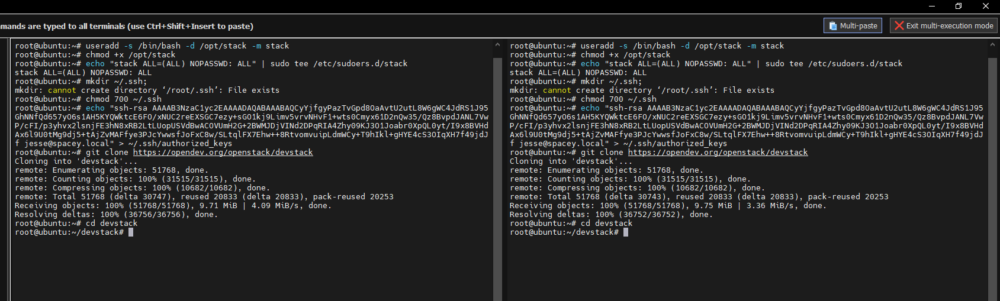
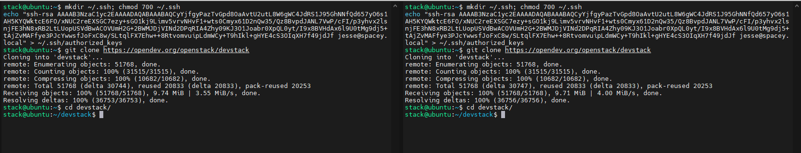
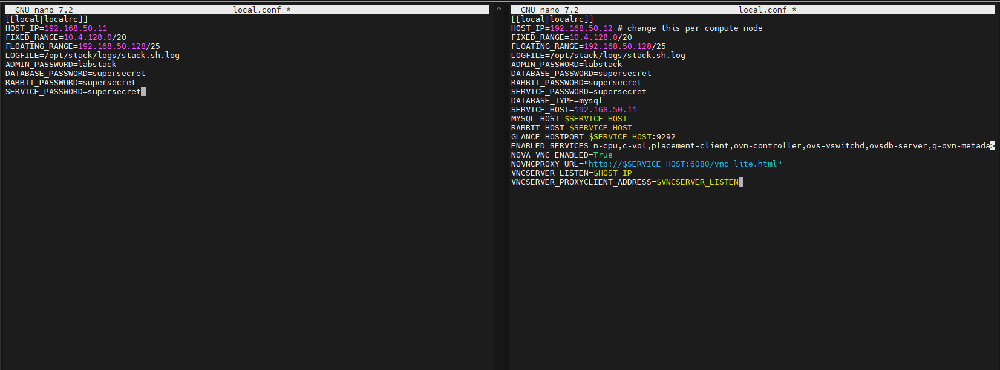
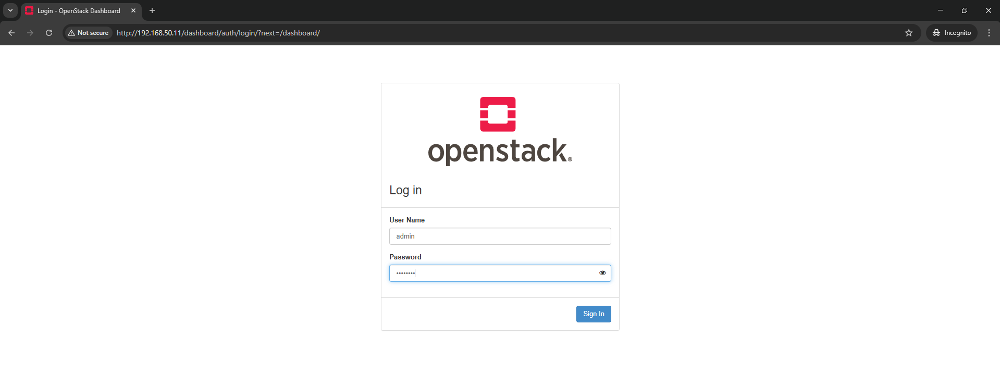
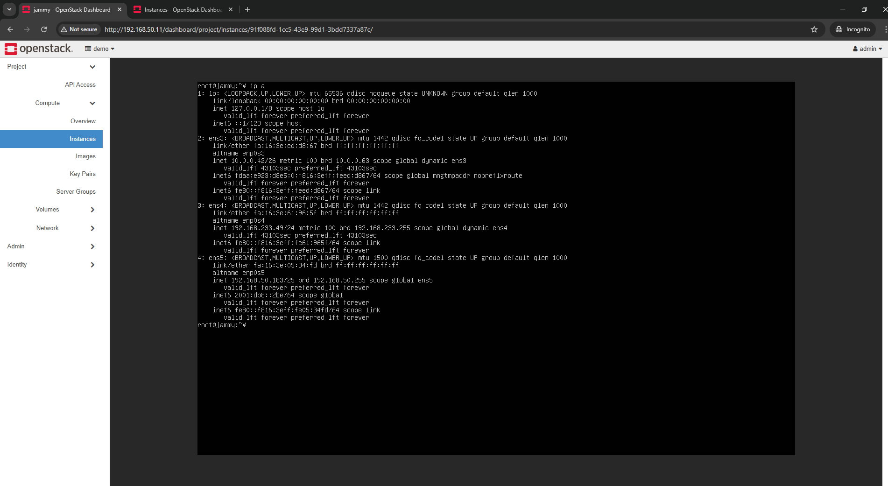

#  Triển khai OpenStack DevStack Multi-Node

##  Mô hình kiến trúc

- **Controller Node**: Chạy các dịch vụ chính như Keystone, Glance, Nova API, Neutron server, Horizon...
- **Compute Node**: Chạy dịch vụ Nova compute và Neutron agent để xử lý máy ảo


## Chuẩn bị máy ảo hoặc máy vật lý

### Cấu hình đề xuất cho mỗi node:

| Thành phần   | RAM     | CPU | Disk  | OS               |IP			| 
|--------------|---------|-----|-------|------------------|-------------|
| Controller   | ≥ 8 GB  | 2   | 50 GB | Ubuntu 22.04 LTS |192.168.50.11|     
| Compute Node | ≥ 6 GB  | 2   | 50 GB | Ubuntu 22.04 LTS |192.168.50.12|


## Tạo user `stack` và cài đặt gói cần thiết

Chạy trên cả hai node:

```bash
sudo useradd -s /bin/bash -d /opt/stack -m stack
echo "stack ALL=(ALL) NOPASSWD: ALL" | sudo tee /etc/sudoers.d/stack
sudo apt update && sudo apt upgrade -y
sudo apt install -y git vim net-tools curl
```
-  

## Cấu hình Devstack 
- Cấu hình ssh key trên 2 node dưới user `stack`:

```bash
sudo su - stack
ssh-keygen -t rsa -N "" -f ~/.ssh/id_rsa
ssh-copy-id stack@<IP_compute_node>
```
- Kiểm tra:
```bash
ssh stack@<IP_compute_node>
```


- Clone devstack 

Trên cả hai node (dưới user `stack`):

```bash
git clone https://opendev.org/openstack/devstack
cd devstack
```
-  

## Cấu hình `local.conf`

### Trên Controller Node:

Tạo file `/opt/stack/devstack/local.conf`:

```ini
[[local|localrc]]
HOST_IP=<IP_controller>
MULTI_HOST=1
LOGFILE=/opt/stack/logs/stack.sh.log
ADMIN_PASSWORD=secret
DATABASE_PASSWORD=$ADMIN_PASSWORD
RABBIT_PASSWORD=$ADMIN_PASSWORD
SERVICE_PASSWORD=$ADMIN_PASSWORD
SERVICE_TOKEN=$ADMIN_PASSWORD
enable_service rabbit mysql key
enable_service n-api n-crt n-obj n-sch n-cond
enable_service g-api g-reg
enable_service horizon
enable_service neutron q-svc q-agt q-dhcp q-l3 q-meta
disable_service n-net
```

### Trên Compute Node:

Tạo file `/opt/stack/devstack/local.conf`:

```ini
[[local|localrc]]
HOST_IP=<IP_compute>
MULTI_HOST=1
SERVICE_HOST=<IP_controller>
LOGFILE=/opt/stack/logs/stack.sh.log
ADMIN_PASSWORD=secret
DATABASE_PASSWORD=$ADMIN_PASSWORD
RABBIT_PASSWORD=$ADMIN_PASSWORD
SERVICE_PASSWORD=$ADMIN_PASSWORD
enable_service n-cpu
enable_service neutron q-agt
disable_service n-net
```

-  
## Chạy DevStack

### Trên Controller:
```bash
cd /opt/stack/devstack
./stack.sh
```
- Sau khi hoàn tất, thu được URL Horizon và thông tin đăng nhập.
### Trên Compute:
- Sau khi controller hoàn tất, chạy:
```bash
cd /opt/stack/devstack
./stack.sh
```

## Kiểm tra
- Đăng nhập
-  
- Tạo Instance 
-  

