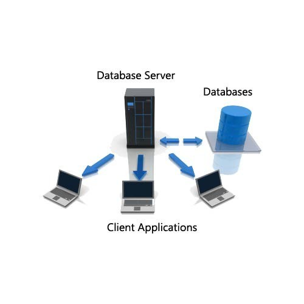

# Database Server
## 1. Kiến Trúc Cơ Bản
### 1.1 Mô hình client-server trong hệ thống database
- Database Server - Máy chủ cơ sở dữ liệu cung cấp các dịch vụ liên quan đến cơ sở dữ liệu cho client và vận hành hệ quản trị cơ sở dữ liệu (DBMS).
- Máy chủ xử lý các yêu cầu từ client và kiểm soát quyền truy cập cũng như truy xuất dữ liệu. Một máy tính chạy phần mềm cơ sở dữ liệu với mục đích cung cấp dịch vụ cơ sở dữ liệu được gọi là máy chủ cơ sở dữ liệu. 
- Chúng có thể hoạt động với nhiều cơ sở dữ liệu, đôi khi với sự hỗ trợ từ máy chủ web và máy chủ ứng dụng. 
- Chúng vận hành bằng cách lưu trữ hệ quản trị cơ sở dữ liệu (Database Management System - DBMS) cùng với các đơn vị bộ nhớ và lưu trữ. 
- Hầu hết các máy chủ cơ sở dữ liệu sử dụng mô hình client-server, trong đó chúng nhận các truy vấn từ client - thiết bị khách và user - người dùng tương ứng trước khi cung cấp phản hồi được yêu cầu. 
- Các ứng dụng khách sử dụng hệ quản trị cơ sở dữ liệu (DBMS) để truy cập dữ liệu số của họ thông qua máy chủ cơ sở dữ liệu. 
- Sau khi nhận được một lệnh cụ thể từ ứng dụng khách của máy chủ cơ sở dữ liệu, DBMS sẽ thực hiện hành động mà ứng dụng khách yêu cầu. 
- Các lệnh gửi từ client đến máy chủ cơ sở dữ liệu bao gồm thay đổi quyền truy cập, tải lên dữ liệu mới, truy xuất dữ liệu từ máy chủ hoặc chỉnh sửa dữ liệu đã lưu trữ.
- Các bước quan trọng trong quá trình một máy chủ cơ sở dữ liệu hoạt động.
	- **Lưu trữ:** Dữ liệu được tổ chức và lưu trữ trong máy chủ cơ sở dữ liệu theo mô hình đã chọn (relational, NoSQL, v.v.).
	- **Yêu cầu của client:** Một ứng dụng client như trình duyệt web, ứng dụng di động hoặc chương trình phần mềm khác gửi yêu cầu đến máy chủ cơ sở dữ liệu. Yêu cầu này có thể là truy vấn để lấy dữ liệu, lệnh để sửa đổi dữ liệu (chèn, cập nhật, xóa) hoặc nhiệm vụ quản trị.
	- **Thiết lập kết nối:** Máy chủ cơ sở dữ liệu thiết lập kết nối với ứng dụng client, bao gồm xác thực và ủy quyền để đảm bảo client có quyền truy cập cần thiết vào cơ sở dữ liệu.
	- **Phân tích và tối ưu hóa truy vấn:** Máy chủ cơ sở dữ liệu nhận yêu cầu từ client, phân tích để hiểu mục đích và tạo kế hoạch thực thi tối ưu nhằm truy xuất hoặc thao tác dữ liệu hiệu quả nhất dựa trên các chỉ mục có sẵn, phân bố dữ liệu và các yếu tố khác.
	- **Truy xuất hoặc thao tác dữ liệu:** Máy chủ cơ sở dữ liệu thực hiện kế hoạch truy vấn tối ưu. Điều này có thể bao gồm đọc dữ liệu từ ổ đĩa, thực hiện tính toán hoặc áp dụng bộ lọc theo tiêu chí truy vấn. Khi dữ liệu được chỉnh sửa, máy chủ cập nhật cơ sở dữ liệu để duy trì tính nhất quán và toàn vẹn của dữ liệu.
	- **Truyền kết quả:** Sau khi hoàn thành thao tác, máy chủ cơ sở dữ liệu gửi kết quả trở lại ứng dụng client dưới dạng bảng, dòng dữ liệu hoặc các giá trị riêng lẻ.
	- **Đóng kết nối:** Sau khi client nhận được kết quả, kết nối giữa client và server có thể bị đóng hoặc duy trì để xử lý các yêu cầu tiếp theo.

- Database server có nhiều loại khác nhau, mỗi loại phù hợp với các nhu cầu và yêu cầu cụ thể của doanh nghiệp hoặc tổ chức. Dưới đây là các loại phổ biến:
	- Relational Database Server: Relational sử dụng mô hình dữ liệu quan hệ, trong đó dữ liệu được tổ chức thành các bảng với các hàng (bản ghi) và cột (trường). 
		- Các hệ quản trị cơ sở dữ liệu phổ biến trong nhóm này bao gồm MySQL, PostgreSQL, Microsoft SQL Server và Oracle Database.
		- Ưu điểm của Relational Database Server là hỗ trợ SQL (Structured Query Language) để truy vấn và quản lý dữ liệu, dễ dàng thiết lập và bảo trì, và cung cấp một hệ thống mạnh mẽ và đáng tin cậy. Đây là loại cơ sở dữ liệu được sử dụng rộng rãi nhất trong các ứng dụng doanh nghiệp và web.
	- NoSQL
		- NoSQL không sử dụng mô hình dữ liệu quan hệ mà thay vào đó hỗ trợ các cấu trúc dữ liệu linh hoạt như tài liệu, cặp khóa-giá trị, đồ thị và cột. 
		- Các hệ quản trị cơ sở dữ liệu NoSQL nổi bật bao gồm MongoDB, Cassandra, Couchbase và Redis.
		- Ưu điểm của NoSQL Server là khả năng mở rộng linh hoạt, hiệu suất cao, và khả năng xử lý dữ liệu phi cấu trúc hoặc bán cấu trúc, làm cho nó phù hợp cho các ứng dụng yêu cầu khả năng mở rộng cao và tính linh hoạt trong cấu trúc dữ liệu, cũng như các ứng dụng xử lý dữ liệu lớn (Big Data).

### 1.2 Các thành phần cơ bản của database server
- Database Server hoạt động dựa trên mô hình Client – Server nên gồm 2 thành phần chính: Client và Server 
	- Ứng dụng máy khách (Client)
		- Phần này thường là một ứng dụng được cài đặt trên máy tính của người dùng, có nhiệm vụ giao tiếp với máy chủ cơ sở dữ liệu. Các thành phần chính của phần client bao gồm:
		- Ứng dụng khách (Client Application): Đây là các ứng dụng hoặc phần mềm mà người dùng cuối sử dụng để truy cập và tương tác với cơ sở dữ liệu. Các ứng dụng này gửi yêu cầu tới máy chủ cơ sở dữ liệu để truy xuất, thêm, sửa hoặc xóa dữ liệu.
		- Giao diện người dùng (User Interface): Giao diện giúp người dùng nhập, chỉnh sửa, và xem dữ liệu. Nó có thể là một ứng dụng desktop, ứng dụng web, hoặc ứng dụng di động.
		- Driver kết nối (Database Driver): Các driver hoặc thư viện phần mềm giúp kết nối ứng dụng khách với máy chủ cơ sở dữ liệu, chẳng hạn như ODBC, JDBC, hoặc các API chuyên dụng khác.
	- Ứng dụng máy chủ (Server)
		- Phần này là “trái tim” của hệ thống, chịu trách nhiệm lưu trữ, quản lý và xử lý dữ liệu. Các thành phần chính của phần server bao gồm:
		- Hệ quản trị cơ sở dữ liệu (Database Management System – DBMS): Đây là phần mềm chính quản lý cơ sở dữ liệu, bao gồm việc lưu trữ, truy xuất, cập nhật và quản lý dữ liệu. Các DBMS phổ biến gồm MySQL, PostgreSQL, Microsoft SQL Server và Oracle Database.
		- Cơ sở dữ liệu (Database): Tập hợp các bảng, chỉ mục, và các đối tượng dữ liệu khác được lưu trữ và quản lý bởi DBMS. Cơ sở dữ liệu chứa thông tin thực tế mà các ứng dụng và người dùng tương tác.
		- Máy chủ (Server Hardware): Phần cứng thực tế mà DBMS chạy trên đó, bao gồm CPU, RAM, ổ cứng và các thành phần mạng. Phần cứng này cần đủ mạnh để xử lý các yêu cầu và duy trì hiệu suất cao.
		- Hệ điều hành (Operating System): Phần mềm hệ thống quản lý tài nguyên phần cứng và cung cấp các dịch vụ cơ bản cho DBMS và các ứng dụng khác chạy trên máy chủ. Các hệ điều hành phổ biến cho máy chủ cơ sở dữ liệu gồm Windows Server, Linux và UNIX.
		- Công cụ bảo mật (Security Tools): Các biện pháp bảo mật như tường lửa, hệ thống phát hiện xâm nhập (IDS), và mã hóa dữ liệu để bảo vệ cơ sở dữ liệu khỏi truy cập trái phép và các mối đe dọa bảo mật.
		- Công cụ sao lưu và khôi phục (Backup and Recovery Tools): Các công cụ và quy trình để sao lưu dữ liệu định kỳ và khôi phục dữ liệu trong trường hợp mất mát hoặc hỏng hóc.
		
### 1.3 Sự khác biệt giữa database và database server
- Cả Database và Database Server đều liên quan đến việc lưu trữ và quản lý dữ liệu, nhưng chúng có những vai trò và chức năng khác nhau.
#### 1.3.1 Database (Cơ sở dữ liệu)
- Database là tập hợp có tổ chức của dữ liệu, được lưu trữ theo một cấu trúc nhất định để dễ dàng truy xuất, cập nhật và quản lý.
	- Chỉ là dữ liệu: Database chỉ đơn thuần chứa dữ liệu, nhưng không có khả năng xử lý hoặc cung cấp dịch vụ.
	- Cấu trúc tổ chức: Dữ liệu trong database được lưu trữ dưới dạng bảng (tables), hàng (rows), cột (columns), hoặc theo mô hình khác như NoSQL.
	- Không có khả năng tự vận hành: Một database không thể hoạt động độc lập mà cần có hệ quản trị cơ sở dữ liệu (DBMS) để thực hiện các thao tác truy vấn, chỉnh sửa, hoặc bảo vệ dữ liệu.
	- Ví dụ: MySQL Database, PostgreSQL Database, Oracle Database.
#### 1.3.2 Database Server (Máy chủ cơ sở dữ liệu)
- Database Server là một hệ thống bao gồm phần cứng và phần mềm, được thiết kế để quản lý, xử lý và cung cấp quyền truy cập dữ liệu từ database.
	- Bao gồm cả phần cứng và phần mềm: Máy chủ không chỉ chứa dữ liệu mà còn có các công cụ xử lý để quản lý và phục vụ các truy vấn.
	- Cung cấp dịch vụ: Database Server nhận các yêu cầu truy vấn từ client và xử lý chúng thông qua hệ quản trị cơ sở dữ liệu (DBMS).
	- Tích hợp bảo mật và hiệu suất: Máy chủ thường đi kèm với các cơ chế bảo mật (xác thực người dùng, kiểm soát truy cập, mã hóa dữ liệu) và tối ưu hóa hiệu suất để phục vụ nhiều người dùng cùng lúc.
	- Ví dụ: Một server chạy Microsoft SQL Server, MySQL Server, hoặc Oracle Database Server.
#### 1.3.3 So sánh 

| Yếu tố            | Database (Cơ sở dữ liệu)        | Database Server (Máy chủ cơ sở dữ liệu)       |
| ----------------- | ------------------------------- | --------------------------------------------- |
| Bản chất          | Tập hợp dữ liệu có tổ chức      | Hệ thống phần cứng + phần mềm quản lý dữ liệu |
| Chức năng         | Chỉ lưu trữ dữ liệu             | Quản lý, xử lý, cung cấp truy cập đến dữ liệu |
| Khả năng vận hành | Không thể tự hoạt động          | Có thể xử lý truy vấn, bảo vệ dữ liệu         |
| Mức độ phức tạp   | Đơn giản (chỉ là dữ liệu)       | Phức tạp hơn (gồm cả phần mềm và phần cứng)   |
| Ví dụ             | MySQL Database, Oracle Database | SQL Server, MySQL Server, PostgreSQL Server   |

### 1.4 Các loại database server phổ biến (RDBMS, NoSQL, NewSQL)
#### 1.4.1 Relational Database Management System - RDBMS 
- Là máy chủ cơ sở dữ liệu sử dụng mô hình dữ liệu quan hệ RDBMS 
- Trong RDBMS, dữ liệu được biểu diễn bởi các hàng. Relational Database là cơ sở dữ liệu được sử dụng phổ biến nhất. Nó chứa các bảng và mỗi bảng có Primary Key riêng.Giá trị của mỗi bảng có mối quan hệ với các bảng khác giúp khả năng xử lý lượng dữ liệu lớn và thực hiện truy vấn dễ dàng.
- Các khái niệm cơ bản: 
	- Bảng - Tables: Dữ liệu trong RDBMS được lưu trữ trong các đối tượng cơ sở dữ liệu được gọi là các bảng - là một bộ sưu tập các mục dữ liệu có quan hệ và nó bao gồm nhiều cột và hàng.
	- Trường - Field: Mọi bảng đều có thể chia thành những mục nhỏ hơn gọi là trường (field). Trường là một cột trong bảng, được thiết kế để duy trì thông tin cụ thể về mọi bản ghi (record) trong bảng.
	- Bản ghi - Record: Một bản ghi thường được gọi là hàng dữ liệu, là từng mục riêng lẻ tồn tại trong bảng.
	- Cột - Column: Cột là một thực thể nằm dọc trong bảng, chứa tất cả các thông tin liên kết với một trường trong bảng.
	- Ràng buộc - Constraint: là các quy tắc được áp dụng trên các cột dữ liệu của một bảng.
	
	| Ràng buộc   | Ý nghĩa                                                                                                                                                          |
	| ----------- | ---------------------------------------------------------------------------------------------------------------------------------------------------------------- |
	| NOT NULL    | Đảm bảo giá trị của cột không được nhận giá trị NULL.                                                                                                            |
	| DEFAULT     | Cung cấp một giá trị mặc định khi dữ liệu của một cột NULL.                                                                                                      |
	| UNIQUE      | Đảm bảo rằng dữ liệu của cột là duy nhất, tất cả các giá trị trong một cột là khác nhau không trùng lặp.                                                         |
	| PRIMARY KEY | Thiết lập khóa chính trên bảng, giá trị của cột làm khóa chính phải là duy nhất, không được trùng lặp. Việc khai báo khóa chính yêu cầu các cột phải NOT NULL.   |
	| FOREIGN KEY | Thiết lập khóa ngoại trên bảng, tham chiếu đến bảng khác thông qua giá trị của cột được liên kết. Giá trị của cột được liên kết phải là duy nhất trong bảng kia. |
	| CHECK       | Đảm bảo tất cả các giá trị trong một cột thỏa mãn một số điều kiện.                                                                                              |
	| INDEX       | Dùng để tạo và lấy dữ liệu từ cơ sở dữ liệu một cách nhanh chóng.                                                                                                |

- Các tính năng của RDBMS (Hệ quản trị cơ sở dữ liệu quan hệ)
	- Dữ liệu phải được lưu trữ dưới dạng bảng trong tệp cơ sở dữ liệu, tức là được tổ chức theo hàng và cột.
	- Mỗi hàng của bảng được gọi là một bản ghi (record) hoặc một bộ (tuple). Tập hợp các bản ghi này được gọi là độ lớn (cardinality) của bảng.
	- Mỗi cột trong bảng được gọi là thuộc tính (attribute) hoặc trường (field). Tập hợp các cột này được gọi là bậc (arity) của bảng.
	- Không có hai bản ghi nào trong bảng giống hệt nhau. Điều này giúp tránh trùng lặp dữ liệu bằng cách sử dụng khóa ứng viên (Candidate Key), là tập hợp tối thiểu các thuộc tính cần thiết để xác định từng bản ghi một cách duy nhất.
	- Các bảng trong cơ sở dữ liệu có quan hệ với nhau thông qua khóa ngoại (Foreign Key). Điều này đảm bảo tính toàn vẹn tham chiếu giữa các bảng.
	- Bảng cơ sở dữ liệu cũng cho phép giá trị NULL. Nếu một phần tử trong bảng không được điền hoặc bị thiếu, nó sẽ có giá trị NULL, không tương đương với số 0.
	- Khóa chính (Primary Key) không được có giá trị NULL. Đây là điều bắt buộc để đảm bảo mỗi bản ghi có thể được xác định duy nhất.
- Một số ứng dụng phổ biến của RDBMS:
	- Hệ thống doanh nghiệp: Các ứng dụng kinh doanh sử dụng RDBMS để lưu trữ, quản lý và xử lý dữ liệu giao dịch.
	- Thương mại điện tử: Hỗ trợ quản lý kho hàng, đơn đặt hàng, giao dịch và dữ liệu khách hàng.
	- Y tế: Được sử dụng trong quản lý hồ sơ bệnh án, kết quả xét nghiệm và hệ thống hồ sơ sức khỏe điện tử.
	- Giáo dục: Hỗ trợ quản lý dữ liệu sinh viên và hồ sơ học tập.
- Có nhiều loại hệ quản trị cơ sở dữ liệu (DBMS), bao gồm các tùy chọn khác nhau cho RDBMS. Một số ví dụ về các hệ thống RDBMS phổ biến gồm:
	- Oracle Database: Hệ thống RDBMS do Oracle phát triển và cung cấp, nổi bật với bộ tính năng đa dạng, khả năng mở rộng và bảo mật cao.
	- MySQL: Hệ thống RDBMS mã nguồn mở được sử dụng rộng rãi, nổi bật về tốc độ, độ tin cậy và tính dễ sử dụng.
	- Azure SQL: Hệ thống RDBMS trên nền tảng đám mây do Microsoft cung cấp, phù hợp với các ứng dụng cơ sở dữ liệu nhỏ.
	- SQL Server: Hệ thống RDBMS do Microsoft phát triển, phức tạp hơn Azure SQL và cung cấp khả năng kiểm soát toàn diện.
	- IBM Db2: Hệ thống RDBMS do IBM cung cấp, hỗ trợ cả cấu trúc cơ sở dữ liệu quan hệ và phi quan hệ như JSON và XML.
- DBMS mang lại nhiều lợi ích cho doanh nghiệp nhờ vào cách tổ chức dữ liệu có hệ thống, giúp doanh nghiệp hiểu và xử lý thông tin tốt hơn, đồng thời cải thiện quá trình ra quyết định. Sử dụng bảng để lưu trữ dữ liệu giúp tăng cường bảo mật, cho phép người dùng tùy chỉnh quyền truy cập và giới hạn nội dung được hiển thị.
	- Tính linh hoạt: Việc cập nhật dữ liệu trở nên hiệu quả hơn vì chỉ cần thay đổi tại một vị trí duy nhất.
	- Bảo trì dễ dàng: Quản trị viên có thể quản lý, kiểm soát và cập nhật dữ liệu dễ dàng. Việc sao lưu cũng thuận lợi nhờ các công cụ tự động tích hợp.
	- Cấu trúc dữ liệu tổ chức tốt: Định dạng bảng dễ hiểu, có tổ chức, hỗ trợ truy vấn nhanh chóng.
	- Đảm bảo tính toàn vẹn dữ liệu: Hỗ trợ thuộc tính ACID giúp dữ liệu ổn định, cô lập và bền vững.
	- Bảo mật cao: Có các tính năng bảo mật như mã hóa dữ liệu, kiểm soát truy cập và xác thực người dùng.
	- Khả năng mở rộng: Hỗ trợ phân phối dữ liệu trên nhiều máy chủ.
- Nhược điểm của Hệ Quản Trị Cơ Sở Dữ Liệu Quan Hệ (RDBMS)
	- Chi phí triển khai: Cần phần mềm chuyên dụng, làm tăng chi phí vận hành.
	- Quá trình thiết lập phức tạp: Yêu cầu nhập lượng lớn dữ liệu vào bảng, cần lập trình viên hoặc đội nhập liệu.
	- Giới hạn ký tự: Một số trường dữ liệu có giới hạn số lượng ký tự.
	- Hạn chế trong xử lý dữ liệu phức tạp: Gặp khó khăn với số phức, hình ảnh, thiết kế.
	- Cơ sở dữ liệu riêng biệt: Việc tạo các cơ sở dữ liệu độc lập đòi hỏi tách dữ liệu lớn, làm phức tạp quá trình kết nối.

#### 1.4.2 NoSQL 
#### 1.4.3 New SQL 
#### 1.4.4 Các loại khác 
- In-Memory Database Server
- In-Memory Database Server lưu trữ dữ liệu trong bộ nhớ (RAM) thay vì trên ổ cứng, cho phép truy xuất và xử lý dữ liệu với tốc độ rất cao. 
- Các hệ quản trị cơ sở dữ liệu in-memory tiêu biểu là Redis, Memcached và SAP HANA. 
- Ưu điểm chính của In-Memory là tốc độ truy cập và xử lý dữ liệu nhanh chóng, phù hợp cho các ứng dụng yêu cầu hiệu suất cao và độ trễ thấp, chẳng hạn như các hệ thống giao dịch tài chính, ứng dụng thời gian thực và phân tích dữ liệu.
- Columnar
- Columnar Database Server lưu trữ dữ liệu theo cột thay vì theo hàng, tối ưu hóa cho các truy vấn phân tích và xử lý dữ liệu lớn. 
- Các hệ quản trị cơ sở dữ liệu dạng cột phổ biến bao gồm Apache Cassandra, HBase và Amazon Redshift. 
- Ưu điểm của Columnar là hiệu suất cao trong các truy vấn phân tích, giảm thời gian truy vấn cho dữ liệu lớn, và khả năng tối ưu hóa cho các kho dữ liệu (data warehouse). Điều này làm cho nó trở thành lựa chọn lý tưởng cho các ứng dụng phân tích dữ liệu và báo cáo.
- Object-Oriented Database Server
- Object-Oriented Database Server lưu trữ dữ liệu dưới dạng các đối tượng, phù hợp cho các ứng dụng lập trình hướng đối tượng. 
- Các hệ quản trị cơ sở dữ liệu hướng đối tượng bao gồm ObjectDB, db4o và Versant Object Database. 
- Ưu điểm của Object-Oriented là hỗ trợ trực tiếp cho các mô hình dữ liệu phức tạp và dễ dàng tích hợp với các ngôn ngữ lập trình hướng đối tượng. Điều này làm cho nó trở nên lý tưởng cho các ứng dụng yêu cầu xử lý dữ liệu phức tạp và có tính cấu trúc cao.
- Graph Database Server
- Máy chủ cơ sở dữ liệu Graph sử dụng mô hình đồ thị để lưu trữ và quản lý dữ liệu, phù hợp cho các ứng dụng yêu cầu mô hình hóa mối quan hệ phức tạp giữa các dữ liệu. 
- Các hệ quản trị cơ sở dữ liệu đồ thị nổi bật bao gồm Neo4j, OrientDB và ArangoDB. 
- Ưu điểm của Graphlà hiệu suất cao cho các truy vấn liên quan đến mối quan hệ, dễ dàng mô hình hóa các quan hệ phức tạp và liên kết. Nó thường được sử dụng trong các ứng dụng như mạng xã hội, hệ thống khuyến nghị và phân tích mối quan hệ.
- Distributed Database Server
- Distributed là loại cơ sở dữ liệu mà dữ liệu được phân tán trên nhiều máy chủ khác nhau, cung cấp khả năng mở rộng và khả dụng cao. 
- Các hệ quản trị cơ sở dữ liệu phân tán tiêu biểu bao gồm Apache Cassandra, Google Spanner và CockroachDB. 
- Ưu điểm của Distributed Database Server là khả năng mở rộng ngang, độ khả dụng và tính tin cậy cao, và khả năng phân phối tải và dữ liệu một cách hiệu quả. Điều này làm cho nó phù hợp cho các ứng dụng yêu cầu xử lý dữ liệu lớn và yêu cầu khả năng chịu lỗi cao.

II. Hệ Quản Trị Cơ Sở Dữ Liệu (DBMS)
Các hệ quản trị phổ biến
MySQL/MariaDB
Microsoft SQL Server
Oracle Database
PostgreSQL
MongoDB (NoSQL)
Redis
So sánh ưu nhược điểm từng hệ thống
Tiêu chí lựa chọn DBMS phù hợp
III. Cài Đặt và Cấu Hình
Yêu cầu hệ thống phần cứng
Quy trình cài đặt cơ bản
Cấu hình tối ưu hiệu năng
Cấu hình bảo mật cơ bản
IV. Quản Trị Database Server
User và quản lý quyền truy cập
Sao lưu và phục hồi (Backup & Recovery)
Theo dõi hiệu năng (Monitoring)
Tối ưu hóa truy vấn (Query Optimization)
Quản lý transaction và lock
V. Bảo Mật Database Server
Các mối đe dọa bảo mật phổ biến
Mã hóa dữ liệu (Encryption)
Audit và theo dõi truy cập
Patch management và cập nhật bảo mật
VI. High Availability và Scalability
Replication (đồng bộ hóa)
Cluster và Failover
Sharding (phân mảnh dữ liệu)
Load balancing cho database
VII. Tích Hệ và Kết Nối
Các giao thức kết nối database
ODBC/JDBC và các chuẩn kết nối
API và dịch vụ web cho database
ETL (Extract, Transform, Load)
VIII. Giám Sát và Khắc Phục Sự Cố
Các công cụ giám sát database
Nhận diện và xử lý bottleneck
Xử lý deadlock và các vấn đề đồng thời
Log và phân tích lỗi
IX. Xu Hướng và Công Nghệ Mới
Database as a Service (DBaaS)
In-memory database
Blockchain database
AI và Machine Learning trong quản trị database
X. Practice
- Các bài thực hành về database server: từ cài đặt, cấu hình, sử dụng (backup/restore, import/export), tunning.
- Xu hướng HA, cluster của:
Mysql/MariaDB, MSSQL, MongoDB, PostgreSQL, Redis
- So sánh