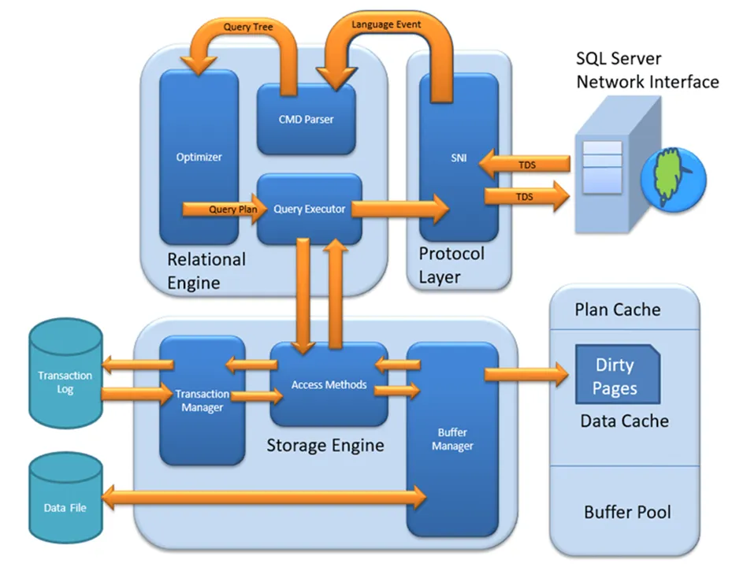
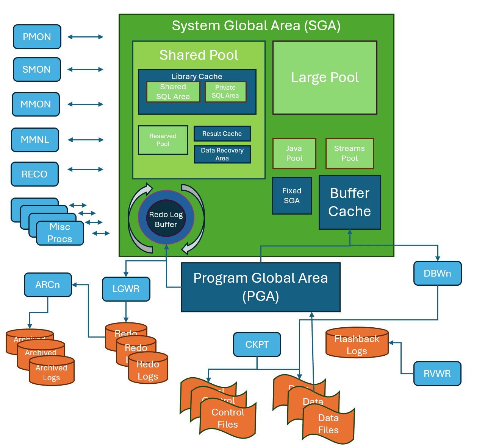

# Database Server
## 1. Kiến Trúc Cơ Bản 
### 1.1 Mô hình client-server trong hệ thống database 
- Database Server - Máy chủ cơ sở dữ liệu cung cấp các dịch vụ liên quan đến cơ sở dữ liệu cho client và vận hành hệ quản trị cơ sở dữ liệu (DBMS).
- Máy chủ xử lý các yêu cầu từ client và kiểm soát quyền truy cập cũng như truy xuất dữ liệu. Một máy tính chạy phần mềm cơ sở dữ liệu với mục đích cung cấp dịch vụ cơ sở dữ liệu được gọi là máy chủ cơ sở dữ liệu. 
- Chúng có thể hoạt động với nhiều cơ sở dữ liệu, đôi khi với sự hỗ trợ từ máy chủ web và máy chủ ứng dụng. 
- Chúng vận hành bằng cách lưu trữ hệ quản trị cơ sở dữ liệu (Database Management System - DBMS) cùng với các đơn vị bộ nhớ và lưu trữ. 
- Hầu hết các máy chủ cơ sở dữ liệu sử dụng mô hình client-server, trong đó chúng nhận các truy vấn từ client - thiết bị khách và user - người dùng tương ứng trước khi cung cấp phản hồi được yêu cầu. 
- Các ứng dụng khách sử dụng hệ quản trị cơ sở dữ liệu (DBMS) để truy cập dữ liệu số của họ thông qua máy chủ cơ sở dữ liệu. 
- Sau khi nhận được một lệnh cụ thể từ ứng dụng khách của máy chủ cơ sở dữ liệu, DBMS sẽ thực hiện hành động mà ứng dụng khách yêu cầu. 
- Các lệnh gửi từ client đến máy chủ cơ sở dữ liệu bao gồm thay đổi quyền truy cập, tải lên dữ liệu mới, truy xuất dữ liệu từ máy chủ hoặc chỉnh sửa dữ liệu đã lưu trữ.
- Các bước quan trọng trong quá trình một máy chủ cơ sở dữ liệu hoạt động.
	- Lưu trữ: Dữ liệu được tổ chức và lưu trữ trong máy chủ cơ sở dữ liệu theo mô hình đã chọn (relational, NoSQL, v.v.).
	- Yêu cầu của client: Một ứng dụng client như trình duyệt web, ứng dụng di động hoặc chương trình phần mềm khác gửi yêu cầu đến máy chủ cơ sở dữ liệu. Yêu cầu này có thể là truy vấn để lấy dữ liệu, lệnh để sửa đổi dữ liệu (chèn, cập nhật, xóa) hoặc nhiệm vụ quản trị.
	- Thiết lập kết nối: Máy chủ cơ sở dữ liệu thiết lập kết nối với ứng dụng client, bao gồm xác thực và ủy quyền để đảm bảo client có quyền truy cập cần thiết vào cơ sở dữ liệu.
	- Phân tích và tối ưu hóa truy vấn: Máy chủ cơ sở dữ liệu nhận yêu cầu từ client, phân tích để hiểu mục đích và tạo kế hoạch thực thi tối ưu nhằm truy xuất hoặc thao tác dữ liệu hiệu quả nhất dựa trên các chỉ mục có sẵn, phân bố dữ liệu và các yếu tố khác.
	- Truy xuất hoặc thao tác dữ liệu: Máy chủ cơ sở dữ liệu thực hiện kế hoạch truy vấn tối ưu. Điều này có thể bao gồm đọc dữ liệu từ ổ đĩa, thực hiện tính toán hoặc áp dụng bộ lọc theo tiêu chí truy vấn. Khi dữ liệu được chỉnh sửa, máy chủ cập nhật cơ sở dữ liệu để duy trì tính nhất quán và toàn vẹn của dữ liệu.
	- Truyền kết quả: Sau khi hoàn thành thao tác, máy chủ cơ sở dữ liệu gửi kết quả trở lại ứng dụng client dưới dạng bảng, dòng dữ liệu hoặc các giá trị riêng lẻ.
	- Đóng kết nối: Sau khi client nhận được kết quả, kết nối giữa client và server có thể bị đóng hoặc duy trì để xử lý các yêu cầu tiếp theo.

- Database server có nhiều loại khác nhau, mỗi loại phù hợp với các nhu cầu và yêu cầu cụ thể của doanh nghiệp hoặc tổ chức. Dưới đây là các loại phổ biến:
	- Relational Database Server: Relational sử dụng mô hình dữ liệu quan hệ, trong đó dữ liệu được tổ chức thành các bảng với các hàng (bản ghi) và cột (trường). 
		- Các hệ quản trị cơ sở dữ liệu phổ biến trong nhóm này bao gồm MySQL, PostgreSQL, Microsoft SQL Server và Oracle Database.
		- Ưu điểm của Relational Database Server là hỗ trợ SQL (Structured Query Language) để truy vấn và quản lý dữ liệu, dễ dàng thiết lập và bảo trì, và cung cấp một hệ thống mạnh mẽ và đáng tin cậy. Đây là loại cơ sở dữ liệu được sử dụng rộng rãi nhất trong các ứng dụng doanh nghiệp và web.
	- NoSQL
		- NoSQL không sử dụng mô hình dữ liệu quan hệ mà thay vào đó hỗ trợ các cấu trúc dữ liệu linh hoạt như tài liệu, cặp khóa-giá trị, đồ thị và cột. 
		- Các hệ quản trị cơ sở dữ liệu NoSQL nổi bật bao gồm MongoDB, Cassandra, Couchbase và Redis.
		- Ưu điểm của NoSQL Server là khả năng mở rộng linh hoạt, hiệu suất cao, và khả năng xử lý dữ liệu phi cấu trúc hoặc bán cấu trúc, làm cho nó phù hợp cho các ứng dụng yêu cầu khả năng mở rộng cao và tính linh hoạt trong cấu trúc dữ liệu, cũng như các ứng dụng xử lý dữ liệu lớn (Big Data).

### 1.2 Các thành phần cơ bản của database server
- Database Server hoạt động dựa trên mô hình Client – Server nên gồm 2 thành phần chính: Client và Server 
	- Ứng dụng máy khách (Client)
		- Phần này thường là một ứng dụng được cài đặt trên máy tính của người dùng, có nhiệm vụ giao tiếp với máy chủ cơ sở dữ liệu. Các thành phần chính của phần client bao gồm:
		- Ứng dụng khách (Client Application): Đây là các ứng dụng hoặc phần mềm mà người dùng cuối sử dụng để truy cập và tương tác với cơ sở dữ liệu. Các ứng dụng này gửi yêu cầu tới máy chủ cơ sở dữ liệu để truy xuất, thêm, sửa hoặc xóa dữ liệu.
		- Giao diện người dùng (User Interface): Giao diện giúp người dùng nhập, chỉnh sửa, và xem dữ liệu. Nó có thể là một ứng dụng desktop, ứng dụng web, hoặc ứng dụng di động.
		- Driver kết nối (Database Driver): Các driver hoặc thư viện phần mềm giúp kết nối ứng dụng khách với máy chủ cơ sở dữ liệu, chẳng hạn như ODBC, JDBC, hoặc các API chuyên dụng khác.
	- Ứng dụng máy chủ (Server)
		- Phần này là “trái tim” của hệ thống, chịu trách nhiệm lưu trữ, quản lý và xử lý dữ liệu. Các thành phần chính của phần server bao gồm:
		- Hệ quản trị cơ sở dữ liệu (Database Management System – DBMS): Đây là phần mềm chính quản lý cơ sở dữ liệu, bao gồm việc lưu trữ, truy xuất, cập nhật và quản lý dữ liệu. Các DBMS phổ biến gồm MySQL, PostgreSQL, Microsoft SQL Server và Oracle Database.
		- Cơ sở dữ liệu (Database): Tập hợp các bảng, chỉ mục, và các đối tượng dữ liệu khác được lưu trữ và quản lý bởi DBMS. Cơ sở dữ liệu chứa thông tin thực tế mà các ứng dụng và người dùng tương tác.
		- Máy chủ (Server Hardware): Phần cứng thực tế mà DBMS chạy trên đó, bao gồm CPU, RAM, ổ cứng và các thành phần mạng. Phần cứng này cần đủ mạnh để xử lý các yêu cầu và duy trì hiệu suất cao.
		- Hệ điều hành (Operating System): Phần mềm hệ thống quản lý tài nguyên phần cứng và cung cấp các dịch vụ cơ bản cho DBMS và các ứng dụng khác chạy trên máy chủ. Các hệ điều hành phổ biến cho máy chủ cơ sở dữ liệu gồm Windows Server, Linux và UNIX.
		- Công cụ bảo mật (Security Tools): Các biện pháp bảo mật như tường lửa, hệ thống phát hiện xâm nhập (IDS), và mã hóa dữ liệu để bảo vệ cơ sở dữ liệu khỏi truy cập trái phép và các mối đe dọa bảo mật.
		- Công cụ sao lưu và khôi phục (Backup and Recovery Tools): Các công cụ và quy trình để sao lưu dữ liệu định kỳ và khôi phục dữ liệu trong trường hợp mất mát hoặc hỏng hóc.
		
### 1.3 Sự khác biệt giữa database và database server
- Cả Database và Database Server đều liên quan đến việc lưu trữ và quản lý dữ liệu, nhưng chúng có những vai trò và chức năng khác nhau.
#### 1.3.1 Database (Cơ sở dữ liệu)
- Database là tập hợp có tổ chức của dữ liệu, được lưu trữ theo một cấu trúc nhất định để dễ dàng truy xuất, cập nhật và quản lý.
	- Chỉ là dữ liệu: Database chỉ đơn thuần chứa dữ liệu, nhưng không có khả năng xử lý hoặc cung cấp dịch vụ.
	- Cấu trúc tổ chức: Dữ liệu trong database được lưu trữ dưới dạng bảng (tables), hàng (rows), cột (columns), hoặc theo mô hình khác như NoSQL.
	- Không có khả năng tự vận hành: Một database không thể hoạt động độc lập mà cần có hệ quản trị cơ sở dữ liệu (DBMS) để thực hiện các thao tác truy vấn, chỉnh sửa, hoặc bảo vệ dữ liệu.
	- Ví dụ: MySQL Database, PostgreSQL Database, Oracle Database.
#### 1.3.2 Database Server (Máy chủ cơ sở dữ liệu)
- Database Server là một hệ thống bao gồm phần cứng và phần mềm, được thiết kế để quản lý, xử lý và cung cấp quyền truy cập dữ liệu từ database.
	- Bao gồm cả phần cứng và phần mềm: Máy chủ không chỉ chứa dữ liệu mà còn có các công cụ xử lý để quản lý và phục vụ các truy vấn.
	- Cung cấp dịch vụ: Database Server nhận các yêu cầu truy vấn từ client và xử lý chúng thông qua hệ quản trị cơ sở dữ liệu (DBMS).
	- Tích hợp bảo mật và hiệu suất: Máy chủ thường đi kèm với các cơ chế bảo mật (xác thực người dùng, kiểm soát truy cập, mã hóa dữ liệu) và tối ưu hóa hiệu suất để phục vụ nhiều người dùng cùng lúc.
	- Ví dụ: Một server chạy Microsoft SQL Server, MySQL Server, hoặc Oracle Database Server.
#### 1.3.3 So sánh 

| Yếu tố            | Database (Cơ sở dữ liệu)        | Database Server (Máy chủ cơ sở dữ liệu)       |
| ----------------- | ------------------------------- | --------------------------------------------- |
| Bản chất          | Tập hợp dữ liệu có tổ chức      | Hệ thống phần cứng + phần mềm quản lý dữ liệu |
| Chức năng         | Chỉ lưu trữ dữ liệu             | Quản lý, xử lý, cung cấp truy cập đến dữ liệu |
| Khả năng vận hành | Không thể tự hoạt động          | Có thể xử lý truy vấn, bảo vệ dữ liệu         |
| Mức độ phức tạp   | Đơn giản (chỉ là dữ liệu)       | Phức tạp hơn (gồm cả phần mềm và phần cứng)   |
| Ví dụ             | MySQL Database, Oracle Database | SQL Server, MySQL Server, PostgreSQL Server   |

### 1.4 Các loại database server phổ biến (RDBMS, NoSQL, NewSQL)
#### 1.4.1 Relational Database Management System - RDBMS   
- Là máy chủ cơ sở dữ liệu sử dụng mô hình dữ liệu quan hệ RDBMS 
- Trong RDBMS, dữ liệu được biểu diễn bởi các hàng. Relational Database là cơ sở dữ liệu được sử dụng phổ biến nhất. Nó chứa các bảng và mỗi bảng có Primary Key riêng.Giá trị của mỗi bảng có mối quan hệ với các bảng khác giúp khả năng xử lý lượng dữ liệu lớn và thực hiện truy vấn dễ dàng.
- Các khái niệm cơ bản: 
	- Bảng - Tables: Dữ liệu trong RDBMS được lưu trữ trong các đối tượng cơ sở dữ liệu được gọi là các bảng - là một bộ sưu tập các mục dữ liệu có quan hệ và nó bao gồm nhiều cột và hàng.
	- Trường - Field: Mọi bảng đều có thể chia thành những mục nhỏ hơn gọi là trường (field). Trường là một cột trong bảng, được thiết kế để duy trì thông tin cụ thể về mọi bản ghi (record) trong bảng.
	- Bản ghi - Record: Một bản ghi thường được gọi là hàng dữ liệu, là từng mục riêng lẻ tồn tại trong bảng.
	- Cột - Column: Cột là một thực thể nằm dọc trong bảng, chứa tất cả các thông tin liên kết với một trường trong bảng.
	- Ràng buộc - Constraint: là các quy tắc được áp dụng trên các cột dữ liệu của một bảng.
	
	| Ràng buộc   | Ý nghĩa                                                                                                                                                          |
	| ----------- | ---------------------------------------------------------------------------------------------------------------------------------------------------------------- |
	| NOT NULL    | Đảm bảo giá trị của cột không được nhận giá trị NULL.                                                                                                            |
	| DEFAULT     | Cung cấp một giá trị mặc định khi dữ liệu của một cột NULL.                                                                                                      |
	| UNIQUE      | Đảm bảo rằng dữ liệu của cột là duy nhất, tất cả các giá trị trong một cột là khác nhau không trùng lặp.                                                         |
	| PRIMARY KEY | Thiết lập khóa chính trên bảng, giá trị của cột làm khóa chính phải là duy nhất, không được trùng lặp. Việc khai báo khóa chính yêu cầu các cột phải NOT NULL.   |
	| FOREIGN KEY | Thiết lập khóa ngoại trên bảng, tham chiếu đến bảng khác thông qua giá trị của cột được liên kết. Giá trị của cột được liên kết phải là duy nhất trong bảng kia. |
	| CHECK       | Đảm bảo tất cả các giá trị trong một cột thỏa mãn một số điều kiện.                                                                                              |
	| INDEX       | Dùng để tạo và lấy dữ liệu từ cơ sở dữ liệu một cách nhanh chóng.                                                                                                |

- Các tính năng của RDBMS (Hệ quản trị cơ sở dữ liệu quan hệ)
	- Dữ liệu phải được lưu trữ dưới dạng bảng trong tệp cơ sở dữ liệu, tức là được tổ chức theo hàng và cột.
	- Mỗi hàng của bảng được gọi là một bản ghi (record) hoặc một bộ (tuple). Tập hợp các bản ghi này được gọi là độ lớn (cardinality) của bảng.
	- Mỗi cột trong bảng được gọi là thuộc tính (attribute) hoặc trường (field). Tập hợp các cột này được gọi là bậc (arity) của bảng.
	- Không có hai bản ghi nào trong bảng giống hệt nhau. Điều này giúp tránh trùng lặp dữ liệu bằng cách sử dụng khóa ứng viên (Candidate Key), là tập hợp tối thiểu các thuộc tính cần thiết để xác định từng bản ghi một cách duy nhất.
	- Các bảng trong cơ sở dữ liệu có quan hệ với nhau thông qua khóa ngoại (Foreign Key). Điều này đảm bảo tính toàn vẹn tham chiếu giữa các bảng.
	- Bảng cơ sở dữ liệu cũng cho phép giá trị NULL. Nếu một phần tử trong bảng không được điền hoặc bị thiếu, nó sẽ có giá trị NULL, không tương đương với số 0.
	- Khóa chính (Primary Key) không được có giá trị NULL. Đây là điều bắt buộc để đảm bảo mỗi bản ghi có thể được xác định duy nhất.
- Một số ứng dụng phổ biến của RDBMS:
	- Hệ thống doanh nghiệp: Các ứng dụng kinh doanh sử dụng RDBMS để lưu trữ, quản lý và xử lý dữ liệu giao dịch.
	- Thương mại điện tử: Hỗ trợ quản lý kho hàng, đơn đặt hàng, giao dịch và dữ liệu khách hàng.
	- Y tế: Được sử dụng trong quản lý hồ sơ bệnh án, kết quả xét nghiệm và hệ thống hồ sơ sức khỏe điện tử.
	- Giáo dục: Hỗ trợ quản lý dữ liệu sinh viên và hồ sơ học tập.
- Có nhiều loại hệ quản trị cơ sở dữ liệu (DBMS), bao gồm các tùy chọn khác nhau cho RDBMS. Một số ví dụ về các hệ thống RDBMS phổ biến gồm:
	- Oracle Database: Hệ thống RDBMS do Oracle phát triển và cung cấp, nổi bật với bộ tính năng đa dạng, khả năng mở rộng và bảo mật cao.
	- MySQL: Hệ thống RDBMS mã nguồn mở được sử dụng rộng rãi, nổi bật về tốc độ, độ tin cậy và tính dễ sử dụng.
	- Azure SQL: Hệ thống RDBMS trên nền tảng đám mây do Microsoft cung cấp, phù hợp với các ứng dụng cơ sở dữ liệu nhỏ.
	- SQL Server: Hệ thống RDBMS do Microsoft phát triển, phức tạp hơn Azure SQL và cung cấp khả năng kiểm soát toàn diện.
	- IBM Db2: Hệ thống RDBMS do IBM cung cấp, hỗ trợ cả cấu trúc cơ sở dữ liệu quan hệ và phi quan hệ như JSON và XML.
- DBMS mang lại nhiều lợi ích cho doanh nghiệp nhờ vào cách tổ chức dữ liệu có hệ thống, giúp doanh nghiệp hiểu và xử lý thông tin tốt hơn, đồng thời cải thiện quá trình ra quyết định. Sử dụng bảng để lưu trữ dữ liệu giúp tăng cường bảo mật, cho phép người dùng tùy chỉnh quyền truy cập và giới hạn nội dung được hiển thị.
	- Tính linh hoạt: Việc cập nhật dữ liệu trở nên hiệu quả hơn vì chỉ cần thay đổi tại một vị trí duy nhất.
	- Bảo trì dễ dàng: Quản trị viên có thể quản lý, kiểm soát và cập nhật dữ liệu dễ dàng. Việc sao lưu cũng thuận lợi nhờ các công cụ tự động tích hợp.
	- Cấu trúc dữ liệu tổ chức tốt: Định dạng bảng dễ hiểu, có tổ chức, hỗ trợ truy vấn nhanh chóng.
	- Đảm bảo tính toàn vẹn dữ liệu: Hỗ trợ thuộc tính ACID giúp dữ liệu ổn định, cô lập và bền vững.
	- Bảo mật cao: Có các tính năng bảo mật như mã hóa dữ liệu, kiểm soát truy cập và xác thực người dùng.
	- Khả năng mở rộng: Hỗ trợ phân phối dữ liệu trên nhiều máy chủ.
- Nhược điểm của Hệ Quản Trị Cơ Sở Dữ Liệu Quan Hệ (RDBMS)
	- Chi phí triển khai: Cần phần mềm chuyên dụng, làm tăng chi phí vận hành.
	- Quá trình thiết lập phức tạp: Yêu cầu nhập lượng lớn dữ liệu vào bảng, cần lập trình viên hoặc đội nhập liệu.
	- Giới hạn ký tự: Một số trường dữ liệu có giới hạn số lượng ký tự.
	- Hạn chế trong xử lý dữ liệu phức tạp: Gặp khó khăn với số phức, hình ảnh, thiết kế.
	- Cơ sở dữ liệu riêng biệt: Việc tạo các cơ sở dữ liệu độc lập đòi hỏi tách dữ liệu lớn, làm phức tạp quá trình kết nối.

#### 1.4.2 NoSQL 
- NoSQL database server là máy chủ cơ sở dữ liệu sử dụng NoSQL 
- NoSQL (Not only SQL) là một loại cơ sở dữ liệu không quan hệ (non-relational database), được xây dựng dành riêng cho mô hình dữ liệu có sơ đồ linh hoạt để xây dựng các ứng dụng hiện đại (như document-oriented, key-value, column-family, graph,…).
- NoSQL được thiết kế để xử lý lượng lớn dữ liệu phi cấu trúc và bán cấu trúc. Thay vì sử dụng bảng và schema cố định như cơ sở dữ liệu quan hệ truyền thống, NoSQL cung cấp mô hình dữ liệu linh hoạt và hỗ trợ khả năng mở rộng theo chiều ngang, giúp tối ưu hiệu suất cho các ứng dụng hiện đại yêu cầu xử lý dữ liệu theo thời gian thực.
- NoSQL databases khác với cơ sở dữ liệu quan hệ ở chỗ chúng không sử dụng một ngôn ngữ truy vấn chung như Structured Query Language (SQL). Mỗi loại NoSQL thường có ngôn ngữ truy vấn riêng, phù hợp với mô hình lưu trữ dữ liệu cụ thể.
- Trong khi các cơ sở dữ liệu quan hệ tuân thủ nguyên tắc ACID (Atomicity, Consistency, Isolation, Durability) để đảm bảo tính nhất quán mạnh và các mối quan hệ có cấu trúc giữa dữ liệu. NoSQL thường ưu tiên tính linh hoạt, hiệu suất cao và khả năng mở rộng, thích hợp cho các ứng dụng hiện đại như big data, AI và hệ thống phân tích thời gian thực.
- NoSQL đã trở thành một giải pháp quan trọng khi các ứng dụng phát triển để xử lý big data, phân tích thời gian thực và hoạt động trong môi trường phân tán. Hệ thống này mang lại nhiều lợi ích như:
	- Khả năng mở rộng (Scalability): Có thể mở rộng theo chiều ngang bằng cách thêm nhiều node thay vì nâng cấp một máy duy nhất.
	- Tính linh hoạt (Flexibility): Hỗ trợ dữ liệu phi cấu trúc hoặc bán cấu trúc mà không cần schema cố định.
	- Hiệu suất cao (High Performance): Tối ưu hóa cho các hoạt động đọc/ghi nhanh với lượng dữ liệu lớn.
	- Kiến trúc phân tán (Distributed Architecture): Được thiết kế để đảm bảo tính sẵn sàng cao và khả năng chịu lỗi khi phân tán trên nhiều hệ thống.
- Phân loại các cơ sở dữ liệu NoSQL dựa trên cách chúng lưu trữ và truy xuất dữ liệu:

| Loại NoSQL           | Cách lưu trữ dữ liệu                                                    | Ứng dụng phổ biến                                            | Ví dụ                                    |
| -------------------- | ----------------------------------------------------------------------- | ------------------------------------------------------------ | ---------------------------------------- |
| Document databases   | Lưu trữ dữ liệu dưới dạng tài liệu JSON, BSON, XML                      | Quản lý nội dung, hồ sơ người dùng, danh mục sản phẩm        | MongoDB, CouchDB, Cloudant               |
| Key-value stores     | Lưu trữ dữ liệu theo cặp khóa-giá trị, giúp truy xuất nhanh             | Caching, quản lý phiên làm việc, bảng xếp hạng               | Redis, Memcached, Amazon DynamoDB        |
| Column-family stores | Lưu trữ dữ liệu theo cột thay vì hàng, tối ưu cho phân tích dữ liệu lớn | Dữ liệu chuỗi thời gian, ứng dụng IoT, phân tích dữ liệu lớn | Apache Cassandra, HBase, Google Bigtable |
| Graph databases      | Lưu trữ dữ liệu dưới dạng nút và cạnh, hỗ trợ quản lý quan hệ phức tạp  | Mạng xã hội, phát hiện gian lận, hệ thống gợi ý              | Neo4j, Amazon Neptune, ArangoDB          |

- Các đặc điểm chính của cơ sở dữ liệu NoSQL 
	- Lược đồ động (Dynamic schema): Cơ sở dữ liệu NoSQL không có lược đồ cố định và có thể thích ứng với các cấu trúc dữ liệu thay đổi mà không cần di chuyển hoặc chỉnh sửa lược đồ.  
	- Khả năng mở rộng ngang (Horizontal scalability): NoSQL được thiết kế để mở rộng bằng cách thêm nhiều node vào cụm cơ sở dữ liệu, giúp xử lý lượng lớn dữ liệu và lưu lượng truy cập cao.  
	- Dữ liệu dạng tài liệu (Document-based): Một số cơ sở dữ liệu NoSQL như MongoDB sử dụng mô hình dữ liệu dựa trên tài liệu, nơi dữ liệu được lưu trữ dưới dạng JSON hoặc BSON mà không cần lược đồ cố định.  
	- Dữ liệu dạng khóa-giá trị (Key-value-based): Một số cơ sở dữ liệu NoSQL như Redis sử dụng mô hình dữ liệu dạng khóa-giá trị, trong đó dữ liệu được lưu dưới dạng tập hợp các cặp khóa-giá trị.  
	- Dữ liệu dạng cột (Column-based): Một số cơ sở dữ liệu NoSQL như Cassandra sử dụng mô hình dữ liệu dạng cột, trong đó dữ liệu được tổ chức theo cột thay vì hàng.  
	- Phân tán và tính sẵn sàng cao (Distributed and high availability): NoSQL thường được thiết kế để có tính sẵn sàng cao và tự động xử lý lỗi node cũng như sao chép dữ liệu trên nhiều node trong cụm cơ sở dữ liệu.  
	- Tính linh hoạt (Flexibility): NoSQL cho phép nhà phát triển lưu trữ và truy xuất dữ liệu một cách linh hoạt và động, hỗ trợ nhiều loại dữ liệu và cấu trúc thay đổi.  
	- Hiệu suất cao (Performance): NoSQL được tối ưu hóa để có hiệu suất cao, xử lý khối lượng lớn dữ liệu đọc/ghi, phù hợp với big data và các ứng dụng thời gian thực.  
- Ưu điểm của NoSQL  
	- Khả năng mở rộng cao (High scalability): NoSQL sử dụng sharding để mở rộng theo chiều ngang. Dữ liệu được phân vùng và lưu trữ trên nhiều máy chủ mà vẫn giữ nguyên thứ tự. Mở rộng dọc (vertical scaling) yêu cầu tăng tài nguyên trên máy hiện tại, trong khi mở rộng ngang (horizontal scaling) đơn giản hơn, chỉ cần thêm máy mới. MongoDB, Cassandra là những ví dụ điển hình về khả năng mở rộng ngang.  
	- Tính linh hoạt (Flexibility): NoSQL xử lý dữ liệu phi cấu trúc hoặc bán cấu trúc, giúp hệ thống thích nghi tốt với các yêu cầu thay đổi.  
	- Tính sẵn sàng cao (High availability): Các hệ thống NoSQL có tính năng tự động sao chép dữ liệu, đảm bảo khi gặp lỗi, hệ thống có thể khôi phục dữ liệu về trạng thái nhất quán trước đó.  
	- Hiệu suất (Performance): NoSQL được thiết kế để xử lý lượng lớn dữ liệu và lưu lượng truy cập cao, mang lại hiệu suất tốt hơn so với cơ sở dữ liệu truyền thống.  
	- Chi phí hợp lý (Cost-effectiveness): NoSQL ít phức tạp hơn, không yêu cầu phần cứng hay phần mềm đắt tiền như cơ sở dữ liệu quan hệ.  
	- Tính linh hoạt trong phát triển (Agility): Thích hợp cho phát triển theo mô hình Agile, giúp lập trình viên dễ dàng mở rộng hệ thống.  
- Nhược điểm của NoSQL  
	- Thiếu tiêu chuẩn hóa (Lack of standardization): Có nhiều loại NoSQL, mỗi loại có điểm mạnh và yếu riêng, khiến việc chọn hệ thống phù hợp trở nên khó khăn.  
	- Không tuân thủ ACID (Lack of ACID compliance): Một số hệ thống NoSQL không đảm bảo tính nhất quán, toàn vẹn và bền vững của dữ liệu, gây trở ngại cho những ứng dụng yêu cầu độ tin cậy cao.  
	- Chức năng hạn chế (Narrow focus): NoSQL chủ yếu tối ưu cho lưu trữ dữ liệu nhưng không hỗ trợ nhiều chức năng nâng cao như hệ quản trị quan hệ.  
	- Mức độ trưởng thành thấp (Lack of maturity): NoSQL tương đối mới và chưa có sự ổn định như các hệ thống truyền thống, có thể gây rủi ro về bảo mật và độ tin cậy.  
	- Khó quản lý (Management challenge): Mặc dù NoSQL hướng đến đơn giản hóa quản lý dữ liệu lớn, nhưng thực tế, việc cài đặt và vận hành hàng ngày vẫn phức tạp hơn cơ sở dữ liệu quan hệ.  
	- Hạn chế giao diện đồ họa (GUI is not available): Các công cụ GUI để truy cập cơ sở dữ liệu NoSQL không phổ biến trên thị trường.  
	- Sao lưu dữ liệu yếu (Backup limitations): Một số hệ thống như MongoDB không hỗ trợ sao lưu nhất quán, gây khó khăn trong việc bảo toàn dữ liệu.  
	- Kích thước tài liệu lớn (Large document size): Các hệ thống như MongoDB và CouchDB lưu dữ liệu dưới dạng JSON, dẫn đến tài liệu lớn, ảnh hưởng đến băng thông mạng và tốc độ xử lý dữ liệu.  

#### 1.4.3 New SQL 
- New SQL database server là máy chủ cơ sở dữ liệu sử dụng New SQL  
- NewSQL là một hệ thống cơ sở dữ liệu được phát triển bằng cách kết hợp tốc độ và hiệu suất của NoSQL với độ tin cậy của SQL. Loại cơ sở dữ liệu này tập trung vào các tính năng không có trong NoSQL, giúp tăng tính ổn định và đáng tin cậy.
- Thuật ngữ NewSQL được đặt ra vào năm 2011 để phục vụ các hệ thống xử lý giao dịch trực tuyến (OLTP), đồng thời vẫn duy trì các nguyên tắc ACID (Atomicity, Consistency, Isolation, Durability) nhằm đảm bảo tính nhất quán dữ liệu. NewSQL được thiết kế để khắc phục những hạn chế của hệ thống SQL truyền thống, đồng thời sửa đổi một số điểm yếu của NoSQL bằng cách tái tích hợp các tính năng liên quan.
- NewSQL là một loại cơ sở dữ liệu quan hệ mới, được thiết kế để xử lý các ứng dụng web quy mô lớn, có khả năng xử lý các giao dịch trực tuyến (OLTP) và đặc biệt là có thể mở rộng dễ dàng và linh hoạt để phục vụ số lượng người dùng lớn.
- Tính năng của NewSQL bao gồm:
	- Tốc độ và khả năng mở rộng: NewSQL cung cấp hiệu suất tốt và khả năng mở rộng linh hoạt để đáp ứng nhu cầu của các ứng dụng web quy mô lớn.
	- Khả năng xử lý giao dịch trực tuyến (OLTP): NewSQL có thể xử lý các giao dịch trực tuyến với độ tin cậy cao và thời gian đáp ứng nhanh.
	- Hỗ trợ cho dữ liệu phân tán: NewSQL có khả năng phân tán dữ liệu và cân bằng tải để đảm bảo rằng dữ liệu được phân phối đều trên nhiều nút.
	- Dễ dàng quản lý: NewSQL có thể được quản lý dễ dàng bằng các công cụ quản lý cơ sở dữ liệu quen thuộc, giúp giảm thời gian và chi phí cho việc triển khai và bảo trì.
	- Hỗ trợ ACID: NewSQL hỗ trợ tính nhất quán và độ tin cậy của dữ liệu với tính năng ACID (Atomicity, Consistency, Isolation, Durability).
	- Tính sẵn sàng cao: NewSQL đảm bảo sẵn sàng và khả năng chịu lỗi bằng cách sử dụng các tính năng như sao lưu đa nền tảng và khả năng phục hồi nhanh chóng.
	- Tính linh hoạt: NewSQL cung cấp tính linh hoạt để phù hợp với nhu cầu của các ứng dụng web quy mô lớn.
	- Kiến trúc kết hợp: Một số cơ sở dữ liệu NewSQL sử dụng kiến trúc kết hợp kết hợp các yếu tố của cơ sở dữ liệu SQL và NoSQL truyền thống để mang lại lợi ích của cả hai.
	- Hỗ trợ đa mô hình: Một số cơ sở dữ liệu NewSQL hỗ trợ nhiều mô hình dữ liệu, cho phép các nhà phát triển chọn mô hình dữ liệu tốt nhất cho ứng dụng của mình.
	- Khả năng tương thích SQL: Cơ sở dữ liệu NewSQL hỗ trợ các truy vấn SQL, đồng thời cho phép các nhà phát triển sử dụng các công cụ và ngôn ngữ lập trình quen thuộc.
- Ưu điểm của cơ sở dữ liệu NewSQL
    - Cải thiện hệ thống truyền thống với tính năng kiểm soát đồng bộ
    - Bảo toàn các thuộc tính ACID, đảm bảo tính toàn vẹn dữ liệu
    - Kết hợp lợi ích của SQL và NoSQL, mang lại hiệu suất cao cùng khả năng mở rộng linh hoạt
    - Hỗ trợ cập nhật dữ liệu đồng bộ trên mạng WAN, đảm bảo tính nhất quán
    - Dễ dàng chuyển đổi giữa nhu cầu của người dùng và loại cơ sở dữ liệu
    - Tính sẵn sàng cao và độ bền dữ liệu mạnh, hạn chế rủi ro mất mát thông tin
    - Thời gian xử lý truy vấn nhanh, giúp tối ưu hóa hiệu suất hệ thống
- Nhược điểm của cơ sở dữ liệu NewSQL
    - Chưa có tiêu chuẩn hóa, khiến việc triển khai thiếu tính nhất quán
    - Kiến trúc in-memory có thể không phù hợp với khối lượng dữ liệu lớn
    - Không phải giải pháp phù hợp cho mục đích chung, thích hợp hơn với các ứng dụng cụ thể
    - Hạn chế quyền truy cập đối với hệ thống SQL truyền thống, có thể gây khó khăn trong việc tích hợp
- Một số hệ thống NewSQL được sử dụng rộng rãi:
	- ActorDB – Hỗ trợ nhiều kết nối khách hàng cùng lúc.
	- TIBCO ActiveSpaces – Nền tảng dữ liệu phân tán in-memory giúp tăng tốc xử lý.
	- Apache Trafodion – Cơ sở dữ liệu mã nguồn mở với giao dịch ACID phân tán.
	- MemSQL – Hiệu suất cao, mở rộng ngang, hỗ trợ phân tích dữ liệu thời gian thực.
	- Altibase – Cơ sở dữ liệu lai, lưu trữ lớn và tuân thủ ACID.
	- CockroachDB – Dễ dàng kết nối với công cụ cụm trên nền tảng đám mây.
	- VoltDB – Hỗ trợ nhiều ngôn ngữ lập trình với tính toàn vẹn dữ liệu cao.
	
#### 1.4.1  SQL, No SQL, New SQL 

| Đặc điểm                                       | SQL                                                                       | NoSQL                                            | NewSQL                                                                   |
| ---------------------------------------------- | ------------------------------------------------------------------------- | ------------------------------------------------ | ------------------------------------------------------------------------ |
| Tính quan hệ (Relational Property)             | Có, tuân theo mô hình quan hệ                                             | Không, được thiết kế theo mô hình hoàn toàn khác | Có, vì mô hình quan hệ quan trọng trong phân tích dữ liệu thời gian thực |
| ACID                                           | Có, đảm bảo tính toàn vẹn giao dịch                                       | Không, thay vào đó hỗ trợ mô hình CAP            | Có, đảm bảo các thuộc tính ACID                                          |
| SQL                                            | Hỗ trợ SQL                                                                | Không hỗ trợ SQL truyền thống                    | Hỗ trợ đầy đủ SQL, thậm chí nâng cao chức năng                           |
| OLTP (Xử lý giao dịch trực tuyến)              | Không hiệu quả với OLTP                                                   | Hỗ trợ OLTP nhưng không phải lựa chọn tốt nhất   | Hỗ trợ đầy đủ OLTP, hoạt động hiệu quả                                   |
| Khả năng mở rộng (Scaling)                     | Mở rộng theo chiều dọc                                                    | Chỉ mở rộng theo chiều dọc                       | Kết hợp mở rộng dọc và ngang                                             |
| Xử lý truy vấn (Query Handling)                | Xử lý tốt các truy vấn đơn giản, nhưng gặp khó khăn với truy vấn phức tạp | Tốt hơn SQL trong xử lý truy vấn phức tạp        | Rất hiệu quả với truy vấn phức tạp và đơn giản                           |
| Cơ sở dữ liệu phân tán (Distributed Databases) | Không                                                                     | Có                                               | Có                                                                       |

#### 1.4.4 Các loại khác 
- In-Memory Database Server
	- In-Memory Database Server lưu trữ dữ liệu trong bộ nhớ (RAM) thay vì trên ổ cứng, cho phép truy xuất và xử lý dữ liệu với tốc độ rất cao. 
	- Các hệ quản trị cơ sở dữ liệu in-memory tiêu biểu là Redis, Memcached và SAP HANA. 
	- Ưu điểm chính của In-Memory là tốc độ truy cập và xử lý dữ liệu nhanh chóng, phù hợp cho các ứng dụng yêu cầu hiệu suất cao và độ trễ thấp, chẳng hạn như các hệ thống giao dịch tài chính, ứng dụng thời gian thực và phân tích dữ liệu.
- Columnar
	- Columnar Database Server lưu trữ dữ liệu theo cột thay vì theo hàng, tối ưu hóa cho các truy vấn phân tích và xử lý dữ liệu lớn. 
	- Các hệ quản trị cơ sở dữ liệu dạng cột phổ biến bao gồm Apache Cassandra, HBase và Amazon Redshift. 
	- Ưu điểm của Columnar là hiệu suất cao trong các truy vấn phân tích, giảm thời gian truy vấn cho dữ liệu lớn, và khả năng tối ưu hóa cho các kho dữ liệu (data warehouse). Điều này làm cho nó trở thành lựa chọn lý tưởng cho các ứng dụng phân tích dữ liệu và báo cáo.
- Object-Oriented Database Server
	- Object-Oriented Database Server lưu trữ dữ liệu dưới dạng các đối tượng, phù hợp cho các ứng dụng lập trình hướng đối tượng. 
	- Các hệ quản trị cơ sở dữ liệu hướng đối tượng bao gồm ObjectDB, db4o và Versant Object Database. 
	- Ưu điểm của Object-Oriented là hỗ trợ trực tiếp cho các mô hình dữ liệu phức tạp và dễ dàng tích hợp với các ngôn ngữ lập trình hướng đối tượng. Điều này làm cho nó trở nên lý tưởng cho các ứng dụng yêu cầu xử lý dữ liệu phức tạp và có tính cấu trúc cao.
- Graph Database Server
	- Máy chủ cơ sở dữ liệu Graph sử dụng mô hình đồ thị để lưu trữ và quản lý dữ liệu, phù hợp cho các ứng dụng yêu cầu mô hình hóa mối quan hệ phức tạp giữa các dữ liệu. 
	- Các hệ quản trị cơ sở dữ liệu đồ thị nổi bật bao gồm Neo4j, OrientDB và ArangoDB. 
	- Ưu điểm của Graphlà hiệu suất cao cho các truy vấn liên quan đến mối quan hệ, dễ dàng mô hình hóa các quan hệ phức tạp và liên kết. Nó thường được sử dụng trong các ứng dụng như mạng xã hội, hệ thống khuyến nghị và phân tích mối quan hệ.
- Distributed Database Server
	- Distributed là loại cơ sở dữ liệu mà dữ liệu được phân tán trên nhiều máy chủ khác nhau, cung cấp khả năng mở rộng và khả dụng cao. 
	- Các hệ quản trị cơ sở dữ liệu phân tán tiêu biểu bao gồm Apache Cassandra, Google Spanner và CockroachDB. 
	- Ưu điểm của Distributed Database Server là khả năng mở rộng ngang, độ khả dụng và tính tin cậy cao, và khả năng phân phối tải và dữ liệu một cách hiệu quả. Điều này làm cho nó phù hợp cho các ứng dụng yêu cầu xử lý dữ liệu lớn và yêu cầu khả năng chịu lỗi cao.

## 2 Hệ Quản Trị Cơ Sở Dữ Liệu (DBMS)
### 2.1 Các hệ quản trị phổ biến
#### 2.1.1 MySQL/MariaDB
- MySQL 
	- MySQL là một hệ quản trị cơ sở dữ liệu quan hệ (RDBMS) mã nguồn mở được sử dụng rộng rãi nhờ vào tốc độ cao, độ tin cậy, khả năng mở rộng, và tính dễ sử dụng. 
	- Phù hợp với cả ứng dụng nhỏ và lớn, MySQL hoạt động trên đa nền tảng, tuân thủ tiêu chuẩn ANSI SQL, và được phát triển bởi Oracle Corporation. Ra mắt lần đầu vào năm 1995, MySQL đã trở thành một phần quan trọng trong nhiều hệ thống quản lý dữ liệu hiện đại. 
	- MySQL sử dụng ngôn ngữ truy vấn cấu trúc (SQL) để quản lý và thao tác dữ liệu. MySQL tổ chức và lưu trữ dữ liệu dưới dạng các bảng, trong đó các bảng có thể liên kết với nhau thông qua các khóa (keys).
	- Hoạt động của MYSQL
		- MySQL hoạt động theo mô hình client-server, nghĩa là có một máy chủ (server) lưu trữ phần mềm MySQL và các cơ sở dữ liệu, và có các máy khách (client) gửi yêu cầu đến máy chủ để thực hiện các thao tác với cơ sở dữ liệu.
		- MySQL sử dụng ngôn ngữ SQL để thực hiện các tác vụ. Các câu lệnh SQL là các lệnh được gửi đến máy chủ MySQL để đọc, thao tác hoặc kiểm soát dữ liệu được lưu trữ trong các cơ sở dữ liệu của nó. Ví dụ, lệnh SELECT được sử dụng để lấy dữ liệu từ cơ sở dữ liệu. Để thêm dữ liệu mới, lệnh INSERT được sử dụng. Tương tự, các lệnh DELETE và UPDATE được sử dụng để xóa hoặc cập nhật dữ liệu hiện có.
		- Trong mô hình client-server, máy khách thiết lập kết nối với máy chủ thông qua mạng. Kết nối này cho phép người dùng truy cập vào các cơ sở dữ liệu trên server và thực hiện các thao tác trên chúng bằng cách sử dụng các câu lệnh SQL. Khi một request từ giao diện người dùng (Graphical user interface – GUI), server sẽ phản hồi thông tin và trả về kết quả trên máy client. Quá trình này được minh họa qua sơ đồ sau:
	- Ưu điểm của MySQL
		- MySQL là phần mềm mã nguồn mở, cho phép người dùng sử dụng và tùy chỉnh mà không cần phải trả phí.
		- Được thiết kế để xử lý dữ liệu nhanh chóng và hiệu quả, MySQL phù hợp với các ứng dụng web đòi hỏi tốc độ cao và khả năng phản hồi nhanh.
		- Có nhiều tài liệu, hướng dẫn về cú pháp SQL phù hợp với cả người mới bắt đầu.
		- Cung cấp nhiều tính năng bảo mật như xác thực người dùng, mã hóa dữ liệu và quản lý quyền truy cập chi tiết, giúp bảo vệ dữ liệu quan trọng.
		- MySQL có thể xử lý từ các cơ sở dữ liệu nhỏ đến các hệ thống lớn với hàng triệu bản ghi, dễ dàng mở rộng khi nhu cầu tăng lên mà không cần thay đổi cấu trúc hệ thống.
		- Hỗ trợ các tính năng transaction đảm bảo tính toàn vẹn và nhất quán của dữ liệu, giúp quản lý các thao tác dữ liệu phức tạp.
	- Nhược điểm 
		- So với các hệ quản trị cơ sở dữ liệu như PostgreSQL, MySQL thiếu một số tính năng nâng cao như hỗ trợ đầy đủ cho các truy vấn phức tạp, hệ thống kiểu dữ liệu phong phú hơn, và các tính năng phân tích dữ liệu tiên tiến.
		- MySQL có thể gặp vấn đề về hiệu suất, thời gian phản hồi chậm khi xử lý lượng dữ liệu cực kỳ lớn hoặc các truy vấn rất phức tạp,
		- Một số tính năng không thể tùy chỉnh hoặc mở rộng theo nhu cầu cụ thể của doanh nghiệp, hạn chế khả năng thích ứng với các yêu cầu đặc thù.
		- Việc quản lý quyền truy cập chi tiết cho nhiều người dùng và vai trò khác nhau có thể trở nên phức tạp và khó khăn.
		- Mặc dù có cộng đồng lớn, nhưng việc không có hỗ trợ chính thức miễn phí từ nhà phát triển có thể gây khó khăn khi gặp các vấn đề phức tạp hoặc lỗi hệ thống nghiêm trọng.
		- MySQL có một số mở rộng và khác biệt so với chuẩn SQL, điều này có thể gây khó khăn khi chuyển đổi hoặc tích hợp với các hệ quản trị cơ sở dữ liệu khác.
- MariaDB
	- MariaDB là một hệ quản trị cơ sở dữ liệu quan hệ mã nguồn mở, được phát triển từ MySQL. Được sáng lập bởi Michael Widenius, một trong những người đồng sáng lập MySQL, MariaDB ra đời nhằm cung cấp một giải pháp thay thế hoàn toàn miễn phí và cải tiến hơn so với MySQL.
	- MariaDB có nhiều đặc điểm nổi bật giúp nó khác biệt so với MySQL và các hệ thống cơ sở dữ liệu mã nguồn mở khác.
		- InnoDB là công cụ lưu trữ mặc định, đảm bảo hiệu suất cao và độ tin cậy, hỗ trợ giao dịch và khóa liên kết.
		- XtraDB, từng được sử dụng trước phiên bản 10.1, nay đã được thay thế bởi InnoDB từ 10.2.
		- MyRocks là công nghệ lưu trữ tối ưu hóa tốc độ và tiết kiệm không gian, giúp giảm hao mòn thiết bị.
		- Galera Cluster là hệ thống phân cụm mạnh mẽ, đảm bảo sao lưu dữ liệu đồng bộ và tăng tính ổn định.
		- Sequence Engine cho phép tạo dãy số theo thứ tự tăng hoặc giảm mà không cần lưu trữ trên ổ đĩa.
	- MariaDB được tích hợp trong hầu hết các dịch vụ đám mây và là lựa chọn mặc định trong nhiều bản phân phối Linux. MariaDB nổi bật nhờ tốc độ nhanh, khả năng mở rộng tốt và độ ổn định cao, cùng với hệ sinh thái plugin và công cụ lưu trữ phong ph
	- Ưu điểm:
		- MariaDB là một phiên bản miễn phí của MySQL với tốc độ nhanh hơn và cơ chế sao chép tốt hơn.
		- Mã nguồn mở, dễ cài đặt và đáng tin cậy cho các tác vụ quan trọng.
		- Xử lý truy vấn hiệu quả, đặc biệt phù hợp với dữ liệu lớn.
		- Chuyển đổi từ MySQL sang MariaDB dễ dàng, không cần thay đổi nhiều.
		- Hỗ trợ nhiều công cụ lưu trữ hơn so với MySQL.
	- Nhược điểm:
		- Dù cố gắng duy trì tính tương thích với MySQL, các tính năng mới của MariaDB có thể gây ra sự khác biệt ảnh hưởng đến một số ứng dụng.
		- Cộng đồng nhỏ hơn so với MySQL, dẫn đến ít tài nguyên hỗ trợ hơn.
- So sánh 
		
| Tiêu chí             | MariaDB                                | MySQL                                                                  |
| -------------------- | -------------------------------------- | ---------------------------------------------------------------------- |
| Quyền sở hữu         | Hoàn toàn mã nguồn mở                  | Thuộc sở hữu của Oracle, có phiên bản mã nguồn mở và phiên bản trả phí |
| Giấy phép            | GPL v2                                 | GPL hoặc giấy phép độc quyền                                           |
| Hiệu suất            | Tốc độ nhanh hơn, tối ưu hiệu suất     | Có thể chậm hơn MariaDB trên cơ sở dữ liệu lớn                         |
| Khả năng tương thích | Duy trì tính tương thích cao với MySQL | Hỗ trợ nhiều hệ thống khác nhau                                        |

#### 2.1.2 Microsoft SQL Server
- Microsoft SQL Server là một hệ quản trị cơ sở dữ liệu quan hệ (RDBMS). Các ứng dụng và công cụ có thể kết nối với một phiên bản SQL Server hoặc một cơ sở dữ liệu, sử dụng Transact-SQL (T-SQL) để giao tiếp và thực hiện truy vấn dữ liệu.
- SQL Server được phát triển bởi Microsoft, hỗ trợ nhiều tính năng mạnh mẽ như quản lý giao dịch, xử lý dữ liệu lớn, bảo mật nâng cao, và khả năng tích hợp với các dịch vụ đám mây.
- SQL Server cung cấp nhiều công nghệ quan trọng giúp quản lý, phân tích và xử lý dữ liệu hiệu quả. Dưới đây là một số thành phần chính:
	- Database Engine: Là dịch vụ cốt lõi của SQL Server, chịu trách nhiệm lưu trữ, xử lý và bảo mật dữ liệu. Nó hỗ trợ truy cập có kiểm soát và xử lý giao dịch, đáp ứng nhu cầu của các ứng dụng yêu cầu dữ liệu lớn. Ngoài ra, nó còn hỗ trợ khôi phục cơ sở dữ liệu, giúp duy trì tính liên tục trong doanh nghiệp.
	- Machine Learning Services (MLS): Cho phép tích hợp học máy vào quy trình dữ liệu doanh nghiệp, sử dụng các ngôn ngữ R và Python. SQL Server hỗ trợ thực thi mô hình học máy ngay trong cơ sở dữ liệu, giúp đơn giản hóa quá trình xây dựng, huấn luyện và triển khai mô hình.
	- Integration Services (SSIS): Một nền tảng chuyên xử lý ETL (Extract, Transform, Load), hỗ trợ xây dựng quy trình tích hợp dữ liệu có hiệu suất cao. SSIS giúp xử lý kho dữ liệu, di chuyển dữ liệu giữa các hệ thống khác nhau, và tối ưu hóa quá trình chuyển đổi dữ liệu.
	- Analysis Services (SSAS): Công cụ phân tích dữ liệu mạnh mẽ, hỗ trợ mô hình OLAP, mô hình dữ liệu bảng và khai thác dữ liệu. SSAS có thể phân tích dữ liệu lớn để tìm ra các mẫu và mối quan hệ trong hệ thống.
	- Reporting Services (SSRS): Cung cấp khả năng báo cáo trên nền tảng web và doanh nghiệp. SSRS hỗ trợ tạo báo cáo từ nhiều nguồn dữ liệu, xuất ra nhiều định dạng khác nhau và quản lý quyền truy cập cùng đăng ký báo cáo.
	- Replication: Cho phép sao chép và phân phối dữ liệu giữa nhiều hệ thống, giúp đảm bảo tính nhất quán của dữ liệu. Hệ thống này hỗ trợ phân phối dữ liệu giữa nhiều vị trí khác nhau, kể cả qua mạng Internet và các kết nối không dây.
	- Data Quality Services (DQS): Giải pháp giúp làm sạch dữ liệu, loại bỏ dữ liệu sai sót hoặc trùng lặp bằng cách sử dụng cơ sở tri thức. DQS hỗ trợ tích hợp với SQL Server Integration Services để tạo quy trình quản lý dữ liệu hiệu quả.
	- Master Data Services (MDS): Hệ thống quản lý dữ liệu chính, giúp duy trì một kho lưu trữ trung tâm chứa dữ liệu quan trọng của tổ chức. MDS đảm bảo tính bảo mật, kiểm soát, và theo dõi lịch sử thay đổi dữ liệu theo thời gian.
- SQL Server hỗ trợ nhiều ngôn ngữ lập trình như C#, Java, Python và R. Nó có thể chạy trên cả Windows và Linux, đồng thời triển khai linh hoạt tại chỗ hoặc trên nền tảng đám mây.
- Các phiên bản SQL Server phổ biến:
	- Enterprise – Dành cho doanh nghiệp lớn, cung cấp bảo mật cao, phân tích nâng cao và hỗ trợ machine learning.
	- Standard – Phù hợp với ứng dụng tầm trung và hệ thống dữ liệu nhỏ.
	- WEB – Được thiết kế dành cho máy chủ web.
	- Developer – Chủ yếu sử dụng trong xây dựng, thử nghiệm và trình diễn ứng dụng.
	- Express – Phiên bản miễn phí, thích hợp cho các ứng dụng nhỏ.
- SQL Server cung cấp nhiều công cụ hỗ trợ quản lý, phân tích và báo cáo dữ liệu.
	- SQL Server Management Studio (SSMS) giúp quản lý và cấu hình SQL Server, hỗ trợ tạo và chỉnh sửa cơ sở dữ liệu, viết và chạy truy vấn SQL, cùng nhiều chức năng khác.
	- SQL Server Data Tools (SSDT) là môi trường phát triển tích hợp giúp thiết kế, triển khai và quản lý dự án SQL Server, hỗ trợ tạo thủ tục lưu trữ, chế độ xem, trigger.
	- SQL Server Configuration Manager cho phép quản lý cấu hình SQL Server, điều chỉnh cài đặt mạng, dịch vụ và phiên bản SQL Server.
	- SQL Server Profiler là công cụ theo dõi và gỡ lỗi, giúp giám sát hiệu suất máy chủ, lỗi truy vấn, trigger và các sự kiện khác.
	- SQL Server Integration Services (SSIS) hỗ trợ xử lý dữ liệu ETL (trích xuất, biến đổi, tải), giúp nhập, xuất và chuyển đổi dữ liệu giữa nhiều hệ thống.
	- SQL Server Analysis Services (SSAS) cung cấp các giải pháp phân tích dữ liệu, hỗ trợ OLAP, khai thác dữ liệu và machine learning.
	- SQL Server Reporting Services (SSRS) cho phép tạo và quản lý báo cáo dựa trên nhiều nguồn dữ liệu khác nhau.
	- SQL Server Command Line Utilities như SQLC® và BCP giúp thực thi tập lệnh SQL, nhập/xuất dữ liệu và quản lý cơ sở dữ liệu qua dòng lệnh.
- Ngôn ngữ truy vấn: Khác với SQL (Structured Query Language) là ngôn ngữ chuyên biệt dùng để quản lý dữ liệu trong hệ quản trị cơ sở dữ liệu quan hệ (RDBMS). SQL hỗ trợ truy vấn dữ liệu, thao tác dữ liệu, định nghĩa dữ liệu và kiểm soát truy cập dữ liệu thì Microsoft SQL Server sử dụng Transact-SQL (T-SQL), một ngôn ngữ truy vấn độc quyền để tương tác với hệ thống. Các truy vấn T-SQL có thể chạy thông qua SQL Server Utility trong SQL Server Management Studio (SSMS) hoặc qua công cụ sqlcmd. Ngoài ra, Azure Portal cung cấp Query Editor (preview) để thực thi câu lệnh SQL trực tiếp trên cơ sở dữ liệu Azure SQL.  
- Cấu trúc 
	- SQL Server hoạt động theo mô hình client-server, trong đó server chịu trách nhiệm lưu trữ và quản lý dữ liệu, còn client cho phép ứng dụng tương tác với server để thực hiện các thao tác trên dữ liệu.  
		- Workstation Components: Được cài đặt trên mỗi thiết bị của người dùng hoặc máy quản trị SQL Server. Đây là giao diện giúp tương tác với Server Components. Ví dụ: SSMS (SQL Server Management Studio), SSCM (SQL Server Configuration Manager), Profiler, BIDS (Business Intelligence Development Studio), SQLEM.
		- Server Components: Được cài đặt trên máy chủ trung tâm, bao gồm các dịch vụ giúp SQL Server hoạt động. Ví dụ: SQL Server, SQL Server Agent, SSIS (SQL Server Integration Services), SSAS (SQL Server Analysis Services), SSRS (SQL Server Reporting Services), SQL Browser, SQL Server Full-Text Search.
	- Hệ thống này hỗ trợ SQL (Structured Query Language) để quản lý dữ liệu, đồng thời cung cấp nhiều công cụ để tạo, giám sát, tối ưu hóa cơ sở dữ liệu và quản lý hiệu suất máy chủ. SQL Server còn tích hợp các tính năng quản lý giao dịch, sao lưu và phục hồi dữ liệu, bảo mật, và business intelligence, giúp doanh nghiệp phân tích dữ liệu hiệu quả.  
	- SQL Server được sử dụng rộng rãi trong các hệ thống quản lý dữ liệu doanh nghiệp, chẳng hạn như tài chính, thương mại điện tử, CRM, nhờ vào khả năng xử lý dữ liệu lớn. Hệ thống này có nhiều phiên bản khác nhau như Express, Standard, Enterprise, Developer, mỗi phiên bản cung cấp các tính năng và tùy chọn giấy phép phù hợp với từng nhu cầu kinh doanh.  

- Ưu điểm:
	- Khả năng mở rộng linh hoạt, phù hợp với mọi quy mô tổ chức.
	- Bảo mật cao, với các tính năng mã hóa và kiểm toán giúp bảo vệ dữ liệu khỏi truy cập trái phép.
	- Tích hợp tốt với các sản phẩm của Microsoft như SharePoint và PowerBI, giúp làm việc với dữ liệu dễ dàng hơn.
	- Hỗ trợ phân tích kinh doanh, bao gồm công cụ SQL Server Reporting Services và SQL Server Analysis Services.
	- Đảm bảo tính sẵn sàng cao với Always On Availability Groups, giúp duy trì hoạt động ngay cả khi có sự cố.
	- Hỗ trợ nhiều ngôn ngữ lập trình như T-SQL, Python, R và JSON.
	- Xử lý dữ liệu lớn hiệu quả, phù hợp với các ứng dụng yêu cầu khối lượng dữ liệu cao.
	- Cộng đồng hỗ trợ mạnh mẽ, với nhiều nhà phát triển và người dùng chia sẻ kinh nghiệm.
	- Tùy chọn cấp phép linh hoạt, cho phép doanh nghiệp lựa chọn mô hình phù hợp.
	- Tích hợp tốt với nền tảng đám mây như Microsoft Azure, cung cấp sự linh hoạt và khả năng mở rộng cao.
- Nhược điểm:
	- Chi phí cao, đặc biệt đối với các tổ chức lớn hoặc yêu cầu xử lý dữ liệu lớn.
	- Cấu hình phức tạp, cần kỹ năng chuyên sâu để quản lý hiệu quả.
	- Tiêu tốn tài nguyên, đòi hỏi phần cứng và phần mềm mạnh để vận hành tốt.
	- Khả năng di động hạn chế, chủ yếu hoạt động trên nền tảng Windows.
	- Mô hình cấp phép phức tạp, yêu cầu quản lý chặt chẽ để tuân thủ quy định.
	- Giới hạn hiệu suất trong một số trường hợp, có thể không tối ưu bằng các hệ thống quản lý dữ liệu khác.
	- Dữ liệu có thể bị phân mảnh, nếu không được bảo trì đúng cách, gây ảnh hưởng đến hiệu suất.
	- Tùy chỉnh phức tạp, có thể cần nhiều tài nguyên phát triển bổ sung.
	- Hỗ trợ hạn chế đối với công nghệ mã nguồn mở, so với một số hệ thống khác.
	- Ràng buộc với nhà cung cấp, có thể gây khó khăn trong việc chuyển đổi sang hệ thống khác trong tương lai.

#### 2.1.3 Oracle Database
- Oracle Database là một hệ quản trị cơ sở dữ liệu quan hệ (RDBMS). Một RDBMS hỗ trợ các tính năng hướng đối tượng như kiểu dữ liệu do người dùng định nghĩa, kế thừa và đa hình, nó được gọi là hệ quản trị cơ sở dữ liệu quan hệ-hướng đối tượng (ORDBMS).
- Oracle Database mở rộng mô hình quan hệ thành mô hình quan hệ-hướng đối tượng, cho phép lưu trữ các mô hình kinh doanh phức tạp trong cơ sở dữ liệu quan hệ. Điều này giúp tăng cường khả năng quản lý dữ liệu và tối ưu hóa quy trình xử lý thông tin trong doanh nghiệp.
- Oracle Database là hệ quản trị cơ sở dữ liệu quan hệ (RDBMS) tiên tiến của Oracle Corporation, giúp quản lý hiệu quả khối lượng lớn dữ liệu có cấu trúc. Hệ thống này hỗ trợ cả triển khai tại chỗ và trên nền tảng đám mây, phù hợp với giao dịch, kho dữ liệu và ứng dụng quản lý tài nguyên doanh nghiệp.
- Bên cạnh các tính năng quản lý dữ liệu cơ bản, Oracle Database sở hữu các tùy chọn bảo mật dữ liệu mạnh mẽ, đảm bảo độ sẵn sàng cao và cung cấp bộ công cụ phân tích tối ưu, phù hợp với những doanh nghiệp cần quản lý dữ liệu quan trọng hoặc xử lý khối lượng công việc phức tạp.
- Các phiên bản của Oracle Database
	- Oracle Database cung cấp nhiều phiên bản phù hợp với các nhu cầu khác nhau, từ dự án nhỏ đến hệ thống doanh nghiệp lớn.
	- Standard Edition (SE) – Lý tưởng cho doanh nghiệp vừa và nhỏ với đầy đủ chức năng cốt lõi, chi phí hợp lý và độ tin cậy cao.
	- Enterprise Edition (EE) – Dành cho tổ chức lớn, hỗ trợ các tính năng nâng cao như Real Application Clusters (RAC), phân vùng dữ liệu, bảo mật cao, thích hợp cho các ứng dụng quan trọng.
	- Express Edition (XE) – Miễn phí, nhưng giới hạn về CPU và lưu trữ, phù hợp cho sinh viên, nhà phát triển và dự án nhỏ.
	- Cloud Edition – Hướng đến môi trường đám mây, tối ưu hóa khả năng mở rộng và tích hợp trong hạ tầng của Oracle.
	- Lite Edition – Phiên bản nhẹ dành cho ứng dụng di động và nhúng, hoạt động tốt trên thiết bị có tài nguyên hạn chế hoặc triển khai từ xa.
- OracleDB có kiến trúc đa tầng, bao gồm:
	- Instance: Gồm bộ nhớ (SGA) và các tiến trình nền tảng (Background Processes).
	- Database: Lưu trữ vật lý dữ liệu trên đĩa với các thành phần như tablespaces, data files, và redo logs.
	- Net Services: Cung cấp khả năng kết nối từ xa qua mạng.
- Oracle Database có một số đặc điểm kiến trúc khác biệt so với các nền tảng RDBMS khác:
	- SGA và PGA: Oracle sử dụng System Global Area (SGA) để quản lý bộ nhớ chính, trong khi Program Global Area (PGA) xử lý sắp xếp, băm dữ liệu và hỗ trợ PL/SQL tables. PGA hoạt động cùng Temp Tablespace, tương tự như Temp Database trong SQL Server.
	- ROWID: Mỗi hàng trong Oracle Database có một ROWID duy nhất, giúp xác định và truy xuất dữ liệu nhanh chóng.
	- HEAP Indexes: Hầu hết các chỉ mục trong Oracle không được sắp xếp như Clustered Index của SQL Server, khiến việc tái lập chỉ mục trở nên không cần thiết. Index Organized Tables (IOTs) là một ngoại lệ, nhưng ít được sử dụng.
	- UNDO Tablespace và Redo: Oracle ghi dữ liệu hoàn tác vào UNDO Tablespace và Redo Logs, giúp thực hiện rollback và roll forward hiệu quả.
	- Instance: Trong Oracle, instance bao gồm các tiến trình nền, dịch vụ và bộ nhớ được phân bổ cho cơ sở dữ liệu, khác với định nghĩa trên các nền tảng khác.
	- ORACLE_HOME: Thư mục chứa các tệp nhị phân và cấu hình của Oracle Database.
- Bên cạnh đó Oracle Database có một hệ thống background processes phong phú, giúp duy trì hiệu suất và đảm bảo tính toàn vẹn dữ liệu.
	- SMON (System Monitor) & PMON (Process Monitor): Quản lý phiên bản Oracle, theo dõi và khôi phục các phiên giao dịch bị lỗi.
	- MMON & MMNL: Thu thập dữ liệu hiệu suất cho Automatic Workload Repository (AWR).
	- RECO (Recovery Process): Đảm bảo khả năng roll forward và roll back khi phục hồi dữ liệu.
	- LGWR (Log Writer) & Archiver(s): Ghi dữ liệu vào Redo Logs và lưu trữ để hỗ trợ khôi phục theo thời gian.
	- DBWn (Database Writers) & CKPT (Checkpoint Process): Quản lý Data Files và Control Files, đảm bảo dữ liệu được theo dõi chính xác.
	- RVWR (Recovery Writer): Ghi dữ liệu Flashback Logs, hỗ trợ tính năng Flashback trong Oracle.

- Tính năng 
	- Scalability & Multitenancy: Hỗ trợ pluggable databases, giúp quản lý nhiều cơ sở dữ liệu trong một phiên bản duy nhất.
	- High Availability & Disaster Recovery: Tích hợp Oracle RAC và Data Guard để đảm bảo hệ thống hoạt động liên tục.
	- Security: Cung cấp mã hóa dữ liệu, TDE, kiểm soát truy cập theo vai trò và auditing.
	- Backup & Recovery: Hỗ trợ RMAN với khả năng sao lưu toàn bộ, gia tăng và khôi phục theo thời điểm.
	- Performance Optimization: Sử dụng Oracle Optimizer và Automatic Workload Repository để tối ưu hiệu suất truy vấn.
	- Data Warehousing & Analytics: Hỗ trợ Oracle Data Mining và OLAP để phân tích dữ liệu sâu hơn.
- Ưu điểm:
	- Scalability: Dễ dàng mở rộng khi doanh nghiệp phát triển, hỗ trợ xử lý lượng lớn dữ liệu và giao dịch.
	- High performance: Tối ưu hóa truy vấn và xử lý dữ liệu nhanh chóng.
	- Data security: Hệ thống bảo mật mạnh, ngăn chặn truy cập trái phép.
	- Flexibility: Hỗ trợ nhiều mô hình dữ liệu, triển khai linh hoạt tại chỗ hoặc trên đám mây.
	- High availability: Oracle RAC và Data Guard đảm bảo hoạt động liên tục ngay cả khi có sự cố.
- Nhược điểm:
	- Costly: Chi phí bản quyền và dịch vụ hỗ trợ cao, khó tiếp cận với doanh nghiệp nhỏ.
	- Complexity: Nhiều tính năng và tùy chỉnh đòi hỏi kiến thức quản lý chuyên sâu.
	- High hardware resources: Cần phần cứng mạnh, không phù hợp với ứng dụng nhẹ.
	- Maintenance: Yêu cầu bảo trì, cập nhật và tối ưu hóa thường xuyên.

#### 2.1.4 PostgreSQL
- PostgreSQL, thường được gọi là "Postgres", là một hệ quản trị cơ sở dữ liệu mã nguồn mở, hướng đối tượng và quan hệ (ORDBMS - Object-Relational Database Management System).
- Không giống như nhiều hệ quản trị cơ sở dữ liệu quan hệ khác, PostgreSQL hỗ trợ cả dữ liệu quan hệ (relational) và phi quan hệ (non-relational), giúp nó trở thành một trong những hệ thống ổn định, tuân thủ tốt, và phát triển lâu đời nhất hiện nay.
- PostgreSQL có nguồn gốc từ POSTGRES, một dự án phát triển vào năm 1986 bởi Michael Stonebraker tại Berkeley, kế thừa từ INGRES, một hệ thống cơ sở dữ liệu SQL mã nguồn mở từ những năm 1970. Đến năm 1994, PostgreSQL chính thức bổ sung hỗ trợ SQL, mở đường cho sự phát triển của một hệ quản trị cơ sở dữ liệu mạnh mẽ, ổn định và tuân thủ chuẩn kỹ thuật như ngày nay.
- PostgreSQL cung cấp nhiều tính năng hỗ trợ nhà phát triển trong việc xây dựng ứng dụng, giúp quản trị viên bảo vệ tính toàn vẹn của dữ liệu và tạo môi trường chịu lỗi. Hệ thống này giúp quản lý dữ liệu hiệu quả, bất kể kích thước tập dữ liệu lớn hay nhỏ. 
- PostgreSQL có nhiều tính năng giúp nó trở thành một hệ quản trị cơ sở dữ liệu ổn định và dễ sử dụng:
	- Kiểu dữ liệu do người dùng định nghĩa
	- Kế thừa bảng
	- Cơ chế khóa nâng cao
	- Ràng buộc khóa ngoại đảm bảo toàn vẹn dữ liệu
	- Hỗ trợ views, rules và truy vấn con
	- Giao dịch lồng nhau (savepoints)
	- Kiểm soát đồng thời phiên bản đa phiên (MVCC)
	- Nhân bản không đồng bộ
	- Phiên bản chạy trên Microsoft Windows Server
	- Quản lý Tablespaces
	- Khôi phục theo thời điểm (Point-in-time recovery)
- PostgreSQL có một số tính năng nổi bật giúp nó khác biệt so với các hệ quản trị cơ sở dữ liệu khác:
	- MVCC (Kiểm soát đồng thời phiên bản đa phiên): PostgreSQL là hệ thống đầu tiên triển khai tính năng này, giúp cải thiện hiệu suất và quản lý xung đột dữ liệu.
	- Hỗ trợ hàm tùy chỉnh: Cho phép thêm các hàm được viết bằng C/C++, Python, Java, mở rộng khả năng xử lý dữ liệu.
	- Khả năng mở rộng: Người dùng có thể tự định nghĩa kiểu dữ liệu, phương thức lập chỉ mục và ngôn ngữ chức năng theo nhu cầu.
	- Tùy chỉnh hệ thống: Nếu cần thay đổi bất kỳ phần nào của hệ thống, người dùng có thể phát triển plugin tùy chỉnh để đáp ứng nhu cầu cụ thể.
- PostgreSQL hoạt động theo mô hình client/server, với các tiến trình chính sau:  
	- Server process: Quản lý các tệp dữ liệu, chấp nhận kết nối từ ứng dụng khách và xử lý các thao tác trên cơ sở dữ liệu. Chương trình máy chủ được gọi là postgres.  
	- Client process: Ứng dụng khách thực hiện các thao tác cơ sở dữ liệu, có thể là công cụ dòng lệnh, ứng dụng đồ họa, máy chủ web hoặc công cụ quản lý dữ liệu. Một số ứng dụng có sẵn trong PostgreSQL, nhưng phần lớn được người dùng tự phát triển.  
	- Kết nối qua TCP/IP: Client và server có thể hoạt động trên các máy khác nhau và giao tiếp thông qua kết nối mạng. Các tệp trên máy khách có thể không truy cập được từ máy chủ, hoặc cần sử dụng tên tệp khác.  
	- Quản lý kết nối đồng thời: PostgreSQL có thể xử lý nhiều kết nối cùng lúc bằng cách tạo một tiến trình mới cho mỗi kết nối. Từ đó, client và tiến trình server mới sẽ giao tiếp mà không cần sự can thiệp của tiến trình postgres ban đầu.  
- PostgreSQL có ba thành phần chính: postmaster, client (front-end) và back-end.
	- Postmaster: Xác thực kết nối từ client và chuyển tiếp yêu cầu đến tiến trình xử lý ở back-end.
	- Client: Gửi yêu cầu đến cơ sở dữ liệu, có thể là một ứng dụng web, công cụ quản lý hoặc dịch vụ truy vấn.
	- Back-end: Thực thi truy vấn và trả kết quả cho client.
- Mô hình đa tiến trình của PostgreSQL: Không sử dụng đa luồng mà triển khai đa tiến trình, mỗi tiến trình đảm nhiệm một chức năng riêng:
	- Tiến trình WAL writer: Ghi dữ liệu vào WAL logs để cải thiện tốc độ phản hồi.
	- Tiến trình background writer: Kiểm tra bộ nhớ đệm định kỳ và ghi dữ liệu xuống ổ đĩa.
	- Tiến trình checkpointer: Ngăn chặn thay đổi bộ nhớ tạm thời, yêu cầu WAL writer và background writer thực hiện lưu trữ dữ liệu một cách nhất quán.
	

- Ưu điểm của PostgreSQL
	- Tính năng nâng cao: Hỗ trợ ACID đầy đủ, lập chỉ mục tiên tiến, tìm kiếm toàn văn và kiểu dữ liệu tùy chỉnh.
	- Khả năng mở rộng: Cho phép thêm hàm, kiểu dữ liệu, ngôn ngữ lập trình theo nhu cầu.
	- Tuân thủ tiêu chuẩn: Bám sát chuẩn SQL, đảm bảo khả năng tương thích cao.
	- Kiểm soát đồng thời mạnh mẽ: Xử lý nhiều giao dịch đồng thời hiệu quả, phù hợp với ứng dụng có nhiều thao tác ghi.
	- Mã nguồn mở: Không có giấy phép độc quyền, tất cả tính năng đều miễn phí.
- Nhược điểm của PostgreSQL
	- Chi phí tài nguyên: Cần nhiều tài nguyên hệ thống hơn để đạt hiệu suất tối ưu so với MySQL.
	- Độ phức tạp: Các tính năng nâng cao có thể khiến việc thiết lập và quản lý phức tạp hơn, đặc biệt với người mới.
	- Tài liệu hướng dẫn: Mặc dù đầy đủ, nhưng có thể khó tiếp cận với người chưa quen với hệ quản trị cơ sở dữ liệu.

#### 2.1.5 MongoDB (NoSQL)
- MongoDB là một hệ quản trị cơ sở dữ liệu NoSQL mạnh mẽ, mã nguồn mở, sử dụng mô hình hướng tài liệu để cung cấp sự linh hoạt so với các hệ thống cơ sở dữ liệu quan hệ truyền thống.  
- Không giống như các cơ sở dữ liệu SQL, MongoDB lưu trữ dữ liệu dưới dạng BSON, một định dạng tương tự JSON, giúp tối ưu hóa hiệu suất và khả năng mở rộng trong quá trình lưu trữ và truy xuất dữ liệu.
- MongoDB lần đầu ra đời bởi MongoDB Inc., tại thời điểm đó là thế hệ 10, vào tháng Mười năm 2007, nó là một phần của sản phẩm PaaS (Platform as a Service) tương tự như Windows Azure và Google App Engine. Sau đó nó đã được chuyển thành nguồn mở từ năm 2009.
- MongoDB là cơ sở dữ liệu NoSQL phổ biến nhất, hoạt động theo mô hình hướng tài liệu và mã nguồn mở.  
- Không giống như các cơ sở dữ liệu quan hệ, MongoDB không sử dụng cấu trúc bảng mà lưu trữ dữ liệu theo cơ chế riêng biệt, dựa trên định dạng BSON (tương tự JSON). Điều này giúp MongoDB linh hoạt hơn trong lưu trữ và truy xuất dữ liệu. 
- MongoDB giúp các tổ chức lưu trữ lượng lớn dữ liệu trong khi vẫn hoạt động nhanh chóng. Ngoài lưu trữ dữ liệu, MongoDB còn được sử dụng trong các trường hợp sau:
    - Tích hợp một lượng lớn dữ liệu đa dạng
    - Mô tả các cấu trúc dữ liệu phức tạp, biến hoá
    - Cung cấp dữ liệu cho các ứng dụng hiệu suất cao
    - Hỗ trợ các ứng dụng đám mây lai và đa đám mây
    - Hỗ trợ phương pháp phát triển Agile
- MongoDB có hai phiên bản:
	- Community (Miễn phí): Phù hợp với dự án nhỏ, hỗ trợ schema linh hoạt, tổng hợp dữ liệu thời gian thực.
	- Enterprise (~$6000 – $13000/năm): Dành cho doanh nghiệp, bảo mật nâng cao, hiệu suất cao, hỗ trợ lưu trữ trong bộ nhớ.
- MongoDB có một số tính năng nổi bật giúp nó trở thành một hệ quản trị cơ sở dữ liệu NoSQL linh hoạt:  
	- Hướng tài liệu: Lưu trữ dữ liệu dưới dạng tài liệu BSON, giúp tránh việc phân tách dữ liệu thành nhiều bảng như trong RDBMS.  
	- Lập chỉ mục: Giúp tìm kiếm dữ liệu nhanh hơn bằng cách tránh quét toàn bộ bộ sưu tập.  
	- Khả năng mở rộng: Sử dụng sharding để phân vùng dữ liệu trên nhiều máy chủ, hỗ trợ mở rộng dễ dàng.  
	- Nhân bản & khả dụng cao: Lưu trữ nhiều bản sao dữ liệu trên các máy chủ khác nhau, bảo vệ chống lỗi phần cứng.  
	- Tổng hợp dữ liệu: Cho phép thực hiện các phép toán như sum, avg, min, max, tương tự GROUPBY trong SQL.  
- Các thuật ngữ MongoDB
	- `_id` : 
		- Là một trường bắt buộc trong mọi document của MongoDB. `_id` được sử dụng để đại diện cho tính duy nhất của một document trong một collection. Trường `_id` hoạt động giống như khóa chính (primary key) của document. 
		- `_id` là một số thập lục phân 12 byte đảm bảo tính duy nhất của mọi document. Bạn có thể cung cấp `_id` trong khi chèn document. Trong 12 byte này:
			- 4 byte đầu tiên đại diện cho thời điểm hiện tại (dựa trên hệ giây của Unix Epoch);
			- 3 byte tiếp theo cho id máy;
			- 2 byte tiếp theo cho process id của máy chủ MongoDB;
			- 3 byte cuối cùng là giá trị gia tăng đơn giản.
	- Document
		- Là đơn vị lưu trữ dữ liệu cơ bản trong cơ sở dữ liệu MongoDB. Document mang vai trò tương tự như row trong các hệ thống cơ sở dữ liệu quan hệ truyền thống.
		- Là một cách để sắp xếp và lưu trữ dữ liệu dưới dạng một tập hợp các cặp field-value. 
		- Document trong MongoDB không cần phải có cùng một bộ field hoặc cấu trúc với các document khác trong cùng một collection.	Đồng thời, các field chung trong document của một collection có thể chứa các loại dữ liệu khác nhau.
	- Collection
		- Là một tập hợp các document MongoDB.
		- Các collection có tính chất schema less, do đó các document trong cùng một collection có thể có các trường khác nhau. Thông thường, một collection chứa các document có mục đích tương tự hoặc liên quan với nhau.
		- Collection tương tự như table trong hệ thống cơ sở dữ liệu quan hệ.	
	Database 
		- Là một container vật lý chứa tập hợp các collection. Một database có thể chứa 0 collection hoặc nhiều collection.
		- Một phiên bản máy chủ MongoDB có thể lưu trữ nhiều database và không có giới hạn về số lượng database có thể được lưu trữ trên một phiên bản, nhưng giới hạn ở không gian bộ nhớ ảo có thể được phân bổ bởi hệ điều hành.		
- Mối tương quan giữa thuật ngữ MongoDB và RDBMScác thuật ngữ tương ứng giữa hai hệ thống:  

| RDBMS       | MongoDB                               |
| ----------- | ------------------------------------- |
| Database    | Database                              |
| Table       | Collection                            |
| Tuple/Row   | Document                              |
| Column      | Field                                 |
| Table Join  | Embedded Documents                    |
| Primary Key | Primary Key (_id do MongoDB cung cấp) |

- MongoDB có kiến trúc cốt lõi gồm các thành phần sau:  
	- Database: Là nơi chứa các collection, mỗi database có tập tin riêng trên hệ thống.  
	- Collection: Giống như bảng trong cơ sở dữ liệu quan hệ, nhưng không bị ràng buộc bởi schema cứng nhắc, cho phép linh hoạt hơn.  
	- Document: Đơn vị lưu trữ chính trong MongoDB, dưới dạng cặp khóa-giá trị theo cấu trúc JSON. Mỗi document có trường _id để phân biệt trong collection.  
	- Replica Sets: Cơ chế đảm bảo tính sẵn có và sao lưu dữ liệu, gồm một nút chính và nhiều nút phụ để nhân bản dữ liệu.  
	- Sharding: Hỗ trợ lưu trữ phân tán và mở rộng, chia dữ liệu lớn thành nhiều phần nhỏ trên nhiều máy chủ.  

- MongoDB Query Language (MQL) là ngôn ngữ truy vấn riêng của MongoDB, giúp truy xuất, lọc và thao tác dữ liệu bên trong các tài liệu. MQL hỗ trợ nhiều thao tác quan trọng:  
	- CRUD: Các thao tác cơ bản như tạo, đọc, cập nhật và xóa dữ liệu.  
		- Tạo dữ liệu: db.collection.insertOne({ name: "Nguyen", age: 29 })
		- Đọc dữ liệu: db.collection.find({ age: { $gt: 25 } }) (Tìm các tài liệu có tuổi > 25)
		- Cập nhật dữ liệu: db.collection.updateOne({ name: "Nguyen" }, { $set: { age: 30 } })
		- Xóa dữ liệu: db.collection.deleteOne({ name: "Nguyen" })
	- Tổng hợp dữ liệu (Aggregation): Cho phép nhóm, sắp xếp và lọc dữ liệu linh hoạt.  
		- Nhóm dữ liệu: db.collection.aggregate([{ $group: { _id: "$city", total: { $sum: 1 } } }]) (Nhóm theo thành phố và đếm số lượng)
		- Lọc dữ liệu: db.collection.aggregate([{ $match: { age: { $gt: 25 } } }]) (Lọc tài liệu có tuổi > 25)
		- Sắp xếp: db.collection.aggregate([{ $sort: { age: -1 } }]) (Sắp xếp theo tuổi giảm dần)
		- Chọn trường hiển thị: db.collection.aggregate([{ $project: { name: 1, age: 1 } }]) (Chỉ hiển thị trường name và age)
	- Lập chỉ mục (Indexing): Cải thiện hiệu suất truy vấn bằng cách tạo chỉ mục trên bất kỳ trường nào, giúp tối ưu hóa cho các ứng dụng có số lượng truy vấn đọc lớn.  
		- Tạo chỉ mục: db.collection.createIndex({ age: 1 }) (Lập chỉ mục trên trường age)
		- Chỉ mục kết hợp: db.collection.createIndex({ name: 1, age: -1 }) (Chỉ mục trên name (tăng dần) và age (giảm dần))
		- Chỉ mục văn bản: db.collection.createIndex({ description: "text" }) (Chỉ mục hỗ trợ tìm kiếm văn bản)
		- Chỉ mục địa lý: db.collection.createIndex({ location: "2dsphere" }) (Chỉ mục dùng cho truy vấn không gian địa lý)
- Data model : MongoDB sử dụng mô hình dữ liệu dựa trên collections và documents, thay vì bảng và schema cứng nhắc như SQL.  
	- Documents được lưu dưới dạng JSON-like, sử dụng cặp key-value, giúp tổ chức dữ liệu linh hoạt hơn.  
	- Collections chứa nhiều documents, nhưng không yêu cầu cấu trúc cố định, cho phép dữ liệu có sự thay đổi linh hoạt.  
	- Hỗ trợ dữ liệu phân cấp: MongoDB cho phép lồng dữ liệu bên trong documents, giúp quản lý các ứng dụng có cấu trúc phức tạp dễ dàng hơn.  
- Ưu điểm MongoDB
	- Không schema: Giống như các cơ sở dữ liệu NoSQL khác, MongoDB không yêu cầu các schema được xác định trước.
	- MongoDB lưu trữ bất kỳ loại dữ liệu nào: Điều này cho phép người dùng linh hoạt tạo số lượng trường trong document theo nhu cầu, và giúp việc mở rộng cơ sở dữ liệu MongoDB trở nên dễ dàng hơn so với cơ sở dữ liệu quan hệ truyền thống.
	- Hướng document: Một trong những ưu điểm của việc sử dụng document là các đối tượng này ánh xạ tới các kiểu dữ liệu gốc trong một số ngôn ngữ lập trình. Việc có các document được nhúng cũng làm giảm nhu cầu kết nối cơ sở dữ liệu, điều này có thể làm giảm chi phí.
	- Khả năng mở rộng: Kiến trúc mở rộng theo chiều ngang của MongoDB giúp bạn tạo ra một ứng dụng có thể xử lý được lưu lượng truy cập tăng đột biến khi doanh nghiệp của bạn phát triển. Ngoài ra, việc phân chia dữ liệu (sharding) cho phép cơ sở dữ liệu phân phối dữ liệu trên một cụm máy. MongoDB cũng hỗ trợ tạo vùng dữ liệu dựa trên shard key.
	- Hỗ trợ bên thứ ba: MongoDB hỗ trợ một số công cụ lưu trữ và cung cấp API công cụ lưu trữ có thể cắm được (pluggable storage engine API) cho phép các bên thứ ba phát triển công cụ lưu trữ dữ liệu riêng.
	- Linh hoạt lưu trữ tệp dung lượng lớn: MongoDB phát triển hệ thống tệp riêng GridFS, gần giống với hệ thống tệp phân tán Hadoop. Việc sử dụng hệ thống tệp nhằm để lưu trữ các tệp vượt qua kích thước giới hạn của BSON (16 MB cho mỗi document).
- Nhược điểm MongoDB
	- Tính liên tục: Với chiến lược chuyển đổi dự phòng tự động, người dùng chỉ có thể thiết lập một node master trong cụm MongoDB. Nếu node master bị lỗi, một node khác sẽ tự động chuyển đổi thành master mới. Quá trình chuyển đổi này đảm bảo tính liên tục, nhưng không diễn ra tức thời mà có thể mất tới một phút.
	- Giới hạn ghi: Node master duy nhất của MongoDB cũng làm giới hạn lại tốc độ ghi dữ liệu vào cơ sở dữ liệu. Việc ghi dữ liệu phải được ghi trên node master và việc ghi thông tin mới vào cơ sở dữ liệu bị giới hạn bởi khả năng của node master đó.
	- Tính nhất quán của dữ liệu: MongoDB không cung cấp tính toàn vẹn tham chiếu đầy đủ thông qua việc sử dụng các ràng buộc khóa ngoại (foreign-key), điều này có thể ảnh hưởng đến tính nhất quán của dữ liệu.
	- Bảo mật: Tính năng xác thực người dùng không được mặc định bật trong cơ sở dữ liệu MongoDB. Để bảo mật hệ thống trước các cuộc tấn công của tin tặc, bạn có thể thủ công thiết lập các cài đặt chặn những kết nối lạ và không an toàn.

#### 2.1.6 Redis
- Redis (**RE**mote **DI**ctionary **S**erver) là một cơ sở dữ liệu NoSQL mã nguồn mở, hoạt động trong bộ nhớ (in-memory), chuyên dùng làm bộ nhớ đệm ứng dụng hoặc cơ sở dữ liệu phản hồi nhanh. 
- Dự án Redis được khởi đầu bởi Salvatore ‘antirez’ Sanfilippo, nhà phát triển đầu tiên của Redis
- Redis được viết bằng ngôn ngữ ANSI C và có thể chạy trên hầu hết các hệ thống POSIX như BSD, Linux, macOS, mà không cần các thư viện bên ngoài.
- Data type: Khác với các kho lưu trữ dữ liệu như MySQL, PostgreSQL thì kho lưu trữ dữ liệu này không lưu trữ trong dữ liệu trong bảng, thay vào đó là lưu trữ dạng key-value. Các cấu trúc dữ liệu trong Redis bao gồm:
	- String: là một trong những kiểu dữ liệu linh hoạt nhất. String là cấu trúc dữ liệu nhị phân và có thể lưu trữ đa dạng loại dữ liệu như số thập phân, ảnh JPEG, chuỗi,… Redis có thể làm việc với string hoặc từng phần của nó, đồng thời thực hiện tăng hay giảm các giá trị của float, integer.
	- List: là một danh sách của strings, chứa tập hợp các phần tử chuỗi và được sắp xếp theo thứ tự insert. Kho lưu trữ dữ liệu này có thể dễ dàng thêm một phần tử vào cuối hoặc đầu list. Vì việc truy xuất cực nhanh nên list rất phù hợp với các bài toán cần thao tác với nhiều phần tử gần đầu và cuối. Tuy nhiên việc thực hiện truy xuất các phần tử ở giữa list lại diễn ra rất chậm. 
	- Set: là tập hợp các string (đều không được sắp xếp). Kho lưu trữ dữ liệu này có khả năng hỗ trợ các thao tác như đọc, thêm, xóa từng phần tử hay truy xuất, kiểm tra một phần tử xuất hiện trong tập hợp. Bên cạnh đó, nó còn hỗ trợ các phép tập hợp như lấy phần hợp, phần giao hay lấy phần khác nhau,…
	- Hash: Việc lưu trữ hash table của các cặp key-value và trong đó các key được sắp xếp ngẫu nhiên, không theo bất kỳ thứ tự nào cả. Redis hỗ trợ các thao tác người dùng như đọc, thêm , xóa từng phần tử hoặc toàn bộ hash.
	- Sorted set: là một danh sách được sắp xếp theo score, trong đó mỗi phần tử như là map của 1 string (member) và 1 floating-point number (score). Tương tự với set, redis cũng có thể thêm, xóa, đọc từng phần tử. Các phần tử của sorted set đều được sắp xếp theo thứ tự từ score nhỏ đến lớn.
	- Bitmaps: Một kiểu dữ liệu hỗ trợ các thao tác trên cấp độ bit, giúp xử lý dữ liệu hiệu quả hơn.  
	- HyperLogLogs Một cấu trúc dữ liệu xác suất dùng để ước lượng số lượng phần tử duy nhất trong tập dữ liệu, hỗ trợ các phép tính xác suất.   
- Ứng dụng của Redis 
	- Real-Time Analytics: Redis rất phù hợp cho các tính toán thời gian thực, như xếp hạng (top scores), người đóng góp hàng đầu (top-ranked contributors), và các bài đăng nổi bật (top posts). 
	- Fraud Detection: Redis có thể được sử dụng để phát hiện gian lận trong các giao dịch tài chính hoặc mua sắm. Dữ liệu giao dịch có thể được ghi nhận trong Redis Streams, sau đó chuyển sang Redis Bloom để đánh giá xác suất gian lận, và sử dụng RedisAI để phân tích toàn diện giao dịch đó.
	- Recommendation management: Redis Sets giúp bạn dễ dàng theo dõi các mục (items) thông qua việc gắn thẻ (tagging), hỗ trợ trong việc xây dựng hệ thống đề xuất sản phẩm.
	- Search: RediSearch cung cấp tính năng lập chỉ mục (indexing), hỗ trợ tìm kiếm toàn văn bản (full-text search) và cho phép người dùng thực hiện các truy vấn phức tạp một cách nhanh chóng. RediSearch sẽ cung cấp gợi ý ngay cả khi người dùng nhập sai chính tả (fuzzy search).
	- Caching: Để giảm tải cho hệ thống cơ sở dữ liệu chính (relational hoặc NoSQL database), một kỹ thuật thường được sử dụng là caching. Caching là quá trình lưu trữ tạm thời dữ liệu mà ứng dụng thường xuyên truy xuất, giúp giảm thiểu thời gian truy vấn. 
- Redis Persistence Models: Redis hỗ trợ hai cơ chế lưu trữ chính để ghi dữ liệu vào đĩa: RDB và AOF, mỗi loại có ưu và nhược điểm riêng, tùy thuộc vào nhu cầu ứng dụng.
	- RDB (Real-time Data Base) Persistence Model
	- 
		- RDB là một ảnh chụp dữ liệu Redis tại một thời điểm, được lưu dưới dạng tệp nhị phân. Tệp RDB chứa một bản sao của tập dữ liệu tại một thời điểm nhất định và có thể được sử dụng để khôi phục dữ liệu trong trường hợp máy chủ gặp sự cố hoặc khởi động lại. RDB rất hiệu quả về không gian lưu trữ và hiệu suất, vì nó sử dụng định dạng nhị phân để lưu dữ liệu.  
		- RDB có thể được cấu hình để lưu dữ liệu định kỳ hoặc dựa trên một số điều kiện nhất định, chẳng hạn như số lượng tối thiểu các thao tác ghi. Tuy nhiên, nhược điểm của RDB là có thể gây mất dữ liệu nếu máy chủ gặp sự cố trước khi snapshot RDB được tạo.  
		- Quá trình Snapshotting trong RDB: Snapshotting là một quá trình trong Redis persistence, tạo một ảnh chụp tại một thời điểm của toàn bộ tập dữ liệu trong bộ nhớ và lưu nó vào ổ đĩa dưới dạng tệp nhị phân. Ảnh chụp này có thể được sử dụng để khôi phục dữ liệu nếu máy chủ gặp sự cố hoặc khởi động lại. Redis hỗ trợ snapshotting thông qua cơ chế lưu trữ RDB.  
			- Redis tạo tiến trình con từ tiến trình cha.  
			- Tiến trình con sao chép trạng thái hiện tại của tập dữ liệu trong bộ nhớ.  
			- Tiến trình con ghi bản sao của dữ liệu vào tệp RDB tạm thời.  
			- Tiến trình con đổi tên tệp tạm thành tệp RDB chính thức, ghi đè lên tệp RDB cũ.  
			- Tiến trình con kết thúc, Redis tiếp tục xử lý yêu cầu từ client.  
			- Redis có thể được cấu hình để tự động snapshot theo chu kỳ hoặc dựa trên số lần ghi dữ liệu. Nếu có nhiều thao tác ghi và thay đổi dữ liệu:  
				- Snapshot mỗi phút nếu có nhiều thay đổi.  
				- Snapshot mỗi 5 phút nếu có thay đổi vừa phải.  
				- Snapshot mỗi 15 phút nếu thay đổi ít.  
		- Ưu điểm của RDB (Real-time Database)
			- Tối ưu cho sao lưu (backup): RDB lưu trữ dữ liệu dưới dạng tệp duy nhất, nhỏ gọn, giúp phục hồi nhanh chóng khi xảy ra sự cố.
			- Phục hồi dữ liệu sau thảm họa: Dữ liệu có thể dễ dàng chuyển đến trung tâm dữ liệu ở xa, đảm bảo an toàn khi có sự cố hệ thống.
		- Nhược điểm của RDB (Real-time Database)
			- Không tối ưu cho tính sẵn sàng dữ liệu: Nếu Redis dừng hoạt động, có nguy cơ mất dữ liệu nếu snapshot chưa được tạo.
			- Khoảng thời gian giữa các snapshot: Thường thì RDB tạo bản snapshot mỗi 5 phút, vì vậy nếu Redis gặp sự cố trước lần snapshot tiếp theo, dữ liệu trong vài phút gần nhất có thể bị mất.

	- AOF (Append-Only File) Persistence Model
	- 
		- AOF ghi lại tất cả các thao tác ghi vào một tệp ở định dạng có thể đọc được. Tệp này chứa bản ghi của tất cả các thao tác ghi được thực hiện trên tập dữ liệu kể từ lần lưu trước đó, giúp tái tạo lại tập dữ liệu trong trường hợp gặp sự cố. AOF cung cấp độ bền dữ liệu tốt hơn so với RDB, vì nó ghi lại từng thao tác ghi vào ổ đĩa.
		- AOF có thể được cấu hình để lưu dữ liệu theo chu kỳ hoặc dựa trên các điều kiện nhất định, chẳng hạn như số lượng thao tác ghi tối thiểu. Tuy nhiên, AOF có thể dẫn đến hiệu suất chậm hơn và tiêu tốn nhiều không gian lưu trữ hơn, do nó ghi lại từng thao tác ghi vào ổ đĩa.
		- Tệp ghi nối tiếp (append-only file) là một chiến lược thay thế hoàn toàn bền vững cho Redis, vì snapshotting không đảm bảo độ bền cao.
		- AOF hoạt động như sau:
			- Redis tạo một tiến trình con từ tiến trình cha.
			- Tiến trình con tạo một bản sao trạng thái hiện tại của tập dữ liệu trong bộ nhớ.
			- Tiến trình con ghi bản sao của tập dữ liệu vào tệp AOF mới trong một tệp tạm thời.
			- Tiến trình cha tích lũy tất cả các thay đổi mới vào một bộ đệm trong bộ nhớ (đồng thời cũng ghi các thay đổi mới vào tệp AOF cũ, nên nếu quá trình ghi lại bị lỗi, dữ liệu vẫn an toàn).
			- Khi tiến trình con hoàn tất việc ghi lại tệp, tiến trình cha nhận tín hiệu và thêm dữ liệu từ bộ đệm vào cuối tệp AOF mà tiến trình con đã tạo.
			- Cuối cùng, Redis tự động đổi tên tệp cũ thành tệp mới và bắt đầu ghi dữ liệu mới vào tệp mới.
		- Ưu điểm của AOF
			- Độ bền dữ liệu cao: Có thể thiết lập các chính sách fsync linh hoạt: không fsync, fsync mỗi giây, fsync mỗi lần truy vấn.
			- Chỉ ghi nối tiếp (append-only): Không cần tìm kiếm dữ liệu, giảm nguy cơ hỏng dữ liệu khi mất điện.
			- Tự sửa lỗi: Công cụ kiểm tra của Redis có thể tự động sửa các lệnh ghi chưa hoàn tất nếu tệp bị gián đoạn do đầy ổ đĩa hoặc sự cố khác.
		- Nhược điểm của AOF
			- Tệp AOF thường lớn hơn so với tệp RDB cho cùng một tập dữ liệu.
			- Có thể chậm hơn RDB tùy thuộc vào cấu hình fsync cụ thể.
			- Cải thiện tính nhất quán của dữ liệu, nhưng không đảm bảo hoàn toàn—có thể mất dữ liệu, nhưng ít hơn so với chế độ RDB vì RDB nhanh hơn.
	- No Persistence Model: Redis cũng cung cấp tùy chọn vô hiệu hóa hoàn toàn lưu trữ, khi đó dữ liệu chỉ được lưu trữ trong bộ nhớ. Tùy chọn này hữu ích khi Redis được sử dụng như bộ nhớ đệm (cache), và dữ liệu có thể được tạo lại nếu bị mất.
	- Hybrid Persistence Model - RDB + AOF: Redis cung cấp tùy chọn sử dụng cả RDB và AOF đồng thời, gọi là lưu trữ kết hợp (hybrid persistence). Tùy chọn này kết hợp ưu điểm của cả RDB và AOF, trong đó AOF được sử dụng để phát lại các thao tác ghi sau khi khởi động lại, còn RDB giúp khôi phục tập dữ liệu tại một thời điểm cụ thể.
- Ba loại kiến trúc chính của Redis gồm:  
	- Redis Standalone – Phiên bản Redis đơn lẻ, phù hợp với ứng dụng nhỏ, nhưng có thể gặp rủi ro nếu server bị lỗi.  
	- Redis Sentinel – Cung cấp khả năng giám sát và chuyển đổi dự phòng, giúp hệ thống tự động phục hồi khi có sự cố.  
	- Redis Cluster – Kiến trúc phân tán, cho phép chia dữ liệu thành nhiều node để tăng hiệu suất và khả năng mở rộng.  
- Ưu điểm
	- Tốc độ truy cập dữ liệu cực nhanh: Redis hoạt động dựa trên bộ nhớ trong (in-memory), cho phép truy cập dữ liệu với tốc độ cao hơn nhiều so với các hệ thống lưu trữ dữ liệu truyền thống như MySQL hay PostgreSQL.
	- Khả năng mở rộng linh hoạt: Redis có thể dễ dàng mở rộng bằng cách thêm các máy chủ mới vào hệ thống, đáp ứng nhu cầu lưu trữ và truy cập dữ liệu ngày càng tăng.
	- Tính đơn giản: Cấu trúc dữ liệu đơn giản và dễ sử dụng cũng là yếu tố quan trọng khi nhắc về ưu điểm của Redis là gì. Theo đó, đặc trưng này góp phần giúp các lập trình viên dễ dàng tích hợp Redis vào các ứng dụng của mình.
	- Mã nguồn mở: Như đã đề cập đến ở trên, Redis là một hệ thống mã nguồn mở, miễn phí và dễ dàng tích hợp với các ứng dụng khác.
	- Hỗ trợ nhiều cấu trúc dữ liệu: Redis hỗ trợ nhiều cấu trúc dữ liệu khác nhau, bao gồm string, hash, list, set, sorted set,... Trên cơ sở đó, chúng có thể đáp ứng nhu cầu lưu trữ đa dạng của các ứng dụng.
- Nhược điểm 
	- Lưu trữ dữ liệu tạm thời: Redis lưu trữ dữ liệu trong bộ nhớ trong, do đó dữ liệu có thể bị mất nếu máy chủ bị lỗi hoặc khởi động lại. Để khắc phục vấn đề này, cần sử dụng các cơ chế sao lưu dữ liệu như RDB (Redis Database) hoặc AOF (Append-only file).
	- Khả năng truy vấn dữ liệu hạn chế: Redis không hỗ trợ các truy vấn phức tạp như các hệ thống cơ sở dữ liệu truyền thống.
	- Không phù hợp cho dữ liệu lớn: Redis cũng được cho là không phù hợp cho việc lưu trữ dữ liệu với dung lượng lớn vì có thể ảnh hưởng đến hiệu suất hệ thống.
	- Yêu cầu kiến thức chuyên môn: Việc triển khai và quản lý Redis hiệu quả đòi hỏi kiến thức chuyên môn về hệ thống và vận hành.
### 2.2 So sánh ưu nhược điểm từng hệ thống

### 2.3 Tiêu chí lựa chọn DBMS phù hợp
III. Cài Đặt và Cấu Hình
Yêu cầu hệ thống phần cứng
Quy trình cài đặt cơ bản
Cấu hình tối ưu hiệu năng
Cấu hình bảo mật cơ bản
IV. Quản Trị Database Server
User và quản lý quyền truy cập
Sao lưu và phục hồi (Backup & Recovery)
Theo dõi hiệu năng (Monitoring)
Tối ưu hóa truy vấn (Query Optimization)
Quản lý transaction và lock
V. Bảo Mật Database Server
Các mối đe dọa bảo mật phổ biến
Mã hóa dữ liệu (Encryption)
Audit và theo dõi truy cập
Patch management và cập nhật bảo mật
VI. High Availability và Scalability
Replication (đồng bộ hóa)
Cluster và Failover
Sharding (phân mảnh dữ liệu)
Load balancing cho database
VII. Tích Hệ và Kết Nối
Các giao thức kết nối database
ODBC/JDBC và các chuẩn kết nối
API và dịch vụ web cho database
ETL (Extract, Transform, Load)
VIII. Giám Sát và Khắc Phục Sự Cố
Các công cụ giám sát database
Nhận diện và xử lý bottleneck
Xử lý deadlock và các vấn đề đồng thời
Log và phân tích lỗi
IX. Xu Hướng và Công Nghệ Mới
Database as a Service (DBaaS)
In-memory database
Blockchain database
AI và Machine Learning trong quản trị database
X. Practice
- Các bài thực hành về database server: từ cài đặt, cấu hình, sử dụng (backup/restore, import/export), tunning.
- Xu hướng HA, cluster của:
Mysql/MariaDB, MSSQL, MongoDB, PostgreSQL, Redis
- So sánh