# AAPanel 
- Nếu bạn đang tìm kiếm một công cụ quản trị server dễ dùng, giao diện trực quan và hoàn toàn miễn phí, thì aaPanel là lựa chọn tuyệt vời. Trong bài viết này, mình sẽ hướng dẫn bạn từng bước cài đặt và cấu hình aaPanel trên máy chủ Ubuntu 22.04. 
## Yêu cầu trước khi cài đặt 
- aaPanel hiện tại đang được phát triển dựa trên Ubuntu 22.04
- Cấu hình tối thiểu:
	- CPU: 1 Core
	- RAM: 512MB
	- Ổ cứng: 1GB
- Hệ điều hành hỗ trợ:
	- Ubuntu 20 / 22 (khuyên dùng) / 24
	- Debian 11 / 12
	- CentOS 9
	- AlmaLinux 8 / 9
	- Rocky Linux 8 / 9
- aaPanel hiện tại có 2 phiên bản 
	- aaPanel Free
		- Miễn phí trọn đời.
		- Đầy đủ tính năng cơ bản: quản lý website, cơ sở dữ liệu, FTP, SSL, tường lửa...
		- Hỗ trợ nhiều phiên bản PHP, Python, Node.js.
		- Phù hợp với cá nhân hoặc doanh nghiệp nhỏ.
	- aaPanel Pro
		- Trả phí (dùng thử 14 ngày).
		- Hỗ trợ nhiều người dùng (tối đa 30 tài khoản phụ).
		- Phân quyền và giới hạn tài nguyên cho từng người dùng.
		- Bảo mật nâng cao, tối ưu hiệu suất máy chủ.
		- Phù hợp với nhà cung cấp dịch vụ hosting hoặc doanh nghiệp lớn.
- Trong bài viết này hướng dẫn cài đặt aaPanel Frê 
## Cài đặt 
- Cài đặt aaPanel trên máy chủ Ubuntu 22.04 với cấu hình: IP 34.150.117.202, 2 CPU core, 4GB RAM, 30GB SSD.
- SSH vào server và có quyền quản trị (root) 
- Update system bằng câu lệnh trước khi cài đặt:
```
sudo apt-get update -y && sudo apt-get upgrade -y
```
- 
- Thực hiện cài đặt bằng lệnh sau: 
	```
	URL=https://www.aapanel.com/script/install_7.0_en.sh && if [ -f /usr/bin/curl ];then curl -ksSO "$URL" ;else wget --no-check-certificate -O install_7.0_en.sh "$URL";fi;bash install_7.0_en.sh forum
	```
	- Script tự động đổi hostname -> aapanel 
	- Khi được hỏi cài đặt aaPanel tại thư mục /www chọn `y`
	- 
- Qúa trình cài đặt diễn ra 
- 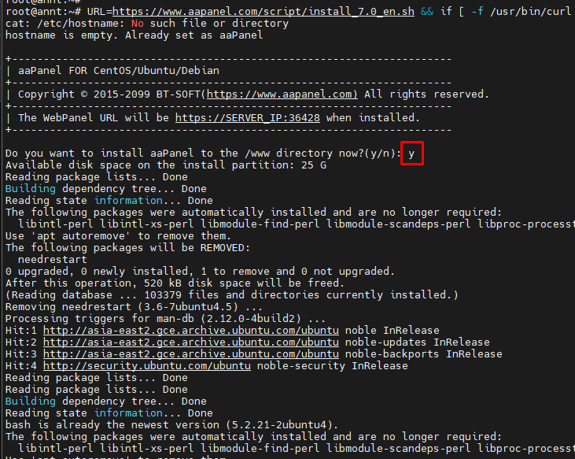
- Cài đặt hoàn tất nội dung đường dẫn truy cập, tài khoản được cung cấp 
- 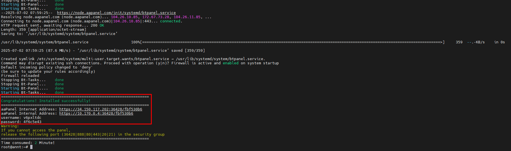
- Lưu ý: Nếu bạn quên thông tin:
- Xem lại bằng lệnh: `bt default`
- 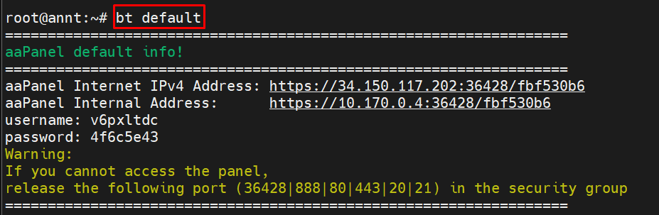
- Đổi mật khẩu bằng lệnh: `bt 5`
- 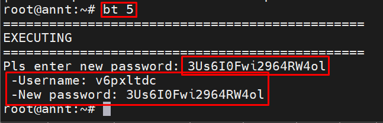

## Truy cập và cấu hình aaPanel
- Lấy link mà hệ thống đã gửi trên, copy và paste vào trình duyệt để login vào trang quản trị aaPanel:
```http://ip_address:port/your-random-string```
- Ví dụ với server đang cài đường dẫn được cấp như sau:  
```
aaPanel Internet IPv4 Address: https://34.150.117.202:36428/fbf530b6
aaPanel Internal Address:      https://10.170.0.4:36428/fbf530b6
username: v6pxltdc
password: 4f6c5e43
```
- Vì aaPanel sử dụng chứng chỉ tự ký (self-signed), nên trình duyệt có thể cảnh báo bảo mật. Bạn chỉ cần chọn “Tiếp tục truy cập” là được.
- 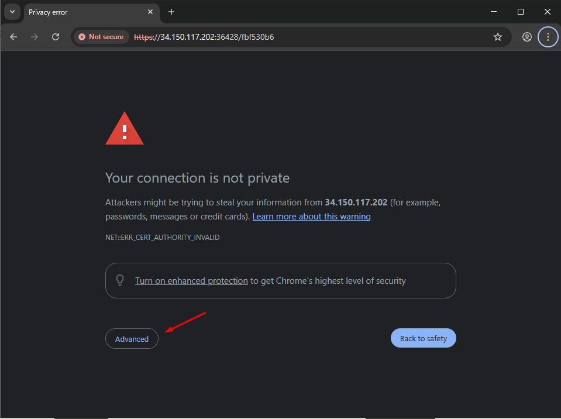
- 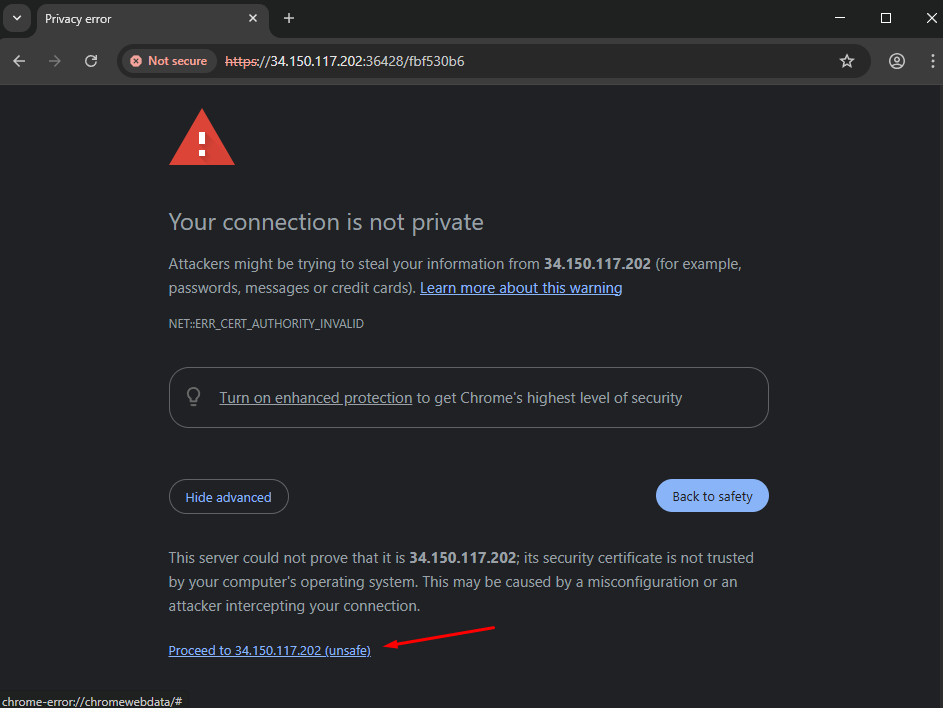
- Điền thông tin tài khoản, mật khẩu được cấp và chọn `Login`
- 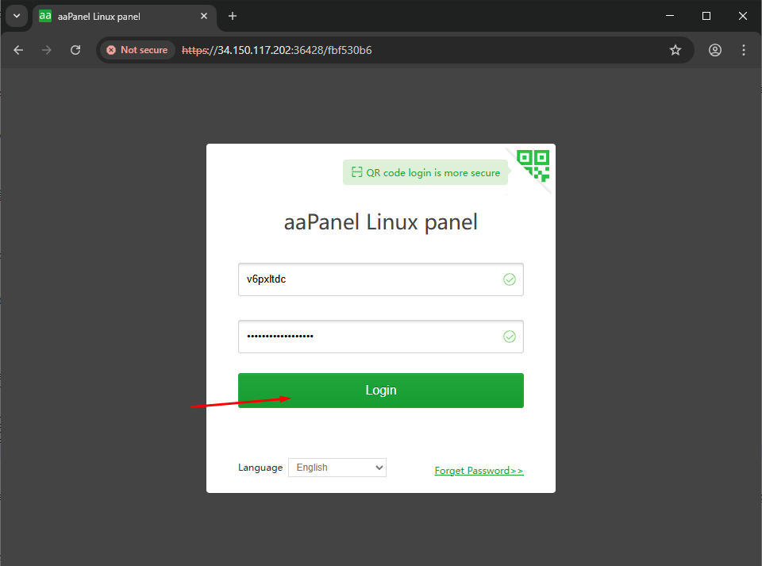
- Sau khi đăng nhập hiển thị pop-up thông báo đã cài đặt thành công. Chọn `Finish` để tắt pop-up 
- 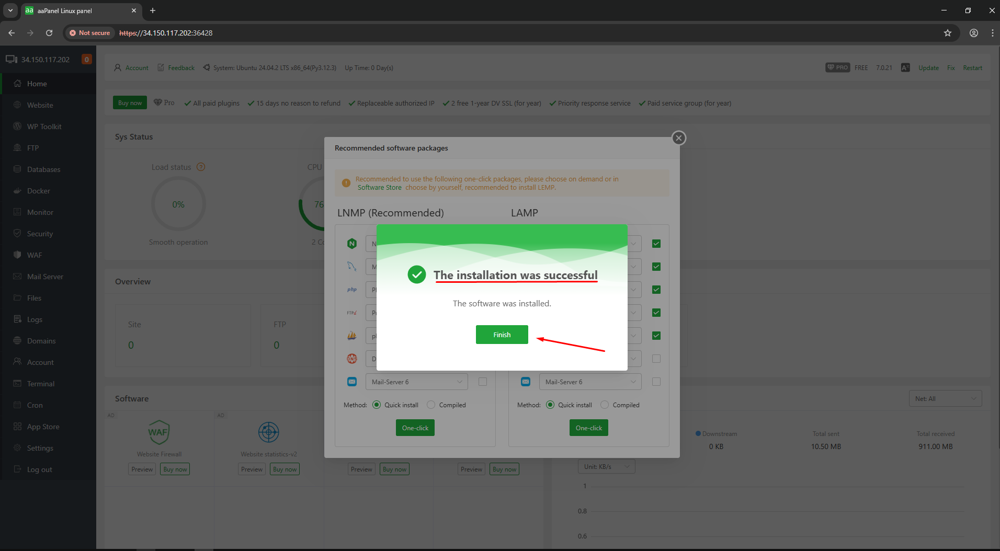
- Tại pop-up yêu cầu cài đặt các module cần thiết cho aaPanel.Trong ví dụ này sẽ dùng LNMP để cài, bạn có thể tùy chọn theo nhu cầu. Thực hiện chọn nút `One-click` để thực hiện cài đặt 
- 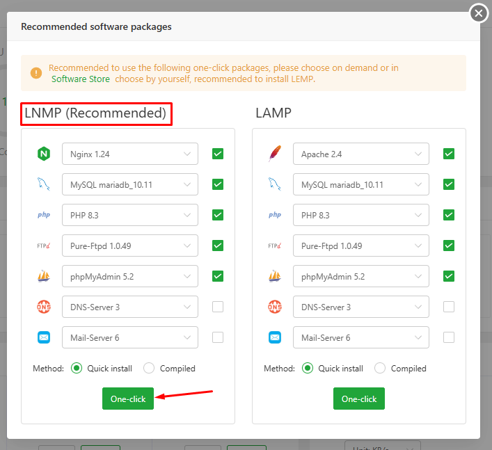
- Quá trình cài đặt diễn ra 
- 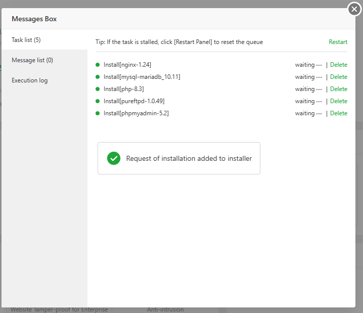
- Sau khoảng 10 - 15 phút quá trình cài đặt hoàn tất 
- 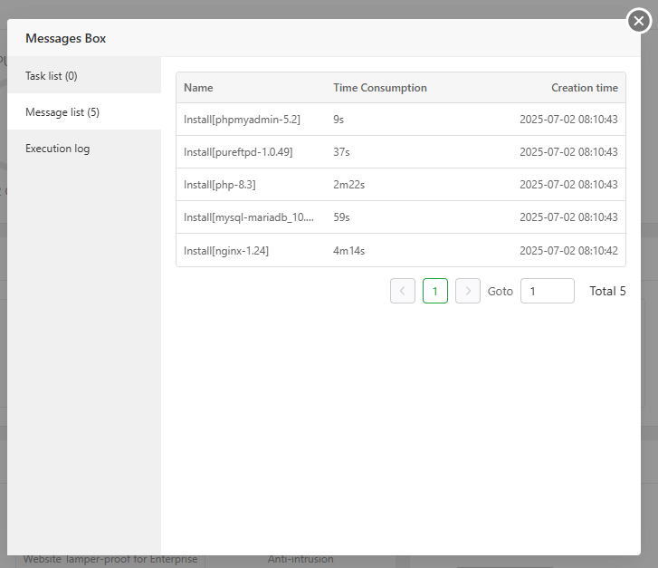
- Chúng ta thực hiện tạo tài khoản để mở khoá các tính năng MailServer Dashboard Management, WP-toolkit, Domain/SSL Management Center, .... Điền thông tin email, password và click chọn Register 
- 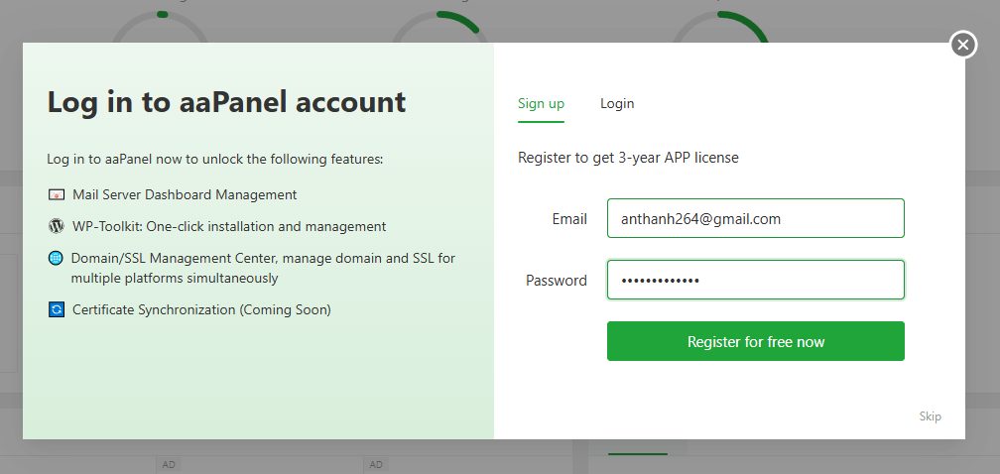
- Một email chứa đường linh xác nhận sẽ được gửi về mail đã điền. Click vào link để xác nhận 
- 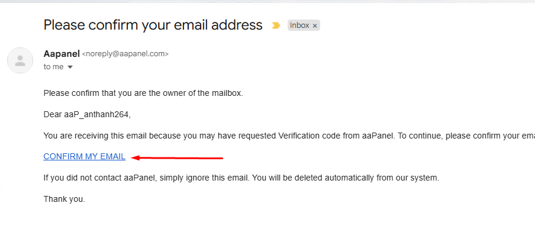
- 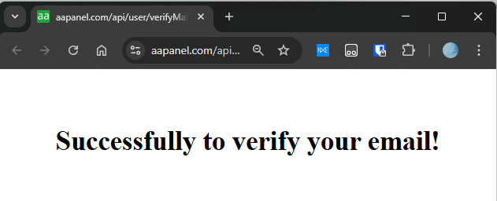
- Sau khi đã xác nhận mail, trở lại panel aapanel click chọn `I have verified`
- 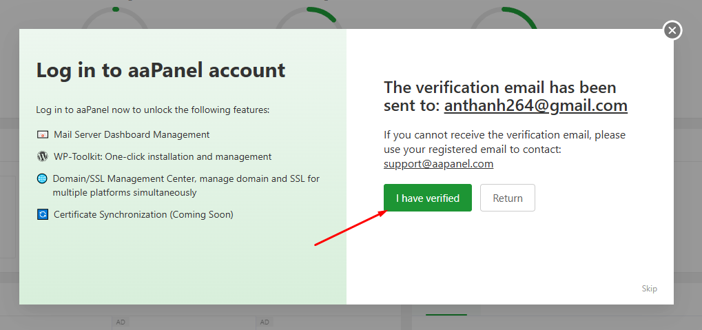
- Giao diện panel quản lý: tại đây có thể xem thông tin cơ bản về hệ thống, traffic, disk i/o 
- 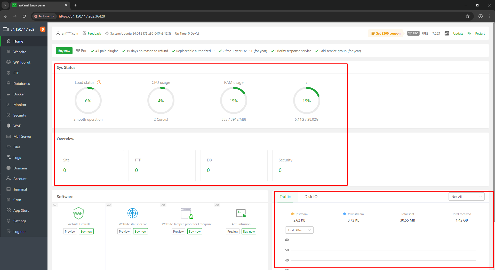
- Có thể thực hiện các thao tác chuyển ngôn ngữ, update, fix và restart panel tại góc trên bên phải 
- 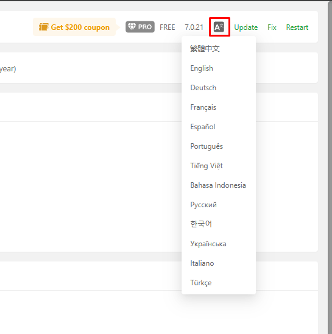


