# AAPanel 
- Nếu bạn đang tìm kiếm một công cụ quản trị server dễ dùng, giao diện trực quan và hoàn toàn miễn phí, thì aaPanel là lựa chọn tuyệt vời. Trong bài viết này, mình sẽ hướng dẫn bạn từng bước cài đặt và cấu hình aaPanel trên máy chủ Ubuntu 22.04. 
## Yêu cầu trước khi cài đặt 
- aaPanel hiện tại đang được phát triển dựa trên Ubuntu 22.04
- Cấu hình tối thiểu:
	- CPU: 1 Core
	- RAM: 512MB
	- Ổ cứng: 1GB
- Hệ điều hành hỗ trợ:
	- Ubuntu 20 / 22 (khuyên dùng) / 24
	- Debian 11 / 12
	- CentOS 9
	- AlmaLinux 8 / 9
	- Rocky Linux 8 / 9
- aaPanel hiện tại có 2 phiên bản 
	- aaPanel Free
		- Miễn phí trọn đời.
		- Đầy đủ tính năng cơ bản: quản lý website, cơ sở dữ liệu, FTP, SSL, tường lửa...
		- Hỗ trợ nhiều phiên bản PHP, Python, Node.js.
		- Phù hợp với cá nhân hoặc doanh nghiệp nhỏ.
	- aaPanel Pro
		- Trả phí (dùng thử 14 ngày).
		- Hỗ trợ nhiều người dùng (tối đa 30 tài khoản phụ).
		- Phân quyền và giới hạn tài nguyên cho từng người dùng.
		- Bảo mật nâng cao, tối ưu hiệu suất máy chủ.
		- Phù hợp với nhà cung cấp dịch vụ hosting hoặc doanh nghiệp lớn.
- Trong bài viết này hướng dẫn cài đặt aaPanel Frê 
## Cài đặt 
- Cài đặt aaPanel trên máy chủ Ubuntu 22.04 với cấu hình: IP 34.150.117.202, 2 CPU core, 4GB RAM, 30GB SSD.
- SSH vào server và có quyền quản trị (root) 
- Update system bằng câu lệnh trước khi cài đặt:
```
sudo apt-get update -y && sudo apt-get upgrade -y
```
- 
- Thực hiện cài đặt bằng lệnh sau: 
	```
	URL=https://www.aapanel.com/script/install_7.0_en.sh && if [ -f /usr/bin/curl ];then curl -ksSO "$URL" ;else wget --no-check-certificate -O install_7.0_en.sh "$URL";fi;bash install_7.0_en.sh forum
	```
	- Script tự động đổi hostname -> aapanel 
	- Khi được hỏi cài đặt aaPanel tại thư mục /www chọn `y`
	- 
- Qúa trình cài đặt diễn ra 
- 
- Cài đặt hoàn tất nội dung đường dẫn truy cập, tài khoản được cung cấp 
- 
- Lưu ý: Nếu bạn quên thông tin:
- Xem lại bằng lệnh: `bt default`
- 
- Đổi mật khẩu bằng lệnh: `bt 5`
- 

## Truy cập và cấu hình aaPanel
- Lấy link mà hệ thống đã gửi trên, copy và paste vào trình duyệt để login vào trang quản trị aaPanel:
```http://ip_address:port/your-random-string```
- Ví dụ với server đang cài đường dẫn được cấp như sau:  
```
aaPanel Internet IPv4 Address: https://34.150.117.202:36428/fbf530b6
aaPanel Internal Address:      https://10.170.0.4:36428/fbf530b6
username: v6pxltdc
password: 4f6c5e43
```
- Vì aaPanel sử dụng chứng chỉ tự ký (self-signed), nên trình duyệt có thể cảnh báo bảo mật. Bạn chỉ cần chọn “Tiếp tục truy cập” là được.
- 
- 
- Điền thông tin tài khoản, mật khẩu được cấp và chọn `Login`
- 
- Sau khi đăng nhập hiển thị pop-up thông báo đã cài đặt thành công. Chọn `Finish` để tắt pop-up 
- 
- Tại pop-up yêu cầu cài đặt các module cần thiết cho aaPanel.Trong ví dụ này sẽ dùng LNMP để cài, bạn có thể tùy chọn theo nhu cầu. Thực hiện chọn nút `One-click` để thực hiện cài đặt 
- 
- Quá trình cài đặt diễn ra 
- 
- Sau khoảng 10 - 15 phút quá trình cài đặt hoàn tất 
- 
- Chúng ta thực hiện tạo tài khoản để mở khoá các tính năng MailServer Dashboard Management, WP-toolkit, Domain/SSL Management Center, .... Điền thông tin email, password và click chọn Register 
- 
- Một email chứa đường linh xác nhận sẽ được gửi về mail đã điền. Click vào link để xác nhận 
- 
- 
- Sau khi đã xác nhận mail, trở lại panel aapanel click chọn `I have verified`
- 
- Giao diện panel quản lý: Home 
- 
Tại phần trên cùng gồm các thông tin 

- **ant****.com**: Hiển thị tài khoản đang đăng nhập vào aaPanel. Nếu cần thay đổi hoặc hủy liên kết, có thể vào phần Cài đặt (Settings).
- **Feedback**: Nếu bạn muốn gửi góp ý, có thể gửi phản hồi tại đây.
	- 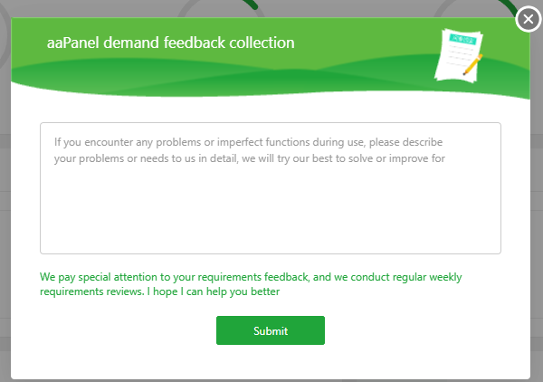
- **System: Ubuntu 24.04.2 LTS x86_64(Py3.12.3)**: Hiển thị phiên bản hệ điều hành, kiến trúc CPU của máy chủ hiện tại và phiên bản Python mà aaPanel đang sử dụng.
- **Up Time: 0 Day(s)**: Hiển thị thời gian máy chủ đã hoạt động liên tục.
- **7.0.21**: Hiển thị phiên bản aaPanel hiện tại.
- **Language**: Nút chuyển ngôn ngữ, nhấn để đổi sang ngôn ngữ khác.
- 
- **Update**: Nút cập nhật, nhấn để cập nhật aaPanel, chuyển giữa phiên bản beta hoặc ổn định.
- 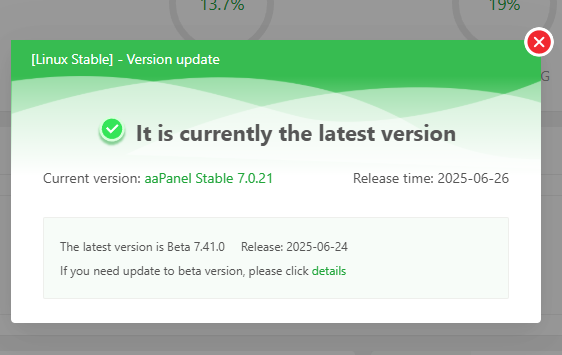
- **Fix**: Nút sửa chữa, nhấn để khôi phục hoặc sửa lỗi aaPanel.
- 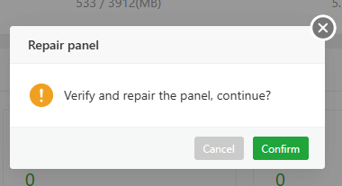
- **Restart**: Nút khởi động lại, nhấn để khởi động lại aaPanel hoặc khởi động lại hệ điều hành.
- 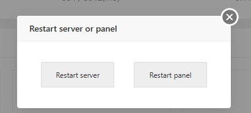

- Sys Status 
	- Load Status: Biểu đồ trạng thái tải (load status) của aaPanel:
		- Dưới 50%: Máy chủ đang hoạt động với tải thấp.
		- Từ 50% đến 90%: Tải máy chủ ở mức bình thường, máy chủ có thể xử lý yêu cầu của người dùng kịp thời.
		- Từ 90% đến 100%: Tài nguyên máy chủ đã bị sử dụng hết, không thể phản hồi yêu cầu người dùng kịp thời. Cần kiểm tra xem dự án có hoạt động bất thường không, hoặc xem xét nâng cấp cấu hình máy chủ.
		- Các yếu tố ảnh hưởng đến tải máy chủ:
			- Mức sử dụng CPU
			- Số lượng luồng (threads)
			- Mức sử dụng IO
			- Tỷ lệ sử dụng bộ nhớ swap
			- Phân bổ tài nguyên không đủ do máy chủ vật lý quá tải
		- Cụ thể phần này cung cấp các thông tin
			- 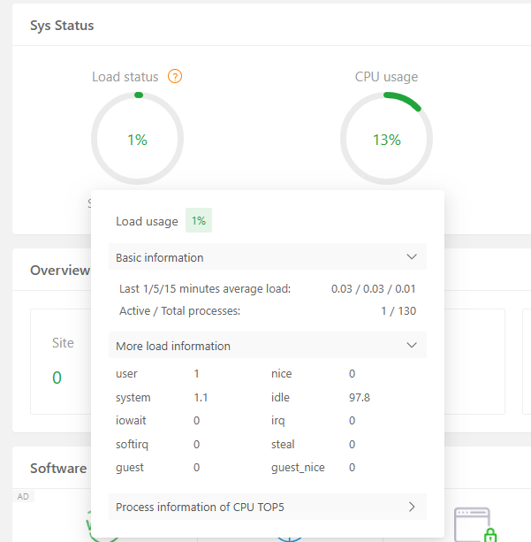
			- Load status: 1% – Tải hệ thống rất thấp
			- CPU usage: 13% – CPU đang dùng 13%, còn dư nhiều
			- Load usage: 1% – Tải tổng thể hệ thống thấp
			- Basic Information:
				- Load trung bình 1/5/15 phút: 0.03 / 0.03 / 0.01 → hệ thống rất nhẹ
				- Tiến trình đang chạy / tổng số: 1 / 130 → chỉ 1 tiến trình đang thực thi
			- More Load Information:
				- user: 1 – Tải do tiến trình người dùng
				- system: 1.1 – Tải do hệ điều hành
				- iowait: 0 – Không có thời gian chờ I/O
				- idle: 97.8 – CPU rảnh 97.8% thời gian
				- Các mục khác (irq, steal, guest...): 0 → không ảnh hưởng đến hiệu suất
		-> Từ các thông số hiển thị, người dùng có thể biết máy chủ đang hoạt động ổn định, tải thấp, tài nguyên còn dư nhiều. CPU, RAM và I/O đều không bị nghẽn, tiến trình ít, hệ thống sẵn sàng để triển khai website hoặc ứng dụng mới.
	- CPU load: Biểu đồ trạng thái load CPU 
		- 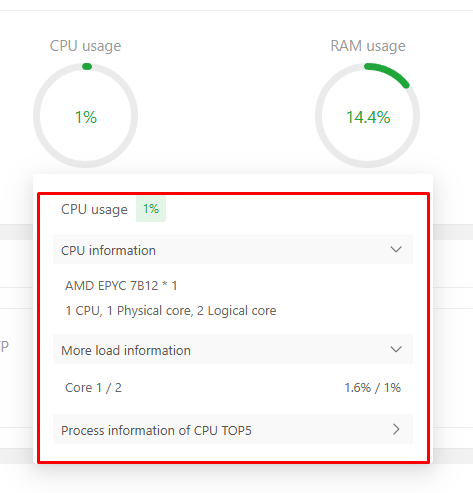
		- Phần này cung cấp Cho biết mức độ tải hệ thống hiện tại (Load status) để đánh giá hiệu suất tổng thể
			- Hiển thị mức sử dụng CPU theo thời gian thực
			- Hiển thị thông tin phần cứng: loại CPU, số core, tốc độ xung nhịp
			- Hiển thị mức sử dụng CPU cụ thể từng core
		-> Giúp người dùng đánh giá khả năng phản hồi và độ ổn định của máy chủ. Là cơ sở để quyết định triển khai thêm dịch vụ, tối ưu hệ thống hoặc nâng cấp cấu hình

	- RAM usage
		- 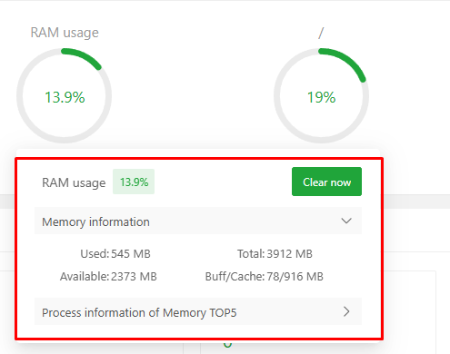
		- Thể hiện mức sử dụng RAM và swap, bao gồm tổng, đã dùng, còn trống, và cache
		- Sử dụng nút "Clear now" để xóa cache/buffer. Xác nhận giải phóng RAM 
		- 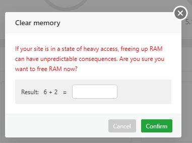
		-> Giúp đánh giá hiệu suất tổng thể, mức độ tiêu thụ tài nguyên và độ ổn định của hệ thống
		
	- Disk usage 
		- 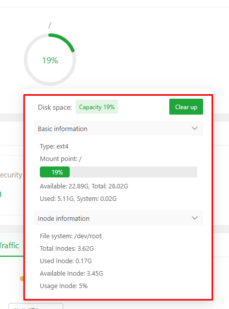
		- Hiển thị tổng dung lượng ổ đĩa, dung lượng đã sử dụng và còn trống
		- Cho biết hệ thống tập tin đang dùng (ext4) và điểm gắn kết (mount point)
		- Cung cấp thông tin về mức sử dụng inode – giúp đánh giá khả năng lưu trữ file nhỏ
		- Có công cụ dọn dẹp ổ đĩa (Clear up) để giải phóng không gian (Pro)
		-> Giúp người dùng theo dõi tình trạng lưu trữ và phát hiện sớm nguy cơ đầy ổ hoặc cạn inode

- Overview 
	- 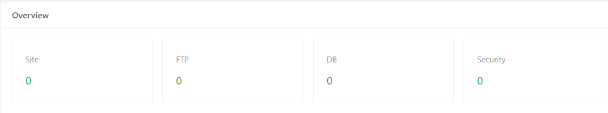
		- Site: Hiển thị số lượng website hiện có, nhấn để vào phần quản lý Website.
		- FTP: Hiển thị số lượng tài khoản FTP hiện tại, nhấn để vào phần quản lý FTP.
		- DB: Hiển thị số lượng cơ sở dữ liệu hiện có, nhấn để vào phần quản lý Databases.
		- Security: Hiển thị số lượng rủi ro bảo mật chưa xử lý của hệ điều hành hiện tại, nhấn để vào phần quản lý.
	- Security Overview
		- 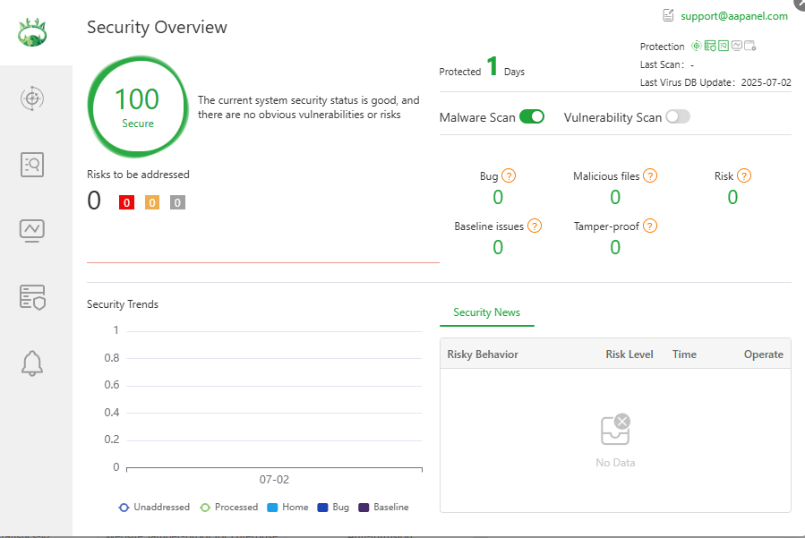
		- Tình trạng bảo mật tổng thể: Ví dụ trong ảnh hệ thống đang ở trạng thái an toàn, điểm bảo mật đạt 100, không có lỗ hổng hay rủi ro rõ ràng nào được phát hiện.
		- Thời gian bảo vệ: Thời gian hệ thống đã được bảo vệ liên tục .
		- Quét mã độc (Malware Scan): Có thể cấu hình bật/tắt, tuỳ chọn này giúp phát hiện phần mềm độc hại.
		- Quét lỗ hổng (Vulnerability Scan): tắt, tuỳ chọn này giúp kiểm tra các lỗ hổng hệ thống.
		- Các chỉ số rủi ro:  Hiển thị các lỗi (bug), file độc hại, rủi ro, vấn đề cấu hình (baseline), hay hành vi can thiệp trái phép (tamper-proof).
		- Biểu đồ xu hướng bảo mật: Hiển thị các thông tin về xu hướng bảo mật.
		- Tin tức bảo mật: Hiển thị dữ liệu hành vi rủi ro được ghi nhận.
	- Security Risks: Dò, quét các rủi ro bảo mật và sửa chữa 
		- 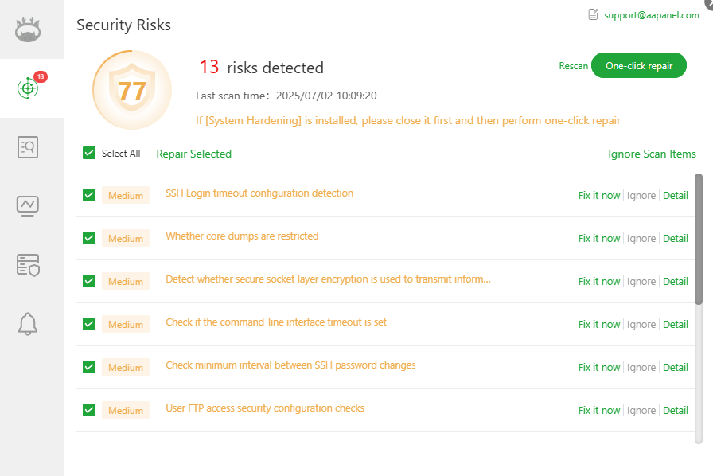
		- Gồm các thao tác 
			- Retest: Nhấn để kiểm tra lại các rủi ro bảo mật.
			- Repair: Nhấn để thực hiện sửa lỗi tự động, chỉ áp dụng cho một số rủi ro bảo mật nhất định.
			- Detail: Xem chi tiết từng rủi ro bảo mật. Do mỗi rủi ro khác nhau nên cần sửa theo hướng dẫn cụ thể.
			- Ignore: Bỏ qua rủi ro bảo mật này.
			- Check: Kiểm tra lại rủi ro bảo mật cụ thể đã chọn.
		- Hiển thị điểm bảo mật và số lượng rủi ro hiện tại để đánh giá mức độ an toàn hệ thống
		- Cho biết thời gian quét gần nhất và cung cấp các nút xử lý như: sửa lỗi, bỏ qua, xem chi tiết, quét lại
		- Các rủi ro chủ yếu liên quan đến cấu hình SSH, FTP, SSL và giới hạn hệ thống
		-> Giúp người dùng phát hiện, theo dõi và xử lý các vấn đề bảo mật một cách trực quan và nhanh chóng

	- Malicious file detection
		- 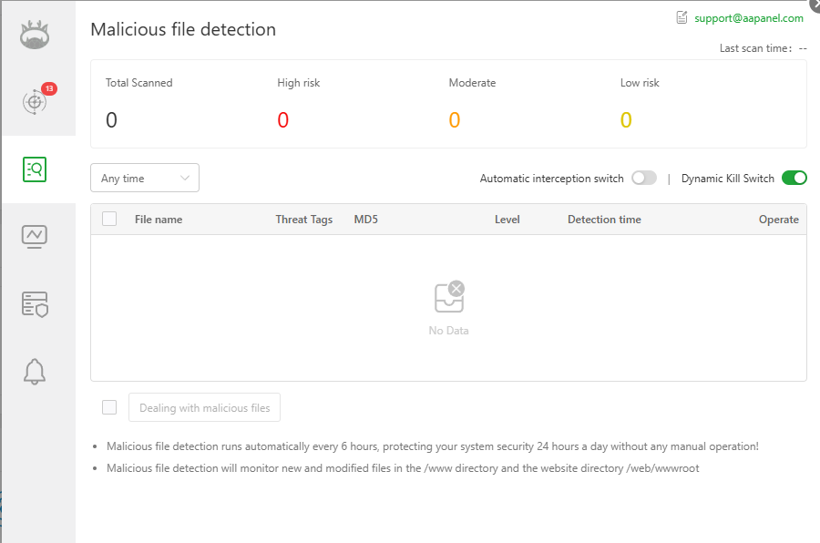
		- Hiển thị số lượng file đã quét và phân loại theo mức độ rủi ro (cao, trung bình, thấp). Trong ảnh ví dụ hiện tại chưa có file nào được quét, chưa phát hiện mối đe dọa nào
		- Có các tùy chọn như tự động chặn và diệt động (dynamic kill) – tính năng dynamic kill đang bật
		- Hệ thống sẽ tự động quét mỗi 6 giờ, theo dõi các file mới hoặc bị chỉnh sửa trong thư mục /www và /web/wwwroot
		-> Giúp người dùng phát hiện sớm mã độc và kiểm soát an toàn hệ thống web một cách tự động
	- Website vulnerability detection (Pro)
		- 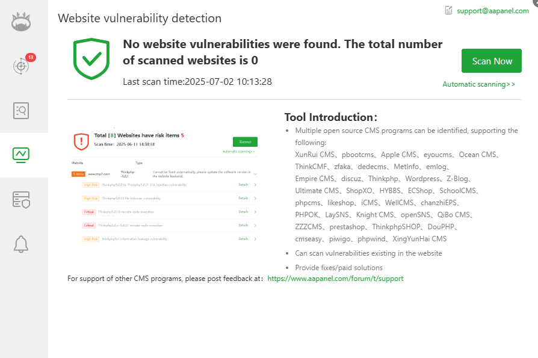
		- Công cụ giúp quét và phát hiện lỗ hổng bảo mật trong các website đang chạy trên máy chủ
		- Hiển thị số lượng website đã quét, thời gian quét gần nhất và danh sách lỗ hổng nếu có
		- Các lỗ hổng nghiêm trọng (như thực thi mã từ xa) cần xử lý thủ công
		- Hỗ trợ nhiều CMS phổ biến như WordPress, ThinkPHP, Discuz...
		- Giúp người dùng theo dõi và xử lý rủi ro bảo mật website kịp thời
	- Server security detection (Pro) 
		- 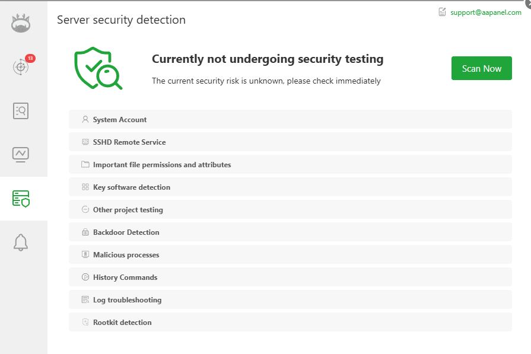
		- Hiển thị trạng thái kiểm tra bảo mật hiện tại: chưa kiểm tra, rủi ro chưa xác định
		- Có nút "Scan Now" để bắt đầu quét bảo mật ngay lập tức
		- Danh sách các hạng mục kiểm tra bao gồm:
		- Tài khoản hệ thống
		- Dịch vụ SSH từ xa
		- Quyền và thuộc tính của các tệp quan trọng
		- Phát hiện phần mềm quan trọng
		- Kiểm tra các mục khác
		- Phát hiện cửa hậu (backdoor)
		- Tiến trình độc hại
		- Lịch sử lệnh đã chạy
		- Gỡ lỗi nhật ký hệ thống
		- Phát hiện rootkit
		-> Giao diện này giúp người dùng thực hiện kiểm tra toàn diện hệ thống để phát hiện sớm các rủi ro bảo mật tiềm ẩn và xử lý kịp thời.

	- Global Alarm Settings: Thiết lập cảnh báo toàn cục (Global Alarm Settings) trong aaPanel:
		- 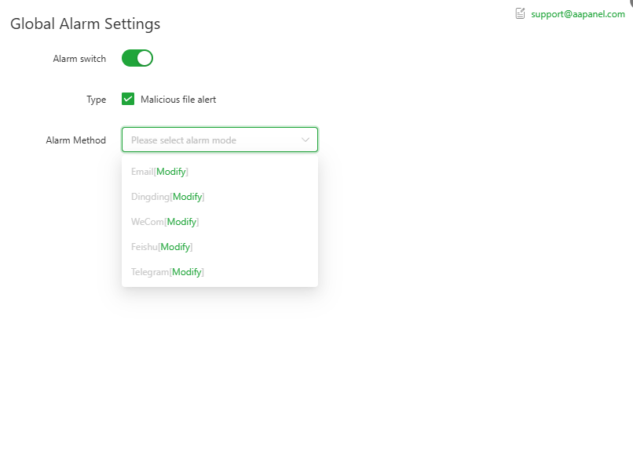
		- Alarm switch: Công tắc cảnh báo đang bật → hệ thống sẽ gửi thông báo khi phát hiện nguy cơ
		- Type: Đang chọn loại cảnh báo là “Malicious file alert” → cảnh báo khi phát hiện file độc hại
		- Alarm Method: Cho phép chọn phương thức nhận cảnh báo, gồm:
			- Email
			- DingTalk
			- WeCom
			- Feishu
			- Telegram
		- (Tất cả đều có thể chỉnh sửa cấu hình bằng nút [Modify])
		- Mục đích: Giúp người dùng nhận thông báo kịp thời khi hệ thống phát hiện mối đe dọa bảo mật
		- Email hỗ trợ: Có địa chỉ liên hệ hỗ trợ kỹ thuật: support@aapanel.com
		-> Giao diện này giúp cấu hình cách thức và kênh nhận cảnh báo để đảm bảo người quản trị luôn được thông báo khi có sự cố bảo mật xảy ra.

- Software 
	- 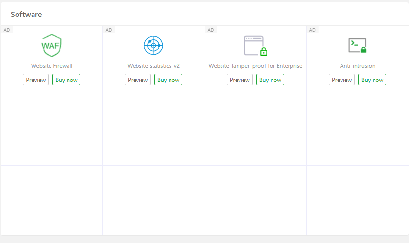
	- Hiển thị trên bảng điều khiển các plugin/phần mềm
	- Nhấn để vào trang quản lý của plugin hoặc phần mềm tương ứng
- Traffic: Hiển thị lưu lượng mạng theo thời gian thực của card mạng máy chủ.
	- 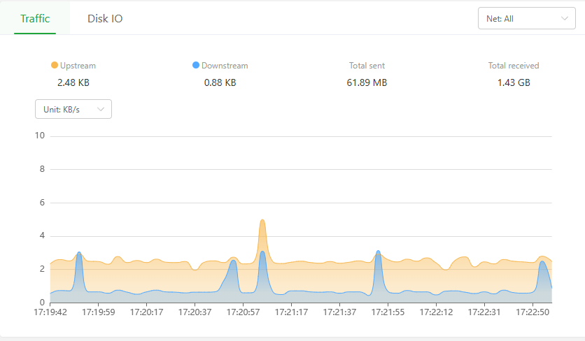
	- Upstream: Lưu lượng gửi đi theo thời gian thực của máy chủ.
	- Downstream: Lưu lượng nhận vào theo thời gian thực của máy chủ.
	- Total sent: Tổng lưu lượng đã gửi kể từ lần khởi động lại gần nhất.
	- Total received: Tổng lưu lượng đã nhận kể từ lần khởi động lại gần nhất.
	- Net: All: Nhấn để chọn card mạng cụ thể và xem lưu lượng theo thời gian thực.
	- Unit: MB/s: Thay đổi đơn vị hiển thị: KB/s, MB/s, GB/s, TB/s.
- Disk I/O - Hiển thị thông tin IO của ổ cứng theo thời gian thực của máy chủ.
	- 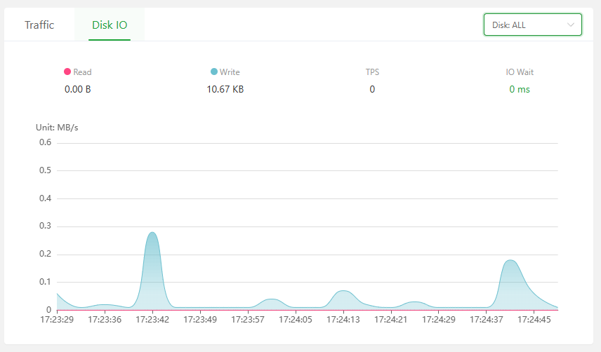
	- Read: Hiển thị tốc độ đọc của ổ cứng theo thời gian thực.
	- Write: Hiển thị tốc độ ghi của ổ cứng theo thời gian thực.
	- TPS: Hiển thị số lần ghi (giao dịch) của ổ cứng theo thời gian thực.
	- IO Wait: Hiển thị thời gian chờ IO của ổ cứng theo thời gian thực.
	- Disk: ALL: Chọn ổ cứng cụ thể để xem thông tin theo thời gian thực.

- Message box: Hộp thư thông báo, hiển thị tiến trình cài đặt và nâng cấp phần mềm.
	- Danh sách tác vụ (Task list): Hiển thị quá trình cài đặt và nâng cấp phần mềm theo thời gian thực.
	- 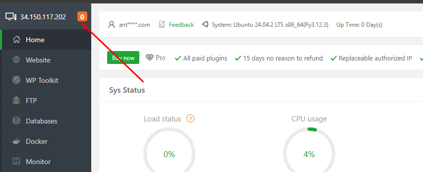
	- Danh sách thông báo (Message list): Ghi lại nhật ký thao tác cài đặt và nâng cấp phần mềm.
	- 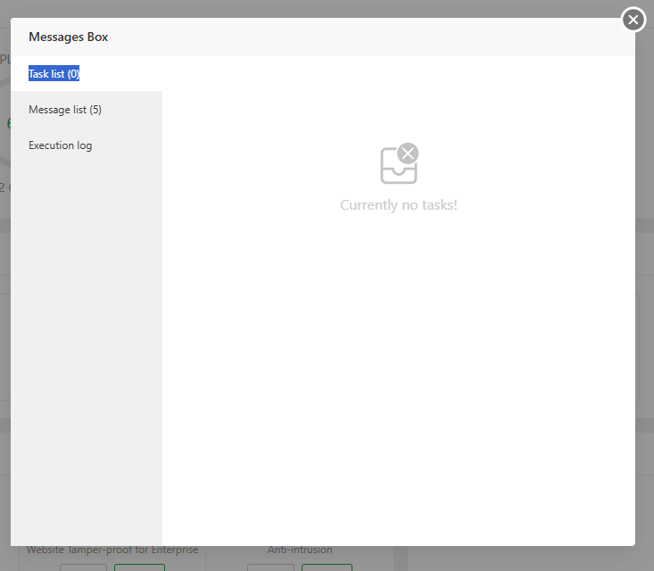
	- Nhật ký thực thi (Execution log): Kiểm tra nhật ký thực thi khi cài đặt phần mềm. Nếu có phần mềm cài đặt thất bại, có thể kiểm tra tại đây.
	- 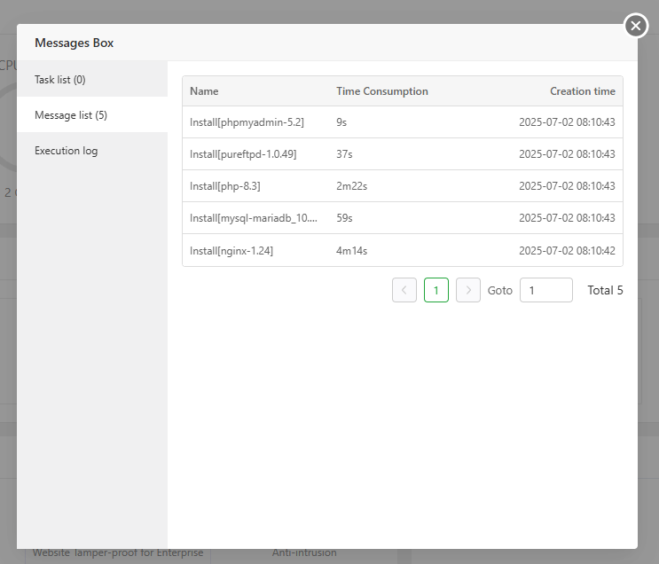
	- Để xem thêm nhật ký cài đặt, vui lòng xem tệp: /tmp/panelExec.log

## Tổng quan các panel, tính năng của aaPanel 
- Tại giao diện panel tại thanh bên trái liệt kê các chức năng panel hỗ trợ 
- 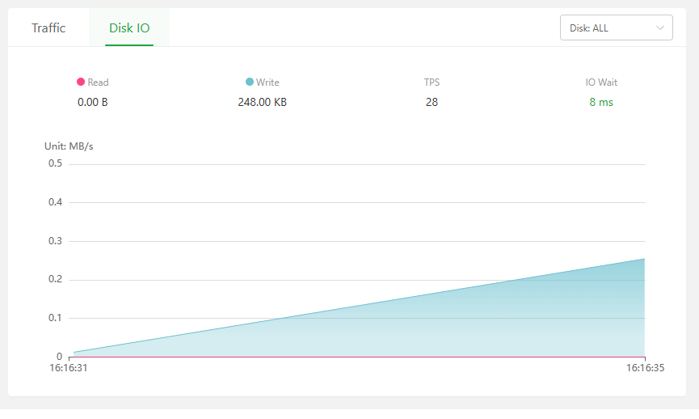

| Mục | Chức năng chính |
|-----|------------------|
| **Home** | Trang tổng quan hệ thống: hiển thị CPU, RAM, ổ đĩa, lưu lượng mạng... |
| **Website** | Quản lý website: thêm/sửa/xóa website, cấu hình PHP, SSL, rewrite... |
| **WP Toolkit** | Công cụ quản lý WordPress: cài đặt, sao lưu, cập nhật plugin/theme |
| **FTP** | Tạo và quản lý tài khoản FTP để truyền tải dữ liệu |
| **Databases** | Quản lý cơ sở dữ liệu (MySQL, MariaDB...): tạo, backup, phân quyền |
| **Docker** | Quản lý container Docker (nếu đã cài đặt plugin Docker) |
| **Monitor** | Giám sát tài nguyên hệ thống theo thời gian thực |
| **Security** | Cấu hình tường lửa, giới hạn IP, bảo vệ đăng nhập |
| **WAF** | Web Application Firewall – tường lửa ứng dụng web nâng cao |
| **Mail Server** | Thiết lập và quản lý máy chủ email (Roundcube, Postfix...) |
| **Files** | Trình quản lý file trực quan: upload, chỉnh sửa, phân quyền |
| **Logs** | Xem log hệ thống, log truy cập web, log lỗi PHP... |
| **Domains** | Quản lý tên miền trỏ về máy chủ |
| **Account** | Quản lý tài khoản đăng nhập vào aaPanel |
| **Terminal** | Truy cập dòng lệnh trực tiếp từ trình duyệt |
| **Cron** | Tạo và quản lý tác vụ tự động (cron jobs) |
| **App Store** | Kho ứng dụng mở rộng: cài đặt PHP, Nginx, Redis, Docker... |
| **Settings** | Cấu hình hệ thống aaPanel: ngôn ngữ, port, thông báo... |
| **Log out** | Đăng xuất khỏi bảng điều khiển |

