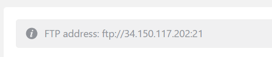
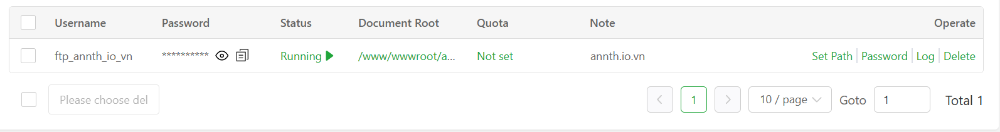
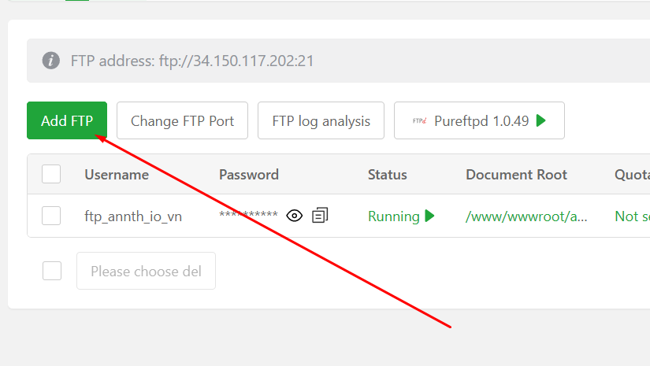
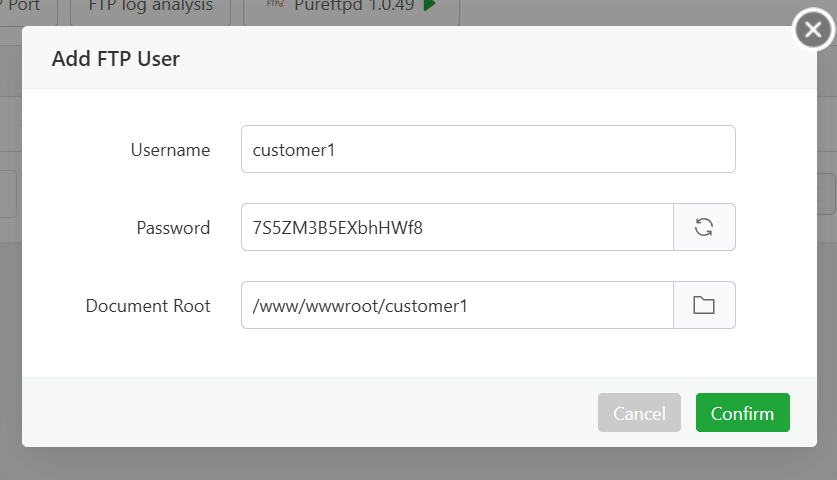
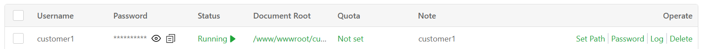
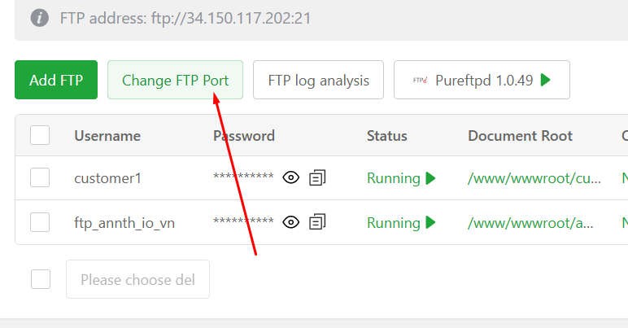
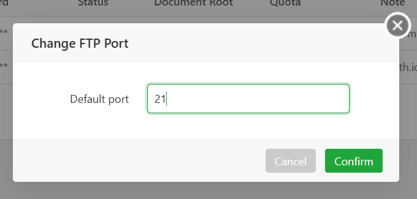
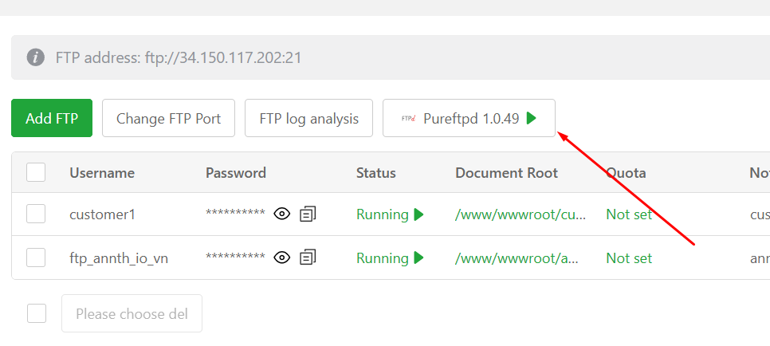
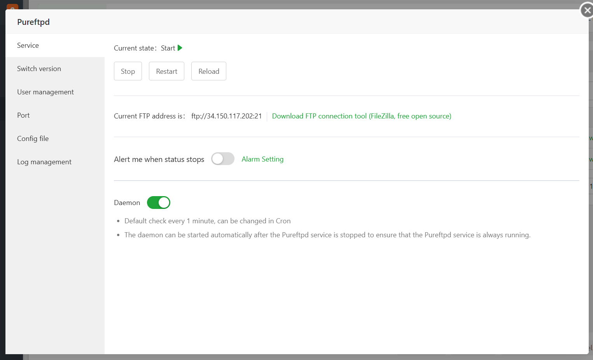
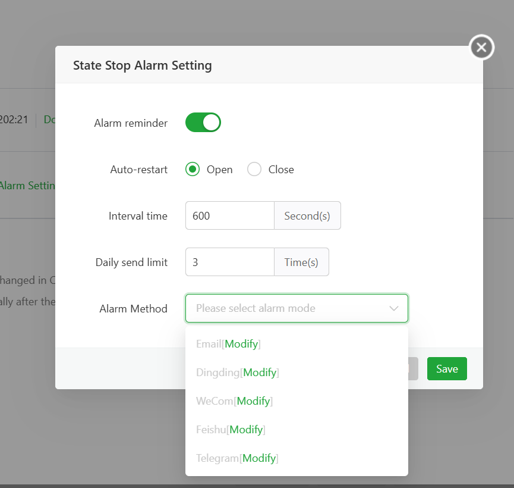

# aaPanel FTP Modules 
- aaPanel sử dụng PureFTPd làm máy chủ FTP, cho phép quản lý tệp trên máy chủ thông qua phần mềm FTP client. Có thể thực hiện các thao tác như tải lên, tải xuống, xóa và các thao tác khác.
- FTP (Giao thức truyền tệp) là một giao thức tiêu chuẩn để truyền tệp qua mạng.
- FTP mặc định sử dụng chế độ bị động: kết nối điều khiển sử dụng cổng 21, còn truyền dữ liệu sử dụng các cổng ngẫu nhiên trong khoảng 39000–40000. Nếu dùng chế độ chủ động, kết nối dữ liệu sử dụng cổng 20.
- Giao diện tổng quan module FTP 
- 
- Giao diện quản lý FTP trong aaPanel, sử dụng phần mềm máy chủ PureFTPd. Giao diện này cho phép bạn tạo, chỉnh sửa và giám sát các tài khoản FTP để quản lý tệp trên máy chủ từ xa thông qua các phần mềm FTP client như FileZilla.
- Các thành phần chính:
	- Địa chỉ FTP: Hiển thị địa chỉ kết nối FTP (gồm IP và cổng), dùng để cấu hình trong phần mềm FTP client.
	- 
	- Các nút chức năng: 
		- Add FTP: Tạo tài khoản FTP mới.
		- Change FTP Port: Thay đổi cổng mặc định (thường là 21).
		- FTP log analysis: Phân tích nhật ký truy cập FTP để kiểm tra hoạt động.
		- PureFTPd 1.xxx: Cấu hình dịch vụ server FTP 
	- 
	- Tìm kiếm và phân trang: Cho phép tìm nhanh tài khoản FTP và điều hướng nếu có nhiều tài khoản.
	- 
	- Bảng thông tin tài khoản FTP: Bao gồm tên người dùng, trạng thái hoạt động, thư mục gốc được cấp quyền truy cập, ghi chú, và các thao tác như đổi mật khẩu, xem log, xóa tài khoản.
	- 

## Các nút chức năng
### Add FTP
- Sử dụng để thêm tài khoản FTP mới.
- Click `Add FTP`
- 
- Cấu hình các thông số: user, pass, path và ấn `Confirm` để tạo 
- 
- 
- FTP account mới được tạo 
- 
### Change FTP Port 
- Sử dụng để thay đổi cổng hoạt động của server FTP 
- Click `Change FTP Port`
- 
- Cấu hình Port cần đổi thành và ấn `Confirm` để thay đổi  
- 
### FTP Log Analysis
- Sử dụng để phân tích bản ghi FTP
- Tính năng chỉ khả dụng ở bản Pro trả phí 
### PureFTPd 1.xxx
- Click để mở giao diện quản lý service FTP ở đây aaPanel sử dụng phần mềm PureFTPd
- 
- Các mục chức năng trong menu quản lý PureFTPd trên aaPanel:
	- Service – Quản lý trạng thái dịch vụ FTP (bật/tắt, khởi động lại): cho phép bạn kiểm soát trạng thái hoạt động của máy chủ FTP. 
	- 
	- Gồm các phần cấu hình 
		- Quản lý dịch vụ (Service)
			- Trạng thái hiện tại: Hiển thị dịch vụ đang chạy (nút “Start” màu xanh lá).
			- Các nút thao tác:
				- Stop: Dừng dịch vụ FTP.
				- Restart: Khởi động lại dịch vụ.
				- Reload: Tải lại cấu hình mà không cần khởi động lại toàn bộ dịch vụ.
				- Địa chỉ FTP hiện tại: Hiển thị địa chỉ và cổng để kết nối FTP (ví dụ: ftp://[IP]:21).
				- Tải công cụ FTP: Gợi ý sử dụng FileZilla – phần mềm FTP miễn phí và mã nguồn mở.
		- Cảnh báo trạng thái (Alert)
			- Alert me when status stops: Công tắc bật/tắt cảnh báo khi dịch vụ ngừng hoạt động.
			- Alarm Setting: Liên kết đến phần cấu hình cảnh báo chi tiết (ví dụ: gửi email khi dịch vụ ngừng).
			- Pop-up cài đặt alarm: Tại đây có thể cài đặt các cấu hình cảnh báo
				- 
				- Alarm reminder: Bật/tắt chế độ cảnh báo khi dịch vụ bị dừng.
				- Auto-restart: Tự động khởi động lại dịch vụ khi phát hiện ngừng hoạt động.
				- Interval time: Khoảng thời gian kiểm tra trạng thái dịch vụ (tính bằng giây).
				- Daily send limit: Giới hạn số lần gửi cảnh báo mỗi ngày.
				- Alarm Method: Chọn phương thức nhận cảnh báo (Email, Telegram, v.v.).
				- Save: Lưu lại toàn bộ thiết lập.
		- Trình giám sát (Daemon)
			- Daemon: Công tắc bật/tắt daemon.
			- Tần suất kiểm tra: Mặc định kiểm tra mỗi 1 phút, có thể thay đổi trong phần Cron.
			- Chức năng: Nếu dịch vụ PureFTPd bị dừng, daemon sẽ tự động khởi động lại để đảm bảo luôn hoạt động.
	- Switch version – Chuyển đổi giữa các phiên bản PureFTPd.
	- User management – Quản lý tài khoản FTP (tạo, sửa, xóa, phân quyền).
	- Port – Cấu hình cổng FTP (mặc định là 21).
	- Config file – Chỉnh sửa tệp cấu hình của PureFTPd.
	- Log management – Xem và phân tích nhật ký hoạt động FTP.

## Bảng thông tin tài khoản 

