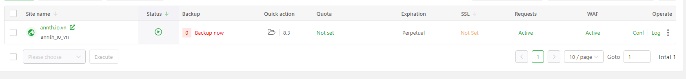
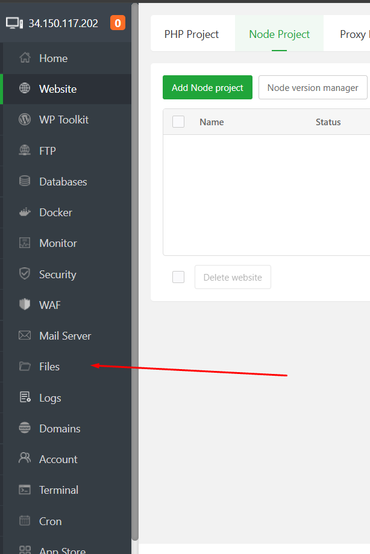
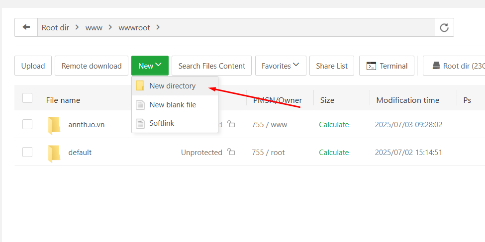
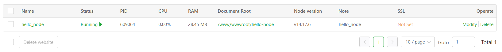
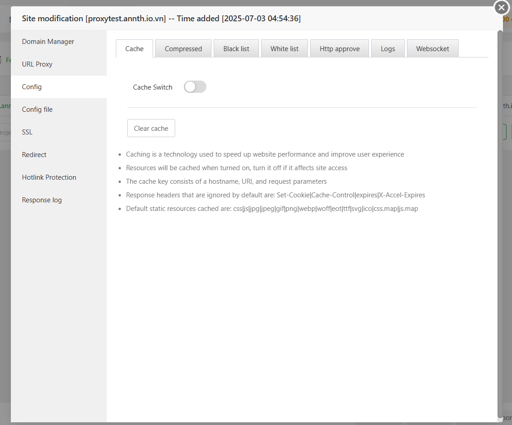

# aaPanel Website Modules 
- Website – Trung tâm quản lý website trên aaPanel
- Mục Website trong aaPanel là nơi bạn thực hiện toàn bộ thao tác quản trị liên quan đến các trang web đang chạy trên máy chủ. Đây là khu vực bạn sẽ thường xuyên sử dụng nếu đang vận hành nhiều website hoặc triển khai các dự án web.
- aaPanel hỗ trợ nhiều chế độ chạy website, giúp bạn linh hoạt triển khai các loại ứng dụng khác nhau. Cụ thể gồm:
	- PHP – Dành cho các website sử dụng ngôn ngữ PHP như WordPress, Laravel, Joomla...
	- Node.js – Phù hợp với các ứng dụng thời gian thực hoặc SPA như Express, Nuxt, Next...
	- Proxy – Dùng để chuyển tiếp truy cập đến một dịch vụ khác (thường dùng để ẩn IP backend, kết nối đến cổng khác, hoặc làm reverse proxy)
- Chúng ta lần lượt đi tìm hiểu chi tiết từng chế độ 
- Truy cập mục Website tại panel phải của dashboard quản lý 
- 

## PHP Project 
- Giao diện PHP Project: Tại đây bạn có thể quản lý dự án PHP, hỗ trợ sử dụng Nginx, Apache và OpenLiteSpeed.
- 
- Phần này gồm các tính năng quản trị website php như 

| Chức năng            | Mô tả                                                                                                                                                   |
| -------------------- | ------------------------------------------------------------------------------------------------------------------------------------------------------- |
| **Add site**         | Tạo website mới, có thể tạo hàng loạt                                                                                                                   |
| **Default Page**     | Hiển thị trang mặc định của website mới, nhấn để cấu hình trang mặc định                                                                                |
| **Default Website**  | Thiết lập website mặc định – tất cả tên miền/IP chưa gán sẽ trỏ về site này. Giúp ngăn chặn phân tích độc hại                                           |
| **PHP CLI**          | Chọn phiên bản PHP dùng khi chạy lệnh PHP qua dòng lệnh                                                                                                 |
| **HTTPS Protection** | Khi bật, sẽ khắc phục lỗi chéo nội dung giữa các website HTTPS                                                                                          |
| **Site name**        | Tên miền gán cho website. Nhấn vào để cấu hình hoặc chỉnh sửa website hiện tại                                                                          |
| **Status**           | Hiển thị trạng thái hoạt động của website. Nhấn để tắt website hiện tại                                                                                 |
| **Back up**          | Hiển thị trạng thái sao lưu của website. Nhấn để xem, khôi phục, tải về hoặc sao lưu thủ công                                                           |
| **Document Root**    | Hiển thị đường dẫn thư mục gốc của website. Nhấn để mở thư mục trong trình quản lý file                                                                 |
| **Quota**            | Hiển thị dung lượng giới hạn của website. Nhấn để chỉnh sửa (chỉ hỗ trợ hệ thống tệp XFS)                                                               |
| **Expired date**     | Hiển thị thời hạn hiệu lực của website. Nhấn để đặt ngày hết hạn (mặc định là vĩnh viễn)                                                                |
| **Note**             | Ghi chú dùng để lưu thông tin về website, ví dụ: mục đích sử dụng                                                                                       |
| **PHP**              | Hiển thị phiên bản PHP đang dùng. Nhấn để thay đổi phiên bản PHP cho website                                                                            |
| **SSL**              | Hiển thị trạng thái SSL. Nhấn để gán chứng chỉ SSL cho website                                                                                          |
| **Attack**           | Hiển thị nhật ký tấn công vào website. Nhấn để xem chi tiết các cuộc quét/tấn công                                                                      |
| **Stats**            | Sử dụng Website Statistics-v2 để xem lưu lượng, kết nối... của website                                                                                  |
| **WAF**              | Cấu hình tường lửa ứng dụng web (WAF) cho website hiện tại                                                                                              |
| **Conf**             | Cấu hình nâng cao cho website: Quản lý tên miền, thư mục, giới hạn truy cập, rewrite URL, chuyển hướng, proxy ngược, chống hotlink, log truy cập/lỗi... |
| **Delete**           | Xóa website hiện tại. Thư mục website sẽ được chuyển vào thùng rác trong phần quản lý file                                                              |

- 
- `Add site` đây là nơi cấu hình thêm website: Giao diện này cho phép bạn tạo một website mới, với tùy chọn tạo từng cái hoặc tạo hàng loạt (batch). Trong ảnh, tab "Create site" đang được chọn.
	- Các thành phần chính:
		- 
		- Resolve Domain: Chọn cách xử lý tên miền:
			- Manual Add Record: Thêm bản ghi DNS thủ công
			- Automatic Add Record: Tự động thêm bản ghi DNS (nếu tích hợp)
		- Domain name: 
			- Nhập tên miền cho website.
			- Mỗi dòng là một tên miền
			- Mặc định dùng cổng 80
			- Có thể thêm wildcard domain (*.domain.com) hoặc chỉ định cổng (www.domain.com:88)
		- Description: Ghi chú mô tả cho website (tùy chọn)
		- Website Path: Đường dẫn thư mục chứa mã nguồn website (mặc định là /www/wwwroot)
		- FTP: Chọn tạo tài khoản FTP cho website
			- Nhập tên tài khoản và mật khẩu FTP nếu chọn “Create”
		- Database: Chọn loại cơ sở dữ liệu muốn tạo (ví dụ: MySQL)
		- 
		- PHP Version: Chọn phiên bản PHP áp dụng cho tất cả các website được tạo
		- Site Category:  Phân loại website theo nhóm (ví dụ: mặc định, khách hàng, nội bộ...)
		- Create HTML file: Bật/tắt việc tạo sẵn một file HTML mẫu trong thư mục website
		- Nút Confirm / Cancel:
			- Confirm: Xác nhận tạo website
			- Cancel: Hủy thao tác
		→ Giao diện này rất hữu ích khi bạn cần triển khai nhiều website có cấu trúc tương tự, đặc biệt trong môi trường hosting, agency hoặc phát triển dự án theo lô. Bạn muốn mình hướng dẫn cách nhập danh sách website để tạo hàng loạt không?

	- Tại tab `Batch create`: Giao diện tạo website hàng loạt trong aaPanel cho phép người dùng khởi tạo nhiều website cùng lúc bằng cách nhập danh sách theo định dạng quy định. Mỗi dòng tương ứng với một website, bao gồm các thông tin: tên miền, thư mục gốc, có tạo FTP hay không, có tạo database hay không, và phiên bản PHP sử dụng.
		- 	
		- Cấu trúc dòng nhập như sau:
		```
		Tên miền|Thư mục gốc|FTP|Database|PHP
		```
		Ví dụ:
		```
		bt.cn,test.cn:8081|www/wwwroot/bt.cn|1|1|56
		```
			- Trong đó:
				- Tên miền: có thể nhập nhiều tên miền, cách nhau bằng dấu phẩy
				- Thư mục gốc: đường dẫn chứa mã nguồn website
				- FTP: nhập 1 để tạo tài khoản FTP, 0 để không tạo
				- Database: nhập 1 để tạo cơ sở dữ liệu, 0 để không tạo
				- PHP: nhập 0 nếu là website tĩnh, hoặc nhập mã phiên bản PHP như 56 (PHP 5.6), 74 (PHP 7.4)...
		- Sau khi nhập danh sách, nhấn nút xác nhận để hệ thống tự động tạo toàn bộ website theo cấu hình đã chỉ định. Tính năng này rất hữu ích khi cần triển khai nhiều website cùng lúc, giúp tiết kiệm thời gian và thao tác lặp lại.

- Ví dụ thêm 1 website với domain `annth.io.vn` trên port 80
	- Cần trỏ bản ghi A về IP của hosting aaPanel 
	- 	
	- Tại phần `PHP Project` click chọn `AddSite`
	- Trong tab `Create site` thực hiện 
		- 		
		- Cấu hình domain cần thêm `annth.io.vn`
		- Chọn tạo tài khoản FTP, Database Mysql: User và password cho các dịch vụ này được tạo tự động, bạn có thể cấu hình lại theo ý muốn. 
		- 			
		- Cấu hình phiên bản PHP, tích chọn tạo site HTML 
		- Sau khi đã cấu hình các thông số click `Confirm` để tạo website
		- 			
	- Website mới được tạo 
		- Các thông số tài khoản FTP, Mysql 
	- 
	- Thông tin về Website được hiển thị tại bảng quản lý website			
	- 	
	- Tại đây có thể theo dõi nhanh các thông tin 
		- Site name: Hiển thị tên miền của website. Nhấn vào để truy cập tới website. Nhấn chọn icon hình quả cầu để truy cập trang cấu hình chi tiết website 
		- 	
		- 
		- Trang quản trị chi tiết website (trình bày sau)
		- 	
		- Status: Trạng thái hoạt động của website (đang chạy hoặc đã tắt). Có thể nhấn để bật/tắt nhanh.
		- 	
		- Backup: Hiển thị trạng thái sao lưu của website. Nhấn vào để xem, tạo bản sao lưu, khôi phục hoặc tải về.
			- 	
			- Chọn `Backup` để backup Website
			- Tại đây cung cấp thông tin tên file, dung lượng, ngày tháng backup. Bạn có thể thực hiện khôi phục (restore), tải xuống (download), xoá (delete) với các bản backup.
		- Quick action: Nút thao tác nhanh, thường dùng để truy cập nhanh các chức năng như mở thư mục, sửa file, cấu hình PHP...
			- 	
			- Click chọn icon hình tệp tin để chuyển tới trang quản trị file của website. 
			- 	
			- 	
			- Click chọn `8.3` đây là phiên bản PHP website sử dụng click chọn để chuyển tới phần cấu hình phiên bản PHP
			- 	
		- Quota: Dung lượng giới hạn được gán cho website (nếu có). Nhấn để chỉnh sửa quota. Chỉ hoạt động với hệ thống tệp XFS. (Pro)
			- 
			- Menu chỉnh sửa quota của website 
			- 
			- Giao diện này cho phép bạn đặt giới hạn dung lượng ổ đĩa (quota) cho một website cụ thể – trong ảnh là website “annth.io.vn”.
			- Các thành phần chính:
				- Current used capacity: Hiển thị dung lượng hiện tại mà website đang sử dụng (tính bằng MB).
				- Current capacity quota: Cho phép bạn nhập giới hạn dung lượng tối đa mà website được phép sử dụng. Nếu vượt quá, hệ thống sẽ ngăn website ghi thêm dữ liệu.
			- Lưu ý quan trọng:
				- Tính năng này chỉ khả dụng trên phiên bản Pro của aaPanel.
				- Hệ thống tệp của ổ đĩa phải là XFS và được gắn với tùy chọn prjquota.
				- Ví dụ dòng cấu hình trong /etc/fstab:
				`/dev/vdc1 /data xfs defaults,prjquota 0 0`
				- Nếu muốn hủy giới hạn quota, chỉ cần đặt giá trị là 0.
		- Expiration: Ngày hết hạn của website. Có thể đặt thời hạn sử dụng cho từng website (mặc định là không giới hạn).
			- 
			- Các thành phần chính:
				- Lịch chọn ngày: Cho phép bạn chọn ngày hết hạn cụ thể. 
				- Confirm: Nút xác nhận để lưu lại ngày hết hạn đã chọn
			-> Tính năng này rất hữu ích nếu bạn muốn giới hạn thời gian hoạt động của một website, ví dụ như website thử nghiệm, website cho khách hàng thuê theo gói thời gian, hoặc để tự động ngừng dịch vụ khi đến hạn.
		- SSL: Trạng thái chứng chỉ SSL của website. Nhấn để cài đặt hoặc gia hạn chứng chỉ SSL.
			- 
			- Menu quản lý chứng chỉ SSL của website. Tại đây bạn có thể cấu hình upload chứng chỉ đã được cập hoặc sử dụng chứng chỉ miễn phí Let's Encrypt
			- Chi tiết cấu hình SSL trình bày tại. 
			- 
		- Requests: Hiển thị trạng thái xử lý yêu cầu truy cập website. Có thể liên quan đến lưu lượng hoặc kết nối. (Pro)
		- WAF: Trạng thái tường lửa ứng dụng web (Web Application Firewall). Nhấn để bật/tắt hoặc cấu hình WAF cho website. (Pro)
		- Operate: Cột thao tác, chứa các nút như: cấu hình website, xem log truy cập, log lỗi, xóa website...
			- Click chọn `Conf` chuyển tới menu quản trị website 
			- 
			- 
			- Click chọn `Logs` chuyển tới panel hiển thị bản ghi của website. Tại đây có thể theo dõi các bản ghi: Access Log, Error Log, Log Security Analysis
			- 
			- 
			- Click chọn icon để tới tính năng quét bảo mật log của website và xoá website. 
			- Log scan
			- 
			- Click `LogScan` để phân tích log 
			- 
			- Click `Delete Website` để thao tác xoá.
			- 
			- Giao diện này cho phép bạn xóa một website cụ thể. Gồm các thành phần chính:
				- Thông báo cảnh báo: Việc xóa website sẽ xóa hồ sơ website đã chọn và các thành phần liên quan nếu bạn chọn các tùy chọn bên dưới.
				- Các tùy chọn kèm theo:
					- Xóa tài khoản FTP liên quan
					- Xóa cơ sở dữ liệu liên quan
					- Xóa thư mục gốc của website (Document Root)
				- Ô xác nhận bằng phép toán: Để tránh thao tác nhầm, bạn cần giải một phép tính đơn giản (trong ảnh là 10 + 7) và nhập kết quả vào ô trống để xác nhận xóa.
				- Nút xác nhận: Sau khi nhập đúng kết quả, bạn có thể nhấn nút để tiến hành xóa website.
			-> Tính năng này giúp đảm bảo an toàn khi xóa website, tránh mất dữ liệu ngoài ý muốn. 		

- `Advanced Setup`: Bên cạnh cấu hình thêm site là phần cấu hình nâng cao. Click tại đây để mở giao diện cấu hình chi tiết hơn. Cấu hình tại đây sẽ áp dụng cho mọi website được tạo 
- 
- Giao diện thiết lập nâng cao (Advanced Setup) cho website trong aaPanel gồm các phần 
- Default Page: Giao diện này cho phép bạn tùy chỉnh nội dung hiển thị cho các trang hệ thống đặc biệt của website, bao gồm:
	- Default Page – Trang mặc định khi website vừa được tạo
	- 	
	- 404 Page – Trang hiển thị khi truy cập sai đường dẫn (không tìm thấy)
	- 
	- Unbound Domain Page – Trang hiển thị khi truy cập bằng tên miền chưa được gán
	- 
	- Stop Page – Trang hiển thị khi website bị tạm ngưng hoạt động
	- 
	-> Bạn có thể chỉnh sửa trực tiếp mã HTML/CSS trong trình soạn thảo để cá nhân hóa nội dung các trang này theo ý muốn. Sau khi chỉnh sửa, nhấn nút Save để lưu lại thay đổi.
	-> Tính năng này rất hữu ích nếu bạn muốn tạo trải nghiệm chuyên nghiệp hơn cho người dùng khi họ gặp lỗi hoặc truy cập sai địa chỉ.

- Default Website: Giao diện này cho phép bạn chọn một website làm “mặc định” trên máy chủ. Khi một tên miền hoặc địa chỉ IP không được gán cụ thể cho bất kỳ website nào, hệ thống sẽ tự động chuyển hướng truy cập đó đến website mặc định.
	- 	
	- Các thành phần chính:
		- Dropdown Default Website: Danh sách chọn website mặc định.
		- Nút Save: Nhấn để lưu lại lựa chọn website mặc định.
	- Khi thiết lập website mặc định, tất cả các tên miền hoặc IP chưa được gán sẽ trỏ về website này. Điều này giúp ngăn chặn các hành vi phân tích tên miền độc hại (malicious domain resolution).
- PHP CLI: Giao diện này cho phép bạn chọn phiên bản PHP sẽ được sử dụng khi chạy các lệnh PHP từ dòng lệnh (CLI), ví dụ như khi chạy lệnh php artisan, php composer.phar, hoặc các tác vụ cron.
	- 		
	- Các thành phần chính:
		- PHP-CLI Version: Danh sách chọn phiên bản PHP cho CLI. Trong ảnh, phiên bản đang được chọn là PHP-83 (PHP 8.3).
		- Nút Save:Nhấn để lưu lại phiên bản PHP CLI đã chọn.
	-> Tính năng này rất quan trọng nếu bạn có nhiều phiên bản PHP trên máy chủ và cần kiểm soát chính xác phiên bản nào được dùng cho các tác vụ tự động hoặc dòng lệnh.

- HTTPS Protection: Giao diện này cho phép bạn bật hoặc tắt chế độ bảo vệ HTTPS cho toàn bộ máy chủ web. Tính năng này giúp xử lý các vấn đề liên quan đến việc “chồng chéo” chứng chỉ SSL giữa các website.
	- 			
	- Các thành phần chính:
		- Bật / Tắt HTTPS Protection:
		- “Sau khi bật, có thể giải quyết vấn đề chéo nội dung giữa các website HTTPS.”
		-> Tức là nếu nhiều website dùng SSL trên cùng một IP, việc bật tính năng này sẽ giúp phân biệt đúng chứng chỉ cho từng website.
		- “Không hỗ trợ chống phân kênh bằng chứng chỉ IP, không nên bật nếu bạn truy cập trực tiếp qua IP.”
		-> Nếu bạn đang truy cập website bằng địa chỉ IP thay vì tên miền, việc bật tính năng này có thể gây lỗi.
	-> Tính năng này đặc biệt hữu ích khi bạn vận hành nhiều website HTTPS trên cùng một máy chủ và muốn đảm bảo mỗi website sử dụng đúng chứng chỉ SSL của nó.

- `Ngnix 1.x.x`: Bên cạnh cấu hình nâng cao là phần cấu hình webserver khởi chạy ở đây là Nginx. Click chọn để tới giao diện cấu hình Nginx 
- 			
- Giao diện quản trị Nginx cung cấp các cấu hình về 
	- Service: Giao diện này cho phép bạn kiểm soát trạng thái hoạt động của dịch vụ Nginx – bao gồm khởi động, dừng, khởi động lại và tải lại cấu hình.
		- 			
		- Các thành phần chính:
			- Trạng thái hiện tại: Hiển thị trạng thái dịch vụ Nginx (hiện tại là “Start” – đang chạy)
			- Các nút điều khiển
				- Stop: Dừng dịch vụ Nginx
				- Restart: Khởi động lại dịch vụ
				- Reload: Tải lại cấu hình mà không cần khởi động lại
			- Cảnh báo khi dịch vụ dừng
				- Tùy chọn “Alert me when status stops”: Bật để nhận cảnh báo nếu Nginx bị dừng
				- Nút “Alarm Setting”: Cấu hình chi tiết cách thức nhận cảnh báo (qua email, Telegram, v.v.)
				- 			
				- Giao diện này cho phép bạn cấu hình hệ thống cảnh báo khi một dịch vụ (như Nginx, MySQL...) bị dừng đột ngột, đồng thời thiết lập hành động tự động khởi động lại nếu cần.
					- Các thành phần chính:
					- Alarm reminder: Công tắc bật/tắt cảnh báo. Trong ảnh, cảnh báo đang được bật.
					- Auto-restart: Tùy chọn tự động khởi động lại dịch vụ nếu bị dừng. Có hai lựa chọn: “Open” (bật) và “Close” (tắt). Hiện đang chọn “Open”.
					- Interval time: Khoảng thời gian kiểm tra trạng thái dịch vụ (tính bằng giây).
					- Daily send limit: Giới hạn số lần gửi cảnh báo mỗi ngày.
					- Alarm Method: Phương thức nhận cảnh báo. Có thể chọn một hoặc nhiều kênh sau:
						- Email
						- DingTalk
						- WeCom
						- Feishu
						- Telegram
						- Mỗi phương thức đều có nút [Modify] để cấu hình chi tiết.
					- Nút Save: Nhấn để lưu lại toàn bộ thiết lập cảnh báo.
				-> Tính năng này rất hữu ích để đảm bảo bạn được thông báo kịp thời khi dịch vụ quan trọng bị dừng
		- Daemon (trình giám sát tự động): Tùy chọn này giúp đảm bảo Nginx luôn hoạt động
			- Mặc định kiểm tra trạng thái mỗi 1 phút (có thể thay đổi trong phần Cron)
			- Nếu Nginx bị dừng, daemon sẽ tự động khởi động lại dịch vụ
			-> Tính năng daemon rất hữu ích để đảm bảo website không bị gián đoạn do Nginx ngừng hoạt động bất ngờ.
	- Config: Giao diện này cho phép bạn xem và chỉnh sửa trực tiếp tệp cấu hình chính của Nginx thông qua trình quản lý web của aaPanel. Đây là nơi bạn có thể điều chỉnh các thiết lập hệ thống của Nginx mà không cần truy cập dòng lệnh.
		- 			
		- Trình soạn thảo chỉnh sửa cấu hình có hỗ trợ đánh dấu cú pháp (syntax highlighting), giúp dễ đọc và dễ chỉnh sửa hơn, hỗ trợ các phím tắt như Ctrl + F (Tìm kiếm), Ctrl + S (Lưu) , Ctrl + H (Tìm và thay thế)
		-> Giao diện này rất hữu ích cho quản trị viên hệ thống hoặc lập trình viên muốn tùy chỉnh sâu cấu hình Nginx mà không cần thao tác qua SSH
	- Switch version: Giao diện này cho phép bạn dễ dàng chuyển đổi giữa các phiên bản Nginx đã được cài đặt trên máy chủ. Điều này rất hữu ích khi bạn cần nâng cấp, hạ cấp hoặc kiểm tra tính tương thích của website với các phiên bản khác nhau.
		- 			
		- Các thành phần gồm 
			- Dropdown chọn phiên bản: Hiển thị danh sách các phiên bản Nginx có thể chuyển đổi, ví dụ: nginx 1.19, 1.23, 1.24 (đang chọn), 1.25, 1.26, 1.27, 1.28.
			- Nút Switch (màu xanh): Nhấn để thực hiện chuyển đổi sang phiên bản đã chọn.
		-> Sau khi nhấn “Switch”, hệ thống sẽ tự động tải và cài đặt phiên bản Nginx tương ứng, thay thế phiên bản hiện tại. Việc này thường không làm mất cấu hình website, nhưng bạn nên sao lưu trước khi thực hiện để đảm bảo an toàn.
	- Load Status: Giao diện này cung cấp cái nhìn tổng quan về hiệu suất và hoạt động hiện tại của máy chủ Nginx. Nó rất hữu ích để theo dõi tình trạng tải, phát hiện tắc nghẽn hoặc đánh giá mức độ sử dụng tài nguyên.
		- 			
		- Các thông số hiển thị bao gồm:
			- Total accepts: Số lượng kết nối đã được Nginx chấp nhận (157)
			- Total handled: Số kết nối đã được xử lý thành công (175)
			- Total requests: Tổng số yêu cầu HTTP đã được xử lý (175)
			- Reading: Số kết nối đang đọc dữ liệu từ client (0)
			- Writing: Số kết nối đang ghi dữ liệu về client (1)
			- Waiting: Số kết nối đang chờ (0)
			- Active connections: Tổng số kết nối đang hoạt động (1)
			- Worker process: Số tiến trình worker của Nginx đang chạy (3)
			- Nginx CPU usage: Mức sử dụng CPU của Nginx (0%)
			- Nginx memory usage: Dung lượng RAM mà Nginx đang sử dụng (70MB)
		-> Giao diện này giúp bạn đánh giá nhanh xem Nginx có đang hoạt động ổn định không, có bị quá tải hay không, và có cần tối ưu thêm về cấu hình hoặc tài nguyên hệ thống. 
	- Optimization Giao diện này cho phép bạn điều chỉnh các thông số quan trọng để tối ưu hiệu suất hoạt động của Nginx. Các thiết lập này ảnh hưởng trực tiếp đến khả năng xử lý kết nối, nén dữ liệu, và giới hạn tải lên của máy chủ.
		- 			
		- Các thông số chính:
			- `worker_processes: auto`  Số lượng tiến trình xử lý. Đặt là “auto” để Nginx tự động điều chỉnh theo số lõi CPU.
			- `worker_connections: 51200` Số kết nối tối đa mà mỗi tiến trình worker có thể xử lý cùng lúc.
			- `keepalive_timeout: 60` Thời gian giữ kết nối mở giữa client và server (tính bằng giây).
			- `gzip: Open` Bật tính năng nén Gzip để giảm dung lượng truyền tải dữ liệu.
			- `gzip_min_length: 1 KB` Chỉ nén các tệp có kích thước từ 1 KB trở lên.
			- `gzip_comp_level: 2` Mức độ nén Gzip (từ 1 đến 9). Cấp 2 là mức nhẹ, cân bằng giữa tốc độ và hiệu quả.
			- `client_max_body_size: 50 MB` Giới hạn dung lượng tối đa của tệp mà client có thể tải lên.
			- `server_names_hash_bucket_size: 512` Kích thước bảng băm dùng để lưu tên miền – tăng giá trị này nếu có nhiều tên miền.
			- `client_header_buffer_size: 32 KB` Bộ đệm cho phần header của yêu cầu từ client.
			- `client_body_buffer_size: 512 KB` Bộ đệm cho phần nội dung (body) của yêu cầu từ client.
		- Sau khi điều chỉnh các thông số, bạn có thể nhấn nút `Save `để lưu lại cấu hình.
		-> Tính năng này rất hữu ích để tinh chỉnh hiệu suất Nginx theo nhu cầu thực tế của hệ thống.

	- Error Log: Giao diện này giúp bạn xem nhanh bản ghi lỗi nếu của của Nginx 
		- 			

- Sau khi đã tìm hiểu các bước tạo site, thiết lập nâng cao và cấu hình Nginx – tức là những thiết lập mang tính tổng quát áp dụng cho toàn bộ hệ thống website PHP – giờ là lúc chúng ta đi sâu vào phần quan trọng hơn: cấu hình chi tiết cho từng website cụ thể.
- Thực hiện thao tác với website đã thêm trong ví dụ `annth.io.vn`
- Click chọn icon hình quả cầu tại cột sitename tại trang quản lý website để mở giao diện quản trị chi tiết 
- 			
- Giao diện này gồm các thành phần: 
- Domain Manager – Quản lý tên miền gán cho website: Giao diện này cho phép bạn thêm, chỉnh sửa hoặc xóa các tên miền chính (hoặc phụ) được gán cho website hiện tại.
	- 			
	- Các thành phần chính:
		- Hướng dẫn nhập tên miền (phía trên ô nhập):
			- Mỗi dòng là một tên miền riêng biệt.
			- Mặc định sử dụng cổng 80 (HTTP).
			- Có thể thêm wildcard domain, ví dụ: *.domain.com.
			- Nếu muốn chỉ định cổng khác, dùng định dạng như: www.domain.com:88.
		- Ô nhập tên miền: Bạn nhập tên miền mới vào đây, sau đó nhấn nút Add để thêm.
		- Bảng danh sách tên miền đã thêm gồm các cột: 
			- Domain name: Tên miền đã gán (ví dụ: annthi.io.vn)
			- Port: Cổng sử dụng (mặc định là 80)
			- Operate: Trạng thái hoạt động (hiện tại là “Inoperable” – không hoạt động, có thể do chưa trỏ DNS đúng hoặc chưa cấu hình hoàn chỉnh)
		- Checkbox: Cho phép chọn tên miền để xóa hoặc thao tác hàng loạt (nếu có nhiều tên miền).
- Subdirectory Binding – Gán tên miền phụ (subdomain) với thư mục con: Giao diện này cho phép bạn trỏ một tên miền phụ (subdomain) hoặc tên miền khác đến một thư mục con bên trong website chính. Đây là cách phổ biến để chạy nhiều phần của một website (như admin, blog, demo...) từ các thư mục riêng biệt.
	- 			
	- Các thành phần chính:
		- Domain name: Nhập tên miền hoặc subdomain bạn muốn trỏ (ví dụ: demo.annth.io.vn)
		- Subdir: Nhập tên thư mục con bên trong thư mục gốc của website (ví dụ: demo)
		- Port: Mặc định là 80 (HTTP)
		- Operate: Cột này sẽ hiển thị các thao tác như sửa hoặc xóa sau khi bạn thêm cấu hình
	- Ví dụ sử dụng: Nếu bạn muốn khi người dùng truy cập sub1.annth.io.vn, họ sẽ được phục vụ nội dung từ thư mục /www/wwwroot/annth.io.vn/sub1, thì bạn sẽ:
		- Cần tạo thư mục sub1 trong source của website: Tại giao diện quản lý file chọn `New Folder` và đặt tên  
		- 			
			- Tạo file html mẫu:
				- Truy cập vào thư mục mới tạo chuột phải vào vùng trống chọn `New file` -> Đặt tên file mới là `index.html`
				- 			
				- 			
			- Click đúp vào file mới tạo để mở trình soạn thảo. Tại đây chứa nội dung mà site sẽ hiển thị. Ví dụ code HTML hiển thị trang chào mừng 
			```
			<!DOCTYPE html>
			<html lang="en">
			<head>
				<meta charset="UTF-8">
				<meta name="viewport" content="width=device-width, initial-scale=1.0">
				<title>sub1.annth.io.vn</title>
				<style>
					body {
						font-family: Arial, sans-serif;
						text-align: center;
						padding: 50px;
						background-color: #f0f0f0;
					}
					h1 {
						color: #333;
					}
					p {
						color: #555;
					}
				</style>
			</head>
			<body>
				<h1>Chào mừng đến với sub1.annth.io.vn!</h1>
				<p>Đây là trang cơ bản của subdomain sub1.</p>
				<p>Bạn có thể thêm nội dung tại đây.</p>
			</body>
			</html>
			```
				- 			
		- Tạo Sub Binding mới 
			- 			
			- Nhập Domain name: sub1.annth.io.vn
			- Nhập Subdir: sub1
			- Nhấn nút Add 
			- 			
		- Sau khi cấu hình người dùng truy cập `sub1.annth.io.vn` sẽ hiển thị nội dung tạo folder `/www/wwwroot/annth.io.vn/sub1`
		- 			

- Site Directory – Quản lý thư mục gốc của website: Giao diện này cho phép bạn quản lý thư mục gốc, thư mục chạy chính, và các thiết lập bảo mật liên quan đến thư mục của website.
	- 			
	- Các thành phần chính:
		- Site directory: Hiển thị đường dẫn thư mục gốc của website: /www/wwwroot/annth.io.vn. Đây là nơi chứa toàn bộ mã nguồn của website. Có nút Save nếu bạn thay đổi đường dẫn.
		- Running directory: Mặc định là /, tức là website chạy từ thư mục gốc. Bạn có thể chọn thư mục con (ví dụ: /public) nếu muốn website chỉ chạy từ một phần cụ thể. Có nút Save để lưu thay đổi.
		- Anti-XSS attack: chế độ Base directory limit (open_basedir). Giúp giới hạn quyền truy cập của website chỉ trong thư mục của nó, tránh truy cập trái phép ra ngoài.
		- Write access log:  Cho phép ghi lại nhật ký truy cập của website (ai truy cập, thời gian, IP...).
		- Password access: Cho phép đặt mật khẩu để giới hạn quyền truy cập vào website.
	-> Giao diện này giúp người dùng chọn thư mục chạy chính cho website và tăng cường bảo mật bằng cách giới hạn quyền truy cập thư mục.
- Limit Access – Giới hạn quyền truy cập theo IP hoặc khu vực: Giúp bạn giới hạn quyền truy cập vào một phần cụ thể của website bằng cách yêu cầu người dùng nhập tài khoản và mật khẩu.
	- 
	- Tab `Limit Access`:  Thiết lập bảo vệ bằng mật khẩu cho thư mục hoặc đường dẫn cụ thể.
		- Nút “Add limit access”: Dùng để thêm quy tắc giới hạn mới: Giao diện thêm giới hạn truy cập (Add limit access) trong aaPanel. Nó cho phép bạn bảo vệ một phần của website bằng cách yêu cầu người dùng nhập tên đăng nhập và mật khẩu khi truy cập vào đường dẫn đó.
		- 
		- Các trường cần nhập:
			- Name: Tên mô tả cho quy tắc giới hạn (tùy chọn, để dễ quản lý).
			- Path: Đường dẫn cần bảo vệ, ví dụ: /test/ hoặc /admin/api.
			- User name: Tên đăng nhập mà người dùng phải nhập khi truy cập.
			- Password: Mật khẩu tương ứng.
		- Bảng danh sách: Hiển thị các quy tắc được thêm.
		- Ví dụ cấu hình 
			- 
			- Name: Tên mô tả cho quy tắc (ví dụ: “Test”)
			- Path: Đường dẫn cần bảo vệ (ví dụ: /test)
			- User name: Tên đăng nhập (ví dụ: admin)
			- Password: Mật khẩu truy cập (ví dụ: Qaz@123)
			- 
		- Sau khi thiết lập, khi người dùng truy cập vào đường dẫn đó (ví dụ: http://annth.io.vn/test/), trình duyệt sẽ yêu cầu nhập đúng tài khoản và mật khẩu mới được phép truy cập.
			- 
			- Nhập đúng thông tin đăng nhập
			- 
			- Nhập sai thông tin 
			- 
	- Tab `Deny Access`: Giúp bạn chặn quyền truy cập đến một số thư mục hoặc loại tệp nhất định trên website, nhằm tăng cường bảo mật.
		- 
		- Các thành phần chính:
			- Add limit access: Nút để thêm quy tắc giới hạn mới.
			- 
				- Dùng chặn người dùng truy cập vào các tệp có phần đuôi (đuôi mở rộng) nhất định trong một thư mục cụ thể trên website.
				- Các trường cần nhập:
					- Name: Tên quy tắc (để bạn dễ quản lý, ví dụ: “Chặn PHP trong /a/”)
					- Suffix: Phần mở rộng tệp cần chặn, ví dụ: .php Nếu muốn chặn nhiều loại, dùng dấu | để phân cách, ví dụ: .php|.sql|.bak
					- Path: Đường dẫn thư mục áp dụng quy tắc, ví dụ: /a/
		-> Tính năng này rất hữu ích để: Chặn truy cập trái phép vào các tệp nhạy cảm (như .env, .sql, .bak), giới hạn quyền truy cập vào các thư mục nội bộ hoặc đang phát triển
		- Ví dụ cấu hình 
			- Nếu bạn muốn chặn người dùng truy cập vào các tệp có phần đuôi nhất định (ví dụ: .php, .jsp) trong một thư mục cụ thể trên website.
			- 
				- Suffix: php,jsp 
				- Path: /account
			- Sau khi lưu, bất kỳ ai truy cập vào tệp .php hoặc .jsp trong thư mục /account sẽ bị từ chối.
			- 
			- 	
	
- Traffic Control – Kiểm soát lưu lượng truy cập: Giúp giới hạn số lượng truy cập đồng thời và lưu lượng dữ liệu để bảo vệ website khỏi bị quá tải hoặc tấn công từ chối dịch vụ (DoS).
	- 	
	- Các thành phần chính:
		- Turn on traffic control: Checkbox để bật/tắt chức năng kiểm soát lưu lượng. Nếu được bật, các giới hạn bên dưới sẽ có hiệu lực.
		- Limit plan: Chọn gói giới hạn phù hợp với loại website. 
		- Limit of concurrency: Giới hạn tổng số kết nối đồng thời đến website.
		- Block single IP: Giới hạn số kết nối đồng thời từ một địa chỉ IP.
		- Traffic control: Giới hạn dung lượng dữ liệu tối đa cho mỗi yêu cầu (tính bằng KB).
		- Nút Save : Nhấn để lưu lại các thiết lập.
	- Tính năng này rất hữu ích để:
		- Ngăn chặn các cuộc tấn công từ bot hoặc IP bất thường
		- Bảo vệ tài nguyên máy chủ trong giờ cao điểm
		- Duy trì hiệu suất ổn định cho website

- URL Rewrite – Thiết lập rewrite URL (thường dùng với .htaccess hoặc nginx rewrite): Cho phép bạn thiết lập hoặc chỉnh sửa các quy tắc rewrite URL – thường dùng để làm đẹp đường dẫn, chuyển hướng, hoặc tương thích với các framework như Laravel, WordPress, v.v.
	- 	
	- Các thành phần chính:
		- Dropdown “0.Current”: Chọn mẫu rewrite có sẵn cho các ứng dụng phổ biến (WordPress, Laravel, ThinkPHP...).
		- 	
		- Rewrite rule converter: Liên kết chuyển đổi quy tắc từ Apache (.htaccess) sang Nginx.
		- Khung nhập rewrite rule: Nơi bạn có thể viết hoặc chỉnh sửa các quy tắc rewrite (hiện đang trống).
		- Nút Save: Lưu lại quy tắc rewrite sau khi chỉnh sửa.
		- Nút Save as template: Lưu quy tắc hiện tại thành mẫu để dùng lại sau.
	- Ví dụ với template wordpress 
		- 	
	- Khi chọn một mẫu, các quy tắc rewrite tương ứng sẽ tự động được điền vào khung bên dưới. Bạn có thể chỉnh sửa thêm nếu cần, sau đó nhấn Save để áp dụng hoặc Save as template để lưu lại làm mẫu riêng.
	- Tính năng này giúp tiết kiệm thời gian và giảm lỗi khi cấu hình rewrite cho các hệ thống phổ biến. 

- Default Document – Cấu hình file mặc định khi truy cập thư mục (ví dụ: index.php): Xác định thứ tự ưu tiên các tệp sẽ được máy chủ phục vụ khi người dùng truy cập vào thư mục mà không chỉ định tệp cụ thể
	- 
	- Các thành phần chính:
		- Danh sách tài liệu mặc định: Máy chủ sẽ kiểm tra theo thứ tự từ trên xuống. Nếu tìm thấy tệp đầu tiên tồn tại trong thư mục, nó sẽ được hiển thị.
		- Nút Save: Dùng để lưu lại thứ tự sau khi chỉnh sửa.

- Config – Cấu hình nâng cao cho website: Giao diện này cho phép bạn xem và chỉnh sửa trực tiếp tệp cấu hình chính của Nginx thông qua trình quản lý web của aaPanel. Đây là nơi bạn có thể điều chỉnh các thiết lập hệ thống của Nginx mà không cần truy cập dòng lệnh.
	- 			
	- Trình soạn thảo chỉnh sửa cấu hình có hỗ trợ đánh dấu cú pháp (syntax highlighting), giúp dễ đọc và dễ chỉnh sửa hơn, hỗ trợ các phím tắt như Ctrl + F (Tìm kiếm), Ctrl + S (Lưu) , Ctrl + H (Tìm và thay thế)
	-> Giao diện này rất hữu ích cho quản trị viên hệ thống hoặc lập trình viên muốn tùy chỉnh sâu cấu hình Nginx mà không cần thao tác qua SSH

- SSL – Cài đặt chứng chỉ SSL: Giao diện này cho phép bạn cài đặt chứng chỉ SSL để website có thể hoạt động qua giao thức bảo mật HTTPS.
	- 			
	- Các tab lựa chọn:
		- Current Certs: Chứng chỉ hiện tại.
			- 			
			- Hiển thị các thông tin về chứng chỉ hiện tại đang được cài đặt, cấu hình `Force HTTPS` buộc mọi kết nối sử dụng HTTPS 
			- Giao diện upload key, certificate được cấp và lưu chứng chỉ vào hệ thống. 
		- Business certificate: Dùng để nhập chứng chỉ SSL mua từ nhà cung cấp.
			- Gồm tuỳ chọn mua SSL từ các bên cung cấp thứ 3 
			- 			
			- 			
		- Let's Encrypt: Tự động đăng ký SSL miễn phí.
			- 	
			- Gồm các tuỳ chọn cấu hình: phương thức xác minh `Application Method`, Tên miền cần lấy chứng chỉ `Domain name`
		- Certificate holder: Quản lý chứng chỉ đã lưu
			- 			
			- Hiển thị các chứng chỉ đã có, sử dụng nút `Deploy` để cài đặt 
	- Ví dụ cấu hình 
		- Cài đặt chứng chỉ SSL đã được cấp từ trước.
			- Tại tab `Current Certs` thực hiện điền `PrivateKey`, `certificate` và chọn `Save and enable SSL `
			- 			
			- Chứng chỉ được thêm 
			- 			
			- Kiểm tra 
			- 			
		- Sử dụng chứng chỉ free Let's Encrypt
			- Tạo Tab `Let's Encyrpt`
			- 			
				- Cấu hình method xác minh ở đây chọn `File Verification`
				- Cấu hình tên miền cần lấy chứng chỉ bằng cách tích chọn tại phần `Domain name`
			- Click `Apply`	để tiến hành quá trình xin cấp chứng chỉ 
			- Qúa trình diễn ra 
			- 
			- Để xem thông tin chi tiết quá trình click và icon ở bên phải để hiển thị `ApplicationLog`
			- 
			- Chứng chỉ đã được xin, xác minh, cài đặt tự động 
			- 
			- Kiểm tra tại Certificate holder
			- 
			- Kiểm tra Website 
			- 
	
- PHP Version – Chọn phiên bản PHP cho website: Giao diện này cho phép bạn chọn phiên bản PHP phù hợp với mã nguồn website, đồng thời thiết lập các tùy chọn nâng cao như cách ly session.
	- 			
	- Các thành phần chính:
		- Chọn phiên bản PHP
			- Dropdown cho phép chọn phiên bản PHP (hiện đang chọn PHP 8.3).
			- Nút Switch để áp dụng phiên bản mới.
			- Nên chọn phiên bản PHP phù hợp với mã nguồn website.
			- Tránh chạy PHP bằng tài khoản root để tăng bảo mật.
			- PHP 7 không hỗ trợ mysqlnd, nên mặc định dùng mysqli và mysql-pdo.
			- Có thể tùy chỉnh cấu hình kết nối PHP (chỉ hỗ trợ NGINX).
			- Hỗ trợ kết nối TCP hoặc UNIX socket (ví dụ: 192.168.1.25:9001 hoặc unix:/tmp/php8.sock).
		- Session isolation (Cô lập session)
			- Nếu bật, mỗi website sẽ lưu session vào thư mục riêng biệt.
			- Không nên bật nếu bạn đang dùng cache như Memcached hoặc Redis để lưu session.
	-> Tính năng này rất quan trọng để đảm bảo website chạy đúng môi trường PHP và tránh xung đột khi có nhiều site trên cùng máy chủ  

- Composer – Quản lý thư viện PHP thông qua Composer: Giao diện này cho phép bạn cài đặt hoặc cập nhật các gói PHP thông qua Composer trực tiếp từ giao diện aaPanel.
	- 			
	- Các thành phần chính:
		- Version: Phiên bản Composer đang dùng 
		- PHP: Chọn phiên bản PHP để chạy Composer.
		- Parameters: Chọn loại ứng dụng (App category) – dùng để lọc gói phù hợp.
		- Extra commands: Nhập tên gói hoặc lệnh Composer đầy đủ (ví dụ: laravel/laravel hoặc composer install).
		- Source: Nguồn gói – mặc định là packagist.org (chính thức).
		- User: Người dùng thực thi lệnh – nên chọn www để tránh lỗi quyền.
		- Dir: Thư mục chứa mã nguồn – hiện là /www/wwwroot/annth.io.vn.
		- Nút Execute: Dùng để thực thi lệnh Composer sau khi bạn đã nhập thông tin cần thiết.

- Redirect – Thiết lập chuyển hướng (301, 302...): Giao diện này cho phép bạn thiết lập các quy tắc chuyển hướng URL, ví dụ như chuyển từ HTTP sang HTTPS, từ tên miền cũ sang mới, hoặc từ đường dẫn này sang đường dẫn khác
	- 			
	- Gồm các thành phần 
		- Nút “Add redirect” : Dùng để thêm quy tắc chuyển hướng mới.
		- Bảng liệt kê các quy tắc chuyển hướng được thiết lập
	- Giao diện cấu hình 1 rule Redirect: giao diện tạo quy tắc chuyển hướng (redirect) trong aaPanel, cho phép bạn thiết lập cách website chuyển người dùng từ một URL này sang một URL khác.
		- 			
		- Các thành phần chính:
			- Enable: Bật hoặc tắt quy tắc chuyển hướng.
			- Keep URI param: 
				- Bật: giữ nguyên đường dẫn con và tham số truy vấn 
				→ Ví dụ: http://b.com/1.html → http://a.com/1.html
				- Tắt: Chuyển toàn bộ về URL gốc.
				→ Ví dụ: http://b.com/1.html → http://a.com
			- Type: Chọn kiểu chuyển hướng: theo tên miền (domain) hoặc theo đường dẫn (path).
				- 			
			- Mode:
				- 			
				- 301: Chuyển hướng vĩnh viễn (dùng cho SEO).
				- 302: Chuyển hướng tạm thời.
			- Source: Chọn tên miền hoặc đường dẫn nguồn cần chuyển hướng.
				- 			
			- Target URL: Nhập địa chỉ đích mà bạn muốn chuyển hướng tới (ví dụ: https://newsite.com).
			- Nút thao tác:
				- Cancel: Hủy thao tác.
				- Confirm: Xác nhận và tạo quy tắc chuyển hướng
	- Ví dụ cấu hình 
		- Cấu hình rule redirect tất cả truy cập vào annth.io.vn sẽ được chuyển hướng vĩnh viễn (301) sang http://google.com, và giữ nguyên phần đường dẫn phía sau nếu có.
			- 			
			- 			
		- Cấu hình rule redirect khi người dùng truy cập http://annth.io.vn/test_redirect, họ sẽ được chuyển hướng vĩnh viễn (301) đến http://google.com. Tắt “Keep URI param”, các phần sau /test_redirect sẽ không được giữ lại.
			- 			
			- 			
- Reverse Proxy – Cấu hình proxy ngược:
	- 			
	- Gồm các thành phần 
		- Nút “Add Reverse Proxy” : Dùng để thêm quy tắc reverse mới.
		- Bảng liệt kê các quy tắc được thiết lập
	- Giao diện tạo 1 rule mới 
		- 			
		- Gồm các thành phần cấu hình: 
			- Enable proxy: Bật/tắt chức năng reverse proxy.
			- Enable cache: Bật cache để tăng tốc độ tải nội dung proxy.
			- Advanced feature: Bật các tính năng nâng cao (như cấu hình thư mục proxy riêng).
			- Proxy name: Tên mô tả cho proxy (để dễ quản lý).
			- Target URL: Địa chỉ website đích mà bạn muốn lấy nội dung (ví dụ: http://example.com).
			- Sent Domain: Tên miền sẽ được gửi trong header đến máy chủ đích (mặc định là $host – tên miền gốc).
			- Content replace: Cho phép thay thế nội dung trong phản hồi từ máy chủ đích (chỉ áp dụng với Nginx).
			- Ví dụ: thay chữ “example” thành “annth”.
	- Ví dụ cấu hình: Khi người dùng truy cập http://annth.io.vn/google, máy chủ sẽ lấy nội dung từ http://google.com, lưu cache trong 1 phút, và hiển thị lại cho người dùng. Nếu có cấu hình thay thế nội dung, nó sẽ được áp dụng trước khi hiển thị.
			- 			
			- 			
	- Tính năng này rất hữu ích nếu bạn muốn:
		- Ẩn máy chủ thật phía sau một domain khác
		- Tạo cổng truy cập đến hệ thống nội bộ
		- Tích hợp nội dung từ website khác mà không cần chuyển hướng
- Hotlink Protection – Chống tải trộm tài nguyên (ảnh, video...) từ website khác: Giao diện này giúp bạn cấu hình Hotlink Protection (chống hotlink) cho website trong aaPanel. Tính năng này giúp ngăn chặn các website khác sử dụng trực tiếp tài nguyên (ảnh, CSS, JS...) từ máy chủ của bạn.
	- 			
	- Gồm các thành phần cấu hình 
		- URL suffix: Danh sách phần mở rộng tệp cần bảo vệ, ví dụ: jpg,jpeg,gif,png,js,css.
		-> Chỉ các tệp có đuôi này mới bị kiểm tra hotlink.
		- Access domain: Danh sách tên miền được phép truy cập tài nguyên/
		-> Các domain khác sẽ bị chặn nếu cố gắng nhúng tài nguyên.
		- Response: Hành động khi phát hiện hotlink. Ở đây là 404 – trả về lỗi không tìm thấy.
		- Enable hotlink protection: Checkbox để bật/tắt tính năng chống hotlink.
		- Allow empty HTTP_REFERER requests: Cho phép truy cập nếu trình duyệt không gửi thông tin nguồn (thường xảy ra khi người dùng truy cập trực tiếp).
		-> Nếu không bật, các truy cập không có Referer cũng sẽ bị chặn.
	- Lưu ý 
		- Mặc định, các truy cập không có Referer sẽ được cho phép.
		- Nhiều phần mở rộng hoặc tên miền nên cách nhau bằng dấu phẩy (,).
		- Khi bị chặn, máy chủ sẽ trả về mã lỗi 404.
	- Tính năng này rất hữu ích để:
		- Ngăn website khác “ăn cắp” băng thông bằng cách nhúng ảnh từ site của bạn.
		- Bảo vệ tài nguyên tĩnh như ảnh, video, CSS, JS khỏi bị sử dụng trái phép.

- Response Log – Xem log phản hồi của website: Giao diện này giúp bạn xem các bản ghi của webserver một cách trực quan. 
	- Gồm các bản ghi 
		- Access Log 
		- 			
		- Error Log
		- 			
		- Log Sercurity Analysis 
		- 			

## Node Project 
- aaPanel cung cấp một công cụ trực quan để chạy ứng dụng Node.js như một website thông thường.
- Bạn có thể triển khai và quản lý dự án Node.js thông qua  Node Project
- Tính năng Node Project cho phép bạn:
	- Chạy ứng dụng Node.js như một website độc lập.
	- Gán tên miền, cổng (port), SSL và URL rewrite.
	- Quản lý phiên bản Node.js riêng cho từng dự án.
	- Theo dõi trạng thái CPU, RAM, PID và nhật ký hoạt động.
- Truy cập Node Project: Tại dashboard chính -> Websites -> Node project 
	- 			
- Mặc định module Node sẽ không được cài. Để sử dụng cần tiến hành cài, cấu hình 
- Truy cập NodeProject chọn `Install`
	- 			
	- Xác nhận cài đặt 
	- 			
	- Xác nhận cài đặt gói plugin bên thứ 3 
	- 			
	- Cài đặt thành công 
	- 			
- Giao diện `Node Project` 
- 			
- Tương tự PHP Project cũng gồm có nút tạo mới `Add node project`, Quản lý Node version `Node Version Manager`, Bảng các node application đã tạo, ...
- Để có thể khởi chạy 1 ứng dụng node cần cấu hình cài đặt phiên bản node trước
- Click `Node Version Manager` để mở giao diện quản lý Node 
- 			
- 			
- Giao diện này cho phép bạn cài đặt, cập nhật và chuyển đổi giữa nhiều phiên bản Node.js khác nhau trên máy chủ.
	- Gồm các thành phần
		- Danh sách phiên bản Node.js
			- Bảng hiển thị các phiên bản Node.js có thể cài đặt, với các cột:
			- Node: Số hiệu phiên bản Node.js (ví dụ: v14.17.6, v18.16.0).
			- LTS: Trạng thái hỗ trợ:
				- “Stable Version” là phiên bản ổn định, nên dùng cho môi trường sản xuất.
				- “Testing Version” là phiên bản thử nghiệm, không khuyến khích dùng chính thức.
			- NPM: Phiên bản npm đi kèm với Node.
			- V8: Phiên bản của engine V8 (trình biên dịch JavaScript).
			- Release Date: Ngày phát hành phiên bản đó.
			- OPT: Nút “Install” để cài đặt phiên bản tương ứng.
		- Command line version: Cho biết phiên bản Node.js nào đang được dùng mặc định trong dòng lệnh (CLI). Nếu chưa chọn, sẽ hiển thị là “Not set”.
		- Registry : Cho phép chọn nguồn mirror cho npm, ví dụ:
		- https://registry.npmmirror.com (nhanh hơn ở châu Á)
		- https://registry.npmjs.org (mặc định quốc tế)
		- Nút “Update version list”: Làm mới danh sách các phiên bản Node.js từ trang chính thức. Nên dùng nếu bạn muốn kiểm tra phiên bản mới nhất.
	- Ví dụ cài đặt node v14.17.6
		- Tại dòng Node v14.17.6 click chọn `Install` 
		- 			
		- 			
		- 			
		- Cài đặt thành công 
		- 			
- Cấu hình với từng Node version: Trong `Node Version Manager` tại dòng phiên bản node version đã cài có thể cấu hình các tính năng 
	- 			
	- `Environment`: Cấu hình các thông số môi trường của Node
		- 			
	- `Module`: Liệt kê các modules được cài, quản trị các modules: nâng cấp, gỡ cài đặt, cài module mới. 
		- 			
	- `Uninstall`: Gỡ cài đặt phiên bản node đã cài.
	
- Tạo Node Project mới 
- Tại dashboard Node Project click `Add Node Project`
	- 			
- Giao diện này cho phép bạn cấu hình và khởi chạy một ứng dụng Node.js như một website độc lập.
- Gồm các trường cấu hình
	- Path: Đường dẫn đến thư mục chứa mã nguồn dự án Node.js. Ví dụ: /www/wwwroot/myapp.
	- Name: Tên của dự án, dùng để hiển thị và quản lý trong danh sách Node Project.
	- Run opt: Lệnh khởi chạy ứng dụng. Bạn có thể chọn từ các script có trong package.json (như start, dev, build) hoặc chọn “Custom Command” để nhập lệnh thủ công như node index.js hoặc npm run dev.
	- Port: Cổng mà ứng dụng Node.js sẽ chạy. Ví dụ: 3000, 5173, 8080... Bạn cần đảm bảo cổng này không bị trùng với ứng dụng khác.
	- User: Tài khoản hệ thống dùng để chạy ứng dụng. Thường nên chọn www để đảm bảo an toàn, tránh dùng root.
	- Node: Phiên bản Node.js sẽ được dùng cho dự án. Bạn có thể chọn phiên bản đã cài sẵn qua Node Version Manager.
	- Remark: Ghi chú mô tả dự án, giúp bạn dễ nhớ mục đích hoặc nội dung của ứng dụng.
	- Domain name: Tên miền bạn muốn gán cho ứng dụng. Nếu bạn muốn truy cập ứng dụng qua tên miền như myapp.domain.com, hãy nhập vào đây.
	- Ghi chú thêm:
		- Nếu bạn nhập sai cổng hoặc ứng dụng không khởi động đúng, website sẽ báo lỗi 502.
		- Bạn có thể sửa lại cấu hình sau khi tạo nếu cần.
		- Tính năng này rất phù hợp để triển khai các ứng dụng như Express, VitePress, Nuxt, Next.js...
- Ví dụ: Host 1 Node Project 
	- Chuẩn bị mã nguồn 
		- Truy cập phần quản lý file `Files`
		- 			
		- Tạo thư mục mới chứa đặt tên `hello-node` thư mục này là thư mục gốc của web node project đang tạo 
		- 			
		- 			
		- Trong thư mục `hello-node` tạo file `index.js` và click đúp vào file chỉnh sửa thêm nội dung 
		- 			
		- 			
		- 			
	- Tạo Node project 
		- Tạo Node Project click `Add Node Project`. Tạo mục `Path` cấu hình trỏ về thư mục đã tạo 
		- 			
		- 			
		- Cấu hình các thông số còn lại 
			- Name: hello_node
			- Run opt: Chọn Custom Command, rồi nhập: `node index.js`
			- Port: 3000
			- User: www
			- Node: Chọn phiên bản Node.js 
			- Remark: Dự án Node đơn giản
			- Domain name: testnode.annth.io.vn 
		- Click Confirm để khởi tạo 
		- 			
		- 			
		- Kiểm tra 
		- 			
	
- Các node được khởi chạy được liệt kê trong giao diện quản lý danh sách các dự án Node.js trong aaPanel, thuộc phần Node Project. Giao diện này cho phép bạn theo dõi trạng thái và thao tác với từng ứng dụng Node đã cấu hình.
- 			
- Gồm các thông tin 
	- Name: Tên của dự án Node.js 
	- Status: Trạng thái hiện tại. 	Click vào trạng thái để bật tắt nhanh project 
	- 		
	- PID: Mã tiến trình của ứng dụng 
	- CPU: Mức sử dụng CPU hiện tại 
	- RAM: Lượng bộ nhớ đang dùng 
	- Document Root: Thư mục chứa mã nguồn. Click vào đường dẫn để truy cập nhanh tới trình quản lý Files
	- 		
	- 		
	- Node version: Phiên bản Node.js đang dùng 
	- Note: Ghi chú mô tả dự án 
	- SSL: Trạng thái SSL. Click để mở giao diện quản lý chứng chỉ SSL 
	- 		
	- 		
	- Operate: Các nút thao tác 
		- Modify (chỉnh sửa cấu hình): Click mở giao diện quản trị node project 
		- 		
		- 		
		- Delete (xóa dự án): Click để xoá node project 
		- 		
		- 		
		
- Quản trị node project: Giao diện giúp quản trị các thông số, tính năng của project được mở bằng nút `Modify` tại giao diện danh sách node project 
- Giao diện này cung cấp các cấu hình về 
	- Project config – Cấu hình chung của dự án: Giao diện này trong aaPanel giúp bạn cấu hình và khởi chạy một ứng dụng Node.js như một website độc lập. 
		- 		
		- Gồm các thông số cấu hình 
			- Path: Đường dẫn đến thư mục chứa mã nguồn của dự án.
			- Name: Tên định danh của dự án – dùng để hiển thị và quản lý.
			- Run opt: Cách khởi chạy ứng dụng.
			- Port: Cổng mà ứng dụng sẽ lắng nghe.
			- User: Tài khoản hệ thống dùng để chạy ứng dụng.
			- Node: Phiên bản Node.js sử dụng.
			- Remark: Ghi chú mô tả dự án 
			- Boot: Cách khởi động ứng dụng khi hệ thống khởi động lại. Follow the system to start the service (tự động chạy khi máy chủ khởi động).

	- Domain Manager – Quản lý tên miền gán cho dự án: Giao diện này cho phép bạn thêm, chỉnh sửa hoặc xóa các tên miền được gán cho website hiện tại.
		- 		
		- Các thành phần chính:
			- Hướng dẫn nhập tên miền (phía trên ô nhập):
				- Mỗi dòng là một tên miền riêng biệt.
				- Mặc định sử dụng cổng 80 (HTTP).
				- Có thể thêm wildcard domain, ví dụ: *.domain.com.
				- Nếu muốn chỉ định cổng khác, dùng định dạng như: www.domain.com:88.
			- Ô nhập tên miền: Bạn nhập tên miền mới vào đây, sau đó nhấn nút Add để thêm.
			- Bảng danh sách tên miền đã thêm gồm các cột: 
				- Domain name: Tên miền đã gán (ví dụ: annthi.io.vn)
				- Port: Cổng sử dụng (mặc định là 80)
				- Operate: Trạng thái hoạt động (hiện tại là “Inoperable” – không hoạt động, có thể do chưa trỏ DNS đúng hoặc chưa cấu hình hoàn chỉnh)
			- Checkbox: Cho phép chọn tên miền để xóa hoặc thao tác hàng loạt (nếu có nhiều tên miền).
	- Mapping – Cấu hình ánh xạ tên miền/ngược proxy: cho phép bạn ánh xạ cổng nội bộ của ứng dụng Node.js ra ngoài thông qua cổng 80 hoặc 443 để có thể truy cập bằng tên miền.
		- 		
		- Mục đích của Mapping:
			- Ứng dụng Node.js thường chạy trên cổng riêng (ví dụ: 3000, 5173...), nhưng người dùng chỉ có thể truy cập qua cổng 80 (HTTP) hoặc 443 (HTTPS).
			- Mapping giúp chuyển tiếp truy cập từ tên miền (qua cổng 80/443) đến đúng cổng nội bộ của ứng dụng.
		- Mapping (bật): Công tắc màu xanh cho biết tính năng ánh xạ đang được bật.
		- Lưu ý:
			- Nếu dự án của bạn là HTTP và cần truy cập qua cổng 80 hoặc 443, hãy bật Mapping.
			- Trước khi dùng Mapping, bạn cần thêm ít nhất 1 tên miền trong phần Domain Name Management.
		- Sử dụng Mapping giúp 
			- Người dùng truy cập ứng dụng Node.js qua tên miền như myapp.com thay vì http://ip:3000.
			- Bật SSL (HTTPS) cho ứng dụng Node.js.
			- Người dùng không thấy cổng thật của ứng dụng.	
	- URL Rewrite – Thiết lập rewrite URL (thường dùng với .htaccess hoặc nginx rewrite): Cho phép bạn thiết lập hoặc chỉnh sửa các quy tắc rewrite URL – thường dùng để làm đẹp đường dẫn, chuyển hướng, hoặc tương thích với các framework như Laravel, WordPress, v.v.
		- 	
		- Các thành phần chính:
			- Dropdown “0.Current”: Chọn mẫu rewrite có sẵn cho các ứng dụng phổ biến (WordPress, Laravel, ThinkPHP...).
			- Rewrite rule converter: Liên kết chuyển đổi quy tắc từ Apache (.htaccess) sang Nginx.
			- Khung nhập rewrite rule: Nơi bạn có thể viết hoặc chỉnh sửa các quy tắc rewrite (hiện đang trống).
			- Nút Save: Lưu lại quy tắc rewrite sau khi chỉnh sửa.
			- Nút Save as template: Lưu quy tắc hiện tại thành mẫu để dùng lại sau.
		- Khi chọn một mẫu, các quy tắc rewrite tương ứng sẽ tự động được điền vào khung bên dưới. Bạn có thể chỉnh sửa thêm nếu cần, sau đó nhấn Save để áp dụng hoặc Save as template để lưu lại làm mẫu riêng.
		- Tính năng này giúp tiết kiệm thời gian và giảm lỗi khi cấu hình rewrite cho các hệ thống phổ biến. 

	- Config – Cấu hình nâng cao cho website: Giao diện này cho phép bạn xem và chỉnh sửa trực tiếp tệp cấu hình chính của Nginx thông qua trình quản lý web của aaPanel. Đây là nơi bạn có thể điều chỉnh các thiết lập hệ thống của Nginx mà không cần truy cập dòng lệnh.
		- 			
		- Trình soạn thảo chỉnh sửa cấu hình có hỗ trợ đánh dấu cú pháp (syntax highlighting), giúp dễ đọc và dễ chỉnh sửa hơn, hỗ trợ các phím tắt như Ctrl + F (Tìm kiếm), Ctrl + S (Lưu) , Ctrl + H (Tìm và thay thế)
		-> Giao diện này rất hữu ích cho quản trị viên hệ thống hoặc lập trình viên muốn tùy chỉnh sâu cấu hình Nginx mà không cần thao tác qua SSH

	- SSL – Cài đặt chứng chỉ SSL: Giao diện này cho phép bạn cài đặt chứng chỉ SSL để website có thể hoạt động qua giao thức bảo mật HTTPS.
		- 			
		- Các tab lựa chọn:
			- Current Certs: Chứng chỉ hiện tại.
				- 			
				- Hiển thị các thông tin về chứng chỉ hiện tại đang được cài đặt, cấu hình `Force HTTPS` buộc mọi kết nối sử dụng HTTPS 
				- Giao diện upload key, certificate được cấp và lưu chứng chỉ vào hệ thống. 
			- Business certificate: Dùng để nhập chứng chỉ SSL mua từ nhà cung cấp.
				- Gồm tuỳ chọn mua SSL từ các bên cung cấp thứ 3 
				- 			
				- 			
			- Let's Encrypt: Tự động đăng ký SSL miễn phí.
				- 	
				- Gồm các tuỳ chọn cấu hình: phương thức xác minh `Application Method`, Tên miền cần lấy chứng chỉ `Domain name`
			- Certificate holder: Quản lý chứng chỉ đã lưu
				- 			
				- Hiển thị các chứng chỉ đã có, sử dụng nút `Deploy` để cài đặt 
		- Ví dụ cấu hình Sử dụng chứng chỉ free Let's Encrypt
			- Tạo Tab `Let's Encyrpt`
			- 			
				- Cấu hình method xác minh ở đây chọn `File Verification`
				- Cấu hình tên miền cần lấy chứng chỉ bằng cách tích chọn tại phần `Domain name`
			- Click `Apply`	để tiến hành quá trình xin cấp chứng chỉ 
			- Qúa trình diễn ra 
			- 
			- Chứng chỉ đã được xin, xác minh, cài đặt tự động 
			- 
			- Kiểm tra tại Certificate holder
			- 
			- Kiểm tra Website 
			- 
	- Load status – Theo dõi mức tải tài nguyên (CPU, RAM): Giao diện này giúp bạn theo dõi chi tiết hiệu suất và hoạt động của tiến trình Node.js đang chạy.
		- 
		- Giao diện này cung cấp thông tin 
			- Thông tin tiến trình:
				- Name: Tên tiến trình (thường là node)
				- Status: Trạng thái hoạt động (Running, Sleeping…)
				- User: Người dùng chạy tiến trình (ví dụ: www)
				- PID / PPID: Mã tiến trình và mã tiến trình cha
				- CPU: Mức sử dụng CPU
				- RAM: Dung lượng bộ nhớ đang dùng
				- Thread: Số luồng hoạt động
				- Socket: Số kết nối socket đang mở
				- Start Time: Thời điểm tiến trình bắt đầu chạy
				- Disk/R – Disk/W: Hoạt động đọc/ghi đĩa
				- Commands: Lệnh khởi chạy ứng dụng (ví dụ: node index.js)
			- Thông tin mạng:
				- Client address / port: Địa chỉ và cổng kết nối từ client
				- Protocol: Giao thức sử dụng
				- FD: File descriptor
				- Local address: Địa chỉ máy chủ đang lắng nghe
				- Status: Trạng thái kết nối (LISTEN, ESTABLISHED…)
			- Tệp đang mở:
				- Danh sách các tệp log hoặc tài nguyên mà tiến trình đang sử dụng
				- Gồm đường dẫn, chế độ mở, vị trí ghi, và cờ hệ thống
	- Service status – Trạng thái hoạt động của dịch vụ
		- 
		- Có thể thao tác dừng, khởi động dịch vụ tại đây. 
	- Module – Quản lý thư viện npm (cài đặt, gỡ bỏ)
		- 
		- Giao diện này giúp cài đặt nhanh chóng các module mà ứng dụng node yêu cầu. 
	- Project log – Nhật ký hoạt động của ứng dụng
		- 
		- Hiển thị bản ghi khởi chạy của project node 
	- Website log – Nhật ký truy cập website: Giao diện này giúp bạn xem các bản ghi của webserver một cách trực quan.
		- Gồm các bản ghi 
			- Access Log 
			- 			
			- Error Log
			- 			
			- Log Sercurity Analysis 
			- 	

## Proxy Project 
- aaPanel hỗ trợ tính năng proxy
- Một máy chủ proxy cho phép bạn kết nối đến máy chủ từ xa hoặc các dịch vụ khác trên máy chủ này. Hiện tại chỉ hỗ trợ Nginx.
- Máy chủ proxy không xử lý truy cập của người dùng. Nó chỉ có nhiệm vụ chuyển tiếp yêu cầu từ người dùng đến máy chủ đích, sau đó nhận kết quả và trả lại cho người dùng.
- Giao diện quản lý Proxy Project được truy cập từ phần `Website`->`Proxy Project`
- 	
- Giao diện quản lý Proxy Project 
- 
- Chúng ta có thể tạo mới 1 project bằng `Add proxy`
- 
- Giao diện tạo một Reverse Proxy Project trong aaPanel – cho phép bạn chuyển tiếp yêu cầu từ một tên miền trên máy chủ của bạn đến một máy chủ khác (backend server). Giao diện này rất hữu ích khi bạn muốn ẩn máy chủ đích hoặc gom nhiều dịch vụ vào cùng một domain.
- Các thành phần chính:
	- Domain name: Nhập tên miền mà bạn muốn sử dụng để làm proxy. Có thể nhập nhiều dòng, mỗi dòng là một tên miền. Hệ thống sẽ lắng nghe các yêu cầu gửi đến những tên miền này.
	- Target: Là địa chỉ đích mà proxy sẽ chuyển tiếp yêu cầu đến. Đây có thể là một địa chỉ HTTP hoặc một socket nội bộ. Hệ thống sẽ gửi toàn bộ yêu cầu đến địa chỉ này.
	- Send Host: Là giá trị của trường Host trong header HTTP được gửi đến máy chủ đích. Bạn có thể giữ nguyên tên miền gốc hoặc thay đổi thành tên miền khác tùy theo yêu cầu của máy chủ đích.
	- Remark: Ghi chú mô tả cho proxy này, giúp bạn dễ quản lý nếu có nhiều cấu hình.
- Ví dụ tạo 1 reverse proxy project 
	- 
	- 
	- Với cấu hình 
		- Domain name: proxytest.yourdomain.com
		- Target: http://127.0.0.1:3000
		- Send Host: $http_host
		- Remark: proxytest.yourdomain.com
	- Nhấn confirm để tạo 
	- Kiểm tra thấy có hiển thị BackEnd Nodejs  
	- 

- Các proxy được khởi chạy được liệt kê trong giao diện quản lý danh sách các dự án proxy trong aaPanel, thuộc phần Proxy Project. Giao diện này cho phép bạn theo dõi trạng thái và thao tác với từng ứng dụng Proxy đã cấu hình.
	- 
	- Cung cấp các thông tin 
		- Domain: Tên miền mà người dùng sẽ truy cập. 
		- Proxy Address: Địa chỉ đích mà proxy sẽ chuyển tiếp yêu cầu đến. 
		- SSL: Trạng thái chứng chỉ bảo mật HTTPS. Click để mở giao diện cấu hình chứng chỉ SSL**
			- 
			- 
		- Note: Ghi chú mô tả proxy.
		- Operation: Các nút thao tác:
			- Stats: Xem thống kê truy cập proxy. (Pro)
			- WAF: Bật/tắt tường lửa ứng dụng web (Web Application Firewall). (Pro)
			- Modify: Chỉnh sửa cấu hình proxy. Click mở giao diện quản trị 
			- 
			- Delete: Xóa proxy khỏi hệ thống. Click chọn để xoá project 
			- 
	
- Quản trị proxy project: Giao diện giúp quản trị các thông số, tính năng của project được mở bằng nút `Modify` tại giao diện danh sách node project.
- Giao diện này cung cấp các phần 
	- Domain Manager – Quản lý tên miền gán cho dự án: Giao diện này cho phép bạn thêm, chỉnh sửa hoặc xóa các tên miền được gán cho website hiện tại.
		- 		
		- Các thành phần chính:
			- Hướng dẫn nhập tên miền (phía trên ô nhập):
				- Mỗi dòng là một tên miền riêng biệt.
				- Mặc định sử dụng cổng 80 (HTTP).
				- Có thể thêm wildcard domain, ví dụ: *.domain.com.
				- Nếu muốn chỉ định cổng khác, dùng định dạng như: www.domain.com:88.
			- Ô nhập tên miền: Bạn nhập tên miền mới vào đây, sau đó nhấn nút Add để thêm.
			- Bảng danh sách tên miền đã thêm gồm các cột: 
				- Domain name: Tên miền đã gán (ví dụ: annthi.io.vn)
				- Port: Cổng sử dụng (mặc định là 80)
				- Operate: Trạng thái hoạt động (hiện tại là “Inoperable” – không hoạt động, có thể do chưa trỏ DNS đúng hoặc chưa cấu hình hoàn chỉnh)
			- Checkbox: Cho phép chọn tên miền để xóa hoặc thao tác hàng loạt (nếu có nhiều tên miền).
	- URL Proxy – Thiết lập reverse proxy (chuyển tiếp URL đến máy chủ khác): Giao diện này giúp bạn cấu hình thêm reverse proxy. Có thể thêm bằng nút `Add Reverse proxy`. Đây là nơi bạn thiết lập các đường dẫn (path) cụ thể để proxy đến địa chỉ khác.
			- 		
			- 		
	- Config – Cấu hình cơ bản của website (thư mục gốc, PHP, v.v.): Giao diện này chứa các phần cấu hình 
		- Cache: Đây là nơi bạn quản lý bộ nhớ đệm (cache) cho proxy – giúp tăng tốc độ tải trang và giảm tải cho máy chủ đích.
			- 		
			- 		
			- Gồm các thành phần 
				- Cache Switch (Công tắc bộ nhớ đệm):Khi bật, hệ thống sẽ lưu lại các tài nguyên tĩnh để phục vụ nhanh hơn cho các lần truy cập sau.
				- Clear cache (Xóa bộ nhớ đệm): Nút này dùng để xóa toàn bộ dữ liệu đã được lưu trong cache
			- Lưu ý 
				- Cache là gì? Là công nghệ giúp tăng tốc độ truy cập website bằng cách lưu tạm thời các tài nguyên (ảnh, CSS, JS...) để không phải tải lại từ máy chủ đích mỗi lần.
				- Khi nào nên bật?
					- Khi website có nhiều tài nguyên tĩnh (ảnh, script, font...)
					- Khi bạn muốn giảm tải cho backend và tăng tốc độ phản hồi
				- Cấu trúc khóa cache:
					- Gồm: tên miền (hostname), đường dẫn (URI), và tham số truy vấn (request parameters)
					- Các header bị bỏ qua khi cache:
					- Set-Cookie, Cache-Control, expires, X-Accel-Expires
					→ Những header này thường liên quan đến dữ liệu động hoặc riêng tư nên không được cache.
				- Các loại tệp được cache mặc định:
					- css, js, jpg, jpeg, gif, png, webp, woff, eot, ttf, svg, ico, css.map, js.map
					→ Đây là các tài nguyên tĩnh phổ biến.
		- Compressed: Đây là nơi bạn bật tính năng nén dữ liệu HTTP để tăng tốc độ tải trang và giảm dung lượng truyền tải.
			- 		
			- Các thành phần cấu hình:
				- Compressed content: Khi bật – cho phép nén nội dung phản hồi HTTP.
				- Compression type: Danh sách các loại nội dung (MIME types) sẽ được nén, bao gồm:
					- text/plain, application/javascript, application/json,
					- image/jpeg, image/png, text/css, v.v.
					→ Đây là các loại tệp phổ biến cần nén để giảm dung lượng.
				- Compression level: Đặt mức độ nén từ 1 đến 9:
					- 1: nén nhanh, ít giảm dung lượng
					- 9: nén chậm hơn, nhưng giảm dung lượng tối đa
				- Minimum length: Chỉ nén nội dung có độ dài tối thiểu là 1kB trở lên.
				→ Tránh nén những phản hồi quá nhỏ (không đáng để nén).
				- Save: Nút lưu cấu hình sau khi chỉnh sửa.
			-> Tính năng này giúp tối ưu hiệu suất website bằng cách nén các phản hồi HTTP. Khi người dùng truy cập, nội dung sẽ được nén lại trước khi gửi đi, giúp tải nhanh hơn – đặc biệt hữu ích với các tệp văn bản, JSON, CSS, JS...
		- Blacklist: Đây là nơi bạn có thể chặn các địa chỉ IP không mong muốn truy cập vào website thông qua proxy.
			- 	
			- Các thành phần 
				- Tab `Black list`: Là nơi bạn quản lý danh sách các IP bị chặn.
				- Nút `Add IP Black List`: 	Nhấn vào để thêm IP cần chặn.
					- Cửa sổ pop-up “Add IP Black List”:
					- Trường IP: Nhập địa chỉ IP bạn muốn chặn. Mỗi IP một dòng, nếu muốn chặn nhiều IP thì xuống dòng từng IP một.
					- Nút “Cancel”: Hủy thao tác.
					- Nút “Confirm”: Xác nhận và thêm IP vào danh sách chặn.
				- Khu vực danh sách IP bị chặn:
		- Whitelist: cho phép bạn chỉ định những địa chỉ IP được phép truy cập vào website thông qua proxy.
			- 		
			- Các thành phần chính:
				- Tab `White list`: Là nơi bạn quản lý danh sách các IP được phép truy cập.
				- Nút `Add IP White List`: Nhấn vào để thêm IP vào danh sách cho phép.
				- Cửa sổ pop-up `Add IP White List`:
					- Trường IP: Nhập địa chỉ IP bạn muốn cho phép truy cập. Mỗi IP một dòng, nếu thêm nhiều IP thì xuống dòng từng IP một.
					- Nút `Cancel`: Hủy thao tác.
					- Nút `Confirm`: Xác nhận và thêm IP vào danh sách.
		- HTTP Approve: Đây là nơi bạn có thể thiết lập xác thực HTTP cơ bản (HTTP Basic Auth) để bảo vệ một hoặc nhiều đường dẫn trên website bằng tài khoản và mật khẩu.
			- 		
			- Các thành phần chính:
				- Nút `Add Http Certification`: Nhấn vào để thêm cấu hình xác thực mới.
				- Bảng danh sách xác thực
					- Name: Tên định danh cho cấu hình xác thực.
					- Path: Đường dẫn cần bảo vệ (ví dụ: /admin/, /test/)
					- Operate: Các nút thao tác như sửa hoặc xóa.
				- Pop-up thêm xác thực 
				- 		
				- Các trường cần điền:
					- Name: Tên định danh cho cấu hình xác thực (ví dụ: CHFSh).Dùng để quản lý, không ảnh hưởng đến truy cập.
					- Path: Đường dẫn bạn muốn bảo vệ, ví dụ: /test/, /admin/api. Khi người dùng truy cập đường dẫn này, họ sẽ phải đăng nhập.
					- Username: Tên tài khoản người dùng cần nhập khi truy cập.
					- Password: Mật khẩu tương ứng với tài khoản trên.
				- Nút thao tác:
					- Cancel: Hủy thao tác.
					- Confirm: Lưu cấu hình xác thực

		- Logs: nơi bạn thiết lập cách ghi log (nhật ký truy cập) cho proxy.
			- 		
			- Các tùy chọn ghi log có 4 lựa chọn:
				- Default (mặc định – đang được chọn): Ghi log theo cấu hình tiêu chuẩn của hệ thống.
				- No logging: Không ghi bất kỳ log nào. Giảm tải hệ thống nhưng không thể theo dõi truy cập.
				- Specify Log: Cho phép bạn chỉ định tệp log riêng để lưu nhật ký cho proxy này.
				- Send to remote server: Gửi log đến một máy chủ từ xa (dùng trong hệ thống giám sát tập trung).
		- Websocket: Cấu hình có hỗ trợ websocket hay không 
			- 		
	- Config – Cấu hình nâng cao cho website: Giao diện này cho phép bạn xem và chỉnh sửa trực tiếp tệp cấu hình chính của Nginx thông qua trình quản lý web của aaPanel. Đây là nơi bạn có thể điều chỉnh các thiết lập hệ thống của Nginx mà không cần truy cập dòng lệnh.
		- 			
		- Trình soạn thảo chỉnh sửa cấu hình có hỗ trợ đánh dấu cú pháp (syntax highlighting), giúp dễ đọc và dễ chỉnh sửa hơn, hỗ trợ các phím tắt như Ctrl + F (Tìm kiếm), Ctrl + S (Lưu) , Ctrl + H (Tìm và thay thế)
		-> Giao diện này rất hữu ích cho quản trị viên hệ thống hoặc lập trình viên muốn tùy chỉnh sâu cấu hình Nginx mà không cần thao tác qua SSH

	- SSL – Cài đặt chứng chỉ SSL: Giao diện này cho phép bạn cài đặt chứng chỉ SSL để website có thể hoạt động qua giao thức bảo mật HTTPS.
		- 			
		- Các tab lựa chọn:
			- Current Certs: Chứng chỉ hiện tại.
				- 			
				- Hiển thị các thông tin về chứng chỉ hiện tại đang được cài đặt, cấu hình `Force HTTPS` buộc mọi kết nối sử dụng HTTPS 
				- Giao diện upload key, certificate được cấp và lưu chứng chỉ vào hệ thống. 
			- Business certificate: Dùng để nhập chứng chỉ SSL mua từ nhà cung cấp.
				- Gồm tuỳ chọn mua SSL từ các bên cung cấp thứ 3 
				- 			
			- Let's Encrypt: Tự động đăng ký SSL miễn phí.
				- 	
				- Gồm các tuỳ chọn cấu hình: phương thức xác minh `Application Method`, Tên miền cần lấy chứng chỉ `Domain name`
			- Certificate holder: Quản lý chứng chỉ đã lưu
				- 			
				- Hiển thị các chứng chỉ đã có, sử dụng nút `Deploy` để cài đặt 
		- Ví dụ cấu hình: Sử dụng chứng chỉ free Let's Encrypt
			- Tạo Tab `Let's Encyrpt`
			- 			
				- Cấu hình method xác minh ở đây chọn `File Verification`
				- Cấu hình tên miền cần lấy chứng chỉ bằng cách tích chọn tại phần `Domain name`
			- Click `Apply`	để tiến hành quá trình xin cấp chứng chỉ 
			- Qúa trình diễn ra 
			- 
			- Chứng chỉ đã được xin, xác minh, cài đặt tự động 
			- 
			- Kiểm tra tại Certificate holder
			- 
		
	- Redirect – Thiết lập chuyển hướng (301, 302...): Giao diện này cho phép bạn thiết lập các quy tắc chuyển hướng URL, ví dụ như chuyển từ HTTP sang HTTPS, từ tên miền cũ sang mới, hoặc từ đường dẫn này sang đường dẫn khác
		- 			
		- Gồm các thành phần 
			- Nút “Add redirect” : Dùng để thêm quy tắc chuyển hướng mới.
			- Bảng liệt kê các quy tắc chuyển hướng được thiết lập
		- Giao diện cấu hình 1 rule Redirect: giao diện tạo quy tắc chuyển hướng (redirect) trong aaPanel, cho phép bạn thiết lập cách website chuyển người dùng từ một URL này sang một URL khác.
			- 			
			- Các thành phần chính:
				- Enable: Bật hoặc tắt quy tắc chuyển hướng.
				- Keep URI param: 
					- Bật: giữ nguyên đường dẫn con và tham số truy vấn 
					→ Ví dụ: http://b.com/1.html → http://a.com/1.html
					- Tắt: Chuyển toàn bộ về URL gốc.
					→ Ví dụ: http://b.com/1.html → http://a.com
				- Type: Chọn kiểu chuyển hướng: theo tên miền (domain) hoặc theo đường dẫn (path).
					- 			
				- Mode:
					- 			
					- 301: Chuyển hướng vĩnh viễn (dùng cho SEO).
					- 302: Chuyển hướng tạm thời.
				- Source: Chọn tên miền hoặc đường dẫn nguồn cần chuyển hướng.
				- Target URL: Nhập địa chỉ đích mà bạn muốn chuyển hướng tới (ví dụ: https://newsite.com).
				- Nút thao tác:
					- Cancel: Hủy thao tác.
					- Confirm: Xác nhận và tạo quy tắc chuyển hướng

	- Hotlink Protection – Chống tải trộm tài nguyên (ảnh, video...) từ website khác: Giao diện này giúp bạn cấu hình Hotlink Protection (chống hotlink) cho website trong aaPanel. Tính năng này giúp ngăn chặn các website khác sử dụng trực tiếp tài nguyên (ảnh, CSS, JS...) từ máy chủ của bạn.
		- 			
		- Gồm các thành phần cấu hình 
			- URL suffix: Danh sách phần mở rộng tệp cần bảo vệ, ví dụ: jpg,jpeg,gif,png,js,css.
			-> Chỉ các tệp có đuôi này mới bị kiểm tra hotlink.
			- Access domain: Danh sách tên miền được phép truy cập tài nguyên/
			-> Các domain khác sẽ bị chặn nếu cố gắng nhúng tài nguyên.
			- Response: Hành động khi phát hiện hotlink. Ở đây là 404 – trả về lỗi không tìm thấy.
			- Enable hotlink protection: Checkbox để bật/tắt tính năng chống hotlink.
			- Allow empty HTTP_REFERER requests: Cho phép truy cập nếu trình duyệt không gửi thông tin nguồn (thường xảy ra khi người dùng truy cập trực tiếp).
			-> Nếu không bật, các truy cập không có Referer cũng sẽ bị chặn.
		- Lưu ý 
			- Mặc định, các truy cập không có Referer sẽ được cho phép.
			- Nhiều phần mở rộng hoặc tên miền nên cách nhau bằng dấu phẩy (,).
			- Khi bị chặn, máy chủ sẽ trả về mã lỗi 404.
		- Tính năng này rất hữu ích để:
			- Ngăn website khác “ăn cắp” băng thông bằng cách nhúng ảnh từ site của bạn.
			- Bảo vệ tài nguyên tĩnh như ảnh, video, CSS, JS khỏi bị sử dụng trái phép.

	- Response Log – Xem log phản hồi của website: Giao diện này giúp bạn xem các bản ghi của webserver một cách trực quan. 
		- Gồm các bản ghi 
			- Access Log 
			- 			
			- Error Log
			- 			
