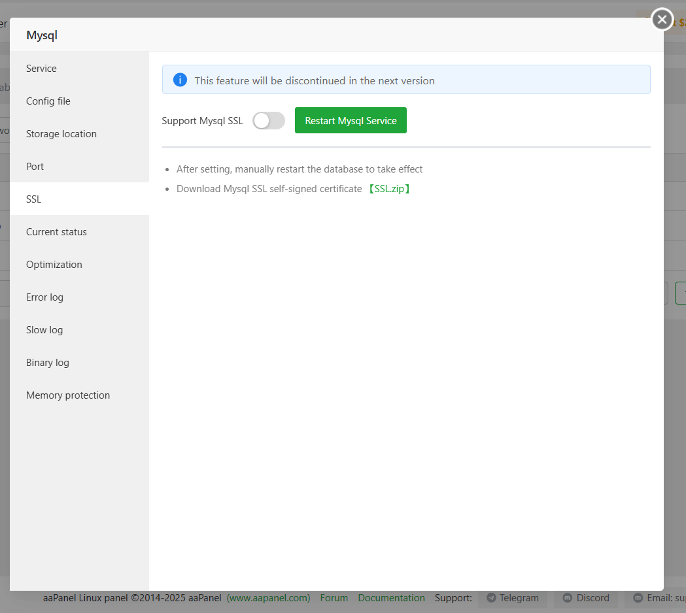
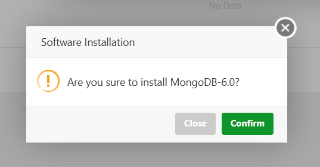

# aaPanel Database Modules 
- aaPanel hỗ trợ modules quản lý database 
	- Local và remote với các DB MySQL/MariaDB, MongoDB, Redis, PgSQL 
	- Remote với các DB SQLServer.

## MySQL/MariaDB
- Giao diện quản lý database 
- 		
- 		
- Các thành phần chính 
	- Nút thao tác `AutoBackup`: Bật để sử dụng tính năng `cron` tự động backup database 
	- 			
	- 			
	- Các nút chức năng
	- 			
		- Add DB: Tạo cơ sở dữ liệu mới.
		- Root password: Đặt hoặc thay đổi mật khẩu tài khoản root của MySQL.
		- phpMyAdmin: Mở công cụ quản lý cơ sở dữ liệu qua giao diện web.
		- Remote DB: Cấu hình cho phép truy cập cơ sở dữ liệu từ máy chủ khác.
		- Advanced Setup: Thiết lập nâng cao cho MySQL (tối ưu hiệu suất, bảo mật...).
		- Sync all: Đồng bộ thông tin cơ sở dữ liệu với hệ thống.
		- Get DB from server: Tải danh sách cơ sở dữ liệu hiện có từ máy chủ local/remote.
		- MySQL 10.xxx: Cấu hình dịch vụ server MySQL  
		- Tìm kiếm và phân trang: Cho phép tìm nhanh tài khoản và điều hướng nếu có nhiều tài khoản.
	- Bảng thông tin tài khoản : hiển thị danh sách các cơ sở dữ liệu đã tạo và cho phép bạn thực hiện các thao tác quản trị. Gồm các thông tin:
	- 				
		- Database name: Tên cơ sở dữ liệu.
		- Username: Tên người dùng được cấp quyền truy cập.
		- Password: Mật khẩu.
		- Quota: Giới hạn dung lượng lưu trữ (nếu có thiết lập).
		- Backup: Trạng thái sao lưu (ví dụ: đã sao lưu hay chưa).
		- Location: Vị trí lưu trữ cơ sở dữ liệu.
		- Note: Ghi chú để phân biệt hoặc mô tả mục đích sử dụng.
		- Các thao tác (Operate)
			- phpMyAdmin: Mở giao diện quản lý cơ sở dữ liệu qua trình duyệt.
			- Permission: Phân quyền truy cập cho người dùng.
			- Tools: Các công cụ hỗ trợ như xuất/nhập dữ liệu, tối ưu hóa, sửa lỗi.
			- Password: Đặt lại mật khẩu cho người dùng cơ sở dữ liệu.
			- Delete: Xóa cơ sở dữ liệu khỏi hệ thống.
### Các nút chức năng 
#### Add Database ( Add DB)  
- Sử dụng để thêm tài khoản mới.
- Click AddDB để mở giao diện thêm tài khoản mới 
- 				
- 				
- Giao diện này gồm thông số 
	- DB Name: Nhập tên cơ sở dữ liệu bạn muốn tạo.
	- Username: Tên người dùng sẽ được cấp quyền truy cập vào cơ sở dữ liệu.
	- Password: Mật khẩu cho người dùng. Có thể nhập thủ công hoặc dùng mật khẩu được tạo sẵn.
	- Permission: Chọn phạm vi quyền truy cập:
	- 				
		- Local server: Chỉ cho phép truy cập từ máy chủ nội bộ.
		- Everyone: Cho phép truy cập công khai.
		- Specific IP : Cho phép truy cập chỉ từ những IP được cấu hình. Điền IP cho phép mỗi dòng 1 IP 
		- 				

	- Add to: Chọn máy chủ sẽ lưu cơ sở dữ liệu:
	- Mặc định là LocalServer (127.0.0.1).
	- Có thể chọn Remote servers nếu bạn đã cấu hình máy chủ từ xa. Chọn `Remote Server` để thêm server Remote
		- 				
		- Chọn `Add remote DB` để thêm 
		- 
		- Cấu hình các thông tin: IP, username và password tài khoản quản trị, ghi chú. Sau đó click Confirm để thêm 
		- 				
	- Character set: Chọn bộ mã ký tự cho cơ sở dữ liệu:
		- Các tùy chọn phổ biến như utf-8, utf8mb4, gbk, big5.
		- utf8mb4 thường được khuyến nghị vì hỗ trợ đầy đủ emoji và ký tự đa ngôn ngữ.
	- Force SSL: Công tắc bật/tắt yêu cầu kết nối SSL khi truy cập cơ sở dữ liệu. Khi bật, chỉ cho phép kết nối an toàn qua SSL.
	- Nút thao tác
		- Cancel: Hủy thao tác tạo mới.
		- Confirm: Xác nhận tạo cơ sở dữ liệu với các thông tin đã nhập

- Ví dụ tạo mới tài khoản với DB 123
	- 				
	- 				

#### Root password
- Sử dụng cấu hình thay đổi mật khẩu tài khoản Root 
- 	
- Cấu hình thay đổi mật khẩu, click confirm để xác nhận thao tác đổi 
- 	
			
#### phpMyAdmin 
- Sử dụng để cấu hình phpMyAdmin
- 	
- Gồm các phần cấu hình 
	- Service
		- 	
		- Enable public access: Bật tắt/ truy cập công khai
		- Password Free Access: Truy cập không cần mật khẩu yêu cầu đăng nhập vào phpMyAdmin
		- Public Access: Mở trang đăng nhập phpMyAdmin khi nhấp vào
	- PHP: Kiểm tra và thay đổi phiên bản PHP mà phpMyAdmin sử dụng 
		- 	
	- Security Configuration 
		- 	
		- Access Port: Cấu hình cổng truy cập phpMyAdmin, có thể thay đổi và ấn `Save` để áp dụng 
		- Open SSL / SSL port: bật HTTPS với phpMyAdmin và có thể cấu hình thay đổi cổng hoạt động 
		- Access with password: Cấu hình giới hạn truy cập phpMyAdmin sử dụng tài khoản mật khẩu 

#### Remote DB 
- Sử dụng để cấu hình thêm server Mysql Remote 
- 	
- Click để mở giao diện quản lý. Click `Add` để thêm server 
- 
- Cấu hình các thông tin: IP, username và password tài khoản quản trị, ghi chú. Sau đó click Confirm để thêm 
- 	
- Lưu ý 
	- Hỗ trợ MySQL 5.5, MariaDB 10.1 trở lên
	- Hỗ trợ cơ sở dữ liệu đám mây từ các nhà cung cấp dịch vụ cloud
	- Vui lòng đảm bảo máy chủ này có quyền truy cập vào cơ sở dữ liệu
	- Vui lòng đảm bảo tài khoản quản trị bạn nhập có đủ quyền
	- Tài khoản root của cơ sở dữ liệu được cài đặt qua aaPanel mặc định không hỗ trợ quyền truy cập từ xa
	- Tường lửa của hệ điều hành máy chủ từ xa và nhóm bảo mật của nhà cung cấp dịch vụ cần mở cổng MySQL

#### Advanced Setup
- Sử dụng cấu hình nâng cao đối với các tài khoản 
- Click `Advanced Setup` để mở giao diện 
- 	
- 	
- Có thể thao tác thêm user mới bằng việc chọn `Add User`
- 	
- Cấu hình nâng cao cụ thể với từng user được liệt kê trong bảng 
	- Permission: Cấu hình quyền, click hiển thị giao diện liệt kê các quyền được cấp
	- 	
	- 	
		- Thêm quyền bằng cách chọn `Add Permission`
			- Chọn DB mà user cần thêm quyền , cụ thể user có quyền ở bảng nào ở phần `Database Privilege Correlation`
			- 	
			- Tích chọn quyền cần gán tại phần `Basic Permission`
			- Nhấn `Confirm` để xác nhận gán quyền 
	- Password: Cấu hình mật khẩu user, thay đổi bằng cách chọn `Password`, cấu hình tại giao diện thay đổi mật khẩu và chọn `Confirm` để xác nhận 
	- 	
	- 
	- Export: Click để xuất câu lệnh gán quyền cho user 
	- 
	- Delete: Click để xoá user trong server tương ứng 

#### Sync all 
- Sử dụng để đồng bộ tất cả cơ sở dữ liệu đang có 
	- 
#### Get DB from Server 
- Sử dụng để 
	- Lấy danh sách cơ sở dữ liệu từ MySQL cục bộ và đồng bộ vào aaPanel  
	- Lấy danh sách cơ sở dữ liệu từ máy chủ từ xa và đồng bộ vào aaPanel
	- 
#### Mysql 10.xx.xx
- Sử dụng để mở giao diện cấu hình dịch vụ Mysql 
	- 
- Gồm các phần cấu hình 
	- Service 
		- 
		- Các thao tác bật, tắt, khởi động lại Mysql 
		- Cấu hình alarm khi dừng dịch vụ 
			- 
			- Cấu hình bật alarm, thời gian kiểm tra, giới hạn gửi cảnh báo, phương thức gửi qua các nền tảng khác nhau 
	- Config 
		- 
		- Giao diện chỉnh sửa file cấu hình mysql trực quan hỗ trợ các phím tắt soạn thảo, tại đây có thể chỉnh sửa và Save để áp dụng 
	- Storage Location: 
		- 
		- Cấu hình thư mục lưu trữ mysql, có thể cấu hình thay đổi và chọn `move` để chuyển.
	- Port 
		- 
		- Cấu hình thay đổi port hoạt động của dịch vụ mysql 
	- SSL
		- 
		- Cấu hình SSL cho mysql, bật.tắt SSL cần restart lại dịch vụ mysql
		- Có thể tải xuống chứng chỉ SSL đang được áp dụng tại phần `SSL.ZIP`
	- Current status 
		- 
		- Hiển thị các thông số thống kê về hoạt động của Mysql 
		- Căn cứ vào các thông tin này có thể có kế hoặc tối ưu. 
	- Optimization
		- 
		- aaPanel cung cấp các plan tối ưu sẵn cho dung lượng RAM khả dụng cấu hình tại Optimization Plan
		- 
		- Max RAM Usage: Hiển thị dung lượng lớn nhất sử dụng RAM của dịch vụ.
		- Các thông số tối ưu tuỳ chỉnh.
		- Nút thao tác 
			- `SAVE` lưu cài đặt các thông số
			- `Restart Mysql Service` restart dịch vụ Mysql 
	- Error Log
		- 
		- Hiển thị các bản ghi lỗi của dịch vụ 
		- Có thể xoá bằng nút `Empty Logs`
	- Slow Log 
		- 
		- Hiển thị bản ghi báo cáo các truy vấn sql chậm 
		- Căn cứ để tối ưu
	- Binary Log 
		- 
		- Cấu hình bật/tắt sử dụng binary log 
			- Là tệp ghi lại toàn bộ các thao tác thay đổi dữ liệu trong MySQL (như thêm, sửa, xóa).
			- Dùng để phục hồi dữ liệu, sao lưu, hoặc đồng bộ hóa dữ liệu giữa các máy chủ (replication)
	- Memory protection 
		- 
		- Bật/tắt tính năng Memory protection
		- Memory Protection là một tính năng giúp ưu tiên tài nguyên bộ nhớ cho MySQL, nhằm đảm bảo dịch vụ này không bị hệ thống tự động dừng khi thiếu RAM.

### Bảng thông tin tài khoản 
- Giao diện quản lý cơ sở dữ liệu trong aaPanel, nơi bạn có thể theo dõi và thao tác với các database đã tạo. 
- 
- Mỗi dòng tương ứng với một cơ sở dữ liệu, gồm các thông tin:
	- Database name: Tên cơ sở dữ liệu 
	- Username: Tên người dùng được cấp quyền truy cập.
	- Password: Mật khẩu (được ẩn để bảo mật).
	- Quota: Giới hạn dung lượng. Click để mở giao diện cấu hình quota cho tài khoản (Pro)
		- 
	- Backup: Trạng thái sao lưu. 
		- Click `Not Exist / Exist(x)` để mở giao diện quản lý backup. Tại đây có thể thực hiện backup bằng nút `Backup`, thao tác sửa, tải xuống, xoá các bản backup đang có.
		- 
		- Click `Import` để import backup vào database 
		- 
	- Location: Vị trí lưu trữ (ở đây là localhost – máy chủ nội bộ).
	- Note: Ghi chú mô tả hoặc phân biệt database.
- Các nút chức năng:
	- phpMyAdmin: Mở giao diện quản lý cơ sở dữ liệu qua trình duyệt. Tương tự nút chức năng phpMyAdmin
	- Permission: Phân quyền truy cậZ cho người dùng. Cấu hình public hay local, giới hạn IP truy cập cấu hình sử dụng SSL hay không. 
		- 
	- Tools: Công cụ thao tác mới các bảng trong database thực hiện các thao tác sửa, tối ưu, convert sang định dạng MyISAM 
		- 
	- Password: Đặt lại mật khẩu cho người dùng.
		- 
	- Delete: Xóa cơ sở dữ liệu khỏi hệ thống.
		- 

## SQL Server 
- aaPanel hỗ trợ quản lý remote database sqlserver 
- Có thể cấu hình thêm remote bằng nút `Add remote DB`
- 
- Cấu hình các thông số : IP, port, tài khoản quản trị, ghi chú
- 
- Click `Confirm` để xác nhận thao tác thêm 
- Các thao tác quản lý tương tự mới mysql 

| Chức năng       | Mô tả                                                                 |
|------------------|----------------------------------------------------------------------|
| **Add DB**        | Thêm cơ sở dữ liệu vào SQL Server từ xa                             |
| **Remote DB**     | Thêm hoặc quản lý cơ sở dữ liệu trên các máy chủ từ xa              |
| **Sync all**      | Đồng bộ danh sách cơ sở dữ liệu từ aaPanel lên SQL Server từ xa     |
| **Get DB from server** | Lấy danh sách cơ sở dữ liệu từ máy chủ từ xa và đồng bộ vào aaPanel |
| **Database name** | Hiển thị tên cơ sở dữ liệu hiện tại                                 |
| **Username**      | Hiển thị tên người dùng hiện tại                                    |
| **Password**      | Xem, sao chép mật khẩu của cơ sở dữ liệu hiện tại                   |
| **Location**      | Hiển thị vị trí lưu trữ vật lý của cơ sở dữ liệu hiện tại           |
| **Note**          | Hiển thị ghi chú của cơ sở dữ liệu hiện tại                         |
| **CHG PW**        | Thay đổi mật khẩu của cơ sở dữ liệu hiện tại                        |
| **Delete**        | Xóa cơ sở dữ liệu hiện tại. Gợi ý: Hãy sao lưu trước khi xóa        |

## MongoDB
- aaPanel hỗ trợ quản lý mongoDB cả local và remote 
- Mặc định Mongodb không được cài đặt 
- Thực hiện cài đặt bằng cách click nút `Install` 
- 
- Chọn phiên bản và chọn `Submit`
- 
- Xác nhận cài đặt 
- 
- Giao diện tổng quan Mongodb Modules 
- 
- Gồm các thành phần 
	- Các nút chức năng
		- 
		- Add DB: Tạo cơ sở dữ liệu mới.
		- Root password: Đặt hoặc thay đổi mật khẩu tài khoản root của MongoDB.
		- Security authentication: Cấu hình xác thực bảo mật cho cơ sở dữ liệu.
		- Remote DB: Thiết lập truy cập cơ sở dữ liệu từ xa.
		- Sync all: Đồng bộ toàn bộ thông tin cơ sở dữ liệu với hệ thống.
		- Get DB from server: Lấy danh sách cơ sở dữ liệu từ máy chủ và đồng bộ vào aaPanel.
		- Mongodb 8.x.x: Hiển thị phiên bản MongoDB đang được cài đặt, click để mở giao diện quản lý Mongod 
	- Bảng danh sách các database: Gồm các cột thông tin 
		- 
		- Database name: Tên cơ sở dữ liệu.
		- Username: Tên người dùng có quyền truy cập cơ sở dữ liệu.
		- Password: Mật khẩu được ẩn để bảo mật.
		- Backup: Hiển thị trạng thái sao lưu. 
		- Position: Vị trí lưu trữ cơ sở dữ liệu.
		- Note: Ghi chú mô tả cơ sở dữ liệu, giúp dễ phân biệt.
		- Operate: Các thao tác có thể thực hiện như:
			- Password: Đặt lại mật khẩu.
			- Delete: Xóa cơ sở dữ liệu.

### Các nút chức năng 
#### Add Database (Add DB)   
- Sử dụng để thêm tài khoản mới.
- Click `AddDB` để mở giao diện thêm tài khoản mới 
- 				
- Giao diện này gồm thông số 
	- DB Name: Nhập tên cơ sở dữ liệu bạn muốn tạo.
	- Add to: Chọn máy chủ sẽ lưu cơ sở dữ liệu:
	- Mặc định là LocalServer (127.0.0.1).
	- Có thể chọn Remote servers nếu bạn đã cấu hình máy chủ từ xa. Chọn `Remote Server` để thêm server Remote
		- 				
		- Chọn `Add remote DB` để thêm 
		- 
		- Cấu hình các thông tin: IP, username và password tài khoản quản trị, ghi chú. Sau đó click Confirm để thêm 
		- 				
	- Nút thao tác
		- Cancel: Hủy thao tác tạo mới.
		- Confirm: Xác nhận tạo cơ sở dữ liệu với các thông tin đã nhập

- Ví dụ tạo mới tài khoản với DB Test_MG
	- 				
	- 				

#### Root password
- Sử dụng cấu hình thay đổi mật khẩu tài khoản Root 
- Cấu hình thay đổi mật khẩu, click confirm để xác nhận thao tác đổi 
- 	
			
#### Security authentication
- Sử dụng để bật tắt cấu hình bảo mật của mongod
- Mặc định tắt, cần bật để tăng tính bảo mật. 
- 	
- 	

#### Remote DB 
- Sử dụng để cấu hình thêm server Mongod Remote 
- Click để mở giao diện quản lý. Click `Add` để thêm server 
- 	
- Cấu hình các thông tin: IP, username và password tài khoản quản trị, ghi chú. Sau đó click Confirm để thêm 
- 	
#### Sync all 
- Sử dụng để đồng bộ tất cả cơ sở dữ liệu đang có 
	- 
#### Get DB from Server 
- Sử dụng để 
	- Lấy danh sách cơ sở dữ liệu từ Mongod cục bộ và đồng bộ vào aaPanel  
	- Lấy danh sách cơ sở dữ liệu từ máy chủ từ xa và đồng bộ vào aaPanel
	- 

#### Mongod 8.xx.xx
- Sử dụng để mở giao diện cấu hình dịch vụ Mongod  
	- 
- Gồm các phần cấu hình 
	- Service 
		- 
		- Các thao tác bật, tắt, khởi động lại Mongod 
		- Cấu hình alarm khi dừng dịch vụ 
			- Cấu hình bật alarm, thời gian kiểm tra, giới hạn gửi cảnh báo, phương thức gửi qua các nền tảng khác nhau 
	- Switch version – Chuyển đổi giữa các phiên bản Mongod:
		- 
		-  Giao diện này gồm  phần hiển thị phiên bản phần mềm: Hiển thị phiên bản Mongod đang sử dụng (ở đây là “Mongod 8.0”). Có thể chuyển đổi phiên bản nếu cần.
	- Database - Quản lý database hiện có. Click add Database để thêm mới 
		- 
	- Config - Quản lý các cấu hình hoạt động của Mongod
		- 
		- Gồm các thông số 
			- port: 27017 Cổng mặc định MongoDB lắng nghe. Thường không cần thay đổi.
			- bindIp: 127.0.0.1: Địa chỉ IP mà MongoDB sẽ lắng nghe. Mặc định chỉ cho phép truy cập nội bộ. Không nên thay đổi nếu không cần truy cập từ xa.
			- path: /www/server/mongodb/log/config.log : Đường dẫn lưu file log (nhật ký hoạt động).
			- dbPath: /www/server/mongodb/data:  Thư mục lưu trữ dữ liệu MongoDB.
			- pidFilePath: /www/server/mongodb/log/configsvr.pid:  Đường dẫn lưu file PID (Process ID) để theo dõi tiến trình MongoDB.
			- authorization: Bật chế độ xác thực người dùng. Khi bật, MongoDB yêu cầu đăng nhập bằng tài khoản hợp lệ để truy cập dữ liệu.
		- Nút thao tác:
			- Save: Lưu lại các thiết lập sau khi chỉnh sửa.
	- Config file  
		- 
		- Giao diện chỉnh sửa file cấu hình Mongod trực quan hỗ trợ các phím tắt soạn thảo, tại đây có thể chỉnh sửa và Save để áp dụng 
	- Log: Giao diện hiển thị trực quan bản ghi của server mongod 
		- 

### Bảng thông tin tài khoản 
- Giao diện quản lý cơ sở dữ liệu trong aaPanel, nơi bạn có thể theo dõi và thao tác với các database đã tạo. 
- 
- Mỗi dòng tương ứng với một cơ sở dữ liệu, gồm các thông tin:
	- Database name: Tên cơ sở dữ liệu.
	- Password: Mật khẩu (được ẩn bằng dấu sao). Có thể hiển thị mật khẩu bằng việc click icon hình con mắt hoặc sao chép mật khẩu nhanh bằng việc click icon sao chép cạnh mật khẩu 
		- 
	- Backup: Trạng thái sao lưu. 
		- Click `Not Exist / Exist(x)` để mở giao diện quản lý backup. Tại đây có thể thực hiện backup bằng nút `Backup`, thao tác sửa, tải xuống, xoá các bản backup đang có.
		- 
		- 
		- Click `Import` để import backup vào database 
		- 
		- 
	- Location: Vị trí lưu trữ (ở đây là localhost – máy chủ nội bộ).
	- Note: Ghi chú mô tả hoặc phân biệt database.
- Các nút chức năng:
	- Password: Đặt lại mật khẩu cho người dùng.
		- 
		- 
	- Delete: Xóa cơ sở dữ liệu khỏi hệ thống.
		- 
		- 
		
		

## Redis 
- aaPanel hỗ trợ quản lý Redis cả local và remote 
- Mặc định Redis không được cài đặt 
- Thực hiện cài đặt bằng cách click nút `Install` 
- 
- Chọn phiên bản và chọn `Submit`
- 
- Xác nhận cài đặt 
- 
- Giao diện tổng quan Redis Modules 
- 
- Gồm các thành phần 
	- Các nút chức năng
		- 
		- Add key: Tạo key mới.
		- Remote DB: Thiết lập truy cập service Redis từ xa.
		- Backup List: Quản lý backup của server Redis 
		- Clear DB: Dọn dẹp key. 
		- Redis 7.x.x: Hiển thị phiên bản Redis đang được cài đặt, click để mở giao diện quản lý Redis 
	- Bảng quản lý cơ sở dữ liệu dạng key-value: Gồm các phần 
		- 
		- Thanh tab phía trên
			- Các tab từ DB0 đến DB15 đại diện cho 16 database logic (theo mặc định Redis cung cấp 16 DB).
			- Mỗi tab hiển thị số lượng key đang có. Ví dụ: DB0 (1) nghĩa là DB0 có 1 key, các DB khác đang trống.
		- Bảng dữ liệu bên dưới: Hiển thị danh sách các key trong DB đang chọn, gồm các cột:
			- Key: Tên khóa 
			- Value: Giá trị tương ứng 
			- Data type: Kiểu dữ liệu 
			- Data length: Độ dài dữ liệu 
			- Term of validity: Thời gian sống còn lại của key (TTL),
			- Operate: Các thao tác có thể thực hiện:
				- Edit: Chỉnh sửa giá trị hoặc TTL
				- Delete: Xóa key khỏi database
### Các nút chức năng 
#### Add key 
- Sử dụng để cấu hình thêm key mới 
- 
- Tại giao diện cấu hình cấu hình thêm key 
	- Cấu hình DB cần thêm 
		- 
	- Tên của Key 
	- Gía trị của Key 
	- Thời gian tồn tại: tính bằng s 
	- Nút thao tác 
		- Cancel: Huỷ thao tác
		- Confirm : Xác nhận tạo key 
- Ví dụ tạo key mới 
- 
- 

#### Remote DB 
- Sử dụng để cấu hình thêm server Redis Remote 
- Click để mở giao diện quản lý. Click `Add` để thêm server 
- 	
- Cấu hình các thông tin: IP, password quản trị, ghi chú. Sau đó click Confirm để thêm 
- 	

#### Backup List 
- Quản lý backup của service Redis
- Click mở giao diện quản lý 
- 	
- Click `Backup` để tạo `Backup`
- 	
- Tại danh sách các bản backup có thể thực hiện các thao tác repair, delete 

#### Clear DB 
- Sử dụng để dọn dẹp cơ sở dữ liệu 
- Click mở giao diện xoá 
- 	
- Có thể tích chọn DB cần thao tác, hoặc xoá tất cả chọn `Select All`, click `Confirm` để xác nhận xoá 
- 	

#### Redis 7.xx.xx
- Sử dụng để mở giao diện cấu hình dịch vụ Redis  
	- 
- Gồm các phần cấu hình 
	- Service 
		- 
		- Các thao tác bật, tắt, khởi động lại Redis 
		- Cấu hình alarm khi dừng dịch vụ 
			- Cấu hình bật alarm, thời gian kiểm tra, giới hạn gửi cảnh báo, phương thức gửi qua các nền tảng khác nhau 
	- Switch version – Chuyển đổi giữa các phiên bản Redis:
		- 
		-  Giao diện này gồm  phần hiển thị phiên bản phần mềm: Hiển thị phiên bản Redis đang sử dụng (ở đây là “Redis 7.0”). Có thể chuyển đổi phiên bản nếu cần.
	- Optimization - Cấu hình các thông số tối ưu Redis 
		- 
		- Các thông số 
			- bind: 127.0.0.1: Chỉ cho phép truy cập Redis từ máy chủ nội bộ. Nếu thay đổi để cho phép truy cập từ xa, cần cẩn trọng vì có thể gây rủi ro bảo mật.
			- port: 6379:  Cổng mặc định Redis sử dụng để lắng nghe kết nối.
			- timeout: 0: Thời gian chờ kết nối không hoạt động. 0 nghĩa là không bao giờ tự ngắt kết nối.
			- maxclients: 10000: Số lượng kết nối tối đa mà Redis cho phép cùng lúc.
			- databases: 16:  Số lượng database logic Redis hỗ trợ (DB0 đến DB15).
			- requirepass: Mật khẩu truy cập Redis. Nếu để trống, bất kỳ ai kết nối được đều có toàn quyền truy cập.
			- maxmemory: 0: Giới hạn bộ nhớ Redis sử dụng (tính bằng MB). 0 nghĩa là không giới hạn.
		- Nút thao tác
			- Save: Lưu cấu hình 
			- Restart: Khởi động lại dịch vụ Redis 
	- Config file  
		- 
		- Giao diện chỉnh sửa file cấu hình Redis trực quan hỗ trợ các phím tắt soạn thảo, tại đây có thể chỉnh sửa và Save để áp dụng 
	- Current Status: Giao diện cung cấp thông tin các thống số thông kê hiện tại của dịch vụ. Nó cung cấp các thông số kỹ thuật giúp bạn theo dõi hiệu suất và sức khỏe của Redis theo thời gian thực. 
		- 
		- Gồm các thông tin 
		- Thông tin hệ thống
			- uptime_in_days: thời gian redis đã chạy 
			- tcp_port: 6379 – Cổng mặc định Redis đang sử dụng.
			- connected_clients: số client đang kết nối 
		- Bộ nhớ
			- used_memory: Dung lượng bộ nhớ Redis đang sử dụng cho dữ liệu.
			- used_memory_rss: Tổng bộ nhớ thực tế Redis chiếm dụng trong RAM.
			- mem_fragmentation_ratio: Tỷ lệ phân mảnh bộ nhớ. Giá trị cao có thể cho thấy Redis đang sử dụng bộ nhớ không hiệu quả.
		- Hiệu suất
			- total_connections_received: Tổng số kết nối Redis đã nhận từ khi khởi động.
			- total_commands_processed: Tổng số lệnh Redis đã xử lý.
			- instantaneous_ops_per_sec: Số lệnh xử lý mỗi giây tại thời điểm hiện tại (hiện đang không có hoạt động).
		- Tỷ lệ truy xuất dữ liệu
			- keyspace_hits: Số lần truy xuất key thành công.
			- keyspace_misses: Số lần truy xuất key thất bại.
			- hit: Tỷ lệ truy xuất thành công.
		- latest_fork_usec: Thời gian gần nhất Redis tạo tiến trình con (fork), tính bằng micro giây. Thường xảy ra khi sao lưu (RDB snapshot).
	- Set Persistence: cấu hình cơ chế lưu trữ dữ liệu (persistence) của Redis. Giao diện này cho phép bạn cấu hình hai phương thức chính: AOF và RDB.
		- 
		- Gồm các phần cấu hình 
		- Đường dẫn lưu trữ
			- Đây là nơi Redis sẽ lưu các tệp dữ liệu (AOF hoặc RDB).
			- Bạn có thể thay đổi đường dẫn này và nhấn Save để lưu lại.
		- AOF (Append-Only File)
			- Là cơ chế ghi lại mọi thao tác ghi dữ liệu vào một tệp log.
				- Append only: Close / Open 
				- 	
				- Append sync: 
				- 	
					- always: Redis sẽ ghi dữ liệu vào ổ đĩa sau mỗi lệnh ghi (write).
						→ Đảm bảo an toàn dữ liệu cao nhất, nhưng hiệu suất thấp hơn do ghi đĩa liên tục.
					- everysec (được chọn): Redis sẽ ghi dữ liệu vào ổ đĩa mỗi giây.
						→ Cân bằng giữa hiệu suất và độ an toàn. Đây là lựa chọn phổ biến nhất.
					- no: Redis không chủ động ghi dữ liệu, mà để hệ điều hành quyết định khi nào flush dữ liệu ra đĩa.
						→ Hiệu suất cao nhất, nhưng có nguy cơ mất dữ liệu nếu hệ thống gặp sự cố.
			- Chỉnh sửa cấu hình và lưu lại bằng nút Save.
		- RDB (Redis Database Backup)
			- Là cơ chế chụp nhanh dữ liệu tại các thời điểm nhất định.
			- Các điều kiện lưu RDB ở đây là:
				- Sau 900 giây nếu có ít nhất 1 thay đổi.
				- Sau 300 giây nếu có ít nhất 10 thay đổi.
				- Sau 60 giây nếu có ít nhất 10.000 thay đổi.
			- Bạn có thể điều chỉnh các điều kiện này và nhấn Save để áp dụng.
### Bảng quản lý cơ sở dữ liệu dạng key-value
- Giao diện quản lý cơ sở dữ liệu trong aaPanel, nơi bạn có thể theo dõi và thao tác với các key đã tạo. 
- 	
- Có thể chuyển qua lại giữa các DB 0 -15 bằng các tab 
- Danh sách các key có trong DB mỗi dòng tương ứng với 1 key cung cấp các thông tin và thao tác 
	- Key: Tên khóa 
	- Value: Giá trị tương ứng 
	- Data type: Kiểu dữ liệu 
	- Data length: Độ dài dữ liệu 
	- Term of validity: Thời gian sống còn lại của key (TTL),
	- Operate: Các thao tác có thể thực hiện:
		- Edit: Chỉnh sửa giá trị hoặc TTL: Click để chỉnh sửa cấu hình của key 
		- 	
		- Delete: Xóa key khỏi database: CLick để xoá bỏ key 
		- 	
	

## PgSQL 
- aaPanel hỗ trợ quản lý pgSQL cả local và remote 
- Mặc định pgSQL không được cài đặt 
- Thực hiện cài đặt bằng cách click nút `Install` 
- 
- Chọn phiên bản và chọn `Submit`
- 
- Xác nhận cài đặt 
- 
- Xác nhận cài đặt plugin bên thứ 3 
- 
- Giao diện tổng quan pgSQL Modules 
- 
- Gồm các thành phần 
	- Các nút chức năng
		- 
		- Add DB: Tạo Database mới.
		- Root Password: Cấu hình mật khẩu tài khoản root
		- Remote DB: Thiết lập truy cập service PgSQL từ xa.
		- Sync all: Đồng bộ toàn bộ thông tin cơ sở dữ liệu với hệ thống.
		- Get DB from server: Lấy danh sách cơ sở dữ liệu từ máy chủ và đồng bộ vào aaPanel.
	- Bảng danh sách các database: Gồm các cột thông tin 
		- 
		- Database name: Tên cơ sở dữ liệu.
		- Username: Tên người dùng có quyền truy cập cơ sở dữ liệu.
		- Password: Mật khẩu được ẩn để bảo mật.
		- Backup: Hiển thị trạng thái sao lưu. 
		- Position: Vị trí lưu trữ cơ sở dữ liệu.
		- Note: Ghi chú mô tả cơ sở dữ liệu, giúp dễ phân biệt.
		- Operate: Các thao tác có thể thực hiện như:
			- Password: Đặt lại mật khẩu.
			- Delete: Xóa cơ sở dữ liệu.
### Các nút chức năng 
#### Add Database (Add DB)   
- Sử dụng để thêm tài khoản mới.
- Click `AddDB` để mở giao diện thêm tài khoản mới 
- 				
- Giao diện này gồm thông số 
	- DB Name: Nhập tên cơ sở dữ liệu bạn muốn tạo.
	- Username: Tên tài khoản muốn tạo
	- password: Mật khẩu tài khoản muốn tạo, có thể cấu hình hoặc sử dụng password được sinh tự động
	- Add to: Chọn máy chủ sẽ lưu cơ sở dữ liệu: Mặc định là LocalServer (127.0.0.1).
	- Có thể chọn Remote servers nếu bạn đã cấu hình máy chủ từ xa. Chọn `Remote Server` để thêm server Remote
		- 				
		- Chọn `Add remote DB` để thêm 
		- 
		- Cấu hình các thông tin: IP, username và password tài khoản quản trị, ghi chú. Sau đó click Confirm để thêm 
	- Nút thao tác
		- Cancel: Hủy thao tác tạo mới.
		- Confirm: Xác nhận tạo cơ sở dữ liệu với các thông tin đã nhập

- Ví dụ tạo mới DB Customer 
	- 				
	- 				

#### Root password
- Sử dụng cấu hình thay đổi mật khẩu tài khoản Root 
- Cấu hình thay đổi mật khẩu, click confirm để xác nhận thao tác đổi 
- 	
			
#### Remote DB 
- Sử dụng để cấu hình thêm server PgSQL Remote 
- Click để mở giao diện quản lý. Click `Add` để thêm server 
- 	
- Cấu hình các thông tin: IP, username và password tài khoản quản trị, ghi chú. Sau đó click Confirm để thêm 
- 	
#### Sync all 
- Sử dụng để đồng bộ tất cả cơ sở dữ liệu đang có 
	- 
#### Get DB from Server 
- Sử dụng để 
	- Lấy danh sách cơ sở dữ liệu từ PgSQL cục bộ và đồng bộ vào aaPanel  
	- Lấy danh sách cơ sở dữ liệu từ máy chủ từ xa và đồng bộ vào aaPanel
	- 

### Bảng thông tin tài khoản 
- Giao diện quản lý cơ sở dữ liệu trong aaPanel, nơi bạn có thể theo dõi và thao tác với các database đã tạo. 
- 
- Mỗi dòng tương ứng với một cơ sở dữ liệu, gồm các thông tin:
	- Database name: Tên cơ sở dữ liệu.
	- Password: Mật khẩu (được ẩn bằng dấu sao). Có thể hiển thị mật khẩu bằng việc click icon hình con mắt hoặc sao chép mật khẩu nhanh bằng việc click icon sao chép cạnh mật khẩu 
		- 
	- Backup: Trạng thái sao lưu. 
		- Click `Not Exist / Exist(x)` để mở giao diện quản lý backup. Tại đây có thể thực hiện backup bằng nút `Backup`, thao tác sửa, tải xuống, xoá các bản backup đang có.
		- 
		- 
		- Click `Import` để import backup vào database 
		- 
		- 
	- Location: Vị trí lưu trữ (ở đây là localhost – máy chủ nội bộ).
	- Note: Ghi chú mô tả hoặc phân biệt database.
- Các nút chức năng:
	- Password: Đặt lại mật khẩu cho người dùng.
		- 
	- Delete: Xóa cơ sở dữ liệu khỏi hệ thống.
		- 
		
		