# aaPanel Monitor Modules 
- aaPanel cung cấp trình giám sát hệ thống 
- Tại đây bạn có thể giám sát CPU, bộ nhớ, mạng, ổ cứng; các tình trạng như CPU cao, bộ nhớ cao, v.v... 
- 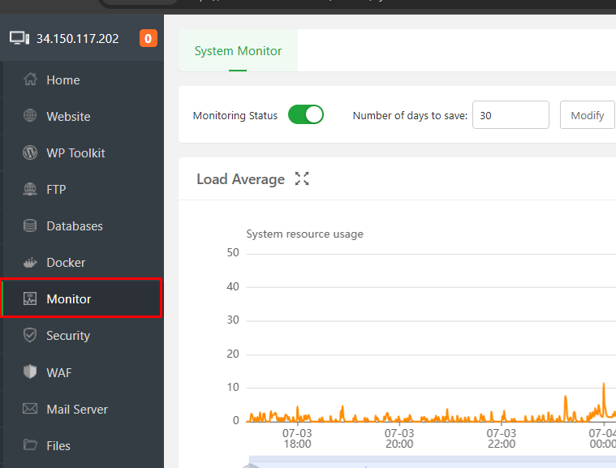
- Giao diện tổng quan module Monitor 
- 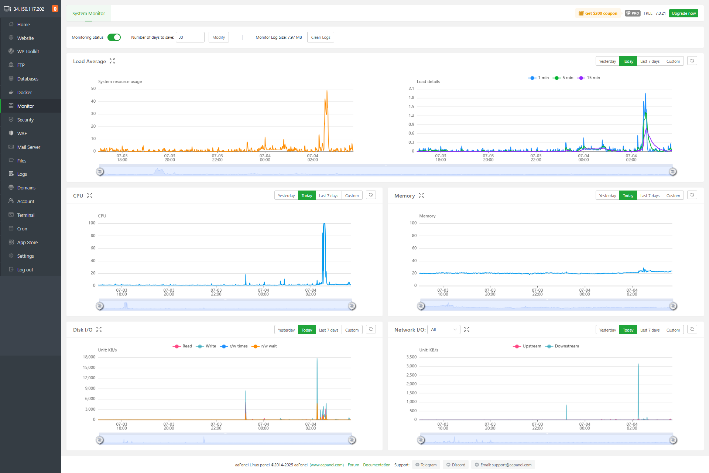
- Gồm các phần 
	- Thanh công cụ quản lý Monitor 
	- 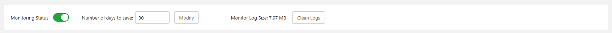
	- Các biểu đồ Monitor của các thông số 
		- Load Average 
		- CPU
		- Memory 
		- Disk I/O
		- Network I/O 

## Thanh công cụ 
- Thanh quản lý bật tắt tính năng Monitor, cấu hình
- Gồm các phần 
	- Nút bật tắt monitor 
	- Cấu hình thời gian lưu dữ liệu giám sát: Cấu hình thay đổi thời gian và click `Modify` để sửa.
		- 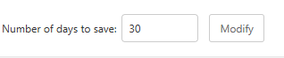
	- Monitor Log Size: Hiển thị dung lượng bản ghi dữ liệu, có thể thao tác xoá bằng việc click `Clean logs` 
		- 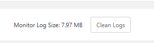

## Các biển đồ monitor 
- Với mỗi biểu đồ aaPanel cung cấp tính năng có thể view trạng thái theo ngày: hôm nay, hôm qua, 7 ngày gần nhất hoặc theo thời gian cụ thể 
- 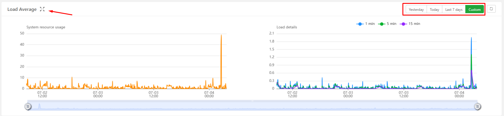
- 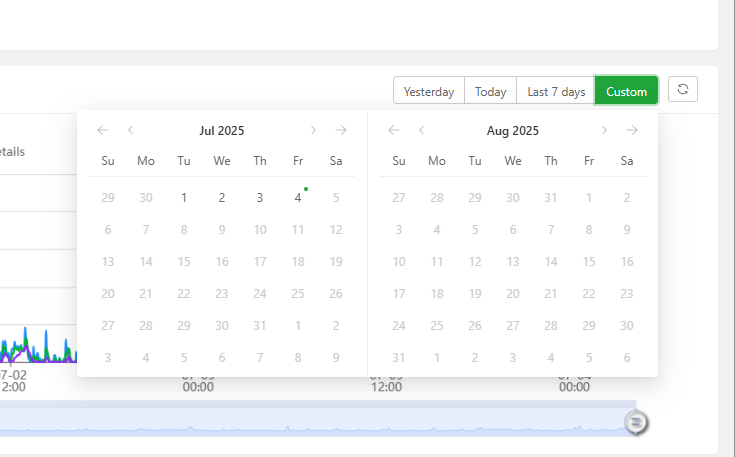
- Bên cạnh đó bạn có thể mở biểu đồ full-screen bằng cách click vào icon cạnh tên biểu đồ. 
- 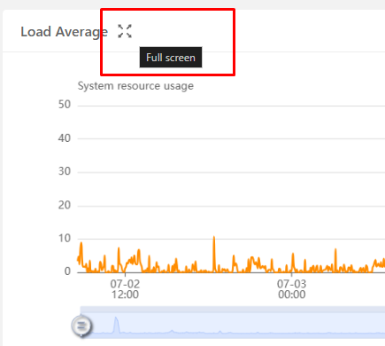
- Có thể làm mới dữ liệu thủ công bằng icon refresh 
- 
- Bằng việc di chuột vào biểu đồ. Một pop-up thông tin chi tiết về giá trị tại từng thời điểm sẽ hiện lên. 
- 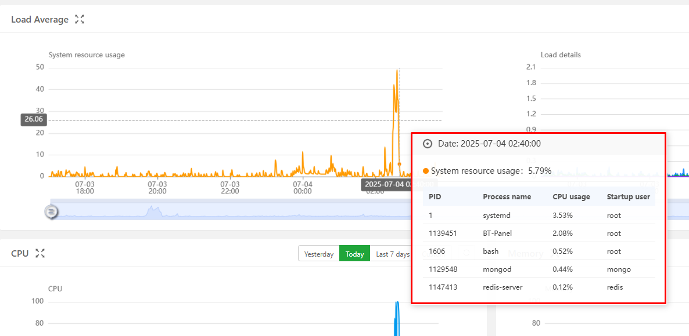
- Với mỗi biểu đồ aaPanel cung cấp 1 thanh time-line giúp bạn tuỳ biến khoảng thời gian cần giám sát 
- 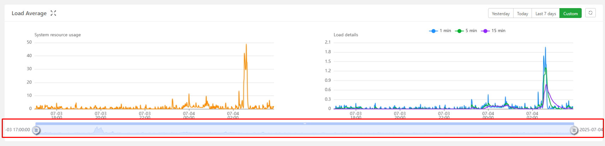

### Load Average
- Đây là biểu đồ thể hiện trạng thái tải của server 
- 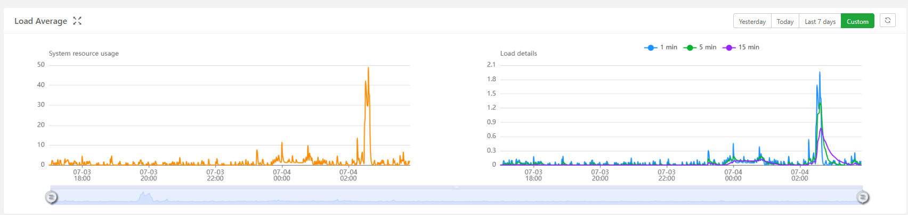
- Gồm 2 biểu đồ nhỏ 
	- System resource usage: thể hiện xu hướng sử dụng tài nguyên hệ thống 
		- 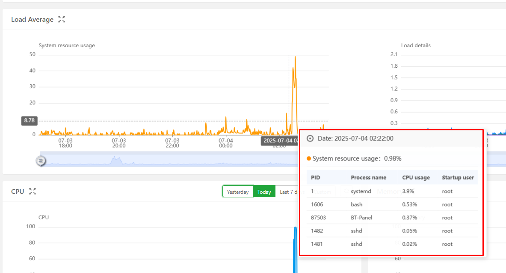
		- Khi rê chuột vào thời điểm cụ thể, hệ thống hiển thị danh sách các tiến trình đang chạy lúc đó, bao gồm:
			- PID: Mã định danh tiến trình.
			- Process name: Tên tiến trình.
			- CPU usage: Mức sử dụng CPU của tiến trình.
			- Startup user: Người dùng khởi chạy tiến trình.
		- Giao diện này giúp bạn:
			- Theo dõi mức tải hệ thống theo thời gian thực.
			- Xác định thời điểm hệ thống bị quá tải.
			- Kiểm tra tiến trình nào đang tiêu tốn tài nguyên tại thời điểm cụ thể.
	- Load Details: thể hiển mức tải trung bình của hệ thống trong 1 phút, 5 phút và 15 phút.
		- 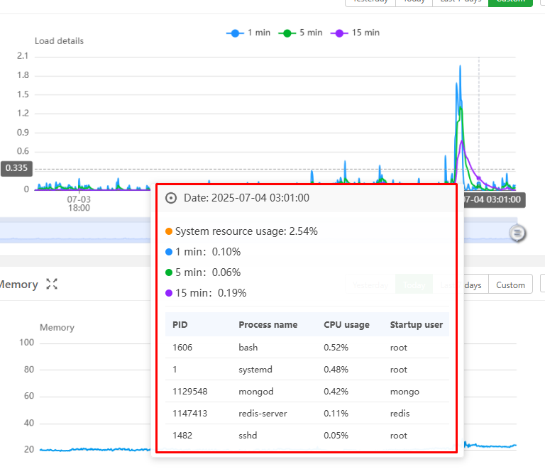
		- Mỗi đường màu đại diện cho một khoảng thời gian:
			- Màu xanh dương: 1 phút
			- Màu xanh lá: 5 phút
			- Màu tím: 15 phút
		- Khi rê chuột vào thời điểm cụ thể, hệ thống hiển thị bảng các tiến trình đang hoạt động tại thời điểm đó, gồm:
			- PID: Mã định danh tiến trình
			- Process name: Tên tiến trình
			- CPU usage: Mức sử dụng CPU
			- Startup user: Người dùng khởi chạy tiến trình
		- Biểu đồ giúp bạn theo dõi xu hướng tải hệ thống theo thời gian và phát hiện các thời điểm bất thường.

### CPU 
- Biểu đồ giám sát mức sử dụng CPU theo thời gian 
- 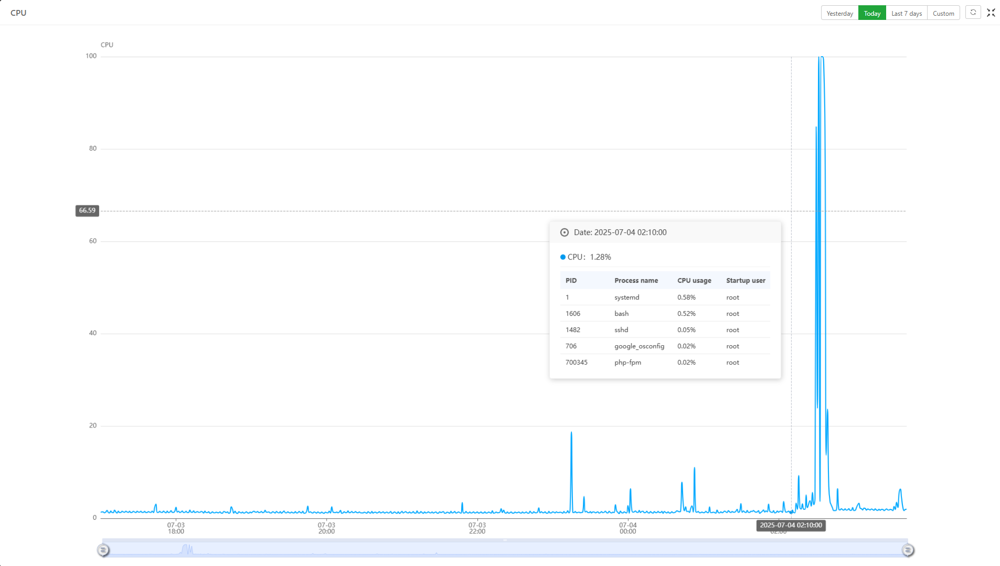
- Hiển thị mức sử dụng CPU theo từng thời điểm, giúp bạn quan sát xu hướng tăng giảm.
- Khi rê chuột vào thời điểm cụ thể, hệ thống hiển thị danh sách các tiến trình đang chạy và mức sử dụng CPU của từng tiến trình:
	- PID: Mã định danh tiến trình
	- Process name: Tên tiến trình
	- CPU usage: Mức sử dụng CPU
	- Startup user: Người dùng khởi chạy tiến trình
- Giao diện này giúp bạn:
	- Theo dõi mức sử dụng CPU theo thời gian thực.
	- Phát hiện các thời điểm hệ thống bị quá tải.
	- Xác định tiến trình nào đang tiêu tốn tài nguyên tại thời điểm cụ thể.

### RAM 
- Biểu đồ giám sát mức sử dụng RAM theo thời gian 
- 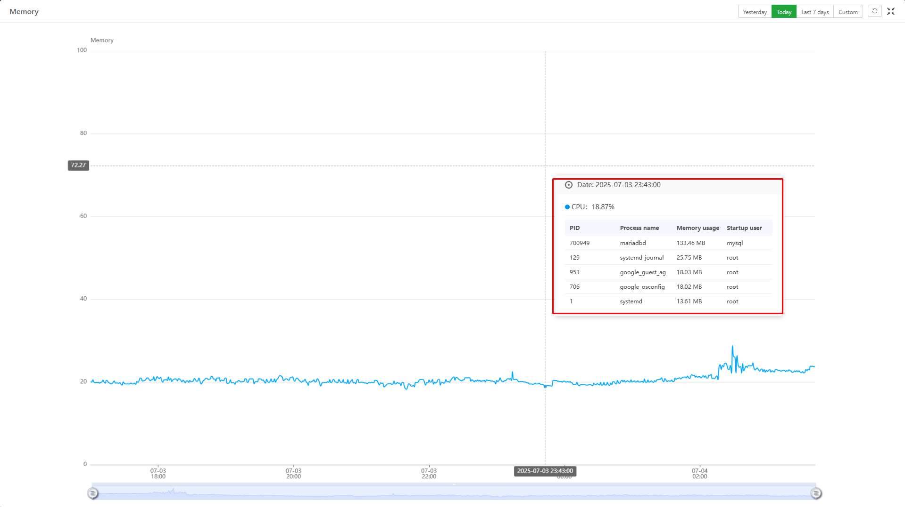
- Hiển thị mức sử dụng RAM theo từng thời điểm, giúp bạn quan sát xu hướng tăng giảm.
- Khi rê chuột vào thời điểm cụ thể, hệ thống hiển thị danh sách các tiến trình đang chạy và mức sử dụng RAM của từng tiến trình:
	- PID: Mã định danh tiến trình
	- Process name: Tên tiến trình
	- Memory Usage: Mức sử dụng CPU
	- Startup user: Người dùng khởi chạy tiến trình
- Giao diện này giúp bạn:
	- Theo dõi mức sử dụng RAM  theo thời gian thực.
	- Giúp phát hiện tiến trình ngốn bộ nhớ bất thường.
	- Hỗ trợ chẩn đoán nguyên nhân gây chậm hệ thống hoặc tràn RAM.
	- Cung cấp dữ liệu để tối ưu hóa cấu hình dịch vụ hoặc nâng cấp tài nguyên.

### Disk I/O 
- 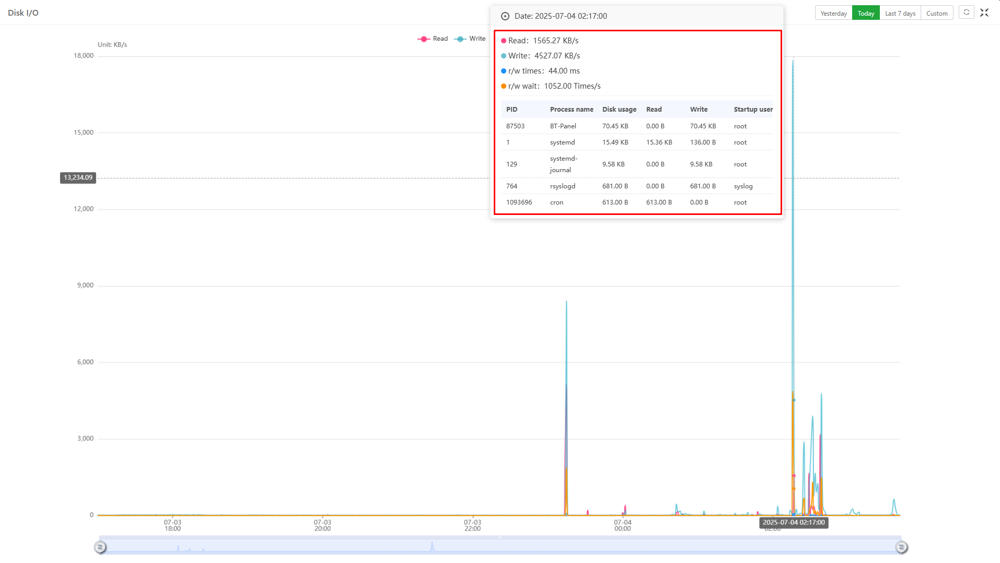
- Biểu đồ giám sát hoạt động đọc/ghi ổ đĩa (Disk I/O) trong aaPanel.
- Nó cho phép bạn theo dõi mức độ sử dụng ổ cứng theo thời gian và xác định các tiến trình đang tác động đến đĩa tại từng thời điểm cụ thể.
- Biểu đồ Disk I/O: Hiển thị tốc độ đọc (read) và ghi (write) dữ liệu trên ổ đĩa theo thời gian. Mỗi loại hoạt động được biểu diễn bằng màu riêng biệt (ví dụ: đỏ cho đọc, xanh cho ghi).
- Khi rê chuột vào thời điểm cụ thể, hệ thống hiển thị:
	- Tốc độ đọc và ghi tại thời điểm đó.
	- Số lần đọc/ghi mỗi giây và thời gian phản hồi trung bình.
	- Danh sách các tiến trình đang sử dụng ổ đĩa, kèm theo lượng dữ liệu đọc/ghi và người dùng khởi chạy.
- Giao diện này: 
	- Giúp phát hiện tiến trình gây tải đĩa cao.
	- Hỗ trợ chẩn đoán nguyên nhân hệ thống phản hồi chậm do I/O.
	- Cung cấp dữ liệu để tối ưu hóa dịch vụ hoặc phân bổ lại tài nguyên lưu trữ.

### Network I/O 
- 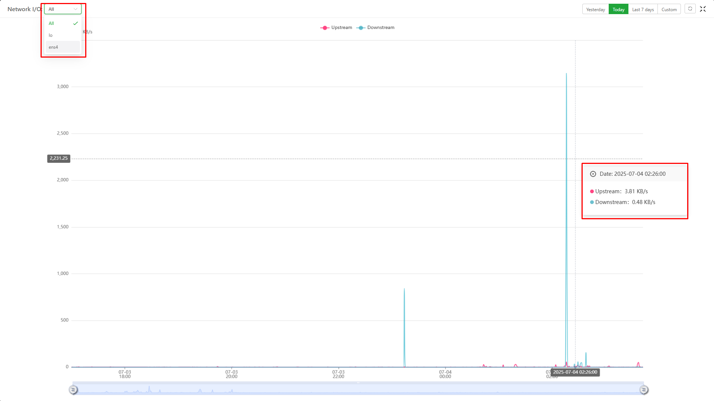
- Biểu đồ giám sát hoạt động mạng (Network I/O) trong aaPanel. Nó giúp bạn theo dõi lưu lượng dữ liệu vào và ra của máy chủ theo thời gian. 
- Giao diện này dùng để kiểm soát tình trạng sử dụng mạng, phát hiện các thời điểm có lưu lượng tăng đột biến hoặc bất thường, từ đó hỗ trợ chẩn đoán các vấn đề liên quan đến kết nối hoặc bảo mật.
- Biểu đồ lưu lượng mạng: Hiển thị tốc độ truyền dữ liệu:
	- Upstream (gửi đi): thường là dữ liệu máy chủ gửi ra ngoài.
	- Downstream (nhận vào): dữ liệu máy chủ nhận từ bên ngoài.
- Chọn giao diện mạng: Bạn có thể lọc theo từng card mạng như lo (nội bộ), ens4 (mạng chính), hoặc xem tất cả.
- Chọn khoảng thời gian: Xem dữ liệu theo ngày hôm nay, hôm qua, 7 ngày gần nhất hoặc tùy chỉnh.
- Chi tiết tại thời điểm cụ thể: Khi rê chuột vào biểu đồ, bạn sẽ thấy tốc độ gửi/nhận tại thời điểm đó.
- Giao diện này: 
	- Giúp phát hiện các tiến trình hoặc dịch vụ đang sử dụng băng thông lớn.
	- Hỗ trợ chẩn đoán sự cố mạng hoặc tấn công bất thường (như DDoS).
	- Cung cấp dữ liệu để tối ưu hóa cấu hình mạng hoặc phân tích hiệu suất hệ thống.
