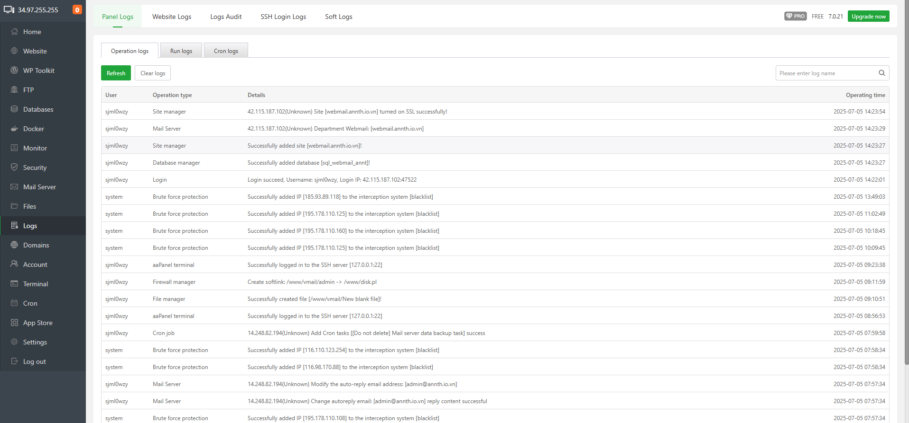
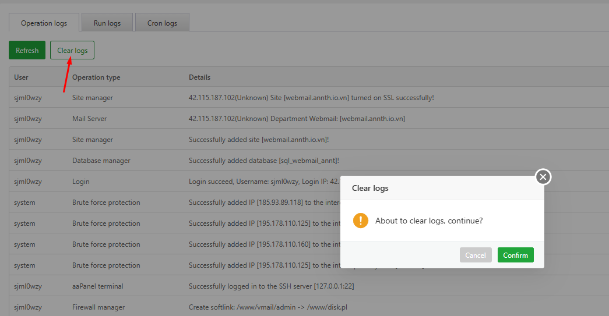
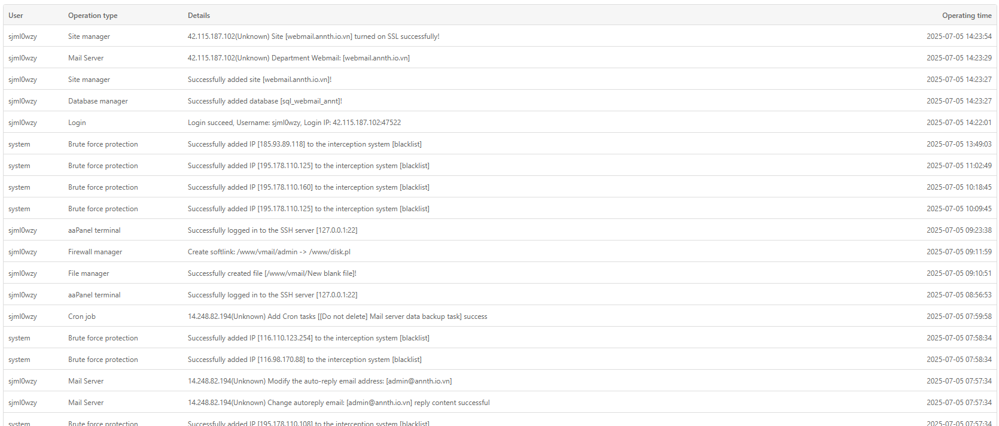
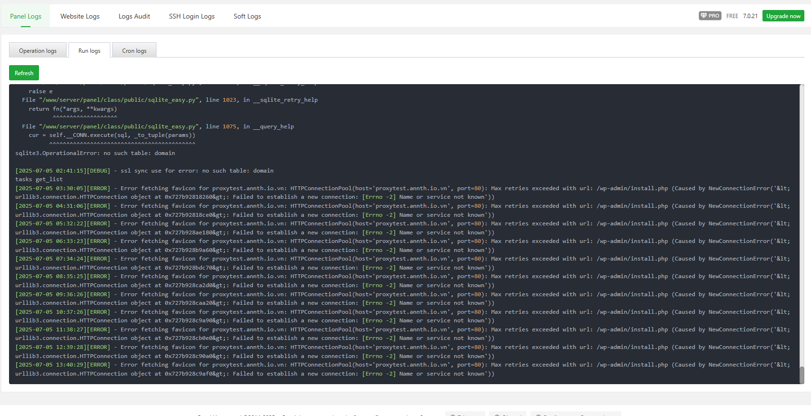
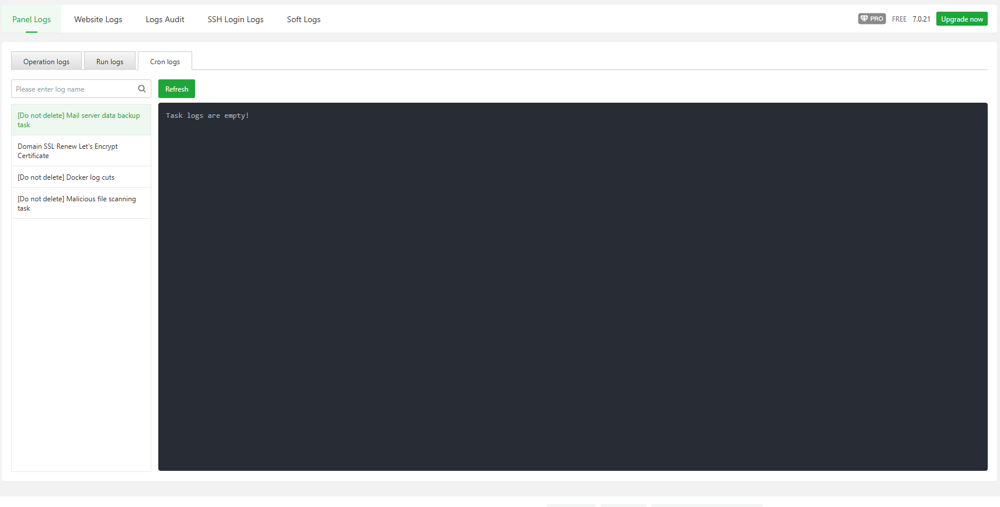
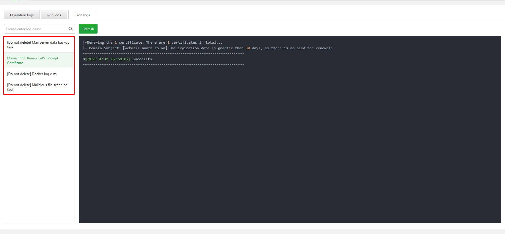
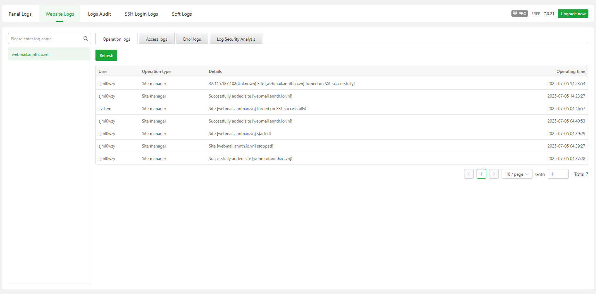
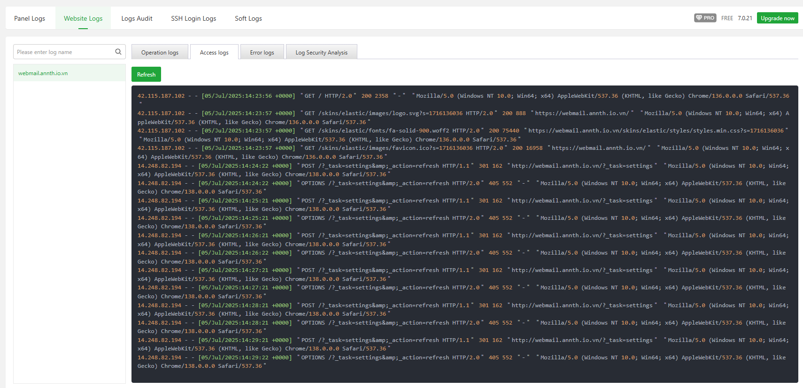
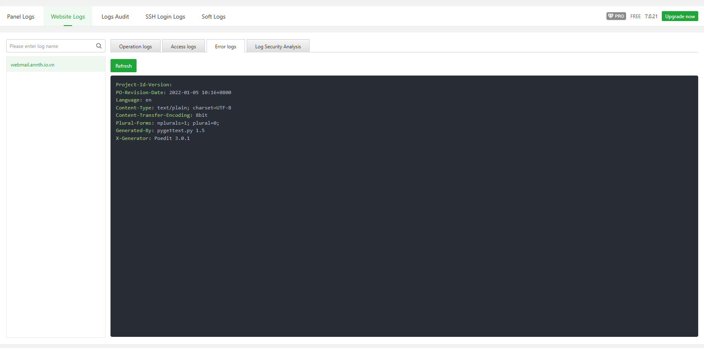
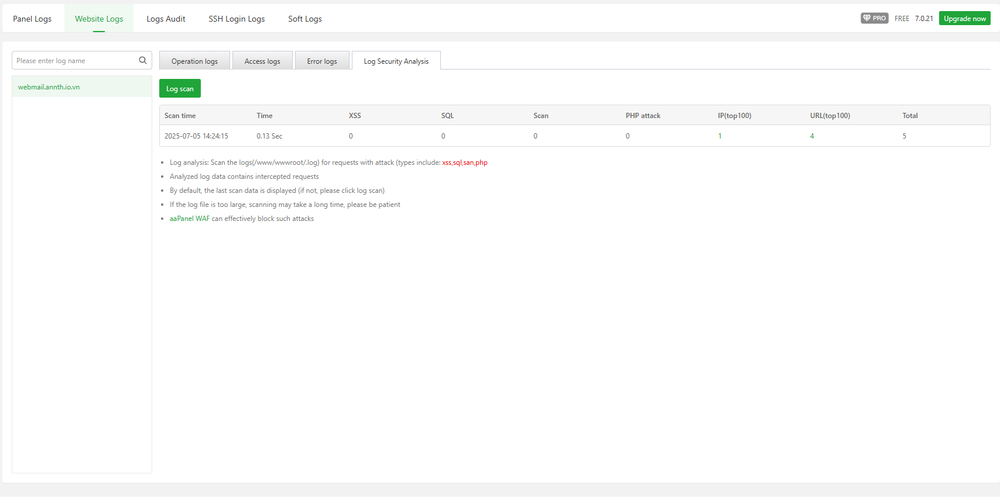

# aaPanel Logs Modules 
- Module quản lý bản ghi nhật ký 
- Bạn có thể xem nhật ký của aaPanel, nhật ký hệ điều hành, nhật ký phần mềm, v.v
- Với modules này có thể quản lý 
- Panel Log 
- Website Log 
- Logs Audit (Pro)
- SSH Login Logs (Pro)
- Soft Logs (Pro)
## Panel Log 
- Giao diện quản lý các bản ghi của Panel aaPanel 
- 
- Gồm các tab bản ghi
	- Operation Log: Bản ghi các thao tác thực hiện 
		- 
		- Các nút chức năng 
			- Refresh: làm mới 
			- Clear Logs: Xóa log 
			- 
		- Danh sách các thao tác đã thực hiện 
			- 
			- User: người dùng thực hiện 
			- Operation Type: Loại thao tác 
			- Details: Thông tin chi tiết 
			- Operating time: Thời gian thao tác 
	- Run Logs: Hiển thị các bản ghi quá trình chạy của panel. Có thể làm mới bằng nút `Refresh`
		- 
	- Cron logs: Hiển thị bản ghi của các `Cron`. Có thể làm mới bằng nút `Refresh`
		- 
	- Có thể chọn các Cron để kiểm tra bản ghi 
		- 

## Website log 
- Giao diện quản lý bản ghi của các website trong panel 
- Gồm các tab bản ghi 
	- Operation Log:  Bản ghi các thao tác thực hiện kèm danh sách các thao tác đã thực hiện. Có thể làm mới bằng nút `Refresh`
		- 
		- User: người dùng thực hiện 
		- Operation Type: Loại thao tác 
		- Details: Thông tin chi tiết 
		- Operating time: Thời gian thao tác 
	- Access Log: Bản ghi nhật ký truy cập. Có thể làm mới bằng nút `Refresh`
		- 
	- Error Log: Bản ghi nhật ký lỗi. Có thể làm mới bằng nút `Refresh`
		- 
	- Log Security Analysis: Giao diện ghi lại lịch sử phân tích bảo mật bản ghi 
		- 
	- Có thể chuyển qua lại giữa các website để kiểm tra bản ghi 