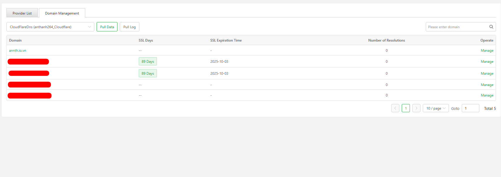
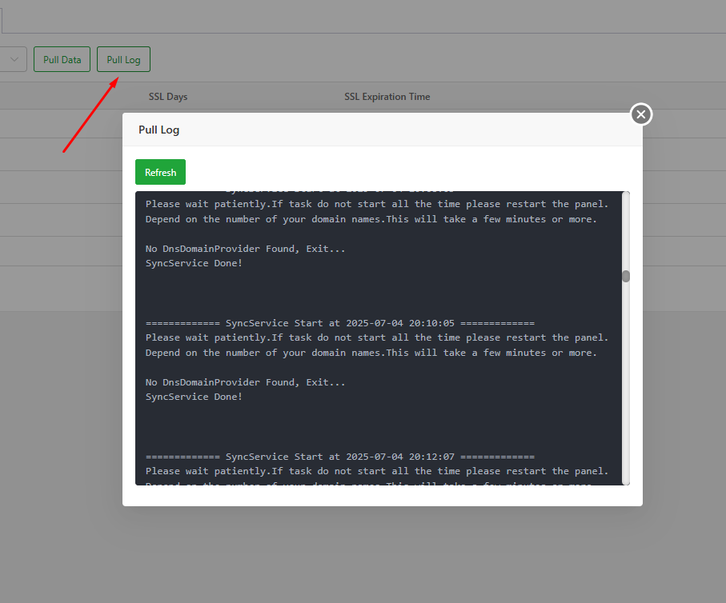
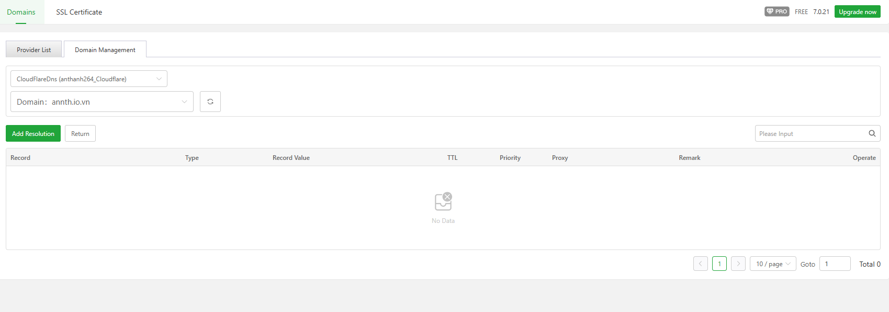

# aaPanel Domains Modules 
- Module quản lý tên miền tích hợp và aaPanel 
- Trung tâm Quản lý Tên Miền của aaPanel cho phép bạn hợp nhất các tài khoản từ nhiều nhà cung cấp tên miền mà không cần chuyển đổi nền tảng DNS.
- Module này gồm 2 phần 
	- Quản lý Domain 
	- Quản lý chứng chỉ DNS 

## Domain 
- Giao diện quản lý domain 
- 
- Gồm các tab 	
	- Provider List: Quản lý tích hợp các nền tảng DNS 
	- Domain Management: Quản lý các tên miền đã tích hợp 
### Provider List
- Quản lý tích hợp các bên cung cấp DNS 
- Thêm mới DNS Provider bằng nút `Integrate DNS Provider API`
	- 
	- Status (Bật/Tắt): Công tắc này đang bật, nghĩa là tích hợp API đang được kích hoạt.
	- Name (Tên nhà cung cấp DNS): Chọn nhà cung cấp DNS cần tích hợp 
	- 
	- API User: Trường để nhập tên người dùng API từ nhà cung cấp DNS.
	- API Key: Trường để nhập khóa API – dùng để xác thực và truy cập vào tài khoản DNS.
	- Alias (Bí danh): Tên định danh bạn đặt cho kết nối này, giúp dễ quản lý nếu có nhiều tài khoản.
	- API-Limit (Giới hạn API): Công tắc này đang tắt – có thể dùng để bật giới hạn số lượng truy cập API.
	- Nút “Cancel” và “Confirm”: Dùng để hủy hoặc xác nhận việc tích hợp.
- Danh sách các bên đã tích hợp 
	- 
	- Alias (Bí danh): tên định danh bạn đặt cho tài khoản DNS.
	- Account (Tài khoản): Tài khoản DNS Provider
	- Certificate Brand (Thương hiệu chứng chỉ): cho biết tài khoản này thuộc nhà cung cấp DNS nào.
	- Status (Trạng thái): Công tắc đang bật, nghĩa là tài khoản DNS này đang hoạt động.
	- Permission (Quyền hạn): limit cho biết tài khoản này có giới hạn quyền truy cập hoặc thao tác.
	- Domains (Tên miền): Hiển thị số tên miền đang được quản lý thông qua tài khoản này.
	- Operate (Thao tác): Các nút thao tác gồm:
		- Domain Management: Quản lý các tên miền liên kết với tài khoản này.
		- 
		- Edit: Chỉnh sửa thông tin tài khoản DNS.
		- 
		- Delete: Xóa tài khoản DNS khỏi hệ thống.
		- 
	
### Domain Management
- Giao diện quản lý tên miền đã tích hợp 
	- 
- Có thể cấu hình chọn từ danh sách các nhà cung cấp DNS 
	- 
- Nút chức năng 
	- Pull Data : Dữ liệu về tên miền từ nhà cung cấp
	- 
	- Pull Log : Hiển thị bản ghi quá trình kéo bản ghi 
	- 
- Bảng chi tiết các tên miền 
	- Domain : Tên domain 
	- SSL days: Hiển thi số ngày chứng chỉ SSL còn hạn 
	- SSL Expiration Time: Hiển thị ngày tháng chứng chỉ hết hạn 
	- Number of Resolutions: Số lượng bản ghi có trong tên miền 
    - Nút thao tác; Manage chuyển tới giao diện thêm. chỉnh sửa bản ghi 
	- 
	- Click chọn `Add Resolution` để cấu hình thêm bản ghi. 
	- 
	- Sau khi đã tạo DNS được hiển thị ở bảng bên dưới
	- Record: tên bản ghi 
	- Type: Loại bản ghi 
	- Record Value: Gía trị bản ghi 
	- TTL: Time to live 
	- Priority : Kiểu ưu tiên 
	- Proxy: gạt bật/tắt sẽ sử dụng proxy 
	- Remark : Ghi chú
	- Operate
		- Edit: Chỉnh sửa cấu hình bản ghi 
		- 
		- Delete: Xóa bản ghi 
		
## SSL Certificate
- Giao diện quản lý chứng chỉ SSL 
	- 
- Gồm  các tab `Business`, `Let'sEncrypt`
### Business Certificate
- Giao diện chứng chỉ doanh nghiệp
- Có thể thêm bằng nút `Apply for SSL` 
	- 

### Let's Encrypt 
- Giao diện quản lý chứng chỉ lấy từ Let's Encrypt
	- 

- Giao diện này gồm 
	- Các nút chúc năng 
		- Apply For SSL : Cấu hình lấy chứng chỉ 
			- 
		- Upload Certificate: Tải lên chứng chỉ đã có  
			- 
		- One-Click renewal : Yêu cầu renew chứng chỉ 
			- 
- Danh sách các chứng chỉ 
	- 
	- Certificate Brand: Loại chứng chỉ đang dùng là Let's Encrypt – miễn phí và phổ biến.
	- Authenticated Domain: Tên miền được cấp chứng chỉ.
	- Validity Period: thời hạn chứng chỉ có hiệu lực.
	- Automatic Renewal: Đã bật chế độ gia hạn tự động, giúp chứng chỉ được gia hạn trước khi hết hạn.
	- 	
	- Expiration Warning: Cảnh báo hết hạn đang tắt, bạn sẽ không nhận thông báo khi chứng chỉ sắp hết hạn.
	- 		
	- Installation Location: Chứng chỉ được cài đặt tại mục (có thể nhấn vào liên kết để xem chi tiết giao diện quản lý cài đặt chứng chỉ).
		- 		
		- 		
		- 		
		- Quản lý deploy tới các dịch vụ chạy trên Panel 
	- Last Application Time: Thời điểm đăng ký chứng chỉ 
	- Last Application Log: Có liên kết đến nhật ký đăng ký gần nhất, giúp kiểm tra quá trình cấp chứng chỉ.
		- 		
	- Các nút thao tác 
		- Manage: Quản lý chứng chỉ 
		- 		
		- View: Xem chi tiết chứng chỉ.
		- 		
		- Delete: Xóa chứng chỉ khỏi hệ thống.
		- 		
		