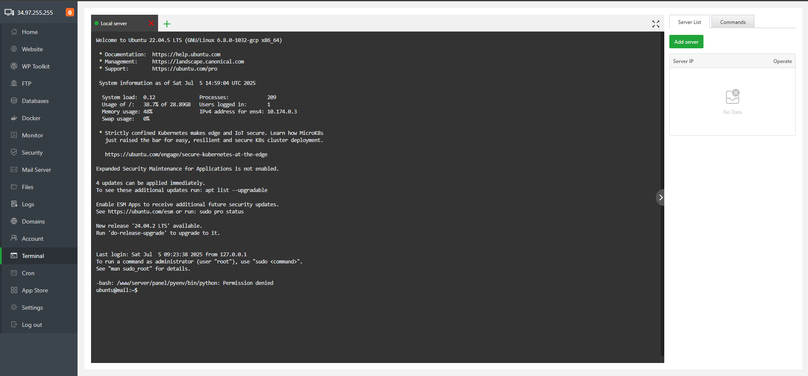
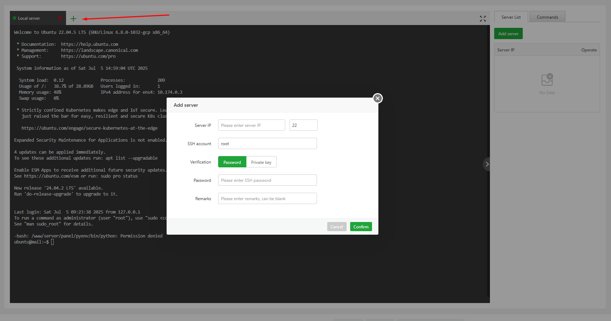
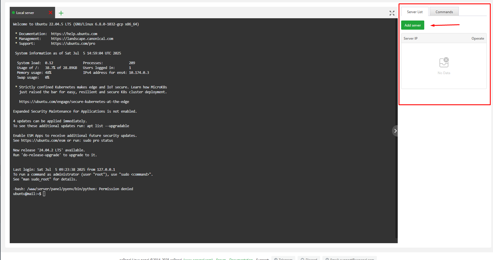
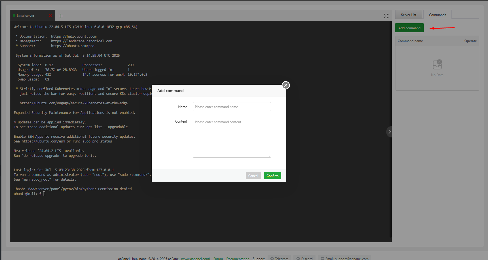
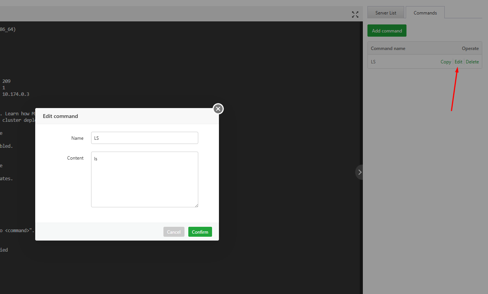
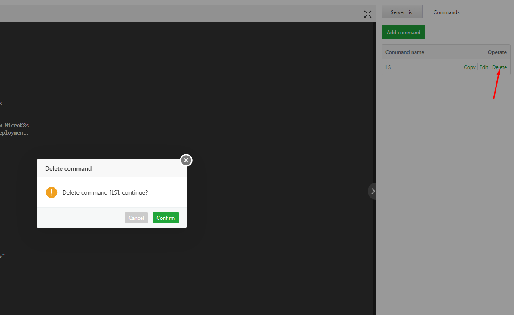

# aaPanel Terminal Modules 
- Module Terminal có thể kết nối với máy chủ cục bộ và máy chủ từ xa để thực hiện các thao tác lệnh
- Tổng quan module 
- 
- Mặc định module mở session terminal với server local 
- Có thể thực hiện kết nối với server khác
- 
- Hoặc chọn `AddServer` tạo mục Server List 
- 
- Tại phần command có thể thêm command mới bằng cách chọn `Add command` 
- 
- Với các command đã cấu hình trong danh sách có thể thực hiện thao tác copy, chỉnh sửa, xóa 
- 
- 

