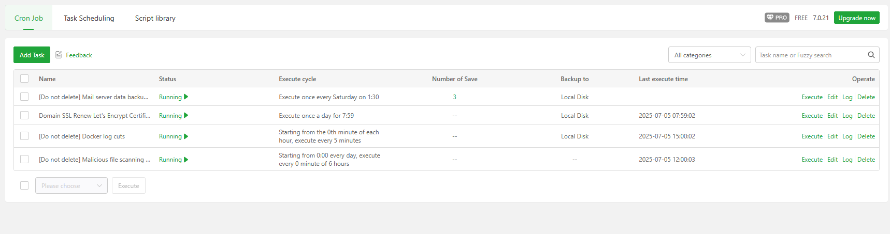
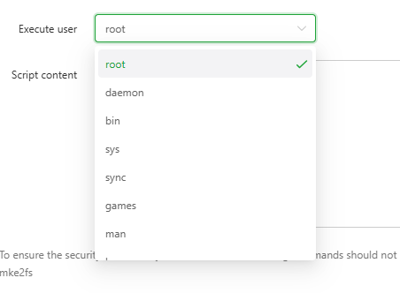
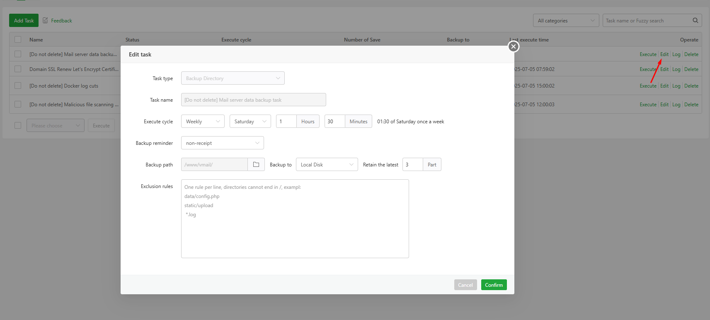
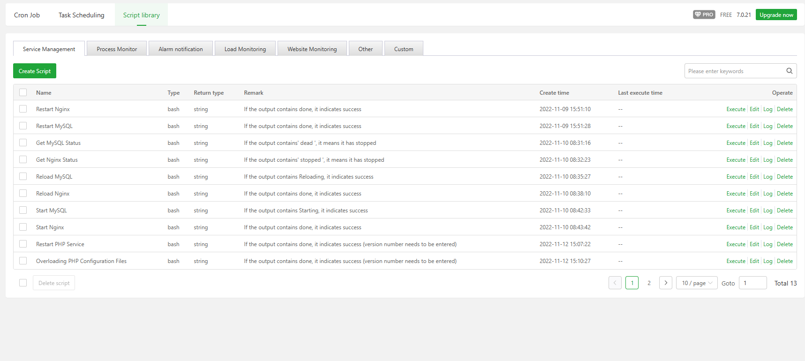

# aaPanel Cron Modules 
- Module quản lý các cron có thể thực hiện các tác vụ định kỳ, chẳng hạn như: sao lưu website, sao lưu cơ sở dữ liệu, sao lưu thư mục, thực thi lệnh, tự động hóa các tác vụ, v.v.
- 
- Giao diện này gồm 3 tab 
- Cron Job: Quản lý các job cron 
- Task Scheduling: Quản lý các tác vụ lên lịch 
- Script Library: Thư việc script có sẵn 

## Cron job 
- 
- Cron Job là các tác vụ được lên lịch để chạy tự động theo chu kỳ nhất định. Trong aaPanel, bạn có thể dùng Cron để:
	- Sao lưu dữ liệu website hoặc cơ sở dữ liệu.
	- Gia hạn chứng chỉ SSL.
	- Cắt giảm log hệ thống.
	- Quét mã độc định kỳ.
	- Thực thi lệnh hoặc script tự động.
- Nút chức năng `Add task` : Sử dụng để thêm task cron mới 
	- 
	- Task type (Loại tác vụ): Chọn mẫu có sẵn hoặc sử dụng script tự viết .
	- 
	- Task name (Tên tác vụ): Trường để nhập tên mô tả cho tác vụ, giúp dễ quản lý.
	- Execute cycle (Chu kỳ thực thi):  Bạn có thể thay đổi tần suất theo giờ, ngày, tuần, v.v.
	- Execute user (Người thực thi): Cấu hình user sẽ khởi chạy task 
	- 
	- Script content (Nội dung script): Đây là nơi bạn nhập mã lệnh cần thực thi. 
- Bảng danh sách tác vụ: Mỗi dòng là một tác vụ Cron, với các thông tin:
	- Tên tác vụ : tên của tác vụ  
	- Trạng thái: Trạng thái của tác vụ : Click để bật.tắt nhanh tác vụ 	.
		- 
	- Chu kỳ thực thi: Có thể là hàng ngày, hàng tuần, mỗi giờ, hoặc mỗi vài phút.
	- Số bản sao lưu: Số lượng bản sao lưu được giữ lại.
	- Nơi lưu trữ: Thường là ổ đĩa cục bộ (Local Disk).
	- Thời gian thực thi gần nhất: Cho biết lần chạy gần nhất của tác vụ.
	- Tùy chọn thao tác: Thực thi ngay, chỉnh sửa, xem log, hoặc xóa.
		- 
		- 
		- 
		- 
## Task Scheduling
- Quản lý các task được lên lịch 
	- 
- Nút chức năng `Add task` sử dụng thêm task mới 
	- 
	- Task name (Tên tác vụ): Trường để nhập tên mô tả cho tác vụ, giúp bạn dễ nhận biết và quản lý.
	- Execute cycle (Chu kỳ thực thi):  Bạn có thể điều chỉnh theo nhu cầu: hàng giờ, hàng tuần, v.v.
	- Execute (Thực thi): Bạn có thể chọn script từ thư viện script hoặc tìm kiếm script có sẵn để sử dụng.
	- 
	- 
	- Remark (Ghi chú): Trường để ghi chú thêm về tác vụ – ví dụ như mục đích, nội dung, hoặc cảnh báo.
	- Nút thao tác:
		- Cancel: Hủy bỏ việc tạo tác vụ.
		- Confirm: Xác nhận và lưu tác vụ.
- Bảng các task đã tạo 
	- 
	- Tên tác vụ: 
	- Chu kỳ thực thi:
	- Ghi chú (Remark): 
	- Thời gian tạo:
	- Thời gian thực thi gần nhất: 
	- Các nút thao tác
	- Execute: Thực thi task 
		- 
	- Event : Cấu hình sự kiện
		- 
		- 
		- 
		- 
	- Chỉnh sửa 
		- 
	- Log: Xem bản ghi 
		- 
	- Xóa task 
		- 
	
## Script Library
- Thư viện quản lý các script, có thể tạo thêm mới 
	- 
- Nút chức năng: Tạo mới 1 script 
	- 
	- Name (Tên script): Trường để nhập tên định danh cho script, giúp dễ quản lý và gọi lại khi cần.
	- Return type (Kiểu trả về): String /Integer/ Boolean 
		- 
	- Script args (Tham số script): có hoặc không sử dụng 
		- 
		- 
	- Script code area (Vùng nhập mã): Đây là nơi bạn viết mã Python hoặc Shell. 
	- Remark (Ghi chú): Trường để ghi chú về mục đích hoặc nội dung của script.

- Danh sách các script: hiển thị danh sách các script đã có 
	- 
	- Tên script: 
	- Loại script:
	- Kiểu trả về (Return type): 
	- Ghi chú (Remark):
	- Thời gian tạo: 
	- Thời gian thực thi gần nhất: 
	- Các nút thao tác 
	- Execute: Thực thi ngay 
	- Edit: Chỉnh sửa 
		- 
	- Log: Kiểm tra log 
		- 
	- Xóa script 
		- 

