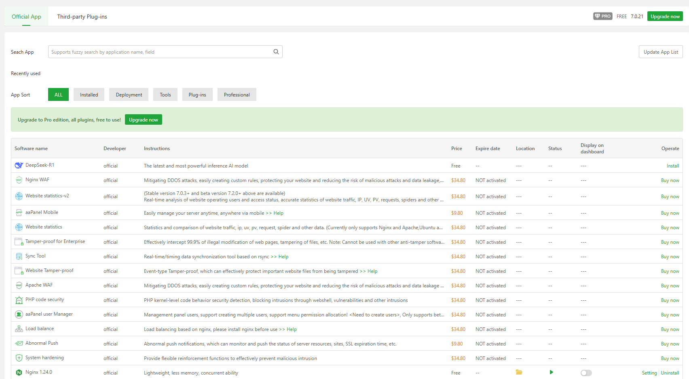
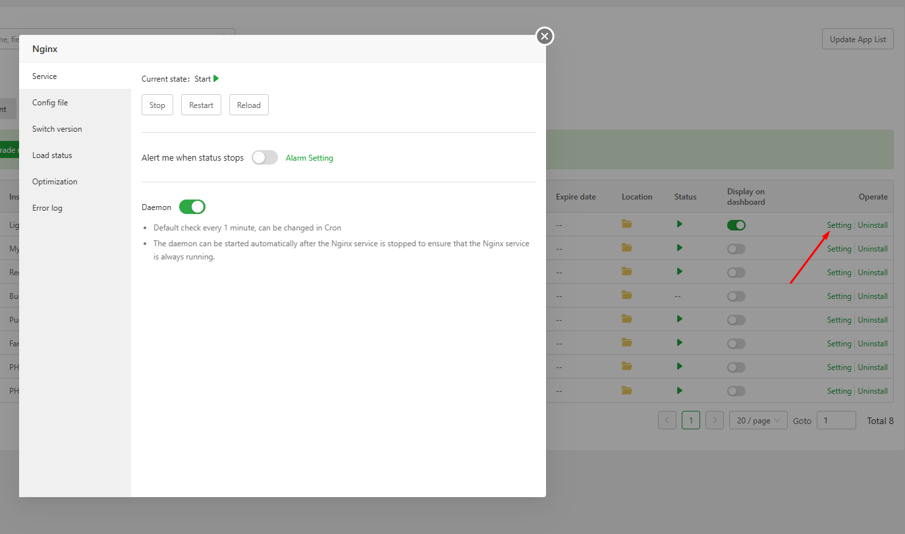
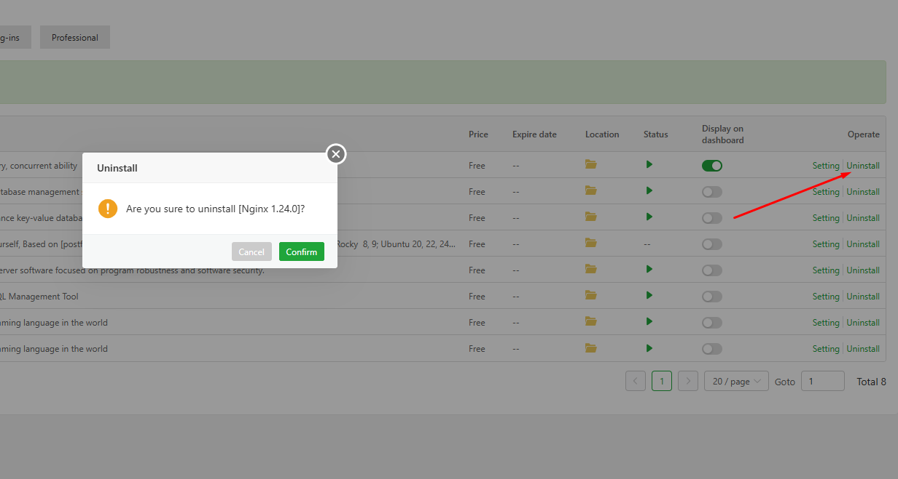

# aaPanel Appstore Modules 
- Giao diện quản lý và nâng cấp plugin trong aaPanel. Đây là nơi bạn có thể tìm kiếm, mua, cài đặt và quản lý các tiện ích mở rộng (plugin) để tăng cường chức năng cho máy chủ.
- Tổng quan giao diện 
- 
- Các plugin được chia thành 2 nhóm Official và Third-party 
- Nhóm Official giao diện gồm 
	- Thanh tìm kiếm: Cho phép bạn tìm plugin theo tên hoặc chức năng.
	- Danh mục phân loại:
		- All: Tất cả plugin.
		- Installed: Plugin đã cài đặt.
		- Deployment, Tools, Plug-ins, Professional: Các nhóm chức năng khác nhau.
	- Danh sách plugin: Mỗi plugin hiển thị các thông tin:
		- Tên phần mềm: Ví dụ DeepStack R1, Nginx WAF v2, Website Mobile v2.
		- Developer (Nhà phát triển): Được ghi là official, tức là do nhóm phát triển chính thức của aaPanel cung cấp.
		- Instructions (Hướng dẫn): Mô tả chức năng của plugin, ví dụ:
		- Price (Giá): Mỗi plugin có giá khoảng $34.99.
		- Status (Trạng thái): Hiện đang chưa kích hoạt.
		- Operate (Thao tác): Có nút Buy now để mua và kích hoạt plugin.

- Có thể thực hiện tìm kiếm, cài đặt plugin ngay tại giao diện này.
- Để quản lý các plugin đã cài chọn danh mục `Installed`: Tại đây liệt kê các plugin đã cài 
- Kèm các thông tin hiển thị:
- Developer: Tất cả đều do nhóm phát triển chính thức của aaPanel cung cấp.
- Instructions: Mô tả ngắn gọn về chức năng của phần mềm.
- Price: Gía của plugin 
- Expire date, Location, Status, Display on dashboard: Các cột này giúp bạn theo dõi trạng thái hoạt động, vị trí cài đặt, và hiển thị trên bảng điều khiển.
- Operate (Thao tác):
	- Settings: Click để mở giao diện cấu hình tương ứng với từng plugin 
		- 
	- Uninstall: Gỡ cài đặt plugin 
		- 

- Nhóm Third-party : Tương tự như với Official gồm thanh tìm kiếm, bảng các plugin và tùy chọn cài đặt 

