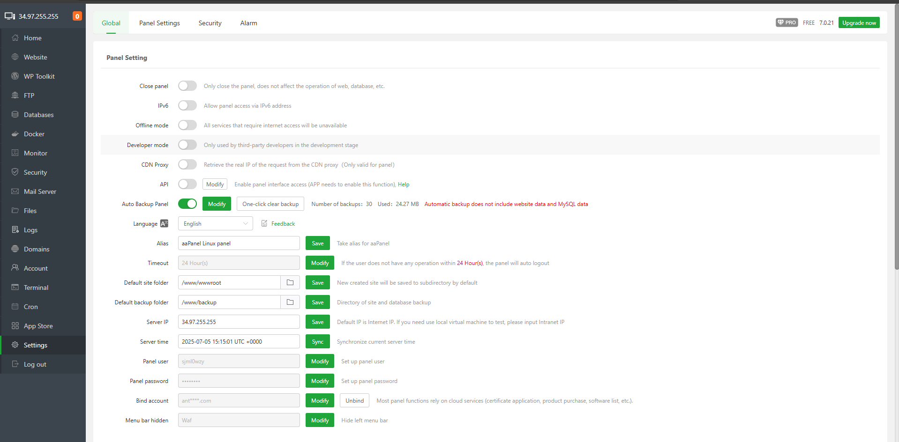

# aaPanel Settings Modules 
- Giao diện cài đặt chính của aaPanel 
- Tại module này gồm các cài đặt chung aaPanel, cài đặt bảo mật và cấu hình cảnh báo 
## Panel Settings 
- 
- Đóng bảng điều khiển: Chỉ đóng bảng điều khiển, không ảnh hưởng đến hoạt động của web, cơ sở dữ liệu, v.v.
- IPv6: Cho phép truy cập bảng điều khiển qua địa chỉ IPv6. Nếu website cũng cần giám sát IPv6, vui lòng bật tùy chọn này
- Chế độ ngoại tuyến: Tất cả các dịch vụ yêu cầu truy cập internet sẽ không khả dụng.
- Chế độ nhà phát triển: Chỉ sử dụng bởi các nhà phát triển bên thứ ba trong giai đoạn phát triển.
- API: Bật quyền truy cập giao diện bảng điều khiển (ứng dụng aaPanel Mobile cần bật chức năng này).
- 
- Auto backup Panel: Tự động sao lưu panel có thể cấu hình số bản backup, hoặc xóa các bản cũ `One click clear backup`
- 
- 
- Ngôn ngữ: Chọn ngôn ngữ hiển thị.
- Bí danh: Đặt tên riêng cho bảng điều khiển để sử dụng trong tiêu đề trang web.
- Thời gian chờ: Nếu người dùng không thao tác trong N giờ, bảng điều khiển sẽ tự động đăng xuất.
- 
- Thư mục trang web mặc định: Website mới tạo sẽ được lưu vào thư mục con mặc định: /www/wwwroot/
- Thư mục sao lưu mặc định: Thư mục sao lưu mặc định cho website, cơ sở dữ liệu, v.v.: /www/backup/
- IP máy chủ: Địa chỉ IP máy chủ hiển thị ở góc trên bên trái. Lưu ý: Máy chủ thư cũng sẽ kiểm tra xem IP này có khớp với bản ghi A không.
- Thời gian máy chủ: Hiển thị thời gian máy chủ, đồng bộ thời gian hiện tại của máy chủ.
- Người dùng bảng điều khiển: Hiển thị người dùng của aaPanel, thiết lập người dùng bảng điều khiển.
- 
- Mật khẩu bảng điều khiển: Thiết lập mật khẩu bảng điều khiển.
- 
- Liên kết tài khoản: Thay thế và hủy liên kết tài khoản đã liên kết với aaPanel. Một số chức năng sẽ không sử dụng được sau khi hủy liên kết.
- 
- Ẩn thanh menu: Ẩn thanh menu bê trái.
- 

## Security Settings 
- 
- Cảnh báo bảo mật bảng điều khiển: Nội dung cảnh báo bao gồm: thay đổi người dùng bảng điều khiển, xóa nhật ký bảng điều khiển, bật chế độ nhà phát triển bảng điều khiển.
- 
- SSL bảng điều khiển: Bật truy cập bảng điều khiển được mã hóa bằng chứng chỉ, mặc định sử dụng chứng chỉ tự ký. Có thể dán chứng chỉ theo định dạng nginx hoặc sử dụng chứng chỉ Let's Encrypt
- 
- BasicAuth: Thêm một lớp xác thực bổ sung để ngăn chặn việc quét bảng điều khiển.
	- 
	- Nếu bạn quên tài khoản hoặc mật khẩu BasicAuth, có thể sử dụng công cụ SSH để kết nối máy chủ, dùng quyền root và chạy lệnh: bt 23 để hủy.
- Google Authenticator: Yêu cầu mã xác minh động để đăng nhập vào bảng điều khiển.
	- 
	- Nếu không thể sử dụng Google Authenticator, có thể dùng SSH kết nối máy chủ, dùng quyền root và chạy lệnh: bt 24 để hủy.
- Mật khẩu mạnh: Bật mật khẩu mạnh cho bảng điều khiển, quy tắc: độ dài 8 ký tự, bao gồm chữ hoa, chữ thường, số và ký tự đặc biệt.
	- 
- Tên miền: Gán tên miền truy cập cho bảng điều khiển. Lưu ý: Sau khi gán, chỉ có thể truy cập bảng điều khiển qua tên miền. Truy cập bằng IP sẽ bị chặn và hiển thị lỗi 403.
- Nếu không thể truy cập tên miền sau khi gán, hãy dùng SSH kết nối máy chủ, dùng quyền root và chạy lệnh: bt 12 để hủy.
- IP được ủy quyền: Ngăn cách nhiều IP bằng dấu phẩy (,). Cảnh báo: Nếu đã thiết lập IP, chỉ các IP được ủy quyền mới có thể truy cập bảng điều khiển!
- Nếu không thể truy cập IP sau khi gán, hãy dùng SSH kết nối máy chủ, dùng quyền root và chạy lệnh
- Cổng bảng điều khiển: Kiểm tra và thay đổi cổng truy cập bảng điều khiển. Lưu ý: Với máy chủ có nhóm bảo mật, hãy mở cổng mới trong nhóm bảo mật trước.
	- 
- Lối vào bảo mật: Lối vào quản trị bảng điều khiển. Chỉ có thể đăng nhập bảng điều khiển qua đường dẫn bảo mật được chỉ định, ví dụ: /021e887b.
	- 
	- Nếu quên lối vào bảo mật, hãy dùng SSH kết nối máy chủ, dùng quyền root và chạy lệnh: bt 14 để xem.
- Phản hồi khi chưa đăng nhập: Phản hồi khi chưa đăng nhập và không nhập đúng lối vào bảo mật, có thể dùng để ẩn bảng điều khiển, ví dụ như trả về lỗi 404.
	- 
- Hết hạn mật khẩu: Thiết lập thời gian hết hạn cho mật khẩu bảng điều khiển; cần đặt lại sau khi hết hạn.
	- 
- Đăng nhập tạm thời: Cấp quyền truy cập bảng điều khiển tạm thời cho người không phải quản trị viên. Cấu hình cho phép 3-12h hoặc custom 
	- 
	
	
## Alarm 
- 
- Giao diện gồm các tab 
	- Alarm list 
	- Alarm Setting 
	- Alarm Log 
### Alarm List
- Liệt kê các cảnh báo được cấu hình
- Gồm nút chức năng Thêm list mới. Click để mở giao diện tạo alarm mới 
- Ví dụ với task certificate 
	- Task type (Loại tác vụ): Được chọn là Certificate (SSL) expiration – tức là cảnh báo khi chứng chỉ SSL sắp hết hạn.
	- Model (Mô hình áp dụng): Được chọn là ALL SSL – áp dụng cho tất cả chứng chỉ SSL đang được quản lý.
	- Remaining days (Số ngày còn lại): Cảnh báo sẽ được kích hoạt khi chứng chỉ còn 15 ngày trước khi hết hạn.
	- Total Send Limit (Tổng số lần gửi): Tác vụ này sẽ gửi cảnh báo tối đa 2 lần.
	- Alarm mode (Chế độ cảnh báo):  Là menu chọn kênh gửi cảnh báo (email, Telegram, Slack, v.v.), nhưng chưa được chọn trong hình.
	- Cài đặt nâng cao:
		- Daily send limit (Giới hạn gửi hàng ngày): Đang đặt là 0 lần/ngày, tức là không giới hạn số lần gửi mỗi ngày.
		- Min Send Interval (Khoảng cách gửi tối thiểu): Đang đặt là 0 giây, tức là không có giới hạn thời gian giữa các lần gửi.
		- Send Time Range (Khoảng thời gian gửi): Cảnh báo có thể được gửi trong khoảng từ 00:00:00 đến 23:59:59, tức là cả ngày.
- 

### Alarm Setting 
- 
- Tại đây cấu hình các nền tảng nhận cảnh báo 
- Có thể cấu hình mỗi module bằng nút thao tác `Modify` 
- 

### Alarm Log 
- 
- Ghi lại bản ghi các alarm đã gửi sẽ được liệt kê thành bảng gồm các thông số tê, thời gian gửi. 
