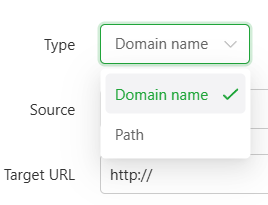
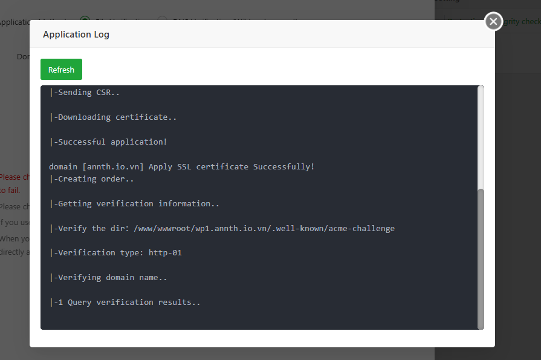

# aaPanel WP Toolkit Modules 
**WP Toolkit** là một công cụ chuyên dụng để quản lý các website WordPress.
- WP Toolkit quản lý với 2 module nhỏ 
	- Local Manage: Quản trị các wordpress site được khởi tạo, khởi chạy trên hosting 
	- Remote Manage: Quản trị các wordpress site khác từ xa. 

## Local Manage 
- Phần này cung cấp các tính năng như 

| **Chức năng**         | **Mô tả** |
|------------------------|-----------|
| **Thêm WordPress**     | Thêm mới hoặc nhập khẩu một website WordPress. |
| **Tên trang web**      | Tên miền được gán cho website. Nhấp vào tên trang để cấu hình hoặc chỉnh sửa. |
| **Trạng thái**         | Hiển thị trạng thái hoạt động của website. Nhấp vào để tắt/bật website. |
| **Sao lưu**            | Hiển thị trạng thái sao lưu. Nhấp để xem, khôi phục, tải xuống hoặc tạo bản sao lưu (bao gồm cả cơ sở dữ liệu). |
| **Thư mục gốc**        | Hiển thị đường dẫn thư mục của website. Nhấp để mở thư mục trong trình quản lý tệp. |
| **Bộ nhớ đệm (Cache)** | Bật/tắt bộ nhớ đệm để tăng tốc độ truy cập. Hiện chỉ hỗ trợ Nginx. Nếu không dùng Nginx, có thể dùng plugin WP Super Cache. |
| **Quét lỗ hổng**       | Tự động kiểm tra các lỗ hổng bảo mật của website. |
| **Cài đặt WP**         | Hiển thị phiên bản WordPress. Có thể sao chép website, quản lý plugin, giao diện, bật chống chỉnh sửa (Tamper-proof), kiểm tra tính toàn vẹn hoặc cài đặt lại. |
| **PHP**                | Hiển thị phiên bản PHP đang dùng. Nhấp để thay đổi phiên bản PHP. |
| **SSL**                | Hiển thị trạng thái SSL. Nhấp để cài đặt chứng chỉ SSL cho website. |
| **Đăng nhập**          | Đăng nhập trực tiếp vào trang quản trị WordPress. |
| **Chỉnh sửa**          | Cấu hình website: Quản lý tên miền, cài đặt WordPress, bảo mật, rewrite URL, kiểm soát lưu lượng, log lỗi, v.v. |
| **Xóa**                | Xóa website hiện tại. |

- Giao diện `Local Manage`
- 
- Bạn có thể dễ dàng khởi tạo 1 website wordpress bằng `AddWordpress` 
- 
- Giao diện thêm website WordPress mới trong WP Toolkit của aaPanel. 
- 
- 
- Các trường cấu hình:
	- Resolve Domain (Giải quyết tên miền):
	- Manual Add Record: Bạn sẽ tự trỏ DNS về IP máy chủ.
	- Automatic Add Record: Hệ thống sẽ tự động thêm bản ghi DNS (nếu tích hợp với nhà cung cấp tên miền).
	- Domain: Nhập tên miền bạn muốn dùng cho website 
	- Website Title: Tiêu đề hiển thị của website WordPress 
	- Language: Ngôn ngữ cài đặt ban đầu cho WordPress 
	- PHP version: Chọn phiên bản PHP cho website .
	- WP version: Chọn phiên bản WordPress muốn cài đặt .
	- User name: Tên tài khoản quản trị WordPress.
	- Password: Mật khẩu đăng nhập. Có thể bật “Allow weak passwords” nếu bạn muốn dùng mật khẩu yếu (không khuyến khích).
	- Email: Email quản trị viên – dùng để khôi phục mật khẩu hoặc nhận thông báo.
	- Prefix: Tiền tố bảng dữ liệu trong cơ sở dữ liệu (mặc định là wp_, ở đây là wp_a55217_ để tăng bảo mật).
	- Cache: Cấu hình bật sử dụng bộ nhớ đệm hệ thống sẽ sử dụng bộ nhớ đệm để tăng tốc độ tải trang. Tuy nhiên, chỉ hỗ trợ khi bạn dùng Nginx làm web server.
	- Create HTML file (Tạo tệp HTML): Khi bật, hệ thống sẽ tạo một tệp HTML tĩnh cho trang chủ sau khi cài đặt. Điều này giúp tăng tốc độ truy cập ban đầu hoặc dùng làm trang chờ.
	- Nút thao tác:
		- Cancel: Hủy thao tác.
		- Confirm: Bắt đầu cài đặt website WordPress với các thông tin đã nhập

- Ví dụ tạo 1 site wordpress mới: 
	- 
	- 
	- Site được tạo
	- 

- Thông tin về Website được hiển thị tại bảng quản lý website
- Giao diện này hiển thị thông tin chi tiết và các thao tác quản trị cho website đã tạo
- 
- Các thành phần gồm 
	- Tên website: Hiển thị tên miền của từng website. Có thể nhấp vào để cấu hình chi tiết.
	- Trạng thái hoạt động: Cho biết website đang chạy hay đã bị tắt. Có thể bật/tắt nhanh tại đây.
	- 
	- Sao lưu: Hiển thị trạng thái sao lưu.
		- 
		- Nhấn nút `Backup` để backup website 
		- 
		- Có thể tạo, tải xuống, khôi phục hoặc xem chi tiết bản sao lưu.
		- 
	- Thư mục gốc: Đường dẫn đến thư mục chứa mã nguồn của website. Nhấp vào để mở thư mục trong trình quản lý tệp.
		- 
		- 
	- Bộ nhớ đệm (Cache): Cho biết cache đang bật hay tắt. Có thể bật/tắt để tối ưu hiệu suất.
	- Quét lỗ hổng: Hiển thị kết quả quét bảo mật. Nếu có rủi ro, bạn sẽ thấy cảnh báo. (Pro)
	- Cài đặt WordPress: Hiển thị phiên bản WordPress. Tại đây bạn có thể:
		- Quản lý phiên bản WP: Click để mở giao diện quản lý wordpress cơ bản 
		- 
		- 
		- Nhân bản website: Click để mở giao diện clone website cho phép bạn nhân bản một website WordPress hiện có sang một tên miền hoặc thư mục khác.
		- 
		- 
		- Các thành phần chính:
			- Source site: Website gốc mà bạn muốn sao chép (ở đây là một site WordPress đã cài đặt).
			- Target site: Nơi bạn muốn tạo bản sao:
				- Create subdomain: Tạo một tên miền phụ từ site gốc.
					- Subdomain field: Nhập tên subdomain bạn muốn dùng. Hệ thống sẽ ghép với domain gốc để tạo địa chỉ mới.
					- Clone path: Đường dẫn thư mục nơi website được clone. Nếu để trống → clone vào thư mục gốc của subdomain. Nếu nhập /blog → clone vào thư mục con /blog.
				- Create new domain: Dùng một tên miền hoàn toàn khác (nếu chọn tùy chọn này, bạn sẽ cần nhập domain mới).
			- Fastcgi cache: Bật/tắt bộ nhớ đệm FastCGI cho site clone. Bật giúp tăng tốc độ phản hồi, nhưng nên tắt nếu bạn cần kiểm tra nội dung động.
			- Nút thao tác:
				- Cancel: Hủy thao tác.
				- Confirm: Bắt đầu quá trình nhân bản website.
		- Quản lý plugin: Click mở giao diện quản lý plugin 
		- 
		- 
		- Quản lý theme: Click mở giao diện quản lý theme 
		- 
		- 
		- Quản lý bảo vệ website: Click mở giao diện cấu hình các tính năng bảo vệ website 
		- 
		- Gồm các tính năng 
			- File Protection (Pro)
			- Nginx WAF (Pro)
			- Hotlink protection 
			- 
		- Kiểm tra tính toàn vẹn mã nguồn: Click mở giao diện kiểm tra lại source code WP 
			- 
			- Gồm các tuỳ chọn verify hoặc cài đặt lại wp nếu cần. 
			- 	
	- Phiên bản PHP: Hiển thị phiên bản PHP đang dùng. Có thể thay đổi nếu cần.
	- 	
	- 	
	- SSL: Hiển thị trạng thái chứng chỉ bảo mật. Có thể cài đặt SSL tại đây.
	- 	
	- 	
	- Thao tác: Bao gồm các nút:
		- Đăng nhập vào trang quản trị
			- 
			- Gồm 2 phương thức: Password free (Pro), Login bằng wp-admin.
			- 	
			- 	
		- Chỉnh sửa cấu hình: Click mở giao diện quản trị website WP 
			- 	
			- 	
		- Xóa website: Click để mở giao diện xoá website WP 
			- 	
			- 	
		
- Quản trị Wordpress: Giao diện giúp quản trị các thông số, tính năng của wordpress được mở bằng nút `Modify` tại giao diện danh sách wordpress site.
- Giao diện này cung cấp các phần 
	- Domain Manager – Quản lý tên miền gán cho dự án: Giao diện này cho phép bạn thêm, chỉnh sửa hoặc xóa các tên miền được gán cho website hiện tại.
		- 		
		- Các thành phần chính:
			- Hướng dẫn nhập tên miền (phía trên ô nhập):
				- Mỗi dòng là một tên miền riêng biệt.
				- Mặc định sử dụng cổng 80 (HTTP).
				- Có thể thêm wildcard domain, ví dụ: *.domain.com.
				- Nếu muốn chỉ định cổng khác, dùng định dạng như: www.domain.com:88.
			- Ô nhập tên miền: Bạn nhập tên miền mới vào đây, sau đó nhấn nút Add để thêm.
			- Bảng danh sách tên miền đã thêm gồm các cột: 
				- Domain name: Tên miền đã gán 
				- Port: Cổng sử dụng (mặc định là 80)
				- Operate: Trạng thái hoạt động 
			- Checkbox: Cho phép chọn tên miền để xóa hoặc thao tác hàng loạt (nếu có nhiều tên miền).
	
	- WordPress Setting – Cấu hình WordPress (plugin, theme, phiên bản, v.v.): Đây là giao diện WordPress Setting trong WP Toolkit của aaPanel, dùng để cấu hình nhanh các thông tin cơ bản của website WordPress.		- 
		- Tại tab `Base Setup` gồm các thiết lập chính: 
			- 		
			- Login URL: Đường dẫn đăng nhập vào trang quản trị WordPress (mặc định là /wp-login.php).
			- Status: Hiển thị phiên bản WordPress hiện tại và thông báo nếu đã là phiên bản mới nhất.
			- Cache: Nút “Clear” để xóa bộ nhớ đệm của website (nếu có bật cache).
			- User name: Tên tài khoản quản trị viên WordPress hiện tại.
			- Reset password: Cho phép bạn đặt lại mật khẩu cho tài khoản quản trị. Có thể nhập thủ công hoặc nhấn Generate để tạo mật khẩu ngẫu nhiên.
			- Email address: Địa chỉ email quản trị viên – dùng để khôi phục mật khẩu hoặc nhận thông báo từ WordPress.
			- Website Language: Ngôn ngữ hiển thị của giao diện quản trị WordPress.
			- WPS-Hide-Login: Tùy chọn bật plugin WPS Hide Login – giúp ẩn đường dẫn đăng nhập mặc định để tăng bảo mật.
			- Save: Nút lưu lại tất cả các thay đổi.
		- Tại tab `Plugin`: Đây là giao diện quản lý plugin WordPress trong tab WordPress Setting → Plugin của WP Toolkit. Giao diện này cho phép bạn xem, bật/tắt, và gỡ cài đặt các plugin đang có trên website WordPress.
			- 
			- Các thành phần hiển thị:
			- Danh sách plugin: Hiển thị tất cả plugin đã cài đặt trên website và các thao tác 
				- Kích hoạt
				- Tự động cập nhật 
				- Gỡ cài đặt 
			- Nút `Install` để cài đặt nhanh các plugin: Click để mở giao diện các plugin, có thể tìm kiếm plugin cần cài và chọn `Install` để cài đặt 
				- 
		- Tại tab `Themes`: Đây là giao diện quản lý theme WordPress trong tab WordPress Setting → Theme của WP Toolkit. Giao diện này cho phép bạn xem, bật/tắt, và gỡ cài đặt các theme đang có trên website WordPress.
			- 
		- Các thành phần hiển thị:
			- Danh sách theme: Hiển thị tất cả theme đã cài đặt trên website và các thao tác 
				- Kích hoạt
				- Tự động cập nhật 
				- Gỡ cài đặt 
			- Nút `Install` để cài đặt nhanh các theme: Click để mở giao diện các theme, có thể tìm kiếm theme cần cài và chọn `Install` để cài đặt 
				- 	
	- Security – Cài đặt bảo mật cho website: Giao diện cấu hình bảo mật gồm các tính năng `Limit Access`, `Deny Access` và `Hotlink Protection`
		- 	
		- Tab `Limit Access`:  Thiết lập bảo vệ bằng mật khẩu cho thư mục hoặc đường dẫn cụ thể.
			- Nút `Add limit access`: Dùng để thêm quy tắc giới hạn mới: Giao diện thêm giới hạn truy cập (Add limit access) trong aaPanel. Nó cho phép bạn bảo vệ một phần của website bằng cách yêu cầu người dùng nhập tên đăng nhập và mật khẩu khi truy cập vào đường dẫn đó.
				- 
				- Các trường cần nhập:
					- Name: Tên mô tả cho quy tắc giới hạn (tùy chọn, để dễ quản lý).
					- Path: Đường dẫn cần bảo vệ, ví dụ: /test/ hoặc /admin/api.
					- User name: Tên đăng nhập mà người dùng phải nhập khi truy cập.
					- Password: Mật khẩu tương ứng.
			- Bảng danh sách: Hiển thị các quy tắc được thêm.
		- Tab `Deny Access`: Giúp bạn chặn quyền truy cập đến một số thư mục hoặc loại tệp nhất định trên website, nhằm tăng cường bảo mật.
			- 
			- Các thành phần chính:
				- Add limit access: Nút để thêm quy tắc giới hạn mới.
					- Dùng chặn người dùng truy cập vào các tệp có phần đuôi (đuôi mở rộng) nhất định trong một thư mục cụ thể trên website.
					- Các trường cần nhập:
						- Name: Tên quy tắc (để bạn dễ quản lý, ví dụ: “Chặn PHP trong /a/”)
						- Suffix: Phần mở rộng tệp cần chặn, ví dụ: .php Nếu muốn chặn nhiều loại, dùng dấu | để phân cách, ví dụ: .php|.sql|.bak
						- Path: Đường dẫn thư mục áp dụng quy tắc, ví dụ: /a/
			-> Tính năng này rất hữu ích để: Chặn truy cập trái phép vào các tệp nhạy cảm (như .env, .sql, .bak), giới hạn quyền truy cập vào các thư mục nội bộ hoặc đang phát triển
		- Tab `Hotlink Protection` – Chống tải trộm tài nguyên (ảnh, video...) từ website khác: Giao diện này giúp bạn cấu hình Hotlink Protection (chống hotlink) cho website trong aaPanel. Tính năng này giúp ngăn chặn các website khác sử dụng trực tiếp tài nguyên (ảnh, CSS, JS...) từ máy chủ của bạn.
			- 			
			- Gồm các thành phần cấu hình 
				- URL suffix: Danh sách phần mở rộng tệp cần bảo vệ, ví dụ: jpg,jpeg,gif,png,js,css.
				-> Chỉ các tệp có đuôi này mới bị kiểm tra hotlink.
				- Access domain: Danh sách tên miền được phép truy cập tài nguyên/
				-> Các domain khác sẽ bị chặn nếu cố gắng nhúng tài nguyên.
				- Response: Hành động khi phát hiện hotlink. Ở đây là 404 – trả về lỗi không tìm thấy.
				- Enable hotlink protection: Checkbox để bật/tắt tính năng chống hotlink.
				- Allow empty HTTP_REFERER requests: Cho phép truy cập nếu trình duyệt không gửi thông tin nguồn (thường xảy ra khi người dùng truy cập trực tiếp).
				-> Nếu không bật, các truy cập không có Referer cũng sẽ bị chặn.
			- Lưu ý 
				- Mặc định, các truy cập không có Referer sẽ được cho phép.
				- Nhiều phần mở rộng hoặc tên miền nên cách nhau bằng dấu phẩy (,).
				- Khi bị chặn, máy chủ sẽ trả về mã lỗi 404.
			- Tính năng này rất hữu ích để:
				- Ngăn website khác “ăn cắp” băng thông bằng cách nhúng ảnh từ site của bạn.
				- Bảo vệ tài nguyên tĩnh như ảnh, video, CSS, JS khỏi bị sử dụng trái phép.

	- Config – Cấu hình nâng cao (proxy, cache, xác thực, log...): Giao diện cấu hình nâng cao gồm các tính năng: `Site Directory`, `Config file`, `URL rewrite`, `Redirect`, `Reverse Proxy` và `Traffic Control` 
		- Tab `Site Directory`:  cho phép bạn quản lý các thiết lập kỹ thuật liên quan đến thư mục chạy, bảo mật, và ghi log cho website WordPress.
			- 			
			- Gồm các cấu hình 
				- Site Directory: Thư mục gốc chứa toàn bộ mã nguồn của website. Đây là nơi hệ thống tìm kiếm file WordPress để vận hành.
				- Running Directory: Thư mục con bên trong thư mục gốc sẽ được dùng làm thư mục chạy chính. Thường là dấu gạch chéo (/) nếu không có thư mục con như /public.
				- Anti-XSS Attack: Tùy chọn bật/tắt tính năng chống tấn công XSS. Khi bật, hệ thống sẽ lọc các đoạn mã độc có thể được chèn vào qua URL hoặc biểu mẫu.
				- Write Access Log: Khi bật, hệ thống sẽ ghi lại toàn bộ yêu cầu truy cập đến website vào file nhật ký. Dữ liệu này hữu ích để phân tích, giám sát và xử lý sự cố.
				- Password Access: Cho phép thiết lập xác thực truy cập bằng tài khoản và mật khẩu. Khi bật, người dùng phải đăng nhập mới có thể truy cập website.
				- Nút Save: Dùng để lưu lại tất cả các thay đổi đã thực hiện trong giao diện này.
		- Tab `Config File`: Giao diện này cho phép bạn xem và chỉnh sửa trực tiếp tệp cấu hình chính của Nginx thông qua trình quản lý web của aaPanel. Đây là nơi bạn có thể điều chỉnh các thiết lập hệ thống của Nginx mà không cần truy cập dòng lệnh.
			- 			
			- Trình soạn thảo chỉnh sửa cấu hình có hỗ trợ đánh dấu cú pháp (syntax highlighting), giúp dễ đọc và dễ chỉnh sửa hơn, hỗ trợ các phím tắt như Ctrl + F (Tìm kiếm), Ctrl + S (Lưu) , Ctrl + H (Tìm và thay thế)
			-> Giao diện này rất hữu ích cho quản trị viên hệ thống hoặc lập trình viên muốn tùy chỉnh sâu cấu hình Nginx mà không cần thao tác qua SSH
		- Tab `URL Rewrite`: Cho phép bạn thiết lập hoặc chỉnh sửa các quy tắc rewrite URL – thường dùng để làm đẹp đường dẫn, chuyển hướng, hoặc tương thích với các framework như Laravel, WordPress, v.v.
			- 	
			- Các thành phần chính:
				- Dropdown “0.Current”: Chọn mẫu rewrite có sẵn cho các ứng dụng phổ biến (WordPress, Laravel, ThinkPHP...).
				- Rewrite rule converter: Liên kết chuyển đổi quy tắc từ Apache (.htaccess) sang Nginx.
				- Khung nhập rewrite rule: Nơi bạn có thể viết hoặc chỉnh sửa các quy tắc rewrite (hiện đang trống).
				- Nút Save: Lưu lại quy tắc rewrite sau khi chỉnh sửa.
				- Nút Save as template: Lưu quy tắc hiện tại thành mẫu để dùng lại sau.
			- Khi chọn một mẫu, các quy tắc rewrite tương ứng sẽ tự động được điền vào khung bên dưới. Bạn có thể chỉnh sửa thêm nếu cần, sau đó nhấn Save để áp dụng hoặc Save as template để lưu lại làm mẫu riêng.
			- Tính năng này giúp tiết kiệm thời gian và giảm lỗi khi cấu hình rewrite cho các hệ thống phổ biến. 

		- Tab `Redirect`: Thiết lập chuyển hướng (301, 302...): Giao diện này cho phép bạn thiết lập các quy tắc chuyển hướng URL, ví dụ như chuyển từ HTTP sang HTTPS, từ tên miền cũ sang mới, hoặc từ đường dẫn này sang đường dẫn khác
			- 			
			- Gồm các thành phần 
				- Nút “Add redirect” : Dùng để thêm quy tắc chuyển hướng mới.
				- Bảng liệt kê các quy tắc chuyển hướng được thiết lập
			- Giao diện cấu hình 1 rule Redirect: giao diện tạo quy tắc chuyển hướng (redirect) trong aaPanel, cho phép bạn thiết lập cách website chuyển người dùng từ một URL này sang một URL khác.
				- 			
				- Các thành phần chính:
					- Enable: Bật hoặc tắt quy tắc chuyển hướng.
					- Keep URI param: 
						- Bật: giữ nguyên đường dẫn con và tham số truy vấn 
						→ Ví dụ: http://b.com/1.html → http://a.com/1.html
						- Tắt: Chuyển toàn bộ về URL gốc.
						→ Ví dụ: http://b.com/1.html → http://a.com
					- Type: Chọn kiểu chuyển hướng: theo tên miền (domain) hoặc theo đường dẫn (path).
						- 			
					- Mode:
						- 			
						- 301: Chuyển hướng vĩnh viễn (dùng cho SEO).
						- 302: Chuyển hướng tạm thời.
					- Source: Chọn tên miền hoặc đường dẫn nguồn cần chuyển hướng.
					- Target URL: Nhập địa chỉ đích mà bạn muốn chuyển hướng tới (ví dụ: https://newsite.com).
					- Nút thao tác:
						- Cancel: Hủy thao tác.
						- Confirm: Xác nhận và tạo quy tắc chuyển hướng
		- Tab `Reverse Proxy`: Cấu hình proxy ngược:
			- 			
			- Gồm các thành phần 
				- Nút “Add Reverse Proxy” : Dùng để thêm quy tắc reverse mới.
				- Bảng liệt kê các quy tắc được thiết lập
			- Giao diện tạo 1 rule mới 
				- Gồm các thành phần cấu hình: 
					- Enable proxy: Bật/tắt chức năng reverse proxy.
					- Enable cache: Bật cache để tăng tốc độ tải nội dung proxy.
					- Advanced feature: Bật các tính năng nâng cao (như cấu hình thư mục proxy riêng).
					- Proxy name: Tên mô tả cho proxy (để dễ quản lý).
					- Target URL: Địa chỉ website đích mà bạn muốn lấy nội dung (ví dụ: http://example.com).
					- Sent Domain: Tên miền sẽ được gửi trong header đến máy chủ đích (mặc định là $host – tên miền gốc).
					- Content replace: Cho phép thay thế nội dung trong phản hồi từ máy chủ đích (chỉ áp dụng với Nginx).
					- Ví dụ: thay chữ “example” thành “annth”.
			- Tính năng này rất hữu ích nếu bạn muốn:
				- Ẩn máy chủ thật phía sau một domain khác
				- Tạo cổng truy cập đến hệ thống nội bộ
				- Tích hợp nội dung từ website khác mà không cần chuyển hướng
		
		- Tab `Traffic Control` - Kiểm soát lưu lượng truy cập: Giúp giới hạn số lượng truy cập đồng thời và lưu lượng dữ liệu để bảo vệ website khỏi bị quá tải hoặc tấn công từ chối dịch vụ (DoS).
		- 	
		- Các thành phần chính:
			- Turn on traffic control: Checkbox để bật/tắt chức năng kiểm soát lưu lượng. Nếu được bật, các giới hạn bên dưới sẽ có hiệu lực.
			- Limit plan: Chọn gói giới hạn phù hợp với loại website. 
			- Limit of concurrency: Giới hạn tổng số kết nối đồng thời đến website.
			- Block single IP: Giới hạn số kết nối đồng thời từ một địa chỉ IP.
			- Traffic control: Giới hạn dung lượng dữ liệu tối đa cho mỗi yêu cầu (tính bằng KB).
			- Nút Save : Nhấn để lưu lại các thiết lập.
		- Tính năng này rất hữu ích để:
			- Ngăn chặn các cuộc tấn công từ bot hoặc IP bất thường
			- Bảo vệ tài nguyên máy chủ trong giờ cao điểm
			- Duy trì hiệu suất ổn định cho website
	- SSL – Quản lý chứng chỉ bảo mật HTTPS: Giao diện này cho phép bạn cài đặt chứng chỉ SSL để website có thể hoạt động qua giao thức bảo mật HTTPS.
		- 			
		- Các tab lựa chọn:
			- Current Certs: Chứng chỉ hiện tại.
				- 			
				- Hiển thị các thông tin về chứng chỉ hiện tại đang được cài đặt, cấu hình `Force HTTPS` buộc mọi kết nối sử dụng HTTPS 
				- Giao diện upload key, certificate được cấp và lưu chứng chỉ vào hệ thống. 
			- Business certificate: Dùng để nhập chứng chỉ SSL mua từ nhà cung cấp.
				- Gồm tuỳ chọn mua SSL từ các bên cung cấp thứ 3 
				- 			
				- 			
			- Let's Encrypt: Tự động đăng ký SSL miễn phí.
				- 	
				- Gồm các tuỳ chọn cấu hình: phương thức xác minh `Application Method`, Tên miền cần lấy chứng chỉ `Domain name`
			- Certificate holder: Quản lý chứng chỉ đã lưu
				- 			
				- Hiển thị các chứng chỉ đã có, sử dụng nút `Deploy` để cài đặt 
		- Ví dụ cấu hình: Sử dụng chứng chỉ free Let's Encrypt
			- Tạo Tab `Let's Encyrpt`
			- 			
				- Cấu hình method xác minh ở đây chọn `File Verification`
				- Cấu hình tên miền cần lấy chứng chỉ bằng cách tích chọn tại phần `Domain name`
			- Click `Apply`	để tiến hành quá trình xin cấp chứng chỉ 
			- Qúa trình diễn ra 
			- 
			- Chứng chỉ đã được xin, xác minh, cài đặt tự động 
			- 
			- Kiểm tra tại Certificate holder
			- 
			- Kiểm tra Website 
			- 

	- PHP Version – Chọn phiên bản PHP cho website: Giao diện này cho phép bạn chọn phiên bản PHP phù hợp với mã nguồn website, đồng thời thiết lập các tùy chọn nâng cao như cách ly session.
		- 			
		- Các thành phần chính:
			- Chọn phiên bản PHP
				- Dropdown cho phép chọn phiên bản PHP (hiện đang chọn PHP 8.3).
				- Nút Switch để áp dụng phiên bản mới.
				- Nên chọn phiên bản PHP phù hợp với mã nguồn website.
				- Tránh chạy PHP bằng tài khoản root để tăng bảo mật.
				- PHP 7 không hỗ trợ mysqlnd, nên mặc định dùng mysqli và mysql-pdo.
				- Có thể tùy chỉnh cấu hình kết nối PHP (chỉ hỗ trợ NGINX).
				- Hỗ trợ kết nối TCP hoặc UNIX socket (ví dụ: 192.168.1.25:9001 hoặc unix:/tmp/php8.sock).
			- Session isolation (Cô lập session)
				- Nếu bật, mỗi website sẽ lưu session vào thư mục riêng biệt.
				- Không nên bật nếu bạn đang dùng cache như Memcached hoặc Redis để lưu session.
		-> Tính năng này rất quan trọng để đảm bảo website chạy đúng môi trường PHP và tránh xung đột khi có nhiều site trên cùng máy chủ  

	- Response Log – Xem log phản hồi của website: Giao diện này giúp bạn xem các bản ghi của webserver một cách trực quan. 
		- Gồm các bản ghi 
			- Access Log 
			- 			
			- Error Log
			- 			
			- Log Sercurity Analysis 
		- 			

- Bên cạnh nút `Add WordPress` aaPanel hỗ trợ tính năng`Migrate Site`: Tính năng này giúp chuyển WordPress từ Dự án PHP sang WP Toolkit, chỉ áp dụng cho các website được tạo bằng WordPress khi thêm site.
	- 			
- `WP-Sets`: Tính năng này nhằm tạo set cài đặt nhanh các plugin, theme lên các wp site 
	- Tạo set mới: 
		- Click `WP Sets` chọn `Create Set`
		- 			
		- 			
		- Cấu hình tên và confirm để tạo 
		- 			
		- 			
	- Thêm Plugin vào set đã tạo
		- Tại dòng cấu hình set mới tạo chọn `Plugins`
		- 			
		- Điền tên plugin cần cài đặt, tìm kiếm và tích chọn `Add`
		- 			
		- 			
	- Thêm Theme vào set đã tạo
		- Tại dòng cấu hình set mới tạo chọn `Theme`
		- 			
		- Điền tên Theme cần cài đặt, tìm kiếm và tích chọn `Add`
		- 			
		- 	
		- 	
	- Cài đặt : Tại cột `Operate` chọn `Install` 
		- 	
	- Cấu hình website cần cài, tích chọn và ấn `Install`
		- 	
		- 	
		- 	
	- Kiểm tra đã cài plugin, theme vào site chỉ định 
		- 	
		- 	
	
## Remote Manage 
- Tính năng này giúp quản lý từ xa các website WordPress trên máy chủ khác thông qua aaPanel.
- 	
- Phần này cung cấp các tính năng 

| **Chức năng**     | **Mô tả** |
|-------------------|-----------|
| **Tên trang web** | Hiển thị tên miền của website đã thêm |
| **Phiên bản WP**  | Phiên bản WordPress được sử dụng trên website từ xa |
| **Phiên bản plugin** | Phiên bản plugin WP Toolkit của aaPanel được sử dụng trên website từ xa |
| **Phiên bản PHP** | Phiên bản PHP được sử dụng trên website từ xa |
| **Thời gian tạo** | Thời điểm thêm website quản lý từ xa |
| **Đăng nhập**     | Đăng nhập vào website từ xa hiện tại |
| **Xóa**           | Xóa website từ xa hiện tại khỏi danh sách quản lý |

- Giao diện `Remote Manage`
- 
- Thêm Website Wordpress để quản lý bằng cách chọn nút `Add WordPress`
- 
- Tại đây aaPanel cung cấp 2 phương thức đăng nhập 
	- Sử dụng Secret key thông qua plugin aaPanel WP Toolkit trên web wordpress muốn quản trị 
	- 
	- Sử dụng Credential đăng nhập quản trị của website wordpress mục tiêu 
	- 

- Ví dụ thêm website để quản trị sử dụng Secret key 
	- Trên Website Wordpress cần cài đặt plugin `aaPanel WP Toolkit`
	- 
	- 
	- Kích hoạt Plugin, tại trang quản lý plugin chọn phần `View Security Key` để lấy token 
	- 
	- 
	- Sử dụng thông tin token thực hiện `Add site` 
	- 
	- 
	- Site được add
	- 
	
- Giao diện quản trị Web được thêm.
	- 
	- 
	- Tại đây cung cấp các thông tin 
		- Site name: Tên miền của website WordPress
		- WP Version: Phiên bản WordPress đang sử dụng 
		- Plugin Version : Phiên bản plugin WP Toolkit đang chạy trên máy chủ từ xa
		- PHP Version: Phiên bản PHP của máy chủ từ xa
		- Create Time: Thời điểm website được thêm vào hệ thống aaPanel 
		- Operate : Các thao tác 
			- Login: Trỏ tới đường dẫn đăng nhập quản trị website wp 
			- 
			- Delete: Xoá website đã thêm 
			- 
			
-> Đây là công cụ giúp bạn giám sát và điều hành nhiều website WordPress từ xa một cách thuận tiện, tập trung và hiệu quả.
			
			