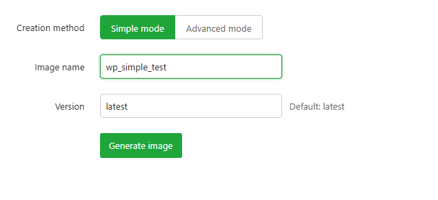
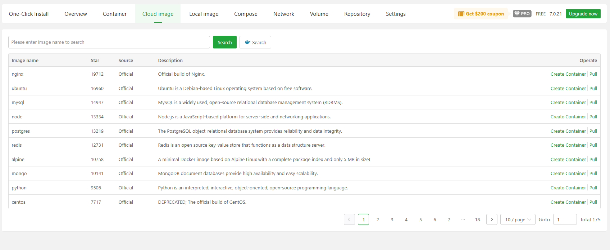

# aaPanel Docker Modules 
- Docker là một công cụ mạnh mẽ giúp triển khai và quản lý ứng dụng một cách nhanh chóng, linh hoạt trên nhiều môi trường khác nhau. Nếu bạn đang sử dụng aaPanel – một control panel phổ biến để quản lý máy chủ, việc tích hợp Docker sẽ mang lại nhiều lợi ích vượt trội.
- Trong bài viết này, chúng ta sẽ cùng tìm hiểu cách cài đặt,sử dụng chi tiết Docker trên aaPanel
- Mặc định Docker không được cài đặt 
- Thực hiện cài đặt bằng cách click nút `Install` 
- 
- Chọn phương thức cài đặt 
- 
- Qúa trình cài đặt diễn ra 
- 
- Giao diện tổng quan Docker Modules 
- 
- Gồm các thành phần chính:
	- One-Click Install: Cài đặt Docker nhanh chóng chỉ với một cú nhấp chuột
	- Overview: Tổng quan về trạng thái Docker và tài nguyên hệ thống
	- Container: Quản lý các container đang chạy hoặc đã dừng
	- Cloud image: Tải image từ Docker Hub hoặc kho lưu trữ đám mây
	- Local image: Quản lý các image đã tải về máy chủ
	- Compose: Hỗ trợ Docker Compose để triển khai ứng dụng phức tạp
	- Network: Quản lý mạng Docker
	- Volume: Quản lý dữ liệu lưu trữ dùng chung giữa các container
	- Repository: Cấu hình kho lưu trữ image riêng
	- Settings: Thiết lập cấu hình Docker trong aaPanel

## One-Click Install	
- Giao diện giúp cài đặt các container Docker nhanh chóng chỉ với một cú nhấp chuột.
- Gồm các thành phần 
	- Thanh tìm kiếm và các tab phân loại các ứng dụng Docker 
	- 	
		- Tại Tab `Installed` bạn có thể xem các ứng dụng đã cài 
	- Danh sách liệt kê các ứng dụng kèm nút Install để cài đặt nhanh chóng 
		- Có thể cập nhật danh sách bằng nút `Update app list`
- Ví dụ cài đặt container `emlog`
	- `emlog` cần có MySQL 
	- Thực hiện cài Mysql trong Docker 
		- Tại tab `Database` chọn app `Mysql` và click `Install`
		- 	
		- Giao diện cấu hình thông số cho Mysql 
			- Tên container: Tên định danh cho phiên bản MySQL bạn sắp tạo.
			- Chọn phiên bản: Lựa chọn phiên bản MySQL muốn cài đặt.
			- Cho phép truy cập từ bên ngoài: Nếu bật, bạn có thể kết nối MySQL từ bên ngoài thông qua IP máy chủ và cổng được chỉ định.
			- Cổng: Cổng mà MySQL sẽ lắng nghe (mặc định thường là 3306, nhưng ở đây có thể tùy chỉnh).
			- Mật khẩu root: Mật khẩu cho tài khoản quản trị MySQL, có thể tạo ngẫu nhiên.
			- Giới hạn CPU: Số lõi CPU tối đa container được phép sử dụng (0 nghĩa là không giới hạn).
			- Giới hạn RAM: Dung lượng bộ nhớ tối đa container được phép sử dụng (0 nghĩa là không giới hạn).
			- Nút thao tác: Cancel/Confirm 
		- Sau khi đã cấu hình ấn `Confirm` để cài đặt 
		- 	
	- Sau khi đã cài Mysql hoàn tất thực hiện cài `Wordpress` 
		- Tại tab `BuildWebsite` chọn app `Wordpress` và click `Install`
		- 	
		- Giao diện cấu hình thông số cho emlog 
			- 	
			- Tên container: Đặt tên định danh cho phiên bản WordPress bạn sắp tạo.
			- Phiên bản WordPress: Chọn phiên bản muốn cài đặt (ví dụ: 6.6.1).
			- Tên miền (Domain): Tùy chọn, dùng để truy cập WordPress qua trình duyệt nếu bạn có tên miền riêng.
			- Cho phép truy cập từ bên ngoài: Nếu bật, bạn có thể truy cập WordPress qua địa chỉ IP máy chủ và cổng đã chọn. Nếu dùng domain, nên tắt tùy chọn này.
			- Cổng (Port): Cổng mà WordPress sẽ sử dụng để lắng nghe kết nối (ví dụ: 21080).
			- Cơ sở dữ liệu:
			- Tên database, tên người dùng, mật khẩu: Các thông tin để WordPress kết nối với MySQL.
			- Dịch vụ database: Chọn MySQL đã cài đặt sẵn trong Docker.
			- Giới hạn CPU và RAM: Giới hạn tài nguyên mà container WordPress được phép sử dụng. Đặt “0” nếu không muốn giới hạn.
			- Các nút thao tác
				- Confirm: Xác nhận và tiến hành khởi tạo container WordPress.
				- Cancel: Hủy thao tác cài đặt.
		- Sau khi đã cấu hình ấn `Confirm` để cài đặt 
	- Deloy hoàn tất kiểm tra tại tab `Installed`
	- 	
	- Kiểm tra 
	- 	
	
- Quản lý cơ bản mỗi app đã được cài tại tab Installed
	- Với mỗi app đã triển khai có thể thực hiện các thao tác 
		- 	
		- Stop/ Restart: Dừng, khởi động lại container 
		- Details: Hiển thị thông tin chi tiết app đã deploy
		- Rebuild: Rebuild lại app 
		- Uninstall; Gỡ cài đặt app 
	- Backup: Hiển thị danh sách backup đã tạo, thực hiện các thao tác backup
		- 	
		- 	
		- Click to backup : Click để tạo bản backup
		- Upload backup : Tải lên file backup 
		- Restore : Restore backup
		- Download : Tải xuống backup
		- Delete : Xoá backup
	- Open log
		- Click vào icon log bên cạnh tên app để mở giao diện xem bản ghi 
		- 	
			- Run logs: Hiển thị bản ghi của app đang chạy 
			- 	
			- Install logs: Hiển thị bản ghi quá trình cài đặt 
			- 	
	- Mở thư mục cài đặt: 
		- Click vào icon thư mục bên cạnh tên app để chuyển tới thư mục lưu trữ app 
			- 	
			- 	
## Overview	
- Hiển thị lượng sử dụng tài nguyên của máy chủ và của từng container 
- 	
- Click và tên container để mở giao diện quản trị container. Chi tiết về giao diện này trình bày trong phần Container 
- 	
- Có thể làm mới danh sách container bằng nút `Refresh container list`
- 	
- Ẩn thông tin CPU/Memory bằng nút `Hide CPU and memory overview`
- 	

## Container	
- Đây là giao diện chính quản lý các container 
- 	
- Có thể xem trạng thái, thực hiện các thao tác khởi động, dừng, xoá, quản trị,...
- Giao diện này gồm các thành phần 
- Các nút chức năng 
	- 	
	- Create Container 
	- Log Manage 
	- Clear Container 
- Bảng quản lý danh sách các container đang chạy 
- 	

### Các nút chức năng 
#### Create Container 
- Sử dụng để tạo Container mới 
- Gồm 3 chế độ tạo 
	- Manual 
	- Command 
	- Container arrangement
- Manual Create
- 	
- Giao diện tại Container thủ công 
- Gồm các thông số cấu hình 
	- Tên container: Nhập tên cho container
	- Image: Chọn image (ảnh hệ thống) cho container
	- 	
	- Cổng (Port):
		- Expose port: Ánh xạ cổng được chỉ định trong container sang cổng tương ứng trên máy chủ
			- Có thể cấu hình `LocalPort` - `Container Port` - `Protocol` 
			- Có thể thêm nhiều Port bằng nút `Add`
		- 
		- Expose all: Ánh xạ tất cả các cổng của container sang các cổng tương ứng trên máy chủ
	- Quy tắc khởi động lại (Reboot Rule)
		- Không khởi động lại: Khi khởi động lại máy chủ hoặc dịch vụ Docker, container sẽ không tự khởi động
		- Khởi động lại khi lỗi (mặc định 5 lần): Container sẽ tự khởi động lại khi gặp lỗi, nhưng không quá 5 lần. Nên kiểm tra log để xử lý lỗi
		- Chỉ khởi động lại khi thoát bất thường: Container sẽ khởi động lại nếu thoát do lỗi
		- Khởi động lại ngay sau khi dừng: Container sẽ tự khởi động lại ngay khi bị dừng
	- Các tuỳ chọn nâng cao: Mở bằng việc click chọn `More config, click to view`
		- 
	- Mạng (Network): Chọn chế độ mạng cho container, mặc định là bridge
		- 
		- Cấu hình chọn loại mạng cần thêm, địa chỉ IPV4/V6
		- 
		- Có thể thêm nhiều network cho 1 container bằng nút `Add` 
		- 
	- Mount/Map: Gắn thư mục trong container vào thư mục trên máy chủ, hoặc chỉ định một Volume
		- 
		- Gắn thư mục trong container vào thư mục trên máy chủ tại tab Local Path, cấu hình permission read only hoặc read/write
		- 
		- Gắn volume với container tại tab Mount Volume, cấu hình permission read only hoặc read/write
		- 
		- Tương tự như network hay port cũng có thể thêm nhiều mount bằng nút `Add` 
	- Command: Thiết lập lệnh được thực thi sau khi container khởi động (có thể để trống)
	- Entrypoint: Thiết lập lệnh chính luôn được thực thi khi container khởi động, định nghĩa cách container hoạt động (có thể để trống)
		- Tuỳ chọn tích để Tự động xóa container sau khi thoát: Container sẽ bị xóa tự động sau khi dừng
	- Tương tác với Console:
		- Pseudo-TTY (-t): Cấp phát một terminal ảo
		- Standard input (-i): Giữ STDIN luôn mở kể cả khi không gắn kết
		- Chế độ đặc quyền (Privilege Mode): Cho phép container chạy với quyền cao nhất
	- 
	- Giới hạn tài nguyên
		- Bộ nhớ tối thiểu (Min memory): Bộ nhớ tối thiểu cấp cho container (không vượt quá bộ nhớ vật lý)
		- Giới hạn CPU (CPU limit): Số lõi CPU tối đa container được phép sử dụng (không vượt quá số lõi vật lý)
		- Giới hạn bộ nhớ (Memory limit): Dung lượng RAM tối đa container được phép sử dụng (không vượt quá bộ nhớ vật lý)
	- Tag: Thẻ gắn cho container
	- Biến môi trường (Env variable): Thiết lập biến môi trường cho container
	- Ghi chú (Remark): Ghi chú mô tả container

- Command Create : Sử dụng lệnh để tạo container 
	- 
	- Ví dụ lệnh sau:
		- 
		- Điền lệnh và click `Excute` để thực thi:
		```bash
		docker run -d --name mysql_test -p 3361:3306 -v /docker/mysql_data/:/var/lib/mysql/ -e MYSQL_ROOT_PASSWORD=my-passwd mysql:5.7
		```
		- `docker run`: Tạo một container từ image `mysql:5.7`  
		- `-d`: Chạy container ở chế độ nền (background)  
		- `--name mysql_test`: Đặt tên cho container là `mysql_test`  
		- `-p 3361:3306`: Ánh xạ cổng 3361 của máy chủ sang cổng 3306 của container (cổng mặc định của MySQL)  
		- `-v /docker/mysql_data/:/var/lib/mysql/`: Gắn thư mục `/docker/mysql_data/` trên máy chủ vào `/var/lib/mysql/` trong container để lưu trữ dữ liệu lâu dài (persist)  
		- `-e MYSQL_ROOT_PASSWORD=my-passwd`: Thiết lập biến môi trường để đặt mật khẩu cho tài khoản root của MySQL là `my-passwd`. Nếu không khai báo biến này, container sẽ không thể khởi động  
		- `mysql:5.7`: Sử dụng image MySQL phiên bản 5.7 để tạo container  
	
- Container arrangement: Tạo nhanh Container từ template
	- 
	- Container template: Liệt kê các mẫu Docker Compose có sẵn
	- Name: Nhập tên cho mẫu
	- Description: Nhập mô tả cho mẫu
	- Có thể tạo mẫu mới bằng nút `Create`
		- 
		- Tab `Add Compose Template`: Cấu hình thêm template mới 
			- Create template: Điền tên của mẫu 
			- Remark: Ghi chú về mẫu 
			- Content: Nội dung script YAML của mẫu 
		- Tab `Search Local Template`: Tạo mẫu từ file có sẵn trong bộ nhớ 
		- 
- Ví dụ tạo một mẫu để triển khai WordPress và MySQL, bạn có thể điền như sau:
	- Name: wordpress_stack
	- Description: Triển khai WordPress kèm MySQL sử dụng Docker Compose
	- Nội dung: Script YAML 
	```
	version: '3.8'
	services:
	  db:
		image: mysql:5.7
		restart: always
		environment:
		  MYSQL_ROOT_PASSWORD: example
		volumes:
		  - db_data:/var/lib/mysql

	  wordpress:
		image: wordpress:latest
		ports:
		  - "8080:80"
		restart: always
		environment:
		  WORDPRESS_DB_HOST: db
		  WORDPRESS_DB_PASSWORD: example

	volumes:
	  db_data:
	```
	- Confirm để xác nhận tạo mẫu mới 
	
#### Log Manage
- Trình quản lý bản ghi các container 
- 
- Có thể xem bản ghi của từng container được liệt kê bằng tên ở panel bên phải 
- 
- Panel bên trái là giao diện quản lý log của từng container 
	- Log cut : Đây là tính năng tự động chia bản ghi sang file mới. Có thể cấu hình bật/tắt.
		- 
		- Có thể cấu hình thông số tại `Edit Config` 
		- 
			- Đường dẫn cắt log (Cut path): /var/lib/docker/containers/history_logs – thư mục chứa các log cần xử lý.
			- Phương thức cắt (Cut method):
				- Theo kích thước log (Log size): Cắt khi log vượt quá dung lượng nhất định.
				- Theo thời gian chạy (Run time): Cắt theo lịch định kỳ (đang được chọn).
				- Thời gian chạy (Run time): Thiết lập chạy hàng ngày lúc 2 giờ sáng.
			- Giữ lại bản mới nhất (Retain the latest): Giữ lại 180 bản log gần nhất, các bản cũ hơn sẽ bị xóa tự động.
			- Ghi chú:
				- Tác vụ được kiểm tra và thực hiện mỗi 5 phút.
				- Khi vượt quá số lượng log cho phép, hệ thống sẽ tự động xóa log cũ.
	- Refresh : Làm mới để nhận các bản ghi mới nhất 
	- Download : Tải xuống bản ghi hiện tại đang xem 
	- Clear: Xoá bản ghi của container 
	- All: Hiển thị tất cả bản ghi hiện có của container 
	- Last 7 days : Hiển thị bản ghi của 7 ngày gần nhất 
	- Last 30 days : Hiển thị bản ghi của 30 ngày gần nhất 
	- Custom time: Hiển thị bản ghi tại thời gian cụ thể có thể tự chọn tại pop-up chọn ngày. 
		- 

#### Clear Container
- Sử dụng để xoá các Container mặc định sẽ tác động tới các container đã stop, không còn sử dụng 
	- 
- Tuỳ chọn tích `Delete all containers` sẽ xoá tất cả container đang có kể cả đang chạy 
- Chọn `Confirm` để xác nhận xoá 
### Bảng quản lý danh sách các container đang chạy 
- Giúp người dùng dễ dàng theo dõi, kiểm soát và thao tác với các container Docker thông qua giao diện trực quan, không cần dùng dòng lệnh.
- 
- Gồm các thông tin 
	- Danh sách container: Hiển thị tất cả container hiện có, bao gồm tên, trạng thái, image sử dụng, cổng ánh xạ và thời gian tạo, ghi chú. 
		- Click vào tên container để mở giao diện quản trị container 
		- 
	- Trạng thái hoạt động: Cho biết container đang chạy hay đã dừng.
		- Có thể thực hiện nhanh thao tác: stop, pause, kill, start đối với từng container 
		- 
	- Tùy chọn thao tác:
		- Quản lý: Xem và chỉnh sửa cấu hình container.Click để mở giao diện quản trị 
			- 
		- Terminal: Mở dòng lệnh bên trong container.
			- 
			- Gồm 2 tuỳ chọn shell : Bash/sh 
			- Tích chọn chạy với quyền quản trị hay không 
			- 
			- Click confirm để mở terminal
			- 
		- Xóa: Dừng và xóa container.
			- 
		- Tùy chọn khác: 
			- Xem log: xem bản ghi của container đang chọn 
				- 
				- 
			- Đổi tên container đang cấu hình 
				- 
				- 	
			- Truy cập đường dẫn thư mục lưu container
				- 	
				- 	

- Giao diện quản trị: Quản trị các tính năng liên quan tới container. Truy cập bằng cách click tên Containter trong `Overview`, trong danh sách Container
- Gồm các cấu hình 
- Container status – Trạng thái container
	- 	
	- Tại đây có thể thao tác: Dừng, khởi động lại container 
	- Các thông tin được cung cấp 
		- Tên container: Tên định danh của container trong hệ thống.
		- Container ID: Mã định danh duy nhất của container.
		- Image sử dụng: Image Docker mà container được tạo từ đó.
		- Thời gian chạy: Cho biết container đã hoạt động bao lâu.
		- Thời gian tạo: Thời điểm container được khởi tạo.
		- Thời gian khởi động: Thời điểm container bắt đầu chạy.
		- Cổng (Ports): Cổng trên máy chủ được ánh xạ đến cổng trong container.
		- Địa chỉ IP: IP nội bộ của container trong mạng Docker.
		- IPv6: Thông tin địa chỉ IPv6 (nếu có).
- Container terminal – Mở terminal bên trong container: tương tự nút thao tác `Terminal`
	- 	
- Container details - Giao diện hiển thị chi tiết các thông tin của container 
	- Gồm 2 tab View Display và File Display
	- 	
	- 	
	- 	
	- Hiển thị các thông tin chi tiết tương tự với output của lệnh `docker inspect <container-name>
- Storage volumes – Quản lý volume lưu trữ
	- 
	- Hiển thị các volume được mount, đường dẫn trong máy chủ và đường dẫn tương ứng trong container 
- Container network – Quản lý mạng container
	- 
	- Có thể cấu hình join vào mạng mới. 
	- 
	- Hoặc thoát khỏi mạng 
	- 
- Reboot strategy – Cấu hình chính sách khởi động lại
	- 
	- Gồm các chính sách 
		- Không khởi động lại: Khi khởi động lại máy chủ hoặc dịch vụ Docker, container sẽ không tự khởi động
		- Khởi động lại khi lỗi (mặc định 5 lần): Container sẽ tự khởi động lại khi gặp lỗi, nhưng không quá 5 lần. Nên kiểm tra log để xử lý lỗi
		- Chỉ khởi động lại khi thoát bất thường: Container sẽ khởi động lại nếu thoát do lỗi
		- Khởi động lại ngay sau khi dừng: Container sẽ tự khởi động lại ngay khi bị dừng
	- Click `Save` để lưu 
- Create image – Tạo image từ container hiện tại
	- Gồm 2 mode Simple và Advanced 
	- Simple mode: Cấu hình tên, version, click `Create` để tạo image 
		- 
		- Ví dụ tạo image 
		- 
	- Advanced mode: Cấu hình tên, version, repo, mô tả tác giả, tích chọn sinh và lưu image ra file zip vào bộ nhớ. click `Create` để tạo image 
		- 
		- Ví dụ tạo image 
		- 
		- 
		- Image file được tạo và lưu
		- 
- Rename – Đổi tên container tương tự nút chức năng `Rename`
	- 
- Real-time logs – Xem log thời gian thực tương tự nút chức năng `Logs`
	- 
- Proxy – Cấu hình proxy cho container: Cấu hình bind IP sang domain sử dụng proxy 
	- 	
	- Gồm các cấu hình: Domain sẽ bind, port local, cấu hình sử dụng chứng chỉ SSL. Save để tạo proxy 
	- Ví dụ tạo proxy 
	- 
	- Kiểm tra 
	- 	
## Cloud image	
- Quản lý các image trên Internet 
	- 	

- Giao diện gồm 
	- Thanh tìm kiếm image
	- Danh sách các image	
		- `Create Container`: Thực hiện các thao tác tạo container với image tương ứng 
		- 	
		- `Pull`: Thực hiện kéo image về local 
		- 	

## Local image
- Quản lý các image tại local 
- 	
- Giao diện gồm 
	- Các nút chức năng
		- 	
		- Pull From Repository: Tải image từ Docker Hub hoặc kho lưu trữ khác về máy chủ.
		- Import Image: Nhập image từ file .tar có sẵn trên máy chủ.
		- Build Image: Tạo image mới từ Dockerfile.
		- Cloud Image: Quản lý và tải image từ kho lưu trữ đám mây.
		- Clear Image: Xóa các image không còn sử dụng để giải phóng dung lượng ổ đĩa.
	- Bảng liệt kê các image hiện có
		- 	
		- Hiển thị các thông tin: 
			- ID của image.
			- Tên image (ví dụ: nginx:latest, mysql:8.0).
			- Kích thước image.
			- Thời gian tạo image.
			- Danh sách container đang sử dụng image đó.
		- Các thao tác:
			- Create Container: Tạo container mới từ image đã chọn.
			- Push: Đẩy image lên Docker Hub hoặc registry riêng.
			- Export: Xuất image thành file .tar để sao lưu hoặc chuyển sang máy chủ khác.
			- Delete: Xóa image khỏi hệ thống (chỉ khi không còn container nào đang sử dụng).

### Các nút chức năng 
- Pull From Repository: Dùng pull image về local từ Docker Hub hoặc kho riêng 
	- 
	- Gồm 2 kiểu pull
		- Regular pull: Cấu hình chọn nguồn, tên image và click `Pull` để kéo image. Có thể xem tiến trình `Pull result` 
		- 
		- Ví dụ: Pull image redis 
		- 
		- Command pull: Sử dụng lệnh để pull image. Điền lệnh và click Pull để thực hiện kéo. Có thể xem tiến trình `Pull result` 
		- Ví dụ: pull image node bằng lệnh `docker pull node:latest:
		- 
- Import Image: Dùng để nhập image vào hệ thống. Cấu hình dẫn tới file image .tar để import. Click Confirm để xác nhận. 
	- 
	- Ví dụ import image `wp_ad_test.tar`: Chọn tới file image trong bộ nhớ, `Confirm` để xác nhận import 
	- 
	- Import thành công
	- 
- Build Image: Sử dụng để build image từ source Dockerfile 
	- 
	- Gồm 2 kiểu 
		- Build từ thư mục chứa source 
		- 
		- Build từ content script nhập Dockerfile trực tiếp
		- 
	- Ví dụ build từ source 
		- Chọn build từ Path, trỏ đường dẫn về thư mục source 
		- 
		- Click `Confirm` để build 
		- 
		- Build thành công 
		- 
	- Ví dụ build từ trực tiếp nội dung file Dockerfile
		- Chọn build từ `Content`
		- 
		- Click confirm để xác nhận build 
		- 
		- Build thành công 
		- 
- Cloud image: 	Mở giao diện quản lý cloud image. Tương tự phần `Cloud Image` 
	- 
- Clear image: Dọn dẹp image không có tên, có thể dọn dẹp các image không sử dụng bằng việc click chọn `Clean up images that are not used by containers`
	- 
 
### Bảng liệt kê các image hiện có
- 	
- Hiển thị các thông tin: 	
	- ID của image.
	- Tên image (ví dụ: nginx:latest, mysql:8.0).
	- Kích thước image.
	- Thời gian tạo image.
	- Danh sách container đang sử dụng image đó: Click vào tên Container để tới giao diện quản trị container 
	- 
- Các thao tác:
	- Create Container: Tạo container mới từ image đã chọn.
	- 
	- Push: Đẩy image lên Docker Hub hoặc registry riêng ( Chỉ dành cho image thuộc registry riêng)
	- Export: Xuất image thành file .tar để sao lưu hoặc chuyển sang máy chủ khác.
	- 
	- Ví dụ xuất image hello: Cấu hình tên file, đường dẫn lưu 
	- 
	- Confirm để bắt đầu xuất 
	- 
	- 
	- Delete: Xóa image khỏi hệ thống (chỉ khi không còn container nào đang sử dụng).	
	- 
## Compose	
- Giao diện được sử dụng để định nghĩa và chạy nhiều container. Việc cấu hình được thực hiện thông qua tệp compose.yaml nhằm đơn giản hóa việc quản lý và triển khai các container.
- Tổng quan giao diện 
- 
- Gồm các phần 
	- Quản lý Compose, danh sách các compose đang khởi chạy 
	- 
	- Quản trị container: Thực hiện các thao tác bật/tắt, khởi động lại, cập nhật image 
	- 
	- Container List: Danh sách các Container thuộc Compose: Cung cấp các thông tin: tên, port, các nút chức năng xem log, mở terminal 
	- 
	- Compose Log: Hiển thị bản ghi của compose đang chọn 
	- 
	- Configuration File: Giao diện chỉnh sửa file cấu hình : compose.yaml, .env. Có thể thực hiện chỉnh sửa, chọn `Save` để áp dụng 
	- 
	
### Compose Manager 
- 
- Giao diện gồm các nút chức năng 
	- `Add Compose`: Giao diện thêm Compose mới
	- 
	- Tabs lựa chọn
		- General Creation: Tạo mới thủ công một file Compose.
		- Các trường nhập liệu
			- Compose Name: Tên của cấu hình Compose. 
			- Compose Content: Nội dung của file compose.yaml. Nhập nội dung YAML định nghĩa các container.
			- .env Content: Nội dung của file .env chứa các biến môi trường. Chứa các biến như MYSQL_USER, WORDPRESS_DB_PASSWORD, v.v.
		- Tùy chọn lưu mẫu
			- Also Save as Template: Nếu được chọn, cấu hình này sẽ được lưu lại như một mẫu để sử dụng sau.
			- Template Name: Nhập tên mẫu để lưu.
			- Notes: Ghi chú thêm về mẫu hoặc cấu hình.	
		- Nút thao tác
			- Cancel (xám): Hủy thao tác.
			- Confirm (xanh lá): Xác nhận và lưu cấu hình Compose.
		- Use Template: Tạo từ mẫu có sẵn.
			- Container Template: Hiển thị các mẫu có sẵn. Có tùy chọn để tạo mẫu mới nếu cần.
				- Nhấp chọn Create để tạo mẫu mới 
					- Tab `Add Compose Template`: Cấu hình thêm template mới
					- 
						- Create template: Điền tên của mẫu 
						- Remark: Ghi chú về mẫu 
						- Content: Nội dung script YAML của mẫu 
					- Tab `Search Local Template`: Tạo mẫu từ file có sẵn trong bộ nhớ
					- 
			- Name: Trường để đặt tên cho cấu hình Compose.
			- Description: Trường để mô tả ngắn gọn về cấu hình.
		- `Template List`: Giao diện hiện thị các template hiện có 
		- 
			- Có thể tạo mới mẫu bằng nút `Add`
				- 
			- Trong phần hiển thị danh sách các template có thể thực hiện các thao tác chỉnh sửa, pull image và xóa mẫu. 
		- Danh sách các compose đang khởi chạy 
			- 
			- Click để chọn cấu hình phục vụ cho các giao diện quản trị, Container List, Log, Configuration File.
		
- Ví dụ tạo Compose mới 
	- Compose Name: phpmyadmin_demo
	- Compose Content: Cấu hình dịch vụ về mysql, phpmyadmin 
	- .env Content: Các biến môi trường về Mysql 
	- Template Name: phpmyadmin_demo
	- 
	- Click `Confirm` để khởi tạo 
	- 
	- 
	- Compose được khởi tại thành công 
	- 

### Quản trị compose 
- Với mỗi compose được chọn từ Compose List 
	- 
- Giao diện này cung cấp 
	- Thông tin về: Tên Compose, thời gian tạo, số instance khởi chạy 
	- Các nút thao tác 
		- Stop: Dừng container.
		- Restart: Khởi động lại container.
		- Update Image: Cập nhật phiên bản image mới nhất.
		- Delete: Xóa container khỏi hệ thống.

### Container List 
- Giao diện hiển thị các container khởi chạy trong compose 
- 
- Giao diện này cung cấp 
	- Thông tin về container: Tên, trạng thái hoạt động, ID, Port 
	- Các nút thao tác 
		- Terminal: Thực hiện mở cửa sổ Terminal nhanh chóng 
		- 	
		- Log: Mở cửa sổ bản ghi của container tương ứng 
		- 	
		
### Compose Logs 
- Giao diện hiển thị bản ghi chung của Compose được chọn 
- 	
### Configuration file
- Giao diện chỉnh sửa file cấu hình `compose.yaml` và file biến môi trường `.env` 
- 	
- Có thể thực hiện chỉnh sửa file và `Save` 

## Network	
- Giao diện quản lý mạng trong Docker 
- 	
	- Quản lý mạng nội bộ giữa các container trong hệ thống Docker.
	- Cho phép tạo mới, xóa, và xem thông tin chi tiết của từng mạng.
- Giao diện gồm 
	- Nút thao tác
		- Add network: Tạo một mạng Docker mới.
		- Clear network: Xóa các mạng không còn sử dụng hoặc dọn dẹp.
	- Bảng danh sách mạng: Hiển thị các mạng đã được tạo hoặc mặc định trong hệ thống. Mỗi dòng là một mạng. 
### Các nút thao tác 
- `Add network` : Giao diện tạo mạng tùy chỉnh 
	- 	
	- Gồm các cấu hình 
		- Network name: Nhập tên định danh cho mạng mới.
		- Device: Chọn loại driver mạng (ví dụ: bridge, overlay, v.v.).
		- IPv4 subnet: Nhập dải địa chỉ IPv4 theo định dạng CIDR.
		- IPv4 gateway: Nhập địa chỉ gateway cho mạng IPv4.
		- IPv4 range: Xác định phạm vi địa chỉ IP được cấp phát cho container.
		- Enable IPv6: Bật/tắt hỗ trợ mạng IPv6.
		- IPv6 subnet: Nhập dải địa chỉ IPv6 nếu bật IPv6.
		- IPv6 gateway: Nhập địa chỉ gateway cho mạng IPv6.
		- Remark: Trường để ghi chú hoặc mô tả thêm về mạng.
		- Nút thao tác
			- Cancel: Hủy thao tác tạo mạng.
			- Confirm: Xác nhận và tạo mạng mới với các thông số đã nhập.
	- Ví dụ tạo mạng mới 
		- IPv4 subnet: 172.20.0.0/16
		- IPv4 gateway: 172.20.0.1
		- IPv4 range: 172.20.0.0/24 (
		- IPv6 subnet: 2001:db8:abcd::/64
		- IPv6 gateway: 2001:db8:abcd::1
		- 	
		- 	
- `Clear Network`: Xóa các network không sử dụng, trả lời câu hỏi và nhấn `Confirm` để xóa 
	- 	
### Bảng danh sách mạng
- Hiển thị các mạng đã được tạo hoặc mặc định trong hệ thống. Mỗi dòng là một mạng
	- 	
- Cung cấp các thông tin 
	- Network name: Tên định danh của mạng Docker.
	- Driver: Loại driver mạng được sử dụng (ví dụ: bridge, null, v.v.).
	- IPv4 / IPv4 Gateway: Dải địa chỉ IP và gateway của mạng IPv4.
	- IPv6 / IPv6 Gateway: Nếu có, hiển thị cấu hình mạng IPv6.
	- Tag: Thông tin bổ sung, thường là metadata do Docker Compose sinh ra.
	- Creation time: Thời điểm mạng được tạo trong hệ thống.
	- Operate: Nút “Delete” để xóa mạng.
	- 	
	
## Volume	
- Quản lý Docker volumes – nơi người dùng có thể xem, thêm, hoặc xóa các volume đang tồn tại trong hệ thống.
- 	
	- Hiển thị danh sách các volume đã được tạo.
	- Cho phép người dùng thêm volume mới hoặc xóa các volume không còn sử dụng.
	- Cung cấp thông tin chi tiết về từng volume.	
- Giao diện gồm: 
	- Các nút thao tác :
		- Add volume: Tạo volume mới.
		- Clear volume: Dọn dẹp các volume không còn sử dụng.
	- Danh sách các volume đã tạo
### Các nút thao tác 
- Add volume: Cấu hình thêm volume mới 
	- 	
	- Gồm các trường cấu hình 
		- Volume name: Trường bắt buộc để đặt tên cho volume. Đây là tên định danh duy nhất giúp bạn nhận diện volume trong hệ thống Docker.
		- Option: Trường tùy chọn để cấu hình thêm các thông số kỹ thuật cho volume (nếu hệ thống hỗ trợ).
		- Tag: Cho phép gắn nhãn (metadata) cho volume. Mỗi dòng là một cặp key=value, ví dụ: environment=dev hoặc project=demo.
		- Remark: Ghi chú mô tả về volume, giúp người dùng dễ nhớ mục đích sử dụng hoặc thông tin liên quan.
		- Các nút: Cancel/Confirm 
	- Ví dụ tạo 1 volume mới 
		- Volume name: mysql_data_demo
		- Option: để trống 
		- Tag:
		  environment=development
		  project=demo_app
		- Remark: Volume dùng để lưu trữ dữ liệu MySQL cho ứng dụng demo.
		- 	
		- 	
- Clear Volume: Dùng để xóa các volume không sử dụng, trả lời câu hỏi và nhấn `Confirm` để xóa
	- 	
### Danh sách các volume đã tạo
- Người dùng có thể xem danh sách các volume đã tạo, bao gồm thông tin chi tiết như:
	- 	
	- Volume name: Tên định danh của volume.
	- Mount point: Đường dẫn nơi volume được gắn trên hệ thống.
	- Container: Tên container đang sử dụng volume (nếu có).
	- Driver: Loại driver quản lý volume, thường là 'local'.
	- Creation time: Thời điểm volume được tạo.
	- Tag: Metadata bổ sung, thường do Docker Compose hoặc hệ thống sinh ra.
	- Thực hiện thao tác xóa volume bằng nút `Delete` tại mỗi volume tương ứng 
	- 	
	
## Repository	
- Giao diện quản lý các repository (kho lưu trữ). 
- 	
- Gồm các phần  
	- Nút "Add Repository": Dùng để thêm một repository mới. Click để mở giao diện thêm Repository
		- 	
		- Các trường cấu hình 
			- Repository address: Địa chỉ kho lưu trữ.
			- Repository name: Tên kho lưu trữ.
			- Username: Tên đăng nhập.
			- Password: Mật khẩu đăng nhập.
			- Namespaces: Không gian tên để phân loại.
			- Description: Mô tả kho lưu trữ.
		- Nút thao tác:
			- Cancel: Hủy thao tác 
			- Confirm: Xác nhận thêm 
	- Bảng danh sách repository gồm các cột:
		- URL: Địa chỉ của repository (ví dụ: docker.io)
		- Username: Tên người dùng liên kết (trong ví dụ thì để trống)
		- Repository name: Tên của repository (trong ví dụ thì chưa có tên)
		- Description: Mô tả repository (ví dụ: Docker official public repository)
		- Operate: Gồm nút Edit (chỉnh sửa) và Delete (xóa)
		- 	
		
## Settings
- Giao diện quản lý cài đặt Docker 
- 	
- Các thành phần trong giao diện quản lý Docker:
	- Docker server: Hiển thị trạng thái hoạt động của Docker, có thể dừng hoặc khởi động lại.
	- Accelerate URL: Địa chỉ dùng để tăng tốc tải Docker image, có thể chỉnh sửa.
	- 	
	- Docker compose: Đường dẫn đến tệp thực thi docker-compose, có thể chỉnh sửa.
	- 
	- Open configuration file: Mở tệp cấu hình Docker để chỉnh sửa thủ công.
	- 	
	- IPv6 Network: Tùy chọn bật/tắt mạng IPv6 cho Docker, cần khởi động lại Docker khi thay đổi.
	- Uninstall Docker: Gỡ cài đặt Docker khỏi hệ thống.
	
	