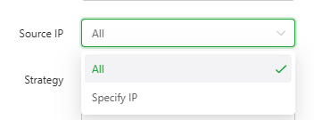
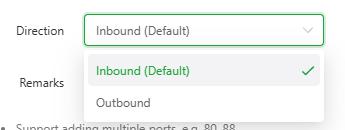
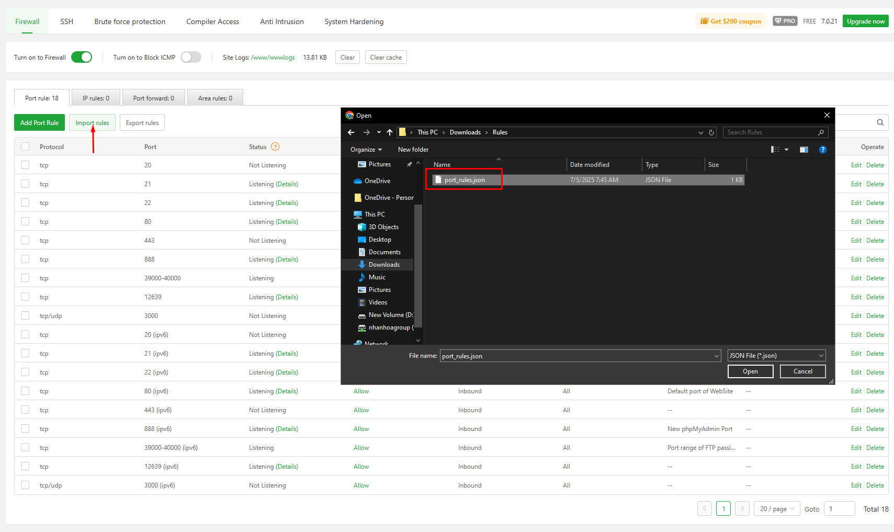
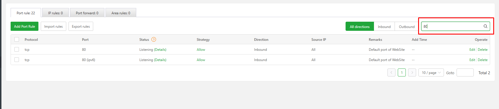
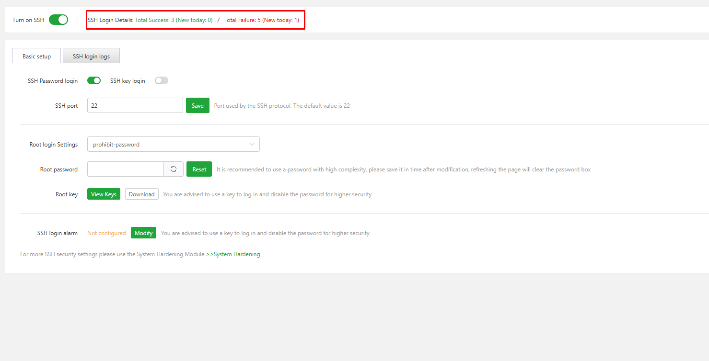
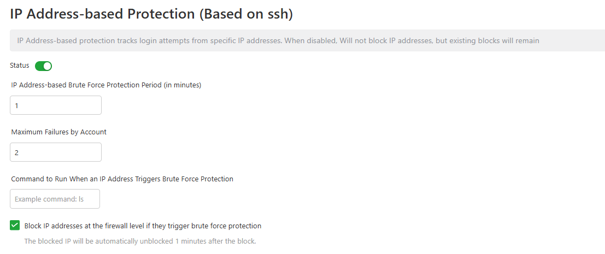

# aaPanel Security Modules 
- aaPanel cung cấp trình quản lý bảo mật 
- Module này cung cấp khả năng quản lý tường lửa hệ điều hành, dịch vụ SSH, người dùng root của hệ điều hành, bảo vệ chống tấn công brute force, quyền truy cập trình biên dịch, chống xâm nhập, tăng cường bảo mật hệ thống, và xem nhật ký đăng nhập SSH.
- Gồm các module nhỏ 
	- Firewalls – Quản lý các quy tắc tường lửa để kiểm soát lưu lượng mạng vào/ra máy chủ.
	- SSH – Cấu hình và bảo vệ dịch vụ SSH, bao gồm thay đổi cổng và giới hạn truy cập.
	- Brute Force Protection – Phát hiện và ngăn chặn các cuộc tấn công dò mật khẩu đăng nhập.
	- Compiler Access – Giới hạn quyền sử dụng trình biên dịch để ngăn mã độc tự biên dịch trên máy chủ.
	- Anti Intrusion – Giám sát và chặn các hành vi truy cập bất thường hoặc đáng ngờ. (Pro)
	- System Hardening – Áp dụng các thiết lập bảo mật nâng cao để giảm thiểu lỗ hổng hệ thống. (Pro)

## Firewalls
- Giao diện này có chức năng 
	- Quản lý quyền truy cập mạng vào máy chủ này. 
	- Quy tắc tường lửa mặc định là từ chối truy cập.
	- Để truy cập từ bên ngoài, cần cho phép các quy tắc cổng hoặc địa chỉ IP tương ứng
- Giao diện tổng quan 
- 
- Gồm các phần 
	- Các nút chức năng 
		- 
		- Bật Tường lửa (Turn on to Firewall): Tắt tường lửa hệ thống. Không khuyến nghị tắt trừ khi thật sự cần thiết.
		- Bật Chặn ICMP (Turn on to Block ICMP): Vô hiệu hóa lệnh ping. Sau khi bật, các thiết bị khác sẽ không thể ping đến máy chủ này.
		- Nhật ký trang web (Site Logs): Hiển thị đường dẫn và dung lượng của các tệp nhật ký trang web. Nhấn Clear để xóa.
	- Bảng liệt kê các rules: Gồm các tab 
		- Port rule: Từ chối hoặc cho phép IP truy cập vào cổng.
		- 
		- IP rules: Từ chối hoặc cho phép IP truy cập.
		- 
		- Port forward: Chuyển tiếp lưu lượng truy cập từ một cổng sang một cổng khác trên máy cục bộ hoặc cổng của máy chủ đích. Thường được sử dụng để triển khai NAT (Network Address Translation), giúp chuyển tiếp các yêu cầu từ bên ngoài đến một thiết bị hoặc dịch vụ cụ thể trong mạng nội bộ.
		- 
		- Area rules: Từ chối hoặc cho phép các dải IP trong khu vực truy cập vào máy chủ. Mặc định của quy tắc vùng là Cho phép.
		- 
- Lưu ý: Vì địa chỉ IP không hoàn toàn chính xác, hãy sử dụng các quy tắc này một cách thận trọng. Khuyến nghị nên mở dải IP của bạn trước, sau đó mới chặn.
### Các nút chức năng 
#### Turn on to Firewall
- Sử dụng bật/tắt tường lửa hệ thống. Không khuyến nghị tắt trừ khi thật sự cần thiết.
- 
#### Turn on to Block ICMP
- Sử dụng bật/tắt cho phép ping. Sau khi bật, các thiết bị khác sẽ không thể ping đến máy chủ.
- 
#### Site Logs 
- Quản lý bản ghi của website
- Click vào đường dẫn để chuyển tới thư mục chứa bản ghi 
- 
- 
- Click `Clear` để xoá bản ghi 
- 
- Click `Clear Cache` để xoá bộ nhớ đệm 
- 


### Bảng liệt kê các rules 
- Gồm các tab 
	- Port rule: Từ chối hoặc cho phép IP truy cập vào cổng.
	- IP rules: Từ chối hoặc cho phép IP truy cập.
	- Port forward: Chuyển tiếp lưu lượng truy cập từ một cổng sang một cổng khác trên máy cục bộ hoặc cổng của máy chủ đích. Thường được sử dụng để triển khai NAT (Network Address Translation), giúp chuyển tiếp các yêu cầu từ bên ngoài đến một thiết bị hoặc dịch vụ cụ thể trong mạng nội bộ.
	- Area rules: Từ chối hoặc cho phép các dải IP trong khu vực truy cập vào máy chủ. Mặc định của quy tắc vùng là Cho phép.
#### Port rule
- Giao diện quản lý các quy tắc cổng của tường lửa 
- 
- Giao diện gồm 
	- Các nút thao tác 
	- 	
		- Add Port Rule: Sử dụng để thêm quy tắc cổng mới 
			- 	
			- Các thông số cấu hình 
				- Giao thức (Protocol): Chọn loại giao thức, có thể chọn TCP, TCP/UDP, hoặc UDP.
				- 	
				- Cổng (Port): Nhập số cổng, phạm vi hợp lệ là từ 1 đến 65535.
				- IP nguồn (Source IP): IP nguồn có thể chọn là Tất cả (All) hoặc Chỉ định IP cụ thể (Specify IP).
					- 	
					- Nếu chọn chỉ định IP cần cấu hình IP chỉ định vào phần `Specific IP` mỗi dòng 1 IP 
					- 	
				- Chính sách (Strategy): Chính sách cổng có thể chọn là Cho phép (Allow) hoặc Từ chối (Deny).
				- 	
				- Hướng (Direction): Hướng kết nối có thể chọn là Vào (Inbound) hoặc Ra (Outbound).
				- 	
				- Ghi chú (Remarks): Ghi chú mô tả quy tắc này.
			- Nút thao tác: Cancel: Huỷ, Confirm: Xác nhận thêm rule
		- Import rules: Sử dụng để import quy tắc từ file `json` 
			- 	
		- Export rules: Sử dụng để xuất quy tắc ra file `json` gồm tuỳ chọn xuất rule theo tất cả các hướng hoặc chỉ inbound/outbound. 
			- 	
		- Bộ lọc `All Directions`: Lọc hiện thị tất cả các rule theo đa hướng ở bảng bên dưới
		- 
		- Bộ lọc `Inbound`: Lọc hiện thị tất cả các rule `Inbound` ở bảng bên dưới
		- 	
		- Bộ lọc `Outbound`: Lọc hiện thị tất cả các rule `Outbound` ở bảng bên dưới
		- 
		- Thanh tìm kiếm: Lọc nhanh rule với `port` 
		- 
	- Bảng thông tin chi tiết các quy tắc: Gồm các cột thông tin 
		- Protocol (Giao thức): Loại giao thức mạng được sử dụng, thường là TCP.
		- Port (Cổng): Số cổng được áp dụng quy tắc
		- Status (Trạng thái): 
			- Listening: Cổng đang mở và có dịch vụ sử dụng.
			- Not Listening: Cổng chưa được sử dụng hoặc chưa mở.
		- Strategy (Chính sách): Click để thay đổi nhanh allow hoặc deny 
		- 
			- Allow: Cho phép truy cập.
			- Deny: Từ chối truy cập.
		- Direction (Hướng kết nối)
			- Inbound: Kết nối từ bên ngoài vào máy chủ.
			- Outbound: Kết nối từ máy chủ ra ngoài.
		- Source IP (IP nguồn): IP được áp dụng quy tắc, thường là All (tất cả IP).
		- Remarks (Ghi chú): Ghi chú mô tả mục đích của quy tắc, ví dụ: Testing.
		- Add Time (Thời gian thêm): Thời điểm quy tắc được thêm vào hệ thống.
		- Operate (Thao tác) :Các nút để 
			- Edit (chỉnh sửa)
			- 
			- Delete (xóa) quy tắc. 
			- 

- Ví dụ
	- Add port 
		- 
		- 
	- Import Rule 
		- File rule ở định dạng Json 
		```
		[
		  {
			"Port": "8888",
			"Protocol": "tcp",
			"Family": "ipv4",
			"Strategy": "accept",
			"Chain": "INPUT",
			"Address": "all",
			"id": 0,
			"sid": 0,
			"brief": "",
			"domain": "",
			"status": 0,
			"addtime": "--"
		  },
		  {
			"Port": "9999",
			"Protocol": "tcp",
			"Family": "ipv4",
			"Strategy": "accept",
			"Chain": "INPUT",
			"Address": "all",
			"id": 0,
			"sid": 0,
			"brief": "",
			"domain": "",
			"status": 2,
			"addtime": "--"
		  }
		 ]
		```
		- 
		- 
		- 
	- Export rule 
		- 
		- 
		
### SSH 
- Giao diện quản lý cài đặt cơ bản SSH, kiểm soát bản ghi SSH 
- 
- Giao diện gồm 
	- Nút chức năng 
		- 
		- Turn on SSH : Bật/ tắt nhanh dịch vụ SSH. Sẽ được áp dụng sau khi khởi động lại máy chủ. 
		- 
		- SSH Login Details : Cung cấp thông tin về số lần đăng nhập thành công/ thất bại. Click để chuyển tới giao diện quản lý bản ghi SSH 
		- 
- Bảng cấu hình gồm 2 tab Basic , SSH Login Logs 
- Basic setup (SSH)
	- 
	- SSH Password login : Bật tắt cho phép đăng nhập SSH sử dụng mật khẩu 
	- SSH key login : Bật/tắt cho phép đăng nhập SSH sử dụng key. Click mở giao diện cấu hình Enable tính năng, chọn kiểu mã hoá key. Click Confirm để xác nhận tạo key. 
	- 
	- SSH port : Cấu hình port hoạt động SSH. Mặc định là 22. Có thể cấu hình thay đổi và click `Modify` để áp dụng 
	- Root login Settings: Cài đặt đăng nhập Root (Root login Settings):
	- 
		- yes – cho phép đăng nhập bằng khóa SSH và mật khẩu.
		- no – không cho phép đăng nhập root.
		- without-password – chỉ cho phép đăng nhập bằng khóa SSH, không dùng mật khẩu.
		- forced-commands-only – chỉ cho phép thực thi lệnh được chỉ định, không đăng nhập toàn quyền.
	- Root Password: Sử dụng để reset mật khẩu root. Có thể cấu hình hoặc chọn tự sinh bằng nút bên cạnh. Click `Reset` để thực hiện đổi. 
	- Root key : Gồm 2 nút chức năng: Xem và tải xuống public key của root 
	- SSH login alarm : Cấu hình gửi cảnh báo khi user root được đăng nhập.
	- 
	- `Alarm settings` cấu hình nơi alarm được gửi tới 
	- 
	- `IP WhiteList` cấu hình IP được WhiteList không thông báo 
	- 
	- Ví dụ thêm IP, chọn `Add` để thêm 
	- 
	- 
	- Có thể xoá bằng nút chức năng `Delete` ở IP tương ứng trong danh sách 
	- 
- SSH Login Logs: Giao diện quản lý bản ghi đăng nhập SSH (Pro)
	- 

## Brute force protection
- Giao diện quản lý bảo vệ chống brute-force 
- 
- Giao diện gồm 
- Nút chức năng aaPanel Brute Force Protection : Bật/ tắt chế độ bảo vệ 
- 
- Các tab quản lý 
	- Cấu hình 
		- 
		- Username-based Protection (Based on aapanel)
			- 
			- Bảo vệ burte-force aapanel mở cấp độ username: Khi được bật: người dùng sẽ bị khoá khi user/pass sai quá số lần quy định 
			- Sau khi bị khoá, user không thể đăng nhập, cần 1 khoảng thời gian theo quy định mới được mở khoá. Có thể được mở khoá ngay nếu dùng lệnh `bt 33` trên máy chủ 
			- Gồm các thành phần 
				- Status (Trạng thái): Công tắc đang bật/tắt tính năng 
				- Brute Force Protection Period (Thời gian bảo vệ): Đơn vị: phút
					- Ví dụ Giá trị: 1 phút
					→ Trong vòng 1 phút, nếu có quá nhiều lần đăng nhập sai, tài khoản sẽ bị khóa.
				- Maximum Failures by Account (Số lần sai tối đa)
					- Ví dụ: Giá trị: 2
					→ Nếu người dùng nhập sai 2 lần liên tiếp trong khoảng thời gian 1 phút, tài khoản sẽ bị tạm khóa.
		- IP Address-based Protection (Based on ssh) {#IPAddress-basedProtection}
			- 
			- Tính năng bảo mật giúp ngăn chặn tấn công dò mật khẩu (brute-force) từ các địa chỉ IP cụ thể khi đăng nhập qua SSH.
			- Khi được bật, nếu một địa chỉ IP đăng nhập sai vượt quá số lần cho phép, IP đó sẽ bị khóa.
			- Sau khi bị khóa, địa chỉ IP sẽ không thể truy cập vào máy chủ.
			- Để mở khóa IP: Có thể chờ một khoảng thời gian nhất định, hoặc sử dụng lệnh: `ipset del aapanel.ipv4.blacklist [địa_chỉ_IP]` để gỡ chặn IP thủ công.
			- Gồm các thành phần 
				- Status (Trạng thái): Công tắc bật/tắt tính năng.
					- Khi bật, hệ thống sẽ theo dõi và chặn IP nếu có hành vi đăng nhập sai nhiều lần.
					- Khi tắt, hệ thống không chặn IP mới, nhưng các IP đã bị chặn trước đó vẫn giữ nguyên.
				- Brute Force Protection Period (Thời gian bảo vệ): Đơn vị: phút
					- Ví dụ: Giá trị: 1 phút
					→ Trong vòng 1 phút, nếu IP có quá nhiều lần đăng nhập sai, sẽ bị chặn.
				- Maximum Failures by Account (Số lần sai tối đa)
					- Ví dụ: Giá trị: 2
					→ Nếu một IP đăng nhập sai 2 lần liên tiếp trong khoảng thời gian 1 phút, IP đó sẽ bị chặn tạm thời.
				- Command to Run When an IP Triggers Protection (Lệnh thực thi khi bị chặn)
					- Ví dụ: ls
					→ Có thể cấu hình để chạy một lệnh tùy chỉnh khi IP bị chặn (thường dùng để ghi log hoặc cảnh báo).
				- Block IP addresses at the firewall level (Chặn IP ở cấp tường lửa): Nếu được chọn, IP vi phạm sẽ bị chặn trực tiếp bởi tường lửa. IP bị chặn sẽ được tự động mở lại sau 1 phút.
		- Login History
		- Ghi lại lịch sử các lần đăng nhập thất bại vào hệ thống.
		- Cấu hình thời gian lưu trữ các lần đăng nhập thất bại, tính bằng phút.
			- Ví dụ đặt là 60 phút → nghĩa là hệ thống sẽ ghi nhớ và lưu lại thông tin các lần đăng nhập sai trong vòng 1 giờ.
			- 
		- Nút thao tác: `Save` để lưu lại các cấu hình đã định. 
	- WhiteList : 
		- Danh sách trắng địa chỉ IP, không bị ảnh hưởng bởi các cấu hình bảo vệ. Có thể thêm nhiều địa chỉ IP vào danh sách này.
		- Khi một IP được thêm vào danh sách trắng: IP đó sẽ không bị chặn, dù có đăng nhập sai nhiều lần. Điều này rất hữu ích để bảo vệ IP quản trị viên hoặc các IP đáng tin cậy khỏi bị khóa nhầm.
		- Có thể thêm nhiều IP vào danh sách này: Mỗi IP 1 dòng 
			- 
		- Nút thao tác: `Save` để lưu lại danh sách. 
	- BlackList : 
		- Cho phép bạn nhập các địa chỉ IP cần chặn hoàn toàn khỏi truy cập vào máy chủ.
		- Khi một IP nằm trong danh sách này, mọi kết nối từ IP đó đến bất kỳ cổng nào của máy chủ đều bị từ chối.
		- Có thể thêm nhiều IP vào danh sách này: Mỗi IP 1 dòng 
			- 
		- Nút thao tác: `Save` để lưu lại danh sách. 
	- History Reports
		- 
		- Báo các lịch sử đăng nhập, block 
		- Các thành phần 
			- Refresh : Get bản ghi mới nhất về đăng nhập thất bại 
			- Remove Blocks and Clear Reports : Xoá tất cả IP bị ban và bản ghi đăng nhập thất bại 
			- 
			- Select a Report: Trình lựa chọn xem báo cáo
			- 
				- Failed Logins : Hiển thị bản ghi đăng nhập SSH thất bại: Gồm các trường: User, IP, service, Thời gian 
				- Blocked IP Addresses : Hiển thị danh sách các IP đã bị block, Có thể thao tác bỏ chặn bằng nút `Unblock`
					- Gồm các trường: IP, Trạng thái hệ thống, Thông tin chi tiết lý do block, Thời gian được bỏ chặn, Thời gian bỏ chặn, Nút thao tác bỏ chặn. 

## Compiler Access
- Giao diện quản lý user có quyền sử dụng trình biên dịch
-  
- Giao diện này bao gồm 
	- Nút thao tác Unprivileged users can use compiler(GCC): Bật tắt tính năng bảo vệ 
	-  
	- Nút thêm user vào danh sách có quyền sử dụng: `Add user can use compiler`
	-  
	- Tích chọn user cần gán quyền và chọn `Confirm` để xác nhận thêm: 
	-  
	-  
	- Danh sách các user có quyền: Có thể thao tác xoá bằng nút chức năng `Delete` tại cột `Operate`
	-  

## Anti Intrusion – Giám sát và chặn các hành vi truy cập bất thường hoặc đáng ngờ. (Pro)
-  

## System Hardening – Áp dụng các thiết lập bảo mật nâng cao để giảm thiểu lỗ hổng hệ thống. (Pro)
-  
