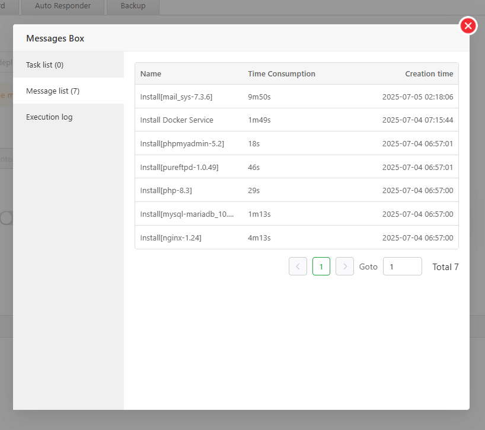
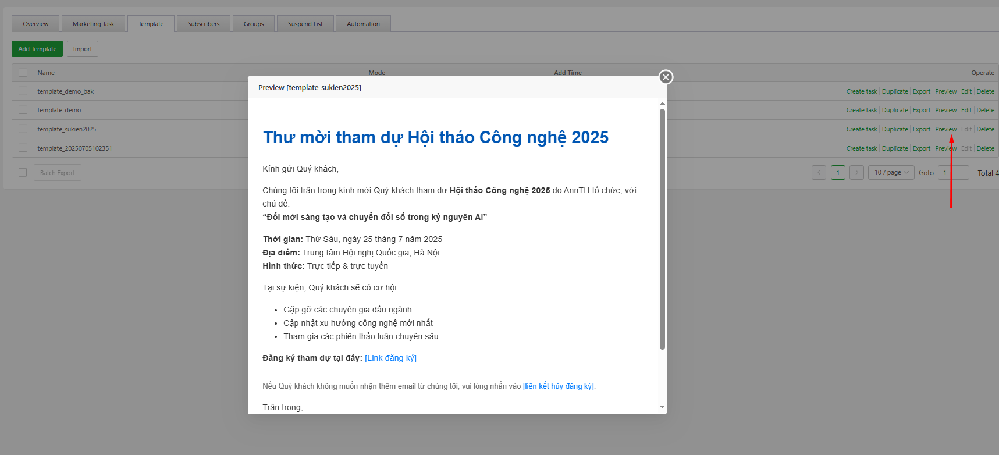
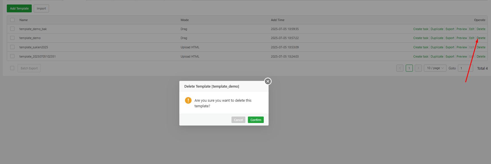

# aaPanel Mail Server Modules 
- Module aaPanel cung cấp dịch vụ như một máy chủ Email 
- Module này của aaPanel gồm các phần 
	- Mail Marketing: Gửi email hàng loạt theo chiến dịch. Quản lý danh sách người nhận, mẫu email, và lịch gửi.
	- Mail Domain Quản lý tên miền email.
	- Mailboxes: Tạo và quản lý tài khoản email theo tên miền. Hỗ trợ đặt mật khẩu, giới hạn dung lượng, chuyển tiếp email.
	- Email: Giao diện gửi và nhận email trực tiếp trong aaPanel.
	- Other Settings
		- Cấu hình nâng cao: danh sách white/blacklist IP, giới hạn gửi, nhật ký hoạt động.
		- Tăng cường bảo mật và kiểm soát hệ thống email.
- Mặc định dịch vụ MailServer sẽ không được cài 
	- Click chọn `Mail Server` 
	-  
	-  
	- Click `Install` để cài đặt 
	-  
	- Quá trình cài đặt diễn ra 
	-  
	- Cài đặt hoàn tất 
	-  
	-  
	
## Kiến thức cơ bản về Email 
### 📧 **Kiến thức cơ bản về Máy chủ Email**

| **Thuật ngữ** | **Mô tả** |
|---------------|-----------|
| **Domain name (Tên miền)** | Là định danh duy nhất của máy chủ email, dùng để xác định một hoặc nhiều địa chỉ IP. Ví dụ: `aapanel.com`. |
| **MX record (Mail Exchange)** | Bản ghi MX xác định tên miền của máy chủ email chịu trách nhiệm nhận thư. Máy chủ gửi sẽ tra bản ghi MX để định tuyến email. Ví dụ: MX của `aapanel.com` trỏ đến `mail.aapanel.com`. |
| **A record** | Bản ghi A ánh xạ tên miền đến địa chỉ IP dạng IPv4. Ví dụ: `mail.aapanel.com` trỏ đến `1.2.3.4`. |
| **SPF (Sender Policy Framework)** | Cơ chế xác minh địa chỉ gửi có được phép gửi email hay không. Bản ghi SPF trong DNS chỉ rõ IP nào được phép gửi email cho tên miền đó. |
| **DKIM (DomainKeys Identified Mail)** | Cơ chế xác thực email bằng chữ ký số, đảm bảo tính toàn vẹn và nguồn gốc email. Máy chủ nhận dùng DKIM để kiểm tra tính xác thực. |
| **DMARC (Domain-based Message Authentication, Reporting, and Conformance)** | Kết hợp SPF và DKIM để xác thực nguồn gốc email và quy định cách xử lý email không hợp lệ. |
| **PTR record (Pointer)** | Dùng để tra ngược DNS từ IP về tên miền. Giúp xác minh danh tính máy chủ gửi email. Thường được cấu hình bởi nhà cung cấp mạng hoặc máy chủ. |
| **SMTP (Simple Mail Transfer Protocol)** | Giao thức gửi email, thường dùng cổng `25` (không mã hóa) hoặc `587` (mã hóa bằng STARTTLS). |

### 🔌 **Các cổng phổ biến trong email**

| **Cổng** | **Chức năng** |
|---------|----------------|
| **25** | Gửi email qua SMTP (không mã hóa). |
| **587** | Gửi email qua SMTP có mã hóa (STARTTLS). |
| **465** | Gửi email qua SMTPS (SMTP qua SSL). |
| **110** | Nhận email qua POP3 (không mã hóa). |
| **995** | Nhận email qua POP3S (POP3 qua SSL). |
| **143** | Nhận email qua IMAP (không mã hóa). |
| **993** | Nhận email qua IMAPS (IMAP qua SSL). |

### 📥 **Ứng dụng email phổ biến**
- Ví dụ: **Outlook**, **Thunderbird**, v.v. – dùng để gửi và nhận email.

### 📌 **Ví dụ cấu hình các bản ghi cần thiết**

- **Domain name**: `aapanel.com`  
- **MX record**: `aapanel.com MX 10 mail.aapanel.com`  
- **A record**: `mail.aapanel.com A 1.2.3.4`  
- **SPF record**: `aapanel.com TXT "v=spf1 +a +mx +ip4:1.2.3.4 -all"`  
- **DKIM record**: `default TXT "v=DKIM1; k=rsa; p=MIGfMA0GCSqBgQC..."`  
- **DMARC record**: `_dmarc TXT "v=DMARC1; p=reject; rua=mailto:admin@aapanel.com"`  
- **PTR record**: `4.3.2.1.in-addr.arpa. PTR mail.aapanel.com`  
  → Bản ghi PTR thường được cấu hình bởi nhà cung cấp mạng hoặc máy chủ.

## Mail Marketing	
- Giao diện quản trị các cài đặt, thông tin, cấu hình tới mail marketing 
- Tổng quan giao diện 
- Gồm các tab chức năng 
	- Overview 
	- Marketing Task 
	- Template
	- Subscribers 
	- Groups 
	- Suspend List 
	- Automation 

### Overview 
- Giao diện thông tin tổng quan về Mail Marketing 
-  
- Gồm các thành phần 
- Bộ lọc
	- Lọc theo Domain 
	-  
	- Lọc theo ngày tháng xem bản ghi, có thể chọn theo khoảng thời gian định sẵn hoặc tự tuỳ biến 
	-  
- Số liệu thống kê hiệu suất chiến dịch email marketing.
	-  
	- Delivered: Tỷ lệ email đã được gửi thành công đến hộp thư người nhận.
	- Open: Tỷ lệ người nhận đã mở email.
	- Click: Tỷ lệ người nhận đã nhấp vào liên kết trong email.
	- Bounce: Tỷ lệ email bị trả lại (không đến được người nhận).
	-> Các chỉ số này rất quan trọng để đánh giá hiệu quả của chiến dịch email marketing.
- Bảng thống kê hiệu suất gửi email theo từng nhà cung cấp dịch vụ email. Với các cột thông tin 
	-  
	- Mail Provider: Nhà cung cấp email của người nhận (ví dụ: Google, Outlook, Yahoo, Other).
	- Delivered: Số lượng email đã gửi thành công đến nhà cung cấp đó.
	- Open: Số lượng email đã được người nhận mở.
	- Click: Số lượng email có liên kết được người nhận nhấp vào.
	- Bounce: Số lượng email bị trả lại (không đến được người nhận).
	-> Bảng này giúp bạn phân tích hiệu quả gửi email theo từng nhà cung cấp.
- Các biểu đồ 
	- Sent today: Biểu đồ thống kê kết quả gửi email trong ngày thể hiển số lượng mail được gửi, số mail thành công, thất bạt, tỷ lệ.
		- Success rate: Tỷ lệ gửi email thành công trong ngày.
		- Success: Số email đã được gửi thành công.
		- Failed: Số email bị lỗi khi gửi.
			- Details : Có thể nhấn để xem chi tiết hoặc mở chặn nếu có email bị chặn.
			-  
			- Gồm các thông tin chi tiết về mail bị lỗi 
				- Recipient: Địa chỉ người nhận: 
				- Dsn(Delivery Status Notification): Mã trạng thái: Lỗi 
				- Delay: Tổng thời gian trì hoãn gửi
				- Delays: Các giai đoạn trì hoãn thời gian xử lý qua các bước kết nối, xác thực, gửi, phản hồi.	
				- Status: Trạng thái của mail lỗi 
				- Relay: Hiển thị máy chủ chuyển tiếp nếu có
				- Details: Chi tiết lỗi gặp phải 
		- Auto block failed emails: Tính năng tự động chặn các email bị lỗi.
			- Khi bật, hệ thống sẽ:
				- Tự động thêm các email bị "Bounced" (trả lại, không gửi được) vào danh sách chặn.
				- Các email này sẽ bị loại trừ khỏi các chiến dịch gửi tiếp theo, giúp:
					- Bảo vệ uy tín IP và tên miền của bạn.
					- Giảm nguy cơ bị đánh dấu spam.
			- Khi tắt: Các email lỗi sẽ không bị chặn tự động, và có thể tiếp tục được sử dụng trong các chiến dịch sau.
		- Khi rê chuột vào thời điểm cụ thể biểu đồ thể hiện pop-up thông số cụ thể 
			-  
	- Các biểu đồ cần bản quyền Pro mới có thể sử dụng 
		-  
		- Unique Open Rate %: Biểu đồ thể hiện tỷ lệ mở mail theo thời gian 
		- Click Rate %: Biểu đồ thể hiện tỷ lệ click theo thời gian 
		- Bounce Rate %: Biểu đồ thể hiện tỷ lệ mail bị bounce theo thời gian 

### Marketing Task 
- Quản lý các tác vụ gửi mail marketing 
- 
- Gồm 
	- Nút chức năng tạo task mới `Add Send Task` : Click mở giao diện cấu hình tác vụ 
	- Bảng chi tiết các task đang tồn tại gồm các cột thông tin 
		- Thời gian
		- Subject mail 
		- Người gửi 
		- Người nhận 
		- Số lượng mail gửi thành công 
		- Số lượng mail gửi thất bại 
		- Trạng thái thành công / thất bại 
		- Remark: Ghi chú của tác vụ 
		- Progress: thanh tiến trình thực thi của nhiệm vụ 
		- Các nút thao tác 
			- Xem chi tiết tác vụ 
			- Xoá tác vụ 
#### Add Send Task
- Dùng tạo tác vụ email marketing mới 
- 
- Giao diện cấu hình thêm tác vụ: Gồm 2 phần: biểu mẫu cấu hình và preview mail sẽ gửi kèm template 
	- 
	- Biểu mẫu này dùng để tạo và quản lý nhiệm vụ gửi email hàng loạt trong hệ thống. Người dùng cần điền đầy đủ các thông tin sau:
		- Thông tin người gửi
			- From: Chọn Tên miền - Chọn địa chỉ email người gửi 
			- 
			- 
			- Display Name: Nhập tên hiển thị của người gửi 
			- 
		- Nội dung email
			- Subject: Nhập tiêu đề email
			- Recipients: Chọn nhóm người nhận hoặc tạo mới danh sách người nhận
				- 
				- Click `Create` để tạo nhóm người nhận mới 
					- 
					- Cấu hình tên nhóm 
					- Tải lên tệp chứa danh sách người nhận 
				- Send Emails: Hiển thị số lượng người nhận hiện tại
			- Email Template: Chọn mẫu email có sẵn để sử dụng. Mẫu này được cấu hình trong tab Template.
			- 
		- Tùy chọn gửi
			- Save in Outbox: Bật/tắt tùy chọn lưu email vào hộp thư đi
			- Unsubscribe Link: Bật/tắt liên kết hủy đăng ký. Có thể chỉnh sửa hoặc xem chi tiết
				- Chỉnh sửa bằng nút `Modify`: Có thể cấu hình link mới tại textbox NewLink và click `Confirm` để xác nhận, Click `Restore Default` để load lại link mặc định. 
					- 
				- Xem chi tiết vị trí link tại nút `View Case` 
					- 
			- Threads num: Chọn số luồng gửi email: tự động (Auto) hoặc tùy chỉnh (Custom)
				- 
		- Thời gian gửi
			- Send Now: Gửi email ngay lập tức
			- Select Date and Time: Chọn ngày và giờ cụ thể để gửi email
				- 
		- Ghi chú và kiểm tra
		- Remark: Nhập ghi chú cho nhiệm vụ gửi email
		- Send Test email to: Nhập địa chỉ email để gửi thử. Nhấn nút "Send Test Mail" để kiểm tra nội dung email trước khi gửi chính thức
		-  Xác nhận
			- Cancel: Hủy bỏ nhiệm vụ
			- Confirm: Xác nhận và tạo nhiệm vụ gửi email	
	- Phần Preview mail sẽ gửi với template 
		- 

### Template
- Dùng quản lý các Template phục vụ mail Marketing
- 
- Giao diện bao gồm 
- Các nút chức năng 
	- `Add Template` : Dùng thêm mẫu mới 
		- 
		- Template Mode: Cung cấp 2 kiểu 
			- Drag: Mẫu tạo sẽ được người dùng tuỳ chỉnh bằng giao diện HTML tích hợp sẵn. 
			- 
			- Upload HTML: Tải lên mẫu đã có sẵn dưới dạng file html 
			- 
		- Template Name: Đặt tên mẫu 
		- HTML File (ở mode HTML Upload): Click chọn để tải lên file HTML 
			- 
	- `Import`: Dùng nhập mẫu đã có sẵn dưới dạng file zip 
		- 
- Danh sách các mẫu đã có: Gồm các cột 
	- Tên mẫu : Tên mẫu tương ứng 
	- Kiểu khởi tạo: Kiểm Drag/ Upload HTML 
	- Thời gian thêm: Thời gian mẫu được thêm vào hệ thống 
	- Các thao tác 
		- Tạo task: Tạo task nhanh với Template tương ứng, click mở giao diện tạo Marketing task 
		- Nhân bản: Nhân bản mẫu đang chọn 
		- Xuất file: Xuất ra file zip nhằm mục đích import lại vào hệ thống khác, hoặc backup 
		- Xem trước: Xem trước mẫu sẽ hiển thị. 
			- 
		- Chỉnh sửa: Chỉ khả dụng với mẫu tạo ở chế độ Drag. Click chuyển tới trình chỉnh sửa HTML 
		- Xoá : Xoá mẫu đang chọn 
			- 

### Subscribers 
- Danh sách các email khách hàng đã đăng ký, chưa đăng ký 
- 
- Giao diện gồm 
	- Biểu đồ xu hướng đăng ký, bỏ đăng ký theo thời gian 
	- 
	- Các nút chức năng 
		- Import: Nhập liên hệ vào các nhóm 
			- Groups: Chọn nhóm mà liên hệ sẽ thêm vào 
			- 
			- Data
				- Paste data : Dán dánh sách liên hệ vào và thêm. Mỗi liên hệ một dòng 
				- Upload file: Tải lên file chứa liên hệ click `Import` với định dạng txt/json, dung lượng không quá 5MB.
				- 
		- Nút Subscription/Unsubscription : Chuyển qua lại giữa thao tác với danh sách, biểu đồ danh sách đăng ký, chưa đăng ký.
		- Group : Bộ lọc cụ thể theo từng nhóm. Nút `Group Managament` chuyển tới giao diện quản lý nhóm 
		- Thanh tìm kiếm: Nhập liên hệ tìm kiếm nhanh. 
	- Danh sách các user
		- 
		- Email: Email của user
		- Group Name: Nhóm user thuộc 
		- Add time : Thời gian thêm vào nhóm 
		- Operate : Các thao tác
			- Change list : Thay đổi nhóm của user
				- 
			- Delete : Xoá user ra khỏi nhóm 
				- 
### Groups 
- Giao diện quản lý nhóm khách hàng 
- 
- Giao diện gồm 
- Nút thao tác thêm group `Add`
	- 
	- Các lựa chọn	
		- Tạo 1 group mới và thêm nội dung 
		- Import data vào 1 nhóm có sẵn 
		- 
		- Chỉ tạo nhóm không thêm nội dung
		- 
	- Group Name: Tên nhóm cần tạo 
	- File: Click `Import` trỏ tới file chứa email khách hàng cần thêm. 
- Bảng danh sách các nhóm đã có 
	- Group Name : Tên nhóm 
	- Subscription: Số lượng người đăng ký
	- Unsubscription: Số lượng người huỷ đăng ký 
	- Add time : Thời gian thêm 
	- Operate 
	- Rename : Đổi tên group
		- 
	- Delete : Xoá group 
		- 

### Suspend List 
- Danh sách Tạm ngưng 
- 
- Các địa chỉ email sẽ được tự động thêm vào danh sách Tạm ngưng nếu có trạng thái gửi là Deferred (trì hoãn) hoặc Bounced (trả lại).
	- Deferred (Trì hoãn): Hệ thống sẽ thử gửi lại sau một khoảng thời gian. Nếu sau nhiều lần thử mà vẫn không gửi được, trạng thái có thể chuyển thành "Bounced".
	- Bounced (Trả lại): Email không thể gửi được và bị trả lại. Đây là lỗi gửi vĩnh viễn.
- Các nút chức năng 
	- Scan Invalid Domains: Chọn một người đăng ký trong nhóm và quét các địa chỉ email không hợp lệ.
		- 
		- Nhóm được chọn để quét: Đây là nhóm người đăng ký email mà bạn muốn kiểm tra các địa chỉ email không hợp lệ.
		- Phương thức xử lý khi phát hiện email không hợp lệ
			- No-operation: Không thực hiện hành động gì, chỉ quét và ghi nhận.
			- Added to the exception prevention table: Thêm địa chỉ email không hợp lệ vào bảng ngăn chặn ngoại lệ (để tránh gửi email sau này).
			- The abnormal mailbox is deleted from the group : Xóa địa chỉ email bất thường khỏi nhóm người nhận.
		- Hành động
			- Cancel: Hủy thao tác quét.
			- Scan: Bắt đầu quá trình quét tên miền không hợp lệ.
	- Scan Logs: Xem nhật ký quét tự động các tên miền không hợp lệ.
		- 
	- Clear: Xóa danh sách hiện tại.
		- 
	- Auto block failed emails: Tự động thêm địa chỉ email lỗi vào danh sách Tạm ngưng sau khi bật tính năng này.
- Danh sách các Email tạm ngưng 
	- Email: Hiển thị địa chỉ email của người đăng ký.
	- Mail Subject: Hiển thị tiêu đề của email đã gửi.
	- Type: Loại email gửi đi: Deferred hoặc Bounced.
	- Status: Trạng thái gửi email: Invalid (không hợp lệ), Checking (đang kiểm tra).
	- Add Time: Thời gian email được thêm vào danh sách.
	- Delete: Xóa người đăng ký khỏi danh sách Tạm ngưng để có thể gửi lại email.

### Automation 
- Giao diện lên kịch bản workflow gửi mail, xử lý task (Pro)

## Mail Domain	
- Giao diện quản lý tên miền máy chủ email 
- Tổng quan giao diện 
- 
- Giao diện gồm 
	- Các nút thao tác 
		- 
		- `Add Domain`: Thêm tên miền mới vào hệ thống.Click mở giao diện thêm tên miền 
		- Các thông số cấu hình 
			- DNS Record: Chọn cách thêm DNS Record
				- Tự động (Auto): Hệ thống sẽ tự động thêm bản ghi DNS cần thiết. (Khả dụng khi đã thêm tên miền vào module Domains)
				- Thủ công (Manual): Bạn sẽ phải tự thêm các bản ghi DNS trong trang quản lý tên miền (ví dụ: CloudFlare, GoDaddy...)
					- Cần cấu hình thêm phần `A record` 
					- 
			- Domain Name: Nhập tên miền bạn muốn thêm 
			- Domain Quota: Dung lượng tổng cho tên miền (tính bằng GB/MB)
			- 
			- Number of Mailboxes: Số lượng hộp thư email bạn muốn tạo cho tên miền
			- Catch-All Email: Địa chỉ email sẽ nhận tất cả thư gửi đến tên miền, kể cả những địa chỉ không tồn tại
		- `Refresh Domain Record`: Làm mới cập nhật bản ghi Domain. 
		- 
	- Bảng thông tin tên miền: Hiển thị thông tin chi tiết các tên miền có trong hệ thống 
		- Domain name: Tên tên miền 
		- Not in Spam List: Hiển thị trạng thái có đang trong list spam hay không 
		- Click icon kiểm tra để mở giao diện kiểm tra `blacklist check` 
		- 
		- Click icon log để mở giao diễn xem bản ghi 
		- 
		- Quota: Dung lượng đã sử dụng 
		- Mailboxes: Số Mailbox được cấp 
		- Default mailbox size: Kích thước hộp thư mặc định.
		- Catch All: Trạng thái tính năng nhận tất cả email gửi đến tên miền, kể cả địa chỉ không tồn tại. Có thể cấu hình Bật/tắt
		- 
		- SSL: Hiển thị trạng thái cấu hình SSL email của tên miền. Click để mở giao diện thêm chứng chỉ. 
		- 
		- WebMail: Hiển thị trạng thái cài đặt giao diện web để truy cập email. Click để cấu hình tạo webmail nhanh hoặc nếu đã có click để gỡ cài đặt 
			- Cài đặt 
			- 
			- Gỡ cài đặt 
			- 
		- Các nút thao tác 
		- DNS Record: Mở giao diện quản lý DNS record cần thêm của tên miền, kiểm tra bằng nút `Already set , Verify Domain DNS`
			- 
		- Edit: CLick mở giao diện chỉnh sửa các thông số của tên miền trong máy chủ mail. Có thể cấu hình thay đổi các thông số quota, Mailboxes, Catch-All
			- 
		- Xóa tên miền: Click để xoá tên miền khỏi hệ thống 
			- 

- Ví dụ thêm tên miền `annth.io.vn` 
	- Tại tab `Mail Domain` -> `Add domain` 
		- 
		- Cấu hình các thông số tại giao diện `Add domain`:
		- 
			- DNS Record: Manual: Thực hiện tự thêm bản ghi DNS trong trang quản lý tên miền (ví dụ: CloudFlare, GoDaddy...)
			- Domain Name: Tên miền muốn sử dụng cho email: annth.io.vn
			- A Record : 
				- Địa chỉ bản ghi A: mail.annth.io.vn
				- Mục đích: Trỏ tên miền phụ này về địa chỉ IP của máy chủ email để hệ thống có thể gửi/nhận email.
			- Domain Quota: Dung lượng tổng cho tên miền: 5 GB
			- Mailboxes: Số lượng hộp thư email được tạo: 50
			- Catch All: Địa chỉ email nhận tất cả thư gửi đến tên miền, kể cả những địa chỉ không tồn tại: admin@annth.io.vn
		- Click `Confirm` xác nhận thêm tên miền. 
	- Quá trình thêm tên miền diễn ra 
	- 
	- Tên miền được tạo click chọn `DNS` để kiểm tra các bản ghi DNS cần thêm 
	- 
	- 
	- Thêm các bản ghi tương ứng và tên miền 
	- 
	- Sau khi thêm thực hiện kiểm tra 
	- 
	- 
	- Cài đặt webmail 
		- Tại bảng danh sách các tên miền, click chọn `WebMail` 
			- 
			- Cấu hình subdomain: webmail.annth.io.vn 
			- Cấu hình phiên bản PHP: PHP 8.3 
			- Click `Confirm` để xác nhận cài đặt 
		- Quá trình cài đặt diễn ra 
		- 
		- Cài đặt thành công 
		- 
		- Kiểm tra tại `PHP Project` trong `Website` 
		- 
		- Truy cập Webmail 
		- 
		- Cài đặt SSL cho webmail: tại `PHP Project` trong `Website` -> `SSL` sử dụng `Let's Encrypt`
			- 
			- Chọn method `File verification`
			- Tích chọn domain cần get chứng chỉ 
			- Click apply để xác nhận get chứng chỉ từ `Let's Encrypt` 
			- Chứng chỉ được cài đặt thành công 
			- 
			- Kiểm tra 
			- 
	- Cài đặt chứng chỉ SSL 
		- Tại bảng danh sách các tên miền, click chọn `SSL` 
		- Paste privatekey, cerificate đã có vào giao diện 
		- 
		- Click `Confirm` để xác nhận thêm 
		- Quá trình cài đặt diễn ra 
		- 
		- Cài đặt hoàn tất 
		- 
		- 

## Mailboxes	
- Giao diện quản lý hộp thư mailboxes 
- Tổng quan giao diện 
- 
- Giao diện gồm 
- Các nút thao tác 
	- Add Mailbox : Thêm mailbox mới. Click mở giao diện tạo mailbox mới 
		- 
		- Các thông số cần cấu hình 
			- Name: Nhập tên người dùng hoặc tên hiển thị cho hộp thư.
			- Quota Limit: Công tắc bật/tắt giới hạn dung lượng. Khi bật, bạn có thể đặt dung lượng tối đa cho hộp thư.
			- Quota: Cấu hình dung lượng tối đa cho hộp thư MB/GB 
			- 
			- User Type: Loại người dùng:
				- General user: Người dùng thông thường
				- Admin: Quản trị
			- Email Address: Cấu hình tên mailbox và chọn tên miền email cần tạo. Hệ thống sẽ tạo địa chỉ email theo định dạng: tên@annth.io.vn
			- Email Password: Nhập mật khẩu cho tài khoản email
			- Status: Công tắc bật/tắt trạng thái hoạt động của hộp thư. Khi bật, hộp thư sẽ được kích hoạt và có thể sử dụng
			- Nút thao tác
				- Cancel: Hủy thao tác tạo hộp thư
				- Confirm: Xác nhận và tạo hộp thư email mới		
	- Batch Create: Tạo hàng loạt mailbox (Pro)
	- Import: Nhập danh sách mailbox từ file json. Click mở giao diện cho phép tải lên file chứa mailbox để nhập vào hệ thống 
		- 	
	- Export: Xuất danh sách các mailbox ra file json. Click để xuất tệp chứa mailbox hiện có. Tệp định dạng json. 
		- 	
	- Bộ lọc Domain: Lọc hiển thị toàn bộ mailbox của toàn bộ tên miền hoặc chỉ hiển thị với các tên miền cần lọc 
		- 	
	- Thanh tìm kiếm: Nhập tên mailbox tìm kiếm nhanh 
		- 
- Bảng danh sách các mail box: Hiển thị chi tiết thông tin 
	- 
	- Username: Tên đăng nhập 
	- Password: Mật khẩu. Click vào icon hình mắt để xem hoặc click vào icon copy để sao chép 
	- 
	- Login Info: Thông tin đăng nhập đầy đủ. Click để copy thông tin đăng nhập chi tiết của mailbox 
	- 
	- 
	- Quota: Dung lượng đã sử dụng / được cấp 
	- Type: Loại user thường/ quản trị viên 
	- Status: Trạng thái của hộp thư:Click để chuyển chế độ kích hoạt / không kích hoạt 
	- 
	- Operate: Các nút thao tác 
		- Webmail: Click mở giao diện đăng nhập qua webmail 
			- 
			- `Password-freeaccess`: Đăng nhập không cần mật khẩu (Pro)
			- `Public Access`: Click chuyển tới trang webmail 
		- Edit: Chỉnh sửa các thông số của mailbox 
			- 
			- Name: Tên người dùng của hộp thư
			- Quota Limit: Công tắc bật/tắt giới hạn dung lượng hộp thư.
			- Quota: Điều chỉnh dung lượng tối đa được cấp cho hộp thư 
			- User Type: Điều chỉnh loại người dùng
			- Email Address: Địa chỉ email đầy đủ
			- Email Password:
				- Nếu để trống, mật khẩu hiện tại sẽ không bị thay đổi
				- Nếu nhập mật khẩu mới, hệ thống sẽ cập nhật lại
			- Nút thao tác
				- Cancel: Hủy bỏ chỉnh sửa
				- Confirm: Xác nhận và lưu thay đổi
		- Delete: Xoá mail box 
			- 
		
## Email	
- Giao diện quản lý Email: Có thể thao tác xem nội dung các mailbox tại đây  
- Tổng quan giao diện 
- 
- Giao diện gồm các tab chức năng quản trị các hộp thư 
	- Inbox: Hộp thư đến
		- 
		- Cấu hình chọn account cần kiểm tra hộp thư tại box `Email Address`
		- Danh sách các email có trong hộp thư được liệt kê tại danh sách 
			- Sender : Người gửi 
			- Theme: Tiêu đề mail 
			- Time: Thời gian nhận 
			- Các thao tác 
				- View: Xem email 
				- 
				- Spam: Đánh dấu là spam chuyển sang hộp thư Spam 
				- 
				- Delete: Xoá email đang chọn khỏi hộp thư 
				- 
	- Outbox: Hộp thư đi
		- 
		- Tương tự như `Inbox` cấu hình chọn tài khoản cần quản trị tại box `Email Address`
		- 
		- Sử dụng các nút thao tác `View`, `Delete` để xem, xoá email khỏi hộp thư 
		- 
		- 
	- Spam: Thư rác
		- 
		- Cấu hình chọn account cần kiểm tra hộp thư tại box `Email Address`
		- 
		- Nút thao tác `Rspamd`: Click để mở web quản trị của phần mềm `Rspamd` phần mềm quản lý mail spam 
		- 
		- Tại danh sách các email sử dụng các nút thao tác `View`, `Unmark`, `Delete` để xem, bỏ đánh dấu spam, xoá email khỏi hộp thư 
			- 
			- 
			- 
	- Sender: Quản lý địa chỉ người gửi: Có thể sử dụng giao diện này để gửi email nhanh chóng
		- 
		- Cấu hình người gửi tại mục `Sender` 
			- 
		- Người nhận tại `Recipient`
		- Theme: Tiêu đề email 
		- Text: Nội dung email 
		- Nút thao tác `Send` để gửi email. 

## Other Settings 
- Giao diện chứa các cài đặt khác tới hệ thống mailserver 
- Gồm các tab chức năng 
	- Common Settings : Cài đặt chung cho hệ thống
	- BCC: Cấu hình để tự động thêm địa chỉ email vào trường BCC khi gửi thư, dùng để lưu trữ hoặc giám sát email.
	- Mail Forward: Thiết lập chuyển tiếp email đến địa chỉ khác.
	- Auto Responder: Tạo phản hồi tự động khi nhận được email.
	- Backup: Tùy chọn sao lưu hệ thống
###Common Settings
- Giao diện cấu hình các cài đặt chung cho hệ thống
-  
- Gồm các phần cấu hình 
- Webmail: Cấu hình cài đặt webmail hiện đang nằm tại phần "Mail Domain". Sẽ chuyển về tab này ở các bản cập nhật sau. 
-  
- Mail save time: Thời gian lưu email. Có thể cấu hình 
	- Luôn giữ lại email (Always keep)
	- Hoặc thiết lập số ngày lưu trữ cụ thể. Tích chọn `Custom`, cấu hình số ngày lưu và chọn `Save` để lưu 
	-  
- Notification: bật/tắt thông báo khi:
	- IP/Domain bị đưa vào blacklist.
	- Dịch vụ email bị ngừng hoạt động.
	-  
	- Bật tắt công tắt để nhận thông báo: Cấu hình thiết lập cảnh báo khi có sự cố hoặc thay đổi liên quan đến dịch vụ email. 
	- Các tùy chọn bao gồm:
		- Enable/Disable Alert (Bật/Tắt cảnh báo): Cho phép bạn kích hoạt hoặc vô hiệu hóa chức năng cảnh báo.
		- Interval Time (Thời gian kiểm tra định kỳ): Thiết lập khoảng thời gian giữa các lần kiểm tra dịch vụ, ví dụ: 600 giây (10 phút).
		- Daily Send Limit (Giới hạn gửi cảnh báo mỗi ngày): Số lượng email cảnh báo tối đa được gửi trong một ngày, ví dụ: 1 email/ngày.
		- Time Range (Khoảng thời gian gửi cảnh báo) : Chỉ định khoảng thời gian trong ngày mà cảnh báo được phép gửi, ví dụ: từ 00:00 đến 23:59.
		- Alarm Method (Phương thức cảnh báo): Chọn cách nhận cảnh báo:
			- Email
			- Unipush
			- WeChat
			- Fetion
			- Telegram
	
- Service Status: Các dịch vụ và trạng thái:
	-  
- Nút chức năng: Tự động bật dịch vụ 
	-  
- Bảng các dịch vụ đang khởi chạy. Với mỗi dịch vụ có thể thực hiện các thao tác Dừng, khởi động lại, sửa lỗi, hoặc sửa file cấu hình từng dịch vụ.
	-  
	-  
	-  
	-  

### BCC (Blind Carbon Copy)
- Giao diện quản lý BCC 
	-  
- Giao diện này gồm  
	- Nút chức năng 
		- Add BCC: Thêm BCC. CLick mở giao diện cấu hình tạo BCC mới 
		-  
			- Need Copy: Nhập tên người dùng nội bộ (trong hệ thống) mà bạn muốn gửi BCC.
			- Copy to: Nhập địa chỉ email thực tế sẽ nhận bản sao ẩn (BCC).
			- BCC Type: Chọn thời điểm gửi BCC:
			-  
				- When sending: Gửi BCC cùng lúc khi email chính được gửi đi.
				- When receiving: Gửi BCC khi email được nhận vào hộp thư của người dùng.
			- Active: Công tắc bật/tắt tính năng BCC này. Khi bật, hệ thống sẽ thực hiện gửi BCC theo cấu hình.
		- Refresh: Làm mới danh sách 
	- Danh sách các BBC đã có: 
		-  
		- Hiển thị các thông tin chi tiết BCC đã cấu hình 
			- Need Copy: Danh sách địa chỉ email cần được sao chép (BCC). Khi các email này gửi thư, bản sao sẽ được gửi đến địa chỉ trong cột "Copy to".
			- Copy to: Địa chỉ email sẽ nhận bản sao của các email được gửi từ "Need Copy". Đây là nơi giám sát hoặc lưu trữ email.
			- Domain: Tên miền liên quan đến các địa chỉ email. Có thể là tên miền chính hoặc người dùng cụ thể.
			- BCC Type: Loại BCC được áp dụng.
			- Status: Trạng thái của cấu hình. 
			- Operate: Các thao tác có thể thực hiện: 
				- Edit (chỉnh sửa): Chỉnh sửa các thông số của BCC 
				-  
				- Delete (xóa cấu hình): Xoá cấu hình BCC 
				-  
- Ví dụ tạo BCC 
- Tại tab `BCC` -> `Add BCC` 
-  
- Cấu hình các thông số 
	-  
	- Need Copy: user1@annth.io.vn, user2@annth.io.vn
	- Copy to: admin@annth.io.vn
	- BCC Type: When sending
	- Active: Bật
- Khi đó, mỗi khi user1,user2 gửi email, một bản sao ẩn sẽ được gửi đến admin@annth.io.vn mà người nhận chính không biết.
- Click `Confirm` để xác nhận thêm 
	-  
- BCC được thêm 
	-  

### Mail Forward
- Giao diện quản lý chuyển tiếp mail 
	-  
- Giao diện này gồm 
	- Nút `Add Forward` : Thêm cấu hình chuyển tiếp mới 
		-  
		- Các cấu hình 
			- Trạng thái (Status): Bật chuyển tiếp email
			- Người dùng được chuyển tiếp (Forwarded users): Nhập địa chỉ email của người dùng mà bạn muốn chuyển tiếp email từ họ
			- Tên miền (Domain): Nhập tên miền mà email sẽ được chuyển tiếp
			- Người nhận (Receiving user): Nhập địa chỉ email của người nhận sẽ nhận được email đã chuyển tiếp
		- Nút thao tác: Cancel/Confirm 
	- Bảng danh sách các forward được cấu hình. Cung cấp các thông tin 
		-  
		- Address: Địa chỉ email gốc cần chuyển tiếp. 
		- Goto: Địa chỉ email đích sẽ nhận email chuyển tiếp
		- Domain: Tên miền áp dụng
		- Created: Thời gian tạo cấu hình chuyển tiếp
		- Modified: Thời gian chỉnh sửa gần nhất
		- Status: Trạng thái hoạt động. Click bật tắt nhanh trạng thái 
		- 	
		- Operate:Các thao tác:
			- Edit: Chỉnh sửa cấu hình chuyển tiếp
			-  	
			- Delete: Xoá cấu hình chuyển tiếp
			-  
		
### Auto Responder
- Giao diện quản lý email trả lời tự động (Auto Responder) trong hệ thống email.
-  
- Giao diện này gồm 
	- Nút thao tác 
		- `Add auto responder`: Thêm cấu hình email trả lời tự động mới
			-  
			- Các trường cấu hình 
				- Start time (Thời gian bắt đầu) 
					- Thời gian bắt đầu gửi email phản hồi tự động
					- Tùy chọn "Start now" để bắt đầu ngay lập tức
				- End time (Thời gian kết thúc)
					- Thời gian kết thúc gửi phản hồi
					- Tùy chọn "Never end" để không giới hạn thời gian kết thúc
				- Interval (Khoảng cách gửi): Thiết lập khoảng thời gian giữa các lần gửi phản hồi
				- Autoresponder: Địa chỉ email sẽ gửi phản hồi tự động
				- Display name: Tên hiển thị của người gửi trong email phản hồi 
				- Subject: Tiêu đề của email phản hồi
				- Content: Nội dung email phản hồi 
		- Bộ lọc domain: Lọc hiển thị phản hồi tự động của tất cả domain hoặc chỉ với domain cụ thể 
		-  
		- Thanh tìm kiếm tìm kiếm nhanh tài khoản, domain được cấu hình
	- Bảng danh sách cấu hình trả lời tự động
		-  
		- Autoresponder: Địa chỉ email sẽ gửi phản hồi tự động
		- Subject: Tiêu đề của email phản hồi
		- Status: Trạng thái hoạt động (bật/tắt). Click bật tắt nhanh trạng thái 
		-  
		- Interval:	Khoảng thời gian giữa các lần gửi phản hồi
		- Start time: Thời gian bắt đầu kích hoạt phản hồi
		- End time:	Thời gian kết thúc phản hồi
		- Các nút thao tác 
			- Edit: Chỉnh sửa cấu hình 
			-  
			- Delete: Xoá auto responder
			-  
- Ví dụ cấu hình auto responder
	- Tại tab `Auto Responder` -> `Add auto responder` 
	-  
	- Cấu hình các thông số 
	-  
		- Start time	✅ Start now – Bắt đầu ngay lập tức sau khi cấu hình.
		- End time	✅ Never end – Không có thời gian kết thúc, phản hồi tự động sẽ luôn hoạt động.
		- Interval	0 Hours – Không có khoảng cách giữa các lần gửi phản hồi (tức là mỗi email đến đều được phản hồi).
		- Autoresponder	admin@annth.io.vn – Địa chỉ email sẽ gửi phản hồi tự động.
		- Display name	annt Support – Tên hiển thị trong email phản hồi.
		- Subject	Cảm ơn bạn đã liên hệ – Tiêu đề của email phản hồi.
		- Content	Nội dung thư phản hồi:
		```
		Cảm ơn bạn đã liên hệ với chúng tôi. Chúng tôi sẽ phản hồi trong thời gian sớm nhất.
		Trân trọng,
		```
	- Khi ai đó gửi email đến admin@annth.io.vn, hệ thống sẽ tự động gửi lại một email với nội dung cảm ơn và thông báo sẽ phản hồi sớm. 
	- Click `Confirm` để xác nhận tạo 
	- Auto Responder được khởi tạo 
	-  

### Backup
- Giao diện cấu hình sao lưu và nhập email trong hệ thống quản lý emai
-  
- Gồm các phần 
	- Backup Plan – Kế hoạch sao lưu: Cho phép bạn thiết lập lịch sao lưu email tự động. Các tùy chọn bao gồm:
		-  
		- Bật/Tắt sao lưu: Cho phép kích hoạt hoặc vô hiệu hóa chức năng sao lưu.
		- Period (Chu kỳ): Chọn chu kỳ sao lưu Weekly/ Daily
		- Day (Ngày): Chọn ngày trong tuần để thực hiện sao lưu
		- Time (Thời gian): Thời điểm thực hiện sao lưu
		- Backup to (Lưu vào): Chọn nơi lưu trữ bản sao lưu
		- Keep last (Giữ lại): Số lượng bản sao lưu được giữ lại
		- Save: Nút để lưu lại cấu hình sao lưu.
	- Mail Import – Nhập email: Cho phép bạn nhập dữ liệu email từ nguồn khác:
		- Upload from local – Tải lên từ máy tính cá nhân.
		- Select in server – Chọn file có sẵn trên máy chủ.
		- Bên dưới là bảng hiển thị các file đã nhập, gồm các cột:
			- File name – Tên file.
			- Import time – Thời gian nhập.
			- Operate – Các thao tác (ví dụ: xóa, xem chi tiết).

- Ví dụ cấu hình backup 
	-  
	- Bật sao lưu tự động
	- Thời gian sao lưu: Thứ bảy hằng tuần lúc 1 giờ 30 phút sáng
	- Lưu trữ: Trên ổ đĩa của máy chủ
	- Giữ lại: 3 bản sao lưu gần nhất
