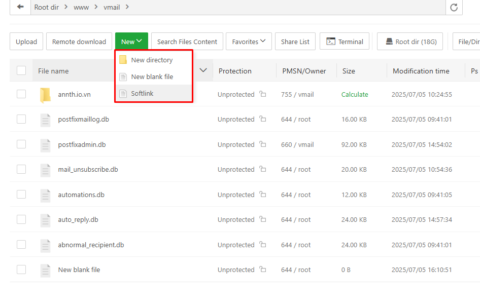
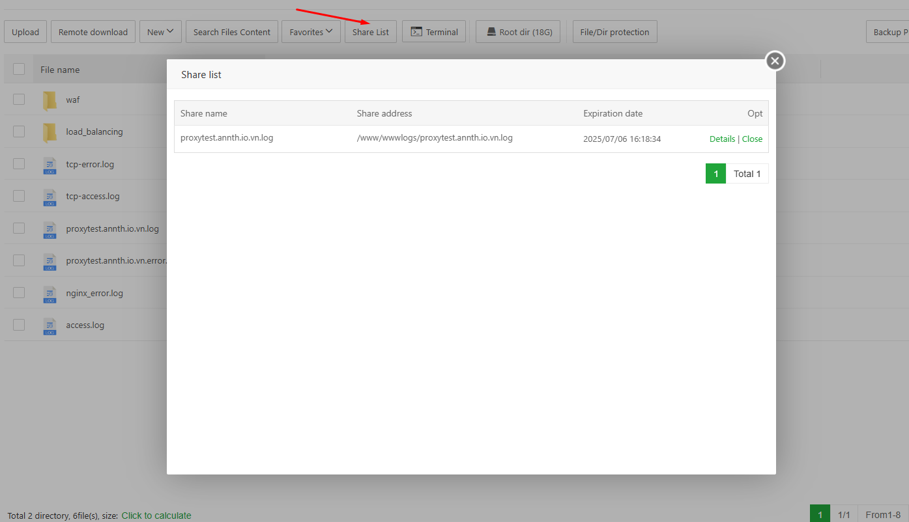
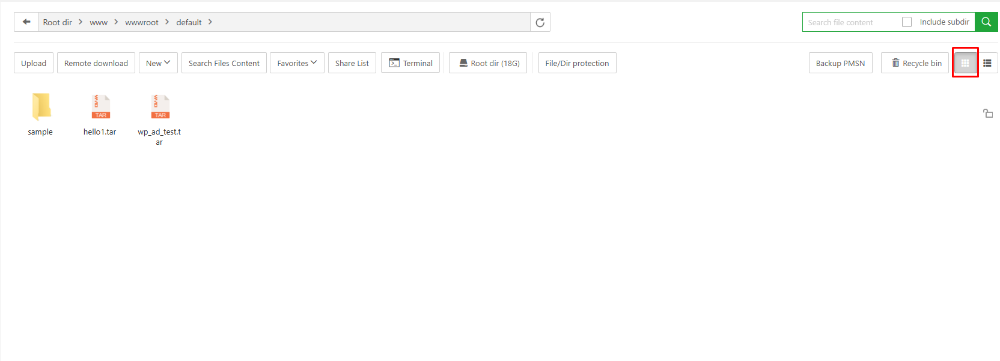

# aaPanel Files Modules 
- Mô-đun Files cung cấp một giao diện trực quan và mạnh mẽ, cho phép người dùng dễ dàng quản lý hệ thống tệp và thư mục ngay trong môi trường trực tuyến.
- Chức năng chính
	- Quản lý tệp và thư mục: Duyệt, tạo mới, đổi tên, sao chép, di chuyển hoặc xóa tệp và thư mục một cách linh hoạt.
	- Hỗ trợ thao tác kéo-thả để tăng tốc độ xử lý công việc.
	- Thiết lập quyền truy cập: Cho phép người dùng chỉnh sửa quyền truy cập (read, write, execute) cho từng tệp hoặc thư mục.
	- Chỉnh sửa tệp trực tuyến: Tích hợp trình soạn thảo văn bản trực tiếp trong giao diện, hỗ trợ các định dạng phổ biến như .txt, .html, .css, .js, v.v. Có thể lưu thay đổi ngay lập tức mà không cần tải tệp về máy.
	- Thùng rác (Recycle Bin): Khi xóa tệp hoặc thư mục, dữ liệu sẽ được chuyển vào thùng rác thay vì bị xóa vĩnh viễn. Cho phép khôi phục hoặc xóa vĩnh viễn các mục đã xóa, giúp giảm thiểu rủi ro mất dữ liệu ngoài ý muốn.
- Giao diện tổng quan 
-  
- Giao diện này gồm 
	- Thanh điều hướng thư mục và tìm kiếm 
	-  
	- Các nút chức năng 
	-  
	- Danh sách tệp và thư mục
	-  

## Thanh điều hướng thư mục và tìm kiếm 
- Thanh điều hướng: Hiển thị đường dẫn thư mục đang thao tác, có thể nhấp chuột hoặc nhập đường dẫn thư mục để nhanh chóng chuyển đến thư mục đó.
- Thanh tìm kiếm
	- Cho phép bạn tìm kiếm tệp, thư mục, nội dung tệp.
	- Tuỳ chọn tích `Include Sub Dir` cho phép tìm kiếm cả trong các thư mục con 
## Các nút chức năng 
- Upload :Tải tệp hoặc thư mục vào thư mục hiện tại. Click mở giao diện tải lên 
	- Trong giao diện Files, bạn cũng có thể kéo và thả tệp từ bên ngoài trình duyệt vào khu vực này để tải lên nhanh chóng.
	-  
- Remote Download: Tải tệp từ server từ xa vào máy chủ. Click mở giao diện cấu hình tải file
	-  
	- Các thông số:
		- URL Address: Liên kết tới tệp cần tải
		- Download to: Cấu hình nơi lưu trên máy chủ 
		- File name: Cấu hình tên tệp 
- New: Dùng tạo đối tượng mới 
	-  
	- Thư mục mới 
	- Tệp mới 
	- Tạo liên kết mềm (Softlink): Softlink (liên kết mềm) là một loại tệp đặc biệt trỏ đến một tệp hoặc thư mục khác trong hệ thống. Nó giống như một “đường dẫn tắt” giúp truy cập nhanh đến nội dung gốc mà không cần sao chép.
		-  
		- Source file: Trường nhập để chọn tệp hoặc thư mục gốc mà bạn muốn tạo liên kết đến.
		- Softlink name: Trường nhập tên cho liên kết mềm sẽ được tạo. Đây là tên hiển thị trong thư mục hiện tại, có thể đặt tùy ý.
		- Nút thao tác 
			- Yes: Xác nhận tạo liên kết mềm.
			- No: Hủy thao tác.
- Search file content: dùng để tìm kiếm nội dung bên trong các tệp trong hệ thống.
	-  	
	- Các thành phần chính:
		- Search box + nút Search: Nhập từ khóa hoặc nội dung bạn muốn tìm trong các tệp. Nhấn nút Search để bắt đầu quá trình tìm kiếm.
		- Suffix: Nhập phần đuôi tệp cần tìm, ví dụ: html.php → hệ thống sẽ chỉ tìm trong các tệp có đuôi .html hoặc .php.
		- Folder: Đường dẫn thư mục gốc để bắt đầu tìm kiếm, ví dụ: /www.
		- Checkbox "Subdir": Nếu được chọn, hệ thống sẽ tìm cả trong các thư mục con bên trong thư mục /www.
		- Radio buttons: "Words" và "Regex"
			- Words (đang được chọn): Tìm kiếm theo từ khóa thông thường.
			- Regex: Tìm kiếm nâng cao bằng biểu thức chính quy (regular expressions).
		- Match whole word: Chỉ tìm các kết quả khớp toàn bộ từ (ví dụ: tìm "cat" sẽ không ra "catalog").
		- Match case: Phân biệt chữ hoa/thường khi tìm kiếm (ví dụ: "Home" khác "home").
	- Ứng dụng thực tế
		- Tìm nhanh đoạn mã, từ khóa, hoặc nội dung cụ thể trong hàng trăm tệp.
		- Rất hữu ích khi cần chỉnh sửa hàng loạt, kiểm tra bảo mật, hoặc tìm lỗi trong mã nguồn.
- Favorites: Quản lý các tệp hoặc thư mục yêu thích. Lưu ý rằng mục yêu thích chỉ lưu đường dẫn, không phải bản sao của tệp hoặc thư mục.
	-  	
	-  	
- Share List: Quản lý danh sách các tệp hoặc thư mục đã được chia sẻ qua tính năng `Share`. Hiển thị các tệp hoặc thư mục đã được chia sẻ với người khác thông qua hệ thống.
	-  		
	- Tên chia sẻ (Share name): tên tệp đang được chia sẻ.
	- Địa chỉ tệp (Share address): Vị trí thực tế của tệp trong hệ thống.
	- Ngày hết hạn (Expiration date): Sau thời điểm này, liên kết chia sẻ sẽ không còn hiệu lực.
	- Tùy chọn:
		- Details: Xem chi tiết chia sẻ (có thể bao gồm liên kết, quyền truy cập, người nhận).Có thể đóng việc chia sẻ bằng nút `Close Sharing Chain`
		-  		
		- Close: Đóng hoặc hủy chia sẻ.
		-  		
- Terminal: Truy cập giao diện dòng lệnh (Terminal) và tự động chuyển đến thư mục hiện tại
	-  		
- Root Dir: Hiển thị dung lượng còn lại của thư mục gốc (/). Nhấp để truy cập vào thư mục gốc.
	-  		
- File/Dir Protection (Pro)
- Backup PMSN: Backup cấu hình quyền file và thư mục.Click mở giao diện quản lý backup 
	-  		
	- Textbox chứa đường dẫn tới file, thư mục cần backup quyền 
	- Backup: Thực hiện tạo backup 
	- Bảng liệt kê các bản backup hiện có : Thời gian backup, Đường dẫn, Tên, Nút thao tác xoá bản backup. 
	- Ví dụ backup với thư mục `/www/wwwroot/default`
	-  		
	-  		
- Recycle Bin: Quản lý các tệp và thư mục đã bị xóa
	- Các thư mục website bị xóa theo mặc định sẽ được đưa vào thùng rác (Recycle Bin).
	- Riêng đối với cơ sở dữ liệu MySQL, bạn cần kích hoạt thủ công để sử dụng chức năng thùng rác.
	-  		
	- Gồm các thành phần 
		- Các nút cấu hình 
			- Thùng rác tệp (File recycle bin): Bật hoặc tắt chức năng khôi phục cho các tệp và thư mục. Không khuyến nghị tắt chức năng khôi phục, vì sau khi xóa nhầm, việc khôi phục sẽ rất khó khăn.
			- Thùng rác cơ sở dữ liệu (Database recycle bin): Bật hoặc tắt chức năng thùng rác cho cơ sở dữ liệu. Hiện tại chỉ hỗ trợ MySQL. Khuyến nghị bật chức năng này. Sau khi bật, khi xóa cơ sở dữ liệu từ giao diện MySQL, hệ thống chỉ đánh dấu là đã xóa chứ không thực sự xóa khỏi MySQL.
			- Làm trống thùng rác (Empty recycle bin): Xóa toàn bộ nội dung trong thùng rác. Cần thao tác cẩn thận.
		- Các trường thông tin trong thùng rác:
			- Tên tệp (File name): Tên thư mục hoặc tệp đã bị xóa. Có thể trùng nhau, nên cần tìm kiếm chính xác.
			- Thư mục gốc (Original directory): Vị trí ban đầu của tệp/thư mục trước khi bị xóa.
			- Kích thước (Size): Dung lượng tệp. Đối với thư mục, kích thước có thể không hiển thị.
			- Thời gian xóa (Removal time): Thời điểm tệp/thư mục bị xóa.
			- Các thao tác:
				- Khôi phục (Recover): Khôi phục tệp hoặc thư mục đã bị xóa về vị trí ban đầu.
				- Xóa vĩnh viễn (Delete Permanently): Xóa hoàn toàn tệp hoặc thư mục khỏi hệ thống, không thể khôi phục.
- Các nút chuyển đổi view phần hiển thị tệp, thư mục dạng list, icon
	-  		
	-  		
 
## Danh sách tệp và thư mục
- Hiển thị danh sách tệp và thư mục trong thư mục hiện tại.
- Các cột thông tin gồm:
	- File name: Tên tệp/thư mục
	- Protection: Trạng thái bảo vệ
	- PMSN/Owner: Quyền truy cập và chủ sở hữu
	- Size: Dung lượng
	- Modification time: Thời gian chỉnh sửa cuối
	- Ps / Opt: Ghi chú và các tùy chọn thao tác
- Với mỗi tệp, thư mục có menu thao tác khi click chuột phải gồm 
	- Open: Mở thư mục hoặc tệp để xem nội dung
	- Share dir: Chia sẻ thư mục với người khác qua liên kết. Click chọn Share để cấu hình giao diện chia sẻ 
		- 
		- 
		- Gồm các thông số: 
			- Share name: Tên tệp sẽ được chia sẻ. Đây là tên hiển thị trong liên kết chia sẻ.
			- Expiration date: Thời hạn của liên kết chia sẻ:
			- A Day: Hết hạn sau 1 ngày 
			- A Week: Hết hạn sau 1 tuần
			- Permanent: Không có thời hạn, chia sẻ vĩnh viễn
			- Extraction code: Mã bảo vệ để truy cập tệp chia sẻ. Nút Random để tạo mã mới ngẫu nhiên. Giúp tăng tính bảo mật, chỉ người có mã mới truy cập được
			- Nút thao tác
				- Cancel: Hủy thao tác chia sẻ
				- Create: Tạo liên kết chia sẻ với các thiết lập đã chọn 
			- Các cấu hình chia sẻ được quản lý tại nút chức năng Share List 
	- Favorites dir: Thêm thư mục vào danh sách yêu thích để truy cập nhanh
	- Permission: Thiết lập hoặc chỉnh sửa quyền truy cập (đọc, ghi, thực thi). Click chọn để mở giao diện cấu hình quyền 
		- 
		- Giao diện cấu hình quyền 
			- 
			- Các nút chức năng
				- Backup: Lưu lại cấu hình quyền hiện tại (trước khi thay đổi).
				- Restore: Khôi phục quyền từ bản sao lưu trước đó.
			- Giao diện chia quyền truy cập thành 3 nhóm:
				- Owner: Chủ sở hữu tệp/thư mục (ví dụ: root)
				- Group: Nhóm người dùng cùng quyền
				- Public: Tất cả người dùng khác
			- Mỗi nhóm có 3 quyền có thể bật/tắt bằng checkbox:
				- Read (r) – Quyền đọc
				- Write (w) – Quyền ghi/chỉnh sửa
				- Execute (x) – Quyền thực thi (chạy tệp hoặc truy cập thư mục)
			- Mã quyền (Permission code): Hiển thị dưới dạng số, ví dụ: 755
				- 7 = Read + Write + Execute (chủ sở hữu)
				- 5 = Read + Execute (nhóm)
				- 5 = Read + Execute (người khác)
				- Bạn có thể chỉnh sửa trực tiếp mã này để thay đổi quyền nhanh chóng.
			- Chủ sở hữu (Owner): Cho phép chọn hoặc thay đổi người sở hữu tệp/thư mục (ví dụ: root).
			- Tùy chọn áp dụng: Apply to subdirectories: Áp dụng quyền này cho tất cả thư mục con và tệp bên trong.
			- Nút thao tác 
				- Close: Đóng hộp thoại mà không lưu thay đổi.
				- OK: Áp dụng các thay đổi quyền truy cập.
		- Quản lý các bản backup quyền đã tạo với đối tượng: Bảng danh sách bản sao lưu quyền (Backups list)
			- 
			- Name: Tên bản sao lưu quyền
			- Permission: Mã quyền đã lưu 
			- Owner: Chủ sở hữu của tệp/thư mục 
			- Backup Time:	Thời gian tạo bản sao lưu 
			- Opt: Các tùy chọn:
				- Restore: Khôi phục quyền từ bản sao lưu
				- Del: Xóa bản sao lưu
	- Copy: Sao chép thư mục hoặc tệp
	- Cut: Di chuyển thư mục hoặc tệp đến vị trí khác
	- Rename: Đổi tên thư mục hoặc tệp
	- Delete: Xóa thư mục hoặc tệp (có thể chuyển vào thùng rác nếu được bật)
	- Compress: Nén thư mục hoặc tệp thành định dạng như .zip hoặc .tar
	- Properties: Xem thông tin chi tiết như kích thước, quyền, thời gian sửa đổi
		- 
		- Chọn tệp hoặc thư mục, sau đó nhấn vào nút More để truy cập chức năng Properties (Thuộc tính).
		- Hoặc, nhấp chuột phải vào tệp hoặc thư mục cần xem, sau đó chọn Properties từ menu hiện ra.
		- Gồm các tab thông tin 
			- General (Tổng quan): Xem thông tin cơ bản của tệp hoặc thư mục.
			- 
			- Detail (Chi tiết): Xem thông tin chi tiết hơn về tệp hoặc thư mục.
			- 
			- History (Lịch sử): Quản lý các phiên bản lịch sử của tệp này.
			- 
	