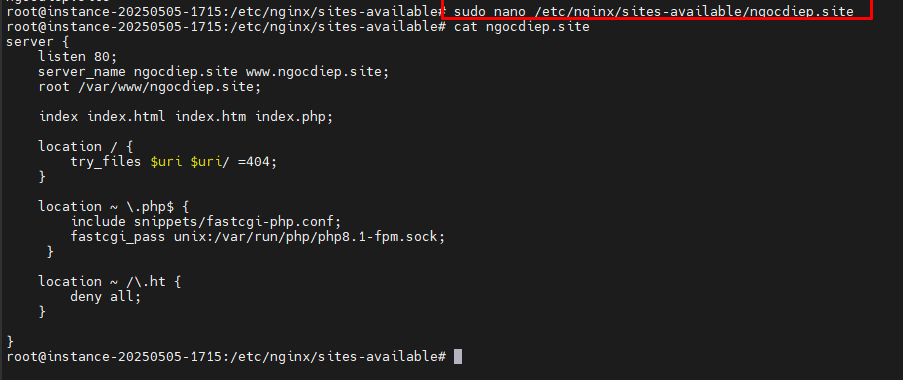

# Triển khai ứng dụng web trên Ubuntu LAMP/LEMP Stack
***
## Table of Contents

- [Triển khai ứng dụng web trên Ubuntu LAMP/LEMP Stack](#triển-khai-ứng-dụng-web-trên-ubuntu-lamp/lemp-stack)
  - [1. LAMP và LEMP](#1.-lamp-và-lemp)
    - [1.1 LAMP](#1.1-lamp)
    - [1.2 LEMP](#1.2-lemp)
  - [2. Cài đặt LAMP/LEMP Stack](#2.-cài-đặt-lamp/lemp-stack)
    - [2.1 LAMP Stack](#2.1-lamp-stack)
      - [2.1.1 Update Ubuntu](#2.1.1-update-ubuntu)
      - [2.1.2 Install & Config Apache Webserver](#2.1.2-install-&-config-apache-webserver)
      - [2.1.3 Install Mysql Server](#2.1.3-install-mysql-server)
      - [2.1.4 Install PHP & Necessary packages](#2.1.4-install-php-&-necessary-packages)
    - [2.2 LEMP Stack](#2.2-lemp-stack)
    - [2.3 Bash script](#2.3-bash-script)
      - [2.3.1 LAMP](#2.3.1-lamp)
      - [2.3.2 LEMP](#2.3.2-lemp)
  - [References](#references)

## 1. LAMP và LEMP 
### 1.1 LAMP
- LAMP là viết tắt của Linux, Apache, MySQL và PHP. Các thành phần này, được sắp xếp theo các lớp hỗ trợ lẫn nhau, tạo thành các stack phần mềm. Các website và ứng dụng web chạy trên nền tảng của các stack cơ bản này.
    - **L**inux: là lớp đầu tiên trong stack. Hệ điều hành này là cơ sở nền tảng cho các lớp phần mềm khác.
    - **A**pache: Lớp thứ hai bao gồm phần mềm web server, thường là Apache Web (HTTP) Server. Lớp này nằm trên lớp Linux. Web server chịu trách nhiệm chuyển đổi các web browser sang các website chính xác của chúng. Apache đã (và vẫn) là ứng dụng web server phổ biến nhất trên public Internet hiện nay. Trên thực tế, Apache được ghi nhận là đóng một vai trò quan trọng trong sự phát triển ban đầu của World Wide Web.
    - **M**ySQL: Lớp thứ ba là nơi cơ sở dữ liệu database được lưu trữ. MySQL lưu trữ các chi tiết có thể được truy vấn bằng script để xây dựng một website. MySQL thường nằm trên Linux và cùng với Apache / lớp 2. Trong cấu hình highend, MySQL có thể được off load xuống 1 máy chủ lưu trữ riêng biệt.
    - **P**HP: là lớp trên cùng của stack. Lớp script bao gồm PHP và / hoặc các ngôn ngữ lập trình web tương tự khác. Các website và ứng dụng web chạy trong lớp này.
LEMP stack là gì?
### 1.2 LEMP 
- Các thành phần cấu thành LEMP stack cũng gần tương tự với LAMP, chỉ khác là Apache sẽ được thay thế bởi nginx. Nginx được đọc là "engine-x", giải thích cho chữ **E** trong "LEPM", nginx cũng là một ứng dụng HTTP proxy nhưng không có được danh tiếng ấn tượng như Apache, tuy nhiên, nó có ưu điểm là cho phép xử lý tốc độ tải cao hơn đối với các HTTP request.
## 2. Cài đặt LAMP/LEMP Stack 
### 2.1 LAMP Stack 
Thực hiện triển khai cài LAMP Stack trên Ubuntu 22.04
Host apache2 cho domain ngocdiep.site

#### 2.1.1 Update Ubuntu
```
sudo apt update && sudo apt -y upgrade
```


#### 2.1.2 Install & Config Apache Webserver
- Install
```
sudo apt install -y apache2
```

- Check status 
```
sudo systemctl status apache2
```

- Virtual Hosts cho domain test ngocdiep.site
	- Tạo thư mục chứa web 
	```
	sudo mkdir /var/www/ngocdiep.site
	```
	- Assign user 
	```
	sudo chown -R $USER:$USER /var/www/ngocdiep.site
	```
	- Set permissions
	```
	sudo chmod -R 755 /var/www/ngocdiep.site
	```
	
	- Create index.html (optional)
	```
	sudo nano /var/www/ngocdiep.site/index.html
	```
	- The index.html content:
	```
	<html>
		<head>
			<title>Welcome to domain-name!</title>
		</head>
		<body>
			<h1>The domain-name virtual host is working!</h1>
		</body>
	</html>
	```
	
	- Tạo file virtual host cho domain ngocdiep.site
	```
	sudo nano /etc/apache2/sites-available/ngocdiep.conf
	```
	- Nội dụng ngocdiep.conf: 
	```
	<VirtualHost *:80>
		ServerAdmin webmaster@localhost
		ServerName ngocdiep.site
		ServerAlias www.ngocdiep.site
		DocumentRoot /var/www/ngocdiep.site
		ErrorLog ${APACHE_LOG_DIR}/error.log
		CustomLog ${APACHE_LOG_DIR}/access.log combined
	</VirtualHost>
	```
	
	- Enable virtual Host
	```
	sudo a2ensite ngocdiep.conf
	sudo a2dissite 000-default.conf
	```
	
- Config firewall allow port 80 (http)
	- Với iptables 
	```
	sudo iptables -I INPUT -p tcp --dport 80 -j ACCEPT
	```
	
	- Với firewall ufw
	```
	sudo ufw allow 'Apache'
	```
	
- Check 
```
sudo apache2ctl configtest
```


#### 2.1.3 Install Mysql Server
- Install 
```
sudo apt install mysql-server
```

- Cấu hình cơ bản cho mysql-server
```
sudo mysql_secure_installation
```

- Access mysql 
```
sudo mysql
```

#### 2.1.4 Install PHP & Necessary packages
- Install php
```
sudo apt install -y php
```

- Install Necessary packages
```
sudo apt install -y php-{common,mysql,xml,xmlrpc,curl,gd,imagick,cli,dev,imap,mbstring,opcache,soap,zip,intl}
```

- Create php info to test
```
sudo echo "<?php phpinfo(); ?>" > /var/www/ngocdiep.site/info.php
```


### 2.2 LEMP Stack 
- LEMP cài đặt tương tự LAMP chỉ khác thành phần Apache2 thay bằng Ngnix 
- Cài đặt nginx
```
apt-get install nginx -y
```

- Check status 
```
sudo systemctl status nginx
```

- Virtual Hosts cho domain test ngocdiep.site
	* Tạo thư mục chứa web 
	```
	sudo mkdir /var/www/ngocdiep.site
	```
	* Assign user 
	```
	sudo chown -R $USER:$USER /var/www/ngocdiep.site
	```
	* Set permissions
	```
	sudo chmod -R 755 /var/www/ngocdiep.site
	```
	
	* Create index.html (optional)
	```
	sudo nano /var/www/ngocdiep.site/index.html
	```
		The index.html content:
		```
		<html>
			<head>
				<title>Welcome to domain-name!</title>
			</head>
			<body>
				<h1>The domain-name virtual host is working!</h1>
			</body>
		</html>
		```
		
	* Tạo file virtual host cho domain ngocdiep.site
	```
	sudo nano /etc/nginx/sites-available/ngocdiep.site
	```
	* Nội dung file ngocdiep: 
		```
		server {
			listen 80;
			server_name ngocdiep.site www.ngocdiep.site;
			root /var/www/ngocdiep.site;

			index index.html index.htm index.php;

			location / {
				try_files $uri $uri/ =404;
			}

			location ~ \.php$ {
				include snippets/fastcgi-php.conf;
				fastcgi_pass unix:/var/run/php/php8.1-fpm.sock;
			 }

			location ~ /\.ht {
				deny all;
			}

		}
		```
	
	* Enable virtual Host
	```
	sudo ln -s /etc/nginx/sites-available/your_domain /etc/nginx/sites-enabled/
	sudo unlink /etc/nginx/sites-enabled/default
	```
	
- Config firewall allow port 80 (http)
    * Với iptables 
	```
	sudo iptables -I INPUT -p tcp --dport 80 -j ACCEPT
	```
	
	* Với firewall ufw
	```
	sudo ufw allow 'Apache'
	```
	
- Check 
```
sudo nginx -t
```


### 2.3 Bash script 
#### 2.3.1 LAMP 
- Tạo file script `touch lamp.sh`
- Mở file thêm nội dung `vi lamp.sh`
```
#!/bin/bash

# Update Package 
sudo apt update

# Install Apache2, MySQL, PHP
sudo apt install apache2 mysql-server php php-mysql libapache2-mod-php php-cli

# Allow to run Apache on boot up
sudo systemctl enable apache2

# Restart Apache Web Server
sudo systemctl start apache2

# Allow Read/Write for Owner
sudo chmod -R 0755 /var/www/html/

# Create info.php for testing php processing
sudo echo "<?php phpinfo(); ?>" > /var/www/html/info.php

# Test
curl "http://localhost"
curl "http://localhost/info.php"
```
- Cấp quyền khởi chạy `chmod +x lamp.sh`
#### 2.3.2 LEMP 
- Tạo file script `touch lemp.sh`
- Mở file thêm nội dung `vi lemp.sh`
```
#!/bin/bash

# Update Package 
sudo apt update

# Install Nginx, MySQL, PHP
sudo apt install nginx mysql-server php php-mysql libapache2-mod-php php-cli

# Allow to run Apache on boot up
sudo systemctl enable nginx

# Restart Apache Web Server
sudo systemctl start nginx

# Allow Read/Write for Owner
sudo chmod -R 0755 /var/www/html/

# Create info.php for testing php processing
sudo echo "<?php phpinfo(); ?>" > /var/www/html/info.php

# Test
curl "http://localhost"
curl "http://localhost/info.php"

```


## References
1. [LAMP Stack](https://aws.amazon.com/vi/what-is/lamp-stack/)
2. [LEMP Stack](https://www.geeksforgeeks.org/what-is-lemp-stack/)
