# Triển khai wordpress trên LAMP/LEMP
***
## Table of Contents

- [Triển khai wordpress trên LAMP/LEMP](#triển-khai-wordpress-trên-lamp/lemp)
  - [1. Giới thiệu Wordpress](#1.-giới-thiệu-wordpress)
  - [2. Triển khai wordpress trên LAMP/LEMP](#2.-triển-khai-wordpress-trên-lamp/lemp)
    - [2.1 Khởi tạo cơ sở dữ liệu lưu trữ wordpress](#2.1-khởi-tạo-cơ-sở-dữ-liệu-lưu-trữ-wordpress)
    - [2.2 Tải wordpress và cấu hình](#2.2-tải-wordpress-và-cấu-hình)
      - [2.2.1 Tải wordpress](#2.2.1-tải-wordpress)
      - [2.2.2 Cấu hình wordpress](#2.2.2-cấu-hình-wordpress)
    - [2.3 Cấu hình Apache / Nginx (LAMP/LEMP)](#2.3-cấu-hình-apache-/-nginx-(lamp/lemp))
      - [2.3.1 Cấu hình Apache](#2.3.1-cấu-hình-apache)
      - [2.3.2 Cấu hình Nginx](#2.3.2-cấu-hình-nginx)
  - [References](#references)
***
## 1. Giới thiệu Wordpress
- Wordpress là gì?
	- Wordpress là một phần mềm mã nguồn mở.
	- Được viết bằng ngôn ngữ lập trình website PHP và sử dụng hệ quản trị cơ sở dữ liệu MySQL.
	- Hỗ trợ tạo các blog cá nhân.
	- Wordpress phát triển mạnh mẽ, được xem như là một hệ quản trị nội dung. Dễ dàng tạo ra các loại website khác nhau như web bán hàng, blog, tin tức,...

- Một số lý do tuyệt vời để chọn wordpress:
	- Dễ sử dụng: wordpress hướng tới cộng đồng phổ thông, không có nhiều kiến thức lập trình nâng cao. Wordpress cung cấp một giao diện để quản lý trực quan, thao tác dễ dàng.
	- Cộng đồng đông đảo.
	- Có nhiều gói giao diện có sẵn.
	- Có nhiều plugin hỗ trợ: thêm một số chức năng cho webstie
	- Dễ phát triển cho lập trình viên: nếu bạn là một lập trình viên am hiểu về HTML, CSS, PHP thì bạn dễ dàng mở rộng thêm các chức năng cho website của mình. Dễ dàng hiểu được nguyên tắc hoạt động và phát triển các tính năng.
	- Hỗ trợ nhiều ngôn ngữ, kể cả tiếng việt.
	- Có thể làm ra nhiều loại website: không chỉ có thể tạo blog cá nhân, wordpress có thể tạo ra nhiều loại website phức tạp như bán hàng, tin tức,...
## 2. Triển khai wordpress trên LAMP/LEMP 
- Thực hiện triển khai trên Ubuntu 22.04 đã LAMP/LEMP stack như trong note này [LAMP/LEMP](https://github.com/anthanh264/thuctapnhanhoa/blob/main/06.05.25/0.%20LAMP_LEMP.md)
- Phần triển khai wordpress trên LAMP hay LEMP chỉ khác phần cấu hình apache, nginx, phần cấu hình database và config wordpress chung nhau.
### 2.1 Khởi tạo cơ sở dữ liệu lưu trữ wordpress
- Truy cập mysql
```
sudo mysql
```
- Tạo cơ sở dữ liệu `wordpress`
```
CREATE DATABASE wordpress DEFAULT CHARACTER SET utf8 COLLATE utf8_unicode_ci;
```
- Tạo user và gán quyền 
```
CREATE USER 'wordpressuser'@'localhost' IDENTIFIED BY '3cA5.CDk,931Sb}';
GRANT ALL ON wordpress.* TO 'wordpressuser'@'localhost';
```
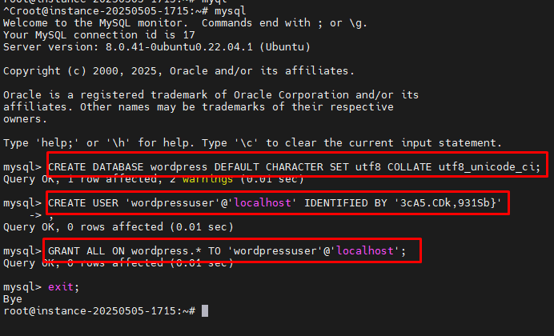
### 2.2 Tải wordpress và cấu hình
#### 2.2.1 Tải wordpress
- Tải source về thư mục /tmp 
```
cd /tmp
curl -LO https://wordpress.org/latest.tar.gz
```
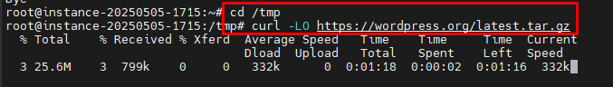
- Giải nén và copy vào thư mục triển khai 
```
tar xzvf latest.tar.gz
cp /tmp/wordpress/wp-config-sample.php /tmp/wordpress/wp-config.php
cp -a /tmp/wordpress/. /var/www/wordpress
```
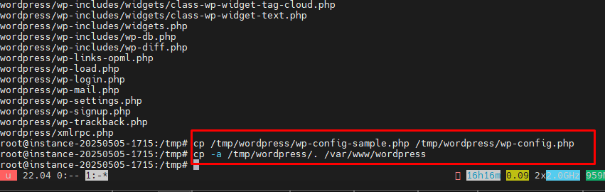
- Cấp quyền 
```
sudo chown -R www-data:www-data /var/www/wordpress
```
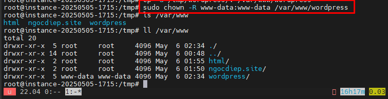
#### 2.2.2 Cấu hình wordpress
- Cấu hình các giá trị WordPress secret key
	- Sinh các giá trị 
	```
	curl -s https://api.wordpress.org/secret-key/1.1/salt/
	```
	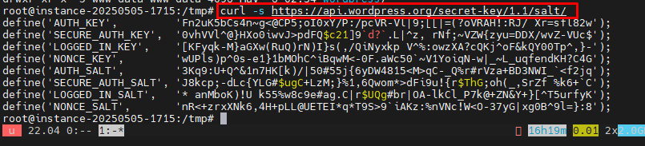
	- Chỉnh sửa các giá trị trên trong file cấu hình wordpress 
	```
	sudo nano /var/www/wordpress/wp-config.php
	```
	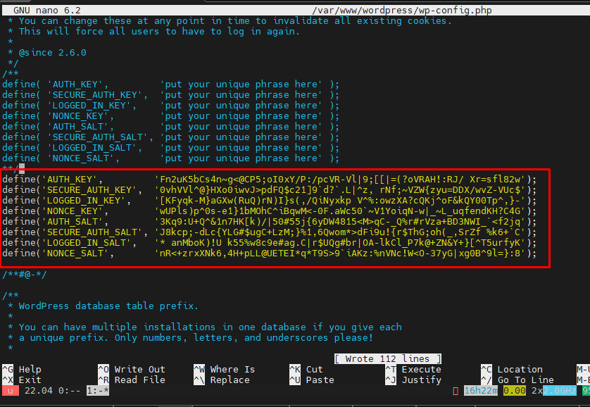
- Cấu hình kết nối cơ sở dữ liệu 
```
sudo nano /var/www/wordpress/wp-config.php
```
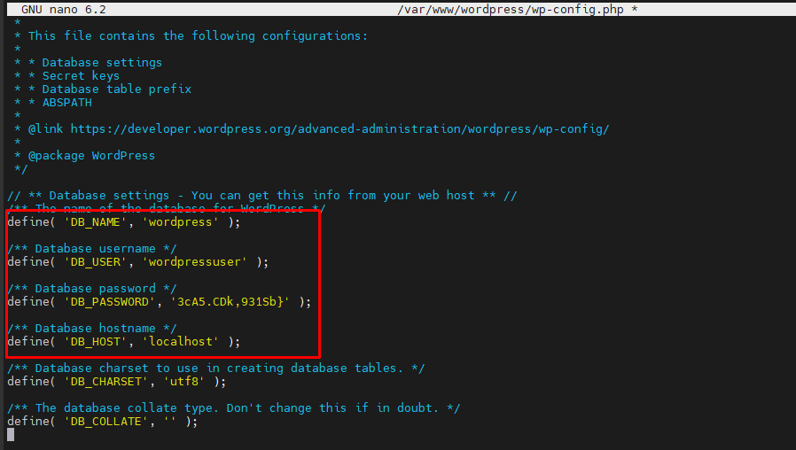

### 2.3 Cấu hình Apache / Nginx (LAMP/LEMP)
#### 2.3.1 Cấu hình Apache
- Tạo file virtual host
```
sudo nano /etc/apache2/sites-available/wordpress.conf
```
Nội dung file 
	```
	<VirtualHost *:80>
			ServerAdmin webmaster@localhost
			ServerName ngocdiep.site
			ServerAlias www.ngocdiep.site
			DocumentRoot /var/www/wordpress
			ErrorLog ${APACHE_LOG_DIR}/error.log
			CustomLog ${APACHE_LOG_DIR}/access.log combined
	</VirtualHost>
	<Directory /var/www/wordpress/>
			AllowOverride All
	</Directory>
	```
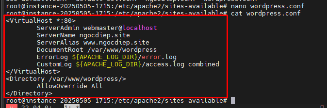
- Enable virtual host
```
a2ensite wordpress.conf
```
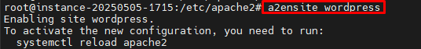
- Check
```
apachectl configtest
```

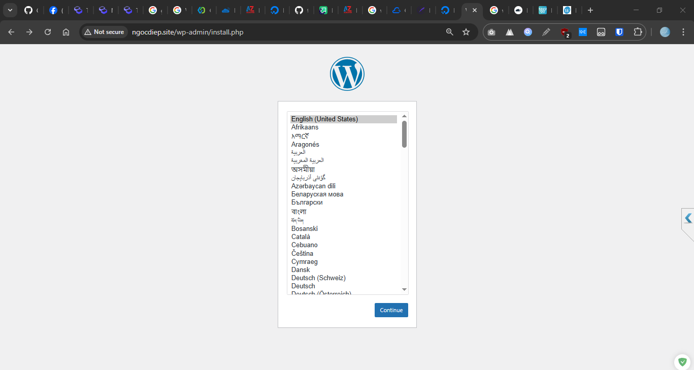
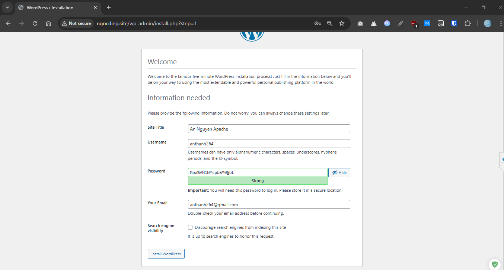
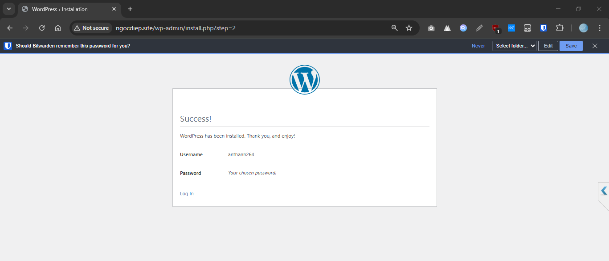
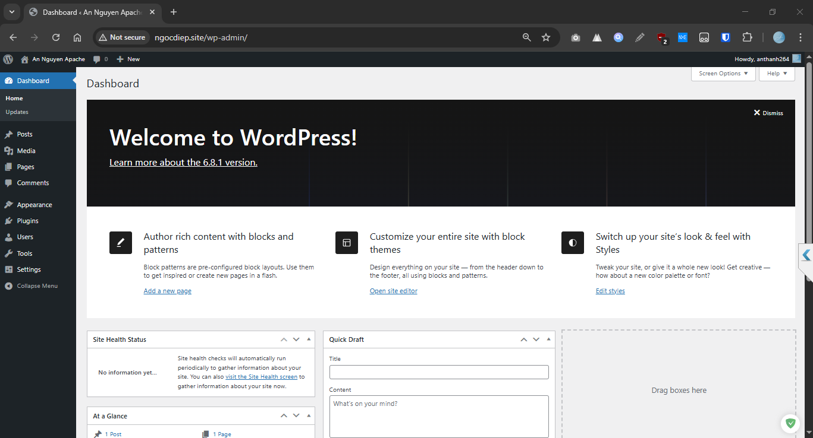
#### 2.3.2 Cấu hình Nginx
-  Tạo server block file nginx
```
sudo nano /etc/nginx/sites-available/wordpress
```

	Nội dung của file 
		```
		server {
			listen 80;
			server_name ngocdiep.site www.ngocdiep.site;

			root /var/www/wordpress;
			index index.php index.html index.htm;

			access_log /var/log/nginx/ngocdiep_access.log;
			error_log /var/log/nginx/ngocdiep_error.log;

			location / {
				try_files $uri $uri/ =404;
			}

			location ~ \.php$ {
				include fastcgi_params;
				fastcgi_pass unix:/run/php/php8.1-fpm.sock;
				fastcgi_index index.php;
				fastcgi_param SCRIPT_FILENAME $document_root$fastcgi_script_name;
			}
		}
		```

	- Kích hoạt server block file 
	```
	ln -s /etc/nginx/sites-available/wordpress /etc/nginx/sites-enabled/
	```
	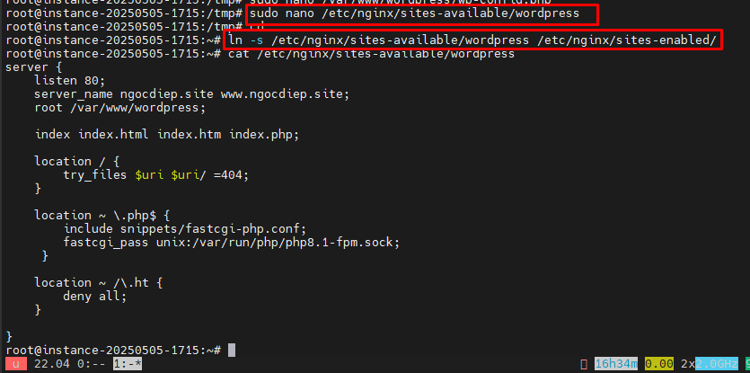
- Check 
```
nginx -t
```
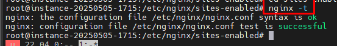
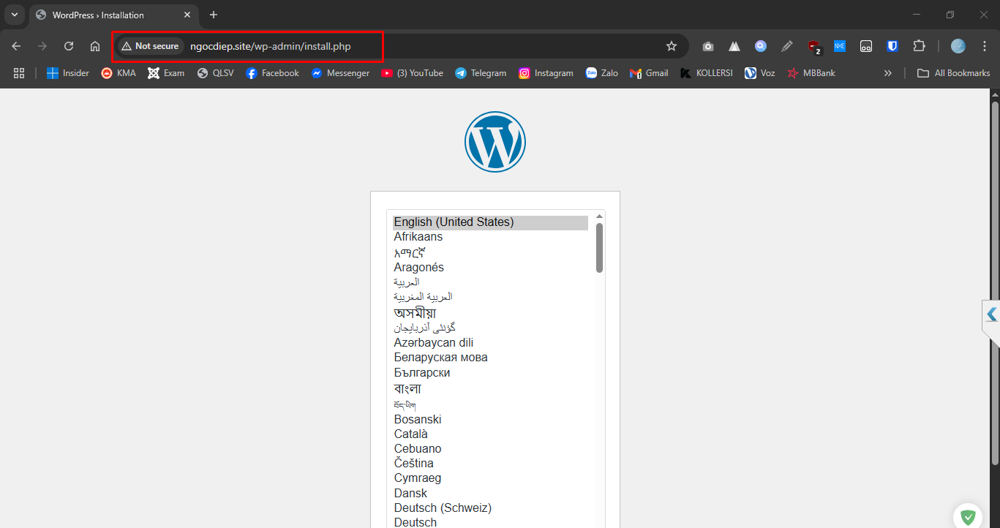	
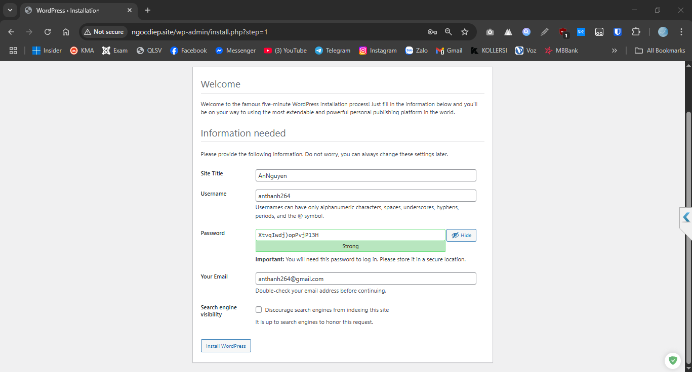	
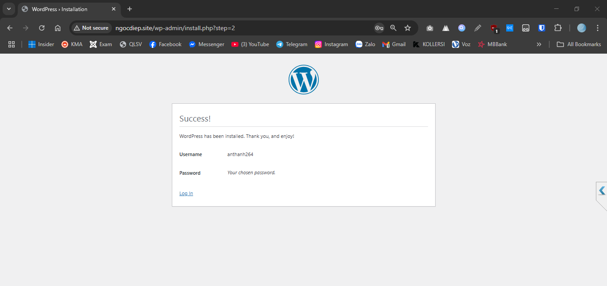	
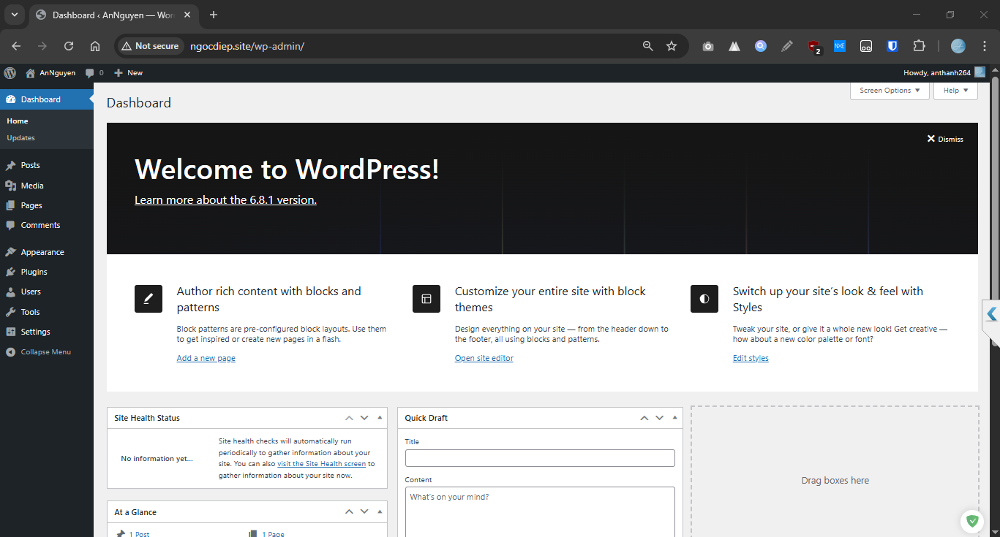	

## References 
1. [How To Install WordPress on Ubuntu 22.04 with a LAMP Stack](https://www.digitalocean.com/community/tutorials/how-to-install-wordpress-on-ubuntu-22-04-with-a-lamp-stack)
2. [How to Install WordPress with LEMP on Ubuntu](https://www.digitalocean.com/community/tutorials/how-to-install-wordpress-with-lemp-on-ubuntu#step-2-installing-additional-php-extensions)