## Triển khai wordpress mô hình 2 node Webserver - Database Server 

## 1. Mô hình 
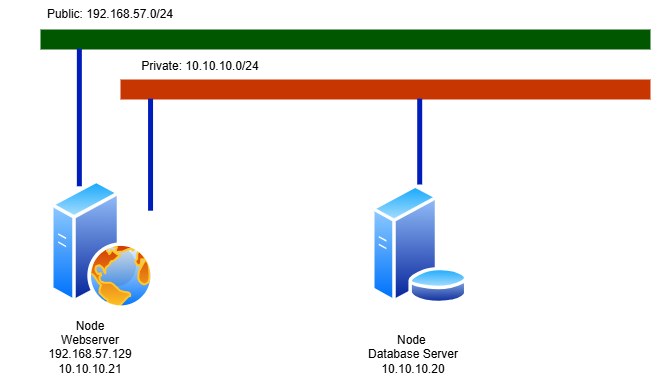

## 2. Cấu hình 2 node 
### 2.1 Cấu hình database server 
- Cài đặt mysql 
```
sudo apt-get install mysql-server
```
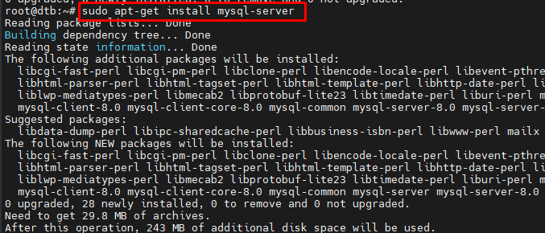
- Cấu hình cơ bản mysql 
```
sudo mysql_secure_installation 
```	
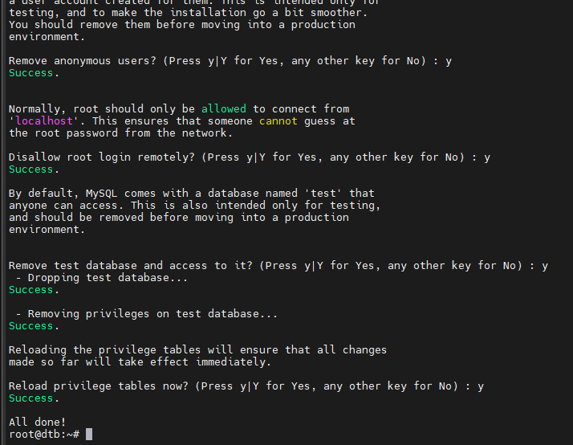
-  Cấu hình MySQL cho phép Webserver truy cập 
	-Sửa file cấu hình mysql 
	```
	/etc/mysql/mysql.conf.d/mysqld.conf
	```
	Sửa phần `bind-address` để cho lắng nghe trên interface của card mạng private 10.10.10.x
	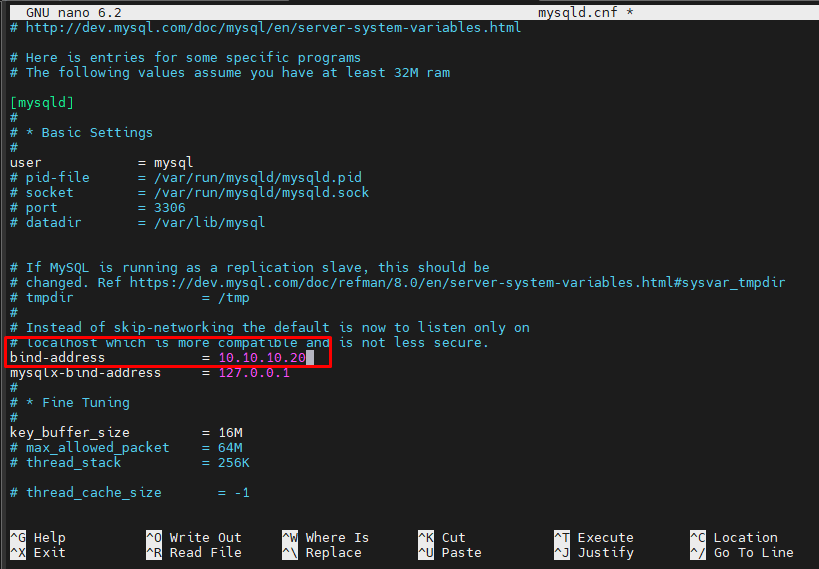
	- Restart mysql để apply 
	```
	systemctl restart mysql 
	```
	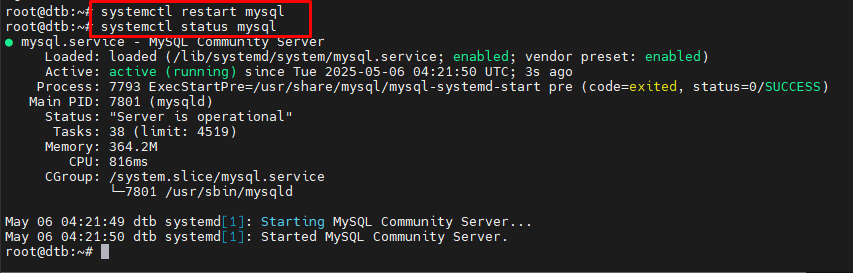
- Tạo database và các user cho phép truy vấn vào database và gán quyền 
	- Tạo database và user trên localhost
	```
	mysql
	```
	```
	CREATE DATABASE wordpress;
	CREATE USER 'wordpressuser'@'localhost' IDENTIFIED BY 'nW63n8"hclfk';
	GRANT ALL PRIVILEGES ON wordpress.* TO 'wordpressuser'@'localhost';
	```
	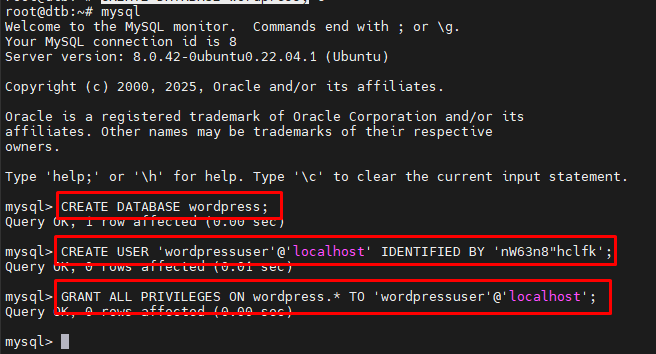
	- Tạo các user trên các máy client cho phép truy cập vào database và gán các quyền
	```
	CREATE USER 'wordpressuser'@'10.10.10.22' IDENTIFIED BY 'password';
	GRANT SELECT,DELETE,INSERT,UPDATE ON wordpress.* TO 'wordpressuser'@'10.10.10.22';
	GRANT ALL PRIVILEGES ON wordpress.* TO 'wordpressuser'@'10.10.10.22';
	FLUSH PRIVILEGES;
	```
	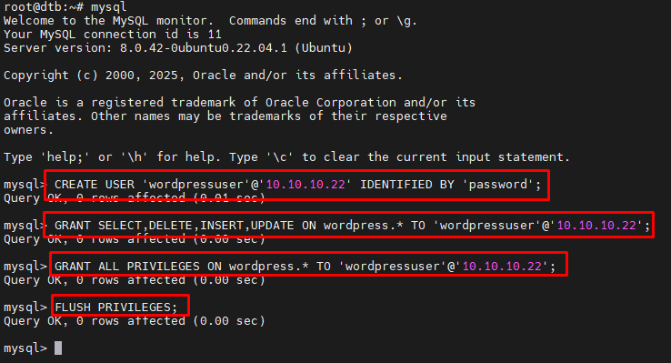
- Kiểm tra kết nối từ máy webserver 
```
mysql –u wordpressuser –h 10.10.10.20 –p
```
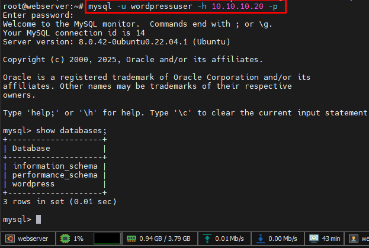
### 2.2 Cấu hình Webserver
- Tải và cấu hình wordpress như trong link [Triển khai wordpress trên LAMP/LEMP](https://github.com/anthanh264/thuctapnhanhoa/blob/main/06.05.25/1.%20WP_LAMP_LEMP(Single).md#22-t%E1%BA%A3i-wordpress-v%C3%A0-c%E1%BA%A5u-h%C3%ACnh)
- Sửa file cấu hình wp-config.php phần kết nối database:
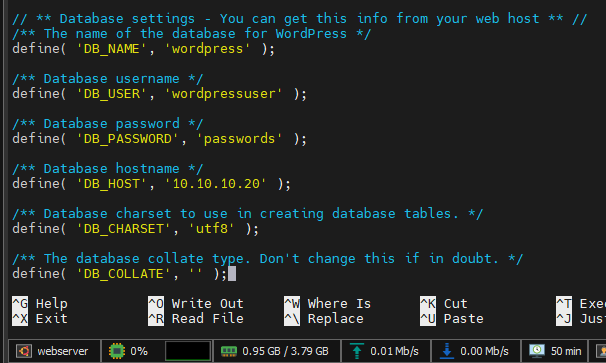
- Check sau khi đã cấu hình virtual host apache2 trên node webserver 
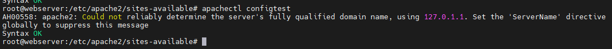
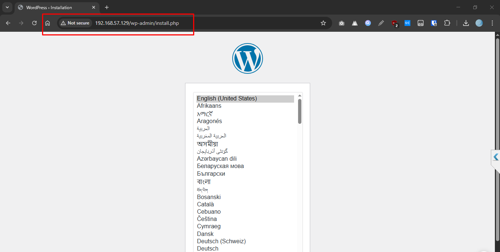
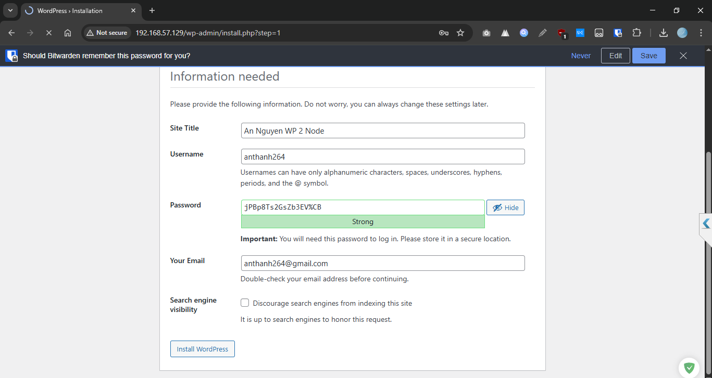
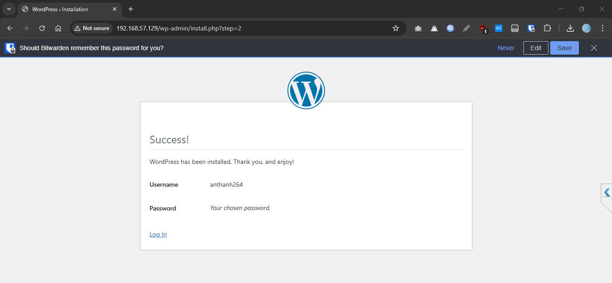
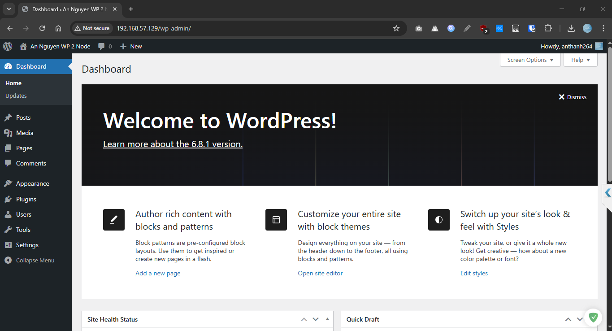

## References 
[Set Up a Remote Database to Optimize Site Performance with MySQL](https://www.digitalocean.com/community/tutorials/how-to-set-up-a-remote-database-to-optimize-site-performance-with-mysql)