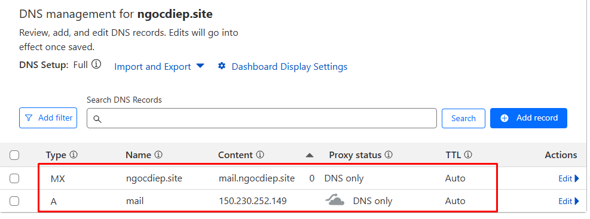
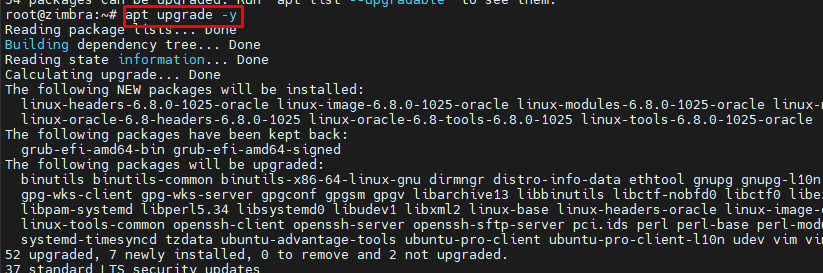
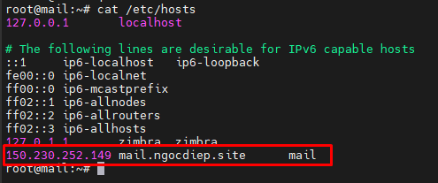
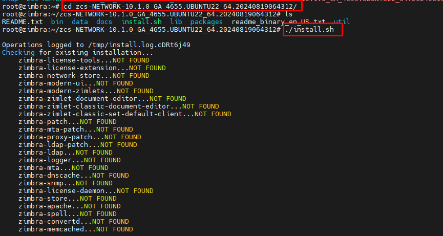
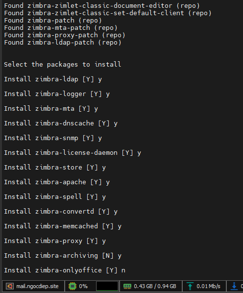
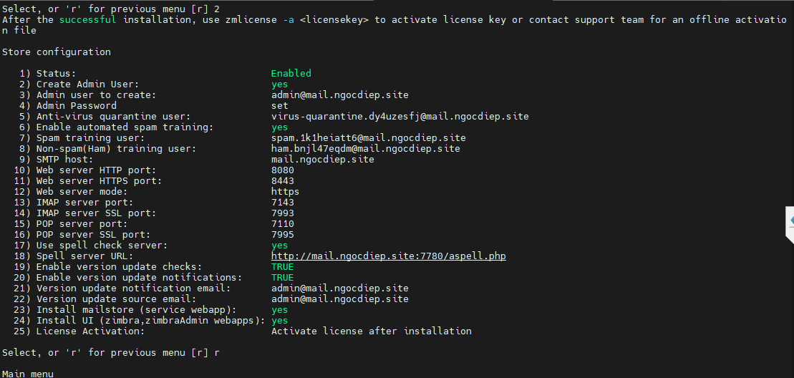

## Triển khai Zimbra trên Ubuntu 22.04

## 1. Tổng quan Zimbra 
- Zimbra hay còn gọi Zimbra Collaboration Suite là một bộ giải pháp email được cài trên máy chủ riêng. Tại đây cung cấp một hệ thống email theo tên miền riêng, webmail, lịch làm việc dành cho doanh nghiệp. Zimbra được phát triển bởi LiquidSys vào năm 2005, sau này được đổi tên thành Zimbra
- Zimbra cung cấp trải nghiệm cùng giao diện webmail với những tính năng phong phú, sáng tạo cho người dùng đầu cuối. Với Zimbra, bạn có thể gửi và nhận mail, chia sẻ, quản lý tài liệu trên thiết bị di động và đồng bộ hóa máy tính để bàn. Ngoài ra Zimbra còn là ứng dụng nguồn mở miễn phí nổi tiếng với tính năng phong phú, độ ổn định và bảo mật cao.
## 2. Cài đặt
### 2.1 Cấu hình bản ghi DNS trên domain triển khai mail 
```
;; A Records
mail.ngocdiep.site.	1	IN	A	150.230.252.149 ; cf_tags=cf-proxied:false

;; MX Records
ngocdiep.site.	1	IN	MX	0 mail.ngocdiep.site.
```

### 2.1 Cài đặt trên Ubuntu 22.04
- Cập nhật 
```
sudo apt update 
sudo apt upgrade -y
```

- Set hostname 
```
hostnamectl set-hostname mail.ngocdiep.site
```

- Chỉnh sửa file hosts thêm dòng 
```
150.230.252.149 mail.ngocdiep.site      mail
```

- Tải source Zimbra 
```
wget https://files.zimbra.com/downloads/10.1.0_GA/zcs-NETWORK-10.1.0_GA_4655.UBUNTU22_64.20240819064312.tgz
```

- Giải nén và chạy script cài 
```
tar xzvf zcs-NETWORK-10.1.0_GA_4655.UBUNTU22_64.20240819064312.tgz
cd zcs-NETWORK-10.1.0_GA_4655.UBUNTU22_64.20240819064312
./install.sh
```


- Chọn tính năng cài theo chỉ dẫn của script 

- Các cấu hình cơ bản zimbra 


