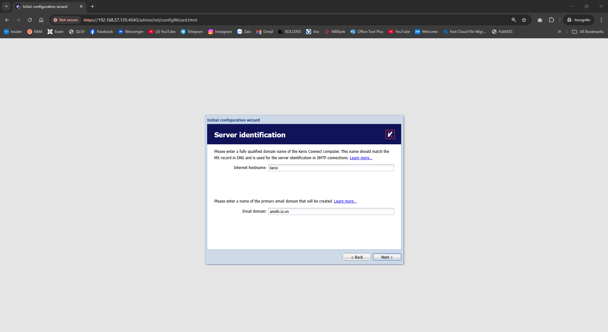

## Triển khai sử dụng Kerio Mail trên Ubuntu 22.04
## Table of Contents

  - [Triển khai sử dụng Kerio Mail trên Ubuntu 22.04](#triển-khai-sử-dụng-kerio-mail-trên-ubuntu-22.04)
  - [1. Tổng quan về Kerio](#1.-tổng-quan-về-kerio)
  - [2. Cài đặt và sử dụng Kerio](#2.-cài-đặt-và-sử-dụng-kerio)
    - [2.1 Cài đặt](#2.1-cài-đặt)
  - [2.2 Cấu hình](#2.2-cấu-hình)
  - [2.3 Sử dụng Kerio](#2.3-sử-dụng-kerio)
    - [2.3.1 Khởi tạo user](#2.3.1-khởi-tạo-user)
    - [2.3.2 Thiết lập chính sách về mật khẩu account email](#2.3.2-thiết-lập-chính-sách-về-mật-khẩu-account-email)
    - [2.3.3 Thiết lập chữ ký email](#2.3.3-thiết-lập-chữ-ký-email)
    - [2.3.4 Thiêt lập forward email](#2.3.4-thiêt-lập-forward-email)
    - [2.3.5 Tìm ID mailbox account trong email](#2.3.5-tìm-id-mailbox-account-trong-email)
    - [2.3.6 Đổi mật khẩu account admin](#2.3.6-đổi-mật-khẩu-account-admin)
    - [2.3.7 Kiểm tra log gửi/nhận email  (đặc biệt chú ý)](#2.3.7-kiểm-tra-log-gửi/nhận-email-(đặc-biệt-chú-ý))
    - [2.3.8 Thay đổi logo trong email](#2.3.8-thay-đổi-logo-trong-email)
    - [2.3.9 Thay đổi title web](#2.3.9-thay-đổi-title-web)
    - [2.3.10 Chỉnh sửa quota account email](#2.3.10-chỉnh-sửa-quota-account-email)
    - [2.3.11 Backup/restore email  (nếu được)](#2.3.11-backup/restore-email-(nếu-được))
    - [2.3.12 Chuyển data email  sang node khác (nếu được)](#2.3.12-chuyển-data-email-sang-node-khác-(nếu-được))

## 1. Tổng quan về Kerio 
- GFI KerioConnect là máy chủ thư và công cụ cộng tác tất cả trong một được triển khai bởi hơn 30 nghìn công ty trên toàn thế giới. Nó có thể được cài đặt trên nhiều hệ điều hành, bao gồm Windows, Mac OS và Linux.
- GFI KerioConnect có quy mô vừa phải cho các doanh nghiệp có ngân sách nhỏ hơn và đội ngũ nhân viên CNTT hạn chế. Nó dễ quản lý, dễ triển khai và thường có chi phí thấp hơn các giải pháp "thương hiệu lớn".
## 2. Cài đặt và sử dụng Kerio 
- Trong bài lab này thực hiện triển khai Kerio trên Ubuntu 22.04 ở môi trường local 
- Domain: annth.io.vn
- IP: 192.168.56.135
### 2.1 Cài đặt 
- Ubuntu Server 22.04
- Cập nhật và cài đặt các gói cần thiết:
```
sudo apt update
sudo apt upgrade -y 
sudo apt install sysstat -y
``` 


- Tải về gói cài đặt Kerio 
```
wget https://cdn.kerio.com/dwn/connect/connect-10.0.6-8603/kerio-connect-10.0.6-8603-p3-linux-amd64.deb
```

- Cài đặt Kerio 
```
sudo dpkg -i kerio-connect-10.0.6-8603-p3-linux-amd64.deb
```

- Kiểm tra trạng thái 
```
sudo service kerio-connect status
```

## 2.2 Cấu hình 
- Truy cập vào trong admin của kerio để thực hiện `https://192.168.57.135:4040/`
- Chọn ngôn ngữ và tiếp tục

- Chọn đồng ý 

- Cấu hình Domain

- Cấu hình mật khẩu tài khoản Admin

- Cấu hình thư mục cài đặt 

- Chọn license là trial 

- Điền key trial lấy từ mail nhận được khi đăng ký qua form tại [đây](https://gfi.ai/products-and-solutions/network-security-solutions/keriocontrol/free-trial)
	* Form đăng ký lấy key trial 
	

- Kiểm tra lại thông tin License được cấp 

- Hoàn thiện thông tin 

- Hoàn tất cấu hình chờ server cài đặt 

- Giao diện admin dashboard quản lý của Kerio 

## 2.3 Sử dụng Kerio 

### 2.3.1 Khởi tạo user 
- Tại trang chủ dashboard chọn phần quản lý user 

- Click `add` để thêm user mới

- Cấu hình thông tin user và click `ok` để khởi tạo 

- Kiểm tra bằng cách đăng nhập account vừa tạo vào `webmail` `https://192.168.57.135/webmail/login/`

- Đăng nhập thành công 


### 2.3.2 Thiết lập chính sách về mật khẩu account email
### 2.3.3 Thiết lập chữ ký email 
### 2.3.4 Thiêt lập forward email 
### 2.3.5 Tìm ID mailbox account trong email 
### 2.3.6 Đổi mật khẩu account admin 
### 2.3.7 Kiểm tra log gửi/nhận email  (đặc biệt chú ý)
### 2.3.8 Thay đổi logo trong email 
### 2.3.9 Thay đổi title web 
### 2.3.10 Chỉnh sửa quota account email 
### 2.3.11 Backup/restore email  (nếu được)
### 2.3.12 Chuyển data email  sang node khác (nếu được)


