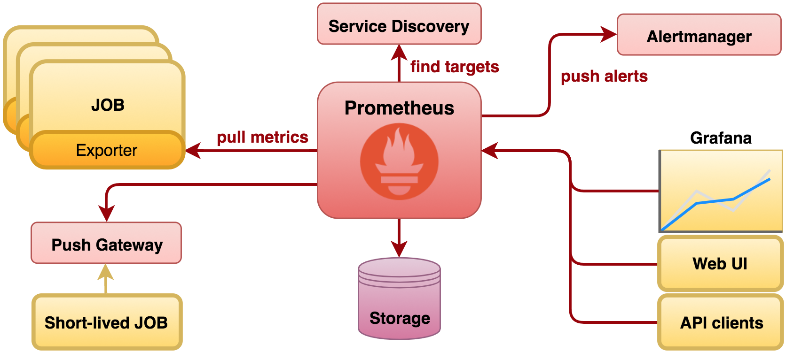

## Triển khai Promethues + Grafana
***
### 1. Tổng quan 
#### 1.1 Promethues
- Prometheus là một dịch vụ theo dõi và cảnh báo về hệ thống. Đây là một dịch vụ mã nguồn mở (Open source) hoàn toàn miễn phí. SoundCloud đã khởi đầu xây dựng Prometheus từ năm 2012. Prometheus đã được rất nhiều hệ thống tin tưởng áp dụng. Dự án có một cộng đồng người đóng góp, phát triển rất tích cực.
- Tính năng quan trọng nhất của Prometheus là thu thập thông số, dữ liệu từ các mục tiêu (dịch vụ) được nhắm đến theo khoảng thời gian nhất định đã được cài đặt trước. Ngoài ra còn các API khác thể hiện được kết quả, đánh giá bằng biểu thức quy tắc và đưa ra cảnh báo. Prometheus còn cung cấp một ngôn ngữ truy vấn rất mạnh PromQL, cực kì hữu ích khi giao tiếp với các dịch vụ monitor khác.
- Một số tính năng của Prometheus
	- Mô hình dữ liệu Time series đặc biệt phù hợp để theo dõi số liệu theo thời gian.
	- Có ngôn ngữ truy vấn riêng PromQL rất mạnh mẽ.
	- Tích hợp tốt với rất nhiềunền tảng ứng dụng.
	- Yêu cầu hạ tầng để triển khai đơn giản.
	- Hỗ trợ Push Gateway (khi làm việc với các dịch vụ tồn tại trong thời gian ngắn và hủy sau khi hoàn thành).
	- Có hỗ trợ Service discovery hoặc cấu hình tĩnh để tìm, nhắm mục tiêu cần theo dõi.
- Một số thuật ngữ quan trọng với Prometheus
	- Time-series Data: là một chuỗi các điểm dữ liệu, thường bao gồm các phép đo liên tiếp được thực hiện từ cùng một nguồn trong một khoảng thời gian.
	- Alert : một cảnh báo (alert) là kết quả của việc đạt điều kiện thoả mãn một rule cảnh báo được cấu hình trong Prometheus. Các cảnh báo sẽ được gửi đến dịch vụ Alertmanager.
	- Alertmanager: chương trình đảm nhận nhiệm vụ tiếp nhận, xử lý các hoạt động cảnh báo.
	- Client Library: một số thư viện hỗ trợ người dùng có thể tự tuỳ chỉnh lập trình phương thức riêng để lấy dữ liệu từ hệ thống và đẩy dữ liệu metric về Prometheus.
	- Endpoint: nguồn dữ liệu của các chỉ số (metric) mà Prometheus sẽ đi lấy thông tin.
	- Exporter: là một chương trình được sử dụng với mục đích thu thập, chuyển đổi các metric không ở dạng kiểu dữ liệu chuẩn Prometheus sang chuẩn dữ liệu Prometheus. Sau đấy exporter sẽ expose web service api chứa thông tin các metrics hoặc đẩy về Prometheus.
	- Instance: một instance là một nhãn (label) dùng để định danh duy nhất cho một target trong một job .
	- Job: là một tập hợp các target chung một nhóm mục đích. Ví dụ: giám sát một nhóm các dịch vụ database,… thì ta gọi đó là một job .
	- PromQL: là viết tắt của Prometheus Query Language, ngôn ngữ này cho phép bạn thực hiện các hoạt động liên quan đến dữ liệu metric.
	- Sample: là một giá trị đơn lẻ tại một thời điểm thời gian trong khoảng thời gian time series.
	- Target: một target là định nghĩa một đối tượng sẽ được Prometheus đi lấy dữ liệu (scrape). Ví dụ như: nhãn nào sẽ được sử dụng cho đối tượng, hình thức chứng thực nào sử dụng hoặc các thông tin cần thiết để quá trình đi lấy dữ liệu ở đối tượng được diễn ra.
- Prometheus giao tiếp với node qua giao thức http/https và lưu trữ data theo dạng time-series database (TSDB).(Time series database (TSDB) là những database được lưu trữ theo các mốc thời gian. Nghĩa là mỗi dữ liệu luôn được gắn với một mốc thời gian nhất đinh từ đó tạo thành chuỗi dữ liêu theo thời gian từ đó giúp chúng ta có thể xem lại dữ liệu cho một khoảng thời gian 1 giờ hay 1 tiếng.)


#### 1.2 Grafana
- Grafana là một nền tảng mã nguồn mở giúp bạn truy vấn, hiển thị, và cảnh báo dữ liệu từ nhiều nguồn khác nhau. Bạn có thể sử dụng Grafana để theo dõi thông tin theo thời gian thực từ nhiều loại dữ liệu khác nhau, như cơ sở dữ liệu thời gian thực (Time Series Database), SQL, NoSQL, hoặc các dịch vụ cloud thông qua các bảng điều khiển (dashboard) có thể tùy chỉnh.
- Grafana Lab đã phát triển rất nhiều công cụ cho cộng đồng, chúng được chia thành các nhóm chính như sau:
	- Bộ công cụ cốt lõi (Grafana stack): Bao gồm LGTM (Loki, Grafana, Tempo, Mimir) và Grafana Agent, dùng để quản lý logs, metrics và tracing.
	- Plugin cho doanh nghiệp: Mở rộng khả năng của Grafana cho các tổ chức lớn.
	- Công cụ xử lý sự cố: Giúp quản lý và khắc phục sự cố nhanh chóng.
	- Các công cụ khác: Tăng cường khả năng giám sát và quản lý hệ thống.
- Grafana là một vizualizer hiển thị các metric dưới dạng các biểu đồ (chart) hoặc đồ thị (graph), được tập hợp lại thành dashboard có tính tùy biến cao, giúp dễ dàng theo dõi tình trạng của node. Đơn giản cho các bạn dễ hiểu là sau khi lấy được metric từ các thiết bị, grafana sẽ sử dụng metric đó để phân tích và tạo ra dashboard mô tả trực quan các metric cần thiết cho việc monitoring như CPU, RAM, disks, IO operations...

### 2. Triển khai và sử dụng
#### 2.1 Cài đặt 
Bài lab này thực hiện triển khai kết hợp Prometheus và Grafana để monitor hệ thống trên Ubuntu 22.04 
##### 2.1.1. Promethues
- Update hệ thống 
```
sudo apt update 
sudo apt upgrade -y
```
- Thêm nhóm và user Prometheus 
```
sudo groupadd --system prometheus
sudo useradd -s /sbin/nologin --system -g prometheus prometheus
```

- Tạo thư mục lưu dữ liệu và cấu hình của Prometheus
```
sudo mkdir /var/lib/prometheus
for i in rules rules.d files_sd; do sudo mkdir -p /etc/prometheus/${i}; done
```

- Tải file cài Prometheus và giải nén 
```
mkdir -p /tmp/prometheus 
 cd /tmp/prometheus
wget https://github.com/prometheus/prometheus/releases/download/v3.3.1/prometheus-3.3.1.linux-amd64.tar.gz
tar xvf prometheus*.tar.gz
cd prometheus*/
``` 


- Di chuyển các file cài Prometheus tới vị trí chuẩn 
```
sudo mv prometheus promtool /usr/local/bin/
sudo mv prometheus.yml  /etc/prometheus/prometheus.yml
```

- Tạo file service Prometheus
```
sudo nano /etc/systemd/system/prometheus.service
```

- Nội dung file 
```
[Unit]
Description=Prometheus
Documentation=https://prometheus.io/docs/introduction/overview/
Wants=network-online.target
After=network-online.target
 
[Service]
Type=simple
Environment="GOMAXPROCS=1"
User=prometheus
Group=prometheus
ExecReload=/bin/kill -HUP $MAINPID
ExecStart=/usr/local/bin/prometheus \
--config.file=/etc/prometheus/prometheus.yml \
--storage.tsdb.path=/var/lib/prometheus \
--web.console.templates=/etc/prometheus/consoles \
--web.console.libraries=/etc/prometheus/console_libraries \
--web.listen-address=0.0.0.0:9090 \
--web.external-url=
 
SyslogIdentifier=prometheus
Restart=always
 
[Install]
WantedBy=multi-user.target
```
- Thay đổi quyền về user, group Prometheus
```
for i in rules rules.d files_sd; do sudo chown -R prometheus:prometheus /etc/prometheus/${i}; done
for i in rules rules.d files_sd; do sudo chmod -R 775 /etc/prometheus/${i}; done
sudo chown -R prometheus:prometheus /var/lib/prometheus/
```

- Khởi động lại systemd Daemon, start service Prometheus và kiểm tra 
```
sudo systemctl daemon-reload
sudo systemctl start prometheus
sudo systemctl enable prometheus
sudo systemctl status prometheus
```

- Kiểm tra hoạt động truy cập `http://192.168.57.136:9090/query`


##### 2.1.2. Grafana
- Cài đặt các gói cần thiết
```
sudo apt-get install -y apt-transport-https software-properties-common wget
```

- Import GPG key 
```
sudo mkdir -p /etc/apt/keyrings/
wget -q -O - https://apt.grafana.com/gpg.key | gpg --dearmor | sudo tee /etc/apt/keyrings/grafana.gpg > /dev/null
```
- Thêm repository 
```
echo "deb [signed-by=/etc/apt/keyrings/grafana.gpg] https://apt.grafana.com stable main" | sudo tee -a /etc/apt/sources.list.d/grafana.list
```

- Update list package
```
sudo apt-get update
```
- Cài đặt Grafana
```
sudo apt-get install grafana -y
```

- Khởi động service 
```
systemctl daemon-reload
systemctl start grafana-server
systemctl status grafana-server
```

- Kiểm tra 
	Truy cập `http://192.168.57.136:3000/login` và đăng nhập với u/p: admin:admin


#### 2.2 Sử dụng 
- Cấu trúc query Promethues
- Monitor Server
- Monitor mysql 
- Graph with grafana 


## References 
https://prometheus.io/docs/introduction/overview/
https://viblo.asia/p/prometheus-la-gi-924lJ3805PM
https://wiki.nhanhoa.com/kb/cai-dat-prometheus-tren-ubuntu-22-04/