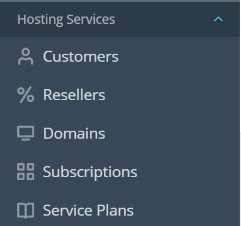
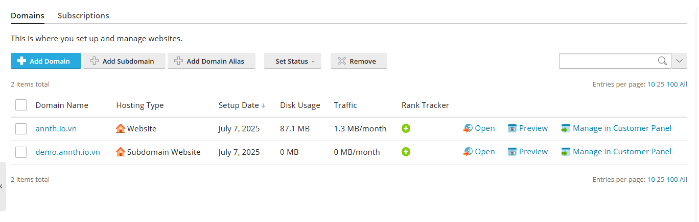
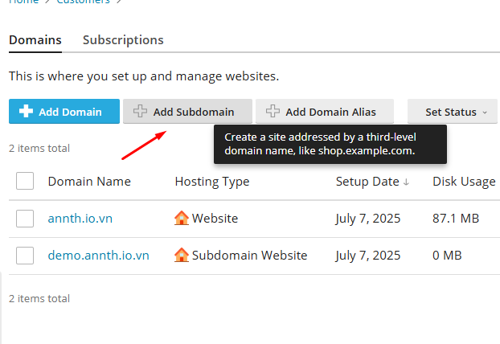
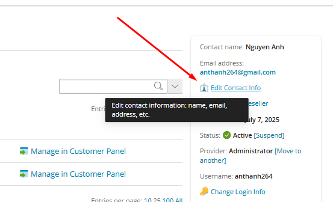
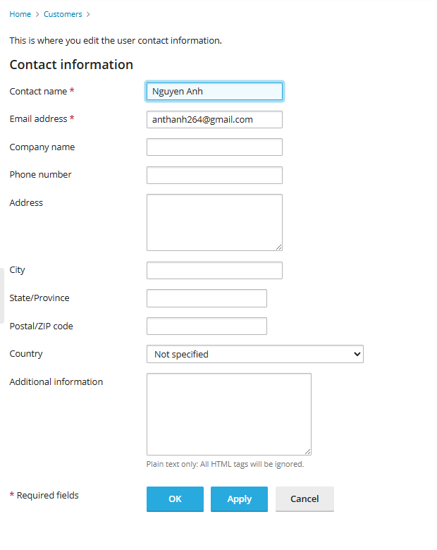
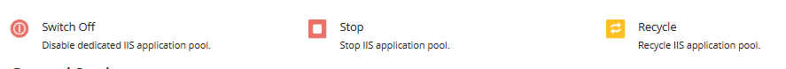
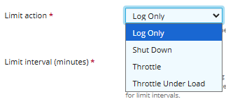
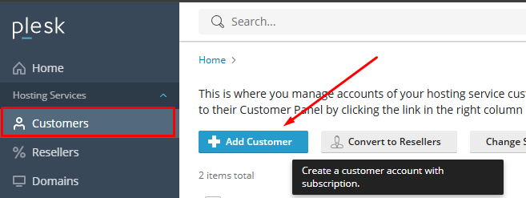

# Plesk Admin 
- Sau khi đã tìm hiểu tổng quan về các chế độ giao diện trong Plesk, giờ là lúc đi sâu vào giao diện dành cho quản trị viên hệ thống – hay còn gọi là Admin View trong chế độ Service Provider.
- Đây là chế độ mạnh mẽ nhất của Plesk, cung cấp đầy đủ công cụ để quản lý toàn bộ hệ thống hosting, từ tài nguyên máy chủ đến người dùng, tên miền, dịch vụ email, bảo mật và hơn thế nữa.
- Trong phần tiếp theo, chúng ta sẽ lần lượt khám phá các khu vực cấu hình chính trong giao diện này, bao gồm:
	- Home: Giao diện dashboard tổng quát 
	- Hosting Services: Quản lý toàn bộ dịch vụ hosting:
		- Customers: Tạo và quản lý tài khoản khách hàng.
		- Resellers: Quản lý đại lý phân phối dịch vụ.
		- Domains: Quản lý tên miền được cấp phát.
		- Subscriptions: Quản lý gói dịch vụ và tài nguyên cho từng khách hàng.
		- Service Plans: Tạo và chỉnh sửa các gói dịch vụ hosting.
	- Links to Additional Services: Các dịch vụ bổ trợ
		- SEO Toolkit: Hỗ trợ tối ưu hóa website.
		- Process List: Xem danh sách tiến trình đang chạy.
	- Server Management: Quản lý hệ thống máy chủ và các dịch vụ mở rộng
		- Tools & Settings: Cấu hình hệ thống, bảo mật, email, DNS, v.v.
		- Statistics: Xem thống kê sử dụng tài nguyên.
		- Extensions: Cài đặt và quản lý các tiện ích mở rộng.
		- WordPress / Laravel: Quản lý các ứng dụng web phổ biến.
		- Monitoring: Giám sát hiệu năng và trạng thái hệ thống.
	- My Profile: Quản lý thông tin cá nhân
		- Profile & Preferences: Cập nhật thông tin người dùng.
		- Change Password: Đổi mật khẩu đăng nhập.

## Home 
- Đây là giao diện khởi tạo, cung cấp thông tin tổng quát về server Plesk 
- 
- Giao diện quản lý máy chủ trong Plesk cung cấp các thông tin chính sau:
	- Cập nhật và quản lý thành phần
		- Last updated: Hiển thị thời điểm cập nhật gần nhất của máy chủ.
		- Các nút chức năng:
		  - Allow Automatic Updates: Bật/tắt chế độ cập nhật tự động.
		  - Add or Remove Components: Thêm hoặc gỡ bỏ các thành phần của Plesk.
	- Thông tin hệ thống:
	  - Hostname: Tên định danh của máy chủ.
	  - IP Address: Địa chỉ IP công khai.
	  - OS: Hệ điều hành đang sử dụng.
	  - Uptime: Thời gian hoạt động liên tục của máy chủ.
	  - Nhấn See More để xem chi tiết.
	- Lịch trình sao lưu
		- Schedule Daily: Hiển thị lịch sao lưu tự động hàng ngày.
		- Có thể chỉnh sửa hoặc lên lịch lại bằng nút Schedule.
		- Tạo bản sao lưu mới bằng nút Create Backup, chuyển đến giao diện cấu hình backup.
	- Thông tin cập nhật phần mềm
		- Hiển thị các bản cập nhật gần đây:
		  - NTP Timesync 1.3.5
		  - Multi-Factor Authentication 1.1.4
		  - PHP Updates
		- Nhấn See the Change History để xem chi tiết lịch sử cập nhật.
	- Thông tin website và chứng chỉ SSL
		- Valid: Danh sách các website có chứng chỉ SSL hợp lệ.
		- Websites without any certificate: Tỉ lệ website chưa có SSL.
		- No subscriptions with overuse found: Không có gói dịch vụ nào vượt quá giới hạn tài nguyên.
	- Quản lý tên miền
		- Hiển thị danh sách tên miền đang quản lý.
		- Thêm tên miền mới nhanh chóng bằng nút Add new.
	- Biểu đồ giám sát tài nguyên
		- CPU Usage: Biểu đồ mức sử dụng CPU trong 24 giờ qua.
		- Memory Usage: Biểu đồ mức sử dụng RAM theo thời gian.
		- Nhấn See More để xem chi tiết.
	- Tùy biến giao diện dashboard: Sử dụng nút Customize để điều chỉnh các thông tin hiển thị theo nhu cầu.
	- 
	
## Hosting Services - Quản lý dịch vụ Hosting
- Sau khi đã nắm được tổng quan về giao diện dashboard và các thông tin hệ thống, chúng ta sẽ đi vào phần quản lý dịch vụ hosting – nơi quản trị viên thực hiện các thao tác cốt lõi như tạo khách hàng, cấp phát gói dịch vụ, quản lý tên miền và cấu hình tài nguyên.
- 
- Giao diện Hosting Services bao gồm các mục chính:
	- Customers: Quản lý tài khoản khách hàng sử dụng dịch vụ hosting.
	- Resellers: Quản lý đại lý phân phối dịch vụ (reseller).
	- Domains: Quản lý tên miền được cấp phát cho khách hàng.
	- Subscriptions: Quản lý gói dịch vụ cụ thể của từng khách hàng.
	- Service Plans: Tạo và chỉnh sửa các gói dịch vụ hosting tiêu chuẩn.
### Customers – Quản lý tài khoản khách hàng
- Mục Customers trong Plesk là nơi quản trị viên quản lý các tài khoản khách hàng sử dụng dịch vụ hosting. Mỗi khách hàng có thể sở hữu một hoặc nhiều Subscription (gói dịch vụ), và được cấp quyền truy cập để quản lý website, email, cơ sở dữ liệu, v.v.
- 
#### Tổng quan 
- Các chức năng chính trong giao diện Customers:
	- 
	- Add Customer: Tạo mới một tài khoản khách hàng.
	- Convert to Reseller: Chuyển đổi khách hàng thành đại lý phân phối dịch vụ (reseller).
	- Move to: Cho phép bạn chuyển quyền sở hữu khách hàng từ một người dùng (hoặc reseller) sang một người dùng khác. Đây là cách để tái tổ chức hoặc phân quyền lại hệ thống hosting.
	- Change Status: Kích hoạt hoặc vô hiệu hóa tài khoản khách hàng.
	- Remove: Xóa tài khoản khách hàng khỏi hệ thống.
- Bảng danh sách khách hàng:
	- 
	- Customer Name: Tên tài khoản khách hàng. Click mở giao diện quản trị chi tiết khách hàng 
	- Subscription: Gói dịch vụ đang sử dụng.
	- Setup Date: Ngày tạo tài khoản.
	- Provider: Người quản trị đã tạo tài khoản.
	- Login as Customer: Cho phép quản trị viên đăng nhập vào giao diện của khách hàng để hỗ trợ hoặc cấu hình.
- Lưu ý:
	- Mỗi khách hàng có thể có nhiều tên miền và dịch vụ đi kèm trong Subscription.
	- Quản trị viên có thể truy cập trực tiếp vào giao diện của khách hàng để hỗ trợ kỹ thuật hoặc kiểm tra cấu hình.
#### Giao diện quản trị domain/subscription customer: 
- Bằng việc click vào `Customer Name` tại danh sách khách hàng, chuyển tới giao diện thông tin chi tiết.
- 
- 
- Giao diện này gồm : 
- Domains - Subscriptions: Đây là nơi bạn xem và quản lý các website domain/subscription mà khách hàng đang sở hữu:
	- Domains : Giao diện cấu hình, quản lý websites 
		- 
		- Các nút chức năng 
			- Add Domain: Dùng thêm domain mới và tài khoản 
			- Subdomain: Thêm tên miền phụ 
				- 
				- Cấu hình subdomain và thư mục gốc của subdomain 
				- 
			- Domain Alias: Thêm bí danh tên miền.
				- 
				- Cấu hình tên miền alias cho tên miền nào. 
					- Tích chọn đồng bộ bản ghi DNS
					- Đồng bộ alias trên các dịch vụ khác : Mail, Web
					- Redirect with HTTP 301 code: Tuỳ chọn này có tác dụng khi khách truy cập mở URL của alias (bí danh tên miền), họ sẽ được chuyển hướng đến URL của tên miền chính. Plesk sử dụng phương pháp chuyển hướng HTTP 301 thân thiện với công cụ tìm kiếm, nghĩa là thứ hạng tìm kiếm sẽ không bị phân tán giữa các URL.
				- 
			- Set Status: Bật/tắt trạng thái hoạt động của website
			- Remove: Xóa website hoặc subdomain khỏi hệ thống
		- Danh sách website đang quản lý: Gồm các cột thông tin và nút thao tác 
			- 	
			- Domain Name: Tên miền. Click chuyển giao diện quản lý chi tiết tên miền website. 
			- Hosting Type: Loại hosting 
			- Setup date: Ngày cấu hình khởi tạo 
			- Disk Usage: Dung lượng sử dụng 
			- Traffic: Băng thông sử dụng 
			- Rank tracker: Click mở giao diện tiện ích SEO
			- Các nút chức năng 
				- `Open`: Truy cập website 
				- `Preview`: Mở phần xem trước 
				- `Manage in Customer Panel`: Cho phép quản trị viên chuyển tới quản lý trong giao diện khách hàng
	- Subscriptions: Quản lý subscription (gói dịch vụ) của một khách hàng trong Plesk. Đây là nơi kiểm soát các website, tài nguyên và dịch vụ mà khách hàng đang sử dụng.
		- 	
		- Các nút chức năng
			- Add Subscription: Thêm gói dịch vụ mới vào tài khoản khách.
			- Change Plan: Dùng chuyển đổi gói hiện tại của 1 subscription sang gói dịch vụ khác. Cụ thể, chức năng này cho phép bạn:
				- Gán subscription hiện tại sang một gói dịch vụ khác đã được cấu hình sẵn.
				- Thêm hoặc gỡ bỏ các add-on (tiện ích bổ sung) nếu nhà cung cấp dịch vụ có hỗ trợ.
				- Thao tác chuyển plan 
					- Tích chọn Subscription cần chuyển và chọn `Change Plan`
					- 	
					- Tại giao diện cấu hình chọn gói plan mới cần chuyển và chọn `OK`
					- 	
			- Change Subscriber: Chuyển quyền sở hữu subscription sang khách hàng khác. Cụ thể chức năng này thực hiện 
				- Gán lại subscription cho một khách hàng khác.
				- Thay đổi nhà cung cấp dịch vụ (có thể là từ admin sang reseller hoặc ngược lại)
				- Subscription sẽ không còn liên kết với gói dịch vụ ban đầu
				- Subscription sẽ được chuyển sang trạng thái Custom, nghĩa là tài nguyên và quyền hạn sẽ giữ nguyên như cũ, không bị ràng buộc bởi gói dịch vụ nào.
				- Thao tác chuyển Subscriber
					- Chọn subscription cần chuyển và nhấn nút "Change Subscriber"
					- 	
					- Chọn khách hàng mới (subscriber mới) từ danh sách dropdown.
					- 	
					- Xác nhận việc chuyển đổi bằng nút `Reassign`
			- Set Status: Bật/tắt trạng thái hoạt động của Subscription
			- Remove: Xóa Subscription khỏi tài khoản 
		- Danh sách các Subscription của tài khoản: Gồm các cột thông tin và nút thao tác 
			- 	
			- Subscription: Tên gói đăng ký. Click chuyển tới giao diện quản lý Subscription
			- Setupdate: Ngày cấu hình khởi tạo 
			- Nút chức năng: Manage in Customer Panel: Cho phép quản trị viên đăng nhập vào giao diện của khách hàng để quản lý.
- Thông tin khách hàng (bên phải)
	- Contact Name: Tên khách hàng 
	- Email: Email của customer 
	- Có thể chỉnh sửa các thông tin này bằng nút chức năng `Edit Contact Info`.Click chọn mở giao diện cấu hình thông tin khách hàng 
	- 
	- 
	- Convert to Resaller: Nút thao tác chuyển người dùng thành Resaller
	- Creation Date: Ngày tạo tài khoản
	- Status: Trạng thái tài khoản. (Có nút `Suspend` để vô hiệu hoá nhanh tài khoản)
	- Provider: Administrator (có nút Move to another để chuyển sang reseller khác nếu cần)
	- Username: Username đăng nhập Plesk của khách hàng 
	- Tùy chọn quản lý: 
	- Change login info: Đổi thông tin đăng nhập
	- 
	- 
	- Login as Customer: Cho phép quản trị viên đăng nhập vào giao diện của khách hàng để hỗ trợ hoặc cấu hình.
	- Owner's description: Thay đổi mô tả của chủ sở hữu 
	- IIS Application Pool: Chuyển tới cài đặt IIS Application của khách hàng (Với Plesk chạy trên Windows)\
		- Application Pool là một vùng cách ly trong IIS, nơi một hoặc nhiều website có thể chạy độc lập với các website khác. Mỗi pool có thể có:
			- Cấu hình riêng về hiệu năng
			- Quyền truy cập hệ thống riêng
			- Quản lý bộ nhớ và tiến trình riêng
		- IIS Application Pool của customer dùng để:
			- Tách biệt website của từng khách hàng: Giúp bảo mật và ổn định hơn, nếu một site bị lỗi thì không ảnh hưởng đến site khác.
			- Tùy chỉnh cấu hình theo nhu cầu: bật/tắt chế độ 32-bit, cấu hình số lượng tiến trình, thời gian timeout, giới hạn bộ nhớ...
			- Quản lý hiệu năng và tài nguyên: Giúp tối ưu hóa tốc độ xử lý và giảm tải cho server.
			- Hỗ trợ các ứng dụng ASP.NET, .NET Core: Cho phép chạy các ứng dụng web hiện đại trên nền Windows.
			- 
			- Giao diện này gồm 
				- 
				- Nút chức năng kích hoạt sử dụng IIS Application Pool, Quản trị bật/tắt/khởi động lại. Click chọn `Switch On` để bật. 
				- 
				- General Setting: Cấu hình cài đặt chung một IIS Application Pool trong Plesk, dùng để cấu hình cách ứng dụng web ASP.NET hoạt động trên server Windows. 
					- 
					- Các tùy chọn cấu hình:
						- Managed pipeline mode: 
							- Integrated: Đây là chế độ xử lý yêu cầu web của IIS. ASP.NET được tích hợp trực tiếp vào pipeline xử lý của IIS, cho phép xử lý linh hoạt và hiệu quả hơn.
							- Classic: ASP.NET chạy như một ISAPI extension, phù hợp với các ứng dụng cũ.
						- Enable 32-bit applications: Nếu bật (✓), IIS sẽ cho phép chạy ứng dụng 32-bit trên hệ điều hành 64-bit. Dùng khi ứng dụng hoặc thư viện bạn triển khai chỉ hỗ trợ 32-bit.
						- Load the user profile: Nếu bật (✓), IIS sẽ tải profile người dùng khi khởi động ứng dụng. Cần thiết nếu ứng dụng cần truy cập registry, thư mục người dùng, hoặc các thiết lập cá nhân.
				- Performance Settings: Cấu hình cài đặt hiệu năng của một IIS Application Pool trong Plesk. Đây là nơi cấu hình hiệu năng và hành vi của tiến trình xử lý web.
					- 
					- Các thiết lập hiệu năng:
					- Maximum number of worker processes: Số lượng tiến trình xử lý yêu cầu web.
						- Nếu là 1: chỉ có một tiến trình phục vụ toàn bộ yêu cầu.
						- Nếu là 0 trên hệ thống hỗ trợ NUMA, IIS sẽ tự động tạo tiến trình theo số lượng nút NUMA.
					- Idle timeout (minutes): Nếu không có yêu cầu trong thời gian (phút) được cấu hình, tiến trình sẽ bị tắt để tiết kiệm tài nguyên.
					- Idle timeout action: Khi hết thời gian chờ, tiến trình sẽ bị kết thúc hoặc tạm dừng (Termiate/Suspend)\
					- 
					- Maximum CPU usage (%): Giới hạn mức sử dụng CPU. Có tuỳ chọn tích không giới hạn `Unlimited`
					- Limit action: Nếu vượt quá giới hạn CPU (nếu có), IIS thực hiện hành động được cấu hình 
					- Log Only: IIS chỉ ghi log lại sự kiện khi tiến trình vượt quá giới hạn CPU.
					- Shut Down: IIS sẽ dừng (terminate) tiến trình của Application Pool nếu vượt quá giới hạn CPU.
					- Throttle: IIS sẽ giới hạn (throttle) tiến trình, làm chậm lại việc xử lý để giảm mức sử dụng CPU.
					- Throttle Under Load: IIS chỉ giới hạn tiến trình khi hệ thống đang chịu tải cao.
					- 
					- Limit interval (minutes): Khoảng thời gian để reset bộ đếm CPU. Sau khoảng thời gian (phút) được cấu hình, IIS sẽ làm mới bộ đếm để theo dõi lại.
					- Cấu hình tái khởi động (Recycling):
						- Recycling at regular time intervals (minutes): Sau khoảng thời gian (phút) được cấu hình, tiến trình sẽ được khởi động lại để làm sạch bộ nhớ.
						- Recycling when the maximum number of requests is reached: Giới hạn số lượng request trước khi tiến trình được khởi động lại.
						- Recycling when the maximum amount of virtual memory is used: Giới hạn bộ nhớ ảo. (MB/KB/GB/TB)
						- Recycling when the maximum amount of private memory is used: Giới hạn bộ nhớ riêng của tiến trình.(MB/KB/GB/TB)
	- Remove customer: Xóa khách hàng khỏi hệ thống

- Ví dụ: Thao tác quản lý khách hàng trong Plesk
	- Mục tiêu: Tạo một khách hàng mới, cấp cho họ một gói dịch vụ (Subscription), và gán tên miền để họ có thể bắt đầu sử dụng hosting.
	- Bước 1: Tạo Customer mới
		1. Truy cập Hosting Services > Customers
		2. Nhấn Add a Customer
		- 
		3. Nhập thông tin:
			- Thông tin cơ bản 
				- 
				- Contact name: Công ty ABC
				- Email: contact@abc.com
			- Các thông tin bổ sung tại phần `Additional customer information`: Phần này giúp quản trị viên lưu trữ thông tin liên hệ và quản lý khách hàng hiệu quả hơn
				- 
				- Company name – Tên công ty của khách hàng (nếu có).
				- Phone number – Số điện thoại liên hệ.
				- Address – Địa chỉ đầy đủ.
				- City – Thành phố.
				- State/Province – Bang hoặc tỉnh.
				- Postal/ZIP code – Mã bưu điện.
				- Country – Quốc gia (chọn từ menu dropdown).
				- Additional information – Thông tin bổ sung nếu cần ghi chú gì thêm.
				- Information for the administrator: Phần ghi chú cho quản trị viên. Phần này chỉ quản trị viên mới được phép thấy. 
			- Thông tin tài khoản đăng nhập quản trị Plesk 
				- 
				- Username: Tên tài khoản đăng nhập 
				- Password: Mật khẩu tài khoản. 
					- Có biểu tượng con mắt để hiển thị/ẩn mật khẩu. 
					- Có thể cấu hình hoặc sinh ngẫu nhiên bằng nút `Generate` bên phải textbox nhập mật khẩu. 
					- Có biểu tượng sao chép để chép nhanh mật khẩu đã sinh. 
				- Kích hoạt tài khoản: Activate account by e-mail: Tùy chọn gửi email kích hoạt đến khách hàng.
					- Nếu bật, tài khoản sẽ chưa hoạt động cho đến khi khách hàng nhấp vào liên kết trong email.
					- Nếu không bật, quản trị viên có thể kích hoạt thủ công sau.
			
	- Bước 2: Tạo Subscription cho khách hàng
		- Ngay trong giao diện tạo Customer, bạn sẽ thấy phần Create a subscription for the customer:
		- 
		1. Domain name: Nhập tên miền mà khách hàng sẽ sử dụng ví dụ `abc.io.vn`
		2. Service plan: Chọn gói dịch vụ từ danh sách (ví dụ: Default Domain). Gói này xác định tài nguyên như dung lượng, email, database, v.v.
		3. IP address: Chọn IP mặc định của máy chủ: Chọn IP dùng để truy cập qua FTP/RDP. 
		- Username: Tên người dùng hệ thống dùng để đăng nhập FTP hoặc SSH.
		- Password: Nhập mật khẩu hoặc nhấn nút Generate để tạo tự động.
		- Description (tùy chọn): Ghi chú nội bộ cho quản trị viên người cung cấp hosting admin hoặc reseller, không hiển thị với khách hàng.
		- Tùy chọn thêm:Nếu bạn muốn tùy chỉnh thông số subscription sau khi tạo, hãy tick vào ô: `Proceed to customizing the subscription parameters after the customer is created.`

	- Bước 3: Quản lý khách hàng
		- Click xác nhận để tạo `customer`
		- 
		- Sau khi tạo xong: Khách hàng sẽ xuất hiện trong danh sách.
			- 
		- Bạn có thể:
			- Nhấn Login as Customer để truy cập giao diện của họ.
			- 
			- 
			- Convert to Reseller nếu muốn nâng cấp họ thành đại lý. Sau khi chuyển đổi, bạn sẽ được yêu cầu:
				- 
				- 
				- Sau khi chuyển đổi account chuyển sang phần Reseller 
				- 
				- Chọn **Reseller Plan** (gói tài nguyên dành cho đại lý). Các gói này sẽ được tạo ở phần `Service Plans` 
			- Move to: Chuyển khách hàng sang một chủ sở hữu khác. 
				- Tại pop-up chuyển khách hàng bạn có thể cấu hình giữ nguyên toàn bộ tài nguyên, quyền và ứng dụng của khách hàng sẽ được bảo toàn sau khi chuyển bằng cách chọn gói `Custom` 
				- 
				- Hoặc chọn gói tài nguyên theo chủ sở hữu mới: Tuỳ chọn này sẽ ảnh hưởng tới toàn bộ tài nguyên, quyền và ứng dụng của khách hàng thuộc chủ sở hữu cũ.
				- 
			- Change Status để tạm dừng hoặc kích hoạt lại tài khoản.
				- 
			- Remove: Xoá tài khoản ra khỏi hệ thống 
				- 
			
## Resellers: Quản lý đại lý phân phối dịch vụ (reseller).
- 
- Giao diện này cho phép quản trị viên hệ thống thực hiện các thao tác quản lý tài khoản đại lý (reseller), bao gồm:
- Chức năng chính:
	- 
	- Thêm Reseller: Tạo tài khoản reseller mới với gói dịch vụ tùy chọn.
	- Chuyển đổi sang Khách hàng: Biến reseller thành khách hàng thông thường, phù hợp khi không còn nhu cầu phân phối dịch vụ.
	- Thay đổi trạng thái: Kích hoạt hoặc vô hiệu hóa tài khoản reseller.
	- Xóa Reseller: Loại bỏ reseller khỏi hệ thống (cẩn thận vì có thể ảnh hưởng đến khách hàng liên quan).
- Danh sách hiển thị thông tin của các reseller:
	- 
	- Tên Reseller: Tên định danh của đại lý.
	- Gói dịch vụ: Gói reseller đang sử dụng.
	- Ngày tạo: Thời điểm tài khoản được thiết lập.
	- Số lượng khách hàng: Tổng số khách hàng mà reseller đang quản lý.
	- Đăng nhập với tư cách Reseller: Cho phép quản trị viên truy cập giao diện của reseller để hỗ trợ kỹ thuật hoặc kiểm tra cấu hình.
- Giao diện này là công cụ quan trọng để phân quyền, theo dõi và hỗ trợ các đại lý trong hệ thống hosting Plesk.

- Ví dụ tạo reseller mới 
	- Đăng nhập vào Plesk với quyền quản trị viên (Admin).Vào mục Resellers từ menu chính. Nhấn nút Add Reseller.
	- 
	- Chuyển tới giao diện cấu hình thông tin cho reseller mới. 
	- Gồm các phần 
		- Contact Information: Cấu hình các thông tin của reseller: Tên, email, tên công ty, địa chỉ, số điện thoại
			- 
			- Ví dụ 
			- 
		- Information for the Administrator: Ghi chú riêng cho quản trị viên, khách hàng không có quyền xem. 
		- 
		- Access to Plesk: Cấu hình tài khoản/mật khẩu đăng nhập Plesk để quản trị 
		- 
			- Username : Tên đăng nhập của reseller
			- Password : Mật khẩu đăng nhập. Bạn có thể tự nhập hoặc nhấn nút Generate để tạo tự động.
			- Activate account by e-mail (tùy chọn):
				- Nếu tick vào, hệ thống sẽ gửi email kích hoạt đến reseller.
				- Nếu không tick, bạn cần kích hoạt tài khoản thủ công sau khi tạo.

		- Subscription: Cấu hình gói mà Reseller được gán. 
		- 
			- Service plan: Đây là gói dịch vụ mà reseller sẽ được gán khi tạo tài khoản.
				- Ví dụ: Default Reseller là gói mặc định, có thể bao gồm giới hạn về:
					- Số lượng khách hàng
					- Dung lượng lưu trữ
					- Băng thông
					- Quyền truy cập (FTP, email, database...)
				-> Các gói này sẽ được cấu hình trong phần `Service Plans`
			- Tùy chọn: "Proceed to customizing the subscription parameters after the reseller is created"
				- Nếu bạn tick vào ô này, sau khi tạo reseller xong, bạn sẽ được chuyển đến phần tùy chỉnh chi tiết gói dịch vụ.
				- Lưu ý: Khi bạn tùy chỉnh thủ công, subscription sẽ bị khóa đồng bộ (lock for syncing), tức là:
					- Gói dịch vụ sẽ không tự cập nhật theo thay đổi từ service plan gốc.
					- Bạn phải quản lý thủ công các thông số sau này.
	- Sau khi đã cấu hình các thông số. Click OK để tạo reseller mới. 
	- 
