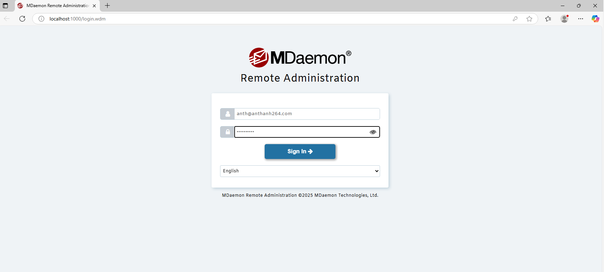
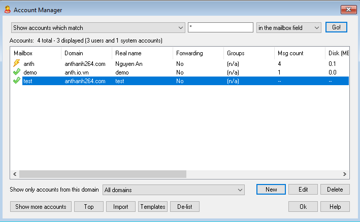
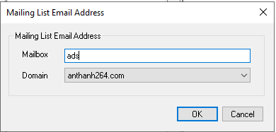
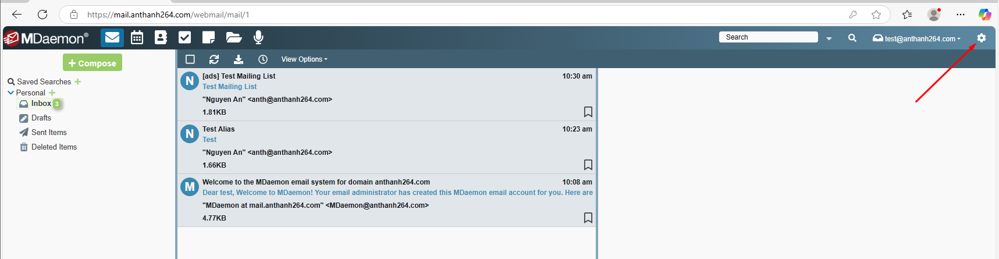
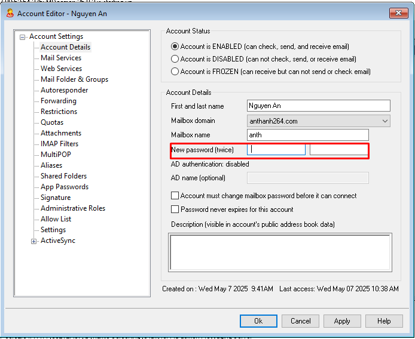

## MDaemon trên Windows Server
***
## Table of Contents

  - [MDaemon trên Windows Server](#mdaemon-trên-windows-server)
    - [1. Tổng quan](#1.-tổng-quan)
    - [2. Cài đặt và sử dụng](#2.-cài-đặt-và-sử-dụng)
      - [2.1 Cài đặt](#2.1-cài-đặt)
      - [2.2 Sử dụng](#2.2-sử-dụng)
        - [2.2.1 Truy cập admin và enduser](#2.2.1-truy-cập-admin-và-enduser)
        - [2.2.2 Các port cần thiết được sử dụng trên email server Mdaemon](#2.2.2-các-port-cần-thiết-được-sử-dụng-trên-email-server-mdaemon)
        - [2.2.3 Khởi tạo domain, user, group, Alias, Mailing lists email](#2.2.3-khởi-tạo-domain,-user,-group,-alias,-mailing-lists-email)
        - [2.2.4 Thiết lập chính sách về mật khẩu account email](#2.2.4-thiết-lập-chính-sách-về-mật-khẩu-account-email)
        - [2.2.5 Thiết lập chữ ký email](#2.2.5-thiết-lập-chữ-ký-email)
        - [2.2.6 Thiết lập forward email](#2.2.6-thiết-lập-forward-email)
        - [2.2.7 Tìm hiểu về Content Filter: Spam, Antivirus, Attach Fillters, Message Filters](#2.2.7-tìm-hiểu-về-content-filter:-spam,-antivirus,-attach-fillters,-message-filters)
        - [2.2.8 Đổi mật khẩu account admin global, admin domain](#2.2.8-đổi-mật-khẩu-account-admin-global,-admin-domain)
        - [2.2.9 Phân quyền cho tài khoản thành admin của domain](#2.2.9-phân-quyền-cho-tài-khoản-thành-admin-của-domain)
        - [2.2.10 Kiểm tra log gửi/nhận email (đặc biệt chú ý)](#2.2.10-kiểm-tra-log-gửi/nhận-email-(đặc-biệt-chú-ý))
        - [2.2.11 Tìm hiểu thêm về Dynamic screening trong Security của Mdaemon](#2.2.11-tìm-hiểu-thêm-về-dynamic-screening-trong-security-của-mdaemon)
  - [References](#references)

### 1. Tổng quan 
- MDaemon là một phần mềm máy chủ mail và cộng tác dành cho doanh nghiệp trên hệ điều hành Windows, được phát triển bởi Alt-N. Phần mềm được ra mắt lần đầu vào năm 1996 và đã trở thành một giải pháp phổ biến cho việc quản lý email, lịch làm việc, danh bạ và các tính năng cộng tác trong môi trường doanh nghiệp.
- MDaemon Mail Server là lựa chọn thay thế hợp lý cho Exchange Mail Server nhờ khả năng linh hoạt, đơn giản khi cấu hình, cài đặt.
- Tính năng của MDaemon 
MDaemon có những tính năng nổi bật như sau.
	* Email Server: Máy chủ mail MDaemon cung cấp các tính năng email đầy đủ, bao gồm hỗ trợ các giao thức IMAP, SMTP và POP3. Máy chủ này có thiết kế thân thiện với người dùng và hiệu suất ổn định, đáp ứng nhu cầu của các doanh nghiệp vừa và nhỏ.
	* Tính năng bảo mật nâng cao: Hệ thống MDaemon sử dụng nhiều lớp bảo mật để bảo vệ máy chủ khỏi các cuộc tấn công. Các lớp bảo mật này bao gồm kiểm soát chuyển tiếp, IP Shielding, SMTP Authentication, tra cứu ngược, xác thực email Vouch By Reference (VBR), xác nhận và ký hiệu thư DKIM, chống thư rác, SSL/TLS, bảo vệ backscatter và SecurityPlus.
	* Tính năng mã hóa Email: MDaemon cung cấp các tính năng mã hóa mạnh mẽ cho cả máy khách và máy chủ. Người dùng WorldClient có thể mã hóa email và tệp đính kèm của mình trong trình đơn cài đặt WorldClient. Quản trị viên có thể sử dụng OpenPGP để mã hóa, giải mã và quản lý khóa email trên máy chủ.
	* Khả năng lưu trữ lớn: MDaemon cung cấp khả năng lưu trữ email dung lượng lớn, giúp người dùng dễ dàng bảo vệ thông điệp email của mình theo yêu cầu pháp lý và chính sách công nghệ thông tin của doanh nghiệp.
	* Quản trị từ xa: MDaemon cung cấp cho quản trị viên khả năng quản trị từ xa toàn diện, cho phép họ truy cập và quản lý tất cả các tính năng của máy chủ từ bất kỳ máy tính nào có trình duyệt web và kết nối Internet. Điều này bao gồm các tác vụ như thêm hoặc chỉnh sửa tài khoản, chỉnh sửa thư, khắc phục sự cố gửi thư và hơn thế nữa. Quản trị viên từ xa thậm chí có thể truy cập MDaemon thông qua kết nối an toàn bằng HTTPS.
	* Ngoài ra, MDaemon còn cung cấp tính năng quản lý thiết bị di động, cho phép người dùng truy cập email, lịch, danh bạ và tác vụ của họ từ bất kỳ thiết bị di động nào. MDaemon tương thích với nhiều thiết bị di động phổ biến, vì vậy người dùng có thể truy cập thông tin quan trọng của họ ở mọi nơi, mọi lúc.
	* WorldClient (Web-Based Email): WorldClient của MDaemon là nền tảng email web thân thiện với người dùng, cung cấp đầy đủ các tính năng cần thiết cho doanh nghiệp vừa và nhỏ. Tính năng này cho phép người dùng cộng tác hiệu quả bằng cách chia sẻ thư mục email, lịch, danh bạ, danh sách công việc, nhiệm vụ và ghi chú. Người dùng có thể truy cập tất cả dữ liệu này từ bất kỳ đâu có kết nối Internet và trình duyệt web.
	* Tính năng WorldClient Instant Messenger: WorldClient Instant Messenger là ứng dụng nhắn tin tức thì miễn phí đi kèm với MDaemon, cung cấp các tính năng IM, ghi nhật ký, chia sẻ tệp, trò chuyện nhóm, đồng bộ hóa sổ địa chỉ và thông báo email để giúp người dùng truy cập nhanh vào các tính năng của WorldClient.
	* Khả năng di chuyển Exchange: Di chuyển email từ máy chủ này sang máy chủ khác có thể là một quá trình phức tạp, nhưng MDaemon Messaging Server giúp việc này dễ dàng hơn nhiều. Tính năng MDMigrator tích hợp của MDaemon cho phép bạn di chuyển dữ liệu của mình từ Exchange sang MDaemon chỉ với một vài bước đơn giản. Điều này giúp bạn có thể chuyển sang MDaemon nhanh chóng và dễ dàng, với thời gian ngừng hoạt động tối thiểu.
### 2. Cài đặt và sử dụng 

#### 2.1 Cài đặt 
- Download Mdaemon
```
https://mdaemon.com/pages/downloads-mdaemon-mail-server-free-trial
```


- Chạy file cài đặt mới tải 

- Đồng ý điều khoản -> Nhấn I Agree 

- Cấu hình thư mục cài đặt

- Chọn free trial 


- Điền thông tin và mail nhận key activate 


- Kiểm tra mail nhận key và điền


- Xác nhận cài đặt


- Cấu hình domain

- Cấu hình user

- Xác nhận cấu hình

- Hoàn tất cài đặt 

- Kiểm tra đăng nhập vào web admin 

- License Trial được kích hoạt

- Chỉnh sửa file hosts `C:\Windows\System32\drivers\etc\hosts` thêm dòng 
```
192.168.57.137	mail.anthanh264.com
```

- Kiểm tra đăng nhập vào webmail 


#### 2.2 Sử dụng 
##### 2.2.1 Truy cập admin và enduser
* Admin 
- Truy cập web admin tại `http://localhost:1000/`


* Enduser
- Truy cập web mail tại `http://mail.anthanh264.com/`


##### 2.2.2 Các port cần thiết được sử dụng trên email server Mdaemon
	- SMTP inbound / outbound port - 25
	- MSA inbound port - 587
	- ODMR inbound port - 366
	- SMTP SSL port - 465
	- ActiveSync port - 80
	- ActiveSync SSL port - 443
	- POP3 inbound / outbound port - 110
	- IMAP inbound port - 143
	- POP3 SSL port - 995
	- IMAP SSL port - 993
	- DNS outbound port - 53
	- Remote Administration port - 1000
	- Remote Administration SSL port - 444
	- WorldClient port - 3000
	- WorldClient SSL port - 443
	- Minger port - 4069
	- XMPP port - 5222
	- XMPP SSL port - 5223
	- BOSH port (Webmail IM) - 7070
	- BOSH SSL port (for Webmail IM) - 7443
##### 2.2.3 Khởi tạo domain, user, group, Alias, Mailing lists email 
* Khởi tạo Domain 
	- Trên WindowsServer mở `Open MDaemon Configuration Session`
	
	- Chọn icon `Domain Manager`
	
	- Click chọn `New Domain` để khởi tạo Domain mới.
	
	- Tạo domain mới `anth.io.vn`
	
	- Cấu hình `hostname`
	
	- Thêm user để test tại phần `accounts`
	
	- Điền thông tin 
	
	- Chỉnh sửa file hosts `C:\Windows\System32\drivers\etc\hosts` thêm dòng 
	```
	192.168.57.137	mail.anth.io.vn
	```
	
	- Test login webmail với account, domain mới tạo. Truy cập web mail tại `http://mail.anth.io.vn/`
	
	
* Tạo user 
	- Trên WindowsServer mở `Open MDaemon Configuration Session`
	
	- Click chọn `User Manager` để mở trình quản lý user.
	
	- Click `New` để tạo user mới 
	
	- Điền thông tin user 
	
	- Tạo thành công
	
	- Kiểm tra đăng nhập trên webmail 
	
	
* Tạo group 
	- Trên WindowsServer mở `Open MDaemon Configuration Session`
	
	- Tại phần `Accounts` chọn `Group&Templates ...`
	
	- Chọn New để tạo group mới 
	
	- Điền tên, mô tả
	
	- Group `test` đã được tạo. Chọn `Add or remove Accounts ...` để thêm thành viên vào nhóm 
	
	- Thêm user test vào group 
	
		
* Tạo Alias 
	- Trên WindowsServer mở `Open MDaemon Configuration Session`
	
	- Click chọn `User Manager` để mở trình quản lý user.
	
	- Chọn user cần thêm Alias và click `edit`
	
	- Tại phần Aliases điền thông tin mail Alias và chọn `add`
	
	- Test gửi mail từ `anth@anthanh264.com` tới `myaliases@anthanh264.com` kiểm tra `test@anthanh264.com` có nhận mail.
	
	
* Tạo Mailing lists email (một danh sách nhiều địa chỉ email được sử dụng để gửi cùng tới 1 nhóm người.)
	- Trên WindowsServer mở `Open MDaemon Configuration Session`
	
	- Chọn icon `Mailing lists Manager`
	
	- Chọn `New List` và cấu hình mailbox
	
	
	- Thêm user vào Mailling lists tại tab `Members` chọn `Add`. Thêm 2 user như trong hình để test
	 
	 
	- Test gửi mail từ `anth@anthanh264.com` tới `ads@anthanh264.com` kiểm tra `test@anthanh264.com` và `demo@anth.io.vn` có nhận mail.
	 
	 
	 

##### 2.2.4 Thiết lập chính sách về mật khẩu account email
- Trên WindowsServer mở `Open MDaemon Configuration Session`
	
- Tại phần `Accounts` chọn `Accounts Settings`
	
- Tại phần `Others` -> `Password` đây là nơi cấu hình chính sách mật khẩu
	
##### 2.2.5 Thiết lập chữ ký email
- Truy cập web mail tại `http://mail.anthanh264.com/` Chọn icon bánh răng góc trên bên phải
	
- Tại phần `compose` panel bên phải là nơi thiết lập chữ ký
	
- Chọn `New`
	
- Đặt tên và tạo nội dung chữ ký
	
- Chọn tên chữ ký đã tạo để dùng trong mail 
	
- Chữ ký đã được áp dụng
		
##### 2.2.6 Thiết lập forward email
- Trên WindowsServer mở `Open MDaemon Configuration Session`
	
- Click chọn `User Manager` để mở trình quản lý user.
	
- Chọn user cần cấu hình forward và click `edit`
		
- Tại phần `forward` tích chọn Enable và điền mail, tích `Retain a local copy ...` để lưu lại trước khi forward
		
##### 2.2.7 Tìm hiểu về Content Filter: Spam, Antivirus, Attach Fillters, Message Filters
* Content Filter (Bộ lọc nội dung)
	- Bộ lọc nội dung (Security » Content Filter) có thể được sử dụng cho nhiều mục đích như: ngăn chặn thư rác, chặn các tin nhắn có chứa vi-rút trước khi chúng đến đích cuối cùng, sao chép một số email nhất định cho một hoặc nhiều người dùng khác, thêm ghi chú hoặc tuyên bố từ chối trách nhiệm vào cuối tin nhắn, thêm và xóa tiêu đề, xóa tệp đính kèm email, xóa tin nhắn, v.v. Vì các quy tắc Bộ lọc nội dung riêng lẻ được quản trị viên tạo ra và do tính đa dạng của chúng, chúng có thể được sử dụng trong nhiều tình huống và phần lớn chỉ bị giới hạn bởi tính sáng tạo của người tạo ra chúng.
		
	- Tất cả các tin nhắn được MDaemon xử lý sẽ tạm thời nằm trong một trong các hàng đợi tin nhắn tại một thời điểm nào đó. Khi Lọc nội dung được bật, trước khi bất kỳ tin nhắn nào được phép rời khỏi hàng đợi, trước tiên nó sẽ được xử lý thông qua các quy tắc Lọc nội dung. Kết quả của quy trình này sẽ xác định những gì được thực hiện với tin nhắn.Các tin nhắn có tên tệp bắt đầu bằng chữ cái "P" sẽ bị quy trình lọc nội dung bỏ qua. Mọi tin nhắn khác sẽ được xử lý thông qua hệ thống lọc nội dung. Sau khi xử lý, MDaemon sẽ thay đổi ký tự đầu tiên của tên tệp thành "P". Theo cách này, một tin nhắn sẽ chỉ được xử lý thông qua hệ thống lọc nội dung một lần.
	- Content Filtering Rules (Quy tắc lọc nội dung)
		- Enable rules processing engine Bật công cụ xử lý quy tắc: Nhấp vào hộp kiểm này để bật lọc nội dung. Tất cả các tin nhắn được MDaemon xử lý sẽ được lọc thông qua các quy tắc lọc nội dung trước khi được gửi.
		- Existing Content Filtering Rules Quy tắc lọc nội dung hiện có: Hộp này liệt kê tất cả các quy tắc Lọc nội dung của bạn, với một hộp kiểm bên cạnh mỗi quy tắc để bạn có thể bật/tắt chúng theo ý muốn. Để xem mô tả của bất kỳ quy tắc nào trong định dạng tập lệnh nội bộ của quy tắc đó, hãy nhấp vào quy tắc đó và tạm dừng con trỏ chuột của bạn trên quy tắc đó (di chuyển chuột sẽ khiến mô tả biến mất). Bất cứ khi nào một tin nhắn được xử lý thông qua Bộ lọc nội dung, các quy tắc này sẽ được áp dụng theo thứ tự chúng được liệt kê. Điều này giúp bạn có thể sắp xếp các quy tắc của mình để đạt được mức độ linh hoạt cao hơn.
			- Ví dụ: Nếu bạn có một quy tắc xóa tất cả các tin nhắn có chứa các từ "Đây là thư rác!" và một quy tắc tương tự gửi các tin nhắn đó đến Người quản lý bưu điện, thì việc sắp xếp chúng theo đúng thứ tự sẽ cho phép áp dụng cả hai quy tắc cho tin nhắn. Điều này giả định rằng không có quy tắc "Dừng xử lý quy tắc" áp dụng cho tin nhắn ở vị trí cao hơn trong danh sách. Nếu có, thì bạn sẽ sử dụng các nút Di chuyển lên/Di chuyển xuống để di chuyển quy tắc "Dừng" xuống bên dưới hai quy tắc kia. Sau đó, bất kỳ tin nhắn nào có chứa "Đây là thư rác!" sẽ được sao chép đến Người quản lý bưu điện rồi xóa.
		- New Rule Quy tắc mới: Nhấp vào nút này để tạo quy tắc bộ lọc nội dung mới. Thao tác này sẽ mở hộp thoại Tạo quy tắc.
		- Edit Rule Chỉnh sửa quy tắc: Nhấp vào nút này để mở quy tắc đã chọn trong trình chỉnh sửa Sửa đổi quy tắc.
		- Copy rule Sao chép quy tắc: Nhấp vào nút này để sao chép quy tắc bộ lọc nội dung đã chọn. Một quy tắc giống hệt sẽ được tạo và thêm vào danh sách. Quy tắc mới sẽ được đặt tên mặc định là "Bản sao của [Tên quy tắc gốc]". Điều này hữu ích nếu bạn muốn tạo nhiều quy tắc tương tự. Bạn có thể tạo một quy tắc duy nhất, sao chép quy tắc đó nhiều lần, sau đó sửa đổi các bản sao khi cần.
		- Delete rule Xóa quy tắc: Nhấp vào nút này để xóa quy tắc bộ lọc nội dung đã chọn. Bạn sẽ được yêu cầu xác nhận quyết định xóa Quy tắc trước khi MDaemon thực hiện việc đó.
		- Move up Di chuyển lên: Nhấp vào nút này để di chuyển quy tắc đã chọn lên.
		- Move down Di chuyển xuống: Nhấp vào nút này để di chuyển quy tắc đã chọn xuống.

	- Creating a New Content Filter Rule (Tạo quy tắc lọc nội dung mới)
		
		- Thông tin cấu hình gồm có tên rule, điều kiện thực hiện (Conditions), hành động thực hiện (actions)
		- Một số Conditions
			- If the [HEADER] contains: Nếu header chứa văn bản hay biểu thức cụ thể thì actions 
			- If the MESSAGE BODY contains Tùy chọn này biến nội dung của thân tin nhắn thành một trong các điều kiện
			- If the MESSAGE has Attachment(s): Khi tùy chọn này được chọn, quy tắc sẽ phụ thuộc vào sự hiện diện của một hoặc nhiều tệp đính kèm tin nhắn. Không cần thông tin bổ sung.
			- If SENDER is a member of GROUP: Điều kiện này áp dụng cho tin nhắn khi nó được gửi bởi một tài khoản là thành viên của Nhóm tài khoản được chỉ định trong quy tắc.
			- If message is INFECTED: Điều kiện này là ĐÚNG khi MDaemon xác định rằng tin nhắn bị nhiễm vi-rút.
		- Một số actions khi match conditions 
			- Delete Message: Chọn hành động này sẽ khiến tin nhắn bị xóa.
			- Move Message To Bad Message Queue: Nhấp vào hành động này để khiến tin nhắn được di chuyển đến hàng đợi tin nhắn xấu. Header X-MDBadQueue-Reason sẽ được thêm vào tin nhắn.
			- Run Process...: Có thể sử dụng hành động này để chạy một chương trình cụ thể khi tin nhắn đáp ứng các điều kiện của quy tắc
			- Add a warning to the top of the message...: Sử dụng hành động này nếu bạn muốn thêm một số loại cảnh báo vào đầu tin nhắn 
			- Extract attachment and add link...: Sử dụng hành động này nếu bạn muốn trích xuất tệp đính kèm từ các tin nhắn đáp ứng các tiêu chí của quy tắc và thêm liên kết vào các tệp đó.
		- Chi tiết các conditions và actions khác tại [đây](https://help.mdaemon.com/mdaemon/en/cf_creating_a_new_content_filter_rule.html)
	- Sử dụng biểu thức chính quy trong rule (Using Regular Expressions in Your Filter Rules)
		- Hệ thống Lọc nội dung hỗ trợ tìm kiếm biểu thức chính quy, đây là hệ thống đa năng giúp bạn có thể tìm kiếm không chỉ các chuỗi văn bản cụ thể mà còn cả các mẫu văn bản. Biểu thức chính quy chứa hỗn hợp văn bản thuần túy và các ký tự đặc biệt cho biết loại khớp nào cần thực hiện và do đó có thể giúp các quy tắc Bộ lọc nội dung của bạn mạnh mẽ hơn và nhắm mục tiêu tốt hơn.
		- Metacharacters là các ký tự đặc biệt có chức năng và cách sử dụng cụ thể trong các biểu thức chính quy. Việc triển khai regexp trong hệ thống MDaemon Content Filtering cho phép các metacharacters sau:
			`\ | () [] ^ $ * + ? . <>`
* Spam Filter 
	- Bộ lọc thư rác là một trong những tính năng chính trong bộ công cụ ngăn chặn thư rác mở rộng của MDaemon. Nó kết hợp các phương pháp tìm kiếm để kiểm tra các thư email đến nhằm tính toán "điểm" dựa trên hệ thống quy tắc phức tạp. Sau đó, điểm được sử dụng để xác định khả năng thư là thư rác và có thể thực hiện một số hành động nhất định dựa trên điểm đó — bạn có thể từ chối thư, đánh dấu thư là thư rác, v.v.
	- Địa chỉ có thể được phép hoặc bị chặn hoặc được chỉ định là hoàn toàn miễn kiểm tra Bộ lọc thư rác. Bạn có thể chèn báo cáo thư rác vào thư, hiển thị điểm thư rác và cách đạt được điểm đó hoặc bạn có thể tạo báo cáo dưới dạng email riêng và đính kèm thư rác gốc dưới dạng tệp đính kèm. Ngoài ra, bạn thậm chí có thể sử dụng phương pháp học Bayesian để giúp Bộ lọc thư rác học cách xác định thư rác chính xác hơn theo thời gian, do đó tăng độ tin cậy của nó.
	- Cuối cùng, bằng cách kiểm tra hàng nghìn thư rác đã biết, các quy tắc đã được tối ưu hóa theo thời gian và rất đáng tin cậy trong việc phát hiện dấu vân tay của thư rác. Tuy nhiên, bạn có thể tùy chỉnh hoặc thêm các quy tắc mới bằng cách chỉnh sửa các tệp cấu hình của Bộ lọc thư rác để đáp ứng nhu cầu cụ thể của mình.
	- Bộ lọc thư rác của MDaemon sử dụng công nghệ heuristic mã nguồn mở phổ biến, tích hợp. Trang chủ của dự án mã nguồn mở là: [spamassassin](http://www.spamassassin.org)
	
		- Enable Spam Filter Bật Bộ lọc thư rác: Đánh dấu vào ô này để kích hoạt hệ thống chấm điểm thư theo phương pháp heuristic, lọc thư rác. Không có tùy chọn Bộ lọc thư rác nào khác trên màn hình này khả dụng cho đến khi tùy chọn này được bật.
		- A message is spam if its score is greater or equal to [xx] (0.0-500.0): Giá trị bạn chỉ định ở đây là ngưỡng thư rác bắt buộc mà MDaemon sẽ so sánh với điểm thư rác của từng thư. Bất kỳ thư nào có điểm thư rác lớn hơn hoặc bằng số tiền này sẽ được coi là thư rác và sau đó các hành động thích hợp sẽ được thực hiện dựa trên các cài đặt Bộ lọc thư rác khác của bạn.
		- SMTP rejects messages with scores greater or equal to [xx] (0=never):Sử dụng tùy chọn này để chỉ định ngưỡng từ chối điểm thư rác. Khi điểm thư rác của một thư lớn hơn hoặc bằng điểm này, thư sẽ bị từ chối hoàn toàn thay vì tiếp tục qua các tùy chọn còn lại và có thể được gửi đi. Giá trị của tùy chọn này luôn phải lớn hơn giá trị của tùy chọn "Một thư là thư rác nếu điểm của nó..." ở trên.
	- Ngoài ra MDaemon còn hỗ trợ phương pháp học Bayesian, đây là một quy trình thống kê có thể tùy chọn được sử dụng để phân tích các thư rác và không phải thư rác nhằm tăng độ tin cậy của việc nhận dạng thư rác theo thời gian.	
		
	- Các tuỳ chọn cấu hình `Allow List`
		
	- Các tuỳ chọn cấu hình `Block List`
		
	- Cập nhật bộ lọc 
		
	- Spam Honeypots (nằm tại Security » Spam Filter » Spam Honeypots) dùng để chỉ định các địa chỉ email cục bộ được thiết kế có chủ đích để thu thập thư rác. Các honeypots thư rác này không phải là tài khoản MDaemon hợp lệ hoặc bí danh địa chỉ và không bao giờ được sử dụng để gửi hoặc nhận email hợp lệ. Tuy nhiên, bằng cách đăng địa chỉ honeypot lên nhóm tin tức, danh sách gửi thư công khai hoặc nguồn khác mà những kẻ gửi thư rác thường khai thác địa chỉ, bạn sẽ bắt đầu thấy các thư đến được gửi đến các honeypots thư rác — bạn cũng có thể lấy địa chỉ từ các thư rác khác mà bạn đã nhận được được gửi đến các địa chỉ cục bộ không hợp lệ khác.
		
* Antivirus Filter 
	- MDaemon có hỗ trợ antivirus filter cấu hình trong (Security » Content Filter)
		
	- Tại đây có thể cấu hình bật tắt lọc, Exclude gateways trong quá trình quét, Cấu hình Exclude, Cấu hình xử lý khi virus được phát hiện.
	- MDaemon AntiVirus được trang bị hai công cụ quét virus: ClamAV và IKARUS Anti-Virus. Khi cả hai đều được bật, tin nhắn sẽ được quét bởi cả hai công cụ; đầu tiên là IKARUS Anti-Virus và sau đó là ClamAV. Điều này cung cấp một lớp bảo vệ bổ sung, vì một công cụ có khả năng xác định được virus trước khi định nghĩa virus của công cụ kia được cập nhật.
* Attach Fillters 
	- Nằm trong Content Filter 
		
	- Sử dụng tab này để chỉ định các tệp đính kèm mà bạn muốn phân loại là được phép hoặc bị hạn chế. Các tệp đính kèm không được phép sẽ tự động bị xóa khỏi tin nhắn.
	- Gồm các cấu hình handling attachments: Do not extract attachments from messages, Extract attachments and put them in account's Documents folder, Use Attachment Linking feature và Edit Attachment Linking settings


##### 2.2.8 Đổi mật khẩu account admin global, admin domain
- Trên WindowsServer mở `Open MDaemon Configuration Session`
	
- Click chọn `User Manager` để mở trình quản lý user.
	
- Chọn user cần cấu hình và click `edit`
		
- Đổi password mới tại đây
		
##### 2.2.9 Phân quyền cho tài khoản thành admin của domain
- Trên WindowsServer mở `Open MDaemon Configuration Session`
	
- Click chọn `User Manager` để mở trình quản lý user.
	
- Chọn user cần cấu hình và click `edit`
		
- Phân quyền tại tab `Adminitrative Roles` tích chọn `Account is domain ...`
		
##### 2.2.10 Kiểm tra log gửi/nhận email (đặc biệt chú ý)
- Trên WindowsServer mở `Open MDaemon Configuration Session`
	
- Có thể kiểm tra log gửi nhận tại phần panel bên phải 
		
		
		

##### 2.2.11 Tìm hiểu thêm về Dynamic screening trong Security của Mdaemon
- Trên WindowsServer mở `Open MDaemon Configuration Session`
	
- Tại menu `Security' -> `Dynamic screening`
	
	
- Khi sử dụng Dynamic Screening, MDaemon có thể theo dõi hành vi của các kết nối đến để xác định hoạt động đáng ngờ và sau đó phản hồi tương ứng. Bạn có thể chặn một địa chỉ IP (hoặc phạm vi địa chỉ) kết nối khi địa chỉ này không xác thực được một số lần nhất định trong một khoảng thời gian nhất định. Bạn cũng có thể chặn các tài khoản đang cố gắng xác thực khi chúng không xác thực được quá nhiều lần và quá nhanh. Ngoài ra, khi một địa chỉ IP hoặc tài khoản bị chặn, thì việc chặn đó không phải là vĩnh viễn. Địa chỉ IP hoặc tài khoản đang kết nối sẽ bị chặn trong số phút, giờ hoặc ngày mà bạn chỉ định và chúng có thể được quản trị viên bỏ chặn thủ công.
- Bật dịch vụ Dynamic Screening đánh dấu vào ô `Enable the Dynamic Screening service` để bật dịch vụ Dynamic Screening. Bạn cũng có thể bật/tắt dịch vụ trong phần Máy chủ trong ngăn điều hướng của giao diện người dùng chính của MDaemon.
- Tùy chọn hệ thống
	- Bật theo dõi lỗi xác thực: Khi tùy chọn này được bật, dịch vụ Dynamic Screening sẽ theo dõi lỗi xác thực đối với các giao thức được chỉ định trên tab Giao thức và thực hiện các hành động được xác định bởi các tùy chọn trên tab Theo dõi lỗi xác thực. Tùy chọn này được bật theo mặc định.
	- Bật Danh sách chặn sàng lọc động: Tùy chọn này bật khả năng chặn địa chỉ IP và phạm vi của dịch vụ sàng lọc động. Bạn có thể quản lý danh sách chặn từ tab Danh sách chặn động. Tùy chọn danh sách chặn được bật theo mặc định.
	- Bật Danh sách cho phép sàng lọc động: Tùy chọn này bật tính năng Danh sách cho phép động của dịch vụ sàng lọc động, bạn có thể sử dụng tính năng này để miễn trừ địa chỉ IP và phạm vi, nhằm loại trừ chúng khỏi sàng lọc động. Danh sách cho phép được bật theo mặc định.
	- Chặn vi phạm chính sách đăng nhập: Theo mặc định, MDaemon yêu cầu tài khoản sử dụng toàn bộ địa chỉ email khi đăng nhập thay vì chỉ sử dụng phần hộp thư trong địa chỉ của họ (ví dụ: họ phải sử dụng "user1@example.com" thay vì chỉ sử dụng "user1"). Điều này được kiểm soát bởi tùy chọn "Máy chủ yêu cầu địa chỉ email đầy đủ để xác thực" trên trang Hệ thống. Khi tùy chọn đó được bật, bạn cũng có thể bật tùy chọn Chặn vi phạm chính sách đăng nhập này nếu bạn muốn chặn bất kỳ địa chỉ IP nào cố gắng đăng nhập mà không sử dụng toàn bộ địa chỉ email. Tùy chọn này bị tắt theo mặc định.
- Tùy chọn ghi nhật ký nâng cao: 
	- Ghi dữ liệu lỗi xác thực khi khởi động: Tùy chọn này cho phép ghi tất cả dữ liệu lỗi xác thực hiện đang được Dynamic Screening lưu trữ vào tệp nhật ký khi khởi động. Mặc định, tùy chọn này bị vô hiệu hóa.
	- Ghi dữ liệu danh sách chặn khi khởi động: Cho phép ghi tất cả dữ liệu danh sách chặn động hiện đang được lưu trữ vào tệp nhật ký khi khởi động. Mặc định, tùy chọn này bị vô hiệu hóa.
	- Ghi dữ liệu danh sách cho phép khi khởi động: Cho phép ghi tất cả dữ liệu danh sách cho phép động hiện đang được lưu trữ vào tệp nhật ký khi khởi động. Mặc định, tùy chọn này bị vô hiệu hóa.
	- Ghi dữ liệu vị trí khi có sẵn: Đánh dấu vào hộp này nếu bạn muốn ghi dữ liệu vị trí của từng kết nối, nếu có sẵn.
	- Ghi vị trí bằng mã ISO-3166: Đánh dấu vào hộp này nếu bạn muốn sử dụng mã quốc gia hai chữ cái ISO-3166 khi ghi vị trí, thay vì sử dụng tên.
	- Ghi danh sách cho phép: Tùy chọn này thêm một mục vào nhật ký Dynamic Screening mỗi khi có kết nối đến từ một địa chỉ có trong Dynamic Allow List.
	- Log Block List hits: Tùy chọn này thêm một mục vào nhật ký Dynamic Screening mỗi khi kết nối đến từ một địa chỉ có trong Dynamic Block List.
	- Log trusted IP list hits: Tùy chọn này thêm một mục vào nhật ký Dynamic Screening mỗi khi kết nối đến từ một địa chỉ Trusted IP.
	- Log Location Screen hits: Tùy chọn này thêm một mục vào nhật ký Dynamic Screening mỗi khi kết nối đến bị từ chối do Location Screening.
	- Log failed authentications: Tùy chọn này thêm một mục vào nhật ký Dynamic Screening mỗi khi kết nối đến không xác thực được.
	- Log successful authentications: Bật tùy chọn này nếu bạn muốn ghi lại mọi nỗ lực xác thực đến thành công. Theo mặc định, tùy chọn này bị tắt.
	- Log connections allowed: Bật tùy chọn này nếu bạn muốn tạo mục nhật ký cho mọi kết nối vượt qua Dynamic Screening và được phép tiếp tục. Theo mặc định, tùy chọn này bị tắt.
	- Log connections denied: Tùy chọn này thêm một mục vào nhật ký mỗi khi Dynamic Screening từ chối kết nối đến.
	- Cấu hình nhật ký khi phát hiện thay đổi: Tùy chọn này thêm mục nhập vào nhật ký cho tất cả các cấu hình Dynamic Screening khi phát hiện thay đổi từ các nguồn bên ngoài (chẳng hạn như chỉnh sửa thủ công tệp INI). Các thay đổi thông thường được ghi lại ở cấp độ Thông tin.
	- Tóm tắt nhật ký một lần [Hàng ngày | Hàng giờ | Mỗi phút]: Thêm vào nhật ký Dynamic Screening bản tóm tắt về số liệu thống kê Dynamic Screening một lần mỗi ngày, giờ hoặc phút. Theo mặc định, bản tóm tắt được ghi lại hàng giờ.

- Tùy chọn đặt lại dữ liệu sàng lọc
	- Đặt lại tất cả dữ liệu Lỗi xác thực: Nhấp vào hộp kiểm này nếu bạn muốn xóa tất cả dữ liệu xác thực Kiểm tra động. Sau đó, bạn phải nhấp vào Áp dụng hoặc OK để đặt lại diễn ra.
	- Đặt lại tất cả dữ liệu Danh sách chặn: Nhấp vào hộp kiểm này nếu bạn muốn xóa tất cả dữ liệu Danh sách chặn Kiểm tra động. Sau đó, bạn phải nhấp vào Áp dụng hoặc OK để đặt lại diễn ra.
	- Đặt lại tất cả dữ liệu Danh sách cho phép: Nhấp vào hộp kiểm này nếu bạn muốn xóa tất cả dữ liệu Danh sách cho phép Kiểm tra động. Sau đó, bạn phải nhấp vào Áp dụng hoặc OK để đặt lại diễn ra.
	- Bật các tính năng Giao diện người dùng nâng cao: Đánh dấu vào hộp kiểm này rồi đóng/mở lại giao diện cấu hình MDaemon để thêm một số tính năng Kiểm tra động nâng cao. Màn hình Miễn trừ NAT miền được thêm vào hộp thoại Kiểm tra động, từ đó bạn có thể chỉ định các kết hợp địa chỉ IP/miền cụ thể để miễn chặn Kiểm tra động khi người dùng hợp lệ tại địa chỉ IP đó không xác thực được mật khẩu. Ngoài ra, còn có một số phím tắt Dynamic Screening được thêm vào phần Dynamic Screening của thanh công cụ và một tùy chọn được thêm vào menu phím tắt Dynamic Screening trong phần Servers của giao diện chính cho phép bạn tạm dừng thay vì tắt dịch vụ Dynamic Screening, ngăn không cho máy khách truy cập dịch vụ trong khi bạn quản lý cài đặt của dịch vụ.

## References 
1. [MDaemon Email Server](https://help.mdaemon.com/mdaemon)
2. [MDAEMON MAIL SERVER TRÊN WINDOWS SERVER](https://thegioifirewall.com/huong-dan-cai-dat-mdaemon-mail-server-tren-windows-server/#:~:text=MDaemon%20l%C3%A0%20m%E1%BB%99t%20ph%E1%BA%A7n%20m%E1%BB%81m,nhi%E1%BB%81u%20quy%20m%C3%B4%20kh%C3%A1c%20nhau.)
