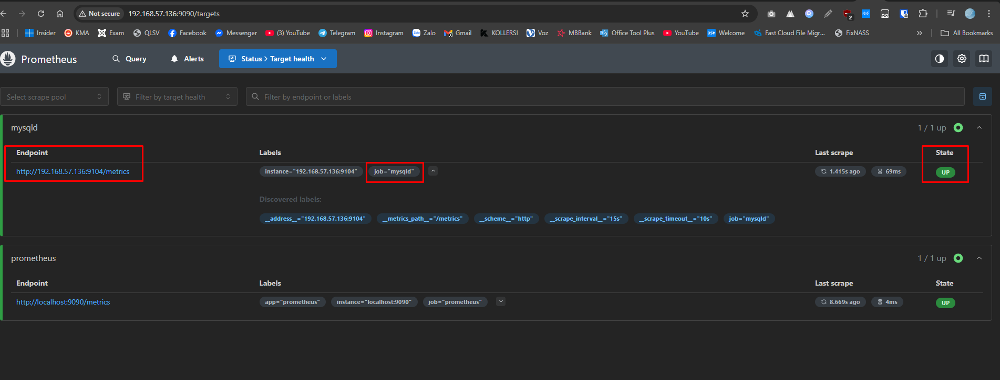
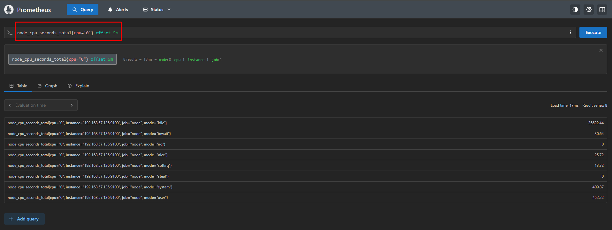

## Triển khai Promethues + Grafana
***
### 1. Tổng quan 
#### 1.1 Promethues
- Prometheus là một dịch vụ theo dõi và cảnh báo về hệ thống. Đây là một dịch vụ mã nguồn mở (Open source) hoàn toàn miễn phí. SoundCloud đã khởi đầu xây dựng Prometheus từ năm 2012. Prometheus đã được rất nhiều hệ thống tin tưởng áp dụng. Dự án có một cộng đồng người đóng góp, phát triển rất tích cực.
- Tính năng quan trọng nhất của Prometheus là thu thập thông số, dữ liệu từ các mục tiêu (dịch vụ) được nhắm đến theo khoảng thời gian nhất định đã được cài đặt trước. Ngoài ra còn các API khác thể hiện được kết quả, đánh giá bằng biểu thức quy tắc và đưa ra cảnh báo. Prometheus còn cung cấp một ngôn ngữ truy vấn rất mạnh PromQL, cực kì hữu ích khi giao tiếp với các dịch vụ monitor khác.
- Một số tính năng của Prometheus
	- Mô hình dữ liệu Time series đặc biệt phù hợp để theo dõi số liệu theo thời gian.
	- Có ngôn ngữ truy vấn riêng PromQL rất mạnh mẽ.
	- Tích hợp tốt với rất nhiềunền tảng ứng dụng.
	- Yêu cầu hạ tầng để triển khai đơn giản.
	- Hỗ trợ Push Gateway (khi làm việc với các dịch vụ tồn tại trong thời gian ngắn và hủy sau khi hoàn thành).
	- Có hỗ trợ Service discovery hoặc cấu hình tĩnh để tìm, nhắm mục tiêu cần theo dõi.
- Một số thuật ngữ quan trọng với Prometheus
	- Time-series Data: là một chuỗi các điểm dữ liệu, thường bao gồm các phép đo liên tiếp được thực hiện từ cùng một nguồn trong một khoảng thời gian.
	- Alert : một cảnh báo (alert) là kết quả của việc đạt điều kiện thoả mãn một rule cảnh báo được cấu hình trong Prometheus. Các cảnh báo sẽ được gửi đến dịch vụ Alertmanager.
	- Alertmanager: chương trình đảm nhận nhiệm vụ tiếp nhận, xử lý các hoạt động cảnh báo.
	- Client Library: một số thư viện hỗ trợ người dùng có thể tự tuỳ chỉnh lập trình phương thức riêng để lấy dữ liệu từ hệ thống và đẩy dữ liệu metric về Prometheus.
	- Endpoint: nguồn dữ liệu của các chỉ số (metric) mà Prometheus sẽ đi lấy thông tin.
	- Exporter: là một chương trình được sử dụng với mục đích thu thập, chuyển đổi các metric không ở dạng kiểu dữ liệu chuẩn Prometheus sang chuẩn dữ liệu Prometheus. Sau đấy exporter sẽ expose web service api chứa thông tin các metrics hoặc đẩy về Prometheus.
	- Instance: một instance là một nhãn (label) dùng để định danh duy nhất cho một target trong một job .
	- Job: là một tập hợp các target chung một nhóm mục đích. Ví dụ: giám sát một nhóm các dịch vụ database,… thì ta gọi đó là một job .
	- PromQL: là viết tắt của Prometheus Query Language, ngôn ngữ này cho phép bạn thực hiện các hoạt động liên quan đến dữ liệu metric.
	- Sample: là một giá trị đơn lẻ tại một thời điểm thời gian trong khoảng thời gian time series.
	- Target: một target là định nghĩa một đối tượng sẽ được Prometheus đi lấy dữ liệu (scrape). Ví dụ như: nhãn nào sẽ được sử dụng cho đối tượng, hình thức chứng thực nào sử dụng hoặc các thông tin cần thiết để quá trình đi lấy dữ liệu ở đối tượng được diễn ra.
- Prometheus giao tiếp với node qua giao thức http/https và lưu trữ data theo dạng time-series database (TSDB).(Time series database (TSDB) là những database được lưu trữ theo các mốc thời gian. Nghĩa là mỗi dữ liệu luôn được gắn với một mốc thời gian nhất đinh từ đó tạo thành chuỗi dữ liêu theo thời gian từ đó giúp chúng ta có thể xem lại dữ liệu cho một khoảng thời gian 1 giờ hay 1 tiếng.)


#### 1.2 Grafana
- Grafana là một nền tảng mã nguồn mở giúp bạn truy vấn, hiển thị, và cảnh báo dữ liệu từ nhiều nguồn khác nhau. Bạn có thể sử dụng Grafana để theo dõi thông tin theo thời gian thực từ nhiều loại dữ liệu khác nhau, như cơ sở dữ liệu thời gian thực (Time Series Database), SQL, NoSQL, hoặc các dịch vụ cloud thông qua các bảng điều khiển (dashboard) có thể tùy chỉnh.
- Grafana Lab đã phát triển rất nhiều công cụ cho cộng đồng, chúng được chia thành các nhóm chính như sau:
	- Bộ công cụ cốt lõi (Grafana stack): Bao gồm LGTM (Loki, Grafana, Tempo, Mimir) và Grafana Agent, dùng để quản lý logs, metrics và tracing.
	- Plugin cho doanh nghiệp: Mở rộng khả năng của Grafana cho các tổ chức lớn.
	- Công cụ xử lý sự cố: Giúp quản lý và khắc phục sự cố nhanh chóng.
	- Các công cụ khác: Tăng cường khả năng giám sát và quản lý hệ thống.
- Grafana là một vizualizer hiển thị các metric dưới dạng các biểu đồ (chart) hoặc đồ thị (graph), được tập hợp lại thành dashboard có tính tùy biến cao, giúp dễ dàng theo dõi tình trạng của node. Đơn giản cho các bạn dễ hiểu là sau khi lấy được metric từ các thiết bị, grafana sẽ sử dụng metric đó để phân tích và tạo ra dashboard mô tả trực quan các metric cần thiết cho việc monitoring như CPU, RAM, disks, IO operations...

### 2. Triển khai và sử dụng
#### 2.1 Cài đặt 
Bài lab này thực hiện triển khai kết hợp Prometheus và Grafana để monitor hệ thống trên Ubuntu 22.04 
##### 2.1.1. Promethues
- Update hệ thống 
```
sudo apt update 
sudo apt upgrade -y
```
- Thêm nhóm và user Prometheus 
```
sudo groupadd --system prometheus
sudo useradd -s /sbin/nologin --system -g prometheus prometheus
```

- Tạo thư mục lưu dữ liệu và cấu hình của Prometheus
```
sudo mkdir /var/lib/prometheus
for i in rules rules.d files_sd; do sudo mkdir -p /etc/prometheus/${i}; done
```

- Tải file cài Prometheus và giải nén 
```
mkdir -p /tmp/prometheus 
 cd /tmp/prometheus
wget https://github.com/prometheus/prometheus/releases/download/v3.3.1/prometheus-3.3.1.linux-amd64.tar.gz
tar xvf prometheus*.tar.gz
cd prometheus*/
``` 


- Di chuyển các file cài Prometheus tới vị trí chuẩn 
```
sudo mv prometheus promtool /usr/local/bin/
sudo mv prometheus.yml  /etc/prometheus/prometheus.yml
```

- Tạo file service Prometheus
```
sudo nano /etc/systemd/system/prometheus.service
```

- Nội dung file 
```
[Unit]
Description=Prometheus
Documentation=https://prometheus.io/docs/introduction/overview/
Wants=network-online.target
After=network-online.target
 
[Service]
Type=simple
Environment="GOMAXPROCS=1"
User=prometheus
Group=prometheus
ExecReload=/bin/kill -HUP $MAINPID
ExecStart=/usr/local/bin/prometheus \
--config.file=/etc/prometheus/prometheus.yml \
--storage.tsdb.path=/var/lib/prometheus \
--web.console.templates=/etc/prometheus/consoles \
--web.console.libraries=/etc/prometheus/console_libraries \
--web.listen-address=0.0.0.0:9090 \
--web.external-url=
 
SyslogIdentifier=prometheus
Restart=always
 
[Install]
WantedBy=multi-user.target
```
- Thay đổi quyền về user, group Prometheus
```
for i in rules rules.d files_sd; do sudo chown -R prometheus:prometheus /etc/prometheus/${i}; done
for i in rules rules.d files_sd; do sudo chmod -R 775 /etc/prometheus/${i}; done
sudo chown -R prometheus:prometheus /var/lib/prometheus/
```

- Khởi động lại systemd Daemon, start service Prometheus và kiểm tra 
```
sudo systemctl daemon-reload
sudo systemctl start prometheus
sudo systemctl enable prometheus
sudo systemctl status prometheus
```

- Kiểm tra hoạt động truy cập `http://192.168.57.136:9090/query`


##### 2.1.2. Grafana
- Cài đặt các gói cần thiết
```
sudo apt-get install -y apt-transport-https software-properties-common wget
```

- Import GPG key 
```
sudo mkdir -p /etc/apt/keyrings/
wget -q -O - https://apt.grafana.com/gpg.key | gpg --dearmor | sudo tee /etc/apt/keyrings/grafana.gpg > /dev/null
```
- Thêm repository 
```
echo "deb [signed-by=/etc/apt/keyrings/grafana.gpg] https://apt.grafana.com stable main" | sudo tee -a /etc/apt/sources.list.d/grafana.list
```

- Update list package
```
sudo apt-get update
```
- Cài đặt Grafana
```
sudo apt-get install grafana -y
```

- Khởi động service 
```
systemctl daemon-reload
systemctl start grafana-server
systemctl status grafana-server
```

- Kiểm tra 
	Truy cập `http://192.168.57.136:3000/login` và đăng nhập với u/p: admin:admin


##### 2.1.3	 Prometheus Node Exporter
- Tải xuống gói cài đặt
```
wget https://github.com/prometheus/node_exporter/releases/download/v1.5.0/node_exporter-1.5.0.linux-arm64.tar.gz
```

- Giải nén và copy binary file trong thư mục đã giải nén tới địa chỉ `/usr/local/bin`
```
tar xvzf node_exporter-1.9.1.linux-amd64.tar.gz
cd node_exporter-1.9.1.linux-amd64/
cp node_exporter /usr/local/bin
```

- Tạo user cho việc quản lý exporter và thiết lập quyền cho binary file
```
sudo useradd -rs /bin/false node_exporter
chown node_exporter:node_exporter /usr/local/bin/node_exporter
```

- Tạo một service cho Node Exporter
```
cd /lib/systemd/system
sudo nano node_exporter.service
```
- Nội dung file service 
```
[Unit]
Description=Node Exporter
After=network-online.target

[Service]
User=node_exporter
Group=node_exporter
Type=simple
ExecStart=/usr/local/bin/node_exporter

[Install]
WantedBy=multi-user.target
```

- Khởi chạy service vừa tạo và kiểm tra trạng thái 
```
sudo systemctl daemon-reload
sudo systemctl start node_exporter
```

- Truy cập `http://192.168.57.136:9100/metrics` thấy đã có dữ liệu

- Cấu hình Endpoint ở file `Prometheus.yaml`
```
nano /etc/prometheus/prometheus.yml
```
- Thêm vào phần cuối file trong `scrape config`
```
  - job_name: "node"
    static_configs:
      - targets: ["localhost:9100"]
```

- Khởi động lại Prometheus để apply 
```
sudo systemctl restart prometheus.service
```

- Truy cập dashboard Prometheus `Status ->Targets` kiểm tra thấy có Endpoint/

##### 2.1.4  Prometheus MySQL Exporter
- Tải xuống gói cài đặt
```
curl -s https://api.github.com/repos/prometheus/mysqld_exporter/releases/latest   | grep browser_download_url   | grep linux-amd64 | cut -d '"' -f 4   | wget -qi -
```

- Giải nén, di chuyển và cấp quyền 
```
tar xvf mysqld_exporter*.tar.gz
sudo mv  mysqld_exporter-*.linux-amd64/mysqld_exporter /usr/local/bin/
sudo chmod +x /usr/local/bin/mysqld_exporter
```

- Kiểm tra
```
mysqld_exporter  --version
```

- Cài đặt mysql và thêm user để lấy dữ liệu 
```
sudo apt install mysql-server -y
```
- Tạo user
```
mysql 
CREATE USER 'mysqld_exporter'@'localhost' IDENTIFIED BY 'StrongPassword';
GRANT PROCESS, REPLICATION CLIENT, SELECT ON *.* TO 'mysqld_exporter'@'localhost';
FLUSH PRIVILEGES;
EXIT
```


 - Tạo file chứa thông số mysql 
 ```
 nano /etc/.mysqld_exporter.cnf
 ```
 - Nội dung file 
 ```
[client]
user=mysqld_exporter
password=StrongPassword
 ```

- Set quyền 
```
sudo chown root:prometheus /etc/.mysqld_exporter.cnf
```

- Tạo service cho mysql exporter để thu dữ liệu
```
sudo nano /etc/systemd/system/mysql_exporter.service
```
- Nội dung file Service
```
[Unit]
Description=Prometheus MySQL Exporter
After=network.target
User=prometheus
Group=prometheus

[Service]
Type=simple
Restart=always
ExecStart=/usr/local/bin/mysqld_exporter \
--config.my-cnf /etc/.mysqld_exporter.cnf \
--collect.global_status \
--collect.info_schema.innodb_metrics \
--collect.auto_increment.columns \
--collect.info_schema.processlist \
--collect.binlog_size \
--collect.info_schema.tablestats \
--collect.global_variables \
--collect.info_schema.query_response_time \
--collect.info_schema.userstats \
--collect.info_schema.tables \
--collect.perf_schema.tablelocks \
--collect.perf_schema.file_events \
--collect.perf_schema.eventswaits \
--collect.perf_schema.indexiowaits \
--collect.perf_schema.tableiowaits \
--collect.slave_status \
--web.listen-address=0.0.0.0:9104

[Install]
WantedBy=multi-user.target
```

- Reload Daemon và khởi chạy mysql_exporter
```
sudo systemctl daemon-reload
sudo systemctl enable mysql_exporter
sudo systemctl start mysql_exporter
sudo systemctl status mysql_exporter
```

- Cấu hình Endpoint ở file `Prometheus.yaml`
```
nano /etc/prometheus/prometheus.yml
```
- Thêm vào phần cuối file trong `scrape config`
```
	- job_name: "mysqld"

		# metrics_path defaults to '/metrics'
		# scheme defaults to 'http'.

		static_configs:
		  - targets: ["192.168.57.136:9104"]
```

- Khởi động lại Prometheus để apply 
```
sudo systemctl restart prometheus.service
```

- Truy cập dashboard Prometheus `Status ->Targets` kiểm tra thấy có Endpoint và có dữ liệu.



#### 2.2 Sử dụng 
##### 2.2.1 Cấu trúc query Promethues
- Prometheus cung cấp một ngôn ngữ truy vấn được gọi là PromQL (Prometheus Query Language) cho phép các user select và aggrerate time series data trong thời gian thực. Kết quả của của một biểu thức chính quy có thể trình bày như một biểu đồ, được xem như tabular data (dữ liệu bảng) trong Prometheus's expression browser hoặc được consumed bởi một ứng dụng khác ngoài hệ thống thông qua API.
- Trong ngôn ngữ biểu thức của Prometheus, một biểu thức hoặc biểu thức con có thể đánh giá thành một trong bốn loại sau:
	* Instant vector  - một tập hợp các chuỗi thời gian chứa một mẫu duy nhất cho mỗi chuỗi thời gian, tất cả đều chia sẻ cùng một dấu thời gian
		- Ví dụ `node_cpu_seconds_total{mode="user"}` : Tổng số giây CPU dành cho xử lý user-space (ứng dụng người dùng), theo từng core. Trả về một tập các time series, mỗi dòng là một core CPU.

	- Range vector - một tập hợp các chuỗi thời gian chứa một phạm vi các điểm dữ liệu theo thời gian cho mỗi chuỗi thời gian
		- Ví dụ `rate(node_cpu_seconds_total{mode="user"}[5m])` :Tốc độ thay đổi (tức là phần trăm sử dụng CPU trong user-space) trung bình mỗi giây trong 5 phút qua. Trả về Instant vector (nhưng được tính từ range vector)

	- Scalar - một giá trị dấu phẩy động số đơn giản
		- Ví dụ `avg(rate(node_cpu_seconds_total{mode="idle"}[5m]))`: Tính phần trăm CPU đang bận rộn (không idle), trung bình trên tất cả CPU. Trả về 1 giá trị đơn lẻ

	- String - một giá trị chuỗi đơn giản; hiện chưa sử dụng
-  Literals
	* String literals
	- Strings cũng có thể được chỉ định như một từ trong cặp dấu ngoặc đơn ('), ngoặc đôi(") hoặc dấu backticks (`).
	- PromQL có các quy tắc giống như Go. Trong dấu ngoặc đơn hoặc ngoặc đôi, dấu \ để bắt đầu ngắt chuỗi, theo sau nó có thể là a, b, f, n, r, t, v hoặc \.
	- Trong dấu backticks (`) không có xử lý escaping (ký từ ngắt chuỗi), Không giống như Go, Prometheus không loại bỏ các dòng mới bên trong backticks.
	Ví dụ:
	```
	"this is a string"
	'these are unescaped: \n \\ \t'
	`these are not unescaped: \n ' " \t`
	```
	* Float literals: Giá trị Scalar float có thể được viết như các chữ số [-](digits)[.(digits)]
	Ví dụ:
	-2.43
- Time series Selectors
	* Instant vector selectors: Instant vector selectors cho phép chọn một chuỗi time series và một giá trị single sample cho mỗi timestamp (instant): dạng đơn gian nhất là chỉ có một metric name được chỉ định. Điều này dẫn đến một instant vector chứa các phần tử cho tất cả các time selectors có metric name này.
	Ví dụ lựa chọn tất cả các Time series có metric name là http_requests_total
	`http_requests_total`
	Nó có thể tiếp tục filter theo các nhãn của nó bằng cách khớp với các nhãn trong cặp dấu ngoặc nhọn `{}`
	`http_requests_total{job="prometheus",group="canary"}`
	Cũng có thể dùng thêm một số các ký hiệu khác để thể hiện match hoặc không match với các label value:
	```
	=: Select labels that are exactly equal to the provided string.
	!=: Select labels that are not equal to the provided string.
	=~: Select labels that regex-match the provided string.
	!~: Select labels that do not regex-match the provided string.
	```
	Ví dụ, query tất các http_requests_total time series với staging, testing, and development environments và HTTP methods khác với GET
	`http_requests_total{environment=~"staging|testing|development",method!="GET"}`
	Lablel matchers khớp với các label values cũng sẽ chọn tất cả các time series không có một bộ label cụ thể nào. Sử dụng regex-matches, nó có thể sẽ match với nhiều các lable name khác nhau.
- Range Vector Selectors: 
	* Thời lượng được chỉ định là một số được biểu diễn trong [], theo sau đó có thể là một trong số các đơn vị sau:
	s - seconds
	m - minutes
	h - hours
	d - days
	w - weeks
	y - years
	Ví dụ, chọn tất cả các giá trị trong 5 phút gần nhất có metric name là http_requests_total	`http_requests_total{job="prometheus"}[5m]`
- Offset modifier: 
	* offset modifier cho phép thay đổi time offset cho các individual instant và range vectors trong một query.
	Ví dụ, expression dưới đây trả về giá trị của http_requests_total 5 phút trước so với thời gian truy vấn hiện tại.
	`node_cpu_seconds_total{cpu='0'} offset 5m`

	Chú ý rằng offset modifier luôn luôn cần những selectors theo ngay sau đó, ví dụ:
	sum(node_cpu_seconds_total{cpu='0'} offset 5m) // GOOD.
	sum(node_cpu_seconds_total{cpu='0'} offset 5m // INVALID.

- Subquery 
	* Subquery cho phép bạn chạy một instant query cho một range và resolution. Kết quả của một subquery là một range vector.
	* Syntax:
	`<instant_query> '[' <range> ':' [<resolution>] ']' [ offset <duration> ]`
	Trong đó: <resolution> có thể có hoặc không. Mặc định thì sẽ sử dụng global interval.
- Operators: Prometheus cho phép nhiều binary và aggreration operators. Nó được miêu tả chi tiết trong [expression language operators page](https://prometheus.io/docs/prometheus/latest/querying/operators/).
-  Functions: Prometheus hỗ trợ một số các functions để operate on data. Nó đưuọc miêu tả chi tiết tại [expression language functions page](https://prometheus.io/docs/prometheus/latest/querying/functions/).
- Operators
	* Binary operators
	- Arithmetic binary operators: Prometheus hỗ trợ một số các binary arithmetic operators dưới đây:
		- + (addition)
		- - (subtraction)
		- * (multiplication)
		- / (division)
		- % (modulo)
		- ^ (power/exponentiation)
	- Binary arithmetic operators được định nghĩa giữa cặp giá trị scalar/scalar, vector/scalar, and vector/vector.
	- Between two scalars là điều hiển nhiên như các phép toán bình thường
	- Between an instant vector and a scalar, operator được áp dụng cho mỗi giá trị data sample trong vector với scalar
	- Between two instant vectors một binary arithmetic operator được áp dụng cho mỗi entry trong vector bên trái và nó matching element với vector phía bên phải. Kết quả là một vector với grouping labels trở thành output label set. Metric name sẽ bị loại bỏ. Entries không match với entry trong right-hand vector thì sẽ không được tìm thấy trong result.
- Comparison binary operators: Prometheus hỗ trợ binary comparison operators sau:
	- == (equal)
	- != (not-equal)
	- >(greater-than)
	- <(less-than)
	- >= (greater-or-equal)
	- <= (less-or-equal)
- Logical/set binary operators: Các logical/set binary operators được định nghĩa chỉ dùng giữa các instant vector:
	- and (intersection)
	- or (union)
	- unless (complement)
- Aggregation operators : prometheus hỗ trợ built-in aggregation operators sử dụng để aggregation các phần tử của một single instant vector, kết quả trong sẽ nằm trong một vector mới ít các phần tử hơn với các giá trị được aggregated:
	- sum (calculate sum over dimensions)
	- min (select minimum over dimensions)
	- max (select maximum over dimensions)
	- avg (calculate the average over dimensions)
	- stddev (calculate population standard deviation over dimensions)
	- stdvar (calculate population standard variance over dimensions)
	- count (count number of elements in the vector)
	- count_values (count number of elements with the same value)
	- bottomk (smallest k elements by sample value)
	- topk (largest k elements by sample value)
	- quantile (calculate φ-quantile (0 ≤ φ ≤ 1) over dimensions)
	* Syntax:
	`<aggr-op>([parameter,] <vector expression>) [without|by (<label list>)]`
	Ví dụ:
	Nếu metric http_requests_total có time series với các labels là application, instance và group, chún ta sẽ tính tổng số các HTTP requests cho mỗi application và group cho tất cả các instance:
	`sum(http_requests_total) without (instance)`
	Hoặc có thể viết như sau:
	`sum(http_requests_total) by (application, group)`
	Nếu muốn tính tổng tất cả các request của HTTP gửi cho tất cả các app thì có thể viết đơn giản như sau:
	`sum(http_requests_total)`
	Để đếm số binaries đang chạy cho mỗi build version có thể viết như sau:
	`count_values("version", build_version)`
	Để lấy 5 request HTTP lớn nhất được tính trong tất cả các instance:
	`topk(5, http_requests_total)`
- Binary operator precedence: Dưới đây là danh sách precedence of binary operators trong Prometheus với độ ưu tiên từ cao tới thấp
```
^
*, /, %
+, -
==, !=, <=, <, >=, >
and, unless
or
```	
	* Các Operators có cùng mức độ ưu tiên sẽ thực hiện lần lượt từ trái qua phải. Ví dụ với biểu thức 2 * 3 % 2 sẽ tương đương như (2 * 3) % 2. Tuy nhiên với ^ thì sẽ thực hiện từ phải qua, ví dụ 2 ^ 3 ^ 2 sẽ tương đương với 2 ^ (3 ^ 2).
- Monitor Server
	* Có thể monitor server Linux thông qua metric của node_exporter
	* Bảng các metric phổ biến để monitor 
	| Metric Name                          | Type    | Description                                                                 |
	|--------------------------------------|---------|-----------------------------------------------------------------------------|
	| node_cpu_seconds_total              | Counter | Total CPU time spent in different modes (user, system, idle, iowait, etc.) |
	| node_memory_MemTotal_bytes          | Gauge   | Total amount of physical memory in bytes                                   |
	| node_memory_MemFree_bytes           | Gauge   | Amount of unused memory in bytes                                           |
	| node_memory_Buffers_bytes           | Gauge   | Amount of memory used as buffers for I/O operations                        |
	| node_memory_Cached_bytes            | Gauge   | Amount of memory used for caching data                                     |
	| node_filesystem_avail_bytes         | Gauge   | Amount of free space available to non-root users on a filesystem in bytes  |
	| node_filesystem_size_bytes          | Gauge   | The total filesystem size in bytes                                         |
	| node_filesystem_free_bytes          | Gauge   | The free space on a filesystem in bytes                                    |
	| node_disk_read_bytes_total          | Counter | Number of bytes read from a disk                                           |
	| node_disk_written_bytes_total       | Counter | Number of bytes written to a disk                                          |
	| node_disk_reads_completed_total     | Counter | Total reads for a partition                                                |
	| node_disk_writes_completed_total    | Counter | Total writes for a partition                                               |
	| node_network_receive_bytes_total    | Counter | Bytes received on a network interface                                      |
	| node_network_transmit_bytes_total   | Counter | Bytes transmitted on a network interface                                   |
	| node_network_receive_packets_total  | Counter | Packets in received traffic                                                |
	| node_network_transmit_packets_total | Counter | Packets in sent traffic                                                    |
	| node_network_receive_drop_total     | Counter | Packets dropped while receiving on a network interface                     |
	| node_network_transmit_drop_total    | Counter | Packets dropped while transmitting on a network interface                  |
- Monitor Mysql
	* Có thể monitor Mysql thông qua metric của mysqld_exporter
	* Bảng các metric phổ biến để monitor 
	| Metric Name                                        | Type    | Description                                                                 |
	|----------------------------------------------------|---------|-----------------------------------------------------------------------------|
	| mysql_up                                           | Gauge   | 1 if MySQL is reachable, 0 otherwise                                        |
	| mysql_version_info                                 | Gauge   | MySQL version, included as labels                                           |
	| mysql_global_status_threads_connected              | Gauge   | Number of currently open connections                                        |
	| mysql_global_status_threads_running                | Gauge   | Number of threads currently executing queries                               |
	| mysql_global_status_connections                    | Counter | Total number of connection attempts since server start                      |
	| mysql_global_status_max_used_connections           | Gauge   | Maximum number of connections used simultaneously                           |
	| mysql_global_status_queries                        | Counter | Total number of statements executed                                         |
	| mysql_global_status_slow_queries                   | Counter | Total number of slow queries detected                                       |
	| mysql_global_status_innodb_buffer_pool_reads       | Counter | Number of reads from disk into the InnoDB buffer pool                       |
	| mysql_global_status_innodb_buffer_pool_read_requests | Counter | Number of logical read requests from InnoDB buffer pool                   |
	| mysql_global_status_innodb_rows_read               | Counter | Total rows read from InnoDB                                                 |
	| mysql_global_status_innodb_rows_inserted           | Counter | Total rows inserted into InnoDB                                             |
	| mysql_global_status_innodb_rows_updated            | Counter | Total rows updated in InnoDB                                                |
	| mysql_global_status_innodb_rows_deleted            | Counter | Total rows deleted from InnoDB                                              |
	| mysql_global_variables_max_connections             | Gauge   | Value of the MySQL `max_connections` variable                               |
	| mysql_global_variables_innodb_buffer_pool_size     | Gauge   | Size of the InnoDB buffer pool in bytes                                     |
	| mysql_global_status_handler_read_rnd               | Counter | Number of random reads (often indicates missing indexes)                    |
	| mysql_global_status_handler_read_first             | Counter | Number of times reading the first row from an index (full table scan)       |

- Graph with grafana 
	* Cấu hình nguồn data prometheus 
	Truy cập `http://192.168.57.136:3000/login` và đăng nhập với u/p: admin:admin. Phần `connection` chọn `add new connection`

	Tìm Prometheus và chọn Add


	Phần cấu hình điền đường dẫn tới Prometheus

	Save


## References 
https://prometheus.io/docs/introduction/overview/
https://viblo.asia/p/prometheus-la-gi-924lJ3805PM
https://wiki.nhanhoa.com/kb/cai-dat-prometheus-tren-ubuntu-22-04/
https://prometheus.io/docs/prometheus/latest/querying/basics/