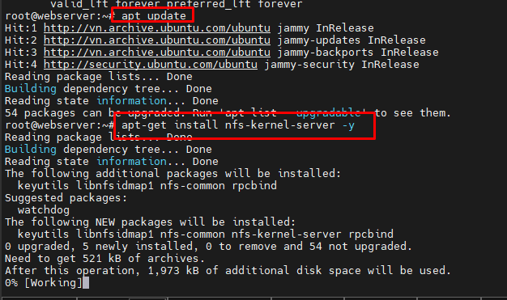
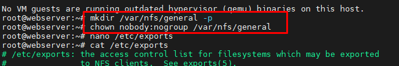
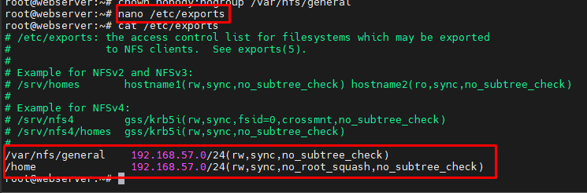
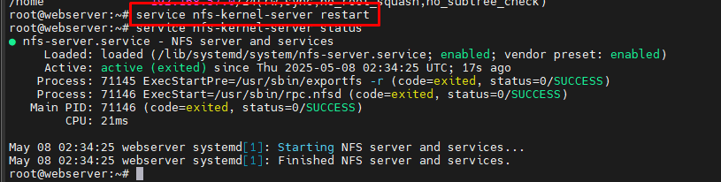
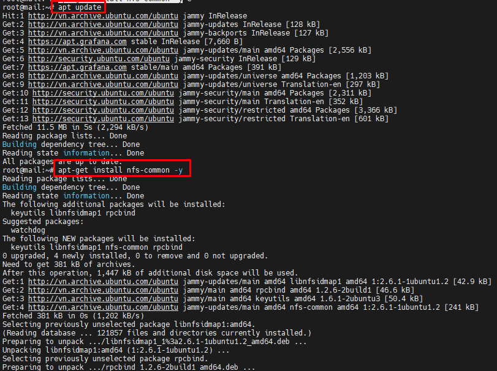

## NFS
### 1. Tìm hiểu NFS server
- NFS - Network File System là một giao thức phân phối file system, nó cho phép bạn mount các thư mục từ xa có trên server.
- NFS được phát triển bởi SUN Microsystem, bắt đầu từ năm 1984 với phiên bản đầu tiên.
- Cho đến nay đã có tất cả 6 phiên bản:
  - version 1: phát hành năm 1984 với mục đích thí nghiệm
  - version 2: phát hành năm 1989, được đưa ra thị trường
  - version 3: phát hành năm 1995 với nhiều cải tiến
  - version 4 năm 2000, version 4.1 năm 2010 và version 4.2 năm 2016
- Cho phép bạn quản lý không gian lưu trữ ở một nơi khác và ghi vào không gian lưu trữ này từ nhiều clients.
- NFS cung cấp một cách tương đối nhanh chóng và dễ dàng để truy cập vào các hệ thống từ xa qua mạng và hoạt động tốt trong các tình huống mà các tài nguyên chia sẻ sẽ được truy cập thường xuyên.
- Dung lượng file mà NFS cho phép client truy cập lớn hơn 2GB
- Truyền thông giữa client và server thực hiện qua mạng Ethernet
- Client và Server sử dụng RPC (Remote Procedure Call) để giao tiếp với nhau.
- NFS sử dụng cổng 2049
- NFS hoạt động theo mô hình client/server. Một server đóng vai trò storage system, cho phép nhiều client kết nối tới để sử dụng dịch vụ.

### 2. Cài đặt dịch vụ và Kết nối nfs client với nfs serer
Bài lab thực hiện Ubuntu Server 22.04 64-bit.
- Gồm hai VM:
  - 1 vm đóng vai trò Host server, với IP: 192.168.57.132/24
  - 1 vm đóng vai trò client, với IP: 192.168.57.136/24
#### 2.1 Trên máy host server 
- 1. Cài đặt các thành phần
```
apt-get update
apt-get install nfs-kernel-server -y
```
 
- 2. Tạo `Share Directories`
  - Tạo thư mục
    
    ```
    mkdir /var/nfs/general -p
    ```
    
  - Thay đổi ownership thư mục trên
  
    ```
    chown nobody:nogroup /var/nfs/general
    ```
 

- 3. Cấu hình NFS Exports trên Host server. Thêm dòng sau vào file `/etc/exports`

  ```
  /var/nfs/general    192.168.57.0/24(rw,sync,no_subtree_check)
  /home               192.168.57.0/24(rw,sync,no_root_squash,no_subtree_check)
  ```
  - **/var/nfs/general** đây là thư mục mà chúng ta đã tạo ở trên.
  - **192.168.57.0/24** cho phép clients trong mạng 192.168.57.0 có thể truy cập vào
  - **rw** cho phép client truy cập vào có khả năng đọc và ghi.
  - **sync** option này buộc NFS ghi lại các thay đổi vào disk trước khi trả lời. Điều này dẫn đến một môi trường ổn định hơn và nhất quán vì phản hồi phản ánh tình trạng thực tế của remote volume. Tuy nhiên, nó cũng làm giảm tốc độ hoạt động của file.
  - **no_subtree_check** Tùy chọn này ngăn việc kiểm tra subtree, đó là một tiến trình mà host phải kiểm tra xem liệu tệp đó có thực sự vẫn còn trong cây export cho mọi yêu cầu hay không. Điều này có thể gây ra nhiều vấn đề khi một tập tin được đổi tên trong khi client đã mở nó. Trong hầu hết các trường hợp, tốt hơn là để vô hiệu hóa việc kiểm tra subtree.
  - **no_root_squash** Nếu từ client đăng nhập bằng tài khoản root, từ phía server sẽ chuyển vào non-privileged user trên server. Điều này vì lý do bảo mật.


- 4. Restart dịch vụ

  ```
  service nfs-kernel-server restart
  ```

 
 #### 2.2 Cài đặt trên client
- 1. Cài đặt các gói

  ```
  apt-get update
  apt-get install nfs-common -y
  ```

  
- 2. Tạo Mount point

  ```
  mkdir -p /nfs/general
  ```
  
- 3. Mount thư mục cho client

  ```
  mount 192.168.57.132:/var/nfs/general /nfs/general
  ```
  
- Kiểm tra kết quả mount

  ```
df -h
   ```