## LVM 
***
## Table of Contents

  - [LVM](#lvm)
    - [1. Tìm hiểu về LVM](#1.-tìm-hiểu-về-lvm)
    - [2. Sử dụng LVM](#2.-sử-dụng-lvm)
      - [2.1 Tạo partition](#2.1-tạo-partition)
      - [2.2 Tạo physical volume](#2.2-tạo-physical-volume)
      - [2.3 Tạo volume group.](#2.3-tạo-volume-group.)
      - [2.4 Tạo logical volume.](#2.4-tạo-logical-volume.)
      - [2.5 Tạo filesystem trên logical volume.](#2.5-tạo-filesystem-trên-logical-volume.)
      - [2.6 Chỉnh sửa fstab để tự động mount phân vùng.](#2.6-chỉnh-sửa-fstab-để-tự-động-mount-phân-vùng.)
      - [2.7 Mở rộng logical volume.](#2.7-mở-rộng-logical-volume.)
      - [2.8 Thêm ổ cứng mở rộng logical volume.](#2.8-thêm-ổ-cứng-mở-rộng-logical-volume.)
      - [2.9 Out/ thay thế 1 ổ cứng ra khỏi hệ thống LVM](#2.9-out/-thay-thế-1-ổ-cứng-ra-khỏi-hệ-thống-lvm)
      - [2.10 Xóa logical volume, xóa volume group, xóa physical volume](#2.10-xóa-logical-volume,-xóa-volume-group,-xóa-physical-volume)
  - [References](#references)

### 1. Tìm hiểu về LVM 
- Logical Volume Manager (LVM) : LVM là kỹ thuật quản lý việc thay đổi kích thước lưu trữ của ổ cứng. Là một phương pháp ấn định không gian ổ đĩa thành những logicalvolume khiến cho việc thay đổi kích thước của một phân vùng trở nên dễ dàng. Điều này thật dễ dàng khi bạn muốn quản lý công việc của mình tại riêng một phân vùng mà muốn mở rộng nó ra lớn hơn.
- Một số khái niệm liên quan:
	- Physical volume (Pv): là một đĩa cứng vật lý hoặc là partition
	- Volume group (Vg): là một nhóm các physical volume ( ổ đĩa ảo )
	- Logical volume(Lv): là các phân vùng ảo của ổ đĩa ảo
- Ưu điểm :
	- Không để hệ thống bị gián đoạn hoạt động
	- Không làm hỏng dịch vụ
	- Có thể kết hợp swap
	- Có thể tạo ra các vùng dung lượng lớn nhỏ tuỳ ý.
- Nhược điểm:
	- Các bước thiết lập phức tạp và khó khăn hơn
	- Càng gắn nhiều đĩa cứng và thiết lập càng nhiều LVM thì hệ thống khởi động càng lâu.
	- Khả năng mất dữ liệu cao khi một trong số các đĩa cứng bị hỏng. Windows không thể nhận ra vùng dữ liệu của LVM. Nếu Dual-boot ,Windows sẽ không thể truy cập dữ liệu trong LVM
	
- Những thành phần trong LVM
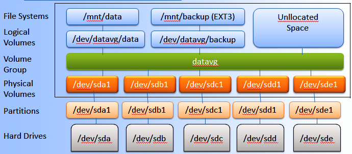
	- Hard drives – Drives: Thiết bị lưu trữ dữ liệu.
	- Partitions: Là các phân vùng của Hard drives, mỗi Hard drives có 4 partition, trong đó partition bao gồm 2 loại là primary partition và extended partition
		- Primary partition: Phân vùng chính, có thể khởi động Mỗi đĩa cứng có thể có tối đa 4 phân vùng này
		- Extended partition: Phân vùng mở rộng, có thể tạo những vùng luân lý
		- Physical Volumes: Là một cách gọi khác của partition trong kỹ thuật LVM, nó là những thành phần cơ bản được sử dụng bởi LVM. Một Physical Volume không thể mở rộng ra ngoài phạm vi một ổ đĩa.
	- Volume Group: Nhiều Physical Volume trên những ổ đĩa khác nhau được kết hợp lại thành một Volume Group
	- Logical volume: Volume Group được chia nhỏ thành nhiều Logical Volume, mỗi Logical Volume có ý nghĩa tương tự như partition. Nó được dùng cho các mount point và được format với những định dạng khác nhau như ext2, ext3, ext4,…
	- File Systems
		- Tổ chức và kiểm soát các tập tin
		- Được lưu trữ trên ổ đĩa cho phép truy cập nhanh chóng và an toàn
		- Sắp xếp dữ liệu trên đĩa cứng máy tính
		- Quản lý vị trí vật lý của mọi thành phần dữ liệu
- Cách thức hoạt động các tầng của LVM:
	- Tầng đầu tiên : hard drives là tầng các disk ban đầu khi chưa chia phân vùng
	- Partitions: Sau đó ta chia các disk ra thành các phân vùng nhỏ hơn
	- Physical volume : từ một partitions ta sẽ tạo ra được một physical
	- Group volume : Ta sẽ ghép nhiều physical volume thành một group volume
	- Logical volume : Ta sẽ có thể tạo ra được logical volume
### 2. Sử dụng LVM 
- Bài lab thực hiện sử dụng LVM với Ubuntu Server 22.04 trong môi trường VMWARE với 03 ổ cứng gắn kèm thêm 
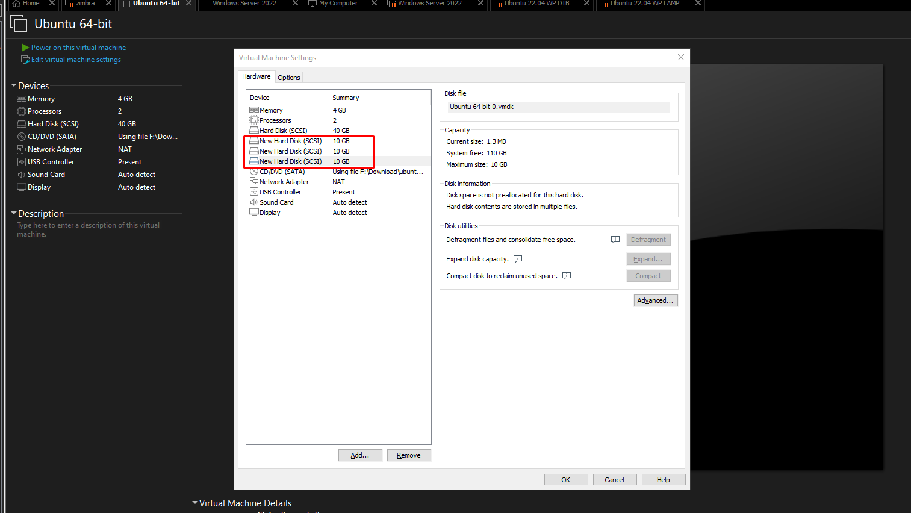

- Kiểm tra các Hard Drives có trên hệ thống: Bạn có thể kiểm tra xem có những Hard Drives nào trên hệ thống bằng cách sử dụng câu lệnh lsblk
```
lsblk
``` 
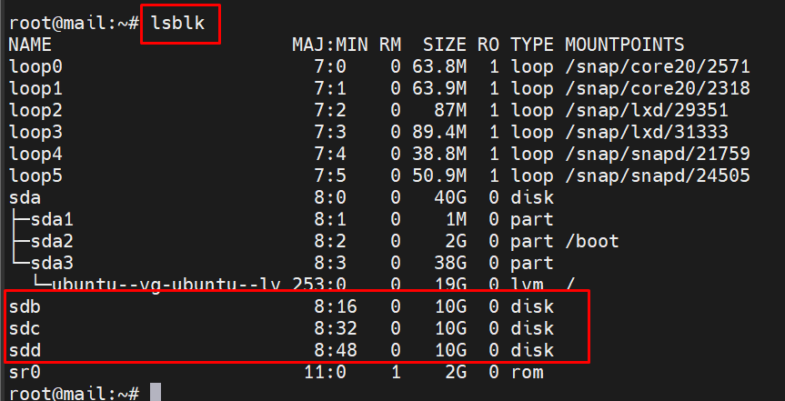
	- Trong đó các sdb, sdc, sdd là các hard disks thêm vào.	
#### 2.1 Tạo partition 
- Từ sdb và sdc khởi tạo bằng cách sử dụng lệnh
```
fdisk /dev/sdb 
```
- Tiếp tục thay đổi định dạng của partition vừa mới tạo thành LVM:
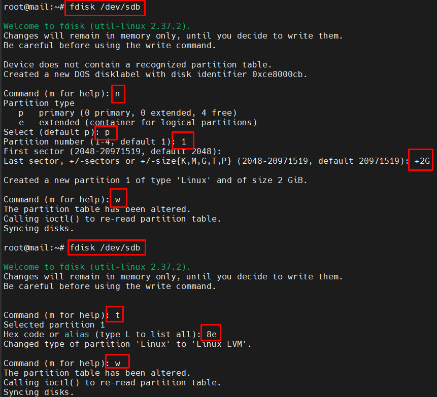
- Làm tương tự với sdc thu được 2 partition sdb1 sdc1
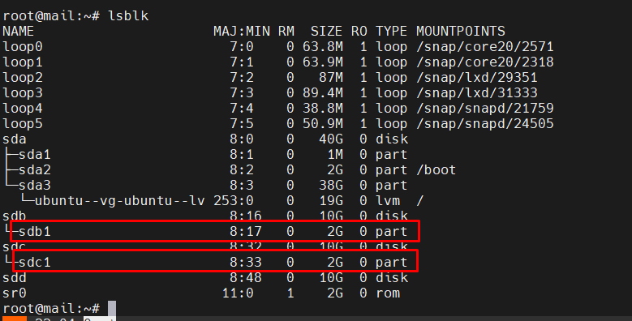
#### 2.2 Tạo physical volume 
- Từ các partition sdb1 sdc1 tiến hành khởi tạo
```
sudo pvcreate /dev/sdb1 /dev/sdc1
```
- Kiểm tra bằng lệnh `sudo pvs`
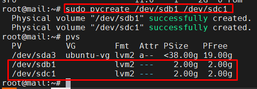

#### 2.3 Tạo volume group.
```
vgcreate vg_anth1 /dev/sdb1 /dev/sdc1
```
- Kiểm tra bằng lệnh `vgs`
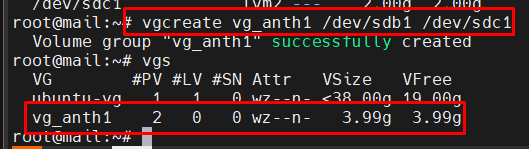
	
#### 2.4 Tạo logical volume.
```
lvcreate -L size_volume -n (ten logical) (tên group volume)
```
-L: Chỉ ra dung lượng của logical volume
-n: Chỉ ra tên của logical volume
- Ví dụ trong lab này thực hiện tạo 2 lv có tên `lv-demo1` `lv-demo2` từ vg `vg_anth1` mỗi lv có dung lượng 1g
```
lvcreate -L 1G -n lv-demo1 vg_anth1
lvcreate -L 1G -n lv-demo2 vg_anth1
```
- Kiểm tra bằng lệnh `lvs`
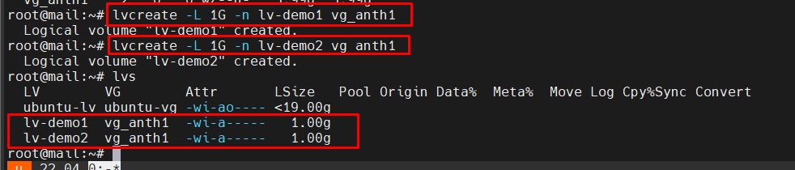

#### 2.5 Tạo filesystem trên logical volume. 
- Ví dụ với lv-demo1
```
mkfs -t ext4 /dev/vg_anth1/lv-demo1
```
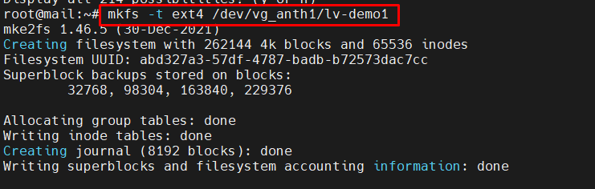

#### 2.6 Chỉnh sửa fstab để tự động mount phân vùng.
- Mount và sử dụng
	```
	mkdir demo1
	mount /dev/vg_anth1/lv-demo1 demo1
	````
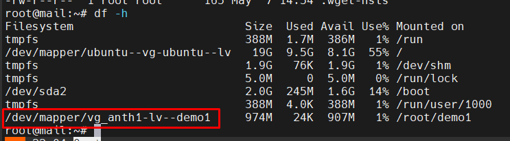
- Sửa fstab thêm dòng  cấu hình để tự động mount
	```
	echo '/dev/vg_anth1/lv-demo1 /mnt/demo1 ext4 defaults 0 2' | sudo tee -a /etc/fstab
	```
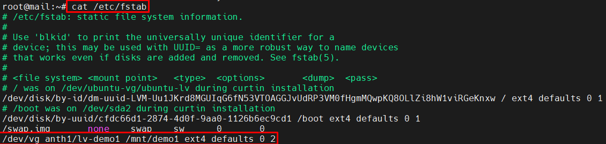

#### 2.7 Mở rộng logical volume.
- Để mở rộng lv cần đảm bảo vg còn dung lượng trống, kiểm tra bằng lệnh `vgs`
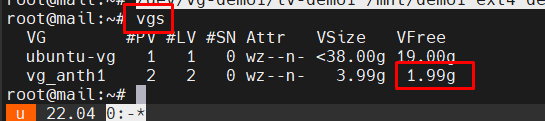
- Trong TH này vg còn dư 1.99G có thể mở rộng lv với dung lượng lấy từ vg. Thêm toàn bộ dung lượng còn free vào lv. Sau khi thêm cần resize để hệ thống nhận dung lượng mới thêm. 
	```
	lvextend -l +100%FREE /dev/vg_anth1/lv-demo1
	resize2fs /dev/vg_anth1/lv-demo1
	```
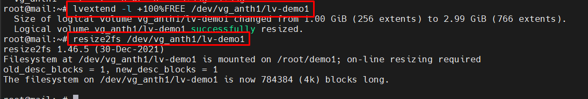
	
#### 2.8 Thêm ổ cứng mở rộng logical volume.
- Thực hiện tạo partition và physical volume từ disk /dev/sdd
	```
	fdisk /dev/sdd
	sudo pvcreate /dev/sdd1 
	```
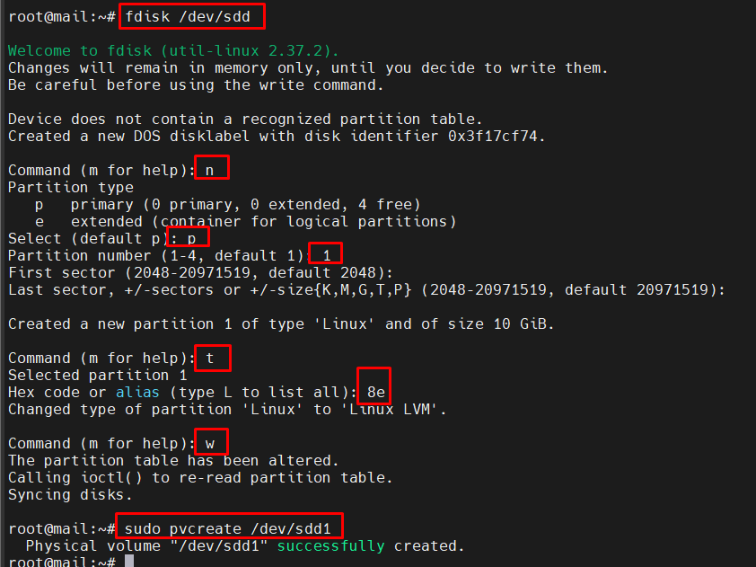
	
- Extend pv vừa tạo vào vg 
	```
	vgextend vg_anth1 /dev/sdd1
	```
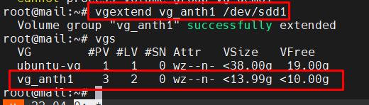
- Mở rộng lv bằng lệnh 
	```
	lvextend -l +100%FREE /dev/vg_anth1/lv-demo1
	resize2fs /dev/vg_anth1/lv-demo1
	```
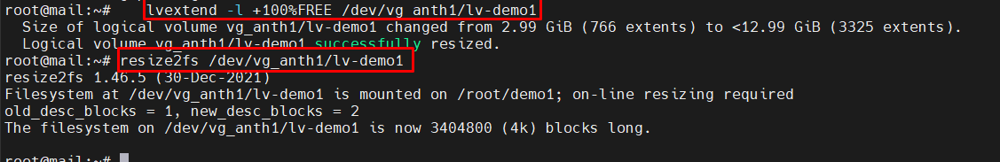
	
#### 2.9 Out/ thay thế 1 ổ cứng ra khỏi hệ thống LVM
- Di chuyển dữ liệu khỏi ổ
	```
	sudo pvmove /dev/sdb1
	```
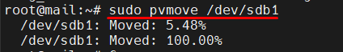
- Gỡ khỏi Volume Group:
	```
	sudo vgreduce vg_anth1 /dev/sdb1
	```
- Sử dụng cho mục đích khác hoặc xóa partition Volumes
	```
	sudo pvremove /dev/sdb1
	```
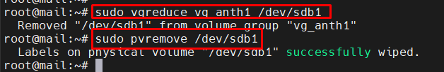

#### 2.10 Xóa logical volume, xóa volume group, xóa physical volume
- Xóa Logical Volume: Trước tiên ta phải Umount Logical Volume
```
umount /dev/vg_anth1/lv-demo1
```
- Sau đó tiến hành xóa Logical Volume bằng câu lệnh sau:
```
lvremove /dev/vg_anth1/lv-demo1
```
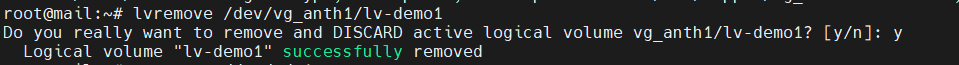
- Xóa Volume Group: Xóa Volume Group bằng cách sử dụng lệnh sau:
```
vgremove /dev/vg-demo1
```
- Xóa Physical Volume bằng lệnh sau 
```
pvremove /dev/sdc1
pvremove /dev/sdd1
```
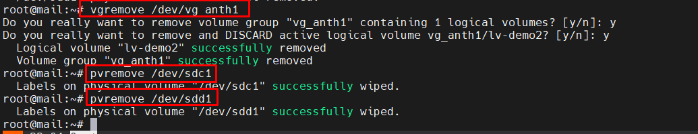

## References 
1. [Extend/Reduce LVM’s](https://www.tecmint.com/extend-and-reduce-lvms-in-linux/)
2. [LVM in Linux](https://medium.com/@yhakimi/lvm-how-to-create-and-extend-a-logical-volume-in-linux-9744f27eacfe)
3. [An Introduction to LVM Concepts, Terminology, and Operations](https://www.digitalocean.com/community/tutorials/an-introduction-to-lvm-concepts-terminology-and-operations)