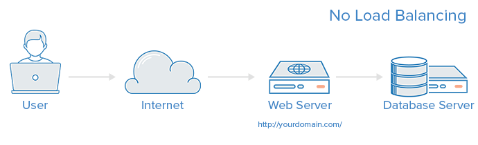

## Tìm hiểu, triển khai HAProxy
***
## Table of Contents

  - [Tìm hiểu, triển khai HAProxy](#tìm-hiểu,-triển-khai-haproxy)
    - [1. Tổng quan về giải pháp HAProxy:](#1.-tổng-quan-về-giải-pháp-haproxy:)
      - [1.1 Thuật ngữ sử dụng trong HAProxy (Proxy, ACL, Backend, Frontend, Sticky Sessions...)](#1.1-thuật-ngữ-sử-dụng-trong-haproxy-(proxy,-acl,-backend,-frontend,-sticky-sessions...))
      - [1.2 Các kiểu load balancing](#1.2-các-kiểu-load-balancing)
        - [1.2.1 No Load Balancing](#1.2.1-no-load-balancing)
        - [1.2.2 Layer 4 Load Balancing](#1.2.2-layer-4-load-balancing)
        - [1.2.3 Layer 7 Load Balancing](#1.2.3-layer-7-load-balancing)
        - [1.2.4 Global Server Load Balancing (GSLB)](#1.2.4-global-server-load-balancing-(gslb))
        - [1.2.5 Container Load Balancing](#1.2.5-container-load-balancing)
        - [1.2.6 Cloud Load Balancing](#1.2.6-cloud-load-balancing)
      - [1.3 Các giải thuật cân bằng tải phổ biến](#1.3-các-giải-thuật-cân-bằng-tải-phổ-biến)
        - [1.3.1 Round robin (roundrobin)](#1.3.1-round-robin-(roundrobin))
        - [1.3.2 Least connections (leastconn)](#1.3.2-least-connections-(leastconn))
        - [1.3.3 IP Hash (source)](#1.3.3-ip-hash-(source))
      - [1.4 High Availability (HA)](#1.4-high-availability-(ha))
      - [1.5 Tìm hiểu file cấu hình HAProxy](#1.5-tìm-hiểu-file-cấu-hình-haproxy)
      - [1.5 Keepalive](#1.5-keepalive)
        - [1.5.1 Tổng quan](#1.5.1-tổng-quan)
        - [1.5.2 Keepalived Configuration File](#1.5.2-keepalived-configuration-file)
    - [2. Cài đặt triển khai HAProxy + Keepalive](#2.-cài-đặt-triển-khai-haproxy-+-keepalive)
      - [2.1 Cài đặt HAProxy, KeepAlived, Apache2 trên cả 2 VM](#2.1-cài-đặt-haproxy,-keepalived,-apache2-trên-cả-2-vm)
      - [2.2 Cấu hình HaProxy](#2.2-cấu-hình-haproxy)
      - [2.3 Cấu hình keepalived](#2.3-cấu-hình-keepalived)
      - [2.4 Kiểm tra](#2.4-kiểm-tra)
  - [References](#references)

### 1. Tổng quan về giải pháp HAProxy: 
- HAProxy là viết tắt của High Availability Proxy. Đây là một công cụ mã nguồn mở ứng dụng cho giải pháp cân bằng tải TCP và HTTP đóng vai trò quan trọng.
- High Availability hay còn được gọi là HA có nghĩa là “Độ sẵn sàng cao“, những máy chủ, thiết bị loại này luôn luôn sẵn sàng phục vụ, người sử dụng không cảm thấy nó bị trục trặc, hỏng hóc gây gián đoạn. Để đảm bảo được điều đó, tối thiểu có một cặp máy, thiết bị chạy song song, liên tục liên lạc với nhau, cái chính hỏng, cái phụ sẽ lập tức biết và tự động thay thế. Một ví dụ đơn giản nhất là một số máy chủ có hai bộ nguồn, tự động thay thế nóng cho nhau.
- Load Balancing hay cân bằng tải là một phương pháp phân phối khối lượng tải trên nhiều máy tính hoặc một cụm máy tính để có thể sử dụng tối ưu các nguồn lực, tối đa hóa thông lượng, giảm thời gian đáp ứng và tránh tình trạng quá tải trên máy chủ.
- HAProxy thường được kết hợp với KeepAlive để tạo thành một giải pháp HA rất hiệu quả với giá thành thấp.

#### 1.1 Thuật ngữ sử dụng trong HAProxy (Proxy, ACL, Backend, Frontend, Sticky Sessions...)
#####1.1.1 Proxy
- Proxy là 1 internet server làm nhiệm vụ chuyển tiếp, kiểm soát thông tin giữa client và server, proxy có 1 địa chỉ IP và 1 port cố định. Cách thức hoạt động: tất cả các yêu cầu từ client gửi đến server trước hết phải thông qua proxy, proxy kiếm tra xem yêu cầu nếu được phép sẽ gửi đến server và cũng tương tự cho server.
	– Forward proxy: Là khái niệm proxy chúng ta dùng hàng ngày, nó là thiết bị đứng giữa 1 client và tất cả các server mà client đó muốn truy cập vào.
	– Reverse proxy: là 1 proxy ngược, nó đứng giữa 1 server và tất cả các client và server mà server đó phục vụ, tương tự 1 nhà ga kiêm 1 trạm kiểm soát, các yêu cầu từ client gửi lên server bắt buộc phải ghé vào reverse proxy, tại đây yêu cầu sẽ được kiếm soát, lọc bỏ, và luân chuyển đến server. Ưu điểm của nó là khả năng quản lý tập trung, giúp chúng ta có thể kiếm soát mọi yêu cầu do client gửi lên server mà chúng ta cần bảo vệ.
- Access Control List (ACL)
	- ACLs được dùng để test 1 vài điều kiện và thực hiện hành động (chọn server, block 1 request...) dựa vào kết quả kiểm tra. Sử dụng ACLs cho phép forward linh hoạt các network traffic dựa vào cac nhân tố như pattern-matching và một số kết nối tới backend.
		- VD : acl url_blog path_beg /blog - ACL sẽ match nếu như phần request của user bắt đầu với /blog, nó sẽ match với request của http://yourdomain.com/blog/blog-entry-1
- Backend Backend 
	- là tập hợp của các server mà nhận được request. Các backed được định nghĩa trong section "backend" của file cấu hình HAProxy. Trong phần lớn form cơ bản, 1 backend được định nghĩa bởi : thuật toán cân bằng tải nào được dùng danh sách các server và port
	- Một backend có thể chưa một hoặc nhiều server trong nó, thêm nhiều server vào backend của bạn sẽ tiềm năng công suốt tải bằng việc phân bố tải tới các server. Trong trường hợp các backend server có thể không khả dụng, việc này sẽ làm tăng độ tin cậy.
	- VD : Cấu hình 2 backend, web-backend và blog-backend với 2 web server :
```
	backend web-backend
	   balance roundrobin
	   server web1 web1.yourdomain.com:80 check
	   server web2 web2.yourdomain.com:80 check

	backend blog-backend
	   balance roundrobin
	   mode http
	   server blog1 blog1.yourdomain.com:80 check
	   server blog1 blog1.yourdomain.com:80 check
	   
```
	- Thuật toán sử dụng là roundrobin, "mode http" chỉ ra rằng layer 7 proxying đuợc dùng. option "check" chỉ ra rằng các check sẽ được thực hiện ở các server này.
- Frontend
	- Frontend được dùng để định nghĩa cách mà các request được điều hướng cho backend. Frontend được định nghĩa trong mục frontend của HAProxy configuration. Các cấu hình cho frontend gồm:
		- Một bộ địa chỉ IP và port (ví dụ: 10.0.0.1:8080, *:443,...)
		- Các ACL do người dùng định nghĩa
		- Backend được dùng để nhận request
		- Một ví dụ cấu hình của frontend trong file configuration của HAProxy:
```
frontend web
  bind 0.0.0.0
  default_backend web-backend

frontend forum
  bind 0.0.0.0:8080
  default_backend forum
```
- Sticky Sessions: 
	- Trong môi trường web, nhiều khi chúng ta cần cố định session của user, như để duy trì trạng thái login. Khi đó, chúng ta cần cố định session trên một server  
	- HAProxy hỗ trợ một số thuật toán Load Balancing duy trì trạng thái kết nối mà cho phép cố định session như hdr, rdp-cookie, source, uri hoặc url_param. Ví dụ:
```
backend cms
    balance source
    hash-type consistent
    server web1 192.168.10.110:8080 check
    server web2 192.168.10.111:8080 check
    server web3 192.168.10.112:8080 check
```
	- Nếu muốn cố định session mà vẫn sử dụng các thuật toán load balancing như roundrobin, leastconn, hoặc static-rr, khi đó sử dụng “Sticky Session”. Sticky session cho phép cố định session của users mà sử dụng cookie, và HAProxy sẽ điều phối để luôn request từ một user đến cùng một server.  
	- HAProxy có thể lưu cookie trong trình duyệt của người dùng để ghi nhớ máy chủ nào sẽ gửi lại cho họ. Cookie sẽ chứa unique ID của server và được đảm bảo chỉ thuộc về một người dùng duy nhất, sẽ cung cấp thông tin chính xác để thực hiện cố định phiên (sticky sessions).  
#### 1.2 Các kiểu load balancing
##### 1.2.1 No Load Balancing 

- Đây là một mô hình cơ bản nhất cho một ứng dụng web, thường được áp dụng trong môi trường có số lượng người dùng ít hoặc không có, sử dụng cho mục đích thử nghiệm hoặc phát triển.
- Với mô hình này, người dùng sẽ kết nối trực tiếp với web server tại (yourdoamain.com) mà không sử dụng cân bằng tải. Khi không sử dụng cân bằng tải sẽ dẫn đến một số rủi do:
	- Nếu máy chủ chạy website hoặc chạy phần mềm của công ty cung cấp gặp sự cố, trục trặc thì người dùng sẽ không kết nối được đến ứng dụng web, tất cả công việc ở công ty đều bị đình trệ, để chuyển đổi sang một máy chủ backup thì cũng phải mất rất nhiều thời gian, làm delay nhiều công việc.
	- Khi nhiều kết nối vào một máy chủ làm cho máy chủ đó quá tải nhưng các máy chủ khác/dự phòng lại không chạy gì cả, như thế sẽ không sử dụng hết hiệu năng gây lãng phí tài nguyên và tốc độ truy cập lại bị giảm sút
	- Hệ thống sẽ giảm tính bảo mật vì người dùng có thể truy cập trực tiếp vào máy chủ
- Vì thế sử dụng cân bằng tải là cần thiết
##### 1.2.2 Layer 4 Load Balancing

- Cách đơn giản nhất để có thể cân bằng tải tới nhiều server là sử dụng cân bằng tải trên tầng 4. Theo hướng này thì các request sẽ được điều hướng dựa trên khoảng địa chỉ IP và cổng (ví dụ một request tới địa chỉ http:://www.example.com/something sẽ được điều hướng tới backend được dùng để điều hướng cho domain example.com với cổng 80)
- Phân chia lưu lượng truy cập giữa các địa chỉ IP, switches, routers sử dụng thiết bị một cách hiệu quả và nâng cao tính ổn định
- Các cấu hình này sẽ được thực hiện ở tầng Transport, do đó, Network Load Balancing còn được gọi với tên Layer 4 Load Balancing (Cân bằng tải tại tầng 4).
- Việc sử dụng cân bằng tải ở tầng 4 (Layer 4 Load Balancing) để có thể cân bằng tải tới nhiều server. Thì các request sẽ được điều hướng dựa trên địa chỉ IP và port. Ví dụ có một request đến example.com/something sẽ được điều hướng tới backend được dùng để điều hướng cho doamin example.com với port 80.
##### 1.2.3 Layer 7 Load Balancing 

- Cân bằng tải tại tầng 7 là cách cân bằng tải phức tạp nhất và cũng là cách cân bằng tải có nhiều tùy biến nhất. Sử dụng cân bằng tải tại tầng 7, ta có thể điều hướng request dựa trên nội dụng của request đó. Với kiểu câng bằng tải này, nhiều backend có thể được sử dụng cho dùng một domain và port.
- Mục tiêu là phân chia khối lượng công việc ra nhiều máy chủ dựa theo năng lực và tính khả dụng của chúng. Server Load Balancing dựa vào các thông tin ở tầng Application để điều hướng truy cập. Server Load Balancing còn được biết đến như Layer 7 Load Balancing (Cân bằng tải tại tầng 7).
- Đây là cân bằng tải phức tạp nhất nhưng có nhiều tùy biến. Với việc sử dụng cân bằng tải tại tầng 7, có thể điều hướng các request dựa trên thông tin và nội dung của request đó. Cân bằng tải tầng 7 với nhiều backend có thể dùng một domain và port.
- Ví dụ, một người dùng request tới example.com/something, request đó sẽ được điều hướng đến một backend chuyên dụng cho something.
```
frontend web
    bind *:80
    mode http
    
    acl something_url   path    /something
    use_backend something-server if something_url
    
    default_backend web-backend
```
##### 1.2.4 Global Server Load Balancing (GSLB)
- Trong Global Server Load Balancing, một trung tâm điều hành sẽ xử lý việc cân bằng tải giữa khắp nơi trên toàn thế giới thông qua một loạt những thiết bị câng bằng tải Layer 4 và Layer 7
- Trong việc triển khai GSLB, thường sẽ có các thiết bị ADC ở cấp độ toàn cầu lẫn cục bộ, nơi lưu lượng truy cập được phân phối đến.
##### 1.2.5 Container Load Balancing
- Container Load Balancing cung cấp các phiên bản ảo hóa, riêng biệt. Phổ biến nhất hiện nay là hệ thống Kubernetes orchestration, hệ thống này có thể phân chia load giữa các container pods với nhau để giúp nâng cao tính sẵn sàng.
##### 1.2.6 Cloud Load Balancing
- Trong hạ tầng Cloud, có tương đối nhiều lựa chọn cho việc cân bằng tải. Cloud Load Balancing bao gồm cả Network Load Balancing (Layer-4) và Application Load Balancing (Layer-7)

#### 1.3 Các giải thuật cân bằng tải phổ biến
- Các thuật toán cân bằng tải phổ biến được sử dụng gồm: roundrobin, leastconn, source
##### 1.3.1 Round robin (roundrobin)
- Là thuật toán điều phối vòng tròn, các máy chủ sẽ được xem ngang hàng và sắp xếp theo một vòng quay. Các truy vấn dịch vụ sẽ lần lượt được gửi tới các máy chủ theo thứ tự sắp xếp  
- roundrobin là thuật toán được sử dụng mặc định load balancing khi không có thuật toán nào được chỉ định,
- Ví dụ khi cấu hình phần backend trong HAProxy - HAProxy Configuration File, balance sẽ được thêm thuật toán cân bằng tải để kiểm soát cách HAProxy nhận, điều phối request tới các backend server. Nhưng khi không cấu hình cho balance thì mặc định sẽ là thuật toán roundrobin:
```
backend web-backend
    option httplog
    option forwardfor
    server web1 192.168.1.110:8080 check
    server web2 192.168.1.111:8080 check
    server web3 192.168.1.112:8080 check
```
- Dựa vào khả năng xử lý của từng server, chúng ta sẽ thay đổi giá trị trọng số của từng server để phân phối tải đến các server khác nhau. Sử dụng tham số “weight” để thay đổi trọng số. Tỷ lệ tải của các server sẽ tỷ lệ thuận trọng số của chúng so với tổng trọng số của tất cả server. Vì vậy mà server nào có trọng số càng cao, thì yêu cầu tải lên nó cũng sẽ cao. Ví dụ cân bằng tải khi thiết lập weight:
```
backend web-backend
    balance roundrobin
    option httplog
    option forwardfor
    server web1 192.168.1.110:8080 check weight 2
    server web2 192.168.1.111:8080 check weight 2
    server web3 192.168.1.112:8080 check weight 1
```
	- Khi đó mỗi 05 request, 2 request đầu tiên sẽ được chuyển tiếp lần lượt đến server web1 và web2, 3 request sau sẽ thực hiện chuyển tiếp lần lượt đến server web1, web2 và web3
	- Mặc định weight có giá trị là 1, giá trị tối đa của weight là 256. Nếu server giá trị weight là 0, khi đó nó sẽ không tham gia vào cụm server trong load balancing.
##### 1.3.2 Least connections (leastconn)
- Các requests sẽ được chuyển vào server có ít kết nối nhất trong hệ thống. Thuật toán này được coi như thuật toán động, vì nó phải đếm số kết nối đang hoạt động của server.  
- Nó sẽ tự động lựa chọn server với số lượng kết nối đang hoạt động là nhỏ nhất, để lượng connection giữa các server là tương đương nhau.  
- Thuật toán này khắc phục được tình trạng một số server có lượng connection rất lớn (do duy trì trạng thái connection), trong khi một số server khác thì lượng tải hay connection thấp
- Thuật toán này hoạt động tốt khi mà hiệu suất và khả năng tải của các server là tương đương nhau.
```
backend web-backend
    leastconn
    option httplog
    option forwardfor
    server web1 192.168.1.110:8080 check
    server web2 192.168.1.111:8080 check
    server web3 192.168.1.112:8080 check
```
##### 1.3.3 IP Hash (source)
- IP Hash (source): Thuật toán xác định kết nối chính xác từ một IP của máy khách sẽ được kết nối trực tiếp đến một server backend
#### 1.4 High Availability (HA)
- High Availability (HA) là một giải pháp/quy trình/công nghệ để đảm bảo ứng dụng/cơ sở dữ liệu có thể truy cập được 24/7 trong bất kì điều kiện nào, dù là có dự định trước hay bất ngờ. Nghĩa là là server hoặc thiết bị luôn trong trạng thái sẵn sàng phục vụ, giảm thiểu tình trạng gián đoạn của hệ thống  
- HA là một lý thuyết chứ không phải là một công nghệ cụ thể, được đo bằng % uptime của dịch vụ đó trong khoảng thời gian, ví dụ HA=99.999%/1 năm. Để nâng cao %HA người ta phải kết hợp nhiều công nghệ đồng thời.  
- Để ứng dụng và cơ sở dữ liệu có khả năng truy cập 24/7 ở mọi hoàn cảnh thì High availability cần tối thiểu 2 server chạy song song, hoạt động liên tục. Nếu một trong 2 server gặp sự cố, server còn lại sẽ thay thế để đảm bảo cho hệ thống có thể hoạt động bình thường.

#### 1.5 Tìm hiểu file cấu hình HAProxy
- Sau khi cài đặt haproxy, ta sẽ quản lý các cấu hình của haproxy cho hệ thống với việc quản lý nội dung trong file /etc/haproxy/haproxy.cfg. File có nội dung tương tự như sau:
```
  #---------------------------------------------------------------------
  # Example configuration for a possible web application.  See the
  # full configuration options online.
  #
  #   http://haproxy.1wt.eu/download/1.4/doc/configuration.txt
  #
  #---------------------------------------------------------------------

  #---------------------------------------------------------------------
  # Global settings
  #---------------------------------------------------------------------
  global
      # to have these messages end up in /var/log/haproxy.log you will
      # need to:
      #
      # 1) configure syslog to accept network log events.  This is done
      #    by adding the '-r' option to the SYSLOGD_OPTIONS in
      #    /etc/sysconfig/syslog
      #
      # 2) configure local2 events to go to the /var/log/haproxy.log
      #   file. A line like the following can be added to
      #   /etc/sysconfig/syslog
      #
      #    local2.*                       /var/log/haproxy.log
      #
      log         127.0.0.1 local2

      chroot      /var/lib/haproxy
      pidfile     /var/run/haproxy.pid
      maxconn     4000
      user        haproxy
      group       haproxy
      daemon

      # turn on stats unix socket
      stats socket /var/lib/haproxy/stats

  #---------------------------------------------------------------------
  # common defaults that all the 'listen' and 'backend' sections will
  # use if not designated in their block
  #---------------------------------------------------------------------
  defaults
      mode                    tcp
      log                     global
      option                  tcplog
      option                  dontlognull
      option http-server-close
      option forwardfor       except 127.0.0.0/8
      option                  redispatch
      retries                 3
      timeout http-request    10s
      timeout queue           1m
      timeout connect         10s
      timeout client          1m
      timeout server          1m
      timeout http-keep-alive 10s
      timeout check           10s
      maxconn                 3000

  #---------------------------------------------------------------------
  # main frontend which proxys to the backends
  #---------------------------------------------------------------------
  frontend  main *:80
      acl url_static       path_beg       -i /static /images /javascript /stylesheets
      acl url_static       path_end       -i .jpg .gif .png .css .js

      use_backend static          if url_static
      default_backend             app

  #---------------------------------------------------------------------
  # static backend for serving up images, stylesheets and such
  #---------------------------------------------------------------------
  backend static
      balance     roundrobin
      server      static 127.0.0.1:4331 check

  #---------------------------------------------------------------------
  # round robin balancing between the various backends
  #---------------------------------------------------------------------
  backend app
      balance     roundrobin
      server  app1 10.10.10.10:80 check
      server  app2 10.10.10.127:80 check
```
- Cấu hình của HAProxy thường được tạo từ 4 thành phần bao gồm global, defaults, frontend, backend. 4 thành phần sẽ định nghĩa cách HAProxy nhận, xử lý các request, điều phối các request tới các Backend phía sau
- Đường dẫn file cấu hình: /etc/haproxy/haproxy.cfg
- Cấu trúc tổng quan:
```
global
# Các thiết lập tổng quan
defaults
# Các thiết lập mặc định
frontend
# Thiết lập điều phối các request
backend
# Định nghĩa các server xử lý request
```
	- Global
		- Mục này luôn đứng riêng 1 dòng và được định nghĩa 1 lần duy nhất trong file cấu hình. Các thiết lập bên dưới global định nghĩa các thiết lập bảo mật, các điều chỉnh về hiệu năng áp dụng trên toàn HAProxy (áp dụng tại mức tiến trình HAProxy hoạt động)  
		- Ví dụ:
		```
		global
			log         127.0.0.1 local2
			chroot      /var/lib/haproxy
			pidfile     /var/run/haproxy.pid
			maxconn     4000
			user        haproxy
			group       haproxy
			daemon
			stats socket /var/lib/haproxy/stats
		```
			* log: các cảnh báo phát sinh tại HAProxy trong quá trình khởi động, vận hành sẽ được gửi tới syslog  
			* maxconn: Chỉ định giới hạn số kết nối mà HAProxy có thể thiết lập. Sử dụng với mục đích bảo vệ load balancer khởi vấn đề tràn ram  
			* user / group: chỉ định quyền sử dụng để khởi tạo tiến trình HAProxy. Linux yêu cầu xử lý bằng quyền root cho những port nhỏ hơn 1024. Nếu không định nghĩa user và group, HAProxy sẽ tự động sử dụng quyền root khi thực thi tiến trình.  
			* stats socket: Cho phép kết nối tới socket HAProxy API. Định nghĩa runtime api, có thể sử dụng để disable server hoặc health checks, thay đổi load balancing weights của server
	- Defaults
		- Khi cấu hình tăng dần, phức tạp, khó đọc, các thiết lập cấu hình tại mục defaults giúp giảm các trùng lặp. Thiết lập tại mục defaults sẽ áp dụng cho tất cả mục frontend backend nằm sau nó. 
		- Có thể thiết lập lại trong từng mục backend, frontend. Và cũng có thể có nhiều mục defaults. Chúng sẽ ghi đè lên nhau dựa theo vị trí (tức các mục defaults nằm sau sẽ ghi đè lên các mục defaults nằm trước
		- Ví dụ đơn giản, thế thiết lập mode http tại mục defaults, khi đó toàn bộ các mục frontend, backend, listen sẽ đều dùng mode http làm mặc định.
		 
		```
		mode                    http
		log                     global
		option                  httplog
		option                  dontlognull
		option                  http-server-close
		option forwardfor       except 127.0.0.0/8
		option                  redispatch
		retries                 3
		option  http-server-close
		timeout http-request    10s
		timeout queue           1m
		timeout connect         10s
		timeout client          1m
		timeout server          1m
		timeout http-keep-alive 10s
		timeout check           10s
		maxconn                 3000
		```
		- **timeout connect** chỉ định thời gian HAProxy đợi thiết lập kết nối TCP tới backend server. Hậu tố s tại 10s thể hiện khoảng thời gian 10 giây, nếu bạn không có hậu tố s, khoảng thời gian sẽ tính bằng milisecond
		- **timeout server** chỉ định thời gian chờ kết nối tới backend server.
		- Khi thiết lập **mode tcp** thời gian **timeout server** phải bằng **timeout client**
		- **log global:** Chỉ định ‘**frontend**’ sẽ sử dụng log settings mặc định (trong mục global)
		- **mode**: Thiết lập mode định nghĩa HAProxy sẽ sử dụng TCP proxy hay HTTP proxy. Cấu hình sẽ áp dụng với toàn **frontend** và **backend** khi chỉ mong muốn sử dụng 1 mode mặc định trên toàn **backend** (Có thể thiết lập lại giá trị tại backend)
		- **maxconn**: Thiết lập chỉ định số kết nối tối đa, mặc định bằng 2000.
		- **option httplog:** Bổ sung format log dành riêng cho các request http bao gồm (connection timers, session status, connections numbers, header v.v). Nếu sử dụng cấu hình mặc định các tham số sẽ chỉ bao gồm địa chỉ nguồn và địa chỉ đích
		- **option http-server-close**: Khi sử dụng kết nối dạng keep-alive, tùy chọn cho phép sử dụng lại các đường ống kết nối tới máy chủ (có thể kết nối đã đóng) nhưng đường ống kết nối vẫn còn tồn tại, thiết lập sẽ giảm độ trễ khi mở lại kết nối từ phía client tới server.
		- **option dontlognull:** Bỏ qua các log format không chứa dữ liệu
		- **option forwardfor:** Sử dụng khi mong muốn backend server nhận được IP thực của người dùng kết nối tới. Mặc định backend server sẽ chỉ nhận được IP của HAProxy khi nhận được request. Header của request sẽ bổ sung thêm trường X-Forwarded-For khi sử dụng tùy chọn
		- **option redispatch:** Trong mode HTTP, khi sử dụng kỹ thuật stick session, client sẽ luôn kết nối tới 1 backend server duy nhất, tuy nhiên khi backend server xảy ra sự cố, có thể client không thể kết nối tới backend server khác (Trong bài toán load balancer). Sử dụng kỹ thuật cho phép HAProxy phá vỡ kết nối giữa client với backend server đã xảy ra sự cố. Đồng thời, client có thể khôi phục lại kết nối tới backend server ban đầu khi dịch vụ tại backend server đó trở lại hoạt động bình thường.
		- **retries:** Số lần thử kết nối lại backend server trước khi HAProxy đánh giá backend server xảy ra sự cố.
		- **timeout check:** Kiểm tra thời gian đóng kết nối (chỉ khi kết nối đã được thiết lập)
		- **timeout http-request:** Thời gian chờ trước khi đóng kết nối HTTP
		- **timeout queue:** Khi số lượng kết nối giữa client và haproxy đạt tối đã (maxconn), các kết nối tiếp sẽ đưa vào hàng đợi. Tùy chọn sẽ làm sạch hàng chờ kết nối.
	- Frontend
		- Mục **frontend** định nghĩa địa chỉ IP và port mà client có thể kết nối tới. Có thể có nhiều mục frontend tùy ý, chỉ cần đặt label của chúng khác nhau (frontend <tên>)
		- Ví dụ:

		```
		frontend www.mysite.com
			bind 10.0.0.3:80
			bind 10.0.0.3:443 ssl crt /etc/ssl/certs/mysite.pem
			http-request redirect scheme https unless { ssl_fc }
			use_backend api_servers if { path_beg /api/ }
			default_backend web_servers
		```
		- **bind:** IP và Port HAProxy sẽ lắng nghe để mở kết nối. IP có thể bind tất cả địa chỉ sẵn có hoặc chỉ 1 địa chỉ duy nhất, port có thể là một port hoặc nhiều port (1 khoảng hoặc 1 list).
		- **http-request redirect:** Phản hỏi tới client với đường dẫn khác. Ứng dụng khi client sử dụng http và phản hồi từ HAProxy là https, điều hướng người dùng sang giao thức https
		- **use\_backend**: Chỉ định backend sẽ xử lý request nếu thỏa mãn điều kiện (Khi sử dụng ACL)
		- **default\_backend:** Backend mặc định sẽ xử lý request (Nếu request không thỏa mẵn bất kỳ điều hướng nào)

	- Backend
		- Mục backend định nghĩa tập server sẽ được cân bằng tải khi có các kết nối tới (VD tập các server chạy dịch vụ web giống nhau).
		- Ví dụ:
		```
		backend web_servers
			balance roundrobin
			cookie SERVERUSED insert indirect nocache
			option httpchk HEAD /
			default-server check maxconn 20
			server server1 10.10.10.86:80 cookie server1
			server server2 10.10.10.87:80 cookie server2
		```

		- **balance**: Kiểm soát cách HAProxy nhận, điều phối request tới các backend server. Đây chính là các thuật toán cân bằng tải.
		- **cookie:** Sử dụng cookie-based. Cấu hình sẽ khiến HAProxy gửi cookie tên SERVERUSED tới client, liên kết backend server với client. Từ đó các request xuất phát từ client sẽ tiến tục nói chuyện với server chỉ định. Cần bổ sung thêm tùy chọn cookie trên server line
		- **option httpchk:** Với tùy chọn, HAProxy sẽ sử dụng health check dạng HTTP (Layer 7) thay vì kiếm trả kết nối dạng TCP (Layer 4). Và khi server không phản hồi request http, HAProxy sẽ thực hiện TCP check tới IP Port. Health check sẽ tự động loại bỏ các backend server lỗi, khi không có backend server sẵn sàng xử lý request, HAProxy sẽ trả lại phản hồi 500 Server Error. Mặc đinh HTTP check sẽ kiểm tra root path / (Có thể thay đổi). Và nếu phản hồi health check là 2xx, 3xx sẽ được coi là thành công.
		- **default-server:** Bổ sung tùy chọn cho bất kỳ backend server thuộc backend section (VD: health checks, max connections, v.v). Theo ví dụ, tùy chọn maxconn 20 sẽ được bổ sung vào tất cả backend server, tức mỗi server sẽ chỉ phục vụ 20 kết nối đồng thời
		- **server:** Tùy chọn quan trọng nhất trong backend section. Tùy chọn đi kèm bao gồm tên, IP:Port. Có thể dùng domain thay cho IP.

	- Listen
		- **listen** là sự kết hợp của cả 2 mục frontend và backend. Vì listen kết hợp cả 2 tính năng backend frontend, nên có thể sử dụng listen thay thế các các mục backend và frontend.
		- Ví dụ:
		```
		listen web-backend
			bind 10.10.10.89:80
			balance leastconn
			cookie SERVERID insert indirect nocache
			mode  http
			option  forwardfor
			option  httpchk GET / HTTP/1.0
			option  httpclose
			option  httplog
			timeout  client 3h
			timeout  server 3h
			server node1 10.10.10.86:80 weight 1 check cookie s1
			server node2 10.10.10.87:80 weight 1 check cookie s2
			server node3 10.10.10.88:80 weight 1 check cookie s3
		```
		- Cú pháp thường dùng:
		```
		listen web-backend:
			...
			server node1 10.10.10.86:80 inter <time> rise <number> fall <number>
		```
		- **inter:** khoảng thời gian giữa hai lần check liên tiếp.
		- **rise:** Số lần kiểm tra backend server thành công trước khi HAProxy đánh giá nó đang hoạt động bình thường và bắt đầu điều hướng request tới
		- **fall:** Số lần kiểm tra backend server bị tính là thất bại trước khi HAProxy đánh giá nó xảy ra sự cố và không điều hướng request tới.

#### 1.5 Keepalive 
##### 1.5.1 Tổng quan 
- là một dạnh định tuyến "mềm" được viết bằng C. Mục đích để cung cấp các tính năng Loadbalacing và High available cho các hệ thống Linux. Phiên bản đầu tiên được ra đời tháng 12-2000, đến nay đã trải qua 16 năm phát triển.
- Chức năng chính của Keepalived:
	- Quản lý VIP: Keepalived quản lý VIP, đảm bảo rằng VIP luôn được gán cho một máy chủ hoạt động trong cụm.
	- Chuyển đổi dự phòng: Keepalived tự động phát hiện lỗi máy chủ và thực hiện chuyển đổi dự phòng liền mạch sang máy chủ dự phòng, đảm bảo rằng dịch vụ mạng luôn sẵn sàng và không bị gián đoạn.
	- Cân bằng tải: Keepalived có thể được sử dụng để cân bằng tải lưu lượng truy cập giữa các máy chủ trong cụm, giúp cải thiện hiệu suất và khả năng mở rộng.
	- Giám sát sức khỏe: Keepalived liên tục giám sát sức khỏe của các máy chủ trong cụm và tự động loại bỏ các máy chủ bị lỗi khỏi cụm.
	- Giao diện dòng lệnh: Keepalived cung cấp giao diện dòng lệnh để cấu hình và quản lý cụm.
- Lợi ích của việc sử dụng Keepalived:
	- Tính khả dụng cao: Keepalived đảm bảo rằng dịch vụ mạng luôn sẵn sàng và không bị gián đoạn, ngay cả khi một hoặc nhiều máy chủ bị lỗi.
	- Cải thiện hiệu suất: Keepalived có thể được sử dụng để cân bằng tải lưu lượng truy cập giữa các máy chủ trong cụm, giúp cải thiện hiệu suất và khả năng mở rộng.
	- Giảm thời gian chết: Keepalived thực hiện chuyển đổi dự phòng liền mạch, giúp giảm thiểu thời gian chết và đảm bảo rằng dịch vụ mạng luôn sẵn sàng cho người dùng.
	- Dễ sử dụng: Keepalived cung cấp giao diện dòng lệnh đơn giản để cấu hình và quản lý cụm.
- VRRP (Virtual Router Redundancy Protocol) là giao thức được mô tả trong RFC3768, cho phép sử dụng chung 1 địa chỉ IP gateway cho một nhóm router. Nếu router chính bị sập, ngay lập tức các con router khác sẽ biết, với các nguyên tắc bầu chọn do VRRP quy định, các con còn lại sẽ chọn ra 1 con khác lên thay thế router chính, nắm giữ địa chỉ IP gateway đã được cấu hình từ trước, và lưu lượng từ người dùng sẽ đi qua con gateway mới này => Đảm bảo dịch vụ của người sử dụng thông suốt, không bị gián đoạn.  
##### 1.5.2 Keepalived Configuration File
- Để cấu hình dịch vụ keepalived, ta cần phải chỉnh sửa file /etc/keepalived/keepalived.conf. Như trong Docker thì là /usr/local/etc/keepalived/keepalived.conf
- Cấu hình Keepalived cơ bản:
```
global_defs {
   notification_email {
        admin@gmail.com
   }
   notification_email_from keepalived-web1@gmail.com
   smtp_server x.x.x.x
   smtp_connect_timeout 30
}

vrrp_script chk_haproxy {
	script "<command>"     
	interval <time>
	weight <n>
}

vrrp_instance string {
    state MASTER|BACKUP
    interface <string>
    mcast_src_ip @IP
    virtual_router_id <num>
    priority <num>
    advert_int <num>
    smtp_alert
	 unicast_src_ip @IP
	 unicast_peer {
	    @IPs
	  }
    authentication {
        auth_type PASS|AH
        auth_pass <string>
    }
    virtual_ipaddress { # Block limited to 20 IP addresses
        @IP
        @IP
    }
    notify_master "/path_to_script/script_fault.sh <arg_list>"
    notify_backup "/path_to_script/script_fault.sh <arg_list>"
    notify_fault "/path_to_script/script_fault.sh <arg_list>"
}

virtual_server @IP @Port {
    delay_loop <num>
    lb_algo <string>
    lb_kind <string>
    persistence_timeout 600
    protocol TCP
    real_server @IP @Port {
        weight 100
        TCP_CHECK {
            connect_timeout 10
        }
    }
    real_server @IP @Port {
        weight 100
        TCP_CHECK {
            connect_timeout 10
        }
    }
    …
}
```
- global_defs: cấu hình thông tin toàn cục (global) cho keepalived như việc cho phép các admin xác định chi tiết thông báo khi có các thay đổi đối với bộ cân bằng tải - load balancer state changes ( gửi email thông báo từ ai, tới đâu,… ) hay tên của cluster đang cấu hình
	- notification_email: những admin sẽ nhận thông báo
	- notification_email_from: nơi gửi load balancer state changes cho các admin bên trên
	- smtp_...: Cấu hình máy chủ thư để gửi thông báo  
- vrrp_script: chứa script, lệnh thực thi hoặc đường dẫn tới script kiểm tra dịch vụ (Ví dụ: nếu dịch vụ này down thì keepalived sẽ tự chuyển VIP sang 1 server khác
	- script "killall -0 haproxy": Kiểm tra dịch vụ HAProxy còn hoạt động trên node hay không, nếu không VIP sẽ tự động nhảy sang
	- interval 3: Kiểm tra mỗi 3 giây  
- vrrp_instance: thông tin chi tiết về 1 server vật lý (Master hoặc các Bakup) trong nhóm dùng chung VRRP. Gồm các thông tin như interface dùng để liên lạc của server này, độ ưu tiên để, virtual IP tương ứng với interface, cách thức chứng thực, script kiểm tra dịch vụ….
	- state (MASTER|BACKUP): chỉ trạng thái MASTER hoặc BACKUP được sử dụng bởi máy chủ. Nếu là MASTER thì máy chủ này có nhiệm vụ nhận và xử lý các gói tin từ host đi lên. Nếu MASTER sập, những BACKUP này sẽ dựa vào 1 cơ chế bầu chọn và lên làm Master.  
	- interface: chỉ định cổng mạng nào sẽ sử dụng cho hoạt động IP Failover – VRRP (ràng buộc IP ảo với giao diện mạng vật lý (interface) trên Linux server - real network interface)  
	- mcast_src_ip: địa chỉ IP thực của card mạng Interface của máy chủ tham gia vào VRRP. Các gói tin trao đổi giữa các VRRP Router sử dụng địa chỉ thực nà  
	- virtual_router_id: định danh cho các Virtual Router thuộc cùng 1 nhóm VRRP. Hiểu nôm na là 1 router có thể tham gia nhiều nhóm VRRP (các nhóm hoạt động độc lập nhau, nhưng các LVS Router tham gia cùng một Virtual Router phải có cùng virtual_router_id), và VRRP-ID là tên gọi của từng nhóm.  
	- priority: chỉ định độ ưu tiên của VRRP router (tức độ ưu tiên máy chủ dịch vụ trong quá trình bầu chọn MASTER). Các VRRP Router trong cùng một VRRP Group tiến hành bầu chọn Master sử dụng giá trị priority đã cấu hình cho máy chủ đó. Priority có giá trị từ 0 đến 255. Nguyên tắc có bản: Priority cao nhất thì nó là Master, nếu priority bằng nhau thì IP cao hơn là Master. Khi cài đặt ban đầu, cần đảm bảo file cấu hình trên máy Backup thấp hơn trên Master.  
	- advert_int: thời gian giữa các lần gửi gói tin VRRP advertisement (đơn vị giây), kiểm tra xem node Master còn hoạt động không  
	- smtp_alert: kích hoạt thông báo bằng email SMTP khi trạng thái MASTER có sự thay đổi.  
	- authentication: chỉ định hình thức xác thực trong VRRP. Dùng để xác thực máy chủ dự phòng trong trường hợp failover. ‘auth_type‘, sử dụng hình thức mật khẩu plaintext hay mã hoá AH. ‘auth_pass‘, chuỗi mật khẩu chỉ chấp nhận 8 kí tự  
	- virtual_ipaddress: Địa chỉ IP ảo (VIP) của nhóm VRRP đó (Chính là địa chỉ dùng làm gateway cho các host). Các gói tin trao đổi, làm việc với host đều sử dụng địa chỉ ảo này. Có thể thêm nhiều nhưng tránh trùng với DHCP server  
	- notify_master: chỉ định chạy shell script nếu có sự kiện thay đổi về trạng thái MASTER.
	- notify_backup: chỉ định chạy shell script nếu có sự kiện thay đổi về trạng thái BACKUP.
	- notify_fault: chỉ định chạy shell script nếu có sự kiện thay đổi về trạng thái thất bại (fault).  
	- unicast_src_ip: Địa chỉ IP riêng của server đang cấu hình (my ip - on real network), hay còn gọi là địa chỉ nguồn - nơi gửi các gói VRRP
	- unicast_peer: Địa chỉ IP riêng của (các) server khác (peer ip - on real network), hay còn gọi là khối địa chỉ IP của máy chủ - nơi các gói VRRP sẽ được gửi đến.
- virtual_server: Thông tin các máy chủ ảo, giống nhau trên tất cả các LBx
	- delay_loop: Kiểm tra trạng thái (health check) của RealServer sau mỗi x giây
	- lb_algo: thuật toán cân bằng tải - option specifies the kind of algorithm used for availabilit
	- lb_kind: Phương thức định tuyến (DR - Direct Route, NAT - Network Address Translatio,...)
	- Persistence_timeOut 60: Giữ/Hướng kết nối một máy khách cụ thể đến cùng một RealServer trong khoảng thời gian 60s. Mối yêu cầu kết nối mới từ máy khách sẽ reset giá trị thời gian
	- protocol TCP: Kiểm tra trạng thái RealServer với Giao thức TCP
	- real_server: cấu hình các RealServer
	- TCP_CHECK: Kiểm tra tính khả dụng của máy chủ thực sử dụng TCP
### 2. Cài đặt triển khai HAProxy + Keepalive
- Trong đó 
	- HAProxy có thể chạy trên nhiều nền tảng như Linux, Solaris, FreeBSD với mục đích là cải thiện hiệu năng, tăng độ tin cậy của hệ thống máy chủ bằng cách phân phối khối lượng công việc trên nhiều máy chủ (như Web, App, cơ sở dữ liệu).
	- KeepAlive là một dịch vụ được sử dụng để tạo ra virtual IP address cho hệ thống. Tiến trình KeepAlive có thể tự động giám sát dịch vụ hoặc hệ thống và có khả năng chịu lỗi cho hệ thống khi dịch vụ hoặc hệ điều hành xảy ra vấn đề.
- Bài lab này thực hiện với 2 VM Ubuntu 22.04 đều được cài HAProxy, KeepAlived, Apache2. Cấu hình với VIP: 192.168.57.222 
- Mô hình 


#### 2.1 Cài đặt HAProxy, KeepAlived, Apache2 trên cả 2 VM 
- Cài đặt
```
sudo apt-get install apache2 keepalived haproxy
```

- Chỉnh sửa nội dung file `index.html` của từng máy để test cân bằng tải
```
sudo sh -c 'echo "test1 : 192.168.57.130" >> /var/www/html/index.html'
```
```
sudo sh -c "test2 : 192.168.57.136 >> /var/www/index.html"
```

- Đổi port apache mặc định từ 80 -> 8080. Vì lab có 2 node không tách riêng máy HAProxy và Apache2 nên bị trùng port.
	```
	nano /etc/apache2/ports.conf
	```
	```
	nano /etc/apache2/sites-available/000-default.conf
	```
	
	- Restart Apache2 để apply 
	```
	systemctl restart apache2
	```
#### 2.2 Cấu hình HaProxy 
- Trên cả 2 máy edit file cấu hình 
```
sudo mv /etc/haproxy/haproxy.cfg /etc/haproxy/haproxy.cfg.bak
sudo nano /etc/haproxy/haproxy.cfg
```
Nội dung như sau:
```
global
    daemon
    maxconn 256
defaults
    mode http
    timeout connect 5000ms
    timeout client 50000ms
    timeout server 50000ms

frontend http-in
    bind *:80
    default_backend app
backend static
    balance roundrobin
    server static 192.168.57.222:80
backend app
    balance roundrobin
    server test1 192.168.57.130:8080 check
    server test2 192.168.57.136:8080 check

```

#### 2.3 Cấu hình keepalived
- File config của Keepalived sẽ được lưu ở /etc/keepalived/keepalived.conf 
- Thực hiện sửa file cấu hình trên từng máy 
- Trên máy VM 1
```
nano /etc/keepalived/keepalived.conf 
```
- Nội dung file:
```
global_defs {
  router_id test1                            #khai báo route_id của keepalived
}
vrrp_script chk_haproxy {
  script "killall -0 haproxy"
  interval 2
  weight 2
}
vrrp_instance VI_1 {
  virtual_router_id 51
  advert_int 1
  priority 100
  state MASTER
  interface ens33                            #thông tin tên interface của server, bạn dùng lệnh `ifconfig` để xem và điền cho đúng
  virtual_ipaddress {
    192.168.57.222 dev ens33           		#Khai báo Virtual IP (VIP) cho interface tương ứng
  }
 authentication {
     auth_type PASS
     auth_pass 123456                    #Password này phải khai báo giống nhau giữa các server keepalived
     }
  track_script {
    chk_haproxy
  }
}
```
- Trên máy VM2 
```
nano /etc/keepalived/keepalived.conf 
```
- Nội dung File 
```
global_defs {
  router_id test2
}
vrrp_script chk_haproxy {
  script "killall -0 haproxy"
  interval 2
  weight 2
}
vrrp_instance VI_1 {
  virtual_router_id 51
  advert_int 1
  priority 99
  state BACKUP
  interface ens33
  virtual_ipaddress {
    192.168.57.222 dev ens33
  }
authentication {
        auth_type PASS
        auth_pass 123456
        }
track_script {
    chk_haproxy
    }
  }
```

- Khởi động lại keepalived để apply 
```
systemctl restart keepalived 
```
- Chú ý: Khai báo với test1 state là MASTER , priority 100 Khác với test2 state BACKUP và priority 99
- Khai báo trên có ý nghĩa khởi tạo ban đầu máy test1 sẽ là MASTER và được quyền giữ VIP 192.168.57.222 được gán vào interface ens33. Ta có thể kiểm tra với câu lệnh `ip addr sh` sẽ thấy như sau : máy test1


#### 2.4 Kiểm tra 
- Truy cập IP VIP để kiểm tra `http://192.168.57.222`. Sau vài lần truy cập nhận thấy có xử lý chuyển sang 2 node apache2.


## References 
1. [An Introduction to HAProxy and Load Balancing Concepts](https://www.digitalocean.com/community/tutorials/an-introduction-to-haproxy-and-load-balancing-concepts)
2. [2 Ways to Enable Sticky Sessions in HAProxy](https://www.haproxy.com/blog/enable-sticky-sessions-in-haproxy)
3. [Installation of HAProxy and Keepalived for High Availability](https://ozwizard.medium.com/installation-of-haproxy-and-keepalived-for-high-availability-f1d6e7b8982a)
4. [Triển khai dịch vụ High Available với Keepalived + HAproxy trên server Ubuntu](https://viblo.asia/p/trien-khai-dich-vu-high-available-voi-keepalived-haproxy-tren-server-ubuntu-jOxKdqWlzdm)
5. [Cơ bản về HA Keepalive](https://wiki.nhanhoa.com/kb/haproxy-phan-1-co-ban-ve-ha-keepalive/)