# Plesk Admin 
- Sau khi đã tìm hiểu tổng quan về các chế độ giao diện trong Plesk, giờ là lúc đi sâu vào giao diện dành cho quản trị viên hệ thống – hay còn gọi là Admin View trong chế độ Service Provider.
- Đây là chế độ mạnh mẽ nhất của Plesk, cung cấp đầy đủ công cụ để quản lý toàn bộ hệ thống hosting, từ tài nguyên máy chủ đến người dùng, tên miền, dịch vụ email, bảo mật và hơn thế nữa.
- Trong phần tiếp theo, chúng ta sẽ lần lượt khám phá các khu vực cấu hình chính trong giao diện này, bao gồm:
	- Home: Giao diện dashboard tổng quát 
	- Hosting Services: Quản lý toàn bộ dịch vụ hosting:
		- Customers: Tạo và quản lý tài khoản khách hàng.
		- Resellers: Quản lý đại lý phân phối dịch vụ.
		- Domains: Quản lý tên miền được cấp phát.
		- Subscriptions: Quản lý gói dịch vụ và tài nguyên cho từng khách hàng.
		- Service Plans: Tạo và chỉnh sửa các gói dịch vụ hosting.
	- Links to Additional Services: Các dịch vụ bổ trợ
		- SEO Toolkit: Hỗ trợ tối ưu hóa website.
		- Process List: Xem danh sách tiến trình đang chạy.
	- Server Management: Quản lý hệ thống máy chủ và các dịch vụ mở rộng
		- Tools & Settings: Cấu hình hệ thống, bảo mật, email, DNS, v.v.
		- Statistics: Xem thống kê sử dụng tài nguyên.
		- Extensions: Cài đặt và quản lý các tiện ích mở rộng.
		- WordPress / Laravel: Quản lý các ứng dụng web phổ biến.
		- Monitoring: Giám sát hiệu năng và trạng thái hệ thống.
	- My Profile: Quản lý thông tin cá nhân
		- Profile & Preferences: Cập nhật thông tin người dùng.
		- Change Password: Đổi mật khẩu đăng nhập.

## Home 
- Đây là giao diện khởi tạo, cung cấp thông tin tổng quát về server Plesk 
- 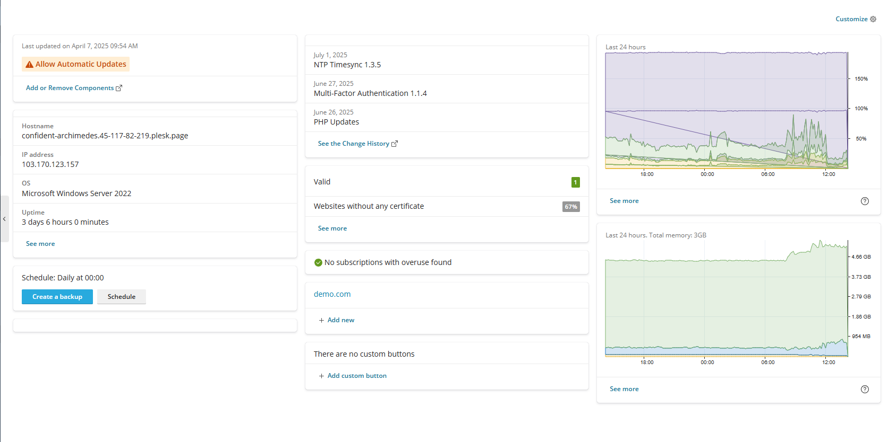
- Giao diện quản lý máy chủ trong Plesk cung cấp các thông tin chính sau:
	- Cập nhật và quản lý thành phần
		- Last updated: Hiển thị thời điểm cập nhật gần nhất của máy chủ.
		- Các nút chức năng:
		  - Allow Automatic Updates: Bật/tắt chế độ cập nhật tự động.
		  - Add or Remove Components: Thêm hoặc gỡ bỏ các thành phần của Plesk.
	- Thông tin hệ thống:
	  - Hostname: Tên định danh của máy chủ.
	  - IP Address: Địa chỉ IP công khai.
	  - OS: Hệ điều hành đang sử dụng.
	  - Uptime: Thời gian hoạt động liên tục của máy chủ.
	  - Nhấn See More để xem chi tiết.
	- Lịch trình sao lưu
		- Schedule Daily: Hiển thị lịch sao lưu tự động hàng ngày.
		- Có thể chỉnh sửa hoặc lên lịch lại bằng nút Schedule.
		- Tạo bản sao lưu mới bằng nút Create Backup, chuyển đến giao diện cấu hình backup.
	- Thông tin cập nhật phần mềm
		- Hiển thị các bản cập nhật gần đây:
		  - NTP Timesync 1.3.5
		  - Multi-Factor Authentication 1.1.4
		  - PHP Updates
		- Nhấn See the Change History để xem chi tiết lịch sử cập nhật.
	- Thông tin website và chứng chỉ SSL
		- Valid: Danh sách các website có chứng chỉ SSL hợp lệ.
		- Websites without any certificate: Tỉ lệ website chưa có SSL.
		- No subscriptions with overuse found: Không có gói dịch vụ nào vượt quá giới hạn tài nguyên.
	- Quản lý tên miền
		- Hiển thị danh sách tên miền đang quản lý.
		- Thêm tên miền mới nhanh chóng bằng nút Add new.
	- Biểu đồ giám sát tài nguyên
		- CPU Usage: Biểu đồ mức sử dụng CPU trong 24 giờ qua.
		- Memory Usage: Biểu đồ mức sử dụng RAM theo thời gian.
		- Nhấn See More để xem chi tiết.
	- Tùy biến giao diện dashboard: Sử dụng nút Customize để điều chỉnh các thông tin hiển thị theo nhu cầu.
	- 
	
## Hosting Services - Quản lý dịch vụ Hosting
- Sau khi đã nắm được tổng quan về giao diện dashboard và các thông tin hệ thống, chúng ta sẽ đi vào phần quản lý dịch vụ hosting – nơi quản trị viên thực hiện các thao tác cốt lõi như tạo khách hàng, cấp phát gói dịch vụ, quản lý tên miền và cấu hình tài nguyên.
- 
- Giao diện Hosting Services bao gồm các mục chính:
	- Customers: Quản lý tài khoản khách hàng sử dụng dịch vụ hosting.
	- Resellers: Quản lý đại lý phân phối dịch vụ (reseller).
	- Domains: Quản lý tên miền được cấp phát cho khách hàng.
	- Subscriptions: Quản lý gói dịch vụ cụ thể của từng khách hàng.
	- Service Plans: Tạo và chỉnh sửa các gói dịch vụ hosting tiêu chuẩn.
### Customers – Quản lý tài khoản khách hàng
- Mục Customers trong Plesk là nơi quản trị viên quản lý các tài khoản khách hàng sử dụng dịch vụ hosting. Mỗi khách hàng có thể sở hữu một hoặc nhiều Subscription (gói dịch vụ), và được cấp quyền truy cập để quản lý website, email, cơ sở dữ liệu, v.v.
- 
#### Tổng quan 
- Các chức năng chính trong giao diện Customers:
	- 
	- Add Customer: Tạo mới một tài khoản khách hàng.
	- Convert to Reseller: Chuyển đổi khách hàng thành đại lý phân phối dịch vụ (reseller).
	- Move to: Cho phép bạn chuyển quyền sở hữu khách hàng từ một người dùng (hoặc reseller) sang một người dùng khác. Đây là cách để tái tổ chức hoặc phân quyền lại hệ thống hosting.
	- Change Status: Kích hoạt hoặc vô hiệu hóa tài khoản khách hàng.
	- Remove: Xóa tài khoản khách hàng khỏi hệ thống.
- Bảng danh sách khách hàng:
	- 
	- Customer Name: Tên tài khoản khách hàng. Click mở giao diện quản trị chi tiết khách hàng 
	- Subscription: Gói dịch vụ đang sử dụng.
	- Setup Date: Ngày tạo tài khoản.
	- Provider: Người quản trị đã tạo tài khoản.
	- Login as Customer: Cho phép quản trị viên đăng nhập vào giao diện của khách hàng để hỗ trợ hoặc cấu hình.
- Lưu ý:
	- Mỗi khách hàng có thể có nhiều tên miền và dịch vụ đi kèm trong Subscription.
	- Quản trị viên có thể truy cập trực tiếp vào giao diện của khách hàng để hỗ trợ kỹ thuật hoặc kiểm tra cấu hình.
#### Giao diện quản trị domain/subscription customer: 
- Bằng việc click vào `Customer Name` tại danh sách khách hàng, chuyển tới giao diện thông tin chi tiết.
- 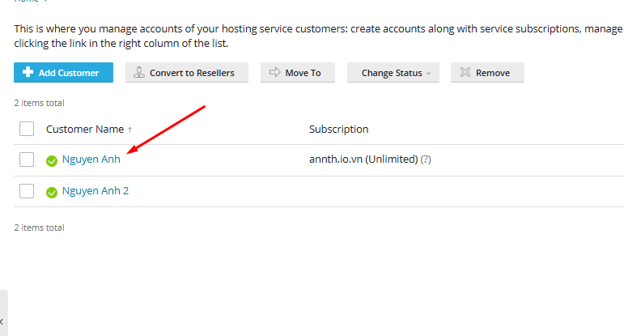
- 
- Giao diện này gồm : 
- Domains - Subscriptions: Đây là nơi bạn xem và quản lý các website domain/subscription mà khách hàng đang sở hữu:
	- Domains : Giao diện cấu hình, quản lý websites 
		- 
		- Các nút chức năng 
			- Add Domain: Dùng thêm domain mới và tài khoản 
			- Subdomain: Thêm tên miền phụ 
				- 
				- Cấu hình subdomain và thư mục gốc của subdomain 
				- 
			- Domain Alias: Thêm bí danh tên miền.
				- 
				- Cấu hình tên miền alias cho tên miền nào. 
					- Tích chọn đồng bộ bản ghi DNS
					- Đồng bộ alias trên các dịch vụ khác : Mail, Web
					- Redirect with HTTP 301 code: Tuỳ chọn này có tác dụng khi khách truy cập mở URL của alias (bí danh tên miền), họ sẽ được chuyển hướng đến URL của tên miền chính. Plesk sử dụng phương pháp chuyển hướng HTTP 301 thân thiện với công cụ tìm kiếm, nghĩa là thứ hạng tìm kiếm sẽ không bị phân tán giữa các URL.
				- 
			- Set Status: Bật/tắt trạng thái hoạt động của website
			- Remove: Xóa website hoặc subdomain khỏi hệ thống
		- Danh sách website đang quản lý: Gồm các cột thông tin và nút thao tác 
			- 	
			- Domain Name: Tên miền. Click chuyển giao diện quản lý chi tiết tên miền website. 
			- Hosting Type: Loại hosting 
			- Setup date: Ngày cấu hình khởi tạo 
			- Disk Usage: Dung lượng sử dụng 
			- Traffic: Băng thông sử dụng 
			- Rank tracker: Click mở giao diện tiện ích SEO
			- Các nút chức năng 
				- `Open`: Truy cập website 
				- `Preview`: Mở phần xem trước 
				- `Manage in Customer Panel`: Cho phép quản trị viên chuyển tới quản lý trong giao diện khách hàng
	- Subscriptions: Quản lý subscription (gói dịch vụ) của một khách hàng trong Plesk. Đây là nơi kiểm soát các website, tài nguyên và dịch vụ mà khách hàng đang sử dụng.
		- 	
		- Các nút chức năng
			- Add Subscription: Thêm gói dịch vụ mới vào tài khoản khách.
			- Change Plan: Dùng chuyển đổi gói hiện tại của 1 subscription sang gói dịch vụ khác. Cụ thể, chức năng này cho phép bạn:
				- Gán subscription hiện tại sang một gói dịch vụ khác đã được cấu hình sẵn.
				- Thêm hoặc gỡ bỏ các add-on (tiện ích bổ sung) nếu nhà cung cấp dịch vụ có hỗ trợ.
				- Thao tác chuyển plan 
					- Tích chọn Subscription cần chuyển và chọn `Change Plan`
					- 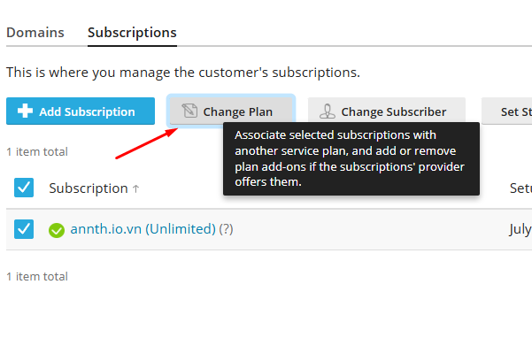	
					- Tại giao diện cấu hình chọn gói plan mới cần chuyển và chọn `OK`
					- 	
			- Change Subscriber: Chuyển quyền sở hữu subscription sang khách hàng khác. Cụ thể chức năng này thực hiện 
				- Gán lại subscription cho một khách hàng khác.
				- Thay đổi nhà cung cấp dịch vụ (có thể là từ admin sang reseller hoặc ngược lại)
				- Subscription sẽ không còn liên kết với gói dịch vụ ban đầu
				- Subscription sẽ được chuyển sang trạng thái Custom, nghĩa là tài nguyên và quyền hạn sẽ giữ nguyên như cũ, không bị ràng buộc bởi gói dịch vụ nào.
				- Thao tác chuyển Subscriber
					- Chọn subscription cần chuyển và nhấn nút "Change Subscriber"
					- 	
					- Chọn khách hàng mới (subscriber mới) từ danh sách dropdown.
					- 	
					- Xác nhận việc chuyển đổi bằng nút `Reassign`
			- Set Status: Bật/tắt trạng thái hoạt động của Subscription
			- Remove: Xóa Subscription khỏi tài khoản 
		- Danh sách các Subscription của tài khoản: Gồm các cột thông tin và nút thao tác 
			- 	
			- Subscription: Tên gói đăng ký. Click chuyển tới giao diện quản lý Subscription
			- Setupdate: Ngày cấu hình khởi tạo 
			- Nút chức năng: Manage in Customer Panel: Cho phép quản trị viên đăng nhập vào giao diện của khách hàng để quản lý.
- Thông tin khách hàng (bên phải)
	- Contact Name: Tên khách hàng 
	- Email: Email của customer 
	- Có thể chỉnh sửa các thông tin này bằng nút chức năng `Edit Contact Info`.Click chọn mở giao diện cấu hình thông tin khách hàng 
	- 
	- 
	- Convert to Reseller: Nút thao tác chuyển người dùng thành Reseller
	- Creation Date: Ngày tạo tài khoản
	- Status: Trạng thái tài khoản. (Có nút `Suspend` để vô hiệu hoá nhanh tài khoản)
	- Provider: Administrator (có nút Move to another để chuyển sang reseller khác nếu cần)
	- Username: Username đăng nhập Plesk của khách hàng 
	- Tùy chọn quản lý: 
	- Change login info: Đổi thông tin đăng nhập
	- 
	- 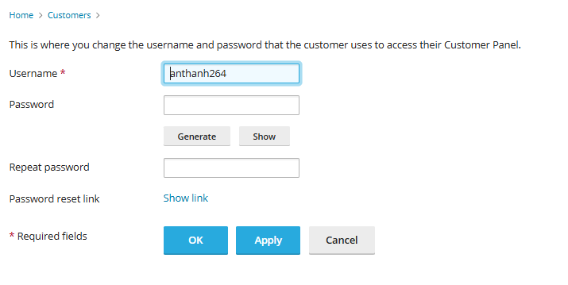
	- Login as Customer: Cho phép quản trị viên đăng nhập vào giao diện của khách hàng để hỗ trợ hoặc cấu hình.
	- Owner's description: Thay đổi mô tả của chủ sở hữu 
	- IIS Application Pool: Chuyển tới cài đặt IIS Application của khách hàng (Với Plesk chạy trên Windows)\
		- Application Pool là một vùng cách ly trong IIS, nơi một hoặc nhiều website có thể chạy độc lập với các website khác. Mỗi pool có thể có:
			- Cấu hình riêng về hiệu năng
			- Quyền truy cập hệ thống riêng
			- Quản lý bộ nhớ và tiến trình riêng
		- IIS Application Pool của customer dùng để:
			- Tách biệt website của từng khách hàng: Giúp bảo mật và ổn định hơn, nếu một site bị lỗi thì không ảnh hưởng đến site khác.
			- Tùy chỉnh cấu hình theo nhu cầu: bật/tắt chế độ 32-bit, cấu hình số lượng tiến trình, thời gian timeout, giới hạn bộ nhớ...
			- Quản lý hiệu năng và tài nguyên: Giúp tối ưu hóa tốc độ xử lý và giảm tải cho server.
			- Hỗ trợ các ứng dụng ASP.NET, .NET Core: Cho phép chạy các ứng dụng web hiện đại trên nền Windows.
			- 
			- Giao diện này gồm 
				- 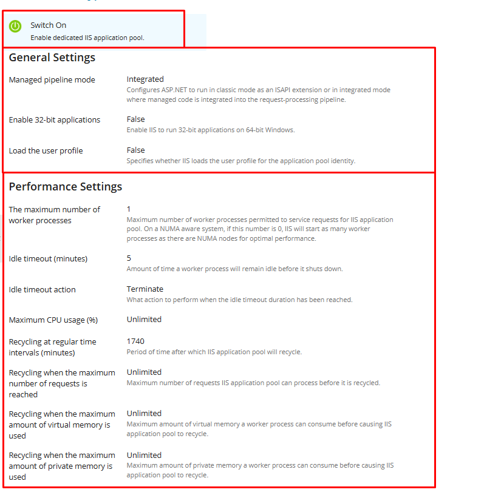
				- Nút chức năng kích hoạt sử dụng IIS Application Pool, Quản trị bật/tắt/khởi động lại. Click chọn `Switch On` để bật. 
				- 
				- General Setting: Cấu hình cài đặt chung một IIS Application Pool trong Plesk, dùng để cấu hình cách ứng dụng web ASP.NET hoạt động trên server Windows. 
					- 
					- Các tùy chọn cấu hình:
						- Managed pipeline mode: 
							- Integrated: Đây là chế độ xử lý yêu cầu web của IIS. ASP.NET được tích hợp trực tiếp vào pipeline xử lý của IIS, cho phép xử lý linh hoạt và hiệu quả hơn.
							- Classic: ASP.NET chạy như một ISAPI extension, phù hợp với các ứng dụng cũ.
						- Enable 32-bit applications: Nếu bật (✓), IIS sẽ cho phép chạy ứng dụng 32-bit trên hệ điều hành 64-bit. Dùng khi ứng dụng hoặc thư viện bạn triển khai chỉ hỗ trợ 32-bit.
						- Load the user profile: Nếu bật (✓), IIS sẽ tải profile người dùng khi khởi động ứng dụng. Cần thiết nếu ứng dụng cần truy cập registry, thư mục người dùng, hoặc các thiết lập cá nhân.
				- Performance Settings: Cấu hình cài đặt hiệu năng của một IIS Application Pool trong Plesk. Đây là nơi cấu hình hiệu năng và hành vi của tiến trình xử lý web.
					- 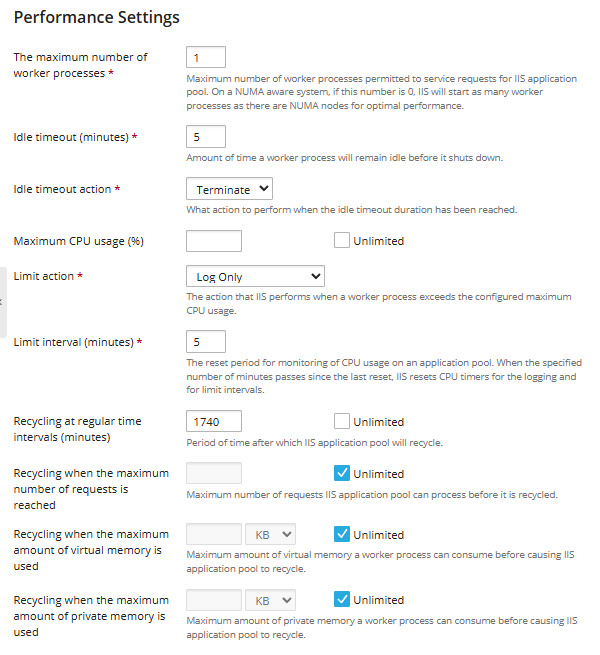
					- Các thiết lập hiệu năng:
					- Maximum number of worker processes: Số lượng tiến trình xử lý yêu cầu web.
						- Nếu là 1: chỉ có một tiến trình phục vụ toàn bộ yêu cầu.
						- Nếu là 0 trên hệ thống hỗ trợ NUMA, IIS sẽ tự động tạo tiến trình theo số lượng nút NUMA.
					- Idle timeout (minutes): Nếu không có yêu cầu trong thời gian (phút) được cấu hình, tiến trình sẽ bị tắt để tiết kiệm tài nguyên.
					- Idle timeout action: Khi hết thời gian chờ, tiến trình sẽ bị kết thúc hoặc tạm dừng (Termiate/Suspend)\
					- 
					- Maximum CPU usage (%): Giới hạn mức sử dụng CPU. Có tuỳ chọn tích không giới hạn `Unlimited`
					- Limit action: Nếu vượt quá giới hạn CPU (nếu có), IIS thực hiện hành động được cấu hình 
					- Log Only: IIS chỉ ghi log lại sự kiện khi tiến trình vượt quá giới hạn CPU.
					- Shut Down: IIS sẽ dừng (terminate) tiến trình của Application Pool nếu vượt quá giới hạn CPU.
					- Throttle: IIS sẽ giới hạn (throttle) tiến trình, làm chậm lại việc xử lý để giảm mức sử dụng CPU.
					- Throttle Under Load: IIS chỉ giới hạn tiến trình khi hệ thống đang chịu tải cao.
					- 
					- Limit interval (minutes): Khoảng thời gian để reset bộ đếm CPU. Sau khoảng thời gian (phút) được cấu hình, IIS sẽ làm mới bộ đếm để theo dõi lại.
					- Cấu hình tái khởi động (Recycling):
						- Recycling at regular time intervals (minutes): Sau khoảng thời gian (phút) được cấu hình, tiến trình sẽ được khởi động lại để làm sạch bộ nhớ.
						- Recycling when the maximum number of requests is reached: Giới hạn số lượng request trước khi tiến trình được khởi động lại.
						- Recycling when the maximum amount of virtual memory is used: Giới hạn bộ nhớ ảo. (MB/KB/GB/TB)
						- Recycling when the maximum amount of private memory is used: Giới hạn bộ nhớ riêng của tiến trình.(MB/KB/GB/TB)
	- Remove customer: Xóa khách hàng khỏi hệ thống

- Ví dụ: Thao tác quản lý khách hàng trong Plesk
	- Mục tiêu: Tạo một khách hàng mới, cấp cho họ một gói dịch vụ (Subscription), và gán tên miền để họ có thể bắt đầu sử dụng hosting.
	- Bước 1: Tạo Customer mới
		1. Truy cập Hosting Services > Customers
		2. Nhấn Add a Customer
		- 
		3. Nhập thông tin:
			- Thông tin cơ bản 
				- 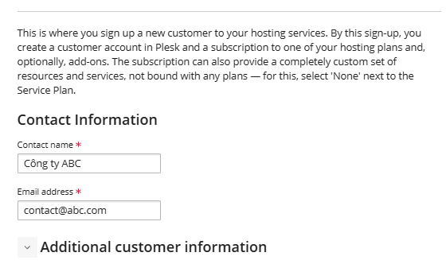
				- Contact name: Công ty ABC
				- Email: contact@abc.com
			- Các thông tin bổ sung tại phần `Additional customer information`: Phần này giúp quản trị viên lưu trữ thông tin liên hệ và quản lý khách hàng hiệu quả hơn
				- 
				- Company name – Tên công ty của khách hàng (nếu có).
				- Phone number – Số điện thoại liên hệ.
				- Address – Địa chỉ đầy đủ.
				- City – Thành phố.
				- State/Province – Bang hoặc tỉnh.
				- Postal/ZIP code – Mã bưu điện.
				- Country – Quốc gia (chọn từ menu dropdown).
				- Additional information – Thông tin bổ sung nếu cần ghi chú gì thêm.
				- Information for the administrator: Phần ghi chú cho quản trị viên. Phần này chỉ quản trị viên mới được phép thấy. 
			- Thông tin tài khoản đăng nhập quản trị Plesk 
				- 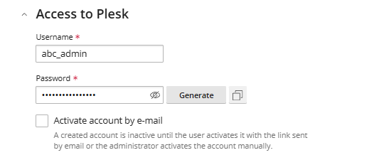
				- Username: Tên tài khoản đăng nhập 
				- Password: Mật khẩu tài khoản. 
					- Có biểu tượng con mắt để hiển thị/ẩn mật khẩu. 
					- Có thể cấu hình hoặc sinh ngẫu nhiên bằng nút `Generate` bên phải textbox nhập mật khẩu. 
					- Có biểu tượng sao chép để chép nhanh mật khẩu đã sinh. 
				- Kích hoạt tài khoản: Activate account by e-mail: Tùy chọn gửi email kích hoạt đến khách hàng.
					- Nếu bật, tài khoản sẽ chưa hoạt động cho đến khi khách hàng nhấp vào liên kết trong email.
					- Nếu không bật, quản trị viên có thể kích hoạt thủ công sau.
			
	- Bước 2: Tạo Subscription cho khách hàng
		- Ngay trong giao diện tạo Customer, bạn sẽ thấy phần Create a subscription for the customer:
		- 
		1. Domain name: Nhập tên miền mà khách hàng sẽ sử dụng ví dụ `abc.io.vn`
		2. Service plan: Chọn gói dịch vụ từ danh sách (ví dụ: Default Domain). Gói này xác định tài nguyên như dung lượng, email, database, v.v.
		3. IP address: Chọn IP mặc định của máy chủ: Chọn IP dùng để truy cập qua FTP/RDP. 
		- Username: Tên người dùng hệ thống dùng để đăng nhập FTP hoặc SSH.
		- Password: Nhập mật khẩu hoặc nhấn nút Generate để tạo tự động.
		- Description (tùy chọn): Ghi chú nội bộ cho quản trị viên người cung cấp hosting admin hoặc reseller, không hiển thị với khách hàng.
		- Tùy chọn thêm:Nếu bạn muốn tùy chỉnh thông số subscription sau khi tạo, hãy tick vào ô: `Proceed to customizing the subscription parameters after the customer is created.`

	- Bước 3: Quản lý khách hàng
		- Click xác nhận để tạo `customer`
		- 
		- Sau khi tạo xong: Khách hàng sẽ xuất hiện trong danh sách.
			- 
		- Bạn có thể:
			- Nhấn Login as Customer để truy cập giao diện của họ.
			- 
			- 
			- Convert to Reseller nếu muốn nâng cấp họ thành đại lý. Sau khi chuyển đổi, bạn sẽ được yêu cầu:
				- 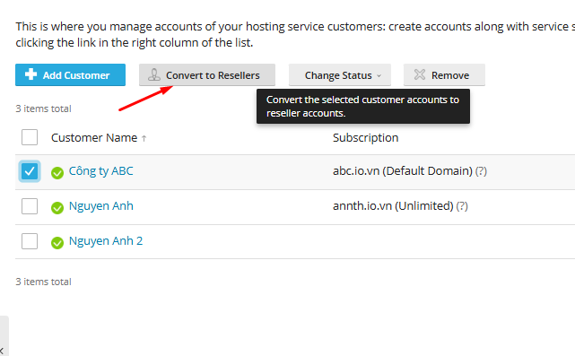
				- 
				- Sau khi chuyển đổi account chuyển sang phần Reseller 
				- 
				- Chọn **Reseller Plan** (gói tài nguyên dành cho đại lý). Các gói này sẽ được tạo ở phần `Service Plans` 
			- Move to: Chuyển khách hàng sang một chủ sở hữu khác. 
				- Tại pop-up chuyển khách hàng bạn có thể cấu hình giữ nguyên toàn bộ tài nguyên, quyền và ứng dụng của khách hàng sẽ được bảo toàn sau khi chuyển bằng cách chọn gói `Custom` 
				- 
				- Hoặc chọn gói tài nguyên theo chủ sở hữu mới: Tuỳ chọn này sẽ ảnh hưởng tới toàn bộ tài nguyên, quyền và ứng dụng của khách hàng thuộc chủ sở hữu cũ.
				- 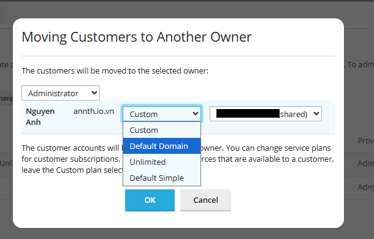
			- Change Status để tạm dừng hoặc kích hoạt lại tài khoản.
				- 
			- Remove: Xoá tài khoản ra khỏi hệ thống 
				- 
			
## Resellers: Quản lý đại lý phân phối dịch vụ (reseller).
- 
- Giao diện này cho phép quản trị viên hệ thống thực hiện các thao tác quản lý tài khoản đại lý (reseller)
### Tổng quan 
- Chức năng chính:
	- 
	- Thêm Reseller: Tạo tài khoản reseller mới với gói dịch vụ tùy chọn.
	- Chuyển đổi sang Khách hàng: Biến reseller thành khách hàng thông thường, phù hợp khi không còn nhu cầu phân phối dịch vụ.
	- Thay đổi trạng thái: Kích hoạt hoặc vô hiệu hóa tài khoản reseller.
	- Xóa Reseller: Loại bỏ reseller khỏi hệ thống (cẩn thận vì có thể ảnh hưởng đến khách hàng liên quan).
- Danh sách hiển thị thông tin của các reseller:
	- 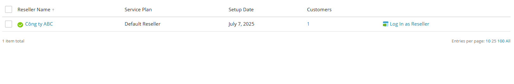
	- Tên Reseller: Tên định danh của đại lý. Click để mở giao diện quản trị chi tiết reseller
	- Gói dịch vụ: Gói reseller đang sử dụng.
	- Ngày tạo: Thời điểm tài khoản được thiết lập.
	- Số lượng khách hàng: Tổng số khách hàng mà reseller đang quản lý.
	- Đăng nhập với tư cách Reseller: Cho phép quản trị viên truy cập giao diện của reseller để hỗ trợ kỹ thuật hoặc kiểm tra cấu hình.
- Giao diện này là công cụ quan trọng để phân quyền, theo dõi và hỗ trợ các đại lý trong hệ thống hosting Plesk.
### Giao diện quản trị reseller. 
- Bằng việc click vào `Reseller Name` tại danh sách Reseller, chuyển tới giao diện thông tin chi tiết.
- 
- 
- Giao diện này gồm : 
- Domains - Subscriptions - Customers: Đây là nơi bạn xem và quản lý các website domain/subscription/customers mà reseller đang sở hữu:
	- Domains : Giao diện cấu hình, quản lý websites 
		- 
		- Các nút chức năng 
			- Add Domain: Dùng thêm domain mới và tài khoản 
			- Subdomain: Thêm tên miền phụ 
				- 
				- Cấu hình subdomain và thư mục gốc của subdomain 
				- 
			- Domain Alias: Thêm bí danh tên miền.
				- 
				- Cấu hình tên miền alias cho tên miền nào. 
					- Tích chọn đồng bộ bản ghi DNS
					- Đồng bộ alias trên các dịch vụ khác : Mail, Web
					- Redirect with HTTP 301 code: Tuỳ chọn này có tác dụng khi khách truy cập mở URL của alias (bí danh tên miền), họ sẽ được chuyển hướng đến URL của tên miền chính. Plesk sử dụng phương pháp chuyển hướng HTTP 301 thân thiện với công cụ tìm kiếm, nghĩa là thứ hạng tìm kiếm sẽ không bị phân tán giữa các URL.
				- 
			- Set Status: Bật/tắt trạng thái hoạt động của website
			- Remove: Xóa website hoặc subdomain khỏi hệ thống
		- Danh sách website đang quản lý: Gồm các cột thông tin và nút thao tác 
			- 	
			- Domain Name: Tên miền. Click chuyển giao diện quản lý chi tiết tên miền website. 
			- Hosting Type: Loại hosting 
			- Setup date: Ngày cấu hình khởi tạo 
			- Disk Usage: Dung lượng sử dụng 
			- Traffic: Băng thông sử dụng 
			- Rank tracker: Click mở giao diện tiện ích SEO
			- Các nút chức năng 
				- `Open`: Truy cập website 
				- `Preview`: Mở phần xem trước 
				- `Manage in Customer Panel`: Cho phép quản trị viên chuyển tới quản lý trong giao diện khách hàng
	- Subscriptions: Quản lý subscription (gói dịch vụ) của một khách hàng trong Plesk. Đây là nơi kiểm soát các website, tài nguyên và dịch vụ mà khách hàng đang sử dụng.
		- 	
		- Các nút chức năng
			- Add Subscription: Thêm gói dịch vụ mới vào tài khoản khách.
			- Change Plan: Dùng chuyển đổi gói hiện tại của 1 subscription sang gói dịch vụ khác. Cụ thể, chức năng này cho phép bạn:
				- Gán subscription hiện tại sang một gói dịch vụ khác đã được cấu hình sẵn.
				- Thêm hoặc gỡ bỏ các add-on (tiện ích bổ sung) nếu nhà cung cấp dịch vụ có hỗ trợ.
				- Thao tác chuyển plan 
					- Tích chọn Subscription cần chuyển và chọn `Change Plan`
					- 	
					- Tại giao diện cấu hình chọn gói plan mới cần chuyển và chọn `OK`
					- 	
			- Change Subscriber: Chuyển quyền sở hữu subscription sang khách hàng khác. Cụ thể chức năng này thực hiện 
				- Gán lại subscription cho một khách hàng khác.
				- Thay đổi nhà cung cấp dịch vụ (có thể là từ admin sang reseller hoặc ngược lại)
				- Subscription sẽ không còn liên kết với gói dịch vụ ban đầu
				- Subscription sẽ được chuyển sang trạng thái Custom, nghĩa là tài nguyên và quyền hạn sẽ giữ nguyên như cũ, không bị ràng buộc bởi gói dịch vụ nào.
				- Thao tác chuyển Subscriber
					- Chọn subscription cần chuyển và nhấn nút "Change Subscriber"
					- 	
					- Chọn khách hàng mới (subscriber mới) từ danh sách dropdown.
					- 	
					- Xác nhận việc chuyển đổi bằng nút `Reassign`
			- Set Status: Bật/tắt trạng thái hoạt động của Subscription
			- Remove: Xóa Subscription khỏi tài khoản 
		- Danh sách các Subscription của tài khoản: Gồm các cột thông tin và nút thao tác 
			- 	
			- Subscription: Tên gói đăng ký. Click chuyển tới giao diện quản lý Subscription
			- Setupdate: Ngày cấu hình khởi tạo 
			- Nút chức năng: Manage in Reseller Panel: Cho phép quản trị viên đăng nhập vào giao diện của reseller để quản lý.
	- Customers: Quản lý các khách hàng của reseller 
		- 	
		- Các nút chức năng
			- Add Customer: Thêm khách hàng mới 
			- Convert to Reseller: Chuyển đổi khách hàng thành reseller 
			- Move to: Cho phép bạn chuyển quyền sở hữu khách hàng từ reseller sang một reseller khác. Đây là cách để tái tổ chức hoặc phân quyền lại hệ thống hosting.
			- Change Status: Bật/tắt trạng thái hoạt động của khách hàng 
			- Remove: Xóa khách hàng khỏi reseller  
		- Danh sách các Customer của Reseller: Gồm các cột thông tin và nút thao tác 
			- 	
			- Customer Name: Tên khách hàng. Click chuyển tới giao diện quản lý của khách hàng
			- Subscription: Danh sách các subscription của customer 
			- Setup date: Ngày cấu hình
			- Nút chức năng: Log In as Customer: Cho phép quản trị viên đăng nhập vào giao diện của Customer để quản lý.
- Thông tin khách hàng (bên phải)
	- Contact Name: Tên reseller 
	- Company Name: Tên công ty 
	- Email: Email của reseller 
	- Creation Date: Ngày tạo tài khoản
	- Status: Trạng thái tài khoản. (Có nút `Suspend` để vô hiệu hoá nhanh tài khoản)
	- Owner's description: Thay đổi mô tả của chủ sở hữu (Edit)/ Xoá mô tả (Delete)
	- Có thể chỉnh sửa các thông tin này bằng nút chức năng `Edit Contact Info`.Click chọn mở giao diện cấu hình thông tin reseller 
	- 
	- 
	- Reseller's own customers: Thông tin số khách hàng Reseller quản lý
	- Reseller's own plans: Thông tin số plans reseller sở hữu
	- Reseller's own subscriptions: Thông tin số subscriptions reseller sở hữu
	- Service plan: Hiển thị service plan hiện tại của reseller. 
		- Có thể thay đổi plan (Change Plan)
			- 
			- 
		- Hoặc chỉnh sửa (Customize)
			- 
			- 
	- View More Statistics: Click để mở giao diện thông tin chi tiết về reseller 
			- 
			- Resources: Thông tin chi tiết tài nguyên reseller sở hữu
			- 
			- Permissions: Thông tin về danh sách các dịch vụ và quyền hạn đi kèm với gói đăng ký.
			- 			
	- Tùy chọn quản lý: 
	- Username: Tên tài khoản của reseller 
	- Reseller Panel: Cho phép quản trị viên đăng nhập vào giao diện của reseller để quản lý.
	- Change login info: Đổi thông tin đăng nhập
	- 
	- 
	- IP Addresss: Quản lý địa chỉ IP được gán cho reseller 
		- 
		- 
		- Nút chức năng: Tên IP mới/ Xoá IP 
		- Danh sách các IP đã gán:
			- Trạng thái: 
			- Địa chỉ IP:
			- Loại IP: 
			- Chứng chỉ: 
			- Trạng thái FTPS:
			- Số lượng Hosting: Click để hiển thị panel chi tiết tên các website hosting
			- 
	- IIS Application Pool: Chuyển tới cài đặt IIS Application của reseller. Các tuỳ chọn, cấu hình giống với phần của Customer 
	- Remove: Xóa Reseller khỏi hệ thống

- Ví dụ tạo reseller mới 
	- Đăng nhập vào Plesk với quyền quản trị viên (Admin).Vào mục Resellers từ menu chính. Nhấn nút Add Reseller.
	- 
	- Chuyển tới giao diện cấu hình thông tin cho reseller mới. 
	- Gồm các phần 
		- Contact Information: Cấu hình các thông tin của reseller: Tên, email, tên công ty, địa chỉ, số điện thoại
			- 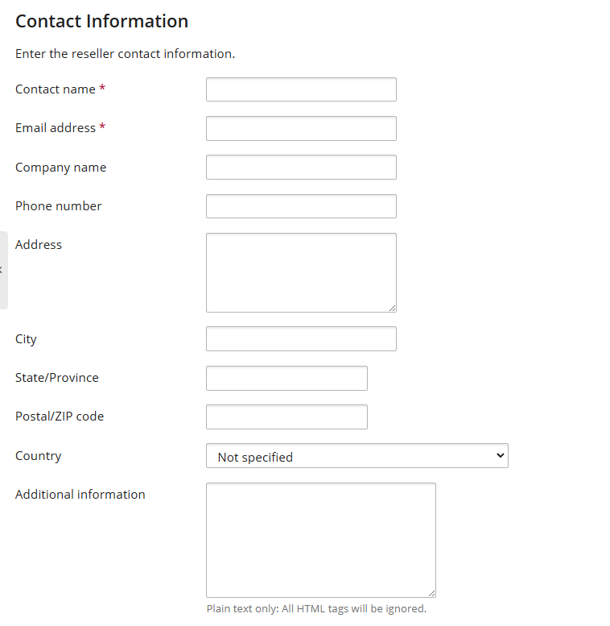
			- Ví dụ 
			- 
		- Information for the Administrator: Ghi chú riêng cho quản trị viên, khách hàng không có quyền xem. 
		- 
		- Access to Plesk: Cấu hình tài khoản/mật khẩu đăng nhập Plesk để quản trị 
		- 
			- Username : Tên đăng nhập của reseller
			- Password : Mật khẩu đăng nhập. Bạn có thể tự nhập hoặc nhấn nút Generate để tạo tự động.
			- Activate account by e-mail (tùy chọn):
				- Nếu tick vào, hệ thống sẽ gửi email kích hoạt đến reseller.
				- Nếu không tick, bạn cần kích hoạt tài khoản thủ công sau khi tạo.

		- Subscription: Cấu hình gói mà Reseller được gán. 
		- 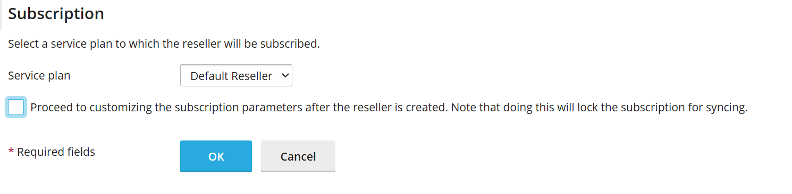
			- Service plan: Đây là gói dịch vụ mà reseller sẽ được gán khi tạo tài khoản.
				- Ví dụ: Default Reseller là gói mặc định, có thể bao gồm giới hạn về:
					- Số lượng khách hàng
					- Dung lượng lưu trữ
					- Băng thông
					- Quyền truy cập (FTP, email, database...)
				-> Các gói này sẽ được cấu hình trong phần `Service Plans`
			- Tùy chọn: "Proceed to customizing the subscription parameters after the reseller is created"
				- Nếu bạn tick vào ô này, sau khi tạo reseller xong, bạn sẽ được chuyển đến phần tùy chỉnh chi tiết gói dịch vụ.
				- Lưu ý: Khi bạn tùy chỉnh thủ công, subscription sẽ bị khóa đồng bộ (lock for syncing), tức là:
					- Gói dịch vụ sẽ không tự cập nhật theo thay đổi từ service plan gốc.
					- Bạn phải quản lý thủ công các thông số sau này.
	- Sau khi đã cấu hình các thông số. Click OK để tạo reseller mới. 
	- 
- Ví dụ thao tác Chuyển đổi sang Khách hàng
	- Tích chọn reseller cần chuyển -> Chọn Convert to Customer 
	- 
	- Giao diện cấu hình chọn gói dịch vụ mới cho reseller sau khi chuyển đổi, có thể chọn custom để giữ nguyên gói tài nguyên hiện có. 
	- Sau khi đã cấu hình xong gói dịch vụ click `OK` để chuyển đổi. 
- Ví dụ thao tác thay đổi trạng thái reseller	
	- Tích chọn reseller cần chuyển -> Chọn Change Status 
	- 
	- Chọn `Suspend` để tạm dừng dịch vụ hoặc `Active` để kích hoạt 
	- 
	
## Domains: Quản lý tên miền được cấp phát.
- 
- Giao diện này cho phép bạn:
	- Xem thông tin tất cả các tên miền đã đăng ký trong hệ thống.
	- Quản lý dịch vụ hosting liên quan đến các tên miền đó.
	- Thêm tên miền mới cho bản thân hoặc khách hàng hosting.
- Giao diện gồm các chức năng chính 
	- Add Domain: Dùng thêm tên miền mới vào hệ thống 
	- Add Subdomain: Tạo tên miền phụ cho domain đã có 
	- Add Domain Alias: Thêm bí danh cho tên miền
	- Set status : Cấu hình trạng thái của tên miền 
	- Remove : Xoá tên miền khỏi hệ thống 
- Bảng các tên miền có trong hệ thống. Bảng gồm các cột:
	- Domain Name (Tên miền): Tên miền đang được quản lý. Click chuyển tới giao diện quản trị website 
	- Subscriber (Người đăng ký): Người hoặc tổ chức sở hữu tên miền. Click chuyển tới giao diện quản trị Customer/ Reseller chủ quản.
	- Disk Usage (Dung lượng đĩa): Dung lượng đã sử dụng (tính bằng MB).
	- Traffic (Lưu lượng truy cập): Lưu lượng truy cập hàng tháng (MB/tháng).
	- Status (Trạng thái): Trạng thái hoạt động của tên miền.
		- Có thể chuyển nhanh trạng thái tại đây 
		- 
	- Các nút thao tác 
		- Wordpress Management: Click chuyển tới giao diện quản lý WP-Toolkit đối với website sử dụng 
		- 
		- 
		- Sitejet Builder: Chuyển tới giao diện CMS Sitejet tạo website 
		- 
		- File Manager: Chuyển tới giao diện quản lý tệp tin của hosting 
		- 
		- 
		- Mail Account: Cấu hình tài khoản mail 
			- 
			- Chuyển tới giao diện quản lý email: Email Addresses, Mail Settings, Mailling Lists, Outgoing Mail Control.
			- 
			- Email Addresses: Giao diện quản lý tài khoản Email. 
				- Có thể thao tác tạo tài khoản mới hoặc xoá. 
				- Danh sách các tài khoản Email: Tên email, Tên liên lạc, Usage: Dung lượng sử dụng, 
					- Click tên email để tới trang cấu hình tài khoản mail 
					- 
					- Gồm các tab cấu hình 
						- General: Cấu hình chung với tài khoản mail 
						- 
							- Email address: Chỉnh sửa địa chỉ email. Đây cũng là username để đăng nhập vào Plesk nếu được cấp quyền.
							- External email address: Là địa chỉ email phụ bên ngoài (ví dụ: Gmail, Outlook). Có thể dùng để nhận thông báo hoặc khôi phục mật khẩu.
							- Password & Confirm password: Nhập mật khẩu cho tài khoản email.
								- Có nút Generate để tạo mật khẩu ngẫu nhiên.
								- Có thể hiện/ẩn mật khẩu khi nhập.
							- Password reset link: Tùy chọn hiển thị liên kết để đặt lại mật khẩu.
							- Mailbox size: Chọn dung lượng hộp thư:
								- Default size (Unlimited): không giới hạn.
								- Another size: nhập dung lượng cụ thể (MB/GB).
							- Description in Plesk: Mô tả tài khoản email. Mọi người có quyền truy cập tài khoản này sẽ thấy mô tả.
						- Forwarding: Cấu hình chuyển tiếp 
							- 
							- Switch on mail forwarding: Khi bật tùy chọn này, mọi email gửi đến địa chỉ gốc sẽ được chuyển tiếp đến địa chỉ email khác mà bạn chỉ định.
							- Do not deliver copies of forwarded emails to the Plesk mailbox: Nếu chọn tùy chọn này, email sẽ không được lưu lại trong hộp thư Plesk gốc. Email chỉ được chuyển tiếp đi, không giữ bản sao.
							- Email addresses để chuyển tiếp đến: Bạn có thể nhập một hoặc nhiều địa chỉ email để nhận email chuyển tiếp.
								- Mỗi địa chỉ trên một dòng.
								- Hoặc phân cách bằng dấu cách, dấu phẩy, hoặc dấu chấm phẩy.
						- Email alias: Cấu hình địa chỉ email phụ trỏ về một địa chỉ email chính
							- 
							- Danh sách các alias hiện có: Mỗi alias có nút Remove để xóa nếu không cần dùng nữa.
							- Thêm alias mới: Nhấp vào Add email alias để tạo địa chỉ phụ mới.
						- Auto-reply: Cấu hình tính năng trả lời tự động cho tài khoản Email 
							- 
							- Switch on auto-reply: Bật tính năng trả lời tự động cho email. Khi có ai đó gửi email đến địa chỉ này, hệ thống sẽ tự động gửi lại một tin nhắn phản hồi.
							- Auto-reply message subject: Tiêu đề của email phản hồi. Mặc định là: Re: <request_subject> → phản hồi theo tiêu đề email gốc.
							- Định dạng nội dung phản hồi
								- Plain text: văn bản đơn giản, tương thích với mọi ứng dụng email.
								- HTML: cho phép định dạng đẹp hơn (font, màu, v.v.), nhưng có thể không hiển thị đúng ở một số ứng dụng email.
							- Auto-reply message text: Nội dung email phản hồi tự động.
							- Forward to: Khi gửi phản hồi tự động, email gốc cũng sẽ được chuyển tiếp đến địa chỉ bạn chỉ định.
							- Giới hạn số lần phản hồi: Tùy chọn giới hạn số lần gửi phản hồi tự động đến cùng một địa chỉ email trong một ngày.
							- Switch off auto-reply on: Chọn ngày để tự động tắt chức năng trả lời tự động. Hữu ích khi bạn chỉ muốn bật auto-reply trong thời gian nghỉ phép, công tác,...
						- Antivirus: Các cài đặt với trình antivirus nếu được cấu hình 
							- 
					- Các nút thao tác: Mail Client Setup (Mở pop-up hướng dẫn kết nối), Webmail (Click mở tới trang webmail) 
			- Mail Settings: Các thiết đặt về dịch vụ Mail với Domain cấu hình toàn bộ dịch vụ email cho domain, bao gồm bật/tắt dịch vụ, xử lý email lỗi, bảo mật bằng SSL, xác thực DKIM, và các tính năng nâng cao như webmail và autodiscover.
				- 
				- Mail service on this domain: Cấu hình dịch vụ Mail 
					- Enabled: Domain có thể gửi và nhận email.
					- Disabled: Plesk sẽ không cung cấp dịch vụ email cho domain này.
					- Not configured: Không chỉ tắt dịch vụ email mà còn xóa vĩnh viễn toàn bộ hộp thư và email đã gửi/nhận.
				- Xử lý email gửi đến người dùng không tồn tại
					- Forward to address: Chuyển email đến địa chỉ khác 
					- Redirect to external mail server: Chuyển tiếp đến máy chủ email bên ngoài qua địa chỉ IP.
					- Reject: Từ chối email gửi đến người dùng không tồn tại.
				- Webmail: Cấu hình giao diện webmail được sử dụng: MailEnable/ Horde / None 
				- SSL/TLS Certificates: Cấu hình chứng chỉ SSL cho Webmail và Mail service 
				- Các tùy chọn bổ sung
					- Enable mailing lists: bật chức năng danh sách gửi thư (newsletter, group mail,...).
					- Use DKIM: bật xác thực DKIM để chống spam, xác minh email gửi đi. Có thể chọn hoặc tạo DKIM Selector mới.
					- Enable mail autodiscover: bật tính năng tự động cấu hình email cho các ứng dụng như Outlook.
			- Mailling Lists: Cấu hình gửi email tới hàng loạt người dùng theo nhóm 
				- Các nút chức năng 
					- Tạo Mailling List mới: Click để mở giao diện tạo mailling list mới. 
						- 
						- 
						- Mailing list address: Nhập địa chỉ danh sách gửi thư. Đây là địa chỉ mà người gửi sẽ dùng để gửi email đến tất cả người đăng ký.
						- Switched on: Bật/tắt danh sách gửi thư.Nếu được chọn, danh sách sẽ hoạt động ngay sau khi tạo.
						- Mailing list administrator's email: Nhập địa chỉ email của người quản lý danh sách gửi thư. Người này sẽ nhận thông báo, quản lý người đăng ký, và xử lý các vấn đề liên quan.
						- Subscribers: Nhập danh sách email người nhận. Có thể nhập mỗi địa chỉ trên một dòng, hoặc phân cách bằng dấu cách, dấu phẩy, hoặc dấu chấm phẩy.
						- Notify administrator on the mailing list creation: Nếu được chọn, quản trị viên sẽ nhận email thông báo khi danh sách được tạo.				
					- Xoá Mailling List: Xoá mailling list được chọn 
						- 
				- Bảng liệt kê các Mailling List hiện có: 
					- 
					- Address: Tên mailling list 
					- Subscribers: Số lượng người đăng ký trong mailling list 
			- Outgoing Mail Control: Cấu hình quản lý mail gửi đi dùng để kiểm soát số lượng email gửi đi từ các đối tượng trong Plesk
				- 
				- General: Giao diện theo dõi việc gửi email ra ngoài từ hệ thống Plesk
				- 
					- Attempts to exceed limits: Thống kê số lượng đối tượng cố gắng vượt quá giới hạn gửi email trong khoảng thời gian báo cáo (1 tuần).
					- Domains / Subscription :Hiển thị danh sách domain hoặc subscription có hành vi gửi vượt giới hạn.
					- Objects attempting to exceed limits: Nếu có vi phạm, danh sách các đối tượng sẽ hiển thị tại đây.
				- Domains: Giám sát việc gửi mail ở cấp độ Domains 
					- Danh sách các tên miền kèm theo thông tin:
						- Name: Tên domain đang được giám sát 
						- Limit per Hour: Giới hạn số lượng email được phép gửi mỗi giờ 
						- Attempts after Reaching the Limit: Số lần cố gắng gửi email sau khi vượt giới hạn 
						- Last Attempt: Thời điểm gần nhất có hành vi vượt giới hạn 
						- Mail Status: Trạng thái gửi email hiện tại
						- Xem chi tiết bằng cách click chọn vào domain tạo cột Name 
						- 
						- 				
							- General (Tổng quan)
								- Mail status: Trạng thái dịch vụ mail của tên miền .
								- Current limit: Giới hạn gửi email mỗi giờ.
									- Có thể thay đổi giới hạn bằng nút chức năng `Change Limit`. Các tùy chọn cấu hình
										- 				
										- Default (50 messages per hour): Giới hạn mặc định: domain chỉ được gửi tối đa 50 email mỗi giờ.
										- Custom value for this domain: Cho phép nhập giá trị tùy chỉnh
											- `messages per hour`: cấu hình thông số cụ thể số mail được gửi / giờ
											- Unlimited: không giới hạn số lượng email gửi ra.	
							- Attempts to send mail after reaching the limit: Hiển thị số lần domain cố gắng gửi email vượt quá giới hạn. Cho phép chọn khoảng thời gian (ví dụ: trong ngày).
							- Sent messages (Thống kê email đã gửi)
								- Chọn ngày để xem thống kê.
								- Hiển thị số lượng email đã gửi theo từng giờ
				- Subscription: Giám sát việc gửi mới đối với các subscription
					- General (Tổng quan)
					- 				
					- Mail status: Trạng thái dịch vụ gửi email của Subscription
					- Current limit: Số mail được phép gửi tối đa mỗi giờ của Subscription
						- Có thể thay đổi giới hạn bằng nút chức năng `Change Limit`. Các tùy chọn cấu hình
						- 				
						- 			
						- Outgoing messages from a domain (per hour)
							- Default server-wide value: Mặc định toàn hệ thống là 50 email mỗi giờ cho mỗi domain.
							- Custom value for the subscription: Cho phép nhập giá trị tùy chỉnh:
								- [0] → chặn hoàn toàn việc gửi email từ domain.
								- Tùy chọn [ ] Unlimited → không giới hạn số lượng email gửi ra.
						- Outgoing messages from a subscription (per hour)
							- Default server-wide value: Mặc định toàn hệ thống là 100 email mỗi giờ cho mỗi subscription.
							- Custom value for the subscription: Cho phép nhập giá trị tùy chỉnh:
								- [0] → chặn hoàn toàn việc gửi email từ subscription.
								- [ ] Unlimited → không giới hạn số lượng email gửi ra.	
					- Attempts to send mail after reaching the limit: Hiển thị số lần subscription cố gắng gửi email vượt quá giới hạn. Cho phép chọn khoảng thời gian (ví dụ: theo ngày).
					- Sent messages (Thống kê email đã gửi): Hiển thị số lượng email đã gửi theo từng giờ. Có thể chọn ngày để xem thống kê.
		- Databases: Chuyển tới giao diện quản lý database 
		- 
		- 
		- Tại đây là giao diện tạo mới, quản lý các database.
		- Gồm danh sách các Database hiện có:
			- Thông tin: Host, user, bảng trong database, Kích thước 
			- Các nút chức năng: 
				- phpMyAdmin: Click mở giao diện phpmyadmin 
				- Connection Info: Click mở giao diện thông tin kết nối tới DB
					- 
					- 
				- Copy: Sao chép database tới 1 DB có sẵn hoặc tạo 1 DB mới 
					- 
					- 
				- Export/Import Dump: Dùng xuất và nhập file Dump dữ liệu 
					- 
					- 
				- Check and repair: Kiểm tra và sửa chữa lỗi DB 
				- Remote Database: Xoá cơ sở dữ liệu 
				- Move to Subscription: Di chuyển cơ sở dữ liệu sang một Subscription khác. 
			- Nút chức năng 
				- User Management: Quản lý người dùng cơ sở dữ liệu 
					- 
					- 
					- Các nút chức năng: 
						- Add Database User: Thêm người dùng DB mới.
						- 
						- 
						- Các cấu hình: 
							- Database Server: Máy chủ CSDL 
							- Database username: tên người dùng 
							- Password: Mật khẩu
							- Database: Chọn DB muốn thêm user 
							- Access Control:
								- Allow local connections only: Chỉ cho phép kết nối local 
								- Allow remote connections from any host: Cho phép kết nối từ xa với bất kỳ IP nào.
								- Allow remote connections from: Chỉ có phép kết nối từ xa với IP cụ thể.
						- Danh sách các tài khoản cơ sở dữ liệu 
							- Name: Tên tài khoản
								- Click để chuyển tới giao diện chỉnh sửa tài khoản 
								- 
								- 							
								- Tại đây có thể 
									- Cấu hình username/password. 
									- Chọn database
									- Cấu hình roles và phân quyền chi tiết 
									- Cấu hình quản lý truy cập 
							- Database: Tên CSDL 
							- Database Server: Tên máy chủ hoạt động 
				- Backup Manager: Quản lý backup 
					- 
					- 
					- Các nút chức năng:
						- Tạo backup mới 
						- 
						- Có thể cấu hình 
							- Nội dung bản sao lưu: Cấu hình, Mail, Tệp người dùng, CSDL 
							- Nơi lưu trữ
							- Loại sao lưu: Đầy đủ/Chỉ sao lưu thay đổi 
							- Ghi chú 
							- Các cài đặt bổ sung: Bỏ qua file log, bỏ qua tệp đặc biệt, gửi thông báo,...
						- 
						- Tải lên bản backup
						- Xoá bản backup 
						- Schedule: Lên lịch Backup
							- 
							- 
							- Gồm các cấu hình: 
								- Kích hoạt task 
								- Cấu hình thời gian thực thi
								- Chọn kiểu backup
								- Cấu hình thời gian thực hiện tác vụ backup full
								- Cấu hình số lượng các bản full backup được lưu trữ. 
						- Cấu hình Server lưu trữ từ xa 
					
		- Hosting Settings: Quản lý các cài đặt cấu hình của hosting 
		- 	
			- 				
			- Domain name: Tên miền. 
			- Hosting type: 
				- Hosting type: Loại Hosting Website/ Forwarding / No Web Hosting 
				- Preferred Domain: Tên miền ưu tiên. Nếu chọn, Plesk sẽ chuyển hướng SEO-friendly (HTTP 301) từ các biến thể khác về tên miền này.
				- Document Root: Thư mục gốc chứa mã nguồn
			- SSL/TLS support
				- Enabled: Bật mã hóa kết nối giữa website và trình duyệt người dùng.
				- Redirect visitors from HTTP to HTTPS: Tự động chuyển hướng người dùng từ HTTP sang HTTPS bằng redirect 301 (tốt cho SEO).
				- Certificate: Cấu hình chứng chỉ SSL/TLS.
			- Web statistics: Cấu hình công cụ dùng phân tích website. Có thể cấu hình sử dụng Webalizer, AWStats hoặc tắt. 
			- Web scripting: Cho phép bật/tắt các ngôn ngữ lập trình web mà website có thể sử dụng
			- 				
			- System user's credentials: Cấu hình thông tin đăng nhập của người dùng hệ thống gắn với domain 
				- Dùng để Truy cập FTP, Quản lý file qua File Manager, Thực hiện các tác vụ liên quan đến hosting.
				- Bao gồm: Username / Password. Có thể thay đổi mật khẩu hoặc tạo mới nếu cần.
			- Remote Desktop access: Cho phép truy cập từ xa vào máy chủ qua Remote Desktop (chỉ áp dụng nếu hosting chạy trên hệ điều hành Windows).
			- IP addresses: Cấu hình IP sử dụng 
			- Disk space quota: Giới hạn dung lượng ổ đĩa với hosting (MB) để bật tích chọn Enable và cấu hình giới hạn. Nếu quota bị vượt, hệ thống sẽ chặn thao tác trên file website (upload, chỉnh sửa,...).
		- Các nút thao tác khác: 
			- 
			- Open: Mở website 
			- Preview: Mở phần preview 
			- Manage in Custom Panel / Manage in Reseller Panel: Cho phép quản trị viên đăng nhập chuyển tới giao diện của khách hàng/reseller để quản lý, cấu hình. 
			- Move Domain: Chuyển tên miền tới subscription khác 
			- 
			- Change Domain Name: Thay đổi tên tên miền 
			- 
			- 
		
- Ví dụ thao tác thêm tên miền mới 
	- Click chọn `Add Domain` trong `Domains` của Plesk 
		- 
	- Tại giao diện khởi tạo cung cấp nhiều lựa chọn cấu hình 
		- 
		- Trang khởi đầu cho HTML hoặc PHP: Tạo một trang web đơn giản sử dụng HTML hoặc PHP, thường dành cho người mới bắt đầu hoặc các dự án nhỏ.
		- Trình tạo website kéo & thả: Công cụ trực quan giúp bạn xây dựng website mà không cần viết mã, phù hợp với người không chuyên về kỹ thuật.
		- Website chạy WordPress mới nhất: Tạo một website sử dụng nền tảng WordPress – phổ biến cho blog, cửa hàng online, và trang tin tức.
		- Kích hoạt Node.js trên tên miền: Dành cho các ứng dụng web sử dụng Node.js – thường là các ứng dụng thời gian thực hoặc có tính tương tác cao.
		- Tạo tên miền chỉ dùng cho email: Thiết lập tên miền để sử dụng cho dịch vụ email, không có website.
		- Từ máy cục bộ: Tải lên website từ máy tính cá nhân.
		- Lấy file từ Git repository: Tạo website bằng cách lấy mã nguồn từ kho lưu trữ Git – phù hợp với lập trình viên.
		- Cài đặt ứng dụng Laravel mới: Tạo website sử dụng framework Laravel – phổ biến với các ứng dụng web phức tạp.
		- Từ dịch vụ hosting khác: Di chuyển website từ nhà cung cấp hosting khác sang đây.
	- Chọn tạo `BlankWebsite` tới phần cấu hình
		- 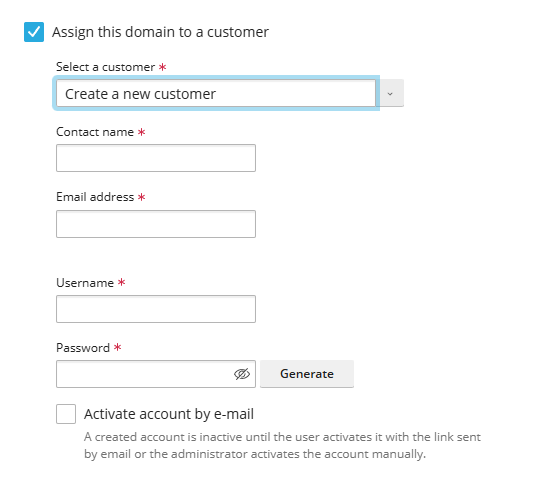
		- Tên tên miền
		- Chọn webspace: Có thể tạo subscription mới hoặc sử dụng chung tài nguyên với subscription đã có 
		- 
		- Plesk cũng gợi ý tạo khách hàng mới ngay từ giao diện này tích chọn `Assign this domain to a customer` để cấu hình. Có thể gán vào khách hàng đã có hoặc tạo khách hàng mới 
		- 
		- 
	- Sau khi đã cấu hình xong click chọn `AddDomain` 
		- 
	- Domain được tạo
		- 

## Subscriptions
- Quản lý các subscription có trong hệ thống 

### Tổng quan 
- Các nút chức năng 
	- 
	- Add subscription: Thêm gói đăng ký mới. 
		- Click chọn để thêm gói mới 
		- 
		- Tại giao diện khởi tạo cung cấp nhiều lựa chọn cấu hình 
			- Trang khởi đầu cho HTML hoặc PHP: Tạo một trang web đơn giản sử dụng HTML hoặc PHP, thường dành cho người mới bắt đầu hoặc các dự án nhỏ.
			- Trình tạo website kéo & thả: Công cụ trực quan giúp bạn xây dựng website mà không cần viết mã, phù hợp với người không chuyên về kỹ thuật.
			- Website chạy WordPress mới nhất: Tạo một website sử dụng nền tảng WordPress – phổ biến cho blog, cửa hàng online, và trang tin tức.
			- Kích hoạt Node.js trên tên miền: Dành cho các ứng dụng web sử dụng Node.js – thường là các ứng dụng thời gian thực hoặc có tính tương tác cao.
			- Tạo tên miền chỉ dùng cho email: Thiết lập tên miền để sử dụng cho dịch vụ email, không có website.
			- Từ máy cục bộ: Tải lên website từ máy tính cá nhân.
			- Lấy file từ Git repository: Tạo website bằng cách lấy mã nguồn từ kho lưu trữ Git – phù hợp với lập trình viên.
			- Cài đặt ứng dụng Laravel mới: Tạo website sử dụng framework Laravel – phổ biến với các ứng dụng web phức tạp.
			- Từ dịch vụ hosting khác: Di chuyển website từ nhà cung cấp hosting khác sang đây.
		- Sau khi đã chọn kiểu web xong thực hiện tới phần cấu hình
		- 
			- Domain name: Đây là tên miền bạn muốn sử dụng cho website
			- Service plan: Là gói dịch vụ bạn chọn cho tên miền này. Gói dịch vụ có thể quy định dung lượng, băng thông, số lượng email, v.v. Gói này được tạo trong phần service plans 
			- Additional subscription settings
				- IP address (shared): Địa chỉ IP dùng chung để truy cập file qua FTP hoặc RDP.
				- Username: Tên đăng nhập để quản lý hosting
				- Password: Mật khẩu có thể được tạo tự động bằng nút "Generate".
				- Description: Mô tả nội bộ, chỉ người quản trị hosting (Plesk admin hoặc reseller) mới thấy.
			- Tùy chọn sau khi tạo (Proceed to customizing the subscription parameters after it is created): Bạn có thể tùy chỉnh thêm sau khi tạo subscription, nhưng nếu làm vậy thì subscription sẽ bị khóa để đồng bộ.
		- Click chọn Add Subscription để tạo subscription mới với các thông tin đã nhập.
			- 
			- 
	- Change Plan: Thay đổi gói cấu hình cho Subscription được chọn 
		- 
		- 
	- Change Subscriber: Thay đổi subscriber cho Subscription được chọn 
		- 
		- 
	- Set status: Cấu hình trạng thái của Subscription 
		- 
	- Remove: Xoá Subscription khỏi hệ thống 
		- 

- Bảng các subscription: gồm các cột thông tin 
	- 
	- Subscription: Tên gói đăng ký. Click mở giao diện quản trị chi tiết 
	- Subscriber: Tên chủ sở hữu có thể là Admin/ Reseller/ Customer. Click chuyển tới giao diện quản lý. 
	- Setup Date: Ngày cấu hình 
	- Expiration Date: Ngày hết hạn gói dịch vụ 
	- Manage in Reseller/Customer Panel: Cho phép quản trị viên đăng nhập trang của reseller/customer để quản lý/ cấu hình 
	
### Giao diện quản trị subscription. 
- Bằng việc click vào `Subscription` tại danh sách Subscription, chuyển tới giao diện thông tin chi tiết.
- 
- 
- Giao diện này chứa cấu hình quản trị tất cả các tên miền có trong subscription.
- Giao diện này gồm các mục chính để quản lý toàn bộ dịch vụ hosting:
	- Websites & Domains: Quản lý tên miền và website.
	- Mail: Cấu hình email theo tên miền.
	- Applications: Cài đặt ứng dụng như WordPress, Joomla, v.v.
	- Files: Quản lý tệp tin trên hosting.
	- Databases: Tạo và quản lý cơ sở dữ liệu (MySQL, PostgreSQL...).
	- Statistics: Thống kê lưu lượng truy cập, dung lượng sử dụng.
	- Users: Quản lý người dùng có quyền truy cập hosting.

#### Websites and Domains 
- Giao diện Websites & Domains dùng để quản lý toàn bộ website, tên miền, và các dịch vụ liên quan như email, cơ sở dữ liệu, SSL, và DNS. Đây là nơi bạn cấu hình và kiểm soát hoạt động của từng website trên hosting.
- Các nút chức năng 
	- Add Domain: Dùng thêm domain mới vào subscription
		- Click chọn để thêm tên miền mới 
		- 
		- Tại giao diện khởi tạo cung cấp nhiều lựa chọn cấu hình
		- 
		- Sau khi đã chọn kiểu khởi tạo chuyển tới phần cấu hình 
		- Các trường cấu hình
		- 	
			- Domain name: Tên miền bạn muốn tạo
			- Hosting type: Chọn loại dịch vụ lưu trữ. Web Hosting/ Forwarding/ No Hosting 
			- Activate the DNS service: Bật dịch vụ DNS để tên miền hoạt động.
			- Activate the mail service: Bật dịch vụ email cho tên miền.
			- Hosting Settings
				- Document root: Thư mục gốc của website trên máy chủ, ví dụ: /demo3.io.vn.
				- Preferred domain: Chọn định dạng tên miền ưu tiên để chuyển hướng người dùng hoặc không chuyển hướng (None)
		- Sau khi đã cấu hình xong chọn Add domain để tiến hành thêm 
		- 
		- 
	- Add SubDomain: Dùng thêm subdomain 
		- Click mở giao diện cấu hình tạo subdomain 
		- 
		- 
	- Add Domain Alias: Dùng thêm bí danh cho tên miền 
		- Click mở giao diện cấu hình tạo domain alias  
		- 
		- 
	
- Danh sách các domain quản lý
	- 
	- Hiển thị danh sách các website(domain hoặc subdomain) bạn đang quản lý.
	- Mỗi website sẽ có các công cụ riêng để cấu hình và kiểm soát. (Trình bày cụ thể bên dưới) 
	- Gồm các cột thông tin
		- Domain Name : Tên miền 
		- Status: Trạng thái. Có thể cấu hình trạng thái nhanh tại đây. 
		- 
		- Disk usage: Dung lượng đã sử dụng 
		- Traffic: Lưu lượng đã sử dụng MB/tháng 
		- Các nút chức năng : Tính năng tương tự phần danh sách các domain trong `Domain` 
		- 
			- Wordpress Management: Click chuyển tới giao diện quản lý WP-Toolkit đối với website sử dụng 
			- Sitejet Builder: Chuyển tới giao diện CMS Sitejet tạo website 
			- File Manager: Chuyển tới giao diện quản lý tệp tin của hosting 
			- Mail Account: Cấu hình tài khoản mail 
			- Databases: Chuyển tới giao diện quản lý database 
			- Hosting Settings: Quản lý các cài đặt cấu hình của hosting 
			- Các nút thao tác khác: 
				- Move Domain: Chuyển tên miền tới subscription khác 
				- Change Domain Name: Thay đổi tên tên miền 
				- Remove Website: Xoá website đã khởi tạo với tên miền trên hosting 

- Panel các chức năng khác và thông tin về subscription (bên phải)
	- 
	- Backup & Restore : Quản lý sao lưu và phục hồi 
		- 
		- 
		- Các nút chức năng:
			- Tạo backup mới 
			- 
			- 
			- Có thể cấu hình 
				- Nội dung bản sao lưu: Cấu hình, Mail, Tệp người dùng, CSDL 
				- Nơi lưu trữ
				- Loại sao lưu: Đầy đủ/Chỉ sao lưu thay đổi 
				- Ghi chú:
				- Các cài đặt bổ sung: Bỏ qua file log, bỏ qua tệp đặc biệt, gửi thông báo,...
			- Tải lên bản backup
				- 
				- Bạn có thể chọn file sao lưu từ máy tính để tải lên Plesk.
					- Dung lượng tối đa cho mỗi file là 2 GB.
					- Có tùy chọn Upload More Files nếu bạn cần tải nhiều file.
				- Cài đặt bảo mật cho sao lưu
					- Plesk sẽ kiểm tra cấu trúc và chữ ký của file sao lưu.
					- Nếu file bị sửa đổi, hỏng, hoặc tạo từ máy chủ khác, Plesk sẽ không tin tưởng file đó.
					- Bạn có thể chọn "Upload backup files without a valid signature" nếu bạn tin tưởng nguồn file, nhưng có rủi ro bảo mật.
				- Bảo vệ bằng mật khẩu
					- Nếu file sao lưu có mật khẩu, bạn cần nhập vào để khôi phục.
					- Nếu nhập sai mật khẩu, Plesk vẫn tải lên file, nhưng sẽ yêu cầu mật khẩu đúng khi khôi phục.
				- 
			- Xoá bản backup: Xoá bản backup đang chọn
				- 
			- Schedule: Lên lịch Backup
				- 
				- 
				- Gồm các cấu hình: 
					- Kích hoạt task 
					- Cấu hình thời gian thực thi
					- Chọn kiểu backup
					- Cấu hình thời gian thực hiện tác vụ backup full
					- Cấu hình số lượng các bản full backup được lưu trữ. 
					- Các cài đặt cấu hình của bản backup.
			- Cấu hình Server lưu trữ từ xa sử dụng FTPS
				- Click tới giao diện thêm máy chủ FTPS để cấu hình 
				- 
				- 
				- 
	- Databases: Quản lý cơ sở dữ liệu. Chuyển tới tab quản lý Databases của hosting 
		- 
	- Scheduled Tasks: Thiết lập tác vụ tự động (cron jobs).
		- 
		- 
		- Các nút chức năng 
			- Add Task: Dùng thêm tác vụ mới 
			- 
			- 
				- Active: Tích chọn để enable tác vụ
				- Task type:
					- Run a command: Chạy lệnh hệ thống (đang được chọn).
					- Fetch a URL: Gửi yêu cầu HTTP đến một URL.
					- Run a PHP script: Chạy một đoạn mã PHP.
				- Cấu hình lịch chạy
					- Run: Thiết lập thời gian chạy
					- Time zone: Thiết lập múi giờ
				- Thông tin bổ sung
					- Command & Arguments: Lệnh và tham số nếu có 
					- Description: Mô tả của tác vụ 
					- Notify:
						- Do not notify: Không gửi thông báo .
						- Có thể chọn thông báo khi lỗi hoặc mỗi lần chạy. (Error Only/ Everytime)
				- Nút thao tác
					- Run Now: Chạy tác vụ ngay lập tức.
					- OK: Lưu và kích hoạt tác vụ.
					- Cancel: Hủy thao tác.
			- Refresh : Làm mới danh sách task 
			- Remove: Xoá task đã chọn
			- 
			- Settings: Click mở giao diện cài đặt chọn múi giờ để hiển thị và chạy các tác vụ tự động theo đúng thời gian mong muốn.
			- 
			- 
		- Danh sách các tác vụ đã có. Gồm các cột thông tin
			- 
			- Lệnh tác vụ thực hiện 
			- Lịch khởi chạy 
			- Nút chức năng khởi chạy tác vụ ngay lập tức. 
	- Outgoing Mail Control: Cấu hình quản lý mail gửi đi dùng để kiểm soát số lượng email gửi đi từ các đối tượng trong Plesk
		- 
		- General: Giao diện theo dõi việc gửi email ra ngoài từ hệ thống Plesk
		- 
			- Attempts to exceed limits: Thống kê số lượng đối tượng cố gắng vượt quá giới hạn gửi email trong khoảng thời gian báo cáo (1 tuần).
			- Domains / Subscription :Hiển thị danh sách domain hoặc subscription có hành vi gửi vượt giới hạn.
			- Objects attempting to exceed limits: Nếu có vi phạm, danh sách các đối tượng sẽ hiển thị tại đây.
		- Domains: Giám sát việc gửi mail ở cấp độ Domains 
			- Danh sách các tên miền kèm theo thông tin:
				- Name: Tên domain đang được giám sát 
				- Limit per Hour: Giới hạn số lượng email được phép gửi mỗi giờ 
				- Attempts after Reaching the Limit: Số lần cố gắng gửi email sau khi vượt giới hạn 
				- Last Attempt: Thời điểm gần nhất có hành vi vượt giới hạn 
				- Mail Status: Trạng thái gửi email hiện tại
				- Xem chi tiết bằng cách click chọn vào domain tại cột Name 
				- 
				- 
				- General (Tổng quan)
					- Mail status: Trạng thái dịch vụ mail của tên miền .
					- Current limit: Giới hạn gửi email mỗi giờ.
					- Có thể thay đổi giới hạn bằng nút chức năng `Change Limit`. Các tùy chọn cấu hình
					- 
					- 
						- Default (50 messages per hour): Giới hạn mặc định: domain chỉ được gửi tối đa 50 email mỗi giờ.
						- Custom value for this domain: Cho phép nhập giá trị tùy chỉnh
							- `messages per hour`: cấu hình thông số cụ thể số mail được gửi / giờ
							- Unlimited: không giới hạn số lượng email gửi ra.	
					- Attempts to send mail after reaching the limit: Hiển thị số lần domain cố gắng gửi email vượt quá giới hạn. Cho phép chọn khoảng thời gian (ví dụ: trong ngày).
					- Sent messages (Thống kê email đã gửi)
						- Chọn ngày để xem thống kê.
						- Hiển thị số lượng email đã gửi theo từng giờ
		- Subscription: Giám sát việc gửi mới đối với các subscription
			- General (Tổng quan)
			- 
			- Mail status: Trạng thái dịch vụ gửi email của Subscription
			- Current limit: Số mail được phép gửi tối đa mỗi giờ của Subscription
				- Có thể thay đổi giới hạn bằng nút chức năng `Change Limit`. Các tùy chọn cấu hình
				- 
				- 			
				- Outgoing messages from a domain (per hour)
					- Default server-wide value: Mặc định toàn hệ thống là 50 email mỗi giờ cho mỗi domain.
					- Custom value for the subscription: Cho phép nhập giá trị tùy chỉnh:
					- [0] → chặn hoàn toàn việc gửi email từ domain.
					- Tùy chọn [ ] Unlimited → không giới hạn số lượng email gửi ra.
				- Outgoing messages from a subscription (per hour)
					- Default server-wide value: Mặc định toàn hệ thống là 100 email mỗi giờ cho mỗi subscription.
					- Custom value for the subscription: Cho phép nhập giá trị tùy chỉnh:
						- [0] → chặn hoàn toàn việc gửi email từ subscription.
						- [ ] Unlimited → không giới hạn số lượng email gửi ra.	
			- Attempts to send mail after reaching the limit: Hiển thị số lần subscription cố gắng gửi email vượt quá giới hạn. Cho phép chọn khoảng thời gian (ví dụ: theo ngày).
			- Sent messages (Thống kê email đã gửi): Hiển thị số lượng email đã gửi theo từng giờ. Có thể chọn ngày để xem thống kê.
	- WordPress: Quản lý cài đặt WordPress. Click chuyển tới giao diện quản lý Wordpress của WP-Toolkit
		- 			
		- 			
	- Action Log: Xem lịch sử hoạt động.
		- 	
		- 	
		- Các nút chức năng 
			- Download: Tải về file chứa log 
			- 	
			- Refresh: Làm mới để lấy bản ghi mới nhất 
			- Settings: Mở giao diện cấu hình các actions sẽ được ghi lại 
			- 	
			- 	
			- Clear items: Xoá bản ghi 
			- 	
		- Bảng chi tiết các hành động được ghi lại gồm các cột thông tin 
			- Date: Ngày tháng hành động diễn ra 
			- IP: Địa chỉ IP thiết lập 
			- User: Tài khoản thực hiện cấu hình 
			- Action: hành động thao tác được thực hiện 
			- Details: Thông tin chi tiết thường là tác động của action tới domain nào 
			- 	
	- Thông tin hệ thống
		- 	
		- IP address: Địa chỉ IP đang dùng.
		- System user: Tên người dùng hệ thống để truy cập hosting.
		- Manage in Customer/Reseller Panel: Quản lý trong giao diện khách hàng/nhà phân phối.
		- Subscription status: Trạng thái gói dịch vụ có thể thao tác active hoặc suspend nhanh tại đây.
		- Administrator's description: Ghi chú cho quản trị viên reseller, người dùng không có quyền xem 
		- Disk space: Dung lượng đã sử dụng.
		- Traffic: Lưu lượng truy cập đã dùng.
		- Có thêm xem các thông tin phân tích chi tiết hơn bằng nút `View more Statistics`: Click chuyển tới tab phân tích. 
	- Tùy chọn quản lý
		- Subscriber: Hiển thị chủ sở hữu có thể thay đổi nhanh bằng nút `Change subscriber` Thay đổi người đăng ký dịch vụ.
		- Service plan: Hiển thị gói dịch vụ Subscription được gán 
		- Add-ons: Hiển thị các tiện ích được cài nếu có 
		- Change plan/add-ons: Thay đổi gói dịch vụ hoặc thêm tiện ích. Click mở giao diện chuyển đổi plan 
			- 	
			- 	
		- Customize: Tùy chỉnh subscription. Click chuyển tới giao diện custom gói đăng ký 
			- 	
			- Cụ thể các thông số cấu hình trình bày tại phần tạo plans `Service Plan` 
			- 	
		- Remove Subscription: Xóa gói dịch vụ.

- Giao diện các công cụ riêng để cấu hình và kiểm soát từng website:
- Giao diện này nằm trong danh sách các domain của subscription
- Giao diện này gồm 
- Khung preview website kèm nút chức năng mở website/ mở preview 
	- 	
	- Bên dưới là các thông kê về 
		- Dung lượng ổ đĩa đã sử dụng
		- Lưu lượng đã sử dụng trong tháng 
		- Nút chức năng `More Statistics` xem các phân tích chi tiết hơn tại tab `Statistics`
- Các tab quản lý 
	- Wordpress: Giao diện quản lý Wordpress của tiện ích WP-Toolkit. Trình bày chi tiết tại phần tìm hiểu tiện ích WP-Toolkits
	- Dashboard: Các cấu hình quản lý chung của website 
	- Hosting & DNS: Các cấu hình liên quan tới hosting là DNS 
	- Mail: Các cấu hình dịch vụ mail 
	- Get started: Giao diện khởi tạo đối với website mới. 

- Dashboard: Cung cấp các cấu hình quản lý chính cho website. 
	- 	

- Cấu hình cơ bản & Dữ liệu: 
- Connection Info – Thông tin truy cập FTP, DB.
	- Click mở giao diện cung cấp thông tin tài khoản mật khẩu FTP/Database 
	- 	
	- 	
	- Thông tin người dùng hệ thống: 
		- IP máy chủ, Tài khoản, Mật khẩu để đăng nhập vào Plesk quản lý Hosting 
		- Các nút chức năng 
			- Additional FTP accounts: Click chuyển tới giao diện quản lý tài khoản FTP 
			- Manage Access: Click chuyển tới thiết lập truy cập trong Cài đặt Hosting 
	- Thông tin cơ sở dữ liệu 
		- Host, tên database, tài khoản, mật khẩu truy cập 
		- Các nút chức năng 
			- phpMyAdmin: Click chuyển tới web đăng nhập phpMyAdmin
			- Manage Databases: Click chuyển tới giao diện quản lý các DB có trong Domain 
- Files – Quản lý tệp tin trên hosting. Tại đây bạn có thể quản lý tệp tin, down/upload file source website. 
	- 	
	- 	
- Databases – Tạo/quản lý CSDL.
	- 	
	- 	
	- Tại đây là giao diện tạo mới, quản lý các database.
		- Gồm danh sách các Database hiện có:
			- Thông tin: Host, user, bảng trong database, Kích thước 
			- Các nút chức năng: 
				- phpMyAdmin: Click mở giao diện phpmyadmin 
				- Connection Info: Click mở giao diện thông tin kết nối tới DB
					- 
					- 
				- Copy: Sao chép database tới 1 DB có sẵn hoặc tạo 1 DB mới 
					- 
					- 
				- Export/Import Dump: Dùng xuất và nhập file Dump dữ liệu 
					- 
					- 
				- Check and repair: Kiểm tra và sửa chữa lỗi DB 
				- Remote Database: Xoá cơ sở dữ liệu 
				- Move to Subscription: Di chuyển cơ sở dữ liệu sang một Subscription khác. 
			- Nút chức năng 
				- User Management: Quản lý người dùng cơ sở dữ liệu 
					- 
					- 
					- Các nút chức năng: 
						- Add Database User: Thêm người dùng DB mới.
						- 
						- 
						- Các cấu hình: 
							- Database Server: Máy chủ CSDL 
							- Database username: tên người dùng 
							- Password: Mật khẩu
							- Database: Chọn DB muốn thêm user 
							- Access Control:
								- Allow local connections only: Chỉ cho phép kết nối local 
								- Allow remote connections from any host: Cho phép kết nối từ xa với bất kỳ IP nào.
								- Allow remote connections from: Chỉ có phép kết nối từ xa với IP cụ thể.
						- Danh sách các tài khoản cơ sở dữ liệu 
							- Name: Tên tài khoản
								- Click để chuyển tới giao diện chỉnh sửa tài khoản 
								- 
								- 							
								- Tại đây có thể 
									- Cấu hình username/password. 
									- Chọn database
									- Cấu hình roles và phân quyền chi tiết 
									- Cấu hình quản lý truy cập 
							- Database: Tên CSDL 
							- Database Server: Tên máy chủ hoạt động 
				- Backup & Restore : Quản lý sao lưu và phục hồi 
					- 
					- 
					- Các nút chức năng:
						- Tạo backup mới 
						- 
						- 
						- Có thể cấu hình 
							- Nội dung bản sao lưu: Cấu hình, Mail, Tệp người dùng, CSDL 
							- Nơi lưu trữ
							- Loại sao lưu: Đầy đủ/Chỉ sao lưu thay đổi 
							- Ghi chú:
							- Các cài đặt bổ sung: Bỏ qua file log, bỏ qua tệp đặc biệt, gửi thông báo,...
						- Tải lên bản backup
							- 
							- Bạn có thể chọn file sao lưu từ máy tính để tải lên Plesk.
								- Dung lượng tối đa cho mỗi file là 2 GB.
								- Có tùy chọn Upload More Files nếu bạn cần tải nhiều file.
							- Cài đặt bảo mật cho sao lưu
								- Plesk sẽ kiểm tra cấu trúc và chữ ký của file sao lưu.
								- Nếu file bị sửa đổi, hỏng, hoặc tạo từ máy chủ khác, Plesk sẽ không tin tưởng file đó.
								- Bạn có thể chọn "Upload backup files without a valid signature" nếu bạn tin tưởng nguồn file, nhưng có rủi ro bảo mật.
							- Bảo vệ bằng mật khẩu
								- Nếu file sao lưu có mật khẩu, bạn cần nhập vào để khôi phục.
								- Nếu nhập sai mật khẩu, Plesk vẫn tải lên file, nhưng sẽ yêu cầu mật khẩu đúng khi khôi phục.
							- 
						- Xoá bản backup: Xoá bản backup đang chọn
							- 
						- Schedule: Lên lịch Backup
							- 
							- 
							- Gồm các cấu hình: 
								- Kích hoạt task 
								- Cấu hình thời gian thực thi
								- Chọn kiểu backup
								- Cấu hình thời gian thực hiện tác vụ backup full
								- Cấu hình số lượng các bản full backup được lưu trữ. 
								- Các cài đặt cấu hình của bản backup.
						- Cấu hình Server lưu trữ từ xa sử dụng FTPS
							- Click tới giao diện thêm máy chủ FTPS để cấu hình 
							- 
							- 
							- 
- ODBC Data Sources – Quản lý nguồn kết nối dữ liệu ODBC
	- 
	- Khởi tạo ODBC DSN mới 
	- 
	- 
	- Nút chức năng	
		- Tạo kết nối mới : Các thông số cấu hình 
			- Tên kết nối 
			- Mô tả kết nối 
			- Kiểu driver 
				- SQL Server: Các thông số cấu hình
				- 
					- Thông tin kết nối chính
						- [DRIVER] Driver: Trình điều khiển sử dụng – SQL Server.
						- [SERVER]: Tên máy chủ cơ sở dữ liệu 
						- [UID] Login ID: Tên đăng nhập để truy cập SQL Server.
						- [PWD] Password: Mật khẩu tương ứng với UID.
					- Tùy chọn bổ sung
						- [DATABASE] Default database: Tên cơ sở dữ liệu mặc định sẽ kết nối.
						- [APP] Application name: Tên ứng dụng đang sử dụng kết nối này.
						- [WSID] Workstation ID: ID của máy trạm đang thực hiện kết nối.
						- [LANGUAGE] Default language: Ngôn ngữ mặc định cho kết nối.
						- [OEMTOANSI]: Tùy chọn chuyển đổi ký tự mở rộng sang mã OEM.
				- Microsoft Access Driver: Các thông số cấu hình 
				- 
					- Thông tin kết nối cơ bản
						- [DRIVER]: Trình điều khiển sử dụng – Microsoft Access Driver (-.mdb).
						- [DBQ]: Đường dẫn đến file cơ sở dữ liệu Access (.mdb) – bắt buộc phải nhập.
						- [UID]: Tên đăng nhập để truy cập cơ sở dữ liệu.
						- [PWD]: Mật khẩu tương ứng với UID.
					- Tùy chọn nâng cao
						- [PAGETIMEOUT]: Thời gian giữ trang trong bộ đệm (tính bằng phần mười giây).
						- [MAXBUFFERSIZE]: Kích thước bộ đệm nội bộ (KB), căn chỉnh theo 256 KB.
						- [READONLY]: Đánh dấu cơ sở dữ liệu là chỉ đọc (không cho phép cập nhật).
						- [EXCLUSIVE]: Đánh dấu cơ sở dữ liệu là độc quyền (không chia sẻ cập nhật).
						- [SAFETRANSACTIONS]:
							- 0: Giao dịch được commit ngay.
							- 1: Giao dịch chỉ được ghi khi thực hiện commit (an toàn hơn nhưng chậm hơn).
						- [THREADS]: Số luồng nền mà engine sử dụng (ở đây là 3).
						- [MAXSCANROWS]: Số dòng quét để xác định kiểu dữ liệu của cột (ở đây là 8).
						- [IMPLICITCOMMITSYNC]: Quy định cách ghi thay đổi ngoài giao dịch.
						- [USERCOMMITSYNC]: Quy định việc commit giao dịch do người dùng có thực hiện bất đồng bộ hay không.			
				- Microsoft Excel Driver: Các thông số cần cấu hình 
				- 
					- [DRIVER] Driver: Trình điều khiển dùng để kết nối – Microsoft Excel Driver (*.xls), dùng cho file Excel định dạng cũ (.xls).
					- [DBQ] Database file path: Đường dẫn đến file Excel cần kết nối.
					- [DefaultDir] Default data directory: Thư mục dữ liệu mặc định.
					- [FIL] Database version: Phiên bản cơ sở dữ liệu.
					- [MaxBufferSize]: Kích thước bộ đệm tối đa – mặc định là 2048.
					- [PageTimeout]: Thời gian chờ trang – mặc định là 5 giây.
			- Nút chức năng kiểm tra kết nối và lưu 	
		- Remove: Xoá kết nối đang chọn 
		- 
	- Danh sách các kết nối ODBC hiện có. Gồm các cột thông tin 
		- Trạng thái kết nối 
		- Tên kết nối 
		- Kiểu Driver 
		- Mô tả của kết nối 
- FTP – Tài khoản FTP.
	- 
	- 
	- Các nút chức năng 
		- Add an FTP account: Thêm tài khoản FTP mới 
			- 
			- 
			- Các cấu hình với giao diện tạo tài khoản FTP 
				- Thông tin tài khoản FTP
					- FTP account name: Tên tài khoản FTP (bắt buộc).
					- Home directory: Thư mục gốc mà tài khoản FTP có quyền truy cập (bắt buộc).
					- Password: Mật khẩu cho tài khoản FTP.
					- Có thể tạo tự động (Generate) hoặc hiển thị (Show).
					- Confirm password: Nhập lại mật khẩu để xác nhận.
				- Dung lượng ổ đĩa
					- Hard disk quota: Giới hạn dung lượng mà tài khoản FTP được sử dụng.
					- Có thể nhập số MB hoặc chọn Unlimited (không giới hạn).
				- Phân quyền truy cập
					- Read permission: Cho phép đọc dữ liệu.
					- Write permission: Cho phép ghi dữ liệu (tải lên, chỉnh sửa).
			- Remove: Xoá tài khoản FTP đang chọn 
				- 
	- Danh sách các tài khoản FTP hiện có:
		- 	
		- Name: Tên tài khoản. Click để mở giao diện chỉnh sửa thông tin tài khoản 
		- 	
		- 	
		- Home: Đường dẫn thư mục FTP 
	- Ví dụ tạo tài khoản FTP 
		- Click chọn `Add An FTP Account`
		- Cấu hình các thông số: Tên, Thư mục gốc, Password, Giới hạn quota ổ đĩa, Quyền được gán.
			- 	
		- Cấu hình xong click `OK` để khởi tạo. Tài khoản được tạo 
			- 	
- Backup & Restore – Sao lưu/khôi phục.
	- 	
	- 
	- Các nút chức năng:
		- Tạo backup mới 
		- 
		- 
		- Có thể cấu hình 
			- Nội dung bản sao lưu: Cấu hình, Mail, Tệp người dùng, CSDL 
			- Nơi lưu trữ
			- Loại sao lưu: Đầy đủ/Chỉ sao lưu thay đổi 
			- Ghi chú:
			- Các cài đặt bổ sung: Bỏ qua file log, bỏ qua tệp đặc biệt, gửi thông báo,...
		- Tải lên bản backup
			- 
			- Bạn có thể chọn file sao lưu từ máy tính để tải lên Plesk.
				- Dung lượng tối đa cho mỗi file là 2 GB.
				- Có tùy chọn Upload More Files nếu bạn cần tải nhiều file.
			- Cài đặt bảo mật cho sao lưu
				- Plesk sẽ kiểm tra cấu trúc và chữ ký của file sao lưu.
				- Nếu file bị sửa đổi, hỏng, hoặc tạo từ máy chủ khác, Plesk sẽ không tin tưởng file đó.
				- Bạn có thể chọn "Upload backup files without a valid signature" nếu bạn tin tưởng nguồn file, nhưng có rủi ro bảo mật.
			- Bảo vệ bằng mật khẩu
				- Nếu file sao lưu có mật khẩu, bạn cần nhập vào để khôi phục.
				- Nếu nhập sai mật khẩu, Plesk vẫn tải lên file, nhưng sẽ yêu cầu mật khẩu đúng khi khôi phục.
			- 
		- Xoá bản backup: Xoá bản backup đang chọn
			- 
		- Schedule: Lên lịch Backup
			- 
			- 
			- Gồm các cấu hình: 
				- Kích hoạt task 
				- Cấu hình thời gian thực thi
				- Chọn kiểu backup
				- Cấu hình thời gian thực hiện tác vụ backup full
				- Cấu hình số lượng các bản full backup được lưu trữ. 
				- Các cài đặt cấu hình của bản backup.
		- Cấu hình Server lưu trữ từ xa sử dụng FTPS
			- Click tới giao diện thêm máy chủ FTPS để cấu hình 
			- 
			- 	

- Virtual Directories – Thư mục ảo (cho IIS, ASP.NET).
- 	
- 	
- Giao diện gồm 
	- Các tab quản trị 
	- 	
		- Directories: Quản lý danh sách các thư mục: Tạo, sửa, xoá thư mục 
		- MIME Types: Cấu hình các kiểu dữ liệu được hỗ trợ 
		- Error Documents: Tuỳ chỉnh trang lỗi 
		- Protection: Thiết lập bảo vệ thư mục bằng mật khẩu. 
	- Các nút cấu hình
	- 	
		- Directory Properties: Hiển thị và cấu hình thông tin chi tiết của thư mục gốc httpdocs 
			- 
			- Virtual Directory
				- Path: htdocs – thư mục vật lý được ánh xạ.
				- Script source access: Cấu hình cho phép truy cập mã nguồn script.
				- Read permission: Cấu hình cho phép đọc dữ liệu .
				- Write permission: Cấu hình cho phép ghi dữ liệu.
				- Directory browsing: Cấu hình cho phép duyệt thư mục.
				- Log visits: Cấu hình ghi lại lượt truy cập.
			- Application Settings
				- Create application: Thư mục này hoạt động như một ứng dụng web.
				- Execute permissions: Cấu hình cho phép chạy script, script and executables hoặc không.
				- Allow to use parent paths: Cấu hình cho phép dùng đường dẫn cha (..).
				- Allow application execution in MTA mode: Cấu hình bật chế độ đa luồng.
			- Directory Security
				- Anonymous authentication: Cấu hình cho phép truy cập không cần đăng nhập (✓).
				- Windows authentication: Cấu hình bật xác thực Windows.
				- Require SSL/TLS: Cấu hình yêu cầu kết nối bảo mật.
			- 	
			- ASP Settings
				- ASP buffer size: Tối đa 4096 KB – theo cấu hình IIS.
				- Entity body size: Tối đa 196 KB – theo IIS.
				- Server-side debugging: Không bật gỡ lỗi phía máy chủ.
				- Client-side debugging: Không bật gỡ lỗi phía trình duyệt.
			- Documents
				- Use default documents: Đã bật – cho phép dùng file mặc định khi truy cập thư mục.
				- Search order: Thứ tự ưu tiên các file mặc định:
					- Index.html
					- Index.htm
					- Index.cfm
					- Index.shtml
				- Có thể thêm bằng cách điền vào textbox và chọn Add
		- Directory Access Permissions: Hiển thị và cấu hình thông tin chi tiết về quyền truy cập của thư mục đang cấu hình 
			- 
			- Tùy chọn kế thừa quyền
				- Cho phép kế thừa quyền từ thư mục cha đến thư mục này và các thư mục con.
				- Thay thế quyền hiện tại của thư mục con bằng quyền hiển thị ở đây.
			- Bảng các nhóm, người dùng và chi tiết quyền 
					- Có thể thêm người dùng và cấp quyền bằng cách chọn user, click icon thêm, sau đó cấu hình quyền tạo cột permissions 
					- 	
			- Click `Advanced` để mở phần cấu hình nâng cao. Click chọn các user tạo bảng user và cấu hình quyền chi tiết ở bảng dưới. 
				- 	
				- 	
		- ASP.NET: Cấu hình các thiết lập của ASP.NET 
			- 	
			- Framework Version
				- Version: 4.8.0: Phiên bản ASP.NET đang sử dụng. Có thể thay đổi nếu cần tương thích với ứng dụng bằng nút `Change Version`
				- 	
				- Connection String Manager
					- Chuỗi kết nối đến cơ sở dữ liệu SQL Server cục bộ.
					- Có thể thêm nhiều chuỗi kết nối khác nếu ứng dụng dùng nhiều nguồn dữ liệu bằng nút `Add one more`
					- 	
			- Custom Error Settings
				- Custom error mode: On/Off/RemoteOnly. Cấu hình hiển thị trang lỗi tuỳ chỉnh: Bật/Tắt/ RemoteOnly (Hiển thị lỗi chi tiết khi truy cập từ máy cục bộ, còn từ xa thì hiển thị trang lỗi tùy chỉnh.)
				- Custom errors: Định nghĩa lỗi tùy chỉnh. 
					- Cấu trúc: Mã lỗi : Đường dẫn chuyển hướng 
					- Có thể thêm nhiều mã lỗi bằng nút `Add one more`
			- Compilation and Debugging
				- Default webpage language: Cấu hình Ngôn ngữ mặc định của trang web ASP.NET.
				- 	
				- Switch on debugging: Cấu hình bật chế độ gỡ lỗi.
				- Temporary directory: Cấu hình thư mục tạm dùng khi biên dịch.
			- Globalization Settings
				- Request encoding: utf-8
				- Response encoding: utf-8
				- File encoding: Windows-1252
				- Culture: Invariant 
				- UI Culture: Invariant
				- Các thiết lập này kiểm soát cách ứng dụng xử lý ngôn ngữ, mã hóa và định dạng văn bản.
			- Code Access Security (CAS) Trust level: Full/High/Medium/Low/Minimal Cấu hình mức độ cho phép ứng dụng ASP.NET truy cập tài nguyên hệ thống.
			- Session Settings
				- Authentication mode: Windows/Forms/Passport/None: Cấu hình chế độ xác thực người dùng truy cập.
				- Session timeout: Cấu hình thời gian hết hạn phiên làm việc của người dùng.
		- PHP: Cấu hình phiên bản PHP 
			- 	
- Directories: Quản lý danh sách các thư mục: Tạo, sửa, xoá thư mục 
	- 	
	- Các nút chức năng 
		- Create Virtual Directory: Tạo thư mục ảo mới 
			- 	
			- 	
			- Virtual Directory (Thư mục ảo):
				- Name: Tên của thư mục ảo bạn muốn tạo.
				- Path: Đường dẫn vật lý trên máy chủ nơi thư mục sẽ được lưu.
				- Create a physical directory...: Tùy chọn để tạo thư mục vật lý trùng tên với thư mục ảo.
				- Script source access: Cho phép truy cập mã nguồn của các script.
				- Read permission: Cho phép đọc nội dung trong thư mục.
				- Write permission: Cho phép ghi dữ liệu vào thư mục.
				- Directory browsing: Cho phép người dùng duyệt nội dung thư mục qua trình duyệt.
				- Log visits: Ghi lại nhật ký truy cập vào thư mục.
			- Application Settings (Cài đặt ứng dụng):
				- Create application: Tạo một ứng dụng web từ thư mục ảo này.
				- Execute permissions: Cấu hình quyền thực thi: None/ Scripts Only/ Script & Executables (chỉ cho phép thực thi script như ASP, PHP...).
			- ASP Settings (Cài đặt ASP):
				- Maximum size of ASP buffer (KB): Dung lượng bộ đệm tối đa cho ASP
				- Maximum size of entity body of an ASP request (KB): Kích thước tối đa của phần thân yêu cầu ASP
				- Enable ASP server-side script debugging: Cho phép gỡ lỗi script phía máy chủ.
				- Enable ASP client-side script debugging: Cho phép gỡ lỗi script phía trình duyệt.
		- Create Directory: Tạo thư mục mới 
			- 	
			- 	
		- Remove: Xoá file, thư mục được chọn 
			- 	
	- Danh sách các file, thư mục: Gồm các cột thông tin 
		- P: Protect: Hiển thị trạng thái bảo vệ của thư mục/ tệp tin. Click chuyển tới cấu hình bảo vệ. 
			- 	
			- Click chọn `Protect` để kích hoạt bảo vệ 
			- 	
			- Cấu hình tài khoản mật khẩu cho phép truy cập thư mục 
			- 	
			- Cấu hình hoàn tất 
			- 	
			- Kiểm tra truy cập thư mục đã được bảo vệ 
			- 	
		- Name: Tên thư mục/ Tệp tin 
		- Truy cập thư mục/ tệp bằng trình duyệt.
		- Quản lý quyền của tệp/ thư mục: Mở giao diện quản lý quyền tương tự nút chức năng `Directory Access Permissions`
- MIME Types: Cấu hình các kiểu dữ liệu được hỗ trợ 

- Website Copying – Sao chép website.

- Lập trình & Tính năng nâng cao 
- PHP (v8.3.19) – Cấu hình PHP.
- ASP.NET Settings – Dành cho .NET.
- Logs – Nhật ký hệ thống.
- Monitoring – Giám sát 
- Scheduled Tasks – Cronjob / tác vụ định kỳ.
- PHP Composer – Cài thư viện PHP qua Composer.
- Git – Kết nối Git repo.
- Failed Request Tracing – Truy vết lỗi.
- Applications – Cài CMS, phần mềm nhanh.
- WordPress Management – Quản lý WP.
- SEO – Tối ưu hóa công cụ tìm kiếm.
- Website Importing – Nhập dữ liệu từ web khác.
- Sitejet Builder – Trình khởi tạo Website 

- Bảo mật Website 
- SSL/TLS Certificates - Cấu hình cài đặt chứng chỉ SSL/TLS 
- Password-Protected Directories – Bảo vệ thư mục bằng mật khẩu.
- Advisor – Gợi ý hệ thống.
- Hotlink Protection – Chống chèn link ảnh/video từ web bạn.