## Tìm hiểu triển khai Pfsense
### 1. Pfsense
- pfSense là một ứng dụng có chức năng định tuyến vào tường lửa mạnh và miễn phí, ứng dụng này sẽ cho phép bạn mở rộng mạng của mình mà không bị thỏa hiệp về sự bảo mật. Bẳt đầu vào năm 2004, khi m0n0wallmới bắt đầu chập chững– đây là một dự án bảo mật tập trung vào các hệ thống nhúng – pfSense đã có hơn 1 triệu download và được sử dụng để bảo vệ các mạng ở tất cả kích cỡ, từ các mạng gia đình đến các mạng lớn của của các công ty. Ứng dụng này có một cộng đồng phát triển rất tích cực và nhiều tính năng đang được bổ sung trong mỗi phát hành nhằm cải thiện hơn nữa tính bảo mật, sự ổn định và khả năng linh hoạt của nó.
- pfSense bao gồm nhiều tính năng mà bạn vẫn thấy trên các thiết bị tường lửa hoặc router thương mại, chẳng hạn như GUI trên nền Web tạo sự quản lý một cách dễ dàng
- pfSense được dựa trên FreeBSD và giao thức Common Address Redundancy Protocol (CARP) của FreeBSD, cung cấp khả năng dự phòng bằng cách cho phép các quản trị viên nhóm hai hoặc nhiều tường lửa vào một nhóm tự động chuyển đổi dự phòng. Vì nó hỗ trợ nhiều kết nối mạng diện rộng (WAN) nên có thể thực hiện việc cân bằng tải
- PfSense hỗ trợ lọc bởi địa chỉ nguồn và địa chỉ đích, cổng nguồn hoặc cổng đích hay địa chỉ IP. Nó cũng hỗ trợ chính sách định tuyến và cơ chế hoạt động trong chế độ brigde hoặc transparent, cho phép bạn chỉ cần đặt pfSense ở giữa các thiết bị mạng mà không cần đòi hỏi việc cấu hình bổ sung. PfSense cung cấp cơ chế NAT và tính năng chuyển tiếp cổng, tuy nhiên ứng dụng này vẫn còn một số hạn chế với Point-to-Point Tunneling Protocol (PPTP), Generic Routing Encapsulation (GRE) và Session Initiation Protocol (SIP) khi sử dụng NAT.
- Các tính năng nổi bật của pfSense
	- Cung cấp dịch vụ tường lửa, High Availability, Load Balancing, ...
	- Sử dụng Web Interface để quản trị vì thể giao tiếp dễ dàng hơn.
	- Hiệu năng cao, ổn định, ...
	- Là phần mềm mã nguồn mở, miễn phí.
	- Cung cấp chức năng tạo VLAN, DNS, ...

### 2. Các lab thực hành với Pfsense
#### 2.1 Mô hình chung
- Bài thực hành thực hiện theo môi trường như trong sơ đồ sau: 
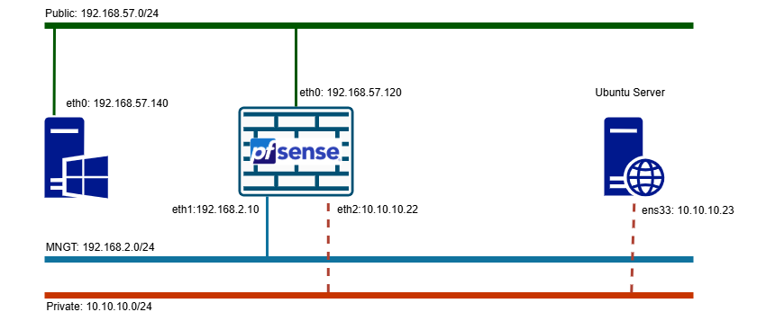
- Cấu hình Virtual Network Editor của VMware 
	- Trong đó 
		* VMNet8: NAT ra Internet 
		* VMNet1: Host-only (mạng quản lý PFSense) 
		* VMNet2: Host-only (giả lập mạng private) 

#### 2.2 Triển khai Pfsense
- Tải file iso Pfsense tại [đây](https://repo.ialab.dsu.edu/pfsense/pfSense-CE-2.7.2-RELEASE-amd64.iso.gz)
- Cấu hình máy ảo và card mạng của máy Pfsense:
	- Trong VMWare chọn File -> New Virtual Machine 

	- Chọn `Next` -> Chọn tới file iso đã tải 

	- Cấu hình tên và nơi lưu

	- Cấu hình dung lượng ổ đĩa 

	- Chọn `Custom ...` để thêm card mạng 

	- Chọn `Add` để thêm `Adapter` mạng 

	- Chọn `Network Adapter` -> Finish

	- Cấu hình cho `Network Adapter 2` có network connection là `VMnet1`: đây là Interface Host-only (quản lý PFSense)

	- Tương tự thêm và cấu hình cho `Network Adapter 3` có network connection là `VMNet2`: đây là Interface Host-only (giả lập mạng private) -> Close và click `Finish` để khởi tạo máy ảo 

- Cài đặt Pfsense
	- Sau khi khởi động VM chọn `Accept`

	- Chọn `Install` và chọn `OK` để vào mode cài đặt pfSense

	- Phần cấu hình phân vùng ổ cứng để tự động:

	- Qúa trình cài đặt diễn ra 

	- Chọn `reboot`

	- Cấu hình card mạng cho PFSense
		- Sau khi khởi động lại chọn `1` để cấu hình

		- Chọn KHÔNG cấu hình vlan cho Pfsense

		- Lựa chọn card mạng cho WAN và LAN 

	    - Xác nhận thông tin card mạng và chọn 'y'

	    - Card mạng đã nhận IP (nếu có DHCP Server), tiếp tục chọn '2' để set ip static cho card


	- Cấu hình IP cho card mạng WAN như sau (từ trên xuống dưới)
		* Chọn '1' để set IP cho IP WAN
		* Chọn 'no' để không nhận IP từ DHCP
		* Đặt IP tĩnh
		* Đặt subnet mask
		* Đặt Gateway
		* Chọn 'no' để không nhận IP từ DHCPv6
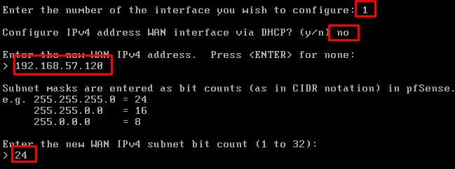

	- Tương tự cấu hình IP cho card mạng LAN, thực hiện tương tự như WAN. Lưu ý: không đặt gateway và IPv6 cho card LAN

- Truy cập web quản lý qua IP Lan 

- Đăng nhập Username: admin, Password: pfsense.

- Tại web admin thực hiện cấu hình LAN2 ở tab Interfaces/InterfaceAssignments, add port `em3`

- Chọn `Add` và cấu hình thông số 
	* Enable interface
	* Đổi tên interface là LAN2
	* Static IPv4 
	* Đặt IP và subnet 

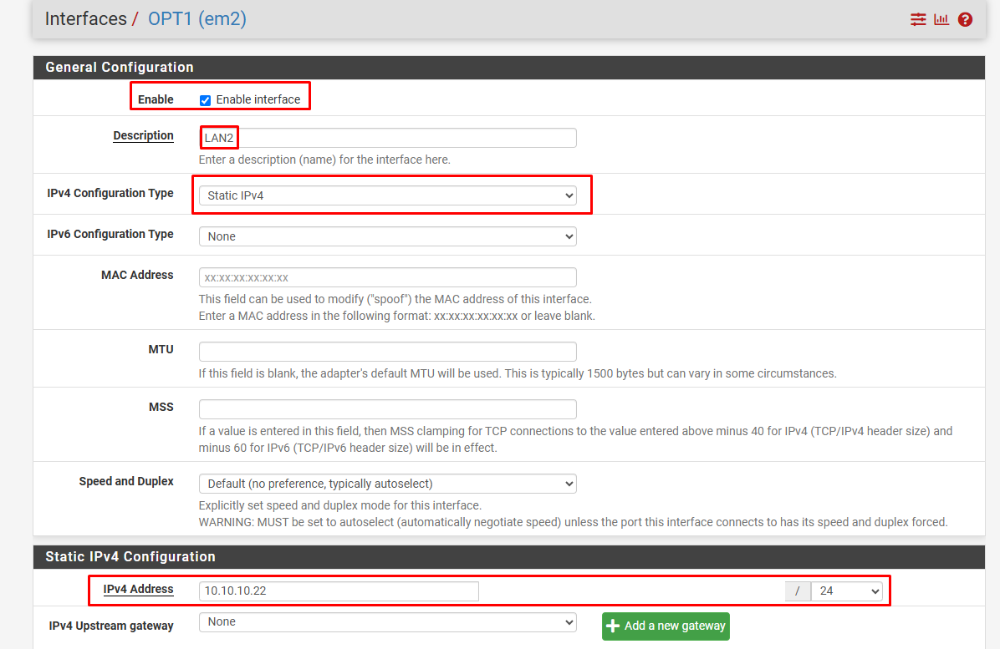
- Hoàn tất triển khai pfsense với 3 interface 1 Wan, 1 Mnt, 1 Lan 


+ NAT Local Internet
pfSense hỗ trợ tính năng nat 1:1 từ máy Ubuntu trong private network thông qua NAT có thể truy cập Internet ở Public Network
NAT 1:1 
Nat Port-forward  
Cấu hình IP tĩnh trên máy Ubuntu 
```
nano /etc/netplan/50-cloud-init.yaml
```

- Apply
```
netplan apply 
```
- NAT 1:1 
Tiến hành tạo ra Vitual IPs để chúng ta có thể sử dụng vitual IP này NAT ra bên ngoài.


Save lại và Apply change

Tiếp theo chúng ta thực hiện thiết lập NAT 1:1


Chọn sang mục NAT 1:1 rồi sau đó thêm mới.

Thiết lập như sau :
Interface: CHọn WAN
External subnet IP : là địa chỉ vitual IP chúng ta đã tạo dùng để thực hiện NAT.
Internal IP : Là địa chỉ IP của client mà chúng ta muốn NAT.
`SAVE` lại và `Apply change` để chấp nhận sự thay đổi.

Thiết lập rules:

Vào mục rules ấn vào ADD để thêm một rules rồi thiết lập như sau:
Action : Pass
Destination : Là địa chỉ mà chúng ta thực hiện NAT
Sau đó thực hiện `SAVE` lại và `Apply Change`

- Kiểm tra NAT qua virtual IP 1:1 

- Thực hiện NAT port-forward theo mô hình với một client để test thử kết nối đến địa chỉ chúng ta muốn public website ra ngoài, một máy chủ pfSense để thực hiện NAT và một máy chủ web-server có card mạng private
tương tự NAT 1:1 giống tới bước tại VIP 
Tiếp tục từ phần tạo NAT 

Chọn NAT rồi chọn ADD và thiết lập như sau :

Destination : WAN address - Interface mà chúng ta chọn để NAT ra ngoài
Port : HTTP (WEB)
Ridirect target IP : Là địa chỉ chúng ta dùng để NAT ra ngoài
Sau đó SAVE lại và Apply change để lưu lại thiết lập.


Sau đó chúng ta dùng client để truy cập vào địa chỉ đã NAT với port 80 xem kết quả thế nào :

+ Firewall Rule 


-
+ DHCP
Services -> DHCP Server -> LAN


Tích Enable DHCP Server on LAN interface
Ở phần Range: Nhập range IP mà bạn muốn cấp cho máy trạm
Tích Change DHCP display lease time from UTC to local time và Enable RRD statistics graphs


-> Nhấn Save để lưu lại
Nếu bạn muốn cấu hình DHCP static mapping cho các server hay muốn máy trạm yêu cầu không thay đổi IP Address khi DHCP Server cấp phát -> Ở mục DHCP Static Mapping for this Interface -> Nhấn Add


+ Setup OpenVPN với Pfsense (OpenVPN mode tab, OpenVPN mode Tun)
PFSense OpenVPN mode tab
Mô hình này sử dụng 3 server, trong đó:
Host Firewall cài đặt PFSense.
Host server_target: server trong mạng LAN (target network để kết nối VPN tới)
Client: cài đặt OpenVPN client. Bài lab thành công khi máy client nhận được IP của mạng LAN2 và có thể kêt nối tới server_target.
- Thực hiện trên PFSense
Tạo User và Certificate
Tại tab System/Certificate/Authorities , tạo CA cho OpenVPN, CA này sẽ xác thực tất cả các certificate của server VPN và user VPN khi kết nối tới PFSense OpenVPN
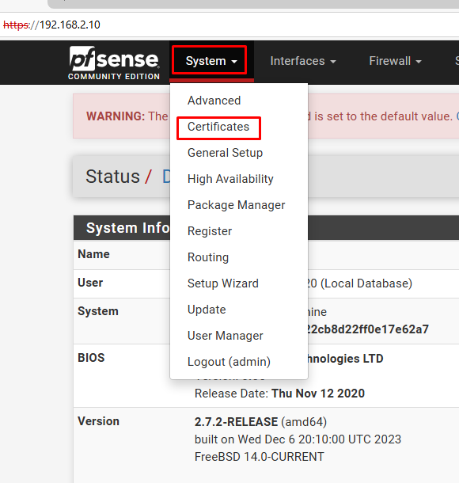


chọn "Save", kết quả;

Tại tab System/Certificate/Certificate, tạo certificate cho server VPN

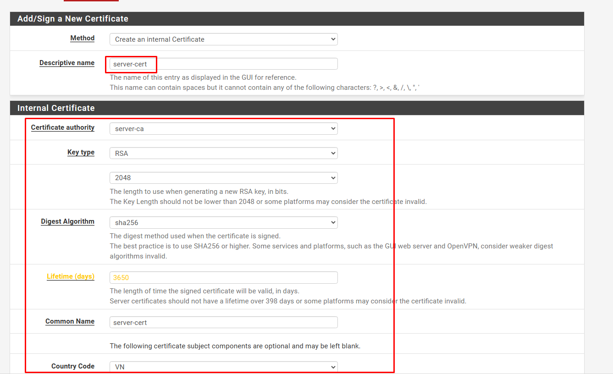


Tiếp tục tạo certificate cho user


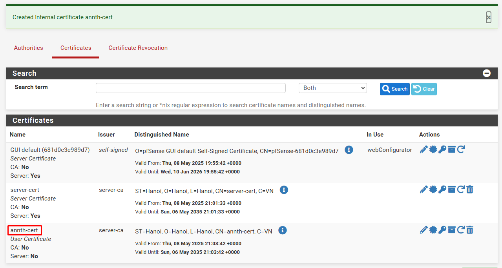
Tại tab System/UserManager, tạo user được VPN
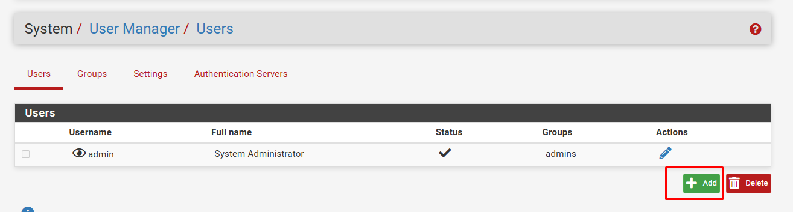
Khai báo Username, password của User. Sau đó "Save"


Sau khi user được tạo, click vào nút "Edit user" để add certificate cho user đó


Tạo VPN Server
Tại tab System/Package Manager, cài đặt Plugin openvpn-client-export


Tại tab VPN/OpenVPN/Servers, click "Add" để tạo VPN server

Khai báo các thông tin về mode kết nối:

Server mode: Remote Access (SSL/TLS + User Auth)
Device mode: tap
Interface: WAN
Local port: 1194
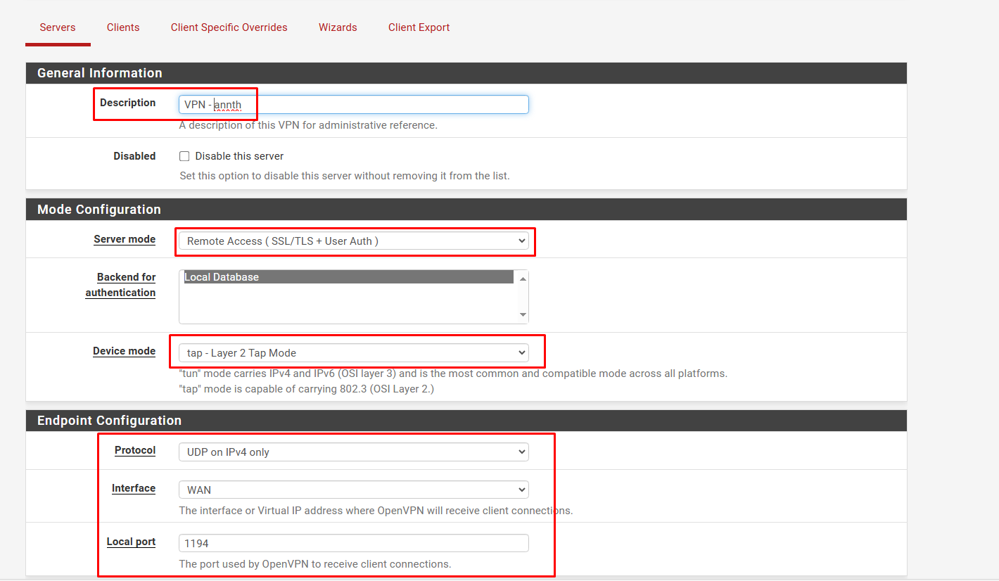

Khai báo các thông tin về mã hóa

TLS Configuration: chọn sử dụng TLS key
Peer Certificate Authority: chọn CA cho hệ thống đã tạo trước đó (server-ca)
Server certificate: chọn cert cho server được tạo (server-cert)
Enable NCP: lựa chọn sử dụng mã hóa đường truyền giữa Client và Server, sử dụng các giải thuật mặc định là AES-256-GCM và AES-128-GCM
Auth digest algorithm: lựa chọn giải thuật xác thực kênh truyền là SHA256


Khai báo các thông tin về tap

Bridge DHCP: cho phép client nhận IP trong LAN thông qua DHCP Server
Bridge Interface: lựa chọn LAN được kết nối qua VPN
IPv4 local Network: khai báo dải mạng được truy cập thông qua VPN (LAN2)
Concurrent Connection: khai báo số lượng client được kết nối VPN đồng thời


Cấu hình Interface
Tại tab Interfaces/InterfaceAssignments, add thêm network port của VPN, đặt tên là vpn_lab


Tại tab Interfaces/Bridges, tạo bridge mới và add 2 interface VPNLAB và LAN2 vào bridge


Cấu hình Firewall
Tại tab Firewall/Rules/WAN, add thêm rule cho phép client kết nối tới port 1194 của VPN Khai báo các thông số như hình
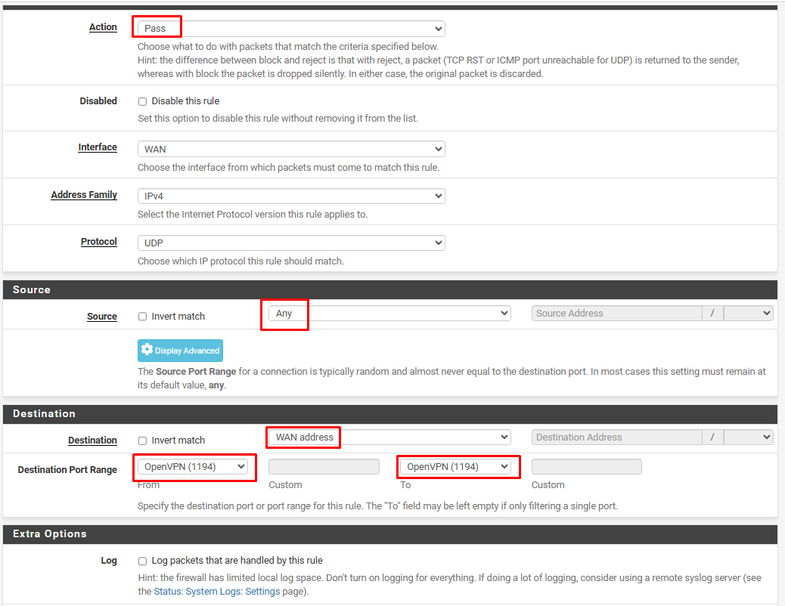

Tại tab Firewall/Rules/LAN2, add rule cho phép lưu lượng đi qua


Tại tab Firewall/Rules/VPNLAB, add rule cho phép lưu lượng đi qua


Tại tab Firewall/Rules/OPENVPN, add rule cho phép lưu lượng đi qua
Export OpenVPN config
Tại tab VPN/OpenVPN/ClientExport, khai báo các thông số:
Remote Access Server: lựa chọn OpenVPN server
Hostname Resolution: lựa chọn khai báo IP của WAN


Thực hiện trên Client, kết nối VPN (hướng dẫn cho Client sử dụng Windows OS Vista trở về sau)
Download gói cài OpenVPN mới nhất cho Windows tại link sau và thực hiện cài đặt: https://openvpn.net/index.php/open-source/downloads.html

Kết nối VPN, nhập password của user longlq, sau khi quay VPN thành công, client nhận IP của dải mạng LAN2 của pfSense là Kết nối VPN, nhập password của user longlq, sau khi quay VPN thành công, client nhận IP của dải mạng LAN2 của pfSense là 10.10.10.50


PFSense OpenVPN mode TUN
Mục tiêu LAB
Mô hình này sử dụng 3 server, trong đó:
Host Firewall cài đặt PFSense.
Host server_target: server trong mạng LAN (target network để kết nối VPN tới)
Client: cài đặt OpenVPN client. Bài lab thành công khi máy client nhận được IP của tunnel và có thể kêt nối tới các private VLAN của server_target.

Tại tab System/Certificate/Authorities , tạo CA cho OpenVPN, CA này sẽ xác thực tất cả các certificate của server VPN và user VPN khi kết nối tới PFSense OpenVPN


chọn "Save", kết quả;

Tại tab System/Certificate/Certificate, tạo certificate cho server VPN


Tiếp tục tạo certificate cho user


Tại tab System/UserManager, tạo user được VPN
Khai báo Username, password của User. Sau đó "Save"

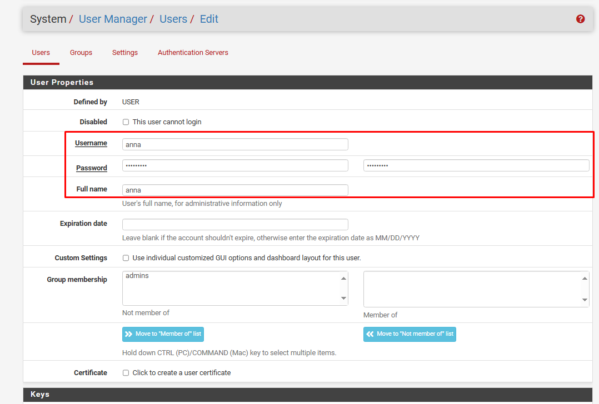
Sau khi user được tạo, click vào nút "Edit user", Edit user vừa tạo, add certificate cho user đó


Tại tab VPN/OpenVPN/Servers, click "Add" để tạo VPN server mới
Khai báo các thông tin về mode kết nối:

Server mode: Remote Access (SSL/TLS + User Auth)
Device mode: tun
Interface: WAN
Local port: 1195 (tùy ý lựa chọn port)


Khai báo các thông tin về mã hóa

TLS Configuration: chọn sử dụng TLS key
Peer Certificate Authority: chọn CA cho hệ thống đã tạo trước đó (server-ca)
Server certificate: chọn cert cho server được tạo (server-cert)
Enable NCP: lựa chọn sử dụng mã hóa đường truyền giữa Client và Server, sử dụng các giải thuật mặc định là AES-256-GCM và AES-128-GCM
Auth digest algorithm: lựa chọn giải thuật xác thực kênh truyền là SHA256


Khai báo các thông tin về tun

IPv4 Tunnel Network: khai báo network tunnel, VPN client sẽ được route tới Private LAN thông qua network này
IPv4 local Network: khai báo các dải Private LAN được truy cập thông qua VPN
Concurrent Connection: khai báo số lượng client được kết nối VPN đồng thời


Khai báo Private LAN được route thông qua tunnel network 
Click "Save" để tạo VPN Server

Cấu hình Interface
Tại tab Interfaces/InterfaceAssignments, add thêm network port của VPN, đặt tên là vpn_lab_tun


Cấu hình Firewall
Tại tab Firewall/Rules/WAN, add thêm rule cho phép client kết nối tới port 1195 của VPN Khai báo các thông số như hình !
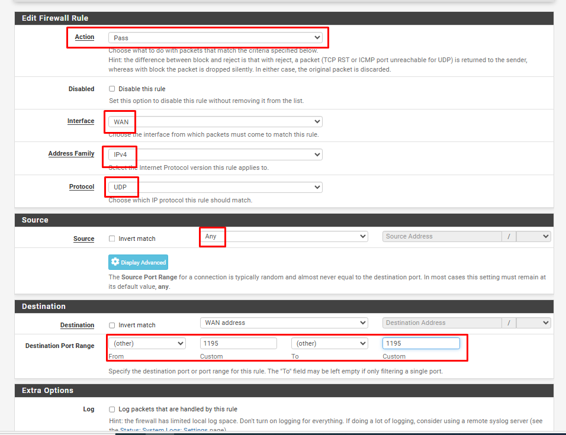

Tại tab Firewall/Rules/LAN2, add rule cho phép lưu lượng đi qua


Tại tab Firewall/Rules/VPNLABTUN, add rule cho phép lưu lượng đi qua !


Tại tab Firewall/Rules/OPENVPN, add rule cho phép lưu lượng đi qua


Export OpenVPN config
Tại tab VPN/OpenVPN/ClientExport, khai báo các thông số:
Remote Access Server: lựa chọn OpenVPN server
Hostname Resolution: lựa chọn khai báo IP của WAN !


Kết nối VPN, nhập password của user , sau khi quay VPN thành công, client nhận IP của dải mạng LAN2 của pfSense là Kết nối VPN, nhập password của user longlq, sau khi quay VPN thành công, client nhận IP của dải mạng LAN2 của pfSense là 10.10.10.2


