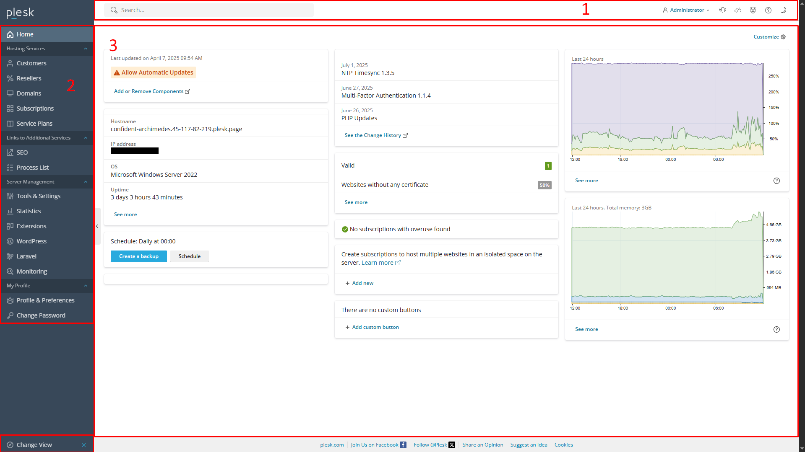
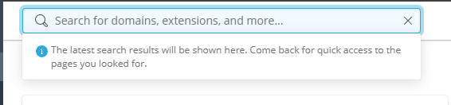
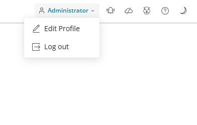
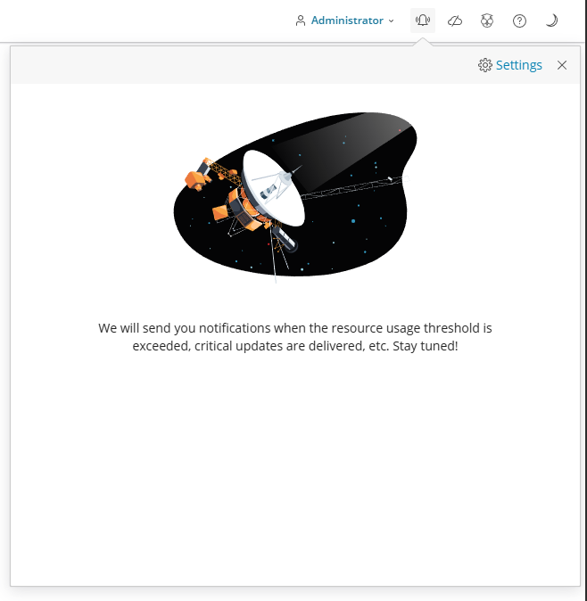
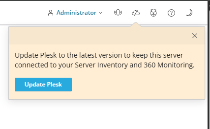
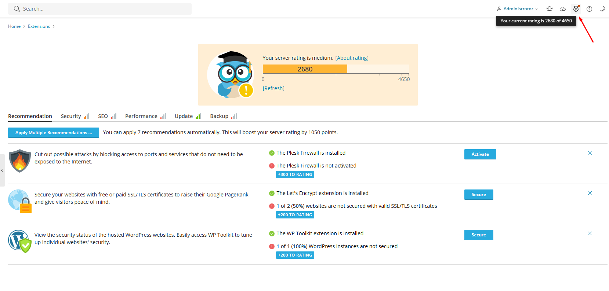
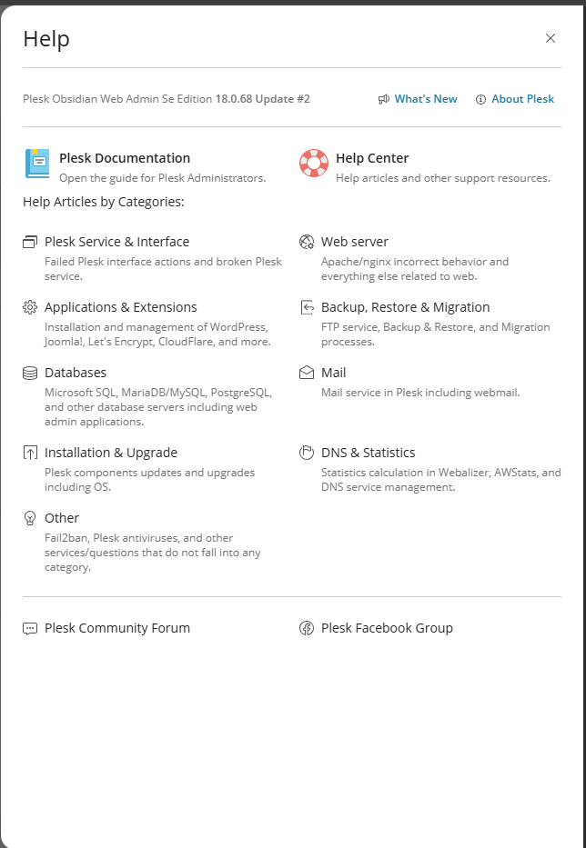
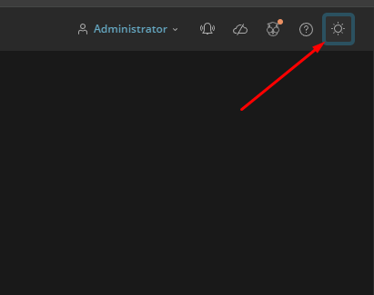

# Plesk 
## Tổng quan   
- Plesk là một bảng điều khiển quản trị web hosting (hosting control panel) phổ biến, giúp người dùng quản lý các máy chủ và trang web một cách dễ dàng thông qua giao diện đồ họa thân thiện. Nó hỗ trợ cả hệ điều hành Linux và Windows, cung cấp các công cụ để quản lý tài khoản hosting, tên miền, email, cơ sở dữ liệu, và bảo mật.
- Plesk tự giới thiệu là một nền tảng lưu trữ trang web toàn diện, mang lại tính kỹ thuật, tùy chọn bảo mật và công cụ tự động hóa, tất cả trong một bảng điều khiển. Control Panel này xếp vị trí thứ hai trong danh sách các bảng điều khiển máy chủ phổ biến nhất. Nó được triển khai trên hơn 370.000 máy chủ, hỗ trợ hơn 12 triệu trang web.
- Điểm độc đáo của phần mềm này không chỉ là khả năng thực hiện chức năng thông thường mà còn tích hợp đa dạng chức năng như thiết kế web, giao diện storefront SaaS và cả hệ thống Hóa đơn điện tử và thanh toán (Billing), giúp tiết kiệm chi phí và mang lại sự thuận tiện cho người dùng. Có thể nói Plesk là phần mềm quản lý hosting duy nhất tích hợp mọi yếu tố này.
- Plesk có hai phiên bản là Plesk Onyx và Plesk Obsidian.
	- Plesk Onyx là phiên bản quản lý trang web cơ bản và đầu tiên của Plesk. Phiên bản này của Plesk bao gồm các tính năng cơ bản trong việc quản lý cũng như hiệu chỉnh các ứng dụng cho website như:
		- Quản lý các dữ liệu file tiêu chuẩn.
		- Bảo mật website và dữ liệu.
		- Điều chỉnh hiệu suất hoạt động.
		- Tự động cập nhật những dữ liệu và tính năng mới.
	- Plesk Obsidian: là phiên bản quản lý website mới nhất của Plesk, được ra mắt vào ngày 25/09/2019. Phiên bản mới này của Plesk tập trung giải quyết các vấn đề liên quan đến bảo mật, hiệu suất và sự tiện dụng.
		- Các tính năng chính của Plesk : Plesk cung cấp một bộ công cụ toàn diện để quản lý máy chủ và website:
		- Hệ thống Web hiện đại: Bao gồm Composer, tích hợp Docker và hỗ trợ MongoDB để triển khai ứng dụng web nhanh chóng.
		- Bảo mật tích hợp: Cung cấp SSL It!, quản lý tường lửa, công cụ tự sửa chữa và giám sát nâng cao để bảo vệ máy chủ.
		- Vòng đời Dự án Web: Giúp người dùng lập kế hoạch, phát triển, triển khai và bảo trì các dự án web thông qua giao diện dễ dùng.
		- Sao lưu và Khôi phục: Cho phép sao lưu cấu hình tài khoản, dữ liệu website, email, tên miền lên đám mây và tự động hóa quá trình này.
		- Quản lý Tên miền và Email: Dễ dàng thêm, xóa, di chuyển tên miền và tự động cấu hình ứng dụng email.
		- Bộ công cụ WordPress: Đơn giản hóa việc cài đặt, thử nghiệm (staging), bảo mật và cập nhật WordPress, các giao diện và plugin.
- Ưu điểm
	- Plesk được đánh giá là một trong những phần mềm quản lý hosting thân thiện hàng đầu hiện nay. Bởi nó sở hữu nhiều ưu điểm sau đây:
	- Dễ dàng sử dụng trên cả hai nền tảng hệ điều hành là Window và Linux.
	- Có độ ổn định và tin cậy cao.
	- Có đầy đủ các tính năng hữu ích từ cơ bản đến nâng cao, hỗ trợ việc quản lý hosting và website.
	- Giao diện đơn giản, thân thiện với người dùng.
	- Tính linh hoạt và tiện dụng cao. Phần mềm Plesk là hệ thống quản lý hosting có tích hợp thiết kế website, thanh toán tự động và giao diện storefront SaaS.
	- Dễ dàng thiết lập nhiều hosting cùng một lúc dễ dàng dựa trên cấu hình định sẵn.
	- Có thể tạo ra nhiều tài khoản FTP kết hợp với cấu trúc web linh hoạt.
- Nhược điểm
	- Mối lo ngại về bảo mật: Mặc dù Plesk đã làm rất tốt trong việc tiếp nhận và sửa chữa các lỗ hổng bảo mật, nhưng điểm mấu chốt là có một lịch sử lo ngại về bảo mật.
	- Vấn đề sao lưu và khôi phục: Plesk làm tốt hơn nhiều thứ so với các đối thủ cạnh tranh nhưng lại thua ở chức năng quan trọng này. Tùy chọn sao lưu và khôi phục cần nhiều dung lượng đĩa trống và hầu hết các trường hợp thì các tệp lớn phải được chuyển sang máy chủ phụ.
	- Phức tạp: Không giống như cPanel, việc cài đặt các tập lệnh không phải là một việc dễ dàng. Không có cài đặt hoặc trình hướng dẫn bằng một cú nhấp chuột. Do đó, đối với những người mới bắt đầu có thể gặp chút khó khăn và cần phải làm quen.
- Hiện tại, Plesk thường được cập nhật liên tục dưới phiên bản Obsidian, với các bản vá và tính năng mới được thêm định kỳ.

## Mô hình người dùng trong Plesk
- Plesk phân chia người dùng theo ba cấp độ chính:
	- Administrator (Admin): 
		- Toàn quyền quản lý máy chủ và tất cả tài nguyên.
		- Tạo và quản lý reseller, khách hàng, dịch vụ hosting.
	- Reseller
		- Mua lại tài nguyên từ Admin và phân phối cho khách hàng riêng.
		- Có thể tạo và quản lý nhiều tài khoản End User.
	- End User (Customer)
		- Người dùng cuối, thường là chủ website.
		- Quản lý hosting, email, cơ sở dữ liệu, FTP, v.v.
		
## Các chế độ giao diện: Service Provider View vs Power User View
- Plesk cung cấp hai chế độ giao diện để phù hợp với nhu cầu sử dụng:
- Service Provider View
	- Dành cho nhà cung cấp dịch vụ hosting.
	- Hiển thị đầy đủ các chức năng quản lý reseller, khách hàng, gói dịch vụ.
- Power User View
	- Dành cho người dùng cá nhân hoặc doanh nghiệp nhỏ.
	- Giao diện đơn giản hơn, tập trung vào quản lý website và dịch vụ của riêng họ.
	- Người dùng có thể chuyển đổi giữa hai chế độ này tùy theo vai trò và nhu cầu sử dụng.	
	
## Tổng quan giao diện 
- Giao diện Plesk được thiết kế trực quan, gồm các thành phần chính sau:
- 
	- Thanh tiêu đề (Header): Chứa thanh tìm kiếm, thông tin người dùng, và các nút truy cập nhanh như thông báo, cài đặt tài khoản, đăng xuất. (1)
		- Thanh tìm kiếm: Dùng tìm kiếm nhanh các cấu hình, tên miền, ... 
		- 
		- Nút hiển trị thông tin tài khoản, dùng truy cập nhanh cài đặt tài khoản, đăng xuất 
		- 
		- Nút mở bảng thông báo của server Plesk 
		- 
		- Nút mở Plesk360 
		- 
		- Nút mở giao diện tiện ích Advisor 
		- 
		- Nút mở nhanh panel `Help`
		- 
		- Nút chuyển đổi giao diện Light/Dark
		- 
	- Bảng điều hướng (Navigation Panel): Nằm bên trái, gồm các mục quản lý như: HomeHosting Services, Server Management, Tools & Settings, Extensions, v.v. (3) 
	- Vùng hiển thị nội dung (Main Display Area): Là khu vực trung tâm hiển thị nội dung tương ứng với từng mục đã chọn ở panel bên trái. Ví dụ: khi chọn “Hosting Services”, vùng này sẽ hiển thị danh sách tên miền, gói dịch vụ, trạng thái website... (2) 
	- Nút chuyển chế độ giao diện (View Switcher): Cho phép chuyển đổi giữa
		- Service Provider View: dành cho nhà cung cấp dịch vụ hosting.
		- Power User View: dành cho người dùng cá nhân hoặc doanh nghiệp nhỏ.

- Plesk cung cấp hai chế độ giao diện: Service Provider View – dành cho nhà cung cấp dịch vụ với đầy đủ chức năng quản lý; và Power User View – giao diện đơn giản hóa dành cho người dùng cá nhân. Trong tài liệu này, chúng tôi tập trung vào Service Provider View do tính bao quát và phù hợp với môi trường triển khai chuyên nghiệp

## Các khái niệm cần biết 
- Plesk sử dụng mô hình phân cấp để quản lý dịch vụ hosting. Dưới đây là các khái niệm cốt lõi:
- Customer (Khách hàng)
	- Là người dùng cuối sử dụng dịch vụ hosting.
	- Có thể sở hữu một hoặc nhiều Subscription.
	- Quản lý website, email, database, FTP... trong phạm vi tài nguyên được cấp.
- Reseller (Đại lý phân phối)
	- Là người trung gian giữa Admin và Customer.
	- Có thể tạo và quản lý nhiều tài khoản Customer.
	- Được cấp tài nguyên từ Admin để phân phối lại.
- Domain (Tên miền)
	- Là địa chỉ website (ví dụ: `example.com`) được gán vào một Subscription.
	- Mỗi Subscription có thể chứa nhiều Domain hoặc Subdomain.
- Subscription (Gói dịch vụ cụ thể)
	- Là không gian lưu trữ và cấu hình dịch vụ dành cho một khách hàng.
	- Bao gồm: domain, email, database, cấu hình PHP, SSL, v.v.
	- Được tạo dựa trên một Service Plan.
- Service Plan (Gói dịch vụ mẫu)
	- Là mẫu cấu hình tài nguyên do Admin tạo ra.
	- Bao gồm giới hạn dung lượng, số lượng email, database, v.v.
	- Dùng để tạo Subscription cho khách hàng hoặc reseller.
- Mối quan hệ giữa các khái niệm
	```
	Admin → Tạo Service Plan → Cấp cho Reseller hoặc Customer → Tạo Subscription → Gán Domain
	```
	- Admin quản lý toàn bộ hệ thống, tạo Service Plan.
	- Reseller nhận tài nguyên từ Admin, tạo Customer và Subscription.
	- Customer sử dụng Subscription để quản lý website và dịch vụ.
	- Domain được gán vào Subscription để hoạt động trên Internet.

- Ví dụ: Giả sử bạn là Admin của hệ thống Plesk:
1. Bạn tạo một Service Plan tên là `Basic Hosting`:
   - 5GB dung lượng
   - 10 email
   - 1 database
2. Bạn tạo một Customer tên là `Nguyen A`.
3. Bạn cấp cho `Nguyen A` một Subscription theo gói `Basic Hosting`.
4. Trong Subscription đó, bạn gán tên miền `example.io.vn`.
5. `Nguyen A` có thể đăng nhập vào Plesk để quản lý website, email, và các dịch vụ khác.
