# Database Server
## 1. Kiến Trúc Cơ Bản  
### 1.1 Mô hình client-server trong hệ thống database  
- Database Server - Máy chủ cơ sở dữ liệu cung cấp các dịch vụ liên quan đến cơ sở dữ liệu cho client và vận hành hệ quản trị cơ sở dữ liệu (DBMS).
- Máy chủ xử lý các yêu cầu từ client và kiểm soát quyền truy cập cũng như truy xuất dữ liệu. Một máy tính chạy phần mềm cơ sở dữ liệu với mục đích cung cấp dịch vụ cơ sở dữ liệu được gọi là máy chủ cơ sở dữ liệu. 
- Chúng có thể hoạt động với nhiều cơ sở dữ liệu, đôi khi với sự hỗ trợ từ máy chủ web và máy chủ ứng dụng. 
- Chúng vận hành bằng cách lưu trữ hệ quản trị cơ sở dữ liệu (Database Management System - DBMS) cùng với các đơn vị bộ nhớ và lưu trữ. 
- Hầu hết các máy chủ cơ sở dữ liệu sử dụng mô hình client-server, trong đó chúng nhận các truy vấn từ client - thiết bị khách và user - người dùng tương ứng trước khi cung cấp phản hồi được yêu cầu. 
- Các ứng dụng khách sử dụng hệ quản trị cơ sở dữ liệu (DBMS) để truy cập dữ liệu số của họ thông qua máy chủ cơ sở dữ liệu. 
- Sau khi nhận được một lệnh cụ thể từ ứng dụng khách của máy chủ cơ sở dữ liệu, DBMS sẽ thực hiện hành động mà ứng dụng khách yêu cầu. 
- Các lệnh gửi từ client đến máy chủ cơ sở dữ liệu bao gồm thay đổi quyền truy cập, tải lên dữ liệu mới, truy xuất dữ liệu từ máy chủ hoặc chỉnh sửa dữ liệu đã lưu trữ.
- Các bước quan trọng trong quá trình một máy chủ cơ sở dữ liệu hoạt động.
	- Lưu trữ: Dữ liệu được tổ chức và lưu trữ trong máy chủ cơ sở dữ liệu theo mô hình đã chọn (relational, NoSQL, v.v.).
	- Yêu cầu của client: Một ứng dụng client như trình duyệt web, ứng dụng di động hoặc chương trình phần mềm khác gửi yêu cầu đến máy chủ cơ sở dữ liệu. Yêu cầu này có thể là truy vấn để lấy dữ liệu, lệnh để sửa đổi dữ liệu (chèn, cập nhật, xóa) hoặc nhiệm vụ quản trị.
	- Thiết lập kết nối: Máy chủ cơ sở dữ liệu thiết lập kết nối với ứng dụng client, bao gồm xác thực và ủy quyền để đảm bảo client có quyền truy cập cần thiết vào cơ sở dữ liệu.
	- Phân tích và tối ưu hóa truy vấn: Máy chủ cơ sở dữ liệu nhận yêu cầu từ client, phân tích để hiểu mục đích và tạo kế hoạch thực thi tối ưu nhằm truy xuất hoặc thao tác dữ liệu hiệu quả nhất dựa trên các chỉ mục có sẵn, phân bố dữ liệu và các yếu tố khác.
	- Truy xuất hoặc thao tác dữ liệu: Máy chủ cơ sở dữ liệu thực hiện kế hoạch truy vấn tối ưu. Điều này có thể bao gồm đọc dữ liệu từ ổ đĩa, thực hiện tính toán hoặc áp dụng bộ lọc theo tiêu chí truy vấn. Khi dữ liệu được chỉnh sửa, máy chủ cập nhật cơ sở dữ liệu để duy trì tính nhất quán và toàn vẹn của dữ liệu.
	- Truyền kết quả: Sau khi hoàn thành thao tác, máy chủ cơ sở dữ liệu gửi kết quả trở lại ứng dụng client dưới dạng bảng, dòng dữ liệu hoặc các giá trị riêng lẻ.
	- Đóng kết nối: Sau khi client nhận được kết quả, kết nối giữa client và server có thể bị đóng hoặc duy trì để xử lý các yêu cầu tiếp theo.

- Database server có nhiều loại khác nhau, mỗi loại phù hợp với các nhu cầu và yêu cầu cụ thể của doanh nghiệp hoặc tổ chức. Dưới đây là các loại phổ biến:
	- Relational Database Server: Relational sử dụng mô hình dữ liệu quan hệ, trong đó dữ liệu được tổ chức thành các bảng với các hàng (bản ghi) và cột (trường). 
		- Các hệ quản trị cơ sở dữ liệu phổ biến trong nhóm này bao gồm MySQL, PostgreSQL, Microsoft SQL Server và Oracle Database.
		- Ưu điểm của Relational Database Server là hỗ trợ SQL (Structured Query Language) để truy vấn và quản lý dữ liệu, dễ dàng thiết lập và bảo trì, và cung cấp một hệ thống mạnh mẽ và đáng tin cậy. Đây là loại cơ sở dữ liệu được sử dụng rộng rãi nhất trong các ứng dụng doanh nghiệp và web.
	- NoSQL
		- NoSQL không sử dụng mô hình dữ liệu quan hệ mà thay vào đó hỗ trợ các cấu trúc dữ liệu linh hoạt như tài liệu, cặp khóa-giá trị, đồ thị và cột. 
		- Các hệ quản trị cơ sở dữ liệu NoSQL nổi bật bao gồm MongoDB, Cassandra, Couchbase và Redis.
		- Ưu điểm của NoSQL Server là khả năng mở rộng linh hoạt, hiệu suất cao, và khả năng xử lý dữ liệu phi cấu trúc hoặc bán cấu trúc, làm cho nó phù hợp cho các ứng dụng yêu cầu khả năng mở rộng cao và tính linh hoạt trong cấu trúc dữ liệu, cũng như các ứng dụng xử lý dữ liệu lớn (Big Data).

### 1.2 Các thành phần cơ bản của database server
- Database Server hoạt động dựa trên mô hình Client – Server nên gồm 2 thành phần chính: Client và Server 
	- Ứng dụng máy khách (Client)
		- Phần này thường là một ứng dụng được cài đặt trên máy tính của người dùng, có nhiệm vụ giao tiếp với máy chủ cơ sở dữ liệu. Các thành phần chính của phần client bao gồm:
		- Ứng dụng khách (Client Application): Đây là các ứng dụng hoặc phần mềm mà người dùng cuối sử dụng để truy cập và tương tác với cơ sở dữ liệu. Các ứng dụng này gửi yêu cầu tới máy chủ cơ sở dữ liệu để truy xuất, thêm, sửa hoặc xóa dữ liệu.
		- Giao diện người dùng (User Interface): Giao diện giúp người dùng nhập, chỉnh sửa, và xem dữ liệu. Nó có thể là một ứng dụng desktop, ứng dụng web, hoặc ứng dụng di động.
		- Driver kết nối (Database Driver): Các driver hoặc thư viện phần mềm giúp kết nối ứng dụng khách với máy chủ cơ sở dữ liệu, chẳng hạn như ODBC, JDBC, hoặc các API chuyên dụng khác.
	- Ứng dụng máy chủ (Server)
		- Phần này là “trái tim” của hệ thống, chịu trách nhiệm lưu trữ, quản lý và xử lý dữ liệu. Các thành phần chính của phần server bao gồm:
		- Hệ quản trị cơ sở dữ liệu (Database Management System – DBMS): Đây là phần mềm chính quản lý cơ sở dữ liệu, bao gồm việc lưu trữ, truy xuất, cập nhật và quản lý dữ liệu. Các DBMS phổ biến gồm MySQL, PostgreSQL, Microsoft SQL Server và Oracle Database.
		- Cơ sở dữ liệu (Database): Tập hợp các bảng, chỉ mục, và các đối tượng dữ liệu khác được lưu trữ và quản lý bởi DBMS. Cơ sở dữ liệu chứa thông tin thực tế mà các ứng dụng và người dùng tương tác.
		- Máy chủ (Server Hardware): Phần cứng thực tế mà DBMS chạy trên đó, bao gồm CPU, RAM, ổ cứng và các thành phần mạng. Phần cứng này cần đủ mạnh để xử lý các yêu cầu và duy trì hiệu suất cao.
		- Hệ điều hành (Operating System): Phần mềm hệ thống quản lý tài nguyên phần cứng và cung cấp các dịch vụ cơ bản cho DBMS và các ứng dụng khác chạy trên máy chủ. Các hệ điều hành phổ biến cho máy chủ cơ sở dữ liệu gồm Windows Server, Linux và UNIX.
		- Công cụ bảo mật (Security Tools): Các biện pháp bảo mật như tường lửa, hệ thống phát hiện xâm nhập (IDS), và mã hóa dữ liệu để bảo vệ cơ sở dữ liệu khỏi truy cập trái phép và các mối đe dọa bảo mật.
		- Công cụ sao lưu và khôi phục (Backup and Recovery Tools): Các công cụ và quy trình để sao lưu dữ liệu định kỳ và khôi phục dữ liệu trong trường hợp mất mát hoặc hỏng hóc.
		
### 1.3 Sự khác biệt giữa database và database server
- Cả Database và Database Server đều liên quan đến việc lưu trữ và quản lý dữ liệu, nhưng chúng có những vai trò và chức năng khác nhau.
#### 1.3.1 Database (Cơ sở dữ liệu)
- Database là tập hợp có tổ chức của dữ liệu, được lưu trữ theo một cấu trúc nhất định để dễ dàng truy xuất, cập nhật và quản lý.
	- Chỉ là dữ liệu: Database chỉ đơn thuần chứa dữ liệu, nhưng không có khả năng xử lý hoặc cung cấp dịch vụ.
	- Cấu trúc tổ chức: Dữ liệu trong database được lưu trữ dưới dạng bảng (tables), hàng (rows), cột (columns), hoặc theo mô hình khác như NoSQL.
	- Không có khả năng tự vận hành: Một database không thể hoạt động độc lập mà cần có hệ quản trị cơ sở dữ liệu (DBMS) để thực hiện các thao tác truy vấn, chỉnh sửa, hoặc bảo vệ dữ liệu.
	- Ví dụ: MySQL Database, PostgreSQL Database, Oracle Database.
#### 1.3.2 Database Server (Máy chủ cơ sở dữ liệu)
- Database Server là một hệ thống bao gồm phần cứng và phần mềm, được thiết kế để quản lý, xử lý và cung cấp quyền truy cập dữ liệu từ database.
	- Bao gồm cả phần cứng và phần mềm: Máy chủ không chỉ chứa dữ liệu mà còn có các công cụ xử lý để quản lý và phục vụ các truy vấn.
	- Cung cấp dịch vụ: Database Server nhận các yêu cầu truy vấn từ client và xử lý chúng thông qua hệ quản trị cơ sở dữ liệu (DBMS).
	- Tích hợp bảo mật và hiệu suất: Máy chủ thường đi kèm với các cơ chế bảo mật (xác thực người dùng, kiểm soát truy cập, mã hóa dữ liệu) và tối ưu hóa hiệu suất để phục vụ nhiều người dùng cùng lúc.
	- Ví dụ: Một server chạy Microsoft SQL Server, MySQL Server, hoặc Oracle Database Server.
#### 1.3.3 So sánh 

| Yếu tố            | Database (Cơ sở dữ liệu)        | Database Server (Máy chủ cơ sở dữ liệu)       |
| ----------------- | ------------------------------- | --------------------------------------------- |
| Bản chất          | Tập hợp dữ liệu có tổ chức      | Hệ thống phần cứng + phần mềm quản lý dữ liệu |
| Chức năng         | Chỉ lưu trữ dữ liệu             | Quản lý, xử lý, cung cấp truy cập đến dữ liệu |
| Khả năng vận hành | Không thể tự hoạt động          | Có thể xử lý truy vấn, bảo vệ dữ liệu         |
| Mức độ phức tạp   | Đơn giản (chỉ là dữ liệu)       | Phức tạp hơn (gồm cả phần mềm và phần cứng)   |
| Ví dụ             | MySQL Database, Oracle Database | SQL Server, MySQL Server, PostgreSQL Server   |

### 1.4 Các loại database server phổ biến (RDBMS, NoSQL, NewSQL)
#### 1.4.1 Relational Database Management System - RDBMS   
- Là máy chủ cơ sở dữ liệu sử dụng mô hình dữ liệu quan hệ RDBMS 
- Trong RDBMS, dữ liệu được biểu diễn bởi các hàng. Relational Database là cơ sở dữ liệu được sử dụng phổ biến nhất. Nó chứa các bảng và mỗi bảng có Primary Key riêng.Giá trị của mỗi bảng có mối quan hệ với các bảng khác giúp khả năng xử lý lượng dữ liệu lớn và thực hiện truy vấn dễ dàng.
- Các khái niệm cơ bản: 
	- Bảng - Tables: Dữ liệu trong RDBMS được lưu trữ trong các đối tượng cơ sở dữ liệu được gọi là các bảng - là một bộ sưu tập các mục dữ liệu có quan hệ và nó bao gồm nhiều cột và hàng.
	- Trường - Field: Mọi bảng đều có thể chia thành những mục nhỏ hơn gọi là trường (field). Trường là một cột trong bảng, được thiết kế để duy trì thông tin cụ thể về mọi bản ghi (record) trong bảng.
	- Bản ghi - Record: Một bản ghi thường được gọi là hàng dữ liệu, là từng mục riêng lẻ tồn tại trong bảng.
	- Cột - Column: Cột là một thực thể nằm dọc trong bảng, chứa tất cả các thông tin liên kết với một trường trong bảng.
	- Ràng buộc - Constraint: là các quy tắc được áp dụng trên các cột dữ liệu của một bảng.
	
	| Ràng buộc   | Ý nghĩa                                                                                                                                                          |
	| ----------- | ---------------------------------------------------------------------------------------------------------------------------------------------------------------- |
	| NOT NULL    | Đảm bảo giá trị của cột không được nhận giá trị NULL.                                                                                                            |
	| DEFAULT     | Cung cấp một giá trị mặc định khi dữ liệu của một cột NULL.                                                                                                      |
	| UNIQUE      | Đảm bảo rằng dữ liệu của cột là duy nhất, tất cả các giá trị trong một cột là khác nhau không trùng lặp.                                                         |
	| PRIMARY KEY | Thiết lập khóa chính trên bảng, giá trị của cột làm khóa chính phải là duy nhất, không được trùng lặp. Việc khai báo khóa chính yêu cầu các cột phải NOT NULL.   |
	| FOREIGN KEY | Thiết lập khóa ngoại trên bảng, tham chiếu đến bảng khác thông qua giá trị của cột được liên kết. Giá trị của cột được liên kết phải là duy nhất trong bảng kia. |
	| CHECK       | Đảm bảo tất cả các giá trị trong một cột thỏa mãn một số điều kiện.                                                                                              |
	| INDEX       | Dùng để tạo và lấy dữ liệu từ cơ sở dữ liệu một cách nhanh chóng.                                                                                                |

- Các tính năng của RDBMS (Hệ quản trị cơ sở dữ liệu quan hệ)
	- Dữ liệu phải được lưu trữ dưới dạng bảng trong tệp cơ sở dữ liệu, tức là được tổ chức theo hàng và cột.
	- Mỗi hàng của bảng được gọi là một bản ghi (record) hoặc một bộ (tuple). Tập hợp các bản ghi này được gọi là độ lớn (cardinality) của bảng.
	- Mỗi cột trong bảng được gọi là thuộc tính (attribute) hoặc trường (field). Tập hợp các cột này được gọi là bậc (arity) của bảng.
	- Không có hai bản ghi nào trong bảng giống hệt nhau. Điều này giúp tránh trùng lặp dữ liệu bằng cách sử dụng khóa ứng viên (Candidate Key), là tập hợp tối thiểu các thuộc tính cần thiết để xác định từng bản ghi một cách duy nhất.
	- Các bảng trong cơ sở dữ liệu có quan hệ với nhau thông qua khóa ngoại (Foreign Key). Điều này đảm bảo tính toàn vẹn tham chiếu giữa các bảng.
	- Bảng cơ sở dữ liệu cũng cho phép giá trị NULL. Nếu một phần tử trong bảng không được điền hoặc bị thiếu, nó sẽ có giá trị NULL, không tương đương với số 0.
	- Khóa chính (Primary Key) không được có giá trị NULL. Đây là điều bắt buộc để đảm bảo mỗi bản ghi có thể được xác định duy nhất.
- Một số ứng dụng phổ biến của RDBMS:
	- Hệ thống doanh nghiệp: Các ứng dụng kinh doanh sử dụng RDBMS để lưu trữ, quản lý và xử lý dữ liệu giao dịch.
	- Thương mại điện tử: Hỗ trợ quản lý kho hàng, đơn đặt hàng, giao dịch và dữ liệu khách hàng.
	- Y tế: Được sử dụng trong quản lý hồ sơ bệnh án, kết quả xét nghiệm và hệ thống hồ sơ sức khỏe điện tử.
	- Giáo dục: Hỗ trợ quản lý dữ liệu sinh viên và hồ sơ học tập.
- Có nhiều loại hệ quản trị cơ sở dữ liệu (DBMS), bao gồm các tùy chọn khác nhau cho RDBMS. Một số ví dụ về các hệ thống RDBMS phổ biến gồm:
	- Oracle Database: Hệ thống RDBMS do Oracle phát triển và cung cấp, nổi bật với bộ tính năng đa dạng, khả năng mở rộng và bảo mật cao.
	- MySQL: Hệ thống RDBMS mã nguồn mở được sử dụng rộng rãi, nổi bật về tốc độ, độ tin cậy và tính dễ sử dụng.
	- Azure SQL: Hệ thống RDBMS trên nền tảng đám mây do Microsoft cung cấp, phù hợp với các ứng dụng cơ sở dữ liệu nhỏ.
	- SQL Server: Hệ thống RDBMS do Microsoft phát triển, phức tạp hơn Azure SQL và cung cấp khả năng kiểm soát toàn diện.
	- IBM Db2: Hệ thống RDBMS do IBM cung cấp, hỗ trợ cả cấu trúc cơ sở dữ liệu quan hệ và phi quan hệ như JSON và XML.
- DBMS mang lại nhiều lợi ích cho doanh nghiệp nhờ vào cách tổ chức dữ liệu có hệ thống, giúp doanh nghiệp hiểu và xử lý thông tin tốt hơn, đồng thời cải thiện quá trình ra quyết định. Sử dụng bảng để lưu trữ dữ liệu giúp tăng cường bảo mật, cho phép người dùng tùy chỉnh quyền truy cập và giới hạn nội dung được hiển thị.
	- Tính linh hoạt: Việc cập nhật dữ liệu trở nên hiệu quả hơn vì chỉ cần thay đổi tại một vị trí duy nhất.
	- Bảo trì dễ dàng: Quản trị viên có thể quản lý, kiểm soát và cập nhật dữ liệu dễ dàng. Việc sao lưu cũng thuận lợi nhờ các công cụ tự động tích hợp.
	- Cấu trúc dữ liệu tổ chức tốt: Định dạng bảng dễ hiểu, có tổ chức, hỗ trợ truy vấn nhanh chóng.
	- Đảm bảo tính toàn vẹn dữ liệu: Hỗ trợ thuộc tính ACID giúp dữ liệu ổn định, cô lập và bền vững.
	- Bảo mật cao: Có các tính năng bảo mật như mã hóa dữ liệu, kiểm soát truy cập và xác thực người dùng.
	- Khả năng mở rộng: Hỗ trợ phân phối dữ liệu trên nhiều máy chủ.
- Nhược điểm của Hệ Quản Trị Cơ Sở Dữ Liệu Quan Hệ (RDBMS)
	- Chi phí triển khai: Cần phần mềm chuyên dụng, làm tăng chi phí vận hành.
	- Quá trình thiết lập phức tạp: Yêu cầu nhập lượng lớn dữ liệu vào bảng, cần lập trình viên hoặc đội nhập liệu.
	- Giới hạn ký tự: Một số trường dữ liệu có giới hạn số lượng ký tự.
	- Hạn chế trong xử lý dữ liệu phức tạp: Gặp khó khăn với số phức, hình ảnh, thiết kế.
	- Cơ sở dữ liệu riêng biệt: Việc tạo các cơ sở dữ liệu độc lập đòi hỏi tách dữ liệu lớn, làm phức tạp quá trình kết nối.

#### 1.4.2 NoSQL 
- NoSQL database server là máy chủ cơ sở dữ liệu sử dụng NoSQL 
- NoSQL (Not only SQL) là một loại cơ sở dữ liệu không quan hệ (non-relational database), được xây dựng dành riêng cho mô hình dữ liệu có sơ đồ linh hoạt để xây dựng các ứng dụng hiện đại (như document-oriented, key-value, column-family, graph,…).
- NoSQL được thiết kế để xử lý lượng lớn dữ liệu phi cấu trúc và bán cấu trúc. Thay vì sử dụng bảng và schema cố định như cơ sở dữ liệu quan hệ truyền thống, NoSQL cung cấp mô hình dữ liệu linh hoạt và hỗ trợ khả năng mở rộng theo chiều ngang, giúp tối ưu hiệu suất cho các ứng dụng hiện đại yêu cầu xử lý dữ liệu theo thời gian thực.
- NoSQL databases khác với cơ sở dữ liệu quan hệ ở chỗ chúng không sử dụng một ngôn ngữ truy vấn chung như Structured Query Language (SQL). Mỗi loại NoSQL thường có ngôn ngữ truy vấn riêng, phù hợp với mô hình lưu trữ dữ liệu cụ thể.
- Trong khi các cơ sở dữ liệu quan hệ tuân thủ nguyên tắc ACID (Atomicity, Consistency, Isolation, Durability) để đảm bảo tính nhất quán mạnh và các mối quan hệ có cấu trúc giữa dữ liệu. NoSQL thường ưu tiên tính linh hoạt, hiệu suất cao và khả năng mở rộng, thích hợp cho các ứng dụng hiện đại như big data, AI và hệ thống phân tích thời gian thực.
- NoSQL đã trở thành một giải pháp quan trọng khi các ứng dụng phát triển để xử lý big data, phân tích thời gian thực và hoạt động trong môi trường phân tán. Hệ thống này mang lại nhiều lợi ích như:
	- Khả năng mở rộng (Scalability): Có thể mở rộng theo chiều ngang bằng cách thêm nhiều node thay vì nâng cấp một máy duy nhất.
	- Tính linh hoạt (Flexibility): Hỗ trợ dữ liệu phi cấu trúc hoặc bán cấu trúc mà không cần schema cố định.
	- Hiệu suất cao (High Performance): Tối ưu hóa cho các hoạt động đọc/ghi nhanh với lượng dữ liệu lớn.
	- Kiến trúc phân tán (Distributed Architecture): Được thiết kế để đảm bảo tính sẵn sàng cao và khả năng chịu lỗi khi phân tán trên nhiều hệ thống.
- Phân loại các cơ sở dữ liệu NoSQL dựa trên cách chúng lưu trữ và truy xuất dữ liệu:

| Loại NoSQL           | Cách lưu trữ dữ liệu                                                    | Ứng dụng phổ biến                                            | Ví dụ                                    |
| -------------------- | ----------------------------------------------------------------------- | ------------------------------------------------------------ | ---------------------------------------- |
| Document databases   | Lưu trữ dữ liệu dưới dạng tài liệu JSON, BSON, XML                      | Quản lý nội dung, hồ sơ người dùng, danh mục sản phẩm        | MongoDB, CouchDB, Cloudant               |
| Key-value stores     | Lưu trữ dữ liệu theo cặp khóa-giá trị, giúp truy xuất nhanh             | Caching, quản lý phiên làm việc, bảng xếp hạng               | Redis, Memcached, Amazon DynamoDB        |
| Column-family stores | Lưu trữ dữ liệu theo cột thay vì hàng, tối ưu cho phân tích dữ liệu lớn | Dữ liệu chuỗi thời gian, ứng dụng IoT, phân tích dữ liệu lớn | Apache Cassandra, HBase, Google Bigtable |
| Graph databases      | Lưu trữ dữ liệu dưới dạng nút và cạnh, hỗ trợ quản lý quan hệ phức tạp  | Mạng xã hội, phát hiện gian lận, hệ thống gợi ý              | Neo4j, Amazon Neptune, ArangoDB          |

- Các đặc điểm chính của cơ sở dữ liệu NoSQL 
	- Lược đồ động (Dynamic schema): Cơ sở dữ liệu NoSQL không có lược đồ cố định và có thể thích ứng với các cấu trúc dữ liệu thay đổi mà không cần di chuyển hoặc chỉnh sửa lược đồ.  
	- Khả năng mở rộng ngang (Horizontal scalability): NoSQL được thiết kế để mở rộng bằng cách thêm nhiều node vào cụm cơ sở dữ liệu, giúp xử lý lượng lớn dữ liệu và lưu lượng truy cập cao.  
	- Dữ liệu dạng tài liệu (Document-based): Một số cơ sở dữ liệu NoSQL như MongoDB sử dụng mô hình dữ liệu dựa trên tài liệu, nơi dữ liệu được lưu trữ dưới dạng JSON hoặc BSON mà không cần lược đồ cố định.  
	- Dữ liệu dạng khóa-giá trị (Key-value-based): Một số cơ sở dữ liệu NoSQL như Redis sử dụng mô hình dữ liệu dạng khóa-giá trị, trong đó dữ liệu được lưu dưới dạng tập hợp các cặp khóa-giá trị.  
	- Dữ liệu dạng cột (Column-based): Một số cơ sở dữ liệu NoSQL như Cassandra sử dụng mô hình dữ liệu dạng cột, trong đó dữ liệu được tổ chức theo cột thay vì hàng.  
	- Phân tán và tính sẵn sàng cao (Distributed and high availability): NoSQL thường được thiết kế để có tính sẵn sàng cao và tự động xử lý lỗi node cũng như sao chép dữ liệu trên nhiều node trong cụm cơ sở dữ liệu.  
	- Tính linh hoạt (Flexibility): NoSQL cho phép nhà phát triển lưu trữ và truy xuất dữ liệu một cách linh hoạt và động, hỗ trợ nhiều loại dữ liệu và cấu trúc thay đổi.  
	- Hiệu suất cao (Performance): NoSQL được tối ưu hóa để có hiệu suất cao, xử lý khối lượng lớn dữ liệu đọc/ghi, phù hợp với big data và các ứng dụng thời gian thực.  
- Ưu điểm của NoSQL  
	- Khả năng mở rộng cao (High scalability): NoSQL sử dụng sharding để mở rộng theo chiều ngang. Dữ liệu được phân vùng và lưu trữ trên nhiều máy chủ mà vẫn giữ nguyên thứ tự. Mở rộng dọc (vertical scaling) yêu cầu tăng tài nguyên trên máy hiện tại, trong khi mở rộng ngang (horizontal scaling) đơn giản hơn, chỉ cần thêm máy mới. MongoDB, Cassandra là những ví dụ điển hình về khả năng mở rộng ngang.  
	- Tính linh hoạt (Flexibility): NoSQL xử lý dữ liệu phi cấu trúc hoặc bán cấu trúc, giúp hệ thống thích nghi tốt với các yêu cầu thay đổi.  
	- Tính sẵn sàng cao (High availability): Các hệ thống NoSQL có tính năng tự động sao chép dữ liệu, đảm bảo khi gặp lỗi, hệ thống có thể khôi phục dữ liệu về trạng thái nhất quán trước đó.  
	- Hiệu suất (Performance): NoSQL được thiết kế để xử lý lượng lớn dữ liệu và lưu lượng truy cập cao, mang lại hiệu suất tốt hơn so với cơ sở dữ liệu truyền thống.  
	- Chi phí hợp lý (Cost-effectiveness): NoSQL ít phức tạp hơn, không yêu cầu phần cứng hay phần mềm đắt tiền như cơ sở dữ liệu quan hệ.  
	- Tính linh hoạt trong phát triển (Agility): Thích hợp cho phát triển theo mô hình Agile, giúp lập trình viên dễ dàng mở rộng hệ thống.  
- Nhược điểm của NoSQL  
	- Thiếu tiêu chuẩn hóa (Lack of standardization): Có nhiều loại NoSQL, mỗi loại có điểm mạnh và yếu riêng, khiến việc chọn hệ thống phù hợp trở nên khó khăn.  
	- Không tuân thủ ACID (Lack of ACID compliance): Một số hệ thống NoSQL không đảm bảo tính nhất quán, toàn vẹn và bền vững của dữ liệu, gây trở ngại cho những ứng dụng yêu cầu độ tin cậy cao.  
	- Chức năng hạn chế (Narrow focus): NoSQL chủ yếu tối ưu cho lưu trữ dữ liệu nhưng không hỗ trợ nhiều chức năng nâng cao như hệ quản trị quan hệ.  
	- Mức độ trưởng thành thấp (Lack of maturity): NoSQL tương đối mới và chưa có sự ổn định như các hệ thống truyền thống, có thể gây rủi ro về bảo mật và độ tin cậy.  
	- Khó quản lý (Management challenge): Mặc dù NoSQL hướng đến đơn giản hóa quản lý dữ liệu lớn, nhưng thực tế, việc cài đặt và vận hành hàng ngày vẫn phức tạp hơn cơ sở dữ liệu quan hệ.  
	- Hạn chế giao diện đồ họa (GUI is not available): Các công cụ GUI để truy cập cơ sở dữ liệu NoSQL không phổ biến trên thị trường.  
	- Sao lưu dữ liệu yếu (Backup limitations): Một số hệ thống như MongoDB không hỗ trợ sao lưu nhất quán, gây khó khăn trong việc bảo toàn dữ liệu.  
	- Kích thước tài liệu lớn (Large document size): Các hệ thống như MongoDB và CouchDB lưu dữ liệu dưới dạng JSON, dẫn đến tài liệu lớn, ảnh hưởng đến băng thông mạng và tốc độ xử lý dữ liệu.  

#### 1.4.3 New SQL 
- New SQL database server là máy chủ cơ sở dữ liệu sử dụng New SQL  
- NewSQL là một hệ thống cơ sở dữ liệu được phát triển bằng cách kết hợp tốc độ và hiệu suất của NoSQL với độ tin cậy của SQL. Loại cơ sở dữ liệu này tập trung vào các tính năng không có trong NoSQL, giúp tăng tính ổn định và đáng tin cậy.
- Thuật ngữ NewSQL được đặt ra vào năm 2011 để phục vụ các hệ thống xử lý giao dịch trực tuyến (OLTP), đồng thời vẫn duy trì các nguyên tắc ACID (Atomicity, Consistency, Isolation, Durability) nhằm đảm bảo tính nhất quán dữ liệu. NewSQL được thiết kế để khắc phục những hạn chế của hệ thống SQL truyền thống, đồng thời sửa đổi một số điểm yếu của NoSQL bằng cách tái tích hợp các tính năng liên quan.
- NewSQL là một loại cơ sở dữ liệu quan hệ mới, được thiết kế để xử lý các ứng dụng web quy mô lớn, có khả năng xử lý các giao dịch trực tuyến (OLTP) và đặc biệt là có thể mở rộng dễ dàng và linh hoạt để phục vụ số lượng người dùng lớn.
- Tính năng của NewSQL bao gồm:
	- Tốc độ và khả năng mở rộng: NewSQL cung cấp hiệu suất tốt và khả năng mở rộng linh hoạt để đáp ứng nhu cầu của các ứng dụng web quy mô lớn.
	- Khả năng xử lý giao dịch trực tuyến (OLTP): NewSQL có thể xử lý các giao dịch trực tuyến với độ tin cậy cao và thời gian đáp ứng nhanh.
	- Hỗ trợ cho dữ liệu phân tán: NewSQL có khả năng phân tán dữ liệu và cân bằng tải để đảm bảo rằng dữ liệu được phân phối đều trên nhiều nút.
	- Dễ dàng quản lý: NewSQL có thể được quản lý dễ dàng bằng các công cụ quản lý cơ sở dữ liệu quen thuộc, giúp giảm thời gian và chi phí cho việc triển khai và bảo trì.
	- Hỗ trợ ACID: NewSQL hỗ trợ tính nhất quán và độ tin cậy của dữ liệu với tính năng ACID (Atomicity, Consistency, Isolation, Durability).
	- Tính sẵn sàng cao: NewSQL đảm bảo sẵn sàng và khả năng chịu lỗi bằng cách sử dụng các tính năng như sao lưu đa nền tảng và khả năng phục hồi nhanh chóng.
	- Tính linh hoạt: NewSQL cung cấp tính linh hoạt để phù hợp với nhu cầu của các ứng dụng web quy mô lớn.
	- Kiến trúc kết hợp: Một số cơ sở dữ liệu NewSQL sử dụng kiến trúc kết hợp kết hợp các yếu tố của cơ sở dữ liệu SQL và NoSQL truyền thống để mang lại lợi ích của cả hai.
	- Hỗ trợ đa mô hình: Một số cơ sở dữ liệu NewSQL hỗ trợ nhiều mô hình dữ liệu, cho phép các nhà phát triển chọn mô hình dữ liệu tốt nhất cho ứng dụng của mình.
	- Khả năng tương thích SQL: Cơ sở dữ liệu NewSQL hỗ trợ các truy vấn SQL, đồng thời cho phép các nhà phát triển sử dụng các công cụ và ngôn ngữ lập trình quen thuộc.
- Ưu điểm của cơ sở dữ liệu NewSQL
    - Cải thiện hệ thống truyền thống với tính năng kiểm soát đồng bộ
    - Bảo toàn các thuộc tính ACID, đảm bảo tính toàn vẹn dữ liệu
    - Kết hợp lợi ích của SQL và NoSQL, mang lại hiệu suất cao cùng khả năng mở rộng linh hoạt
    - Hỗ trợ cập nhật dữ liệu đồng bộ trên mạng WAN, đảm bảo tính nhất quán
    - Dễ dàng chuyển đổi giữa nhu cầu của người dùng và loại cơ sở dữ liệu
    - Tính sẵn sàng cao và độ bền dữ liệu mạnh, hạn chế rủi ro mất mát thông tin
    - Thời gian xử lý truy vấn nhanh, giúp tối ưu hóa hiệu suất hệ thống
- Nhược điểm của cơ sở dữ liệu NewSQL
    - Chưa có tiêu chuẩn hóa, khiến việc triển khai thiếu tính nhất quán
    - Kiến trúc in-memory có thể không phù hợp với khối lượng dữ liệu lớn
    - Không phải giải pháp phù hợp cho mục đích chung, thích hợp hơn với các ứng dụng cụ thể
    - Hạn chế quyền truy cập đối với hệ thống SQL truyền thống, có thể gây khó khăn trong việc tích hợp
- Một số hệ thống NewSQL được sử dụng rộng rãi:
	- ActorDB – Hỗ trợ nhiều kết nối khách hàng cùng lúc.
	- TIBCO ActiveSpaces – Nền tảng dữ liệu phân tán in-memory giúp tăng tốc xử lý.
	- Apache Trafodion – Cơ sở dữ liệu mã nguồn mở với giao dịch ACID phân tán.
	- MemSQL – Hiệu suất cao, mở rộng ngang, hỗ trợ phân tích dữ liệu thời gian thực.
	- Altibase – Cơ sở dữ liệu lai, lưu trữ lớn và tuân thủ ACID.
	- CockroachDB – Dễ dàng kết nối với công cụ cụm trên nền tảng đám mây.
	- VoltDB – Hỗ trợ nhiều ngôn ngữ lập trình với tính toàn vẹn dữ liệu cao.
	
#### 1.4.4  SQL, No SQL, New SQL 

| Đặc điểm                                       | SQL                                                                       | NoSQL                                            | NewSQL                                                                   |
| ---------------------------------------------- | ------------------------------------------------------------------------- | ------------------------------------------------ | ------------------------------------------------------------------------ |
| Tính quan hệ (Relational Property)             | Có, tuân theo mô hình quan hệ                                             | Không, được thiết kế theo mô hình hoàn toàn khác | Có, vì mô hình quan hệ quan trọng trong phân tích dữ liệu thời gian thực |
| ACID                                           | Có, đảm bảo tính toàn vẹn giao dịch                                       | Không, thay vào đó hỗ trợ mô hình CAP            | Có, đảm bảo các thuộc tính ACID                                          |
| SQL                                            | Hỗ trợ SQL                                                                | Không hỗ trợ SQL truyền thống                    | Hỗ trợ đầy đủ SQL, thậm chí nâng cao chức năng                           |
| OLTP (Xử lý giao dịch trực tuyến)              | Không hiệu quả với OLTP                                                   | Hỗ trợ OLTP nhưng không phải lựa chọn tốt nhất   | Hỗ trợ đầy đủ OLTP, hoạt động hiệu quả                                   |
| Khả năng mở rộng (Scaling)                     | Mở rộng theo chiều dọc                                                    | Chỉ mở rộng theo chiều dọc                       | Kết hợp mở rộng dọc và ngang                                             |
| Xử lý truy vấn (Query Handling)                | Xử lý tốt các truy vấn đơn giản, nhưng gặp khó khăn với truy vấn phức tạp | Tốt hơn SQL trong xử lý truy vấn phức tạp        | Rất hiệu quả với truy vấn phức tạp và đơn giản                           |
| Cơ sở dữ liệu phân tán (Distributed Databases) | Không                                                                     | Có                                               | Có                                                                       |

#### 1.4.5 Các loại khác 
- In-Memory Database Server
	- In-Memory Database Server lưu trữ dữ liệu trong bộ nhớ (RAM) thay vì trên ổ cứng, cho phép truy xuất và xử lý dữ liệu với tốc độ rất cao. 
	- Các hệ quản trị cơ sở dữ liệu in-memory tiêu biểu là Redis, Memcached và SAP HANA. 
	- Ưu điểm chính của In-Memory là tốc độ truy cập và xử lý dữ liệu nhanh chóng, phù hợp cho các ứng dụng yêu cầu hiệu suất cao và độ trễ thấp, chẳng hạn như các hệ thống giao dịch tài chính, ứng dụng thời gian thực và phân tích dữ liệu.
- Columnar
	- Columnar Database Server lưu trữ dữ liệu theo cột thay vì theo hàng, tối ưu hóa cho các truy vấn phân tích và xử lý dữ liệu lớn. 
	- Các hệ quản trị cơ sở dữ liệu dạng cột phổ biến bao gồm Apache Cassandra, HBase và Amazon Redshift. 
	- Ưu điểm của Columnar là hiệu suất cao trong các truy vấn phân tích, giảm thời gian truy vấn cho dữ liệu lớn, và khả năng tối ưu hóa cho các kho dữ liệu (data warehouse). Điều này làm cho nó trở thành lựa chọn lý tưởng cho các ứng dụng phân tích dữ liệu và báo cáo.
- Object-Oriented Database Server
	- Object-Oriented Database Server lưu trữ dữ liệu dưới dạng các đối tượng, phù hợp cho các ứng dụng lập trình hướng đối tượng. 
	- Các hệ quản trị cơ sở dữ liệu hướng đối tượng bao gồm ObjectDB, db4o và Versant Object Database. 
	- Ưu điểm của Object-Oriented là hỗ trợ trực tiếp cho các mô hình dữ liệu phức tạp và dễ dàng tích hợp với các ngôn ngữ lập trình hướng đối tượng. Điều này làm cho nó trở nên lý tưởng cho các ứng dụng yêu cầu xử lý dữ liệu phức tạp và có tính cấu trúc cao.
- Graph Database Server
	- Máy chủ cơ sở dữ liệu Graph sử dụng mô hình đồ thị để lưu trữ và quản lý dữ liệu, phù hợp cho các ứng dụng yêu cầu mô hình hóa mối quan hệ phức tạp giữa các dữ liệu. 
	- Các hệ quản trị cơ sở dữ liệu đồ thị nổi bật bao gồm Neo4j, OrientDB và ArangoDB. 
	- Ưu điểm của Graphlà hiệu suất cao cho các truy vấn liên quan đến mối quan hệ, dễ dàng mô hình hóa các quan hệ phức tạp và liên kết. Nó thường được sử dụng trong các ứng dụng như mạng xã hội, hệ thống khuyến nghị và phân tích mối quan hệ.
- Distributed Database Server
	- Distributed là loại cơ sở dữ liệu mà dữ liệu được phân tán trên nhiều máy chủ khác nhau, cung cấp khả năng mở rộng và khả dụng cao. 
	- Các hệ quản trị cơ sở dữ liệu phân tán tiêu biểu bao gồm Apache Cassandra, Google Spanner và CockroachDB. 
	- Ưu điểm của Distributed Database Server là khả năng mở rộng ngang, độ khả dụng và tính tin cậy cao, và khả năng phân phối tải và dữ liệu một cách hiệu quả. Điều này làm cho nó phù hợp cho các ứng dụng yêu cầu xử lý dữ liệu lớn và yêu cầu khả năng chịu lỗi cao.

## 2 Hệ Quản Trị Cơ Sở Dữ Liệu (DBMS)
### 2.1 Các hệ quản trị phổ biến
#### 2.1.1 MySQL/MariaDB
- MySQL 
	- MySQL là một hệ quản trị cơ sở dữ liệu quan hệ (RDBMS) mã nguồn mở được sử dụng rộng rãi nhờ vào tốc độ cao, độ tin cậy, khả năng mở rộng, và tính dễ sử dụng. 
	- Phù hợp với cả ứng dụng nhỏ và lớn, MySQL hoạt động trên đa nền tảng, tuân thủ tiêu chuẩn ANSI SQL, và được phát triển bởi Oracle Corporation. Ra mắt lần đầu vào năm 1995, MySQL đã trở thành một phần quan trọng trong nhiều hệ thống quản lý dữ liệu hiện đại. 
	- MySQL sử dụng ngôn ngữ truy vấn cấu trúc (SQL) để quản lý và thao tác dữ liệu. MySQL tổ chức và lưu trữ dữ liệu dưới dạng các bảng, trong đó các bảng có thể liên kết với nhau thông qua các khóa (keys).
	- Hoạt động của MYSQL
		- MySQL hoạt động theo mô hình client-server, nghĩa là có một máy chủ (server) lưu trữ phần mềm MySQL và các cơ sở dữ liệu, và có các máy khách (client) gửi yêu cầu đến máy chủ để thực hiện các thao tác với cơ sở dữ liệu.
		- MySQL sử dụng ngôn ngữ SQL để thực hiện các tác vụ. Các câu lệnh SQL là các lệnh được gửi đến máy chủ MySQL để đọc, thao tác hoặc kiểm soát dữ liệu được lưu trữ trong các cơ sở dữ liệu của nó. Ví dụ, lệnh SELECT được sử dụng để lấy dữ liệu từ cơ sở dữ liệu. Để thêm dữ liệu mới, lệnh INSERT được sử dụng. Tương tự, các lệnh DELETE và UPDATE được sử dụng để xóa hoặc cập nhật dữ liệu hiện có.
		- Trong mô hình client-server, máy khách thiết lập kết nối với máy chủ thông qua mạng. Kết nối này cho phép người dùng truy cập vào các cơ sở dữ liệu trên server và thực hiện các thao tác trên chúng bằng cách sử dụng các câu lệnh SQL. Khi một request từ giao diện người dùng (Graphical user interface – GUI), server sẽ phản hồi thông tin và trả về kết quả trên máy client. Quá trình này được minh họa qua sơ đồ sau:
	- Ưu điểm của MySQL
		- MySQL là phần mềm mã nguồn mở, cho phép người dùng sử dụng và tùy chỉnh mà không cần phải trả phí.
		- Được thiết kế để xử lý dữ liệu nhanh chóng và hiệu quả, MySQL phù hợp với các ứng dụng web đòi hỏi tốc độ cao và khả năng phản hồi nhanh.
		- Có nhiều tài liệu, hướng dẫn về cú pháp SQL phù hợp với cả người mới bắt đầu.
		- Cung cấp nhiều tính năng bảo mật như xác thực người dùng, mã hóa dữ liệu và quản lý quyền truy cập chi tiết, giúp bảo vệ dữ liệu quan trọng.
		- MySQL có thể xử lý từ các cơ sở dữ liệu nhỏ đến các hệ thống lớn với hàng triệu bản ghi, dễ dàng mở rộng khi nhu cầu tăng lên mà không cần thay đổi cấu trúc hệ thống.
		- Hỗ trợ các tính năng transaction đảm bảo tính toàn vẹn và nhất quán của dữ liệu, giúp quản lý các thao tác dữ liệu phức tạp.
	- Nhược điểm 
		- So với các hệ quản trị cơ sở dữ liệu như PostgreSQL, MySQL thiếu một số tính năng nâng cao như hỗ trợ đầy đủ cho các truy vấn phức tạp, hệ thống kiểu dữ liệu phong phú hơn, và các tính năng phân tích dữ liệu tiên tiến.
		- MySQL có thể gặp vấn đề về hiệu suất, thời gian phản hồi chậm khi xử lý lượng dữ liệu cực kỳ lớn hoặc các truy vấn rất phức tạp,
		- Một số tính năng không thể tùy chỉnh hoặc mở rộng theo nhu cầu cụ thể của doanh nghiệp, hạn chế khả năng thích ứng với các yêu cầu đặc thù.
		- Việc quản lý quyền truy cập chi tiết cho nhiều người dùng và vai trò khác nhau có thể trở nên phức tạp và khó khăn.
		- Mặc dù có cộng đồng lớn, nhưng việc không có hỗ trợ chính thức miễn phí từ nhà phát triển có thể gây khó khăn khi gặp các vấn đề phức tạp hoặc lỗi hệ thống nghiêm trọng.
		- MySQL có một số mở rộng và khác biệt so với chuẩn SQL, điều này có thể gây khó khăn khi chuyển đổi hoặc tích hợp với các hệ quản trị cơ sở dữ liệu khác.
- MariaDB
	- MariaDB là một hệ quản trị cơ sở dữ liệu quan hệ mã nguồn mở, được phát triển từ MySQL. Được sáng lập bởi Michael Widenius, một trong những người đồng sáng lập MySQL, MariaDB ra đời nhằm cung cấp một giải pháp thay thế hoàn toàn miễn phí và cải tiến hơn so với MySQL.
	- MariaDB có nhiều đặc điểm nổi bật giúp nó khác biệt so với MySQL và các hệ thống cơ sở dữ liệu mã nguồn mở khác.
		- InnoDB là công cụ lưu trữ mặc định, đảm bảo hiệu suất cao và độ tin cậy, hỗ trợ giao dịch và khóa liên kết.
		- XtraDB, từng được sử dụng trước phiên bản 10.1, nay đã được thay thế bởi InnoDB từ 10.2.
		- MyRocks là công nghệ lưu trữ tối ưu hóa tốc độ và tiết kiệm không gian, giúp giảm hao mòn thiết bị.
		- Galera Cluster là hệ thống phân cụm mạnh mẽ, đảm bảo sao lưu dữ liệu đồng bộ và tăng tính ổn định.
		- Sequence Engine cho phép tạo dãy số theo thứ tự tăng hoặc giảm mà không cần lưu trữ trên ổ đĩa.
	- MariaDB được tích hợp trong hầu hết các dịch vụ đám mây và là lựa chọn mặc định trong nhiều bản phân phối Linux. MariaDB nổi bật nhờ tốc độ nhanh, khả năng mở rộng tốt và độ ổn định cao, cùng với hệ sinh thái plugin và công cụ lưu trữ phong ph
	- Ưu điểm:
		- MariaDB là một phiên bản miễn phí của MySQL với tốc độ nhanh hơn và cơ chế sao chép tốt hơn.
		- Mã nguồn mở, dễ cài đặt và đáng tin cậy cho các tác vụ quan trọng.
		- Xử lý truy vấn hiệu quả, đặc biệt phù hợp với dữ liệu lớn.
		- Chuyển đổi từ MySQL sang MariaDB dễ dàng, không cần thay đổi nhiều.
		- Hỗ trợ nhiều công cụ lưu trữ hơn so với MySQL.
	- Nhược điểm:
		- Dù cố gắng duy trì tính tương thích với MySQL, các tính năng mới của MariaDB có thể gây ra sự khác biệt ảnh hưởng đến một số ứng dụng.
		- Cộng đồng nhỏ hơn so với MySQL, dẫn đến ít tài nguyên hỗ trợ hơn.
- So sánh 
		
| Tiêu chí             | MariaDB                                | MySQL                                                                  |
| -------------------- | -------------------------------------- | ---------------------------------------------------------------------- |
| Quyền sở hữu         | Hoàn toàn mã nguồn mở                  | Thuộc sở hữu của Oracle, có phiên bản mã nguồn mở và phiên bản trả phí |
| Giấy phép            | GPL v2                                 | GPL hoặc giấy phép độc quyền                                           |
| Hiệu suất            | Tốc độ nhanh hơn, tối ưu hiệu suất     | Có thể chậm hơn MariaDB trên cơ sở dữ liệu lớn                         |
| Khả năng tương thích | Duy trì tính tương thích cao với MySQL | Hỗ trợ nhiều hệ thống khác nhau                                        |

#### 2.1.2 Microsoft SQL Server
- Microsoft SQL Server là một hệ quản trị cơ sở dữ liệu quan hệ (RDBMS). Các ứng dụng và công cụ có thể kết nối với một phiên bản SQL Server hoặc một cơ sở dữ liệu, sử dụng Transact-SQL (T-SQL) để giao tiếp và thực hiện truy vấn dữ liệu.
- SQL Server được phát triển bởi Microsoft, hỗ trợ nhiều tính năng mạnh mẽ như quản lý giao dịch, xử lý dữ liệu lớn, bảo mật nâng cao, và khả năng tích hợp với các dịch vụ đám mây.
- SQL Server cung cấp nhiều công nghệ quan trọng giúp quản lý, phân tích và xử lý dữ liệu hiệu quả. Dưới đây là một số thành phần chính:
	- Database Engine: Là dịch vụ cốt lõi của SQL Server, chịu trách nhiệm lưu trữ, xử lý và bảo mật dữ liệu. Nó hỗ trợ truy cập có kiểm soát và xử lý giao dịch, đáp ứng nhu cầu của các ứng dụng yêu cầu dữ liệu lớn. Ngoài ra, nó còn hỗ trợ khôi phục cơ sở dữ liệu, giúp duy trì tính liên tục trong doanh nghiệp.
	- Machine Learning Services (MLS): Cho phép tích hợp học máy vào quy trình dữ liệu doanh nghiệp, sử dụng các ngôn ngữ R và Python. SQL Server hỗ trợ thực thi mô hình học máy ngay trong cơ sở dữ liệu, giúp đơn giản hóa quá trình xây dựng, huấn luyện và triển khai mô hình.
	- Integration Services (SSIS): Một nền tảng chuyên xử lý ETL (Extract, Transform, Load), hỗ trợ xây dựng quy trình tích hợp dữ liệu có hiệu suất cao. SSIS giúp xử lý kho dữ liệu, di chuyển dữ liệu giữa các hệ thống khác nhau, và tối ưu hóa quá trình chuyển đổi dữ liệu.
	- Analysis Services (SSAS): Công cụ phân tích dữ liệu mạnh mẽ, hỗ trợ mô hình OLAP, mô hình dữ liệu bảng và khai thác dữ liệu. SSAS có thể phân tích dữ liệu lớn để tìm ra các mẫu và mối quan hệ trong hệ thống.
	- Reporting Services (SSRS): Cung cấp khả năng báo cáo trên nền tảng web và doanh nghiệp. SSRS hỗ trợ tạo báo cáo từ nhiều nguồn dữ liệu, xuất ra nhiều định dạng khác nhau và quản lý quyền truy cập cùng đăng ký báo cáo.
	- Replication: Cho phép sao chép và phân phối dữ liệu giữa nhiều hệ thống, giúp đảm bảo tính nhất quán của dữ liệu. Hệ thống này hỗ trợ phân phối dữ liệu giữa nhiều vị trí khác nhau, kể cả qua mạng Internet và các kết nối không dây.
	- Data Quality Services (DQS): Giải pháp giúp làm sạch dữ liệu, loại bỏ dữ liệu sai sót hoặc trùng lặp bằng cách sử dụng cơ sở tri thức. DQS hỗ trợ tích hợp với SQL Server Integration Services để tạo quy trình quản lý dữ liệu hiệu quả.
	- Master Data Services (MDS): Hệ thống quản lý dữ liệu chính, giúp duy trì một kho lưu trữ trung tâm chứa dữ liệu quan trọng của tổ chức. MDS đảm bảo tính bảo mật, kiểm soát, và theo dõi lịch sử thay đổi dữ liệu theo thời gian.
- SQL Server hỗ trợ nhiều ngôn ngữ lập trình như C#, Java, Python và R. Nó có thể chạy trên cả Windows và Linux, đồng thời triển khai linh hoạt tại chỗ hoặc trên nền tảng đám mây.
- Các phiên bản SQL Server phổ biến:
	- Enterprise – Dành cho doanh nghiệp lớn, cung cấp bảo mật cao, phân tích nâng cao và hỗ trợ machine learning.
	- Standard – Phù hợp với ứng dụng tầm trung và hệ thống dữ liệu nhỏ.
	- WEB – Được thiết kế dành cho máy chủ web.
	- Developer – Chủ yếu sử dụng trong xây dựng, thử nghiệm và trình diễn ứng dụng.
	- Express – Phiên bản miễn phí, thích hợp cho các ứng dụng nhỏ.
- SQL Server cung cấp nhiều công cụ hỗ trợ quản lý, phân tích và báo cáo dữ liệu.
	- SQL Server Management Studio (SSMS) giúp quản lý và cấu hình SQL Server, hỗ trợ tạo và chỉnh sửa cơ sở dữ liệu, viết và chạy truy vấn SQL, cùng nhiều chức năng khác.
	- SQL Server Data Tools (SSDT) là môi trường phát triển tích hợp giúp thiết kế, triển khai và quản lý dự án SQL Server, hỗ trợ tạo thủ tục lưu trữ, chế độ xem, trigger.
	- SQL Server Configuration Manager cho phép quản lý cấu hình SQL Server, điều chỉnh cài đặt mạng, dịch vụ và phiên bản SQL Server.
	- SQL Server Profiler là công cụ theo dõi và gỡ lỗi, giúp giám sát hiệu suất máy chủ, lỗi truy vấn, trigger và các sự kiện khác.
	- SQL Server Integration Services (SSIS) hỗ trợ xử lý dữ liệu ETL (trích xuất, biến đổi, tải), giúp nhập, xuất và chuyển đổi dữ liệu giữa nhiều hệ thống.
	- SQL Server Analysis Services (SSAS) cung cấp các giải pháp phân tích dữ liệu, hỗ trợ OLAP, khai thác dữ liệu và machine learning.
	- SQL Server Reporting Services (SSRS) cho phép tạo và quản lý báo cáo dựa trên nhiều nguồn dữ liệu khác nhau.
	- SQL Server Command Line Utilities như SQLC® và BCP giúp thực thi tập lệnh SQL, nhập/xuất dữ liệu và quản lý cơ sở dữ liệu qua dòng lệnh.
- Ngôn ngữ truy vấn: Khác với SQL (Structured Query Language) là ngôn ngữ chuyên biệt dùng để quản lý dữ liệu trong hệ quản trị cơ sở dữ liệu quan hệ (RDBMS). SQL hỗ trợ truy vấn dữ liệu, thao tác dữ liệu, định nghĩa dữ liệu và kiểm soát truy cập dữ liệu thì Microsoft SQL Server sử dụng Transact-SQL (T-SQL), một ngôn ngữ truy vấn độc quyền để tương tác với hệ thống. Các truy vấn T-SQL có thể chạy thông qua SQL Server Utility trong SQL Server Management Studio (SSMS) hoặc qua công cụ sqlcmd. Ngoài ra, Azure Portal cung cấp Query Editor (preview) để thực thi câu lệnh SQL trực tiếp trên cơ sở dữ liệu Azure SQL.  
- Cấu trúc 
	- SQL Server hoạt động theo mô hình client-server, trong đó server chịu trách nhiệm lưu trữ và quản lý dữ liệu, còn client cho phép ứng dụng tương tác với server để thực hiện các thao tác trên dữ liệu.  
		- Workstation Components: Được cài đặt trên mỗi thiết bị của người dùng hoặc máy quản trị SQL Server. Đây là giao diện giúp tương tác với Server Components. Ví dụ: SSMS (SQL Server Management Studio), SSCM (SQL Server Configuration Manager), Profiler, BIDS (Business Intelligence Development Studio), SQLEM.
		- Server Components: Được cài đặt trên máy chủ trung tâm, bao gồm các dịch vụ giúp SQL Server hoạt động. Ví dụ: SQL Server, SQL Server Agent, SSIS (SQL Server Integration Services), SSAS (SQL Server Analysis Services), SSRS (SQL Server Reporting Services), SQL Browser, SQL Server Full-Text Search.
	- Hệ thống này hỗ trợ SQL (Structured Query Language) để quản lý dữ liệu, đồng thời cung cấp nhiều công cụ để tạo, giám sát, tối ưu hóa cơ sở dữ liệu và quản lý hiệu suất máy chủ. SQL Server còn tích hợp các tính năng quản lý giao dịch, sao lưu và phục hồi dữ liệu, bảo mật, và business intelligence, giúp doanh nghiệp phân tích dữ liệu hiệu quả.  
	- SQL Server được sử dụng rộng rãi trong các hệ thống quản lý dữ liệu doanh nghiệp, chẳng hạn như tài chính, thương mại điện tử, CRM, nhờ vào khả năng xử lý dữ liệu lớn. Hệ thống này có nhiều phiên bản khác nhau như Express, Standard, Enterprise, Developer, mỗi phiên bản cung cấp các tính năng và tùy chọn giấy phép phù hợp với từng nhu cầu kinh doanh.  

- Ưu điểm:
	- Khả năng mở rộng linh hoạt, phù hợp với mọi quy mô tổ chức.
	- Bảo mật cao, với các tính năng mã hóa và kiểm toán giúp bảo vệ dữ liệu khỏi truy cập trái phép.
	- Tích hợp tốt với các sản phẩm của Microsoft như SharePoint và PowerBI, giúp làm việc với dữ liệu dễ dàng hơn.
	- Hỗ trợ phân tích kinh doanh, bao gồm công cụ SQL Server Reporting Services và SQL Server Analysis Services.
	- Đảm bảo tính sẵn sàng cao với Always On Availability Groups, giúp duy trì hoạt động ngay cả khi có sự cố.
	- Hỗ trợ nhiều ngôn ngữ lập trình như T-SQL, Python, R và JSON.
	- Xử lý dữ liệu lớn hiệu quả, phù hợp với các ứng dụng yêu cầu khối lượng dữ liệu cao.
	- Cộng đồng hỗ trợ mạnh mẽ, với nhiều nhà phát triển và người dùng chia sẻ kinh nghiệm.
	- Tùy chọn cấp phép linh hoạt, cho phép doanh nghiệp lựa chọn mô hình phù hợp.
	- Tích hợp tốt với nền tảng đám mây như Microsoft Azure, cung cấp sự linh hoạt và khả năng mở rộng cao.
- Nhược điểm:
	- Chi phí cao, đặc biệt đối với các tổ chức lớn hoặc yêu cầu xử lý dữ liệu lớn.
	- Cấu hình phức tạp, cần kỹ năng chuyên sâu để quản lý hiệu quả.
	- Tiêu tốn tài nguyên, đòi hỏi phần cứng và phần mềm mạnh để vận hành tốt.
	- Khả năng di động hạn chế, chủ yếu hoạt động trên nền tảng Windows.
	- Mô hình cấp phép phức tạp, yêu cầu quản lý chặt chẽ để tuân thủ quy định.
	- Giới hạn hiệu suất trong một số trường hợp, có thể không tối ưu bằng các hệ thống quản lý dữ liệu khác.
	- Dữ liệu có thể bị phân mảnh, nếu không được bảo trì đúng cách, gây ảnh hưởng đến hiệu suất.
	- Tùy chỉnh phức tạp, có thể cần nhiều tài nguyên phát triển bổ sung.
	- Hỗ trợ hạn chế đối với công nghệ mã nguồn mở, so với một số hệ thống khác.
	- Ràng buộc với nhà cung cấp, có thể gây khó khăn trong việc chuyển đổi sang hệ thống khác trong tương lai.

#### 2.1.3 Oracle Database
- Oracle Database là một hệ quản trị cơ sở dữ liệu quan hệ (RDBMS). Một RDBMS hỗ trợ các tính năng hướng đối tượng như kiểu dữ liệu do người dùng định nghĩa, kế thừa và đa hình, nó được gọi là hệ quản trị cơ sở dữ liệu quan hệ-hướng đối tượng (ORDBMS).
- Oracle Database mở rộng mô hình quan hệ thành mô hình quan hệ-hướng đối tượng, cho phép lưu trữ các mô hình kinh doanh phức tạp trong cơ sở dữ liệu quan hệ. Điều này giúp tăng cường khả năng quản lý dữ liệu và tối ưu hóa quy trình xử lý thông tin trong doanh nghiệp.
- Oracle Database là hệ quản trị cơ sở dữ liệu quan hệ (RDBMS) tiên tiến của Oracle Corporation, giúp quản lý hiệu quả khối lượng lớn dữ liệu có cấu trúc. Hệ thống này hỗ trợ cả triển khai tại chỗ và trên nền tảng đám mây, phù hợp với giao dịch, kho dữ liệu và ứng dụng quản lý tài nguyên doanh nghiệp.
- Bên cạnh các tính năng quản lý dữ liệu cơ bản, Oracle Database sở hữu các tùy chọn bảo mật dữ liệu mạnh mẽ, đảm bảo độ sẵn sàng cao và cung cấp bộ công cụ phân tích tối ưu, phù hợp với những doanh nghiệp cần quản lý dữ liệu quan trọng hoặc xử lý khối lượng công việc phức tạp.
- Các phiên bản của Oracle Database
	- Oracle Database cung cấp nhiều phiên bản phù hợp với các nhu cầu khác nhau, từ dự án nhỏ đến hệ thống doanh nghiệp lớn.
	- Standard Edition (SE) – Lý tưởng cho doanh nghiệp vừa và nhỏ với đầy đủ chức năng cốt lõi, chi phí hợp lý và độ tin cậy cao.
	- Enterprise Edition (EE) – Dành cho tổ chức lớn, hỗ trợ các tính năng nâng cao như Real Application Clusters (RAC), phân vùng dữ liệu, bảo mật cao, thích hợp cho các ứng dụng quan trọng.
	- Express Edition (XE) – Miễn phí, nhưng giới hạn về CPU và lưu trữ, phù hợp cho sinh viên, nhà phát triển và dự án nhỏ.
	- Cloud Edition – Hướng đến môi trường đám mây, tối ưu hóa khả năng mở rộng và tích hợp trong hạ tầng của Oracle.
	- Lite Edition – Phiên bản nhẹ dành cho ứng dụng di động và nhúng, hoạt động tốt trên thiết bị có tài nguyên hạn chế hoặc triển khai từ xa.
- OracleDB có kiến trúc đa tầng, bao gồm:
	- Instance: Gồm bộ nhớ (SGA) và các tiến trình nền tảng (Background Processes).
	- Database: Lưu trữ vật lý dữ liệu trên đĩa với các thành phần như tablespaces, data files, và redo logs.
	- Net Services: Cung cấp khả năng kết nối từ xa qua mạng.
- Oracle Database có một số đặc điểm kiến trúc khác biệt so với các nền tảng RDBMS khác:
	- SGA và PGA: Oracle sử dụng System Global Area (SGA) để quản lý bộ nhớ chính, trong khi Program Global Area (PGA) xử lý sắp xếp, băm dữ liệu và hỗ trợ PL/SQL tables. PGA hoạt động cùng Temp Tablespace, tương tự như Temp Database trong SQL Server.
	- ROWID: Mỗi hàng trong Oracle Database có một ROWID duy nhất, giúp xác định và truy xuất dữ liệu nhanh chóng.
	- HEAP Indexes: Hầu hết các chỉ mục trong Oracle không được sắp xếp như Clustered Index của SQL Server, khiến việc tái lập chỉ mục trở nên không cần thiết. Index Organized Tables (IOTs) là một ngoại lệ, nhưng ít được sử dụng.
	- UNDO Tablespace và Redo: Oracle ghi dữ liệu hoàn tác vào UNDO Tablespace và Redo Logs, giúp thực hiện rollback và roll forward hiệu quả.
	- Instance: Trong Oracle, instance bao gồm các tiến trình nền, dịch vụ và bộ nhớ được phân bổ cho cơ sở dữ liệu, khác với định nghĩa trên các nền tảng khác.
	- ORACLE_HOME: Thư mục chứa các tệp nhị phân và cấu hình của Oracle Database.
- Bên cạnh đó Oracle Database có một hệ thống background processes phong phú, giúp duy trì hiệu suất và đảm bảo tính toàn vẹn dữ liệu.
	- SMON (System Monitor) & PMON (Process Monitor): Quản lý phiên bản Oracle, theo dõi và khôi phục các phiên giao dịch bị lỗi.
	- MMON & MMNL: Thu thập dữ liệu hiệu suất cho Automatic Workload Repository (AWR).
	- RECO (Recovery Process): Đảm bảo khả năng roll forward và roll back khi phục hồi dữ liệu.
	- LGWR (Log Writer) & Archiver(s): Ghi dữ liệu vào Redo Logs và lưu trữ để hỗ trợ khôi phục theo thời gian.
	- DBWn (Database Writers) & CKPT (Checkpoint Process): Quản lý Data Files và Control Files, đảm bảo dữ liệu được theo dõi chính xác.
	- RVWR (Recovery Writer): Ghi dữ liệu Flashback Logs, hỗ trợ tính năng Flashback trong Oracle.

- Tính năng 
	- Scalability & Multitenancy: Hỗ trợ pluggable databases, giúp quản lý nhiều cơ sở dữ liệu trong một phiên bản duy nhất.
	- High Availability & Disaster Recovery: Tích hợp Oracle RAC và Data Guard để đảm bảo hệ thống hoạt động liên tục.
	- Security: Cung cấp mã hóa dữ liệu, TDE, kiểm soát truy cập theo vai trò và auditing.
	- Backup & Recovery: Hỗ trợ RMAN với khả năng sao lưu toàn bộ, gia tăng và khôi phục theo thời điểm.
	- Performance Optimization: Sử dụng Oracle Optimizer và Automatic Workload Repository để tối ưu hiệu suất truy vấn.
	- Data Warehousing & Analytics: Hỗ trợ Oracle Data Mining và OLAP để phân tích dữ liệu sâu hơn.
- Ưu điểm:
	- Scalability: Dễ dàng mở rộng khi doanh nghiệp phát triển, hỗ trợ xử lý lượng lớn dữ liệu và giao dịch.
	- High performance: Tối ưu hóa truy vấn và xử lý dữ liệu nhanh chóng.
	- Data security: Hệ thống bảo mật mạnh, ngăn chặn truy cập trái phép.
	- Flexibility: Hỗ trợ nhiều mô hình dữ liệu, triển khai linh hoạt tại chỗ hoặc trên đám mây.
	- High availability: Oracle RAC và Data Guard đảm bảo hoạt động liên tục ngay cả khi có sự cố.
- Nhược điểm:
	- Costly: Chi phí bản quyền và dịch vụ hỗ trợ cao, khó tiếp cận với doanh nghiệp nhỏ.
	- Complexity: Nhiều tính năng và tùy chỉnh đòi hỏi kiến thức quản lý chuyên sâu.
	- High hardware resources: Cần phần cứng mạnh, không phù hợp với ứng dụng nhẹ.
	- Maintenance: Yêu cầu bảo trì, cập nhật và tối ưu hóa thường xuyên.

#### 2.1.4 PostgreSQL
- PostgreSQL, thường được gọi là "Postgres", là một hệ quản trị cơ sở dữ liệu mã nguồn mở, hướng đối tượng và quan hệ (ORDBMS - Object-Relational Database Management System).
- Không giống như nhiều hệ quản trị cơ sở dữ liệu quan hệ khác, PostgreSQL hỗ trợ cả dữ liệu quan hệ (relational) và phi quan hệ (non-relational), giúp nó trở thành một trong những hệ thống ổn định, tuân thủ tốt, và phát triển lâu đời nhất hiện nay.
- PostgreSQL có nguồn gốc từ POSTGRES, một dự án phát triển vào năm 1986 bởi Michael Stonebraker tại Berkeley, kế thừa từ INGRES, một hệ thống cơ sở dữ liệu SQL mã nguồn mở từ những năm 1970. Đến năm 1994, PostgreSQL chính thức bổ sung hỗ trợ SQL, mở đường cho sự phát triển của một hệ quản trị cơ sở dữ liệu mạnh mẽ, ổn định và tuân thủ chuẩn kỹ thuật như ngày nay.
- PostgreSQL cung cấp nhiều tính năng hỗ trợ nhà phát triển trong việc xây dựng ứng dụng, giúp quản trị viên bảo vệ tính toàn vẹn của dữ liệu và tạo môi trường chịu lỗi. Hệ thống này giúp quản lý dữ liệu hiệu quả, bất kể kích thước tập dữ liệu lớn hay nhỏ. 
- PostgreSQL có nhiều tính năng giúp nó trở thành một hệ quản trị cơ sở dữ liệu ổn định và dễ sử dụng:
	- Kiểu dữ liệu do người dùng định nghĩa
	- Kế thừa bảng
	- Cơ chế khóa nâng cao
	- Ràng buộc khóa ngoại đảm bảo toàn vẹn dữ liệu
	- Hỗ trợ views, rules và truy vấn con
	- Giao dịch lồng nhau (savepoints)
	- Kiểm soát đồng thời phiên bản đa phiên (MVCC)
	- Nhân bản không đồng bộ
	- Phiên bản chạy trên Microsoft Windows Server
	- Quản lý Tablespaces
	- Khôi phục theo thời điểm (Point-in-time recovery)
- PostgreSQL có một số tính năng nổi bật giúp nó khác biệt so với các hệ quản trị cơ sở dữ liệu khác:
	- MVCC (Kiểm soát đồng thời phiên bản đa phiên): PostgreSQL là hệ thống đầu tiên triển khai tính năng này, giúp cải thiện hiệu suất và quản lý xung đột dữ liệu.
	- Hỗ trợ hàm tùy chỉnh: Cho phép thêm các hàm được viết bằng C/C++, Python, Java, mở rộng khả năng xử lý dữ liệu.
	- Khả năng mở rộng: Người dùng có thể tự định nghĩa kiểu dữ liệu, phương thức lập chỉ mục và ngôn ngữ chức năng theo nhu cầu.
	- Tùy chỉnh hệ thống: Nếu cần thay đổi bất kỳ phần nào của hệ thống, người dùng có thể phát triển plugin tùy chỉnh để đáp ứng nhu cầu cụ thể.
- PostgreSQL hoạt động theo mô hình client/server, với các tiến trình chính sau:  
	- Server process: Quản lý các tệp dữ liệu, chấp nhận kết nối từ ứng dụng khách và xử lý các thao tác trên cơ sở dữ liệu. Chương trình máy chủ được gọi là postgres.  
	- Client process: Ứng dụng khách thực hiện các thao tác cơ sở dữ liệu, có thể là công cụ dòng lệnh, ứng dụng đồ họa, máy chủ web hoặc công cụ quản lý dữ liệu. Một số ứng dụng có sẵn trong PostgreSQL, nhưng phần lớn được người dùng tự phát triển.  
	- Kết nối qua TCP/IP: Client và server có thể hoạt động trên các máy khác nhau và giao tiếp thông qua kết nối mạng. Các tệp trên máy khách có thể không truy cập được từ máy chủ, hoặc cần sử dụng tên tệp khác.  
	- Quản lý kết nối đồng thời: PostgreSQL có thể xử lý nhiều kết nối cùng lúc bằng cách tạo một tiến trình mới cho mỗi kết nối. Từ đó, client và tiến trình server mới sẽ giao tiếp mà không cần sự can thiệp của tiến trình postgres ban đầu.  
- PostgreSQL có ba thành phần chính: postmaster, client (front-end) và back-end.
	- Postmaster: Xác thực kết nối từ client và chuyển tiếp yêu cầu đến tiến trình xử lý ở back-end.
	- Client: Gửi yêu cầu đến cơ sở dữ liệu, có thể là một ứng dụng web, công cụ quản lý hoặc dịch vụ truy vấn.
	- Back-end: Thực thi truy vấn và trả kết quả cho client.
- Mô hình đa tiến trình của PostgreSQL: Không sử dụng đa luồng mà triển khai đa tiến trình, mỗi tiến trình đảm nhiệm một chức năng riêng:
	- Tiến trình WAL writer: Ghi dữ liệu vào WAL logs để cải thiện tốc độ phản hồi.
	- Tiến trình background writer: Kiểm tra bộ nhớ đệm định kỳ và ghi dữ liệu xuống ổ đĩa.
	- Tiến trình checkpointer: Ngăn chặn thay đổi bộ nhớ tạm thời, yêu cầu WAL writer và background writer thực hiện lưu trữ dữ liệu một cách nhất quán.
	

- Ưu điểm của PostgreSQL
	- Tính năng nâng cao: Hỗ trợ ACID đầy đủ, lập chỉ mục tiên tiến, tìm kiếm toàn văn và kiểu dữ liệu tùy chỉnh.
	- Khả năng mở rộng: Cho phép thêm hàm, kiểu dữ liệu, ngôn ngữ lập trình theo nhu cầu.
	- Tuân thủ tiêu chuẩn: Bám sát chuẩn SQL, đảm bảo khả năng tương thích cao.
	- Kiểm soát đồng thời mạnh mẽ: Xử lý nhiều giao dịch đồng thời hiệu quả, phù hợp với ứng dụng có nhiều thao tác ghi.
	- Mã nguồn mở: Không có giấy phép độc quyền, tất cả tính năng đều miễn phí.
- Nhược điểm của PostgreSQL
	- Chi phí tài nguyên: Cần nhiều tài nguyên hệ thống hơn để đạt hiệu suất tối ưu so với MySQL.
	- Độ phức tạp: Các tính năng nâng cao có thể khiến việc thiết lập và quản lý phức tạp hơn, đặc biệt với người mới.
	- Tài liệu hướng dẫn: Mặc dù đầy đủ, nhưng có thể khó tiếp cận với người chưa quen với hệ quản trị cơ sở dữ liệu.

#### 2.1.5 MongoDB (NoSQL)
- MongoDB là một hệ quản trị cơ sở dữ liệu NoSQL mạnh mẽ, mã nguồn mở, sử dụng mô hình hướng tài liệu để cung cấp sự linh hoạt so với các hệ thống cơ sở dữ liệu quan hệ truyền thống.  
- Không giống như các cơ sở dữ liệu SQL, MongoDB lưu trữ dữ liệu dưới dạng BSON, một định dạng tương tự JSON, giúp tối ưu hóa hiệu suất và khả năng mở rộng trong quá trình lưu trữ và truy xuất dữ liệu.
- MongoDB lần đầu ra đời bởi MongoDB Inc., tại thời điểm đó là thế hệ 10, vào tháng Mười năm 2007, nó là một phần của sản phẩm PaaS (Platform as a Service) tương tự như Windows Azure và Google App Engine. Sau đó nó đã được chuyển thành nguồn mở từ năm 2009.
- MongoDB là cơ sở dữ liệu NoSQL phổ biến nhất, hoạt động theo mô hình hướng tài liệu và mã nguồn mở.  
- Không giống như các cơ sở dữ liệu quan hệ, MongoDB không sử dụng cấu trúc bảng mà lưu trữ dữ liệu theo cơ chế riêng biệt, dựa trên định dạng BSON (tương tự JSON). Điều này giúp MongoDB linh hoạt hơn trong lưu trữ và truy xuất dữ liệu. 
- MongoDB giúp các tổ chức lưu trữ lượng lớn dữ liệu trong khi vẫn hoạt động nhanh chóng. Ngoài lưu trữ dữ liệu, MongoDB còn được sử dụng trong các trường hợp sau:
    - Tích hợp một lượng lớn dữ liệu đa dạng
    - Mô tả các cấu trúc dữ liệu phức tạp, biến hoá
    - Cung cấp dữ liệu cho các ứng dụng hiệu suất cao
    - Hỗ trợ các ứng dụng đám mây lai và đa đám mây
    - Hỗ trợ phương pháp phát triển Agile
- MongoDB có hai phiên bản:
	- Community (Miễn phí): Phù hợp với dự án nhỏ, hỗ trợ schema linh hoạt, tổng hợp dữ liệu thời gian thực.
	- Enterprise (~$6000 – $13000/năm): Dành cho doanh nghiệp, bảo mật nâng cao, hiệu suất cao, hỗ trợ lưu trữ trong bộ nhớ.
- MongoDB có một số tính năng nổi bật giúp nó trở thành một hệ quản trị cơ sở dữ liệu NoSQL linh hoạt:  
	- Hướng tài liệu: Lưu trữ dữ liệu dưới dạng tài liệu BSON, giúp tránh việc phân tách dữ liệu thành nhiều bảng như trong RDBMS.  
	- Lập chỉ mục: Giúp tìm kiếm dữ liệu nhanh hơn bằng cách tránh quét toàn bộ bộ sưu tập.  
	- Khả năng mở rộng: Sử dụng sharding để phân vùng dữ liệu trên nhiều máy chủ, hỗ trợ mở rộng dễ dàng.  
	- Nhân bản & khả dụng cao: Lưu trữ nhiều bản sao dữ liệu trên các máy chủ khác nhau, bảo vệ chống lỗi phần cứng.  
	- Tổng hợp dữ liệu: Cho phép thực hiện các phép toán như sum, avg, min, max, tương tự GROUPBY trong SQL.  
- Các thuật ngữ MongoDB
	- `_id` : 
		- Là một trường bắt buộc trong mọi document của MongoDB. `_id` được sử dụng để đại diện cho tính duy nhất của một document trong một collection. Trường `_id` hoạt động giống như khóa chính (primary key) của document. 
		- `_id` là một số thập lục phân 12 byte đảm bảo tính duy nhất của mọi document. Bạn có thể cung cấp `_id` trong khi chèn document. Trong 12 byte này:
			- 4 byte đầu tiên đại diện cho thời điểm hiện tại (dựa trên hệ giây của Unix Epoch);
			- 3 byte tiếp theo cho id máy;
			- 2 byte tiếp theo cho process id của máy chủ MongoDB;
			- 3 byte cuối cùng là giá trị gia tăng đơn giản.
	- Document
		- Là đơn vị lưu trữ dữ liệu cơ bản trong cơ sở dữ liệu MongoDB. Document mang vai trò tương tự như row trong các hệ thống cơ sở dữ liệu quan hệ truyền thống.
		- Là một cách để sắp xếp và lưu trữ dữ liệu dưới dạng một tập hợp các cặp field-value. 
		- Document trong MongoDB không cần phải có cùng một bộ field hoặc cấu trúc với các document khác trong cùng một collection.	Đồng thời, các field chung trong document của một collection có thể chứa các loại dữ liệu khác nhau.
	- Collection
		- Là một tập hợp các document MongoDB.
		- Các collection có tính chất schema less, do đó các document trong cùng một collection có thể có các trường khác nhau. Thông thường, một collection chứa các document có mục đích tương tự hoặc liên quan với nhau.
		- Collection tương tự như table trong hệ thống cơ sở dữ liệu quan hệ.	
	Database 
		- Là một container vật lý chứa tập hợp các collection. Một database có thể chứa 0 collection hoặc nhiều collection.
		- Một phiên bản máy chủ MongoDB có thể lưu trữ nhiều database và không có giới hạn về số lượng database có thể được lưu trữ trên một phiên bản, nhưng giới hạn ở không gian bộ nhớ ảo có thể được phân bổ bởi hệ điều hành.		
- Mối tương quan giữa thuật ngữ MongoDB và RDBMScác thuật ngữ tương ứng giữa hai hệ thống:  

| RDBMS       | MongoDB                               |
| ----------- | ------------------------------------- |
| Database    | Database                              |
| Table       | Collection                            |
| Tuple/Row   | Document                              |
| Column      | Field                                 |
| Table Join  | Embedded Documents                    |
| Primary Key | Primary Key (_id do MongoDB cung cấp) |

- MongoDB có kiến trúc cốt lõi gồm các thành phần sau:  
	- Database: Là nơi chứa các collection, mỗi database có tập tin riêng trên hệ thống.  
	- Collection: Giống như bảng trong cơ sở dữ liệu quan hệ, nhưng không bị ràng buộc bởi schema cứng nhắc, cho phép linh hoạt hơn.  
	- Document: Đơn vị lưu trữ chính trong MongoDB, dưới dạng cặp khóa-giá trị theo cấu trúc JSON. Mỗi document có trường _id để phân biệt trong collection.  
	- Replica Sets: Cơ chế đảm bảo tính sẵn có và sao lưu dữ liệu, gồm một nút chính và nhiều nút phụ để nhân bản dữ liệu.  
	- Sharding: Hỗ trợ lưu trữ phân tán và mở rộng, chia dữ liệu lớn thành nhiều phần nhỏ trên nhiều máy chủ.  

- MongoDB Query Language (MQL) là ngôn ngữ truy vấn riêng của MongoDB, giúp truy xuất, lọc và thao tác dữ liệu bên trong các tài liệu. MQL hỗ trợ nhiều thao tác quan trọng:  
	- CRUD: Các thao tác cơ bản như tạo, đọc, cập nhật và xóa dữ liệu.  
		- Tạo dữ liệu: `db.collection.insertOne({ name: "Nguyen", age: 29 })`
		- Đọc dữ liệu: `db.collection.find({ age: { $gt: 25 } })` (Tìm các tài liệu có tuổi > 25)
		- Cập nhật dữ liệu: `db.collection.updateOne({ name: "Nguyen" }, { $set: { age: 30 } })`
		- Xóa dữ liệu: `db.collection.deleteOne({ name: "Nguyen" })`
	- Tổng hợp dữ liệu (Aggregation): Cho phép nhóm, sắp xếp và lọc dữ liệu linh hoạt.  
		- Nhóm dữ liệu: `db.collection.aggregate([{ $group: { _id: "$city", total: { $sum: 1 } } }])` (Nhóm theo thành phố và đếm số lượng)
		- Lọc dữ liệu: `db.collection.aggregate([{ $match: { age: { $gt: 25 } } }])` (Lọc tài liệu có tuổi > 25)
		- Sắp xếp: `db.collection.aggregate([{ $sort: { age: -1 } }])` (Sắp xếp theo tuổi giảm dần)
		- Chọn trường hiển thị: `db.collection.aggregate([{ $project: { name: 1, age: 1 } }])` (Chỉ hiển thị trường name và age)
	- Lập chỉ mục (Indexing): Cải thiện hiệu suất truy vấn bằng cách tạo chỉ mục trên bất kỳ trường nào, giúp tối ưu hóa cho các ứng dụng có số lượng truy vấn đọc lớn.  
		- Tạo chỉ mục: `db.collection.createIndex({ age: 1 })` (Lập chỉ mục trên trường age)
		- Chỉ mục kết hợp: `db.collection.createIndex({ name: 1, age: -1 })` (Chỉ mục trên name (tăng dần) và age (giảm dần))
		- Chỉ mục văn bản: `db.collection.createIndex({ description: "text" })` (Chỉ mục hỗ trợ tìm kiếm văn bản)
		- Chỉ mục địa lý: `db.collection.createIndex({ location: "2dsphere" })` (Chỉ mục dùng cho truy vấn không gian địa lý)
- Data model : MongoDB sử dụng mô hình dữ liệu dựa trên collections và documents, thay vì bảng và schema cứng nhắc như SQL.  
	- Documents được lưu dưới dạng JSON-like, sử dụng cặp key-value, giúp tổ chức dữ liệu linh hoạt hơn.  
	- Collections chứa nhiều documents, nhưng không yêu cầu cấu trúc cố định, cho phép dữ liệu có sự thay đổi linh hoạt.  
	- Hỗ trợ dữ liệu phân cấp: MongoDB cho phép lồng dữ liệu bên trong documents, giúp quản lý các ứng dụng có cấu trúc phức tạp dễ dàng hơn.  
- Ưu điểm MongoDB
	- Không schema: Giống như các cơ sở dữ liệu NoSQL khác, MongoDB không yêu cầu các schema được xác định trước.
	- MongoDB lưu trữ bất kỳ loại dữ liệu nào: Điều này cho phép người dùng linh hoạt tạo số lượng trường trong document theo nhu cầu, và giúp việc mở rộng cơ sở dữ liệu MongoDB trở nên dễ dàng hơn so với cơ sở dữ liệu quan hệ truyền thống.
	- Hướng document: Một trong những ưu điểm của việc sử dụng document là các đối tượng này ánh xạ tới các kiểu dữ liệu gốc trong một số ngôn ngữ lập trình. Việc có các document được nhúng cũng làm giảm nhu cầu kết nối cơ sở dữ liệu, điều này có thể làm giảm chi phí.
	- Khả năng mở rộng: Kiến trúc mở rộng theo chiều ngang của MongoDB giúp bạn tạo ra một ứng dụng có thể xử lý được lưu lượng truy cập tăng đột biến khi doanh nghiệp của bạn phát triển. Ngoài ra, việc phân chia dữ liệu (sharding) cho phép cơ sở dữ liệu phân phối dữ liệu trên một cụm máy. MongoDB cũng hỗ trợ tạo vùng dữ liệu dựa trên shard key.
	- Hỗ trợ bên thứ ba: MongoDB hỗ trợ một số công cụ lưu trữ và cung cấp API công cụ lưu trữ có thể cắm được (pluggable storage engine API) cho phép các bên thứ ba phát triển công cụ lưu trữ dữ liệu riêng.
	- Linh hoạt lưu trữ tệp dung lượng lớn: MongoDB phát triển hệ thống tệp riêng GridFS, gần giống với hệ thống tệp phân tán Hadoop. Việc sử dụng hệ thống tệp nhằm để lưu trữ các tệp vượt qua kích thước giới hạn của BSON (16 MB cho mỗi document).
- Nhược điểm MongoDB
	- Tính liên tục: Với chiến lược chuyển đổi dự phòng tự động, người dùng chỉ có thể thiết lập một node master trong cụm MongoDB. Nếu node master bị lỗi, một node khác sẽ tự động chuyển đổi thành master mới. Quá trình chuyển đổi này đảm bảo tính liên tục, nhưng không diễn ra tức thời mà có thể mất tới một phút.
	- Giới hạn ghi: Node master duy nhất của MongoDB cũng làm giới hạn lại tốc độ ghi dữ liệu vào cơ sở dữ liệu. Việc ghi dữ liệu phải được ghi trên node master và việc ghi thông tin mới vào cơ sở dữ liệu bị giới hạn bởi khả năng của node master đó.
	- Tính nhất quán của dữ liệu: MongoDB không cung cấp tính toàn vẹn tham chiếu đầy đủ thông qua việc sử dụng các ràng buộc khóa ngoại (foreign-key), điều này có thể ảnh hưởng đến tính nhất quán của dữ liệu.
	- Bảo mật: Tính năng xác thực người dùng không được mặc định bật trong cơ sở dữ liệu MongoDB. Để bảo mật hệ thống trước các cuộc tấn công của tin tặc, bạn có thể thủ công thiết lập các cài đặt chặn những kết nối lạ và không an toàn.

#### 2.1.6 Redis
- Redis (**RE**mote **DI**ctionary **S**erver) là một cơ sở dữ liệu NoSQL mã nguồn mở, hoạt động trong bộ nhớ (in-memory), chuyên dùng làm bộ nhớ đệm ứng dụng hoặc cơ sở dữ liệu phản hồi nhanh. 
- Dự án Redis được khởi đầu bởi Salvatore ‘antirez’ Sanfilippo, nhà phát triển đầu tiên của Redis
- Redis được viết bằng ngôn ngữ ANSI C và có thể chạy trên hầu hết các hệ thống POSIX như BSD, Linux, macOS, mà không cần các thư viện bên ngoài.
- Data type: Khác với các kho lưu trữ dữ liệu như MySQL, PostgreSQL thì kho lưu trữ dữ liệu này không lưu trữ trong dữ liệu trong bảng, thay vào đó là lưu trữ dạng key-value. Các cấu trúc dữ liệu trong Redis bao gồm:
	- String: là một trong những kiểu dữ liệu linh hoạt nhất. String là cấu trúc dữ liệu nhị phân và có thể lưu trữ đa dạng loại dữ liệu như số thập phân, ảnh JPEG, chuỗi,… Redis có thể làm việc với string hoặc từng phần của nó, đồng thời thực hiện tăng hay giảm các giá trị của float, integer.
	- List: là một danh sách của strings, chứa tập hợp các phần tử chuỗi và được sắp xếp theo thứ tự insert. Kho lưu trữ dữ liệu này có thể dễ dàng thêm một phần tử vào cuối hoặc đầu list. Vì việc truy xuất cực nhanh nên list rất phù hợp với các bài toán cần thao tác với nhiều phần tử gần đầu và cuối. Tuy nhiên việc thực hiện truy xuất các phần tử ở giữa list lại diễn ra rất chậm. 
	- Set: là tập hợp các string (đều không được sắp xếp). Kho lưu trữ dữ liệu này có khả năng hỗ trợ các thao tác như đọc, thêm, xóa từng phần tử hay truy xuất, kiểm tra một phần tử xuất hiện trong tập hợp. Bên cạnh đó, nó còn hỗ trợ các phép tập hợp như lấy phần hợp, phần giao hay lấy phần khác nhau,…
	- Hash: Việc lưu trữ hash table của các cặp key-value và trong đó các key được sắp xếp ngẫu nhiên, không theo bất kỳ thứ tự nào cả. Redis hỗ trợ các thao tác người dùng như đọc, thêm , xóa từng phần tử hoặc toàn bộ hash.
	- Sorted set: là một danh sách được sắp xếp theo score, trong đó mỗi phần tử như là map của 1 string (member) và 1 floating-point number (score). Tương tự với set, redis cũng có thể thêm, xóa, đọc từng phần tử. Các phần tử của sorted set đều được sắp xếp theo thứ tự từ score nhỏ đến lớn.
	- Bitmaps: Một kiểu dữ liệu hỗ trợ các thao tác trên cấp độ bit, giúp xử lý dữ liệu hiệu quả hơn.  
	- HyperLogLogs Một cấu trúc dữ liệu xác suất dùng để ước lượng số lượng phần tử duy nhất trong tập dữ liệu, hỗ trợ các phép tính xác suất.   
- Ứng dụng của Redis 
	- Real-Time Analytics: Redis rất phù hợp cho các tính toán thời gian thực, như xếp hạng (top scores), người đóng góp hàng đầu (top-ranked contributors), và các bài đăng nổi bật (top posts). 
	- Fraud Detection: Redis có thể được sử dụng để phát hiện gian lận trong các giao dịch tài chính hoặc mua sắm. Dữ liệu giao dịch có thể được ghi nhận trong Redis Streams, sau đó chuyển sang Redis Bloom để đánh giá xác suất gian lận, và sử dụng RedisAI để phân tích toàn diện giao dịch đó.
	- Recommendation management: Redis Sets giúp bạn dễ dàng theo dõi các mục (items) thông qua việc gắn thẻ (tagging), hỗ trợ trong việc xây dựng hệ thống đề xuất sản phẩm.
	- Search: RediSearch cung cấp tính năng lập chỉ mục (indexing), hỗ trợ tìm kiếm toàn văn bản (full-text search) và cho phép người dùng thực hiện các truy vấn phức tạp một cách nhanh chóng. RediSearch sẽ cung cấp gợi ý ngay cả khi người dùng nhập sai chính tả (fuzzy search).
	- Caching: Để giảm tải cho hệ thống cơ sở dữ liệu chính (relational hoặc NoSQL database), một kỹ thuật thường được sử dụng là caching. Caching là quá trình lưu trữ tạm thời dữ liệu mà ứng dụng thường xuyên truy xuất, giúp giảm thiểu thời gian truy vấn. 
- Redis Persistence Models: Redis hỗ trợ hai cơ chế lưu trữ chính để ghi dữ liệu vào đĩa: RDB và AOF, mỗi loại có ưu và nhược điểm riêng, tùy thuộc vào nhu cầu ứng dụng.
	- RDB (Real-time Data Base) Persistence Model
	- 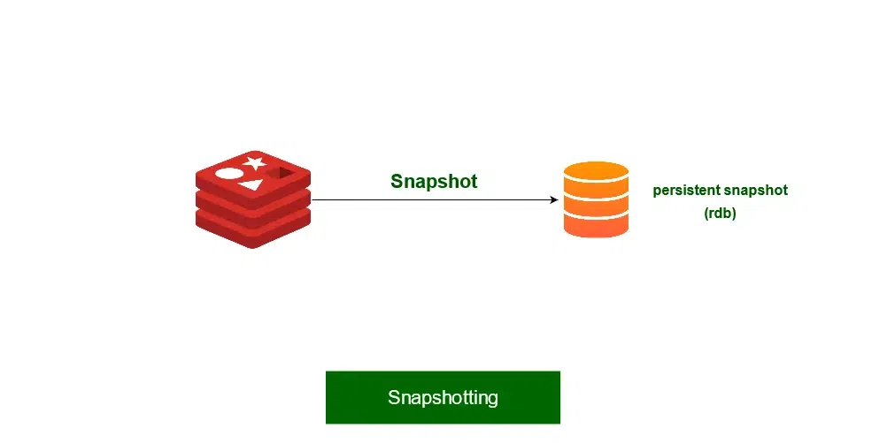
		- RDB là một ảnh chụp dữ liệu Redis tại một thời điểm, được lưu dưới dạng tệp nhị phân. Tệp RDB chứa một bản sao của tập dữ liệu tại một thời điểm nhất định và có thể được sử dụng để khôi phục dữ liệu trong trường hợp máy chủ gặp sự cố hoặc khởi động lại. RDB rất hiệu quả về không gian lưu trữ và hiệu suất, vì nó sử dụng định dạng nhị phân để lưu dữ liệu.  
		- RDB có thể được cấu hình để lưu dữ liệu định kỳ hoặc dựa trên một số điều kiện nhất định, chẳng hạn như số lượng tối thiểu các thao tác ghi. Tuy nhiên, nhược điểm của RDB là có thể gây mất dữ liệu nếu máy chủ gặp sự cố trước khi snapshot RDB được tạo.  
		- Quá trình Snapshotting trong RDB: Snapshotting là một quá trình trong Redis persistence, tạo một ảnh chụp tại một thời điểm của toàn bộ tập dữ liệu trong bộ nhớ và lưu nó vào ổ đĩa dưới dạng tệp nhị phân. Ảnh chụp này có thể được sử dụng để khôi phục dữ liệu nếu máy chủ gặp sự cố hoặc khởi động lại. Redis hỗ trợ snapshotting thông qua cơ chế lưu trữ RDB.  
			- Redis tạo tiến trình con từ tiến trình cha.  
			- Tiến trình con sao chép trạng thái hiện tại của tập dữ liệu trong bộ nhớ.  
			- Tiến trình con ghi bản sao của dữ liệu vào tệp RDB tạm thời.  
			- Tiến trình con đổi tên tệp tạm thành tệp RDB chính thức, ghi đè lên tệp RDB cũ.  
			- Tiến trình con kết thúc, Redis tiếp tục xử lý yêu cầu từ client.  
			- Redis có thể được cấu hình để tự động snapshot theo chu kỳ hoặc dựa trên số lần ghi dữ liệu. Nếu có nhiều thao tác ghi và thay đổi dữ liệu:  
				- Snapshot mỗi phút nếu có nhiều thay đổi.  
				- Snapshot mỗi 5 phút nếu có thay đổi vừa phải.  
				- Snapshot mỗi 15 phút nếu thay đổi ít.  
		- Ưu điểm của RDB (Real-time Database)
			- Tối ưu cho sao lưu (backup): RDB lưu trữ dữ liệu dưới dạng tệp duy nhất, nhỏ gọn, giúp phục hồi nhanh chóng khi xảy ra sự cố.
			- Phục hồi dữ liệu sau thảm họa: Dữ liệu có thể dễ dàng chuyển đến trung tâm dữ liệu ở xa, đảm bảo an toàn khi có sự cố hệ thống.
		- Nhược điểm của RDB (Real-time Database)
			- Không tối ưu cho tính sẵn sàng dữ liệu: Nếu Redis dừng hoạt động, có nguy cơ mất dữ liệu nếu snapshot chưa được tạo.
			- Khoảng thời gian giữa các snapshot: Thường thì RDB tạo bản snapshot mỗi 5 phút, vì vậy nếu Redis gặp sự cố trước lần snapshot tiếp theo, dữ liệu trong vài phút gần nhất có thể bị mất.

	- AOF (Append-Only File) Persistence Model
	- 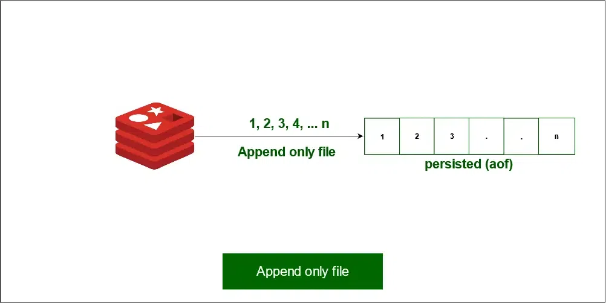
		- AOF ghi lại tất cả các thao tác ghi vào một tệp ở định dạng có thể đọc được. Tệp này chứa bản ghi của tất cả các thao tác ghi được thực hiện trên tập dữ liệu kể từ lần lưu trước đó, giúp tái tạo lại tập dữ liệu trong trường hợp gặp sự cố. AOF cung cấp độ bền dữ liệu tốt hơn so với RDB, vì nó ghi lại từng thao tác ghi vào ổ đĩa.
		- AOF có thể được cấu hình để lưu dữ liệu theo chu kỳ hoặc dựa trên các điều kiện nhất định, chẳng hạn như số lượng thao tác ghi tối thiểu. Tuy nhiên, AOF có thể dẫn đến hiệu suất chậm hơn và tiêu tốn nhiều không gian lưu trữ hơn, do nó ghi lại từng thao tác ghi vào ổ đĩa.
		- Tệp ghi nối tiếp (append-only file) là một chiến lược thay thế hoàn toàn bền vững cho Redis, vì snapshotting không đảm bảo độ bền cao.
		- AOF hoạt động như sau:
			- Redis tạo một tiến trình con từ tiến trình cha.
			- Tiến trình con tạo một bản sao trạng thái hiện tại của tập dữ liệu trong bộ nhớ.
			- Tiến trình con ghi bản sao của tập dữ liệu vào tệp AOF mới trong một tệp tạm thời.
			- Tiến trình cha tích lũy tất cả các thay đổi mới vào một bộ đệm trong bộ nhớ (đồng thời cũng ghi các thay đổi mới vào tệp AOF cũ, nên nếu quá trình ghi lại bị lỗi, dữ liệu vẫn an toàn).
			- Khi tiến trình con hoàn tất việc ghi lại tệp, tiến trình cha nhận tín hiệu và thêm dữ liệu từ bộ đệm vào cuối tệp AOF mà tiến trình con đã tạo.
			- Cuối cùng, Redis tự động đổi tên tệp cũ thành tệp mới và bắt đầu ghi dữ liệu mới vào tệp mới.
		- Ưu điểm của AOF
			- Độ bền dữ liệu cao: Có thể thiết lập các chính sách fsync linh hoạt: không fsync, fsync mỗi giây, fsync mỗi lần truy vấn.
			- Chỉ ghi nối tiếp (append-only): Không cần tìm kiếm dữ liệu, giảm nguy cơ hỏng dữ liệu khi mất điện.
			- Tự sửa lỗi: Công cụ kiểm tra của Redis có thể tự động sửa các lệnh ghi chưa hoàn tất nếu tệp bị gián đoạn do đầy ổ đĩa hoặc sự cố khác.
		- Nhược điểm của AOF
			- Tệp AOF thường lớn hơn so với tệp RDB cho cùng một tập dữ liệu.
			- Có thể chậm hơn RDB tùy thuộc vào cấu hình fsync cụ thể.
			- Cải thiện tính nhất quán của dữ liệu, nhưng không đảm bảo hoàn toàn—có thể mất dữ liệu, nhưng ít hơn so với chế độ RDB vì RDB nhanh hơn.
	- No Persistence Model: Redis cũng cung cấp tùy chọn vô hiệu hóa hoàn toàn lưu trữ, khi đó dữ liệu chỉ được lưu trữ trong bộ nhớ. Tùy chọn này hữu ích khi Redis được sử dụng như bộ nhớ đệm (cache), và dữ liệu có thể được tạo lại nếu bị mất.
	- Hybrid Persistence Model - RDB + AOF: Redis cung cấp tùy chọn sử dụng cả RDB và AOF đồng thời, gọi là lưu trữ kết hợp (hybrid persistence). Tùy chọn này kết hợp ưu điểm của cả RDB và AOF, trong đó AOF được sử dụng để phát lại các thao tác ghi sau khi khởi động lại, còn RDB giúp khôi phục tập dữ liệu tại một thời điểm cụ thể.
- Ba loại kiến trúc chính của Redis gồm:  
	- Redis Standalone – Phiên bản Redis đơn lẻ, phù hợp với ứng dụng nhỏ, nhưng có thể gặp rủi ro nếu server bị lỗi.  
	- Redis Sentinel – Cung cấp khả năng giám sát và chuyển đổi dự phòng, giúp hệ thống tự động phục hồi khi có sự cố.  
	- Redis Cluster – Kiến trúc phân tán, cho phép chia dữ liệu thành nhiều node để tăng hiệu suất và khả năng mở rộng.  
- Ưu điểm
	- Tốc độ truy cập dữ liệu cực nhanh: Redis hoạt động dựa trên bộ nhớ trong (in-memory), cho phép truy cập dữ liệu với tốc độ cao hơn nhiều so với các hệ thống lưu trữ dữ liệu truyền thống như MySQL hay PostgreSQL.
	- Khả năng mở rộng linh hoạt: Redis có thể dễ dàng mở rộng bằng cách thêm các máy chủ mới vào hệ thống, đáp ứng nhu cầu lưu trữ và truy cập dữ liệu ngày càng tăng.
	- Tính đơn giản: Cấu trúc dữ liệu đơn giản và dễ sử dụng cũng là yếu tố quan trọng khi nhắc về ưu điểm của Redis là gì. Theo đó, đặc trưng này góp phần giúp các lập trình viên dễ dàng tích hợp Redis vào các ứng dụng của mình.
	- Mã nguồn mở: Như đã đề cập đến ở trên, Redis là một hệ thống mã nguồn mở, miễn phí và dễ dàng tích hợp với các ứng dụng khác.
	- Hỗ trợ nhiều cấu trúc dữ liệu: Redis hỗ trợ nhiều cấu trúc dữ liệu khác nhau, bao gồm string, hash, list, set, sorted set,... Trên cơ sở đó, chúng có thể đáp ứng nhu cầu lưu trữ đa dạng của các ứng dụng.
- Nhược điểm 
	- Lưu trữ dữ liệu tạm thời: Redis lưu trữ dữ liệu trong bộ nhớ trong, do đó dữ liệu có thể bị mất nếu máy chủ bị lỗi hoặc khởi động lại. Để khắc phục vấn đề này, cần sử dụng các cơ chế sao lưu dữ liệu như RDB (Redis Database) hoặc AOF (Append-only file).
	- Khả năng truy vấn dữ liệu hạn chế: Redis không hỗ trợ các truy vấn phức tạp như các hệ thống cơ sở dữ liệu truyền thống.
	- Không phù hợp cho dữ liệu lớn: Redis cũng được cho là không phù hợp cho việc lưu trữ dữ liệu với dung lượng lớn vì có thể ảnh hưởng đến hiệu suất hệ thống.
	- Yêu cầu kiến thức chuyên môn: Việc triển khai và quản lý Redis hiệu quả đòi hỏi kiến thức chuyên môn về hệ thống và vận hành.
### 2.2 So sánh ưu nhược điểm từng hệ thống

| Tiêu chí           | MySQL/MariaDB                                                | Microsoft SQL Server                    | Oracle Database                                | PostgreSQL                                     | MongoDB (NoSQL)                      | Redis (In-memory NoSQL)                     |
| ------------------ | ------------------------------------------------------------ | --------------------------------------- | ---------------------------------------------- | ---------------------------------------------- | ------------------------------------ | ------------------------------------------- |
| Loại hình DB       | Cơ sở dữ liệu quan hệ (RDBMS)                                | Cơ sở dữ liệu quan hệ (RDBMS)           | Cơ sở dữ liệu quan hệ-hướng đối tượng (ORDBMS) | Cơ sở dữ liệu quan hệ-hướng đối tượng (ORDBMS) | Cơ sở dữ liệu NoSQL (Document-based) | Cơ sở dữ liệu NoSQL (Key-value)             |
| Mã nguồn           | Mã nguồn mở                                                  | Độc quyền (Microsoft)                   | Độc quyền (Oracle)                             | Mã nguồn mở                                    | Mã nguồn mở                          | Mã nguồn mở                                 |
| Hiệu suất          | Tối ưu cho ứng dụng web, nhanh với truy vấn đọc              | Mạnh mẽ, tối ưu cho doanh nghiệp        | Hiệu suất cao, hỗ trợ xử lý giao dịch lớn      | Tối ưu hóa truy vấn, lập chỉ mục mạnh          | Tối ưu hóa cho dữ liệu phi cấu trúc  | Cực nhanh do chạy trong bộ nhớ              |
| Mở rộng            | Mở rộng tốt, dễ triển khai                                   | Tích hợp tốt với hệ sinh thái Microsoft | Khả năng mở rộng cao với phân cụm và sao chép  | Hỗ trợ sao chép và phân cụm dữ liệu            | Hỗ trợ sharding và nhân bản dữ liệu  | Hỗ trợ clustering, mở rộng linh hoạt        |
| Tính nhất quán     | Hỗ trợ ACID, giao dịch mạnh                                  | Hỗ trợ ACID đầy đủ                      | ACID mạnh, tối ưu cho giao dịch                | ACID, kiểm soát đồng thời đa phiên             | Không đảm bảo toàn vẹn như SQL       | Không hỗ trợ ACID                           |
| Sao lưu & phục hồi | Hỗ trợ backup, replication                                   | Hỗ trợ backup và recovery mạnh          | Hỗ trợ phục hồi dữ liệu cao, sao lưu toàn diện | Hỗ trợ PITR và nhân bản dữ liệu                | Replica Sets giúp đảm bảo dữ liệu    | RDB, AOF hoặc kết hợp lưu trữ dữ liệu       |
| Truy vấn           | SQL                                                          | Transact-SQL (T-SQL)                    | PL/SQL, tối ưu hóa truy vấn phức tạp           | SQL nâng cao                                   | Mongo Query Language (MQL)           | Truy vấn key-value đơn giản                 |
| Tích hợp hệ thống  | Tích hợp tốt với ứng dụng web                                | Tích hợp với Windows, Azure             | Hỗ trợ các hệ thống doanh nghiệp lớn           | Tương thích với nhiều nền tảng                 | Dễ tích hợp với ứng dụng web         | Chủ yếu dùng làm cache và xử lý nhanh       |
| Bảo mật            | Tốt, hỗ trợ mã hóa                                           | Mạnh, kiểm soát truy cập chi tiết       | Hỗ trợ mã hóa, bảo mật cấp cao                 | Hỗ trợ quyền truy cập nâng cao                 | Bảo mật mặc định thấp                | Không có xác thực mặc định                  |
| Dữ liệu lớn        | Hiệu suất giảm nếu dữ liệu quá lớn                           | Xử lý dữ liệu lớn tốt                   | Tối ưu hóa dữ liệu lớn, doanh nghiệp           | Quản lý dữ liệu lớn hiệu quả                   | Quản lý dữ liệu lớn tốt hơn SQL      | Không phù hợp với dữ liệu lớn               |
| Ứng dụng phổ biến  | Web, thương mại điện tử, CMS                                 | Doanh nghiệp, tài chính, ERP            | Quản lý tài nguyên, phân tích dữ liệu          | Phân tích dữ liệu, giao dịch tài chính         | Big Data, AI, ứng dụng phân tán      | Caching, xếp hạng, phân tích thời gian thực |
| Ưu điểm            | Nhanh, dễ dùng, miễn phí                                     | Bảo mật cao, hiệu suất tốt              | Khả năng mở rộng, bảo mật cao                  | ACID, mở rộng tốt, hỗ trợ NoSQL                | Linh hoạt, mở rộng tốt, hỗ trợ JSON  | Tốc độ cực nhanh, hỗ trợ nhiều kiểu dữ liệu |
| Nhược điểm         | Hạn chế về truy vấn phức tạp, hiệu suất giảm khi dữ liệu lớn | Chi phí cao, cấu hình phức tạp          | Yêu cầu phần cứng mạnh, chi phí cao            | Cần tài nguyên lớn, độ phức tạp cao            | Không hỗ trợ giao dịch mạnh như SQL  | Dữ liệu mất nếu không bật lưu trữ           |

### 2.3 Tiêu chí lựa chọn DBMS phù hợp
- Việc lựa chọn Hệ quản trị Cơ sở dữ liệu (DBMS) phù hợp là một quyết định quan trọng đối với bất kỳ ứng dụng phần mềm nào. Lựa chọn này có thể ảnh hưởng đáng kể đến hiệu suất, khả năng mở rộng và sự thành công tổng thể của ứng dụng
- Để lựa chọn DBMS phù hợp trước tiên cần hiểu nhu cầu cần sử dụng 
	- Cấu trúc dữ liệu: Quan hệ, tài liệu, đồ thị hay chuỗi thời gian?
	- Khả năng mở rộng: Mở rộng nhanh? Ngang hay dọc?
	- Hiệu suất: Đọc/ghi nhanh hay truy vấn phức tạp?
	- Tính nhất quán: ACID mạnh hay chấp nhận nhất quán cuối cùng?
	- Ngân sách: Mã nguồn mở hay cần phí cấp phép?
- Các yếu tố cần cân nhắc khi chọn DBMS: 
	- Mô hình dữ liệu: Chọn giữa RDBMS (dữ liệu có cấu trúc) và NoSQL (dữ liệu phi cấu trúc, phân cấp).  
	- Tính nhất quán: Đảm bảo dữ liệu được duy trì chính xác, đặc biệt khi có nhiều nguồn.  
	- Bảo mật và bảo vệ dữ liệu: Mã hóa, kiểm soát quyền truy cập, sao lưu và khôi phục để đảm bảo an toàn.  
	- Hiệu suất và khả năng mở rộng: Đánh giá tốc độ phản hồi, hỗ trợ mở rộng ngang/dọc để đáp ứng nhu cầu phát triển.  
	- Tích hợp và truy cập đa người dùng: Hỗ trợ đồng bộ hóa, tương thích với hạ tầng IT và các công cụ khác.  
	- Chi phí triển khai và duy trì: Tính toán tổng chi phí sở hữu (TCO) bao gồm cấp phép, hạ tầng và bảo trì.  
	- Cộng đồng và hỗ trợ: Đánh giá tài liệu, quy mô cộng đồng, mức độ hỗ trợ kỹ thuật.  
	- Hệ sinh thái: Xem xét các công cụ, thư viện, khả năng tích hợp với hệ thống hiện có.  
## 3. Cài Đặt và Cấu Hình
- Trình bày với các DBMS phổ biến : MySQL/MariaDB, Microsoft SQL Server, Oracle Database, PostgreSQL, MongoDB và Redis. 
- Về các phần 
	- Yêu cầu hệ thống phần cứng
	- Quy trình cài đặt cơ bản
	- Cấu hình tối ưu hiệu năng
	- Cấu hình bảo mật cơ bản

### 3.1 MySQL/MariaDB
#### 3.1.1 Yêu cầu hệ thống  
- Hệ điều hành: Windows, Linux (Ubuntu, Debian, CentOS, RedHat, v.v.)
- CPU: Ít nhất 1 nhân, khuyến nghị 4+ nhân
- RAM: Tối thiểu 512MB, tốt nhất là 1GB+
- Ổ cứng: Tối thiểu 1GB, tùy vào dữ liệu

#### 3.1.2 Quy trình cài đặt cơ bản
- MySQL    
	- Windows 
		- Truy cập trang chủ để tải file cài đặt [MySQL Community Downloads](https://dev.mysql.com/downloads/installer/)
		- 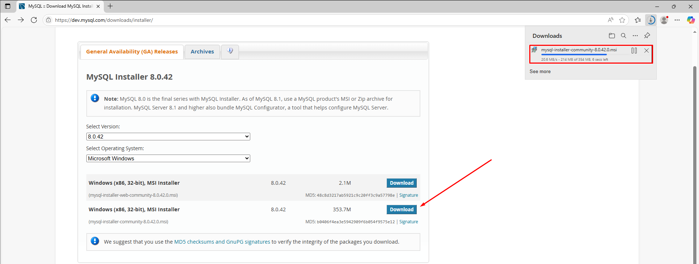
		- Chạy file cài đặt 
		- Chọn phần mềm cần cài: có thể chọn chỉ cài Server hoặc chọn Full để cài thêm phần mềm client 
		- 
		- 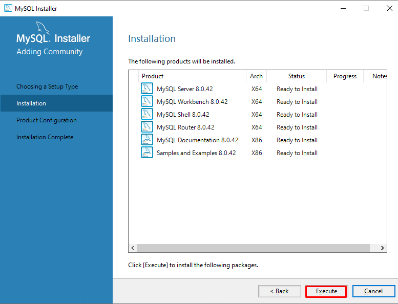
		- Quá trình cài đặt diễn ra 
		- 
		- Cấu hình port 
		- 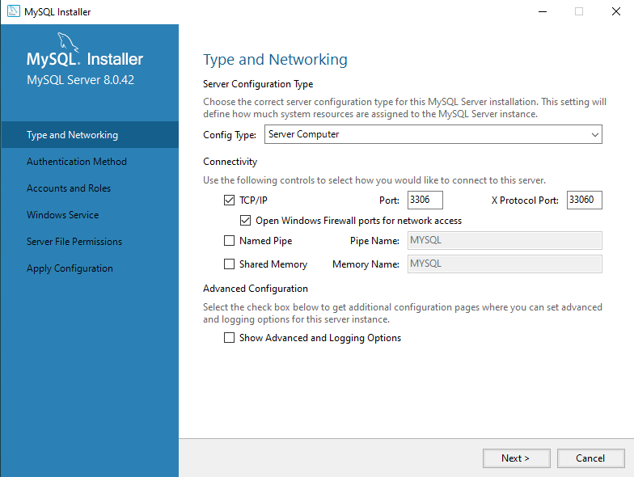
		- Cấu hình mật khẩu root
		- 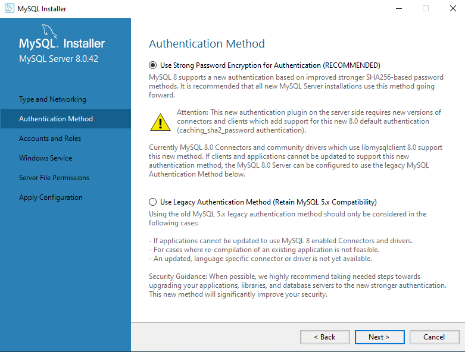
		- 
		- Cấu hình Windows Service 
		- 
		- Apply 
		- 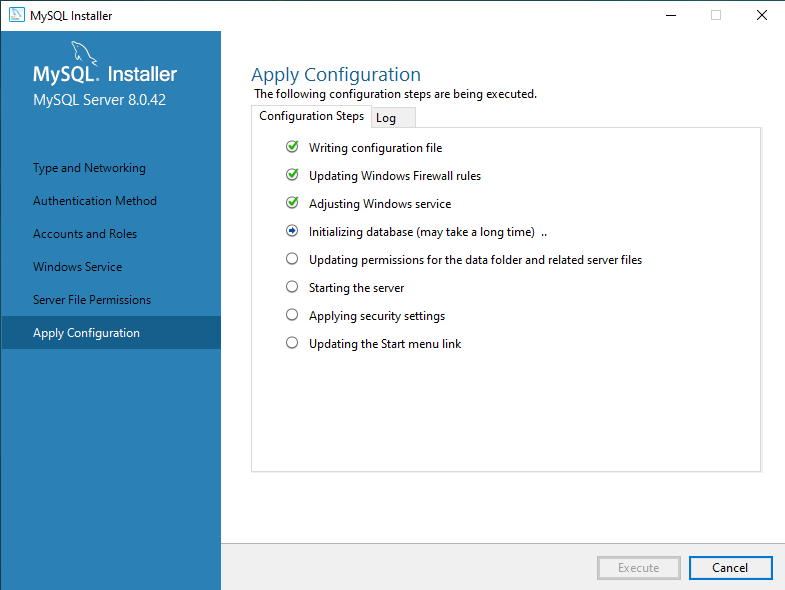
		- Kiểm tra 
		- 
		- Hoàn tất cài đặt 
		- 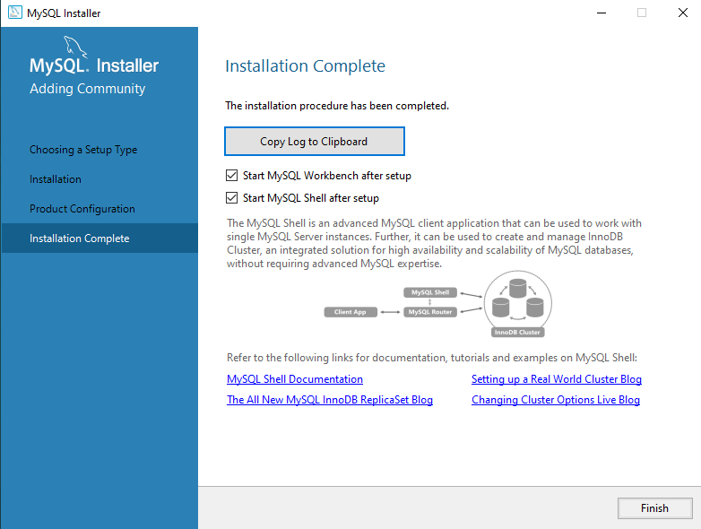
		
	- Linux (Ubuntu)
		- Chạy lệnh cập nhật 
		```
		apt update && apt upgrade -y 
		```
		- 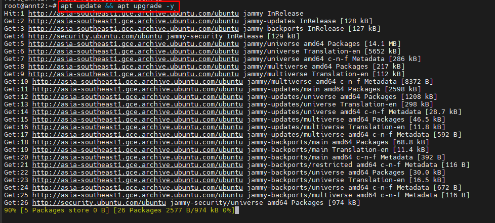
		- Chạy lệnh cài đặt 
		```
		sudo apt install mysql-server -y 
		```
		- 
		- Khởi động và Kiểm tra 
		```
		systemctl start mysql.service
		systemctl status mysql
		```
		- 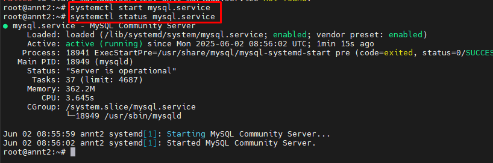
		- Tạo database, bảng, chèn dữ liệu test:
		```
		mysql 
		```
		```
		create database test_database;
		create table test_database.test_table (id int, name varchar(50), address varchar(50), primary key (id));
		insert into test_database.test_table(id, name, address) values("001", "Ubuntu", "For Testing");
		select * from test_database.test_table;
		```
		- 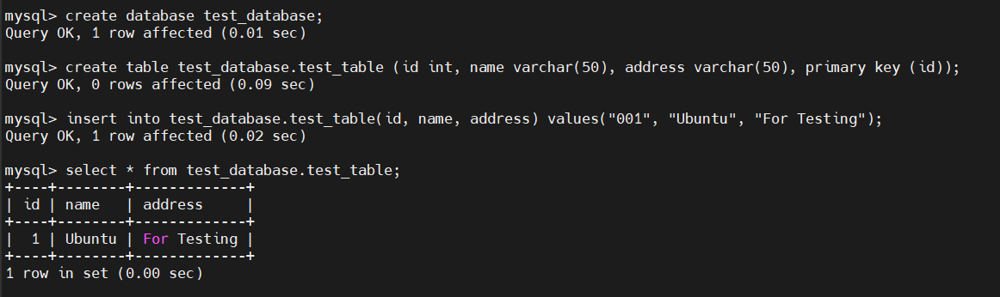

- MariaDB
	- Windows 
		- Truy cập trang chủ để tải file cài đặt [MariaDB Downloads](https://mariadb.org/download/)
		- 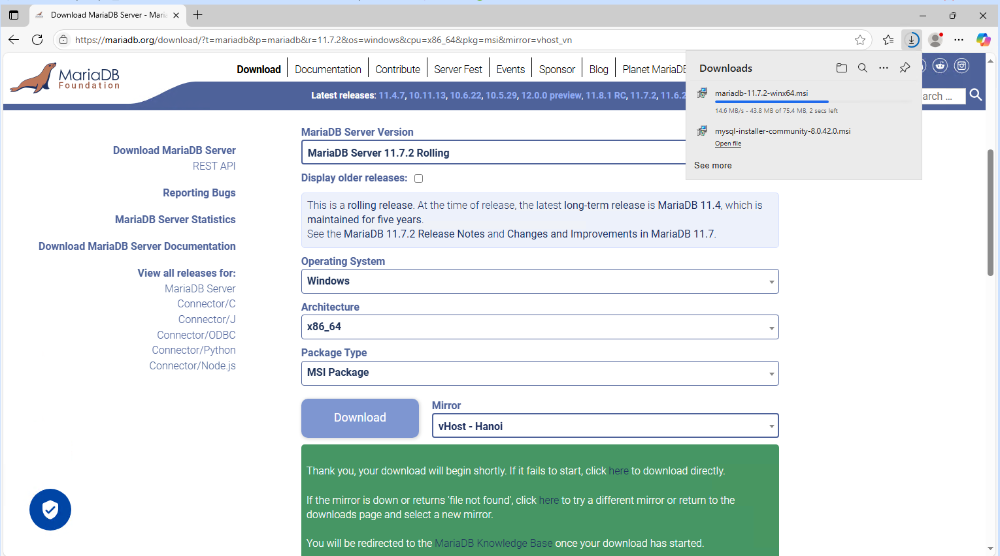
		- Chạy file cài đặt 
		- 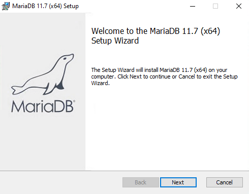
		- Chọn các thành phần cài đặt 
		- 
		- Cấu hình root password 
		- 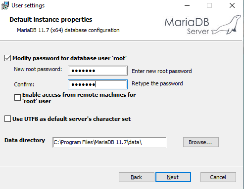
		- Cấu hình port 
		- 
		- Qúa trình cài đặt diễn ra 
		- 
		- 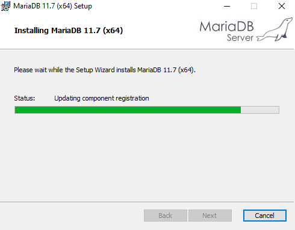
		- Hoàn tất cài đặt 
		- 
		- Các phần mềm quản lý
		- 
		- Khởi chạy client kết nối với MariaDB server 
		
	- Linux (Ubuntu)
		- Chạy lệnh cập nhật 
		```
		apt update && apt upgrade -y 
		```
		- 
		- Chạy lệnh cài đặt 
		```
		apt -y install mariadb-server
		```
		- 
		- Khởi động và Kiểm tra 
		```
		systemctl start mariadb
		systemctl status mariadb
		```
		- 
		- Tạo database, bảng, chèn dữ liệu test:
		```
		mysql 
		```
		```
		create database test_database;
		create table test_database.test_table (id int, name varchar(50), address varchar(50), primary key (id));
		insert into test_database.test_table(id, name, address) values("001", "Ubuntu", "For Testing");
		select * from test_database.test_table;
		```
		- 

#### 3.1.3 Cấu hình tối ưu hiệu năng
- Cấu hình sử dụng InnoDB thay vì MyISAM: MyISAM có ít tính năng nâng cao hơn InnoDB. Nhìn chung, MyISAM kém hiệu quả hơn, với ít cải tiến tối ưu hóa gốc hơn. Ví dụ, InnoDB có một chỉ mục theo nhóm, với dữ liệu trong các trang và các khối vật lý liên tiếp. Nếu một giá trị quá nhiều để vừa với một trang, InnoDB sẽ di chuyển nó đến một vị trí khác, lập chỉ mục giá trị của nó – dữ liệu thích hợp vẫn ở cùng một vị trí trên ổ cứng, rút ​​ngắn thời gian truy xuất nó.
	- Sử dụng lệnh `show table info;` để kiểm tra. 
	- 
	- Nếu chưa cấu hình ở InnoDB thì sử dụng lệnh `ALTER TABLE <table_name> ENGINE=InnoDB;` để cấu hình.
	- 
- Các options tuning trong cấu hình Mysql 
	- innodb_buffer_pool_size: Tham số này xác định lượng bộ nhớ được MySQL phân bổ cho bộ đệm InnoDB. Giá trị khuyến nghị cho tham số này là 70-80% tổng bộ nhớ khả dụng. Dữ liệu càng lớn thì giá trị này càng nên được tăng lên.  
	- max_connection: Tham số này xác định số lượng kết nối đồng thời tối đa được phép và có giá trị mặc định là 151. Để tránh lỗi “Too many connections”, giá trị này có thể được tăng lên. Tuy nhiên, cần lưu ý rằng quá nhiều kết nối mở có thể ảnh hưởng đến hiệu suất.  
	- innodb_io_capacity: Tham số này xác định số lượng thao tác I/O mỗi giây được phép cho các tác vụ chạy nền, với giá trị mặc định là 200. Thông thường, giá trị khoảng 100 phù hợp với các ổ cứng trung bình, trong khi đối với các thiết bị lưu trữ nhanh hơn, giá trị cao hơn sẽ có lợi.  
	- innodb_log_file_size: Tham số này xác định kích thước (tính bằng byte) của mỗi tệp nhật ký redo MySQL trong một nhóm nhật ký, với giá trị mặc định là 134,217,728 (khoảng 128MB). Tham số `innodb_log_files_in_group` xác định số lượng tệp nhật ký trong nhóm, có giá trị mặc định là 2. Nếu giá trị `innodb_log_file_size` quá nhỏ cho khối lượng công việc của bạn và ứng dụng của bạn thực hiện nhiều thao tác ghi, bạn nên tăng kích thước này. Tuy nhiên, nếu giá trị `innodb_log_file_size` quá lớn, thời gian khôi phục sau sự cố sẽ tăng lên, do đó cần xác định kích thước tối ưu phù hợp.
	- Ví dụ cấu hình này tối ưu hóa MySQL bằng cách phân bổ 2GB cho bộ đệm InnoDB, giới hạn tối đa 200 kết nối, đặt khả năng xử lý I/O ở mức 400, và mở rộng kích thước tệp nhật ký lên 256MB.
		```
		nano /etc/mysql/mysql.conf.d/mysqld.cnf
		```
		```
		innodb_buffer_pool_size = 2G
		max_connections = 200
		innodb_io_capacity = 400
		innodb_log_file_size = 256M
		```
		- innodb_buffer_pool_size = 2G – Phân bổ 2GB RAM cho bộ đệm InnoDB, giúp cải thiện tốc độ truy xuất dữ liệu.
		- max_connections = 200 – Giới hạn tối đa 200 kết nối đồng thời, tránh tình trạng quá tải hệ thống.
		- innodb_io_capacity = 400 – Nâng giới hạn I/O lên 400, giúp tăng hiệu suất ghi/đọc trên ổ cứng hoặc SSD.
		- innodb_log_file_size = 256M – Mở rộng kích thước tệp nhật ký lên 256MB, giúp tăng tốc độ ghi dữ liệu và cải thiện khả năng khôi phục sau sự cố.
		```
		systemctl restart mysql 
		```
		- 
		- 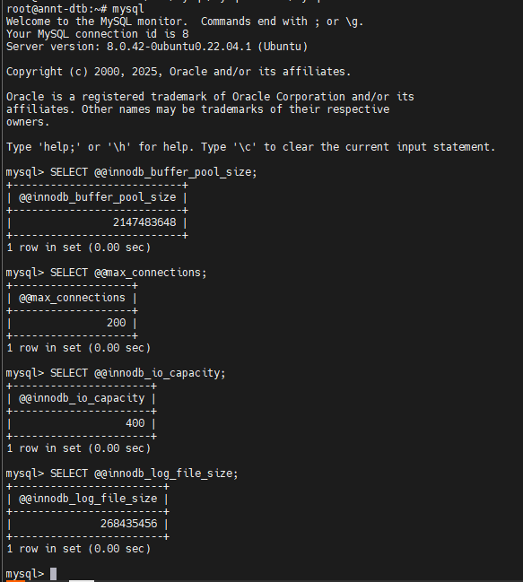
		- Với Windows file cấu hình mysql nằm tại `C:\ProgramData\MySQL\MySQL Server 8.0\my.ini`
		- 
	- Thread_cache_size: số lượng threads trên server sẽ được cache.
		- Để tính được thông số ta thực hiện như sau :
		```
		mysql -e "show status like 'Threads_created';"
		mysql -e "show status like 'Connections';"
		```
		– Sau khi có 2 thông số thì tính ra được giá trị cần cấu hình:`100 – ((Threads_created / Connections) * 100))`
	- Reverse DNS lookups: Mặc định thì MySQL thực hiện DNS lookup những IP connect tới. Với mỗi Client connect thì địa chỉ IP sẽ được kiểm tra và phân giải. Sau đó Hostname sẽ được phân giải và trả về IP. Điều này sẽ làm cho quá trình bị chậm trê khi DNS có vấn đề .Tắt chức năng này để tăng khả năng phản hồi.
	- Slow query logs: Logging query chậm có thể giúp xác định các cơ sỡ dữ liệu và và debug.
	- Ví dụ cấu hình 
		```
		nano /etc/mysql/mysql.conf.d/mysqld.cnf
		```
		```
		thread_cache_size = 10 
		skip-name-resolve
		slow-query-log=1
		slow-query-log-file=/var/lib/mysql/mysql-slow.log
		long_query_time = 1
		```
		- 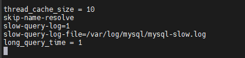
		- thread_cache_size = 10 – Giới hạn tối đa 10 luồng có thể được lưu trữ trong bộ nhớ đệm để tái sử dụng, giúp giảm chi phí tạo luồng mới và cải thiện hiệu suất.
		- skip-name-resolve – Bỏ qua quá trình tra cứu DNS của máy khách, giúp tăng tốc độ kết nối bằng cách chỉ sử dụng địa chỉ IP thay vì tên miền.
		- slow-query-log = 1 – Bật nhật ký truy vấn chậm, giúp theo dõi các truy vấn có thời gian thực thi dài để tối ưu hóa.
		- slow-query-log-file = /var/lib/mysql/mysql-slow.log – Xác định vị trí tệp nhật ký chứa thông tin về các truy vấn chậm, hỗ trợ phân tích và tối ưu hệ thống.
		- long_query_time = 1 – Định nghĩa thời gian tối thiểu (1 giây) để một truy vấn được coi là chậm và được ghi vào nhật ký, giúp phát hiện các truy vấn cần tối ưu hóa.
		```
		systemctl restart mysql 
		```
- MariaDB 
	- Các cấu hình tối ưu giống với MySQL 
	- File cấu hình MariaDB nằm tại 
		- Linux 
		```
		/etc/mysql/mariadb.conf.d/50-server.cnf
		```
		- Windows 
		```
		C:\Program Files\MariaDB 11.7\data\my.ini 
		```
	- Các cấu hình tối ưu giống với MySQL 
	- File cấu hình MariaDB nằm tại 
		- Linux 
		```
		/etc/mysql/mariadb.conf.d/50-server.cnf
		```
		- Windows 
		```
		C:\Program Files\MariaDB 11.7\data\my.ini 
		```
#### 3.1.4 Cấu hình bảo mật cơ bản
- Cấu hình MySQL, MariaDB giống nhau. 
- Chạy lệnh dưới đây để cấu hình bảo mật cho MySQL
	```
	sudo mysql_secure_installation
	```
	- 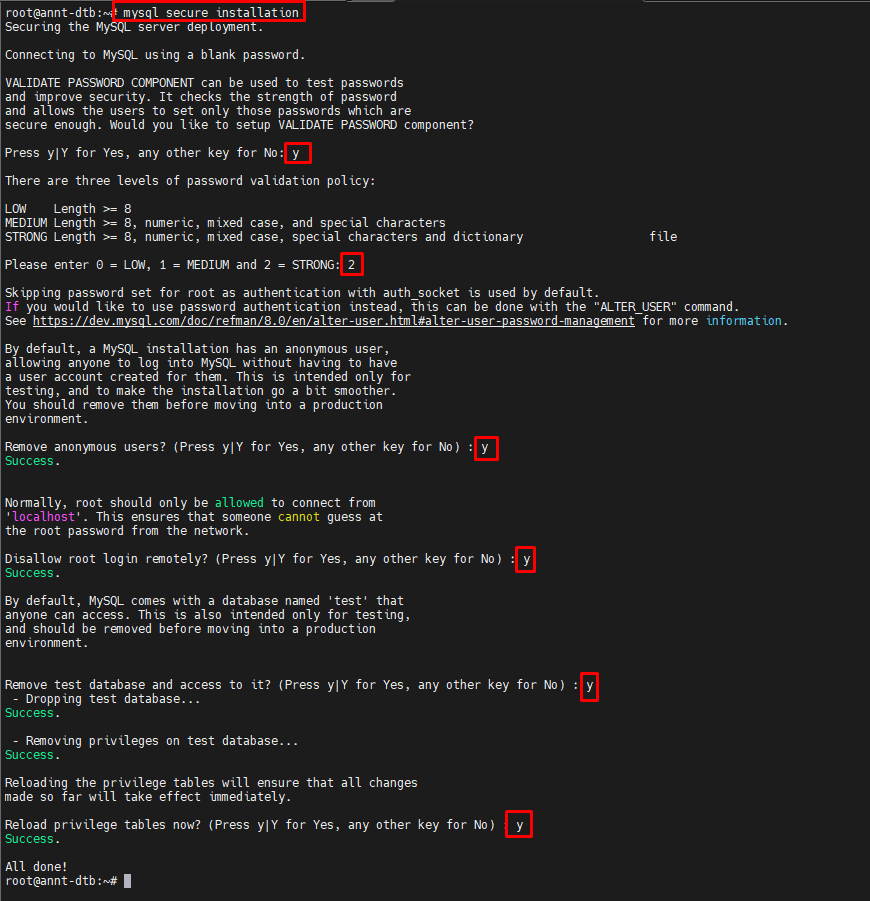
	- Thực hiện 
		- Bật kiểm tra mật khẩu với mức STRONG, yêu cầu mật khẩu ít nhất 8 ký tự, bao gồm chữ số, chữ hoa/thường, ký tự đặc biệt và kiểm tra từ điển.
		- Giữ xác thực root mặc định bằng auth_socket, thay vì đặt mật khẩu. Nếu cần, bạn có thể thay đổi bằng lệnh ALTER_USER.
		- Xóa người dùng ẩn danh, đảm bảo không ai có thể truy cập MySQL mà không có tài khoản.
		- Chặn đăng nhập từ xa cho root, tăng cường bảo mật bằng cách chỉ cho phép đăng nhập nội bộ.
		- Xóa cơ sở dữ liệu test và các quyền liên quan, ngăn truy cập trái phép vào dữ liệu thử nghiệm.
		- Tải lại bảng quyền, đảm bảo các thay đổi trên có hiệu lực ngay lập tức.
- Đổi Bind Port 
	- Chỉnh sửa file cấu hình 
	```
	nano /etc/mysql/mysql.conf.d/mysqld.cnf
	```
	hoặc file này đối với MariaDB
	```
	/etc/mysql/mariadb.conf.d/50-server.cnf
	```
	- Cấu hình thông số port khác mặc định 3306 
	```
	port = 3306
	```
	- 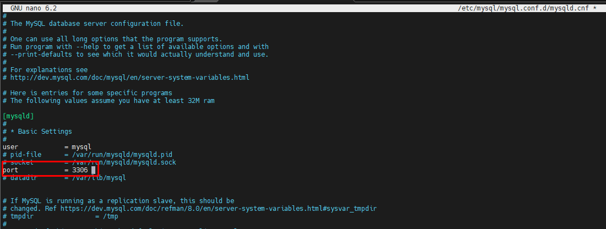
	- Restart Mysql để apply 
	```
	systemctl restart mysql
	```
	- Chú ý cần điều chỉnh mở port firewall tương ứng 
	```
	ufw allow <new-port>
	```
	
### 3.2 Microsoft SQL Server
#### 3.2.1 Yêu cầu hệ thống  
- Trên Windows 
	- Phần cứng:  
		- Bộ xử lý: X64, tối thiểu 1.4 GHz (khuyến nghị 2.0 GHz+).  
		- Bộ nhớ:  
		  - Express: Tối thiểu 512 MB (khuyến nghị 1 GB).  
		  - Các phiên bản khác: Tối thiểu 1 GB (khuyến nghị 4 GB+).  
		- Lưu trữ: Tối thiểu 6 GB dung lượng ổ cứng.  
		- Loại CPU: Intel hoặc AMD x86-64, tối đa 64 lõi mỗi NUMA node.  
	- Phần mềm:  
		- Hệ điều hành: Windows Server hoặc Windows 10/11.  
		- Kết nối Internet: Cần thiết cho một số tính năng (có thể phát sinh phí).  
		- Hệ thống tập tin: Hỗ trợ NTFS hoặc ReFS.  

- Trên Linux
	- Phần cứng:  
		- Bộ xử lý: X64 tương thích.  
		- Số lõi: Tối thiểu 2 lõi.  
		- Bộ nhớ: Tối thiểu 2 GB RAM.  
		- Tốc độ xử lý: Tối thiểu 2 GHz.  
		- Lưu trữ: Tối thiểu 6 GB dung lượng ổ cứng.  
	- Phần mềm:  
		- Hệ thống tập tin: Hỗ trợ XFS hoặc EXT4.  
		- Hệ thống tập tin mạng (NFS): Phiên bản 4.2 trở lên.  
		- Lưu ý: Thư mục `/var/opt/mssql` chỉ có thể được gắn kết trên NFS.  

#### 3.2.2 Quy trình cài đặt cơ bản
##### Windows   
- Truy cập trang chru để tải file cài 
- 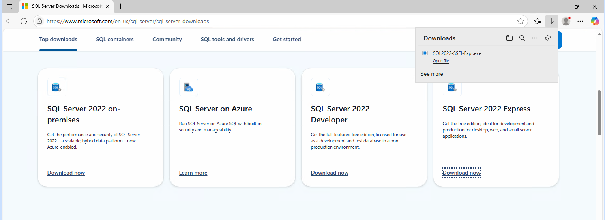
- Chạy file launcher để tải file cài đặt: Chọn express advanced 
- 
- Tải xuống file cài đặt 
- 
- Click open để mở thư mục chứa file mới tải và chạy file 
- 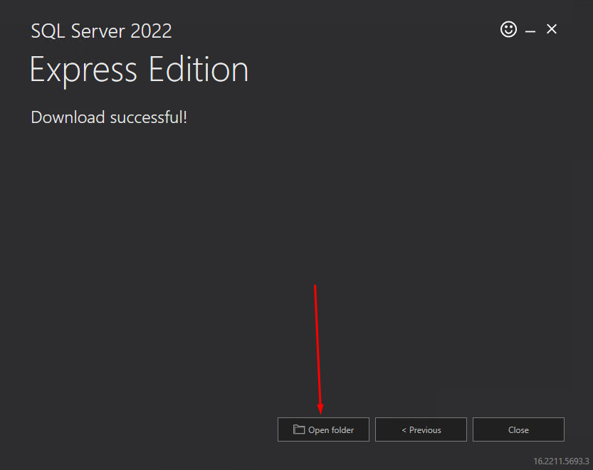
- 
- Extract 
- 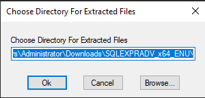
- Chọn Install 
- 
- Next
- 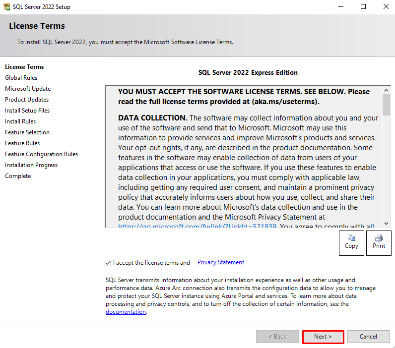
- Preinstall check 
- 
- Cấu hình dịch vụ sẽ cài 
- 
- Cấu hình tên 
- 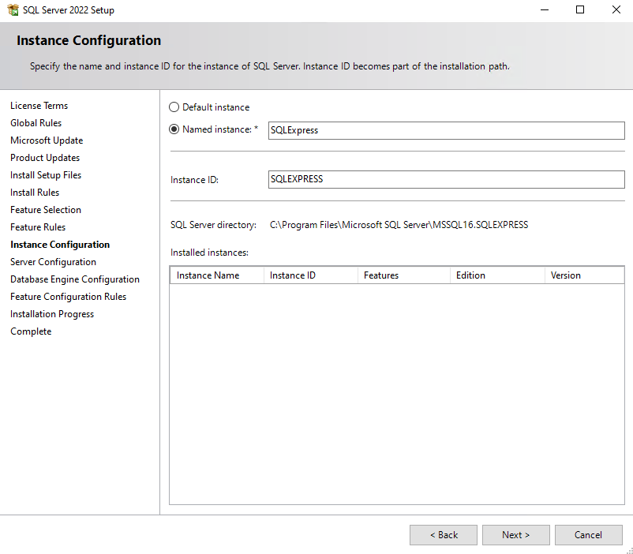
- Cấu hình service accounts 
- 
- Chọn Mixed Mode và cấu hình password accounts `sa` 
- 
- Qúa trình cài đặt diễn ra 
- 
- Hoàn tất cài đặt 
- 
- Cài SSMS để truy cập quản lý 
- 
- Tải file và khởi chạy 
- 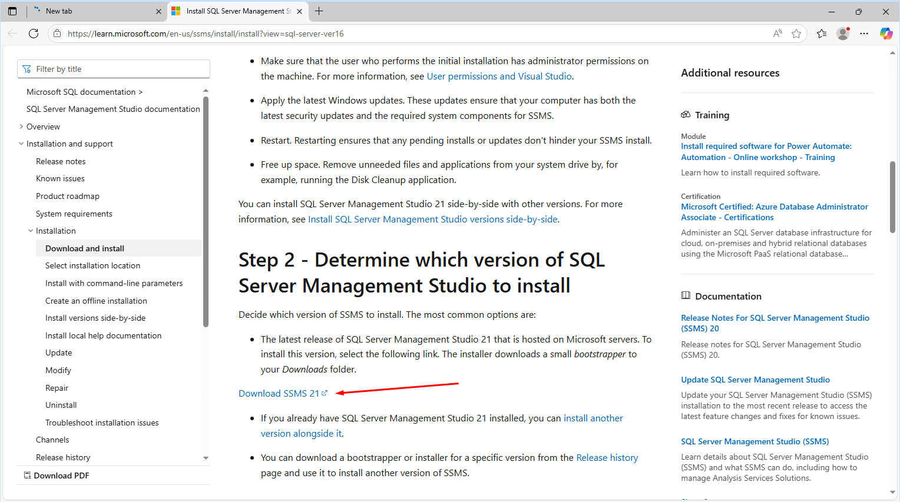
- 
- Cấu hình các tính năng đi kèm 
- 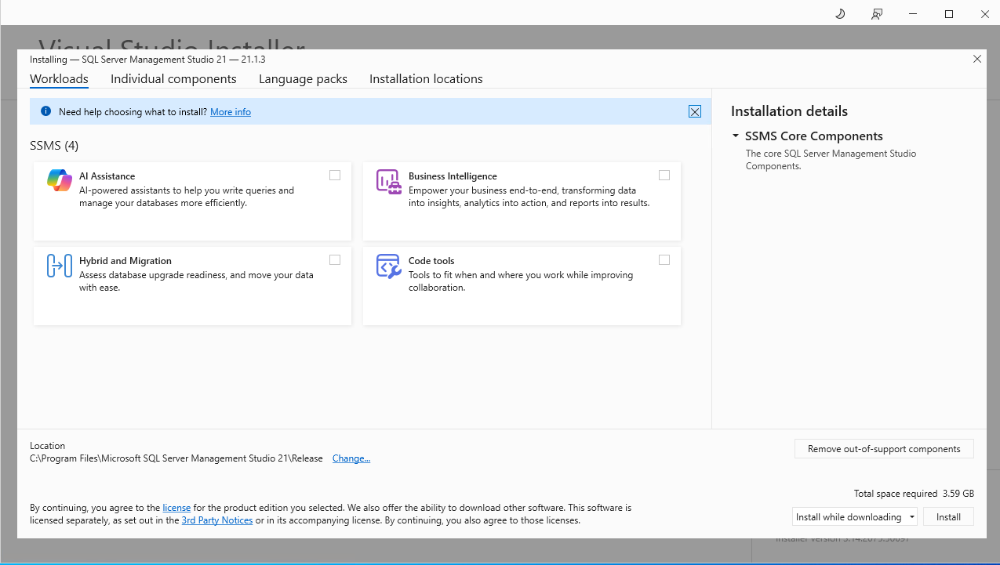
- 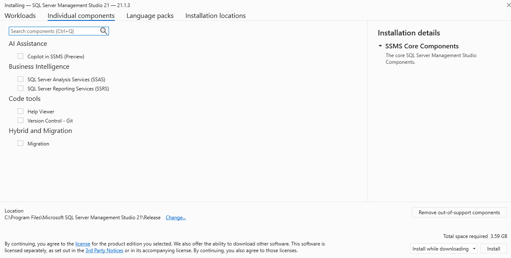
- Cấu hình gói ngôn ngữ 
- 
- Cấu hình nơi lưu
- 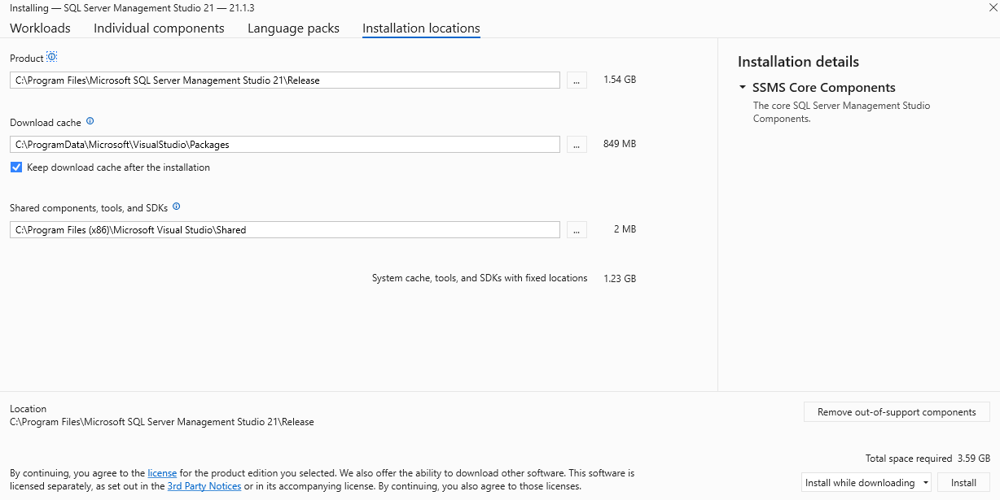
- Chọn Install - Quá trình cài đặt diễn ra 
- 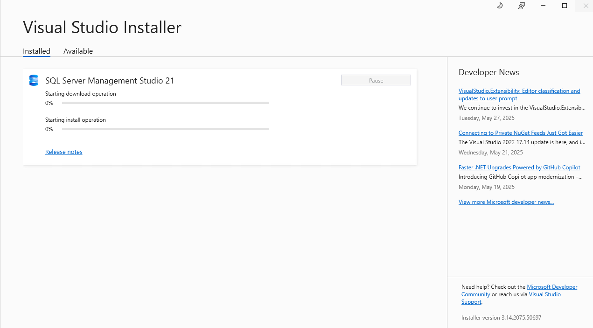
- Cài dat xong 
- 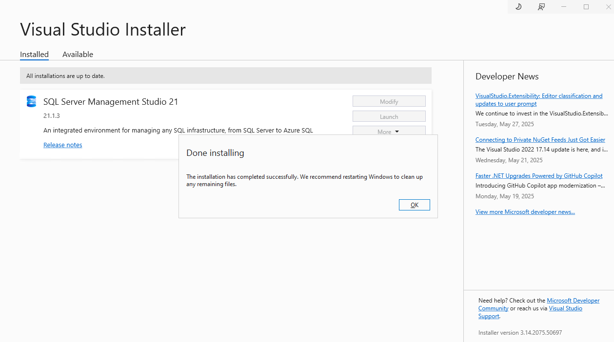
- Launch 
- 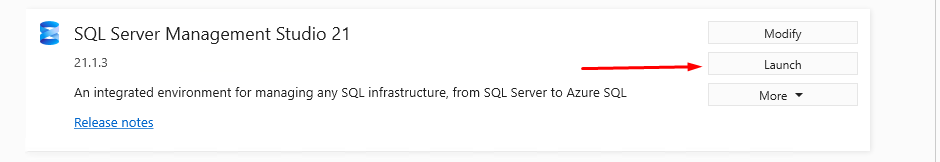
- Kết nối từ client 
- 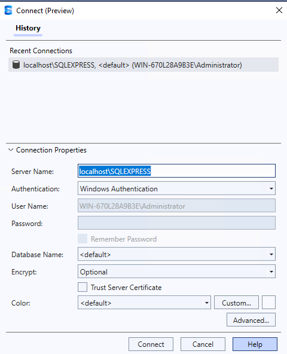
- Kết nối thành công 
- 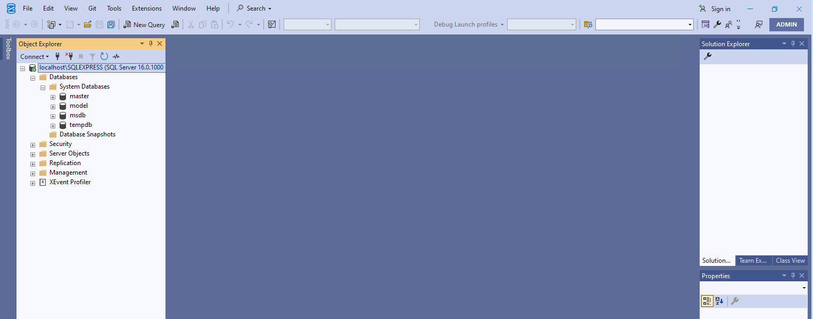
- Kết nối thử bằng user sa 
- 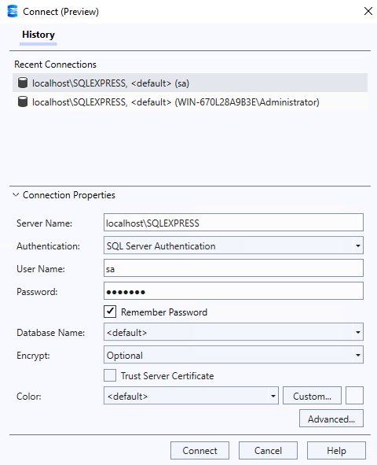
- Kết nối thành công 
- 
##### Linux (Ubuntu)
- Thêm SQL Server 2022 Repository và cài đặt 
```
wget https://packages.microsoft.com/keys/microsoft.asc -O /etc/apt/keyrings/mssql2022.key
wget https://packages.microsoft.com/config/ubuntu/22.04/mssql-server-2022.list -O /etc/apt/sources.list.d/mssql-server-2022.list
wget https://packages.microsoft.com/config/ubuntu/22.04/prod.list -O /etc/apt/sources.list.d/msprod.list
```
- 
- Thêm source List
```
nano /etc/apt/sources.list.d/mssql-server-2022.list
```
```
deb [signed-by=/etc/apt/keyrings/mssql2022.key arch=amd64,armhf,arm64] https://packages.microsoft.com/ubuntu/22.04/prod jammy main
```
- 
- Cập nhập Repo Database 
```
apt udpate 
```
- 
- Note: 
	- Sửa lỗi 
	```
	W: GPG error: https://packages.microsoft.com/ubuntu/22.04/mssql-server-2022 jammy InRelease: The following signatures couldn't be verified because the public key is not available: NO_PUBKEY EB3E94ADBE1229CF
	E: The repository 'https://packages.microsoft.com/ubuntu/22.04/mssql-server-2022 jammy InRelease' is not signed.
	```
	- Chạy lệnh 
	```
	wget https://packages.microsoft.com/config/ubuntu/22.04/packages-microsoft-prod.deb -O packages-microsoft-prod.deb
	sudo dpkg -i packages-microsoft-prod.deb
	rm packages-microsoft-prod.deb
	```
	- 
	
- Cài đặt SQL-Server 
``` 
apt -y install mssql-server mssql-tools unixodbc-dev
```
- 
- Accept term:
- 
- 
- Thiết lập ban đầu
```
/opt/mssql/bin/mssql-conf setup
```
- Chọn bản miễn phí (3), Accept terms, Cấu hình password admin 
- 
- Hoàn tất cài đặt kiểm tra hoạt động 
```
 systemctl status mssql-server
```
- 
- Thiết lập đường dẫn PATH cho các công cụ của Microsoft SQL Server (MSSQL) trên hệ thống Linux, đảm bảo rằng các lệnh sqlcmd và bcp có thể được sử dụng từ bất kỳ đâu trong terminal.
```
echo 'export PATH=$PATH:/opt/mssql-tools/bin' > /etc/	profile.d/mssql.sh
source /etc/profile.d/mssql.sh
```
- 
- Đăng nhập qua dòng lệnh 
```
sqlcmd -S localhost -U SA
select name,database_id from sys.databases;
go
select name from sysusers;
go
select current_user;
go
exit
```
- 
-Kết nối từ ssms trên client windows 
- 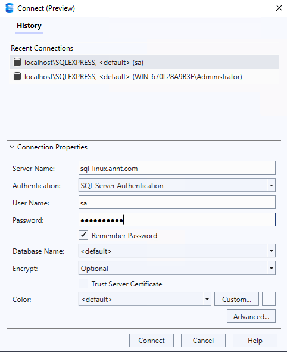
- 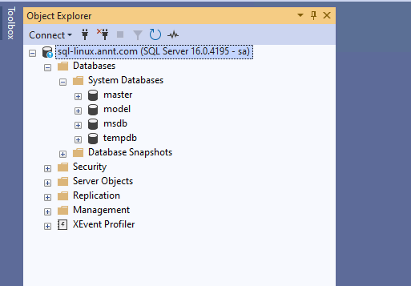

#### 3.2.3 Cấu hình tối ưu hiệu năng
- Cấu hình dung lượng RAM tối đa: Tại server SQL chọn Properties 
- 
- 
- Mức độ song song tối đa mặc định (MAXDOP)
	- MAXDOP là cấu hình cho phép SQLServer sử dụng bao nhiêu Processor của CPU để thực hiện các query (plan execution)
	- Mặc định SQLServer để MAXDOP = 0 là cho phép dùng tất cả các processor có thể của máy chủ và max = 64.
	- Có thể cấu hình giá trị này thông qua query 
	```
	-- Kiểm tra giá trị hiện tại
	EXEC sp_configure 'max degree of parallelism';

	-- Thay đổi nếu cần
	EXEC sp_configure 'max degree of parallelism', 4;  
	RECONFIGURE;
	```
	- Hoặc sử dụng giao diện : Tại server SQL chọn Properties 
	- 
	- Tại mục Advanced -> Max degree of parallelism
	- 
- Cost threshold for parallelism:
	- Đây là giá trị cấu hình ngưỡng chi phí của 1 query mà ở đó SQLServer bắt đầu xem xét thực thi query đó bằng multiple thread.
	- Thông thường các query đơn giản có cost < 50
	- Trong khi đó default của SQLServer là 5, quá bé, ta set ngưỡng này là 50 (tức là dưới 50 thì không cần chạy song song nhiều thread)
	- Có thể cấu hình giá trị này thông qua query 
	```
	-- Kiểm tra
	EXEC sp_configure 'cost threshold for parallelism';

	-- Thay đổi nếu cần
	EXEC sp_configure 'cost threshold for parallelism', 25;
	RECONFIGURE;
	```
	- Hoặc sử dụng giao diện : Tại server SQL chọn Properties 
	- 	
	- Tại mục Advanced -> Cost threshold for parallelism
	- 
- Cấu hình FileGrowth cho Data và Log
	- Là khả năng tăng trưởng mỗi lần của file Data và Log. Khuyến nghị ở đây là:
		- 256MB dành cho Data
		- 128MB dành cho Log
	- Có thể cấu hình giá trị này thông qua query 		
	```
	-- Kiểm tra filegrowth hiện tại
	SELECT name, physical_name, growth, is_percent_growth
	FROM sys.master_files
	WHERE database_id = DB_ID('YourDB');
	```
	- 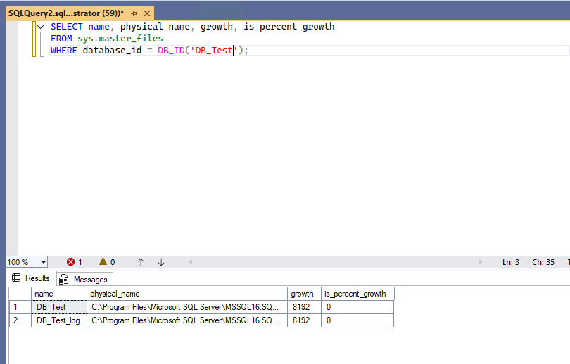
	```
	-- Chỉnh lại: không dùng % mà dùng MB cụ thể
	ALTER DATABASE YourDB
	MODIFY FILE (NAME = 'YourDB_Data', FILEGROWTH = 256MB);
	```
	- 
	- 
	- Hoặc sử dụng giao diện : Tại Database chọn Properties 
	- 
	- 
- Auto tuning (available only in the Enterprise and Developer editions of SQL Server.)
	- Tự động điều chỉnh là một tính năng của cơ sở dữ liệu giúp nhận biết các vấn đề tiềm ẩn về hiệu suất truy vấn, đề xuất giải pháp và tự động khắc phục các sự cố đã xác định.
	- Tính năng tự động điều chỉnh, được giới thiệu trong SQL Server 2017 (14.x), sẽ thông báo khi phát hiện vấn đề hiệu suất và cho phép bạn thực hiện các hành động khắc phục hoặc để Database Engine tự động sửa lỗi. SQL Server với tự động điều chỉnh có thể xác định và khắc phục các vấn đề hiệu suất do hồi quy lựa chọn kế hoạch thực thi truy vấn. Trong Azure SQL Database và SQL database trong Microsoft Fabric, tự động điều chỉnh cũng tạo chỉ mục cần thiết và loại bỏ các chỉ mục không sử dụng. 
	- Tự động điều chỉnh là một quá trình giám sát và phân tích liên tục nhằm tìm hiểu đặc điểm của khối lượng công việc, xác định các vấn đề tiềm ẩn và đề xuất các cải thiện.
	- Lợi ích của tự động điều chỉnh SQL Server. Tự động điều chỉnh hiệu suất cơ sở dữ liệu mang lại các lợi ích sau:  
		- Tự động xác minh cải thiện hiệu suất – Đảm bảo mọi thay đổi đều mang lại lợi ích thực sự.  
		- Tự động hoàn tác và tự sửa lỗi – Nếu một thay đổi không cải thiện hiệu suất, hệ thống sẽ tự động hoàn tác.  
		- Lịch sử điều chỉnh – Lưu lại các hành động tối ưu hóa để người dùng có thể tham khảo và phân tích.  
		- Tùy chỉnh bằng T-SQL – Cung cấp các tập lệnh Transact-SQL (T-SQL) để triển khai thủ công.  
		- Khả năng mở rộng – Có thể áp dụng tự động điều chỉnh trên hàng trăm nghìn cơ sở dữ liệu.  
		- Ảnh hưởng tích cực đến DevOps – Giúp tối ưu tài nguyên DevOps và giảm tổng chi phí sở hữu (TCO).  
	- Quy trình tự động điều chỉnh
		- 
		- Quá trình này giúp cơ sở dữ liệu thích ứng động với khối lượng công việc bằng cách xác định các chỉ mục và kế hoạch truy vấn có thể cải thiện hiệu suất. Dựa trên những phát hiện này, hệ thống sẽ thực hiện các hành động điều chỉnh để tối ưu hóa hiệu suất.  
		- Sau khi áp dụng các thay đổi, SQL Server tiếp tục giám sát hiệu suất để đảm bảo sự cải thiện. Nếu bất kỳ thay đổi nào không mang lại lợi ích, hệ thống sẽ tự động hoàn tác. Đây là một tính năng quan trọng giúp đảm bảo rằng mọi điều chỉnh không làm giảm hiệu suất tổng thể của khối lượng công việc.
		- Bật tính năng tự động điều chỉnh lựa chọn kế hoạch
		- Có thể bật tự động điều chỉnh cho từng cơ sở dữ liệu và chỉ định rằng kế hoạch tốt nhất trước đó sẽ được áp dụng khi phát hiện hồi quy lựa chọn kế hoạch.
	- Tính năng này được bật bằng lệnh sau trong SQL Server:
	```
	ALTER DATABASE <yourDatabase>
	SET AUTOMATIC_TUNING ( FORCE_LAST_GOOD_PLAN = ON );
	```
	- Sau khi kích hoạt tùy chọn này, Database Engine sẽ tự động ép buộc kế hoạch được đề xuất nếu:
		- Lợi ích CPU ước tính lớn hơn 10 giây.
		- Số lỗi trong kế hoạch mới nhiều hơn số lỗi trong kế hoạch được đề xuất.
		- Ngoài ra, hệ thống sẽ kiểm tra lại để đảm bảo kế hoạch ép buộc tốt hơn kế hoạch hiện tại.

#### 3.2.4 Cấu hình bảo mật cơ bản
- Disable xp_cmdshell: Tắt để tránh chạy lệnh hệ thống từ SQL
	- Có thể cấu hình giá trị này thông qua query 	 
	```
	-- Tắt xp_cmdshell
	EXEC sp_configure 'show advanced options', 1; RECONFIGURE;
	EXEC sp_configure 'xp_cmdshell', 0; RECONFIGURE;
	```
	- 
	- Hoặc sử dụng giao diện: Tại Server -> Faucets -> Security -> xp_cmdshell
	- 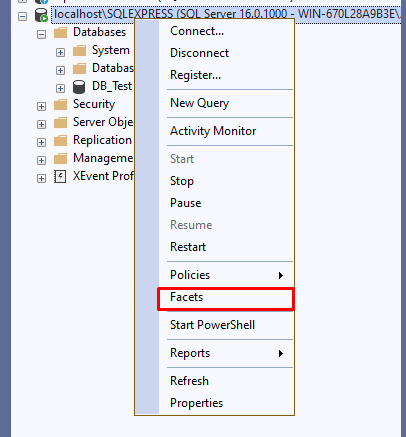
	- 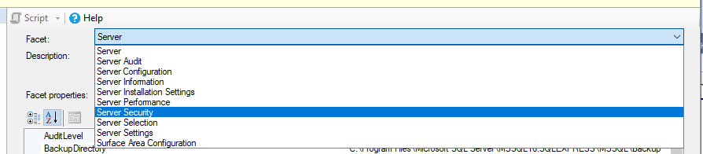
	- 
- Kiểm soát quyền truy cập
	- Bật audit: Tại server SQL chọn Properties -> Security -> Login Auditing 
	- 
	- 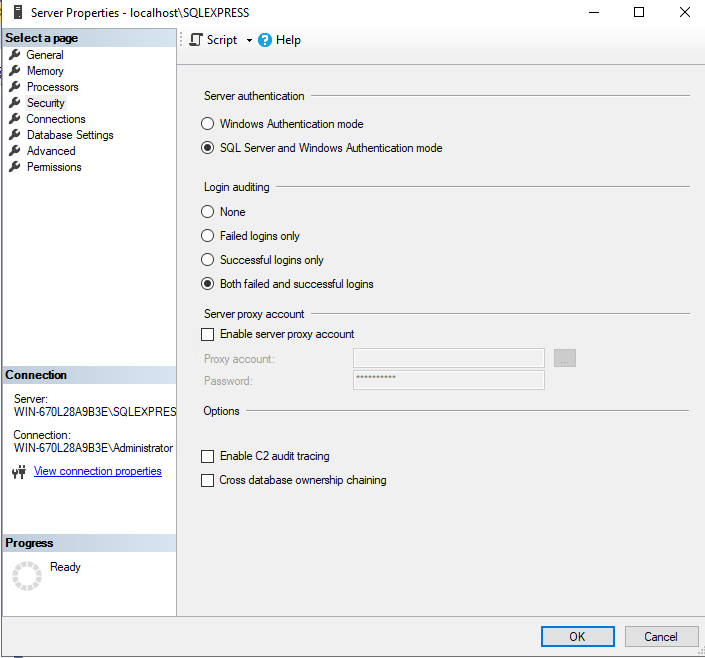
	- Không sử dụng `sa`, nếu dùng thì cần cấu hình mật khẩu mạnh 
	```
	ALTER LOGIN sa DISABLE;
	-- Hoặc dùng thì cần set pass mạnh
	ALTER LOGIN sa WITH PASSWORD = 'M@xS3cur323!@$#@P@ss!';
	```
- Bảo mật dữ liệu với TDE (Enterprise Feature)
- Transparent Data Encryption (TDE) là một cơ chế mã hóa cấp cơ sở dữ liệu, đảm bảo dữ liệu được lưu trữ trong SQL Server được bảo vệ khỏi các truy cập trái phép bằng cách mã hóa toàn bộ nội dung của cơ sở dữ liệu trên ổ đĩa.
- TDE sử dụng hệ thống phân cấp mã hóa để đảm bảo tính bảo mật và toàn vẹn của dữ liệu. Quá trình này bao gồm các thành phần sau:
	- Windows Data Protection API (DPAPI) – Đây là lớp bảo mật cấp hệ điều hành, có nhiệm vụ giải mã Service Master Key (SMK).
	- Service Master Key (SMK) – Được tạo tự động khi cài đặt SQL Server lần đầu, SMK chịu trách nhiệm mã hóa Database Master Key (DMK).
	- Database Master Key (DMK) – Được tạo trong master database, có nhiệm vụ mã hóa Chứng chỉ bảo mật (Certificate).
	- Certificate – Chứng chỉ này được sử dụng để tạo Database Encryption Key (DEK). Quan trọng: Người quản trị phải sao lưu chứng chỉ này để đảm bảo có thể khôi phục dữ liệu trong trường hợp xảy ra lỗi hệ thống.
	- Database Encryption Key (DEK) – Khóa cuối cùng trong chuỗi mã hóa, dùng để kích hoạt TDE trên một cơ sở dữ liệu cụ thể.
- Để triển khai Transparent Data Encryption (TDE), bạn cần sử dụng phiên bản SQL Server phù hợp. Đây là một tính năng yêu cầu bản Enterprise, nhưng cũng có sẵn trong Developer Edition (chỉ dùng cho thử nghiệm và phát triển). Trong môi trường sản xuất, bạn bắt buộc phải có phiên bản SQL Server hỗ trợ TDE.
- 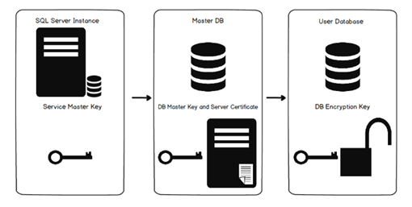
- Cấu hình 
	- Tạo Master Key
	```
	USE Master;
	GO
	CREATE MASTER KEY ENCRYPTION
	BY PASSWORD='5R^0g6EW92g6C&/pz90yx%)';
	GO
	```
	- Create Certificate protected by master key
	```
	CREATE CERTIFICATE TDE_Cert
	WITH 
	SUBJECT='Database_Encryption';
	GO
	```
	- Create Database Encryption Key
	```
	USE DB_Test
	GO
	CREATE DATABASE ENCRYPTION KEY
	WITH ALGORITHM = AES_256
	ENCRYPTION BY SERVER CERTIFICATE TDE_Cert;
	GO
	```
	- Enable Encryption
	```
	ALTER DATABASE DB_Test
	SET ENCRYPTION ON;
	GO
	```
	- Backup Certificate
	```
	BACKUP CERTIFICATE TDE_Cert
	TO FILE = 'C:\temp\TDE_Cert'
	WITH PRIVATE KEY (file='C:\temp\TDE_CertKey.pvk',
	ENCRYPTION BY PASSWORD='5R^0g6EW92g6C&/pz90yx%)') 
	```
	- Restoring a Certificate
	```
	USE Master;
	GO
	CREATE MASTER KEY ENCRYPTION
	BY PASSWORD='5R^0g6EW92g6C&/pz90yx%)';
	GO
	```
	```
	USE MASTER
	GO
	CREATE CERTIFICATE TDECert
	FROM FILE = 'C:\Temp\TDE_Cert'
	WITH PRIVATE KEY (FILE = 'C:\TDECert_Key.pvk',
	DECRYPTION BY PASSWORD = '5R^0g6EW92g6C&/pz90yx%)' );
	```

 
### 3.3 Mongod 
#### 3.3.1 Yêu cầu hệ thống   
- Phần cứng
	- RAM: Tối thiểu 4GB, khuyến nghị 8GB+ với tập dữ liệu lớn.
	- Dung lượng ổ đĩa: Cần 10GB trống, cộng thêm dung lượng cho dữ liệu.
	- CPU: Hỗ trợ kiến trúc x86_64 (Intel Sandy Bridge trở lên).
- Phần mềm
	- Hệ điều hành:
		- Windows: Hỗ trợ Windows Server 2022, 2019 và các phiên bản 64-bit khác.
		- Linux: Hỗ trợ SuSE, Ubuntu, Red Hat Enterprise Linux, cùng nhiều bản phân phối khác.
	- Mạng: MongoDB cần quyền truy cập FQDN giữa các máy chủ.
	- Quyền hệ thống (Windows): Tài khoản chạy mongod, mongos phải thuộc nhóm "Performance Monitor Users" và "Local". 

#### 3.3.2  Cài đặt cơ bản 
##### Windows   
- Tải file cài tại [MongoDB Community Edition]https://www.mongodb.com/try/download/community
- 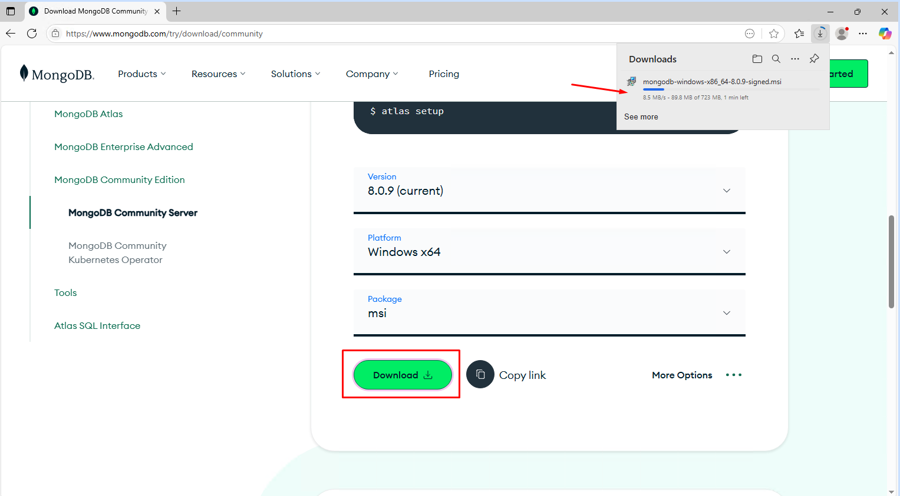
- Chạy file cài đặt
- 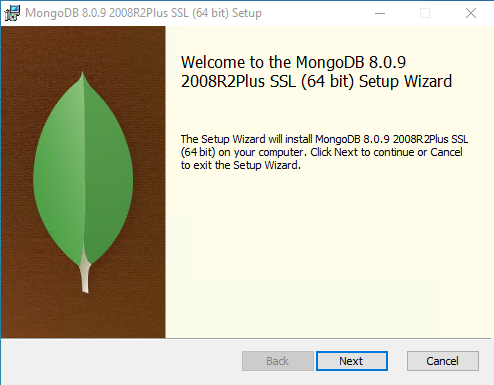
- Chọn Complete 
- 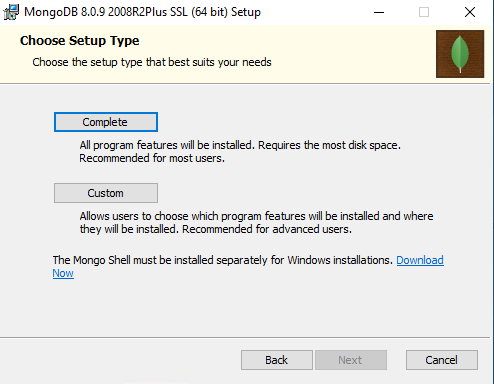
- Cấu hình mongod as a network service 
- 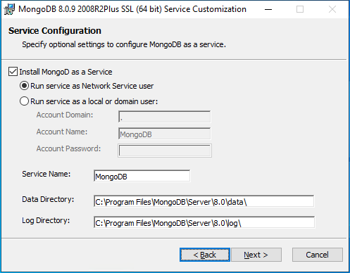
- Install Compass
- 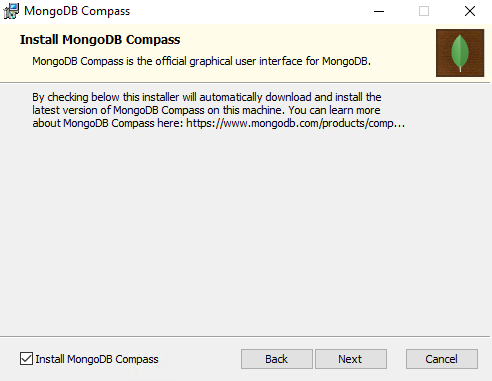
- Cài đặt 
- 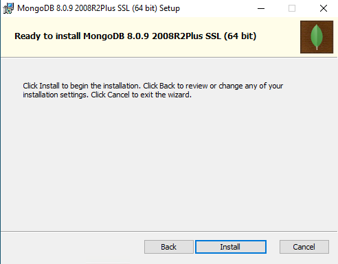
- Qúa trình cài đặt diễn ra 
- 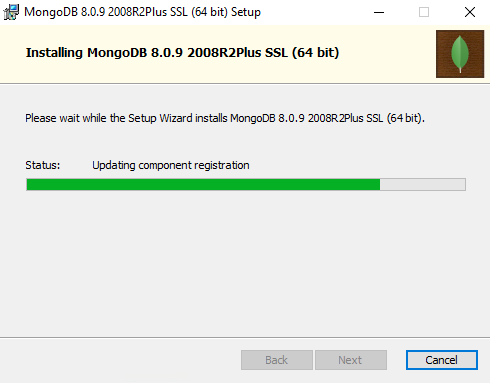
- Cài đặt hoàn tất 
- 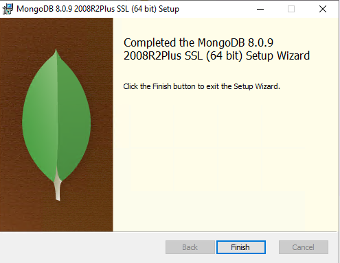
- Test sử dụng Mongod Compass để kết nối 
- 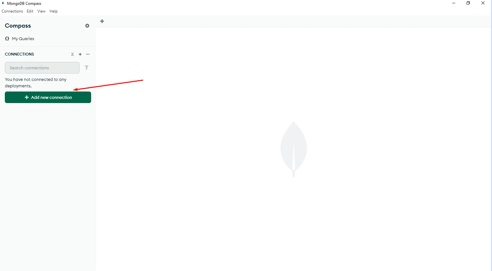
- 
- 
- Sử dụng shell: Trên mongod compass -> shell 
- 

- Tạo database : MongoDB chỉ tạo cơ sở dữ liệu khi được chèn dữ liệu vào. Lệnh sau sẽ chuyển sang cơ sở dữ liệu sampleDB. Nếu cơ sở dữ liệu chưa tồn tại, MongoDB sẽ tự động tạo khi dữ liệu được chèn:
```
use sampleDB
```
- Tạo Collection:  Collections tương tự như bảng trong cơ sở dữ liệu quan hệ. Để tạo một collection, sử dụng lệnh sau:

```
db.createCollection("users")
```
- Insert Data 
```
db.users.insertMany([
  { name: "Alice", age: 25, city: "New York" },
  { name: "Bob", age: 30, city: "San Francisco" }
])
```
- Kiểm tra Data
```
db.users.find()
```
- 

##### Linux (Ubuntu)
- Cài các gói cần thiết và import public key 
```
sudo apt-get install gnupg curl
curl -fsSL https://www.mongodb.org/static/pgp/server-8.0.asc | \
   sudo gpg -o /usr/share/keyrings/mongodb-server-8.0.gpg \
   --dearmor
```
- 
- Create list file 
echo "deb [ arch=amd64,arm64 signed-by=/usr/share/keyrings/mongodb-server-8.0.gpg ] https://repo.mongodb.org/apt/ubuntu jammy/mongodb-org/8.0 multiverse" | sudo tee /etc/apt/sources.list.d/mongodb-org-8.0.list
- Reload package database 
```
sudo apt-get update
```
- 
- Cài đặt
```
sudo apt-get install -y mongodb-org
```
- 
- Khởi chạy và kiểm tra 
```
sudo systemctl start mongod
sudo systemctl status mongod
```
- 
- Truy cập vào shell dùng lệnh 
```
mongosh 
```
- 

- Tạo database : MongoDB chỉ tạo cơ sở dữ liệu khi được chèn dữ liệu vào. Lệnh sau sẽ chuyển sang cơ sở dữ liệu sampleDB. Nếu cơ sở dữ liệu chưa tồn tại, MongoDB sẽ tự động tạo khi dữ liệu được chèn:
```
use sampleDB
```
- Tạo Collection:  Collections tương tự như bảng trong cơ sở dữ liệu quan hệ. Để tạo một collection, sử dụng lệnh sau:
```
db.createCollection("users")
```
- Insert Data 
```
db.users.insertMany([
  { name: "Alice", age: 25, city: "New York" },
  { name: "Bob", age: 30, city: "San Francisco" }
])
```
- Kiểm tra Data
```
db.users.find()
```
- 
#### 3.3.3 Cấu hình tối ưu hiệu năng
- MongoDB sử dụng tệp cấu hình YAML để thiết lập các thông số hệ thống. Vị trí của tệp cấu hình này phụ thuộc vào hệ điều hành:
	- Linux: /etc/mongod.conf (nếu cài đặt bằng trình quản lý gói).
	- Windows: <thư mục cài đặt>/bin/mongod.cfg.
- Tùy chọn cấu hình đầu tiên để cải thiện hiệu suất MongoDB là `storage.wiredTiger.engineConfig.cacheSizeGB`
	```
	storage:
	   wiredTiger:
		   engineConfig:
			   cacheSizeGB: <value>
	```
	- Từ phiên bản MongoDB 3.0, WiredTiger trở thành Storage Engine mặc định. Theo thiết lập mặc định, MongoDB sẽ dự trữ 50% bộ nhớ khả dụng – 1GB cho bộ nhớ cache của WiredTiger hoặc 256MB, tùy theo giá trị nào lớn hơn.
	- Ví dụ, một hệ thống có 16GB RAM thì bộ nhớ cache WiredTiger sẽ là 7.5GB, tính theo công thức: `( 0.5 * (16 - 1) )`
	- Việc điều chỉnh kích thước bộ nhớ cache có thể ảnh hưởng lớn đến hiệu suất đọc ghi. 
	- Ví dụ WiredTiger cache size được thiết lập 1GB.
	```
	nano /etc/mongod.conf 
	```
	```
	storage:
	   dbPath: /var/lib/mongodb
	   wiredTiger:
		engineConfig:
		 cacheSizeGB: 1
	```
	- 
- Tùy chọn storage.wiredTiger.collectionConfig.blockCompressor xác định phương pháp nén dữ liệu cho tất cả các collection trong MongoDB.
	```
	storage:
	   wiredTiger:
		   collectionConfig:
			   blockCompressor: <value>
	```
	- Các phương pháp nén dữ liệu: Có bốn giá trị có thể thiết lập cho tùy chọn này:
		- none – Không sử dụng nén.
		- snappy (mặc định) – Nén nhanh, hiệu suất cao, nhưng tỷ lệ nén thấp.
		- zlib – Nén mạnh hơn, tiết kiệm dung lượng nhưng tiêu tốn nhiều CPU.
		- zstd – Thuật toán nén mới, hiệu suất tốt hơn zlib, ít tiêu tốn CPU hơn.
	- Cách hoạt động của từng phương pháp
		- Snappy: Gom dữ liệu tối đa 32KB, nén và ghi thành khối 4KB nếu thành công.
		- Zlib: Gom nhiều dữ liệu hơn, nén để tạo khối 32KB, hiệu suất CPU cao hơn nhưng tỷ lệ nén tốt hơn.
		- Zstd: Cải tiến từ zlib, tỷ lệ nén tốt hơn, ít tiêu tốn CPU hơn, tốc độ nhanh hơn.
	- Lựa chọn thuật toán nén phù hợp
		- Workload nặng về ghi → Snappy giúp tăng tốc độ ghi nhưng tốn nhiều dung lượng.
		- Workload nặng về đọc → Zstd giúp cải thiện tốc độ giải nén và hiệu suất tổng thể.
	- Ví dụ: Sử dụng thuật toán Zstandard (zstd) để nén dữ liệu, giúp giảm dung lượng lưu trữ mà vẫn đảm bảo hiệu suất đọc tốt.
	```
	nano /etc/mongod.conf 
	```
	```
	storage:
	   dbPath: /var/lib/mongodb
	   wiredTiger:
		engineConfig:
		 cacheSizeGB: 1
		collectionConfig:
		 blockCompressor: zstd
	```
	- 

- Tùy chọn `net.compression.compressors` giúp tối ưu hiệu suất bằng cách nén lưu lượng mạng giữa mongos, mongod, và mongo shell.  
	```yaml
	net:
	   compression:
		   compressors: <value>
	```
	- Các thuật toán nén hỗ trợ: MongoDB hỗ trợ ba loại thuật toán nén:
	- `snappy` *(mặc định trong MongoDB 3.6 & 4.0)* – Nén nhanh, ít tiêu tốn CPU.
	- `zlib` – Nén mạnh hơn, tiết kiệm băng thông nhưng tiêu tốn nhiều CPU hơn.
	- `zstd` *(mặc định từ MongoDB 4.2 trở đi)* – Cải tiến từ zlib, hiệu suất tốt hơn, ít tiêu tốn CPU hơn.
	- Cách hoạt động của nén mạng
		- Cả client và server phải có ít nhất một thuật toán nén chung để nén dữ liệu.
		- Nếu client sử dụng `zlib` nhưng server chỉ chấp nhận `snappy`, không có nén xảy ra.
		- Nếu cả hai hỗ trợ `zstd`, thì zstd sẽ được sử dụng.
	- Lợi ích của việc bật nén
		- Giảm độ trễ mạng – Giảm kích thước dữ liệu truyền tải, giúp tăng tốc độ giao tiếp.
		- Giảm độ trễ sao chép (replication lag) – Hữu ích trong các hệ thống phân tán.
		- Tiết kiệm chi phí truyền dữ liệu – Đặc biệt quan trọng trong môi trường cloud, nơi chi phí truyền dữ liệu có thể cao.
	- Ví dụ cách thiết lập net.compression.compressors trong mongod.conf để tối ưu hiệu suất nén dữ liệu mạng của MongoDB
	```
	nano /etc/mongod.conf 
	```
	```
	net:
	  compression:
		compressors: snappy,zstd,zlib
	```
	- 
	- `snappy` → Nén nhanh, hiệu suất cao, ít tiêu tốn CPU.
	- `zstd` → Cải thiện tốc độ giải nén, tỷ lệ nén tốt hơn zlib, tiết kiệm băng thông.
	- `zlib` → Tiết kiệm dung lượng truyền tải, nhưng có thể ảnh hưởng đến hiệu suất CPU.
	- Restart Mongod để apply 
	```
	systemctl stop mongod 
	systemctl start mongod 
	```
	- Kiểm tra 
	```
	mongosh 
	db.serverStatus().network.compression
	```
	- 

#### 3.3.4 Cấu hình bảo mật cơ bản 
- Mặc định, MongoDB không kích hoạt xác thực, có nghĩa là bất kỳ người dùng nào có quyền truy cập vào máy chủ cơ sở dữ liệu đều có thể xem, thêm hoặc xóa dữ liệu. Lỗ hổng này có thể gây nguy cơ nghiêm trọng đối với bảo mật dữ liệu.
- Login vào mongo shell, chuyển sang admin 
```
mongosh 
```
```
use admin 
```
- 
-  Tạo user database
	```
	db.createUser(
	  {
		user: "Admin_Annt",
		pwd: passwordPrompt(),
		roles: [ { role: "userAdminAnyDatabase", db: "admin" }, "readWriteAnyDatabase" ]
	 }
	)
	exit
	```
	- 
	- Dòng user: "Admin_Annt" tạo một người dùng quản trị có tên Admin_Annt.
	- Phương thức pwd: passwordPrompt() yêu cầu nhập mật khẩu cho tài khoản quản trị. Đây là một lựa chọn an toàn hơn so với việc sử dụng pwd: và nhập mật khẩu dưới dạng plaintext.
	- Dòng roles: [ { role: "userAdminAnyDatabase", db: "admin" }, "readWriteAnyDatabase" ] xác định các quyền được cấp cho người dùng quản trị.
	- userAdminAnyDatabase → Cho phép quản lý người dùng trên mọi cơ sở dữ liệu.
	- readWriteAnyDatabase → Cho phép đọc và ghi dữ liệu trên tất cả cơ sở dữ liệu.
- Enable authentication bằng các chỉnh sửa file cấu hình 
```
sudo nano /etc/mongod.conf
```
- Cuộn xuống phần security bỏ comment và enabled authorization:
```
security:
    authorization: enabled
```
- 
- Restart Mongod để apply 
```
systemctl stop mongod 
systemctl start mongod 
```
- Thử login test nhận thông báo yêu cầu authentication
- 
- Login bằng Admin 
```
mongosh -u Admin_Annt -p --authenticationDatabase admin
```
- 
### 3.4 PostgresSQL
#### 3.4.1 Yêu cầu hệ thống
- Yêu cầu phần cứng
	- CPU: Tối thiểu 1 GHz.
	- RAM: Ít nhất 2 GB.
	- Dung lượng ổ cứng: 512 MB (cần thêm không gian cho dữ liệu).
- Yêu cầu phần mềm
	- Quyền người dùng:
		- Mac: Cần quyền superuser để cài đặt.
		- Windows: Cần quyền administrator.
		- Nếu User Account Control (UAC) được bật trên Windows, cần chạy trình cài đặt với quyền quản trị viên.
	- Yêu cầu phần mềm riêng cho Windows
		- Cập nhật hệ điều hành trước khi cài đặt PostgreSQL.
		- Nếu trình cài đặt gặp lỗi, cập nhật Windows rồi khởi động lại trình cài đặt.
#### 3.4.2 Cài đặt cơ bản 
##### Windows 
- Tải file cài đặt [PostgreSQL Download](https://www.enterprisedb.com/downloads/postgres-postgresql-downloads)
- 
- Khởi chạy file cài đặt
- 
- Cấu hình thư mục lưu 
- 
- Cấu hình các thành phần cài đặt  
- 
- Cấu hình thư mục lưu data
- 
- Cấu hình admin password 
- 
- Cấu hình port 
- 
- Cấu hình Locale 
- 
- Chọn Next để bắt đầu cài đặt 
- 
- Qúa trình cài đặt diễn ra 
- 
- Hoàn tất cài đặt 
- 
- Khởi chạy client kết nối 
- 
- 
- Nhập pass admin 
- 
- Đăng nhập thành công 
- 


##### Linux (Ubuntu)
- Cài đặt 
```
apt -y install postgresql-14
```
- 

- Kiểm tra 
```
systemctl status postgresql
```
- 
- PostgreSQL sử dụng cơ chế "roles" để quản lý xác thực và quyền truy cập, tương tự như hệ thống người dùng và nhóm trên Unix/Linux.
	- PostgreSQL dùng xác thực ident → Liên kết vai trò Postgres với tài khoản hệ thống Unix/Linux tương ứng.
	- Nếu một vai trò tồn tại trong PostgreSQL, thì một tên người dùng Unix/Linux tương ứng có thể đăng nhập với vai trò đó.
	- Khi cài đặt, PostgreSQL tạo tài khoản hệ thống postgres với vai trò Postgres mặc định.
	- Cần chuyển sang tài khoản postgres để truy cập PostgreSQL. Để đăng nhập vào PostgreSQL từ máy chủ, sử dụng lệnh:
```
sudo -i -u postgres
psql
```
- 

- Các lệnh cơ bản, thao tác cơ bản 
	- show user roles
	```
	\du
	```
	- 
	- show databases
	```
	\l 
	```
	- 
	- create a test table, insert, view, drop 
	```
	create table test_table (no int, name text);
	\dt
	insert into test_table (no,name) values (01,'Ubuntu');
	select * from test_table;
	drop table test_table;
	\dt
	```
	- 

#### 3.4.3 Cấu hình tối ưu
- Cấu hình các tham số trong PostgreSQL có ảnh hưởng lớn đến hiệu suất tổng thể và việc sử dụng tài nguyên hệ thống.
- Các thông số này được tùy chỉnh trong tệp `postgresql.conf`. 
	- `C:\Program Files\PostgreSQL\<version>\main\postgresql.conf` (Windows)
	- `/etc/postgresql/<version>/data/postgresql` (Linux) 

- Kết nối và tài nguyên
	- Tham số: `max_connections`: 
		- Xác định số lượng kết nối tối đa được mở đồng thời trên PostgreSQL. Việc thiết lập quá nhiều kết nối có thể ảnh hưởng đến bộ nhớ và làm tăng kích thước cấu trúc dữ liệu của hệ thống.  
		- Tùy vào ứng dụng, có thể để khoảng `200 - 500`, nhưng cần tối ưu `work_mem` để tránh tiêu hao tài nguyên quá mức.  
		- Cấu hình:  
		  ```ini
		  max_connections = 200
		```
	- 
		
- Cấu hình bộ nhớ
	- Tham số: `shared_buffers`: 
		- Bộ nhớ được sử dụng để lưu trữ dữ liệu và chỉ mục được truy cập thường xuyên, giúp giảm việc đọc từ đĩa.  
		- Mặc định: `128MB`  
		- Khuyến nghị: `Khoảng 25% RAM`  
		- Cấu hình:  
		  ```ini
		  shared_buffers = 2GB
		  ```
	- 
	
	- Tham số: `effective_cache_size`: 
		- Tổng lượng bộ nhớ mà hệ thống có thể sử dụng để lưu dữ liệu bộ đệm, hỗ trợ quá trình lập kế hoạch truy vấn.  
		- Mặc định: `4GB`  
		- Khuyến nghị: `Khoảng 50% RAM`  
		- Cấu hình:  
		  ```ini
		  effective_cache_size = 8GB
		  ```
	- 
	
	- Tham số: `maintenance_work_mem`
		- Kiểm soát lượng bộ nhớ được sử dụng cho các tác vụ bảo trì như VACUUM, tạo chỉ mục (CREATE INDEX), và thiết lập khóa ngoại (FOREIGN KEY). Vì chỉ một trong các tác vụ này có thể chạy trong một phiên làm việc của cơ sở dữ liệu, nên có thể đặt giá trị này cao hơn work_mem để tối ưu hiệu suất.
		- Giá trị lớn hơn có thể cải thiện hiệu suất của quá trình VACUUM cũng như khôi phục dữ liệu từ các bản sao lưu (database dumps).
		- Mặc định: 64 MB
		- Khuyến nghị:
		- Khi autovacuum chạy, lượng bộ nhớ tiêu thụ được tính theo công thức:
		autovacuum_max_workers × maintenance_work_mem
		- Giá trị tối ưu có thể lên đến 512 MB để đảm bảo quá trình bảo trì cơ sở dữ liệu nhanh và hiệu quả hơn.
		- Cấu hình 
		  ```ini
		  maintenance_work_mem = 256MB
		  ```
	- 
		  
	- Tham số: `work_mem`  
		- Quy định lượng bộ nhớ dành cho các thao tác nội bộ như sắp xếp và băm dữ liệu trước khi sử dụng tệp tạm trên ổ đĩa. Mỗi hoạt động đều tiêu thụ riêng `work_mem`, nên cần xem xét tổng tài nguyên hệ thống.  
		- Mặc định: `4MB`  
		- Khuyến nghị: `64MB hoặc cao hơn tùy vào số kết nối đồng thời`  
		- Cấu hình:  
		  ```ini
		  work_mem = 64MB
		  ```
	- 
		  
- Ghi nhật ký và bảo trì
	- Tham số: `fsync`  
		- Khi fsync được cấu hình PostgreSQL ghi các thay đổi xuống đĩa vật lý, đảm bảo tính toàn vẹn dữ liệu và tránh mất mát dữ liệu khi xảy ra sự cố phần cứng hoặc hệ điều hành.  
		- Mặc định: `on`  
		- Khuyến nghị: Luôn bật để đảm bảo dữ liệu không bị mất.  
		- Cấu hình:  
		  ```ini
		  fsync = on
		  ```
	- 
		  
	- Tham số: `commit_delay`  
		- Thiết lập độ trễ (tính bằng micro giây) giữa việc hoàn tất giao dịch và ghi dữ liệu WAL xuống ổ đĩa. Việc điều chỉnh tham số này có thể giúp tăng hiệu suất khi có nhiều giao dịch được cam kết đồng thời.  
		- Mặc định: `0`  
		- Khuyến nghị: `50 - 100` micro giây tùy vào khối lượng giao dịch.  
		- Cấu hình:  
		  ```ini
		  commit_delay = 100
		  ```
	- 
		  
- Worker Parameters
	- Tham số: `random_page_cost`  
		- Được sử dụng bởi trình tối ưu hóa của PostgreSQL để ước lượng chi phí đọc ngẫu nhiên từ đĩa. Nếu giá trị cao, hệ thống sẽ ưu tiên quét tuần tự thay vì quét bằng chỉ mục.  
		- Mặc định: `4.0`  
		- Khuyến nghị: `1.1 - 2.0 trên hệ thống có SSD`  
		- Cấu hình:  
		  ```ini
		  random_page_cost = 1.5
		  ```
	- 

	- Tham số `max_worker_processes = 8`  
		- Xác định số lượng tiến trình nền tối đa có thể chạy đồng thời. Các tiến trình này có thể bao gồm xử lý song song, autovacuum, logical replication, v.v.  
		- Mặc định: `8`  
		- Đề xuất: Tăng giá trị nếu CPU có nhiều nhân, giảm nếu tài nguyên hệ thống hạn chế.  
		- Cấu hình:  
		  ```ini
		  max_worker_processes = 8
		  ```

	- Tham số `max_parallel_workers_per_gather = 2`  
		- Giới hạn số tiến trình song song có thể tham gia vào một truy vấn sử dụng tập hợp dữ liệu (`gather`). Điều này ảnh hưởng đến cách PostgreSQL thực thi các truy vấn phức tạp.  
		- Mặc định: `2`  
		- Đề xuất: Tăng lên `4` nếu hệ thống có nhiều tài nguyên và truy vấn phức tạp.  
		- Cấu hình:  
		  ```ini
		  max_parallel_workers_per_gather = 2
		  ```
	- Tham số `max_parallel_maintenance_workers = 2`  
		- Xác định số tiến trình song song tối đa được sử dụng cho các tác vụ bảo trì như `VACUUM`, `CREATE INDEX`, v.v.  
		- Mặc định: `2`  
		- Đề xuất: Giữ nguyên hoặc tăng lên `4` nếu cần tăng tốc các tác vụ bảo trì.  
		- Cấu hình:  
		  ```ini
		  max_parallel_maintenance_workers = 2
		  ```
		  
	- Tham số `max_parallel_workers = 8`  
		- Giới hạn tổng số tiến trình song song có thể chạy đồng thời trên hệ thống, bao gồm cả truy vấn song song và bảo trì.  
		- Mặc định: `8`  
		- Đề xuất: Nếu CPU có nhiều nhân, giữ nguyên `8`; nếu tài nguyên hạn chế, có thể giảm xuống `6`.  
		- Cấu hình:  
		  ```ini
		  max_parallel_workers = 8
		  ```
	
	- 

#### 3.4.4 Cấu hình bảo mật cơ bản 
- Chỉ cho phép truy cập từ localhost
	- Chỉnh sửa `postgresql.conf` để hạn chế truy cập từ xa  
	- Mở tệp cấu hình PostgreSQL:  
	  ```bash
	  sudo vim /etc/postgresql/14/main/postgresql.conf
	  ```
	- Tìm dòng `listen_addresses` và thay đổi thành:  
	  ```ini
	  listen_addresses = 'localhost'
	  ```
	  Điều này đảm bảo PostgreSQL chỉ lắng nghe kết nối từ máy chủ cục bộ.
	- Khởi động lại PostgreSQL để áp dụng thay đổi:  
	  ```bash
	  sudo systemctl restart postgresql
	  ```
	- 

- Cấu hình danh sách máy chủ được phép truy cập
	- Nếu bạn muốn cho phép một số máy chủ cụ thể kết nối thay vì chặn toàn bộ truy cập từ xa, bạn có thể chỉnh sửa tệp `pg_hba.conf`.  
	- Chỉnh sửa `pg_hba.conf` để chỉ định IP được phép
	- Mở tệp cấu hình:  
	  ```bash
	  sudo vim 		
	  ```
	- Thêm dòng sau vào phần cấu hình cho các kết nối không phải từ localhost:  
		  ```ini
		  host  test_table  Admin_Annt  client_ip_address/24   md5
		  ```
		  - `host` → Cho phép kết nối TCP/IP.  
		  - `test_table` → Tên cơ sở dữ liệu mà người dùng có thể truy cập. Bạn có thể liệt kê nhiều database bằng cách phân tách bằng dấu phẩy.  
		  - `cherry` → Người dùng được phép kết nối. Tương tự như database, nhiều người dùng có thể được chỉ định.  
		  - `client_ip_address/24` → Địa chỉ IP của máy khách được phép truy cập.  
	- 

	- Khởi động lại PostgreSQL để áp dụng thay đổi:  
	  ```bash
	  sudo systemctl restart postgresql
	  ```
- Cấu hình ghi log trong PostgreSQL  
	- Việc bật ghi log trong PostgreSQL giúp giám sát các sự kiện liên quan đến bảo mật, chẳng hạn như lần đăng nhập không thành công, thay đổi quyền hạn, và các thao tác trên cơ sở dữ liệu. Điều này hỗ trợ phát hiện sớm các sự cố bảo mật và cải thiện quản lý hệ thống.
	- Kích hoạt ghi log
	- Chỉnh sửa `postgresql.conf` để bật logging  
	- Mở tệp cấu hình:  
	  ```bash
	  sudo vim /etc/postgresql/14/main/postgresql.conf
	  ```
	- Bật ghi log chung:  
	  ```ini
		= on
	  ```
	  Điều này đảm bảo PostgreSQL thu thập và lưu trữ log từ tất cả các sự kiện quan trọng.
	- Ghi log địa chỉ IP của các lần đăng nhập thành công:  
	  ```ini
	  log_connections = on
	  ```
	- Ghi log tên máy chủ của các lần xác thực:  
	  ```ini
	  log_hostname = on
	  ```
	- Ghi log tất cả câu lệnh SQL chạy trên hệ thống:  
		  ```ini
		  log_statement = 'all'  # Tùy chọn: none, ddl, mod, all
		  ```
		  - `none` → Không ghi log các câu lệnh.  
		  - `ddl` → Chỉ ghi log các lệnh liên quan đến thay đổi cấu trúc bảng (`CREATE`, `ALTER`, `DROP`).  
		  - `mod` → Ghi log các lệnh thay đổi dữ liệu (`INSERT`, `UPDATE`, `DELETE`).  
		  - `all` → Ghi log toàn bộ câu lệnh SQL, bao gồm truy vấn (`SELECT`).  
	- Khởi động lại PostgreSQL để áp dụng cấu hình:  
	  ```bash
	  sudo systemctl restart postgresql
	  ```
### 3.5 Redis 
#### 3.5.1 Yêu cầu hệ thống    
- Yêu cầu phần cứng để cài đặt máy ảo (VM)
	- CPU: Tối thiểu 4 lõi, nên thêm 2-6 lõi nếu dữ liệu lớn.
	- RAM: 8GB.
	- Ổ đĩa: 20GB trong thư mục /var, 1GB trong /opt để lưu log và hỗ trợ nâng cấp.
	- Giao diện mạng: 10GB+.
- Yêu cầu hệ điều hành
	- RHEL: Phiên bản 8 hoặc 9.
	- Ubuntu: 20.04, 22.04, 24.04.
#### 3.5.2 Cài đặt 
- Cài đặt 
```
apt -y install redis
```
- 
- Kiểm tra 
```
systemctl status redis-server
redis-server -v
```
- 
- Cấu hình cơ bản 
```
nano /etc/redis/redis.conf
```
- Tại dòng 68 comment -> sửa 0000 open all 
- 
- Tại dòng 791 bỏ comment sửa yêu cầu pass và cấu hình pass Admin 
- 
- Restart 
```
systemctl restart redis
```
- Login test 
```
redis-cli 
AUTH "Qaz@123"
ping
quit
```
- 
- Các thao tác, lệnh cơ bản với database 
	- Thiết lập và truy xuất giá trị
		- Lưu giá trị cho một key:  
		  ```bash
		  set key01 value01
		  ```
		- Truy xuất giá trị từ key:  
		  ```bash
		  get key01
		  ```
		  Kết quả: `"value01"`
	- 
		  
	- Xóa key
		- Xóa một key:  
		  ```bash
		  del key01
		  ```
		- Kiểm tra key có tồn tại không:  
		  ```bash
		  exists key01
		  ```
		  Kết quả: `0` (Không tồn tại)
	- 
	- Cài đặt điều kiện lưu trữ
		- Chỉ lưu key nếu chưa tồn tại:  
		  ```bash
		  setnx key01 value02
		  ```
		- Lưu key với thời gian hết hạn (60 giây):  
		  ```bash
		  setex key01 60 value01
		  ```
		- Đặt thời gian hết hạn cho key hiện có (30 giây):  
		  ```bash
		  expire key01 30
		  ```
	- 
	- Chỉnh sửa giá trị
		- Thêm giá trị vào key:  
		  ```bash
		  append key01 value02
		  ```
		- Lấy chuỗi con của giá trị:  
		  ```bash
		  substr key01 0 3
		  ```
		  Kết quả: `"valu"`
	- 
	- Thao tác số học
		- Tăng giá trị số nguyên:  
		  ```bash
		  incr key02
		  ```
		- Tăng giá trị số nguyên theo mức cụ thể:  
		  ```bash
		  incrby key02 100
		  ```
		- Giảm giá trị số nguyên:  
		  ```bash
		  decr key02
		  ```
		- Giảm giá trị số nguyên theo mức cụ thể:  
		  ```bash
		  decrby key02 51
		  ```
	- 
	- Quản lý nhiều key
		- Đặt giá trị cho nhiều key cùng lúc:  
		  ```bash
		  mset key01 value01 key02 value02 key03 value03
		  ```
		- Lấy giá trị của nhiều key:  
		  ```bash
		  mget key01 key02 key03
		  ```
		  Kết quả:  
		  ```
		  1) "value01"
		  2) "value02"
		  3) "value03"
		  ```
	- 

	- Đổi tên key
		- Đổi tên key:  
		  ```bash
		  rename key03 key04
		  ```
		- Kiểm tra kết quả:  
		  ```bash
		  mget key01 key02 key03 key04
		  ```
		  Kết quả:  
		  ```
		  1) "value01"
		  2) "value02"
		  3) (nil)
		  4) "value03"
		  ```
	- 

	- Kiểm tra số lượng key
		- Đếm số key có trong database:  
		  ```bash
		  dbsize
		  ```
		  Kết quả: `(integer) 4`
	- 

	- Di chuyển key giữa database
		- Di chuyển key đến DB khác:  
		  ```bash
		  move key04 1
		  ```
		- Chọn DB và kiểm tra key:  
		  ```bash
		  select 1
		  get key04
		  ```
		  Kết quả: `"value03"`
	- 
	- Xóa key
		- Xóa tất cả key trong database hiện tại:  
		  ```bash
		  flushdb
		  ```
		- Xóa tất cả key trên mọi database:  
		  ```bash
		  flushall
		  ```
	- 

#### 3.5.3 Cấu hình tối ưu hiệu năng
- Cấu hình Giới hạn Bộ nhớ tối đa cho Quản lý Tải Redis
	- Thiết lập maxmemory giúp ngăn chặn Redis sử dụng hết tài nguyên hệ thống trong thời gian tải cao, đồng thời đảm bảo mức sử dụng bộ nhớ ổn định.
	- Bằng cách đặt giới hạn bộ nhớ tối đa mà Redis có thể sử dụng, bạn có thể tránh lỗi hết bộ nhớ (OOM), giảm nguy cơ hệ thống bị mất ổn định
	- Cấu hình tại `maxmemory <bytes>` trong file cấu hình redis
	- Khi Redis đạt đến giới hạn bộ nhớ, nó sẽ tự động loại bỏ các key dựa trên chính sách thu hồi (eviction policy) được cấu hình thông qua thuộc tính maxmemory-policy. 
	- Các chính sách thu hồi và cách lựa chọn tối ưu:
		- noeviction (Không thu hồi)
			- Ý nghĩa: Không loại bỏ bất kỳ key nào, nếu đạt giới hạn bộ nhớ, các lệnh ghi sẽ bị lỗi.
			- Dùng cho: Workload nặng về đọc, khi cần đảm bảo dữ liệu tồn tại lâu trong bộ nhớ.
		- allkeys-lru (LRU toàn bộ key)
			- Ý nghĩa: Loại bỏ key ít được sử dụng nhất trong toàn bộ dữ liệu.
			- Dùng cho: Workload mà tất cả dữ liệu đều quan trọng, giúp giữ dữ liệu được truy cập thường xuyên.
		- volatile-lru (LRU chỉ cho key có TTL)
			- Ý nghĩa: Chỉ loại bỏ key ít được dùng nhất có thời gian sống (TTL).
			- Dùng cho: Muốn ưu tiên giữ key không có TTL và chỉ thu hồi các key có thời hạn.
		- allkeys-random (Loại bỏ ngẫu nhiên toàn bộ key)
			- Ý nghĩa: Loại bỏ key ngẫu nhiên từ tất cả dữ liệu.
			- Dùng cho: Các hệ thống có mô hình truy cập khó đoán trước, nhưng có thể kém tối ưu hơn LRU.
		- volatile-random (Loại bỏ ngẫu nhiên key có TTL)
			- Ý nghĩa: Loại bỏ các key có TTL theo cách ngẫu nhiên.
			- Dùng cho: Khi muốn cân bằng giữa ngẫu nhiên và ưu tiên key không có TTL.
		- volatile-ttl (Loại bỏ key có TTL thấp nhất trước)
			- Ý nghĩa: Xóa các key sắp hết hạn trước, giữ lại dữ liệu mới hơn.
			- Dùng cho: Khi cần ưu tiên dữ liệu mới hơn, đặc biệt trong trường hợp tải tăng đột biến.
		- volatile-lfu (Loại bỏ key ít được sử dụng nhất có TTL)
			- Ý nghĩa: Xóa key có tần suất truy cập thấp nhất nhưng có TTL.
			- Dùng cho: Workload có mẫu truy cập rõ ràng, giúp giữ các key thường xuyên truy cập.
	- Ví dụ cấu hình 
		- Chỉnh sửa file cấu hình 
		```
		nano /etc/redis/redis.conf
		```
		- Thêm các cấu hình 
			```
			maxmemory 2gb
			maxmemory-policy allkeys-lru
			```
			- 
			- maxmemory 2gb → Giới hạn bộ nhớ Redis ở mức 2GB để tránh lỗi hệ thống.
			- maxmemory-policy allkeys-lru → Khi bộ nhớ đầy, Redis sẽ loại bỏ các key ít được sử dụng nhất, đảm bảo dữ liệu quan trọng được giữ lại.
		- Restart để apply 
		```
		sudo systemctl restart redis
		```
- Cấu hình giới hạn kết nối Redis (maxclients)
	- Thiết lập maxclients giúp quản lý số lượng kết nối đồng thời mà Redis có thể xử lý, tránh tình trạng quá tải hệ thống.
	- Xác định giá trị maxclients phù hợp
		- Dựa trên mức sử dụng cao điểm của ứng dụng.
		- Đánh giá tài nguyên hệ thống (RAM, CPU) để tránh tình trạng quá tải.
	- Cấu hình tại `maxclients ` trong file cấu hình redis
	- Ví dụ cấu hình 
		- Chỉnh sửa file cài đặt 
			```
			nano /etc/redis/redis.conf
			```
			```
			maxclients 10000
			```
			- 
			- maxclients 10000 → Redis chỉ chấp nhận tối đa 10,000 kết nối, ngăn chặn tình trạng quá tải hệ thống.
			- Nếu số kết nối vượt quá giới hạn, Redis sẽ từ chối kết nối mới.
		- Restart để apply 
		```
		sudo systemctl restart redis
		```
- Cấu hình thời gian chờ (`timeout`)  
	- Ý nghĩa: Đóng các kết nối không hoạt động quá thời gian quy định để tránh tiêu tốn tài nguyên. \
	- Lợi ích: Giảm tải hệ thống trong thời gian cao điểm, tránh giữ các kết nối không cần thiết.  
	- Thiết lập:  `timeout 120`
	- Ví dụ 
	```
	nano /etc/redis/redis.conf
	```
	```
	timeout 120
	```
	- 
	- Restart để apply 
	```
	sudo systemctl restart redis
	```
- Bật kiểm tra kết nối TCP (`tcp-keepalive`)  
	- Ý nghĩa: Phát hiện các kết nối chết để giải phóng tài nguyên.  
	- Lợi ích: Xử lý tốt hơn mạng có độ trễ cao, giúp Redis loại bỏ các kết nối không còn hoạt động nhanh hơn.  
	- Thiết lập:  `tcp-keepalive 60`
	- Ví dụ 
	```
	nano /etc/redis/redis.conf
	```
	```
	timeout 120
	```
	- 
	- Restart để apply 
	```
	sudo systemctl restart redis
	```
- Giới hạn bộ đệm kết nối (`client-output-buffer-limit`)  
	- Ý nghĩa: Ngăn chặn một kiểu client chiếm quá nhiều bộ nhớ. 
	- Lợi ích: Cân bằng việc sử dụng bộ nhớ giữa các loại client, tránh quá tải hệ thống.  
	- Thiết lập:  
	  ```ini
	  client-output-buffer-limit normal 0 0 0
	  client-output-buffer-limit replica 256mb 64mb 60
	  client-output-buffer-limit pubsub 32mb 8mb 60
	  ```
	- Ví dụ 
	```
	nano /etc/redis/redis.conf
	```
	```
	client-output-buffer-limit normal 0 0 0
	client-output-buffer-limit replica 256mb 64mb 60
	client-output-buffer-limit pubsub 32mb 8mb 60
	```
	-   
	- Restart để apply 
	```
	sudo systemctl restart redis
	```

- Tối ưu kích thước hàng đợi kết nối (`tcp-backlog`)  
	- Ý nghĩa: Cho phép Redis xử lý nhiều kết nối đồng thời hơn khi tải tăng mạnh.  
	- Lợi ích: Giảm tỷ lệ kết nối bị từ chối, hỗ trợ tải cao đột biến.  
	- Thiết lập:  
	  ```ini
	  tcp-backlog xxxx
	  ```
	- Ví dụ 
	```
	nano /etc/redis/redis.conf
	```
	```
	tcp-backlog 1024
	```
	-   
	- Restart để apply 
	```
	sudo systemctl restart redis
	```
### 3.5.4 Cấu hình bảo mật cơ bản 
- Đổi port và bật chế độ protected : Redis Protected Mode giúp bảo mật cơ sở dữ liệu khi chạy trên môi trường cloud bằng cách:
	- Giới hạn kết nối từ bên ngoài, chỉ cho phép truy cập từ localhost.
	- Từ chối các kết nối từ địa chỉ IP bên ngoài, trả về lỗi thay vì xử lý yêu cầu.
	- Ví dụ cấu hình 
		- Chỉnh sửa file cấu hình 
		```
		nano /etc/redis/redis.conf
		```
		- Tại dòng 87 và 91 
			```
			protected-mode yes
			port 6380
			```
			- Bật protected-mode 
			- Đổi port từ 6379 - 6380 
			-   
		- Restart để apply 
		```
		sudo systemctl restart redis
		```
- Cấu hình AUTH sử dụng mật khẩu mạnh (Phần cài đặt cơ bản đã thực hiện)
- Vô hiệu hóa các lệnh nguy hiểm 
	- Trong Redis có thể vô hiệu hóa hoàn toàn các lệnh dễ bị khai thác bằng cách đặt chúng thành chuỗi rỗng trong file redis.conf.
	- Cấu hình vô hiệu hóa lệnh
		- Thêm vào redis.conf:
			```
			nano /etc/redis/redis.conf
			```
			```
			rename-command FLUSHALL ""
			rename-command FLUSHDB ""
			rename-command CONFIG ""
			rename-command SHUTDOWN ""
			```
			-   
			- FLUSHALL, FLUSHDB → Ngăn chặn xóa toàn bộ dữ liệu.
			- CONFIG → Ngăn thay đổi cấu hình hệ thống.
			- SHUTDOWN → Ngăn chặn lệnh dừng Redis.
		- Restart để apply 

		```
		sudo systemctl restart redis
		```
		- Test
		-   

##4. Quản Trị Database Server
### 4.1 User và quản lý quyền truy cập  
- Quản lý người dùng và quyền truy cập trong các hệ quản trị cơ sở dữ liệu là một phần quan trọng để đảm bảo bảo mật và hiệu suất hệ thống.
- Cấu hình user và quản lý quyền truy cập của các DBMS phổ biến 
#### 4.1.1 MySQL/MariaDB
- Người dùng MySQL được lưu trữ trong bảng mysql.user, nơi chứa thông tin như tên người dùng, host, mật khẩu (đã mã hóa) và plugin xác thực.
	- Để tạo một user mới sử dụng lệnh:
	```
	CREATE USER 'username'@'host' IDENTIFIED BY 'password';
	```
	-   
	- Nếu trường hợp cần một người dùng chỉ có quyền truy cập vào cơ sở dữ liệu từ một địa chỉ IP cụ thể, hãy sử dụng lệnh sau:
	```
	CREATE USER 'username'@'10.0.0.3' IDENTIFIED BY 'password';
	```
	- Trong đó 10.0.0.3 là địa chỉ IP mà người dùng sẽ có quyền truy cập vào cơ sở dữ liệu.
	- Xoá user
	```
	DROP USER 'username'@'localhost';
	```
	-   
- Cấp quyền 
	- Full quyền 
	```
	GRANT ALL PRIVILEGES ON database_name.* TO 'username'@'localhost';
	FLUSH PRIVILEGES;
	```
	-   
	- Chỉ một số quyền 
	```
	GRANT SELECT, INSERT, UPDATE on *.* TO 'username'@'localhost' WITH GRANT OPTION;
	```
	-   
	- Kiểm tra 
	```
	SHOW GRANTS FOR 'annt'@'localhost';
	```
	-   
	- Thu hồi quyền 
		- Từng quyền
		```
		REVOKE permission_1, permission_2 ON database_name.table_name FROM 'username'@'localhost';
		```
		- Tất cả 
		```
		REVOKE ALL PRIVILEGES ON *.* FROM 'username'@'localhost';
		```
		-   

#### 4.1.2 SQL Server 
- Hệ thống này sử dụng mô hình xác thực hai bước: Login (đăng nhập vào SQL Server) và User (người dùng trong cơ sở dữ liệu).
- SQL Server có 2 loại tài khoản User là Login User và Database User.
- Với mỗi tài khoản User này có các vài trò và quyền các khác nhau như quyền Server Role và quyền Database Role.
	- Không phải tất cả login đều có quyền trên mọi cơ sở dữ liệu.
	→ Một login có thể tồn tại nhưng không có quyền truy cập vào bất kỳ cơ sở dữ liệu nào nếu không được liên kết với user.
	- User giúp quản lý quyền truy cập dữ liệu theo từng database.
	→ Ví dụ: Login_A có thể có user trong Database_1 nhưng không có user trong Database_2, nghĩa là chỉ có thể truy cập Database_1.
	- Mô hình này giúp bảo mật dữ liệu tốt hơn
	→ Nếu chỉ cần login là có quyền trên toàn bộ hệ thống, thì ai có tài khoản login đều có thể xem hoặc sửa dữ liệu trên bất kỳ database nào, điều này sẽ rất nguy hiểm.
	- Login cho phép truy cập vào SQL Server.
	- User giúp kiểm soát quyền truy cập vào từng cơ sở dữ liệu cụ thể.
- Tạo Login
	- Đây là bước xác thực đầu tiên, đảm bảo rằng người dùng có quyền truy cập vào máy chủ SQL Server. Một login chỉ cho phép truy cập vào SQL Server nhưng không tự động cấp quyền truy cập vào bất kỳ cơ sở dữ liệu nào.
	- Có hai loại login:
	- Windows Authentication: Sử dụng xác thực từ Active Directory của Windows.
	- SQL Server Authentication: Lưu trữ thông tin đăng nhập trong SQL Server.
	- Bằng giao diện : Click chuột phải vào phần `Security > Logins` chọn `New Login`
	-   
	- Cấu hình: Tên đăng nhập, Chọn xác thực máy chủ SQL, Nhập mật khẩu, Ok
	-   
	-   
- Tạo Người dùng (User): 
	- Sau khi login được tạo, nó phải được liên kết với một user trong cơ sở dữ liệu để có quyền truy cập vào dữ liệu.
	- Ví dụ tạo user liên kết với login:
	- Click chuột phải vào phần `Security > Users` của database chọn `New users`
	-   
	- Cấu hình tên, login 
	-   
	- Phần `Securables` -> `Search`
	-   
	- Chọn “All Objects belonging to the Schema.” và dbo 
	-   
	- Cấu hình quyền tại bảng bên dưới 
	-   
	- OK để apply 
	- Test login bằng MyLogin 
		-   
		- Select trong db test trc khi có quyền : ko dc 
		- Sau khi dc quyền với user annt -> OK 
		-   
		-   
- Có thể cấu hình Login, User và Quyền bằng lệnh 
```
CREATE LOGIN MyLoginCmd WITH PASSWORD = '123';
create user annt_2 for login MyLoginCmd
use <database-name>
grant <permission-name> on <object-name> to <username\principle>

-- Tạo login với mật khẩu
CREATE LOGIN MyLoginCmd WITH PASSWORD = 'Qaz@123';

-- Chọn cơ sở dữ liệu DB_Test trước khi tạo user
USE DB_Test;
GO

-- Tạo user liên kết với login trong DB_Test
CREATE USER annt_2 FOR LOGIN MyLoginCmd;

-- Cấp quyền SELECT trên Table_2 cho user annt_2
GRANT SELECT ON Table_2 TO annt_2;
```
-   
-   
- Thu hồi quyền 
	- Giao diện: 
	- Click chuột phải vào user trong phần `Security > Users` của database -> Properties. Chọn phần `Securables` và cấu hình 
	-   
	-   
	- Lệnh 
	- Thu hồi một phần 
	```
	REVOKE SELECT ON Table_2 FROM annt_2;
	```
	- Thu hồi toàn bộ 
	```
	REVOKE CONTROL ON DATABASE::DB_Test FROM annt_2;
	```
- Xoá user, login 
	- Giao diện: Click chuột phải vào Login/ User tương ứng và chọn Delete 
	-   
	-   
	- Lệnh 
	```
	DROP LOGIN MyLoginCmd;
	USE DB_Test;
	GO
	DROP USER annt_2;
	```
#### 4.1.3 MongoDB
- Trong MongoDB, việc tạo và quản lý người dùng cùng quyền truy cập được thực hiện thông qua phương thức db.createUser().
- MongoDB có nhiều loại quyền khác nhau, bao gồm:
	- read: Chỉ có quyền đọc dữ liệu.
	- readWrite: Có quyền đọc và ghi dữ liệu.
	- dbAdmin: Quản lý cấu trúc database (tạo, xóa collection).
	- userAdmin: Quản lý người dùng trong database.
	- root: Quyền cao nhất, có thể quản lý toàn bộ hệ thống.
- Tạo User
```
mongosh 
```
```
use admin
db.createUser({
  user: "user2",
  pwd: "Qaz@123",
  roles: []
});
```
- user: "user2" – Xác định tên đăng nhập của người dùng sẽ được tạo.
- pwd: "Qaz@123" – Đặt mật khẩu cho người dùng.
- roles: [...] – Danh sách các quyền mà người dùng này sẽ có.
- Gán quyền 
```
db.grantRolesToUser(
"user2",
[
{ role: "readWrite", db: "test"}
]
)
```
-   
- Kiểm tra 
```
db.getUsers();
```
-   
- Thu hồi quyền
	- Toàn bộ
	```
	db.updateUser("user1", { roles: [] });
	```
	- Một phần 
	```
	db.updateUser("user2", { roles: [{ role: "read", db: "test" }] });
	```
	-   
- Xoá user 
```
db.dropUser("user1");
```
-   

#### 4.1.4 PostgresSQL
- Tạo user: 
	- Để tạo một người dùng mới, sử dụng lệnh SQL 
	```
	sudo -i -u postgres
	psql 
	CREATE USER user1 WITH ENCRYPTED PASSWORD 'Qaz@123';
	```
	-   
	- Trường hợp muốn cấp quyền superuser cho người dùng mới (chỉ cấp khi cần thiết), sử dụng lệnh sau:
	```
	ALTER USER your_new_username WITH SUPERUSER;
	```
	```
	sudo -i -u postgres
	psql 
	CREATE USER user1 WITH ENCRYPTED PASSWORD 'Qaz@123';
	```
	- Kiểm tra: Để kiểm tra xem người dùng đã được tạo thành công, sử dụng câu lệnh sau:
	```
	SELECT * FROM pg_user WHERE usename = 'your_new_username';
	```
	-   
- Cấp Quyền trong PostgreSQL: 
	- Có các quyền như sau
		- CONNECT: connect tới DB
		- CREATE/SELECT/INSERT/UPDATE/DELETE/TRUNCATE: được chạy các query tương ứng
		- EXECUTE: gọi function
		- REFERENCES/TRIGGER/TEMP/TEMPORARY: quyền tạo foreign key, trigger, bảng tạm thời
		- ALL PRIVILEGES: tất cả mọi quyền có thể GRANT
	- Cấp quyền cần thiết cho người dùng bằng câu lệnh GRANT. 
		- Ví dụ, để cấp toàn bộ quyền trên một cơ sở dữ liệu cụ thể:
		```
		GRANT ALL PRIVILEGES ON DATABASE your_database_name TO your_new_username;
		\l
		```
		-   
		- Cấp quyền một phần cho user với các quyền cụ thể thay vì cấp toàn bộ quyền. Ví dụ chỉ quyền SELECT cho bảng 
		`GRANT SELECT ON TABLE table_name TO user_name;`
		```
		\c db_test2 
		GRANT SELECT ON TABLE Persons TO user1;
		SELECT 
		grantee,
		table_schema AS schema,
		table_name,
		privilege_type AS privilege,
		grantor
		FROM information_schema.table_privileges
		WHERE grantee = 'user1';
		```
		-   
	- Thu hồi quyền 
		- Một phần 
		```
		REVOKE SELECT ON TABLE Persons FROM user1;
		```
		-   
		- Toàn bộ 
		```
		REVOKE ALL PRIVILEGES ON DATABASE db_test FROM user1;
		```
	-   
- Xóa user
	```
	DROP USER IF EXISTS user1;
	```
	-   
	
- Phân quyền theo group (Role)
	- Role là nhóm user ví dụ cấu hình sử dụng role 
	- Tạo role cho nhóm phát triển (`dev_team`)
	```sql
	CREATE ROLE dev_team;
	```
	- Cấp quyền cho role
	Ví dụ: Cho phép `dev_team` có quyền đọc ghi (SELECT, INSERT, UPDATE) trên bảng `employees` trong database `company_db`:
	```sql
	GRANT SELECT, INSERT, UPDATE ON TABLE employees TO dev_team;
	```
	- Thêm user vào role
	```sql
	GRANT dev_team TO user1, user2;
	```
	- Bây giờ, user1 và user2 sẽ tự động có quyền SELECT, INSERT, UPDATE trên bảng `employees`.-  Kiểm tra quyền của role
	Kiểm tra quyền của `dev_team` bằng:
	```sql
	SELECT grantee, privilege_type FROM information_schema.role_table_grants WHERE grantee = 'dev_team';
	```
	- Thu hồi quyền
	- Thu hồi quyền `UPDATE` từ `dev_team`:
	```sql
	REVOKE UPDATE ON TABLE employees FROM dev_team;
	```
	- Hoặc nếu muốn xóa user khỏi role:
	```sql
	REVOKE dev_team FROM user1;
	```
	- Xóa role nếu cần: Muốn xóa role `dev_team`, trước tiên cần thu hồi tất cả quyền:
	```sql
	REASSIGN OWNED BY dev_team TO postgres;
	DROP OWNED BY dev_team;
	DROP ROLE dev_team;
	```
	-   

#### 4.1.5 Redis 
- Redis sử dụng Access Control List (ACL) để quản lý người dùng. Có thể tạo, chỉnh sửa hoặc xóa user bằng các lệnh
```
ACL SETUSER my_user >my_password on
```
- my_user: Tên người dùng.
- >my_password: Mật khẩu của user.
- on: Kích hoạt user.
- Kiểm tra sử dụng lệnh 
```
ACL USERS
```
- Login tạo user 
-   
-   
- Xóa User
```
ACL DELUSER my_user
```
-   
- Quản lý Quyền trong Redis: Redis cho phép quản lý quyền bằng cách cấp hoặc thu hồi quyền cho user:
- Cấp quyền
- Ví dụ: Cấp quyền GET, SET, DEL cho user:
```
ACL SETUSER my_user +get +set +del
```
-   
- Thu hồi quyền: 
- Ví dụ: Nếu muốn thu hồi quyền SET:
```
ACL SETUSER my_user -set
```
-   
### 4.2 Sao lưu và phục hồi (Backup & Recovery)
- Sao lưu định kỳ giúp bảo vệ dữ liệu khỏi mất mát do lỗi hệ thống hoặc tấn công mạng.
- Các phương pháp sao lưu phổ biến bao gồm sao lưu toàn bộ, gia tăng và khác biệt.
- Cấu hình user và quản lý quyền truy cập của các DBMS phổ biến 
#### 4.2.1 Mysql/MariaDB
- Backup 
	- Sử dụng lệnh mysqldump
		- Backup 1 database
		```
		sudo mysqldump -u username -p dbname > backup.sql
		```
		- Toàn bộ db 
		```
		mysqldump -u root -p --all-databases > all_backup.sql
		```
		- Sao lưu 1 bảng:
		```
		mysqldump -u username -p password dbname tablename > "path where you want to dump"
		```
		- Ví dụ 
		```
		sudo mysqldump -u annt -p test_database > backup.sql
		```
		-   
		- Back up MySQL Database sử dụng bản ghi nhị phân : 
		- MySQL ghi nhật ký nhị phân cho phép người dùng ghi lại các thay đổi trong cơ sở dữ liệu MySQL của họ. Nó cung cấp một cách để thực hiện nhiều tác vụ khác nhau, bao gồm khôi phục tại một thời điểm cụ thể, sao chép và sao lưu.
		- Chỉnh sửa file cấu hình Enable
		```
		nano /etc/mysql/mysql.conf.d/mysqld.cnf
		```
		```
		log_bin = /var/log/mysql/mysql-bin.log
		```
		-   
		- Restart để apply
		```
		systemctl restart mysql 
		```
		- Kiểm tra trạng thái hiện tại của nhật ký nhị phân:
		```
		mysql 
		SHOW VARIABLES LIKE 'log_bin%';
		```
		-   
		- Thực hiện sao chép thủ công các tệp nhật ký nhị phân sang một vị trí khác để sao lưu. Hoặc, sử dụng công cụ như mysqlbinlog để trích xuất các câu lệnh SQL từ nhật ký nhị phân và lưu chúng vào một tệp.
		```
		mysqlbinlog /var/log/mysql/mysql-bin.xxxxxx > backup.sql
		```
	-   
	- Sử dụng giao diện với workbench 
		- Chọn DataExport cấu hình table, cấu trúc, nơi lưu
		-   
		- Export thành công 
		-   
		- Kiểm tra thư mục có file backup 
		-   
- Restore 
	- Sử dụng lệnh mysql 
		- Toàn bộ db 
		```
		mysql -u username -p dbname < backup.sql
		```
		- Chỉ một bảng 
		```
		mysql -u username -p dbname --tables table_name < backup.sql
		```
		- Ví dụ 
		```
		mysql -u root -p test_database < backup.sql
		```
		-   
	- Sử dụng giao diện workbench
		- Chọn Data Import/Restore: Cấu hình thư mục chứa file backup, chọn bảng restore, cấu hình cấu trúc 
		-   
		- Restore thành công 
		-   

#### 4.2.2 SQL Server 
- Backup 
	- Sử dụng SSMS 
		- Khởi chạy SQL Server Management Studio (SSMS) và kết nối với phiên bản SQL Server.
		- Mở rộng nút Databases trong Object Explorer.
		- Nhấp chuột phải vào cơ sở dữ liệu, di chuột qua Tasks, rồi chọn Back up....
		-   
		- Trong phần Destination, xác nhận rằng đường dẫn sao lưu là chính xác. Nếu cần thay đổi đường dẫn, chọn Remove để xóa đường dẫn hiện tại, rồi chọn Add để nhập đường dẫn mới. 
		-   
		- Chọn OK để tiến hành sao lưu cơ sở dữ liệu.
		-   

	- T-SQL
	```
	BACKUP DATABASE [database_name] 
	TO DISK = 'C:\Backup\backup_file.bak' 
	WITH INIT
	```
	-   

- Restore 
	- Sử dụng SSMS 
		- Khởi chạy SQL Server Management Studio (SSMS) và kết nối với phiên bản SQL Server.
		- Nhấp chuột phải vào nút Databases trong Object Explorer và chọn Restore Database....
		-   
		Chọn Device:, sau đó nhấp vào dấu ba chấm (...) để tìm tệp sao lưu.
		-   
		Chọn Add và điều hướng đến vị trí chứa tệp .bak. Chọn tệp .bak, rồi nhấp OK.
		-   
		-   
		-   
		- Nhấp OK để khôi phục cơ sở dữ liệu từ bản sao lưu.
		-   
		- Restore thành công 
		-   
	- T-SQL
		```
		RESTORE DATABASE [database_name] 
		FROM DISK = 'C:\Backup\backup_file.bak' 
		WITH RECOVERY
		```
		-   

#### 4.2.3 MongoDB
- Backup
	- Sử dụng Mongodump
		- Lệnh `mongodump` được sử dụng để xuất dữ liệu từ một phiên bản MongoDB. Nó có thể được sử dụng theo hai cách: có hoặc không có tham số.
		- Không có tham số: Nếu không có tham số, `mongodump` sẽ kết nối với phiên bản MongoDB trên hệ thống cục bộ tại cổng 27017 và tạo bản sao lưu của tất cả các cơ sở dữ liệu và tất cả các bộ sưu tập.  
		```bash
		mongodump
		```
		- Có tham số: Bằng cách chỉ định cơ sở dữ liệu trong tham số, có thể giới hạn lượng dữ liệu được lưu trữ trong bản sao lưu.  
		```bash
		mongodump --db databaseName --collection collectionName
		```
		- Chỉ định thư mục đầu ra: Có thể sử dụng tùy chọn `--out` để xác định thư mục đầu ra khác cho tệp sao lưu.  
		```bash
		mongodump --db databaseName --collection collectionName --out c:\backup
		```
		- Ngoài ra sẽ có thêm một số tùy chọn nữa như :
		- –p={Port}: Port dùng để kết nối tới MongoDB trong trường hợp MongoDB đã được đổi Port
		- –quiet : Quá trình backup sẽ được diễn ra mà output sẽ không được in ra màn hình.
		- –host={hostname}:{port} hoặc -p={hostname}:{port} : Tùy chọn này giúp MongoDB kết nối tới một Server khác và dump database ở Server đó ra. Tùy chọn này thường được dùng với tùy chọn “–username” và “–password”.
		- -collection=<collection> hoặc -c=<collection> : Tùy chọn giúp backup một collection từ database.
		- –username={tài khoản} hoặc -u={tài khoản} : Tên tài khoản được dùng để kết nối với MongoDB trong trường hợp MongoDB được cài đặt bảo mật.
		- –password={mật khẩu} hoặc -p={mật khẩu} : Password cho tài khoản khi sử dụng tùy chọn “–username”.
	- Ví dụ 
	- Backup user_management lưu về đường dẫn /backup/user_management
	```
	mongodump --db user_management --out user_management_bak
	```
	-   

- Restore 
	- Trong MongoDB, tiện ích mongorestore được sử dụng để khôi phục dữ liệu sao lưu. Nó khôi phục bản sao lưu nhị phân được tạo bởi tiện ích mongodump (tức là các bản sao lưu dữ liệu BSON). Tiện ích này có thể khôi phục toàn bộ cơ sở dữ liệu hoặc một phần của bản sao lưu.
	- Nó cũng khôi phục các chỉ mục đã được tạo cho bất kỳ bộ sưu tập nào trong cơ sở dữ liệu đó. Theo mặc định, mongorestore sẽ tìm bản sao lưu cơ sở dữ liệu trong thư mục mongodb\bin\dump, cũng là thư mục mặc định mà lệnh mongodump sử dụng để lưu bản sao lưu.
	- Khôi phục tất cả cơ sở dữ liệu:
	- Nếu cần khôi phục tất cả các cơ sở dữ liệu từ một bản sao lưu, sử dụng lệnh sau:
	```
	mongorestore dump
	```
	- Khôi phục một collection cụ thể: Nếu cần khôi phục một collection duy nhất từ bản sao lưu, sử dụng lệnh này:
	```
	mongorestore --db databaseName --collection collectionName directory\collectionName.bson
	```
	- Tương tự với với mongodump ta sẽ có các tùy chọn.
	- –p={Port}: Port dùng để kết nối tới MongoDB trong trường hợp MongoDB đã được đổi Port
	- –quiet : Quá trình Restore sẽ được diễn ra mà output sẽ không được in ra màn hình.
	- –host={hostname}:{port} hay -p={hostname}:{port} : Tùy chọn này giúp MongoDB kết nối tới một Server khác và restore database vào Server đó. Tùy chọn này thường được dùng với tùy chọn “–username” và “–password”.
	- –username={tài khoản} hay -u={tài khoản} : Tên tài khoản được dùng để kết nối với MongoDB trong trường hợp MongoDB được cài đặt bảo mật.
	- –password={mật khẩu} hay -p={mật khẩu} : Password cho tài khoản khi sử dụng tùy chọn “–username”.
	- –collection=<collection> hay -c=<collection>: Dùng để Import một Collection vào database.\
	- Ví dụ restore db 
	```
	mongorestore --db user_management user_management_bak/user_management
	```
	-   

#### 4.2.4 PostgreSQL
- Backup 
	- Sử dụng pg_dump
	- Tiện ích này cho phép người dùng tạo bản sao lưu logic của một cơ sở dữ liệu Postgres cụ thể. Thực hiện lệnh sau để xuất nội dung của cơ sở dữ liệu thành một tệp .SQL:
	```
	pg_dump -U postgres -d user_management -f user_management.sql
	```
	- -U postgres → Tên người dùng.
	- -d user_management → Cơ sở dữ liệu cần sao lưu.
	- -f user_management → Đường dẫn lưu tệp sao lưu.
	-   
	- Sử dụng pg_dumpall
	- Lệnh này cho phép người dùng sao lưu toàn bộ cụm PostgreSQL. Cụm này bao gồm tất cả cơ sở dữ liệu và vai trò được lưu trữ trong máy chủ Postgres.
	- Lệnh pg_dumpall sẽ trích xuất toàn bộ phiên bản cơ sở dữ liệu Postgres thành một tệp kịch bản. Nó thực chất thực hiện lệnh pg_dump cho từng cơ sở dữ liệu.
	- Vi dụ 
	```
	 pg_dumpall -U postgres -f backup_file_full.sql
	```
	-   

- Restore 
	- Sử dụng  pg_restore
	- Lệnh pg_restore, cho phép người dùng nhập dữ liệu và khôi phục cơ sở dữ liệu.
	- Chạy lệnh sau trong terminal để nhập một tệp SQL và khôi phục cơ sở dữ liệu:
	`pg_restore -U tên_người_dùng -d tên_mới_cơ_sở_dữ_liệu -1 tên_tệp_sao_lưu.sql`
	- Ví dụ
	```
	pg_restore -U postgres -d user_management user_management.backup
	```
	-   

#### 4.2.5 Redis
- Xác định thư mục gốc của Redis. Trước khi tạo bản sao lưu cơ sở dữ liệu, bạn cần xác định thư mục gốc của Redis
```
config get dir
```
-   

- Backup
	- Để sao lưu cơ sở dữ liệu Redis, có thể sử dụng lệnh SAVE hoặc BGSAVE.
	- SAVE: Lưu đồng bộ, nhưng có thể chặn tất cả các client khác. Không khuyến nghị sử dụng trong môi trường sản xuất.
	- BGSAVE: Chạy lưu trữ dưới nền, không làm gián đoạn hoạt động của Redis. Đây là phương pháp thường được dùng.
	-   
 
- Restore 
	- Để khôi phục cơ sở dữ liệu, cần thay thế tệp dump.rdb đã sao lưu trước đó bằng tệp dump.rdb hiện tại trong thư mục gốc của Redis.
	- Các bước thực hiện:
	- Dừng Redis để tránh xung đột khi thay thế tệp:
	```
	redis-cli shutdown
	```
	- Sao lưu tệp hiện tại để phòng trường hợp cần khôi phục:
	```
	mv /var/lib/redis/dump.rdb /var/lib/redis/dump_old.rdb
	```
	- Chép tệp sao lưu (dump.rdb) vào thư mục Redis:
	```
	cp backup/dump.rdb /var/lib/redis/dump.rdb
	```
- Ví dụ test backup -restore 
	- Data
	```
	redis-cli 
	AUTH
	HMSET user:1001 name "Nguyen Van A" email "nguyena@example.com" role "admin" status "active" created_at "2025-06-04" last_login "2025-06-03T15:30:00Z"
	HMSET user:1002 name "Tran Thi B" email "tranb@example.com" role "editor" status "active" created_at "2025-05-20" last_login "2025-06-03T18:45:00Z"
	HMSET user:1003 name "Le Van C" email "levanc@example.com" role "viewer" status "inactive" created_at "2025-04-10" last_login "2025-05-30T08:20:00Z"
	```
	```
	HGETALL user:1001
	HGETALL user:1002
	HGETALL user:1003
	```
	-   
	- SAVE 
	```
	BGSAVE
	```
	-   
	- Sao chép tệp backup 
	```
	cp /var/lib/redis/dump.rdb backup/dump.rdb
	ls -l backup/dump.rdb
	```
	-   
	- Xoá data để test 
	```
	DEL user:1001
	DEL user:1002
	DEL user:1003
	```
	- Check 
	```
	HGETALL user:1001
	HGETALL user:1002
	HGETALL user:1003
	```
	-   
	- Shutdown and restore 
	```
	redis-cli shutdown
	```
	- Restore 
	```
	cp backup/dump.rdb /var/lib/redis/dump.rdb
	```
	```
	systemctl start redis
	```
	-   
	- Check 
	```
	redis-cli
	HGETALL user:1001
	HGETALL user:1002
	HGETALL user:1003

	```
	-   

### 4.3 Theo dõi hiệu năng (Monitoring)
- Theo dõi hiệu năng (Monitoring) giúp thu thập dữ liệu về cách hệ thống hoạt động, từ đó phát hiện các vấn đề và tối ưu hóa hiệu suất. 
- Cấu hình với các DBMS phổ biến 
#### 4.3.1 MySQL/MariaDB
- Slow query logs: Logging query chậm có thể giúp xác định các cơ sỡ dữ liệu và và debug.
- Ví dụ cấu hình 
```
nano /etc/mysql/mysql.conf.d/mysqld.cnf
```
```
thread_cache_size = 10 
skip-name-resolve
slow-query-log=1
slow-query-log-file=/var/lib/mysql/mysql-slow.log
long_query_time = 1
```
- 
- thread_cache_size = 10 – Giới hạn tối đa 10 luồng có thể được lưu trữ trong bộ nhớ đệm để tái sử dụng, giúp giảm chi phí tạo luồng mới và cải thiện hiệu suất.
- skip-name-resolve – Bỏ qua quá trình tra cứu DNS của máy khách, giúp tăng tốc độ kết nối bằng cách chỉ sử dụng địa chỉ IP thay vì tên miền.
- slow-query-log = 1 – Bật nhật ký truy vấn chậm, giúp theo dõi các truy vấn có thời gian thực thi dài để tối ưu hóa.
- slow-query-log-file = /var/lib/mysql/mysql-slow.log – Xác định vị trí tệp nhật ký chứa thông tin về các truy vấn chậm, hỗ trợ phân tích và tối ưu hệ thống.
- long_query_time = 1 – Định nghĩa thời gian tối thiểu (1 giây) để một truy vấn được coi là chậm và được ghi vào nhật ký, giúp phát hiện các truy vấn cần tối ưu hóa.
```
systemctl restart mysql 
```
- Giám sát trạng thái MySQL
	- Sử dụng `SHOW GLOBAL STATUS` để xem thông tin hệ thống:
	```sql
	SHOW GLOBAL STATUS;
	```
	```
	SHOW GLOBAL STATUS WHERE Variable_name IN ('Threads_running', 'Connections', 'Slow_queries');
	```
	- Các thông số quan trọng:
	- `Threads_running` → Số luồng đang chạy.
	- `Connections` → Tổng số kết nối đến MySQL.
	- `Slow_queries` → Số truy vấn chậm đã ghi nhận.
	- 

	- Sử dụng `performance_schema` để giám sát chi tiết
	- Bật ghi nhận hoạt động truy vấn:
	```sql
	UPDATE performance_schema.setup_instruments SET ENABLED = 'YES' WHERE NAME LIKE '%statement%';
	SELECT * FROM performance_schema.events_statements_summary_by_digest ORDER BY COUNT_STAR DESC LIMIT 10;
	```
	- Sử dụng giao diện workbench
	- Tại giao diện chính panel admin -> Dashboard -> Show thông số monitor 
	- 
	- Tại giao diện chính panel admin -> Performance Report -> Show báo cáo hiệu năng 
	- 

#### 4.3.2 SQL Server 
- Sử dụng T-SQL 
	- Theo dõi trạng thái hệ thống với `sys.dm_os_wait_stats`
	- Kiểm tra các loại độ trễ xảy ra trong SQL Server:
	```sql
	SELECT wait_type, waiting_tasks_count, wait_time_ms, signal_wait_time_ms
	FROM sys.dm_os_wait_stats
	ORDER BY wait_time_ms DESC;
	```
	- `wait_type` → Loại sự kiện chờ.
	- `waiting_tasks_count` → Số lần nhiệm vụ phải chờ.
	- `wait_time_ms` → Tổng thời gian chờ (ms).
	- `signal_wait_time_ms` → Thời gian chờ xử lý sau khi được lên lịch.
	- 
	- Kiểm tra hiệu quả sử dụng chỉ mục với `sys.dm_db_index_usage_stats`
	- Phát hiện chỉ mục không được sử dụng hoặc sử dụng quá mức:
	```sql
	SELECT object_name(i.object_id) AS table_name, i.name AS index_name, 
	user_seeks, user_scans, user_lookups, user_updates
	FROM sys.dm_db_index_usage_stats u
	JOIN sys.indexes i ON u.object_id = i.object_id AND u.index_id = i.index_id
	WHERE database_id = DB_ID('YourDatabaseName')
	ORDER BY user_scans DESC;
	```
	- 
	- Giám sát hiệu suất đĩa với `sys.dm_io_virtual_file_stats`
	- Kiểm tra hiệu suất I/O của SQL Server:
	```sql
	SELECT database_id, file_id, num_of_reads, num_of_writes, 
	io_stall_read_ms, io_stall_write_ms 
	FROM sys.dm_io_virtual_file_stats(NULL, NULL)
	ORDER BY io_stall_read_ms DESC;
	```
	- 
- Report của SSMS 
	- Click chuột phải vào instance -> Report ->Standard Report -> Performance Dashboard 
	- 
	- 
	- Bên cạnh đó SSMS còn nhiều report khác về hiệu năng 
	- 
	- 
	- 

#### 4.3.3 Mongod 
- Giám sát hiệu suất thông qua các lệnh 
	- `db.stats()`: trạng thái cơ sở dữ liệu
	- Các thông số quan trọng:
	- storageSize: Dung lượng ổ đĩa đã sử dụng.
	- dataSize: Kích thước dữ liệu được lưu trữ.
	- objects: Số lượng tài liệu trong cơ sở dữ liệu.
	- 
- Giám sát kết nối
	- Xem số lượng kết nối đang hoạt động:
	`db.serverStatus().connections`
	- 
	- Các lệnh truy xuất thống kê của máy chủ MongoDB có thể cung cấp thông tin về cách máy chủ đã được sử dụng trong quá khứ, nhưng chúng không thể hiển thị thông tin theo thời gian thực về các collection đang hoạt động mạnh nhất hoặc loại truy vấn đang được thực thi.
	- MongoDB cung cấp hai công cụ hệ thống hữu ích để giám sát theo thời gian thực, giúp phân tích hoạt động của cơ sở dữ liệu và liên tục cập nhật thông tin:
		- mongostat: Cung cấp tổng quan ngắn gọn về trạng thái hiện tại của phiên bản MongoDB.
		- mongotop: Theo dõi thời gian mà MongoDB dành cho các thao tác đọc và ghi.
	- Cả hai công cụ này được chạy từ dòng lệnh, thay vì trong MongoDB shell.
	- Mongostat 
		- 
		- Các thông số quan trọng
		- insert → Số lượng tài liệu được chèn mỗi giây.
		- query → Số lượng truy vấn được thực hiện.
		- update → Số lượng cập nhật dữ liệu.
		- delete → Số lượng tài liệu bị xóa.
		- getmore → Số lần MongoDB lấy thêm dữ liệu từ cursor.
		- command → Số lượng lệnh được thực thi.
		- dirty → Phần trăm bộ nhớ cache bị thay đổi nhưng chưa ghi vào ổ đĩa.
		- used → Phần trăm bộ nhớ cache đang được sử dụng.
		- flushes → Số lần ghi dữ liệu từ bộ nhớ vào ổ đĩa.
		- vsize → Tổng dung lượng bộ nhớ ảo MongoDB đang sử dụng.
		- res → Dung lượng bộ nhớ thực tế MongoDB đang sử dụng.
		- netIn → Lưu lượng dữ liệu nhận vào (KB/s).
		- netOut → Lưu lượng dữ liệu gửi đi (KB/s).
		- conn → Số lượng kết nối hiện tại.
	- Mongotop
		- 
		- db.collection → Tên database và collection.
		- total → Tổng thời gian MongoDB dành cho các thao tác trên collection.
		- read → Thời gian MongoDB xử lý các lệnh find.
		- write → Thời gian MongoDB xử lý insert, update, hoặc delete.

#### 4.3.4 PostgreSQL
- Sử dụng`pg_stat_statements` là một tiện ích mở rộng của PostgreSQL giúp theo dõi thống kê thực thi của các câu lệnh SQL. 
- Nó được thiết kế để cung cấp số liệu đặc điểm hiệu suất của các truy vấn trong cơ sở dữ liệu bằng cách thu thập dữ liệu về nhiều chỉ số như thời gian thực thi, số lần gọi và các hoạt động I/O. 
- Tiện ích mở rộng này cực kỳ hữu ích cho các quản trị viên cơ sở dữ liệu và nhà phát triển muốn tối ưu hóa truy vấn SQL và cải thiện hiệu suất tổng thể của hệ thống.
- Để bật `pg_stat_statements` cần chỉnh sửa trong file cấu hình postgresql 
```
nano /etc/postgresql/14/main/postgresql.conf
```
- Cấu hình các thông số 
```
shared_preload_libraries = 'pg_stat_statements'
pg_stat_statements.track = all
pg_stat_statements.max = 10000
pg_stat_statements.track_utility = on
pg_stat_statements.track_io_timing = on
```
- 
- Restart để apply 
```
systemctl restart postgresql
```
```
SELECT * FROM pg_stat_statements LIMIT 5;
```
- 
- `pg_stat_statements` cung cấp nhiều chỉ số quan trọng cho từng truy vấn, bao gồm:
	- Tổng thời gian thực thi
	- Số lần gọi
	- Thời gian thực thi trung bình
	- Độ lệch chuẩn của thời gian thực thi
	- Thời gian thực thi ngắn nhất và dài nhất
	- Số lượng hàng được truy xuất hoặc bị ảnh hưởng
	- Các hoạt động I/O (nếu được bật)
	- Công cụ này rất hữu ích để phân tích và cải thiện hiệu suất truy vấn
	- Kiểm tra trạng thái hệ thống với pg_stat_activity
- Xem danh sách các truy vấn đang chạy:
```
SELECT pid, usename, application_name, query, state, wait_event
FROM pg_stat_activity;
```
- Các cột quan trọng:
	- state → Trạng thái (active, idle, waiting).
	- wait_event → Lệnh nào đang gây nghẽn.
	- 
- Theo dõi khóa (locks) trong hệ thống
	- Xem các phiên làm việc đang khóa tài nguyên:
	```
	SELECT pid, relation::regclass, mode, granted
	FROM pg_locks;
	```
	- Nếu có quá nhiều khóa chờ, có thể gây chậm hệ thống.
	- 
	- Sử dụng giao diện với pg4admin 
	- 
	- 
	- 

#### 4.3.5 Redis 
- `monitor` giám sát mọi câu lệnh dc gửi tới 
```
redis-cli monitor 
```
- 
- Slowlog giám sát lệnh chậm 
```
redis-cli slowlog get
```
- 
- Giám sát bộ nhớ được sử dụng bởi Redis
	- Sử dụng lệnh INFO MEMORY trong redis-cli để xem thông tin chi tiết về việc sử dụng bộ nhớ. Kết quả sẽ bao gồm các thông số như used_memory, used_memory_human, used_memory_peak và nhiều hơn nữa.
	```
	redis-cli INFO MEMORY
	```
	- 
	- Độ trễ (Latency)
		- Đây là chỉ số đo thời gian Redis cần để xử lý một yêu cầu. Việc giám sát độ trễ giúp đảm bảo các lệnh Redis được thực thi trong một khoảng thời gian hợp lý, tránh ảnh hưởng đến hiệu suất ứng dụng.
		- Độ trễ cao có thể gây ra chậm trễ trong truy xuất dữ liệu và phản hồi của hệ thống. Để tối ưu hóa độ trễ, cần hiểu rõ các yếu tố sau:
		- Độ trễ mạng (Network latency)
		- Độ trễ I/O đĩa (Disk I/O latency)
		- Thời gian xử lý của máy chủ Redis (Redis server processing time)
		- Giám sát bằng lệnh 
		```
		redis-cli --latency
		```
		- 
	- Giám sát kết nối với CLIENT LIST
		- Xem danh sách các client đang kết nối vào Redis:
		```
		redis-cli CLIENT LIST
		```
		- Thông tin quan trọng:
		- addr → Địa chỉ IP của client.
		- idle → Thời gian client không hoạt động.
		- cmd → Lệnh cuối cùng client thực hiện.
		- 

### 4.4 Tối ưu hóa truy vấn (Query Optimization)
- Tối ưu hóa truy vấn là quá trình tìm cách thực thi truy vấn cơ sở dữ liệu hiệu quả nhất, nhằm giảm tiêu hao tài nguyên và rút ngắn thời gian xử lý. Quá trình này bao gồm phân tích truy vấn, đánh giá các kế hoạch thực thi khác nhau và lựa chọn kế hoạch tối ưu nhất về mặt chi phí. Đây là yếu tố quan trọng để duy trì hiệu suất cơ sở dữ liệu tốt, đặc biệt khi dữ liệu ngày càng lớn và các truy vấn trở nên phức tạp hơn.
- Việc tối ưu hoá truy vấn giúp:
	- Hiệu suất: Truy vấn được tối ưu hóa chạy nhanh hơn, giúp cải thiện trải nghiệm người dùng và tăng khả năng phản hồi của ứng dụng.
	- Sử dụng tài nguyên: Giảm thiểu tài nguyên cần thiết để thực thi truy vấn giúp giảm tải cho máy chủ cơ sở dữ liệu và hệ thống chung.
	- Chi phí: Các truy vấn tối ưu giúp giảm chi phí vận hành cơ sở dữ liệu bằng cách tiết kiệm sức mạnh xử lý và tài nguyên.
	- Khả năng mở rộng: Khi dữ liệu ngày càng lớn, tối ưu hóa truy vấn trở nên quan trọng hơn để duy trì hiệu suất ổn định.
- Các kỹ thuật tối ưu hóa phổ biến
	- Tạo chỉ mục (Indexing): Tạo chỉ mục trên các cột thường xuyên được truy vấn giúp tăng tốc độ truy xuất dữ liệu đáng kể.
	- Tối ưu hóa kiểu dữ liệu: Sử dụng các kiểu dữ liệu phù hợp giúp giảm dung lượng lưu trữ và cải thiện hiệu suất truy vấn.
	- Tối ưu hóa phép nối (Join Optimization): Điều chỉnh kiểu và thứ tự phép nối để tăng hiệu quả xử lý.
	- Tối ưu hóa truy vấn con (Subquery Optimization): Viết lại truy vấn con để tránh truy xuất dữ liệu dư thừa hoặc sử dụng các phương pháp tối ưu hơn.
	- Sử dụng mệnh đề WHERE: Dùng WHERE một cách hiệu quả để lọc dữ liệu và giảm lượng dữ liệu cần xử lý.
- Cụ thể các cách tối ưu hoá với từng DBMS sử dụng kiểu csdl khác nhau 
- Tối ưu hóa truy vấn là quá trình tìm cách thực thi truy vấn cơ sở dữ liệu hiệu quả nhất, nhằm giảm tiêu hao tài nguyên và rút ngắn thời gian xử lý. Quá trình này bao gồm phân tích truy vấn, đánh giá các kế hoạch thực thi khác nhau và lựa chọn kế hoạch tối ưu nhất về mặt chi phí. Đây là yếu tố quan trọng để duy trì hiệu suất cơ sở dữ liệu tốt, đặc biệt khi dữ liệu ngày càng lớn và các truy vấn trở nên phức tạp hơn.
- Việc tối ưu hoá truy vấn giúp:
	- Hiệu suất: Truy vấn được tối ưu hóa chạy nhanh hơn, giúp cải thiện trải nghiệm người dùng và tăng khả năng phản hồi của ứng dụng.
	- Sử dụng tài nguyên: Giảm thiểu tài nguyên cần thiết để thực thi truy vấn giúp giảm tải cho máy chủ cơ sở dữ liệu và hệ thống chung.
	- Chi phí: Các truy vấn tối ưu giúp giảm chi phí vận hành cơ sở dữ liệu bằng cách tiết kiệm sức mạnh xử lý và tài nguyên.
	- Khả năng mở rộng: Khi dữ liệu ngày càng lớn, tối ưu hóa truy vấn trở nên quan trọng hơn để duy trì hiệu suất ổn định.
- Các kỹ thuật tối ưu hóa phổ biến
	- Tạo chỉ mục (Indexing): Tạo chỉ mục trên các cột thường xuyên được truy vấn giúp tăng tốc độ truy xuất dữ liệu đáng kể.
	- Tối ưu hóa kiểu dữ liệu: Sử dụng các kiểu dữ liệu phù hợp giúp giảm dung lượng lưu trữ và cải thiện hiệu suất truy vấn.
	- Tối ưu hóa phép nối (Join Optimization): Điều chỉnh kiểu và thứ tự phép nối để tăng hiệu quả xử lý.
	- Tối ưu hóa truy vấn con (Subquery Optimization): Viết lại truy vấn con để tránh truy xuất dữ liệu dư thừa hoặc sử dụng các phương pháp tối ưu hơn.
	- Sử dụng mệnh đề WHERE: Dùng WHERE một cách hiệu quả để lọc dữ liệu và giảm lượng dữ liệu cần xử lý.
- Cụ thể các cách tối ưu hoá với từng DBMS sử dụng kiểu csdl khác nhau 
#### 4.4.1 MySQL 
- Sử dụng Indexes: Các chỉ mục đóng vai trò quan trọng trong việc tăng tốc truy xuất dữ liệu bằng cách cho phép hệ quản trị cơ sở dữ liệu nhanh chóng xác định các dòng dựa trên các cột được lập chỉ mục. 
	- Ví dụ sử dụng Indexes
	- Có bảng `products` với các dữ liệu 
	```
	 CREATE TABLE products (
	product_id INT PRIMARY KEY,
	product_name VARCHAR(255),
	price DECIMAL(10,2)
	);

	INSERT INTO products (product_id, product_name, price) VALUES
	(1001, 'Laptop', 999.99),
	(1002, 'Smartphone', 599.99),
	(1003, 'Tablet', 299.99),
	(1004, 'Smartwatch', 199.99),
	(1005, 'Headphones', 149.99);
	```
	- Chạy lệnh tạo index 
	```
	CREATE INDEX idx_product_id ON products (product_id);
	```
	- Chạy lệnh truy vấn 
	```
	SELECT * FROM products WHERE product_id = 1001;
	```

	- So sánh trc sau index 
	- 
	- 
	- 

- Tối ưu truy vấn với WHERE 
	- Giới hạn số lượng dòng được kiểm tra bởi mệnh đề WHERE là rất quan trọng để tối ưu hóa truy vấn. 
	- Ví dụ: Với bảng mẫu orders và các data sau 
	```
	CREATE TABLE orders (
	order_id INT PRIMARY KEY,
	customer_name VARCHAR(255),
	order_date DATE,
	total_amount DECIMAL(10,2)
	);

	INSERT INTO orders (order_id, customer_name, order_date, total_amount) VALUES
	(1, 'Nguyen Van A', '2023-01-15', 200.00),
	(2, 'Tran Thi B', '2023-03-10', 350.00),
	(3, 'Le Van C', '2023-07-25', 150.00),
	(4, 'Pham Minh D', '2023-10-05', 500.00),
	(5, 'Hoang Thi E', '2024-02-12', 450.00);
	```
	- Câu truy vấn tối ưu 
	```
	SELECT * FROM orders WHERE order_date BETWEEN '2023-01-01' AND '2023-12-31';
	```
	- 

- Cải thiện với mệnh đề SELECT
	- Thay vì chọn tất cả các cột bằng **SELECT ** , hãy chỉ định các cột cần thiết để giảm tải việc truy xuất dữ liệu
	- Ví dụ: Câu truy vấn tối ưu
	```
	SELECT name, email FROM customers WHERE customer_id = 123;
	```
	- 

	- Sử dụng `LIMIT`
	- Sử dụng mệnh đề **LIMIT** để giới hạn số lượng dòng được trả về, đặc biệt đối với các truy vấn lấy dữ liệu lớn, có thể cải thiện hiệu suất truy vấn và giảm mức tiêu thụ tài nguyên.
	- Ví dụ:
	```
	SELECT * FROM products LIMIT 10;
	```
	- 

	- Tránh sử dụng truy vấn lồng nhau. 
	- Viết lại truy vấn lồng nhau dưới dạng các thao tác **JOIN** để cải thiện khả năng đọc và hiệu suất truy vấn. Truy vấn lồng nhau thường có thể không hiệu quả, đặc biệt khi xử lý các tập dữ liệu lớn.
	- Ví dụ: 
	- Câu truy vấn không tối ưu
	```
	SELECT * FROM employees WHERE department_id IN (
	SELECT department_id FROM departments WHERE department_name = 'Sales'
	);
	```
- Truy vấn tối ưu sử dụng JOIN 
	```
	SELECT employees.*, departments.department_name 
	FROM employees 
	JOIN departments ON employees.department_id = departments.department_id
	WHERE departments.department_name = 'Sales';
	```
	- 

#### 4.4.2 SQL SERVER 
- Ngôn ngữ truy vấn có cấu trúc (SQL) là một ngôn ngữ lập trình tiêu chuẩn dùng để quản lý các cơ sở dữ liệu quan hệ. SQL Server là một hệ quản trị cơ sở dữ liệu quan hệ (RDBMS) do Microsoft phát triển.
- Khi làm việc với lượng dữ liệu lớn, việc tối ưu hóa truy vấn để đạt hiệu suất tốt hơn là rất quan trọng. Các kỹ thuật tối ưu hóa truy vấn được sử dụng để đạt được mục tiêu này. SQL Server, một trong những hệ quản trị cơ sở dữ liệu quan hệ phổ biến nhất, cung cấp nhiều phương pháp để tối ưu hóa truy vấn.
- Sử dụng Indexes
	- Chỉ mục (Index) là một cấu trúc dữ liệu giúp tổ chức dữ liệu để tăng tốc độ tìm kiếm thông tin cụ thể. Các chỉ mục cải thiện hiệu suất truy vấn SQL bằng cách cung cấp cách tìm dữ liệu nhanh hơn trong cơ sở dữ liệu. Khi tạo chỉ mục trên một cột, SQL Server có thể tìm dữ liệu nhanh hơn vì nó không cần quét toàn bộ bảng.
	- SQL Server cung cấp hai loại chỉ mục:
	- Clustered Index: Xác định thứ tự vật lý của dữ liệu trong bảng.
	- Non-clustered Index: Tạo một cấu trúc riêng để lưu trữ giá trị của các cột được lập chỉ mục.
	- Ví dụ: Xét một bảng có tên "Orders", với các cột OrderID, CustomerID, OrderDate, và OrderTotal. Có thể tạo chỉ mục trên cột OrderTotal bằng lệnh SQL sau:
	```
	CREATE INDEX idx_OrderTotal ON Orders(OrderTotal);
	```
	- 
	- 
	- 
	- Sử dụng kiểu dữ liệu phù hợp
	- Việc lựa chọn kiểu dữ liệu phù hợp có thể cải thiện hiệu suất truy vấn. Sử dụng các kiểu dữ liệu nhỏ hơn như int thay vì kiểu dữ liệu lớn hơn như bigint có thể giúp giảm dung lượng đĩa cần thiết để lưu trữ dữ liệu, dẫn đến xử lý truy vấn nhanh hơn.
	- Tránh sử dụng **SELECT ***
	- Việc sử dụng **SELECT *** có thể khiến truy vấn lấy dữ liệu không cần thiết, làm chậm hiệu suất. Thay vào đó, hãy chọn chỉ những cột thực sự cần thiết.
	- Ví dụ:
	```
	SELECT name, email FROM Customers;
	```
	- Điều này giúp tối ưu hóa truy vấn và cải thiện tốc độ xử lý.

- Sử dụng thủ tục lưu trữ (Stored Procedures)
	- Thủ tục lưu trữ là các truy vấn được biên dịch sẵn và lưu trữ trong cơ sở dữ liệu. Chúng có thể cải thiện hiệu suất bằng cách giảm lưu lượng mạng và tăng khả năng tái sử dụng kế hoạch thực thi.
	- Tạo Stored Procedure
	```
	CREATE PROCEDURE GetOrderTotals
	@StartDate DATE,
	@EndDate DATE
	AS
	BEGIN
	SELECT CustomerID, SUM(OrderTotal) AS TotalSpent
	FROM Orders
	WHERE OrderDate BETWEEN @StartDate AND @EndDate
	GROUP BY CustomerID;
	END;
	```
	- Stored Procedure "GetOrderTotals" giúp truy vấn chạy nhanh hơn khi tìm tổng tiền đã chi theo khách hàng.
	- Gọi Stored Procedure
	- Thay vì viết lại truy vấn mỗi lần, ta có thể gọi Stored Procedure:
	```
	EXEC GetOrderTotals '2020-01-01', '2020-12-31';
	```
	- 
	- 

- Sử dụng bảng tạm (Temp Tables)
	- Bảng tạm được sử dụng để lưu trữ kết quả trung gian trong một truy vấn SQL. Khi sử dụng bảng tạm, SQL Server có thể giảm lượng dữ liệu cần xử lý, giúp cải thiện hiệu suất truy vấn.
	- Ví dụ: Xét truy vấn SQL sau:
	```
	SELECT CustomerID, SUM(OrderTotal)
	FROM Orders
	WHERE OrderDate BETWEEN '2020-01-01' AND '2020-12-31'
	GROUP BY CustomerID;
	```
	- Có thể sử dụng bảng tạm để lưu trữ kết quả trung gian bằng cách dùng các lệnh SQL sau:
	```
	CREATE TABLE #tempOrders
	(
	  CustomerID INT,
	  OrderTotal DECIMAL(10,2)
	);

	INSERT INTO #tempOrders
	SELECT CustomerID, OrderTotal
	FROM Orders
	WHERE OrderDate BETWEEN '2020-01-01' AND '2020-12-31';

	SELECT CustomerID, SUM(OrderTotal)
	FROM #tempOrders
	GROUP BY CustomerID;
	```
	- Trong ví dụ này, tạo một bảng tạm có tên #tempOrders để lưu trữ kết quả của truy vấn "SELECT CustomerID, OrderTotal FROM Orders WHERE OrderDate BETWEEN '2020-01-01' AND '2020-12-31'." Ở bước cuối cùng, sử dụng bảng tạm để nhóm kết quả theo CustomerID và tính tổng giá trị đơn hàng (OrderTotal).
	Bảng tạm giúp giảm khối lượng dữ liệu phải xử lý, tối ưu hóa truy vấn và cải thiện hiệu suất. 
	- 

#### 4.4.3 Mongod 
- Lập chỉ mục (Indexing): Tạo chỉ mục trên các trường mà bạn thường tìm kiếm để cải thiện hiệu suất truy vấn.
	- Lập chỉ mục trong MongoDB là một cách để tăng tốc độ truy vấn bằng cách tạo chỉ mục trên một hoặc nhiều trường trong một tập hợp (collection). Khi tạo chỉ mục, MongoDB sẽ tạo một cấu trúc dữ liệu lưu trữ giá trị của các trường được lập chỉ mục theo cách giúp việc tìm kiếm trở nên nhanh chóng và hiệu quả.
	- Ví dụ truy vấn với collection customers, trước khi index và sau khi index 
	- Chạy truy vấn mà không có index. Query tìm một khách hàng bằng email, nhưng chưa có index:
	```
	db.customers.find({ email: "customer500000@example.com" }).explain("executionStats")
	```
	- 
	- MongoDB sẽ quét toàn bộ tập hợp (COLLSCAN), dẫn đến thời gian truy vấn chậm.
	- Tạo index trên trường email: Để tối ưu hóa truy vấn, tạo index trên email:
	```
	db.customers.createIndex({ email: 1 })
	```
	- 

	MongoDB sẽ xây dựng một index giúp tìm kiếm nhanh hơn.
	- Chạy lại truy vấn với index
	```
	db.customers.find({ email: "customer500000@example.com" }).explain("executionStats")
	```
	- Lúc này, MongoDB sử dụng index thay vì quét toàn bộ tập hợp, nhận thấy IXSCAN thay vì COLLSCAN trong kết quả explain.
	- Trước khi có index: executionTimeMillis có thể lên đến vài giây vì MongoDB phải quét toàn bộ tập hợp.
	- Sau khi có index: executionTimeMillis giảm xuống chỉ còn vài mili giây, giúp truy vấn nhanh hơn rất nhiều.
	- 

- Projection trong MongoDB 
	- Giúp hạn chế các trường được trả về trong truy vấn, chỉ lấy những dữ liệu thực sự cần thiết. Điều này giảm lượng dữ liệu chuyển từ cơ sở dữ liệu đến ứng dụng, giúp cải thiện hiệu suất và giảm lượng bộ nhớ sử dụng.
	- Ví dụ
	```
	db.customers.find(
	{ email: "customer500000@example.com" }
	).explain("executionStats")
	```
	```
	db.customers.find(
	{ email: "customer500000@example.com" },
	{ _id: 0, name: 1, email: 1 }
	).explain("executionStats")
	```
- Pagination trong MongoDB
	- Phân trang trong MongoDB giúp truy xuất một phần dữ liệu bằng cách giới hạn số lượng tài liệu được trả về và bỏ qua một số tài liệu nhất định. Điều này hữu ích khi bạn cần lấy nhiều tài liệu nhưng chỉ muốn hiển thị một số lượng nhất định tại một thời điểm, giúp giảm tải dữ liệu và cải thiện hiệu suất.
	- Truy vấn không phân trang lấy toàn bộ dữ liệu, gây chậm khi tập hợp lớn.
	- Truy vấn có phân trang giảm tải dữ liệu, tăng tốc truy vấn
	```
	db.posts.find({}).explain("executionStats")
	```
	```
	db.posts.find({}).skip(5).limit(5).explain("executionStats")
	```
	- 
	- 

#### 4.4.4 PostgreSQL 
- Sử dụng indexes: 
- Ví dụ: Với một bảng users với các cột id, name, và email
	- Truy vấn không index 
	```
	EXPLAIN ANALYZE SELECT * FROM users WHERE email = 'tranthib@example.com';
	```
	- Tạo Index 
	```
	CREATE INDEX users_email_idx ON users (email);
	```
	- Chạy lại truy vấn có Index 
	- 
	- Không có index: PostgreSQL phải quét toàn bộ bảng, gây chậm khi dữ liệu lớn.
	- Có index: PostgreSQL tìm kiếm nhanh bằng cách tra cứu chỉ mục.

- Tránh sử dụng ký tự đại diện (Wildcard Characters)
	- Khi tìm kiếm dữ liệu, sử dụng ký tự % ở đầu chuỗi trong mệnh đề LIKE có thể gây ảnh hưởng đến hiệu suất truy vấn, đặc biệt khi làm việc với các bảng lớn.
	- Tránh dùng % ở đầu chuỗi, vì nó buộc PostgreSQL phải quét toàn bộ bảng.
	- Chỉ dùng % ở cuối chuỗi, để tận dụng lợi thế của index.
- Giới hạn số lượng dòng được trả về trong PostgreSQL
	- Nếu chạy truy vấn `SELECT * FROM users;` trên một bảng users lớn, PostgreSQL sẽ phải trả về tất cả các bản ghi, gây chậm và tốn tài nguyên.
	- Sử dụng LIMIT để tối ưu 
	```
	SELECT * FROM users LIMIT 100;
	```
- Sử dụng kiểu dữ liệu phù hợp để tối ưu hóa PostgreSQL: Chọn kiểu dữ liệu nhỏ hơn có thể giúp tiết kiệm bộ nhớ và cải thiện hiệu suất truy vấn.
- Tối ưu hóa truy vấn con (Subqueries) trong PostgreSQL
	- Khi làm việc với dữ liệu lớn, sử dụng subquery có thể gây chậm nếu không tối ưu đúng cách.
	- Truy vấn chưa tối ưu (Sử dụng IN với subquery)
	```
	SELECT * FROM orders WHERE customer_id IN (SELECT id FROM customers WHERE city = 'New York');
	```
	- Tối ưu sử dụng JOIN thay vì subquery
	```
	SELECT orders.* FROM orders 
	JOIN customers ON orders.customer_id = customers.id 
	WHERE customers.city = 'New York';
	```
- Sử dụng Prepared Statements trong PostgreSQL để tối ưu hóa truy vấn
	- Khi chạy một truy vấn nhiều lần với các giá trị khác nhau, prepared statements giúp tăng hiệu suất bằng cách tái sử dụng kế hoạch thực thi thay vì phân tích lại truy vấn mỗi lần.
	- Truy vấn thông thường (chưa tối ưu)
	```
	SELECT * FROM users WHERE name = 'Nguyen Van A';
	SELECT * FROM users WHERE name = 'Tran Thi B';
	```
	- Dùng Prepared Statements để tối ưu hóa: Chuẩn bị truy vấn chỉ một lần, sau đó tái sử dụng với các tham số khác nhau:
	```
	PREPARE get_users_by_name (text) AS 
	SELECT * FROM users WHERE name = $1;
	```
	- Sau đó, gọi thực thi với các giá trị khác nhau:
	```
	EXECUTE get_users_by_name('Nguyen Van A');
	EXECUTE get_users_by_name('Tran Thi B');
	```
	- 

- Analyze và vacuum tables
	- Phân tích (ANALYZE) và dọn dẹp (VACUUM) trong PostgreSQL
	- Đây là hai tác vụ bảo trì quan trọng giúp cải thiện hiệu suất truy vấn bằng cách cập nhật thống kê cơ sở dữ liệu và giải phóng không gian đĩa.
	- ANALYZE
	- Khi chạy truy vấn, PostgreSQL sử dụng thống kê để ước lượng số lượng dòng phù hợp với điều kiện lọc. Thống kê này được lưu trong pg_statistic và nếu nó lỗi thời, trình lập kế hoạch truy vấn có thể đưa ra quyết định kém hiệu quả.
	```
	ANALYZE mytable;
	```
	- Tác dụng:
	- Quét bảng để cập nhật thống kê.
	- Giúp PostgreSQL chọn kế hoạch thực thi tốt nhất.
	- VACCUM 
	- PostgreSQL không ngay lập tức giải phóng dung lượng khi INSERT, UPDATE, DELETE. Thay vào đó, nó đánh dấu các dòng cũ là "chết" (dead tuples) và chờ ghi đè dữ liệu mới. Điều này có thể gây phân mảnh và hiệu suất kém.
	```
	VACUUM mytable;
	```
	- Tác dụng:
	- Loại bỏ không gian chết để sử dụng lại.
	- Giảm phân mảnh, giúp truy vấn nhanh hơn.
	- 

#### 4.4.5 Redis 
- Tránh tìm kiếm ký tự đại diện (Wildcard Searches)
	- Sử dụng tìm kiếm chính xác hoặc truy vấn theo phạm vi thay vì tìm kiếm bằng ký tự đại diện để cải thiện hiệu suất trong Redis.
	- Ví dụ Truy vấn điểm số theo phạm vi (ZRANGEBYSCORE)|: Tìm người dùng có điểm số từ 50 đến 100:
	```
	ZRANGEBYSCORE scores 50 100
	```
- Hết hạn dữ liệu không sử dụng trong Redis
	- Sử dụng **EXPIRE** để tự động xóa dữ liệu cũ sau một khoảng thời gian nhất định.
	- Ví dụ 
	- Giá trị với thời gian hết hạn (EX)
	- Lưu một session và thiết lập thời gian hết hạn 1 giờ (3600 giây):
	```
	SET session:user123 "active" EX 3600
	```
	- Kiểm tra thời gian còn lại (TTL)
	- Xem key còn bao nhiêu giây trước khi bị xóa:
	```
	TTL session:user123
	```
	- 
- Bộ nhớ đệm dữ liệu truy cập thường xuyên trong Redis
	- Lưu trữ kết quả truy vấn thường xuyên để giảm số lần truy vấn cơ sở dữ liệu, cải thiện hiệu suất.
	- Ví dụ 
	- Lưu dữ liệu vào Cache với thời gian hết hạn
		- Giả sử bạn muốn lưu thông tin người dùng vào Redis và chỉ giữ trong 10 phút (600 giây):
		```
		SET user:1001:data '{"name": "Alice", "age": 25, "city": "Hanoi"}' EX 600
		```
		- Truy xuất dữ liệu từ Cache
		```
		GET user:1001:data
		```
		- Kiểm tra thời gian còn lại (TTL)
		```
		TTL user:1001:data
		```
		- Gia hạn thời gian Cache
		```
		EXPIRE user:1001:data 1200
		```
		- Xóa dữ liệu Cache
		```
		DEL user:1001:data
		```
		- 
	
### 4.5 Quản lý transaction và lock 
- Trong quản lý cơ sở dữ liệu, việc **đảm bảo tính toàn vẹn dữ liệu** trong khi **cho phép nhiều người dùng truy cập và sửa đổi dữ liệu đồng thời** là một thách thức quan trọng.  
- Chúng ta thường phải đối mặt với câu hỏi về **cách duy trì tính nhất quán của dữ liệu mà không làm giảm hiệu suất**. Các tính nằng **giao dịch SQL (SQL transactions) và khóa bảng (table locking)** trở thành rất hữu ích.
- 1 transaction là 1 tập các câu lệnh thực thi tới CSDL, các câu lệnh được thực thi 1 cách tuần tự, nếu có bất kỳ lệnh nào bị lỗi, transaction sẽ dừng lại và roll back DB tất cả các câu lệnh đã thực thi, trả lại DB như lúc start transaction.
- Transaction có 4 tính chất (ACID):
	- Atomicity (Tính nguyên tử): 1 transaction phải như 1 đơn vị công việc, hoặc tất cả các thay đổi dữ liệu được thực thi, hoặc không thay đổi nào được thực hiện.
	- Consistency (Tính nhất quán): Khi đã hoàn thành, 1 transaction phải để tất cả dữ liệu ở trạng thái nhất quán. Trong CSDL quan hệ, rất cả các rules phải được áp dụng cho các thay đổi của transaction tạo ra để giữ cho tất cả dữ liệu toàn vẹn. Tất cả cấu trúc dữ liệu, như indexs phải đúng khi kết thúc transaction.
	- Isolation (Tính độc lập): Các sự thay đổi của các transactions khác nhau phải độc lập với nhau. 1 transaction chỉ được lấy dữ liệu ở trạng thái trước hoặc sau khi dữ liệu này bị 1 transaction khác thay đổi chứ không phải ở 1 trạng thái trung gian.
	- Durability (Tính bền vững): Sau khi 1 transaction thực hiện thành công, các thay đổi của nó sẽ trở thành chính thức và bền vững, khộng bị roll back.
- Locking và Row Versioning
	- Locking và Row Versioning là các cơ chế được SQL sử dụng để đảm bảo tính toàn vẹn của các transaction và duy trì tính nhất quán của CSDL khi nhiều người cùng lúc thao tác trên dữ liệu.
	- Locking: Mỗi transaction yêu cầu các loại khóa khác nhau trên resource như: row lock, page lock hay table lock, ... tùy theo transaction phụ thuộc vào gì. Lock ngăn các transaction khác không cho chúng thay đổi dữ liệu. Các transaction sẽ giải phóng Lock khi nó không còn phụ thuộc vào các tài nguyên bị Lock nữa. Khi này các transaction khác mới có thể truy cập những tài nguyên này,
	- Row versioning: Khi 1 tài nguyên bị Lock, các transaction khác sẽ không thể thao tác được với tài nguyên này mà phải đợi đến khi transaction đang giữ tài nguyên giải phóng Lock mới có thể truy cập. Điều này sẽ dẫn đến việc các transaction phải đợi nhau quá lâu dẫn tới giảm đáng kể hiệu năng của hệ thống. Row versioning lưu trữ các versions của tài nguyên đang bị lock, các transaction khác nếu chỉ yêu cầu đọc các tài nguyên này sẽ được trả về version phù hợp mà không cần phải đợi đến khi tài nguyên được giải phóng Lock. Điều này sẽ giúp giảm đáng kể khả năng nhiều transaction phải đợi nhau để sử dụng tài nguyên,
	- Các loại Lock: Có 3 loại Lock chính đó là: Share lock, exclusive lock và update lock
		- Share Lock: hay còn gọi là read-only lock (khóa chỉ đọc) là lock mà một transaction chiếm hữu khi muốn đọc 1 dữ liệu. Giao dịch giữ Share lock được phép đọc dữ liệu, nhưng không được phép ghi. Nhiều transaction có thể đồng thời giữ Share lock trên cùng 1 đơn vị dữ liệu
		- Exclusive Lock: hay còn gọi là write lock là lock mà một transaction chiếm hữu khi muốn đọc + ghi dữ liệu. Tại 1 thời điểm chỉ có tối đa 1 transaction được quyền giữ Exclusive lock trên 1 đơn dữ liệu.Không thể thiết lập Share lock trên đơn vị dữ liệu đang có Exclusive lock.
		- Update lock: Khóa dự định ghi. Update lock sử dụng khi đọc dữ liệu với dự định ghi trở lại trên dữ liệu này. Update lock là chế độ khoá trung gian giữa Share lock và Exclusive lock. Khi thực hiện thao tác ghi lên dữ liệu thì bắt buộc Update lock phải tự động chuyển thành Exclusive lock. Transaction giữ Update lock được phép GHI + ĐỌC dữ liệu. Tại 1 thời điểm chỉ có tối đa 1 transaction được quyền giữ Update lock trên 1 đơn dữ liệu. Có thể thiết lập Share lock trên đơn vị dữ liệu đang có Update lock
- Ví dụ, tìm hiểu về cách sử dụng, triển khai transaction và lock với các DBMS phổ biến 
#### 4.5.1 MYSQL 
- Transaction
	- Các lệnh quan trọng gồm:
		- START TRANSACTION → Bắt đầu một giao dịch.
		- COMMIT → Xác nhận và lưu thay đổi vào database.
		- ROLLBACK → Hoàn tác nếu có lỗi, trả dữ liệu về trạng thái ban đầu.
		- SAVEPOINT → Tạo điểm checkpoint để rollback một phần giao dịch
	- Ví dụ: Sử dụng các lệnh trên 
	```
	-- Bắt đầu một giao dịch mới để nhóm nhiều thao tác lại
	START TRANSACTION;
	-- Trừ 1000 vào số dư tài khoản của Nguyễn Văn A
	UPDATE BankAccount SET balance = balance - 1000 WHERE id = 1;
	-- Tạo một điểm khôi phục (savepoint) sau khi cập nhật tài khoản A, đề phòng rollback
	SAVEPOINT after_update_A;
	-- Cộng 1000 vào số dư tài khoản của Trần Thị B
	UPDATE BankAccount SET balance = balance + 1000 WHERE id = 2;
	-- Tạo điểm khôi phục sau khi cập nhật tài khoản B
	SAVEPOINT after_update_B;
	-- Thử trừ 500 vào số dư tài khoản của Lê Văn C
	UPDATE BankAccount SET balance = balance - 500 WHERE id = 3;
	-- Nếu có vấn đề xảy ra (ví dụ: số dư không đủ), chỉ hoàn tác (rollback) lần cập nhật cuối cùng
	ROLLBACK TO SAVEPOINT after_update_B;
	-- Kiểm tra số dư hiện tại sau khi rollback một phần của giao dịch
	SELECT * FROM BankAccount;
	-- Xác nhận giao dịch để lưu lại các thao tác thành công
	COMMIT;
	-- Kiểm tra trạng thái tài khoản cuối cùng sau khi commit
	SELECT * FROM BankAccount;
	```
	- 
- Lock 
	- Khóa bảng (Locking Tables) đóng vai trò quan trọng trong việc đảm bảo tính toàn vẹn dữ liệu, đặc biệt trong môi trường có nhiều người dùng truy cập cùng lúc.
	- Khóa bảng được sử dụng để kiểm soát truy cập đồng thời vào dữ liệu. Nó giúp ngăn chặn nhiều người dùng hoặc tiến trình sửa đổi cùng một dữ liệu một lúc, tránh xảy ra xung đột hoặc hỏng dữ liệu.
	- Ví dụ: Nếu có hai quản trị viên cùng cố gắng cập nhật điểm GPA của một sinh viên trong cùng một cơ sở dữ liệu vào cùng thời điểm, nếu không có cơ chế khóa phù hợp, có thể xảy ra mất dữ liệu hoặc cập nhật sai.
	- Các loại khóa: MySQL hỗ trợ hai loại khóa chính:
		- Khóa chia sẻ (Shared Locks): Còn được gọi là khóa đọc (Read Locks), cho phép nhiều giao dịch cùng đọc dữ liệu mà không sửa đổi nó. Khi một giao dịch có khóa chia sẻ trên dữ liệu, nó có thể đọc dữ liệu đó mà không chặn các giao dịch khác cũng muốn đọc cùng dữ liệu. Tuy nhiên, nếu một giao dịch muốn có khóa độc quyền trên dữ liệu đó, nó sẽ bị chặn cho đến khi tất cả các khóa chia sẻ được giải phóng.
		- Khóa độc quyền (Exclusive Locks): Ngăn các giao dịch khác đọc hoặc sửa đổi dữ liệu bị khóa. Khóa này được sử dụng cho các thao tác ghi, nhằm đảm bảo tính nhất quán của dữ liệu. Khi một khóa độc quyền được giữ trên một bảng, không có giao dịch nào khác có thể đọc hoặc ghi dữ liệu trên bảng đó cho đến khi khóa được giải phóng.
	- Ví dụ 
	- Shared Lock :Cho phép các truy vấn SELECT, nhưng chặn UPDATE cho đến khi khóa được giải phóng.
	```
	-- Khóa bảng BankAccount chỉ cho phép đọc
	LOCK TABLES BankAccount READ;

	-- Truy vấn số dư của một tài khoản (được phép)
	SELECT * FROM BankAccount WHERE id = 1;

	-- Thử cập nhật số dư (bị chặn)
	UPDATE BankAccount SET balance = 6000 WHERE id = 1;

	-- Giải phóng khóa, cho phép cập nhật
	UNLOCK TABLES;
	```
	- 
	- Exclusive lock: Chặn tất cả các giao dịch khác, chỉ cho phép ghi dữ liệu khi khóa còn hiệu lực
	```
	LOCK TABLES Student WRITE;
	UPDATE Student SET gpa = 4.0 WHERE id = 1001;
	INSERT INTO Student (id, name, gpa)
	VALUES (1002, 'Jane Doe', 3.8);
	UNLOCK TABLES;
	```
	- 


#### 4.5.2 SQL Server 
- Transaction
	- Các lệnh cơ bản của giao dịch trong SQL
		- BEGIN TRANSACTION hoặc BEGIN TRAN → Bắt đầu một giao dịch mới.
		- COMMIT TRANSACTION hoặc COMMIT TRAN → Kết thúc giao dịch thành công, xác nhận và lưu tất cả thay đổi vào cơ sở dữ liệu.
		- ROLLBACK TRANSACTION hoặc ROLLBACK TRAN → Hủy bỏ giao dịch, hoàn tác tất cả các thao tác đã thực hiện, đưa dữ liệu về trạng thái trước giao dịch.
	- Các loại giao dịch trong SQL Server: SQL Server hỗ trợ ba loại giao dịch cơ bản:
		- Giao dịch tường minh (Explicit Transactions): Như tên gọi, giao dịch này phải được bắt đầu rõ ràng bằng lệnh BEGIN TRANSACTION và kết thúc rõ ràng bằng COMMIT TRANSACTION hoặc ROLLBACK TRANSACTION. Điều này có nghĩa là nhà phát triển SQL Server kiểm soát thời điểm xác nhận hoặc hủy bỏ giao dịch, đảm bảo dữ liệu được lưu đúng lúc.
		- Giao dịch tự động (Autocommit Transactions): Trong trường hợp này, nhà phát triển không kiểm soát thời điểm bắt đầu hoặc kết thúc giao dịch. Mỗi câu lệnh T-SQL được coi là một giao dịch riêng biệt, SQL Server tự động bắt đầu và xác nhận giao dịch mà không cần lệnh BEGIN TRANSACTION. SQL Server luôn đảm bảo có thể hoàn tác thay đổi nếu xảy ra lỗi, ngay cả khi giao dịch không được khai báo tường minh.
		- Giao dịch ngầm định (Implicit Transactions): SQL Server tự động bắt đầu một giao dịch khi có thay đổi trên cơ sở dữ liệu và giữ trạng thái giao dịch mở cho đến khi nó được kết thúc rõ ràng. Sau khi giao dịch hiện tại kết thúc, một giao dịch mới lại được bắt đầu tự động. Hành vi này không phải mặc định, nó cần được kích hoạt bằng lệnh SET IMPLICIT_TRANSACTIONS ON. Tuy nhiên, tính năng này hiếm khi được sử dụng, chủ yếu để tương thích với các hệ quản trị cơ sở dữ liệu khác (RDBMS). Một số nhà phát triển không nhận ra giao dịch ngầm định đang hoạt động và nghĩ rằng họ không cần tự commit giao dịch, dẫn đến sai sót.
	- Ví dụ về Explicit Transactions:
	- Trường hợp success
	```
	BEGIN TRANSACTION;
	-- Deduct 1000 from Nguyen Van A’s account
	UPDATE BankAccounts SET Balance = Balance - 1000 WHERE AccountID = 1;
	-- Add 1000 to Tran Thi B’s account
	UPDATE BankAccounts SET Balance = Balance + 1000 WHERE AccountID = 2;
	-- Log transaction details
	INSERT INTO Transactions (AccountID, Amount, TransactionType)
	VALUES (1, -1000, 'Transfer'), (2, 1000, 'Transfer');
	-- Confirm and save changes
	COMMIT TRANSACTION;
	-- Verify balances
	SELECT * FROM BankAccounts;
	SELECT * FROM Transactions;
	```
	- 
	- Trường hợp fall -> Rollback 
	```
	BEGIN TRANSACTION;

	-- Check if there are enough funds
	DECLARE @CurrentBalance DECIMAL(10,2);
	SELECT @CurrentBalance = Balance FROM BankAccounts WHERE AccountID = 1;

	IF @CurrentBalance < 5000 
	BEGIN
	PRINT 'Error: Insufficient funds!';
	ROLLBACK TRANSACTION;
	END
	ELSE
	BEGIN
	-- Deduct money
	UPDATE BankAccounts SET Balance = Balance - 5000 WHERE AccountID = 1;

	-- Add money to recipient account
	UPDATE BankAccounts SET Balance = Balance + 5000 WHERE AccountID = 2;

	-- Log transaction
	INSERT INTO Transactions (AccountID, Amount, TransactionType)
	VALUES (1, -5000, 'Transfer'), (2, 5000, 'Transfer');

	-- Commit transaction
	COMMIT TRANSACTION;
	END

	-- Verify balances
	SELECT * FROM BankAccounts;
	SELECT * FROM Transactions;
	```
	- 
	- 

	- Sử dụng với `Save Point`
	```
	BEGIN TRANSACTION;

	-- Update account balances
	UPDATE BankAccounts SET Balance = Balance - 500 WHERE AccountID = 1;
	SAVE TRANSACTION FirstUpdate;

	UPDATE BankAccounts SET Balance = Balance + 500 WHERE AccountID = 2;
	SAVE TRANSACTION SecondUpdate;

	-- Simulate an error in a third update
	IF 1=1 -- Simulating failure
	BEGIN
	PRINT 'Error detected! Rolling back only the second update.';
	ROLLBACK TRANSACTION SecondUpdate;
	END

	-- Commit remaining changes
	COMMIT TRANSACTION;

	-- Check balances after partial rollback
	SELECT * FROM BankAccounts;
	SELECT * FROM Transactions;
	```
	- 
	- 
- Lock
	- Locking là cơ chế mà SQL Server sử dụng để kiểm soát việc truy cập vào các tài nguyên như bảng, hàng, hoặc trang dữ liệu khi có nhiều transaction đang thực hiện đồng thời đảm bảo rằng các phiên (session) không đọc hoặc ghi vào các tài nguyên đang được giao dịch khác sử dụng.
		- Lock cấp độ hàng (Row Lock): Khóa 1 row dữ liệu.
		- Lock cấp độ trang (Page Lock): Khóa 1 page dữ liệu (bao gồm nhiều row).
		- Lock cấp độ bảng (Table Lock): Khóa toàn bộ bảng dữ liệu.
		- Lock cấp độ database (Database Lock): Khóa database.
		- Lock cấp độ file (File Lock): Khóa toàn bộ file dữ liệu.
		- Lock cấp độ phân đoạn (Extent Lock): Khóa một phần của file dữ liệu.
		- Lock cấp độ filegroup (Filegroup Lock): Khóa một filegroup.
		- Lock cấp độ đối tượng (Object Lock): Khóa một đối tượng cụ thể như bảng, view, hoặc stored procedure.
	- SQL Server cung cấp một số loại khóa chính:
		- Shared Lock (S): Được sử dụng trong các truy vấn chỉ đọc (SELECT). Cho phép nhiều phiên truy cập nhưng không cho phép ghi.
		- Exclusive Lock (X): Dành cho các giao dịch ghi (INSERT, UPDATE, DELETE). Không cho phép bất kỳ truy cập nào từ các giao dịch khác.
		- Intent Lock (IX, IS): Chỉ báo hiệu rằng một số lượng khóa nhỏ hơn (như row lock) sẽ được giữ bên trong tài nguyên lớn hơn (như table lock).
		- Update Lock (U): Được sử dụng khi một transaction đọc dữ liệu với khả năng có thể cập nhật sau đó.
	- Ví dụ khoá bảng để update 
	```
	BEGIN TRANSACTION;
	-- Khóa toàn bộ bảng BankAccounts để cập nhật dữ liệu
	SELECT * FROM BankAccounts WITH (TABLOCKX);

	-- Cập nhật số dư
	UPDATE BankAccounts SET Balance = Balance - 1000 WHERE AccountID = 1;

	-- Giữ khóa để kiểm tra lỗi từ giao dịch khác
	WAITFOR DELAY '00:00:30';

	COMMIT TRANSACTION;
	```

	- Trong khi khoá thử query khác -> Bị lỗi không query được do lock 
	```
	SELECT TOP (1000) [AccountID]
	  ,[AccountHolder]
	  ,[Balance]
	FROM [DB_Test].[dbo].[BankAccounts]
	```
	- 
	- 

#### 4.5.3 Mongod 
- Giao dịch trong MongoDB được quản lý bởi hai cơ chế chính:  
	- ReadConcern: Xác định mức độ nhất quán của dữ liệu đọc từ cơ sở dữ liệu.  
	- WriteConcern: Định nghĩa khi nào một thay đổi được coi là hợp lệ trong hệ thống.  
- ReadConcern: Mức độ nhất quán của dữ liệu đọc. MongoDB hỗ trợ ba cấp độ ReadConcern khi thực hiện giao dịch:  
	- local: Dữ liệu được đọc từ một nút cụ thể nhưng không đảm bảo nhất quán trên toàn bộ hệ thống.  
	- majority: Dữ liệu được đọc tại thời điểm được xác nhận bởi đa số các nút, đảm bảo tính nhất quán tốt hơn.  
	- snapshot: Đọc dữ liệu từ ảnh chụp (snapshot) của dữ liệu đã được xác nhận bởi đa số.  
- WriteConcern: Xác nhận khi ghi dữ liệu. Có ba mức độ WriteConcern trong MongoDB:  
	- 1: Chỉ cần nút chính (Primary) ghi nhận thay đổi, nhưng không đảm bảo dữ liệu được sao lưu sang các nút khác.  
	- number > 1: Xác nhận từ nút chính và `number - 1` nút phụ, đảm bảo độ tin cậy cao hơn.  
	- majority: Đa số các nút phải xác nhận thay đổi trước khi nó được ghi nhận, đảm bảo tính nhất quán dữ liệu.  
- Việc sử dụng `majority` cho cả ReadConcern và WriteConcern giúp đảm bảo dữ liệu không bị mất và duy trì sự đồng bộ trong hệ thống phân tán. 
- Chú ý transaction mongodb chỉ khả dụng ở chế độ replica set.
- Ví dụ với mongodb ở mode replica. 3 server : 1 master 2 replica
	- Tạo môi trường replica 
		- Tạo thư mục chứa data của mỗi node 
		```
		mkdir -p /root/data/db1
		mkdir -p /root/data/db2
		mkdir -p /root/data/db3
		```
		```
		systemctl stop mongod
		```
		- Tạo 3 cửa sổ lệnh khác nhau chạy các node mongod 
		```
		 mongod --dbpath /root/data/db1 --port 27017 --replSet "rs0"
		 mongod --dbpath /root/data/db2 --port 27018 --replSet "rs0"
		 mongod --dbpath /root/data/db3 --port 27019 --replSet "rs0"
		```
		- Login vào master 
		```
		mongosh --port 27017
		```
		- Chạy lệnh và add các node 
		```
		rs.initiate()
		rs.add('127.0.0.1:27018')
		rs.add('127.0.0.1:27019')
		```
		- Login vào các node phụ 
		```
		mongosh --port 27018
		mongosh --port 27019
		```
		- Chạy lệnh 
		```
		rs.secondaryOk()
		```
		- Kiểm tra trên master 
		```
		rs.status();
		```
		- 
	- Thực hiện mô tả quá trình transaction 
		- Trên máy master 
		- Import data mẫu 
		```
		db.blog.insertMany([
		{
		"title": "The Secrets of Quantum Gardening",
		"author": "Dr. Greenwave",
		"date": ISODate("2024-11-15"),
		"content": "Exploring how quantum physics might just revolutionize plant growth."
		},
		{
		"title": "Mastering the Art of Silent Disco",
		"author": "DJ Whisper",
		"date": ISODate("2025-02-28"),
		"content": "A deep dive into the rise of silent discos and how to host your own unforgettable party."
		},
		{
		"title": "AI Poetry: Can Machines Feel?",
		"author": "Neural Poet",
		"date": ISODate("2025-06-05"),
		"content": "Analyzing AI-generated poetry and debating whether machines can truly understand emotions."
		}
		])
		```
		- 
		- Kiểm tra trên 2 node phụ có data 
		```
		use blog 
		db.blog.find()
		```
		- 
		- Lập một phiên giao dịch bằng lệnh sau (Master) :
		```
		var session = db.getMongo().startSession()
		```
		- Sau khi bắt đầu phiên, tiếp theo là mở giao dịch:
		```
		session.startTransaction({"readConcern": {"level": "snapshot"}, "writeConcern": {"w": "majority"}})
		```
		- Đảm bảo rằng đang sử dụng collection trong ngữ cảnh của phiên, cần chạy lệnh này:
		```
		var blog = session.getDatabase('blog').getCollection('blog');
		```
		- Thêm dữ liệu 
		```
		blog.insertOne({
		"title": "Optimizing Queries for Performance",
		"author": "Data Explorer",
		"date": ISODate("2025-06-05"),
		"content": "A deep dive into query optimization techniques for high-performance databases."
		})
		```
		- 
		- Trước khi commit kết thúc transaction chạy lệnh kiểm tra trên các node để đảm bảo bản ghi được cách ly trước khi commit 
		```
		db.blog.find()
		```
		- 
		- Không tồn tại bản ghi mới chạy lệnh thêm. -> Hoạt động đúng.
		- Commit transaction.
		```
		session.commitTransaction();
		```
		- Sau khi commit kiểm tra trên các node nhận thấy đã có bản ghi mới. 
		```
		db.blog.find()
		```
		- 

	- Một ví dụ khác với transaction về giao dịch chuyển tiền đơn giản giữa các account 
	```
	var session = db.getMongo().startSession();
	session.startTransaction({"readConcern": { "level": "snapshot" },"writeConcern": { "w": "majority" }});
	try {
	var accounts = session.getDatabase('accounts').getCollection('accounts');
	var sender = accounts.findOne({ _id: 1 });
	if (!sender || sender.balance < 1000) {
	throw new Error("❌ Insufficient funds! Transaction aborted.");
	}

	accounts.updateOne({_id: 1 },{ $inc: { balance: -1000 } });
	accounts.updateOne({ _id: 2 },{ $inc: { balance: 1000 } });
	session.commitTransaction();
	print("✅ Transaction successful!");

	session.endSession();
	} catch (error) {
	session.abortTransaction();
	print("❌ Transaction failed:", error.message);
	} finally {
	session.endSession();
	}
	```
	- Quy trình thực hiện giao dịch :
		- Bắt đầu phiên – Khởi tạo một phiên giao dịch.
		- Bắt đầu giao dịch – Thiết lập điều kiện đọc và ghi.
		- Lấy dữ liệu tài khoản – Kiểm tra số dư tài khoản gửi.
		- Xác thực số dư – Nếu không đủ tiền, hủy giao dịch.
		- Cập nhật số dư – Trừ tiền từ tài khoản gửi, cộng vào tài khoản nhận.
		- Xác nhận giao dịch – Cam kết thay đổi để có hiệu lực.
		- Xử lý lỗi – Nếu có lỗi, hủy giao dịch để tránh sai lệch dữ liệu.
		- Đóng phiên – Giải phóng tài nguyên sau khi kết thúc
		- Giao dịch thành công 
		- 
		- Fail abort trở lại trạng thái trước giao dịch 
		- 
- Khóa trong MongoDB
	- Có bốn cấp độ khóa chi tiết:  
		- Toàn cục (MongoD instance) – Khóa ảnh hưởng đến tất cả các cơ sở dữ liệu trong phiên bản MongoDB.  
		- Cơ sở dữ liệu (Database) – Chỉ ảnh hưởng đến cơ sở dữ liệu được áp dụng khóa.  
		- Bộ sưu tập (Collection) – Chỉ ảnh hưởng đến bộ sưu tập (collection) bị khóa.  
		- Tài liệu (Document) – Chỉ ảnh hưởng đến tài liệu (document) bị khóa.  
	- MongoDB sử dụng cơ chế khóa tinh chỉnh để tối ưu hóa hiệu suất và đảm bảo tính nhất quán của dữ liệu. 
	- Có bốn loại chế độ khóa:
		- S – Shared (Chia sẻ) – Cho phép nhiều người dùng đọc dữ liệu đồng thời. Chế độ này được sử dụng cho các thao tác đọc.
		- X – Exclusive (Độc quyền) – Không cho phép nhiều người dùng đọc dữ liệu đồng thời. Chế độ này được sử dụng cho các thao tác ghi.
		- IS – Intent Shared (Dự định chia sẻ) – Xác định rằng người giữ khóa sẽ đọc dữ liệu ở cấp độ chi tiết. Ví dụ, nếu IS được áp dụng cho một cơ sở dữ liệu, điều đó có nghĩa là người giữ khóa có thể áp dụng khóa Shared (S) ở cấp độ Collection hoặc Document.
		- IX – Intent Exclusive (Dự định độc quyền) – Xác định rằng người giữ khóa sẽ chỉnh sửa dữ liệu ở cấp độ chi tiết. Ví dụ, nếu IX được áp dụng cho một cơ sở dữ liệu, điều đó có nghĩa là người giữ khóa có thể áp dụng khóa Exclusive (X) ở cấp độ Collection hoặc Document.
	- Ví dụ Trong giao dịch chuyển tiền tại demo phần transaction, MongoDB tự động xử lý khóa ở mức tài liệu (document-level locking). Cụ thể:
		- Khi thực hiện findOne({_id: 1}), MongoDB áp dụng khóa đọc Shared (S) để đảm bảo tài khoản gửi không bị thay đổi trong lúc kiểm tra số dư.
		- Khi thực hiện updateOne(), MongoDB áp dụng khóa ghi Exclusive (X) để đảm bảo rằng không có giao dịch nào khác có thể chỉnh sửa số dư của tài khoản đó cùng lúc.
		- Giao dịch (commitTransaction()) đảm bảo rằng tất cả thay đổi chỉ có hiệu lực sau khi mọi thao tác đều thành công. Nếu có lỗi, MongoDB sẽ rollback toàn bộ thay đổi để tránh sai sót dữ liệu.

#### 4.5.4 PostgreSQL
- PostgreSQL thực hiện giao dịch với ACID để đảm bảo tính nhất quán và sử dụng các cơ chế khóa nhằm tránh xung đột dữ liệu.
	- Transaction: BEGIN, COMMIT, ROLLBACK giúp kiểm soát giao dịch. Nếu có lỗi, ROLLBACK sẽ hoàn tác toàn bộ thay đổi.
	- Lock: SELECT ... FOR UPDATE khóa hàng để ngăn chặn ghi đè từ giao dịch khác. pg_advisory_lock() dùng để tạo khóa tùy chỉnh không phụ thuộc vào bảng dữ liệu.
		- Mục đích: Quản lý truy cập đồng thời, đảm bảo tính nhất quán và tránh xung đột.
		- Loại khóa:
			- Access Exclusive (AEX) – Ngăn mọi giao dịch khác truy cập hoặc chỉnh sửa.
			- Exclusive (EX) – Cho phép đọc, chặn chỉnh sửa.
			- Share (SH) – Cho phép nhiều giao dịch đọc nhưng chặn chỉnh sửa.
			- Row Share (RS) – Cho phép đọc cùng lúc, chặn chỉnh sửa.
			- Row Exclusive (RX) – Cho phép sửa, chặn đọc và chỉnh sửa bởi giao dịch khác.
		- Hoạt động: PostgreSQL tự động cấp khóa khi giao dịch truy cập/sửa đổi dữ liệu.
- Ví dụ 
	- Giao dịch chuyển tiền đơn giản giữa 2 account 
	```
	BEGIN;
	-- Khóa dòng của Alice để tránh xung đột
	SELECT balance FROM accounts WHERE id = 1 FOR UPDATE;
	-- Kiểm tra số dư
	DO $$ 
	BEGIN
		IF (SELECT balance FROM accounts WHERE id = 1) < 1000 THEN
			ROLLBACK;
			RAISE EXCEPTION '❌ Không đủ tiền trong tài khoản!';
		END IF;
	END $$;
	-- Cập nhật số dư
	UPDATE accounts SET balance = balance - 1000 WHERE id = 1;
	UPDATE accounts SET balance = balance + 1000 WHERE id = 2;
	COMMIT;
	```
	- Giao dịch thành công
	- 
	- Fail -> Rollback 
	- 

#### 4.5.5 Redis 
- Redis xử lý giao dịch bằng MULTI, EXEC, và WATCH để kiểm tra xung đột:
	- MULTI để bắt đầu giao dịch.
	- EXEC để thực hiện tất cả lệnh nếu không có xung đột.
	- DISCARD để hủy giao dịch nếu cần.
- Lock (WATCH):
	- WATCH balance:1 giám sát giá trị trước khi thay đổi.
	- Nếu có giao dịch khác cập nhật balance:1, Redis sẽ hủy giao dịch để tránh lỗi dữ liệu.
- Ví dụ 
- 
	- WATCH balance:1 → Kiểm tra xung đột trước giao dịch.
	- MULTI → Bắt đầu transaction, xếp lệnh vào hàng đợi.
	- DECRBY balance:1 10000 → Trừ tiền từ tài khoản A.
	- INCRBY balance:2 10000 → Cộng tiền vào tài khoản B.
	- EXEC → Thực hiện giao dịch nếu balance:1 không bị thay đổi bởi giao dịch khác.
	- Nếu có xung đột, Redis hủy giao dịch để đảm bảo dữ liệu không bị sai lệch.
	- Kiểm tra sau giao dịch:
	- GET balance:1 → "0"
	- GET balance:2 → "30000"
	
## 5. Bảo Mật Database Server
### 5.1 Các mối đe dọa bảo mật phổ biến
- Các mối đe dọa bảo mật phổ biến đối với máy chủ cơ sở dữ liệu bao gồm SQL injection, tấn công từ chối dịch vụ (DoS), phần mềm độc hại, mối đe dọa nội bộ và cấu hình sai, có thể dẫn đến rò rỉ dữ liệu, hỏng dữ liệu và gián đoạn hệ thống. Những rủi ro này có thể được giảm thiểu bằng cách kiểm soát quyền truy cập chặt chẽ, cập nhật phần mềm thường xuyên, mã hóa dữ liệu và giám sát hoạt động đáng ngờ.
- Các mối đe dọa cụ thể:
	- SQL Injection: Tin tặc chèn mã độc vào ứng dụng web để truy cập trái phép hoặc thao túng dữ liệu.
	- Tấn công từ chối dịch vụ (DoS): Làm quá tải máy chủ với yêu cầu, khiến hệ thống không thể phục vụ người dùng hợp pháp.
	- Phần mềm độc hại: Phần mềm nguy hiểm có thể xâm nhập máy chủ cơ sở dữ liệu, gây rò rỉ hoặc hỏng dữ liệu.
	- Mối đe dọa nội bộ: Người dùng có quyền truy cập có thể lạm dụng đặc quyền để đánh cắp hoặc thay đổi dữ liệu.
	- Cấu hình sai: Thiết lập không đúng hoặc phần mềm chưa được vá có thể tạo lỗ hổng bảo mật.
	- Xác thực yếu: Mật khẩu yếu hoặc thông tin đăng nhập mặc định dễ bị kẻ tấn công khai thác.
	- Lừa đảo (Phishing): Tin tặc sử dụng email hoặc tin nhắn giả mạo để đánh cắp thông tin nhạy cảm.
	- Tấn công DDoS: Một dạng DoS sử dụng nhiều hệ thống bị xâm nhập để làm quá tải máy chủ.
	- Ransomware: Mã độc mã hóa dữ liệu và đòi tiền chuộc để khôi phục.
	- Rò rỉ dữ liệu: Dữ liệu có thể bị lộ do cấu hình sai hoặc vi phạm bảo mật.
	- Tràn bộ đệm (Buffer Overflow): Tin tặc khai thác lỗ hổng bộ nhớ để kiểm soát hệ thống.
	- Lợi dụng lỗ hổng phần mềm cơ sở dữ liệu: Phần mềm chưa được cập nhật có thể bị khai thác.
	- Dữ liệu không mã hóa: Dữ liệu chưa được mã hóa dễ bị đánh cắp và đọc bởi kẻ xâm nhập.
	- Quyền truy cập quá mức: Cấp quyền quá rộng cho người dùng có thể tạo lỗ hổng bảo mật.

### 5.2 Mã hóa dữ liệu (Encryption)
- Mã hóa dữ liệu giúp bảo vệ thông tin khỏi truy cập trái phép, đảm bảo tính toàn vẹn và bảo mật. Trong các hệ thống database, mã hóa có thể áp dụng ở nhiều cấp độ: toàn bộ database, từng cột dữ liệu, kết nối truyền tải, hoặc mã hóa trước khi ghi vào database.
- Trong hầu hết các ứng dụng hiện đại, dữ liệu được nhập bởi người dùng, xử lý bởi ứng dụng, sau đó lưu trữ vào cơ sở dữ liệu. Ở cấp độ thấp hơn, cơ sở dữ liệu bao gồm các tệp được hệ điều hành quản lý, lưu trên bộ nhớ vật lý như ổ cứng flash.
- Mã hóa có thể được thực hiện ở bốn cấp độ:
	- Mã hóa cấp ứng dụng – Dữ liệu được mã hóa bởi ứng dụng chỉnh sửa hoặc tạo ra dữ liệu trước khi ghi vào cơ sở dữ liệu. Điều này cho phép tùy chỉnh quy trình mã hóa cho từng người dùng, dựa trên vai trò và quyền hạn của họ.
	- Mã hóa cơ sở dữ liệu – Toàn bộ hoặc một phần cơ sở dữ liệu có thể được mã hóa để bảo vệ dữ liệu. Các khóa mã hóa được lưu trữ và quản lý bởi hệ thống cơ sở dữ liệu.
	- Mã hóa cấp hệ thống tệp – Cho phép người dùng máy tính mã hóa thư mục và từng tệp riêng lẻ. Mã hóa cấp tệp sử dụng tác nhân phần mềm, can thiệp vào các lệnh đọc/ghi trên ổ đĩa và áp dụng chính sách để xác định liệu dữ liệu có cần được mã hóa hoặc giải mã hay không. Giống như mã hóa toàn bộ ổ đĩa, nó có thể mã hóa cơ sở dữ liệu cùng với bất kỳ dữ liệu nào khác được lưu trong thư mục.
	- Mã hóa toàn bộ ổ đĩa – Tự động chuyển đổi dữ liệu trên ổ cứng sang dạng không thể đọc mà không có khóa giải mã. Cơ sở dữ liệu lưu trên ổ cứng cũng được mã hóa cùng với tất cả dữ liệu khác.
- Các kỹ thuật và công nghệ mã hóa
	- Mã hóa cấp cột – Mã hóa các cột dữ liệu riêng lẻ trong cơ sở dữ liệu. Mỗi cột sử dụng một khóa mã hóa riêng biệt, giúp tăng tính linh hoạt và bảo mật.
	- Mã hóa dữ liệu trong suốt – Mã hóa toàn bộ cơ sở dữ liệu, bảo vệ dữ liệu khi lưu trữ. Việc mã hóa này hoàn toàn trong suốt đối với các ứng dụng sử dụng cơ sở dữ liệu. Các bản sao lưu của cơ sở dữ liệu cũng được mã hóa, ngăn chặn việc mất dữ liệu nếu phương tiện sao lưu bị đánh cắp hoặc xâm phạm.
	- Mã hóa cấp trường – Mã hóa dữ liệu trong các trường dữ liệu cụ thể. Người tạo có thể đánh dấu các trường nhạy cảm để dữ liệu do người dùng nhập vào được mã hóa. Các trường này có thể bao gồm số an sinh xã hội, số thẻ tín dụng và số tài khoản ngân hàng.
	- Hàm băm (Hashing) – Biến đổi một chuỗi ký tự thành một giá trị hoặc khóa có độ dài cố định trông giống chuỗi ban đầu. Hàm băm thường được sử dụng trong hệ thống mật khẩu. Khi người dùng đặt mật khẩu lần đầu, mật khẩu được lưu dưới dạng băm. Khi đăng nhập lại, mật khẩu nhập vào được so sánh với giá trị băm để xác định tính chính xác.
	- Mã hóa khóa đối xứng – Một khóa riêng được áp dụng để mã hóa dữ liệu, khiến dữ liệu không thể đọc được nếu chưa được giải mã. Dữ liệu được mã hóa khi lưu trữ và giải mã khi truy xuất, miễn là người dùng hoặc ứng dụng cung cấp khóa. Mã hóa đối xứng được coi là kém an toàn hơn mã hóa bất đối xứng do yêu cầu truyền khóa từ người gửi đến người nhận.
	- Mã hóa khóa bất đối xứng – Sử dụng hai khóa mã hóa: khóa công khai và khóa riêng. Khóa công khai có thể được truy xuất bởi bất kỳ ai và là duy nhất đối với từng người dùng. Khóa riêng là khóa bí mật chỉ được biết bởi một người dùng. Trong hầu hết các trường hợp, khóa công khai được dùng để mã hóa, còn khóa riêng được dùng để giải mã.
- Mã hóa dữ liệu là quá trình mã hóa thông tin. Đây chủ yếu là một chức năng hai chiều, có nghĩa là dữ liệu được mã hóa phải được giải mã bằng một khóa mã hóa hợp lệ. Mã hóa là một kỹ thuật của Mật mã học (Cryptography). Nó giúp che giấu thông tin bằng cách biến đổi dữ liệu sao cho nó trông giống như dữ liệu ngẫu nhiên – các phương pháp mã hóa có thể giúp dữ liệu (ví dụ: tin nhắn) trở nên bảo mật. Tuy nhiên, đồng thời, các kỹ thuật và chiến lược khác cũng cần thiết để đảm bảo tính toàn vẹn và tính xác thực của dữ liệu. Về bản chất, mã hóa chủ yếu là một phép toán toán học.
- Trong mã hóa cơ sở dữ liệu, có hai loại chính khi nói về việc mã hóa dữ liệu:
	- Mã hóa dữ liệu khi lưu trữ (Data at Rest Encryption) – Bảo vệ dữ liệu khi nó được lưu trữ trong hệ thống.
	- Mã hóa dữ liệu khi truyền tải (Data in Transit Encryption) – Bảo vệ dữ liệu khi nó được gửi qua mạng giữa các hệ thống.
- Cụ thể mã hoá dữ liệu trong các DBMS phổ biến 

#### 5.2.1 MySQL/MariaDB
- MySQL cung cấp nhiều kỹ thuật mã hóa để bảo vệ dữ liệu khi lưu trữ và dữ liệu khi truyền tải, bao gồm mã hóa AES, mã hóa cấp cột, và Mã hóa dữ liệu trong suốt (TDE - Transparent Data Encryption).
- Mã hóa dữ liệu khi lưu trữ (Data at Rest Encryption)
	- Mã hóa tablespace InnoDB – Mã hóa các tablespace riêng lẻ bằng AES 128-bit, 192-bit hoặc 256-bit.
	- Mã hóa redo log – Bảo vệ redo log phục vụ khôi phục sau sự cố.
	- Mã hóa tệp doublewrite – Tự động mã hóa nếu tablespace liên quan đã được mã hóa.
	- Mã hóa hệ thống tablespace – Bảo vệ bảng chứa metadata.
	- TDE (Transparent Data Encryption) – Mã hóa tệp cơ sở dữ liệu để ngăn truy cập trái phép.
- Thuật toán và khóa mã hóa
	- AES (Advanced Encryption Standard): Thuật toán mã hóa đối xứng mặc định trong MySQL & MariaDB.
	- Độ dài khóa:  Hỗ trợ 128-bit, 192-bit và 256-bit.
	- Keyring Plugins: Quản lý khóa mã hóa với keyring_file, keyring_encrypted_file, keyring_okv và keyring_aws.
	- Mã hóa bất đối xứng (Asymmetric Encryption): Hỗ trợ RSA, DSA, DH trong Enterprise Edition.
	- Mã hóa cấp cột (Column-Level Encryption)
		- Hàm AES tích hợp của MySQL: AES_ENCRYPT() & AES_DECRYPT() để mã hóa và giải mã dữ liệu ở cấp cột.
		- Hàm dẫn xuất khóa (KDFs): Dùng HKDF & PBKDF2 để tăng cường bảo mật.
- Mã hóa dữ liệu khi truyền tải (In-Transit Encryption - SSL/TLS)
	- Cấu hình SSL/TLS – MySQL hỗ trợ mã hóa SSL/TLS để đảm bảo giao tiếp an toàn giữa các hệ thống.
- Ví dụ 
	- Transparent Data Encryption (TDE): MySQL Enterprise Transparent Data Encryption (TDE) cung cấp tính năng mã hóa dữ liệu khi lưu trữ bằng cách mã hóa các tệp vật lý của cơ sở dữ liệu. Dữ liệu được tự động mã hóa theo thời gian thực trước khi ghi vào bộ nhớ và sẽ được giải mã khi truy xuất từ bộ nhớ. Điều này giúp ngăn chặn hacker và người dùng độc hại đọc trực tiếp dữ liệu nhạy cảm từ các tệp cơ sở dữ liệu. MySQL Enterprise TDE sử dụng thuật toán AES tiêu chuẩn công nghiệp để đảm bảo an toàn dữ liệu.
	- AES Encryption: Advanced Encryption Standard (AES) là thuật toán mã hóa mặc định của MySQL và MariaDB, được sử dụng để bảo vệ dữ liệu. Đây là thuật toán mã hóa đối xứng, sử dụng cùng một khóa (password) để thực hiện cả mã hóa và giải mã dữ liệu. Độ dài khóa mặc định là 128-bit, nhưng có thể sử dụng 192-bit hoặc 256-bit.
		- AES được sử dụng trong cả mã hóa và giải mã, với các hàm sau để xử lý dữ liệu trong MySQL:
		- Mã hóa:
		`AES_ENCRYPT('chuỗi cần mã hóa', 'khóa')`
		- Giải mã:
		`AES_DECRYPT('chuỗi đã mã hóa', 'khóa')`
		- Ví dụ cấu hình tạo bảng sử dụng mã hoá 
		```
		-- Create table
		CREATE TABLE users (
		  id INT PRIMARY KEY AUTO_INCREMENT,
		  name VARCHAR(50),
		  email VARCHAR(100),
		  encrypted_data VARBINARY(200)
		);
		```
		-- Insert encrypted data
		```
		INSERT INTO users (name, email, encrypted_data)
		VALUES ('John Doe', 'john@example.com', AES_ENCRYPT('Sensitive Data', 'encryption_key'));
		```
		-- Retrieve decrypted data
		```
		SELECT id, name, email, CAST(AES_DECRYPT(encrypted_data, 'encryption_key') as char) AS decrypted_data FROM users;
		```
			- 
	- SSL/TLS
		- Tạo khóa riêng, yêu cầu chứng chỉ, và ký chứng chỉ 
		```
		openssl genrsa -out server-key.pem 2048
		openssl req -new -key server-key.pem -out server-csr.pem
		openssl x509 -req -in server-csr.pem -signkey server-key.pem -out server-cert.pem
		```
		- 
		- Di chuyển key và cấp quyền , owner 
		```
		mv server-key.pem /etc/mysql/mysql-server-key.pem
		mv server-cert.pem /etc/mysql/mysql-server-cert.pem
		mv server-csr.pem /etc/mysql/mysql-server-csr.pem
		sudo chown mysql:mysql /etc/mysql/*.pem
		sudo chmod 600 /etc/mysql/*.pem
		```
		- Chỉnh sửa cấu hình mysql 
		```
		sudo nano /etc/mysql/mysql.conf.d/mysqld.cnf
		```
		- Thêm phần cấu hình SSL 
		```
		##SSL 
		ssl-ca=/etc/mysql/mysql-server-cert.pem
		ssl-cert=/etc/mysql/mysql-server-cert.pem
		ssl-key=/etc/mysql/mysql-server-key.pem
		require_secure_transport=ON
		```
		- 

		- Restart để apply dịch vụ 
		````
		service mysql restart
		```
		- Login test 
		```
		mysql
		SHOW VARIABLES LIKE 'have_ssl'; 
		SHOW VARIABLES LIKE 'ssl%'; 
		```
		- 
		- Tạo user login ssl
		```
		CREATE USER 'remoteuser'@'192.168.50.131' IDENTIFIED BY 'password' REQUIRE SSL;
		```
		- `192.168.50.131` là ip client 

		- Kết nối từ client với ssl REQUIRE
		```
		mysql -h 192.168.50.130 -u remoteuser -p --ssl-mode REQUIRED
		\s
		```
		- 

#### 5.2.2 SQL Server 
- SQL Server hỗ trợ nhiều phương thức mã hoá trong đó có Transparent Data Encryption(TDE),Column-Level Encryption (CLE) và mã hoá dữ liệu khi truyền sử dụng ssl/TLS
- Transparent Data Encryption(TDE)
	- TDE mã hóa toàn bộ cơ sở dữ liệu, bao gồm dữ liệu thực tế và các tệp nhật ký khi lưu trữ. Quá trình này hoạt động liền mạch trong nền mà không ảnh hưởng đến hiệu suất của chương trình người dùng.
	- TDE cung cấp một lớp bảo mật trong suốt cho cơ sở dữ liệu với những thay đổi nhỏ trong lược đồ cơ sở dữ liệu.
	- TDE hoạt động ở cấp độ tệp, mã hóa các tệp cơ sở dữ liệu trên ổ đĩa.
	- Quá trình mã hóa diễn ra tự động khi dữ liệu được đọc hoặc ghi vào cơ sở dữ liệu.
	- TDE sử dụng khóa đối xứng để bảo vệ cơ sở dữ liệu.
	- TDE chỉ khả dụng ở bản trả phí của SQL Server 
	- Các bước triển khai TDE
	- Ví dụ với data 
	```
	CREATE TABLE Student (
	StudentID INT PRIMARY KEY, 
	StudentName VARCHAR(30) NOT NULL, 
	RollNumber VARCHAR(10) NOT NULL
	);

	INSERT INTO Student VALUES
	(1, 'Ram', 1234),
	(2, 'Shyam', 4321),
	(3, 'Hari', 4554),
	(4, 'Om', 7896);
	```

	- Tạo khóa chính của cơ sở dữ liệu: Khóa chính bảo vệ hệ thống mã hóa.
	```
	USE dba;
	GO
	CREATE MASTER KEY ENCRYPTION BY PASSWORD = 'ABC@123';
	GO
	```
	- Tạo chứng chỉ bảo mật: Chứng chỉ được sử dụng để bảo vệ các khóa mã hóa.
	```
	USE dba;
	GO
	CREATE CERTIFICATE TDE_Certificate
	WITH SUBJECT = 'Certificate for TDE';
	GO
	```

	- Tạo khóa mã hóa: Xác định khóa mã hóa cơ sở dữ liệu với thuật toán cụ thể
	```
	USE dba;
	GO
	CREATE DATABASE ENCRYPTION KEY
	WITH ALGORITHM = AES_256
	ENCRYPTION BY SERVER CERTIFICATE TDE_Certificate;
	```
	- Bật chế độ mã hóa: Cấu hình cơ sở dữ liệu để bật mã hóa bằng lệnh sau
	```
	ALTER DATABASE dba
	SET ENCRYPTION ON;
	```
	- Sau khi mã hóa, cơ sở dữ liệu đã được bảo vệ khỏi truy cập trái phép.

- Mã hóa cấp cột (CLE)
	- Phương pháp này tập trung vào việc mã hóa các cột cụ thể trong bảng thay vì toàn bộ bảng hoặc cơ sở dữ liệu. Điều này cho phép tổ chức chọn lọc bảo mật dữ liệu quan trọng.
	- CLE hữu ích khi làm việc với cơ sở dữ liệu chứa cả dữ liệu nhạy cảm và dữ liệu không nhạy cảm.
	- CLE hoạt động trên cấp độ tệp, mã hóa dữ liệu trên ổ đĩa.
	- CLE sử dụng khóa bất đối xứng để mã hóa dữ liệu.
	- Ví dụ 
		- Tạo khóa chính của cơ sở dữ liệu
		```
		USE Student;
		GO
		CREATE MASTER KEY ENCRYPTION BY PASSWORD = '123@4321';
		```
		- 

		- Tạo chứng chỉ tự ký
		```
		USE Student;
		GO
		CREATE CERTIFICATE Certificate_test
		WITH SUBJECT = 'Protect my data';
		GO
		```
		- 

		- Cấu hình khóa đối xứng
		```
		CREATE SYMMETRIC KEY SymKey_test
		WITH ALGORITHM = AES_256
		ENCRYPTION BY CERTIFICATE Certificate_test;
		```
		- 

		- Mã hóa các cột cụ thể
		```
		ALTER TABLE Student
		ADD RollNumber_encrypt varbinary(MAX);
		```
		- 

		- Sau khi mã hóa, cột RollNumber_Encrypted sẽ chứa các giá trị đã được mã hóa, khiến chúng không thể đọc được đối với người dùng không có quyền truy cập hợp lệ.
		- User không hợp lệ (không có quyền truy cập vào khóa giải mã)
		```
		SELECT StudentID, StudentName, RollNumber_encrypt
		FROM Student;
		```
		- 

		- User hợp lệ (có quyền truy cập khóa giải mã)
		```
		OPEN SYMMETRIC KEY SymKey_test
		DECRYPTION BY CERTIFICATE Certificate_test;
		SELECT StudentID, StudentName, 
		CONVERT(VARCHAR(10), DecryptByKey(RollNumber_encrypt)) AS RollNumber
		FROM Student;
		```
		- 
- SSL/TLS
	- Sinh chứng chỉ từ IIS 
	- 
	- 
	- Mở trình quản lý cert -> Cấp quyền cho SQL Server 
	- Tại cửa sổ run
	```
	certlm.msc 
	```
	- 
	- Chọn add và thêm `NT Service\MSSQL$SQLEXPRESS` -> OK
	- 
	- 
	- Cấu hình bật force encrypt
	- Tại cửa sổ run
	```
	SQLServerManager16.msc 
	```
	- Phần protocols 
	- 
	- Force encrypt
	- 
	- Thêm chứng chỉ 
	- 
	- Restart
	- 
	- Kiểm tra 
	- Trước TLS: Gói tin hiển thị rõ, kiểm tra encrypt = false 
	```
	SELECT session_id, encrypt_option 
	FROM sys.dm_exec_connections;
	```
	- 
	- 
	- Sau TLS: Login Phần Encrypt chọn Mandary và tích Trust do là cert tự ký
	- 
	- 
	- 

#### 5.2.3 Mongod 
- Mongod hỗ trợ các mã hoá dữ liệu 
- Mã hóa khi truyền tải (In-Transit Encryption)
	- Mã hóa khi truyền tải: Bảo vệ dữ liệu trong quá trình truyền giữa client và server bằng TLS/SSL.
	- Tất cả giao tiếp giữa các node và tiến trình của MongoDB cũng được mã hóa bằng TLS.
- Mã hóa khi sử dụng (In-Use Encryption)
	- Mã hóa cấp trường phía client (CSFLE): Cho phép mã hóa các trường cụ thể trong tài liệu trước khi gửi đến server, đảm bảo dữ liệu vẫn được mã hóa khi sử dụng.
	- Mã hóa có thể truy vấn (Queryable Encryption): Cung cấp khả năng mã hóa nhưng vẫn có thể truy vấn các trường đã được mã hóa, cân bằng giữa bảo mật và chức năng.
	- CSFLE và Queryable Encryption có thể được sử dụng với mã hóa tự động hoặc mã hóa thủ công.
- Cụ thể với Client-Side Field-Level Encryption (CSFLE)
	- CSFLE là một cơ chế mã hóa các trường cụ thể trong tài liệu trước khi lưu trữ trong cơ sở dữ liệu. Không giống như các phương pháp mã hóa truyền thống chỉ bảo vệ dữ liệu khi lưu trữ (at rest) hoặc trong quá trình truyền (in transit), CSFLE đảm bảo dữ liệu được mã hóa ngay từ lớp ứng dụng, khiến nó không thể truy cập được bởi quản trị viên cơ sở dữ liệu và người dùng trái phép.
	- Các tính năng chính của CSFLE
		- Mã hóa đầu cuối (End-to-End Encryption): Dữ liệu được mã hóa từ phía client và chỉ giải mã khi được truy xuất bởi ứng dụng được ủy quyền.
		- Mức độ bảo mật cấp trường (Field-Level Granularity): Chỉ các trường được chỉ định mới được mã hóa, giúp tăng cường tính linh hoạt.
		- Kiến trúc Zero Trust: Máy chủ cơ sở dữ liệu không bao giờ nhìn thấy dữ liệu dưới dạng plaintext, giảm nguy cơ lộ thông tin.
		- Tích hợp với hệ thống quản lý khóa (KMS): Hỗ trợ AWS KMS, Azure Key Vault, Google Cloud KMS và quản lý khóa nội bộ.
		- Tự động mã hóa và giải mã: Trình điều khiển client xử lý quá trình mã hóa và giải mã một cách tự động.
	- Quy trình hoạt động của CSFLE
		- Tạo khóa mã hóa dữ liệu (DEK): Khóa này được tạo và lưu trữ trong hệ thống quản lý khóa (KMS).
		- Xác định lược đồ mã hóa: Chỉ định các trường cần mã hóa trong tài liệu MongoDB.
		- Mã hóa tự động: Trình điều khiển MongoDB tự động mã hóa các trường trước khi gửi dữ liệu đến máy chủ.
		- Lưu trữ dữ liệu: Các trường đã mã hóa được lưu dưới định dạng BSON Binary subtype 6.
		- Giải mã dữ liệu: Khi truy xuất dữ liệu, trình điều khiển MongoDB tự động giải mã các trường cho người dùng được ủy quyền.
	- Ví dụ các bước lý thuyết các làm với KMS AWS 
		- Bước 1: Cấu hình hệ thống quản lý khóa (KMS) Cần tạo một Customer Master Key (CMK) trong KMS để mã hóa khóa dữ liệu (DEK). Ví dụ, với AWS KMS:
		```
		aws kms create-key --description "MongoDB CSFLE Key"
		```
		- Bước 2: Tạo khóa mã hóa dữ liệu (DEK) Sử dụng MongoDB shell để tạo DEK:
		```
		const keyVaultDB = db.getSiblingDB("encryption");
		const keyVaultColl = keyVaultDB.getCollection("__keyVault");

		const kmsProvider = {
		aws: {
		accessKeyId: "<ACCESS_KEY>",
		secretAccessKey: "<SECRET_KEY>"
		}
		};

		const key = keyVaultColl.insertOne({
		kmsProvider: "aws",
		keyAltNames: ["customerKey"]
		});

		print("Key ID:", key.insertedId);
		```

		- Bước 3: Xác định lược đồ mã hóa Tạo một JSON schema để chỉ định các trường cần mã hóa:
		```
		{
		"bsonType": "object",
		"encryptMetadata": {
		"keyId": ["/keyAltName"]
		},
		"properties": {
		"ssn": {
		"encrypt": {
		"bsonType": "string",
		"algorithm": "AEAD_AES_256_CBC_HMAC_SHA_512-Deterministic"
		}
		}
		}
		}
		```
		- Bước 4: Thực hiện mã hóa dữ liệu: Khi thêm dữ liệu vào MongoDB, các trường được chỉ định sẽ tự động được mã hóa:
		```
		db.patients.insertOne({
		name: "John Doe",
		ssn: "123-45-6789"
		});
		```

		- Bước 5: Giải mã dữ liệu: Khi truy xuất dữ liệu, MongoDB sẽ tự động giải mã nếu người dùng có quyền hợp lệ:
		```
		db.patients.findOne({ name: "John Doe" });
		```
- SSL/TLS 
	- Sinh chứng chỉ 
	```
	mkdir -p /etc/mongod/ssl
	cd /etc/mongod/ssl
	openssl genrsa -out ca.key 4096
	openssl req -new -x509 -days 365 -key ca.key -out ca.crt -subj "/CN=MongoDB CA"
	openssl genrsa -out server.key 4096
	openssl req -new -key server.key -out server.csr -subj "/CN=mongod.annt.com"
	openssl x509 -req -days 365 -in server.csr -CA ca.crt -CAkey ca.key -CAcreateserial -out server.crt
	cat server.key server.crt > server.pem
	```
	- 
	- Chỉnh sửa cấu hình 
	```
	nano /etc/mongod.conf
	```
	- Thêm các thông số 
	``` 
	 tls:
	mode: requireTLS
	certificateKeyFile: /etc/mongod/ssl/server.pem
	CAFile: /etc/mongod/ssl/ca.crt
	allowConnectionsWithoutCertificates: true

	```
	- 
	- Restart để apply 
	```
	systemctl restart mongod 
	```
	- Test sử dụng mongod compass từ client 
		- Không SSL  
		- 
		- 
		- Sử dụng SSL (Cần file ca.crt từ máy chủ)
		- 
		- 
		- 

#### 5.2.4 PostgresSQL
- PostgreSQL là một hệ quản trị cơ sở dữ liệu mạnh mẽ. Nó cung cấp nhiều tùy chọn mã hóa khác nhau để bảo vệ dữ liệu, bao gồm mã hóa từng phần với pgcrypto , Transparent Data Encryption (TDE) trong một số phiên bản và mã hóa khi truyền tải bằng SSL/TLS.
- Mã hóa từng phần với PGCrypto
	- PostgreSQL hỗ trợ mã hóa cấp cột thông qua tiện ích mở rộng pgcrypto, cho phép người dùng mã hóa dữ liệu nhạy cảm như mật khẩu hoặc thông tin cá nhân.
	- Ví dụ 
		- Cài đặt tiện ích mở rộng pgcrypto: Trước tiên, cần cài đặt pgcrypto, một tiện ích mở rộng cho PostgreSQL, bằng cách chạy lệnh sau trong PostgreSQL:
		```
		su - postgres
		psql
		CREATE EXTENSION IF NOT EXISTS pgcrypto;
		```
		- pgcrypto hỗ trợ nhiều phương thức mã hóa, ở đây sử dụng mã hóa khóa đối xứng để bảo vệ dữ liệu nhạy cảm như mật khẩu.
		- Với khóa ngắn (1-3 ký tự), dữ liệu mã hóa vẫn có thể dễ đọc nhưng sẽ dài hơn do thuật toán tạo ra một tiền tố trước khi mã hóa bằng khóa phiên.
		- Tạo bảng test
		```

		CREATE TABLE test_login (name VARCHAR(50),password TEXT);
		```
		- Thêm dữ liệu và sử dụng `pgp_sym_encrypt` để mã hoá
		```
		INSERT INTO test_login (name, password) VALUES ('Demo', pgp_sym_encrypt('123ab', 'd3a')::TEXT);
		```
		- Hàm `pgp_sym_encrypt` dùng để mã hóa một chuỗi `('123ab')` bằng khóa bí mật `('d3a')`.
		- Giải mã dữ liệu: Để truy xuất mật khẩu về dạng gốc, sử dụng pgp_sym_decrypt:
		```
		SELECT name, pgp_sym_decrypt(password::bytea, 'd3a') FROM test_login;
		```
		- Hàm pgp_sym_decrypt giúp giải mã một giá trị đã được mã hóa trước đó bằng pgp_sym_encrypt.
		- Tham số đầu tiên (password::bytea) là cột chứa dữ liệu đã mã hóa, cần chuyển đổi sang kiểu bytea để giải mã.
		- 'd3a' là khóa bí mật, phải giống với khóa đã dùng khi mã hóa dữ liệu bằng pgp_sym_encrypt.
		- 

- TDE 
	- Transparent Data Encryption (TDE) trong PostgreSQL giúp mã hóa toàn bộ cơ sở dữ liệu, bao gồm các tệp sao lưu và log giao dịch, bằng một khóa mã hóa. Quá trình này diễn ra tự động tại cấp độ engine, giúp ứng dụng hoạt động mà không cần thay đổi.
	- Ví dụ cài đặt 
		- TDE không có sẵn trong gói gốc của PostgreSQL. Người dùng cần tải xuống và cài đặt từ bên thứ ba. Cấu hình mặc định chỉ hỗ trợ mã hóa phía máy chủ, tức là dữ liệu được mã hóa khi PostgreSQL đang chạy. 
		```
		wget https://download.cybertec-postgresql.com/postgresql-12.3_TDE_1.0.tar.gz
		tar xvfz postgresql-12.3_TDE_1.0.tar.gz
		cd postgresql-12.3_TDE_1.0.tar.gz
		```
		- Cài đặt các gói cần thiết 
		```
		sudo apt-get install libldap2-dev libperl-dev python3-dev make -y 
		```
		- 
		- Config và Compile 
		```
		./configure --prefix=/usr/local/pg12tde --with-openssl --with-perl --with-python --with-ldap
		```
		- 
		```
		make install 
		```
		- 
		- Compile Contribute 
		```
		cd contrib
		sudo make install
		```
		- 
		- Cần thiết lập khóa sẽ được sử dụng để mã hóa. Bước này khá đơn giản, vì chỉ cần tạo một tệp để xuất giá trị khóa. 
		```
		cd /
		touch provide_key.sh
		nano provide_key.sh
		openssl rand -hex 16 be12cba27f6fa107f9f8889ee540115f
		echo <data>
		chmod +x provide_key.sh
		```
		- 
		- Tạo thư mục chứa data instance 
		```
		sudo mkdir /usr/local/postgres
		sudo chmod 775 /usr/local/postgres
		sudo chown postgres /usr/local/postgres
		```
		- 

		- Khởi tạo data instance TDE 
		```
		sudo su - postgres
		export PATH=$PATH:/usr/local/pg12tde/bin/
		initdb -D /usr/local/postgres -K /provide_key.sh
		```
		- 

		- Khởi chạy 
		```
		pg_ctl -D /usr/local/postgres -l logfile start
		```
		- 
		- Login 
		```
		psql -h 127.0.0.1 
		``` 
		- 

- SSL/TLS
	- Sinh chứng chỉ 
	```
	mkdir -p /etc/postgresql/14/main/ssl/
	cd /etc/postgresql/14/main/ssl/
	openssl req -nodes -new -x509 -keyout server.key -out server.crt -subj '/C=VN/L=HN/O=HN/CN=postgres'
	chmod 400 server.{crt,key}
	chown postgres:postgres server.{crt,key}
	ll server.{crt,key}
	```
	- 
	- Cấu hình chứng chỉ trong file cấu hình 
	``` 
	nano /etc/postgresql/14/main/postgresql.conf
	```
	```
	ssl = on
	ssl_cert_file = '/etc/postgresql/14/main/ssl/server.crt'
	ssl_key_file = '/etc/postgresql/14/main/ssl/server.key'
	```
	- 
	- Force use SSL/TLS . Chỉnh sửa trong file `/etc/postgresql/14/main/pg_hba.conf `
	```
	nano /etc/postgresql/14/main/pg_hba.conf 
	```
	- Thêm dòng
	```
	hostssl all             all             0.0.0.0/0               password
	```
	- 
	- Restart để apply
	```
	systemctl restart postgresql 
	```
	- Test kết nối từ client 
	- Kết nối không SSL báo lỗi 
	- 
	- Require SSL 
	- 
	- Sử dụng lệnh kiểm tra 
	```
	SELECT * FROM pg_stat_ssl; 
	```
	- 

#### 5.2.5 Redis
- Redis không trực tiếp mã hoá dữ liệu mà phụ thuộc vào các thành phần khác của hệ thống
- Với data in transit redis có hỗ trợ ssl/tls để đảm bảo an toàn 
- Ví dụ cấu hình 
	- Sinh khoá 
	```
	cd /etc/ssl/private
	openssl req -x509 -nodes -newkey rsa:2048 -keyout redis.pem -out redis.pem -days 3650
	chmod 600 redis.pem
	```
	- 
	- Cấu hình 
	- Di chuyển file key 
	```
	cp /etc/ssl/private/redis.pem /etc/redis/
	chown redis. /etc/redis/redis.pem
	```
	- Sửa file cấu hình 
	```
	nano /etc/redis/redis.conf
	```
	- Chỉnh sửa enable các thông số 
	```
	port 0
	tls-port 6379
	tls-cert-file /etc/redis/redis.pem
	tls-key-file /etc/redis/redis.pem
	tls-ca-cert-dir /etc/ssl/certs
	tls-auth-clients no
	```
	- 
	- Restart để apply 
	```
	systemctl restart redis 
	```
	- Test kết nối Redis với SSL/TLS từ client. Nếu kết nối từ các máy chủ khác, cần chuyển chứng chỉ sang các máy đó.
	```
	redis-cli -h redis.annt.com --tls --cert /etc/redis/redis.pem --key /etc/redis/redis.pem --cacert /etc/redis/redis.pem
	```
	- 
	- Không SSL
	- 

### 5.3 Audit và theo dõi truy cập
- Audit và giám sát truy cập là hai yếu tố quan trọng trong quản trị cơ sở dữ liệu, giúp phát hiện bất thường, bảo vệ dữ liệu, và đáp ứng yêu cầu tuân thủ bảo mật như GDPR, HIPAA, PCI-DSS.
#### 5.3.1 Audit trong Database 
- Audit trong cơ sở dữ liệu là quá trình ghi lại mọi hoạt động của người dùng, bao gồm truy vấn, thay đổi dữ liệu, đăng nhập, và các thao tác khác liên quan đến hệ thống.
- Vai trò của Audit:
- Theo dõi bảo mật: Giúp xác định ai đã truy cập, thay đổi dữ liệu vào thời điểm nào.
- Tuân thủ quy định: Một số tiêu chuẩn bảo mật (GDPR, PCI-DSS) yêu cầu lưu trữ log audit.
- Phát hiện gian lận: Dò tìm các hành vi đáng ngờ như truy cập trái phép, xóa dữ liệu bất hợp pháp.
- Các Hình Thức Audit trong Database
	- Audit cấp hệ thống: Log lại toàn bộ hoạt động trong database (vd: SQL Server Audit, PostgreSQL pgAudit).
	- Audit cấp bảng: Ghi nhận thay đổi cụ thể trên từng dòng dữ liệu (vd: MySQL binlog, MongoDB profiler).
	- Audit cấp ứng dụng: Theo dõi truy cập và thao tác từ ứng dụng kết nối database.

#### 5.3.2 Theo Dõi Truy Cập trong Database - Mục Đích và Phương Pháp
- Giám sát truy cập giúp quản trị viên kiểm soát ai có quyền truy cập, điều kiện đăng nhập, và hoạt động trong hệ thống.
- Mục tiêu:
	- Ngăn chặn truy cập trái phép.
	- Quản lý quyền truy cập của user (Role-Based Access Control - RBAC).
	- Cảnh báo và phản hồi nhanh với hoạt động bất thường.

#### 5.3.3 Cấu hình với các DBMS phổ biến 
- MySQL
	- General Query Log
		- Chỉnh sửa file cấu hình `/etc/mysql/mysql.conf.d/mysqld.cnf`
		```
		general_log=1
		general_log_file=/var/log/mysql/general.log
		```
		- 
		- Restart để apply 
		```
		systemctl restart mysql
		```
		- Kiểm tra log audit lại các lệnh được sử dụng 
		```
		tail -f /var/log/mysql/query.log
		```
		- 
	- Ngoài ra với bản Enterprise MYSQL còn hỗ trợ plugin Audit Log ghi lại nhiều hoạt động trong cơ sở dữ liệu, như các truy vấn SQL, đăng nhập người dùng và thay đổi dữ liệu. 
- SQL Server
	- SQL Server Auditing là quá trình theo dõi và ghi lại các hoạt động xảy ra trên máy chủ SQL nhằm phát hiện các mối đe dọa bảo mật, tuân thủ quy định và duy trì tính toàn vẹn của hệ thống. Audit giúp quản trị viên giám sát các thay đổi cấu hình, hành động của người dùng và các sự kiện bảo mật.
	- Server-Level Auditing: Server-level auditing giám sát hoạt động diễn ra trên toàn bộ SQL Server, bao gồm đăng nhập, thay đổi cấu hình và sự kiện bảo mật.
		- Các nhóm hành động audit phổ biến ở cấp độ máy chủ:
			- AUDIT_CHANGE_GROUP: Giám sát thay đổi trong cấu hình audit.
			- APPLICATION_ROLE_CHANGE_PASSWORD_GROUP: Theo dõi thay đổi mật khẩu của role ứng dụng.
			- SECURITY_CHANGE_GROUP: Ghi lại các thay đổi liên quan đến bảo mật hệ thống.
	- Database-Level Auditing: Database-level auditing theo dõi hoạt động bên trong từng cơ sở dữ liệu riêng biệt, bao gồm truy cập dữ liệu, thay đổi bảng, cập nhật lược đồ và sự kiện đăng nhập vào database.
	- Các nhóm hành động audit phổ biến ở cấp độ cơ sở dữ liệu:
		- DATABASE_OPERATION_GROUP: Ghi lại các thao tác với database.
		- DATABASE_LOGON_GROUP: Theo dõi các lần đăng nhập vào database.
		- SCHEMA_OBJECT_ACCESS_GROUP: Giám sát quyền truy cập vào bảng, lược đồ và các đối tượng cơ sở dữ liệu.
	- Cấu hình 
- Server Audit 
	- Mở Object Explorer, mở rộng Security → Audits → New Audit....
	- 
	- Cấu hình Audit:
		- Audit name: Đặt tên audit.
		- Queue delay: Xác định thời gian trễ xử lý (mặc định 1000 ms).
		- On Audit Log Failure: Chọn Continue, Shut down server, hoặc Fail operation.
		- Audit Destination: Chọn File, Windows Application Log, hoặc Windows Security Log.
		- Thiết lập file log:
			- File path: Chọn nơi lưu file audit. Có thể chọn đẩy về Logs Applicaion hoặc Security của Windows 
			- Maximum files / Maximum file size: Giới hạn số file và kích thước file audit.
		- Lọc dữ liệu audit (tùy chọn): Nhập predicate (WHERE clause) để chỉ audit các sự kiện cụ thể.
		- 
		- Xác nhận: Nhấn OK để tạo audit.
		- Enable Audit bằng cách click chuột phải vào audit mới tại chọn Enable
		- 
		- 
		- Audit sẽ bắt đầu ghi lại hoạt động theo cấu hình đã thiết lập.
		- Để xem log audit click chuột phải vào audit cần xem và chọn View 
		- 
			- Note: Nếu gặp lỗi `Item has already been added. Key in dictionary: 'MNDO' Key being added: 'MNDO'`
			- 
			- Tải và cài đặt bản vá lỗi [SQL 2022 update package (KB5026717)](https://www.microsoft.com/en-us/download/details.aspx?id=105013)
			- 
		- 
	- Audit Specification: Audit Action cụ thể 
		- Mở Object Explorer, mở rộng Security → Server Audit Specifications → New Server Audit Specification....
		- 
		- Cấu hình Server Audit Specification:
		- Name: Đặt tên cho audit specification.
		- Audit: Chọn một server audit đã tồn tại.
		- 
		- Audit Action Type: Xác định loại sự kiện audit ở cấp độ máy chủ.
		- Object Schema & Object Name: Chọn đối tượng cần audit (chỉ áp dụng cho audit actions).
		- Principal Name: Lọc audit theo tài khoản người dùng liên quan.
		- Tùy chỉnh đối tượng audit: Nhấn (...) để mở Select Objects và chọn đối tượng cần audit.
		- Xác nhận: Nhấn OK để tạo Server Audit Specification
		- 		
		- 

	- Database Audit 
		- Mở Object Explorer, mở rộng database, chọn Security → Database Audit Specifications → New Database Audit Specification.
		- 
		- Cấu hình Database Audit Specification:
		- Name: Đặt tên audit specification.
		- Audit: Chọn một server audit đã tồn tại.
		- Audit Action Type: Xác định nhóm hành động audit ở cấp độ database.
		- Object Schema & Object Name: Chọn đối tượng cần audit (chỉ áp dụng cho audit actions).
		- Principal Name: Lọc audit theo tài khoản người dùng liên quan.
		- Tùy chỉnh đối tượng audit: Nhấn (...) để mở Select Objects và chọn đối tượng cần audit.
		- 
		- Xác nhận: Nhấn OK để tạo Database Audit Specification.
		- 
		- 
		- Audit sẽ ghi lại các sự kiện theo cấu hình đã thiết lập. 
		- 
	- Có thể audit sử dụng T-SQL 
	- Server Audit 
	```
	-- Creates a server audit called "Audit-Demo" with a binary file as the target and no options.  
	CREATE SERVER AUDIT Audit-Demo  
    TO FILE ( FILEPATH ='E:\SQLAudit\' )
	```
	- Server specification audit 
	```
	/*Creates a server audit specification called "Audit-Demo_Specification" that audits failed logins for the SQL Server audit "Audit-Demo" created above. 	*/  

	CREATE SERVER AUDIT SPECIFICATION Audit-Demo_Specification  
	FOR SERVER AUDIT Audit-Demo  
		ADD (FAILED_LOGIN_GROUP);  
	GO  
	-- Enables the audit.   

	ALTER SERVER AUDIT Audit-Demo  
	WITH (STATE = ON);  
	GO
	```
	- Database Specification Audit 
	```
	USE DB_Test;
	GO

	-- Create the database audit specification.
	CREATE DATABASE AUDIT SPECIFICATION Audit_Pay_Tables
	FOR SERVER AUDIT Audit-Demo ADD (
		SELECT, INSERT ON HumanResources.EmployeePayHistory BY dbo
	)
	WITH (STATE = ON);
	GO
	```
	
- Mongod (Only Support for Enterprise)
	- Audit Log
		- Chỉnh sửa file cấu hình `/etc/mongod.conf`
		```
		nano /etc/mongod.conf
		```
		Thêm cấu hình audit 
		```
		auditLog:
		   destination: file
		   format: BSON
		   path: /var/lib/mongodb/audit_mongodb.bson
		   filter: { roles: { role: "readWrite", db: "test" } }
		setParameter: { auditAuthorizationSuccess: true }
		```
		- Ghi lại mọi hành động của người dùng có quyền readWrite trong cơ sở dữ liệu `test`.
	- MongoDB System Profiler cho phép giám sát các thao tác CRUD (Create, Read, Update, Delete) và hoạt động truy vấn để phân tích hiệu suất và bảo mật.
		- Kích hoạt System Profiler
			```
			db.setProfilingLevel(2);
			```
			- 0 – Tắt Profiler.
			- 1 – Ghi lại các câu lệnh chậm hơn giá trị slowms.
			- 2 – Ghi lại tất cả các thao tác.
		- Kiểm tra dữ liệu audit từ Profiler: Sau khi bật Profiler, dữ liệu được lưu trong system.profile:
		```
		db.system.profile.find().pretty();
		```
			- Thông tin bao gồm:
				- op – Loại thao tác (query, insert, update, delete).
				- ns – Database và collection liên quan.
				- query – Nội dung truy vấn.
				- millis – Thời gian thực thi truy vấn.
		- Ví dụ kiểm tra truy vấn chậm hơn 100ms:
		```
		db.system.profile.find({ millis: { $gt: 100 } }).pretty();
		```
		- Tắt System Profiler: Nếu không muốn tiếp tục ghi log audit, đặt mức theo dõi về 0:
		```
		db.setProfilingLevel(0);
		```
		- 

- PostgresSQL
	- Tiện ích mở rộng PostgreSQL Audit (pgAudit) cung cấp khả năng ghi nhật ký chi tiết về phiên làm việc và đối tượng thông qua hệ thống ghi log tiêu chuẩn của PostgreSQL.  
	- Chế độ ghi log cơ bản có thể được thực hiện bằng cách sử dụng cấu hình `log_statement = all`. Cách này phù hợp cho việc giám sát và các mục đích cơ bản, nhưng không cung cấp mức độ chi tiết cần thiết cho quá trình kiểm toán.  
	- Cấu hình 
		- Kiểm tra phiên bản 
		```
		psql -V
		```
		- Cài đặt ext pgAudit
		```
		sudo apt-get install postgresql-XX-pgaudit  # replace XX with PostgreSQL version
		```
		- 

		- Config 
		- Edit file cấu hình `postgres.cnf`
		```
		nano /etc/postgresql/14/main/postgresql.conf
		```
		```
		shared_preload_libraries = 'pgaudit'
		pgaudit.log = 'all, -misc'
		```
		- 

		- Restart để apply.
		```
		sudo systemctl restart postgresql
		```
		- Create the extension in the database
		```
		su - postgres
		psql
		CREATE EXTENSION pgaudit;
		```
		- Verify 
		```
		SELECT * FROM pg_extension WHERE extname = 'pgaudit';
		```
		- 
		- Kiểm tra log audit 
		```
		tail -f /var/log/postgresql/postgresql-14-main.log
		```
		- 

- Redis 
	- Sử dụng lệnh Monitor : Theo dõi tất cả các lệnh được thực thi trên Redis theo thời gian thực.
	```
	MONITOR 
	```
	- 
	- Sử dụng lệnh `CLIENT LIST`: Liệt kê tất cả các kết nối 
	```
	CLIENT LIST
	```
	- 

### 5.4 Patch management và cập nhật bảo mật
- Patch Management là quá trình quản lý, kiểm tra và triển khai các bản vá bảo mật nhằm bảo vệ hệ thống khỏi các lỗ hổng bảo mật. Việc cập nhật thường xuyên giúp giảm nguy cơ bị tấn công và đảm bảo hiệu suất ổn định.
- Các loại bản vá trong Database Server: Các hệ thống cơ sở dữ liệu thường nhận các bản vá bảo mật dưới dạng:
	- Security Patches (Bản vá bảo mật): Khắc phục lỗ hổng bảo mật.
	- Bug Fixes (Sửa lỗi): Giải quyết lỗi phát sinh trong phiên bản trước.
	- Feature Updates (Cập nhật tính năng): Bổ sung hoặc cải thiện các tính năng.
- Các Nguyên Tắc Quản Lý Patch Hiệu Quả
	- Kiểm tra các lỗ hổng bảo mật trước khi cập nhật.
	- Lên kế hoạch cập nhật định kỳ để giảm thiểu thời gian gián đoạn.
	- Sao lưu dữ liệu trước khi thực hiện cập nhật.
	- Kiểm tra tính tương thích của hệ thống sau khi cập nhật.
- Cập Nhật Bảo Mật Database Server
	- MySQL thường xuyên phát hành các bản cập nhật bảo mật để vá lỗi và cải thiện hiệu suất.
		- Cách cập nhật MySQL:`sudo apt update && sudo apt upgrade mysql-server` tương tự với các DBMS chạy trên Linux
	- SQL Server: Microsoft SQL Server có các bản cập nhật bảo mật quan trọng để ngăn chặn các cuộc tấn công.
		- Cách cập nhật SQL Server thông qua Windows Update hoặc các bản vá từ trang chủ Microsoft

## 6. High Availability và Scalability
- High Availability: đảm bảo tính sẵn sàng. Nếu một máy chủ ngừng hoạt động thì máy còn lại sẽ thay thế để hệ thống hoạt động bình thường, 1 ứng dụng ở nhiều AZ
- Scalability: tính mở rộng. có thể tăng giảm kích thước khi cần
- Có 2 loại mở rộng:
	- Vertical scalability: tăng kích thước của instance
	- Horizontal Scalability (scale out/in ): tăng số lượng instance
		- Auto scaling group
		- Load balacer
- Thành phần
	- Redundancy(dự phòng)
	- Monitoring(giám sát)
	- Failover(chuyển đổi dự phòng)
	- Failback(dự phòng)
- Các kỹ thuật liên quan 
	- Dự phòng (Redundancy): Triển khai nhiều phiên bản máy chủ cơ sở dữ liệu tại các vị trí khác nhau để làm bản sao lưu.
	- Nhân bản dữ liệu (Replication): Duy trì các bản sao của dữ liệu trên các máy chủ khác để đảm bảo tính liên tục khi máy chủ chính gặp sự cố.
	- Cụm máy chủ (Clustering): Nhóm nhiều máy chủ lại với nhau để hoạt động như một hệ thống thống nhất.
	- Chuyển đổi dự phòng (Failover): Tự động chuyển kết nối của khách hàng sang máy chủ dự phòng khi máy chủ chính bị lỗi.
	- Cân bằng tải (Load Balancing): Phân phối lưu lượng truy cập giữa nhiều máy chủ để tránh quá tải.
	- Phân mảnh dữ liệu (Sharding): Chia nhỏ dữ liệu trên nhiều máy chủ dựa trên tiêu chí nhất định (ví dụ: ID người dùng, ngày tháng).
- Mối quan hệ giữa HA và Scalability
	- Tính bổ trợ: HA đảm bảo hệ thống vẫn hoạt động ngay cả khi có lỗi, trong khi Scalability giúp hệ thống xử lý khối lượng công việc ngày càng tăng mà vẫn duy trì hiệu suất.
	- Tích hợp: Kết hợp cả HA và Scalability là điều cần thiết để xây dựng một hệ thống cơ sở dữ liệu mạnh mẽ và hiệu quả.

### 6.1 Replication (đồng bộ hóa) 
- Nhân bản cơ sở dữ liệu (Database Replication) là quá trình tạo và duy trì các bản sao của cơ sở dữ liệu trên các máy chủ khác nhằm đảm bảo tính sẵn có của dữ liệu, khả năng chịu lỗi, và cân bằng tải.
- Đây là yếu tố quan trọng giúp cải thiện khả năng mở rộng (scalability), độ tin cậy (reliability) và tính sẵn có của dữ liệu (data availability) trong các hệ thống hiện đại.
- Bằng cách phân phối dữ liệu trên nhiều máy chủ, tổ chức có thể đảm bảo dữ liệu luôn truy cập được, ngay cả khi một máy chủ gặp sự cố.
- Sự dư thừa này cũng giúp cải thiện độ tin cậy của dữ liệu, vì có nhiều bản sao để khôi phục trong trường hợp dữ liệu bị lỗi hoặc mất mát.
- Database Replication hỗ trợ phân phối tải công việc giữa các máy chủ, giúp tăng khả năng mở rộng và hiệu suất của hệ thống

#### 6.1.1 MYSQL Replication
- MySQL Replication là một quá trình cho phép bạn dễ dàng duy trì nhiều bản sao của dữ liệu MySQL bằng cách cho họ sao chép tự động từ một master tạo ra một cơ sở dữ liệu slave. Điều này rất hữu ích vì nhiều lý do bao gồm việc tạo điều kiện cho sao lưu cho dữ liệu, một cách để phân tích nó mà không sử dụng các cơ sở dữ liệu chính, hoặc chỉ đơn giản là một phương tiện để mở rộng ra.
- Replication mặc định là không đồng bộ, slave không cần phải kết nối vĩnh viễn để nhận được cập nhật từ master. 
- Server master lưu trữ phiên bản cơ sở dữ liệu phục vụ ứng dụng. Server slave lưu trữ phiên bản cơ sở dữ liệu “nhân bản”. Quá trình nhân bản từ master sang slave gọi là replication.
- Gồm 2 mô hình 
	- Master - Master
		- master-master làm bản sao chủ động – thụ động. Nếu đã biết chỉ có một nodes đang thực hiện sửa đổi dữ liệu, bạn có thể tránh được nhiều vấn đề có thể xảy ra. Trong trường hợp dữ liệu chuyển đổi dự phòng, “slave” có thể dễ dàng được đưa lên làm dữ liệu chính(master). Sửa đổi dữ liệu được tự động sao chép sang nodes không thành công khi nó sao lưu. 
		- Cấu hình 
			- 2 Node đã cài MYSQL 
				- 192.168.50.128
				- 192.168.50.129
		- Chỉnh sửa cấu hình 
		```
		nano /etc/mysql/mysql.conf.d/mysqld.cnf
		```
			- Chỉnh sửa với từng Node 
				- MASTER 1
				```
				bind-address           = 0.0.0.0
				server-id = 200
				report_host = master1
				log_bin = /var/log/mysql/mariadb-bin
				log_bin_index = /var/log/mysql/mariadb-bin.index
				relay_log = /var/log/mysql/relay-bin
				relay_log_index = /var/log/mysql/relay-bin.index
				auto_increment_increment = 5
				auto_increment_offset = 1 
				```
				- MASTER 2
				```
				bind-address           = 0.0.0.0
				server-id = 201
				report_host = master2
				log_bin = /var/log/mysql/mariadb-bin
				log_bin_index = /var/log/mysql/mariadb-bin.index
				relay_log = /var/log/mysql/relay-bin
				relay_log_index = /var/log/mysql/relay-bin.index
				auto_increment_increment = 5
				auto_increment_offset = 1 
				```
				- 

		- Restart để apply 
		```
		sudo systemctl start mysql.service  
		```
		- Cấu hình user trên 2 máy 
			```
			mysql 
			```
			- Tạo user 
			```
			CREATE USER 'repl_user'@'%' IDENTIFIED WITH mysql_native_password BY 'Qaz@123!@';
			GRANT REPLICATION SLAVE ON *.* TO 'repl_user'@'%';
			FLUSH PRIVILEGES;
			```
			- 
		- Trên master 1 kiểm tra thông tin trạng thái tệp binary log cần sử dụng thông tin này để bắt đầu sao chép(replication) trên một máy chủ(node) khác.
		```
		show master status;
		```
		- 

		- Bắt đầu sao chép 1-2 
		Trên máy master 2
		```
		STOP SLAVE;
		CHANGE MASTER TO MASTER_HOST='master1', MASTER_USER='repl_user', MASTER_PASSWORD='Qaz@123!@', MASTER_LOG_FILE='mariadb-bin.000005', MASTER_LOG_POS=157;
		START SLAVE; 
		```
		- 

		- Kiểm tra thông tin trạng thái của Slave
		```
		SHOW SLAVE STATUS \G ;
		```
		- 

		- Kiểm tra thông tin trạng thái về tệp binary logs của máy chủ MASTER2 sử dụng thông tin này để bắt đầu sao chép trên máy chủ MASTER1.
		```
		show master status;
		```
		- 

		- Bắt đầu sao chép 2-1 : Trên master 1 thực hiện chạy lệnh 
		```
		STOP SLAVE;
		CHANGE MASTER TO MASTER_HOST='master2', MASTER_USER='repl_user', MASTER_PASSWORD='Qaz@123!@', MASTER_LOG_FILE='mariadb-bin.000005', MASTER_LOG_POS=748;
		START SLAVE; 
		SHOW SLAVE STATUS\G
		```
		- 
		- Test 
			- Trên master 1 tạo bảng và thêm dữ liệu 
			```
			CREATE DATABASE TEST;
			USE TEST;
			CREATE TABLE USERS (ID INT PRIMARY KEY, NAME VARCHAR(50));
			INSERT INTO USERS VALUES (1, 'ALICE');
			````
			- Trên master 2 query thấy dữ liệu được đồng bộ.
			```
			USE TEST;
			SELECT * FROM USERS;
			```
			- 
		
		- Master - Slave 
			- Đối với mô hình 1 master 1 slave cách cấu hình tương tự master - master nhưng bỏ đi bước sao chép 2-1 từ máy master2 (khi này đóng vai trò slave) về máy master1 

#### 6.1.2 SQL Server Replica
- SQL server replication là một bộ các giải pháp cho phép sao chép và phân phối cơ sở dữ liệu giữa các SQL server và đồng bộ chúng nhằm duy trì tính nhất quán dữ liệu.
- Sử dụng replication, chúng ta có thể phân phối dữ liệu đến nhiều SQL server khác nhau hay truy cập từ xa thông qua mạng cục bộ hay internet. Replication cũng nâng cao tính thực hiện hay phân phối CSDL trên nhiều Server với nhau.
- Thuật ngữ liên quan tới replication trong SQL Server
	- Publisher: Là một server tạo dữ liệu để nhân bản đến các server khác. Nó xác định dữ liệu nào được nhân bản, dữ liệu nào thay đổi và duy trì những thông tin về các công bố tại site đó.
	- Subscriber: Là một server lưu giữ bản sao và nhận các tác vụ cập nhật. Một Subscriber có thể là một Publisher của các Subscriber khác.
	- Distributor: Là một server chứa CSDL phân tán (distribution database) và lưu trữ metadata, history data và transaction.
	- Article: Là một bảng dữ liệu, một phần dữ liệu hay những đối tượng CSDL sẽ nhân bản. Một Article có thể là một bảng dữ liệu bao gồm column và row hay một stores produre…
	- Publication: Là tập của một hay nhiều Article từ một CSDL. Chúng được nhóm lại với nhau một cách hệ thống thành một tâp dữ liệu cùng với các đối tượng CSDL mà bạn muốn nhân bản trên nhiều Server với nhau.
- SQL Server có 4 loại replication:
	- Snapshot Replication – Sao chép toàn bộ dữ liệu tại một thời điểm, phù hợp khi dữ liệu ít thay đổi.
	- Transactional Replication – Đồng bộ dữ liệu gần như thời gian thực, lý tưởng cho hệ thống cần cập nhật liên tục.
	- Merge Replication – Cho phép cả publisher và subscriber thay đổi dữ liệu, phù hợp với môi trường phân tán.
	- Peer-to-Peer Replication – Các máy chủ đồng bộ dữ liệu lẫn nhau, tăng khả năng chịu lỗi và hiệu suất.
- Ví dụ cấu hình SQL Server Replication Mode 
	- Triển khai trên 2 host Windows server 2022 R2 Datacenter có cài đặt SQL Server 2022 Enterprise
	- Host 1
		- IP address: 192.168.50.132
		- Hostname: SQL-WIN
		- MS SQL Server Instance ID: SQLEXPRESS1
	- Host 2
		- IP address: 192.168.50.133
		- Hostname: SQL-WIN-2
		- MS SQL Server Instance ID: SQLEXPRESS2
	- Trên Host1
	- Cấu hình Distribution
		- Click chuột phải vào Replication -> Configure Distribution
		- [images](./images/d-474.png)
		- Tại Configure Distribution Wizard -> Next
		- [images](./images/d-475.png)
		- Chọn Next. Cấu hình host 1 là Distributer
		- [images](./images/d-476.png)
		- Cấu hình thư mục lưu snapshot
		- [images](./images/d-477.png)
		- Cấu hình tên, thư mục lưu database
		- [images](./images/d-478.png)
		- Next 
		- [images](./images/d-479.png)
		- Tích chọn cấu hình Distribution và next
		- [images](./images/d-480.png)
		- Xác nhận thông số cấu hình và chọn Finish 
		- [images](./images/d-481.png)
		- Tạo thành công 
		- [images](./images/d-482.png)

	- Tạo Publication 
		- Mở rộng menu Replication, click chuột phải `Local Publications` và chọn `New Publication`
		- [images](./images/d-483.png)
		- Tại wizard chọn next
		- [images](./images/d-484.png)
		- Chọn Database cần replication 
		- [images](./images/d-485.png)
		- Chọn kiểu replication
		- [images](./images/d-486.png)
		- Cấu hình bảng, thủ tục, script replication 
		- [images](./images/d-487.png)
		- Cấu hình filter không cấu hình gì -> Next
		- [images](./images/d-488.png)
		- Tích chọn tạo snapshot và chọn Next
		- [images](./images/d-489.png)
		- Tại phần Agent Security -> Chọn SecuritySettings -> Điền account để chạy agent ở đây sử dụng luôn account Admin 
		- [images](./images/d-490.png)
		- Tích chọn tạo Publication và Next 
		- [images](./images/d-491.png)
		- Xác nhận lại thông tin cấu hình và Finish 
		- [images](./images/d-492.png)
		- Publication được tạo thành công
		- [images](./images/d-493.png)

	- Tạo Subscription
		- Bản sao MS SQL Server có thể là bản sao kéo hoặc đẩy. (pull or push)
		- Trường hợp cấu hình push cần cấu hình Subscriber chạy agents trên máy chứa chính chứa data 
		- Trường hợp cấu hình pull cần cấu hình Subscriber chạy agents trên máy chứa phụ nơi mà data replica được lưu
		- Ở đây cấu hình push thực hiện tạo  Subscription trên máy host 1
		- Mở rộng menu Replication, click chuột phải `Local Subscriptions ` và chọn `New Subscriptions `
		- [images](./images/d-494.png)
		- Tại wizard chọn next
		- [images](./images/d-495.png)
		- Chọn Server chứa Publisher
		- [images](./images/d-496.png)
		- Chọn Publisher
		- [images](./images/d-498.png)
		- Chọn run agents kiểu push 
		- [images](./images/d-499.png)
		- Bỏ tích Subscriber mặc định, chọn Add Subscriber (host2)
		- [images](./images/d-500.png)
		- Điền thông tin đăng nhập sqlserver trên máy 2 và connect 
		- [images](./images/d-501.png)
		- Chọn New Database, data replication được lưu ở db này 
		- [images](./images/d-502.png)
		- Cấu hình tên và thông số 
		- [images](./images/d-503.png)
		- Cấu hình xong lưu về `DB_Test_Clone`, Chọn Next
		- [images](./images/d-504.png)
		- Tại phần Agent Security -> Chọn SecuritySettings -> Điền account để chạy agent ở đây sử dụng luôn account Admin 
		- [images](./images/d-505.png)
		- Chọn Run continuously -> Next 
		- [images](./images/d-506.png)
		- Chọn immediately -> Next
		- [images](./images/d-507.png)
		- Tích chọn tại Subscription
		- [images](./images/d-508.png)
		- Kiểm tra lại thông tin cấu hình và Finish 
		- [images](./images/d-509.png)
		- Tạo Subscription thành công 
		- [images](./images/d-510.png)
		- Tại phần SQL Agent nhận thấy các job replication đang chạy 
		- [images](./images/d-511.png)
	- Kiểm tra trạng thái. 
		- Mở rộng menu Replication, click chuột phải `Local Publications` và chọn `Launch Replication Monitor`
		- [images](./images/d-512.png)
		- [images](./images/d-513.png)
		- Kiểm tra đồng bộ data 
			- Query data trên máy 1 
			- [images](./images/d-514.png)
			- Query data trên máy 2 thu được kết quả-> đã đồng bộ 
			- [images](./images/d-515.png)

#### 6.1.3 Mongod 
- Replica Set trong MongoDB là một nhóm các MongoDB instances lưu trữ cùng một dữ liệu nhằm đảm bảo tính sẵn sàng cao (high availability) và khả năng chịu lỗi (fault tolerance) của hệ thống. Mỗi Replica Set thường bao gồm các thành viên sau:
- MongoDB replica set dữ liệu sẽ được đồng bộ giữa  “Primary” và các “Secondary” mongodb server. “Primary”  member của replica set có thể đọc và ghi dữ liệu trong khi “Secondary” members chỉ có thể đọc dữ liệu. Khi “Primary” hang/down, “Secondary” mongodb sẽ tự động chuyển thành “Primary” giúp hệ thống chịu lỗi và có tính sẵn sàng cao.
- Cấu hình
	- Cấu hình map tĩnh ip address và hostname trên 3 mongodb server
		- Chỉnh sửa file hosts  
		```
		nano /etc/hosts  
		```
		- Add thêm 3 dòng sau
		```
		192.168.50.128 mongod1
		192.168.50.129 mongod2
		192.168.50.130 mongod3
		```
		- 
	- Cấu hình file mongod.conf
	```
	nano /etc/mongod.conf
	```
	- Cấu hình 
	```
	# network interfaces
	net:
	  port: 27017
	  bindIp: 0.0.0.0
	# replication
	replication:
	  replSetName: "rs0"
	```
	- Chạy trên cổng 27017.
	- Chấp nhận kết nối từ mọi IP (bindIp: 0.0.0.0).
	- Tên Replica Set: "rs0", đảm bảo đồng bộ & failover.
	- 
	- Restart để apply 
	```
	systemctl restart mongod 
	```
	- 
	- Thiết lập replica
	- Tại mongod 1 
		```
		mongosh 
		rs.initiate({
		_id: "rs0",
		members: [
		{ _id: 1, host: "mongod1:27017", priority: 3 },
		{ _id: 2, host: "mongod2:27017", priority: 2 },
		{ _id: 3, host: "mongod3:27017", priority: 1 }
		]
		})
		```
		- 
		- _id: Tên của Replica Set (rs0).
		- members: Danh sách các máy chủ MongoDB tham gia Replica Set.
		- Primary (mongo1) có ưu tiên cao nhất (priority: 3).
		- Secondary (mongo2, mongo3) sao chép dữ liệu từ Primary.
	- Nếu Primary gặp sự cố, Secondary có độ ưu tiên cao hơn sẽ thay thế.
	- Kiểm tra 
	```
	rs.status()
	```
	- 
	- 
	- Tạo Mongod 2 và 3 
	- Chạy lệnh 
	```
	mongosh 
	db.getMongo().setReadPref("secondaryPreferred");
	```
	- 
	- Kiểm tra hoạt động 
		- Tạo database "company" và collection "staff" trên mongodb1 (primary)
		```
		use company;
		db.createCollection('staff');
		db.getCollection("staff").insert({
		"firstName": "John",
		"lastName": "Doe",
		"position": "Software Engineer",
		"started": NumberInt("2018")
		});
		```
		- 
		- Kiểm tra đồng bộ dữ liệu trên mongodb2 & mongodb3 ( secondary )
		```
		show dbs 
		use company;
		show collection;
		db.staff.find();
		```
		- 
		- Kiểm tra khả năng chịu lỗi bằng cách kill -9 process_mongodb_id trên primary (mongodb1) và kiểm tra khả năng replica set trên mongodb2 & mongodb3. Khi mongodb1 down, lúc này mongodb2 với priority: 2 sẽ tự động chuyển từ secondary thành primary có khả năng đọc+ghi dữ liệu
			- Trên mongod1 
			```
			systemctl stop mongod
			```
			- Trên mongod 2 kiểm tra 
			```
			rs.status()
			```
			- Nhận thấy tự động chuyển thành master 
			- 

#### 6.1.4 PossgresSQL 
- Replication PostgreSQL là một quá trình trong đó dữ liệu từ một cơ sở dữ liệu (chính) được sao chép và giữ đồng bộ với một hoặc nhiều cơ sở dữ liệu khác (bản sao).
- Có hai loại Replication trong PostgreSQL:
	- Logical Replication: Đồng bộ hóa các thay đổi ở cấp độ logic (dựa trên hàng). Nó linh hoạt hơn và cho phép đồng bộ hóa dữ liệu chọn lọc, nghĩa là bạn có thể chọn các bảng hoặc một phần cụ thể của cơ sở dữ liệu để đồng bộ hóa.
	- Physical Replication: Toàn bộ dữ liệu được đồng bộ hóa ở cấp độ khối. Nó thường được sử dụng cho tính khả dụng cao (ví dụ: đồng bộ hóa truyền phát).
- Logical Replication 
	- Đồng bộ dữ liệu dựa trên WAL file.
	- Khi có thay đổi trên 1 bảng A nào đó, thay đổi đó sẽ được ghi vào WAL file. Sau đó, một tiến trình gọi là logical decode sẽ chuyển hóa thay đổi đó thành các câu lệnh SQL, gửi sang database đích và thực hiện trên bảng A’ được cấu hình logical replication đồng bộ với bảng A.
	- Logical Replication sử dụng mô hình publication – subscription. Tức là, ở đầu publication, các bảng cần đồng bộ sẽ được thêm vào 1 nhóm gọi là publication, publication có nhiệm vụ ghi lại những câu lệnh thay đổi trên các bảng đó. Ở đầu còn lại – subscription, sẽ kết nối với publication để lấy ra các câu lệnh thay đổi và thực thi trên các bảng đích.
	- Cấu hình Logical Replication 
		- Hai máy chủ giả lập cho hệ thống chính (gọi là master) và hệ thống đồng bộ (replication).
		- IP master: 192.168.50.130
		- IP replication: 192.168.50.131
		- Hai máy chủ này phải kết nối được với nhau thông qua cổng mặc định của PostgreSQL là 5432
		- Hai máy đã cài PossgresSQL 14 đã khởi tạo DB 
		- Trong Database Cluster trên master có data như sau mục tiêu cần đạt: cấu hình logical replication cho bảng user từ master -> máy replication 
		- Database cần init ở 2 máy 
		- Master 
		```
		CREATE DATABASE demo_replication;
		\c demo_replication
		CREATE TABLE users (
		id SERIAL PRIMARY KEY,
		name TEXT NOT NULL,
		email TEXT UNIQUE NOT NULL,
		created_at TIMESTAMP DEFAULT CURRENT_TIMESTAMP
		);
		INSERT INTO users (name, email) VALUES
		('Nguyen Van A', 'nguyena@example.com'),
		('Tran Thi B', 'trantb@example.com'),
		('Le Van C', 'levc@example.com');
		```
		- Replication
		```
		CREATE DATABASE demo_replication_clone;
		\c demo_replication_clone
		CREATE TABLE users (
		id SERIAL PRIMARY KEY,
		name TEXT NOT NULL,
		email TEXT UNIQUE NOT NULL,
		created_at TIMESTAMP DEFAULT CURRENT_TIMESTAMP
		);
		```
		- Trên máy master 
			- Tạo user, gán quyền 
			```
			psql demo_replication
			CREATE ROLE replica WITH REPLICATION LOGIN PASSWORD 'Qaz@123';
			GRANT ALL PRIVILEGES ON DATABASE demo_replication TO replica;
			GRANT ALL PRIVILEGES ON ALL TABLES IN SCHEMA public TO replica ;
			```
			- 
			- Cấu hình kết nối : Cấu hình để cho phép từ hệ thống replication có thể kết nối với database demo_replication bằng user replica
			- Edit ở file pg_hba.conf, và thêm vào dòng sau:
			```
			host    replication     replica           192.168.50.131/32        md5
			```
			- 
			- Thay đổi tham số
			- Chỉnh sửa file `postgresql.conf` enable logical replication.
			```
			nano /etc/postgresql/14/main/postgresql.conf
			```
			```
			wal_level = logical
			max_replication_slots = 10
			max_wal_senders = 10
			```
			- 
			- Restart instance
			```
			systemctl restart postgresql
			```
			- Tạo Publication: thêm bảng users vào publication pub
			```
			-- Create a publication for the `users` table
			CREATE PUBLICATION demo_replication_pub FOR TABLE users WITH (publish = 'insert, update, delete');
			```
			- 

		- Trên máy replica 
			- Chỉnh sửa file `postgresql.conf` enable hot standby mode cho phép máy chủ replica chấp nhận các truy vấn đọc trong khi nhận dữ liệu sao chép
			```
			nano /etc/postgresql/14/main/postgresql.conf
			```
			```
			hot_standby = on
			```
			- 
			- Edit pg_hba.conf: Cho phép máy chủ chính (primary server) kết nối để thực hiện sao chép dữ liệu
			```
			host    replication     replica     192.168.50.130/32       md5
			```
			- 
			- Restart instance
			```
			systemctl restart postgresql
			```
			- Tạo Subscriber 
			```
			CREATE SUBSCRIPTION demo_replication_sub CONNECTION 'host=192.168.50.130 port=5432 dbname=demo_replication user=replica password=Qaz@123 sslmode=require' PUBLICATION demo_replication_pub WITH (copy_data = true, create_slot = true, enabled = true);
			```
			- 
			- Kiểm tra 
			- Kiểm tra trên máy Subscriber nhận thấy dữ liệu đã đồng bộ 
			```
			SELECT * FROM users;
			```
			- 

		- Insert thêm dữ liệu vào bảng từ máy master -> Kiểm tra đồng bộ trên máy replication
		```
		INSERT INTO users (name, email) VALUES
		('Pham Minh D', 'phamd@example.com'),
		('Nguyen Thi E', 'nguyenthe@example.com'),
		('Hoang Van F', 'hoangvf@example.com'),
		('Le Thi G', 'lethig@example.com'),
		('Tran Van H', 'tranvh@example.com');
		```
		```
		SELECT * FROM users;
		```
		- 

- Physical Replication
	- Đây là loại replication phổ biến nhất trong PostgreSQL. **Replication vật lý** duy trì một bản sao đầy đủ của toàn bộ dữ liệu trong một **cluster**. Nó sử dụng địa chỉ khối chính xác và thực hiện sao chép từng byte một. Nói đơn giản, toàn bộ dữ liệu trên **máy chủ chính** (**primary server**) được sao chép sang **máy bản sao** (**replica**), nơi đóng vai trò như một **standby node**.
	- Replication vật lý **không** sao chép từng đối tượng riêng lẻ trong cluster, ví dụ như một hàng dữ liệu cụ thể trong bảng. Thay vào đó, nó hoạt động ở cấp độ **khối đĩa** và nhân bản toàn bộ dữ liệu sang các **máy bản sao**, bao gồm tất cả các bảng trong mỗi database. Vì lý do này, replication vật lý yêu cầu tất cả các bản sao phải **giống hệt nhau**.
	- Chủ yếu được sử dụng cho **phục hồi thảm họa** và **sao lưu dữ liệu**, do tất cả các bản sao đều giống nhau.
	- Được khuyến nghị khi cần xử lý **lượng dữ liệu lớn**, giúp duy trì hiệu suất ổn định.
	- Cấu hình physical replication: trên 2 máy 1 master 1 replica. 
		- Trên máy master 
			- Tạo user
			```
			psql 
			CREATE ROLE replica WITH REPLICATION LOGIN PASSWORD 'Qaz@123';
			```
			- 
			- Edit ở file pg_hba.conf, và thêm vào dòng sau:
			```
			host    replication     replica           192.168.50.131/32        md5
			```
			- 
			- Chỉnh sửa file `postgresql.conf` enable physical replication.
			```
			nano /etc/postgresql/14/main/postgresql.conf
			```
			```
			wal_level = replica
			wal_log_hints = off 
			```
			- 
			- Restart instance
			```
			systemctl restart postgresql
			```
		- Trên máy replica 
			- Dừng dịch vụ PostgreSQL trên máy bản sao (replica):
			```
			sudo systemctl stop postgresql
			```
			- Xóa tất cả tệp trong thư mục dữ liệu của replica để bắt đầu từ trạng thái mới và chuẩn bị cho việc sao chép dữ liệu từ máy chủ chính (primary):
			```
			sudo rm -rv /var/lib/postgresql/14/main/
			```
			- Sử dụng công cụ pg_basebackup để sao chép dữ liệu từ primary sang replica:
			```
			sudo pg_basebackup -h 192.168.50.130 -U replica -X stream -C -S replica_1 -v -R -W -D /var/lib/postgresql/14/main/
			```
			- Giải thích các tùy chọn trong lệnh:
			- -h: Xác định host, ở đây là địa chỉ IP của máy chủ primary.
			- -U: Xác định user sử dụng cho replication (replica_user).
			- -X stream: Stream WAL files vào bản backup để đảm bảo tính toàn vẹn dữ liệu.
			- -C -S replica_1: Tạo replication slot với tên replica_1 trước khi sao lưu.
			- -v: Hiển thị thông tin chi tiết về tiến trình sao lưu.
			- -R: Tạo tệp standby.signal và postgresql.auto.conf, giúp máy replica hoạt động ở chế độ standby.
			- -W: Yêu cầu nhập mật khẩu của replica_user.
			- -D: Xác định thư mục đích để lưu dữ liệu sao lưu (/var/lib/postgresql/14/main/).
			- 
			- Cấp quyền sở hữu thư mục dữ liệu cho user postgres:
			```
			sudo chown postgres -R /var/lib/postgresql/14/main/
			```
			- Khởi động lại PostgreSQL để máy replica hoạt động ở hot standby mode:
			```
			sudo systemctl start postgresql
			```
			- 
		- Kiểm tra 
			- Để xác minh máy replica đã kết nối với máy chủ primary và quá trình streaming đang hoạt động chạy lệnh sau 
			```
			sudo -u postgres psql
			SELECT client_addr, state FROM pg_stat_replication;
			```
			- 
			- Tạo db và data trên master kiểm tra đồng bộ trên replica 
			- Master
			```
			CREATE DATABASE courses_db;
			\c courses_db;
			CREATE TABLE courses (
			course_id SERIAL PRIMARY KEY, 
			course_name VARCHAR(50), 
			instructor VARCHAR(30)
			);
			INSERT INTO courses (course_name, instructor) 
			VALUES 
			('Database Systems', 'Dr. John Doe'),
			('Machine Learning', 'Prof. Jane Smith'),
			('Cloud Computing', 'Dr. Albert Wang');
			SELECT * FROM courses;
			```
			- 

			- Kiểm tra trên replica 
			```
			\l
			\c courses_db
			SELECT * FROM courses;
			```
			- 

#### 6.1.5 Redis 
- Replica trong redis hoạt động theo cơ chế leader-follower (master-replica) đơn giản để sử dụng và cấu hình. Điều này cho phép các bản sao (replica) của Redis trở thành các bản sao chính xác của master. Replica sẽ tự động kết nối lại với master mỗi khi liên kết bị gián đoạn và sẽ cố gắng trở thành bản sao chính xác của nó bất kể điều gì xảy ra với master.
- Chế độ Replication trong Redis
	- Redis mặc định sử dụng replication bất đồng bộ (asynchronous replication), giúp giảm độ trễ và tăng hiệu suất, phù hợp với hầu hết các trường hợp sử dụng.
	- Tuy nhiên, các bản sao Redis định kỳ xác nhận lượng dữ liệu mà chúng nhận được từ master, do đó master có thể theo dõi replica nào đã xử lý lệnh nào.
	- Điều này cũng mở ra tùy chọn replication đồng bộ (synchronous replication) nếu cần thiết.
- WAIT Command - Đồng bộ dữ liệu theo yêu cầu
	- Việc đồng bộ dữ liệu một cách đồng bộ có thể được yêu cầu bởi các client sử dụng lệnh WAIT.
	- Tuy nhiên, WAIT chỉ đảm bảo rằng một số lượng bản sao nhất định đã ghi nhận dữ liệu, nhưng không biến các phiên bản Redis thành một CP system với tính nhất quán mạnh.
	- Việc ghi nhận thông tin vẫn có thể bị mất trong quá trình failover, tùy vào cấu hình của hệ thống Redis persistence.
	- Dù vậy, WAIT làm giảm đáng kể khả năng mất dữ liệu sau một sự cố, đặc biệt là trong các tình huống lỗi hiếm gặp.
- Cách hoạt động của Redis Replication
	- Mỗi Redis master có một replication ID—một chuỗi ngẫu nhiên giả dùng để đánh dấu lịch sử của tập dữ liệu. Mỗi master cũng duy trì một offset, tăng dần với mỗi byte của luồng replication được gửi đến replica. Ngay cả khi không có replica nào kết nối, offset vẫn tăng, đảm bảo rằng mỗi cặp replication ID và offset xác định một phiên bản chính xác của dataset trên master.
	- Cách replica kết nối với master: Khi replica kết nối với master, nó sử dụng lệnh PSYNC để gửi replication ID cũ và offset của các dữ liệu đã xử lý. Master sẽ gửi chỉ phần dữ liệu cần thiết để cập nhật replica.
	- Tuy nhiên, nếu buffer của master không đủ dữ liệu cũ hoặc replica tham chiếu đến replication ID đã hết hạn, thì sẽ xảy ra full resynchronization—replica sẽ nhận toàn bộ dataset từ đầu.
- Chi tiết quá trình full synchronization
	- Master khởi động quá trình sao lưu nền để tạo file RDB. Đồng thời, nó lưu các lệnh ghi mới từ client vào bộ nhớ đệm.
	- Khi quá trình lưu hoàn tất, master chuyển file RDB đến replica, nơi nó sẽ lưu lại và nạp vào bộ nhớ.
	- Sau đó, master gửi toàn bộ lệnh đã được buffer đến replica—dưới dạng một luồng lệnh, định dạng giống với giao thức Redis.
- Cấu hình replica redis cơ bản : Cấu hình trên 2 máy 1 master 1 replica 
	- Master 
		- Edit /etc/redis/redis.conf 
		```
		# line 68 : change to own IP address or [0.0.0.0]
		bind 0.0.0.0 ::1
		# line 224 : change (run as daemon)
		daemonize yes
		# line 602 : add follows if need
		# min-replicas-to-write : if number of Replica Hosts are online, Primary Host accepts write requests
		# min-replicas-max-lag : decision time(sec) for online if Replica Hosts return answer within specified time
		min-replicas-to-write 1
		min-replicas-max-lag 10
		# line 792 : authentication password
		requirepass password
		```
		- 
		- 
		- 
		- 
		- Restart redis 
		```
		systemctl restart redis
		```
	- Replica
		- Edit /etc/redis/redis.conf 
		```
		# line 68 : change to own IP address or [0.0.0.0]
		bind 0.0.0.0
		# line 224 : change (run as daemon)
		daemonize yes
		# line 389 : add Primary Host IP address and port
		replicaof 10.0.0.30 6379
		# line 407 : add authentication password set on Primary Host
		masterauth password
		# line 437 : verify parameter (set Replica Hosts read-only)
		replica-read-only yes
		```
		- 
		- 
		- 
		- 
		- 
		- Restart redis 
		```
		systemctl restart redis
		```
	- Kiểm tra 
		- Confirm thông tin bằng lệnh
		```
		info Replication 
		```
		- 

### 6.2 Cluster và Failover
- Cluster là kiến trúc nâng cao khả năng sẵn sàng cho các hệ thống dịch vụ. Hệ thống Cluster cho phép nhiều máy chủ chạy kết hợp, đồng bộ với nhau. Hệ thống Cluster nâng cao khả năng chịu lỗi của hệ thống, tăng cấp độ tin cậy, tăng tính đảm bảo, nâng cao khả năng mở rộng cho hệ thống. Trong trường hợp có lỗi xảy ra, các dịch vụ bên trong Cluster sẽ tự động loại trừ lỗi, cố gắng khôi phục, duy trì tính ổn định, tính sẵn sàng của dịch vụ
- Cluster thường được tìm thấy ở các hệ thống thanh toán trực tuyến, ngân hàng, các cơ sở dữ liệu, hệ thống lưu trữ .
- Một cụm chuyển đổi dự phòng (failover cluster) là một nhóm máy chủ được kết nối với nhau để đảm bảo tính sẵn sàng cao và khả năng mở rộng. Khi một máy chủ gặp sự cố, các máy chủ khác trong cụm sẽ tự động tiếp quản khối lượng công việc của nó, giúp giảm thiểu hoặc loại bỏ thời gian gián đoạn—quá trình này được gọi là chuyển đổi dự phòng. Các cụm này được thiết kế để cung cấp dịch vụ liên tục ngay cả khi xảy ra lỗi phần cứng hoặc phần mềm.
- Database Cluster được sử dụng để tăng cường tính sẵn sàng và hiệu suất của các hệ thống cơ sở dữ liệu bằng cách sử dụng nhiều Server để lưu trữ và truy xuất dữ liệu. Database Cluster được sử dụng rộng rãi trong các ứng dụng web, điện toán đám mây và các hệ thống lưu trữ dữ liệu.
- Các khái niệm chính:
	- Nút (Nodes): Các máy chủ riêng lẻ trong cụm có thể thực hiện công việc.
	- Vai trò cụm (Clustered Roles): Các ứng dụng hoặc dịch vụ được phân phối trên cụm và có thể di chuyển giữa các nút.
	- Chuyển đổi dự phòng (Failover): Quá trình tự động chuyển sang một nút khỏe mạnh khi một nút gặp sự cố.
	- Dự phòng (Redundancy): Việc có nhiều máy chủ trong cụm giúp đảm bảo sao lưu và dự phòng, đảm bảo khối lượng công việc vẫn được xử lý ngay cả khi một máy chủ bị lỗi.
	- Tính sẵn sàng cao (High Availability): Khả năng cung cấp dịch vụ liên tục với thời gian gián đoạn tối thiểu.
	- Khả năng mở rộng (Scalability): Khả năng xử lý khối lượng công việc và nhu cầu ngày càng tăng.
- Cách hoạt động của cụm chuyển đổi dự phòng:
	- Giám sát: Phần mềm cụm liên tục theo dõi tình trạng và trạng thái của từng nút.
	- Khởi động chuyển đổi dự phòng: Nếu một nút gặp sự cố, phần mềm cụm sẽ tự động phát hiện lỗi và bắt đầu quá trình chuyển đổi dự phòng.
	- Phân phối lại tải: Khối lượng công việc và dịch vụ trước đó được lưu trữ trên nút bị lỗi sẽ được phân phối lại cho các nút khỏe mạnh trong cụm.
	- Duy trì dịch vụ liên tục: Ứng dụng hoặc dịch vụ vẫn tiếp tục hoạt động với sự gián đoạn tối thiểu khi các nút khỏe mạnh tiếp quản nhiệm vụ của nút bị lỗi.
- Lợi ích của cụm chuyển đổi dự phòng:
	- Giảm thời gian gián đoạn: Cụm chuyển đổi dự phòng giúp giảm thiểu thời gian gián đoạn bằng cách tự động chuyển sang các nút khỏe mạnh khi xảy ra lỗi.
	- Tính sẵn sàng cao: Đảm bảo rằng các ứng dụng và dịch vụ vẫn có thể truy cập ngay cả khi có sự cố.
	- Khả năng mở rộng: Dễ dàng mở rộng để xử lý khối lượng công việc ngày càng tăng bằng cách thêm nhiều nút vào cụm.
	- Độ tin cậy: Cung cấp cơ sở hạ tầng mạnh mẽ và đáng tin cậy cho các ứng dụng và dịch vụ quan trọng.
	- Khả năng phục hồi: Được thiết kế để chịu được lỗi và tiếp tục hoạt động ngay cả trong điều kiện bất lợi.

- Cấu hình cluster với các DBMS phổ biến
#### 6.2.1 MYSQL 
- NDB 
	- NDB Cluster là một công nghệ giúp phân cụm cơ sở dữ liệu trong bộ nhớ theo mô hình shared-nothing, đảm bảo khả năng mở rộng tuyến tính và tính sẵn sàng cao.
	- Cấu trúc của NDB Cluster" Một NDB Cluster bao gồm nhiều nút (nodes), mỗi nút có một vai trò cụ thể:
		- Nút quản lý (Management Node - ndb_mgmd): Lưu trữ cấu hình và điều phối hoạt động của cụm.
		- Nút dữ liệu (Data Node - ndbd): Lưu trữ dữ liệu và thực hiện đồng bộ hóa giữa các nút.
		- Nút SQL (SQL Node - mysqld): Máy chủ MySQL truy cập dữ liệu từ các nút dữ liệu.
	- Triển khai trên 4 máy 
		- 1 node management 192.168.50.128
		- 2 node data 192.168.50.129/192.168.50.130
		- 1 note SQL 192.168.50.131
	- Cài đặt và cấu hình Cluster Manager
		- Tải file cài đặt 
		```
		wget https://dev.mysql.com/get/Downloads/MySQL-Cluster-8.4/mysql-cluster-community-management-server_8.4.5-1ubuntu22.04_amd64.deb
		```
		- Cài đặt 
		```
		dpkg -i mysql-cluster-community-management-server_8.4.5-1ubuntu22.04_amd64.deb
		```
		- 
		- Tạo thư mục chứa dữ liệu 
		```
		mkdir /var/lib/mysql-cluster/        
		```
		- Tạo file cấu hình chính 
		```
		nano  /var/lib/mysql-cluster/config.ini 
		```
		- Cấu hình các nội dung 
		```
		[ndbd default]
		NoOfReplicas=2

		[ndb_mgmd]
		hostname=192.168.50.128
		datadir=/var/lib/mysql-cluster

		[ndbd]
		hostname=192.168.50.129
		NodeId=2
		datadir=/usr/local/mysql/data

		[ndbd]
		hostname=192.168.50.130
		NodeId=3      
		datadir=/usr/local/mysql/data

		[mysqld]
		hostname=192.168.50.131  
		```
		- Khởi động test management
		```
		sudo ndb_mgmd -f /var/lib/mysql-cluster/config.ini        
		```
		- 
		- Tạo service 
		```
		sudo pkill -f ndb_mgmd
		sudo nano /etc/systemd/system/ndb_mgmd.service        
		```
		- Thêm nội dung sau 
		```
		[Unit]
		Description=MySQL NDB Cluster Management Server
		After=network.target auditd.service

		[Service]
		Type=forking
		ExecStart=/usr/sbin/ndb_mgmd -f /var/lib/mysql-cluster/config.ini
		ExecReload=/bin/kill -HUP $MAINPID
		KillMode=process
		Restart=on-failure

		[Install]
		WantedBy=multi-user.target   
		```     
		- Reload daemon
		```
		systemctl daemon-reload        
		```
		- Enable, start service 
		```
		systemctl enable ndb_mgmd        
		```
		```
		systemctl start ndb_mgmd        
		```
		- Kiểm tra 
		```
		systemctl status ndb_mgmd   
		```
		- 
	 
	- Cấu hình node Data 
		- Tải file cài đặt 
		```
		wget https://dev.mysql.com/get/Downloads/MySQL-Cluster-8.0/mysql-cluster-community-data-node_8.0.42-1ubuntu22.04_amd64.deb
		```
		- Cài các phần phụ trợ và cài đặt 
		```
		sudo apt-get install libclass-methodmaker-perl -y
		sudo dpkg -i mysql-cluster-community-data-node_8.0.42-1ubuntu22.04_amd64.deb
		```
		- 
		- Chỉnh sừa file cấu hình 
		```
		sudo nano /etc/my.cnf        
		```
		```
		[mysql_cluster]
		ndb-connectstring=192.168.50.128       
		```
		- Tạo thư mục chứa data 
		```
		mkdir -p /var/lib/mysql    
		```
		- Khởi động test node 
		```
		ndbd        
		```
		- 
		- Stop và tạo service
		```
		sudo pkill -f ndbd  
		sudo nano /etc/systemd/system/ndbd.service   
		```
		```
		[Unit]
		Description=MySQL NDB Data Node Daemon
		After=network.target auditd.service

		[Service]
		Type=forking
		ExecStart=/usr/sbin/ndbd
		ExecReload=/bin/kill -HUP $MAINPID
		KillMode=process
		Restart=on-failure

		[Install]
		WantedBy=multi-user.target 
		```
		- Reload daemon, enable và khởi động service 
		```
		sudo systemctl daemon-reload     
		sudo systemctl enable ndbd  
		sudo systemctl start ndbd  
		sudo systemctl status ndbd  
		```
		- 

	- Cấu hình SQL Node 
		- Cài đặt các gói bổ trợ 
		```
		apt install libaio1 libmecab2  -y
		```
		- Tải file cài đặt 
		```
		cd /tmp
		wget https://dev.mysql.com/get/Downloads/MySQL-Cluster-8.4/mysql-cluster_8.4.5-1ubuntu22.04_amd64.deb-bundle.tar
		```
		- Giải nén
		```
		mkdir install    
		tar -xvf mysql-cluster_8.4.5-1ubuntu22.04_amd64.deb-bundle.tar -C install/   
		```
		- 
		- Cài đặt 
		```
		cd install
		dpkg -i mysql-common_8.4.5-1ubuntu22.04_amd64.deb
		dpkg -i mysql-cluster-community-client-plugins_8.4.5-1ubuntu22.04_amd64.deb
		dpkg -i mysql-cluster-community-client-core_8.4.5-1ubuntu22.04_amd64.deb
		dpkg -i mysql-cluster-community-client_8.4.5-1ubuntu22.04_amd64.deb
		dpkg -i mysql-client_8.4.5-1ubuntu22.04_amd64.deb
		dpkg -i mysql-cluster-community-server-core_8.4.5-1ubuntu22.04_amd64.deb
		dpkg -i mysql-cluster-community-server_8.4.5-1ubuntu22.04_amd64.deb
		```

		- 
		- 
		- Chỉnh sửa file cấu hình 
		```
		nano /etc/mysql/my.cnf 
		```
		```
		[mysqld]
		ndbcluster
		[mysql_cluster]
		ndb-connectstring=192.168.50.128
		```
		- Restart để apply
		```
		sudo systemctl restart mysql
		```

- InnoDB
	- MySQL InnoDB Cluster là một giải pháp có tính sẵn sàng cao dành cho MySQL, giúp quản lý nhiều máy chủ MySQL theo mô hình Group Replication. Nó cung cấp khả năng tự động chuyển đổi dự phòng, quản lý lỗi, và tối ưu hóa hiệu suất.
	- Cấu trúc của InnoDB Cluster: Một cụm InnoDB Cluster bao gồm các thành phần chính:
		- MySQL Server: Chạy trên nhiều máy chủ để đảm bảo tính sẵn sàng cao.
		- Group Replication: Đồng bộ hóa dữ liệu giữa các máy chủ, đảm bảo tính nhất quán.
		- MySQL Shell: Công cụ quản lý cụm, hỗ trợ triển khai và giám sát.
		- MySQL Router: Định tuyến kết nối giữa ứng dụng và cụm MySQL, đảm bảo truy cập ổn định.
	- Triển khai trên 3 máy đã cài mysql 
	```
	192.168.50.128db1
	192.168.50.129db2
	192.168.50.130db3
	```
	- Chỉnh sửa file host 
	```
	nano /etc/hosts
	```
	```
	192.168.50.128db1
	192.168.50.129db2
	192.168.50.130db3
	```
	- 

	- Chỉnh sửa cấu hình 
	```
	nano /etc/mysql/mysql.conf.d/mysqld.cnf 
	```
	```
	bind-address = 0.0.0.0
	default_authentication_plugin=mysql_native_password
	```
	- 

	- Restart để apply 
	```
	systemctl restart mysql
	```
	- Tạo 1 user để sử dụng cho cluster:
	```
	CREATE USER 'clusteradmin'@'%' IDENTIFIED BY 'Qaz@123!@';
	GRANT ALL PRIVILEGES ON *.* TO 'clusteradmin' WITH GRANT OPTION;
	reset master;
	flush privileges;
	```
	- 

	- Trên node master 1 cài mysql-shell 
	- Tải file cài 
	```
	wget https://dev.mysql.com/get/Downloads/MySQL-Shell/mysql-shell_8.0.42-1ubuntu22.04_amd64.deb
	```
	- Cài đặt 
	```
	dpkg -i mysql-shell_8.0.42-1ubuntu22.04_amd64.deb
	```
	- 
	- Kiểm tra và chỉnh sửa cấu hình trước khi tạo cluster 
	```
	mysqlsh
	dba.checkInstanceConfiguration('clusteradmin@db3');
	```
	- Chỉnh sửa cấu hình 
	```
	dba.configure_instance('clusteradmin@db1');
	```
	- 

	- Thực hiện tương tự với các instance còn lại db2 và db3 
	- Tạo cluster Innodb: tại cửa sổ shell kết nối, thêm cluster  
	```
	shell.connect('clusteradmin@db1');
	```
	- 
	```
	cluster=dba.createCluster('mysql_innodb_cluster');
	cluster.addInstance('clusteradmin@db2');
	cluster.addInstance('clusteradmin@db3');
	```
	- 
	- 
	- 
	- 

	- Kiểm tra trạng thái 
		```
		cluster.status();
		``` 
		- 
		- Kiểm tra: Thực hiện tạo bảng trên master để test
		```
		 CREATE TABLE employees (
		id INT PRIMARY KEY AUTO_INCREMENT,
		name VARCHAR(100) NOT NULL,
		position VARCHAR(50) NOT NULL,
		salary DECIMAL(10,2) NOT NULL,
		hire_date DATE
		);

		INSERT INTO employees (name, position, salary, hire_date) VALUES
		('Nguyễn Văn A', 'Software Engineer', 2000.00, '2023-06-01'),
		('Trần Thị B', 'Data Analyst', 2500.00, '2022-09-15'),
		('Lê Quốc C', 'Project Manager', 3500.00, '2021-03-20'),
		('Phạm D', 'System Administrator', 1800.00, '2024-01-10'),
		('Hoàng E', 'Database Administrator', 2800.00, '2020-07-08');
		```
		- 

		- Nhận thấy trên các node còn lại có đồng bộ dữ liệu 
		```
		SELECT * FROM employees;
		```
		- 

- Galera Cluster mysql maridb 

#### 6.2.2 SQL SERVER: 
- SQL Server Failover Cluster là một giải pháp có tính sẵn sàng cao (HA - High Availability), giúp đảm bảo hệ thống cơ sở dữ liệu hoạt động liên tục ngay cả khi một máy chủ gặp sự cố.
- Cấu trúc của SQL Server Failover Cluster: Một cụm Failover Cluster bao gồm:
	- Nút chính (Primary Node): Máy chủ SQL Server đang hoạt động.
	- Nút dự phòng (Secondary Node): Máy chủ SQL Server chờ sẵn để tiếp quản khi nút chính gặp lỗi.
	- Shared Storage: Dữ liệu được lưu trữ trên hệ thống chung (SAN, NAS) để đảm bảo tính nhất quán.
	- Quorum: Cơ chế xác định số lượng nút cần thiết để duy trì hoạt động của cụm.
- Triển khai trên 3 máy 1 DC 2 Node SQLSERVER 

| Tên Máy Chủ             | Địa Chỉ IP       | Hệ Điều Hành         |
|------------------------|------------------|-----------------------|
| dc.annt.cloud          | 192.168.50.10    | Windows Server 2022   |
| sql-win.annt.cloud     | 192.168.50.3     | Windows Server 2022   |
| sql-win-2.annt.cloud   | 192.168.50.4     | Windows Server 2022   |

- 2 node đã join domain annt.cloud
- Trên máy DC
	- Cài đặt iSCSI Target Server. Sau đó tạo ra các iSCSI Virtual Disks để cho phép các nodes sql kết nối, lưu trữ dữ liệu thông qua giao thức iSCSI. 
	- Trong Server Manager -> Add Roles and Features -> iSCSI target server 
	- 
	- 
	- 
	- 
	- Tạo iSCSI Virtual Disk. Tại ServerManager -> File and Storage Services 
	- 
	- Phần iscsi click tạo mới 
	- 
	- Chọn ổ cần tạo 
	- 
	- Cấu hình tên, dung lượng 
	- 
	- 
	- Chọn new iscsi target 
	- 
	- Đặt tên target 
	- 
	- Cấu hình ip có thể truy cập sử dụng ở đây cấu hình thêm IP 2 node SQLServer 
	- 
	- 
	- Next, Create 
	- 
	- 
	- 
	- 
	- Thực hiện tương tự với các cluster disk khác thu được 
	- 

- Trên 2 Node SQL 
	- Kết nối iSCSI 
	- Thực hiện kết nối với target mới tạo : Server Manager -> Management -> iSCSI Init 
	- 
	- Điền IP máy DC và chọn Quick Connect 
	- 
	- Đã kết nối với target 
	- 
	- Cấu hình các Cluster Disk : Tools -> Computer Management -> Disk Management
	- Thực hiện Init Disk, tạo phân vùng 
	- 
	- 
	- 
	- Làm tương tự với các cluster disk khác thu được 
	- 
	- Cấu hình với Failover Cluster Manager
	- Thực hiện enable Failover Clustering: Trong Server Manager -> Add Roles and Features -> Failover Clustering
	- 
	- 
	- 
	- 
	- 
	- 
	- 
	- 
	- Thực hiện tạo Cluster : Tools -> Failover Cluster Manager
	- 
	- Click chuột phải vào Failover Cluster Manager -> Create Cluster 
	- 
	- Next 
	- 
	- Thêm hostname các node sql và chọn next
	- 
	- Bỏ qua validation test -> Next 
	- 
	- Đặt tên, cấu hình IP 
	- 
	- Xem lại cấu hình 
	- 
	- Cluster được tạo 
	- 
	- 
	- 
	- 

- Cài đặt SQL SERVER dạng Failover Cluster
	- Trên Node SQL 1 
		- Chạy file cài đặt SQL SERVER chọn cài mới node SQL Server Failover 
		- 
		- 
		- 
		- Cấu hình các service sử dụng 
		- 
		- Cấu hình tên Instance 
		- 
		- Next và chọn ClusterDisk lưu data 
		- 
		- 
		- Cấu hình IP (sử dụng IP riêng chưa từng sử dụng)
		- 
		- Cấu hình user khởi chạy ở đây sử dụng luôn tài khoản Administrator
		- 
		- Cấu hình pass sa 
		- 
		- Cài đặt thành công node sql 1
		- 
		- 
		- Kiểm trong trong phần Roles của failover cluster manager
		- 
	- Trên node SQL 2 
		- Thực hiện chạy file cài thêm node 
		- 
		- 
		- 
		- Cấu hình user khởi chạy ở đây sử dụng luôn tài khoản Administrator
		- 
		- Hoàn tất thêm node 
		- 
		- 
	- Kiểm tra 
		- Sử dụng SSMS kết nối vào SQL Server 
			- 
			- 
		- Kiểm tra hoạt động của Cluster SQL
			- Tại phần roles, SQLEXPRESS đang chạy tại node 1 `sql-win` thực hiện chuyển sang node 2 `sql-win-2`
			- 
			- 
			- 
			- 
			- Quá trình di chuyển thành công, SQL Server (MSSQLSERVER) đang có trạng thái Running và đang có Owner là node 2 `sql-win-2`
		- Kiểm tra quá trình Failover của Cluster SQL
			- Hiện tại MSSQLSERVER đang chạy trên node 2 `sql-win-2`. Thực hiện disable card mạng của Node 2:
			- 
			- Tại TAB Nodes, trạng thái của SQL02 đang là Down:
			- 
			- Cluster thực hiện chuyển lại sang node 1 
			- 
	- Chú ý: 
		- Với Windows Server 2022 trong trường hợp thêm Cluster có thể gặp lỗi không thể tạo được cluster mới.
			- Giải pháp: Tạo Cluster trước khi kết nối iSCSI, sau khi đã có cluster thực hiện kết nối iscsi, format disk và add vào cluster 
			- 
			- Cấu hình Disk Witness với các disk mới thêm
			- 
			- 
			- 
			- 
		- Với SQL Server có thể gặp lỗi `Error : "Microsoft Cluster Service (MSCS) cluster verification errors" failed. The cluster either has not been verified or there are errors or failures in the verification report. Refer to KB953748 or SQL server books online for more information"`
			- Giải pháp: Mở cửa sổ cmd -> cd tới thư mục chứa file setup SQLServer sử dụng các lệnh bỏ quá lỗi verify 
			- Cài node mới riêng lẻ 
			```
			Setup /SkipRules=Cluster_VerifyForErrors /Action=InstallFailoverCluster
			```
			- 
			- Thêm node vào hệ thống đã khởi tạo từ trước 
			```
			Setup /SkipRules=Cluster_VerifyForErrors /Action=AddNode
			```
			- 

#### 6.2.3 Mongod: 
- Replica Set trong MongoDB là một nhóm các nút dữ liệu (instances) hoạt động cùng nhau để đảm bảo khả năng chịu lỗi (failover) và tính sẵn sàng cao (HA - High Availability).
- Cấu trúc của Replica Set: Một MongoDB Replica Set bao gồm:
	- Primary Node: Xử lý tất cả các thao tác ghi dữ liệu.
	- Secondary Nodes: Nhận dữ liệu từ primary, dùng để đọc hoặc chuyển đổi khi có lỗi.
- Cách hoạt động của Failover trong Replica Set
	- Nếu Primary Node gặp sự cố, các Secondary Nodes sẽ tự động bầu chọn một Primary mới để tiếp tục hoạt động.
	- Ứng dụng không cần thay đổi kết nối, MongoDB Driver tự động điều chỉnh.
	- Khi nút cũ được phục hồi, nó có thể quay lại vai trò Secondary hoặc trở thành Primary nếu được bầu lại.
- Triển khai replica set đã trình bày tại phần 

#### 6.2.4 Postgres 
- Cluster 
	- Trong PostgreSQL, "cụm" (cluster) đề cập đến một nhóm cơ sở dữ liệu được quản lý bởi một phiên bản duy nhất của máy chủ PostgreSQL. Cấu hình này cho phép nhiều cơ sở dữ liệu cùng tồn tại trong một môi trường duy nhất, chia sẻ tài nguyên máy chủ và các thiết lập cấu hình chung.
	- Mỗi cơ sở dữ liệu trong cụm có thể được truy cập bằng chuỗi kết nối riêng biệt. Về cơ bản, một cụm hoạt động như một bộ chứa cho nhiều cơ sở dữ liệu, giúp quản lý tập trung và hiệu quả hơn.
	- Ở mức cơ bản nhất, một cụm PostgreSQL là một nhóm cơ sở dữ liệu có cấu hình riêng biệt. Ví dụ có thể có một cụm sử dụng PostgreSQL v9 với 2 cơ sở dữ liệu, và tất cả các cơ sở dữ liệu này sẽ sử dụng cùng một cấu hình do cụm cung cấp, chẳng hạn như kích thước bộ đệm, số lượng kết nối tối đa, kích thước nhóm kết nối, v.v.
	- Tương tự có thể có một cụm khác sử dụng PostgreSQL v12, cũng có thể chứa nhiều cơ sở dữ liệu. Ngoài ra, có thể có nhiều cụm với cùng một phiên bản PostgreSQL nhưng có cấu hình khác nhau.
	- Các lệnh quản lý cụm PostgreSQL (Ubuntu)
		- Kiểm tra số lượng cụm hiện có
		```
		pg_lsclusters
		```
		- Tạo một cụm mới cần xác định vị trí thư mục dữ liệu hoặc mặc định nằm trong `/var/lib/postgresql/version/clusterName`
		```
		initdb -D /usr/local/pgsql/data
		```
		- Lệnh kết nối 
		```
		psql -U postgres -p 5436 -h localhost
		```

- Failover 
	- Failover là quá trình tự động chuyển đổi từ máy chủ chính (primary) sang máy chủ dự phòng (standby) khi máy chủ chính gặp sự cố.
	- Sau khi failover, máy chủ dự phòng sẽ trở thành máy chủ chính mới. Bạn cần tạo lại một máy chủ dự phòng khác để hệ thống quay về trạng thái “bình thường”.
	- PostgreSQL không tự động xử lý failover, bạn cần dùng thêm các công cụ hoặc script ngoài như repmgr, Patroni, hay Pacemaker.
	- Để kích hoạt failover thủ công, có thể dùng lệnh pg_ctl promote hoặc gọi hàm pg_promote().
	- Ví dụ: Tại mô hình replica physical của Postgres thực hiện sử dụng `pg_ctl promote` để chuyển đổi failover 
	- Triển khai trên mô hình physical replica ở phần trước 
		- Trên master giả lập gặp sự cố stop psql 
		```
		sudo systemctl stop postgresql@14-main
		```
		- Trên replica chạy lệnh 
		```
		pg_ctlcluster 14 main promote
		```
		- 
		- Server replica chuyển đổi thành master 
		- 
		- Lúc này server replica đã có thể đọc ghi độc lập 
		```
		psql 
		CREATE TABLE employees (
		emp_id INT,
		emp_name TEXT
		);
		INSERT INTO employees VALUES (101, 'Alice');
		INSERT INTO employees VALUES (102, 'Bob');
		INSERT INTO employees VALUES (103, 'Charlie');
		INSERT INTO employees VALUES (104, 'Diana');
		SELECT * FROM employees;
		```
		- 
- Ví dụ setup cluster failover tự động phát hiện và chuyển đổi vai trò với `pg_auto_failover`
	- pg_auto_failover là một tiện ích mở rộng và dịch vụ dành cho PostgreSQL giúp giám sát và quản lý quá trình chuyển đổi dự phòng (failover) tự động cho một cụm cơ sở dữ liệu Postgres. Nó được tối ưu hóa để đơn giản hóa quy trình và đảm bảo độ chính xác, hỗ trợ PostgreSQL từ phiên bản 10 trở lên.
	- Tính năng của pg_auto_failover
	- Hỗ trợ nhiều kiến trúc PostgreSQL, đảm bảo tính linh hoạt.
	- Triển khai failover an toàn, giúp dịch vụ PostgreSQL hoạt động ổn định.
	- Bắt đầu với hai nút dữ liệu, trong đó Monitor sẽ tự động phân công vai trò Primary và Secondary.
	- Cấu hình với 2 cluster trên 1 node demo tính năng 
	- Cài đặt 
	```
	curl https://install.citusdata.com/community/deb.sh | sudo bash
	sudo apt-get install postgresql-11-auto-failover
	/usr/bin/pg_autoctl --version
	```
	- 
	- 
	- 
	- Run node monitor 
	```
	export PGDATA=./monitor
	export PGPORT=5000
	pg_autoctl create monitor --ssl-self-signed --hostname localhost --auth trust --run
	```
	- 
	```
	Managing the monitor at postgres://autoctl_node@localhost:5000/pg_auto_failover?sslmode=require
	```
	- Tạo cluster 1 trên port 5001 (main)
	```
	export PGDATA=./node_1
	export PGPORT=5001
	pg_autoctl create postgres \
	   --hostname localhost \
	   --auth trust \
	   --ssl-self-signed \
	   --monitor 'postgres://autoctl_node@localhost:5000/pg_auto_failover?sslmode=require' \
	   --run
	```
	- 
	- Tạo cluster 2 trên port 5002 (Secondary)
	```
	export PGDATA=./node_2
	export PGPORT=5002
	pg_autoctl create postgres \
	   --hostname localhost \
	   --auth trust \
	   --ssl-self-signed \
	   --monitor 'postgres://autoctl_node@localhost:5000/pg_auto_failover?sslmode=require' \
	   --run
	```
	- 
	- Kiểm tra trạng thái
	``` 
	export PG_AUTOCTL_MONITOR=postgres://autoctl_node@localhost:5000/pg_auto_failover?sslmode=require
	pg_autoctl show state
	```
	- 
	- Kiểm tra 
		- Tạo data trên node 5001
		```
		psql -p 5001
		CREATE TABLE users (
		id SERIAL PRIMARY KEY,
		name TEXT,
		age INT
		);
		INSERT INTO users (name, age)
		SELECT 
		'User_' || generate_series(1, 10),
		floor(random() * 50 + 20);
		```
		- Kiểm tra data đã được đồng bộ sang node 2 5002
		`select * from users;`
		- 
		- 
		- Kiểm tra failover
		- Tắt dịch vụ psql trên node 5001 để kiểm tra khả năng failover
		- 
		- Kiểm tra state pg_autoctl: Node 2 đã không ở mode replica đang chuyển lên thành node primary và có quyền ghi thay vì chỉ đọc như trước
		```
		pg_autoctl show state
		```
		- 
		- 
		- Thực hiện test ghi dữ liệu 
		- 
		- Khởi động lại node 1 lúc này vai trò PRIMARY - REPLICA đã được hoán đổi
		- 
		- Kiểm tra nhật ký event 
		```
		pg_autoctl show events
		```
		- 
		- Có thể thực hiện chuyển vai trò PRIMARY - REPLICA bằng lệnh 
		```
		pg_autoctl perform switchover
		```
		- 

#### 6.2.5 Redis 
- Redis cluster 
	- Cung cấp tính sẵn sàng cao với giải pháp phân cụm. Nó là lựa chọn để đảm bảo tính sẵn sàng trong khi vẫn có tốc độ truy vấn nhanh vào dữ liệu.
	- Mục tiêu của Redis Cluster
		- Hiệu suất cao và khả năng mở rộng tuyến tính lên tới 1.000 nút. Không sử dụng proxy, nhân bản bất đồng bộ được áp dụng, và không thực hiện hợp nhất dữ liệu.
		- Mức độ an toàn ghi chấp nhận được. Hệ thống cố gắng duy trì tất cả các thao tác ghi từ các client kết nối với phần lớn các nút master. Tuy nhiên, vẫn có những khoảng thời gian ngắn mà dữ liệu đã xác nhận có thể bị mất.
		- Khả năng chịu lỗi và phân vùng mạng. Nếu phần lớn các master vẫn hoạt động và mỗi master bị mất kết nối đều có ít nhất một slave khả dụng, hệ thống vẫn tiếp tục vận hành.
	- Mỗi nút Redis Cluster yêu cầu mở 2 kết nối TCP. Cổng TCP Redis bình thường được sử dụng sể phục vụ cho clients, ví dụ 6379, cộng với cộng thu được bằng cách thêm 10000 vào cổng dữ liệu ta được cổng 16379. Đảm bảo bạn mở cả hai cổng trong tường lửa của mình, nếu không các nút cụm Redis sẽ không thể giao tiếp với nhau.
	- Redis Cluster sử dụng hash slot với 16384 hash slots
	- Mỗi nút trong cluster sẽ chịu trách nhiệm cho một tập hợp con của các vị trí hash slots, ví dụ nếu chúng ta có cluster với 3 nút:
		- Nút A chứa hash slots từ 0 đến 5500.
		- Nút B chứa hash slots từ 5501 đến 11000.
		- Nút C chứa hash slots từ 11001 đến 16383.
- Failover 
	- Failover là quá trình chuyển đổi vai trò của máy chủ chính (master) sang một máy chủ sao lưu (replica) để đảm bảo tính sẵn sàng của hệ thống. Trong Redis Cluster, failover có thể được đồng bộ hoặc bất đồng bộ, trong đó Redis thực hiện failover theo nền để giảm thiểu mất mát dữ liệu và duy trì hoạt động của cụm.
	- Quá trình Failover:
		- Tạm dừng ghi (CLIENT PAUSE WRITE): Máy chủ chính sẽ tạm dừng tất cả các thao tác ghi để ngăn dữ liệu mới tích tụ trong luồng nhân bản.
		- Giám sát replica: Master theo dõi các replica và chờ một trong số chúng bắt kịp với luồng dữ liệu sao chép.
		- Hạ cấp master thành replica: Điều này giúp ngăn chặn tình trạng hai máy chủ chính đồng thời (dual master). Lưu ý, master không loại bỏ dữ liệu, nên có thể quay lại trạng thái ban đầu nếu cần.
		- Gửi yêu cầu PSYNC FAILOVER: Master cũ gửi lệnh đến replica để chuyển đổi nó thành master mới.
		- Xác nhận failover: Khi replica chấp nhận yêu cầu, master sẽ dừng chế độ pause và mở lại kết nối với các client. Nếu replica từ chối yêu cầu, failover sẽ bị hủy.
	- Theo dõi trạng thái failover: Dùng lệnh INFO replication để theo dõi trạng thái:
		- no-failover: Không có failover nào đang diễn ra.
		- waiting-for-sync: Master đang chờ replica bắt kịp dữ liệu.
		- failover-in-progress: Master đã bị hạ cấp và đang cố gắng chuyển quyền sở hữu.
		- TIMEOUT: Giới hạn thời gian chờ trước khi hủy failover.
		- TO HOST PORT: Chỉ định một replica cụ thể để failover.
		- FORCE: Buộc failover sau khi hết thời gian chờ.
	- Hủy Failover: Nếu failover gặp lỗi hoặc rơi vào trạng thái kẹt, có thể dùng lệnh: `FAILOVER ABORT`
		- Lệnh này giúp đưa master về trạng thái bình thường, nhưng có thể gây ra hiện tượng multi-master, cần xử lý thủ công để xác định master hợp lệ.
- Ví dụ cấu hình cluster auto-failover test tính năng thực hiện tạo nhiều cluster với vai trò khác nhau trên các port 

| **Role**   | **Port**|
|------------|---------|
| **Master** | 7000    |
| **Master** | 7001    |
| **Master** | 7002    |
| **Slave**  | 7003    |
| **Slave**  | 7004    |
| **Slave**  | 7005    |

	- Tạo các instance   
		- Tạo thư mục chứa cấu hình 
		```
		mkdir -p cluster-test/{7000,7001,7002,7003,7004,7005}
		```
		- Tạo file cấu hình cho các instance 
		```
		for port in {7000..7005}; do
		cat <<EOF > cluster-test/$port/redis.conf
		port $port
		cluster-enabled yes
		cluster-config-file nodes-$port.conf
		cluster-node-timeout 5000
		appendonly yes
		EOF
		done
		```
		- 
	- Khởi động các instance 
	```
	for port in {7000..7005}; do
	redis-server cluster-test/$port/redis.conf &
	done
	```
	- 
	- 
	- Tạo các cluster main với mỗi main tạo 1 replica 
	```
	redis-cli --cluster create 127.0.0.1:7000 127.0.0.1:7001 127.0.0.1:7002 127.0.0.1:7003 127.0.0.1:7004 127.0.0.1:7005 --cluster-replicas 1
	```
	- 
	- Kiểm tra 
		- Test set /get 
		```
		redis-cli -c -p 7000 
		set cluster1 test0001
		redis-cli -c -p 7001
		get cluster1
		```
		- 
		- Redis Cluster Auto Failover
		- Test thử stop node tại port 7001 
		```
		redis-cli -p 7001 shutdown
		```
		- 

		- Kiểm tra trạng thái hệ thống master-slave 
		```
		redis-cli -p 7000 cluster nodes | grep master
		redis-cli -p 7000 cluster nodes | grep slave
		```
		- 
		- Nhận thấy sau khi shutdown node 7001, nó được đánh dấu fail, mất kết nối. Redis Cluster đã tự động failover, thăng cấp một slave (7003) thành master mới để thay thế. 

### 6.3 Sharding (phân mảnh dữ liệu)
- Sharding là thực hành tối ưu hóa các hệ thống quản lý cơ sở dữ liệu bằng cách tách các hàng hoặc cột của bảng cơ sở dữ liệu lớn hơn thành nhiều bảng nhỏ hơn. Các bảng mới được gọi là “shard” (hoặc phân vùng), và mỗi bảng mới có cùng lược đồ nhưng các hàng duy nhất (như trường hợp “phân mảnh ngang”) hoặc có lược đồ là một tập hợp con thích hợp của lược đồ của bảng gốc (như trường hợp “phân mảnh dọc”).
- 
- Sharding giúp: 
	- Tăng cường hiệu suất: Khi dữ liệu được phân chia thành nhiều shard, việc truy xuất và xử lý dữ liệu sẽ nhanh hơn vì nhiều truy vấn có thể được xử lý song song.
	- Khả năng mở rộng: Việc thêm nhiều shard mới vào hệ thống để mở rộng khả năng lưu trữ và xử lý dữ liệu trở nên dễ dàng hơn mà không cần phải nâng cấp toàn bộ hệ thống.
	- Tăng tính sẵn sàng: Nếu một shard gặp sự cố, các shard khác vẫn hoạt động bình thường, giúp giảm thiểu thời gian ngừng hoạt động của hệ thống.
- Horizontal sharding có hiệu quả khi các truy vấn có xu hướng trả về một tập hợp con của các hàng thường được nhóm lại với nhau. Ví dụ: các truy vấn lọc dữ liệu dựa trên phạm vi ngày ngắn là lý tưởng cho horizontal sharding vì phạm vi ngày nhất thiết sẽ giới hạn truy vấn chỉ ở một tập hợp con của máy chủ.
- Vertical sharding có hiệu quả khi các truy vấn có xu hướng chỉ trả về một tập hợp con các cột của dữ liệu. Ví dụ: nếu một số truy vấn chỉ yêu cầu tên và những truy vấn khác chỉ yêu cầu địa chỉ, thì tên và địa chỉ có thể được chia nhỏ vào các máy chủ riêng biệt.
- Ưu điểm của Data Sharding
	- Tăng tốc độ truy cập dữ liệu: Data sharding giúp cải thiện tốc độ truy cập dữ liệu bằng cách giảm tải cho mỗi máy chủ. Khi mỗi shard chỉ chứa một phần dữ liệu, các truy vấn được thực hiện nhanh hơn do không cần xử lý dữ liệu lớn từ một nguồn duy nhất.
	- Dễ dàng mở rộng: Một trong những ưu điểm lớn nhất của data sharding là khả năng mở rộng. Khi nhu cầu dữ liệu tăng lên, các doanh nghiệp chỉ cần thêm nhiều shard mới mà không cần phải thay đổi kiến trúc hiện tại.
	- Tính khả dụng cao: Bằng cách phân tán dữ liệu trên nhiều máy chủ, nếu một máy chủ gặp sự cố, dữ liệu trên các máy chủ khác vẫn có thể truy cập được. Điều này giúp giảm thời gian ngừng hoạt động của hệ thống.
	- Quản lý chi phí hiệu quả: Với data sharding, doanh nghiệp có thể sử dụng các máy chủ có cấu hình thấp hơn cho mỗi shard, giúp tiết kiệm chi phí mà vẫn đảm bảo hiệu suất cần thiết cho hệ thống.
- Nhược điểm
	- Phức tạp trong quản lý: Việc quản lý nhiều shard có thể trở nên phức tạp, đặc biệt là khi có sự thay đổi trong dữ liệu hoặc yêu cầu bảo trì. Doanh nghiệp cần có một kế hoạch quản lý tốt để xử lý vấn đề này.
	- Khó khăn trong các truy vấn liên kết: Khi dữ liệu được phân tán trên nhiều shard, các truy vấn liên kết giữa các bảng trong các shard khác nhau có thể trở nên phức tạp và tốn kém hơn.
	- Rủi ro đồng bộ hóa: Khi có nhiều shard, việc đảm bảo rằng dữ liệu trên tất cả các shard được đồng bộ hóa đúng cách là rất quan trọng. Điều này có thể tạo ra thách thức trong việc giữ cho dữ liệu luôn chính xác và nhất quán.
- Sharding Strategies
	- Range Based Sharding 
		- Phân mảnh dựa trên phạm vi (Range-based sharding) là một chiến lược phân mảnh dữ liệu dựa trên giá trị của một trường nhất định.
		- Ví dụ: Nếu sử dụng tên làm shard key, có thể chia dữ liệu như sau:
		- Tên bắt đầu từ A-G → Shard 1
		- Tên bắt đầu từ H-N → Shard 2
		- Tên bắt đầu từ O-Z → Shard 3
		- 
		- Ưu điểm
			- Dễ hiểu và triển khai: Dữ liệu được phân chia theo phạm vi giá trị, giúp truy vấn theo nhóm hiệu quả.
			- Tối ưu hóa truy vấn theo phạm vi: Nếu ứng dụng thường xuyên tìm kiếm dữ liệu theo khoảng giá trị, phương pháp này có thể cải thiện hiệu suất.
			- Có thể điều chỉnh linh hoạt: Nếu một shard phát triển quá nhanh, ta có thể thực hiện reshard để chia nhỏ nó hoặc mở rộng phạm vi của các shard khác.
		- Nhược điểm
			- Phân bổ dữ liệu không đồng đều: Một số giá trị xuất hiện thường xuyên hơn, dẫn đến một số shard bị quá tải trong khi các shard khác gần như trống.
			- Hiện tượng "hotspot": Nếu một shard chứa dữ liệu được truy vấn thường xuyên, nó có thể bị quá tải.
			- Khó mở rộng: Khi dữ liệu tăng lên, việc điều chỉnh phạm vi shard có thể phức tạp.
	- Key Based Sharding
		- Phân mảnh dựa trên băm (Hash-based sharding) là phương pháp phân chia dữ liệu bằng cách băm giá trị của khóa phân mảnh (shard key).
		- Cách hoạt động
			- Chọn shard key → Ví dụ: id của mỗi thành viên trong bảng members.
			- Chạy giá trị shard key qua hàm băm → Sử dụng MD5 hash function.
			- Phân phối dữ liệu dựa trên giá trị băm → Kết quả được ánh xạ vào 4 shard.
		- So sánh với Range Based Sharding 
			- Giống nhau: Dữ liệu được phân chia theo một quy tắc nhất định.
			- Khác nhau: Thay vì dựa vào phạm vi giá trị (ví dụ: chữ cái đầu tiên của tên), phương pháp này sử dụng giá trị băm, giúp phân phối dữ liệu đồng đều hơn.
			- 
		- Ưu điểm
			- Phân phối dữ liệu đồng đều: Không cần dự đoán thủ công, dữ liệu được phân bổ dựa trên hàm băm, giúp tránh tình trạng quá tải ở một shard.
			- Giảm nguy cơ mất cân bằng tải: Nếu shard key có độ phân biệt cao (high cardinality), dữ liệu sẽ được trải đều trên các shard.
			- Dễ dàng mở rộng (reshard): Nếu một shard bị quá tải, có thể thêm shard mới và phân phối lại dữ liệu mà không cần thay đổi toàn bộ hệ thống.
		- Nhược điểm
			- Bước xử lý băm bổ sung: Mỗi lần ghi dữ liệu, hệ thống phải chạy hàm băm, tạo thêm một bước xử lý.
			- Phụ thuộc vào shard key: Nếu chọn shard key không phù hợp, dữ liệu có thể vẫn bị phân bổ không đồng đều.
			- Khó thực hiện truy vấn theo phạm vi: Vì dữ liệu không được sắp xếp theo thứ tự, các truy vấn theo khoảng giá trị có thể kém hiệu quả hơn.
				
	- Directory Based Sharding
		- Phân mảnh dựa trên thư mục (Directory-based sharding), còn gọi là phân mảnh dựa trên tra cứu (lookup-based sharding), là phương pháp ánh xạ các phân mảnh (shard) bằng bảng tra cứu.
		- Ví dụ: Nếu muốn phân mảnh một bảng theo khu vực, ta có thể tạo một bảng tra cứu để ánh xạ từng khu vực vào một shard cụ thể. Giả sử bảng members với các cột name và court, trong đó court đại diện cho khu vực của thành viên. Để phân chia dữ liệu theo khu vực, tạo một bảng tra cứu ánh xạ từng court vào một shard riêng biệt.
		- 
		- Ưu điểm
			- Kiểm soát tốt việc phân mảnh dữ liệu: Nếu có tiêu chí cụ thể để tách dữ liệu, phương pháp này giúp dễ dàng ánh xạ dữ liệu vào các shard phù hợp.
			- Dễ dàng mở rộng: Khi có thêm dữ liệu mới (ví dụ: thêm 4 khu vực mới), ta có thể tạo thêm shard hoặc ánh xạ khu vực mới vào các shard hiện có bằng cách cập nhật bảng tra cứu.
			- Linh hoạt trong quản lý dữ liệu: Có thể điều chỉnh cách phân bổ dữ liệu mà không cần thay đổi cấu trúc cơ sở dữ liệu.
		- Nhược điểm
			- Phân bổ dữ liệu không đồng đều: Nếu một khu vực có nhiều dữ liệu hơn các khu vực khác, một shard có thể trở nên quá tải.
			- Hiện tượng "hotspot": Nếu một khu vực có nhiều hoạt động hơn, shard chứa khu vực đó sẽ bị truy vấn nhiều hơn, gây mất cân bằng tải.
			- Chi phí truy vấn bổ sung: Mỗi lần đọc/ghi dữ liệu, hệ thống phải tra cứu bảng ánh xạ trước, dẫn đến một truy vấn bổ sung. Dù có thể cache bảng tra cứu, vẫn tồn tại bước xử lý này.
- 

| Loại phân mảnh           | Cách hoạt động                                           | Ưu điểm                                           | Nhược điểm                                             |
| ------------------------ | -------------------------------------------------------- | ------------------------------------------------- | ------------------------------------------------------ |
| Directory-based sharding | Ánh xạ dữ liệu vào shard cụ thể dựa trên bảng tra cứu    | Kiểm soát tốt, dễ mở rộng, thêm dữ liệu linh hoạt | Cần truy vấn thêm, phân bổ dữ liệu có thể mất cân bằng |
| Range-based sharding     | Chia dữ liệu dựa trên phạm vi giá trị của khóa phân mảnh | Dễ hiểu, tối ưu truy vấn theo phạm vi             | Phân bổ không đồng đều, dễ tạo hotspot                 |
| Hash-based sharding      | Dữ liệu được băm và phân phối qua nhiều shard            | Phân phối đồng đều, giảm hotspot, dễ mở rộng      | Thêm bước xử lý băm, khó truy vấn theo phạm vi         |
### 6.4 Load balancing cho database
- Cân bằng tải cơ sở dữ liệu (Database load balancing) là phương pháp phân phối các yêu cầu đến nhiều máy chủ để tránh tình trạng quá tải trên một máy chủ duy nhất. Quá trình này giúp tổ chức xử lý lưu lượng truy cập lớn một cách hiệu quả và cải thiện hiệu suất tổng thể bằng cách tối ưu hóa việc sử dụng tài nguyên.
- Yếu tố quan trọng trong cân bằng tải cơ sở dữ liệu là việc sử dụng các thuật toán để quyết định cách phân phối yêu cầu giữa các máy chủ. Các thuật toán này xem xét các yếu tố như sức chứa của máy chủ, tải hiện tại, và độ trễ mạng để đảm bảo rằng khối lượng công việc được phân phối đồng đều. Một số thuật toán phổ biến được sử dụng trong cân bằng tải cơ sở dữ liệu bao gồm round-robin, least connections, và IP hash
- Nguyên tắc
	- Phân phối tải công việc: Load balancer phân tích và phân phối yêu cầu đến các máy chủ dựa trên sức chứa, tải hiện tại và thời gian phản hồi. Điều này giúp tối ưu tài nguyên và tránh quá tải. Các thuật toán phổ biến gồm round-robin, least connections, IP hash, và weighted round-robin để đảm bảo phân phối động.
	- Đảm bảo tính sẵn sàng của cơ sở dữ liệu: Bằng cách phân tải qua nhiều máy chủ, load balancer tạo môi trường chống lỗi. Nếu một máy chủ gặp sự cố, nó sẽ tự động chuyển hướng truy vấn đến các máy chủ còn lại, giảm thiểu thời gian gián đoạn. Load balancer cũng thực hiện kiểm tra sức khỏe hệ thống, giúp phát hiện lỗi và ngăn chặn sự cố trước khi ảnh hưởng đến toàn hệ thống.
- Giải pháp có thể sử dụng HAproxy + KeepAlived để load balancing 
- Một vài giải pháp khác với các DBMS 

| DBMS       | Cách thiết lập                                                                                                              |
| ---------- | --------------------------------------------------------------------------------------------------------------------------- |
| MySQL      | - Cấu hình replication giữa master và slave.<br>- Dùng ProxySQL hoặc viết logic chia truy vấn đọc/ghi trong ứng dụng.       |
| PostgreSQL | - Dùng pgpool-II hoặc pgbouncer để chia tải giữa master và replica.<br>- Cấu hình Streaming Replication để đồng bộ dữ liệu. |
| MongoDB    | - Dùng mongos để tự động phân phối truy vấn đến các shard.<br>- Cấu hình Replica Set để đảm bảo tính sẵn sàng.              |
| Redis      | - Redis Cluster tự động chia slot và phân phối truy vấn theo hash key.<br>- Kiểm tra bằng `redis-cli cluster info`.         |
| SQL Server | - Dùng Always On Availability Groups với listener để chia tải đọc.<br>- Cấu hình Database Mirroring nếu cần.                |

## 7. Tích Hệ và Kết Nối
### 7.1 Các giao thức kết nối database  
- Quá trình kết nối giữa client và server database diễn ra thông qua các giao thức kết nối database, quy định cách thức truyền tải truy vấn, phản hồi, xác thực và giao dịch giữa client và máy chủ.
- Nếu không có các giao thức tiêu chuẩn, mỗi ứng dụng sẽ phải xây dựng trình kết nối riêng cho từng hệ quản trị cơ sở dữ liệu. Các giao thức database giúp giải quyết vấn đề này bằng cách cung cấp một phương thức tương tác có cấu trúc giữa ứng dụng và database, đảm bảo tính tương thích, bảo mật, và hiệu suất
- Những giao thức này xác định cách dữ liệu được truyền và xử lý trong quá trình kết nối. Một số giao thức phổ biến bao gồm TCP/IP, Named Pipes, và Sockets Direct Protocol (SDP)
	- TCP/IP
		- TCP/IP (Transmission Control Protocol/Internet Protocol) là bộ giao thức chuẩn được sử dụng cho giao tiếp mạng, bao gồm kết nối giữa client và database server.
		- Ứng dụng trong database:
			- MySQL, PostgreSQL và hầu hết các hệ quản trị cơ sở dữ liệu đều dùng TCP/IP để kết nối từ xa.
			- Cho phép truy vấn từ ứng dụng đến máy chủ database, bất kể vị trí địa lý.
			- Được dùng phổ biến trong môi trường cloud và phân tán, đảm bảo tính tin cậy và kiểm soát lỗi khi truyền dữ liệu.
	- Named Pipes 
		- Named Pipes là một phương thức giao tiếp liên tiến trình (Interprocess Communication - IPC) giữa máy chủ pipe (pipe server) và các máy khách pipe (pipe clients).
		- Đặc điểm chính:
			- Một chiều hoặc hai chiều (duplex): Có thể truyền dữ liệu theo một hướng hoặc cả hai hướng giữa client và server.
			- Chia sẻ cùng một tên pipe: Tất cả các phiên bản của một named pipe có cùng tên, nhưng mỗi phiên bản có bộ đệm (buffer) và handle riêng.
			- Hỗ trợ nhiều client: Nhiều client có thể kết nối đồng thời vào cùng một named pipe, mỗi kết nối hoạt động độc lập.
		- SQL Server sử dụng Named Pipes để giao tiếp giữa ứng dụng và database.
	- Sockets Direct Protocol (SDP)
		- Sockets Direct Protocol (SDP) là một giao thức hỗ trợ luồng socket trên mạng RDMA (Remote Direct Memory Access). Mục tiêu chính của SDP là cung cấp một giải pháp thay thế TCP được tăng tốc bằng RDMA, giúp giảm tải CPU và cải thiện hiệu suất truyền dữ liệu.
		- Đặc điểm chính:
			- Tăng tốc truyền dữ liệu bằng cách loại bỏ các bước trung gian của TCP.
			- Hoạt động minh bạch với ứng dụng, không cần thay đổi mã nguồn.
			- Tối ưu hóa hiệu suất trên mạng InfiniBand và các hệ thống RDMA khác.
		- Ứng dụng thực tế:
			- Oracle Database hỗ trợ kết nối qua SDP để giảm độ trễ.
			- Solaris, Linux có tích hợp SDP để tối ưu hóa truyền dữ liệu trên RDMA.
	- Các protocol khác của từng DBMS như MongoDB Wire Protocol, JDBC,...
### 7.2 ODBC/JDBC và các chuẩn kết nối
#### 7.2.1 ODBC (Open Database Connectivity) hay kết nối cơ sở dữ liệu mở
- ODBC cung cấp một phương pháp API phần mềm chuẩn cho việc sử dụng các hệ quản trị cơ sở dữ liệu (DBMS). 
- `Open` là nhấn mạnh ở đây là khả năng kết nối được mọi cơ sở dữ liệu. ODBC là một phương pháp truy xuất cơ sở dữ liệu chuẩn được phát triển bởi SQL Access group vào năm 1992. 
- Mục đích của ODBC là cung cấp cho các trình ứng dụng khả năng truy xuất dữ liệu bất kì mà không phải quan tâm đến việc hiện tại dữ liệu đang được quản lí bởi hệ quản trị cơ sở dữ liệu nào. 
- ODBC làm được việc này bằng cách chèn một lớp trung gian vào giữa trình ứng dụng và hệ quản trị cơ sở dữ liệu.
- Lớp trung gian đó được gọi là một database driver (trình điều vận cơ sở dữ liệu). Mục đích của lớp trung gian này là chuyển đổi những câu truy vấn của trình ứng dụng thành những lệnh mà hệ quản trị cơ sở dữ liệu hiểu. Để làm được việc này thì cả hai trình ứng dụng và hệ quản trị cơ sở dữ liệu phải hiểu biết ODBC, tức là trình ứng dụng phải có khả năng tạo ra những lệnh ODBC và hệ quản trị cơ sở dữ liệu phải có khả năng đáp lại những lệnh đó. 
- Các thành phần của ODBC: ODBC (Open Database Connectivity) gồm bốn thành phần chính, phối hợp để thực hiện các chức năng kết nối cơ sở dữ liệu:
	- Application (Ứng dụng): Chương trình của người dùng cuối gọi các hàm ODBC và gửi truy vấn SQL.
	- Driver Manager (Trình quản lý driver): Driver cho từng ứng dụng và cơ sở dữ liệu, xử lý các tác vụ bổ sung như xác thực và mã hóa.
	- Driver (Trình điều khiển): Xử lý các lệnh ODBC và gửi truy vấn SQL đến data source.
	- Data Source (Nguồn dữ liệu)
		- Cơ sở dữ liệu được truy cập và hệ quản trị cơ sở dữ liệu của nó.
		- Các nguồn dữ liệu đơn giản có thể là file văn bản hoặc CSV.
		- ODBC cũng hỗ trợ MySQL thông qua driver MyODBC (còn gọi là MySQL Connector/ODBC).
	- 

#### 7.2.2 JDBC (Java Database Connectivity) 
- là giao diện lập trình ứng dụng (API) đi kèm với Java SE, giúp chuẩn hóa và đơn giản hóa quá trình kết nối ứng dụng Java với hệ quản trị cơ sở dữ liệu quan hệ (RDBMS) bên ngoài.
- JDBC API bao gồm nhiều giao diện (interfaces) và lớp (classes) giúp thiết lập kết nối với cơ sở dữ liệu, gửi truy vấn SQL và xử lý kết quả.
	- java.sql.Connection: Đại diện cho kết nối giữa ứng dụng Java và hệ quản trị cơ sở dữ liệu bên ngoài.
	- java.sql.Statement: Dùng để thực thi câu lệnh SQL thô trên cơ sở dữ liệu quan hệ.
	- java.sql.PreparedStatement: Cho phép thực thi câu lệnh SQL đã biên dịch trước, giúp tối ưu hiệu suất.
	- java.sql.ResultSet: Lưu trữ kết quả truy vấn SQL, cho phép truy xuất dữ liệu từ database.
	- java.sql.Blob: Đại diện cho trường dữ liệu nhị phân lớn, như hình ảnh hoặc video.
- Kiến trúc JDBC (Java Database Connectivity) được thiết kế để giúp ứng dụng Java không phụ thuộc vào một hệ quản trị cơ sở dữ liệu cụ thể. Điều này có nghĩa là một chương trình Java sử dụng JDBC có thể hoạt động với bất kỳ database nào tuân thủ JDBC. Ví dụ, một ứng dụng Java được thử nghiệm với Apache Derby có thể triển khai trên IBM DB2 trong môi trường sản xuất mà không cần thay đổi mã nguồn.
- Các bước cơ bản để kết nối với cơ sở dữ liệu bằng JDBC:
	- Tải đúng JDBC driver
	- Lấy URL của cơ sở dữ liệu
	- Sử dụng JDBC DriverManager để kết nối với database
	- Tạo đối tượng Statement hoặc PreparedStatement để thực thi SQL
	- Thực thi câu lệnh SQL trên database
	- Xử lý kết quả và quản lý các ngoại lệ SQL nếu có
	- Đóng kết nối hoặc tài nguyên không còn sử dụng
- Kiến trúc JDBC
	- 	
	- Application: Có thể là một ứng dụng Java hoặc servlet giao tiếp với nguồn dữ liệu.
	- JDBC API: Cho phép chương trình Java thực thi truy vấn SQL và nhận kết quả từ database. Các thành phần chính của JDBC API gồm:
		- Các giao diện như Driver, ResultSet, RowSet, PreparedStatement, Connection, giúp quản lý các tác vụ liên quan đến database.
		- Các lớp như DriverManager, Types, Blob, Clob, giúp quản lý kết nối và thao tác với database.
	- DriverManager: Đóng vai trò quan trọng trong kiến trúc JDBC, sử dụng các driver đặc thù của database để kết nối ứng dụng với cơ sở dữ liệu.
	- JDBC Drivers: Các driver này xử lý tương tác giữa ứng dụng và database, giúp trừu tượng hóa sự khác biệt giữa các hệ quản trị cơ sở dữ liệu.

| ODBC (Open Database Connectivity)                                                              | JDBC (Java Database Connectivity)                                       |
| ---------------------------------------------------------------------------------------------- | ----------------------------------------------------------------------- |
| Là chuẩn kết nối mở Open Database Connectivity                                                 | Là chuẩn kết nối dành riêng cho Java Database Connectivity              |
| Sử dụng cho nhiều loại ngôn ngữ: C, C++, Java, Python, ...                                     | Chỉ sử dụng cho Java                                                    |
| Chỉ dùng trên Windows                                                                          | Hỗ trợ trên Unix, Linux, Windows, Solaris, ...                          |
| Hầu hết các ODBC driver được phát triển bằng C, C++                                            | JDBC driver được phát triển bằng Java                                   |
| Không khuyến khích dùng ODBC cho ứng dụng Java (JVM) vì phụ thuộc nền tảng, gây giảm hiệu năng | Nên dùng JDBC cho Java (JVM) để tăng hiệu năng, giảm phụ thuộc nền tảng |
| ODBC là kết nối thủ tục (procedural)                                                           | JDBC là kết nối hướng đối tượng (object-oriented)                       |

- Các chuẩn kết nối khác:
	- ADO.NET: Được Microsoft phát triển để hỗ trợ .NET applications kết nối với SQL Server.
	- OLE DB: Cho phép ứng dụng truy cập nhiều nguồn dữ liệu khác nhau, bao gồm cơ sở dữ liệu quan hệ và tệp tin.
	- NoSQL APIs: Một số hệ thống như MongoDB, Cassandra sử dụng API riêng để tương tác với dữ liệu phi quan hệ.

### 7.3 API và dịch vụ web cho database
- Giao diện lập trình ứng dụng (API) cho phép nhiều thành phần phần mềm giao tiếp với nhau bằng một tập hợp các định nghĩa và giao thức. Do đó, mục đích chính của API là giúp nhiều ứng dụng có thể trao đổi dữ liệu với nhau.
- API như một trình dịch hoặc "cầu nối" giữa các ứng dụng và máy chủ.
- Các giao thức API phổ biến: Có nhiều giao thức API được sử dụng để giao tiếp giữa các hệ thống, bao gồm REST, SOAP, XML-RPC, JSON-RPC và GraphQL.
	- REST API
		- REST là một kiến trúc để xây dựng API, tuân theo một số nguyên tắc:
		- Mô hình client-server: Client xử lý giao diện, server xử lý backend độc lập.
		- Giao diện thống nhất giúp API dễ sử dụng.
		- Tính chất stateless: Mỗi yêu cầu độc lập, chứa đầy đủ thông tin cần thiết.
		- Hỗ trợ caching để tối ưu hiệu suất.
		- Cho phép mã thực thi theo yêu cầu dưới dạng script hoặc applet.
		- Cấu trúc phân cấp, chỉ các tầng liền kề mới giao tiếp với nhau.
		- Các phương thức REST API phổ biến: GET, PUT, POST, DELETE, HEAD, TRACE, OPTION.
	- WebSocket API: WebSocket sử dụng JSON để truyền dữ liệu và hỗ trợ giao tiếp hai chiều giữa client và server.
	- RPC-based APIs: Các API dựa trên Remote Procedure Call (RPC) giúp gọi hàm từ xa như thể nó là một hàm cục bộ. Một số giao thức RPC phổ biến:
		- SOAP (Simple Object Access Protocol): Dùng XML để truyền dữ liệu, có quy tắc nghiêm ngặt và bảo mật cao.
		- JSON-RPC: Dùng JSON, nhanh, nhẹ, linh hoạt và không phụ thuộc vào giao thức truyền tải.
		- XML-RPC: Giống JSON-RPC nhưng dùng XML, nhẹ hơn SOAP.
	- GraphQL: GraphQL là một ngôn ngữ truy vấn nhanh, ổn định và linh hoạt. Nó cho phép truy xuất dữ liệu từ nhiều nguồn chỉ trong một lần gọi, giúp giảm tải và tối ưu hiệu suất. Các công ty như Facebook, GitHub, Netflix, PayPal đang sử dụng GraphQL để đơn giản hóa việc truy xuất dữ liệu.
- Ưu điểm:
	- Tăng khả năng tương tác giữa các hệ thống.
	- Cải thiện hiệu suất nhờ tái sử dụng chức năng.
	- Tạo trải nghiệm người dùng tốt hơn qua tích hợp dịch vụ.
	- Hỗ trợ mở rộng và linh hoạt trong thiết kế ứng dụng.
	- Mở ra nguồn doanh thu mới từ API thương mại.
- Nhược điểm :
	- Rủi ro bảo mật nếu không được bảo vệ đúng cách.
	- Độ phức tạp trong phát triển và duy trì.
	- Phụ thuộc vào bên thứ ba, có thể ảnh hưởng hiệu suất.
	- Tương thích dễ bị ảnh hưởng khi API thay đổi.
	- Quản lý khó khăn, đòi hỏi tài liệu và phiên bản hợp lý.

### 7.4 ETL (Extract, Transform, Load)
- ETL là viết tắt của Extract, Transform, and Load (Trích xuất, Biến đổi và Tải), là phương pháp truyền thống được các tổ chức sử dụng để kết hợp dữ liệu từ nhiều hệ thống vào một cơ sở dữ liệu, kho dữ liệu hoặc data lake.
- Quy trình ETL: ETL là một phương pháp quan trọng để chuẩn bị dữ liệu cho lưu trữ, phân tích và báo cáo trong kho dữ liệu. Nó gồm ba giai đoạn chính, giúp chuyển đổi dữ liệu thô từ nhiều nguồn thành dạng sạch, có cấu trúc và dễ sử dụng. Dưới đây là phân tích chi tiết từng bước:
	- Trích xuất (Extraction)
		- Là bước đầu tiên trong quy trình ETL, nơi dữ liệu thô được thu thập từ nhiều nguồn khác nhau. Các nguồn dữ liệu có thể bao gồm:
		- Dữ liệu có cấu trúc: Cơ sở dữ liệu SQL, ERP, CRM.
		- Dữ liệu bán cấu trúc: JSON, XML.
		- Dữ liệu phi cấu trúc: Email, trang web, tệp văn bản.
		- Mục tiêu chính của trích xuất là thu thập dữ liệu mà không thay đổi định dạng, để có thể xử lý ở bước tiếp theo.
	- Biến đổi (Transformation)
		- Là giai đoạn xử lý dữ liệu thô, giúp làm sạch, tổng hợp và định dạng dữ liệu theo quy tắc kinh doanh. Một số thao tác phổ biến:
		- Lọc dữ liệu: Loại bỏ dữ liệu không liên quan hoặc sai sót.
		- Sắp xếp dữ liệu: Tổ chức dữ liệu theo thứ tự phù hợp để phân tích dễ dàng hơn.
		- Tổng hợp dữ liệu: Tóm tắt dữ liệu để tạo ra thông tin có ý nghĩa (ví dụ: tính trung bình doanh số).
		- Ngoài ra, có thể thực hiện các thao tác phức tạp như chuyển đổi tiền tệ, chuẩn hóa văn bản, hoặc áp dụng quy tắc chuyên biệt để đảm bảo dữ liệu phù hợp với nhu cầu tổ chức.
	- Tải dữ liệu (Loading)
		- Sau khi dữ liệu đã được làm sạch và biến đổi, nó sẽ được tải vào kho dữ liệu, hồ dữ liệu hoặc hệ thống lưu trữ mục tiêu. Có hai phương pháp tải dữ liệu:
		- Full Load: Tất cả dữ liệu được tải vào hệ thống, thường dùng khi khởi tạo kho dữ liệu.
		- Incremental Load: Chỉ tải dữ liệu mới hoặc đã cập nhật, giúp tối ưu hiệu suất cho các lần cập nhật tiếp theo.
- ETL use cases: ETL giúp tích hợp dữ liệu từ nhiều nguồn vào một nơi duy nhất để phân tích và hỗ trợ ra quyết định kinh doanh. Một số ứng dụng phổ biến của ETL gồm:
	- Kho dữ liệu (Data Warehousing): ETL được sử dụng để di chuyển dữ liệu từ nhiều nguồn vào kho dữ liệu, giúp phân tích tập trung và hỗ trợ chiến lược kinh doanh.
	- Machine Learning & AI : ETL giúp chuẩn bị dữ liệu cho các mô hình học máy và trí tuệ nhân tạo, đảm bảo dữ liệu sạch và có cấu trúc để hệ thống có thể học từ nó.
	- Tích hợp dữ liệu marketing: ETL thu thập và chuẩn bị dữ liệu từ khách hàng, mạng xã hội, phân tích web, giúp doanh nghiệp đưa ra kế hoạch marketing hiệu quả.
	- Tích hợp dữ liệu IoT: ETL giúp tổng hợp dữ liệu từ các thiết bị IoT như máy móc, máy chủ, điện thoại thông minh, thiết bị đeo, giúp phân tích và tối ưu hóa hoạt động.
	- Nhân bản cơ sở dữ liệu (Database Replication): ETL hỗ trợ sao chép dữ liệu từ các hệ thống như Oracle, MySQL, SQL Server, MongoDB vào kho dữ liệu đám mây để đảm bảo tính nhất quán.
	- Di chuyển lên đám mây (Cloud Migration): ETL giúp doanh nghiệp chuyển dữ liệu từ hệ thống tại chỗ lên đám mây, giúp tiết kiệm chi phí, mở rộng quy mô và tăng cường bảo mật.
- Một số công cụ ETL phổ biến:
	- Apache NiFi: Công cụ mã nguồn mở giúp quản lý luồng dữ liệu theo thời gian thực và tự động hóa trên nhiều hệ thống.
	- Talend: Công cụ ETL mã nguồn mở hỗ trợ xử lý dữ liệu theo lô và thời gian thực, phù hợp với tích hợp quy mô lớn.
	- Microsoft SSIS: Công cụ thương mại tích hợp với SQL Server, nổi bật về hiệu suất và khả năng mở rộng trong tích hợp dữ liệu.
	- Hevo: Nền tảng pipeline dữ liệu hiện đại, tự động hóa ETL và sao chép dữ liệu theo thời gian thực cho kho dữ liệu đám mây.
	- Oracle Warehouse Builder: Công cụ thương mại giúp quản lý kho dữ liệu lớn, hỗ trợ biến đổi, làm sạch và tích hợp dữ liệu.
- Ưu điểm của ETL
	- Tích hợp dữ liệu từ nhiều nguồn, giúp có cái nhìn thống nhất.
	- Cải thiện chất lượng dữ liệu, đảm bảo độ chính xác và tính toàn vẹn.
	- Hỗ trợ lưu trữ trong kho dữ liệu, phục vụ phân tích hiệu quả.
	- Tăng tốc xử lý nhờ tự động hóa, giảm công việc thủ công.
- Nhược điểm của ETL
	- Xử lý dữ liệu lớn tiêu tốn nhiều tài nguyên, ảnh hưởng hiệu suất.
	- Ít linh hoạt, vì cần xác định quy tắc kinh doanh trước.
	- Thời gian xử lý dài, gây chậm trễ trong phân tích dữ liệu.
	- Không thể truy cập dữ liệu thô ngay lập tức, hạn chế phân tích nhanh.

## 8. Giám Sát và Khắc Phục Sự Cố
### 8.1 Các công cụ giám sát database 
- Các công cụ giám sát cơ sở dữ liệu theo dõi hiệu suất, trạng thái và hoạt động của hệ thống cơ sở dữ liệu theo thời gian thực, giúp phát hiện và giải quyết sự cố trước khi ảnh hưởng đến người dùng.
- Những công cụ này cung cấp thông tin chi tiết về các chỉ số như thời gian phản hồi, thông lượng, mức sử dụng tài nguyên, giúp phát hiện lỗi sớm, tối ưu hóa hiệu suất và quản lý tài nguyên hiệu quả.
- Các công cụ phổ biến: 
	- Zabbix 
		- Zabbix là một công cụ mã nguồn mở giải quyết cho ta các vấn đề về giám sát mạng. Zabbix là phần mềm sử dụng các tham số của một mạng, tình trạng và tính toàn vẹn của Server cũng như các thiết bị mạng. Zabbix sử dụng một cơ chế thống báo linh hoạt cho phép người dùng cấu hình email hoặc sms để cảnh báo dựa trên sự kiện được ta thiết lập sẵn. Ngoài ra Zabbix cung cấp báo cáo và dữ liệu chính xác dựa trên cơ sở dữ liệu.
		- Zabbix là phần mềm mã nguồn mở hoàn toàn miễn phí.
		- Giám sát, quản lý máy chủ và network
		- Gửi cảnh báo khi có sự cố.
	- Nagios
		- Nagios là công cụ cảnh báo và giám sát mà hàng trăm ứng dụng Nagios được xây dựng. Nền tảng cảnh báo và lập lịch này được viết bằng ngôn ngữ C vì lý do hiệu suất và được thiết kế để chạy trên các hệ thống Linux/Unix. Tính năng chính:
		- Nagios cung cấp giám sát cơ sở dữ liệu với nhiều tính năng mạnh mẽ, giúp theo dõi hiệu suất và trạng thái hệ thống theo thời gian thực. Một số tính năng quan trọng bao gồm:
		- Theo dõi trạng thái cơ sở dữ liệu: Kiểm tra khả dụng của database, giám sát logins và theo dõi tỷ lệ cache hit để tối ưu hiệu suất.
		- Giám sát dung lượng: Theo dõi tablespace, datafile và số lượng extents có sẵn trong từng bảng hoặc tablespace.
		- Kiểm tra trạng thái sao lưu: Giám sát chế độ backup, trạng thái log archiving và thực hiện các truy vấn do người dùng định nghĩa.
		- Cảnh báo và xử lý sự cố: Hỗ trợ cảnh báo downtime theo lịch trình, tự động khởi động lại service bị lỗi và cung cấp báo cáo nâng cao.
		- Giao diện web trực quan: Hiển thị hiệu suất, trạng thái và sức khỏe của hệ thống, cho phép tùy chỉnh dashboard theo nhu cầu.
	- Datadog 
		- Datadog Database Monitoring (DBM) giúp nhà phát triển ứng dụng và quản trị viên cơ sở dữ liệu tối ưu hóa và khắc phục sự cố truy vấn trong môi trường database.
		- Giám sát hiệu suất: Theo dõi tải database, xác định truy vấn chậm và truy vấn bị chặn.
		- Phân tích nguyên nhân: Kiểm tra lịch sử truy vấn, sự kiện chờ và hiệu suất máy chủ.
		- Tối ưu hóa truy vấn: Theo dõi các chỉ số như độ trễ trung bình, thời gian thực thi và số lượng hàng được truy vấn.
		- Giám sát toàn diện: Kết hợp dữ liệu từ database, ứng dụng và hạ tầng để phát hiện lỗi nhanh hơn.
		- Cải thiện khả năng quan sát: Cung cấp bảng điều khiển tùy chỉnh, cảnh báo tự động và theo dõi xu hướng dữ liệu.
	- Prometheus và Grafana
		- là bộ đôi mạnh mẽ để giám sát máy chủ cơ sở dữ liệu và hệ thống khác.
		- Prometheus thu thập dữ liệu dạng chuỗi thời gian từ nhiều nguồn, bao gồm máy chủ cơ sở dữ liệu, và lưu trữ chúng trong cơ sở dữ liệu chuỗi thời gian của nó.
		- Grafana cung cấp nền tảng trực quan hóa linh hoạt, cho phép tạo bảng điều khiển tùy chỉnh và phân tích dữ liệu thu thập.
		- Sự kết hợp này giúp giám sát hiệu suất, phát hiện sự cố tiềm ẩn và tối ưu hóa hạ tầng cơ sở dữ liệu.

### 8.2 Nhận diện và xử lý bottleneck
- Bottleneck - "nút thắt cổ chai"
- Các nút thắt hiệu suất cơ sở dữ liệu là những vấn đề làm giảm khả năng xử lý tải công việc một cách hiệu quả và ổn định. Chúng có thể ảnh hưởng đến tốc độ, khả năng mở rộng và độ sẵn sàng của cơ sở dữ liệu, tác động trực tiếp đến ứng dụng.
- Nguyên nhân phổ biến gây ra nút thắt hiệu suất cơ sở dữ liệu
	- Tài nguyên không đủ: Cơ sở dữ liệu có thể thiếu CPU, bộ nhớ, dung lượng ổ đĩa hoặc băng thông mạng để xử lý tải công việc.
	- Truy vấn không hiệu quả: SQL được viết kém hoặc tối ưu hóa không tốt có thể làm chậm phản hồi của cơ sở dữ liệu.
	- Vấn đề I/O ổ đĩa: Hoạt động đọc/ghi cao có thể làm quá tải dung lượng lưu trữ, gây ra độ trễ.
	- Độ trễ mạng: Việc truyền dữ liệu chậm trên mạng có thể ảnh hưởng đến hiệu suất, đặc biệt trong hệ thống phân tán.
	- Xung đột khóa (Lock Contention): Khi nhiều giao dịch cố gắng truy cập cùng một tài nguyên, có thể xảy ra xung đột, gây chậm trễ.
	- Thiết kế ứng dụng: Ứng dụng được thiết kế không đúng có thể gây khóa và ảnh hưởng đến khả năng xử lý đồng thời.
	- Tính toàn vẹn và nhất quán dữ liệu: Dữ liệu không nhất quán hoặc lỗi có thể làm chậm truy vấn và cập nhật.
	- Thiết kế cơ sở dữ liệu: Cấu trúc cơ sở dữ liệu không hợp lý có thể gây ra nút thắt hiệu suất.
- Các bước xác định nút thắt hiệu suất cơ sở dữ liệu
	- Giám sát các chỉ số cơ sở dữ liệu: Theo dõi CPU, bộ nhớ, ổ đĩa, mạng, truy vấn, khóa, sao chép và lỗi để phát hiện bất thường.
	- Phân tích truy vấn chậm: Kiểm tra các truy vấn có thời gian thực thi dài bằng công cụ phân tích truy vấn, profiler hoặc explain plans.
	- Kiểm tra tải cơ sở dữ liệu: Mô phỏng tải thực tế, đo thời gian phản hồi, thông lượng và khả năng xử lý đồng thời để đánh giá hiệu suất.
	- Theo dõi phụ thuộc cơ sở dữ liệu: Xác định ảnh hưởng của các nguồn dữ liệu bên ngoài, máy chủ web, middleware hoặc API đến hiệu suất.
	- So sánh hiệu suất cơ sở dữ liệu: Đối chiếu dữ liệu lịch sử với hiệu suất hiện tại để phát hiện sự thay đổi hoặc cải thiện.
	- Xem xét thiết kế cơ sở dữ liệu: Kiểm tra mô hình dữ liệu, lược đồ, chỉ mục, quan hệ và cấu hình máy chủ để tối ưu hóa hiệu suất.
- Các nút thắt hiệu suất phổ biến trong cơ sở dữ liệu và cách khắc phục
	- Truy vấn và chỉ mục: Truy vấn SQL không tối ưu có thể làm chậm hiệu suất. 
		- Giải pháp: tối ưu hóa truy vấn, sử dụng chỉ mục phù hợp, loại bỏ chỉ mục dư thừa.
	- I/O ổ đĩa chậm: Ổ đĩa chậm hoặc tranh chấp tài nguyên có thể gây ra độ trễ. 
		- Giải pháp: sử dụng SSD, triển khai RAID hoặc SAN/NAS.
	- Độ trễ mạng: Kết nối chậm giữa ứng dụng và cơ sở dữ liệu ảnh hưởng đến thời gian phản hồi. 
		- Giải pháp: giảm số lần truy vấn, tối ưu hóa cấu hình mạng.
	- Khóa và xử lý đồng thời: Tranh chấp khóa có thể làm chậm hiệu suất. 
		- Giải pháp: sử dụng mức cô lập phù hợp, triển khai khóa cấp hàng hoặc khóa lạc quan.
	- Mở rộng và cân bằng tải: Khi ứng dụng phát triển, việc mở rộng cơ sở dữ liệu trở nên khó khăn. 
		- Giải pháp: phân mảnh dữ liệu, sử dụng bộ cân bằng tải.
	- Tranh chấp tài nguyên: Cơ sở dữ liệu tiêu tốn nhiều CPU và bộ nhớ. 
		- Giải pháp: phân bổ tài nguyên hợp lý, sử dụng máy chủ chuyên dụng.
	- Mô hình dữ liệu không hiệu quả: Thiết kế dữ liệu kém có thể làm chậm truy vấn.
		- Giải pháp: chuẩn hóa dữ liệu hợp lý, tránh quá mức.
	- Truy xuất dữ liệu không tối ưu: Truy vấn quá nhiều dữ liệu hoặc tính toán phức tạp làm chậm hiệu suất. 
		- Giải pháp: chỉ lấy dữ liệu cần thiết, sử dụng phân trang.
	- Thiếu bộ nhớ đệm: Không có cơ chế cache làm tăng tải cơ sở dữ liệu. 
		- Giải pháp: triển khai bộ nhớ đệm như Redis hoặc Memcached.
	- Bảo mật và xác thực: Các biện pháp bảo mật có thể gây quá tải. 
		- Giải pháp: tối ưu hóa xác thực, sử dụng giao thức bảo mật phù hợp.
	- Giao dịch dài: Giao dịch kéo dài có thể gây khóa và tranh chấp. 
		- Giải pháp: chia nhỏ giao dịch, sử dụng commit hai pha.
	- Giám sát và điều chỉnh: Không giám sát hiệu suất có thể gây khó khăn trong tối ưu hóa. 
		- Giải pháp: sử dụng công cụ giám sát, điều chỉnh cấu hình.
	- Bảo trì cơ sở dữ liệu: Không bảo trì định kỳ có thể làm giảm hiệu suất.
		- Giải pháp: lên lịch tái lập chỉ mục, dọn dẹp dữ liệu.
	- Hạn chế phần cứng: Máy chủ không đủ tài nguyên có thể gây nút thắt. 
		- Giải pháp: nâng cấp CPU, RAM, hoặc dung lượng lưu trữ.

### 8.3 Xử lý deadlock và các vấn đề đồng thời
- Deadlock là hiện tượng một hoặc nhiều lệnh trong database tranh chấp tài nguyên, trong đó một lệnh giữ tài nguyên lệnh còn lại cần. Khi đó, không lệnh nào có thể kết thúc để giải phóng tài nguyên. Hiện tượng deadlock không được xử lý sẽ dẫn đến tình trạng các lệnh chờ nhau, khiến tiến trình không thể thực hiện tiếp.
- Điều kiện xảy ra deadlock
	- Mutual Exclusion: Giao dịch phải giữ khóa độc quyền trên tài nguyên, ngăn các giao dịch khác truy cập.
	- Hold and Wait: Một giao dịch giữ ít nhất một tài nguyên trong khi chờ tài nguyên khác do giao dịch khác nắm giữ.
	- No Preemption: Tài nguyên chỉ có thể được giải phóng bởi giao dịch đang giữ nó, không thể bị thu hồi cưỡng chế.
	- Circular Wait: Một chuỗi giao dịch tồn tại, trong đó mỗi giao dịch chờ tài nguyên do giao dịch tiếp theo trong chuỗi nắm giữ, tạo ra sự phụ thuộc vòng tròn.
- Ví dụ
	- Giả sử có hai giao dịch, Transaction A và Transaction B, đều cần cập nhật hai bảng Table X và Table Y.
		- Transaction A khóa Table X và chờ khóa Table Y, nhưng Table Y đang bị Transaction B giữ.
		- Transaction B khóa Table Y và chờ khóa Table X, nhưng Table X đang bị Transaction A giữ.
	- Cả hai giao dịch đều bị kẹt, chờ nhau giải phóng khóa, dẫn đến deadlock.
- Khi một giao dịch chờ vô thời hạn để có được khóa, hệ quản trị cơ sở dữ liệu cần xác định liệu giao dịch đó có đang gặp deadlock hay không. Wait-for-graph là một phương pháp phát hiện deadlock, phù hợp với cơ sở dữ liệu nhỏ. Trong phương pháp này, một đồ thị được vẽ dựa trên giao dịch và khóa của nó trên tài nguyên. Nếu đồ thị tạo ra một vòng lặp kín hoặc chu trình, thì hệ thống đang gặp deadlock.
- Phương pháp ngăn chặn deadlock trong cơ sở dữ liệu lớn
- Deadlock có thể được ngăn chặn nếu tài nguyên được phân bổ sao cho deadlock không bao giờ xảy ra. Hệ quản trị cơ sở dữ liệu (DBMS) phân tích các thao tác để xác định xem chúng có thể gây ra deadlock hay không. Nếu có, giao dịch đó sẽ không được thực thi.
- Cơ chế ngăn chặn deadlock gồm hai phương pháp:
	- Wait-Die Scheme: Nếu một giao dịch yêu cầu tài nguyên đã bị khóa bởi giao dịch khác, DBMS kiểm tra dấu thời gian của cả hai giao dịch.
		- Nếu giao dịch yêu cầu có dấu thời gian cũ hơn, nó được phép chờ tài nguyên.
		- Nếu giao dịch yêu cầu có dấu thời gian mới hơn, nó sẽ bị hủy và khởi động lại sau một khoảng thời gian ngẫu nhiên với cùng dấu thời gian.
		- Phương pháp này cho phép giao dịch cũ chờ, nhưng hủy giao dịch mới hơn.
	- Wound-Wait Scheme: Nếu một giao dịch cũ hơn yêu cầu tài nguyên do giao dịch mới hơn nắm giữ, giao dịch cũ sẽ buộc giao dịch mới hơn phải hủy và giải phóng tài nguyên.
		- Giao dịch mới hơn sẽ được khởi động lại với một độ trễ nhỏ nhưng giữ nguyên dấu thời gian.
		- Nếu giao dịch mới hơn yêu cầu tài nguyên do giao dịch cũ hơn nắm giữ, nó sẽ phải chờ đến khi giao dịch cũ giải phóng tài nguyên.
- Phương pháp phát hiện và xử lý với các DBMS phổ biến 
	- MySQL/MariaDB: Dùng `SHOW ENGINE INNODB STATUS` để kiểm tra deadlock. Xử lý bằng cách lặp lại giao dịch, tối ưu hóa truy vấn và đảm bảo thứ tự khóa nhất quán.
	- SQL Server: Phát hiện bằng SQL Profiler hoặc `sys.dm_tran_locks`. Xử lý bằng cách thiết lập ưu tiên deadlock, tối ưu hóa chỉ mục, và dùng logic retry.
	- MongoDB: Deadlock hiếm xảy ra do khóa cấp tài liệu, nhưng có thể xuất hiện trong giao dịch nhiều tài liệu. Xử lý bằng cách dùng cơ chế retry và thiết lập write concern phù hợp.
	- PostgreSQL: Phát hiện bằng `pg_stat_activity` và `pg_locks`. Xử lý bằng cách giảm xung đột khóa, tối ưu hóa thứ tự giao dịch và thiết lập deadlock_timeout.
	- Redis: Redis sử dụng optimistic concurrency control , nên ít gặp deadlock. Xử lý bằng cách dùng lệnh WATCH, kiểm tra xung đột và lặp lại giao dịch nếu cần.

### 8.4 Log và phân tích lỗi
- Log là tập hợp các bản ghi do hệ thống tự động tạo ra trong quá trình hoạt động của một ứng dụng hoặc cơ sở dữ liệu. Log chứa thông tin chi tiết về sự kiện, lỗi, truy vấn, hiệu suất, giúp quản trị viên theo dõi và xử lý sự cố.
- Các loại log phổ biến theo từng hệ quản trị cơ sở dữ liệu  

| Hệ quản trị cơ sở dữ liệu | Loại log phổ biến                                      | Lệnh kiểm tra log                                                                               |
| ------------------------- | ------------------------------------------------------ | ----------------------------------------------------------------------------------------------- |
| MySQL/MariaDB             | Error Log, Slow Query Log, General Log, Binary Log     | `SHOW ENGINE INNODB STATUS;` hoặc kiểm tra file `/var/log/mysql/error.log`                      |
| SQL Server                | SQL Server Error Log, Transaction Log, Performance Log | `EXEC sp_readerrorlog;` hoặc kiểm tra thư mục `C:\Program Files\Microsoft SQL Server\MSSQL\Log` |
| MongoDB                   | mongod.log, Audit Log, Query Log                       | Kiểm tra file `/var/log/mongodb/mongod.log` hoặc dùng `db.getProfilingStatus();`                |
| PostgreSQL                | PostgreSQL Log, Query Log, WAL Log                     | Kiểm tra file `/var/log/postgresql/postgresql.log` hoặc dùng `SELECT * FROM pg_stat_activity;`  |
| Redis                     | Redis Log, Slow Log, AOF Log                           | `redis-cli slowlog get 10` hoặc kiểm tra file `/var/log/redis/redis-server.log`                 |

- Từ các log có được có thể thực hiện phân tích 
	- Lỗi kết nối: Kiểm tra log để xác định nguyên nhân như cấu hình sai, quyền truy cập bị từ chối hoặc lỗi mạng.
	- Truy vấn chậm: Phân tích Slow Query Log để tối ưu hóa câu lệnh SQL, sử dụng chỉ mục phù hợp.
	- Lỗi giao dịch: Kiểm tra Transaction Log để phát hiện lỗi deadlock, rollback hoặc lỗi ghi dữ liệu.
	- Lỗi bảo mật: Xem Audit Log để phát hiện truy cập trái phép hoặc thay đổi dữ liệu bất thường.
	- Lỗi hiệu suất: Theo dõi Performance Log để kiểm tra CPU, bộ nhớ, I/O và tối ưu hóa tài nguyên.

## 9. Xu Hướng và Công Nghệ Mới
### 9.1 Database as a Service (DBaaS)
- Cơ sở dữ liệu dưới dạng dịch vụ (DBaaS) là một loại dịch vụ điện toán đám mây được quản lý, cung cấp quyền truy cập vào cơ sở dữ liệu mà không cần thiết lập phần cứng vật lý, cài đặt phần mềm hoặc cấu hình cơ sở dữ liệu. Thay vào đó, nhà cung cấp dịch vụ đảm nhiệm hầu hết các tác vụ quản trị và bảo trì cơ sở dữ liệu. Người dùng có thể nhanh chóng khởi tạo cơ sở dữ liệu, tải và phân tích dữ liệu mà hầu như không cần sự can thiệp của kỹ thuật.
- DBaaS đơn giản hóa quản lý cơ sở dữ liệu bằng cách tự động hóa các phần phức tạp và tốn thời gian nhất, giúp doanh nghiệp dễ dàng tiếp cận các khả năng cơ sở dữ liệu tiên tiến. DBaaS hoạt động bằng cách lưu trữ cơ sở dữ liệu trên hạ tầng đám mây, nơi người dùng có thể truy cập và quản lý thông qua giao diện web hoặc API. Cách tiếp cận này loại bỏ sự phức tạp của phần cứng vật lý và bảo trì phần mềm, chuyển trách nhiệm sang nhà cung cấp dịch vụ.
- Các điểm chính về cách DBaaS hoạt động:
	- Khả năng truy cập: Người dùng tương tác với DBaaS thông qua giao diện web thân thiện hoặc API tự động, giúp quản lý và thao tác cơ sở dữ liệu dễ dàng.
	- Bảo trì và nâng cấp: Nhà cung cấp dịch vụ chịu trách nhiệm bảo trì toàn bộ cơ sở dữ liệu, bao gồm vá lỗi, cập nhật và nâng cấp, đảm bảo hệ thống luôn chạy phiên bản mới nhất và an toàn nhất.
	- Khả năng mở rộng: DBaaS cung cấp khả năng mở rộng theo nhu cầu, cho phép cơ sở dữ liệu phát triển mà không cần can thiệp thủ công vào phần cứng hoặc dung lượng lưu trữ.
	- Bảo vệ dữ liệu: Sao lưu định kỳ và các giải pháp phục hồi thảm họa mạnh mẽ được tích hợp, đảm bảo tính toàn vẹn và khả dụng của dữ liệu ngay cả khi hệ thống gặp sự cố.
	- Giám sát hiệu suất: Các công cụ giám sát tiên tiến giúp theo dõi hiệu suất và trạng thái cơ sở dữ liệu, hỗ trợ doanh nghiệp quản lý và tối ưu hóa tài nguyên một cách chủ động.
- Ưu điểm của DBaaS
	- Tách biệt kiến trúc vật lý: Nhà cung cấp dịch vụ và đối tác cung cấp phần cứng cần thiết, loại bỏ nhu cầu duy trì máy chủ.
	- Giảm chi phí nâng cấp phần cứng và phần mềm: Không cần đầu tư vào máy chủ cơ sở dữ liệu hoặc lên kế hoạch nâng cấp phần cứng tốn thời gian.
	- Giảm chi phí vốn: Chuyển đổi chi phí từ đầu tư vốn sang chi phí vận hành, giúp dự đoán chi tiêu tốt hơn và giảm chi phí phần cứng, phần mềm.
	- Đơn giản hóa quản lý cơ sở dữ liệu: Nhà cung cấp DBaaS xử lý nhiều tác vụ quản trị và bảo trì, giúp giảm chi phí vận hành.
- Nhược điểm của DBaaS
	- Tiết kiệm không tự động: Một số công ty nhận thấy DBaaS có thể đắt hơn đối với một số khối lượng công việc nhất định, đặc biệt là khi chạy liên tục thay vì theo phiên.
	- Thiếu quyền kiểm soát: Có thể không có quyền truy cập đầy đủ vào các tính năng của máy chủ, phải phụ thuộc vào nhà cung cấp dịch vụ.
	- Phụ thuộc vào internet: Nếu kết nối internet yếu hoặc bị gián đoạn, doanh nghiệp không thể truy cập cơ sở dữ liệu cho đến khi sự cố được khắc phục.
	- Bảo mật: Một số tổ chức muốn kiểm soát trực tiếp tính an toàn của máy chủ. Mặc dù bảo mật đám mây mạnh, nhưng nhà cung cấp dịch vụ chịu trách nhiệm bảo vệ nền tảng cơ sở dữ liệu và hạ tầng.

### 9.2 In-memory database
- là cơ sở dữ liệu được lưu giữ trong bộ nhớ máy tính thay vì lưu trữ trên ổ cứng (HDD/SSD). Đối với hầu hết các ứng dụng doanh nghiệp, khi mà thời gian cần để lưu trữ và truy xuất dữ liệu là yếu tố lớn nhất quyết định yếu tố hoàn thành công việc – mặc dù một vài phần nghìn giây (seconds) để truy xuất dữ liệu từ ổ đĩa có vẻ bình thường nhưng khi nhân với hàng nghìn hoặc hàng triệu bản ghi thì sự chậm trễ có thể ảnh hưởng nghiêm trọng đến tốc độ và hiệu suất hệ thống. Lúc này việc dữ liệu đã có trong bộ nhớ (Memory – RAM), thì việc truy cập gần như tức thời.
- Các trường hợp sử dụng cơ sở dữ liệu trong bộ nhớ (In-Memory Database)
	- Ngành tài chính, viễn thông, trò chơi và quảng cáo di động: Cơ sở dữ liệu trong bộ nhớ phù hợp với các ngành yêu cầu xử lý dữ liệu nhanh chóng và hiệu suất cao.
	- Bộ nhớ đệm (Caching): Lưu trữ dữ liệu tạm thời để tăng tốc độ truy xuất, giảm nhu cầu truy cập vào lớp lưu trữ chậm hơn. Caching giúp tái sử dụng dữ liệu đã truy xuất hoặc tính toán trước đó, nhưng không đảm bảo tính bền vững của dữ liệu.
	- Đấu giá thời gian thực (Real-time bidding): Quá trình mua bán quảng cáo trực tuyến diễn ra trong khoảng 50-120 mili giây khi người dùng tải trang web. Cơ sở dữ liệu trong bộ nhớ giúp xử lý và phân tích dữ liệu theo thời gian thực với độ trễ dưới mili giây.
	- Bảng xếp hạng trò chơi (Gaming leaderboards): Hiển thị vị trí của người chơi so với những người có thứ hạng tương tự, giúp tăng sự tương tác và động lực. Cơ sở dữ liệu trong bộ nhớ hỗ trợ sắp xếp và cập nhật bảng xếp hạng theo thời gian thực cho các trò chơi có hàng triệu người chơi.
- Ưu điểm của cơ sở dữ liệu trong bộ nhớ (In-Memory Database)
	- Độ trễ thấp, phản hồi thời gian thực: Cơ sở dữ liệu trong bộ nhớ giúp giảm độ trễ giữa yêu cầu truy cập dữ liệu và phản hồi của ứng dụng. Chúng cung cấp độ trễ đọc ở mức micro giây, độ trễ ghi dưới 10 mili giây, và hiệu suất xử lý cao.
	- Thông lượng cao: Khả năng xử lý số lượng lớn các thao tác đọc/ghi trong một khoảng thời gian nhất định, giúp tăng tốc độ truy xuất dữ liệu.
	- Khả năng mở rộng cao: Cơ sở dữ liệu trong bộ nhớ có thể mở rộng để đáp ứng nhu cầu ứng dụng mà không ảnh hưởng đến hiệu suất. Hỗ trợ mở rộng cả ghi và đọc, đảm bảo hệ thống luôn hoạt động ổn định.
- Nhược điểm:
	- Rủi ro mất dữ liệu: Cơ sở dữ liệu trong bộ nhớ có tính dễ bay hơi, nghĩa là dữ liệu có thể bị mất nếu hệ thống gặp sự cố hoặc mất điện, do không được lưu trữ lâu dài trên ổ đĩa.
	- Giới hạn lưu trữ: Dung lượng dữ liệu có thể lưu trong bộ nhớ thường bị hạn chế bởi giới hạn phần cứng và chi phí, không như lưu trữ trên ổ đĩa.
	- Chi phí cao hơn: RAM đắt hơn so với lưu trữ trên ổ đĩa, dẫn đến chi phí triển khai cơ sở dữ liệu trong bộ nhớ có thể cao hơn.
- Một vài In-memory database có thể kể tới như Redis, Memcached và Apache Ignite

### 9.3 Blockchain database
- Blockchain là một công nghệ mang tính cách mạng, cho phép thực hiện các giao dịch số một cách an toàn và minh bạch. Về bản chất, blockchain là một sổ cái phân tán, ghi lại các giao dịch trên một mạng lưới máy tính theo cách đảm bảo tính toàn vẹn và không thể thay đổi của dữ liệu.
	- Khối và chuỗi: Blockchain bao gồm một chuỗi các “khối”, mỗi khối chứa danh sách các giao dịch. Các khối này được liên kết tuần tự với nhau thành một chuỗi.
	- Phi tập trung: Khác với cơ sở dữ liệu truyền thống do một cơ quan trung tâm quản lý, blockchain được phân phối trên mạng lưới các máy tính (node).
	- Cơ chế đồng thuận: Để đảm bảo mọi người đều đồng ý về trạng thái của blockchain, các cơ chế đồng thuận được sử dụng. Đây là các giao thức mà các node tuân theo để xác nhận tính hợp lệ của giao dịch.
	- Bảo mật và không thể thay đổi: Khi một khối được thêm vào blockchain, gần như không thể thay đổi do được liên kết bằng hàm băm mật mã và được bảo vệ bởi cơ chế đồng thuận.
	- Minh bạch và đáng tin cậy: Tất cả giao dịch đều hiển thị cho mọi người tham gia mạng, tạo ra sự minh bạch và tăng cường niềm tin.
- Cơ sở dữ liệu blockchain là một loại cơ sở dữ liệu chuyên biệt sử dụng công nghệ blockchain để lưu trữ và quản lý dữ liệu một cách an toàn, minh bạch và phi tập trung. Khác với cơ sở dữ liệu truyền thống thường do một máy chủ trung tâm kiểm soát, cơ sở dữ liệu blockchain hoạt động trên một mạng lưới phân tán, đảm bảo mọi người tham gia đều có quyền truy cập vào bản ghi dữ liệu nhất quán và không thể bị giả mạo.
	- Cấu trúc: Dữ liệu được tổ chức thành các “khối”, mỗi khối chứa một nhóm giao dịch hoặc bản ghi. Các khối được liên kết với nhau bằng hàm băm mật mã, tạo thành chuỗi dữ liệu không thể thay đổi theo thời gian.
	- Phi tập trung: Không phụ thuộc vào máy chủ trung tâm, cơ sở dữ liệu blockchain được duy trì bởi các node. Mỗi node giữ một bản sao đầy đủ của blockchain và cùng nhau xác thực, cập nhật dữ liệu.
	- Cơ chế đồng thuận: Đảm bảo mọi node đồng ý về tính hợp lệ của giao dịch trước khi thêm dữ liệu mới.
	- Bảo mật và không thể thay đổi: Dữ liệu được mã hóa và liên kết chặt chẽ giữa các khối, khiến việc thay đổi dữ liệu cũ gần như không thể nếu không kiểm soát toàn bộ mạng.
	- Minh bạch và tin cậy: Các thành phần tham gia đều có thể kiểm chứng độc lập các giao dịch và dữ liệu trong hệ thống.
- Các thành phần chính của cơ sở dữ liệu blockchain:
	- Block (Khối): Tập hợp các giao dịch được đóng gói và thêm vào chuỗi.
	- Chain (Chuỗi): Dãy các khối được liên kết theo thứ tự thời gian, tạo thành blockchain.
	- Distributed Ledger (Sổ cái phân tán): Cơ sở dữ liệu được sao chép và đồng bộ trên nhiều nút trong mạng.
	- Consensus Mechanism (Cơ chế đồng thuận): Giao thức giúp các nút đạt được sự đồng thuận về tính hợp lệ của giao dịch.
	- Cryptographic Hash Function (Hàm băm mật mã): Thuật toán chuyển dữ liệu thành chuỗi ký tự cố định, đảm bảo tính toàn vẹn.
	- Smart Contracts (Hợp đồng thông minh): Mã tự thực thi, chứa điều khoản hợp đồng được viết trực tiếp trong mã nguồn.
	- Nodes (Nút mạng): Máy tính hoặc máy chủ tham gia vào mạng blockchain, lưu trữ và xác thực dữ liệu.
	- Public & Private Keys (Khóa công khai và riêng tư): Khóa công khai dùng để nhận giao dịch, khóa riêng tư dùng để ký và kiểm soát tài sản.
	- Peer-to-Peer Network (Mạng ngang hàng): Kết nối các nút để chia sẻ dữ liệu và giao tiếp trực tiếp, không qua trung gian.
- Các loại cơ sở dữ liệu blockchain phổ biến:
	- Public Blockchain (Chuỗi khối công khai): Mở và không cần cấp quyền — bất kỳ ai cũng có thể tham gia, xác thực giao dịch và truy cập dữ liệu. Ví dụ: Bitcoin, Ethereum.
	- Private Blockchain (Chuỗi khối riêng tư): Chỉ cho phép một nhóm người dùng cụ thể truy cập và tham gia. Ví dụ: Hyperledger Fabric, R3 Corda.
	- Consortium Blockchain (Chuỗi khối liên minh): Được quản lý bởi một nhóm tổ chức, kết hợp giữa tính minh bạch và kiểm soát. Ví dụ: Quorum, Hyperledger Sawtooth.
	- Hybrid Blockchain (Chuỗi khối lai): Kết hợp giữa chuỗi công khai và riêng tư, cân bằng giữa minh bạch và quyền kiểm soát. Ví dụ: Dragonchain, Cardano.
	- Sidechain (Chuỗi bên): Chuỗi riêng biệt liên kết với chuỗi chính, có thể chuyển tài sản qua lại. Ví dụ: Liquid Network (cho Bitcoin), Polygon (cho Ethereum).
	- Permissioned Blockchain (Chuỗi khối có cấp quyền): Giới hạn người tham gia và hành động họ có thể thực hiện, thường dùng trong doanh nghiệp. Ví dụ: Hyperledger Iroha, IBM Blockchain.
	- Public Permissioned Blockchain (Chuỗi khối công khai có cấp quyền): Dữ liệu công khai nhưng chỉ người được cấp quyền mới tham gia xác thực. Ví dụ: Ethereum 2.0.
- Quy trình cơ bản 
	- Data Creation: Người dùng khởi tạo một giao dịch hoặc thêm dữ liệu mới (ví dụ: giao dịch tài chính, cập nhật chuỗi cung ứng).
	- Xác thực giao dịch: Giao dịch được phát tán đến các nút mạng (nodes). Các nút kiểm tra tính hợp lệ dựa trên các quy tắc đã định.
	- Cơ chế đồng thuận: Các nút sử dụng cơ chế như Proof of Work (PoW), Proof of Stake (PoS) hoặc Delegated PoS để thống nhất về tính hợp lệ của giao dịch.
	- Tạo khối (Block Creation): Giao dịch hợp lệ được nhóm lại thành một khối mới. Mỗi khối có một mã băm (hash) duy nhất, liên kết với khối trước đó.
	- Thêm khối vào chuỗi: Khối mới được thêm vào blockchain, tạo thành một chuỗi liên tục và không thể thay đổi. Tất cả các nút cập nhật bản sao của mình.
	- Lưu trữ và phân phối dữ liệu: Blockchain được lưu trữ trên nhiều nút, đảm bảo mọi người tham gia đều có cùng một bản ghi dữ liệu.
	- Đồng thuận & bảo mật: Cơ chế đồng thuận ngăn chặn giao dịch xung đột. Dữ liệu được bảo vệ bằng hàm băm mật mã và chữ ký số, chống giả mạo và truy cập trái phép.
- Use cases
	- Tài chính: Lưu trữ thông tin khách hàng an toàn, hỗ trợ báo cáo và thanh toán xuyên biên giới.
	- Chuỗi cung ứng: Theo dõi hàng hóa minh bạch và đảm bảo tính xác thực.
	- Chăm sóc sức khỏe: Quản lý hồ sơ bệnh nhân an toàn, dễ chia sẻ với các bên liên quan.
	- Danh tính kỹ thuật số: Bảo mật và quản lý danh tính người dùng hiệu quả.
	- Bất động sản: Lưu trữ quyền sở hữu tài sản, đơn giản hóa xác thực và giao dịch.
- Ưu điểm của cơ sở dữ liệu blockchain:
	- Tăng cường bảo mật: Tính phi tập trung và không thể thay đổi giúp blockchain chống lại việc bị tấn công và giả mạo dữ liệu.
	- Minh bạch và truy vết: Mọi giao dịch đều được ghi lại trên sổ cái công khai, dễ dàng kiểm tra và theo dõi.
	- Hiệu quả và tốc độ cao: Hợp đồng thông minh tự động hóa quy trình, giảm độ trễ và thủ tục.
	- Giảm chi phí: Loại bỏ trung gian và tự động hóa giúp giảm chi phí vận hành và giao dịch.
	- Cải thiện chất lượng dữ liệu: Tính bất biến giúp ngăn lỗi và sự không nhất quán trong dữ liệu.
	- Phi tập trung: Loại bỏ điểm lỗi đơn lẻ, tăng độ tin cậy và khả năng phục hồi hệ thống.
- Nhược điểm của cơ sở dữ liệu blockchain:
	- Vấn đề mở rộng: Một số blockchain gặp khó khăn khi xử lý lượng lớn giao dịch, gây chậm trễ và tăng chi phí.
	- Tiêu thụ năng lượng: Quá trình xác thực và đồng thuận có thể tiêu tốn nhiều năng lượng, ảnh hưởng đến môi trường.
	- Không chắc chắn về pháp lý: Khung pháp lý chưa rõ ràng gây khó khăn trong việc tuân thủ và triển khai.
	- Tính bất biến: Dữ liệu không thể sửa hoặc xóa sau khi ghi, gây rắc rối nếu có sai sót hoặc gian lận.
	- Phức tạp: Công nghệ blockchain khó hiểu và triển khai, đòi hỏi chuyên môn cao.
	- Chi phí triển khai cao: Việc xây dựng và duy trì mạng blockchain có thể tốn kém.
	- Rủi ro bảo mật trong hợp đồng thông minh: Các lỗ hổng trong mã có thể dẫn đến mất mát tài chính và bị tấn công.   ​

- So sánh 

| Tiêu chí              | Blockchain                                            | Cơ sở dữ liệu truyền thống                            |
| --------------------- | ----------------------------------------------------- | ----------------------------------------------------- |
| Cấu trúc dữ liệu      | Chuỗi các khối chứa dữ liệu và hàm băm                | Bảng với hàng và cột                                  |
| Tính phi tập trung    | Kiểm soát dữ liệu phân tán                            | Kiểm soát dữ liệu tập trung                           |
| Cơ chế đồng thuận     | Dùng thuật toán như Proof of Work, Proof of Stake     | Không áp dụng, do có cơ quan trung tâm quản lý        |
| Quản trị viên         | Không cần quản trị viên, mỗi nút giữ bản sao dữ liệu  | Có quản trị viên quản lý dữ liệu                      |
| Lịch sử giao dịch     | Có thể theo dõi lịch sử giao dịch theo thời gian thực | Chỉ lưu thông tin hiện tại, không truy vết lịch sử    |
| Hiệu suất             | Hiệu suất thấp hơn trong giao dịch số                 | Hiệu suất cao hơn, đặc biệt với cơ sở dữ liệu quan hệ |
| Tính toàn vẹn dữ liệu | Gần như không thể bị sửa đổi nếu không phá vỡ chuỗi   | Có thể bị thay đổi nếu không có biện pháp bảo vệ      |
| Thao tác dữ liệu      | Chỉ đọc hoặc thêm dữ liệu                             | Cho phép đọc, ghi, cập nhật, xóa                      |
| Quyền truy cập        | Không cần cấp quyền, ai cũng có thể truy cập          | Cần cấp quyền, chỉ người được phép mới truy cập       |
| Bảo mật               | Bảo mật cao và đảm bảo tính riêng tư                  | Không hoàn toàn bảo mật                               |
| Tính đệ quy           | Không thể quay lại thao tác lại trên bản ghi          | Có thể quay lại và thao tác lại trên bản ghi          |

### 9.4 AI và Machine Learning trong quản trị database
- AI và Machine Learning (ML) ngày càng được sử dụng trong quản trị cơ sở dữ liệu (DBA) để tự động hóa tác vụ, cải thiện hiệu suất và tăng cường bảo mật. Chúng hỗ trợ tối ưu hóa hiệu suất, bảo trì dự đoán, phát hiện bất thường và dự báo mối đe dọa an ninh.
- AI đang thay đổi quản trị cơ sở dữ liệu SQL Server
	- Tối ưu hóa hiệu suất tự động: SQL Server 2017 giới thiệu tính năng Tuning tự động, sử dụng AI để xác định vấn đề hiệu suất và áp dụng các bản sửa lỗi. Nó cũng có thể xác thực tác động của các thay đổi và hoàn nguyên nếu cần.
	- Phân tích dự đoán cho quy hoạch dung lượng: AI phân tích xu hướng phát triển và sử dụng dữ liệu để dự đoán nhu cầu dung lượng trong tương lai, giúp DBA quản lý tài nguyên lưu trữ hiệu quả.
	- Phát hiện bất thường: AI theo dõi các chỉ số hoạt động và phát hiện mô hình bất thường có thể gây sự cố, giúp DBA xử lý trước khi vấn đề trở nên nghiêm trọng.
	- Quản lý chỉ mục tự động: AI phân tích mô hình truy vấn và đề xuất chiến lược lập chỉ mục tối ưu. SQL Server có tính năng Tự động sửa lỗi kế hoạch, sử dụng AI để quản lý và tinh chỉnh chỉ mục.
- Tương lai của AI trong quản trị cơ sở dữ liệu: Với sự phát triển của AI, DBA trong tương lai có thể tập trung ít hơn vào các tác vụ thường xuyên và nhiều hơn vào các hoạt động chiến lược như:
	- Kiến trúc dữ liệu: Thiết kế cấu trúc cơ sở dữ liệu để phù hợp với nhu cầu phát triển của tổ chức.
	- Quản lý bảo mật: Đảm bảo dữ liệu được bảo vệ và quyền truy cập đáp ứng các yêu cầu tuân thủ.
	- Chiến lược dữ liệu: Hỗ trợ ra quyết định thông qua phân tích xu hướng sử dụng dữ liệu, mức độ tăng trưởng và các chỉ số hiệu suất.
- Lợi ích của AI và ML trong DBA:
	- Tăng hiệu suất: Tự động hóa giúp DBA tập trung vào các nhiệm vụ quan trọng hơn.
	- Cải thiện hiệu năng: AI và ML tối ưu hiệu suất bằng cách nhận diện và xử lý các điểm nghẽn.
	- Nâng cao bảo mật: Hỗ trợ phát hiện và ngăn chặn các mối đe dọa bảo mật.
	- Hỗ trợ quyết định dựa trên dữ liệu: AI phân tích dữ liệu, cung cấp thông tin chi tiết hữu ích.
	- Giảm thời gian gián đoạn: Bảo trì chủ động và phát hiện bất thường giúp tăng độ tin cậy của hệ thống.
- Nhược điểm của AI và ML trong quản trị cơ sở dữ liệu (DBA):
	- Phát triển kỹ năng: DBA cần học thêm về AI, ML và phân tích dữ liệu để tận dụng công nghệ hiệu quả.
	- Hạn chế của AI: AI gặp khó khăn với các tình huống phức tạp, thiếu sự suy luận và phán đoán của con người.
	- Vấn đề chất lượng dữ liệu: AI phụ thuộc vào dữ liệu đầu vào, dữ liệu kém chất lượng có thể dẫn đến dự đoán sai lệch.
	- Thách thức triển khai: Áp dụng AI đòi hỏi chuyên môn và lập kế hoạch kỹ lưỡng.
	- Sự phụ thuộc quá mức vào AI: DBA không nên dựa hoàn toàn vào AI mà cần duy trì hiểu biết sâu sắc về hệ thống cơ sở dữ liệu và bảo mật.

## 10. Practice
- Các bài thực hành về database server: từ cài đặt, cấu hình, sử dụng (backup/restore, import/export), tunning.
- Xu hướng HA, cluster của:
Mysql/MariaDB, MSSQL, MongoDB, PostgreSQL, Redis
- So sánh

## References 
1. [Database Server Definition, Types, and Examples - zenarmor.com](http://zenarmor.com/docs/network-basics/what-is-database-server)
2. [Database server là gì? Phân loại & Các chức năng nổi bật](https://vinahost.vn/database-server-la-gi/)
3. [What is an RDBMS (relational database management system)? | Definition from TechTarget](https://www.techtarget.com/searchdatamanagement/definition/RDBMS-relational-database-management-system)
4. [Introduction to NoSQL - GeeksforGeeks](https://www.geeksforgeeks.org/introduction-to-nosql/)
5. [What is NewSQL? {+Best NewSQL Databases} | phoenixNAP KB](https://phoenixnap.com/kb/newsql)
6. [Mariadb vs Mysq](https://runcloud.io/blog/mariadb-vs-mysql)
7. [Understanding MariaDB Architecture - MariaDB Knowledge Base](https://mariadb.com/kb/en/understanding-mariadb-architecture/#aria)
8. [What Is SQL Server? - SQL Server | Microsoft Learn](https://learn.microsoft.com/en-us/sql/sql-server/what-is-sql-server?view=sql-server-ver17)
9. [Microsoft SQL Server: Advantages and Best Practices for Technical Corporate Decision Makers](https://virtual-dba.com/blog/microsoft-sql-server-advantages-and-best-practices/)
10. [What is MSSQL? | MSSQL Tutorial](https://hasura.io/learn/database/microsoft-sql-server/what-is-mssql/)
11. [What is Microsoft SQL Server? | Definition from TechTarget](https://www.techtarget.com/searchdatamanagement/definition/SQL-Server)
12. [Introduction to Oracle Database](https://docs.oracle.com/en/database/oracle/oracle-database/18/cncpt/introduction-to-oracle-database.html)
13. [Oracle Database - An Introduction - GeeksforGeeks](https://www.geeksforgeeks.org/oracle-database-an-introduction/)
14. [[ORACLE DataBase] Overview about OracleDB - NCC ANT](https://ant.ncc.asia/oracle-database-overview-about-oracledb/)
15. [PostgreSQL architecture](https://docs.netapp.com/us-en/ontap-apps-dbs/postgres/postgres-architecture.html)
16. [PostgreSQL: Documentation: 7.3: PostgreSQL 7.3.21 Documentation](https://www.postgresql.org/docs/7.3/index.html)
17. [What is PostgreSQL - Introduction - GeeksforGeeks](https://www.geeksforgeeks.org/what-is-postgresql-introduction/)
18. [Pros and Cons: MySQL, PostgreSQL, SQLite, MongoDB](https://skynix.co/resources/pros-and-cons-mysql-postgresql-sqlite-mongodb)
19. [A Comprehensive Overview of MongoDB - NashTech Blog](https://blog.nashtechglobal.com/a-comprehensive-overview-of-mongodb/)
20. [MongoDB: An introduction - GeeksforGeeks](https://www.geeksforgeeks.org/mongodb-an-introduction/)
21. [Architecture Guide  | MongoDB](https://www.mongodb.com/resources/products/fundamentals/mongodb-architecture-guide)
22. [Redis and its role in System Design - GeeksforGeeks](https://www.geeksforgeeks.org/redis-and-its-role-in-system-design/)
23. [Redis Explained - by Mahdi Yusuf](https://architecturenotes.co/p/redis)
24. [All About Redis. Introduction | by Rishikesh Chandra | Medium](https://medium.com/@rishirebel/all-about-redis-fa784177b8ab)
25. [Automatic tuning - SQL Server | Microsoft Learn](https://learn.microsoft.com/en-us/sql/relational-databases/automatic-tuning/automatic-tuning?view=sql-server-ver17)
26. [Các cấu hình cần thiết cho SQLServer để tăng hiệu năng (P2) | Hoàng tự học](https://hoangtd.me/2021/03/08/sqlperf-1-config-checklist-2/)
27. [How to configure Transparent Data Encryption (TDE) in SQL Server](https://www.sqlshack.com/how-to-configure-transparent-data-encryption-tde-in-sql-server/\)
28. [Self-Managed Configuration File Options - Database Manual - MongoDB Docs](https://www.mongodb.com/docs/manual/reference/configuration-options/#storage-options)
29. [5 Effective Strategies for MongoDB Performance Tuning](https://www.percona.com/blog/mongodb-101-5-configuration-options-that-impact-performance-and-how-to-set-them/)
30. [How to Tune Redis to Handle Big Spikes in Traffic](https://deploy.equinix.com/blog/distributed-caching-how-to-tune-redis-for-traffic-spikes/)
31. [How to Secure Redis](https://goteleport.com/blog/secure-redis/)
32. [PostgreSQL Performance Tuning: Key Parameters | Timescale](https://www.timescale.com/learn/postgresql-performance-tuning-key-parameters)
33. [PostgreSQL Performance Tuning and Optimization - General Guide](https://www.devart.com/dbforge/postgresql/studio/postgresql-performance-tuning-and-optimization.html)
34. [Tuning PostgreSQL performance [most important settings]](https://bun.uptrace.dev/postgres/performance-tuning.html#max-connections)
35. [Security hardening for your PostgreSQL database | SecureFlag](https://blog.secureflag.com/2024/06/05/security-hardening-for-your-postgresql-database/)
36. [How to Secure Your PostgreSQL Server? | Cherry Servers](https://www.cherryservers.com/blog/how-to-secure-your-postgresql-server)
37. [How to Create a MySQL User and Grant Privileges (Step-by-Step) | DigitalOcean](https://www.digitalocean.com/community/tutorials/how-to-create-a-new-user-and-grant-permissions-in-mysql)
38. [How to Create Login, User and Grant Permissions in SQL Server](https://www.guru99.com/sql-server-create-user.html)
39. [MongoDB Role Management, Authorization, and Privileges](https://www.prisma.io/dataguide/mongodb/authorization-and-privileges)
40. [Getting a User's Table Privileges in PostgreSQL | Thomas Stringer](https://trstringer.com/postgres-table-privileges/)
41. [ACL | Docs](https://redis.io/docs/latest/commands/acl/)
42. [How to Back Up and Restore a MySQL Database {Easy Tutorial}](https://phoenixnap.com/kb/how-to-backup-restore-a-mysql-database)
43. [Complete guide to SQL Server backup and restore using the command line - SqlBak Blog](https://sqlbak.com/blog/complete-guide-to-sql-server-backup-and-restore-using-the-command-line/)
44. [Quickstart: Back up & restore database with SSMS - SQL Server | Microsoft Learn](https://learn.microsoft.com/vi-vn/sql/relational-databases/backup-restore/quickstart-backup-restore-database?view=sql-server-ver16&tabs=ssms)
45. [MongoDB - Backup and Restoration - GeeksforGeeks](https://www.geeksforgeeks.org/mongodb-backup-and-restoration/)
46. [How to Backup and Restore a Postgres Database | Tembo](https://www.tembo.io/docs/getting-started/postgres_guides/how-to-backup-and-restore-a-postgres-database)
47. [How To Monitor MongoDB's Performance | DigitalOcean](https://www.digitalocean.com/community/tutorials/how-to-monitor-mongodb-s-performance)
48. [Enhancing PostgreSQL Performance Monitoring: A Comprehensive Guide to pg_stat_statements - Stormatics](https://stormatics.tech/blogs/enhancing-postgresql-performance-monitoring-a-comprehensive-guide-to-pg_stat_statements)
49. [Locks, blocks, deadlocks trong SQL Server - Viblo](https://viblo.asia/p/locks-blocks-deadlocks-trong-sql-server-5pPLkRk8JRZ)
50. [Transactions in SQL Server for beginners](http://sqlshack.com/transactions-in-sql-server-for-beginners/)
51. [Transactions vs Locking Tables in SQL](https://www.baeldung.com/sql/transactions-vs-locking-tables#bd-2-beginning-and-committing-transactions)
52. [Transaction là gì? Thực hành trên MongoDB 4.0 đơn giản và dễ hiểu](https://anonystick.com/blog-developer/transaction-la-gi-thuc-hanh-tren-mongodb-40-don-gian-va-de-hieu-2020092343741446)
53. [Transactions in MongoDB | blog.allegro.tech](https://blog.allegro.tech/2022/12/transactions-in-mongodb.html)
54. [Database Encryption: Why and Where You Need to Have Data Encryption | Severalnines](https://severalnines.com/blog/database-encryption-why-and-where-you-need-have-data-encryption/)
55. [Chapter 32. Transparent Data Encryption](https://repository.cybertec.at/doc/12tde/encryption.html)
56. [Transparent Data Encryption pour PostgreSQL - Capdata TECH BLOG](https://blog.capdata.fr/index.php/transparent-data-encryption-pour-postgresql/)
57. [PostgreSQL SSL Authentication: A Step-by-Step Guide](https://goteleport.com/learn/postgresql-ssl-authentication-guide/)
58. [How to Encrypt a Database at Rest in PostgreSQL on Ubuntu 22.04 | DigitalOcean](https://www.digitalocean.com/community/tutorials/how-to-encrypt-a-database-at-rest-in-postgresql-on-ubuntu)
59. [Create Server Audit & Server Audit Specification - SQL Server | Microsoft Learn](https://learn.microsoft.com/en-us/sql/relational-databases/security/auditing/create-a-server-audit-and-server-audit-specification?view=sql-server-ver17)
60. [Database Replication: Types, Benefits, and Use Cases | Rivery](https://rivery.io/data-learning-center/complete-guide-to-data-replication/#:~:text=benefit%20your%20business.-,What%20Is%20Database%20Replication?,consistent%20data%20from%20different%20locations.)
61. [Blog Chia Sẻ](https://blog.huulc.com/qa/huong-dan-cau-hinh-replica-set-cluster-tren-mongodb/)
62. [How to Configure MS SQL Server Replication](https://www.nakivo.com/blog/how-to-configure-ms-sql-server-replication-walkthrough/)
63. [How to Set up PostgreSQL Database Replication | Cherry Servers](https://www.cherryservers.com/blog/how-to-set-up-postgresql-database-replication)
64. [How to Set Up PostgreSQL Physical Streaming Replication on Ubuntu](https://hostman.com/tutorials/how-to-set-up-physical-streaming-replication-with-postgresql-on-ubuntu/)
65. [Install SQL Server on Windows Server cluster - SQL Server | Microsoft Learn](https://learn.microsoft.com/en-us/troubleshoot/sql/database-engine/failover-clusters/error-install-sql-server-windows-server-cluster#workaround)
66. [Không có tiêu đề](https://hub.docker.com/r/citusdata/pg_auto_failover)
67. [Scale with Redis Cluster | Docs](https://redis.io/docs/latest/operate/oss_and_stack/management/scaling/)
68. [FAILOVER | Docs](https://redis.io/docs/latest/commands/failover/)
69. [Sharding strategies: directory-based, range-based, and hash-based — PlanetScale](https://planetscale.com/blog/types-of-sharding)
70. [Deadlock in DBMS - GeeksforGeeks](https://www.geeksforgeeks.org/deadlock-in-dbms/)
71. [What Is a Blockchain Database? Learn the Basics](https://crustlab.com/blog/blockchain-database/#archive-19)
72. [What is a Blockchain Database? - GeeksforGeeks](https://www.geeksforgeeks.org/what-is-a-blockchain-database/)