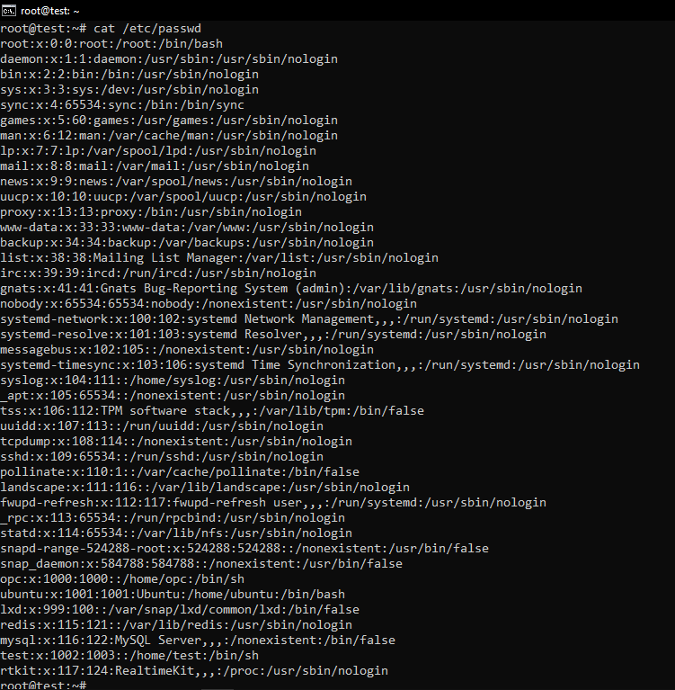
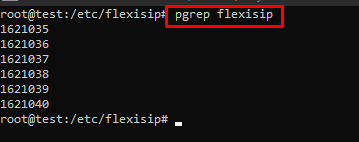
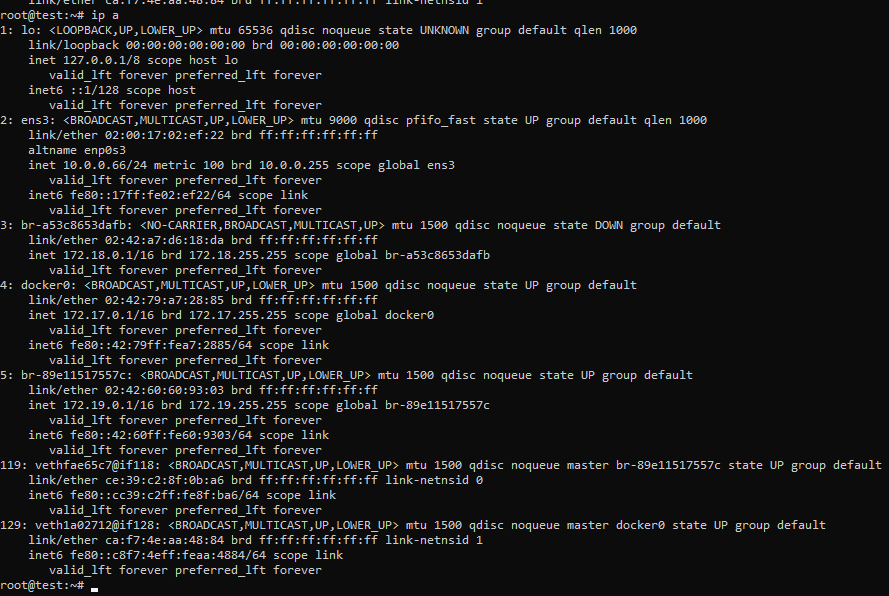
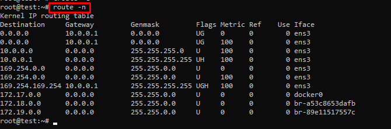
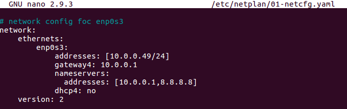
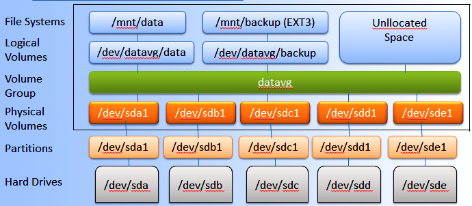
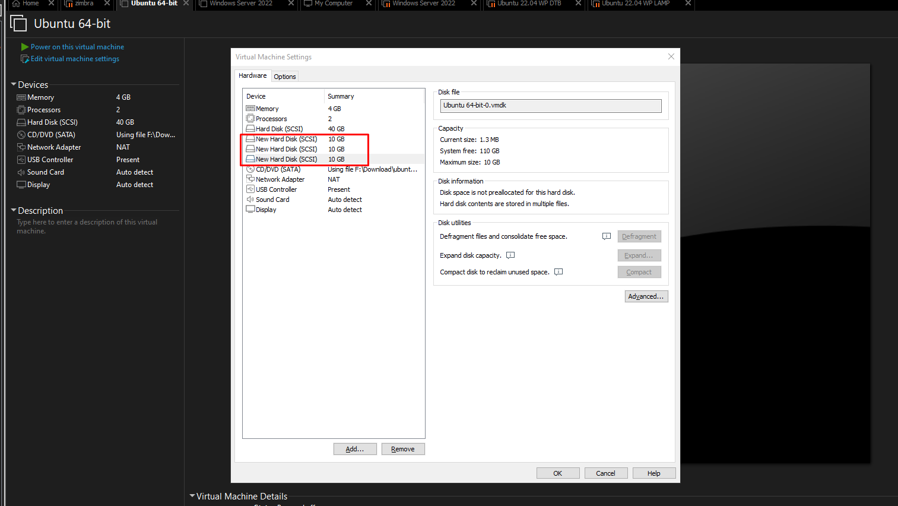

# Tìm hiểu chung về Linux 
***
<!-- TOC start (generated with https://github.com/derlin/bitdowntoc) -->

- [Tìm hiểu chung về Linux ](#tìm-hiu-chung-v-linux)
   * [1. Tổng quan về Linux](#1-tng-quan-v-linux)
      + [1.1 Linux là gì](#11-linux-là-gì)
      + [1.2 Kiến trúc hệ thống Linux.](#12-kin-trúc-h-thng-linux)
         - [1.2.1 Kernel ](#121-kernel)
         - [1.2.2. System Library](#122-system-library)
         - [1.2.3 Shell](#123-shell)
         - [1.2.4 Hardware layer](#124-hardware-layer)
         - [1.2.5 System Utitlies ](#125-system-utitlies)
      + [1.3 Các bản phân phối (distro) phổ biến.](#13-các-bn-phân-phi-distro-ph-bin)
         - [1.3.1 Debian Distro](#131-debian-distro)
         - [1.3.2 RedHat Distro](#132-redhat-distro)
         - [1.3.3 Slackware Distro](#133-slackware-distro)
   * [2. Quản lý người dùng và nhóm](#2-qun-lý-ngi-dùng-và-nhóm)
      + [2.1 User ](#21-user)
         - [2.1.1 Thêm user ](#211-thêm-user)
         - [2.1.2 Sửa user ](#212-sa-user)
         - [2.1.3 Xoá user ](#213-xoá-user)
      + [2.2 Group ](#22-group)
         - [2.2.1 Tạo Group ](#221-to-group)
         - [2.2.2 Sửa group](#222-sa-group)
         - [2.2.3 Xoá group ](#223-xoá-group)
      + [2.4 Quyền và chủ sử hữu trong Linux](#24-quyn-và-ch-s-hu-trong-linux)
      + [2.1 Owner (Chủ sở hữu) trong Linux](#21-owner-ch-s-hu-trong-linux)
      + [2.2 Quyền (Permissions) trên file/folder](#22-quyn-permissions-trên-filefolder)
   * [3. Các lệnh hữu ích khác](#3-các-lnh-hu-ích-khác)
      + [3.1 Lệnh liên quan đến hệ thống ](#31-lnh-liên-quan-n-h-thng)
      + [3.2 Lệnh thao tác trên tập tin ](#32-lnh-thao-tác-trên-tp-tin)
      + [3.2 Lệnh khi làm việc trên terminal ](#32-lnh-khi-làm-vic-trên-terminal)
      + [3.3 Lệnh quản lí hệ thống ](#33-lnh-qun-lí-h-thng)
      + [3.4 Các câu lệnh kiểm tra thông tin hệ thống (system information) trong Linux](#34-các-câu-lnh-kim-tra-thông-tin-h-thng-system-information-trong-linux)
      + [3.5 Các lệnh Quản lý services và process trong Linux](#35-các-lnh-qun-lý-services-và-process-trong-linux)
      + [3.6 Các lệnh liên quan tới tệp nén](#36-các-lnh-liên-quan-ti-tp-nén)
   * [4. Bộ soạn thảo trên linux: vi, nano](#4-b-son-tho-trên-linux-vi-nano)
      + [4.1 vi](#41-vi)
      + [4.2 Nano ](#42-nano)
   * [5. Process trong Linux](#5-process-trong-linux)
      + [5.1 Process ](#51-process)
      + [5.2 Các trạng thái Process](#52-các-trng-thái-process)
         - [5.2.1 Running or Runnable State (R)](#521-running-or-runnable-state-r)
         - [5.2.2 Sleeping State: Interruptible (S) and Uninterruptible (D)](#522-sleeping-state-interruptible-s-and-uninterruptible-d)
         - [5.2.3 Stopped State (T)](#523-stopped-state-t)
         - [5.2.4 Zombie State (Z)](#524-zombie-state-z)
      + [5.3 Các lệnh kiểm tra giám sát Processes](#53-các-lnh-kim-tra-giám-sát-processes)
         - [5.3.1 Lệnh ps ](#531-lnh-ps)
         - [5.3.2 Lệnh top ](#532-lnh-top)
         - [5.3.3 Lệnh htop](#533-lnh-htop)
         - [5.3.3 Lệnh pgrep ](#533-lnh-pgrep)
      + [5.4 Quản lý tiến trình ](#54-qun-lý-tin-trình)
   * [6. Network trong Linux](#6-network-trong-linux)
      + [6.1 Các khái niệm ](#61-các-khái-nim)
      + [6.2 Cấu hình mạng Linux ](#62-cu-hình-mng-linux)
         - [6.2.1 Các file cấu hình Network ](#621-các-file-cu-hình-network)
         - [6.2.2 Các lệnh quản trị phổ biến ](#622-các-lnh-qun-tr-ph-bin)
         - [6.2.3 Bảng định tuyến Routing Tables](#623-bng-nh-tuyn-routing-tables)
         - [6.2.4 Tường lửa Firewall (iptables) ](#624-tng-la-firewall-iptables)
      + [6.3 Sử dụng Netstat quản lý mạng trên Linux](#63-s-dng-netstat-qun-lý-mng-trên-linux)
   * [7. Network File System (NFS)](#7-network-file-system-nfs)
      + [7.1 Tìm hiểu NFS server](#71-tìm-hiu-nfs-server)
      + [7.2 Cài đặt dịch vụ và Kết nối nfs client với nfs serer](#72-cài-t-dch-v-và-kt-ni-nfs-client-vi-nfs-serer)
         - [7.2.1 Trên máy host server ](#721-trên-máy-host-server)
         - [7.2.3 Kiểm tra kết quả mount](#723-kim-tra-kt-qu-mount)
   * [8. Logical Volume Manager](#8-logical-volume-manager)
      + [8.1 Tìm hiểu về LVM ](#81-tìm-hiu-v-lvm)
      + [8.2 Sử dụng LVM ](#82-s-dng-lvm)
         - [8.2.1 Tạo partition ](#821-to-partition)
         - [8.2.2 Tạo physical volume ](#822-to-physical-volume)
         - [8.2.3 Tạo volume group.](#823-to-volume-group)
         - [8.2.4 Tạo logical volume.](#824-to-logical-volume)
         - [8.2.5 Tạo filesystem trên logical volume. ](#825-to-filesystem-trên-logical-volume)
         - [8.2.6 Chỉnh sửa fstab để tự động mount phân vùng.](#826-chnh-sa-fstab--t-ng-mount-phân-vùng)
         - [8.2.7 Mở rộng logical volume.](#827-m-rng-logical-volume)
         - [8.2.8 Thêm ổ cứng mở rộng logical volume.](#828-thêm--cng-m-rng-logical-volume)
         - [8.2.9 Out/ thay thế 1 ổ cứng ra khỏi hệ thống LVM](#829-out-thay-th-1--cng-ra-khi-h-thng-lvm)
         - [8.2.10 Xóa logical volume, xóa volume group, xóa physical volume](#8210-xóa-logical-volume-xóa-volume-group-xóa-physical-volume)
   * [References ](#references)

<!-- TOC end -->

## 1. Tổng quan về Linux
### 1.1 Linux là gì
- Linux là một họ các hệ điều hành tự do nguồn mở tương tự Unix và dựa trên Linux kernel, một hạt nhân hệ điều hành được phát hành lần đầu tiên vào ngày 17 tháng 9 năm 1991, bởi Linus Torvalds.
- Linux là một nền tảng mã nguồn mở và miễn phí được phát triển cho người dùng toàn cầu. Ra đời vào năm 1991, hệ điều hành này dựa trên nền tảng của Unix và được viết bằng ngôn ngữ lập trình C. Có khả năng hoạt động trên nhiều loại thiết bị khác nhau, từ máy tính cá nhân, laptop đến server và thiết bị nhúng.
- Lịch sử hình thành và phát triển linux
	* Khởi đầu vào năm 1991, Linus Torvalds – một sinh viên người Phần Lan, bắt đầu phát triển Linux dựa trên Unix. Vào ngày 25 tháng 8, ông công bố dự án trên Usenet và phát hành phiên bản đầu tiên vào ngày 17 tháng 9.
	* Quá trình phát triển
		* 1992: Chúng được phát hành dưới giấy phép GNU General Public License (GPL), cho phép tự do sử dụng, chỉnh sửa và phân phối mã nguồn.
		* 1993-1994: Các bản phân phối như Debian, Slackware và Red Hat xuất hiện, cung cấp hệ điều hành hoàn chỉnh dựa trên Linux kernel.
		* 1996: Linux kernel 2.0 ra mắt với hỗ trợ đa xử lý đối xứng (SMP).
		* 1998-1999: Các công ty lớn như IBM, Oracle và Dell bắt đầu hỗ trợ hệ điều hành này, Red Hat phát hành phiên bản thương mại của Linux.
		* 2000s: Hệ điều hành mở rộng sang máy chủ, thiết bị nhúng và di động. Năm 2004, Ubuntu ra mắt và trở nên phổ biến.
		* 2007: Google phát triển Android, một hệ điều hành dựa trên Linux kernel, trở thành hệ điều hành di động phổ biến nhất.
		* 2010s-2020s: Chúng trở thành nền tảng cho điện toán đám mây, container (Docker, Kubernetes) và Internet of Things (IoTs)
### 1.2 Kiến trúc hệ thống Linux.
- Kiến trúc Linux gồm các thành phần : Kernel, System Library, Hardware layer, System và Shell functions.

#### 1.2.1 Kernel 
- là cốt lõi của hệ điều hành dựa trên Linux. Nó ảo hóa các tài nguyên phần cứng chung của máy tính để cung cấp cho mỗi quy trình các tài nguyên ảo của nó. Điều này làm cho quy trình có vẻ như là quy trình duy nhất đang chạy trên máy. Kernel cũng chịu trách nhiệm ngăn ngừa và giảm thiểu xung đột giữa các quy trình khác nhau. 
- Các loại kernel là: 
	* Monolithic Kernel: Là loại kernel mà tất cả dịch vụ của hệ điều hành hoạt động trong kernel. Số lượng code lớn, phức tạp (Unix, Linux, Open VMS, XTS-400 etc. )
	* Micro kernels: Đây là loại kernel có cách tiếp cận tối giản. Nó có bộ nhớ ảo và lập lịch luồng. Micro Kernel ổn định hơn với ít dịch vụ hơn trong không gian kernel. Nó đặt phần còn lại trong không gian người dùng. Nó được sử dụng trong hệ điều hành nhỏ. (Mach, L4, AmigaOS, Minix, K42 etc.)
	* Hybrid kernels: Nó là sự kết hợp của cả Monolithic Kernel và Micro kernels. Nó có tốc độ và thiết kế của Monolithic Kernel và tính mô-đun và tính ổn định của Micro kernels.(Windows NT, Netware, BeOS etc.)
	* Exo kernels: Đây là loại kernel tuân theo nguyên tắc end-to-end. Nó có ít trừu tượng phần cứng nhất có thể. Nó phân bổ tài nguyên vật lý cho các ứng dụng.(Nemesis, ExOS etc.)
	* Nano Kernel: Đây là loại kernel cung cấp khả năng trừu tượng hóa phần cứng nhưng không có dịch vụ hệ thống. Micro Kernel cũng không có dịch vụ hệ thống do đó Micro Kernel và Nano Kernel đã trở nên tương tự nhau.(EROS etc.)
- Chức năng của Kernel: Kernel chịu trách nhiệm cho nhiều chức năng quan trọng khác nhau đảm bảo hệ thống máy tính hoạt động trơn tru. Các chức năng này bao gồm:
	* 1. Quản lý tiến trình
		- Lên lịch và thực thi các tiến trình.
		- Chuyển đổi ngữ cảnh giữa các tiến trình.
		- Tạo và kết thúc tiến trình.
	* 2. Quản lý bộ nhớ
		- Phân bổ và hủy phân bổ không gian bộ nhớ.
		- Quản lý bộ nhớ ảo.
		- Xử lý bảo vệ và chia sẻ bộ nhớ.
	* 3. Quản lý thiết bị
		- Quản lý thiết bị đầu vào/đầu ra.
		- Cung cấp giao diện thống nhất cho các thiết bị phần cứng.
		- Xử lý giao tiếp trình điều khiển thiết bị.
	* 4. Quản lý hệ thống tệp
		- Quản lý hoạt động và lưu trữ tệp.
		- Xử lý gắn kết và hủy gắn kết hệ thống tệp.
		- Cung cấp giao diện hệ thống tệp cho các ứng dụng.
	* 5. Quản lý tài nguyên
		- Quản lý tài nguyên hệ thống (thời gian CPU, dung lượng đĩa, băng thông mạng)
		- Phân bổ và hủy phân bổ tài nguyên khi cần
		- Giám sát việc sử dụng tài nguyên và thực thi giới hạn tài nguyên
	* 6. Bảo mật và Kiểm soát truy cập
		- Thực thi chính sách kiểm soát truy cập.
		- Quản lý quyền và xác thực của người dùng.
		- Đảm bảo tính bảo mật và toàn vẹn của hệ thống.
	* 7. Giao tiếp giữa các quy trình
		- Tạo điều kiện thuận lợi cho giao tiếp giữa các quy trình.
		- Cung cấp các cơ chế như truyền tin nhắn và bộ nhớ chia sẻ.
#### 1.2.2. System Library
- Thư viện hệ thống là một số hàm được xác định trước mà bất kỳ chương trình ứng dụng hoặc tiện ích hệ thống nào cũng có thể truy cập vào các tính năng của kernel. Các thư viện này là nền tảng mà bất kỳ phần mềm nào cũng có thể được xây dựng.
- System Library chứa mã và hàm mà ứng dụng và quy trình sử dụng để tương tác với kernel. Thay vì giao tiếp trực tiếp với kernel, ứng dụng truy cập thư viện, giúp các hoạt động hiệu quả và an toàn hơn. Các thư viện này cung cấp các dịch vụ thiết yếu như hoạt động I/O, phân bổ bộ nhớ, v.v.
- Một số thư viện hệ thống phổ biến nhất là:
	* Thư viện GNU C: Đây là thư viện C cung cấp hệ thống cơ bản nhất cho giao diện và thực thi các chương trình C. Thư viện này cung cấp nhiều hàm tích hợp để thực thi.
	* libpthread (POSIX Threads): Thư viện này đóng vai trò quan trọng đối với đa luồng trong Linux, cho phép người dùng tạo và quản lý nhiều luồng.
	* libdl (Dynamic Linker): Thư viện này chịu trách nhiệm tải và liên kết tệp khi chạy.
	* libm (Math Library): Thư viện này cung cấp cho người dùng mọi loại hàm toán học và thực thi chúng.
	* Một số thư viện hệ thống khác là: librt (Realtime Library), libcrypt (Cryptographic Library), libnss (Name Service Switch Library), libstdc++ (C++ Standard Library)
#### 1.2.3 Shell
- Shell có thể được xác định là giao diện cho kernel, ẩn việc thực thi các chức năng bên trong của kernel khỏi người dùng. Người dùng chỉ cần nhập lệnh và sử dụng chức năng của kernel, tác vụ cụ thể đó sẽ được thực hiện theo đó.
- Phân loại Shell: 
	* Command Line shell: command-line shell là giao diện dạng văn bản cho phép người dùng thực hiện lệnh bằng cách nhập lệnh. Shell sẽ diễn giải và xử lý các lệnh này, sau đó hiển thị đầu ra trong terminal. Ví dụ bao gồm bash và zsh.
	* Graphical User Interface: Thực hiện quy trình do người dùng cung cấp theo cách đồ họa và kết quả được hiển thị trong cửa sổ đồ họa.


#### 1.2.4 Hardware layer
- Lớp phần cứng của Linux là cấp thấp nhất của hệ điều hành. Nó đóng vai trò quan trọng trong việc quản lý tất cả các thành phần phần cứng. Nó bao gồm trình điều khiển thiết bị, chức năng kernel, quản lý bộ nhớ, điều khiển CPU và hoạt động I/O. Lớp này tổng quát hóa độ phức tạp cứng, bằng cách cung cấp giao diện cho phần mềm bằng cách đảm bảo chức năng phù hợp của tất cả các thành phần.
#### 1.2.5 System Utitlies (Application)
- Tiện ích hệ thống là các công cụ dòng lệnh thực hiện nhiều tác vụ khác nhau do người dùng cung cấp để quản lý và quản trị hệ thống tốt hơn. Các tiện ích này cho phép người dùng thực hiện nhiều tác vụ khác nhau, chẳng hạn như quản lý tệp, giám sát hệ thống, cấu hình mạng, quản lý người dùng, v.v.
### 1.3 Các bản phân phối (distro) phổ biến.
- Distro* là từ viết tắt thay thế cho Linux Distribution - bản phân phối của Linux - là một hệ điều hành được tập hợp từ nhiều phần mềm dựa trên nhân Linux (Linux Kernel) và thường có một hệ thống quản lý các gói tin.
- Thành phần: Một bản distro điển hình bao gồm: một kernel Linux, các công cụ và thư viện GNU, các phần mềm thêm vào, phần document, một hệ thống window system (mà phần lớn là sử dụng X Window System - hệ thống cửa sổ dùng để hiển thị đồ họa Bitmap), window manager và desktop environment.
- Hiện tại, có khoảng 600 bản distro tồn tại, với gần 500 trong số đó phát triển tích cực, liên tục được sửa đổi và cải thiện. Bởi sự sẵn có của số lượng lớn phần mềm, distro khá là đa dạng về hình thức - phù hợp với từ desktop, server, laptop, netbooks, điện thoại di động, máy tính bảng cũng như môi trường tối thiếu thường để sử dụng trong các hệ thống nhúng. 
- Có nhiều bản phân phối thương mại như Fedora (Red hat), OpenSUSE (SUSE), Ubuntu (Canonical Ltd); và hoàn toàn phân phối dựa vào cộng đồng như Debian, Slackware, Gentoo hay Arch Linux.  
- Có 3 nhóm distro phổ biến đó là: 
	+ Debian
		- Debian
		- Ubuntu 
		- Backtrack (Kali Linix)
	+ RedHat Linix
		- Fedora
		- RedHat
		- CentOS
	+ Slackware
		- Slackware
		- NimbleX

#### 1.3.1 Debian Distro
- Là một họ distro nổi tiếng và có tầm ảnh hưởng được biết đến với 2 distro thông dụng là Debian và Ubuntu.
- Hỗ trợ gói cài đặt .deb
- Hỗ trợ kiến trúc phần cứng x86-64, IA32-64, ...
- Là hệ điều hành có tính ổn định cao với trình quản lý gói apt mạnh mẽ.

#### 1.3.2 RedHat Distro
- Là một họ distro được biết đến với các distro: Fedora, CentOS và RedHat Linux.
- Hỗ trợ gói cài đặt .rpm
- Hỗ trợ kiến trúc phần cứng x86-64, ...
- Là hệ điều hành có tính ổn định với với trình quản lý cài đặt yum.
 
#### 1.3.3 Slackware Distro
- Đây là nhóm distro ra đời sớm nhất.
- Hỗ trợ gói cài đặt .tgz hoặc .txz.
- Ổn định và tùy biến cao, thích hợp cho Server.
	
## 2. Quản lý người dùng và nhóm
### 2.1 User 
- User là người có thể truy cập đến hệ thống. User có username và password.
- Có hai loại user: super user và regular user.
- Mỗi user còn có một định danh riêng gọi là UID.
- Định danh của người dùng bình thường sử dụng giá trị bắt đầu từ 500.
- Linux OS lưu trữ thông tin người dùng trên file `/etc/passwd`, với các trường được phân tách nhau bởi dấu ":", theo định dạng
```
username:password:UID:GID:comment:home:shell
```
- Ví dụ 
	```
	dgarn:x:1001:1001:Damon Garn:/home/dgarn:/bin/bash
	```
	- Tên user ( login name )
	- Mật khẩu group đã được mã hóa ( vì có file /etc/shadow ) nên mặc định ở đây là x
	- User ID ( uid )
	- Group ID ( gid )
	- Tên mô tả người sử dụng ( comment )
	- Thư mục home của user ( thường là /home/user_name )
	- Loại shell sẽ hoạt động khi user login , thường là /bin/bash


- Password được hash và lưu trong `/etc/shadow`
- Định dạng của các bản ghi trong file /etc/shadow
	```
	username:password:last password change:min:max:warning:inactive:expired
	```	
	- với `change:min:max:'warning':inactive:expired` là các thông tin liên quan đến việc thay đổi password.
- Thêm, xóa, sửa user
#### 2.1.1 Thêm user 
- Cú pháp để thêm user
	```
	sudo useradd [options] <username>
	```
	- Trong đó, các options là:
		--create-home(-m): chỉ định home directory, mặc định là /home/<username>
		--shell(-s): chỉ định shell, mặc định là /bin/bash , ví dụ /bin/sh, hoặc nếu không cho user quyền sử dụng shell thì để giá trị /sbin/nologin
		--uid(-u): chỉ định user id
		--comment: phần này là ghi chú để gợi nhớ user, thường người ta hay để họ tên đầy đủ


#### 2.1.2 Sửa user 
- Cú pháp để cập nhật user
	```
	sudo usermod [options] <username>
	```
	- Trong đó, các option có thể là:
		--comment (-c): chỉnh sửa trường comment
		--home (-d): chỉnh sửa home directory
		--expiredate (-d): thay đổi thời gian hết hạn
		--login (-l): chỉnh sửa tên đăng nhập
		--lock (-L): khóa user
		--unlock (-U): bỏ khóa
	- Trong phần cập nhật user, có một mục nhỏ khá quan trọng đó là thêm user vào group. 
		- Để thêm user vào group mới, đồng thời out hết các group khác, sử dụng cú pháp
		```
		sudo usermod -G <group-name> <user-name>
		```
		- Thêm user vào group mới, vẫn là thành viên của group cũ
		```
		sudo usermod -aG <group-name> <user-name>
		```
#### 2.1.3 Xoá user 
- Cú pháp để xóa user
	```
	sudo userdel [options] <username>
	```
	- Trong đó, các options bao gồm:
		-`-force` (-f): xóa user (và home directory) kể cả có người đang đăng nhập
		-`-remove` (-r): xóa user (và home directory) nhưng user phải log out ra từ trước
- Chuyển đổi user Khi ta muốn chuyển từ user này sang user khác ta có thể sử dụng lệnh “su” hoặc “sudo su”
	```
	sudo su [user-name]
	```
	- Nhưng không phải user nào cũng có quyền sudo để thực hiện chuyển đổi tài khoản. Để có quyền sudo thì user đó phải nằm trong group “wheel” với centos và group “sudo” đối với ubuntu.Bạn có thể tham khảo lệnh sau:


### 2.2 Group 
- Group là tập hợp nhiều user lại.
- Mỗi user luôn là thành viên của một group.
- Khi tạo một user thì mặc định một group được tạo ra.
- Mỗi group còn có một định danh riêng gọi là GID.
- Định danh của group thường sử dụng giá trị bắt đầu từ 500.
- Linux lưu trữ thông tin group trên file /etc/group với định dạng:
	```
	groupname:password:GID:group members
	```
	- Trong đó : 
		- Tên group
		- Mật khẩu group đã được mã hóa (vì có file /etc/gshadow) nên mặc định ở đây là x
		- Mã nhóm (gid)
		- Danh sách các user nằm trong nhóm
#### 2.2.1 Tạo Group 
- Để tạo 1 group ta sử dụng lệnh “groupadd”.
	```
	groupadd  [group_name]
	```
	- Trong đó option phổ biến nhất là:
		-`-gid`: group id
- Để tạo mật khẩu cho group ta sử dụng lệnh “gpasswd”.
```
gpasswd [group_name]
```


#### 2.2.2 Sửa group
- Để sửa lại thông tin về group ta sử dụng lệnh “groupmod”.
	```
	groupmod [options] [group_name]
	```
	- Options
		- g [gid] : sửa lại mã nhóm ( gid )
		- n [group_name] : sửa lại tên group


#### 2.2.3 Xoá group 
- Để xóa group ta sử dụng lệnh “groupdel”.
	```
	groupdel [group_name]
	```


### 2.4 Quyền và chủ sử hữu trong Linux
- Mỗi loại có một tập hợp quyền riêng: đọc, ghi và thực thi.
- Lệnh `chmod` được sử dụng để sửa đổi các quyền sở hữu và quyền này.
### 2.1 Owner (Chủ sở hữu) trong Linux
- Linux cung cấp ba loại chủ sở hữu: người dùng(user), nhóm(group) và các loại khác(other) .
	- Người dùng: Người tạo tệp sẽ trở thành chủ sở hữu của tệp đó. Bạn có thể thay đổi quyền sở hữu sau.
	- Nhóm: Người dùng là một phần của các nhóm cụ thể. Quản lý người dùng trong môi trường nhiều người dùng liên quan đến việc tạo các nhóm riêng biệt (ví dụ: nhóm phát triển, nhóm QA, nhóm quản trị hệ thống). Tư cách thành viên nhóm giúp đơn giản hóa việc quản lý quyền.
	- Khác: Nhóm này bao gồm tất cả người dùng trên hệ thống, ngay cả khi bạn là người dùng duy nhất. Mọi người có quyền truy cập vào hệ thống đều thuộc nhóm này. 
- Xem Owner của Tệp và Thư mục: 
	- Thông qua lệnh `ls -l`

- Lệnh thay đổi chủ sử hữu 
	```
	chown [OPTIONS] USER[:GROUP] FILE
	```
	- [OPTIONS] – Các tùy chọn bổ sung cung cấp khả năng kiểm soát bổ sung đối với cách thức hoạt động của chown.
	- [USER] – Tên người dùng hoặc ID người dùng dạng số của chủ sở hữu tệp mới.
	- [:] – Được sử dụng khi thay đổi nhóm tệp.
	- [GROUP] – Quyền sở hữu nhóm của một tệp.
	- FILE – Tệp hoặc các tệp mục tiêu.
- Các option phổ biến của lệnh chown 
|Option | Nội dung|
| -------- | -------- | 
|-f|Loại bỏ mọi thông báo lỗi chỉ hiện thị lỗi nghiêm trọng Nếu chown gặp lỗi (ví dụ: tệp không thể truy cập), nó sẽ không in thông báo lỗi, nhưng vẫn tiếp tục xử lý các tệp khác.|
|-h|Sửa đổi quyền sở hữu của liên kết tượng trưng thay vì tệp hoặc thư mục đích mà liên kết trỏ đến. Điều này hữu ích khi bạn muốn thay đổi quyền sở hữu của liên kết mà không ảnh hưởng đến đích.|
|--reference=RFILE|Sử dụng chủ sở hữu và nhóm của tệp tham chiếu được chỉ định (RFILE) thay vì chỉ định giá trị chủ sở hữu và nhóm.|
|--from=OWNER:GROUP|Chỉ thay đổi quyền sở hữu nếu tệp hiện có chủ sở hữu và nhóm được chỉ định. Tùy chọn này đảm bảo quyền sở hữu chỉ được cập nhật khi quyền sở hữu hiện tại khớp với các giá trị đã cho. Điều này hữu ích cho các thay đổi quyền sở hữu có chọn lọc khi nhiều người dùng hoặc nhóm có thể có quyền truy cập.|
|-H|Khi sử dụng với -R (đệ quy), nó thay đổi quyền sở hữu của các thư mục được tham chiếu bởi các liên kết tượng trưng trên dòng lệnh và áp dụng thay đổi cho tất cả các tệp bên trong các thư mục đó. Cờ này không ảnh hưởng đến các liên kết tượng trưng gặp phải trong quá trình duyệt thư mục.|
|-L|Khi sử dụng với -R, nó sẽ theo các liên kết tượng trưng đến các thư mục trong quá trình duyệt đệ quy. Nó thay đổi quyền sở hữu của các thư mục và tất cả các tệp bên dưới chúng bằng cách theo các liên kết tượng trưng.|
|-P|Khi sử dụng với -R, nó sẽ thay đổi quyền sở hữu của các liên kết tượng trưng mà không theo chúng. Điều này ngăn cho chown sửa đổi các tệp hoặc thư mục được trỏ đến bởi các liên kết tượng trưng.|
|-R|Đệ quy thay đổi quyền sở hữu của tất cả các tệp và thư mục bên dưới một thư mục được chỉ định. Nó xử lý từng tệp hoặc thư mục mà nó gặp phải nhưng không theo các liên kết tượng trưng trừ khi kết hợp với -h, -H, -L hoặc -P. Tùy chọn này rất quan trọng để áp dụng các thay đổi quyền sở hữu cho toàn bộ cây thư mục.|
- Ví dụ:
	* Thay đổi chủ sở hữu tập tin

	* Thay đổi nhóm sở hữu tập tin

	* Thay đổi chủ sở hữu và nhóm

	* Chuyển quyền sở hữu và cài đặt nhóm từ tệp này sang tệp khác


### 2.2 Quyền (Permissions) trên file/folder
- Mỗi tệp và thư mục có ba quyền cho cả ba loại chủ sở hữu:
	- Tệp
		- Đọc (r): Cho phép xem hoặc sao chép nội dung tệp.
		- Ghi (w): Cho phép sửa đổi nội dung tệp.
		- Thực thi (x): Cho phép chạy các tệp thực thi (tập lệnh hoặc chương trình).
	- Thư mục
		- Đọc: Liệt kê các tệp và sao chép chúng từ thư mục.
		- Ghi: Thêm hoặc xóa tệp (yêu cầu quyền thực thi).
		- Thực thi: Cho phép nhập thư mục.
- Quyền tệp có hai chế độ. Chế độ tuyệt đối và chế độ tượng trưng. Các chế độ nêu chi tiết loại mục nhập cần thiết để quyền có hiệu lực.
- Chế độ tượng trưng (Symbolic Mode): Chế độ tượng trưng cho phép bạn sửa đổi quyền dựa trên trạng thái hiện tại của chúng. Bạn sử dụng các ký hiệu như +, - và = để thêm, trừ hoặc đặt quyền.
	- \+ Thêm quyền.
	- \– Xóa quyền.
	- = Đặt quyền một cách rõ ràng
- Chế độ tuyệt đối (Absolute Mode): Ở chế độ tuyệt đối, bạn chỉ định rõ ràng các quyền bằng các giá trị số (ký hiệu bát phân). Các giá trị này biểu thị sự kết hợp của các quyền đọc, ghi và thực thi cho chủ sở hữu, nhóm và những người khác.
	- Các giá trị số như sau:
		- \0: Không có quyền (—)
		- \1: Chỉ thực thi (–x)
		- \2: Chỉ ghi (-w-)
		- \3: Ghi và thực thi (-wx)
		- \4: Chỉ đọc (r–)
		- \5: Đọc và thực thi (r-x)
		- \6: Đọc và ghi (rw-)
		- \7: Đọc, ghi và thực thi (rwx)
		
|Tên quyền	|Giá trị(thập phân)|	Mục đích sử dụng|
| -------- | -------- | -------- |
|r(read)	|4	|Đây là quyền được đọc file. Lệnh cat là ví dụ của quyền này|
|w(write)	|2|	Đây là quyền được chỉnh sửa. Lệnh vi là ví dụ của quyền này|
|x(execute)|	1|	Đây là quyền thực thi. Khi ta chạy bash cần quyền này|
- Xem Quyền của Tệp và Thư mục: 
	- Thông qua lệnh `ls -l`
 
	- Sử dụng lệnh `stat` để xem phạm vi sâu hơn của tệp hoặc thư mục liên quan.

- Thay đổi của Tệp và Thư mục: Trong ví dụ này, chúng ta sẽ sử dụng chế độ Symbolic và chế độ Absolute với tệp `test_file.txt và lệnh `chmod`.
	- Thực hiện thêm quyền thực thi `x` cho tệp `test-file.txt` với phương thức symbolic

	- Thực hiện thêm quyền thực thi `x` cho tệp với phương thức Absolute từ 0644 sang 0744


## 3. Các lệnh hữu ích khác
### 3.1 Lệnh liên quan đến hệ thống 

|Lệnh Linux|	Mô tả|
| -------- | -------- | -------- |
|exit| thoát khỏi cửa sổ dòng lệnh.|
|logout| tương tự exit.|
|reboot| khởi động lại hệ thống.|
|halt| tắt máy.|
|startx| khởi động chế độ xwindows từ cửa sổ terminal.|
|mount| gắn hệ thống tập tin từ một thiết bị lưu trữ vào cây thư mục chính.|
|unmount| ngược với lệnh mount.|

### 3.2 Lệnh thao tác trên tập tin 

|Lệnh Linux|	Mô tả|
| -------- | -------- | -------- |
|ls|lấy danh sách tất cả các file và thư mục trong thư mục hiện hành.|
|pwd| xuất đường dẫn của thư mục làm việc.|
|cd| thay đổi thư mục làm việc đến một thư mục mới.|
|mkdir| tạo thư mục mới.|
|rmdir|xoá thư mục rỗng.|
|cp| copy một hay nhiều tập tin đến thư mục mới.|
|mv| đổi tên hay di chuyển tập tin, thư mục.|
|rm| xóa tập tin.|
|wc| đếm số dòng, số kí tự... trong tập tin.|
|touch| tạo một tập tin.|
|cat| xem nội dung tập tin.|
|vi| khởi động trình soạn thảo văn bản vi.|
|df| kiểm tra dung lượng đĩa.|
|du| xem dung lượng đĩa đã dùng cho một số tập tin nhất định|
|nano| Khởi dộng trình soạn thảo văn bản nano|
|less| Xem nội dung tập tin theo dòng|
|tail| Xem nội dung tập tin (mặc định xem 10 dòng cuối, muốn xem 100 dòng cuối thì dùng lệnh sau: tail 100 tenfile)|
|more| Xem nội dung tập tin theo trang|
|head| Xem nội dung tập tin (mặc định xem 10 dòng đầu, muốn xem 100 dòng đầu thì dùng lệnh sau: head 100 tenfile)|

### 3.2 Lệnh khi làm việc trên terminal 
|Lệnh Linux|	Mô tả|
| -------- | -------- | -------- |
|clear| xoá trắng cửa sổ dòng lệnh.|
|date| xem ngày, giờ hệ thống.|
|cal| xem lịch hệ thống.|


### 3.3 Lệnh quản lí hệ thống 
|Lệnh Linux|	Mô tả|
| -------- | -------- | -------- |
|rpm| kiểm tra gói đã cài đặt hay chưa, hoặc cài đặt một gói, hoặc sử dụng để gỡ bỏ một gói.|
|ps| kiểm tra hệ thống tiến trình đang chạy.|
|kill| dừng tiến trình khi tiến trình bị treo. Chỉ có người dùng super-user mới có thể dừng tất cả các tiến trình còn người dùng bình thường chỉ có thể dừng tiến trình mà mình tạo ra.|
|top| hiển thị sự hoạt động của các tiến trình, đặc biệt là thông tin về tài nguyên hệ thống và việc sử dụng các tài nguyên đó của từng tiến trình.|
|pstree| hiển thị tất cả các tiến trình dưới dạng cây.|
|sleep| cho hệ thống ngừng hoạt động trong một khoảng thời gian.|
|useradd| tạo một người dùng mới.|
|groupadd| tạo một nhóm người dùng mới.|
|passwd| thay đổi password cho người dùng.|
|userdel| xoá người dùng đã tạo.|
|groupdel| xoá nhóm người dùng đã tạo.|
|gpasswd| thay đổi password của một nhóm người dùng.|
|su| cho phép đăng nhập với tư cách người dùng khác.|
|groups| hiển thị nhóm của user hiện tại.|
|who| cho biết ai đang đăng nhập hệ thống.|
|w| tương tự như lệnh who.|
|man| xem hướng dẫn về dòng lệnh như cú pháp, các tham số...|

### 3.4 Các câu lệnh kiểm tra thông tin hệ thống (system information) trong Linux
|Lệnh Linux|	Mô tả|
| -------- | -------- | -------- |
|cat /proc/cpuinfo	|Kiểm tra thông tin CPU (số core)|
|cat /proc/meminfo	|Kiểm tra thông tin về RAM đang sử dụng|
|cat /proc/version	|Kiểm tra phiên bản của Kernel Linux|
|cat /proc/ioports	|Xem thông tin port I/O|
|cat /etc/redhat-release	|Kiểm tra phiên bản Centos|
|uname -a	|Kiểm tra các thông tin về Kernel|
|free -m	|Kiểm tra dung lượng RAM còn trống|
|init 0|	Tắt máy (tương đương lệnh shutdown -h now hoặc telinit 0)|
|df -h	|Hiển thị thông tin những file hệ thống, nơi file được lưu hoặc tất cả những file mặc định. Lệnh này có thể xem được dung lượng ổ cứng đã sử dụng và còn trống.|
|du -sh	|Kiểm tra dung lượng thư mục hiện tại|
|du  -ah|	Hiển thị dung lượng của thư mục con và các file trong thư mục hiện tại|
|du -h –max-depth=1|	Hiển thị dung lượng các thư mục con ở cấp 1 (ngay trong thư mục hiện tại)|
|df	|Kiểm tra dung lượng đĩa cứng, các phân vùng đĩa|
|lspci|	Xem thông tin mainboard   /sbin/ifconfig Xem các địa chỉ IP của máy|
|hostname	|Xem tên máy (hostname)|
|finger user@server	|Thu thập thông tin chi tiết về người dùng hiện đang dùng hệ thống|
|arch	|Kiểm tra kiến trúc của máy (architech)|
|cat /proc/swaps	|Kiểm tra thông tin SWAP của máy (tương tự như virtual RAM của Windows)|


### 3.5 Các lệnh Quản lý services và process trong Linux

|Lệnh Linux	|Mô tả|
| -------- | -------- | -------- |

|top	|Lệnh top khá giống như Task Manager trong Windows. Nó đưa ra thông tin về tất cả tài nguyên hệ thống, các process đang chạy, tốc độ load trung bình… Lệnh top -d thiết lập khoảng thời gian làm mới lại hệ thống|
|ps –u username	|Kiểm tra những process được thực hiện bởi một user nhất định|
|ps –U root	|Kiểm tra mọi process ngoại trừ những process hệ thống|
|ps –A	|Kiểm tra mọi process trong hệ thống|
|Ss	|Kiểm tra socket đang kết nối|
|ss –l	|Hiển thị các cổng đang mở|
|w username	|Kiểm tra user đăng nhập, lịch sử đăng nhập, các process user đó đang chạy|
|vmstat3	|Kiểm soát hành vi hệ thống, phần cứng và thông tin hệ thống trong Linux|
|ps	|Hiển thị các chương trình hiện đang chạy|
|uptime	|Hiển thị thời gian đã vận hành của hệ thống trong bao lâu|
|rpm	|Kiểm tra, gỡ bỏ hoặc cài đặt 1 gói .rpm|
|yum	|Cài đặt các ứng dụng đóng gói (giống rpm)|
|wget	|Tải các ứng dụng từ một website về|
|sh	|Chạy một ứng dụng có đuôi .sh|
|Startx	|Khởi động chế độ xwindows từ cửa sổ terminal|
|yum update -y	|Update Linux (CentOS)|
|stop/start/restart	|Dừng/ khởi động/khởi động lại một service hoặc ứng dụng, ví dụ: service mysql stop hoặc /etc/init.d/mysqld start|
|kill	|Dừng proccess (thường dùng khi process bị treo). Chỉ có super-user mới có thể dừng tất cả các process còn user khác chỉ có thể dừng proccess mà user đó tạo ra|
|kill PID hoặc %job	|Ngừng một process bằng số PID (Process Identification Number) hoặc số công việc|
|pstree	|Hiển thị tất cả các process dưới dạng cây|
|service –status-all	|Kiểm tra tất cả các service và tình trạng của nó|
|whereis mysql	|Hiển thị nơi các file dịch vụ được cài đặt|
|service –status-all | grep abc	Xem tình trạng của process abc|
|kill -9 PID	|Bắt buộc đóng một process ID|
|kill -1 PID	|Bắt buộc đóng một process ID và load lại cấu hình mặc định của process đó|
### 3.6 Các lệnh liên quan tới tệp nén
|Lệnh Linux	|Mô tả|
| -------- | -------- | -------- |
|tar -cvf	|Nén file/thư mục sang định dạng .tar|
|tar -xvf	|Giải nén file tar|
|gzip	|Chuyển file .tar sang .tar.gz|
|gunzip|	Chuyển file .tar.gz về .tar|
|tar -xzf	|Giải nén file .tar.gz, ví dụ:  tar -xvf archive.tar|
|tar -zxvf	|Giải nén file .tar.bz2|
|tar -jxvf	|Giải nén file .tar.gz2|
|unzip	|Giải nén file zip|
## 4. Bộ soạn thảo trên linux: vi, nano
### 4.1 vi
- Vi được viết tắt của từ Visual – là trình soạn thảo văn bản được tạo ra cho hệ điều hành Linux. Chức năng chính của Vi là dùng các câu lệnh để chỉnh sửa hiển thị hướng màn hình (Screen-oriented (visual) display editor).
- Bộ soạn thảo vi chạy ở hai chế độ khác nhau:
	+ Chế độ dòng lệnh command mode, những gì được gõ vào sẽ được hiểu như là lệnh của vi. Vi có rất nhiều lệnh như: tìm kiếm, thay thế, xóa, lưu tâp tin…
	+ Chế độ nhập văn bản insert mode, những gì được gõ vào được hiểu là nội dung của tập tin đang soạn thảo.
- Khi bắt đầu sử dụng lệnh vi, vi mặc định ở command mode. Ấn phím lệnh i, a, o hoặc Insert từ chế độ command mode để chuyển sang insert mode.
	- i để thêm ký tự trước con trỏ,
	- a để thêm ký tự sau con trỏ,
	- o để chèn thêm dòng mới sau con trỏ.
	- Ấn Esc để chuyển đổi qua lại từ command mode với insert mode.
- Một số lệnh với vi:
	- :set nu hiện thị số dòng
	- :set nonu bỏ hiện thị số dòng
	- Sử dụng phím mũi tên hoặc các phím h,l,j,k để dịch trái, phải, lên, xuống
	- :1 để nhảy đến dòng đầu tiên của file
	- :n nhảy đến dòng n
	- $ nhảy xuống cuối dòng
	- :$ nhảy đến dòng cuối của file.0 nhảy về đầu dòng
	- :0 nhảy về dòng đầu tiên của file.
	- dd xóa một dòng hiện tại
	- ndd xóa n dòng
	- / hay ? để tìm kiếm
	- :w! lưu tập tin
	- :x! lưu tập tin và thoát
	- :wq ZZ lưu tập tin và thoát
	- :q! không lưu và thoát

### 4.2 Nano 
- GNU nano là một trình soạn thảo văn bản dòng lệnh dễ sử dụng cho các hệ điều hành Unix và Linux. Nó bao gồm tất cả các chức năng cơ bản của một trình soạn thảo văn bản thông thường, như Syntax Highlighting, bộ đệm, tìm kiếm và thay thế văn bản, kiểm tra chính tả, mã hóa UTF-8, v.v.
- Cài đặt Nano trên Ubuntu
```
sudo apt install nano -y
```
- Mở và tạo tập tin: Để mở tệp tin hiện có hoặc để tạo tệp mới, hãy nhập lệnh nano kèm theo tên tệp tin:
```
nano tên-file
```

- Chỉnh sửa tập tin: Không giống như vi, với nano bạn có thể bắt đầu nhập và chỉnh sửa văn bản ngay sau khi mở tệp. Để di chuyển con trỏ đến một dòng và số ký tự cụ thể, hãy sử dụng lệnh Ctrl + Shitf + _ Menu ở phía dưới màn hình sẽ thay đổi. Nhập số dòng muốn di chuyển tới và nhấn Enter.

- Lưu file và thoát khỏi Nano: Để lưu các thay đổi bạn đã thực hiện vào tệp, nhấn Ctrl + o. Nếu tập tin không tồn tại, nó sẽ được tạo khi bạn lưu nó. Để thoát nano, nhấn Ctrl + x. Nếu có những thay đổi chưa được lưu, bạn sẽ được hỏi liệu bạn có muốn lưu các thay đổi đó không.
## 5. Process trong Linux
### 5.1 Process 
- Một process (tiến trình) , hiểu theo cách đơn giản , là một ví dụ của một chương trình đang chạy. Bất cứ khi nào bạn thông báo một lệnh trong Linux , nó tạo hoặc bắt đầu một process mới.
- Mỗi process có 1 PID ( Process ID ) đại diện . PID gồm tối đa 5 chữ số và là duy nhất tại 1 thời điểm . PID của process A có thể được tận dụng cho process B nếu process A đã kết thúc .

- Mỗi một tiến trình Unix có hai ID được gán cho nó: Process ID (pid) và Parent Process ID (ppid).
- Mỗi tiến trình trong hệ thống có một Parent Process (gốc).
- Mỗi tiến trình được liên kết với metadata:
	* ID quy trình duy nhất (PID)
	* Lệnh được sử dụng để khởi tạo quy trình
	* Trạng thái quy trình hiện tại
	* Chi tiết sử dụng tài nguyên
### 5.2 Các trạng thái Process
- Trong Linux, một tiến trình là một trường hợp thực thi một chương trình hoặc lệnh. Trong khi các tiến trình này tồn tại, chúng sẽ ở một trong năm trạng thái có thể:
	- Running or Runnable (R)
	- Uninterruptible Sleep (D)
	- Interruptable Sleep (S)
	- Stopped (T)
	- Zombie (Z)

#### 5.2.1 Running or Runnable State (R)
- Khi một tiến trình mới được bắt đầu, nó sẽ được đưa vào trạng thái chạy hoặc có thể chạy. Ở trạng thái chạy, tiến trình sẽ sử dụng một lõi CPU để thực thi mã và logic của nó. Tuy nhiên, thuật toán lập lịch luồng có thể buộc một tiến trình đang chạy từ bỏ quyền thực thi của nó. Điều này nhằm đảm bảo mỗi tiến trình có thể có một phần tài nguyên CPU công bằng. Trong trường hợp này, tiến trình sẽ được đưa vào hàng đợi chạy và trạng thái của nó hiện là trạng thái có thể chạy đang chờ đến lượt thực thi.
- Mặc dù trạng thái chạy và có thể chạy là riêng biệt, nhưng chúng được nhóm lại thành một trạng thái duy nhất được biểu thị bằng ký tự R.
#### 5.2.2 Sleeping State: Interruptible (S) and Uninterruptible (D)
- Trong quá trình thực thi quy trình, nó có thể bắt gặp một phần mã cần yêu cầu tài nguyên bên ngoài. Chủ yếu, yêu cầu đối với các tài nguyên này dựa trên IO chẳng hạn như đọc tệp từ đĩa hoặc thực hiện yêu cầu mạng. Vì quy trình không thể tiếp tục nếu không có tài nguyên nên nó sẽ bị dừng và không làm gì cả. Trong những sự kiện như thế này, chúng sẽ từ bỏ các chu kỳ CPU của mình cho các tác vụ khác đã sẵn sàng chạy và do đó chúng sẽ chuyển sang trạng thái ngủ.
- Có hai trạng thái ngủ khác nhau: 
	* Trạng thái ngủ không thể ngắt (D) chờ tài nguyên khả dụng trước khi chuyển sang trạng thái có thể chạy và không phản ứng với bất kỳ tín hiệu nào.
	* Trạng thái ngủ có thể ngắt (S) là trạng thái ngủ có thể ngắt (các) sẽ phản ứng với các tín hiệu và tính khả dụng của tài nguyên. Một quá trình vào trạng thái S hoặc Ngủ có thể ngắt khi nó chờ một sự kiện hoặc điều kiện không liên quan trực tiếp đến hoạt động I/O.
#### 5.2.3 Stopped State (T)
- Từ trạng thái đang chạy hoặc có thể chạy, chúng ta có thể đưa một tiến trình vào trạng thái dừng (T) bằng cách sử dụng tín hiệu SIGSTOP hoặc SIGTSTP. Sự khác biệt giữa cả hai tín hiệu là chúng ta gửi SIGSTOP theo chương trình, chẳng hạn như chạy lệnh kill -STOP {pid}. Ngoài ra, tiến trình không thể bỏ qua tín hiệu này và sẽ chuyển sang trạng thái dừng. Mặt khác, chúng ta gửi tín hiệu SIGTSTP bằng cách sử dụng phím CTRL + Z. Không giống như SIGSTOP, tiến trình có thể tùy chọn bỏ qua tín hiệu này và tiếp tục thực thi khi nhận được SIGTSTP.
- Trong khi ở trạng thái này, chúng ta có thể đưa tiến trình trở lại trạng thái đang chạy hoặc có thể chạy bằng cách gửi tín hiệu SIGCONT.
#### 5.2.4 Zombie State (Z)
- Khi một tiến trình đã hoàn tất việc thực thi hoặc bị chấm dứt, nó sẽ gửi tín hiệu SIGCHLD đến tiến trình cha và chuyển sang trạng thái zombie. Tiến trình zombie, còn được gọi là tiến trình không còn tồn tại, sẽ vẫn ở trạng thái này cho đến khi tiến trình cha xóa nó khỏi bảng tiến trình. Để xóa tiến trình con đã chấm dứt khỏi bảng tiến trình, tiến trình cha phải đọc giá trị thoát của tiến trình con bằng cách sử dụng các lệnh gọi hệ thống wait() hoặc waitpid().
### 5.3 Các lệnh kiểm tra giám sát Processes
#### 5.3.1 Lệnh ps 
- Lệnh ps (process status) là một công cụ phổ biến của Linux dùng để hiển thị thông tin về các tiến trình hiện tại.

- Kết quả hiển thị ID tiến trình (PID), Loại thiết bị đầu cuối (TTY), Thời gian CPU và lệnh khởi tạo tiến trình.
- Hơn nữa, chúng ta có thể sử dụng nhiều cờ khác nhau với lệnh ps để có được đầu ra chi tiết hơn. Ví dụ, chúng ta có thể chạy lệnh ps với cờ -a để hiển thị các tiến trình từ tất cả người dùng và cờ -u để hiển thị đầu ra chi tiết theo định hướng người dùng, bao gồm cả những người dùng sở hữu các tiến trình và thông tin sử dụng tài nguyên bổ sung:

#### 5.3.2 Lệnh top 
top (table of processes) là lệnh giám sát hệ thống mặc định trong hầu hết các bản phân phối Linux, cung cấp chế độ xem thời gian thực về các tiến trình đang chạy và mức sử dụng hệ thống. Lệnh này hiển thị đầu ra theo thứ tự giảm dần mức sử dụng CPU, với các tiến trình tốn nhiều tài nguyên nhất ở trên cùng.

#### 5.3.3 Lệnh htop
- htop là một lệnh thay thế thân thiện với người dùng hơn, nhiều màu sắc hơn và tương tác hơn cho lệnh top trong Linux. Lệnh này hiển thị thông tin thời gian thực về các quy trình Linux và cung cấp điều hướng chuột và cuộn dễ dàng hơn.
- htop được cài thông qua lệnh 
```
sudo apt instal htop -y
```
- Sử dụng htop 
```
htop
```

- Có thể sử dụng -u hiển thị các tiến trình đang chạy dưới người dùng cụ thể:
```
htop -u root
```

#### 5.3.3 Lệnh pgrep 
- Lệnh pgrep trong Linux được sử dụng để tìm kiếm ID tiến trình (PID) của tiến trình dựa trên tên hoặc các thuộc tính khác của tiến trình đó.

### 5.4 Quản lý tiến trình 
- Khởi tạo 
	* Một tiến trình bắt đầu khi một lệnh được thực thi. Vì vậy, chúng ta có thể bắt đầu một tiến trình bằng cách chạy lệnh, chương trình hoặc tập lệnh.
	
- Dừng một tiến trình
	* Trong hầu hết các trường hợp, chúng ta dừng một tiến trình đang chạy ở chế độ nền bằng cách chỉ cần nhấn CTRL + C.
	* Tuy nhiên, chúng ta cũng có thể sử dụng lệnh kill với cờ -STOP để dừng một tiến trình nền một cách nhẹ nhàng:
	```
	kill -STOP 11418
	```
	* Trong lệnh trên, 11153 là PID của tiến trình mà chúng ta muốn dừng. Theo cách này, chúng ta đặt tiến trình ở trạng thái tạm dừng, khiến nó đủ điều kiện để tiếp tục sau.
- Xoá 
	* Có thể chấm dứt một tiến trình bằng cách sử dụng lệnh kill với PID của nó:
	```
	kill 11418
	```
	* Tuy nhiên, nếu tiến trình không chấm dứt, chúng ta có thể sử dụng cờ -9 để gửi tín hiệu kill mạnh hơn:
	```
	kill -9 11418
	```
- Thay đổi ưu tiên 
	* Các quy trình được gán các giá trị mức độ ưu tiên (được gọi là giá trị nice) ảnh hưởng đến lịch trình CPU. Phạm vi trải dài từ -20 (mức độ ưu tiên cao nhất) đến 19 (mức độ ưu tiên thấp nhất). Theo mặc định, một quy trình chạy với giá trị nice là 0.
	* Sử dụng lệnh nice để bắt đầu một quy trình với mức độ ưu tiên cụ thể. Ngược lại, chúng ta sử dụng lệnh renice để thay đổi mức độ ưu tiên của một quy trình hiện có.
	* Ví dụ khởi động tiến trình mysql với ưu tiên =10 ở Background
	```
	nice -n 10 mysql &
	```

	- Chúng ta có thể thay đổi mức độ ưu tiên của tiến trình trên bằng cách sử dụng lệnh renice với PID của nó và giá trị mức độ ưu tiên mới:
	```
	sudo renice -n 5 -p 11418
	11418 (process ID) old priority 10, new priority 5
	```


## 6. Network trong Linux
- Mạng là một khía cạnh cơ bản của hệ thống Linux, cho phép giao tiếp giữa các thiết bị và dịch vụ.
### 6.1 Các khái niệm 
- Interface: Giao diện mạng là các biểu diễn phần mềm của các thiết bị mạng vật lý hoặc ảo trong hệ thống Linux. Chúng đóng vai trò là điểm kết nối với mạng. Các giao diện vật lý thường tương ứng với các thẻ Ethernet, trong khi các giao diện ảo được sử dụng trong các tình huống như ảo hóa và vùng chứa Ví dụ: eth0, ens33, 

- Địa chỉ IP là các định danh số duy nhất được gán cho các thiết bị trong mạng, cho phép chúng giao tiếp với nhau. Linux hỗ trợ cả lược đồ địa chỉ IPv4 và IPv6.

- Định tuyến là quá trình hướng các gói dữ liệu giữa các mạng khác nhau. Linux sử dụng bảng định tuyến để quản lý quá trình này

- Firewall đóng một vai trò quan trọng trong bảo mật mạng bằng cách kiểm soát lưu lượng mạng đến và đi dựa trên các quy tắc được xác định trước.

### 6.2 Cấu hình mạng Linux 
#### 6.2.1 Các file cấu hình Network 
* `/etc/hosts`
	- Dùng để phân giải những hostname không thể phân giải được .
	- Có thể dùng thay DNS trong hệ thống mạng LAN
	```
	127.0.0.1 <=> localhost.localdomain
	::1 <=> localhost.localdomain
	```

* `/etc/resolv.conf`
	- Dùng để cấu hình DNS

* `/etc/netplan/50-cloud-init.yaml`
	- Dùng cấu hình thông số mạng 

	- Ví dụ cấu hình ip tĩnh 

#### 6.2.2 Các lệnh quản trị phổ biến 
* `ifconfig` interface configurator : tức là trình cấu hình giao diện mạng. Đây là một trong những lệnh cơ bản nhất được sử dụng trong việc kiểm tra mạng.

* telnet:  thực hiện kết nối máy chủ và máy đích thông qua một port bằng cách sử dụng giao thức telnet TCP/IP. 
	- `telnet <hostname/IP address> <port>`

* `nslookup` được sử dụng để thực hiện các tra cứu liên quan đến DNS

* `dig` Domain Information Groper, có nghĩa là công cụ tìm kiếm thông tin tên miền. 

#### 6.2.3 Bảng định tuyến Routing Tables
- Bảng định tuyến lưu trữ thông tin về cách định tuyến lưu lượng truy cập mạng đến các điểm đến khác nhau. Lệnh `route` cho phép bạn xem, thêm, sửa và xóa các mục trong bảng định tuyến.
- Có thể sử dụng lệnh `route` hoặc lệnh `ip route list` để hiển thị thông tin của bảng định tuyến:

- Bảng định tuyến chứa Mạng đích, Mặt nạ mạng con, Cổng và Số liệu (tùy chọn) cho mỗi mạng:
* Destination là nơi các gói dữ liệu hướng đến.
* Genmask là subnetmask bit dùng để xác định phần mạng và phần máy chủ của địa chỉ IP.
* Gateway đề cập đến bộ định tuyến hoặc giao diện hop tiếp theo trên đường dẫn đến mạng đích. Hầu hết các thiết bị đều có ít nhất một gateway mặc định . Các bộ định tuyến văn phòng hoặc gia đình thông thường có một gateway duy nhất, nhưng các mạng phức tạp có nhiều gateway tĩnh để định tuyến lưu lượng.
* Metric: Mức độ ưu tiên liên quan đến một tuyến đường mà bộ định tuyến sử dụng để chọn đường dẫn hiệu quả nhất.
#### 6.2.4 Tường lửa Firewall (iptables) 
- IPtables là ứng dụng tường lửa miễn phí trong Linux, cho phép thiết lập các quy tắc riêng để kiểm soát truy cập, tăng tính bảo mật.
- IPtables hoạt động gồm 3 thành phần là Tables, Chains và Targets.
	- Table được IPtables sử dụng để định nghĩa các rules(quy tắc) dành cho các gói tin. Trong đó, có các Table sau. 
		* Filter Table: Là một trong những tables được IPtables sử dụng nhiều nhất, Filter Table sẽ quyết định việc một gói tin có được đi đến đích dự kiến hay từ chối yêu cầu của gói tin.
		* NAT Table: Để dùng các rules về NAT(Network Address Translation), NAT Table sẽ có trách nhiệm chỉnh sửa source(IP nguồn) hoặc destination(IP đích) của gói tin khi thực hiện cơ chế NAT.
		* Mangle Table: Cho phép chỉnh sửa header của gói tin, giá trị của các trường TTL, MTU, Type of Service.
		* Raw Table: IPtables là một stateful firewall với các gói tin được kiểm tra liên quan đến trạng thái(state). Ví dụ gói có thể là một phần của một kết nối mới hoặc là một phần của kết nối hiện có. Raw Table sẽ giúp bạn làm việc với các gói tin trước khi kernel bắt đầu kiểm tra trạng thái và có thể loại một số gói khỏi việc tracking vì vấn đề hiệu năng của hệ thống.
		* Security Table: Một vài kernel có thể hỗ trợ thêm Security Table, được dùng bởi SELinux để thiết lập các chính sách bảo mật.
	- Chains: Chains được tạo ra với một số lượng nhất định ứng với mỗi Table, giúp lọc gói tin tại các điểm khác nhau.
		* Chain PREROUTING tồn tại trong Nat Table, Mangle Table và Raw Table, các rules trong chain sẽ được thực thi ngay khi gói tin vào đến giao diện mạng (Network Interface).
		* Chain INPUT chỉ có ở Mangle Table và Nat Table với các rules được thực thi ngay trước khi gói tin gặp tiến trình.
		* Chain OUTPUT tồn tại ở Raw Table, Mangle Table và Filter Table, có các rules được thực thi sau khi gói tin được tiến trình tạo ra.
		* Chain FORWARD tồn tại ở Manle Table và Filter Table, có các rules được thực thi cho các gói tin được định tuyến qua host hiện tại.
		* Chain POSTROUTING chỉ tồn tại ở Manle Table và Nat Table với các rules được thực thi khi gói tin rời giao diện mạng.
	- Target: Target có thể được hiểu là hành động dành cho các gói tin khi gói tin thỏa mãn các rules đặt ra.
		* ACCEPT: chấp nhận và cho phép gói tin đi vào hệ thống.
		* DROP: loại gói tin, không có gói tin trả lời.
		* REJECT: loại gói tin những có trả lời table gói tin khác. Ví dụ: trả lời table 1 gói tin “connection reset” đối với gói TCP hoặc “destination host unreachable” đối với gói UDP và ICMP.
		* LOG: chấp nhận gói tin nhưng có ghi lại log.
		- Gói tin sẽ được đi qua tất cả các rules đặt ra mà không dừng lại ở bất kì rule nào đúng. Trường hợp gói tin không khớp với rules nào mặc định sẽ được chấp nhận
- Rules trong iptables: Để xem các rule trong iptables dùng lệnh `iptables -L –v`

	- Ý nghĩa của từng cột 
		* TARGET: hành động sẽ thực thi.
		* PROT: viết tắt của Protocol, là các giao thức sẽ được áp dụng để thực thi quy tắc này. Ở đây chúng ta có 3 lựa chọn là all, tcp hoặc udp. Các ứng dụng như SSH, FTP, sFTP,..đều sử dụng giao thức TCP.
		* IN: chỉ ra rule sẽ áp dụng cho các gói tin đi vào từ interface nào, ví dụ lo, eth0, eth1 hoặc any là áp dụng cho tất cả interface.
		* OUT: tương tự  IN, chỉ ra rule sẽ áp dụng cho các gói tin đi ra từ interface nào.
		* DESTINATION: địa chỉ của lượt truy cập được phép áp dụng quy tắc. 
- Một số lệnh iptables 
	- Tạo một rule mới `iptables -A INPUT -i lo -j ACCEPT`
	- Xoá rule: `iptables -D INPUT 4`
### 6.3 Sử dụng Netstat quản lý mạng trên Linux
- netstat (network statistics) là một công cụ mạng nằm trong gói công cụ net-tools, sử dụng dòng lệnh, được sử dụng để khắc phục sự cố và cấu hình mạng.
- Các tuỳ chọn thiết lập lệnh netstat 
	```
	root@test:~# netstat -h
	usage: netstat [-vWeenNcCF] [<Af>] -r         netstat {-V|--version|-h|--help}
		   netstat [-vWnNcaeol] [<Socket> ...]
		   netstat { [-vWeenNac] -i | [-cnNe] -M | -s [-6tuw] }

			-r, --route              display routing table
			-i, --interfaces         display interface table
			-g, --groups             display multicast group memberships
			-s, --statistics         display networking statistics (like SNMP)
			-M, --masquerade         display masqueraded connections

			-v, --verbose            be verbose
			-W, --wide               don't truncate IP addresses
			-n, --numeric            don't resolve names
			--numeric-hosts          don't resolve host names
			--numeric-ports          don't resolve port names
			--numeric-users          don't resolve user names
			-N, --symbolic           resolve hardware names
			-e, --extend             display other/more information
			-p, --programs           display PID/Program name for sockets
			-o, --timers             display timers
			-c, --continuous         continuous listing

			-l, --listening          display listening server sockets
			-a, --all                display all sockets (default: connected)
			-F, --fib                display Forwarding Information Base (default)
			-C, --cache              display routing cache instead of FIB
			-Z, --context            display SELinux security context for sockets

	  <Socket>={-t|--tcp} {-u|--udp} {-U|--udplite} {-S|--sctp} {-w|--raw}
			   {-x|--unix} --ax25 --ipx --netrom
	  <AF>=Use '-6|-4' or '-A <af>' or '--<af>'; default: inet
	  List of possible address families (which support routing):
		inet (DARPA Internet) inet6 (IPv6) ax25 (AMPR AX.25)
		netrom (AMPR NET/ROM) ipx (Novell IPX) ddp (Appletalk DDP)
		x25 (CCITT X.25)
	```
	- Có rất nhiều tùy chọn, một số tùy chọn phổ biến thường được sử dụng mà bạn có thể chú ý ở đây là
		* -a: Hiển thị tất cả các sockets, kể cả listening và non-listening
		* -l: Hiển thị các socket đang lắng nghe
		* -t: Chỉ hiển thị các kết nối tcp
		* -u: Chỉ hiển thị các kết nối udp
		* -n: Xem địa chỉ số (không phân giải)
		* -p: Hiển thị chương trình PID cho từng socket
		* -r: Hiển thị bảng định tuyến
		* -s: Pull và hiển thị thống kê mạng được sắp xếp theo giao thức
		* -i: Hiển thị danh sách các giao diện mạng
- Ví dụ sử dụng `netstat`
	+ Liệt kê tất cả các port `netstat -a`

	+ `netstat -at`: Chỉ kiểm tra các port TCP

	+ `netstat -au`: Chỉ kiểm tra các port UDP

	+ `netstat -l`: Đây là tùy chọn có phạm vi nhỏ hơn -a khi chỉ liệt kê các port đang ở trạng thái listening. Tùy chọn này cũng thường đi kèm với tùy chọn -t hay -u để lọc ra các kết nối TCP hay UDP.

	+ `netstat -pltun`: Kiểm tra các tiến trình

	+ `netstat -s`:Hiển thị thống kê mạng

	+ `netstat -r`: Hiển thị bảng định tuyến 

	+ `netstat -i`: Hiển thị giao diện mạng 

	+ Kết hợp với lệnh khác: `netstat -lntp | grep ':22'` để hiện thị số kết nối của mỗi ip đến server.
	
	+ Kết hợp với lệnh khác: `netstat -apn |grep 'tcp\|udp' | awk '{print $5}' | cut -d: -f1 | sort | uniq -c | sort -n` để kiểm tra port 22

	
	
## 7. Network File System (NFS)
### 7.1 Tìm hiểu NFS server
- NFS - Network File System là một giao thức phân phối file system, nó cho phép bạn mount các thư mục từ xa có trên server.
- NFS được phát triển bởi SUN Microsystem, bắt đầu từ năm 1984 với phiên bản đầu tiên.
- Cho đến nay đã có tất cả 6 phiên bản:
  - version 1: phát hành năm 1984 với mục đích thí nghiệm
  - version 2: phát hành năm 1989, được đưa ra thị trường
  - version 3: phát hành năm 1995 với nhiều cải tiến
  - version 4 năm 2000, version 4.1 năm 2010 và version 4.2 năm 2016
- Cho phép bạn quản lý không gian lưu trữ ở một nơi khác và ghi vào không gian lưu trữ này từ nhiều clients.
- NFS cung cấp một cách tương đối nhanh chóng và dễ dàng để truy cập vào các hệ thống từ xa qua mạng và hoạt động tốt trong các tình huống mà các tài nguyên chia sẻ sẽ được truy cập thường xuyên.
- Dung lượng file mà NFS cho phép client truy cập lớn hơn 2GB
- Truyền thông giữa client và server thực hiện qua mạng Ethernet
- Client và Server sử dụng RPC (Remote Procedure Call) để giao tiếp với nhau.
- NFS sử dụng cổng 2049
- NFS hoạt động theo mô hình client/server. Một server đóng vai trò storage system, cho phép nhiều client kết nối tới để sử dụng dịch vụ.

### 7.2 Cài đặt dịch vụ và Kết nối nfs client với nfs serer
Bài lab thực hiện Ubuntu Server 22.04 64-bit.
- Gồm hai VM:
  - 1 vm đóng vai trò Host server, với IP: 192.168.57.132/24
  - 1 vm đóng vai trò client, với IP: 192.168.57.136/24
#### 7.2.1 Trên máy host server 
- Cài đặt các thành phần
```
apt-get update
apt-get install nfs-kernel-server -y
```
 
- Tạo `Share Directories`
  - Tạo thư mục
    
    ```
    mkdir /var/nfs/general -p
    ```
    
  - Thay đổi ownership thư mục trên
  
    ```
    chown nobody:nogroup /var/nfs/general
    ```
 

- Cấu hình NFS Exports trên Host server. Thêm dòng sau vào file `/etc/exports`

  ```
  /var/nfs/general    192.168.57.0/24(rw,sync,no_subtree_check)
  /home               192.168.57.0/24(rw,sync,no_root_squash,no_subtree_check)
  ```
  - **/var/nfs/general** đây là thư mục mà chúng ta đã tạo ở trên.
  - **192.168.57.0/24** cho phép clients trong mạng 192.168.57.0 có thể truy cập vào
  - **rw** cho phép client truy cập vào có khả năng đọc và ghi.
  - **sync** option này buộc NFS ghi lại các thay đổi vào disk trước khi trả lời. Điều này dẫn đến một môi trường ổn định hơn và nhất quán vì phản hồi phản ánh tình trạng thực tế của remote volume. Tuy nhiên, nó cũng làm giảm tốc độ hoạt động của file.
  - **no_subtree_check** Tùy chọn này ngăn việc kiểm tra subtree, đó là một tiến trình mà host phải kiểm tra xem liệu tệp đó có thực sự vẫn còn trong cây export cho mọi yêu cầu hay không. Điều này có thể gây ra nhiều vấn đề khi một tập tin được đổi tên trong khi client đã mở nó. Trong hầu hết các trường hợp, tốt hơn là để vô hiệu hóa việc kiểm tra subtree.
  - **no_root_squash** Nếu từ client đăng nhập bằng tài khoản root, từ phía server sẽ chuyển vào non-privileged user trên server. Điều này vì lý do bảo mật.


- Restart dịch vụ

  ```
  service nfs-kernel-server restart
  ```

 
 #### 7.2.2 Cài đặt trên client
- Cài đặt các gói

  ```
  apt-get update
  apt-get install nfs-common -y
  ```

  
- Tạo Mount point

  ```
  mkdir -p /nfs/general
  ```
  
- Mount thư mục cho client

  ```
  mount 192.168.57.132:/var/nfs/general /nfs/general
  ```
  
#### 7.2.3 Kiểm tra kết quả mount
- Trên máy client chạy lệnh 

```
df -h
```

- Tạo file từ client để kiểm tra truy cập NFS
	- Tạo file mới vào thư mục `/nfs/general` trên client

	  ```
	  touch /nfs/general/general_anth.test
	  ```

	- Kiểm tra ownership của file vừa tạo

	  ```
	  ls -l /nfs/general/general_anth.test
	  ```
	
	  
	- Kiểm tra thư mục `/var/nfs/general` trên Host server xem có những file gì

	  ```
	  ls /var/nfs/general
	  ```
	- Nhận thấy  `general_anth.test` được tạo trên client và được lưu trên Host server.
	


## 8. Logical Volume Manager
### 8.1 Tìm hiểu về LVM 
- Logical Volume Manager (LVM) : LVM là kỹ thuật quản lý việc thay đổi kích thước lưu trữ của ổ cứng. Là một phương pháp ấn định không gian ổ đĩa thành những logicalvolume khiến cho việc thay đổi kích thước của một phân vùng trở nên dễ dàng. Điều này thật dễ dàng khi bạn muốn quản lý công việc của mình tại riêng một phân vùng mà muốn mở rộng nó ra lớn hơn.
- Một số khái niệm liên quan:
	- Physical volume (Pv): là một đĩa cứng vật lý hoặc là partition
	- Volume group (Vg): là một nhóm các physical volume ( ổ đĩa ảo )
	- Logical volume(Lv): là các phân vùng ảo của ổ đĩa ảo
- Ưu điểm :
	- Không để hệ thống bị gián đoạn hoạt động
	- Không làm hỏng dịch vụ
	- Có thể kết hợp swap
	- Có thể tạo ra các vùng dung lượng lớn nhỏ tuỳ ý.
- Nhược điểm:
	- Các bước thiết lập phức tạp và khó khăn hơn
	- Càng gắn nhiều đĩa cứng và thiết lập càng nhiều LVM thì hệ thống khởi động càng lâu.
	- Khả năng mất dữ liệu cao khi một trong số các đĩa cứng bị hỏng. Windows không thể nhận ra vùng dữ liệu của LVM. Nếu Dual-boot ,Windows sẽ không thể truy cập dữ liệu trong LVM
	
- Những thành phần trong LVM

	- Hard drives – Drives: Thiết bị lưu trữ dữ liệu.
	- Partitions: Là các phân vùng của Hard drives, mỗi Hard drives có 4 partition, trong đó partition bao gồm 2 loại là primary partition và extended partition
		- Primary partition: Phân vùng chính, có thể khởi động Mỗi đĩa cứng có thể có tối đa 4 phân vùng này
		- Extended partition: Phân vùng mở rộng, có thể tạo những vùng luân lý
		- Physical Volumes: Là một cách gọi khác của partition trong kỹ thuật LVM, nó là những thành phần cơ bản được sử dụng bởi LVM. Một Physical Volume không thể mở rộng ra ngoài phạm vi một ổ đĩa.
	- Volume Group: Nhiều Physical Volume trên những ổ đĩa khác nhau được kết hợp lại thành một Volume Group
	- Logical volume: Volume Group được chia nhỏ thành nhiều Logical Volume, mỗi Logical Volume có ý nghĩa tương tự như partition. Nó được dùng cho các mount point và được format với những định dạng khác nhau như ext2, ext3, ext4,…
	- File Systems
		- Tổ chức và kiểm soát các tập tin
		- Được lưu trữ trên ổ đĩa cho phép truy cập nhanh chóng và an toàn
		- Sắp xếp dữ liệu trên đĩa cứng máy tính
		- Quản lý vị trí vật lý của mọi thành phần dữ liệu
- Cách thức hoạt động các tầng của LVM:
	- Tầng đầu tiên : hard drives là tầng các disk ban đầu khi chưa chia phân vùng
	- Partitions: Sau đó ta chia các disk ra thành các phân vùng nhỏ hơn
	- Physical volume : từ một partitions ta sẽ tạo ra được một physical
	- Group volume : Ta sẽ ghép nhiều physical volume thành một group volume
	- Logical volume : Ta sẽ có thể tạo ra được logical volume
### 8.2 Sử dụng LVM 
- Bài lab thực hiện sử dụng LVM với Ubuntu Server 22.04 trong môi trường VMWARE với 03 ổ cứng gắn kèm thêm 


- Kiểm tra các Hard Drives có trên hệ thống: Bạn có thể kiểm tra xem có những Hard Drives nào trên hệ thống bằng cách sử dụng câu lệnh lsblk
```
lsblk
``` 

	- Trong đó các sdb, sdc, sdd là các hard disks thêm vào.	
#### 8.2.1 Tạo partition 
- Từ sdb và sdc khởi tạo bằng cách sử dụng lệnh
```
fdisk /dev/sdb 
```
- Tiếp tục thay đổi định dạng của partition vừa mới tạo thành LVM:

- Làm tương tự với sdc thu được 2 partition sdb1 sdc1

#### 8.2.2 Tạo physical volume 
- Từ các partition sdb1 sdc1 tiến hành khởi tạo
```
sudo pvcreate /dev/sdb1 /dev/sdc1
```
- Kiểm tra bằng lệnh `sudo pvs`


#### 8.2.3 Tạo volume group.
```
vgcreate vg_anth1 /dev/sdb1 /dev/sdc1
```
- Kiểm tra bằng lệnh `vgs`

	
#### 8.2.4 Tạo logical volume.
```
lvcreate -L size_volume -n (ten logical) (tên group volume)
```
-L: Chỉ ra dung lượng của logical volume
-n: Chỉ ra tên của logical volume
- Ví dụ trong lab này thực hiện tạo 2 lv có tên `lv-demo1` `lv-demo2` từ vg `vg_anth1` mỗi lv có dung lượng 1g
```
lvcreate -L 1G -n lv-demo1 vg_anth1
lvcreate -L 1G -n lv-demo2 vg_anth1
```
- Kiểm tra bằng lệnh `lvs`


#### 8.2.5 Tạo filesystem trên logical volume. 
- Ví dụ với lv-demo1
```
mkfs -t ext4 /dev/vg_anth1/lv-demo1
```


#### 8.2.6 Chỉnh sửa fstab để tự động mount phân vùng.
- Mount và sử dụng
	```
	mkdir demo1
	mount /dev/vg_anth1/lv-demo1 demo1
	````

- Sửa fstab thêm dòng  cấu hình để tự động mount
	```
	echo '/dev/vg_anth1/lv-demo1 /mnt/demo1 ext4 defaults 0 2' | sudo tee -a /etc/fstab
	```


#### 8.2.7 Mở rộng logical volume.
- Để mở rộng lv cần đảm bảo vg còn dung lượng trống, kiểm tra bằng lệnh `vgs`

- Trong TH này vg còn dư 1.99G có thể mở rộng lv với dung lượng lấy từ vg. Thêm toàn bộ dung lượng còn free vào lv. Sau khi thêm cần resize để hệ thống nhận dung lượng mới thêm. 
	```
	lvextend -l +100%FREE /dev/vg_anth1/lv-demo1
	resize2fs /dev/vg_anth1/lv-demo1
	```

	
#### 8.2.8 Thêm ổ cứng mở rộng logical volume.
- Thực hiện tạo partition và physical volume từ disk /dev/sdd
	```
	fdisk /dev/sdd
	sudo pvcreate /dev/sdd1 
	```

	
- Extend pv vừa tạo vào vg 
	```
	vgextend vg_anth1 /dev/sdd1
	```

- Mở rộng lv bằng lệnh 
	```
	lvextend -l +100%FREE /dev/vg_anth1/lv-demo1
	resize2fs /dev/vg_anth1/lv-demo1
	```

	
#### 8.2.9 Out/ thay thế 1 ổ cứng ra khỏi hệ thống LVM
- Di chuyển dữ liệu khỏi ổ
	```
	sudo pvmove /dev/sdb1
	```

- Gỡ khỏi Volume Group:
	```
	sudo vgreduce vg_anth1 /dev/sdb1
	```
- Sử dụng cho mục đích khác hoặc xóa partition Volumes
	```
	sudo pvremove /dev/sdb1
	```


#### 8.2.10 Xóa logical volume, xóa volume group, xóa physical volume
- Xóa Logical Volume: Trước tiên ta phải Umount Logical Volume
```
umount /dev/vg_anth1/lv-demo1
```
- Sau đó tiến hành xóa Logical Volume bằng câu lệnh sau:
```
lvremove /dev/vg_anth1/lv-demo1
```

- Xóa Volume Group: Xóa Volume Group bằng cách sử dụng lệnh sau:
```
vgremove /dev/vg-demo1
```
- Xóa Physical Volume bằng lệnh sau 
```
pvremove /dev/sdc1
pvremove /dev/sdd1
```


## References 
* 1. [Linux là gì?](https://maychuviet.vn/linux-la-gi-tim-hieu-ngay-thong-tin-ve-he-dieu-hanh/)
* 2. [Kernel in Operating System](https://www.geeksforgeeks.org/kernel-in-operating-system/)
* 3. [Introduce Linux OS](https://www.geeksforgeeks.org/introduction-to-linux-operating-system/)
* 4. [User & Group Linux](https://suncloud.vn/quan-ly-nguoi-dung-user-va-nhom-group-trong-linux)
* 5. [Network Linux](https://www.baeldung.com/linux/processes#1-using-the-ps-command)
* 6. [NFS-Howto](https://nfs.sourceforge.net/nfs-howto/)
* 7. [Extend/Reduce LVM’s](https://www.tecmint.com/extend-and-reduce-lvms-in-linux/)
* 8. [LVM in Linux](https://medium.com/@yhakimi/lvm-how-to-create-and-extend-a-logical-volume-in-linux-9744f27eacfe)
* 9. [An Introduction to LVM Concepts, Terminology, and Operations](https://www.digitalocean.com/community/tutorials/an-introduction-to-lvm-concepts-terminology-and-operations)