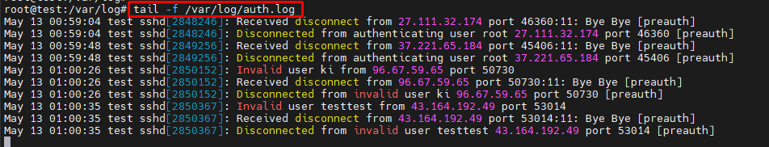
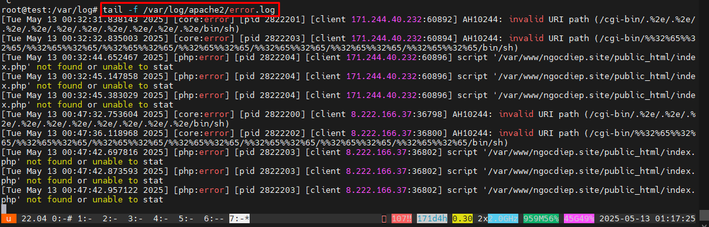

# Logs và Security cơ bản trên Linux
## 1. Các loại Logs quan trọng
- File log là một tập hợp các bản ghi mà Linux duy trì để các quản trị viên theo dõi các sự kiện quan trọng. Các file log này sẽ chứa các thông báo về máy chủ, bao gồm kernel, dịch vụ và ứng dụng đang chạy trên nó. File log cung cấp thời gian của các sự kiện cho hệ điều hành, ứng dụng và hệ thống Linux và là một công cụ quan trọng giúp chúng ta khắc phục sự cố
- Tất cả các hệ thống Linux đều tạo và lưu trữ các tệp nhật ký thông tin cho các quy trình khởi động, ứng dụng và các sự kiện khác. Các tệp này là một nguồn hữu ích để khắc phục sự cố hệ thống.
- Hầu hết các tệp nhật ký Linux được lưu trữ trong các tệp văn bản thuần túy (định dạng ASCII) trong thư mục /var/log và các thư mục con. Nhật ký được tạo bởi system daemon Linux, syslogd hoặc rsyslogd. Quản lý đúng các nhật ký này đảm bảo dữ liệu cần thiết luôn sẵn sàng để phân tích và kiểm tra.
- Phần lớn logs trong Linux được chia thành `4` loại:
	- Log hệ thống (System Logs)
	- Log sự kiện (Event Logs)
	- Log ứng dụng (Application Logs)
	- Log dịch vụ (Service Logs)
### 1.1. System logs
- Nhật ký hệ thống chủ yếu liên quan đến hoạt động của hệ thống Ubuntu, không nhất thiết liên quan đến các ứng dụng bổ sung do người dùng thêm vào. Ví dụ bao gồm cơ chế ủy quyền, daemon hệ thống, thông báo hệ thống và bản ghi hệ thống bao gồm tất cả, syslog.
- Các tệp hệ thống quan trọng có thể kể tên như: 
- Authorization Log (Nhật ký uỷ quyền): Nhật ký ủy quyền theo dõi việc sử dụng các hệ thống ủy quyền, các cơ chế ủy quyền cho người dùng yêu cầu nhập mật khẩu người dùng, chẳng hạn như hệ thống Pluggable Authentication Module(PAM), lệnh sudo, đăng nhập từ xa vào sshd, v.v. Có thể truy cập tệp Nhật ký ủy quyền tại /var/log/auth.log. Nhật ký này hữu ích để tìm hiểu về thông tin đăng nhập của người dùng và cách sử dụng lệnh sudo.

- Daemon Log (Nhật ký Daemon): Daemon là một chương trình chạy ở chế độ nền, thường không có sự can thiệp của con người, thực hiện một số thao tác quan trọng đối với việc chạy đúng của hệ thống. Nhật ký daemon lưu tại /var/log/daemon.log và chứa thông tin về các daemon hệ thống và ứng dụng đang chạy như daemon Gnome Display Manager gdm, daemon Bluetooth HCI hcid hoặc daemon cơ sở dữ liệu MySQL mysqld. Điều này có thể giúp khắc phục sự cố với một daemon cụ thể.
- Debug Log (Nhật ký gỡ lỗi): Nhật ký gỡ lỗi lưu tại `/var/log/debug` cung cấp các thông báo gỡ lỗi chi tiết từ hệ thống Ubuntu và các ứng dụng được ghi vào syslogd ở cấp độ DEBUG.
- Kernel Log (Nhật ký Kernel): Log này được lưu ở `/var/log/kern.log` chứa các thông báo từ kernel, bao gồm thông tin liên quan đến phần cứng và nhật ký mô-đun kernel.

- Kernel Ring Buffer Nhật ký này lưu ở `/var/log/dmesg` ghi nhật ký các thông báo từ kernel ring buffer, chủ yếu ghi lại thông tin về quá trình khởi động, phát hiện phần cứng và khởi tạo trình điều khiển.

- System log (Nhật ký hệ thống): Nhật ký hệ thống thường chứa nhiều thông tin nhất theo mặc định về hệ thống Ubuntu của bạn. Nó nằm tại /var/log/syslog và có thể chứa thông tin mà các nhật ký khác không có. Tham khảo Nhật ký hệ thống khi bạn không thể tìm thấy thông tin nhật ký mong muốn trong nhật ký khác. Nó cũng chứa mọi thứ từng có trong /var/log/messages.
/var/log/syslog và /var/log/messages ghi lại nhiều sự kiện hệ thống, bao gồm các thông báo chung của hệ thống, thông báo từ các dịch vụ hệ thống, lỗi ứng dụng và các sự kiện quan trọng khác.

### 1.2 Application Logs 
- Nhiều ứng dụng cũng tạo nhật ký trong /var/log. Nếu bạn liệt kê nội dung của thư mục con /var/log, bạn sẽ thấy những cái tên quen thuộc, chẳng hạn như /var/log/apache2 đại diện cho nhật ký của máy chủ web Apache 2 hoặc /var/log/samba, chứa nhật ký của máy chủ Samba. Phần này của hướng dẫn giới thiệu một số ví dụ cụ thể về nhật ký ứng dụng và thông tin có trong đó.
- Apache HTTP Server Logs (Nhật ký máy chủ HTTP Apache): 
	- Cài đặt mặc định cho Apache2 trên Ubuntu tạo một thư mục con lưu log ở `/var/log/apache2`. Trong thư mục con này có hai tệp nhật ký với hai mục đích riêng biệt:
	* /var/log/apache2/access.log - bản ghi của mọi trang được phục vụ và mọi tệp được máy chủ web tải.
	* /var/log/apache2/error.log - bản ghi của mọi điều kiện lỗi được máy chủ HTTP báo cáo
	- Theo mặc định, mỗi khi Apache truy cập một tệp hoặc trang, `access.log` sẽ ghi lại địa chỉ IP, thời gian và ngày tháng, chuỗi nhận dạng trình duyệt, mã kết quả HTTP và văn bản của truy vấn thực tế, thường là GET cho chế độ xem trang.

	- Ngoài ra, mỗi khi xảy ra bất kỳ lỗi nào, Apache sẽ thêm một dòng vào nhật ký lỗi `error.log`. Nếu bạn chạy PHP với thông báo lỗi và cảnh báo đã tắt, đây có thể là cách duy nhất để xác định lỗi.

CUPS Print System logs
- Hệ thống in Unix chung (CUPS) sử dụng tệp nhật ký mặc định `/var/log/cups/error_log` để lưu trữ thông tin và thông báo lỗi. 

Nhật ký Rootkit Hunter
Tiện ích Rootkit Hunter (rkhunter) kiểm tra hệ thống Ubuntu của bạn để tìm cửa hậu, trình đánh hơi và rootkit, tất cả đều là dấu hiệu xâm phạm hệ thống của bạn. Nhật ký rkhunter sử dụng nằm tại /var/log/rkhunter.log.

Nhật ký máy chủ Samba SMB
Máy chủ Giao thức khối tin nhắn máy chủ (SMB), Samba thường được sử dụng để chia sẻ tệp giữa máy tính Ubuntu của bạn và các máy tính khác hỗ trợ giao thức SMB. Samba lưu giữ ba loại nhật ký riêng biệt trong thư mục con /var/log/samba:

log.nmbd - các thông báo liên quan đến chức năng NETBIOS qua IP của Samba (các thông tin mạng)

log.smbd - các thông báo liên quan đến chức năng SMB/CIFS của Samba (các thông tin chia sẻ tệp và bản in)

log.[IP_ADDRESS] - các thông báo liên quan đến các yêu cầu dịch vụ từ địa chỉ IP có trong tên tệp nhật ký, ví dụ: log.192.168.1.1.

Nhật ký máy chủ X11
Máy chủ cửa sổ X11 mặc định được sử dụng với Ubuntu là máy chủ Xorg X11 và giả sử máy tính của bạn chỉ có một màn hình được xác định, máy chủ này sẽ lưu trữ các thông báo nhật ký trong tệp /var/log/Xorg.0.log. Nhật ký này hữu ích để chẩn đoán các sự cố với môi trường X11 của bạn.

/var/log/faillog records failed login attempts, providing information on the number of unsuccessful login attempts by user accounts.
/var/log/lastlog maintains a record of the last successful login for each user.
/var/log/boot.log stores all information related to booting operations.
/var/log/auth.log stores all authentication logs, including successful and failed attempts.
/var/log/cron logs activities related to cron jobs, i.e., scheduled tasks running at specified intervals.
/var/log/debug stores detailed messages related to debugging and helps troubleshoot specific system operations.
/var/log/yum.log is the yum command log. Records activities related to the Yum package manager.
Hệ thống logs:
Dịch vụ cụ thể:
Log đăng nhập:
Log reboot/shutdown:
2. Công cụ quản lý logs
journalctl
logrotate:
rsyslog/syslog-ng:
3. Security cơ bản trên Linux
Bảo mật đăng nhập:
Quản lý user và quyền:
Firewall (Tường lửa):
Cập nhật hệ thống:
Giám sát hệ thống:
4. Phân tích logs để phát hiện tấn công