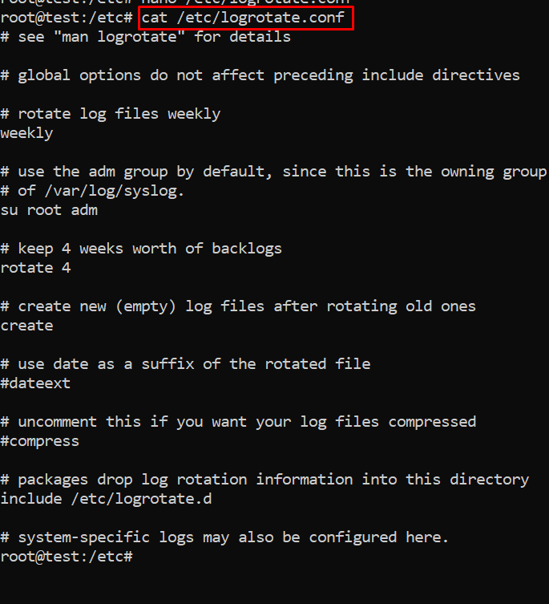

# Logs và Security cơ bản trên Linux
<!-- TOC start (generated with https://github.com/derlin/bitdowntoc) -->

- [Logs và Security cơ bản trên Linux](#logs-và-security-c-bn-trên-linux)
   * [1. Các loại Logs quan trọng](#1-các-loi-logs-quan-trng)
      + [1.1. System logs](#11-system-logs)
      + [1.2 Application Logs ](#12-application-logs)
      + [1.3 Non-Human-Readable Log](#13-non-human-readable-log)
      + [1.4 Kiểm tra log đăng nhập, reboot/shutdown ](#14-kim-tra-log-ng-nhp-rebootshutdown)
   * [2. Công cụ quản lý logs](#2-công-c-qun-lý-logs)
      + [2.1. journalctl](#21-journalctl)
         - [2.1.1. journalctl](#211-journalctl)
         - [2.1.2. Sử dụng journalctl để đọc và phân tích Systemd Logs](#212-s-dng-journalctl-c-và-phân-tích-systemd-logs)
      + [2.2.logrotate:](#22logrotate)
         - [2.2.1 Cài đặt ](#221-cài-t)
         - [2.2.2 Cấu hình](#222-cu-hình)
         - [2.2.3 Ví dụ ](#223-ví-d)
      + [2.3 syslog ](#23-syslog)
         - [2.3.1 Tổng quan](#231-tng-quan)
         - [2.3.2 Syslog message](#232-syslog-message)
         - [2.3.2 Hoạt động syslog ](#232-hot-ng-syslog)
      + [2.4.rsyslog](#24rsyslog)
         - [2.4.1 Tổng quan ](#241-tng-quan)
         - [2.4.2 Cấu hình](#242-cu-hình)
      + [2.5 syslog-ng](#25-syslog-ng)
         - [2.5.1 Tổng quan  ](#251-tng-quan)
         - [2.5.2 Cấu hình ](#252-cu-hình)
   * [3. Security cơ bản trên Linux](#3-security-c-bn-trên-linux)
      + [3.1. Bảo mật đăng nhập:](#31-bo-mt-ng-nhp)
      + [3.2. Quản lý user và quyền:](#32-qun-lý-user-và-quyn)
      + [3.3. Firewall (Tường lửa):](#33-firewall-tng-la)
      + [3.4. Cập nhật hệ thống:](#34-cp-nht-h-thng)
      + [3.5. Giám sát hệ thống:](#35-giám-sát-h-thng)
   * [4. Phân tích logs để phát hiện tấn công](#4-phân-tích-logs-phát-hin-tn-công)
      + [4.1 Tổng quan](#41-tng-quan)
      + [4.2 Phương pháp ](#42-phng-pháp)
      + [4.3 Các công cụ trong Linux hỗ trợ phân tích log ](#43-các-công-c-trong-linux-h-tr-phân-tích-log)
      + [4.4 Các công cụ giám sát và quản lý log mã nguồn mở](#44-các-công-c-giám-sát-và-qun-lý-log-mã-ngun-m)
   * [References](#references)

<!-- TOC end -->

<!-- TOC --><a name="logs-và-security-c-bn-trên-linux"></a>
# Logs và Security cơ bản trên Linux
<!-- TOC --><a name="1-các-loi-logs-quan-trng"></a>
## 1. Các loại Logs quan trọng
- File log là một tập hợp các bản ghi mà Linux duy trì để các quản trị viên theo dõi các sự kiện quan trọng. Các file log này sẽ chứa các thông báo về máy chủ, bao gồm kernel, dịch vụ và ứng dụng đang chạy trên nó. File log cung cấp thời gian của các sự kiện cho hệ điều hành, ứng dụng và hệ thống Linux và là một công cụ quan trọng giúp chúng ta khắc phục sự cố
- Tất cả các hệ thống Linux đều tạo và lưu trữ các tệp nhật ký thông tin cho các quy trình khởi động, ứng dụng và các sự kiện khác. Các tệp này là một nguồn hữu ích để khắc phục sự cố hệ thống.
- Hầu hết các tệp nhật ký Linux được lưu trữ trong các tệp văn bản thuần túy (định dạng ASCII) trong thư mục /var/log và các thư mục con. Nhật ký được tạo bởi system daemon Linux, syslogd hoặc rsyslogd. Quản lý đúng các nhật ký này đảm bảo dữ liệu cần thiết luôn sẵn sàng để phân tích và kiểm tra.
- Phần lớn logs trong Linux được chia thành `4` loại:
	- Log hệ thống (System Logs)
	- Log sự kiện (Event Logs)
	- Log ứng dụng (Application Logs)
	- Log dịch vụ (Service Logs)
<!-- TOC --><a name="11-system-logs"></a>
### 1.1. System logs
- Nhật ký hệ thống chủ yếu liên quan đến hoạt động của hệ thống Ubuntu, không nhất thiết liên quan đến các ứng dụng bổ sung do người dùng thêm vào. Ví dụ bao gồm cơ chế ủy quyền, daemon hệ thống, thông báo hệ thống và bản ghi hệ thống bao gồm tất cả, syslog.
- Các tệp hệ thống quan trọng có thể kể tên như: 
	- Authorization Log (Nhật ký uỷ quyền): Nhật ký ủy quyền theo dõi việc sử dụng các hệ thống ủy quyền, các cơ chế ủy quyền cho người dùng yêu cầu nhập mật khẩu người dùng, chẳng hạn như hệ thống Pluggable Authentication Module(PAM), lệnh sudo, đăng nhập từ xa vào sshd, v.v. Có thể truy cập tệp Nhật ký ủy quyền tại /var/log/auth.log. Nhật ký này hữu ích để tìm hiểu về thông tin đăng nhập của người dùng và cách sử dụng lệnh sudo.
	- 
	- Daemon Log (Nhật ký Daemon): Daemon là một chương trình chạy ở chế độ nền, thường không có sự can thiệp của con người, thực hiện một số thao tác quan trọng đối với việc chạy đúng của hệ thống. Nhật ký daemon lưu tại /var/log/daemon.log và chứa thông tin về các daemon hệ thống và ứng dụng đang chạy như daemon Gnome Display Manager gdm, daemon Bluetooth HCI hcid hoặc daemon cơ sở dữ liệu MySQL mysqld. Điều này có thể giúp khắc phục sự cố với một daemon cụ thể.
	- Debug Log (Nhật ký gỡ lỗi): Nhật ký gỡ lỗi lưu tại `/var/log/debug` cung cấp các thông báo gỡ lỗi chi tiết từ hệ thống Ubuntu và các ứng dụng được ghi vào syslogd ở cấp độ DEBUG.
	- Kernel Log (Nhật ký Kernel): Log này được lưu ở `/var/log/kern.log` chứa các thông báo từ kernel, bao gồm thông tin liên quan đến phần cứng và nhật ký mô-đun kernel.
	- 
	- Kernel Ring Buffer Nhật ký này lưu ở `/var/log/dmesg` ghi nhật ký các thông báo từ kernel ring buffer, chủ yếu ghi lại thông tin về quá trình khởi động, phát hiện phần cứng và khởi tạo trình điều khiển.
	- 
	- System log (Nhật ký hệ thống): Nhật ký hệ thống thường chứa nhiều thông tin nhất theo mặc định về hệ thống Ubuntu của bạn. Nó nằm tại /var/log/syslog và có thể chứa thông tin mà các nhật ký khác không có. Tham khảo Nhật ký hệ thống khi bạn không thể tìm thấy thông tin nhật ký mong muốn trong nhật ký khác. Nó cũng chứa mọi thứ từng có trong /var/log/messages.
	/var/log/syslog và /var/log/messages ghi lại nhiều sự kiện hệ thống, bao gồm các thông báo chung của hệ thống, thông báo từ các dịch vụ hệ thống, lỗi ứng dụng và các sự kiện quan trọng khác.
	- 

<!-- TOC --><a name="12-application-logs"></a>
### 1.2 Application Logs 
- Nhiều ứng dụng cũng tạo nhật ký trong /var/log. Nếu bạn liệt kê nội dung của thư mục con /var/log, bạn sẽ thấy những cái tên quen thuộc, chẳng hạn như /var/log/apache2 đại diện cho nhật ký của máy chủ web Apache 2 hoặc /var/log/samba, chứa nhật ký của máy chủ Samba. Phần này của hướng dẫn giới thiệu một số ví dụ cụ thể về nhật ký ứng dụng và thông tin có trong đó.
- Apache HTTP Server Logs (Nhật ký máy chủ HTTP Apache): 
	- Cài đặt mặc định cho Apache2 trên Ubuntu tạo một thư mục con lưu log ở `/var/log/apache2`. Trong thư mục con này có hai tệp nhật ký với hai mục đích riêng biệt:
	* /var/log/apache2/access.log - bản ghi của mọi trang được phục vụ và mọi tệp được máy chủ web tải.
	* /var/log/apache2/error.log - bản ghi của mọi điều kiện lỗi được máy chủ HTTP báo cáo
	- Theo mặc định, mỗi khi Apache truy cập một tệp hoặc trang, `access.log` sẽ ghi lại địa chỉ IP, thời gian và ngày tháng, chuỗi nhận dạng trình duyệt, mã kết quả HTTP và văn bản của truy vấn thực tế, thường là GET cho chế độ xem trang.

	- Ngoài ra, mỗi khi xảy ra bất kỳ lỗi nào, Apache sẽ thêm một dòng vào nhật ký lỗi `error.log`. Nếu bạn chạy PHP với thông báo lỗi và cảnh báo đã tắt, đây có thể là cách duy nhất để xác định lỗi.

- CUPS Print System logs: Hệ thống in Unix chung (CUPS) sử dụng tệp nhật ký mặc định `/var/log/cups/error_log` để lưu trữ thông tin và thông báo lỗi. 
- Rookit hunter log: Tiện ích Rootkit Hunter (rkhunter) kiểm tra hệ thống Ubuntu của bạn để tìm backdoors, sniffers và rootkit, tất cả đều là dấu hiệu xâm phạm hệ thống của bạn. Nhật ký rkhunter sử dụng nằm tại /var/log/rkhunter.log.
- Samba (SMB) Server Logs: Nhật ký máy chủ Samba SMB: Máy chủ Giao thức khối tin nhắn máy chủ (SMB), Samba thường được sử dụng để chia sẻ tệp giữa máy tính Ubuntu của bạn và các máy tính khác hỗ trợ giao thức SMB. Samba lưu giữ ba loại nhật ký riêng biệt trong thư mục con /var/log/samba:
	- log.nmbd - các thông báo liên quan đến chức năng NETBIOS qua IP của Samba (các thông tin mạng)
	- log.smbd - các thông báo liên quan đến chức năng SMB/CIFS của Samba (các thông tin chia sẻ tệp và bản in)
	- log.[IP_ADDRESS] - các thông báo liên quan đến các yêu cầu dịch vụ từ địa chỉ IP có trong tên tệp nhật ký, ví dụ: log.192.168.1.1.
- X11 Server Log : Máy chủ cửa sổ X11 mặc định được sử dụng với Ubuntu là máy chủ Xorg X11 và giả sử máy tính của bạn chỉ có một màn hình được xác định, máy chủ này sẽ lưu trữ các thông báo nhật ký trong tệp /var/log/Xorg.0.log. 
<!-- TOC --><a name="13-non-human-readable-log"></a>
### 1.3 Non-Human-Readable Log
- Một số tệp nhật ký được tìm thấy trong thư mục con `/var/log` được thiết kế để các ứng dụng có thể đọc được, không nhất thiết là con người. Một số ví dụ về các tệp nhật ký như vậy xuất hiện trong /var/log như sau.
- Login Failures Log Nhật ký lỗi đăng nhập: Nhật ký lỗi đăng nhập nằm tại /var/log/faillog thực sự được thiết kế để được phân tích cú pháp và hiển thị bởi lệnh faillog. 
- Last Logins Log Nhật ký đăng nhập cuối cùng tại /var/log/lastlog thường không nên được phân tích và kiểm tra bởi con người, mà nên được sử dụng kết hợp với lệnh lastlog
- Login Records Log: Tệp /var/log/wtmp chứa các bản ghi đăng nhập, nhưng không giống như /var/log/lastlog ở trên, /var/log/wtmp không được sử dụng để hiển thị danh sách các lần đăng nhập gần đây mà thay vào đó được các tiện ích khác như lệnh who sử dụng để hiển thị danh sách người dùng hiện đang đăng nhập. Lệnh này sẽ hiển thị những người dùng hiện đang đăng nhập vào máy của bạn:


<!-- TOC --><a name="14-kim-tra-log-ng-nhp-rebootshutdown"></a>
### 1.4 Kiểm tra log đăng nhập, reboot/shutdown 
- Auth Log ghi lại các nỗ lực xác thực đăng nhập trên hệ thống 

- Lệnh who trong Linux có thể hiển thị thông tin liên quan đến đăng nhập của người dùng như tên tài khoản người dùng, thiết bị đầu cuối của người dùng, thời gian đăng nhập của người dùng, tên máy chủ hoặc địa chỉ IP từ nơi người dùng đã đăng nhập.
```
who
```

- Lệnh `last` trong Linux có thể hiển thị danh sách các lần đăng nhập gần đây của người dùng, thời gian của chúng và thông tin khác được đọc từ tệp `/var/log/wtmp`.

- Thay vì chỉ định tên người dùng, có thể thay thế nó bằng tham số `reboot` để lấy thời gian và ngày khởi động lại lần cuối trong Linux.

- Lệnh journalctl trong Linux được sử dụng để truy vấn nhật ký hệ thống, có thể sử dụng lệnh này để hiển thị nhật ký hệ thống để biết thêm thông tin, chẳng hạn như số lần hệ thống đã được khởi động.
```
journalctl --list-boot
```


<!-- TOC --><a name="2-công-c-qun-lý-logs"></a>
## 2. Công cụ quản lý logs
<!-- TOC --><a name="21-journalctl"></a>
### 2.1. journalctl
<!-- TOC --><a name="211-journalctl"></a>
#### 2.1.1. journalctl
- journald – systemd journal daemon journalctl là một tiện ích mạnh mẽ để truy vấn và hiển thị nhật ký sự kiện hoặc tệp nhật ký trong Linux. Đây là thành phần trung tâm của bộ quản lý hệ thống và dịch vụ systemd, đi kèm với nhiều bản phân phối Linux như Ubuntu, Fedora và Arch Linux. Tên "journalctl" là sự kết hợp của "journal" (nhật ký) và "ctl" (điều khiển), ám chỉ thực tế là lệnh này được sử dụng để kiểm soát và phân tích nhật ký.
- File cấu hình của journald được lưu ở đường dẫn /etc/systemd/journald.conf. Nó rất nhiều tham số để cho chúng ta biết quá trình logging diễn ra như thế nào.
- journald lưu trữ các files log ở dạng mã nhị phân, nó được lưu trữ ở đường dẫn /var/log/journal.


<!-- TOC --><a name="212-s-dng-journalctl-c-và-phân-tích-systemd-logs"></a>
#### 2.1.2. Sử dụng journalctl để đọc và phân tích Systemd Logs
- Lệnh xem log cơ bản
```
journalctl
```

- Sử dụng `journald` theo múi giờ: Mặc định journalctl hiện thị log theo múi giờ hiện tại nhưng có thể yêu cầu chương trình hiển thị ở múi giờ khác vi dụ để xem ở múi giờ UTC
```
journalctl --utc
```

- Chỉ xem log errow, warnings: Logs mà hệ thống xuất ra có những mức ưu tiên khác nhau. Nhiều Logs chỉ là cảnh báo có thể không cần quan tâm, nhưng một số logs là mỗi nghiêm trọng. Sử dụng lệnh sau 
	```
	journalctl -p <code>
	```
	- Trong đó `<code>` gồm các options 
		- 0: emergency
		- 1: alerts
		- 2: critical
		- 3: errors
		- 4: warning
		- 5: notice
		- 6: info
		- 7: debug 

- Xem journal logs cho một thời gian, khoảng thời gian cụ thể: Có thể dùng tham số --since với các giá trị như “yesterday”, “today”, “tomorrow”, “now”. Hoặc với khoảng thời gian cụ thể theo định dạng “YYYY-MM-DD HH:MM:SS”
```
journalctl --since "2020-12-04 06:00:00"
journalctl --since "2020-12-03" --until "2020-12-05 03:00:00"
journalctl --since yesterday
journalctl --since 09:00 --until "1 hour ago"
```

- Xem journal logs về kernel
```
journalctl -k
```

- Xem journal logs của một Service, PID
```
journalctl -u apache2.service
```
- Xem journal logs của một user,group: Dùng câu lệnh `id -u` để tìm ID của user/group đó
	```
	id -u ubuntu
	```

	
	- Sau đó dùng tham số _UID cho User và _GID cho Group để xem
	```
	journalctl _UID=1001 --since today
	```

- Xem journal logs của một thực thi
```
journalctl /usr/bin/gnome-shell --since today
```

<!-- TOC --><a name="22logrotate"></a>
### 2.2.logrotate:
- LogRotate là một công cụ trên hệ điều hành Linux dùng để quản lý file log. Nó giúp xử lý và lưu trữ file log một cách tự động, giúp tránh file log quá lớn và gây tắc nghẽn hệ thống. LogRotate cung cấp một số tùy chọn cấu hình để quản lý file log như xóa các file log cũ, nén các file log đã quá hạn, xác định tần suất xử lý file log và kích thước tối đa của file log trước khi xử lý.
- Hoạt động của logrotate: Logrotate hoạt động theo lịch trình, thường là hàng ngày, thông qua các tập lệnh cron. Tập lệnh này thường nằm trong thư mục /etc/cron.daily/logrotate và có thể được điều chỉnh để chạy thường xuyên hơn nếu cần thiết. Khi Logrotate được kích hoạt, nó sẽ:
	- Đọc tập tin cấu hình: Logrotate đọc các tệp cấu hình để xác định vị trí và tên của các file log cần được xoay vòng, tần suất xoay vòng (hàng ngày, hàng tuần, hàng tháng), và số lượng file log đã lưu trữ.
	- Kiểm tra điều kiện: Nó sẽ kiểm tra các điều kiện như kích thước file log (nếu được cấu hình) hoặc thời gian để quyết định xem có cần thực hiện việc xoay vòng hay không. Nếu file log đạt đến kích thước tối đa hoặc thời gian quy định đã đến sẽ thực hiện rotate.
	- Thực hiện rotate: Khi điều kiện đáp ứng, Logrotate sẽ:
		* Di chuyển hoặc xóa file log cũ.
		* Tạo ra một file log mới để tiếp tục ghi nhận dữ liệu.
		* Nén file log cũ (thường sử dụng gzip) nếu được cấu hình.
	- Chạy các lệnh trước/sau khi rotate: Logrotate cho phép thực thi các lệnh shell trước hoặc sau khi quá trình xoay vòng hoàn tất, điều này hữu ích để khởi động lại dịch vụ mà không làm gián đoạn quá trình ghi log.
- Một số tính năng quan trọng của LogRotate
	* Tự động hóa quản lý log: LogRotate cho phép người dùng thiết lập các quy tắc để tự động xóa log cũ và tạo log mới, giúp tiết kiệm thời gian và công sức trong việc quản lý logs.
	* Sao lưu dữ liệu: Công cụ này hỗ trợ sao lưu các log quan trọng, đảm bảo rằng dữ liệu không bị mất mát trong quá trình quản lý.
	* Tùy biến linh hoạt: Người dùng có thể tùy chỉnh các quy tắc quản lý log theo nhu cầu riêng, bao gồm việc tạo thư mục lưu trữ cho logs, chỉnh sửa định dạng logs và thiết lập kích thước tối đa cho mỗi log.
	* Chạy tự động: LogRotate có thể được cấu hình để chạy tự động trong nền, giảm thiểu sự can thiệp của người dùng. Theo mặc định, nó sẽ chạy hàng ngày thông qua cron jobs.
	* Xoay vòng theo thời gian hoặc dung lượng: Bạn có thể cấu hình LogRotate để xoay vòng logs dựa trên thời gian (hàng ngày, hàng tuần, hàng tháng) hoặc dung lượng (ví dụ: khi file log đạt đến 50MB).
	* Nén file log: Sau khi xoay vòng, LogRotate có khả năng nén các file log cũ để tiết kiệm không gian lưu trữ. Tùy chọn nén có thể được điều chỉnh để sử dụng các phương pháp nén khác nhau như gzip hoặc bzip2.
	* Thực thi script sau khi xoay vòng: LogRotate cho phép chạy các script shell sau khi hoàn tất việc xoay vòng logs, giúp thực hiện các tác vụ bổ sung cần thiết.
	* Quản lý file log trống: Có các tùy chọn để xử lý file log trống, như không thực hiện xoay vòng nếu file đó không có dữ liệu (tùy chọn notifempty) hoặc bỏ qua thông báo lỗi nếu file log không tồn tại (tùy chọn missingok).
- Daemon Logrotate sử dụng các tệp cấu hình để chỉ định tất cả các chi tiết luân chuyển nhật ký cho một ứng dụng. Thiết lập mặc định bao gồm các khía cạnh sau:
	* /etc/logrotate.conf: đây là tệp cấu hình chính cho tiện ích Logrotate. Nó xác định các thiết lập chung và mặc định cho luân chuyển nhật ký được áp dụng cho tất cả các tệp nhật ký trừ khi bị ghi đè bởi các tệp cấu hình Logrotate riêng lẻ trong thư mục /etc/logrotate.d/.
	* /etc/logrotate.d: thư mục này bao gồm các tệp cấu hình chính sách luân chuyển nhật ký cụ thể cho các tệp nhật ký do từng ứng dụng hoặc dịch vụ tạo ra.
<!-- TOC --><a name="221-cài-t"></a>
#### 2.2.1 Cài đặt 
- Logrotate được cài đặt mặc định trên hầu hết các bản phân phối Linux. Có thể kiểm tra version bằng lệnh 
```
logrotate --version
```

<!-- TOC --><a name="222-cu-hình"></a>
#### 2.2.2 Cấu hình
- Tệp cấu hình chính của logrotate nằm ở `/etc/logrotate.conf` chứa thông tin thiết lập toàn bộ log files mà Logrotate quản lý, bao gồm chu kì lặp, dung lượng file log, nén file…


	- `weekly`: biểu thị tần suất luân chuyển nhật ký. Ngoài ra, bạn có thể chỉ định một khoảng thời gian khác (hàng giờ, hàng ngày, hàng tháng hoặc hàng năm). Vì tiện ích logrotate thường chạy một lần mỗi ngày, nên bạn có thể cần thay đổi cấu hình này nếu muốn tần suất luân chuyển ngắn hơn hàng ngày.
	- `su root adm`: luân chuyển nhật ký được thực hiện với người dùng gốc và nhóm quản trị. Bằng cách sử dụng chỉ thị này, bạn có thể đảm bảo rằng các tệp nhật ký đã luân chuyển thuộc sở hữu của một người dùng và nhóm cụ thể, điều này có thể hữu ích cho việc kiểm soát quyền truy cập và quản lý quyền. Điều này đặc biệt có liên quan khi các tệp nhật ký cần được truy cập hoặc quản lý bởi một người dùng hoặc nhóm cụ thể có các đặc quyền phù hợp.
	- `rotate 4`: các tệp nhật ký được luân chuyển bốn lần trước khi các tệp cũ bị xóa. Nếu rotate được đặt thành 0, thì các phiên bản cũ sẽ bị xóa ngay lập tức và không được luân chuyển. Nếu được đặt thành -1, các nhật ký cũ hơn sẽ không bị xóa trừ khi bị ảnh hưởng bởi maxage.
	- `create`: ngay sau khi xoay, tạo một tệp nhật ký mới có cùng tên với tệp vừa xoay.
	- `dateext`: nếu tùy chọn này được bật, các tệp nhật ký đã xoay sẽ được đổi tên bằng cách thêm ngày vào tên tệp, cho phép tổ chức và phân biệt tệp nhật ký tốt hơn dựa trên ngày xoay (đặc biệt là khi tần suất xoay là hàng ngày hoặc lớn hơn). Sơ đồ mặc định cho các tệp đã xoay là logname.1, logname.2, v.v., nhưng bật tùy chọn này sẽ thay đổi thành logname.YYYYMMDD. Bạn có thể thay đổi định dạng ngày thông qua các chỉ thị dateformat và dateyesterday.
	- `compress`: quy tắc này xác định xem có nên nén các tệp nhật ký cũ (sử dụng gzip theo mặc định) hay không. Nén nhật ký bị tắt theo mặc định nhưng bạn có thể bật nó để tiết kiệm dung lượng đĩa.
	- `include`: chỉ thị này được sử dụng để bao gồm các tệp cấu hình hoặc đoạn mã bổ sung. Nó cho phép bạn mô-đun hóa và sắp xếp cấu hình Logrotate của mình bằng cách chia thành nhiều tệp. Trong trường hợp này, các tệp trong thư mục /etc/logrotate.d đã được bao gồm trong cấu hình.
- Các tệp cấu hình ứng dụng cụ thể nằm ở `/etc/logrotate.d/`

- Ví dụ tệp cấu hình logrotate của mariadb
```
cat /etc/logrotate.d/mariadb
```

- Một số lựa chọn cấu hình phổ biến 
	- Lựa chọn Log file được rotate: Có thể chỉ định cụ thể một hay nhiều file log với đường dẫn tuyệt đối của file log đó, phân biệt danh sách các log file cụ thể bằng khoảng trắng. Ví dụ:
	```
	/home/*/logs/mysql*.log
	/home/*/logs/access.log /home/*/logs/error.log /home/*/logs/nginx_error.log
	```
	- Rotate theo thời gian: Có 4 giá trị cấu hình tương ứng với khoảng thời gian log file sẽ được rotate.
		* Daily: mỗi ngày
		* Weekly: mỗi đầu tuần
		* Monthly: mỗi đầu tháng
		* Yearly: mỗi năm
	- Rotate theo dung lượng file log: Có thể quy định tiến trình rotate dựa vào dung lượng file, ví dụ nếu file đó đạt dung lượng 100mb thì tiến hành rotate. Các đơn vị kích thước file có thể sử dụng là K, M, G.
	```
	size 100k
	size 100M
	size 100G
	```
	- Xử lý Log file trống 
		* Tham số `missingok`: nếu file log vì lý do gì đấy bị mất hoặc không tồn tại *.log thì logrotate sẽ tự động di chuyển tới phần cấu hình log của file log khác mà không cần phải xuất ra thông báo lỗi. Ngược lại sẽ là cấu hình nomissingok
		* Tham số `Notifempty`: không rotate log nếu file log này trống.
	- Rotate theo số lượng Log file: Quy định số lượng log file cũ đã được giữ lại sau khi rotate. Ví dụ: rotate7 giữ lại 7 file log cũ. Trường hợp đã có đủ 7 file log cũ thì file cũ nhất sẽ bị xóa đi để chứa file log mới được tạo.
	```
	rotate [number]
	```
	- Tự động nén Log file 
		* Tùy chọn `Compress`: Logrotate sẽ nén tất cả các file log lại sau khi đã được rotate, mặc định bằng gzip. Nếu bạn muốn sử dụng chương trình nén khác như bzip2, xz hoặc zip thì hãy đặt tên chương trình đó thành biến sau giá trị cấu hình Compresscmd xz
		* Tham số `Delaycompress` sẽ hữu dụng trong trường hợp bạn không muốn file log cũ phải nén ngay sau khi vừa được rotate. Thay vào đó, công việc nén sẽ được delay trễ hơn bằng việc sẽ nén file log cũ đó vào lần chạy rotate kế tiếp. Tùy chọn này chỉ hoạt động đi kèm chức năng compress trong file cấu hình, tức bạn phải cấu hình compress trước đó
	```
	compress
	delaycompress
	```
	- Phân quyền cho Log file:  có thể chỉ định khi logrotate xử lý xong file log cũ sẽ tạo ra file log mới có tên tương ứng để thay thế file log hiện tại. Cấu hình tham số create sẽ quy định việc file log mới tạo ra. Cần đảm bảo đúng phân quyền cho file log mới sau khi rotate.
		```
		create 660 ubuntu www-data
		```
		- Trong ví dụ File log mới sẽ có owner là ubuntu và thuộc group www-data (group mà Apache thường chạy)
	- Thực thi lệnh trước hoặc sau khi rotate: LogRotate có thể chạy các lệnh trước hay sau quá trình rotate. Điều này thường được áp dụng để khởi động lại dịch vụ sử dụng file log nhằm không làm gián đoạn quá trình ghi log.
		* Để chạy một số lệnh trước khi quá trình rotate bắt đầu, ta đặt lệnh thực thi nằm giữa prerotate và endscript. Ví dụ:	
		```
		Prerotate
		Touch /var/www/html/stop.txt
		Endscript
		```
- Có thể chạy LogRotate thủ công phục vụ quá trình kiểm tra có thể dùng lệnh:
	```
	logrotate -vf /etc/logrotate.d/sample
	```
	- Trong đó:
		* `-v` verbose hiển thị thêm thông tin so với thông thường, có ích khi bạn muốn dò lỗi logrotate
		* `-f` bắt buộc rotate ngay lập tức
<!-- TOC --><a name="223-ví-d"></a>
#### 2.2.3 Ví dụ 
- Cấu hình logrotate cho file log ví dụ `myapp.log`

- Nội dung 
	```
	/root/logrotate_demo/myapp.log {
		daily
		rotate 3
		compress
		dateext
		missingok
		notifempty
	}
	```
	- Trong đó 
		* `/root/logrotate_demo/myapp.log`: Chỉ định file log mà Logrotate sẽ quản lý.
		* `daily`: Chỉ định rằng file log sẽ được xoay vòng hàng ngày.
		* `rotate 3`: Chỉ định giữ lại tối đa 3 bản sao đã xoay vòng của file log. Các bản sao cũ hơn sẽ bị xóa.
		* `compress`: Chỉ định nén các bản sao đã xoay vòng bằng gzip.
		* `dateext`: Chỉ định thêm hậu tố ngày tháng vào tên của các file log đã xoay vòng (ví dụ: myapp.log-20250513).
		* `missingok`: Chỉ định rằng Logrotate không nên báo lỗi nếu file log bị thiếu.
		* `notifempty`: Chỉ định rằng file log sẽ không được xoay vòng nếu nó trống.
- Chạy thử ở chế độ debug 
```
sudo logrotate -d ~/logrotate_demo/myapp.conf
```

- Chạy Logrotate và kiểm tra kết quả file log cũ đã được nén. 


<!-- TOC --><a name="23-syslog"></a>
### 2.3 syslog 
<!-- TOC --><a name="231-tng-quan"></a>
#### 2.3.1 Tổng quan
- Syslog là viết tắt của System Logging Protocol (tạm dịch sang tiếng Việt là Giao thức ghi nhật ký hệ thống) là một giao thức client/server là giao thức dùng để chuyển log và thông điệp đến máy nhận log. Máy nhận log thường được gọi là syslogd, syslog daemon hoặc syslog server. Syslog có thể gửi qua UDP hoặc TCP. Các dữ liệu được gửi dạng cleartext. Syslog dùng port 514.
- Ngoài ra Syslog còn là một gói phần mềm trong hệ thống Linux nhằm để ghi bản tin log của hệ thống trong quá trình hoạt động như của kernel, deamon, cron, auth, hoặc các ứng dụng chạy trên hệ thống như http, dns, dhcp, ntp,..
- Syslog được phát triển năm 1980 bởi Eric Allman, nó là một phần của dự án Sendmail, và ban đầu chỉ được sử dụng duy nhất cho Sendmail. Nó đã thể hiện giá trị của mình và các ứng dụng khác cũng bắt đầu sử dụng nó. Syslog hiện nay trở thành giải pháp khai thác log tiêu chuẩn trên Unix-Linux cũng như trên hàng loạt các hệ điều hành khác và thường được tìm thấy trong các thiết bị mạng như router Trong năm 2009, Internet Engineering Task Forec (IETF) đưa ra chuẩn syslog trong RFC 5424.
- Syslog ban đầu sử dụng UDP, điều này là không đảm bảo cho việc truyền tin. Tuy nhiên sau đó IETF đã ban hành RFC 3195 (Đảm bảo tin cậy cho syslog) và RFC 6587 (Truyền tải thông báo syslog qua TCP). Điều này có nghĩa là ngoài UDP thì giờ đây syslog cũng đã sử dụng TCP để đảm bảo an toàn cho quá trình truyền tin.
<!-- TOC --><a name="232-syslog-message"></a>
#### 2.3.2 Syslog message
- Trong chuẩn syslog, mỗi thông báo đều được dán nhãn và được gán các mức độ nghiêm trọng khác nhau. Các loại phần mềm sau có thể sinh ra thông báo: auth, authPriv, daemon, cron, ftp, dhcp, kern, mail, syslog, user,… Với các mức độ nghiêm trọng từ cao nhất trở xuống Emergency, Alert, Critical, Error, Warning, Notice, Info, and Debug.
- Thông báo của giao thức Syslog bao gồm 3 phần,độ dài một thông báo không được vượt quá 1024 bytes: PRI (giá trị ưu tiên được tính toán), HEADER (với thông tin nhận dạng), và MSG (thông báo chính)

	* PRI : chi tiết các mức độ ưu tiên của tin nhắn (từ tin nhắn gỡ lỗi (debug) đến trường hợp khẩn cấp) cũng như các mức độ cơ sở (mail, auth, kernel).
		- là một số được đặt trong ngoặc nhọn, thể hiện cơ sở sinh ra log hoặc mức độ nghiêm trọng, là một số gồm 8 bit:
			- 3 bit đầu tiên thể hiện cho tính nghiêm trọng của thông báo.
			- 5 bit còn lại đại diện cho sơ sở sinh ra thông báo.
			- 
			- Ví dụ: Priority = 191 Lấy 191:8 = 23.875 -> Facility = 23 (“local 7”) -> Severity = 191 – (23 * 8 ) = 7 (debug)
	* Header: bao gồm hai trường là TIMESTAMP và HOSTNAME, tên máy chủ là tên máy gửi nhật ký.
		- TIMESTAMP : được định dạng trên định dạng của Mmm dd hh:mm:ss – Mmm, là ba chữ cái đầu tiên của tháng. Sau đó là thời gian mà thông báo được tạo ra giờ:phút:giây. Thời gian này được lấy từ thời gian hệ thống.Chú ý: nếu như thời gian của server và thời gian của client khác nhau thì thông báo ghi trên log được gửi lên server là thời gian của máy client
		- HOSTNAME (đôi khi có thể được phân giải thành địa chỉ IP). Nó thường được đưa ra khi bạn nhập lệnh tên máy chủ. Nếu không tìm thấy, nó sẽ được gán cả IPv4 hoặc IPv6 của máy chủ.
	* MSG: phần này chứa thông tin thực tế về sự kiện đã xảy ra. Nó cũng được chia thành trường TAG và trường CONTENT.
		- Tag field : là tên chương trình tạo ra thông báo
		- Content field : chứa các chi tiết của thông báo
- Cấp độ cơ sở Syslog (Syslog facility levels): được sử dụng để xác định chương trình hoặc một phần của hệ thống tạo ra các bản ghi.

- Mức độ cảnh báo của Syslog được sử dụng để mức độ nghiêm trọng của log event và chúng bao gồm từ gỡ lỗi (debug), thông báo thông tin (informational messages) đến mức khẩn cấp (emergency levels).

<!-- TOC --><a name="232-hot-ng-syslog"></a>
#### 2.3.2 Hoạt động syslog 
- Syslog Forwarding: bao gồm gửi log máy khách đến một máy chủ từ xa để chúng được tập trung hóa, giúp phân tích log dễ dàng hơn. Hầu hết thời gian, quản trị viên hệ thống không giám sát một máy duy nhất, nhưng họ phải giám sát hàng chục máy, tại chỗ và ngoài trang web. Kết quả là, việc gửi nhật ký đến một máy ở xa, được gọi là máy chủ ghi log tập trung, sử dụng các giao thức truyền thông khác nhau như UDP hoặc TCP.
- Syslog ban đầu sử dụng UDP, điều này là không đảm bảo cho việc truyền tin. Tuy nhiên sau đó IETF đã ban hành RFC 3195 (Đảm bảo tin cậy cho syslog) và RFC 6587 (Truyền tải thông báo syslog qua TCP). Điều này có nghĩa là ngoài UDP thì giờ đây syslog cũng đã sử dụng TCP để đảm bảo an toàn cho quá trình truyền tin.Syslog sử dụng port 514 cho UDP.
<!-- TOC --><a name="24rsyslog"></a>
### 2.4.rsyslog
<!-- TOC --><a name="241-tng-quan"></a>
#### 2.4.1 Tổng quan 
- Rsyslog – “The rocket-fast system for log processing” được bắt đầu phát triển từ năm 2004 bởi Rainer Gerhards rsyslog là một phần mềm mã nguồn mở sử dụng trên Linux dùng để chuyển tiếp các log message đến một địa chỉ trên mạng (log receiver, log server) Nó thực hiện giao thức syslog cơ bản, đặc biệt là sử dụng TCP cho việc truyền tải log từ client tới server. Hiện nay rsyslog là phần mềm được cài đặt sẵn trên hầu hết hệ thống Unix và các bản phân phối của Linux như : Fedora, openSUSE, Debian, Ubuntu, Red Hat Enterprise Linux, FreeBSD…
- Rsyslog là một sự phát triển của syslog, cung cấp các khả năng như các mô đun có thể cấu hình, được liên kết với nhiều mục tiêu khác nhau (ví dụ chuyển tiếp nhật ký Apache đến một máy chủ từ xa).Rsyslog cũng cung cấp tính năng lọc riêng cũng như tạo khuôn mẫu để định dạng dữ liệu sang định dạng tùy chỉnh.
- Mô hình Rsyslog bao gồm 4 thành phần chính:
	* Các file chứa các tệp cấu hình của Rsyslog
		- `/etc/rsyslog.conf`: Là file cấu hình
		- `/etc/rsyslog.d`: Dùng để chứa các tệp cấu hình bổ sung
	* Các file chứa các thư viện, module hỗ trợ cho Rsyslog. Các file cấu hình sẽ sử dụng các module này
		- `/usr/lib64/rsyslog/`
		- `/usr/share/doc/rsyslog`
	* Các file lưu giữ nội dung log được rsyslog chuyển đến
		- `/var/log`
	* Một vài file khác
- Rsyslog có thiết kế kiểu module cho phép chức năng được tải động. Trong Rsyslog có rất nhiều module nhưng các bạn có thể nhớ những module sau:
	* Input Modules: Xử lý việc thu thập log từ các nguồn khác nhau.
		* imuxsock.so: Thu thập log từ Unix socket.
		* imklog.so: Thu thập log từ Kernel.
		* imfile: Đọc log từ các tệp tin cụ thể.
		* imtcp, imudp: Thu thập log qua giao thức TCP hoặc UDP.
		* imrelp: Sử dụng RELP (Reliable Event Logging Protocol) để thu thập log.
	* Output Modules: Xử lý việc xuất log đến các đích khác nhau.
		* omfile.so: Xuất log ra file.
		* omstdout.so: Xuất log ra stdout.
		* omprog.so: Xuất log đến một chương trình khác.
		* omrelp.so: Xuất log qua RELP (Reliable Event Logging Protocol).
		* omudpspoof.so: Gửi log UDP với địa chỉ nguồn giả mạo.
	* Parser Modules: Giúp rsyslog hiểu các định dạng log cụ thể.
		* impstats.so: Thu thập thống kê về hoạt động của rsyslog.
		* imudp.so: Thu thập log qua giao thức UDP.
	* Queue Modules: Quản lý hàng đợi cho log, giúp đảm bảo log không bị mất khi máy chủ log không sẵn sàng.
		* omfile.so: Xuất log ra file với hỗ trợ hàng đợi.
	* Libraries: Các thư viện chung được sử dụng bởi các modules khác.
		* librelp.so: Thư viện RELP.
		* libgcry.so: Thư viện mã hóa.
		* libgpg-error.so: Thư viện xử lý lỗi mã hóa GPG.

<!-- TOC --><a name="242-cu-hình"></a>
#### 2.4.2 Cấu hình
- File cấu hình mặc định của rsyslog nằm ở `/etc/rsyslog.conf`

- Các file cấu hình riêng cho từng ứng dụng nằm trong `/etc/rsyslog.d`

- Ví dụ file cấu hình default

- Cấu hình trên được chia ra làm 2 trường:
	- Trường 1: Trường Seletor
		- Trường Seletor : Chỉ ra nguồn tạo ra log và mức cảnh bảo của log đó.
		- Trong trường seletor có 2 thành phần và được tách nhau bằng dấu “.“
	- Trường 2: Trường Action: là trường để chỉ ra nơi lưu log của tiến trình đó. Có 2 loại là lưu tại file trong localhost hoặc gửi đến IP của máy chủ Log
- Các dạng cấu hình 
	```
	mail.info         /var/log/maillog
	```
	- Khi đó lúc này bản tin log sẽ mail lại với mức cảnh báo từ info trở lên. Cụ thể là mức notice,warn,… nếu bạn chỉ muốn nó log lại mail với mức là info bạn phải sử dụng như sau:`mail.=info /var/log/maillog`
	```
	mail.*
	```
	- Lúc này kí tự `*` đại diên cho các mức cảnh báo. Lúc này nó sẽ lưu hết các level của mail vào trong thư mục. Tượng tự khi đặt `*.` thì lúc này nó sẽ log lại tất cả các tiến trình của hệ thống vào một file. Nếu bạn muốn log lại tiến trình của mail ngoại trừ mức info bạn có thể dùng kí tự `!` `mail.!info`
	```
	*.info;mail.none;authpriv.none;cron.none /var/log/messages
	```
	- Lúc này tất các log từ info của tiến trình hệ thống sẽ được lưu vào trong file log messages nhưng đối với các log của mail, authpriv và cron sẽ không lưu vào trong messages.

<!-- TOC --><a name="25-syslog-ng"></a>
### 2.5 syslog-ng
<!-- TOC --><a name="251-tng-quan"></a>
#### 2.5.1 Tổng quan  
- Syslog-ng là một daemon syslog mạnh mẽ khác, cung cấp nhiều tính năng mở rộng như lưu trữ log vào cơ sở dữ liệu, lọc và chuyển đổi log, và gửi log qua các kết nối bảo mật. Syslog-ng được thiết kế để xử lý một lượng lớn log với hiệu suất cao.
- Là ứng dụng ghi nhật ký hệ thống linh hoạt và có khả năng mở rộng cao, lý tưởng để tạo các giải pháp ghi nhật ký tập trung và đáng tin cậy.
- Syslog-ng có thể 
	* Chuyển nhật ký an toàn và đáng tin cậy
	* Ghi nhật ký an toàn bằng TLS
	* Trích xuất và xử lý dữ liệu linh hoạt
	* Lọc và phân loại
	* Phân tích cú pháp và viết lại
	* Hỗ trợ hàng đợi tin nhắn
	* SQL, NoSQL và giám sát
	* Hỗ trợ giao thức và nền tảng rộng
	* Tiêu chuẩn giao thức syslog
	* Hỗ trợ IPv4 và IPv6
- Kiến trúc cơ bản của Syslog-ng: Syslog-ng hoạt động theo mô hình pipeline, trong đó các thông điệp nhật ký đi qua các giai đoạn xử lý khác nhau:
	* Nguồn (Sources): Định nghĩa nơi Syslog-ng sẽ nhận nhật ký từ đâu.
	* Bộ lọc (Filters): Xác định các điều kiện để chọn lọc các thông điệp nhật ký cụ thể.
	* Đích (Destinations): Chỉ định nơi các thông điệp nhật ký đã được xử lý sẽ được gửi đến.
	* Nhật ký (Logs): Kết nối các nguồn, bộ lọc và đích lại với nhau, xác định luồng xử lý nhật ký.
<!-- TOC --><a name="252-cu-hình"></a>
#### 2.5.2 Cấu hình 
- Tệp cấu hình của sys-ng thường nằm trong `/etc/syslog-ng/syslog-ng.conf`

- Ví dụ file cấu hình cơ bản thu thập các thông điệp nội bộ của syslog-ng OSE và các thông điệp từ /dev/log vào tệp /var/log/messages_syslog-ng.log.
```
@version: 3.38

source s_local {
    unix-dgram("/dev/log"); internal();
};

destination d_file {
    file("/var/log/messages_syslog-ng.log");
};

log {
    source(s_local); destination(d_file);
};
```
- Cấu hình syslog-ng tuân theo mô hình pipeline. Có nhiều khối xây dựng khác nhau: nguồn, đích, bộ lọc, trình phân tích cú pháp, v.v. Các khối xây dựng này được kết nối thành pipeline bằng các câu lệnh "log" trong cấu hình. Bạn có thể có nhiều pipeline và sử dụng cùng một khối xây dựng trong nhiều câu lệnh log.
- Source : Nguồn là tập hợp một hoặc nhiều trình điều khiển nguồn. Nó bao gồm hai phần. Nó bắt đầu bằng từ “source”, theo sau là một mã định danh nguồn mà bạn sẽ sử dụng sau này để tham chiếu đến nguồn đã cho. Sau đó, nó liệt kê các trình điều khiển nguồn và các tham số của chúng. Sau đây là một ví dụ về định nghĩa nguồn. Cú pháp của nó trông như thế này:
	```
	source <identifier> {
		source-driver(parameters);
		source-driver(parameters);
		...
	};
	```
	- Ví dụ 1 source
	```
	source s_file {
		file("/path/to/the/file.log");
	};
	```
	- Ví dụ multiple source 
	```
	source s_local {
		internal();
		file("/path/to/the/first/file.log");
		file("/path/to/the/next/file.log");
		system();
	};
	```
	- Source drivers: 
		* internal(): Thu thập các thông báo nội bộ của syslog-ng. Bạn nên thu thập những thông báo này để có thể kiểm tra xem syslog-ng có hoạt động bình thường hay có bất kỳ vấn đề lớn nào không.
		* unix-stream(), unix-dgram(), pipe(): Thu thập thông điệp nhật ký từ các socket miền Unix và các pipes.
		* file(): Đọc log từ tệp 
		* network(): Đọc các nguồn nhật ký cũ (RFC 3164).
		* syslog(): Đọc các nhật ký syslog mới (RFC 5424) qua mạng.
		* sun-stream(): Đọc các luồng trên Sun Solaris.
		* program(): Chạy chương trình và đọc đầu ra tiêu chuẩn.
		* python(): Cho phép chạy code điều khiển tuỳ biến bằng python.
	- system() source: cho phép bạn thu thập các thông báo nhật ký cục bộ dành riêng cho hệ thống của máy chủ. Tất nhiên, điều này chỉ hoạt động trên các hệ điều hành và môi trường được các nhà phát triển và cộng tác viên syslog-ng sử dụng. .Nó cung cấp khả năng chuyển đổi dễ dàng từ /dev/log sang systemd-journal (do đó không cần phải chỉnh sửa cấu hình), tự động phân tích một số thông báo nhật ký đến (chẳng hạn như nhật ký sudo).
- Destination : là một tập hợp một hoặc nhiều trình điều khiển đích. Nó bao gồm hai phần. Nó bắt đầu bằng từ “destination”, theo sau là một định danh cho đích mà bạn sẽ sử dụng sau đó để tham chiếu đến đích đã cho. Sau đó, nó liệt kê các trình điều khiển đích cùng với các tham số của chúng. Cú pháp của nó trông như thế này:
	```
	destination <identifier> {
	  destination-driver(parameters);
	  destination-driver(parameters);
	  ...
	};
	```
	- Ví dụ cấu hình 
	```
	destination d_file {
	  file("/var/log/syslog");
	};
	```
	- Destination drivers:
		* file(): Ghi thông báo nhật ký vào một tệp.
		* pipe(), unix-stream() và unix-dgram(): Ghi thông báo nhật ký vào một đường ống hoặc ổ cắm.
		* network: Gửi thông báo cũ (RFC 3164) qua mạng.
		* syslog(): Gửi thông báo syslog mới (RFC 5424) qua mạng.
		* usertty(): Ghi vào thiết bị đầu cuối của người dùng đã đăng nhập. Hãy đảm bảo sử dụng cẩn thận vì nó có thể làm chậm syslog-ng đáng kể!
		* program(): Ghi vào đầu vào chuẩn của chương trình.
		* http(): Gửi thông báo nhật ký tới HTTP, như Elasticsearch, Slack, Sumologic và các chương trình khác.
		* python(): Cho phép bạn viết trình điều khiển đích của riêng mình trong Python.
- Filter :là biểu thức để chọn hoặc nói cách khác là lọc các thông báo nhật ký. Chúng đảm bảo rằng các thông báo đúng sẽ đến đúng đích. Ví dụ: bạn có thể sử dụng bộ lọc để loại bỏ các thông báo nhật ký cấp gỡ lỗi hoặc đảm bảo rằng tất cả các thông báo liên quan đến xác thực đều được định tuyến đến hệ thống SIEM của bạn. Bộ lọc được định nghĩa là tập hợp một hoặc nhiều hàm lọc. Nó bao gồm hai phần. Nó bắt đầu bằng từ "bộ lọc", theo sau là một mã định danh cho bộ lọc mà bạn sẽ sử dụng sau để tham chiếu đến bộ lọc đã cho. Sau đó, nó liệt kê các hàm lọc cùng với các tham số của chúng. Bạn có thể kết hợp nhiều hàm lọc bằng toán tử boolean. Cú pháp của nó trông như thế này:
	- Ví dụ cấu hình 
	```
	filter name { filterfunction(); };
	filter f_default { level(info..emerg) and not (facility(mail)); };
	```
	- Các filter phổ biến 
		* level: bộ lọc theo mức độ nghiêm trọng - tầm quan trọng của thông báo nhật ký
		* facility: bộ lọc theo facility - danh mục chính của thông báo nhật ký
		* host: bộ lọc dựa trên tên máy chủ
		* program: bộ lọc dựa trên tên ứng dụng
		* match: bộ lọc nội dung thông báo bằng biểu thức chính quy
		* netmask: bộ lọc theo IP người gửi hoặc mạng con
		* filter: sử dụng bộ lọc khác

- Log : Kết nối các khối trong sys-ng, qua đó xác định tuyến đường của các thông báo nhật ký đến. Nó có thể chứa các nguồn, đích, bộ lọc, cờ và các đối tượng khác. Nó tham chiếu đến các khối xây dựng khác nhau theo tên của chúng (mã định danh).
	```
	log {
	  source(s_id1); source (s_id2);...
	  filter(f_id1); filter(f_id2);...
	  destination(d_id1); destination(d_id2);...
	  flags(flag1[,flag2...]);
	};
	```
	- Ví dụ 
	```
	log {
	  source(s_id1);
	  destination(d_id1);
	};
	```
- Syntax check (Kiểm tra cú pháp):  Sử dụng -s, bạn có thể kiểm tra xem cấu hình syslog-ng của mình có đúng về mặt cú pháp hay không. Do đó, nó chỉ có thể phát hiện ra các vấn đề về cú pháp chứ không phải lỗi đánh máy, nghĩa là cấu hình syslog-ng của bạn vẫn có thể bị lỗi khi bắt đầu nếu bạn, ví dụ, viết sai tên nguồn. Tuy nhiên, theo nguyên tắc chung, không có đầu ra cho -s nghĩa là không có vấn đề gì.
	- Ví dụ kiểm tra cú pháp với file cấu hình `/etc/syslog-ng/first.conf`
	```
	syslog-ng -s -f /etc/syslog-ng/first.conf
	```
	
- Syslog-ng Network Logging  
	- Khi nói đến việc thu thập thông báo nhật ký qua mạng, syslog-ng có ba chế độ hoạt động:
		* Chế độ máy khách: syslog-ng thu thập nhật ký từ máy khách và gửi trực tiếp đến máy chủ trung tâm hoặc thông qua một relay.
		* Chế độ relay: syslog-ng thu thập nhật ký từ máy khách qua mạng và gửi trực tiếp đến máy chủ trung tâm hoặc thông qua một relay khác.
		* Chế độ máy chủ: syslog-ng thu thập nhật ký từ máy khách và/hoặc relay và lưu trữ chúng cục bộ hoặc trong trình điều khiển đích không phải syslog.
	- Tất nhiên, trong thế giới thực, các chế độ này không được tách biệt chặt chẽ như vậy. Một số relays có thể vừa lưu trữ vừa chuyển tiếp thông báo nhật ký.
	- Ví dụ về cấu hình 
	```
	@version:3.38
	source s_tcp { tcp(port(514)); };
	destination d_file { file("/var/log/fromnet"); };
	log { source(s_tcp); destination(d_file); };
	````
<!-- TOC --><a name="3-security-c-bn-trên-linux"></a>
## 3. Security cơ bản trên Linux
<!-- TOC --><a name="31-bo-mt-ng-nhp"></a>
### 3.1. Bảo mật đăng nhập:
- Sử dụng mật khẩu mạnh 
- Vô hiệu hoá đăng nhập root trực tiếp qua SSH 
- Sử dụng SSH key-based Authentication
	* Khuyến khích người dùng sử dụng khóa SSH để xác thực thay vì mật khẩu.
	* Tắt xác thực mật khẩu cho SSH: Chỉnh sửa tệp /etc/ssh/sshd_config và sửa phần `PasswordAuthentication` thành `no`.

	* Thay đổi cổng SSH mặc định: Chỉnh sửa `Port` trong tệp `/etc/ssh/sshd_config` và chọn một cổng tùy chỉnh (ví dụ: 2222).
	* Vô hiệu hóa Đăng nhập Root: Đặt `PermitRootLogin` trong tệp `/etc/ssh/sshd_config`
	* Tắt mật khẩu trống: Đặt `PermitEmptyPasswords no` rong tệp `/etc/ssh/sshd_config`
<!-- TOC --><a name="32-qun-lý-user-và-quyn"></a>
### 3.2. Quản lý user và quyền:
- Quy tắc truy cập tối thiểu
- Nguyên tắc đặc quyền tối thiểu (PoLP) là một vấn đề lớn trong bảo mật Linux. Rất đơn giản: chỉ cấp cho người dùng quyền truy cập mà họ cần để thực hiện công việc của mình. Không gì hơn. 
- Thiết lập quyền mặc định
- Nhập `umask`. Lệnh này thiết lập quyền tệp mặc định. Sau đây là cách hoạt động:
	* Các tệp thường bắt đầu ở 666 (rw-rw-rw-)
	* Các thư mục bắt đầu ở 777 (rwxrwxrwx)
	* Giá trị umask được trừ khỏi các giá trị này
	- Umask này (027) cân bằng giữa bảo mật và khả năng sử dụng:
		* Các thư mục: 750 (rwxr-x---)
		* Các tệp: 640 (rw-r-----)
- Quyền nhóm lập kế hoạch: Việc lập kế hoạch quyền nhóm tốt sẽ giúp hệ thống Linux của bạn an toàn và hiệu quả. Đây là cách thực hiện:
	* Nhóm người dùng theo logic (như nhà phát triển, tiếp thị, nhân sự).
	* Sử dụng Kiểm soát truy cập dựa trên vai trò (RBAC). Chỉ định quyền cho các vai trò, không phải người dùng riêng lẻ.
	* Kiểm tra thường xuyên tư cách thành viên nhóm. Xóa những người dùng không cần quyền truy cập nữa.
	* Không sử dụng tài khoản gốc. Thay vào đó, hãy sử dụng sudo để hạn chế quyền truy cập của quản trị viên.
- Sử dụng ACL: Danh sách kiểm soát truy cập (ACL) cung cấp cho bạn nhiều quyền kiểm soát hơn so với các quyền Linux tiêu chuẩn. Chúng cho phép bạn đặt quyền cho nhiều người dùng và nhóm trên một tệp hoặc thư mục duy nhất. 
	* Để xem ACL trên một tệp:
	```
	getfacl filename
	```
	* Để đặt ACL:
	```
	setfacl -m u:username:rwx filename
	```

	
<!-- TOC --><a name="33-firewall-tng-la"></a>
### 3.3. Firewall (Tường lửa):
- Bảo mật hệ thống Linux bằng tường lửa liên quan đến việc cấu hình và quản lý các quy tắc tường lửa để kiểm soát lưu lượng mạng đến và đi. Các bản phân phối Linux thường đi kèm với các công cụ tường lửa và một trong những công cụ thường được sử dụng là iptables cho IPv4 hoặc nftables, đây là công cụ kế thừa iptables. Ngoài ra, một số bản phân phối có thể sử dụng các công cụ cấp cao hơn như ufw (Uncomplicated Firewall) hoặc firewalld.
- Theo mặc định, lưu lượng đến có thể bị từ chối, trong khi lưu lượng đi thường được phép.
- Chọn một công cụ tường lửa dựa trên bản phân phối và sở thích cá nhân của bạn. Các công cụ phổ biến bao gồm iptables, nftables, ufw và firewalld.
- Tường lửa là thành phần cơ bản của bảo mật Linux, cung cấp rào cản chống lại truy cập trái phép và các mối đe dọa bảo mật tiềm ẩn. Việc thường xuyên xem xét và cập nhật các quy tắc tường lửa là điều cần thiết để thích ứng với các yêu cầu bảo mật đang thay đổi và giảm thiểu rủi ro.
- Kiểm tra trạng thái firewall 
```
sudo iptables -L
```

- Chỉ cho phép các dịch vụ cần thiết
```
sudo iptables -A INPUT -p tcp --dport 22 -j ACCEPT
```
- Từ chối các dịch vụ không sử dụng hoặc không cần thiết: 
```
sudo iptables -A INPUT -j DROP
```

<!-- TOC --><a name="34-cp-nht-h-thng"></a>
### 3.4. Cập nhật hệ thống:
- Thường xuyên cập nhập phần mềm: Các bản cập nhật phần mềm thường chứa các bản vá bảo mật quan trọng. Đảm bảo hệ thống được cập nhật thường xuyên bằng các sử dụng lệnh 
	* Trên Debian 
	```
	sudo apt update && apt upgrade -y 
	```
	* Trên Redhat, Fedora, CentOS
	```
	sudo yum update 
	```
<!-- TOC --><a name="35-giám-sát-h-thng"></a>
### 3.5. Giám sát hệ thống:
- Kiểm tra nhật ký thường xuyên để bảo mật và phân tích hệ thống. Để tăng cường bảo mật, hãy cân nhắc di chuyển nhật ký đến máy chủ nhật ký chuyên dụng, có thể ngăn chặn kẻ xâm nhập dễ dàng thao túng nhật ký cục bộ. Sau đây là một số tệp nhật ký mặc định phổ biến trong Linux và mục đích của chúng:
	* `/var/log/messages`: Bao gồm nhật ký hoạt động hiện tại và toàn bộ hệ thống.
	* `/var/log/auth.log`: Ghi lại các sự kiện liên quan đến xác thực.
	* `/var/log/kern.log`: Lưu trữ nhật ký liên quan đến hạt nhân.
	* `/var/log/cron.log`: Bao gồm nhật ký cho các tác vụ cron.
	* `/var/log/maillog`: Lưu trữ nhật ký cho máy chủ thư.
	* `/var/log/boot.log`: Ghi lại các hoạt động khởi động hệ thống.
	* `/var/log/mysqld.log`: Tệp nhật ký máy chủ cơ sở dữ liệu MySQL.
	* `/var/log/secure`: Ghi lại thông tin liên quan đến xác thực.
	* `/var/log/utmp` hoặc `/var/log/wtmp`: Lưu trữ hồ sơ đăng nhập.
	* `/var/log/yum.log`: Tệp nhật ký trình quản lý gói Yum.
- Sử dụng các công cụ giám sát hệ thống: các lệnh giúp giám sát, theo dõi hệ thống như 
```
top
htop
vmstat
netstat 
ss
```
- Cài đặt các công cụ phát hiện xâm nhập (IDS) và ngăn chặn xâm nhập (IPS): Các công cụ như Snort, Suricata, Splunk,...

<!-- TOC --><a name="4-phân-tích-logs-phát-hin-tn-công"></a>
## 4. Phân tích logs để phát hiện tấn công
<!-- TOC --><a name="41-tng-quan"></a>
### 4.1 Tổng quan
- Phân tích nhật ký là quá trình thu thập, tập trung và phân tích dữ liệu nhật ký do các hệ thống, ứng dụng và thiết bị tạo ra. Nhật ký là bản ghi các sự kiện, lỗi hoặc hoạt động bất thường diễn ra trong cơ sở hạ tầng CNTT, có thể là máy chủ tại chỗ, máy ảo đám mây hoặc dịch vụ siêu nhỏ được chứa trong container. Với các quy tắc lọc, phân tích và tương quan, các nhà phân tích có thể tìm ra các mẫu, khám phá nguyên nhân gốc rễ của tình trạng tắc nghẽn hiệu suất và tìm ra các bất thường về bảo mật. Đây không chỉ là quản lý nhật ký, vì nó bổ sung thêm trí thông minh nhận biết ngữ cảnh, chức năng tìm kiếm và trực quan hóa.
- Là kỹ năng quan trọng để phát hiện các hành động đáng ngờ trong các cuộc tấn công vào hệ thống
- Việc phân tích những dấu vết này một cách cẩn thận có thể giúp bạn:
	* Phát hiện sớm các dấu hiệu tấn công: Ví dụ, nhiều lần đăng nhập thất bại từ một địa chỉ IP có thể là dấu hiệu của một cuộc tấn công brute-force.
	* Ứng phó sự cố hiệu quả: Khi một sự cố an ninh xảy ra, logs cung cấp thông tin quan trọng về cách kẻ tấn công xâm nhập, những gì chúng đã làm và thời điểm xảy ra. Điều này giúp định hướng các nỗ lực ứng phó và ngăn chặn các sự cố tương tự trong tương lai.
	* Nâng cao khả năng phòng thủ: Bằng cách phân tích các mẫu tấn công đã xảy ra, bạn có thể xác định các lỗ hổng bảo mật và thực hiện các biện pháp phòng ngừa chủ động.
	* Đảm bảo tuân thủ: Phân tích logs có thể giúp chứng minh sự tuân thủ các tiêu chuẩn và quy định bảo mật.
- Quy trình phân tích logs điển hình:
	* Thu thập dữ liệu (Data Collection): Thu thập logs từ các hệ thống, ứng dụng và thiết bị mạng liên quan.
	* Lập chỉ mục dữ liệu (Data Indexing): Tổ chức và lập chỉ mục dữ liệu log để dễ dàng tìm kiếm và phân tích.
	* Phân tích (Analysis): Tiến hành phân tích dữ liệu log bằng các kỹ thuật và phương pháp phù hợp để tìm kiếm các dấu hiệu tấn công.
	* Giám sát (Monitoring): Theo dõi liên tục logs để phát hiện các hoạt động đáng ngờ trong thời gian thực.
	* Báo cáo (Reporting): Tạo báo cáo về các phát hiện, bao gồm các sự cố an ninh tiềm ẩn hoặc đã xảy ra.
- Các nguồn logs có khả năng chứa thông tin về các cuộc tấn công tiềm ẩn. Một số nguồn logs quan trọng bao gồm:
* Logs hệ thống (System Logs): Ghi lại các sự kiện liên quan đến hoạt động của hệ điều hành, bao gồm đăng nhập, đăng xuất, lỗi hệ thống, khởi động và tắt máy, v.v. (ví dụ: /var/log/auth.log, /var/log/syslog, Event Viewer trên Windows).
* Logs ứng dụng (Application Logs): Ghi lại các sự kiện cụ thể của từng ứng dụng, bao gồm lỗi ứng dụng, truy cập dữ liệu, hoạt động của người dùng, v.v. (ví dụ: logs của web server, database server, mail server).
* Logs máy chủ web (Web Server Logs): Ghi lại các yêu cầu HTTP/HTTPS đến máy chủ web, bao gồm địa chỉ IP nguồn, URL được truy cập, mã trạng thái, tác nhân người dùng, v.v. (ví dụ: Access Logs, Error Logs của Apache, Nginx).
* Logs tường lửa (Firewall Logs): Ghi lại các kết nối mạng bị chặn hoặc cho phép, bao gồm địa chỉ IP nguồn và đích, cổng, giao thức, và trạng thái kết nối.
* Logs hệ thống phát hiện xâm nhập (Intrusion Detection/Prevention System - IDS/IPS Logs): Ghi lại các hoạt động đáng ngờ hoặc các mẫu tấn công đã được phát hiện.
* Logs máy chủ proxy (Proxy Server Logs): Ghi lại các yêu cầu web của người dùng thông qua máy chủ proxy.
* Logs máy chủ DNS (DNS Server Logs): Ghi lại các truy vấn DNS.
* Logs kiểm soát truy cập (Access Control Logs): Ghi lại các nỗ lực truy cập tài nguyên, bao gồm xác thực và ủy quyền.
<!-- TOC --><a name="42-phng-pháp"></a>
### 4.2 Phương pháp 
- Với lượng dữ liệu khổng lồ được tạo ra trong thế giới kỹ thuật số ngày nay, các chuyên gia CNTT không thể quản lý và phân tích nhật ký theo cách thủ công trên một môi trường công nghệ rộng lớn. Do đó, họ cần một hệ thống quản lý nhật ký tiên tiến và các kỹ thuật tự động hóa các khía cạnh chính của quy trình thu thập, định dạng và phân tích dữ liệu.
- Các kỹ thuật này bao gồm:
	* Chuẩn hóa: là một kỹ thuật quản lý dữ liệu đảm bảo tất cả dữ liệu và thuộc tính, chẳng hạn như địa chỉ IP và dấu thời gian, trong nhật ký giao dịch được định dạng theo cách nhất quán.
	* Nhận dạng mẫu: đề cập đến việc lọc các sự kiện dựa trên sổ mẫu để phân biệt các sự kiện thường lệ với các sự kiện bất thường.
	* Phân loại và gắn thẻ: là quá trình gắn thẻ các sự kiện bằng từ khóa và phân loại chúng theo nhóm để có thể xem xét các sự kiện tương tự hoặc có liên quan với nhau.
	* Phân tích tương quan: là một kỹ thuật thu thập dữ liệu nhật ký từ nhiều nguồn khác nhau và xem xét thông tin như một tổng thể bằng cách sử dụng phân tích nhật ký.
- Khi phân tích logs, thực hiệm tìm kiếm các dấu hiệu cụ thể liên quan đến các loại tấn công phổ biến:
	* Brute-force attacks: Nhiều nỗ lực đăng nhập thất bại liên tiếp từ cùng một địa chỉ IP hoặc một số lượng lớn địa chỉ IP khác nhau.
	* SQL Injection: Các yêu cầu HTTP/HTTPS chứa các ký tự đặc biệt hoặc các câu lệnh SQL đáng ngờ (ví dụ: '; DROP TABLE, UNION SELECT).
	* Cross-Site Scripting (XSS): Các yêu cầu HTTP/HTTPS chứa các đoạn mã JavaScript đáng ngờ (<script>, onerror, alert).
	* Directory Traversal: Các yêu cầu HTTP/HTTPS cố gắng truy cập các tệp hoặc thư mục bên ngoài thư mục gốc của ứng dụng web (ví dụ: ../../../../).
	* Denial of Service (DoS) / Distributed Denial of Service (DDoS): Số lượng lớn các yêu cầu đến một dịch vụ từ một hoặc nhiều nguồn, dẫn đến quá tải tài nguyên và làm gián đoạn dịch vụ.
	* Malware activity: Các kết nối đến các địa chỉ IP hoặc tên miền độc hại đã biết, các quy trình bất thường, hoặc các thay đổi bất thường trong hệ thống tệp.
	* Privilege Escalation: Các hành động của người dùng thường không có quyền thực hiện, hoặc các nỗ lực khai thác lỗ hổng để có được quyền truy cập cao hơn.
	* Web Shell activity: Các yêu cầu HTTP/HTTPS đến các tệp web shell (thường có tên như cmd.php, admin.jsp) hoặc các hành động đáng ngờ được thực hiện thông qua giao diện web.
	* Lateral Movement: Các nỗ lực truy cập tài nguyên trên các hệ thống khác sau khi đã xâm nhập thành công vào một hệ thống. Điều này có thể được thể hiện qua các nỗ lực đăng nhập thành công từ các tài khoản đã bị xâm nhập hoặc các kết nối mạng bất thường giữa các máy chủ nội bộ.
<!-- TOC --><a name="43-các-công-c-trong-linux-h-tr-phân-tích-log"></a>
### 4.3 Các công cụ trong Linux hỗ trợ phân tích log 
- grep : Một trong những cách đơn giản nhất để phân tích nhật ký là thực hiện tìm kiếm văn bản thuần túy bằng grep. grep là một công cụ dòng lệnh có khả năng tìm kiếm văn bản trùng khớp trong tệp hoặc đầu ra từ các lệnh khác. Nó được bao gồm theo mặc định trong hầu hết các bản phân phối Linux
	- Tìm kiếm cơ bản  
		- Ví dụ tìm kiếm nhật ký xác thực các dòng có chứa “user ubuntu”:
		```
		grep "user ubuntu" /var/log/auth.log
		```
- 
	- Sử dụng với regex 
		- Ví dụ tìm kiếm chỉ trả về các trường hợp của 4792 được đặt trước bởi "port" và một khoảng trắng
		```
		 grep -P "(?<=port\s)4792" /var/log/auth.log
		```
- 
	- Surround Search sẽ trả về nhiều dòng trước hoặc sau một kết quả khớp. Cờ -B chỉ định số dòng trả về trước sự kiện và cờ -A chỉ định số dòng sau sự kiện.
	```
	grep -B 3 -A 2 'Invalid user contador from 75.178.99.71' /var/log/auth.log
	```
- 
- Tail: Tail là một công cụ dòng lệnh khác có khả năng hiển thị những thay đổi mới nhất từ ​​một tệp theo thời gian thực. Điều này hữu ích để theo dõi các quy trình đang diễn ra, chẳng hạn như khởi động lại dịch vụ hoặc kiểm tra thay đổi mã
	- Dùng `tail` để in N dòng cuối cùng của một tệp bằng cách sử dụng `tail -n`
	```
	tail -n 5 /var/log/syslog
	```
	- 
	- Với `tail -f` output có thể được đưa vào grep để lọc đầu ra từ tệp nhật ký.
		```
		tail -f /var/log/auth.log | grep 'Invalid user'
		```

- Cut: Lệnh cắt cho phép phân tích các trường từ các bản ghi được phân cách. Các dấu phân cách là các ký tự như dấu bằng hoặc dấu phẩy chia tách các trường hoặc cặp khóa-giá trị.
	- Ví dụ  Phân tích log truy cập web trích xuất địa chỉ IP của người truy cập trong apache2 accesslog 
```
cat access.log | cut -d ' ' -f 1
```

- awk là một công cụ dòng lệnh mạnh mẽ cung cấp ngôn ngữ lập trình hoàn chỉnh, giúp lọc và phân tích các trường hiệu quả.
	- Sử dụng awk để Filter và Parsing 
	```
	awk '/Accepted password for/ || /Accepted publickey for/ { print $11 }'
	```


<!-- TOC --><a name="44-các-công-c-giám-sát-và-qun-lý-log-mã-ngun-m"></a>
### 4.4 Các công cụ giám sát và quản lý log mã nguồn mở
- Graylog: Graylog được coi là một ứng dụng quản lý log tập trung. Graylog có thể lưu trữ hàng terabytes logs mỗi ngày, xử lý và lưu trữ vào bộ nhớ. Giao diện web của Graylog cho phép bạn tìm kiếm các bản ghi, truy suất thông tin nhanh trong, sắp xếp và hiển thị theo dạng bản đồ, bảng,...
- Elastic Stack - ELK là một nhóm các dự án mã nguồn mở (open source) được triển khai nhằm mục đích thu thập, phân tích, thống kê, tìm kiếm và trực quan hóa dòng dữ liệu (Data Stream) theo thời gian thực. Elastic Stack - ELK là viết tắt của 3 chữ cái đầu của 3 sản phẩm đại diện trong nhóm Elastic Stack:
	* Elasticsearch
	* Logstash
	* Kibana
- Logcheck: Logcheck là một hệ thống quản lý log nguồn mở giúp System Admin tự động xác định các sự cố không xác định và vi phạm bảo mật trong logfiles. Nó định kỳ gửi tin nhắn về kết quả phân tích đến một địa chỉ email được cấu hình.

<!-- TOC --><a name="references"></a>
## References

1. [Linux Log Files (Ubuntu Help)](https://help.ubuntu.com/community/LinuxLogFiles)
2. [How To Use Journalctl to View and Manipulate Systemd Logs (DigitalOcean)](https://www.digitalocean.com/community/tutorials/how-to-use-journalctl-to-view-and-manipulate-systemd-logs)
3. [How to Manage Log Files with Logrotate on Ubuntu 20.04 (Better Stack)](https://betterstack.com/community/guides/logging/how-to-manage-log-files-with-logrotate-on-ubuntu-20-04/#the-necessity-of-log-rotation)
4. [Logrotate (hocvps.com)](https://hocvps.com/logrotate/)
5. [Logrotate (linuxconfig.org)](https://linuxconfig.org/logrotate)
6. [Tìm hiểu về Log Syslog, Rsyslog trên Linux (wiki.nhanhoa.com)](https://wiki.nhanhoa.com/kb/tim-hieu-ve-log-syslog-rsyslog-tren-linux/)
7. [Rsyslog (Wikipedia)](https://en.wikipedia.org/wiki/Rsyslog)
8. [What syslog-ng is (syslog-ng.github.io)](https://syslog-ng.github.io/admin-guide/010_Introduction_to_syslog-ng/000_What_syslog-ng_is)
9. [Syslog-ng 101 Part 4: Configuration and Testing (syslog-ng.com)](https://www.syslog-ng.com/community/b/blog/posts/syslog-ng-101-part-4-configuration-and-testing)
10. [How to Secure Linux Systems (Medium)](https://medium.com/@jayantgulati5/how-to-secure-linux-systems-ac6d0228d853)
11. [Linux User Groups and Permissions Guide (daily.dev)](https://daily.dev/blog/linux-user-groups-and-permissions-guide)
12. [What is Log Analysis? (CrowdStrike)](https://www.crowdstrike.com/en-us/cybersecurity-101/next-gen-siem/log-analysis/)