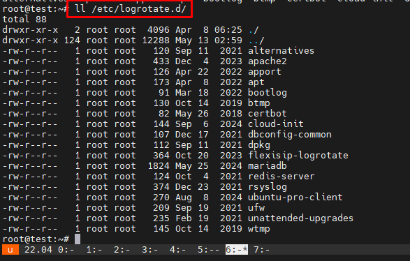
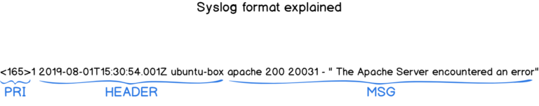

# Logs và Security cơ bản trên Linux
## 1. Các loại Logs quan trọng
- File log là một tập hợp các bản ghi mà Linux duy trì để các quản trị viên theo dõi các sự kiện quan trọng. Các file log này sẽ chứa các thông báo về máy chủ, bao gồm kernel, dịch vụ và ứng dụng đang chạy trên nó. File log cung cấp thời gian của các sự kiện cho hệ điều hành, ứng dụng và hệ thống Linux và là một công cụ quan trọng giúp chúng ta khắc phục sự cố
- Tất cả các hệ thống Linux đều tạo và lưu trữ các tệp nhật ký thông tin cho các quy trình khởi động, ứng dụng và các sự kiện khác. Các tệp này là một nguồn hữu ích để khắc phục sự cố hệ thống.
- Hầu hết các tệp nhật ký Linux được lưu trữ trong các tệp văn bản thuần túy (định dạng ASCII) trong thư mục /var/log và các thư mục con. Nhật ký được tạo bởi system daemon Linux, syslogd hoặc rsyslogd. Quản lý đúng các nhật ký này đảm bảo dữ liệu cần thiết luôn sẵn sàng để phân tích và kiểm tra.
- Phần lớn logs trong Linux được chia thành `4` loại:
	- Log hệ thống (System Logs)
	- Log sự kiện (Event Logs)
	- Log ứng dụng (Application Logs)
	- Log dịch vụ (Service Logs)
### 1.1. System logs
- Nhật ký hệ thống chủ yếu liên quan đến hoạt động của hệ thống Ubuntu, không nhất thiết liên quan đến các ứng dụng bổ sung do người dùng thêm vào. Ví dụ bao gồm cơ chế ủy quyền, daemon hệ thống, thông báo hệ thống và bản ghi hệ thống bao gồm tất cả, syslog.
- Các tệp hệ thống quan trọng có thể kể tên như: 
- Authorization Log (Nhật ký uỷ quyền): Nhật ký ủy quyền theo dõi việc sử dụng các hệ thống ủy quyền, các cơ chế ủy quyền cho người dùng yêu cầu nhập mật khẩu người dùng, chẳng hạn như hệ thống Pluggable Authentication Module(PAM), lệnh sudo, đăng nhập từ xa vào sshd, v.v. Có thể truy cập tệp Nhật ký ủy quyền tại /var/log/auth.log. Nhật ký này hữu ích để tìm hiểu về thông tin đăng nhập của người dùng và cách sử dụng lệnh sudo.

- Daemon Log (Nhật ký Daemon): Daemon là một chương trình chạy ở chế độ nền, thường không có sự can thiệp của con người, thực hiện một số thao tác quan trọng đối với việc chạy đúng của hệ thống. Nhật ký daemon lưu tại /var/log/daemon.log và chứa thông tin về các daemon hệ thống và ứng dụng đang chạy như daemon Gnome Display Manager gdm, daemon Bluetooth HCI hcid hoặc daemon cơ sở dữ liệu MySQL mysqld. Điều này có thể giúp khắc phục sự cố với một daemon cụ thể.
- Debug Log (Nhật ký gỡ lỗi): Nhật ký gỡ lỗi lưu tại `/var/log/debug` cung cấp các thông báo gỡ lỗi chi tiết từ hệ thống Ubuntu và các ứng dụng được ghi vào syslogd ở cấp độ DEBUG.
- Kernel Log (Nhật ký Kernel): Log này được lưu ở `/var/log/kern.log` chứa các thông báo từ kernel, bao gồm thông tin liên quan đến phần cứng và nhật ký mô-đun kernel.

- Kernel Ring Buffer Nhật ký này lưu ở `/var/log/dmesg` ghi nhật ký các thông báo từ kernel ring buffer, chủ yếu ghi lại thông tin về quá trình khởi động, phát hiện phần cứng và khởi tạo trình điều khiển.

- System log (Nhật ký hệ thống): Nhật ký hệ thống thường chứa nhiều thông tin nhất theo mặc định về hệ thống Ubuntu của bạn. Nó nằm tại /var/log/syslog và có thể chứa thông tin mà các nhật ký khác không có. Tham khảo Nhật ký hệ thống khi bạn không thể tìm thấy thông tin nhật ký mong muốn trong nhật ký khác. Nó cũng chứa mọi thứ từng có trong /var/log/messages.
/var/log/syslog và /var/log/messages ghi lại nhiều sự kiện hệ thống, bao gồm các thông báo chung của hệ thống, thông báo từ các dịch vụ hệ thống, lỗi ứng dụng và các sự kiện quan trọng khác.


### 1.2 Application Logs 
- Nhiều ứng dụng cũng tạo nhật ký trong /var/log. Nếu bạn liệt kê nội dung của thư mục con /var/log, bạn sẽ thấy những cái tên quen thuộc, chẳng hạn như /var/log/apache2 đại diện cho nhật ký của máy chủ web Apache 2 hoặc /var/log/samba, chứa nhật ký của máy chủ Samba. Phần này của hướng dẫn giới thiệu một số ví dụ cụ thể về nhật ký ứng dụng và thông tin có trong đó.
- Apache HTTP Server Logs (Nhật ký máy chủ HTTP Apache): 
	- Cài đặt mặc định cho Apache2 trên Ubuntu tạo một thư mục con lưu log ở `/var/log/apache2`. Trong thư mục con này có hai tệp nhật ký với hai mục đích riêng biệt:
	* /var/log/apache2/access.log - bản ghi của mọi trang được phục vụ và mọi tệp được máy chủ web tải.
	* /var/log/apache2/error.log - bản ghi của mọi điều kiện lỗi được máy chủ HTTP báo cáo
	- Theo mặc định, mỗi khi Apache truy cập một tệp hoặc trang, `access.log` sẽ ghi lại địa chỉ IP, thời gian và ngày tháng, chuỗi nhận dạng trình duyệt, mã kết quả HTTP và văn bản của truy vấn thực tế, thường là GET cho chế độ xem trang.

	- Ngoài ra, mỗi khi xảy ra bất kỳ lỗi nào, Apache sẽ thêm một dòng vào nhật ký lỗi `error.log`. Nếu bạn chạy PHP với thông báo lỗi và cảnh báo đã tắt, đây có thể là cách duy nhất để xác định lỗi.

	- CUPS Print System logs: Hệ thống in Unix chung (CUPS) sử dụng tệp nhật ký mặc định `/var/log/cups/error_log` để lưu trữ thông tin và thông báo lỗi. 
	- Rookit hunter log: Tiện ích Rootkit Hunter (rkhunter) kiểm tra hệ thống Ubuntu của bạn để tìm backdoors, sniffers và rootkit, tất cả đều là dấu hiệu xâm phạm hệ thống của bạn. Nhật ký rkhunter sử dụng nằm tại /var/log/rkhunter.log.
	- Samba (SMB) Server Logs: Nhật ký máy chủ Samba SMB: Máy chủ Giao thức khối tin nhắn máy chủ (SMB), Samba thường được sử dụng để chia sẻ tệp giữa máy tính Ubuntu của bạn và các máy tính khác hỗ trợ giao thức SMB. Samba lưu giữ ba loại nhật ký riêng biệt trong thư mục con /var/log/samba:
		- log.nmbd - các thông báo liên quan đến chức năng NETBIOS qua IP của Samba (các thông tin mạng)
		- log.smbd - các thông báo liên quan đến chức năng SMB/CIFS của Samba (các thông tin chia sẻ tệp và bản in)
		- log.[IP_ADDRESS] - các thông báo liên quan đến các yêu cầu dịch vụ từ địa chỉ IP có trong tên tệp nhật ký, ví dụ: log.192.168.1.1.
	- X11 Server Log : Máy chủ cửa sổ X11 mặc định được sử dụng với Ubuntu là máy chủ Xorg X11 và giả sử máy tính của bạn chỉ có một màn hình được xác định, máy chủ này sẽ lưu trữ các thông báo nhật ký trong tệp /var/log/Xorg.0.log. 
### 1.3 Non-Human-Readable Log
- Một số tệp nhật ký được tìm thấy trong thư mục con `/var/log` được thiết kế để các ứng dụng có thể đọc được, không nhất thiết là con người. Một số ví dụ về các tệp nhật ký như vậy xuất hiện trong /var/log như sau.
- Login Failures Log Nhật ký lỗi đăng nhập: Nhật ký lỗi đăng nhập nằm tại /var/log/faillog thực sự được thiết kế để được phân tích cú pháp và hiển thị bởi lệnh faillog. 
- Last Logins Log Nhật ký đăng nhập cuối cùng tại /var/log/lastlog thường không nên được phân tích và kiểm tra bởi con người, mà nên được sử dụng kết hợp với lệnh lastlog
- Login Records Log: Tệp /var/log/wtmp chứa các bản ghi đăng nhập, nhưng không giống như /var/log/lastlog ở trên, /var/log/wtmp không được sử dụng để hiển thị danh sách các lần đăng nhập gần đây mà thay vào đó được các tiện ích khác như lệnh who sử dụng để hiển thị danh sách người dùng hiện đang đăng nhập. Lệnh này sẽ hiển thị những người dùng hiện đang đăng nhập vào máy của bạn:


### 1.4 Kiểm tra log đăng nhập, reboot/shutdown 
- Auth Log ghi lại các nỗ lực xác thực đăng nhập trên hệ thống 

- Lệnh who trong Linux có thể hiển thị thông tin liên quan đến đăng nhập của người dùng như tên tài khoản người dùng, thiết bị đầu cuối của người dùng, thời gian đăng nhập của người dùng, tên máy chủ hoặc địa chỉ IP từ nơi người dùng đã đăng nhập.
```
who
```

- Lệnh `last` trong Linux có thể hiển thị danh sách các lần đăng nhập gần đây của người dùng, thời gian của chúng và thông tin khác được đọc từ tệp `/var/log/wtmp`.

- Thay vì chỉ định tên người dùng, có thể thay thế nó bằng tham số `reboot` để lấy thời gian và ngày khởi động lại lần cuối trong Linux.

- Lệnh journalctl trong Linux được sử dụng để truy vấn nhật ký hệ thống, có thể sử dụng lệnh này để hiển thị nhật ký hệ thống để biết thêm thông tin, chẳng hạn như số lần hệ thống đã được khởi động.
```
journalctl --list-boot
```


## 2. Công cụ quản lý logs
### 2.1. journalctl
#### 2.1.1. journalctl
- journald – systemd journal daemon journalctl là một tiện ích mạnh mẽ để truy vấn và hiển thị nhật ký sự kiện hoặc tệp nhật ký trong Linux. Đây là thành phần trung tâm của bộ quản lý hệ thống và dịch vụ systemd, đi kèm với nhiều bản phân phối Linux như Ubuntu, Fedora và Arch Linux. Tên "journalctl" là sự kết hợp của "journal" (nhật ký) và "ctl" (điều khiển), ám chỉ thực tế là lệnh này được sử dụng để kiểm soát và phân tích nhật ký.
- File cấu hình của journald được lưu ở đường dẫn /etc/systemd/journald.conf. Nó rất nhiều tham số để cho chúng ta biết quá trình logging diễn ra như thế nào.
- journald lưu trữ các files log ở dạng mã nhị phân, nó được lưu trữ ở đường dẫn /var/log/journal.


#### 2.1.2. Sử dụng journalctl để đọc và phân tích Systemd Logs
- Lệnh xem log cơ bản
```
journalctl
```

- Sử dụng `journald` theo múi giờ: Mặc định journalctl hiện thị log theo múi giờ hiện tại nhưng có thể yêu cầu chương trình hiển thị ở múi giờ khác vi dụ để xem ở múi giờ UTC
```
journalctl --utc
```

- Chỉ xem log errow, warnings: Logs mà hệ thống xuất ra có những mức ưu tiên khác nhau. Nhiều Logs chỉ là cảnh báo có thể không cần quan tâm, nhưng một số logs là mỗi nghiêm trọng. Sử dụng lệnh sau 
	```
	journalctl -p <code>
	```
	- Trong đó `<code>` gồm các options 
		- 0: emergency
		- 1: alerts
		- 2: critical
		- 3: errors
		- 4: warning
		- 5: notice
		- 6: info
		- 7: debug 

- Xem journal logs cho một thời gian, khoảng thời gian cụ thể: Có thể dùng tham số --since với các giá tị như “yesterday”, “today”, “tomorrow”, “now”. Hoặc với khoảng thời gian cụ thể theo định dạng “YYYY-MM-DD HH:MM:SS”
```
journalctl --since "2020-12-04 06:00:00"
journalctl --since "2020-12-03" --until "2020-12-05 03:00:00"
journalctl --since yesterday
journalctl --since 09:00 --until "1 hour ago"
```

- Xem journal logs về kernel
```
journalctl -k
```

- Xem journal logs của một Service, PID
```
journalctl -u apach2.service
```
- Xem journal logs của một user,group: Dùng câu lệnh `id -u` để tìm ID của user/group đó
	```
	id -u ubuntu
	```

	
	- Sau đó dùng tham số _UID cho User và _GID cho Group để xem
	```
	journalctl _UID=1001 --since today
	```

- Xem journal logs của một thực thi
```
journalctl /usr/bin/gnome-shell --since today
```

### 2.2.logrotate:
- LogRotate là một công cụ trên hệ điều hành Linux dùng để quản lý file log. Nó giúp xử lý và lưu trữ file log một cách tự động, giúp tránh file log quá lớn và gây tắc nghẽn hệ thống. LogRotate cung cấp một số tùy chọn cấu hình để quản lý file log như xóa các file log cũ, nén các file log đã quá hạn, xác định tần suất xử lý file log và kích thước tối đa của file log trước khi xử lý.
- Hoạt động của logrotate: Logrotate hoạt động theo lịch trình, thường là hàng ngày, thông qua các tập lệnh cron. Tập lệnh này thường nằm trong thư mục /etc/cron.daily/logrotate và có thể được điều chỉnh để chạy thường xuyên hơn nếu cần thiết. Khi Logrotate được kích hoạt, nó sẽ:
	- Đọc tập tin cấu hình: Logrotate đọc các tệp cấu hình để xác định vị trí và tên của các file log cần được xoay vòng, tần suất xoay vòng (hàng ngày, hàng tuần, hàng tháng), và số lượng file log đã lưu trữ.
	- Kiểm tra điều kiện: Nó sẽ kiểm tra các điều kiện như kích thước file log (nếu được cấu hình) hoặc thời gian để quyết định xem có cần thực hiện việc xoay vòng hay không. Nếu file log đạt đến kích thước tối đa hoặc thời gian quy định đã đến sẽ thực hiện rotate.
	- Thực hiện rotate: Khi điều kiện đáp ứng, Logrotate sẽ:
		* Di chuyển hoặc xóa file log cũ.
		* Tạo ra một file log mới để tiếp tục ghi nhận dữ liệu.
		* Nén file log cũ (thường sử dụng gzip) nếu được cấu hình.
	- Chạy các lệnh trước/sau khi rotate: Logrotate cho phép thực thi các lệnh shell trước hoặc sau khi quá trình xoay vòng hoàn tất, điều này hữu ích để khởi động lại dịch vụ mà không làm gián đoạn quá trình ghi log.
- Một số tính năng quan trọng của LogRotate
	* Tự động hóa quản lý log: LogRotate cho phép người dùng thiết lập các quy tắc để tự động xóa log cũ và tạo log mới, giúp tiết kiệm thời gian và công sức trong việc quản lý logs.
	* Sao lưu dữ liệu: Công cụ này hỗ trợ sao lưu các log quan trọng, đảm bảo rằng dữ liệu không bị mất mát trong quá trình quản lý.
	* Tùy biến linh hoạt: Người dùng có thể tùy chỉnh các quy tắc quản lý log theo nhu cầu riêng, bao gồm việc tạo thư mục lưu trữ cho logs, chỉnh sửa định dạng logs và thiết lập kích thước tối đa cho mỗi log.
	* Chạy tự động: LogRotate có thể được cấu hình để chạy tự động trong nền, giảm thiểu sự can thiệp của người dùng. Theo mặc định, nó sẽ chạy hàng ngày thông qua cron jobs.
	* Xoay vòng theo thời gian hoặc dung lượng: Bạn có thể cấu hình LogRotate để xoay vòng logs dựa trên thời gian (hàng ngày, hàng tuần, hàng tháng) hoặc dung lượng (ví dụ: khi file log đạt đến 50MB).
	* Nén file log: Sau khi xoay vòng, LogRotate có khả năng nén các file log cũ để tiết kiệm không gian lưu trữ. Tùy chọn nén có thể được điều chỉnh để sử dụng các phương pháp nén khác nhau như gzip hoặc bzip2.
	* Thực thi script sau khi xoay vòng: LogRotate cho phép chạy các script shell sau khi hoàn tất việc xoay vòng logs, giúp thực hiện các tác vụ bổ sung cần thiết.
	* Quản lý file log trống: Có các tùy chọn để xử lý file log trống, như không thực hiện xoay vòng nếu file đó không có dữ liệu (tùy chọn notifempty) hoặc bỏ qua thông báo lỗi nếu file log không tồn tại (tùy chọn missingok).
- Daemon Logrotate sử dụng các tệp cấu hình để chỉ định tất cả các chi tiết luân chuyển nhật ký cho một ứng dụng. Thiết lập mặc định bao gồm các khía cạnh sau:
	* /etc/logrotate.conf: đây là tệp cấu hình chính cho tiện ích Logrotate. Nó xác định các thiết lập chung và mặc định cho luân chuyển nhật ký được áp dụng cho tất cả các tệp nhật ký trừ khi bị ghi đè bởi các tệp cấu hình Logrotate riêng lẻ trong thư mục /etc/logrotate.d/.
	* /etc/logrotate.d: thư mục này bao gồm các tệp cấu hình chính sách luân chuyển nhật ký cụ thể cho các tệp nhật ký do từng ứng dụng hoặc dịch vụ tạo ra.
#### 2.2.1 Cài đặt 
- Logrotate được cài đặt mặc định trên hầu hết các bản phân phối Linux. Có thể kiểm tra version bằng lệnh 
```
logrotate --version
```

#### 2.2.2 Cấu hình
- Tệp cấu hình chính của logrotate nằm ở `/etc/logrotate.conf` chứa thông tin thiết lập toàn bộ log files mà Logrotate quản lý, bao gồm chu kì lặp, dung lượng file log, nén file…


	- `weekly`: biểu thị tần suất luân chuyển nhật ký. Ngoài ra, bạn có thể chỉ định một khoảng thời gian khác (hàng giờ, hàng ngày, hàng tháng hoặc hàng năm). Vì tiện ích logrotate thường chạy một lần mỗi ngày, nên bạn có thể cần thay đổi cấu hình này nếu muốn tần suất luân chuyển ngắn hơn hàng ngày.
	- `su root adm`: luân chuyển nhật ký được thực hiện với người dùng gốc và nhóm quản trị. Bằng cách sử dụng chỉ thị này, bạn có thể đảm bảo rằng các tệp nhật ký đã luân chuyển thuộc sở hữu của một người dùng và nhóm cụ thể, điều này có thể hữu ích cho việc kiểm soát quyền truy cập và quản lý quyền. Điều này đặc biệt có liên quan khi các tệp nhật ký cần được truy cập hoặc quản lý bởi một người dùng hoặc nhóm cụ thể có các đặc quyền phù hợp.
	- `rotate 4`: các tệp nhật ký được luân chuyển bốn lần trước khi các tệp cũ bị xóa. Nếu rotate được đặt thành 0, thì các phiên bản cũ sẽ bị xóa ngay lập tức và không được luân chuyển. Nếu được đặt thành -1, các nhật ký cũ hơn sẽ không bị xóa trừ khi bị ảnh hưởng bởi maxage.
	- `create`: ngay sau khi xoay, tạo một tệp nhật ký mới có cùng tên với tệp vừa xoay.
	- `dateext`: nếu tùy chọn này được bật, các tệp nhật ký đã xoay sẽ được đổi tên bằng cách thêm ngày vào tên tệp, cho phép tổ chức và phân biệt tệp nhật ký tốt hơn dựa trên ngày xoay (đặc biệt là khi tần suất xoay là hàng ngày hoặc lớn hơn). Sơ đồ mặc định cho các tệp đã xoay là logname.1, logname.2, v.v., nhưng bật tùy chọn này sẽ thay đổi thành logname.YYYYMMDD. Bạn có thể thay đổi định dạng ngày thông qua các chỉ thị dateformat và dateyesterday.
	- `compress`: quy tắc này xác định xem có nên nén các tệp nhật ký cũ (sử dụng gzip theo mặc định) hay không. Nén nhật ký bị tắt theo mặc định nhưng bạn có thể bật nó để tiết kiệm dung lượng đĩa.
	- `include`: chỉ thị này được sử dụng để bao gồm các tệp cấu hình hoặc đoạn mã bổ sung. Nó cho phép bạn mô-đun hóa và sắp xếp cấu hình Logrotate của mình bằng cách chia thành nhiều tệp. Trong trường hợp này, các tệp trong thư mục /etc/logrotate.d đã được bao gồm trong cấu hình.
- Các tệp cấu hình ứng dụng cụ thể nằm ở `/etc/logrotate.d/`

- Ví dụ tệp cấu hình logrotate của mariadb
```
cat /etc/logrotate.d/mariadb
```

- Một số lựa chọn cấu hình phổ biến 
	- Lựa chọn Log file được rotate: Có thể chỉ định cụ thể một hay nhiều file log với đường dẫn tuyệt đối của file log đó, phân biệt danh sách các log file cụ thể bằng khoảng trắng. Ví dụ:
	```
	/home/*/logs/mysql*.log
	/home/*/logs/access.log /home/*/logs/error.log /home/*/logs/nginx_error.log
	```
	- Rotate theo thời gian: Có 4 giá trị cấu hình tương ứng với khoảng thời gian log file sẽ được rotate.
		* Daily: mỗi ngày
		* Weekly: mỗi đầu tuần
		* Monthly: mỗi đầu tháng
		* Yearly: mỗi năm
	- Rotate theo dung lượng file log: Có thể quy định tiến trình rotate dựa vào dung lượng file, ví dụ nếu file đó đạt dung lượng 100mb thì tiến hành rotate. Các đơn vị kích thước file có thể sử dụng là K, M, G.
	```
	size 100k
	size 100M
	size 100G
	```
	- Xử lý Log file trống 
		* Tham số `missingok`: nếu file log vì lý do gì đấy bị mất hoặc không tồn tại *.log thì logrotate sẽ tự động di chuyển tới phần cấu hình log của file log khác mà không cần phải xuất ra thông báo lỗi. Ngược lại sẽ là cấu hình nomissingok
		* Tham số `Notifempty`: không rotate log nếu file log này trống.
	- Rotate theo số lượng Log file: Quy định số lượng log file cũ đã được giữ lại sau khi rotate. Ví dụ: rotate7 giữ lại 7 file log cũ. Trường hợp đã có đủ 7 file log cũ thì file cũ nhất sẽ bị xóa đi để chứa file log mới được tạo.
	```
	rotate [number]
	```
	- Tự động nén Log file 
		* Tùy chọn `Compress`: Logrotate sẽ nén tất cả các file log lại sau khi đã được rotate, mặc định bằng gzip. Nếu bạn muốn sử dụng chương trình nén khác như bzip2, xz hoặc zip thì hãy đặt tên chương trình đó thành biến sau giá trị cấu hình Compresscmd xz
		* Tham số `Delaycompress` sẽ hữu dụng trong trường hợp bạn không muốn file log cũ phải nén ngay sau khi vừa được rotate. Thay vào đó, công việc nén sẽ được delay trễ hơn bằng việc sẽ nén file log cũ đó vào lần chạy rotate kế tiếp. Tùy chọn này chỉ hoạt động đi kèm chức năng compress trong file cấu hình, tức bạn phải cấu hình compress trước đó
	```
	compress
	delaycompress
	```
	- Phân quyền cho Log file:  có thể chỉ định khi logrotate xử lý xong file log cũ sẽ tạo ra file log mới có tên tương ứng để thay thế file log hiện tại. Cấu hình tham số create sẽ quy định việc file log mới tạo ra. Cần đảm bảo đúng phân quyền cho file log mới sau khi rotate.
		```
		create 660 ubuntu www-data
		```
		- Trong ví dụ File log mới sẽ có owner là ubuntu và thuộc group www-data (group mà Apache thường chạy)
	- Thực thi lệnh trước hoặc sau khi rotate: LogRotate có thể chạy các lệnh trước hay sau quá trình rotate. Điều này thường được áp dụng để khởi động lại dịch vụ sử dụng file log nhằm không làm gián đoạn quá trình ghi log.
		* Để chạy một số lệnh trước khi quá trình rotate bắt đầu, ta đặt lệnh thực thi nằm giữa prerotate và endscript. Ví dụ:	
		```
		Prerotate
		Touch /var/www/html/stop.txt
		Endscript
		```
- Có thể chạy LogRotate thủ công phục vụ quá trình kiểm tra có thể dùng lệnh:
	```
	logrotate -vf /etc/logrotate.d/sample
	```
	- Trong đó:
		* `-v` verbose hiển thị thêm thông tin so với thông thường, có ích khi bạn muốn dò lỗi logrotate
		* `-f` bắt buộc rotate ngay lập tức
### 2.3 syslog 
#### 2.3.1 Tổng quan
- Syslog là viết tắt của System Logging Protocol (tạm dịch sang tiếng Việt là Giao thức ghi nhật ký hệ thống) là một giao thức client/server là giao thức dùng để chuyển log và thông điệp đến máy nhận log. Máy nhận log thường được gọi là syslogd, syslog daemon hoặc syslog server. Syslog có thể gửi qua UDP hoặc TCP. Các dữ liệu được gửi dạng cleartext. Syslog dùng port 514.
- Ngoài ra Syslog còn là một gói phần mềm trong hệ thống Linux nhằm để ghi bản tin log của hệ thống trong quá trình hoạt động như của kernel, deamon, cron, auth, hoặc các ứng dụng chạy trên hệ thống như http, dns, dhcp, ntp,..
- Syslog được phát triển năm 1980 bởi Eric Allman, nó là một phần của dự án Sendmail, và ban đầu chỉ được sử dụng duy nhất cho Sendmail. Nó đã thể hiện giá trị của mình và các ứng dụng khác cũng bắt đầu sử dụng nó. Syslog hiện nay trở thành giải pháp khai thác log tiêu chuẩn trên Unix-Linux cũng như trên hàng loạt các hệ điều hành khác và thường được tìm thấy trong các thiết bị mạng như router Trong năm 2009, Internet Engineering Task Forec (IETF) đưa ra chuẩn syslog trong RFC 5424.
- Syslog ban đầu sử dụng UDP, điều này là không đảm bảo cho việc truyền tin. Tuy nhiên sau đó IETF đã ban hành RFC 3195 (Đảm bảo tin cậy cho syslog) và RFC 6587 (Truyền tải thông báo syslog qua TCP). Điều này có nghĩa là ngoài UDP thì giờ đây syslog cũng đã sử dụng TCP để đảm bảo an toàn cho quá trình truyền tin.
#### 2.3.2 Syslog message
- Trong chuẩn syslog, mỗi thông báo đều được dán nhãn và được gán các mức độ nghiêm trọng khác nhau. Các loại phần mềm sau có thể sinh ra thông báo: auth, authPriv, daemon, cron, ftp, dhcp, kern, mail, syslog, user,… Với các mức độ nghiêm trọng từ cao nhất trở xuống Emergency, Alert, Critical, Error, Warning, Notice, Info, and Debug.
- Thông báo của giao thức Syslog bao gồm 3 phần,độ dài một thông báo không được vượt quá 1024 bytes: PRI (giá trị ưu tiên được tính toán), HEADER (với thông tin nhận dạng), và MSG (thông báo chính)

	* PRI : chi tiết các mức độ ưu tiên của tin nhắn (từ tin nhắn gỡ lỗi (debug) đến trường hợp khẩn cấp) cũng như các mức độ cơ sở (mail, auth, kernel).
		- là một số được đặt trong ngoặc nhọn, thể hiện cơ sở sinh ra log hoặc mức độ nghiêm trọng, là một số gồm 8 bit:
			- 3 bit đầu tiên thể hiện cho tính nghiêm trọng của thông báo.
			- 5 bit còn lại đại diện cho sơ sở sinh ra thông báo.
			- 
			- Ví dụ: Priority = 191 Lấy 191:8 = 23.875 -> Facility = 23 (“local 7”) -> Severity = 191 – (23 * 8 ) = 7 (debug)
	* Header: bao gồm hai trường là TIMESTAMP và HOSTNAME, tên máy chủ là tên máy gửi nhật ký.
		- TIMESTAMP : được định dạng trên định dạng của Mmm dd hh:mm:ss – Mmm, là ba chữ cái đầu tiên của tháng. Sau đó là thời gian mà thông báo được tạo ra giờ:phút:giây. Thời gian này được lấy từ thời gian hệ thống.Chú ý: nếu như thời gian của server và thời gian của client khác nhau thì thông báo ghi trên log được gửi lên server là thời gian của máy client
		- HOSTNAME (đôi khi có thể được phân giải thành địa chỉ IP). Nó thường được đưa ra khi bạn nhập lệnh tên máy chủ. Nếu không tìm thấy, nó sẽ được gán cả IPv4 hoặc IPv6 của máy chủ.
	* MSG: phần này chứa thông tin thực tế về sự kiện đã xảy ra. Nó cũng được chia thành trường TAG và trường CONTENT.
		- Tag field : là tên chương trình tạo ra thông báo
		- Content field : chứa các chi tiết của thông báo
- Cấp độ cơ sở Syslog (Syslog facility levels): được sử dụng để xác định chương trình hoặc một phần của hệ thống tạo ra các bản ghi.

- Mức độ cảnh báo của Syslog được sử dụng để mức độ nghiêm trọng của log event và chúng bao gồm từ gỡ lỗi (debug), thông báo thông tin (informational messages) đến mức khẩn cấp (emergency levels).

#### 2.3.2 Hoạt động syslog 
- Syslog Forwarding: bao gồm gửi log máy khách đến một máy chủ từ xa để chúng được tập trung hóa, giúp phân tích log dễ dàng hơn. Hầu hết thời gian, quản trị viên hệ thống không giám sát một máy duy nhất, nhưng họ phải giám sát hàng chục máy, tại chỗ và ngoài trang web. Kết quả là, việc gửi nhật ký đến một máy ở xa, được gọi là máy chủ ghi log tập trung, sử dụng các giao thức truyền thông khác nhau như UDP hoặc TCP.
- Syslog ban đầu sử dụng UDP, điều này là không đảm bảo cho việc truyền tin. Tuy nhiên sau đó IETF đã ban hành RFC 3195 (Đảm bảo tin cậy cho syslog) và RFC 6587 (Truyền tải thông báo syslog qua TCP). Điều này có nghĩa là ngoài UDP thì giờ đây syslog cũng đã sử dụng TCP để đảm bảo an toàn cho quá trình truyền tin.Syslog sử dụng port 514 cho UDP.
### 2.4.rsyslog
- Rsyslog – “The rocket-fast system for log processing” được bắt đầu phát triển từ năm 2004 bởi Rainer Gerhards rsyslog là một phần mềm mã nguồn mở sử dụng trên Linux dùng để chuyển tiếp các log message đến một địa chỉ trên mạng (log receiver, log server) Nó thực hiện giao thức syslog cơ bản, đặc biệt là sử dụng TCP cho việc truyền tải log từ client tới server. Hiện nay rsyslog là phần mềm được cài đặt sẵn trên hầu hết hệ thống Unix và các bản phân phối của Linux như : Fedora, openSUSE, Debian, Ubuntu, Red Hat Enterprise Linux, FreeBSD…
- Rsyslog là một sự phát triển của syslog, cung cấp các khả năng như các mô đun có thể cấu hình, được liên kết với nhiều mục tiêu khác nhau (ví dụ chuyển tiếp nhật ký Apache đến một máy chủ từ xa).Rsyslog cũng cung cấp tính năng lọc riêng cũng như tạo khuôn mẫu để định dạng dữ liệu sang định dạng tùy chỉnh.
- File cấu hình mặc của rsyslog nằm ở `/etc/rsyslog.conf`

- Các file cấu hình riêng cho từng ứng dụng nằm trong `/etc/rsyslog.d`

- Ví dụ file cấu hình default

- Cấu hình trên được chia ra làm 2 trường:
	- Trường 1: Trường Seletor
		- Trường Seletor : Chỉ ra nguồn tạo ra log và mức cảnh bảo của log đó.
		- Trong trường seletor có 2 thành phần và được tách nhau bằng dấu “.“
	- Trường 2: Trường Action: là trường để chỉ ra nơi lưu log của tiến trình đó. Có 2 loại là lưu tại file trong localhost hoặc gửi đến IP của máy chủ Log
- Các dạng cấu hình 
	```
	mail.info         /var/log/maillog
	```
	- Khi đó lúc này bản tin log sẽ mail lại với mức cảnh báo từ info trở lên. Cụ thể là mức notice,warn,… nếu bạn chỉ muốn nó log lại mail với mức là info bạn phải sử dụng như sau:`mail.=info /var/log/maillog`
	```
	mail.*
	```
	- Lúc này kí tự `*` đại diên cho các mức cảnh báo. Lúc này nó sẽ lưu hết các level của mail vào trong thư mục. Tượng tự khi đặt `*.` thì lúc này nó sẽ log lại tất cả các tiến trình của hệ thống vào một file. Nếu bạn muốn log lại tiến trình của mail ngoại trừ mức info bạn có thể dùng kí tự `!` `mail.!info`
	```
	*.info;mail.none;authpriv.none;cron.none /var/log/messages
	```
	- Lúc này tất các log từ info của tiến trình hệ thống sẽ được lưu vào trong file log messages nhưng đối với các log của mail, authpriv và cron sẽ không lưu vào trong messages.

### 2.5 syslog-ng

3. Security cơ bản trên Linux
Bảo mật đăng nhập:
Quản lý user và quyền:
Firewall (Tường lửa):
Cập nhật hệ thống:
Giám sát hệ thống:
4. Phân tích logs để phát hiện tấn công


https://help.ubuntu.com/community/LinuxLogFiles
https://www.digitalocean.com/community/tutorials/how-to-use-journalctl-to-view-and-manipulate-systemd-logs
https://betterstack.com/community/guides/logging/how-to-manage-log-files-with-logrotate-on-ubuntu-20-04/#the-necessity-of-log-rotation
https://hocvps.com/logrotate/	
https://linuxconfig.org/logrotate