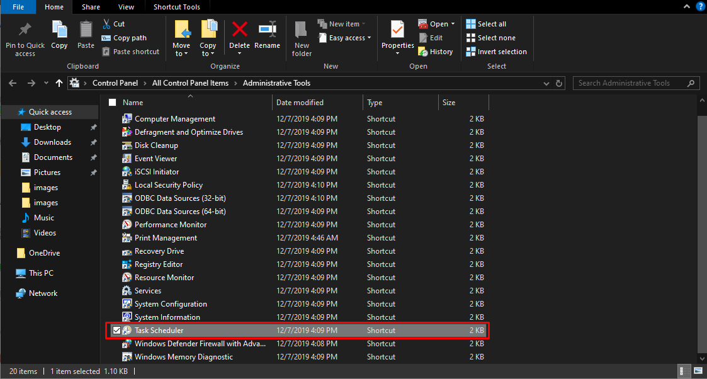
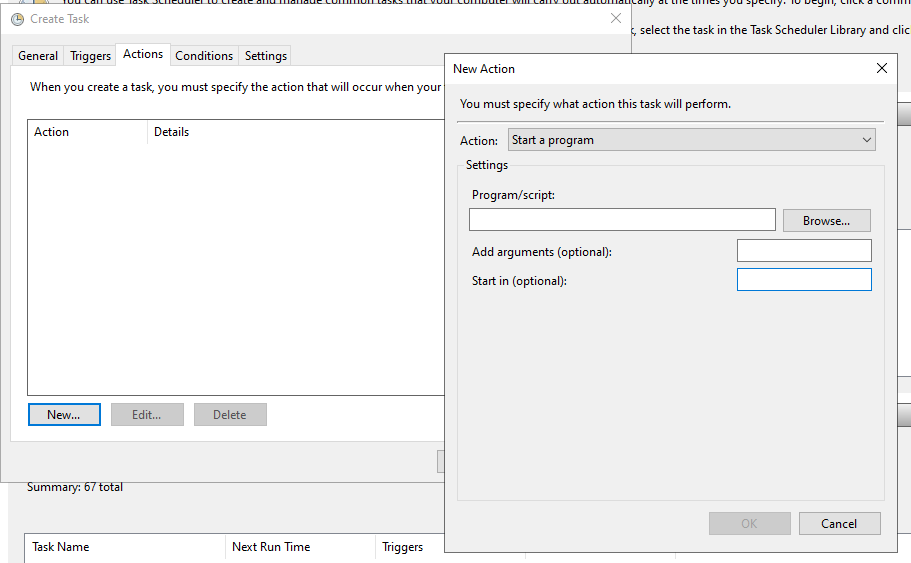
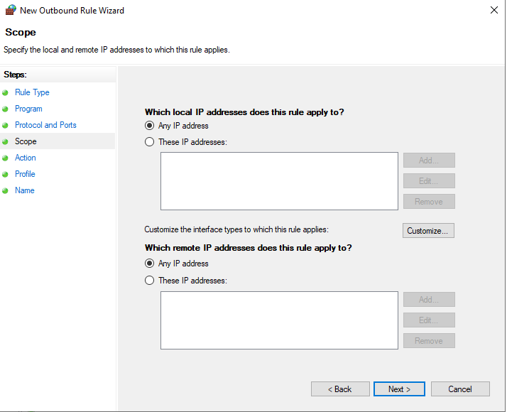

# Logs và Security cơ bản trên Windows 
***

## 1. Logs
- Nhật ký là bản ghi các sự kiện xảy ra trên máy tính của bạn, do một người hoặc một quy trình đang chạy. Chúng giúp bạn theo dõi những gì đã xảy ra và khắc phục sự cố.
- Nhật ký sự kiện Windows chứa các bản ghi từ hệ điều hành và các ứng dụng như SQL Server hoặc Internet Information Services (IIS). 
- Người quản trị sử dụng nó để chẩn đoán mọi sự cố trên thiết bị hoặc trên các ứng dụng được cài đặt. Đây có thể là dữ liệu hữu ích cho các sự kiện khắc phục sự cố trong tương lai như sự cố ứng dụng hoặc lỗi hệ thống và bảo mật Windows.
- Nhật ký sự kiện Windows cung cấp thông tin về các sự kiện phần cứng và phần mềm xảy ra trên hệ điều hành Windows. Nó giúp quản trị viên mạng theo dõi các mối đe dọa và sự cố tiềm ẩn có khả năng làm giảm hiệu suất. Windows lưu trữ nhật ký sự kiện theo định dạng chuẩn cho phép hiểu rõ thông tin. Sau đây là các thành phần chính của nhật ký sự kiện:
	* Log name (Tên nhật ký): Tên của nhật ký sự kiện mà các sự kiện từ các thành phần ghi nhật ký khác nhau sẽ được ghi vào. Các sự kiện thường được ghi vào hệ thống, bảo mật và ứng dụng.
	* Event date/time (Ngày/giờ sự kiện): Bao gồm ngày và giờ sự kiện xảy ra.
	* Task category (Loại tác vụ): Xác định loại nhật ký sự kiện đã ghi. Các nhà phát triển ứng dụng cũng có thể xác định các thể loại tác vụ để làm thông tin bổ sung về sự kiện.
	* Event ID (ID sự kiện): Số nhận dạng Windows này giúp quản trị viên mạng xác định duy nhất một sự kiện đã ghi nhật ký cụ thể.
	* Source (Nguồn): Tên của chương trình hoặc phần mềm gây ra nhật ký sự kiện.
	* Level (Mức độ): Mức độ sự kiện biểu thị mức độ nghiêm trọng của nhật ký sự kiện đã ghi. Những thông tin này bao gồm thông tin, lỗi, chi tiết, cảnh báo và nghiêm trọng.
	* User (Người dùng): Tên của người dùng đã đăng nhập vào máy tính Windows khi sự kiện xảy ra.
	* Computer (Máy tính): Tên của máy tính đang ghi nhật ký sự kiện.
- 
- Các loại thông tin được lưu trữ trong Nhật ký sự kiện Windows: Nhật ký sự kiện Windows lưu trữ thông tin về các sự kiện khác nhau xảy ra trong hệ thống. Loại thông tin được lưu trữ thay đổi tùy theo danh mục của nhật ký sự kiện. Dữ liệu thường được ghi lại cho `bốn` loại nhật ký sự kiện Windows:
	* System
	* Application 
	* Setup
	* Security 
- 
- Các loại log và loại event 
	- Nhật ký sự kiện được phân loại thành bốn loại như ứng dụng, bảo mật, thiết lập và hệ thống(application, security, setup, and system). Ngoài ra còn có một loại nhật ký sự kiện đặc biệt được gọi là sự kiện chuyển tiếp(forwarded events).
		* System Log (Nhật ký hệ thống): Nhật ký sự kiện hệ thống Windows chứa các sự kiện liên quan đến hệ thống và các thành phần của hệ thống. Không tải được trình điều khiển khởi động là một ví dụ về sự kiện cấp hệ thống.
		* Application Log (Nhật ký ứng dụng): Các sự kiện liên quan đến phần mềm hoặc ứng dụng được lưu trữ trên máy tính Windows được ghi vào nhật ký sự kiện ứng dụng. Ví dụ: sự cố khi khởi động Microsoft PowerPoint nằm trong nhật ký ứng dụng.
		* Security Log (Bảo mật): Nhật ký bảo mật chứa các sự kiện liên quan đến tính an toàn của hệ thống. Sự kiện được ghi lại thông qua quy trình kiểm tra Windows. Ví dụ bao gồm thông tin đăng nhập không thành công và hợp lệ, xóa tệp, v.v.
		* Setup (Thiết lập): Nhật ký thiết lập chứa các sự kiện xảy ra trong quá trình cài đặt hệ điều hành Windows. Trên bộ điều khiển miền, nhật ký này cũng sẽ ghi lại các sự kiện liên quan đến Active Directory.
		* Forwarded events (Sự kiện chuyển tiếp): Chứa các nhật ký sự kiện được chuyển tiếp từ các máy tính khác trong cùng một mạng.
	- 
	- Sự kiện Windows được chia thành năm loại khác nhau:
		* Information (Thông tin): Chỉ ra một ứng dụng hoặc dịch vụ đang hoạt động tốt. Ví dụ: khi Windows tải trình điều khiển mạng, sự cố sẽ được ghi lại dưới dạng sự kiện thông tin.
		* Warning (Cảnh báo): Sự kiện không quan trọng ám chỉ đến các sự cố tiềm ẩn trong tương lai. Sự kiện cảnh báo sẽ được ghi lại khi có sự cố như thiếu dung lượng đĩa.
		* Error (Lỗi): Mô tả sự cố quan trọng khi hệ thống không thể hoạt động bình thường—ví dụ: hệ điều hành ngừng phản hồi.
		* Audit Success (Kiểm toán thành công): Ghi lại nỗ lực hợp lệ của quyền truy cập bảo mật đã được kiểm toán vào nhật ký bảo mật. Ví dụ: nỗ lực đăng nhập diễn ra tốt đẹp sẽ nằm trong sự kiện kiểm toán thành công.
		* Audit Failure (Kiểm toán thất bại): Chỉ ra sự cố của quyền truy cập bảo mật đã được kiểm toán trong nhật ký bảo mật, chẳng hạn như không thể truy cập ổ đĩa mạng.
	- Các mức độ nghiêm trọng của sự kiện Windows: Mức độ sự kiện Windows biểu thị mức độ nghiêm trọng hoặc tầm quan trọng của sự kiện được ghi lại. Chúng được phân loại như sau:
		* Information (Thông tin): Biểu thị sự kiện đã xảy ra mà không có vấn đề gì. Hầu hết các nhật ký đều chứa thông tin sự kiện.
		* Verbose (Chi tiết): Biểu thị thông báo tiến trình hoặc thành công cho một sự kiện cụ thể.
		* Warning (Cảnh báo): Làm nổi bật một vấn đề tiềm ẩn mà quản trị viên hệ thống cần theo dõi.
		* Error (Lỗi): Mô tả các sự cố trong hệ thống hoặc dịch vụ không yêu cầu khắc phục sự cố ngay lập tức.
		* Critical (Nghiêm trọng): Biểu thị sự cố quan trọng trong ứng dụng hoặc hệ thống cần được xử lý khẩn cấp.
- Log trong Windows được lưu trữ ở `%SystemRoot%\\System32\\winevt\\Logs`: Định dạng của event log với extension là .EVTX và được lưu trữ ở định dạng XML, giúp việc giải mã cấu trúc nhật ký trở nên trực quan hơn và cũng dễ dàng để tạo bộ lọc hỗ trợ việc tìm kiếm
- 
- Một số log khác 
    * Trình quản lý DNS: Nếu bạn chạy Windows Server được cung cấp dưới dạng máy chủ DNS, trình quản lý DNS sẽ khả dụng. Trình quản lý này có danh sách các sự kiện của riêng nó. Từ đó, trình xem sự kiện của trình quản lý DNS hoạt động theo cách tương tự như trình xem được đóng gói trong Windows.
    * Truy cập IIS: Nhật ký Dịch vụ thông tin Internet bao gồm thông tin về URI được yêu cầu và trạng thái. Các nhật ký này được ghi vào vị trí được chỉ định trong Trình quản lý IIS. Theo mặc định, vị trí là: `%SystemDrive%\\inetpub\\logs\\LogFiles`
- 

## 2. Task Scheduler 
### 2.1 Tổng quan
- là một công cụ có sẵn trong Windows giúp người dùng thực hiện một số hành động và tác vụ trên máy tính như tự động chạy một phần mềm nào đó có sẵn trên máy tính. Task Scheduler có rất nhiều tính năng hỗ trợ cho máy tính, khả năng tự động hóa các tác vụ người dùng muốn chạy trên Windows nhanh chóng và hiệu quả.
- 
- Các tính năng hữu ích của Task Scheduler
	* Bảo trì hệ thống: thực hiện nhiệm vụ chạy các chương trình diệt virus hoặc các công cụ bảo mật vào những thời điểm cụ thể để đảm bảo máy tính luôn an toàn. Các tác vụ này có thể được lập lịch để chạy vào ban đêm hoặc trong giờ làm việc thấp điểm, giúp tối ưu hóa hiệu suất hệ thống mà không làm gián đoạn công việc hàng ngày của người dùng.
	* Sao lưu và quản lý dữ liệu: cho phép người dùng tự động hóa quá trình sao lưu dữ liệu bằng cách lập lịch cho các tác vụ sao lưu theo thời gian định kỳ, chẳng hạn như hàng ngày, hàng tuần hoặc hàng tháng. Người dùng có thể cấu hình để sao lưu các thư mục quan trọng hoặc toàn bộ hệ thống.
	* Khởi chạy các ứng dụng và chương trình: có thể thiết lập để các ứng dụng quan trọng như trình duyệt web, phần mềm quản lý công việc, hoặc các ứng dụng kinh doanh khởi chạy tự động khi máy tính khởi động hoặc vào những thời điểm cụ thể trong ngày. Nó có tác dụng trong việc tiết kiệm thời gian và đảm bảo rằng các ứng dụng quan trọng luôn sẵn sàng sử dụng khi cần.
	* Báo cáo và xử lý dữ liệu: Có thể lập lịch để các chương trình phân tích dữ liệu chạy vào thời gian cụ thể, tạo ra các báo cáo chi tiết mà không cần sự can thiệp của con người. 
	* Thực thi các tập lệnh: cho phép người dùng tự động hóa việc thực thi các tập lệnh như batch, PowerShell hoặc các ngôn ngữ kịch bản khác. Việc lập lịch thực thi các tập lệnh này giúp tự động hóa nhiều tác vụ phức tạp, từ việc cài đặt phần mềm, cập nhật hệ thống, đến quản lý mạng và cấu hình hệ thống.
### 2.2. Sử dụng Task Scheduler
- Để khởi động Task Scheduler, có thể thực hiện một số cách sau đây:
    * Cách 1: Nhấn vào nút Start, gõ "Task Scheduler" vào ô tìm kiếm và nhấn Enter.
- 
    * Cách 2: Mở Control Panel, chọn "System and Security", sau đó chọn "Administrative Tools" và cuối cùng nhấp đúp vào "Task Scheduler".
- 
    * Cách 3: Nhấn tổ hợp phím Win + R, gõ "taskschd.msc" và nhấn Enter.
- 
- Tạo tác vụ
    * Nhấp vào Create Task: Trong bảng điều khiển bên phải, chọn "Create Task...".
- 
    * Điền thông tin cơ bản: Trong thẻ "General", điền tên và mô tả cho tác vụ. Bạn cũng có thể chọn quyền chạy tác vụ với các tùy chọn như "Run only when user is logged on" hoặc "Run whether user is logged on or not".
- 
    * Chọn điều kiện kích hoạt: Chuyển sang thẻ "Triggers", nhấp "New..." để tạo một điều kiện kích hoạt. Bạn có thể chọn thời gian cụ thể, tần suất (hàng ngày, hàng tuần, hàng tháng) hoặc sự kiện hệ thống (khi khởi động, khi đăng nhập, v.v.).
- 
- Cấu hình tác vụ: Quá trình cấu hình tác vụ gồm các phần sau đây:
    * Chọn hành động: Chuyển sang thẻ "Actions", nhấp "New..." để tạo một hành động. Bạn có thể chọn "Start a program", "Send an email", hoặc "Display a message".
    * Cấu hình chương trình: Nếu bạn chọn "Start a program", bạn cần chỉ định đường dẫn đến chương trình hoặc script sẽ được chạy. Bạn cũng có thể thêm tham số nếu cần thiết.
- 
    * Thiết lập điều kiện bổ sung: Trong thẻ "Conditions", bạn có thể thiết lập các điều kiện bổ sung như chỉ chạy tác vụ khi máy tính đang ở chế độ nhàn rỗi hoặc chỉ chạy khi kết nối mạng có sẵn.
- 
    * Thiết lập cài đặt: Trong thẻ "Settings", bạn có thể tinh chỉnh các tùy chọn như cho phép tác vụ chạy thủ công, dừng tác vụ nếu chạy quá lâu, hoặc cấu hình tác vụ chạy lại nếu bị lỗi.
- 
- Thực thi và giám sát hiệu quả: Các bước thực thi và giám sát gồm
	* Kiểm tra thủ công: Nhấp chuột phải vào tác vụ và chọn "Run".
	* Giám sát lịch sử: Trong thẻ "History" của tác vụ, bạn có thể xem lịch sử chạy tác vụ, bao gồm thông tin về lần chạy cuối cùng và trạng thái của nó.
	* Xem nhật ký sự kiện: Kiểm tra Event Viewer để xem các nhật ký chi tiết liên quan đến tác vụ.
- Xóa tác vụ không sử dụng: Để xóa tác vụ không sử dụng, bạn thực hiện như sau:
	* Bước 1: Trong Task Scheduler, chọn tác vụ không còn cần thiết.
	* Bước 2: Nhấn chuột phải vào tác vụ và chọn "Delete". Bạn cũng có thể chọn nhiều tác vụ cùng lúc và xóa chúng.
	
- Ví dụ tạo task cơ bản mở notepad lúc 8h sáng hàng ngày:
	* Tạo task và cấu hình trigger, actions 
	- 
	- 
	- 
	- 
	* Chạy thử 
	- 
	* Kết quả 
	- 


## 3. Windows Firewall (IN/OUT port)
### 3.1.  Tổng quan
- Tường lửa Windows là một tính năng bảo mật giúp bảo vệ thiết bị của bạn bằng cách lọc lưu lượng mạng đi vào và ra khỏi thiết bị của bạn. Lưu lượng này có thể được lọc dựa trên một số tiêu chí, bao gồm địa chỉ IP nguồn và đích, giao thức IP hoặc số cổng nguồn và đích. Tường lửa Windows có thể được cấu hình để chặn hoặc cho phép lưu lượng mạng dựa trên các dịch vụ và ứng dụng được cài đặt trên thiết bị của bạn. Điều này cho phép bạn hạn chế lưu lượng mạng chỉ đối với những ứng dụng và dịch vụ được phép giao tiếp rõ ràng trên mạng.
- Tường lửa Windows là tường lửa dựa trên máy chủ được tích hợp trong hệ điều hành và được bật theo mặc định trên tất cả các phiên bản Windows.
- Tường lửa Windows hỗ trợ bảo mật Giao thức Internet (IPsec), bạn có thể sử dụng để yêu cầu xác thực từ bất kỳ thiết bị nào đang cố gắng giao tiếp với thiết bị của bạn. Khi cần xác thực, các thiết bị không thể được xác thực là thiết bị đáng tin cậy sẽ không thể giao tiếp với thiết bị của bạn. Bạn có thể sử dụng IPsec để yêu cầu mã hóa một số lưu lượng mạng nhất định để ngăn không cho các trình phân tích gói tin mạng có thể được người dùng độc hại đính kèm vào mạng đọc được.
- Tường lửa Windows cung cấp một số lợi ích để giải quyết các thách thức về bảo mật mạng của tổ chức bạn:
    * Giảm nguy cơ đe dọa bảo mật mạng: Bằng cách giảm tấn công bề mặt của thiết bị, Tường lửa Windows cung cấp thêm một lớp phòng thủ cho mô hình phòng thủ chuyên sâu. Điều này làm tăng khả năng quản lý và giảm khả năng tấn công thành công
    * Bảo vệ dữ liệu nhạy cảm và sở hữu trí tuệ: Tường lửa Windows tích hợp với IPsec để cung cấp một cách đơn giản để thực thi giao tiếp mạng đầu cuối đã xác thực. Điều này cho phép truy cập theo từng cấp, có thể mở rộng vào các tài nguyên mạng đáng tin cậy, giúp thực thi tính toàn vẹn của dữ liệu và nếu cần, bảo vệ tính bảo mật của dữ liệu
    * Giá trị mở rộng của các khoản đầu tư hiện có: Tường lửa Windows là tường lửa dựa trên máy chủ được bao gồm trong hệ điều hành, do đó không cần phần cứng hoặc phần mềm bổ sung. Nó cũng được thiết kế để bổ sung cho các giải pháp bảo mật mạng hiện có không phải của Microsoft thông qua API được ghi chép
- Hành vi mặc định của Tường lửa Windows là:
    * chặn tất cả lưu lượng truy cập đến, trừ khi được yêu cầu hoặc khớp với một quy tắc
    * cho phép tất cả lưu lượng truy cập đi, trừ khi khớp với một quy tắc
- Quy tắc tường lửa: Quy tắc tường lửa xác định lưu lượng mạng được phép hoặc bị chặn và các điều kiện để điều này xảy ra. Các quy tắc cung cấp nhiều lựa chọn điều kiện để xác định lưu lượng, bao gồm:
    * Tên ứng dụng, dịch vụ hoặc chương trình
    * Địa chỉ IP nguồn và đích
    * Có thể sử dụng các giá trị động, như cổng mặc định, máy chủ DHCP, máy chủ DNS và mạng con cục bộ
    * Tên hoặc loại giao thức. Đối với các giao thức lớp truyền tải, TCP và UDP, bạn có thể chỉ định cổng hoặc phạm vi cổng. Đối với các giao thức tùy chỉnh, bạn có thể sử dụng số từ 0 đến 255 biểu thị giao thức IP
    * Loại giao diện
    * Loại và mã lưu lượng ICMP/ICMPv6
- Cấu hình mạng tường lửa: Tường lửa Windows cung cấp ba cấu hình mạng: miền, riêng tư và công khai. Các cấu hình mạng được sử dụng để chỉ định các quy tắc. Ví dụ: bạn có thể cho phép một ứng dụng cụ thể giao tiếp trên mạng riêng nhưng không phải trên mạng công cộng.
    * Domain Network: Mạng miền: Cấu hình mạng miền được tự động áp dụng cho thiết bị được tham gia vào miền Active Directory khi phát hiện thấy sự khả dụng của bộ điều khiển miền. Cấu hình mạng này không thể được thiết lập thủ công.
    * Private Network: Mạng riêng: Cấu hình mạng riêng được thiết kế cho các mạng riêng như mạng gia đình. Người quản trị có thể thiết lập thủ công trên giao diện mạng.
    * Public Network: Mạng công cộng: Cấu hình mạng công cộng được thiết kế với tính bảo mật cao hơn cho các mạng công cộng, như điểm truy cập Wi-Fi, quán cà phê, sân bay, khách sạn, v.v. Đây là cấu hình mặc định cho các mạng không xác định.
### 3.2. Cấu hình và quản lý tường lửa 
- Để khởi động Windows Firewall with Advanced Security, có thể thực hiện một số cách sau đây:
    * Cách 1: Nhấn vào nút Start, gõ "Windows Firewall with Advanced Security" vào ô tìm kiếm và nhấn Enter.
- 
    * Cách 2: Nhấn tổ hợp phím Win + R, gõ "wf.msc" và nhấn Enter.
- 
- Tạo quy tắc cổng vào (Inbound): Loại quy tắc này cho phép bất kỳ chương trình nào lắng nghe trên một cổng TCP hoặc UDP được chỉ định để nhận lưu lượng mạng được gửi đến cổng đó. Để tạo quy tắc cổng vào:
    * Mở bảng điều khiển TWindows Firewall with Advanced Security
    * Trong ngăn điều hướng, chọn Inbound Rules
- 
    * Chọn Actions, sau đó chọn New rule
- 
    * Trên trang Loại rule, chọn `Custom`, sau đó chọn `Next`
- 
    * Trên trang `Program`, chọn `All programs,`, sau đó chọn `Next`
- 
    * Trên trang ` Protocol and Ports`, hãy chọn loại giao thức mà bạn muốn cho phép. Để hạn chế quy tắc ở một số cổng đã chỉ định, bạn phải chọn TCP hoặc UDP. Vì đây là quy tắc đến, nên thông thường bạn chỉ định cấu hình số cổng cục bộ Nếu bạn chọn một giao thức khác, thì chỉ những gói có trường giao thức trong tiêu đề IP khớp với quy tắc này mới được phép đi qua tường lửa.
* Để chọn giao thức theo số của giao thức đó, hãy chọn `Custom` từ danh sách, sau đó nhập số vào hộp `Protocol number`.
    * Khi bạn đã định cấu hình các giao thức và cổng, hãy chọn `Next`.
- 
    * Trên trang `Scope`, có thể chỉ định rằng quy tắc chỉ áp dụng cho lưu lượng mạng đến hoặc đi từ các địa chỉ IP đã nhập trên trang này.
- 
   * Trên trang `Actions`, hãy chọn `Allow Connection`
- 
    * Trên trang `Profile`, hãy chọn các loại vị trí mạng mà quy tắc này áp dụng
- 
    * Trên trang `Name`, hãy nhập tên và mô tả cho quy tắc của bạn, sau đó chọn `Finish`
- 
- Tạo quy tắc cổng ra: Theo mặc định, Tường lửa Windows cho phép tất cả lưu lượng mạng ra, trừ khi nó khớp với quy tắc cấm lưu lượng. Loại quy tắc này chặn bất kỳ lưu lượng mạng ra nào khớp với số cổng TCP hoặc UDP đã chỉ định. Để tạo quy tắc cổng ra:
    * Mở bảng điều khiển TWindows Firewall with Advanced Security
    * Trong ngăn điều hướng, chọn `Outbound Rules`
- 
    * Chọn `Actions`, sau đó chọn New rule
- 
    * Trên trang `Rule Type` chọn Custom
 - 
    * Trên trang `Program`, hãy chọn All programs
- 
    * Trên trang `Protocol and Ports`, hãy chọn loại giao thức mà bạn muốn chặn. Để giới hạn quy tắc ở một số cổng đã chỉ định, bạn phải chọn TCP hoặc UDP. Vì quy tắc này là quy tắc outbound, nên bạn thường chỉ định cấu hình số cổng từ xa. Nếu bạn chọn một giao thức khác, thì chỉ những gói có trường giao thức trong tiêu đề IP khớp với quy tắc này mới bị Windows Defender Firewall chặn. Lưu lượng mạng cho các giao thức được phép miễn là các quy tắc khác khớp với giao thức đó không chặn giao thức đó. Để chọn giao thức theo số của giao thức đó, hãy chọn Custom từ danh sách, rồi nhập số vào hộp Protocol number. Khi bạn đã cấu hình các giao thức và cổng, hãy chọn Tiếp theo
- 
    * Trên trang `Scope`, bạn có thể chỉ định rằng quy tắc chỉ áp dụng cho lưu lượng mạng đến hoặc từ các địa chỉ IP đã nhập trên trang này. Cấu hình theo cách phù hợp với thiết kế của bạn, sau đó chọn Tiếp theo
- 
    * Trên trang `Actions`, hãy chọn Chặn kết nối (Block the connection)
- 
    * Trên trang `Profile`, hãy chọn các loại vị trí mạng mà quy tắc này áp dụng
- 
    * Trên trang `Name`, hãy nhập tên và mô tả cho quy tắc của bạn, sau đó chọn `Finish`
- 

- Windows Firewall cũng có thể quản trị bằng lệnh: 
    * Tạo Rules: Sau đây là ví dụ về cách cho phép ứng dụng Telnet lắng nghe trên mạng. (Powershell)
	```
	New-NetFirewallRule -DisplayName "Allow Inbound Telnet" -Direction Inbound -Program %SystemRoot%\System32\tlntsvr.exe -RemoteAddress LocalSubnet -Action Allow
	```
	```
	New-NetFirewallRule -DisplayName "Block Outbound Telnet" -Direction Outbound -Program %SystemRoot%\System32\tlntsvr.exe -RemoteAddress LocalSubnet -Action Allow -Group "Telnet Management"
	```
    * Xoá rule 
	```
	Remove-NetFirewallRule -DisplayName "Allow Web 80"
	```

## 4. EventViewer 
### 4.1. Tổng quan
- Event Viewer là tiện ích Windows ghi lại và hiển thị các sự kiện xảy ra trên hệ thống, chẳng hạn như lỗi, cảnh báo và thông báo thông tin từ các ứng dụng và hệ điều hành. Đây là công cụ hữu ích để khắc phục sự cố và theo dõi tình trạng hệ thống.
- Các tính năng và công dụng chính:
    * Ghi nhật ký tập trung: Event Viewer hoạt động như một kho lưu trữ trung tâm cho các sự kiện hệ thống, cho phép quản trị viên và người dùng xem và phân tích nhật ký từ nhiều nguồn khác nhau.
    * Khắc phục sự cố: Nó giúp xác định nguyên nhân gây ra sự cố hệ thống bằng cách cung cấp thông tin chi tiết về lỗi, cảnh báo và các sự kiện khác.
    * Kiểm toán bảo mật: Có thể sử dụng nhật ký bảo mật để theo dõi hoạt động của người dùng và các sự kiện liên quan đến bảo mật.
    * Giám sát hệ thống: Event Viewer có thể được sử dụng để theo dõi tình trạng hệ thống, xác định các sự cố tiềm ẩn và đảm bảo hệ thống đang hoạt động chính xác.
    * Quản lý nhật ký: Event Viewer cho phép người dùng xem, tìm kiếm, lọc và xuất nhật ký sự kiện.
### 4.2. Sử dụng EventViewer
- Khởi chạy : Để khởi động Event Viewer, có thể thực hiện một số cách sau đây:
    * Cách 1: Nhấn vào nút Start, gõ "Event Viewer" vào ô tìm kiếm và nhấn Enter.
- 
    * Cách 2: Nhấn tổ hợp phím Win + R, gõ "eventvwr" và nhấn Enter.
- 

- Sử dụng: Trang điều hướng, theo mặc định được định vị ở bên trái, cung cấp cas tùy chọn để chọn nhật ký sự kiện để xem. Có năm danh mục trong Nhật ký Windows:
    * Hệ thống - Nhật ký do hệ điều hành tạo ra
    * Ứng dụng - Được ghi lại bởi ứng dụng được lưu trữ cục bộ
    * Thiết lập - Nhật ký được tạo ra trong quá trình cài đặt hoặc thay đổi cài đặt Windows
    * Bảo mật - Nhật ký liên quan đến thông tin đăng nhập, đặc quyền và các sự kiện tương tự khác
    * Sự kiện được chuyển tiếp - Sự kiện được chuyển tiếp bởi các máy tính khác
- Ngoài ra còn có một danh mục dành cho Nhật ký ứng dụng và dịch vụ, chứa nhật ký của từng ứng dụng và Sự kiện phần cứng. Nhật ký từ PowerShell và các dòng lệnh khác cũng sẽ được lưu trữ ở đó.
- 
- Khi ở tab mặc định, trang này sẽ hiển thị Tổng quan và Tóm tắt. Chọn một số mục từ trang điều hướng đã đề cập trước đó để xem thêm chi tiết. Có một số cấp nhật ký:
	* Information - Hành động thành công
	* Warning - Xảy ra sự kiện có thể gây ra sự cố
	* Error - Xảy ra sự cố đáng kể
	* Critical - Xảy ra sự cố nghiêm trọng
- Bạn cũng có thể xem Audit successes và failures của Audit, liên quan đến các sự kiện bảo mật. Các sự kiện được liệt kê theo thứ tự thời gian, bắt đầu với sự kiện mới nhất ở trên cùng. Ngoài ra, bạn có thể nhấp vào các cột để chỉnh sửa thứ tự và nhóm.
- 
- 
- Trang Actions : Trang cuối cùng nằm ở bên phải theo mặc định là trang Actions, cung cấp cho bạn quyền truy cập nhanh vào các tính năng có sẵn cho bạn tại thời điểm này. Trang này được chia thành hai phần, phần đầu tiên chứa các hành động có sẵn cho trang Điều hướng đã chọn. Phần thứ hai chứa các hành động có sẵn cho chính sự kiện đã chọn. Có nhiều tùy chọn khác nhau:
    * Lọc Nhật ký hiện tại (Filtering Current Log): Cho phép bạn đặt tiêu chí cho các sự kiện được hiển thị trên trang Chi tiết.
- 
    * Xóa sự kiện nhật ký: Bạn có thể chọn tùy chọn này nếu danh sách trở nên quá lớn. Tùy chọn này sẽ xóa tất cả các sự kiện được lưu trữ trong nhật ký hiện tại. Bạn có thể kiểm tra tổng số sự kiện bằng cách vào thư mục trên cùng trong trang điều hướng:
- 
    * Xuất sự kiện nhật ký: Bạn có thể nhấp vào Lưu tất cả sự kiện dưới dạng hoặc Lưu tất cả sự kiện trong chế độ xem tùy chỉnh dưới dạng để xuất tất cả các sự kiện đã chọn vào tệp sự kiện đặc biệt có phần mở rộng .EVTX.
- 
    * - Tạo chế độ xem tùy chỉnh: Event Viewer cung cấp cho bạn tùy chọn tạo chế độ xem tùy chỉnh. Để thực hiện, hãy chọn thư mục Custom Views trên trang Navigation và nhấp vào Create Custom View trên trang Actions. Ví dụ, bạn có thể tạo chế độ xem tùy chỉnh cho tất cả các sự kiện Application có lỗi mức Warning nhật ký xảy ra trong 12 giờ qua:
- 
- 
- 

## 5. Security cơ bản trên Windows 
- Bảo mật đăng nhập
    * Cấu hình mật khẩu mạnh: Yêu cầu độ dài tối thiểu (8–12 ký tự), kết hợp chữ hoa, thường, số và ký tự đặc biệt.
    * Thiết lập chính sách mật khẩu qua Group Policy:
```
gpedit.msc → Computer Configuration → Windows Settings → Security Settings → Account Policies → Password Policy.
```
- 
    * Giới hạn đăng nhập sai: Cấu hình khóa tài khoản sau số lần nhập sai:
```
Account Lockout Policy: thiết lập Account lockout threshold, Duration, Reset counter.
```
- 
    * Xác thực đa yếu tố (MFA): Dành cho tài khoản Microsoft hoặc qua Active Directory. Có thể triển khai qua Azure AD, Microsoft Authenticator hoặc phần mềm của bên thứ ba (Duo Security, RSA SecurID…).
- Quản lý user và quyền
    * Nguyên tắc phân quyền tối thiểu (Least Privilege)
    * Người dùng không nên hoạt động với quyền admin thường xuyên.
    * Hạn chế cấp quyền Write/Modify trong thư mục hệ thống hoặc chương trình.
    * Quản lý nhóm người dùng
        * Phân loại user: Standard User, Administrator, Guests.
        * Sử dụng lusrmgr.msc (trên Windows Pro trở lên) để quản lý.
- 
    * Sử dụng Group Policy – kiểm soát hành vi người dùng
        * Giới hạn quyền truy cập ổ đĩa, cấm chạy file .exe, vô hiệu Task Manager, v.v.
        * Công cụ: gpedit.msc → User Configuration → Administrative Templates.
- 
- Firewall (Tường lửa)
    * Tạo Inbound và Outbound Rules:
    * Cấu hình cho phép dịch vụ, cổng (port), giao thức, chương trình cụ thể. 
- Cập nhật hệ thống
    * Microsoft thường xuyên phát hành bản vá lỗ hổng bảo mật cần cập nhật thường xuyên để giảm thiểu rủi ro.
    * Luôn bật chế độ tự động cập nhật qua: Settings → Update & Security → Windows Update
- Giám sát hệ thống
    * Sử dụng Event Viewer nhằm theo dõi:
        * Đăng nhập/đăng xuất bất thường.
        * Thay đổi quyền, chính sách bảo mật.
        * Dịch vụ bị dừng bất thường.
    * Performance Monitor
        * Giám sát CPU, RAM, đĩa cứng, mạng. Có thể tạo cảnh báo khi vượt ngưỡng tài nguyên.
        * Task Scheduler và Script
        * Thiết lập lịch kiểm tra log, tự động gửi cảnh báo (email, event log...).
        * Kết hợp với PowerShell để tự động hóa giám sát.
    * Công cụ giám sát nâng cao
        * Sysmon: Thu thập sự kiện nâng cao như thực thi process, thay đổi registry.
        * Windows Defender ATP / Microsoft Defender for Endpoint: Phát hiện tấn công nâng cao, kiểm tra hành vi endpoint.

## 6. Phân tích logs để phát hiện tấn công
### 6.1. Phân tích Security Log
- Security log ghi lại các sự kiện của một hệ thống hoặc hành động của người dùng nhất định dựa trên các tiêu chí do audit policy đưa ra. Nó cung cấp thông tin chi tiết về  hành động khác nhau, chẳng hạn như xác thực người dùng (đăng nhập, truy cập từ xa, v.v.) và những hành vi một người dùng cụ thể đã làm trên hệ thống sau khi xác thực.
- Có một thuật ngữ nữa hay được dùng đó là Security Event Categories, có thể hiểu là để xác định các event log entries có thể liên quan đến cuộc điều tra của bạn.  Đối với mỗi categories sẽ phụ thuộc vào audit policies (có thể được đặt thành No Auditing, Success, Failure, hay cả Success và Failure). 
    * Audit account logon events: Kiểm tra từng trường hợp người dùng đăng nhập hoặc đăng xuất từ ​​một máy tính khác mà máy tính này được sử dụng để xác thực tài khoản. 
    * Audit account management: Kiểm tra từng sự kiện account management trên máy tính. Chẳng hạn như password changes, user account và group modifications. 
    * Audit directory service access: Kiểm tra sự kiện người dùng truy cập một đối tượng Active Directory có trong danh sách kiểm soát truy cập hệ thống (SACL). 
    * Audit logon events: Kiểm tra từng trường hợp người dùng đăng nhập hoặc đăng xuất khỏi máy tính. Lưu ý rằng danh mục này khác với danh mục "S Audit account login events". Nó theo dõi sự kiện đăng nhập vào một máy chủ cụ thể. 
    * Audit object access: Kiểm tra sự kiện người dùng truy cập một đối tượng đã chỉ định danh sách kiểm soát truy cập hệ thống (SACL) của riêng nó. Ví dụ về các đối tượng là tệp, thư mục, registry, ..
Tracking Account Usage
- Theo dõi việc sử dụng tài khoản là một trong những hành động phổ biến khi phân tích event logs, nó cho người điều tra một cái nhìn chi tiết hơn về hoạt động đăng nhập của một user nào đó. Việc biết tại thời điểm nào tài khoản người dùng đăng nhập vào hệ thống hay đăng xuất cung cấp bằng chứng vô cùng hữu ích và nó cũng là một trong những việc cần xác định ban đầu khi bạn gặp một sự cố nào đó. Nó có thể cung cấp bằng chứng  xem một sự cố xảy ra khi tài khoản nào đang được sử dụng hay tài khoản nào đang Remote logons cũng được ghi lại và cả thông tin về người dùng trái phép truy cập mạng và đang cố gắng xác thực. Một số Event id liên quan đến hành vi đăng nhập:
```
4624 - Successful Logon
4625 - Failed Logon
4634 / 4647 - Successful Logoff
4672 - Account logon with superuser rights (Administrator)
```
- 
- Một số trường đáng lưu ý: Logon type, Account, Timestamp, Event ID và Computer.
- Ngoài thông tin về ngày, giờ, tên người dùng, tên máy chủ và trạng thái thành công / thất bại của hành động đăng nhập, chúng ta cũng có thể xác định chính xác cách mà đối tượng đăng nhập qua trường Logon Type. Thông tin rất hữu ích, nó cho phép xác định xem đối trượng đã sử dụng phương thức nào để đăng nhập hay phiên được tạo bằng cách sử dụng remote bằng Server Messaging Block (SMB) hay bằng Remote Desktop. Thông tin này cũng để phân biệt system-based logons, chẳng hạn như log được thực hiện bởi Scheduled Tasks và user-based interactive logons. Danh sách các Logon type codes:
    * 2: Logon via a console (that is, using the keyboard)
    * 3: Network logon (often using something like SMB for drive mapping)
    * 4: Batch logon (Scheduled Tasks)- non-interactive
    * 5: Windows Service logon- non-interactive
    * 7: Lock or unlock of screen
    * 8: Network logon sending credentials in cleartext (potentially indicative of a downgrade attack or older admin tool)
    * 9: Different credentials used to authenticate than those currently logged on with (runas command or similar)
    * 10: Remote interactive logon (Terminal Services/Remote Desktop Protocol)
    * 11: Cached credentials used to log on due to system not in communication with the domain controller
    * 12: Cached credentials used for a remote interactive logon (RDP). Previously rare, but now being seen when Microsoft "live" accounts are used for authentication on standalone workstations.
    * 13: Cached credentials used for an unlock operation
### 6.2. Một số ví dụ cơ bản về việc phát hiện tấn công 
* Tấn công Brute-Force Password
    - Một trong những ví dụ điển hình đầu tiên là Brute force password attack. Đây là hình thức tấn công rất phổ biến, kẻ tấn công sẽ cố gắng “thử” nhiều lần với các mật khẩu khác nhau, các mật khẩu này thường là một tổ hợp của các chữ cái, số và có thể là cả ký hiệu hay kết hợp key word nào đó mà kẻ tấn công nhận định rằng nó có thể tấn công thành công (chẳng hạn như tên, sdt, ngày sinh, id nào đó, …).
    - Và khả năng thành công của kẻ tấn công phần nhiều phụ thuộc vào độ khó của mật khẩu và chính sách của hệ thống.
    - Dấu hiệu để nhận dạng tấn công này khá đơn giản, đó là mỗi lần đăng nhập thất bại đều sẽ tạo ra một event trong Security Logs (Event ID 4625), và thường các event này sẽ xuất hiện rất nhiều trong một thời gian ngắn nhất định. Khi kiểm tra Event log bạn sẽ thấy một số lượng lớn Event ID 4625 tại cùng một khoảng thời gian như hình ngay dưới đây:
- 
* Tấn công nhắm vào Remote Desktop Protocol
    - Remote Desktop Protocol (RDP) được sử dụng rất rộng rãi cho cả cá nhân và doanh nghiệp, nhưng nó cũng có thể bị lợi dụng bởi những kẻ tấn công, vì vậy việc lưu ý đến 1 phiên đăng nhập bằng RDP cũng là một thông tin cần thiết.
    - Ngoài các  Event ID logon cơ  bản như 4624, 4625 còn có một số event ID chuyên biệt liên quan đến Remote Desktop Protocol (RDP).
    - Để xác định một phiên kết nối RDP, sẽ có hai Event ID là 4778 và 4779, hai Event ID này song song với nhau giúp xác định ra một phiên RDP.:
        * ID 4778 cho biết rằng một phiên RDP được bắt đầu
        * ID 4779 khi kết thúc một phiên
- 

So sánh log windows/linux 
https://www.liquidweb.com/blog/where-are-the-windows-logs-stored/
https://www.solarwinds.com/resources/it-glossary/windows-event-log
https://www.windowscentral.com/how-create-automated-task-using-task-scheduler-windows-10
https://learn.microsoft.com/en-us/windows/security/operating-system-security/network-security/windows-firewall/
https://kb.blackbaud.com/knowledgebase/articles/Article/75433