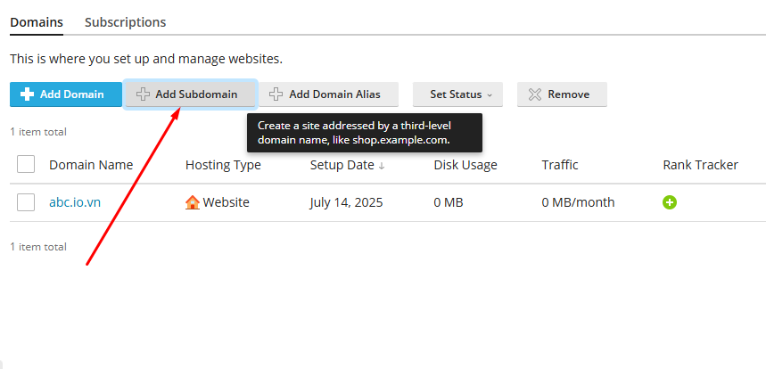
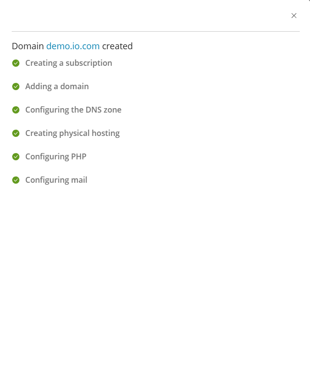
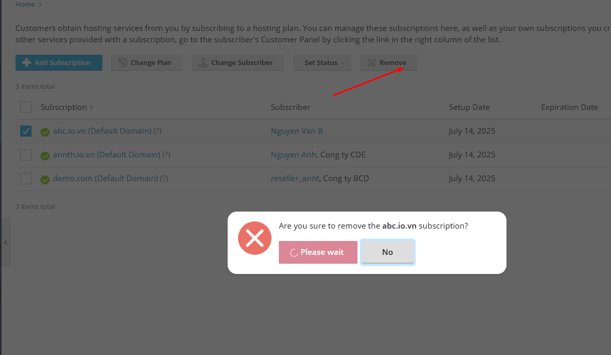

# Plesk Reseller  
- Sau khi đã hoàn tất việc tìm hiểu tổng quan và chi tiết về giao diện quản trị viên hệ thống (**Admin View**) trong Plesk — nơi cung cấp toàn quyền kiểm soát hạ tầng hosting — mình tiếp tục chuyển sang khám phá một vai trò khác trong hệ thống: **Reseller View**.
- Reseller là giao diện dành cho các đối tác trung gian, những người không trực tiếp quản lý máy chủ nhưng có khả năng cung cấp dịch vụ hosting cho khách hàng cuối. Đây là mô hình phổ biến trong các hệ thống phân phối dịch vụ web, nơi nhà cung cấp chính (Admin) ủy quyền cho các Reseller triển khai dịch vụ dưới thương hiệu riêng.
- Giao diện Reseller trong Plesk được thiết kế để cân bằng giữa khả năng quản lý và giới hạn quyền truy cập. Reseller có thể:
	- Tạo và quản lý tài khoản khách hàng.
	- Gán gói dịch vụ, tên miền, email và tài nguyên cho từng khách hàng.
	- Theo dõi mức sử dụng tài nguyên.
	- Cá nhân hóa giao diện (ví dụ: thay đổi logo, thông tin liên hệ).
	- Quản lý các ứng dụng web, cơ sở dữ liệu, bảo mật ở cấp độ khách hàng.
- Tuy nhiên, Reseller không có quyền truy cập vào các thiết lập hệ thống sâu như cấu hình máy chủ, cài đặt tiện ích mở rộng, hoặc thay đổi chính sách bảo mật toàn hệ thống.
- Trong phần tiếp theo, mình sẽ đi vào từng khu vực chức năng trong Reseller để phân tích chi tiết cách thức hoạt động, khả năng quản lý và giới hạn quyền của vai trò này trong Plesk.

- Tổng quan giao diện 
- 
- Các khu vực cấu hình chính trong giao diện này, bao gồm:
	- **Home**: Giao diện dashboard tổng quát, hiển thị thông tin hệ thống và truy cập nhanh các chức năng chính.
	- **Hosting Services**: Khu vực quản lý toàn bộ dịch vụ hosting mà Reseller cung cấp:
		- **Customers**: Tạo và quản lý tài khoản khách hàng.
		- **Domains**: Quản lý tên miền được cấp phát cho từng khách hàng.
		- **Subscriptions**: Quản lý gói dịch vụ và tài nguyên cho từng khách hàng.
		- **Service Plans**: Tạo và chỉnh sửa các gói dịch vụ hosting riêng cho khách hàng.
		- **Statistics**: Xem thống kê sử dụng tài nguyên của từng khách hàng.
		- **Tools & Utilities**: Các công cụ và tiện ích hỗ trợ quản trị hệ thống ở cấp độ Reseller.
		- **WordPress**: Quản lý ứng dụng WordPress được triển khai bởi khách hàng.
		- **Laravel**: Quản lý ứng dụng Laravel được triển khai bởi khách hàng.
	- **My Profile**: Khu vực quản lý thông tin cá nhân của Reseller:
		- **Profile & Preferences**: Cập nhật thông tin người dùng như tên, email, công ty.
		- **Change Password**: Đổi mật khẩu đăng nhập.
		- **Interface Preferences**: Tùy chỉnh giao diện người dùng như ngôn ngữ, bố cục.


## Home 
- Đây là giao diện cung cấp thông tin tổng quan về reseller 
- 
- Thông tin chung 
	- Setup date: Ngày thiết lập tài khoản Reseller
	- Service plan: Gói dịch vụ đang sử dụng
	- Disk space: Dung lượng đĩa đã sử dụng
	- Traffic: Lưu lượng truyền tải đã sử dụng
	- View detailed resource usage: Liên kết để xem chi tiết mức sử dụng tài nguyên.
	- My resources and permissions overview: Liên kết để xem tổng quan về tài nguyên được cấp và quyền hạn hiện tại của tài khoản Reseller.
- Quản lý 
	- Quản lý khách hàng: Customers:
		- Hiển thị số lượng khách hàng hiện tại:
		- Tổng số: 
		- Số lượng khách hàng vượt giới hạn tài nguyên: 
		- `Add new`: Liên kết để thêm khách hàng mới.
	- Quản lý đăng ký: All subscriptions
		- Hiển thị số lượng đăng ký dịch vụ hiện tại:
		- Tổng số
		- Số lượng đăng ký vượt giới hạn tài nguyên
	- Quản lý gói dịch vụ: Service plans
		- Hiển thị số lượng gói dịch vụ mà Reseller đã tạo:
		- Tổng số:
		- `Add new`: Liên kết để thêm gói mới.
- Tạo đăng ký riêng
	- Create own subscription: Liên kết cho phép Reseller tự tạo một đăng ký riêng để lưu trữ website của chính họ.

## Hosting Services 
- Đây là nơi Reseller thực hiện các thao tác quản lý dịch vụ hosting mà họ cung cấp cho khách hàng cuối.
- Khu vực này tập trung toàn bộ các chức năng mà một Reseller cần để vận hành dịch vụ hosting dưới thương hiệu riêng. Mặc dù không có quyền truy cập sâu vào hệ thống máy chủ như Admin, Reseller vẫn có thể kiểm soát tài nguyên, tạo gói dịch vụ, quản lý khách hàng và theo dõi hoạt động hệ thống trong phạm vi được cấp.
- Gồm các phần cấu hình 
	- **Customers**: Tạo và quản lý tài khoản khách hàng.
	- **Domains**: Quản lý tên miền được cấp phát cho từng khách hàng.
	- **Subscriptions**: Quản lý gói dịch vụ và tài nguyên cho từng khách hàng.
	- **Service Plans**: Tạo và chỉnh sửa các gói dịch vụ hosting riêng cho khách hàng.
	- **Statistics**: Xem thống kê sử dụng tài nguyên của từng khách hàng.
	- **Tools & Utilities**: Các công cụ và tiện ích hỗ trợ quản trị hệ thống ở cấp độ Reseller.
	- **WordPress**: Quản lý ứng dụng WordPress được triển khai bởi khách hàng.
	- **Laravel**: Quản lý ứng dụng Laravel được triển khai bởi khách hàng.
### Customer 
- Cho phép Reseller tạo mới, chỉnh sửa, khóa hoặc xóa tài khoản khách hàng.
- Mỗi khách hàng có thể được gán một hoặc nhiều subscription (gói dịch vụ).
- Reseller có thể theo dõi trạng thái hoạt động, mức sử dụng tài nguyên và thông tin liên hệ của từng khách hàng.
- Tổng quan 
- 
- 
- Các chức năng chính trong giao diện Customers:
	- Add Customer: Tạo mới một tài khoản khách hàng.
	- Change Status: Kích hoạt hoặc vô hiệu hóa tài khoản khách hàng.
	- Remove: Xóa tài khoản khách hàng khỏi hệ thống.
- Bảng danh sách khách hàng:
	- Customer Name: Tên tài khoản khách hàng. Click mở giao diện quản trị chi tiết khách hàng 
	- Subscription: Gói dịch vụ đang sử dụng.
	- Setup Date: Ngày tạo tài khoản.
	- Login as Customer: Cho phép reseller đăng nhập vào giao diện của khách hàng để hỗ trợ hoặc cấu hình.
- Giao diện quản trị domain/subscription customer: 
- Bằng việc click vào `Customer Name` tại danh sách khách hàng, chuyển tới giao diện thông tin chi tiết.
- 
- 
- Giao diện này gồm : 
- Domains - Subscriptions: Đây là nơi bạn xem và quản lý các website domain/subscription mà khách hàng đang sở hữu:
	- Domains : Giao diện cấu hình, quản lý websites 
		- 
		- Các nút chức năng 
			- Add Domain: Dùng thêm domain mới và tài khoản 
			- Subdomain: Thêm tên miền phụ 
				- 
				- Cấu hình subdomain và thư mục gốc của subdomain 
				- 
			- Domain Alias: Thêm bí danh tên miền.
				- 
				- Cấu hình tên miền alias cho tên miền nào. 
					- Tích chọn đồng bộ bản ghi DNS
					- Đồng bộ alias trên các dịch vụ khác : Mail, Web
					- Redirect with HTTP 301 code: Tuỳ chọn này có tác dụng khi khách truy cập mở URL của alias (bí danh tên miền), họ sẽ được chuyển hướng đến URL của tên miền chính. Plesk sử dụng phương pháp chuyển hướng HTTP 301 thân thiện với công cụ tìm kiếm, nghĩa là thứ hạng tìm kiếm sẽ không bị phân tán giữa các URL.
				- 
			- Set Status: Bật/tắt trạng thái hoạt động của website
			- Remove: Xóa website hoặc subdomain khỏi hệ thống
		- Danh sách website đang quản lý: Gồm các cột thông tin và nút thao tác 
			- 	
			- Domain Name: Tên miền. Click chuyển giao diện quản lý chi tiết tên miền website. 
			- Hosting Type: Loại hosting 
			- Setup date: Ngày cấu hình khởi tạo 
			- Disk Usage: Dung lượng sử dụng 
			- Traffic: Băng thông sử dụng 
			- Rank tracker: Click mở giao diện tiện ích SEO
			- Các nút chức năng 
				- `Open`: Truy cập website 
				- `Preview`: Mở phần xem trước 
				- `Manage in Customer Panel`: Cho phép reseller chuyển tới quản lý trong giao diện khách hàng
	- Subscriptions: Quản lý subscription (gói dịch vụ) của một khách hàng trong Plesk. Đây là nơi kiểm soát các website, tài nguyên và dịch vụ mà khách hàng đang sử dụng.
		- 	
		- Các nút chức năng
			- Add Subscription: Thêm gói dịch vụ mới vào tài khoản khách.
			- Change Plan: Dùng chuyển đổi gói hiện tại của 1 subscription sang gói dịch vụ khác. Cụ thể, chức năng này cho phép bạn:
				- Gán subscription hiện tại sang một gói dịch vụ khác đã được cấu hình sẵn.
				- Thêm hoặc gỡ bỏ các add-on (tiện ích bổ sung) nếu nhà cung cấp dịch vụ có hỗ trợ.
				- Thao tác chuyển plan 
					- Tích chọn Subscription cần chuyển và chọn `Change Plan`
					- 	
					- Tại giao diện cấu hình chọn gói plan mới cần chuyển và chọn `OK`
					- 	
			- Change Subscriber: Chuyển quyền sở hữu subscription sang khách hàng khác. Cụ thể chức năng này thực hiện 
				- Gán lại subscription cho một khách hàng khác.
				- Thay đổi nhà cung cấp dịch vụ (có thể là từ admin sang reseller hoặc ngược lại)
				- Subscription sẽ không còn liên kết với gói dịch vụ ban đầu
				- Subscription sẽ được chuyển sang trạng thái Custom, nghĩa là tài nguyên và quyền hạn sẽ giữ nguyên như cũ, không bị ràng buộc bởi gói dịch vụ nào.
				- Thao tác chuyển Subscriber
					- Chọn subscription cần chuyển và nhấn nút "Change Subscriber"
					- 	
					- Chọn khách hàng mới (subscriber mới) từ danh sách dropdown.
					- 	
					- Xác nhận việc chuyển đổi bằng nút `Reassign`
			- Set Status: Bật/tắt trạng thái hoạt động của Subscription
			- Remove: Xóa Subscription khỏi tài khoản 
		- Danh sách các Subscription của tài khoản: Gồm các cột thông tin và nút thao tác 
			- 	
			- Subscription: Tên gói đăng ký. Click chuyển tới giao diện quản lý Subscription
			- Setup Date: Ngày cấu hình khởi tạo 
			- Nút chức năng: Manage in Customer Panel: Cho phép reseller đăng nhập vào giao diện của khách hàng để quản lý.
	- Thông tin khách hàng (bên phải)
		- 	
		- Contact Name: Tên khách hàng 
		- Email: Email của customer 
		- Có thể chỉnh sửa các thông tin này bằng nút chức năng `Edit Contact Info`. Click chọn mở giao diện cấu hình thông tin khách hàng 
		- 
		- 
		- Creation Date: Ngày tạo tài khoản
		- Status: Trạng thái tài khoản. (Có nút `Suspend` để vô hiệu hoá nhanh tài khoản)
		- Username: Username đăng nhập Plesk của khách hàng 
		- Tùy chọn quản lý: 
		- Change login info: Đổi thông tin đăng nhập
		- 
		- 
		- Login as Customer: Cho phép reseller đăng nhập vào giao diện của khách hàng để hỗ trợ hoặc cấu hình.
		- Owner's description: Thay đổi mô tả của chủ sở hữu 
		- IIS Application Pool: Chuyển tới cài đặt IIS Application của khách hàng (Với Plesk chạy trên Windows)
			- Application Pool là một vùng cách ly trong IIS, nơi một hoặc nhiều website có thể chạy độc lập với các website khác. Mỗi pool có thể có:
				- Cấu hình riêng về hiệu năng
				- Quyền truy cập hệ thống riêng
				- Quản lý bộ nhớ và tiến trình riêng
			- IIS Application Pool của customer dùng để:
				- Tách biệt website của từng khách hàng: Giúp bảo mật và ổn định hơn, nếu một site bị lỗi thì không ảnh hưởng đến site khác.
				- Tùy chỉnh cấu hình theo nhu cầu: bật/tắt chế độ 32-bit, cấu hình số lượng tiến trình, thời gian timeout, giới hạn bộ nhớ...
				- Quản lý hiệu năng và tài nguyên: Giúp tối ưu hóa tốc độ xử lý và giảm tải cho server.
				- Hỗ trợ các ứng dụng ASP.NET, .NET Core: Cho phép chạy các ứng dụng web hiện đại trên nền Windows.
				- 
				- Giao diện này gồm 
					- 
					- Nút chức năng kích hoạt sử dụng IIS Application Pool, Quản trị bật/tắt/khởi động lại. Click chọn `Switch On` để bật. 
					- 
					- General Setting: Cấu hình cài đặt chung một IIS Application Pool trong Plesk, dùng để cấu hình cách ứng dụng web ASP.NET hoạt động trên server Windows. 
						- 
						- Các tùy chọn cấu hình:
							- Managed pipeline mode: 
								- Integrated: Đây là chế độ xử lý yêu cầu web của IIS. ASP.NET được tích hợp trực tiếp vào pipeline xử lý của IIS, cho phép xử lý linh hoạt và hiệu quả hơn.
								- Classic: ASP.NET chạy như một ISAPI extension, phù hợp với các ứng dụng cũ.
							- Enable 32-bit applications: Nếu bật (✓), IIS sẽ cho phép chạy ứng dụng 32-bit trên hệ điều hành 64-bit. Dùng khi ứng dụng hoặc thư viện bạn triển khai chỉ hỗ trợ 32-bit.
							- Load the user profile: Nếu bật (✓), IIS sẽ tải profile người dùng khi khởi động ứng dụng. Cần thiết nếu ứng dụng cần truy cập registry, thư mục người dùng, hoặc các thiết lập cá nhân.
					- Performance Settings: Cấu hình cài đặt hiệu năng của một IIS Application Pool trong Plesk. Đây là nơi cấu hình hiệu năng và hành vi của tiến trình xử lý web.
						- 
						- **The maximum number of worker processes**: Chỉ cho phép một tiến trình làm việc chạy, đảm bảo tính nhất quán và tránh xung đột trạng thái.
						- **Idle timeout (minutes)**: Nếu không có yêu cầu nào trong vòng 5 phút, tiến trình sẽ bị coi là không hoạt động.
						- **Idle timeout action**: Khi hết thời gian chờ, tiến trình sẽ bị kết thúc để giải phóng tài nguyên.
						- **Maximum CPU usage (%)**: Không giới hạn mức sử dụng CPU, tiến trình có thể dùng toàn bộ tài nguyên khi cần.
						- **Recycling at regular time intervals (minutes)**: Application pool sẽ được tái chế sau mỗi 1740 phút để làm mới tiến trình và tránh rò rỉ bộ nhớ.
						- **Recycling when the maximum number of requests is reached**: Không giới hạn số lượng yêu cầu, tiến trình có thể xử lý liên tục mà không bị tái chế.
						- **Recycling when the maximum amount of virtual memory is used**: Không giới hạn lượng bộ nhớ ảo mà tiến trình có thể sử dụng trước khi bị tái chế.
						- **Recycling when the maximum amount of private memory is used**: Không giới hạn lượng bộ nhớ riêng mà tiến trình có thể sử dụng trước khi bị tái chế.									
		- Remove customer: Xóa khách hàng khỏi hệ thống

- Ví dụ: Thao tác quản lý khách hàng trong Plesk
	- Mục tiêu: Tạo một khách hàng mới, cấp cho họ một gói dịch vụ (Subscription), và gán tên miền để họ có thể bắt đầu sử dụng hosting.
	- Bước 1: Tạo Customer mới
		1. Truy cập Hosting Services > Customers
		2. Nhấn Add a Customer
		- 
		3. Nhập thông tin:
			- Thông tin cơ bản 
				- 
				- Contact name: Nguyen Anh
				- Email: admin@abc.com
			- Các thông tin bổ sung tại phần `Additional customer information`: Phần này giúp quản trị viên lưu trữ thông tin liên hệ và quản lý khách hàng hiệu quả hơn
				- Company name – Tên công ty của khách hàng (nếu có).
				- Phone number – Số điện thoại liên hệ.
				- Address – Địa chỉ đầy đủ.
				- City – Thành phố.
				- State/Province – Bang hoặc tỉnh.
				- Postal/ZIP code – Mã bưu điện.
				- Country – Quốc gia (chọn từ menu dropdown).
				- Additional information – Thông tin bổ sung nếu cần ghi chú gì thêm.
				- Information for the administrator: Phần ghi chú cho quản trị viên. Phần này chỉ quản trị viên mới được phép thấy. 
			- Thông tin tài khoản đăng nhập quản trị Plesk 
				- 
				- Username: Tên tài khoản đăng nhập 
				- Password: Mật khẩu tài khoản. 
					- Có biểu tượng con mắt để hiển thị/ẩn mật khẩu. 
					- Có thể cấu hình hoặc sinh ngẫu nhiên bằng nút `Generate` bên phải textbox nhập mật khẩu. 
					- Có biểu tượng sao chép để chép nhanh mật khẩu đã sinh. 
				- Kích hoạt tài khoản: Activate account by e-mail: Tùy chọn gửi email kích hoạt đến khách hàng.
					- Nếu bật, tài khoản sẽ chưa hoạt động cho đến khi khách hàng nhấp vào liên kết trong email.
					- Nếu không bật, quản trị viên có thể kích hoạt thủ công sau.
			
	- Bước 2: Tạo Subscription cho khách hàng
		- Ngay trong giao diện tạo Customer, bạn sẽ thấy phần Create a subscription for the customer:
		- 
		1. Domain name: Nhập tên miền mà khách hàng sẽ sử dụng ví dụ `annth.io.vn`
		2. Service plan: Chọn gói dịch vụ từ danh sách (ví dụ: Default Domain). Gói này xác định tài nguyên như dung lượng, email, database, v.v.
		3. IP address: Chọn IP mặc định của máy chủ: Chọn IP dùng để truy cập qua FTP/RDP. 
		- Username: Tên người dùng hệ thống dùng để đăng nhập FTP hoặc SSH.
		- Password: Nhập mật khẩu hoặc nhấn nút Generate để tạo tự động.
		- Description (tùy chọn): Ghi chú nội bộ cho quản trị viên người cung cấp hosting admin hoặc reseller, không hiển thị với khách hàng.
		- Tùy chọn thêm:Nếu bạn muốn tùy chỉnh thông số subscription sau khi tạo, hãy tick vào ô: `Proceed to customizing the subscription parameters after the customer is created.`

	- Bước 3: Quản lý khách hàng
		- Click xác nhận để tạo Customer
		- 
		- Sau khi tạo xong: Khách hàng sẽ xuất hiện trong danh sách.
			- 
		- Bạn có thể:
			- Nhấn Login as Customer để truy cập giao diện của họ.
				- 
				- 
			- Change Status để tạm dừng hoặc kích hoạt lại tài khoản.
				- 
			- Remove: Xoá tài khoản ra khỏi hệ thống 
				- 
### Domains: Quản lý tên miền được cấp phát.
- 
- Giao diện này cho phép bạn:
	- Xem thông tin tất cả các tên miền đã đăng ký trong hệ thống.
	- Quản lý dịch vụ hosting liên quan đến các tên miền đó.
	- Thêm tên miền mới cho bản thân hoặc khách hàng hosting.
- Giao diện gồm các chức năng chính 
	- Add Domain: Dùng thêm tên miền mới vào hệ thống 
	- Add Subdomain: Tạo tên miền phụ cho domain đã có 
	- Add Domain Alias: Thêm bí danh cho tên miền
	- Set status : Cấu hình trạng thái của tên miền 
	- Remove : Xoá tên miền khỏi hệ thống 
- Bảng các tên miền có trong hệ thống. Bảng gồm các cột:
	- Domain Name (Tên miền): Tên miền đang được quản lý. Click chuyển tới giao diện quản trị website 
	- Subscriber (Người đăng ký): Người hoặc tổ chức sở hữu tên miền. Click chuyển tới giao diện quản trị Customer/ Reseller chủ quản.
	- Disk Usage (Dung lượng đĩa): Dung lượng đã sử dụng (tính bằng MB).
	- Traffic (Lưu lượng truy cập): Lưu lượng truy cập hàng tháng (MB/tháng).
	- Status (Trạng thái): Trạng thái hoạt động của tên miền.
		- Có thể chuyển nhanh trạng thái tại đây 
		- 
	- Các nút thao tác 
		- Wordpress Management: Click chuyển tới giao diện quản lý WP-Toolkit đối với website sử dụng 
		- Sitejet Builder: Chuyển tới giao diện CMS Sitejet tạo website đối với website sử dụng 
		- File Manager: Chuyển tới giao diện quản lý tệp tin của hosting 
		- 
		- 
		- Mail Account: Cấu hình tài khoản mail 
			- 
			- Chuyển tới giao diện quản lý email: Email Addresses, Mail Settings, Mailling Lists, Outgoing Mail Control.
			- 
			- Email Addresses: Giao diện quản lý tài khoản Email. 
				- Có thể thao tác tạo tài khoản mới hoặc xoá. 
				- Danh sách các tài khoản Email: Tên email, Tên liên lạc, Usage: Dung lượng sử dụng, 
					- Click tên email để tới trang cấu hình tài khoản mail 
					- 
					- Gồm các tab cấu hình 
						- General: Cấu hình chung với tài khoản mail 
						- 
							- Email address: Chỉnh sửa địa chỉ email. Đây cũng là username để đăng nhập vào Plesk nếu được cấp quyền.
							- External email address: Là địa chỉ email phụ bên ngoài (ví dụ: Gmail, Outlook). Có thể dùng để nhận thông báo hoặc khôi phục mật khẩu.
							- Password & Confirm password: Nhập mật khẩu cho tài khoản email.
								- Có nút Generate để tạo mật khẩu ngẫu nhiên.
								- Có thể hiện/ẩn mật khẩu khi nhập.
							- Password reset link: Tùy chọn hiển thị liên kết để đặt lại mật khẩu.
							- Mailbox size: Chọn dung lượng hộp thư:
								- Default size (Unlimited): không giới hạn.
								- Another size: nhập dung lượng cụ thể (MB/GB).
							- Description in Plesk: Mô tả tài khoản email. Mọi người có quyền truy cập tài khoản này sẽ thấy mô tả.
						- Forwarding: Cấu hình chuyển tiếp 
							- 
							- Switch on mail forwarding: Khi bật tùy chọn này, mọi email gửi đến địa chỉ gốc sẽ được chuyển tiếp đến địa chỉ email khác mà bạn chỉ định.
							- Do not deliver copies of forwarded emails to the Plesk mailbox: Nếu chọn tùy chọn này, email sẽ không được lưu lại trong hộp thư Plesk gốc. Email chỉ được chuyển tiếp đi, không giữ bản sao.
							- Email addresses để chuyển tiếp đến: Bạn có thể nhập một hoặc nhiều địa chỉ email để nhận email chuyển tiếp.
								- Mỗi địa chỉ trên một dòng.
								- Hoặc phân cách bằng dấu cách, dấu phẩy, hoặc dấu chấm phẩy.
						- Email alias: Cấu hình địa chỉ email phụ trỏ về một địa chỉ email chính
							- 
							- Danh sách các alias hiện có: Mỗi alias có nút Remove để xóa nếu không cần dùng nữa.
							- Thêm alias mới: Nhấp vào Add email alias để tạo địa chỉ phụ mới.
						- Auto-reply: Cấu hình tính năng trả lời tự động cho tài khoản Email 
							- 
							- Switch on auto-reply: Bật tính năng trả lời tự động cho email. Khi có ai đó gửi email đến địa chỉ này, hệ thống sẽ tự động gửi lại một tin nhắn phản hồi.
							- Auto-reply message subject: Tiêu đề của email phản hồi. Mặc định là: Re: <request_subject> → phản hồi theo tiêu đề email gốc.
							- Định dạng nội dung phản hồi
								- Plain text: văn bản đơn giản, tương thích với mọi ứng dụng email.
								- HTML: cho phép định dạng đẹp hơn (font, màu, v.v.), nhưng có thể không hiển thị đúng ở một số ứng dụng email.
							- Auto-reply message text: Nội dung email phản hồi tự động.
							- Forward to: Khi gửi phản hồi tự động, email gốc cũng sẽ được chuyển tiếp đến địa chỉ bạn chỉ định.
							- Giới hạn số lần phản hồi: Tùy chọn giới hạn số lần gửi phản hồi tự động đến cùng một địa chỉ email trong một ngày.
							- Switch off auto-reply on: Chọn ngày để tự động tắt chức năng trả lời tự động. Hữu ích khi bạn chỉ muốn bật auto-reply trong thời gian nghỉ phép, công tác,...
					- Các nút thao tác: Mail Client Setup (Mở pop-up hướng dẫn kết nối), Webmail (Click mở tới trang webmail) 
			- Mail Settings: Các thiết đặt về dịch vụ Mail với Domain cấu hình toàn bộ dịch vụ email cho domain, bao gồm bật/tắt dịch vụ, xử lý email lỗi, bảo mật bằng SSL, xác thực DKIM, và các tính năng nâng cao như webmail và autodiscover.
				- 
				- Mail service on this domain: Cấu hình dịch vụ Mail 
					- Enabled: Domain có thể gửi và nhận email.
					- Disabled: Plesk sẽ không cung cấp dịch vụ email cho domain này.
					- Not configured: Không chỉ tắt dịch vụ email mà còn xóa vĩnh viễn toàn bộ hộp thư và email đã gửi/nhận.
				- Xử lý email gửi đến người dùng không tồn tại
					- Forward to address: Chuyển email đến địa chỉ khác 
					- Redirect to external mail server: Chuyển tiếp đến máy chủ email bên ngoài qua địa chỉ IP.
					- Reject: Từ chối email gửi đến người dùng không tồn tại.
				- Webmail: Cấu hình giao diện webmail được sử dụng: MailEnable/ Horde / None 
				- SSL/TLS Certificates: Cấu hình chứng chỉ SSL cho Webmail và Mail service 
				- Các tùy chọn bổ sung
					- Enable mailing lists: bật chức năng danh sách gửi thư (newsletter, group mail,...).
					- Use DKIM: bật xác thực DKIM để chống spam, xác minh email gửi đi. Có thể chọn hoặc tạo DKIM Selector mới.
					- Enable mail autodiscover: bật tính năng tự động cấu hình email cho các ứng dụng như Outlook.
			- Mailling Lists: Cấu hình gửi email tới hàng loạt người dùng theo nhóm 
				- Các nút chức năng 
					- Tạo Mailling List mới: Click để mở giao diện tạo mailling list mới. 
						- 
						- 
						- Mailing list address: Nhập địa chỉ danh sách gửi thư. Đây là địa chỉ mà người gửi sẽ dùng để gửi email đến tất cả người đăng ký.
						- Switched on: Bật/tắt danh sách gửi thư.Nếu được chọn, danh sách sẽ hoạt động ngay sau khi tạo.
						- Mailing list administrator's email: Nhập địa chỉ email của người quản lý danh sách gửi thư. Người này sẽ nhận thông báo, quản lý người đăng ký, và xử lý các vấn đề liên quan.
						- Subscribers: Nhập danh sách email người nhận. Có thể nhập mỗi địa chỉ trên một dòng, hoặc phân cách bằng dấu cách, dấu phẩy, hoặc dấu chấm phẩy.
						- Notify administrator on the mailing list creation: Nếu được chọn, quản trị viên sẽ nhận email thông báo khi danh sách được tạo.				
					- Xoá Mailling List: Xoá mailling list được chọn 
						- 
				- Bảng liệt kê các Mailling List hiện có: 
					- 
					- Address: Tên mailling list 
					- Subscribers: Số lượng người đăng ký trong mailling list 
			- Outgoing Mail Control: Cấu hình quản lý mail gửi đi dùng để kiểm soát số lượng email gửi đi từ các đối tượng trong Plesk
				- General: Giao diện theo dõi việc gửi email ra ngoài từ hệ thống Plesk
				- 
					- Attempts to exceed limits: Thống kê số lượng đối tượng cố gắng vượt quá giới hạn gửi email trong khoảng thời gian báo cáo (1 tuần).
					- Domains / Subscription :Hiển thị danh sách domain hoặc subscription có hành vi gửi vượt giới hạn.
					- Objects attempting to exceed limits: Nếu có vi phạm, danh sách các đối tượng sẽ hiển thị tại đây.
				- Domains: Giám sát việc gửi mail ở cấp độ Domains 
					- 
					- Danh sách các tên miền kèm theo thông tin:
						- Name: Tên domain đang được giám sát 
						- Limit per Hour: Giới hạn số lượng email được phép gửi mỗi giờ 
						- Attempts after Reaching the Limit: Số lần cố gắng gửi email sau khi vượt giới hạn 
						- Last Attempt: Thời điểm gần nhất có hành vi vượt giới hạn 
						- Mail Status: Trạng thái gửi email hiện tại
						- Xem chi tiết bằng cách click chọn vào domain tạo cột Name 
						- 
						- 				
							- General (Tổng quan)
								- Mail status: Trạng thái dịch vụ mail của tên miền .
								- Current limit: Giới hạn gửi email mỗi giờ.
									- Có thể thay đổi giới hạn bằng nút chức năng `Change Limit`. Các tùy chọn cấu hình
										- 				
										- Default (50 messages per hour): Giới hạn mặc định: domain chỉ được gửi tối đa 50 email mỗi giờ.
										- Custom value for this domain: Cho phép nhập giá trị tùy chỉnh
											- `messages per hour`: cấu hình thông số cụ thể số mail được gửi / giờ
											- Unlimited: không giới hạn số lượng email gửi ra.	
							- Attempts to send mail after reaching the limit: Hiển thị số lần domain cố gắng gửi email vượt quá giới hạn. Cho phép chọn khoảng thời gian (ví dụ: trong ngày).
							- Sent messages (Thống kê email đã gửi)
								- Chọn ngày để xem thống kê.
								- Hiển thị số lượng email đã gửi theo từng giờ
				- Subscription: Giám sát việc gửi mới đối với các subscription
					- General (Tổng quan)
					- 				
					- Mail status: Trạng thái dịch vụ gửi email của Subscription
					- Current limit: Số mail được phép gửi tối đa mỗi giờ của Subscription
						- Có thể thay đổi giới hạn bằng nút chức năng `Change Limit`. Các tùy chọn cấu hình
						- 				
						- 			
						- Outgoing messages from a domain (per hour)
							- Default server-wide value: Mặc định toàn hệ thống là 50 email mỗi giờ cho mỗi domain.
							- Custom value for the subscription: Cho phép nhập giá trị tùy chỉnh:
								- [0] → chặn hoàn toàn việc gửi email từ domain.
								- Tùy chọn [ ] Unlimited → không giới hạn số lượng email gửi ra.
						- Outgoing messages from a subscription (per hour)
							- Default server-wide value: Mặc định toàn hệ thống là 100 email mỗi giờ cho mỗi subscription.
							- Custom value for the subscription: Cho phép nhập giá trị tùy chỉnh:
								- [0] → chặn hoàn toàn việc gửi email từ subscription.
								- [ ] Unlimited → không giới hạn số lượng email gửi ra.	
					- Attempts to send mail after reaching the limit: Hiển thị số lần subscription cố gắng gửi email vượt quá giới hạn. Cho phép chọn khoảng thời gian (ví dụ: theo ngày).
					- Sent messages (Thống kê email đã gửi): Hiển thị số lượng email đã gửi theo từng giờ. Có thể chọn ngày để xem thống kê.
		- Databases: Chuyển tới giao diện quản lý database 
		- 
		- 
		- Tại đây là giao diện tạo mới, quản lý các database.
		- Gồm danh sách các Database hiện có:
			- Thông tin: Host, user, bảng trong database, Kích thước 
			- Các nút chức năng: 
				- phpMyAdmin: Click mở giao diện phpmyadmin 
				- Connection Info: Click mở giao diện thông tin kết nối tới DB
					- 
					- 
				- Copy: Sao chép database tới 1 DB có sẵn hoặc tạo 1 DB mới 
					- 
					- 
						- Destination database server : Server đích 
						- Destination database : Database đích sao chép tới. 
							- Create database with name: Tạo mới 
							- Copy to existing database: Copy to database đã có. 
				- Export/Import Dump: Dùng xuất và nhập file Dump dữ liệu 
					- 
					- 
				- Check and repair: Kiểm tra và sửa chữa lỗi DB 
				- Remote Database: Xoá cơ sở dữ liệu 
				- Move to Subscription: Di chuyển cơ sở dữ liệu sang một Subscription khác. 
			- Nút chức năng 
				- User Management: Quản lý người dùng cơ sở dữ liệu 
					- 
					- 
					- Các nút chức năng: 
						- Add Database User: Thêm người dùng DB mới.
						- 
						- 
						- Các cấu hình: 
							- Database Server: Máy chủ CSDL 
							- Database username: tên người dùng 
							- Password: Mật khẩu
							- Database: Chọn DB muốn thêm user 
							- Access Control:
								- Allow local connections only: Chỉ cho phép kết nối local 
								- Allow remote connections from any host: Cho phép kết nối từ xa với bất kỳ IP nào.
								- Allow remote connections from: Chỉ có phép kết nối từ xa với IP cụ thể.
						- Danh sách các tài khoản cơ sở dữ liệu 
							- Name: Tên tài khoản
								- Click để chuyển tới giao diện chỉnh sửa tài khoản 
								- 
								- 							
								- Tại đây có thể 
									- Cấu hình username/password. 
									- Chọn database
									- Cấu hình roles và phân quyền chi tiết 
									- Cấu hình quản lý truy cập 
							- Database: Tên CSDL 
							- Database Server: Tên máy chủ hoạt động 
				- Backup Manager: Quản lý backup 
					- 
					- 
					- Các nút chức năng:
						- Tạo backup mới 
						- 
						- Có thể cấu hình 
							- Nội dung bản sao lưu: Cấu hình, Mail, Tệp người dùng, CSDL 
							- Nơi lưu trữ
							- Loại sao lưu: Đầy đủ/Chỉ sao lưu thay đổi 
							- Ghi chú 
							- Các cài đặt bổ sung: Bỏ qua file log, bỏ qua tệp đặc biệt, gửi thông báo,...
						- 
						- Tải lên bản backup
						- Xoá bản backup 
						- Schedule: Lên lịch Backup
							- 
							- 
							- Gồm các cấu hình: 
								- Kích hoạt task 
								- Cấu hình thời gian thực thi
								- Chọn kiểu backup
								- Cấu hình thời gian thực hiện tác vụ backup full
								- Cấu hình số lượng các bản full backup được lưu trữ. 
						- Cấu hình Server lưu trữ từ xa 
							- Click tới giao diện thêm máy chủ FTPS để cấu hình 
							- 
							- 
							
					- Hosting Settings: Quản lý các cài đặt cấu hình của hosting 
						- 	
						- Domain name: Tên miền. 
						- Hosting type: 
							- Hosting type: Loại Hosting Website/ Forwarding / No Web Hosting 
							- Preferred Domain: Tên miền ưu tiên. Nếu chọn, Plesk sẽ chuyển hướng SEO-friendly (HTTP 301) từ các biến thể khác về tên miền này.
							- Document Root: Thư mục gốc chứa mã nguồn
						- SSL/TLS support
							- Enabled: Bật mã hóa kết nối giữa website và trình duyệt người dùng.
							- Redirect visitors from HTTP to HTTPS: Tự động chuyển hướng người dùng từ HTTP sang HTTPS bằng redirect 301 (tốt cho SEO).
							- Certificate: Cấu hình chứng chỉ SSL/TLS.
						- Web statistics: Cấu hình công cụ dùng phân tích website. Có thể cấu hình sử dụng Webalizer, AWStats hoặc tắt. 		
						- System user's credentials: Cấu hình thông tin đăng nhập của người dùng hệ thống gắn với domain 
							- Dùng để Truy cập FTP, Quản lý file qua File Manager, Thực hiện các tác vụ liên quan đến hosting.
							- Bao gồm: Username / Password. Có thể thay đổi mật khẩu hoặc tạo mới nếu cần.
						- Remote Desktop access: bị cấm mặc định 
						- IP addresses: Địa chỉ IP sử dụng 
				- Các nút thao tác khác: 
					- 
					- Open: Mở website 
					- Preview: Mở phần preview 
					- Manage in Custom Panel : Cho phép reseller đăng nhập chuyển tới giao diện của khách hàng để quản lý, cấu hình. 
					- Move Domain: Chuyển tên miền tới subscription khác 
					- 
					- Change Domain Name: Thay đổi tên tên miền 
					- 
					- 
				
- Ví dụ thao tác thêm tên miền mới 
	- Click chọn `Add Domain` trong `Domains` của Plesk 
		- 
	- Tại giao diện khởi tạo cung cấp nhiều lựa chọn cấu hình 
		- 
		- Trang khởi đầu cho HTML hoặc PHP: Tạo một trang web đơn giản sử dụng HTML hoặc PHP, thường dành cho người mới bắt đầu hoặc các dự án nhỏ.
		- Trình tạo website kéo & thả: Công cụ trực quan giúp bạn xây dựng website mà không cần viết mã, phù hợp với người không chuyên về kỹ thuật.
		- Website chạy WordPress mới nhất: Tạo một website sử dụng nền tảng WordPress – phổ biến cho blog, cửa hàng online, và trang tin tức.
		- Kích hoạt Node.js trên tên miền: Dành cho các ứng dụng web sử dụng Node.js – thường là các ứng dụng thời gian thực hoặc có tính tương tác cao.
		- Tạo tên miền chỉ dùng cho email: Thiết lập tên miền để sử dụng cho dịch vụ email, không có website.
		- Từ máy cục bộ: Tải lên website từ máy tính cá nhân.
		- Lấy file từ Git repository: Tạo website bằng cách lấy mã nguồn từ kho lưu trữ Git – phù hợp với lập trình viên.
		- Cài đặt ứng dụng Laravel mới: Tạo website sử dụng framework Laravel – phổ biến với các ứng dụng web phức tạp.
		- Từ dịch vụ hosting khác: Di chuyển website từ nhà cung cấp hosting khác sang đây.
	- Chọn tạo `BlankWebsite` tới phần cấu hình
		- Tên tên miền
		- Chọn webspace: Có thể tạo subscription mới hoặc sử dụng chung tài nguyên với subscription đã có 
		- 
		- Plesk cũng gợi ý tạo khách hàng mới ngay từ giao diện này tích chọn `Assign this domain to a customer` để cấu hình. Có thể gán vào khách hàng đã có hoặc tạo khách hàng mới 
		- 
		- 
	- Sau khi đã cấu hình xong click chọn `AddDomain` 
		- 
	- Domain được tạo
		- 


## Subscriptions
- Quản lý các subscription có trong hệ thống 

### Tổng quan 
- Các nút chức năng 
	- 
	- Add subscription: Thêm gói đăng ký mới. 
		- Click chọn để thêm gói mới 
		- 
		- 
		- Tại giao diện khởi tạo cung cấp nhiều lựa chọn cấu hình 
			- Trang khởi đầu cho HTML hoặc PHP: Tạo một trang web đơn giản sử dụng HTML hoặc PHP, thường dành cho người mới bắt đầu hoặc các dự án nhỏ.
			- Trình tạo website kéo & thả: Công cụ trực quan giúp bạn xây dựng website mà không cần viết mã, phù hợp với người không chuyên về kỹ thuật.
			- Website chạy WordPress mới nhất: Tạo một website sử dụng nền tảng WordPress – phổ biến cho blog, cửa hàng online, và trang tin tức.
			- Kích hoạt Node.js trên tên miền: Dành cho các ứng dụng web sử dụng Node.js – thường là các ứng dụng thời gian thực hoặc có tính tương tác cao.
			- Tạo tên miền chỉ dùng cho email: Thiết lập tên miền để sử dụng cho dịch vụ email, không có website.
			- Từ máy cục bộ: Tải lên website từ máy tính cá nhân.
			- Lấy file từ Git repository: Tạo website bằng cách lấy mã nguồn từ kho lưu trữ Git – phù hợp với lập trình viên.
			- Cài đặt ứng dụng Laravel mới: Tạo website sử dụng framework Laravel – phổ biến với các ứng dụng web phức tạp.
			- Từ dịch vụ hosting khác: Di chuyển website từ nhà cung cấp hosting khác sang đây.
		- Sau khi đã chọn kiểu web xong thực hiện tới phần cấu hình
		- 
			- Domain name: Đây là tên miền bạn muốn sử dụng cho website
			- Service plan: Là gói dịch vụ bạn chọn cho tên miền này. Gói dịch vụ có thể quy định dung lượng, băng thông, số lượng email, v.v. Gói này được tạo trong phần service plans 
			- Additional subscription settings
				- IP address (shared): Địa chỉ IP dùng chung để truy cập file qua FTP hoặc RDP.
				- Username: Tên đăng nhập để quản lý hosting
				- Password: Mật khẩu có thể được tạo tự động bằng nút "Generate".
				- Description: Mô tả nội bộ, chỉ người quản trị hosting (Plesk admin hoặc reseller) mới thấy.
			- Tùy chọn sau khi tạo (Proceed to customizing the subscription parameters after it is created): Bạn có thể tùy chỉnh thêm sau khi tạo subscription, nhưng nếu làm vậy thì subscription sẽ bị khóa để đồng bộ.
		- Click chọn Add Subscription để tạo subscription mới với các thông tin đã nhập.
			- 
			- 
	- Change Plan: Thay đổi gói cấu hình cho Subscription được chọn 
		- 
		- 
	- Change Subscriber: Thay đổi subscriber cho Subscription được chọn 
		- 
		- 
	- Set status: Cấu hình trạng thái của Subscription 
		- 
	- Remove: Xoá Subscription khỏi hệ thống 
		- 

- Bảng các subscription: gồm các cột thông tin 
	- 
	- Subscription: Tên gói đăng ký. Click mở giao diện quản trị chi tiết 
	- Subscriber: Tên chủ sở hữu có thể là Admin/ Reseller/ Customer. Click chuyển tới giao diện quản lý. 
	- Setup Date: Ngày cấu hình 
	- Expiration Date: Ngày hết hạn gói dịch vụ 
	- Manage in Reseller/Customer Panel: Cho phép reseller đăng nhập trang của customer để quản lý/ cấu hình 
	
### Giao diện quản trị subscription. 
- Bằng việc click vào `Subscription` tại danh sách Subscription, chuyển tới giao diện thông tin chi tiết.
- 
- 
- Giao diện này chứa cấu hình quản trị tất cả các tên miền có trong subscription.
- Giao diện này gồm các mục chính để quản lý toàn bộ dịch vụ hosting:
	- Websites & Domains: Quản lý tên miền và website.
	- Mail: Cấu hình email theo tên miền.
	- Applications: Cài đặt ứng dụng như WordPress, Joomla, v.v.
	- Files: Quản lý tệp tin trên hosting.
	- Databases: Tạo và quản lý cơ sở dữ liệu (MySQL, PostgreSQL...).
	- Statistics: Thống kê lưu lượng truy cập, dung lượng sử dụng.
	- Users: Quản lý người dùng có quyền truy cập hosting.
	- Account: 
	- Wordpress:
	- SEO: 
#### Websites and Domains 
- Giao diện Websites & Domains dùng để quản lý toàn bộ website, tên miền, và các dịch vụ liên quan như email, cơ sở dữ liệu, SSL, và DNS. Đây là nơi bạn cấu hình và kiểm soát hoạt động của từng website trên hosting.
- Các nút chức năng 
	- Add Domain: Dùng thêm domain mới vào subscription
		- Click chọn để thêm tên miền mới 
		- 
		- Tại giao diện khởi tạo cung cấp nhiều lựa chọn cấu hình
		- 
		- Sau khi đã chọn kiểu khởi tạo chuyển tới phần cấu hình 
		- Các trường cấu hình
		- 	
			- Domain name: Tên miền bạn muốn tạo
			- Hosting type: Chọn loại dịch vụ lưu trữ. Web Hosting/ Forwarding/ No Hosting 
			- Activate the DNS service: Bật dịch vụ DNS để tên miền hoạt động.
			- Activate the mail service: Bật dịch vụ email cho tên miền.
			- Hosting Settings
				- Document root: Thư mục gốc của website trên máy chủ, ví dụ: /demo3.io.vn.
				- Preferred domain: Chọn định dạng tên miền ưu tiên để chuyển hướng người dùng hoặc không chuyển hướng (None)
		- Sau khi đã cấu hình xong chọn Add domain để tiến hành thêm 
		- 
	- Add SubDomain: Dùng thêm subdomain 
		- Click mở giao diện cấu hình tạo subdomain 
		- 
		- 
	- Add Domain Alias: Dùng thêm bí danh cho tên miền 
		- Click mở giao diện cấu hình tạo domain alias  
		- 
		- 
	
- Danh sách các domain quản lý
	- 
	- Hiển thị danh sách các website(domain hoặc subdomain) bạn đang quản lý.
	- Mỗi website sẽ có các công cụ riêng để cấu hình và kiểm soát. (Trình bày cụ thể bên dưới) 
	- Gồm các cột thông tin
		- Domain Name : Tên miền 
		- Status: Trạng thái. Có thể cấu hình trạng thái nhanh tại đây. 
		- 
		- Disk usage: Dung lượng đã sử dụng 
		- Traffic: Lưu lượng đã sử dụng MB/tháng 
		- Các nút chức năng : Tính năng tương tự phần danh sách các domain trong `Domain` 
		- 
			- Wordpress Management: Click chuyển tới giao diện quản lý WP-Toolkit đối với website sử dụng 
			- Sitejet Builder: Chuyển tới giao diện CMS Sitejet tạo website 
			- File Manager: Chuyển tới giao diện quản lý tệp tin của hosting 
			- Mail Account: Cấu hình tài khoản mail 
			- Databases: Chuyển tới giao diện quản lý database 
			- Hosting Settings: Quản lý các cài đặt cấu hình của hosting 
			- Các nút thao tác khác: 
				- Move Domain: Chuyển tên miền tới subscription khác 
				- Change Domain Name: Thay đổi tên tên miền 
				- Remove Website: Xoá website đã khởi tạo với tên miền trên hosting 

- Panel các chức năng khác và thông tin về subscription (bên phải)
	- 
	- Backup & Restore : Quản lý sao lưu và phục hồi 
		- 
		- 
		- Các nút chức năng:
			- Tạo backup mới 
			- 
			- 
			- Có thể cấu hình 
				- Nội dung bản sao lưu: Cấu hình, Mail, Tệp người dùng, CSDL 
				- Nơi lưu trữ
				- Loại sao lưu: Đầy đủ/Chỉ sao lưu thay đổi 
				- Ghi chú:
				- Các cài đặt bổ sung: Bỏ qua file log, bỏ qua tệp đặc biệt, gửi thông báo,...
			- Tải lên bản backup
				- 
				- Bạn có thể chọn file sao lưu từ máy tính để tải lên Plesk.
					- Dung lượng tối đa cho mỗi file là 2 GB.
					- Có tùy chọn Upload More Files nếu bạn cần tải nhiều file.
				- Cài đặt bảo mật cho sao lưu
					- Plesk sẽ kiểm tra cấu trúc và chữ ký của file sao lưu.
					- Nếu file bị sửa đổi, hỏng, hoặc tạo từ máy chủ khác, Plesk sẽ không tin tưởng file đó.
					- Bạn có thể chọn "Upload backup files without a valid signature" nếu bạn tin tưởng nguồn file, nhưng có rủi ro bảo mật.
				- Bảo vệ bằng mật khẩu
					- Nếu file sao lưu có mật khẩu, bạn cần nhập vào để khôi phục.
					- Nếu nhập sai mật khẩu, Plesk vẫn tải lên file, nhưng sẽ yêu cầu mật khẩu đúng khi khôi phục.
			- Xoá bản backup: Xoá bản backup đang chọn
			- Schedule: Lên lịch Backup
				- 
				- 
				- Gồm các cấu hình: 
					- Kích hoạt task 
					- Cấu hình thời gian thực thi
					- Chọn kiểu backup
					- Cấu hình thời gian thực hiện tác vụ backup full
					- Cấu hình số lượng các bản full backup được lưu trữ. 
					- Các cài đặt cấu hình của bản backup.
			- Cấu hình Server lưu trữ từ xa sử dụng FTPS
				- Click tới giao diện thêm máy chủ FTPS để cấu hình 
				- 
				- 
	- Databases: Quản lý cơ sở dữ liệu. Chuyển tới tab quản lý Databases của hosting 
		- 
	- Outgoing Mail Control: Cấu hình quản lý mail gửi đi dùng để kiểm soát số lượng email gửi đi từ các đối tượng trong Plesk
		- 
		- General: Giao diện theo dõi việc gửi email ra ngoài từ hệ thống Plesk
		- 
			- Attempts to exceed limits: Thống kê số lượng đối tượng cố gắng vượt quá giới hạn gửi email trong khoảng thời gian báo cáo (1 tuần).
			- Domains / Subscription :Hiển thị danh sách domain hoặc subscription có hành vi gửi vượt giới hạn.
			- Objects attempting to exceed limits: Nếu có vi phạm, danh sách các đối tượng sẽ hiển thị tại đây.
		- Domains: Giám sát việc gửi mail ở cấp độ Domains 
			- Danh sách các tên miền kèm theo thông tin:
				- Name: Tên domain đang được giám sát 
				- Limit per Hour: Giới hạn số lượng email được phép gửi mỗi giờ 
				- Attempts after Reaching the Limit: Số lần cố gắng gửi email sau khi vượt giới hạn 
				- Last Attempt: Thời điểm gần nhất có hành vi vượt giới hạn 
				- Mail Status: Trạng thái gửi email hiện tại
				- Xem chi tiết bằng cách click chọn vào domain tại cột Name 
				- 
				- 
				- General (Tổng quan)
					- Mail status: Trạng thái dịch vụ mail của tên miền .
					- Current limit: Giới hạn gửi email mỗi giờ.
					- Có thể thay đổi giới hạn bằng nút chức năng `Change Limit`. Các tùy chọn cấu hình
					- 
						- Default (50 messages per hour): Giới hạn mặc định: domain chỉ được gửi tối đa 50 email mỗi giờ.
						- Custom value for this domain: Cho phép nhập giá trị tùy chỉnh
							- `messages per hour`: cấu hình thông số cụ thể số mail được gửi / giờ
							- Unlimited: không giới hạn số lượng email gửi ra.	
					- Attempts to send mail after reaching the limit: Hiển thị số lần domain cố gắng gửi email vượt quá giới hạn. Cho phép chọn khoảng thời gian (ví dụ: trong ngày).
					- Sent messages (Thống kê email đã gửi)
						- Chọn ngày để xem thống kê.
						- Hiển thị số lượng email đã gửi theo từng giờ
		- Subscription: Giám sát việc gửi mới đối với các subscription
			- General (Tổng quan)
			- 
			- Mail status: Trạng thái dịch vụ gửi email của Subscription
			- Current limit: Số mail được phép gửi tối đa mỗi giờ của Subscription
				- Có thể thay đổi giới hạn bằng nút chức năng `Change Limit`. Các tùy chọn cấu hình
				- 			
				- Outgoing messages from a domain (per hour)
					- Default server-wide value: Mặc định toàn hệ thống là 50 email mỗi giờ cho mỗi domain.
					- Custom value for the subscription: Cho phép nhập giá trị tùy chỉnh:
					- [0] → chặn hoàn toàn việc gửi email từ domain.
					- Tùy chọn [ ] Unlimited → không giới hạn số lượng email gửi ra.
				- Outgoing messages from a subscription (per hour)
					- Default server-wide value: Mặc định toàn hệ thống là 100 email mỗi giờ cho mỗi subscription.
					- Custom value for the subscription: Cho phép nhập giá trị tùy chỉnh:
						- [0] → chặn hoàn toàn việc gửi email từ subscription.
						- [ ] Unlimited → không giới hạn số lượng email gửi ra.	
			- Attempts to send mail after reaching the limit: Hiển thị số lần subscription cố gắng gửi email vượt quá giới hạn. Cho phép chọn khoảng thời gian (ví dụ: theo ngày).
			- Sent messages (Thống kê email đã gửi): Hiển thị số lượng email đã gửi theo từng giờ. Có thể chọn ngày để xem thống kê.
	- WordPress: Quản lý cài đặt WordPress. Click chuyển tới giao diện quản lý Wordpress của WP-Toolkit
		- 			
		- 			
	- Action Log: Xem lịch sử hoạt động.
		- 	
		- 	
		- Các nút chức năng 
			- Download: Tải về file chứa log 
			- 	
			- Refresh: Làm mới để lấy bản ghi mới nhất 
			- Settings: Mở giao diện cấu hình các actions sẽ được ghi lại 
			- 	
			- 	
			- Clear items: Xoá bản ghi 
			- 	
		- Bảng chi tiết các hành động được ghi lại gồm các cột thông tin 
			- Date: Ngày tháng hành động diễn ra 
			- IP: Địa chỉ IP thiết lập 
			- User: Tài khoản thực hiện cấu hình 
			- Action: hành động thao tác được thực hiện 
			- Details: Thông tin chi tiết thường là tác động của action tới domain nào 
			- 	
	- Thông tin hệ thống
		- 	
		- IP address: Địa chỉ IP đang dùng.
		- System user: Tên người dùng hệ thống để truy cập hosting.
		- Manage in Customer/Reseller Panel: Quản lý trong giao diện khách hàng/nhà phân phối.
		- Subscription status: Trạng thái gói dịch vụ có thể thao tác active hoặc suspend nhanh tại đây.
		- Administrator's description: Ghi chú cho quản trị viên reseller, người dùng không có quyền xem 
		- Disk space: Dung lượng đã sử dụng.
		- Traffic: Lưu lượng truy cập đã dùng.
		- Có thêm xem các thông tin phân tích chi tiết hơn bằng nút `View more Statistics`: Click chuyển tới tab phân tích. 
	- Tùy chọn quản lý
		- Subscriber: Hiển thị chủ sở hữu có thể thay đổi nhanh bằng nút `Change subscriber` Thay đổi người đăng ký dịch vụ.
		- Service plan: Hiển thị gói dịch vụ Subscription được gán 
		- Add-ons: Hiển thị các tiện ích được cài nếu có 
		- Change plan/add-ons: Thay đổi gói dịch vụ hoặc thêm tiện ích. Click mở giao diện chuyển đổi plan 
			- 	
			- 	
		- Customize: Tùy chỉnh subscription. Click chuyển tới giao diện custom gói đăng ký 
			- 	
			- Cụ thể các thông số cấu hình trình bày tại phần tạo plans `Service Plan` 
			- 	
		- Remove Subscription: Xóa gói dịch vụ.

- Giao diện chứa công cụ riêng để cấu hình và kiểm soát từng website:
- Giao diện này nằm trong danh sách các domain của subscription
- Giao diện này gồm 
- Khung preview website kèm nút chức năng mở website/ mở preview 
	- 	
	- Bên dưới là các thông kê về 
		- Dung lượng ổ đĩa đã sử dụng
		- Lưu lượng đã sử dụng trong tháng 
		- Nút chức năng `More Statistics` xem các phân tích chi tiết hơn tại tab `Statistics`
- Các tab quản lý 
	- Wordpress: Giao diện quản lý Wordpress của tiện ích WP-Toolkit. Trình bày chi tiết tại phần tìm hiểu tiện ích WP-Toolkits
	- Dashboard: Các cấu hình quản lý chung của website 
	- Hosting & DNS: Các cấu hình liên quan tới hosting là DNS 
	- Mail: Các cấu hình dịch vụ mail 
	- Get started: Giao diện khởi tạo đối với website mới. 

- Dashboard: Cung cấp các cấu hình quản lý chính cho website. 
	- 	
	- Cấu hình cơ bản & Dữ liệu: 
	- Connection Info – Thông tin truy cập FTP, DB.
		- Click mở giao diện cung cấp thông tin tài khoản mật khẩu FTP/Database 
		- 	
		- 	
		- Thông tin người dùng hệ thống: 
			- IP máy chủ, Tài khoản, Mật khẩu để đăng nhập vào Plesk quản lý Hosting 
			- Các nút chức năng 
				- Additional FTP accounts: Click chuyển tới giao diện quản lý tài khoản FTP 
				- Manage Access: Click chuyển tới thiết lập truy cập trong Cài đặt Hosting 
		- Thông tin cơ sở dữ liệu 
			- Host, tên database, tài khoản, mật khẩu truy cập 
			- Các nút chức năng 
				- phpMyAdmin: Click chuyển tới web đăng nhập phpMyAdmin
				- Manage Databases: Click chuyển tới giao diện quản lý các DB có trong Domain 
	- Files – Quản lý tệp tin trên hosting. Tại đây bạn có thể quản lý tệp tin, down/upload file source website. 
		- 	
		- 	
	- Databases – Tạo/quản lý CSDL.
		- 	
		- 	
		- Tại đây là giao diện tạo mới, quản lý các database.
			- Gồm danh sách các Database hiện có:
				- Thông tin: Host, user, bảng trong database, Kích thước 
				- Các nút chức năng: 
					- phpMyAdmin: Click mở giao diện phpmyadmin 
					- Connection Info: Click mở giao diện thông tin kết nối tới DB
						- 
						- 
					- Copy: Sao chép database tới 1 DB có sẵn hoặc tạo 1 DB mới 
						- 
						- 
					- Export/Import Dump: Dùng xuất và nhập file Dump dữ liệu 
						- 
						- 
					- Check and repair: Kiểm tra và sửa chữa lỗi DB 
					- Remote Database: Xoá cơ sở dữ liệu 
					- Move to Subscription: Di chuyển cơ sở dữ liệu sang một Subscription khác. 
				- Nút chức năng 
					- User Management: Quản lý người dùng cơ sở dữ liệu 
						- 
						- 
						- Các nút chức năng: 
							- Add Database User: Thêm người dùng DB mới.
							- 
							- 
							- Các cấu hình: 
								- Database Server: Máy chủ CSDL 
								- Database username: tên người dùng 
								- Password: Mật khẩu
								- Database: Chọn DB muốn thêm user 
								- Access Control:
									- Allow local connections only: Chỉ cho phép kết nối local 
									- Allow remote connections from any host: Cho phép kết nối từ xa với bất kỳ IP nào.
									- Allow remote connections from: Chỉ có phép kết nối từ xa với IP cụ thể.
							- Danh sách các tài khoản cơ sở dữ liệu 
								- Name: Tên tài khoản
									- Click để chuyển tới giao diện chỉnh sửa tài khoản 
									- 
									- 							
									- Tại đây có thể 
										- Cấu hình username/password. 
										- Chọn database
										- Cấu hình roles và phân quyền chi tiết 
										- Cấu hình quản lý truy cập 
								- Database: Tên CSDL 
								- Database Server: Tên máy chủ hoạt động 
					- Backup & Restore : Quản lý sao lưu và phục hồi 
						- 
						- 
						- Các nút chức năng:
							- Tạo backup mới 
							- 
							- 
							- Có thể cấu hình 
								- Nội dung bản sao lưu: Cấu hình, Mail, Tệp người dùng, CSDL 
								- Nơi lưu trữ
								- Loại sao lưu: Đầy đủ/Chỉ sao lưu thay đổi 
								- Ghi chú:
								- Các cài đặt bổ sung: Bỏ qua file log, bỏ qua tệp đặc biệt, gửi thông báo,...
							- Tải lên bản backup
								- 
								- Bạn có thể chọn file sao lưu từ máy tính để tải lên Plesk.
									- Dung lượng tối đa cho mỗi file là 2 GB.
									- Có tùy chọn Upload More Files nếu bạn cần tải nhiều file.
								- Cài đặt bảo mật cho sao lưu
									- Plesk sẽ kiểm tra cấu trúc và chữ ký của file sao lưu.
									- Nếu file bị sửa đổi, hỏng, hoặc tạo từ máy chủ khác, Plesk sẽ không tin tưởng file đó.
									- Bạn có thể chọn "Upload backup files without a valid signature" nếu bạn tin tưởng nguồn file, nhưng có rủi ro bảo mật.
								- Bảo vệ bằng mật khẩu
									- Nếu file sao lưu có mật khẩu, bạn cần nhập vào để khôi phục.
									- Nếu nhập sai mật khẩu, Plesk vẫn tải lên file, nhưng sẽ yêu cầu mật khẩu đúng khi khôi phục.
								- 
							- Xoá bản backup: Xoá bản backup đang chọn
								- 
							- Schedule: Lên lịch Backup
								- 
								- 
								- Gồm các cấu hình: 
									- Kích hoạt task 
									- Cấu hình thời gian thực thi
									- Chọn kiểu backup
									- Cấu hình thời gian thực hiện tác vụ backup full
									- Cấu hình số lượng các bản full backup được lưu trữ. 
									- Các cài đặt cấu hình của bản backup.
							- Cấu hình Server lưu trữ từ xa sử dụng FTPS
								- Click tới giao diện thêm máy chủ FTPS để cấu hình 
								- 
								- 
								- 
	- ODBC Data Sources – Quản lý nguồn kết nối dữ liệu ODBC
		- 
		- Khởi tạo ODBC DSN mới 
		- 
		- 
		- Nút chức năng	
			- Tạo kết nối mới : Các thông số cấu hình 
				- Tên kết nối 
				- Mô tả kết nối 
				- Kiểu driver 
					- SQL Server: Các thông số cấu hình
					- 
						- Thông tin kết nối chính
							- [DRIVER] Driver: Trình điều khiển sử dụng – SQL Server.
							- [SERVER]: Tên máy chủ cơ sở dữ liệu 
							- [UID] Login ID: Tên đăng nhập để truy cập SQL Server.
							- [PWD] Password: Mật khẩu tương ứng với UID.
						- Tùy chọn bổ sung
							- [DATABASE] Default database: Tên cơ sở dữ liệu mặc định sẽ kết nối.
							- [APP] Application name: Tên ứng dụng đang sử dụng kết nối này.
							- [WSID] Workstation ID: ID của máy trạm đang thực hiện kết nối.
							- [LANGUAGE] Default language: Ngôn ngữ mặc định cho kết nối.
							- [OEMTOANSI]: Tùy chọn chuyển đổi ký tự mở rộng sang mã OEM.
					- Microsoft Access Driver: Các thông số cấu hình 
					- 
						- Thông tin kết nối cơ bản
							- [DRIVER]: Trình điều khiển sử dụng – Microsoft Access Driver (-.mdb).
							- [DBQ]: Đường dẫn đến file cơ sở dữ liệu Access (.mdb) – bắt buộc phải nhập.
							- [UID]: Tên đăng nhập để truy cập cơ sở dữ liệu.
							- [PWD]: Mật khẩu tương ứng với UID.
						- Tùy chọn nâng cao
							- [PAGETIMEOUT]: Thời gian giữ trang trong bộ đệm (tính bằng phần mười giây).
							- [MAXBUFFERSIZE]: Kích thước bộ đệm nội bộ (KB), căn chỉnh theo 256 KB.
							- [READONLY]: Đánh dấu cơ sở dữ liệu là chỉ đọc (không cho phép cập nhật).
							- [EXCLUSIVE]: Đánh dấu cơ sở dữ liệu là độc quyền (không chia sẻ cập nhật).
							- [SAFETRANSACTIONS]:
								- 0: Giao dịch được commit ngay.
								- 1: Giao dịch chỉ được ghi khi thực hiện commit (an toàn hơn nhưng chậm hơn).
							- [THREADS]: Số luồng nền mà engine sử dụng (ở đây là 3).
							- [MAXSCANROWS]: Số dòng quét để xác định kiểu dữ liệu của cột (ở đây là 8).
							- [IMPLICITCOMMITSYNC]: Quy định cách ghi thay đổi ngoài giao dịch.
							- [USERCOMMITSYNC]: Quy định việc commit giao dịch do người dùng có thực hiện bất đồng bộ hay không.			
					- Microsoft Excel Driver: Các thông số cần cấu hình 
					- 
						- [DRIVER] Driver: Trình điều khiển dùng để kết nối – Microsoft Excel Driver (*.xls), dùng cho file Excel định dạng cũ (.xls).
						- [DBQ] Database file path: Đường dẫn đến file Excel cần kết nối.
						- [DefaultDir] Default data directory: Thư mục dữ liệu mặc định.
						- [FIL] Database version: Phiên bản cơ sở dữ liệu.
						- [MaxBufferSize]: Kích thước bộ đệm tối đa – mặc định là 2048.
						- [PageTimeout]: Thời gian chờ trang – mặc định là 5 giây.
				- Nút chức năng kiểm tra kết nối và lưu 	
			- Remove: Xoá kết nối đang chọn 
			- 
		- Danh sách các kết nối ODBC hiện có. Gồm các cột thông tin 
			- Trạng thái kết nối 
			- Tên kết nối 
			- Kiểu Driver 
			- Mô tả của kết nối 
	- FTP – Tài khoản FTP.
		- 
		- 
		- Các nút chức năng 
			- Add an FTP account: Thêm tài khoản FTP mới 
				- 
				- 
				- Các cấu hình với giao diện tạo tài khoản FTP 
					- Thông tin tài khoản FTP
						- FTP account name: Tên tài khoản FTP (bắt buộc).
						- Home directory: Thư mục gốc mà tài khoản FTP có quyền truy cập (bắt buộc).
						- Password: Mật khẩu cho tài khoản FTP.
						- Có thể tạo tự động (Generate) hoặc hiển thị (Show).
						- Confirm password: Nhập lại mật khẩu để xác nhận.
					- Dung lượng ổ đĩa
						- Hard disk quota: Giới hạn dung lượng mà tài khoản FTP được sử dụng.
						- Có thể nhập số MB hoặc chọn Unlimited (không giới hạn).
					- Phân quyền truy cập
						- Read permission: Cho phép đọc dữ liệu.
						- Write permission: Cho phép ghi dữ liệu (tải lên, chỉnh sửa).
				- Remove: Xoá tài khoản FTP đang chọn 
					- 
		- Danh sách các tài khoản FTP hiện có:
			- 	
			- Name: Tên tài khoản. Click để mở giao diện chỉnh sửa thông tin tài khoản 
			- 	
			- 	
			- Home: Đường dẫn thư mục FTP 
		- Ví dụ tạo tài khoản FTP 
			- Click chọn `Add An FTP Account`
			- Cấu hình các thông số: Tên, Thư mục gốc, Password, Giới hạn quota ổ đĩa, Quyền được gán.
				- 	
			- Cấu hình xong click `OK` để khởi tạo. Tài khoản được tạo 
				- 	
	- Backup & Restore – Sao lưu/khôi phục.
		- 	
		- 
		- Các nút chức năng:
			- Tạo backup mới 
			- 
			- 
			- Có thể cấu hình 
				- Nội dung bản sao lưu: Cấu hình, Mail, Tệp người dùng, CSDL 
				- Nơi lưu trữ
				- Loại sao lưu: Đầy đủ/Chỉ sao lưu thay đổi 
				- Ghi chú:
				- Các cài đặt bổ sung: Bỏ qua file log, bỏ qua tệp đặc biệt, gửi thông báo,...
			- Tải lên bản backup
				- 
				- Bạn có thể chọn file sao lưu từ máy tính để tải lên Plesk.
					- Dung lượng tối đa cho mỗi file là 2 GB.
					- Có tùy chọn Upload More Files nếu bạn cần tải nhiều file.
				- Cài đặt bảo mật cho sao lưu
					- Plesk sẽ kiểm tra cấu trúc và chữ ký của file sao lưu.
					- Nếu file bị sửa đổi, hỏng, hoặc tạo từ máy chủ khác, Plesk sẽ không tin tưởng file đó.
					- Bạn có thể chọn "Upload backup files without a valid signature" nếu bạn tin tưởng nguồn file, nhưng có rủi ro bảo mật.
				- Bảo vệ bằng mật khẩu
					- Nếu file sao lưu có mật khẩu, bạn cần nhập vào để khôi phục.
					- Nếu nhập sai mật khẩu, Plesk vẫn tải lên file, nhưng sẽ yêu cầu mật khẩu đúng khi khôi phục.
				- 
			- Xoá bản backup: Xoá bản backup đang chọn
				- 
			- Schedule: Lên lịch Backup
				- 
				- 
				- Gồm các cấu hình: 
					- Kích hoạt task 
					- Cấu hình thời gian thực thi
					- Chọn kiểu backup
					- Cấu hình thời gian thực hiện tác vụ backup full
					- Cấu hình số lượng các bản full backup được lưu trữ. 
					- Các cài đặt cấu hình của bản backup.
			- Cấu hình Server lưu trữ từ xa sử dụng FTPS
				- Click tới giao diện thêm máy chủ FTPS để cấu hình 
				- 
				- 	

	- Virtual Directories – Thư mục ảo (cho IIS, ASP.NET).
	- 	
	- 	
	- Giao diện gồm 
		- Các tab quản trị 
		- 	
			- Directories: Quản lý danh sách các thư mục: Tạo, sửa, xoá thư mục 
			- MIME Types: Cấu hình các kiểu dữ liệu được hỗ trợ 
			- Error Documents: Tuỳ chỉnh trang lỗi 
			- Protection: Thiết lập bảo vệ thư mục bằng mật khẩu. 
		- Các nút cấu hình
		- 	
			- Directory Properties: Hiển thị và cấu hình thông tin chi tiết của thư mục gốc httpdocs 
				- 
				- Virtual Directory
					- Path: htdocs – thư mục vật lý được ánh xạ.
					- Script source access: Cấu hình cho phép truy cập mã nguồn script.
					- Read permission: Cấu hình cho phép đọc dữ liệu .
					- Write permission: Cấu hình cho phép ghi dữ liệu.
					- Directory browsing: Cấu hình cho phép duyệt thư mục.
					- Log visits: Cấu hình ghi lại lượt truy cập.
				- Application Settings
					- Create application: Thư mục này hoạt động như một ứng dụng web.
					- Execute permissions: Cấu hình cho phép chạy script, script and executables hoặc không.
					- Allow to use parent paths: Cấu hình cho phép dùng đường dẫn cha (..).
					- Allow application execution in MTA mode: Cấu hình bật chế độ đa luồng.
				- Directory Security
					- Anonymous authentication: Cấu hình cho phép truy cập không cần đăng nhập (✓).
					- Windows authentication: Cấu hình bật xác thực Windows.
					- Require SSL/TLS: Cấu hình yêu cầu kết nối bảo mật.
				- 	
				- ASP Settings
					- ASP buffer size: Tối đa 4096 KB – theo cấu hình IIS.
					- Entity body size: Tối đa 196 KB – theo IIS.
					- Server-side debugging: Không bật gỡ lỗi phía máy chủ.
					- Client-side debugging: Không bật gỡ lỗi phía trình duyệt.
				- Documents
					- Use default documents: Đã bật – cho phép dùng file mặc định khi truy cập thư mục.
					- Search order: Thứ tự ưu tiên các file mặc định:
						- Index.html
						- Index.htm
						- Index.cfm
						- Index.shtml
					- Có thể thêm bằng cách điền vào textbox và chọn Add
			- Directory Access Permissions: Hiển thị và cấu hình thông tin chi tiết về quyền truy cập của thư mục đang cấu hình 
				- 
				- Tùy chọn kế thừa quyền
					- Cho phép kế thừa quyền từ thư mục cha đến thư mục này và các thư mục con.
					- Thay thế quyền hiện tại của thư mục con bằng quyền hiển thị ở đây.
				- Bảng các nhóm, người dùng và chi tiết quyền 
						- Có thể thêm người dùng và cấp quyền bằng cách chọn user, click icon thêm, sau đó cấu hình quyền tạo cột permissions 
						- 	
				- Click `Advanced` để mở phần cấu hình nâng cao. Click chọn các user tạo bảng user và cấu hình quyền chi tiết ở bảng dưới. 
					- 	
					- 	
			- ASP.NET: Cấu hình các thiết lập của ASP.NET 
				- 	
				- Framework Version
					- Version: 4.8.0: Phiên bản ASP.NET đang sử dụng. Có thể thay đổi nếu cần tương thích với ứng dụng bằng nút `Change Version`
					- 	
					- Connection String Manager
						- Chuỗi kết nối đến cơ sở dữ liệu SQL Server cục bộ.
						- Có thể thêm nhiều chuỗi kết nối khác nếu ứng dụng dùng nhiều nguồn dữ liệu bằng nút `Add one more`
						- 	
				- Custom Error Settings
					- Custom error mode: On/Off/RemoteOnly. Cấu hình hiển thị trang lỗi tuỳ chỉnh: Bật/Tắt/ RemoteOnly (Hiển thị lỗi chi tiết khi truy cập từ máy cục bộ, còn từ xa thì hiển thị trang lỗi tùy chỉnh.)
					- Custom errors: Định nghĩa lỗi tùy chỉnh. 
						- Cấu trúc: Mã lỗi : Đường dẫn chuyển hướng 
						- Có thể thêm nhiều mã lỗi bằng nút `Add one more`
				- Compilation and Debugging
					- Default webpage language: Cấu hình Ngôn ngữ mặc định của trang web ASP.NET.
					- 	
					- Switch on debugging: Cấu hình bật chế độ gỡ lỗi.
					- Temporary directory: Cấu hình thư mục tạm dùng khi biên dịch.
				- Globalization Settings
					- Request encoding: utf-8
					- Response encoding: utf-8
					- File encoding: Windows-1252
					- Culture: Invariant 
					- UI Culture: Invariant
					- Các thiết lập này kiểm soát cách ứng dụng xử lý ngôn ngữ, mã hóa và định dạng văn bản.
				- Code Access Security (CAS) Trust level: Full/High/Medium/Low/Minimal Cấu hình mức độ cho phép ứng dụng ASP.NET truy cập tài nguyên hệ thống.
				- Session Settings
					- Authentication mode: Windows/Forms/Passport/None: Cấu hình chế độ xác thực người dùng truy cập.
					- Session timeout: Cấu hình thời gian hết hạn phiên làm việc của người dùng.
			- PHP: Cấu hình phiên bản PHP 
				- 	
	- Directories: Quản lý danh sách các thư mục: Tạo, sửa, xoá thư mục 
		- 	
		- Các nút chức năng 
			- Create Virtual Directory: Tạo thư mục ảo mới 
				- 	
				- 	
				- Virtual Directory (Thư mục ảo):
					- Name: Tên của thư mục ảo bạn muốn tạo.
					- Path: Đường dẫn vật lý trên máy chủ nơi thư mục sẽ được lưu.
					- Create a physical directory...: Tùy chọn để tạo thư mục vật lý trùng tên với thư mục ảo.
					- Script source access: Cho phép truy cập mã nguồn của các script.
					- Read permission: Cho phép đọc nội dung trong thư mục.
					- Write permission: Cho phép ghi dữ liệu vào thư mục.
					- Directory browsing: Cho phép người dùng duyệt nội dung thư mục qua trình duyệt.
					- Log visits: Ghi lại nhật ký truy cập vào thư mục.
				- Application Settings (Cài đặt ứng dụng):
					- Create application: Tạo một ứng dụng web từ thư mục ảo này.
					- Execute permissions: Cấu hình quyền thực thi: None/ Scripts Only/ Script & Executables (chỉ cho phép thực thi script như ASP, PHP...).
				- ASP Settings (Cài đặt ASP):
					- Maximum size of ASP buffer (KB): Dung lượng bộ đệm tối đa cho ASP
					- Maximum size of entity body of an ASP request (KB): Kích thước tối đa của phần thân yêu cầu ASP
					- Enable ASP server-side script debugging: Cho phép gỡ lỗi script phía máy chủ.
					- Enable ASP client-side script debugging: Cho phép gỡ lỗi script phía trình duyệt.
			- Create Directory: Tạo thư mục mới 
				- 	
				- 	
			- Remove: Xoá file, thư mục được chọn 
				- 	
		- Danh sách các file, thư mục: Gồm các cột thông tin 
			- P: Protect: Hiển thị trạng thái bảo vệ của thư mục/ tệp tin. Click chuyển tới cấu hình bảo vệ. 
				- 	
				- Click chọn `Protect` để kích hoạt bảo vệ 
				- 	
				- Cấu hình tài khoản mật khẩu cho phép truy cập thư mục 
				- 	
				- Cấu hình hoàn tất 
				- 	
				- Kiểm tra truy cập thư mục đã được bảo vệ 
				- 	
			- Name: Tên thư mục/ Tệp tin 
			- Truy cập thư mục/ tệp bằng trình duyệt.
			- Quản lý quyền của tệp/ thư mục: Mở giao diện quản lý quyền tương tự nút chức năng `Directory Access Permissions`
	- MIME Types: Cấu hình các kiểu dữ liệu được hỗ trợ loại MIME (MIME types) cùng với phần mở rộng tập tin (file extension) và kiểu nội dung (content type) tương ứng
		- 
		- Các nút chức năng 
			- `Add MIME Type`: Thêm MIME mới. Click mở giao diện thêm 
			- 
			- 
				- Extensions: Cấu hình phần mở rộng 
				- Content: Cấu hình loại nội dung, có thể chọn từ danh sách hoặc tự định nghĩa 
				- 
			- `Remove`: Xoá MIME được chọn 
				- 
		- Danh sách các MIME types gồm các cột thông tin:
			- 
			- Extension 
			- Content 
			- Nút thao tác chỉnh sửa MIME 
			- 
	- Error Documents: Tuỳ chỉnh trang lỗi
		-  
		- Danh sách các trang sẽ hiển thị với các mã lỗi HTTP 
		- Mã lỗi, Mô tả, Loại cấu hình sẽ hiển thị, vị trí file/url, nút chỉnh sửa 
			- 
				- Mã lỗi
				- Loại xử lý: Default/File/URL 
				- 
	- Protect: Cấu hình bảo vệ thư mục/ tệp tin bằng mật khẩu 
		- 
		- Hiển thị các cấu hình bảo vệ với thư mục đang cấu hình
			- Nếu thư mục, file chưa bật bảo vệ kích hoạt bằng việc click chọn `Protect` 
				- 
				- Cấu hình tài khoản bảo vệ. 
				- Click `Create` để khởi tạo 
				- 
				- 
			- Các nút chức năng 
				- Add user: Dùng thêm user dùng đăng nhập truy cập thư mục/ tệp tin 
					- 
					- 
				- Remove: Dùng xoá user đang chọn 
					- 
				- Remove Protection: Gỡ bỏ bảo vệ thư mục/tệp tin 
					- 
				- Setting: Dùng xem đường dẫn thư mục bảo vệ và cấu hình tiêu đề cho khu vực bảo vệ 
					- 
					- 
			- Danh sách các tài khoản: Tên, nút chức năng chỉnh sửa mật khẩu 
				- 
			
	- Website Copying – Sao chép website.
	- 
	- 
	- Dùng để sao chép dữ liệu website sang một địa chỉ khác
	- Gồm các lựa chọn 
		- Sao chép sang trong cùng Plesk (Website in Plesk)
		- 
			- Tên website đích: Chọn trong danh sách 
			- Tùy chọn xử lý dữ liệu đã có ở website đích:
				- Giữ lại các tập tin hiện có: Chỉ ghi đè những tập tin trùng tên.
				- Xóa toàn bộ tập tin hiện có: Xóa sạch trước khi sao chép.
		- Sao chép sang máy chủ khác thông qua kết nối FTP 
		- 
			- Tên máy chủ (host name)
			- Cổng (port): Mặc định là 21
			- Thư mục đích
			- Tên đăng nhập/ Mật khẩu của tài khoản FTP 
			- Phương thức kết nối 
				- Active mode: Plesk sẽ gửi IP và cổng để nhận kết nối từ máy chủ FTP. Dùng khi không có firewall.
				- Passive mode: Dùng khi có firewall, Plesk sẽ chủ động kết nối đến máy chủ FTP.
	- Lập trình & Tính năng nâng cao 
	- PHP (v8.3.19) – Cấu hình PHP.
	- Thiết lập cấu hình chi tiết PHP cho website 
		- 
		- 
	- Cấu hình hỗ trợ PHP, phiên bản, kiểu khởi chạy. Có thể chọn phiên bản PHP tuỳ chỉnh tại đây. 
		- 
	- Các cấu hình PHP 
		- Performance and security settings: Cấu hình hiệu năng và bảo mật 
			- 
			- memory_limit: Giới hạn bộ nhớ tối đa mà một script PHP có thể sử dụng. Nếu vượt quá, script sẽ bị dừng.
			- max_execution_time: Thời gian tối đa một script PHP được phép chạy. Nếu vượt quá, script sẽ bị ngắt.
			- max_input_time: Thời gian tối đa để xử lý dữ liệu đầu vào (ví dụ: từ biểu mẫu).
			- post_max_size: Dung lượng tối đa cho dữ liệu gửi qua phương thức POST. Nên lớn hơn upload_max_filesize.
			- upload_max_filesize: Dung lượng tối đa cho mỗi tập tin được tải lên qua biểu mẫu.
			- opcache.enable: Bật bộ nhớ đệm mã PHP để tăng tốc độ thực thi. Giúp website chạy nhanh hơn.
		- Common settings: Các cấu hình phổ biến 
			- 
			- include_path: Đây là danh sách các thư mục mà PHP sẽ tìm kiếm khi bạn sử dụng các hàm như include hoặc require. Nó giống như biến PATH của hệ điều hành. Trên Windows dùng dấu chấm phẩy (;) để phân cách, còn trên Linux dùng dấu hai chấm (:).
			- session.save_path: Đây là thư mục nơi PHP lưu trữ các file session tạm thời. Trong trường hợp này là C:\Windows\Temp.
			- open_basedir: Giới hạn các thư mục mà script PHP được phép truy cập. Điều này giúp tăng cường bảo mật bằng cách ngăn script truy cập vào các thư mục không mong muốn. Biến {WEBSPACEROOT} và {TMP} là các đường dẫn động.
			- error_reporting: Xác định mức độ báo lỗi của PHP. Thiết lập này cho phép hiển thị tất cả lỗi trừ các lỗi nhỏ như NOTICE, STRICT, và DEPRECATED.
			- display_errors: Nếu bật, lỗi sẽ được hiển thị trực tiếp trên trình duyệt. Trong cấu hình này, nó đang tắt để tránh lộ thông tin nhạy cảm.
			- log_errors: Cho phép ghi lại lỗi vào file log. Điều này rất hữu ích để kiểm tra và khắc phục sự cố mà không cần hiển thị lỗi ra ngoài.
			- short_open_tag: Cho phép sử dụng cú pháp ngắn của PHP (<? ?>) thay vì cú pháp đầy đủ (<?php ?>). Một số mã cũ có thể dùng cú pháp ngắn này.

		- FastCGI settings: Cấu hình FastCGI 
			- `Enable FastCGI settings`: Bật chế độ FastCGI. Đây là một giao thức giúp tăng hiệu suất xử lý PHP bằng cách giữ tiến trình hoạt động lâu hơn thay vì khởi động lại mỗi lần có yêu cầu.
			- `maxInstances`: Số lượng tiến trình FastCGI tối đa được phép chạy. Nếu đặt là 0, hệ thống sẽ tự động điều chỉnh theo nhu cầu.
			- `activityTimeout`: Thời gian tối đa (tính bằng giây) mà một tiến trình FastCGI được giữ mở khi không có hoạt động.
			- `requestTimeout`: Thời gian tối đa để xử lý một yêu cầu FastCGI. Nếu vượt quá, tiến trình sẽ bị ngắt.
			- `instanceMaxRequests`: Số lượng yêu cầu tối đa mà một tiến trình FastCGI có thể xử lý trước khi bị khởi động lại.
			- `queueLength`: Số lượng yêu cầu có thể được xếp hàng chờ xử lý khi tất cả tiến trình FastCGI đang bận.
			- `rapidFailsPerMinute`: Số lần lỗi cho phép trong một phút trước khi tiến trình bị đánh dấu là không ổn định.

		- Additional directives: Cấu hình các thông số bổ sung PHP 
			- Đây là nơi bạn có thể viết trực tiếp các dòng lệnh cấu hình PHP để điều chỉnh hành vi của server theo nhu cầu riêng.
			- Các dòng bạn nhập vào đây sẽ được chèn vào cấu hình PHP của website.
			- Cú pháp sử dụng giống hệt như trong file php.ini.
			- Ví dụ 
				- **Tăng giới hạn upload file:**
				   ```
				   upload_max_filesize = 20M
				   post_max_size = 25M
				   ```
				- **Tăng thời gian thực thi script:**
				   ```
				   max_execution_time = 120
				   max_input_time = 120
				   ```
				- **Bật hiển thị lỗi (chỉ dùng khi debug):**
				   ```
				   display_errors = On
				   error_reporting = E_ALL
				   ```
				- **Tự động nạp một extension:**
				   ```
				   extension=msql.so
				   ```
				- **Đổi thư mục lưu session:**
				   ```
				   session.save_path = "/var/lib/php/sessions"
			   ```

	- ASP.NET Settings – Dành cho .NET.
		- 
		- 
		- Framework Version
		- Version: 4.8.0: Phiên bản ASP.NET đang sử dụng. Có thể thay đổi nếu cần tương thích với ứng dụng bằng nút `Change Version`
		- 	
		- Connection String Manager
			- Chuỗi kết nối đến cơ sở dữ liệu SQL Server cục bộ.
			- Có thể thêm nhiều chuỗi kết nối khác nếu ứng dụng dùng nhiều nguồn dữ liệu bằng nút `Add one more`
			- 	
		- Custom Error Settings
			- Custom error mode: On/Off/RemoteOnly. Cấu hình hiển thị trang lỗi tuỳ chỉnh: Bật/Tắt/ RemoteOnly (Hiển thị lỗi chi tiết khi truy cập từ máy cục bộ, còn từ xa thì hiển thị trang lỗi tùy chỉnh.)
			- Custom errors: Định nghĩa lỗi tùy chỉnh. 
				- Cấu trúc: Mã lỗi : Đường dẫn chuyển hướng 
				- Có thể thêm nhiều mã lỗi bằng nút `Add one more`
						- Compilation and Debugging
		- Default webpage language: Cấu hình Ngôn ngữ mặc định của trang web ASP.NET.
			- 	
			- Switch on debugging: Cấu hình bật chế độ gỡ lỗi.
			- Temporary directory: Cấu hình thư mục tạm dùng khi biên dịch.
						- Globalization Settings
			- Request encoding: utf-8
			- Response encoding: utf-8
			- File encoding: Windows-1252
			- Culture: Invariant 
			- UI Culture: Invariant
			- Các thiết lập này kiểm soát cách ứng dụng xử lý ngôn ngữ, mã hóa và định dạng văn bản.
		- Code Access Security (CAS) Trust level: Full/High/Medium/Low/Minimal Cấu hình mức độ cho phép ứng dụng ASP.NET truy cập tài nguyên hệ thống.
		- Session Settings
			- Authentication mode: Windows/Forms/Passport/None: Cấu hình chế độ xác thực người dùng truy cập.
			- Session timeout: Cấu hình thời gian hết hạn phiên làm việc của người dùng.
		- Các nút chức năng 
			- Save: Lưu và thoát 
			- Apply: Áp dụng cấu hình 
			- Restore Default configuration: Khôi phụ cấu hình mặc định 
			- Cancel: Huỷ thao tác 
		
	- Logs – Nhật ký hệ thống.
		- Quản lý các bản ghi được theo dõi của website 
		- 	
		- 	
		- Các nút chức năng 
			- 	
			- `Start real-time updates`: Dùng bật/tắt cập nhật bản ghi theo thời gian thực 
			- 	
			- `Refresh`": Làm mới dữ liệu bản ghi 
			- 	
			- `Manage Log Files`: Mở giao diện quản lý các tệp bản ghi 
				- 	
				- 	
				- Các nút chức năng	
					- 
					- `Add custom log`: Tạo bản ghi tuỳ chỉnh thêm vào để theo dõi. Tạo giao diện cấu hình chọn tới file bản ghi cần thêm.
					- 	
					- 	
					- `Log Rotation`: Cấu hình quay vòng bản ghi 
					- 	
					- 	
						- **Log rotation**: Khi bật tính năng này, hệ thống sẽ tự động xoay vòng (rotate) các file log cũ để tránh việc file log trở nên quá lớn và chiếm nhiều dung lượng.
						- **Log rotation condition**:
						  - **By size**: File log sẽ được xoay vòng khi đạt đến kích thước nhất định. Trong hình là `10240 KB` (tức 10MB). Giá trị hợp lệ nằm trong khoảng từ `1024 KB` đến `4194304 KB` (1MB đến 4GB).
						  - **By time**: Bạn có thể chọn xoay vòng theo thời gian, ví dụ: hàng tháng (Monthly).
						- **Maximum number of log files**: Số lượng file log tối đa được lưu giữ. Trong hình là `10`, nghĩa là hệ thống sẽ giữ lại 10 file log gần nhất, các file cũ hơn sẽ bị xóa.
						- **Compress log files**: Khi bật, các file log sau khi xoay vòng sẽ được nén lại để tiết kiệm dung lượng lưu trữ.
						- **Email log files**: Sau khi Plesk xử lý xong log từ máy chủ web và FTP, nó có thể gửi các file log này đến địa chỉ email bạn chỉ định.
					- `Remove`: Xoá file log được chọn 
					- 	
				- Danh sách các file log đang theo dõi 
					- 	
					- `Modification date`: Ngày chỉnh sửa 
					- `Name`: Tên file log. Click để xem tệp tin 
						- 	
						- 	
					- `Path`: Đường dẫn file log
					- `Size`: Kích thước 
					- Các nút chức năng 
						- Untracking: Sử dụng để bỏ không theo dõi cập nhật của bản ghi 
						- 	
						- View: Sử dụng để mở tệp log trong tab mới 
						- 	
						- 	
						- Download: Sử dụng để tải xuống file log 
						- 			
				- `Log Rotation`: Cấu hình quay vòng bản ghi 
					- 	
					- 	
						- **Log rotation**: Khi bật tính năng này, hệ thống sẽ tự động xoay vòng (rotate) các file log cũ để tránh việc file log trở nên quá lớn và chiếm nhiều dung lượng.
						- **Log rotation condition**:
						  - **By size**: File log sẽ được xoay vòng khi đạt đến kích thước nhất định. Trong hình là `10240 KB` (tức 10MB). Giá trị hợp lệ nằm trong khoảng từ `1024 KB` đến `4194304 KB` (1MB đến 4GB).
						  - **By time**: Bạn có thể chọn xoay vòng theo thời gian, ví dụ: hàng tháng (Monthly).
						- **Maximum number of log files**: Số lượng file log tối đa được lưu giữ. Trong hình là `10`, nghĩa là hệ thống sẽ giữ lại 10 file log gần nhất, các file cũ hơn sẽ bị xóa.
						- **Compress log files**: Khi bật, các file log sau khi xoay vòng sẽ được nén lại để tiết kiệm dung lượng lưu trữ.
						- **Email log files**: Sau khi Plesk xử lý xong log từ máy chủ web và FTP, nó có thể gửi các file log này đến địa chỉ email bạn chỉ định.
				- Filter: Lọc hiển thị theo file log, hoặc hiển thị tất cả 
					- 	
		- Bảng hiển thị chi tiết các sự kiện trong bản ghi
			- Filter: Bộ lọc theo ngày tháng, IP, Mã code HTTP, Nội dung message
			- 	
			- 	
			- Bảng gồm các cột thông tin 
				- 	
				- Date: Ngày tháng năm truy cập 
				- IP: Địa chỉ IP 
				- Code: Code HTTP xử lý 
				- Message: Nội dung thông điệp trao đổi. Nếu trong message có đường dẫn tới file click chọn để xem tệp tin. 
				- 	
				- Agent: Thông tin về agent. Di chuột vào icon để xem chi tiết agent 
				- 	
				- 	
				- Size: Kích thước 
				- Source: hiển thị nguồn của bản ghi từ file log nào 
	- Monitoring – Giám sát 
		- 	
		- Hiện phần giám sát được chuyển sang module `Monitor` 
		- 	

	- Scheduled Tasks – Cronjob / tác vụ định kỳ.
		- 
		- 
		- Các nút chức năng 
			- Add Task: Dùng thêm tác vụ mới 
			- 
			- 
		- Active: Tích chọn để enable tác vụ
		- Task type:
			- Run a command: Chạy lệnh hệ thống (đang được chọn).
			- Fetch a URL: Gửi yêu cầu HTTP đến một URL.
			- Run a PHP script: Chạy một đoạn mã PHP.
		- Cấu hình lịch chạy
			- Run: Thiết lập thời gian chạy
			- Time zone: Thiết lập múi giờ
		- Thông tin bổ sung
			- Command & Arguments: Lệnh và tham số nếu có 
			- Description: Mô tả của tác vụ 
			- Notify:
		- Do not notify: Không gửi thông báo .
		- Có thể chọn thông báo khi lỗi hoặc mỗi lần chạy. (Error Only/ Everytime)
		- Nút thao tác
			- Run Now: Chạy tác vụ ngay lập tức.
			- OK: Lưu và kích hoạt tác vụ.
			- Cancel: Hủy thao tác.
			- Refresh : Làm mới danh sách task 
			- Remove: Xoá task đã chọn
			- 
			- Settings: Click mở giao diện cài đặt chọn múi giờ để hiển thị và chạy các tác vụ tự động theo đúng thời gian mong muốn.
			- 
			- 
		- Danh sách các tác vụ đã có. Gồm các cột thông tin
			- 
			- Lệnh tác vụ thực hiện 
			- Lịch khởi chạy 
			- Nút chức năng khởi chạy tác vụ ngay lập tức. 

	- PHP Composer – Cài thư viện PHP qua Composer. Giao diện hỗ trợ cài đặt nhanh các gói hỗ trợ composer 
		- Plesk sẽ tự động quét trong thư mục gốc file `composer.json` để cấu hình 
		- 	
		- 	
		- Các cấu hình chức năng 
			- Hiển thị thư mục đang cấu hình.
				- `Edit composer.json` click để chỉnh sửa file composer 
				- 	
				- 	
				- `Go to application folder`: Click để chuyển tới thư mục ứng dụng có file composer 
				- 	
			- `Change mode`: Chuyển đổi chế độ của application: Production/Development
				- 	
			- `Enviroment variables`: Cấu hình thêm, sửa, xoá các biến môi trường 
				- 	
			- `Package Dependencies` : Quản trị các gói ứng dụng có thể thực hiện cài đặt/cập nhật các gói tại đây.
				- 
		- Danh sách các gói ứng dụng bổ trợ 
			- 
			- Name: Tên gói 
			- Version: Thông tin phiên bản 
			- Update: Thông tin bản cập nhật 
			- Description: Mô tả của gói 
			- Source: Click trỏ tới github source code của gói 
			- Status: Trạng thái của gói ứng dụng bổ trợ 
	- Git – Kết nối Git repo.
		- 
		- Sử dụng để import các repo chứa mã nguồn từ các git về máy chủ 
		- Gồm 2 tuỳ chọn 
		- Pull code: Plesk sẽ thực hiện kéo mã nguồn về máy chủ. Áp dụng trong TH mã nguồn của bạn nằm trên dịch vụ online như GitHub, GitLab… 
			- 
			- Repository URL: Đường dẫn đến kho mã nguồn. Có thể dùng giao thức HTTP(S) hoặc SSH.
			- Repository name: Tên kho mã nguồn. Tên này phải duy nhất trong tên miền bạn đang dùng.
			- Deployment settings – Cài đặt triển khai
			- Deployment mode:
				- Automatic: Mã nguồn sẽ được triển khai ngay khi có thay đổi trong kho.
				- Manual: Bạn sẽ tự triển khai khi cần.
				- Disabled: Tắt chức năng triển khai.
			- Server path: Thư mục trên máy chủ nơi mã nguồn sẽ được triển khai, ví dụ: \httpdocs.
			- Enable additional deployment actions: Cho phép bạn chạy các lệnh shell tùy chỉnh sau mỗi lần triển khai.
		- Push code: Plesk sẽ nhận mã nguồn được tải lên. Áp dụng trong TH mã nằm trên máy tính cá nhân hoặc máy chủ nội bộ → bạn sẽ tự đẩy mã nguồn lên Plesk bằng tay.
			- 
			- **Repository name**:
				- Là tên kho mã nguồn bạn đặt, phải **duy nhất trong tên miền**.
				- Tên này cũng sẽ xuất hiện trong URL của kho mã.
			-**Additional Users**:
				- Bạn có thể chọn **người dùng khác** có quyền truy cập kho mã qua HTTP/HTTPS và triển khai mã lên website.
				- Hữu ích khi làm việc nhóm hoặc có nhiều quản trị viên.
			- **Deployment mode**:
				- **Automatic**: Mã sẽ được triển khai ngay khi có thay đổi.
				- **Manual**: Bạn sẽ triển khai thủ công khi cần.
				- **Disabled**: Tắt chức năng triển khai.
			- **Server path**: Là thư mục trên máy chủ nơi mã nguồn sẽ được triển khai
			- **Include additional deployment actions**: Cho phép bạn thêm **lệnh shell** để chạy sau mỗi lần triển khai, ví dụ:
		- Ví dụ thêm 1 repo từ github 
			- Câu hình đường dẫn repo, tên repo, cài đặt triển khai 
			- 
			- Repo được thêm 
			- 
			- 


	- Failed Request Tracing – Truy vết lỗi.
		- Đây là chức năng giúp bạn theo dõi các yêu cầu đến website bị lỗi (ví dụ: lỗi 401, 404, 500...) để biết nguyên nhân và cách xử lý.
		- 
		- Click chọn `Start Tracing` để cấu hình 
			- 
			- Cấu hình Status Code cần theo dõi 
			- Cấu hình Provider:  Là các thành phần hoặc module trong IIS mà bạn muốn ghi lại thông tin khi có lỗi xảy ra. 
		- Ví dụ: Tracing status code 404 trên tất cả module 
			- 
		- Giao diện quản lý 
			- Các nút chức năng 
				-  
				- `Stop Tracing`: Dừng theo dõi 
				-  
				- `Change Tracing Settings`: Chỉnh sửa cấu hình Tracing
				-  
				-  
				- `Refresh`: Làm mới danh sách tracing 
				-  
				- `Download`: Tải xuống bản ghi được chọn dạng zip 
				-  
				- `Remove`: Xoá bản ghi được chọn 
				-  
			- Bảng các bản ghi ghi nhận trong quá trình tracing 
				- Modification Date: Ngày tháng chỉnh sửa 
				- Name: Tên bản ghi. Click để mở chi tiết báo cáo phân tích tracing.
				-  
				-  
		- Lưu ý: Tracing sẽ tự động được tắt sau 3 ngày 		
	- Applications – Cài CMS, phần mềm nhanh.
		- Giao diện quản lý các ứng dụng được cài, cài đặt ứng dụng mới 
		- 
		- Gồm các tab quản lý 
		- Manage My Applications: Hiển thị danh sách các ứng dụng được cài đặt 
		- 
			- Click `Scan` để làm mới danh sách 
			- Name: Tên ứng dụng. CLick để mở giao diện cấu hình riêng của từng ứng dụng 
			- Installation Path: Đường dẫn cài đặt 
			- Remove: Gỡ cài đặt ứng dụng
		- Featured Applications: Danh sách các ứng dụng được đề xuất và cài phổ biến. Có thể chọn cài đặt ứng dụng tại đây, custom phiên bản cần cài đặt. 
		- 
		- All Available Applications 
		- : Hiển thị danh sách tất cả các ứng dụng có thể cài. Có thể cài đặt ứng dụng tại đây bằng nút thao tác `Install` cạnh tên ứng dụng. 
		 

	- WordPress Management – Quản lý WP.
		- Click mở giao diện tiện ích quản lý WP-Toolkit 
		- 
		- 

	- SEO – Tối ưu hóa công cụ tìm kiếm.
		- Click mở giao diện SEO Toolkit 
		- 
		- 

	- Website Importing – Nhập dữ liệu từ web khác.
		- 
		- 
		- Giao diện cấu hình nhập dữ liệu website từ máy chủ khác trong Plesk. Tính năng này cho phép bạn sao chép toàn bộ website (bao gồm mã nguồn, thư mục, và cơ sở dữ liệu) từ một tên miền khác về máy chủ hiện tại.
			- **Source domain name**: Tên miền của website bạn muốn sao chép dữ liệu từ đó (ví dụ: `annth.lov.vn`).
			- **Source website URL** *(tùy chọn)*: Đường dẫn đầy đủ đến website nguồn. Nếu để trống, Plesk sẽ tự động dò tìm.
			- **Source document root** *(tùy chọn)*: Đường dẫn thư mục gốc của website nguồn (liên quan đến thư mục gốc FTP). Nếu để trống, Plesk cũng sẽ tự động xác định.
			- **Hosting access (Truy cập FTP)**
				- **FTP username / password**: Tài khoản FTP dùng để đăng nhập vào máy chủ chứa website nguồn.
				- **Files root**: Thư mục bắt đầu quét dữ liệu (liên quan đến thư mục gốc FTP). Nếu để trống, Plesk sẽ dùng thư mục gốc FTP.
				- **Get list of files mode**: Chế độ lấy danh sách file. Mặc định là **tự động**, Plesk sẽ chọn cách phù hợp nhất.(FTP/PHP/PHP Failback to FTP)
			- **Use the same IP for FTP data connection**: Tùy chọn này giúp xử lý lỗi khi máy chủ FTP cấu hình sai IP trong chế độ passive. Nếu bật, Plesk sẽ dùng cùng một IP cho cả kết nối điều khiển và dữ liệu.
			- **Content transfer options (Tùy chọn truyền dữ liệu)**
				- **Way to transfer files**: Cách truyền file – để mặc định là **Automatic**.
				- **FTP server charset**: Bộ mã ký tự của máy chủ FTP. Mặc định là `UTF-8`, phù hợp với hầu hết các máy chủ hiện đại.
			- Plesk sẽ **tự động phát hiện và nhập** các ứng dụng như **WordPress, Joomla!, Drupal, Prestashop, Magento** cùng với toàn bộ file và cơ sở dữ liệu.
			- Bạn cũng có thể chọn **nhập từng thư mục hoặc cơ sở dữ liệu riêng lẻ** nếu không dùng CMS phổ biến.

	- Sitejet Builder – Trình khởi tạo Website 
		- Click mở giao diện Builder Website CMS 
		- 
		
	- Bảo mật Website 
	- SSL/TLS Certificates - Cấu hình cài đặt chứng chỉ SSL/TLS 
		- 
		- 
		- Gồm các tuỳ chọn
	- Install a free basic certificate provided by Let's Encrypt: Cài đặt chứng chỉ miễn phí từ Let's Encrypt 
		- 
		- Cấu hình địa chỉ email, cấu hình các mục cần bảo vệ 
			- Secure the domain name: Bảo vệ tên miền chính 
			- Secure the wildcard domain (including www and webmail): Bảo vệ tất cả tên miền con subdomain 1
			- Include a "www" subdomain for the domain and each selected alias: Bảo vệ `www` và các domain alias 
			- Secure webmail on this domain : Bảo vệ webmail 
			- Secure mail on this domain: Bảo vệ service mail 
			- Assign the certificate to the mail domain IMAP,POP, SMTP: Áp dụng chứng chỉ tới tên miền mail với các giao thức của dịch vụ mail 
		- Click `Get it free` để tiến hành lấy chứng chỉ và cài đặt. 
	- Upload a certificate you already purchased: Tải lên chứng chỉ đã có 
		- 	
		- Click chọn `Upload .pem file` để tải lên file chứng chỉ. Tải lên tự động sẽ được cài đặt 
	- Manage certificates: Quản lý các chứng chỉ. Click `Manage` mở giao diện quản lý 
		- 	
		- Giao diện gồm các phần 
		- Upload the certificate here: Chọn Upload file để tải lên file chứng chỉ đã có vào hosting 
			- 	
		- Các nút chức năng 
			- Add SSL/TLS certificate: Nút cấu hình thêm chứng chỉ 
				- 	
				- Certificate Name: Đặt tên cho chứng chỉ 
				- Phần cấu hình tạo CSR	 
					- CSR là yêu cầu để đăng ký chứng chỉ SSL từ một tổ chức cấp chứng chỉ (CA).
					- Khi bạn tạo CSR, hệ thống sẽ tự động tạo private key đi kèm và lưu lại.
					- Bạn cần điền các thông tin như:
						- Bits: Độ dài khóa mã hóa, thường là 2048.
						- Organization name, City, State, Country: Thông tin doanh nghiệp, Dữ liệu địa lý.
						- Domain name: Tên miền cần cấp chứng chỉ 
						- Email: Email liên hệ 
					- Sau khi đã cấu hình thông tin 
						- Nếu sử dụng chứng chỉ cấp bởi CA. Click `Request` để hệ thống sinh CSR, Private key. Bạn sử dụng CSR để thực hiện xin cấp chứng chỉ từ các CA 
							- Ví dụ: Tạo CSR. Click chọn Request thu được file CSR. Click tải xuống tạo danh sách các chứng chỉ. 
							- 	
							- 	
						- Nếu sử dụng chứng chỉ tự ký. Click `Self-Signed` để hệ thống sinh CSR, Private key và tự ký chứng chỉ để sử dụng. 
							- Ví dụ: Tạo CSR và tự ký. Click chọn `Self-Signed` thu được file chứng chỉ để sử dụng.
							- 	
							- 	
				- Phần tải lên chứng chỉ đã có: 
					- Dạng file: Tại đây bạn có thể tải lên các file thành phần gồm privatekey, certificate, CA certificate và chọn Upload để tải lên chứng chỉ vào hosting 
					- 	
					- Dạng text: Thay vì sử dụng file bạn có thể dán nội dung các thông số chứng chỉ vào plesk và chọn Upload để tải lên chứng chỉ vào hosting 
					- 	
			- Secure Webmail: Click để bảo vệ webmail bằng chứng chỉ đang chọn tại danh sách chứng chỉ
				- 	
			- Secure Mail: Click để bảo vệ dịch vụ Mail bằng chứng chỉ đang chọn tại danh sách chứng chỉ
				- 			
			- Remove: Click xoá chứng chỉ đang chọn tại danh sách chứng chỉ
				- 			
		- Danh sách các chứng chỉ trong hệ thống 
			- 			
			- Mỗi chứng chỉ được thể hiện trên một dòng với các cột 
				- `R`: Icon thể hiện thành phần CSR 
				- `K`: Icon thể hiện thành phần Private Key 
				- `C`: Icon thể hiện thành phần Chứng chỉ
				- `A`: Icon thể hiện thành phần Chứng chỉ CA 
				- `Name`: Tên chứng chỉ 
				- Thông tin bảo vệ:
				- Used: Hiện thị số lượng các dịch vụ chứng chỉ bảo vệ 
	- Password-Protected Directories – Bảo vệ thư mục bằng mật khẩu.
		- 			
		- Quản lý các thư mục được bảo vệ bằng mật khẩu 
		- 			
		- Các nút chức năng 
			- `Add Protected Directory`: Dùng thêm thư mục cần bảo vệ 
				- 			
				- Cấu hình đường dẫn tới thư mục cần bảo vệ, Đặt tiêu đề cho khu vực bảo vệ 
				- 				
			- `Remove Protection`: Xoá bỏ bảo vệ đối với các thư mục được chọn 
				- 				
		- Danh sách các thư mục được bảo vệ
			- `Name`: Đường dẫn thư mục được bảo vệ. Click mở giao diện cấu hình tài khoản bảo vệ thư mục 
				- 				
				- 				
				- Tại đây có thể cấu hình thêm user bằng nút `Add User` 
				- 				
				- 	
				- Xoá user bằng nút `Remove`
				- 			
				- Chỉnh sửa mật khẩu các user đã có tại danh sách user 
				- 	
			- `Title of the protected area`: Tiêu đề khu vực bảo vệ.
			- Nút chức năng Edit: Dùng chỉnh sửa đường dẫn, Tiêu đề 
				- 	
			
	- Advisor – Gợi ý hệ thống.
		- Click mở giao diện tiện ích đánh giá website 
		- 	
		- 	
	- Hotlink Protection – Chống chèn link ảnh/video từ web bạn.
	- Cấu hình Hotlink Protection trong Plesk – một tính năng giúp ngăn chặn việc website khác sử dụng trực tiếp tài nguyên (hình ảnh, video...) từ website của bạn mà không được phép.
		- 	
		- 	
		- Enable hotlink protection: Khi bật tùy chọn này, hệ thống sẽ chặn các website khác không được phép truy cập trực tiếp vào các file như hình ảnh, video... trên website của bạn.
		- Protected files extensions: Danh sách các loại tập tin được bảo vệ khỏi việc bị hotlink. Bao gồm:
			- Các định dạng ảnh phổ biến: bmp, gif, jpg, jpeg, png, webp, svg, tiff, v.v.
		- Addresses of friendly websites: Đây là nơi bạn nhập danh sách các website được phép liên kết trực tiếp đến tài nguyên của bạn. Ví dụ: nếu bạn có website phụ hoặc đối tác, bạn có thể thêm địa chỉ của họ vào đây để không bị chặn.
			- Add one more: Cho phép thêm nhiều địa chỉ website thân thiện.
		- Save / Cancel: Nhấn Save để lưu cấu hình, hoặc Cancel để hủy bỏ.

- Hosting & DNS: Các cấu hình liên quan tới hosting là DNS 
	- Hosting: Cấu hình hosting
	- IIS Settings: Cấu hình máy chủ web IIS (dành cho Windows Server).
	- Dedicated IIS Application Pool: Tạo môi trường riêng cho website chạy độc lập.
	- DNS: Quản lý bản ghi DNS cho tên miền.
	- Bandwidth Limiting: Giới hạn băng thông sử dụng.
	- 	
	- Hosting : Quản lý các cài đặt cấu hình của hosting 
		- 	
		- 	
		- Domain name: Tên miền. 
		- Hosting type: 
			- Hosting type: Loại Hosting Website/ Forwarding / No Web Hosting 
			- Preferred Domain: Tên miền ưu tiên. Nếu chọn, Plesk sẽ chuyển hướng SEO-friendly (HTTP 301) từ các biến thể khác về tên miền này.
			- Document Root: Thư mục gốc chứa mã nguồn
		- SSL/TLS support
			- Enabled: Bật mã hóa kết nối giữa website và trình duyệt người dùng.
			- Redirect visitors from HTTP to HTTPS: Tự động chuyển hướng người dùng từ HTTP sang HTTPS bằng redirect 301 (tốt cho SEO).
			- Certificate: Cấu hình chứng chỉ SSL/TLS.
		- Web statistics: Cấu hình công cụ dùng phân tích website. Có thể cấu hình sử dụng Webalizer, AWStats hoặc tắt. 
		- Web scripting: Cho phép bật/tắt các ngôn ngữ lập trình web mà website có thể sử dụng
		- 	
		- System user's credentials: Cấu hình thông tin đăng nhập của người dùng hệ thống gắn với domain 
			- Dùng để Truy cập FTP, Quản lý file qua File Manager, Thực hiện các tác vụ liên quan đến hosting.
			- Bao gồm: Username / Password. Có thể thay đổi mật khẩu hoặc tạo mới nếu cần.
		- Remote Desktop access: Cho phép truy cập từ xa vào máy chủ qua Remote Desktop (chỉ áp dụng nếu hosting chạy trên hệ điều hành Windows).
		- IP addresses: Cấu hình IP sử dụng 
		- Disk space quota: Giới hạn dung lượng ổ đĩa với hosting (MB) để bật tích chọn Enable và cấu hình giới hạn. Nếu quota bị vượt, hệ thống sẽ chặn thao tác trên file website (upload, chỉnh sửa,...).
	- IIS Settings : Cấu hình máy chủ web IIS
		- 	
		- Giao diện cấu hình IIS (Internet Information Services) cho một website trong Plesk. Đây là nơi bạn có thể điều chỉnh các thiết lập liên quan đến cách máy chủ web xử lý các yêu cầu HTTP, hiển thị nội dung, và bảo mật thư mục.
		- 	
		- Common Settings: Các cấu hình cài đặt phổ biến 
			- **Directory browsing**
				- Nếu bật, người dùng có thể thấy danh sách các tập tin trong thư mục khi không có file mặc định (ví dụ: `index.html`).
				- Thường nên **tắt** để tránh lộ cấu trúc thư mục.

			- **Default documents**
				- Là danh sách các tập tin được ưu tiên hiển thị khi người dùng truy cập vào thư mục mà không chỉ rõ tên file.
				- Ví dụ: nếu có `index.html`, nó sẽ được hiển thị khi truy cập `example.com/`.
				- Danh sách mặc định bao gồm:
				```
				index.html, index.htm, index.php, default.aspx, iisstart.htm, ...
				```
			- **MIME types**
				- MIME type xác định **kiểu nội dung** của tập tin để trình duyệt biết cách xử lý.
				- Ví dụ:
				  - `.html`, `.xhtml` → `text/html`
				  - `.mp4` → `video/mp4`
				  - `.avi` → `video/x-msvideo`
				- Bạn có thể thêm MIME type tùy chỉnh nếu website sử dụng định dạng đặc biệt.
			- **Deny access to this site**: Cho phép chặn truy cập đến website. Có thể dùng để bảo trì hoặc ngăn truy cập trái phép.
				- 	
			- **Expires**: Thiết lập thời gian hết hạn cho nội dung tĩnh (như ảnh, CSS, JS) để trình duyệt lưu cache lâu hơn, giúp tăng tốc độ tải trang.
				- 	
			- **Additional headers**: Cho phép thêm các header HTTP tùy chỉnh bằng việc chọn `Custom`, ví dụ:
				- `X-Frame-Options` để chống clickjacking
				- `Cache-Control` để kiểm soát cache
		- Directory security settings: Cài đặt thiết lập bảo mật thư mục 
			- 	
			- Anonymous authentication:
				- Cho phép người dùng truy cập nội dung công khai của website mà không cần đăng nhập.
				- Tuy nhiên, các nội dung được bảo vệ bằng mật khẩu hoặc cấp quyền trên hệ thống file sẽ không thể truy cập với người dùng dạng anonymous. 
			- Windows authentication:
				- Yêu cầu người dùng phải xác thực bằng tài khoản Windows (NTLM).
				- Thường dùng trong môi trường nội bộ (intranet) hoặc hệ thống có kiểm soát truy cập chặt chẽ.
			- Require SSL/TLS:
				- Nếu bật, trình duyệt bắt buộc phải dùng HTTPS để truy cập website.
				- Giúp mã hóa dữ liệu truyền tải, bảo vệ thông tin người dùng khỏi bị đánh cắp.
		- Preventing DoS attacks by IIS dynamic IP restriction: Cấu hình chống tấn công từ chối dịch vụ (DoS) bằng cách sử dụng tính năng IIS Dynamic IP Restriction 
			- 	
			- Preventing DoS attacks by IIS dynamic IP restriction: Khi bật tùy chọn này, IIS sẽ giới hạn số lượng yêu cầu đồng thời từ một địa chỉ IP.
				- Maximum number of concurrent requests: Số lượng yêu cầu tối đa mà một IP có thể gửi cùng lúc. Ví dụ: nếu đặt là 5, thì nếu một IP gửi hơn 5 yêu cầu cùng lúc, nó sẽ bị chặn tạm thời.
			- Deny IP addresses based on the number of requests over a period of time: Tùy chọn này giúp chặn IP nếu nó gửi quá nhiều yêu cầu trong một khoảng thời gian ngắn.
				- Maximum number of requests: Số lượng yêu cầu tối đa cho phép trong khoảng thời gian quy định.
				- Time period (in milliseconds): Khoảng thời gian tính toán số lượng yêu cầu. Ví dụ: nếu đặt là 20 yêu cầu trong 200ms, thì IP nào vượt quá sẽ bị chặn.
	- DNS: Quản lý bản ghi DNS cho tên miền.
	- 	
	- 	
		- Records: Quản trị bản ghi của tên miền 
		- Settings: Các cài đặt DNS của tên miền 
		- Zone Tranfers: Cấu hình chuyển zone DNS. 
		- Records: Quản trị các bản ghi của tên miền 
			- Các nút chức năng 
				- Add Record: Thêm bản ghi mới. Click mở giao diện thêm bản ghi DNS mới 
					- 	
					- 	
					- Record type (Loại bản ghi): Cấu hình loại bản ghi cần thêm 
					- 	
					- Domain name (Tên miền): Trường để nhập tên miền con (subdomain) mà bạn muốn tạo bản ghi. `@` với tên miền gốc
					- TTL (Time To Live): Là thời gian (tính bằng giây) mà bản ghi DNS được lưu trong bộ nhớ cache của các máy chủ DNS.
					- IP address: Trường bắt buộc (có dấu *) để nhập địa chỉ IP mà tên miền sẽ trỏ đến.
				- Disable: Tắt dịch vụ DNS local của tên miền.
					- 	
				- Switch to Secondary: Chuyển qua lại giữa vai trò là server DNS chính, phụ của tên miền đang cấu hình 
					- 	
				- Reset to Default: Đặt lại cấu hình bản ghi mặc định, tất cả các bản ghi tuỳ chỉnh sẽ bị xoá. 
					- 	
				- Remove: Xoá bản ghi đang được chọn 
					- 	
			- Danh sách các bản ghi có trong tên miền 
				- 	
				- Host: Tên bản ghi 
					- Click để mở giao diện chỉnh sửa bản ghi 
					- 	
					- 	
				- TTL: Time-to-live của bản ghi 
				- Record Type: Loại bản ghi 
				- Value: Gía trị bản ghi 
		- Settings : Các cài đặt DNS 
		- 	
			- Các thành phần trong cấu hình DNS:
				- Primary Name Server: Là máy chủ DNS chính chịu trách nhiệm quản lý vùng DNS này. Có thể chọn chế độ Autoselect, tức là hệ thống sẽ tự động chọn máy chủ chính. Hoặc lựa chọn thủ công. 
				- Zone Defaults: TTL (Time To Live): Mặc định là 1 ngày. Đây là thời gian mà bản ghi DNS được lưu trong bộ nhớ cache của các máy chủ DNS khác trước khi được cập nhật lại.
				- SOA Record (Start of Authority): SOA là bản ghi đầu tiên trong một vùng DNS, chứa thông tin quản lý vùng. Các thông số:
					- Refresh (3 giờ):Khoảng thời gian máy chủ phụ chờ trước khi kiểm tra lại bản ghi từ máy chủ chính.
					- Retry (1 giờ): Nếu lần kiểm tra trước thất bại, máy chủ phụ sẽ thử lại sau thời gian này.
					- Expire (2 tuần): Nếu không thể liên lạc với máy chủ chính trong thời gian này, máy chủ phụ sẽ ngừng phục vụ bản ghi.
					- Minimum (3 giờ): Thời gian tối thiểu mà các máy chủ DNS khác nên lưu bản ghi trong cache.
				- Advanced DNS Features: Tính năng nâng cao 
					- Use the serial number format recommended by IETF and RIPE: Tùy chọn này bật định dạng số hiệu bản ghi (serial number) theo chuẩn quốc tế, giúp dễ quản lý và đồng bộ hóa bản ghi DNS.
		- Zone Tranfers: Cấu hình chuyển zone DNS. 
			- Vì lý do bảo mật, bạn chỉ nên cho phép chuyển vùng DNS đến các máy chủ được chỉ định trong bản ghi NS của vùng.
			- DNS zone transfer là quá trình sao chép toàn bộ dữ liệu DNS từ một máy chủ chính (primary) sang một máy chủ phụ (secondary).
			- Việc này giúp đảm bảo tính sẵn sàng và dự phòng cho hệ thống DNS.
			- Tuy nhiên, nếu không kiểm soát chặt chẽ, kẻ xấu có thể khai thác zone transfer để thu thập thông tin về hệ thống mạng của bạn.
			- Vì vậy, chỉ nên cho phép zone transfer đến các máy chủ DNS phụ đã được liệt kê trong bản ghi NS (Name Server) của vùng DNS.	-
			- Để chỉ định một hoặc nhiều máy chủ được phép chuyển vùng, hãy nhấn "Thêm địa chỉ IP" (Add IP Address).
			- Bạn sẽ nhập địa chỉ IP của các máy chủ phụ mà bạn cho phép thực hiện zone transfer.
			- Hệ thống sẽ chỉ cho phép các địa chỉ IP này truy cập và sao chép dữ liệu DNS.
			- 	
			- 	
			- Giao diện cấu hình gồm nút thêm IP, Xoá IP đã cấu hình, Danh sách các IP đã thêm. 
			- 	
		
	- Dedicated IIS Application Pool for Website: Quản lý môi trường riêng cho website chạy độc lập trong IIS 
		- Application Pool là một vùng cách ly trong IIS, nơi một hoặc nhiều website có thể chạy độc lập với các website khác. Mỗi pool có thể có:
			- Cấu hình riêng về hiệu năng
			- Quyền truy cập hệ thống riêng
			- Quản lý bộ nhớ và tiến trình riêng
		- IIS Application Pool của customer dùng để:
			- Tách biệt website của từng khách hàng: Giúp bảo mật và ổn định hơn, nếu một site bị lỗi thì không ảnh hưởng đến site khác.
			- Tùy chỉnh cấu hình theo nhu cầu: bật/tắt chế độ 32-bit, cấu hình số lượng tiến trình, thời gian timeout, giới hạn bộ nhớ...
			- Quản lý hiệu năng và tài nguyên: Giúp tối ưu hóa tốc độ xử lý và giảm tải cho server.
			- Hỗ trợ các ứng dụng ASP.NET, .NET Core: Cho phép chạy các ứng dụng web hiện đại trên nền Windows.
		- 	
		- Giao diện này gồm 
			- 
			- Nút chức năng kích hoạt sử dụng IIS Application Pool, Quản trị bật/tắt/khởi động lại. Click chọn `Switch On` để bật. 
			- 
			- General Setting: Cấu hình cài đặt chung một IIS Application Pool trong Plesk, dùng để cấu hình cách ứng dụng web ASP.NET hoạt động trên server Windows. 
				- 
				- Các tùy chọn cấu hình:
				- Managed pipeline mode: 
					- Integrated: Đây là chế độ xử lý yêu cầu web của IIS. ASP.NET được tích hợp trực tiếp vào pipeline xử lý của IIS, cho phép xử lý linh hoạt và hiệu quả hơn.
					- Classic: ASP.NET chạy như một ISAPI extension, phù hợp với các ứng dụng cũ.
				- Enable 32-bit applications: Nếu bật (✓), IIS sẽ cho phép chạy ứng dụng 32-bit trên hệ điều hành 64-bit. Dùng khi ứng dụng hoặc thư viện bạn triển khai chỉ hỗ trợ 32-bit.
				- Load the user profile: Nếu bật (✓), IIS sẽ tải profile người dùng khi khởi động ứng dụng. Cần thiết nếu ứng dụng cần truy cập registry, thư mục người dùng, hoặc các thiết lập cá nhân.
			- Performance Settings: Cấu hình cài đặt hiệu năng của một IIS Application Pool trong Plesk. Đây là nơi cấu hình hiệu năng và hành vi của tiến trình xử lý web.
				- 
				- Các thiết lập hiệu năng:
					- Maximum number of worker processes: Số lượng tiến trình xử lý yêu cầu web.
					- Nếu là 1: chỉ có một tiến trình phục vụ toàn bộ yêu cầu.
					- Nếu là 0 trên hệ thống hỗ trợ NUMA, IIS sẽ tự động tạo tiến trình theo số lượng nút NUMA.
					- Idle timeout (minutes): Nếu không có yêu cầu trong thời gian (phút) được cấu hình, tiến trình sẽ bị tắt để tiết kiệm tài nguyên.
					- Idle timeout action: Khi hết thời gian chờ, tiến trình sẽ bị kết thúc hoặc tạm dừng (Termiate/Suspend)\
					- 
					- Maximum CPU usage (%): Giới hạn mức sử dụng CPU. Có tuỳ chọn tích không giới hạn `Unlimited`
					- Limit action: Nếu vượt quá giới hạn CPU (nếu có), IIS thực hiện hành động được cấu hình 
					- Log Only: IIS chỉ ghi log lại sự kiện khi tiến trình vượt quá giới hạn CPU.
					- Shut Down: IIS sẽ dừng (terminate) tiến trình của Application Pool nếu vượt quá giới hạn CPU.
					- Throttle: IIS sẽ giới hạn (throttle) tiến trình, làm chậm lại việc xử lý để giảm mức sử dụng CPU.
					- Throttle Under Load: IIS chỉ giới hạn tiến trình khi hệ thống đang chịu tải cao.
					- 
					- Limit interval (minutes): Khoảng thời gian để reset bộ đếm CPU. Sau khoảng thời gian (phút) được cấu hình, IIS sẽ làm mới bộ đếm để theo dõi lại.
				- Cấu hình tái khởi động (Recycling):
					- Recycling at regular time intervals (minutes): Sau khoảng thời gian (phút) được cấu hình, tiến trình sẽ được khởi động lại để làm sạch bộ nhớ.
					- Recycling when the maximum number of requests is reached: Giới hạn số lượng request trước khi tiến trình được khởi động lại.
					- Recycling when the maximum amount of virtual memory is used: Giới hạn bộ nhớ ảo. (KB/MB/GB/TB)
					- Recycling when the maximum amount of private memory is used: Giới hạn bộ nhớ riêng của tiến trình.(KB/MB/GB/TB)

	- Bandwith Limiting: Giới hạn băng thông sử dụng.
		- 
		- 
		- **Maximum bandwidth usage (Giới hạn băng thông tối đa)**
			- **KB/s**: Bạn có thể nhập số lượng kilobytes mỗi giây để giới hạn tốc độ truyền dữ liệu qua giao thức HTTP.
			- **Unlimited (Không giới hạn)**: Được chọn trong hình, nghĩa là không giới hạn băng thông.
		- **Lưu ý**: Giới hạn này **chỉ áp dụng cho dữ liệu truyền qua giao thức HTTP**, không ảnh hưởng đến các giao thức khác như FTP, SMTP,...
		- **Connections limited to (Giới hạn số kết nối)**
			- Bạn có thể nhập số lượng kết nối đồng thời tối đa mà website cho phép.
			- **Unlimited (Không giới hạn)**: Được chọn trong hình, nghĩa là không giới hạn số lượng kết nối.
		- **Khuyến nghị**: Nếu bạn giới hạn băng thông, thì nên giới hạn cả số kết nối để tránh tình trạng quá tải khi có nhiều yêu cầu truy cập cùng lúc.


- Mail 
	- 
	- Gồm các phần 
		- Mail Accounts: Cấu hình tài khoản mail 
		- Mail Settings: Các cài đặt dịch vụ mail 
		- Mailling Lists: Cấu hình danh sách gửi thư 
		- Limit Outgoing Messages: Cấu hình giới hạn mail gửi đi 
		- Mail Importing: Nhập mail vào hệ thống 
	- Mail Accounts: Giao diện quản lý tài khoản Email. 
		- 
		- 
		- Có thể thao tác tạo tài khoản mới hoặc xoá. 
		- Tạo mới tài khoản mail bằng nút `Create mail address`
			- 
			- Chuyển tới giao diện cấu hình tài khoản 
			- General: Cấu hình chung với tài khoản mail 
				- 
				- Email address: Địa chỉ email. Đây cũng là username để đăng nhập vào Plesk nếu được cấp quyền.
				- External email address: Là địa chỉ email phụ bên ngoài (ví dụ: Gmail, Outlook). Có thể dùng để nhận thông báo hoặc khôi phục mật khẩu.
				- Password & Confirm password: Nhập mật khẩu cho tài khoản email.
					- Có nút Generate để tạo mật khẩu ngẫu nhiên.
					- Có thể hiện/ẩn mật khẩu khi nhập.
				- Password reset link: Tùy chọn hiển thị liên kết để đặt lại mật khẩu.
				- Mailbox size: Chọn dung lượng hộp thư:
					- Default size (Unlimited): không giới hạn.
					- Another size: nhập dung lượng cụ thể (MB/GB).
				- Description in Plesk: Mô tả tài khoản email. Mọi người có quyền truy cập tài khoản này sẽ thấy mô tả.
			- Forwarding: Cấu hình chuyển tiếp 
				- 
				- Switch on mail forwarding: Khi bật tùy chọn này, mọi email gửi đến địa chỉ gốc sẽ được chuyển tiếp đến địa chỉ email khác mà bạn chỉ định.
				- Do not deliver copies of forwarded emails to the Plesk mailbox: Nếu chọn tùy chọn này, email sẽ không được lưu lại trong hộp thư Plesk gốc. Email chỉ được chuyển tiếp đi, không giữ bản sao.
				- Email addresses để chuyển tiếp đến: Bạn có thể nhập một hoặc nhiều địa chỉ email để nhận email chuyển tiếp.
					- Mỗi địa chỉ trên một dòng.
					- Hoặc phân cách bằng dấu cách, dấu phẩy, hoặc dấu chấm phẩy.
			- Email alias: Cấu hình địa chỉ email phụ trỏ về một địa chỉ email chính
				- 
				- Danh sách các alias hiện có: Mỗi alias có nút Remove để xóa nếu không cần dùng nữa.
				- Thêm alias mới: Nhấp vào Add email alias để tạo địa chỉ phụ mới.
			- Auto-reply: Cấu hình tính năng trả lời tự động cho tài khoản Email 
				- 
				- Switch on auto-reply: Bật tính năng trả lời tự động cho email. Khi có ai đó gửi email đến địa chỉ này, hệ thống sẽ tự động gửi lại một tin nhắn phản hồi.
				- Auto-reply message subject: Tiêu đề của email phản hồi. Mặc định là: Re: <request_subject> → phản hồi theo tiêu đề email gốc.
				- Định dạng nội dung phản hồi
					- Plain text: văn bản đơn giản, tương thích với mọi ứng dụng email.
					- HTML: cho phép định dạng đẹp hơn (font, màu, v.v.), nhưng có thể không hiển thị đúng ở một số ứng dụng email.
				- Auto-reply message text: Nội dung email phản hồi tự động.
				- Forward to: Khi gửi phản hồi tự động, email gốc cũng sẽ được chuyển tiếp đến địa chỉ bạn chỉ định.
				- Giới hạn số lần phản hồi: Tùy chọn giới hạn số lần gửi phản hồi tự động đến cùng một địa chỉ email trong một ngày.
				- Switch off auto-reply on: Chọn ngày để tự động tắt chức năng trả lời tự động. Hữu ích khi bạn chỉ muốn bật auto-reply trong thời gian nghỉ phép, công tác,...
			- Antivirus: Các cài đặt với trình antivirus nếu được cấu hình 
				- 
		- Danh sách các tài khoản Email: Tên email, Tên liên lạc, Usage: Dung lượng sử dụng, 
			- Click tên email để tới trang cấu hình tài khoản mail 
			- 
			- 
			- Các nút thao tác: Mail Client Setup (Mở pop-up hướng dẫn kết nối), Webmail (Click mở trang webmail) 
	- Mail Settings: Các thiết đặt về dịch vụ Mail với Domain cấu hình toàn bộ dịch vụ email cho domain, bao gồm bật/tắt dịch vụ, xử lý email lỗi, bảo mật bằng SSL, xác thực DKIM, và các tính năng nâng cao như webmail và autodiscover.
		- 
		- 
		- Mail service on this domain: Cấu hình dịch vụ Mail 
			- Enabled: Domain có thể gửi và nhận email.
			- Disabled: Plesk sẽ không cung cấp dịch vụ email cho domain này.
			- Not configured: Không chỉ tắt dịch vụ email mà còn xóa vĩnh viễn toàn bộ hộp thư và email đã gửi/nhận.
		- Xử lý email gửi đến người dùng không tồn tại
			- Forward to address: Chuyển email đến địa chỉ khác 
			- Redirect to external mail server: Chuyển tiếp đến máy chủ email bên ngoài qua địa chỉ IP.
			- Reject: Từ chối email gửi đến người dùng không tồn tại.
		- Webmail: Cấu hình giao diện webmail được sử dụng: MailEnable/ Horde / None 
		- SSL/TLS Certificates: Cấu hình chứng chỉ SSL cho Webmail và Mail service 
		- Các tùy chọn bổ sung
			- Enable mailing lists: bật chức năng danh sách gửi thư (newsletter, group mail,...).
			- Use DKIM: bật xác thực DKIM để chống spam, xác minh email gửi đi. Có thể chọn hoặc tạo DKIM Selector mới.
			- Enable mail autodiscover: bật tính năng tự động cấu hình email cho các ứng dụng như Outlook.
	- Mailling Lists: Cấu hình gửi email tới hàng loạt người dùng theo nhóm 
		- 
		- Các nút chức năng 
			- Tạo Mailling List mới: Click để mở giao diện tạo mailling list mới. 
			- 
			- 
			- Mailing list address: Nhập địa chỉ danh sách gửi thư. Đây là địa chỉ mà người gửi sẽ dùng để gửi email đến tất cả người đăng ký.
			- Switched on: Bật/tắt danh sách gửi thư.Nếu được chọn, danh sách sẽ hoạt động ngay sau khi tạo.
			- Mailing list administrator's email: Nhập địa chỉ email của người quản lý danh sách gửi thư. Người này sẽ nhận thông báo, quản lý người đăng ký, và xử lý các vấn đề liên quan.
			- Subscribers: Nhập danh sách email người nhận. Có thể nhập mỗi địa chỉ trên một dòng, hoặc phân cách bằng dấu cách, dấu phẩy, hoặc dấu chấm phẩy.
			- Notify administrator on the mailing list creation: Nếu được chọn, quản trị viên sẽ nhận email thông báo khi danh sách được tạo.	
					- Xoá Mailling List: Xoá mailling list được chọn 
			- 
				- Bảng liệt kê các Mailling List hiện có: 
					- 
					- Address: Tên mailling list 
					- Subscribers: Số lượng người đăng ký trong mailling list 
	- Limit Outgoing Messages: Cấu hình quản lý mail gửi đi dùng để kiểm soát số lượng email gửi đi từ các đối tượng trong Plesk
		- 
		- 
		- Các tùy chọn cấu hình
			- 	
			- Default (50 messages per hour): Giới hạn mặc định: domain chỉ được gửi tối đa 50 email mỗi giờ.
			- Custom value for this domain: Cho phép nhập giá trị tùy chỉnh
				- `messages per hour`: cấu hình thông số cụ thể số mail được gửi / giờ
				- Unlimited: không giới hạn số lượng email gửi ra.	
	- Mail Importing: Nhập mail vào hệ thống 
		- 
		- Plesk hỗ trợ nhập mail thông qua IMAP 
		- Click chọn `Import Mail Messages` để cấu hình nhập email 
		- Giao diện cấu hình gồm các thông số 
			- Source email (login): Là địa chỉ email hoặc tên đăng nhập của tài khoản bạn muốn nhập dữ liệu từ.  
			- Source password: Mật khẩu của tài khoản email nguồn (để hệ thống có thể truy cập và lấy dữ liệu).
			- Import to: Chọn nơi sẽ nhập email vào:
				- **Existing mailbox**: Nhập vào một hộp thư đã có sẵn.
				- **Create a new mailbox**: Tạo hộp thư mới để chứa email được nhập.
			- Destination email: Là địa chỉ email đích trong hệ thống hiện tại.
			- **Advanced Options (Tùy chọn nâng cao)**
				- Source IMAP host: Tên miền hoặc địa chỉ IP của máy chủ email nguồn.  
				- Source IMAP port: Cổng kết nối đến máy chủ IMAP Mặc định: `143` (IMAP thường), `993` (IMAP qua SSL).
				- Source IMAP encryption: Chế độ mã hóa khi kết nối Automatic/IMAP over SSL/Plain IMAP
					- Automatic: Hệ thống sẽ thử kết nối qua SSL trước, nếu thất bại sẽ hỏi bạn có muốn thử kết nối không mã hóa (ít an toàn hơn).
					- IMAP over SSL: Sử dụng kết nối IMAP kèm SSL 
					- Plan IMAP: Sử dụng IMAP bản rõ không an toàn. 
				- Source IMAP timeout: Thời gian chờ kết nối (mặc định là 30 giây).
				- Source IMAP folder separator: Ký tự phân cách thư mục trong hệ thống IMAP (ví dụ: `/` hoặc `.`).  Thường được phát hiện tự động.
		- Nút chức năng
			- **OK**: Bắt đầu quá trình nhập email.
			- **Cancel**: Hủy thao tác.

- Get Started: Giao diện khởi tạo với website 
	- 
	- **Phần chính: Website Builder**
		- Quảng bá một công cụ tạo website hiện đại với các tính năng:
			- **140+ mẫu thiết kế chuyên nghiệp**
			- **Không cần viết mã (no-code)**
			- **Trình tạo nội dung bằng AI**
			- **Tối ưu SEO**
			- **Hỗ trợ thương mại điện tử (E-commerce)**

		- Các nút chức năng 
			- **Create Website**: Bắt đầu tạo website bằng công cụ này.
			- **Learn More**: Tìm hiểu thêm về công cụ.
	- **Các tùy chọn triển khai website hoặc ứng dụng:**
		- **Upload Files**: Tải lên mã nguồn hoặc nội dung website thủ công.Click chuyển tới giao diện quản lý file của hosting. Tại đây bạn có thể upload mã nguồn 1 cách thủ công. 
		- **Laravel**: Triển khai ứng dụng web sử dụng framework Laravel (PHP).
			- Chuyển tới giao diện triển khai ứng dụng Laravel 
			- 
		- **More Apps**: Khám phá thêm các ứng dụng có thể cài đặt (CMS, blog, shop,...).
			- Chuyển tới giao diện cài đặt ứng dụng 
			- 
		- **Deploy using Git**: Triển khai website từ kho mã nguồn Git.  
			- Chuyển tới giao diện triển khai 
			- 
		- **Node.js**: Triển khai ứng dụng sử dụng Node.js (JavaScript).
			- Chuyển tới giao diện sử dụng Nodejs 
			- 
			- Enable Nodejs và quản trị các cấu hình liên quan tới ứng dụng
			- `Run Nodejs Command` : Giao diện sử dụng để khởi chạy các lệnh nodejs 
			- 
		- **WordPress**: Cài đặt website sử dụng nền tảng WordPress.
			- Chuyển tới giao diện khởi tạo với WP-Toolkit
			- Cấu hình các thông số với website WP: đường dẫn cài đặt, tiêu đề, theme, ngôn ngữ, phiên bản, tài khoản quản trị, ...
			- 
		- **Import an App or Site**: Nhập một ứng dụng hoặc website đã có từ nơi khác.
			- 
		
## Mail: Cấu hình email theo tên miền.
- Gồm các tab quản trị
	- Email Address: Tài khoản Email với tất cả domain thuộc subscription các thông số, cấu hình tương tự với phần quản trị từng domain. 
	- Mail Settings: Các cài đặt dịch vụ mail của các domain thuộc subscription
	- 
	- Các nút chức năng 
		- Activate/Deactivate Serivces: Bật/ tắt dịch vụ email đối với domain được chọn.
			- 
			- Các tùy chọn cấu hình:
				- Mail service: Cho phép bạn bật/tắt dịch vụ email cho tên miền. 
					- "Do not change", tức là giữ nguyên trạng thái hiện tại.
					- "Enabled", bật dịch vụ 
					- "Not configure", tắt không cấu hình. 
				- Mailing lists: Quản lý danh sách gửi thư (email hàng loạt). Các chế độ cấu hình tương tự dịch vụ mail trên. 
				- DKIM spam protection system: DKIM (DomainKeys Identified Mail) là hệ thống bảo vệ chống spam bằng cách ký điện tử các email gửi đi. Giúp xác minh email là từ tên miền hợp lệ và chưa bị giả mạo. Các chế độ cấu hình tương tự dịch vụ mail trên.
				- Applied to domains: Hiển thị tên miền mà các thiết lập này sẽ áp dụng.
				- Nút chức năng
					- OK: Áp dụng các thay đổi.
					- Cancel: Hủy thao tác.
		- Webmail: Cấu hình webmail của tên miền đang chọn 
			- 
			- Các tuỳ chọn cấu hình 
				- Webmail: Cấu hình chọn phần mềm webmail hoặc `No` không sử dụng webmail 
				- Applied to domains: Hiển thị tên miền mà các thiết lập này sẽ áp dụng.
				- Nút chức năng
					- OK: Áp dụng các thay đổi.
					- Cancel: Hủy thao tác.
		- Mail for Non-Existent Users: Cấu hình xử lý các mail không tồn tại 
			- 
			- Nơi bạn thiết lập cách hệ thống xử lý email gửi đến các địa chỉ không tồn tại trong tên miền.
			- Các tuỳ chọn cấu hình 
				- Các tuỳ chọn xử lý 
					- Forward to address: Chuyển tiếp email đến một địa chỉ hợp lệ trong cùng tên miền.Lưu ý: Chỉ quản trị viên mới có thể chỉ định địa chỉ bên ngoài hoặc dùng chung cho nhiều tên miền.
					- Redirect to an external mail server with the IP address: Chuyển email đến một máy chủ email khác thông qua địa chỉ IP. Dùng khi bạn có hệ thống xử lý email riêng bên ngoài.
					- Reject : Từ chối email gửi đến địa chỉ không tồn tại. Máy chủ sẽ trả về thông báo lỗi cho người gửi.			
				- Applied to domains: Hiển thị tên miền mà các thiết lập này sẽ áp dụng.
				- Nút chức năng
					- OK: Áp dụng các thay đổi.
					- Cancel: Hủy thao tác.
		- Limiting Outgoing Messages: Giới hạn mail gửi đi 
			- 
			- Các tuỳ chọn cấu hình 
				- Cấu hình giới hạn 
					- Default (50 messages per hour): Giới hạn mặc định: domain chỉ được gửi tối đa 50 email mỗi giờ.
					- Custom value for this domain: Cho phép nhập giá trị tùy chỉnh
						- `messages per hour`: cấu hình thông số cụ thể số mail được gửi / giờ
						- Unlimited: không giới hạn số lượng email gửi ra.	
				- Applied to domains: Hiển thị tên miền mà các thiết lập này sẽ áp dụng.
				- Nút chức năng
					- OK: Áp dụng các thay đổi.
					- Cancel: Hủy thao tác.		
	- Danh sách dịch vụ mail của các tên miền có trong Subscription: 
		- 
		- Domain Name: Tên miền 
		- Mail Service: Trạng thái triển khai dịch vụ mail 
		- Webmail: Trạng thái cấu hình webmail 
		- Mail sent to non-existent users: Cấu hình xử lý mail không tồn tại. 
		- Number of outgoing messages: Click chọn để chỉnh sửa giới hạn mail gửi đi tương ứng với từng tên miền. 
	- Malling Lists: Cấu hình gửi email tới hàng loạt người dùng theo nhóm với tất cả domain thuộc subscription các thông số, cấu hình tương tự với phần quản trị từng domain. 
	- Outgoing Mail Control: Quản trị email gửi đi với tất cả domain thuộc subscription các thông số, cấu hình tương tự với phần quản trị từng domain. 

#### Applications: Cài đặt ứng dụng như WordPress, Joomla, v.v.
- Quản trị cấu hình cài đặt ứng dụng với các domain có trong Subscription các thao tác, cấu hình tương tự với phần quản trị từng domain. 
#### Files: Quản lý tệp tin trên hosting.
- Trình quản lý tện tin tại đây có thể thao tác thêm, sửa, xoá tệp/ thư mục. Upload file, Nén tệp, ...
- 
#### Databases: Tạo và quản lý cơ sở dữ liệu (MySQL, PostgreSQL...).
- Quản trị cấu hình cài đặt database với các domain có trong Subscription các thao tác, cấu hình tương tự với phần quản trị từng domain. 
#### Statistics: Thống kê lưu lượng truy cập, dung lượng sử dụng.
- Hiển thị chi tiết các phân tích thông kê của hosting 
- 
- Gồm 2 biểu đồ 
	- Disk Usage: Lượng sử dụng ổ đĩa / Tài nguyên được cấp. Kèm theo biểu đồ phân tích dung lượng sử dụng của các dịch vụ 
	- Traffic: Băng thông đã sử dụng / Tài nguyên được cấp. Kèm theo biểu đồ phân tích băng thông sử dụng của các dịch vụ
- Các thông tin bổ sung 	
	- 
	- FTP Statistics: Click mở báo cáo chi tiết lượng dữ liệu đã được chuyển. 
	- Data Transfer Statistics: Báo cáo lượng dữ liệu sử dụng bởi các dịch vụ với từng domain . 
		- 
		- Click chọn `View` với tên miền tương ứng để xem báo cáo 
		- 
		- Gồm các thông tin: Tên dịch vụ, Thông số lưu lượng sử dụng, In/Out/ tỉ lệ % chiếm trong tổng băng thông đã dùng. 
	- Web Statistics: Báo cáo về truy cập website: Lượng truy cập, webpages nào được truy cập nhiều nhất 
		- Click chọn `View` với tên miền tương ứng để xem báo cáo 
		- 
	
#### Users: Quản lý người dùng có quyền truy cập hosting.
- Quản trị user, cấu hình role trong Subscription
- UserAccounts: Tab quản lý user
	- 
	- Các nút chức năng 
		- `Create New Account`: Dùng tạo tài khoản mới 
			- 
			- 
			- Các thông số cấu hình 
				- Thông tin chung (General Information)
					- Contact name : Tên người dùng hoặc tên liên hệ. Là trường bắt buộc.
					- Email address: 
						- Địa chỉ email nội bộ thuộc tên miền `annth.io.vn`.  
						- Bạn nhập phần đầu, phần sau chọn từ danh sách.  
						- Là trường bắt buộc.
					- External email address: Email bên ngoài (không thuộc tên miền), dùng để liên hệ hoặc khôi phục tài khoản.
					- User role: Cấu hình vai trò của người dùng trong hệ thống (ví dụ: Application User, Administrator,...).
					- Access to subscriptions: Quyền truy cập đến các gói dịch vụ hoặc tài nguyên hosting.
				- Tùy chọn Plesk (Plesk Preferences)
					- Username: Tên đăng nhập vào hệ thống Plesk. Là trường bắt buộc.
					- Password / Confirm password : 
						- Mật khẩu đăng nhập và xác nhận lại.  
						- Có thể tạo tự động bằng nút **Generate** hoặc hiển thị bằng **Show**.
					- Plesk language: Cấu hình ngôn ngữ giao diện khi người dùng đăng nhập vào Plesk.
					- User is active: Nếu được chọn, người dùng có thể đăng nhập và sử dụng Plesk.
					- Activate account by email: Nếu được chọn, hệ thống sẽ gửi email kích hoạt tài khoản.
		- `Remove`: Dùng xoá tài khoản đang được chọn 
			- 
	- Danh sách các tài khoản 
		- 
		- Contact Name: Tên tài khoản 
			- Click chọn để mở giao diện chỉnh sửa tài khoản
			- 
			- Giao diện tóm tắt cài đặt, quyền của user. Click `Change Settings` để thay đổi cài đặt 
			- 
			- 
		- Email address: Email liên lạc 
		- Role: Hiển thị role được cấp của tài khoản 
- User Roles: Cấu hình các role user của Subscription
	- 
	- Các nút chức năng	
		- `Create User Role`: Dùng tạo role mới 
			- 
			- 
			- Các thông số cấu hình 
				- Phần: General (Thông tin chung)**
					- User role name: Nhập tên cho vai trò người dùng (ví dụ: "Editor", "Developer", "Mail Admin"...). Đây là trường bắt buộc.
					- Activate this role's accounts by email: Nếu được chọn, các tài khoản sử dụng vai trò này sẽ được kích hoạt qua email.
					- Access to Plesk services (Quyền truy cập dịch vụ Plesk): Bạn có thể cấp hoặc từ chối quyền cho vai trò này đối với từng chức năng sau:
						1. **Manage users and roles** – Quản lý người dùng và vai trò.
						2. **Create and manage sites** – Tạo và quản lý website.
						3. **Configure log rotation** – Cấu hình xoay vòng nhật ký (log).
						4. **Configure anonymous FTP service** – Cấu hình dịch vụ FTP ẩn danh.
						5. **Create and manage scheduled tasks** – Tạo và quản lý tác vụ định kỳ.
						6. **Configure spam filter** – Cấu hình bộ lọc thư rác.
						7. **Configure antivirus** – Cấu hình phần mềm chống virus.
						8. **Create and manage databases** – Tạo và quản lý cơ sở dữ liệu.
						9. **Configure and perform data backup and restoration** – Sao lưu và khôi phục dữ liệu.
						10. **View statistics** – Xem thống kê hệ thống.
						11. **Install and manage applications** – Cài đặt và quản lý ứng dụng.
						12. **Design sites in Presence Builder** – Thiết kế website bằng công cụ Presence Builder.
						13. **Upload and manage files** – Tải lên và quản lý tệp tin.
						14. **Create and manage additional FTP accounts** – Tạo và quản lý tài khoản FTP phụ.
						15. **Manage DNS settings** – Quản lý cài đặt DNS.
						16. **Create and manage mail accounts** – Tạo và quản lý tài khoản email.
						17. **Create and manage mailing lists** – Tạo và quản lý danh sách gửi thư.
				- Access to apps (Quyền truy cập ứng dụng): Bạn có thể cấp quyền truy cập đến các ứng dụng webmail đã cài đặt:
		- `Remove`: Dùng xoá role đang được chọn 
			- 
	- Danh sách các role
		- 
		- Role Name: Tên role
			- Click chọn để mở giao diện chỉnh sửa role
			- 
			- 
		- Users: Hiển thị số lượng user của mỗi role 

#### Account 
- Trang này cung cấp thông tin chi tiết về phân bổ tài nguyên, tùy chọn lưu trữ và các quyền thao tác mà bạn có thể thực hiện trong Plesk theo điều khoản gói dịch vụ của bạn.
- 
- Gồm các phần 
	- Nút chức năng `Backup`: Click chuyển tới giao diện tạo, cấu hình backup 
	- 
	- Thông tin chung về gói dịch vụ: Tên gói, Ngày thiết lập, Trạng thái
	- Các tab hiển thị chi tiết về tài nguyên được cấp, các cấu hình của hostings, các quyền, các dịch vụ đi kèm và trạng thái được kích hoạt/ không kích hoạt 
		- Resources
			- 
		- Hosting options
			- 
		- Permissions
			- 
		- Additional Services 
			- 

#### Wordpress
- Click chuyển tới giao diện cấu hình của tiện ích WP-Toolkit 
#### SEO 
- Click chuyển tới giao diện cấu hình của tiện ích hỗ trợ SEO 

## Service Plans 
- Giao diện cấu hình các gói dịch vụ của Plesk 
- Service Plan là các gói dịch vụ định nghĩa tài nguyên, tính năng và quyền mà người dùng được cấp khi đăng ký hosting. Mỗi gói bao gồm các thông số như dung lượng ổ đĩa, băng thông, số lượng tên miền, hộp thư, cơ sở dữ liệu, và quyền thao tác như quản lý DNS, email, ứng dụng.
- Quản trị viên có thể tạo, chỉnh sửa, gán hoặc mở rộng gói dịch vụ thông qua các add-on plans. Việc sử dụng Service Plans giúp chuẩn hóa cấu hình, tự động hóa cấp phát tài nguyên, và kiểm soát hiệu quả việc sử dụng dịch vụ.
- 
- Gồm các cấu hình 
	- Hosting Plans: Cấu hình các gói dịch vụ, gói bổ sung add-ons 
	- Reseller Plans: Cấu hình các gói dịch vụ của Reseller.
	- Additional Services: Cấu hình các gói dịch vụ bổ sung cung cấp kèm theo gói hosting 

### Hosting Plans
- Giao diện khởi tạo, cấu hình, quản trị các hosting plan có trong Plesk 
- Là các gói dịch vụ lưu trữ định nghĩa tài nguyên (như băng thông, dung lượng ổ đĩa) và dịch vụ đi kèm mà khách hàng được sử dụng khi đăng ký. Có thể có add-on plans để mở rộng thêm tài nguyên cho từng gói.
- Giao diện cấu hình
- 
- Các nút chức năng 
	- `Add a Plan`: Thêm gói hosting mới 
	- `Clone Plans`: Sao chép gói hosting hiện có.
		- Chọn gói cần sao chép. Click `Clone`
		- 
		- Gói được sao chép thành công 
		- 
	- `Add an add-on`: Tạo gói bổ sung 
		- 
		- Click chuyển tới giao diện cấu hình gói bổ sung 
		- 
	- `Remove`: Xoá gói đang chọn 
		- 
		
- Bảng hiển thị các gói hosting hiện có 
	- 
	- Plan Name: Tên gói 
		- Click mở giao diện chỉnh sửa gói 
		- 
		- 
	- Traffic: Hiển thị lưu lượng của gói được cấu hình
	- Disk space: Hiển thị dung lượng ổ đĩa của gói được cấu hình 
	- Provider: Hiển thị người tạo gói Admin hoặc các reseller 
	- subscriptions: Hiển thị số subscription sử dụng gói. 
#### Cấu hình Hosting Plan 
- Cụ thể các cấu hình của 1 hosting plan 
- Tạo 1 gói mới và xem xét cấu hình 
	- 
- Giao diện cấu hình 
	- 
- Service Plan Name: Tên gói 
- Các tab cấu hình 
	- Resources: Các cấu hình tài nguyên của gói 
	- Permissions: Cấu hình các quyền được gán 
	- Hosting parameters: Các tuỳ chọn cấu hình hosting 
	- PHP Settings: Các tuỳ chọn cấu hình PHP 
	- Mail: Các cài đặt dịch vụ mail 
	- DNS: Các cài đặt dịch vụ DNS 
	- Performance: Các cấu hình hệ thống liên quan tới hiệu suất hoạt động của các dịch vụ. 
	- Logs & Statistics: Cấu hình lưu trữ bản ghi, phân tích 
	- Application: Cấu hình các ứng dụng được cung cấp trong gói 
	- Additional Services: Cấu hình các dịch vụ bổ sung. 
	
##### Resources 
- Giao diện cấu hình tài nguyên hệ thống và chính sách sử dụng tài nguyên trong gói. 
- Gồm 2 phần 
	- Overuse policy: Cấu hình chính sách sử dụng quá tài nguyên 
	- Define the resources provided with the plan: Định nghĩa các tài nguyên được cung cấp trong gói 
- Overuse policy: 
	- 
	- Chính sách này xác định cách hệ thống xử lý khi người dùng vượt quá giới hạn tài nguyên được cấp trong gói dịch vụ. 
	- Các tuỳ chọn: 
		- **Overuse is not allowed**  
			- Không cho phép vượt giới hạn tài nguyên.  
			- Nếu người dùng sử dụng vượt mức, **gói đăng ký sẽ bị tạm ngưng tự động**.  
			- Đây là lựa chọn an toàn, giúp kiểm soát tài nguyên chặt chẽ.
		- **Overuse of disk space and traffic is allowed**  
			- Cho phép vượt giới hạn **chỉ đối với dung lượng ổ đĩa và băng thông**.  
			- Các tài nguyên khác vẫn bị giới hạn nghiêm ngặt.  
			- Có tùy chọn: `[ ] Notify me by email in cases of overuse` – nếu được chọn, hệ thống sẽ gửi email thông báo khi có vượt giới hạn.
		- **Overuse is allowed (not recommended)**  
			- Cho phép người dùng vượt quá **mọi loại tài nguyên** trong gói.  
			- Không khuyến nghị vì có thể gây quá tải hệ thống hoặc phát sinh chi phí.  
			- Cũng có tùy chọn gửi email thông báo khi vượt giới hạn.
	- Lưu ý khi chọn chính sách:
		- **Không cho phép vượt giới hạn** phù hợp với môi trường cần kiểm soát chặt.
		- **Cho phép vượt một phần** giúp linh hoạt hơn nhưng vẫn giữ an toàn.
		- **Cho phép toàn bộ** chỉ nên dùng khi bạn có hệ thống giám sát tốt hoặc cung cấp dịch vụ không giới hạn.
- Define the resources provided with the plan
	- Đây là nơi bạn thiết lập các giới hạn tài nguyên cho một gói dịch vụ hosting. 
	- Tài nguyên lưu trữ và truyền tải 
		- 
		- Disk space: Dung lượng ổ đĩa được cấp cho người dùng 
			- Có thể cấu hình dung lượng cố định theo MB/GB/TB hoặc Không giới hạn 
			- Có thể cấu hình cảnh báo nếu dung lượng sử dụng đạt tới số liệu cụ thể theo %/MB/GB/TB
		- Traffic: Băng thông hàng tháng được cấp cho người dùng 
			- Có thể cấu hình băng thông cố định theo MB/GB/TB / tháng  hoặc Không giới hạn 
			- Có thể cấu hình cảnh báo nếu băng thông sử dụng đạt tới số liệu cụ thể theo % hoặc MB/GB/TB / tháng 
	- Tên miền và cấu trúc
		- 	
		- Domains: Số lượng tên miền chính được phép tạo. Có thể cấu hình số lượng cụ thể hoặc không giới hạn 
		- Subdomains: Số lượng tên miền phụ. Có thể cấu hình số lượng cụ thể hoặc không giới hạn 
		- Domain aliases: Số lượng bí danh tên miền (tên miền phụ trỏ đến tên miền chính). Có thể cấu hình số lượng cụ thể hoặc không giới hạn 
	- Email
		- 		
		- Mailboxes: Số lượng hộp thư được phép tạo. Có thể cấu hình số lượng cụ thể hoặc không giới hạn 
		- Mailbox size: Dung lượng tối đa cho mỗi hộp thư. Có thể cấu hình dung lượng cụ thể theo KB/MB/GB/TB hoặc không giới hạn 
		- Total mailboxes quota (MB): Tổng dung lượng cho tất cả hộp thư. Có thể cấu hình dung lượng cụ thể theo MB/GB/TB hoặc không giới hạn 
		- Mailing lists: Số lượng danh sách gửi thư. Có thể cấu hình số lượng cụ thể hoặc không giới hạn 
	- Tài khoản FTP
		- 		
		- Additional FTP accounts: Số lượng tài khoản FTP bổ sung được phép tạo. Có thể cấu hình số lượng cụ thể hoặc không giới hạn 
	- Cơ sở dữ liệu
		- 			
		- MySQL/MariaDB databases: Số lượng cơ sở dữ liệu MySQL/MariaDB. Có thể cấu hình số lượng cụ thể hoặc không giới hạn 
		- Total MySQL/MariaDB database quota (MB): Tổng dung lượng cho tất cả cơ sở dữ liệu MySQL/MariaDB. Có thể cấu hình dung lượng cụ thể theo MB/GB/TB hoặc không giới hạn 
		- Total PostgreSQL database quota (MB): Tổng dung lượng cho tất cả cơ sở dữ liệu PostgreSQL. Có thể cấu hình dung lượng cụ thể theo MB/GB/TB hoặc không giới hạn 
		- MS SQL databases: Số lượng cơ sở dữ liệu MS SQL. Có thể cấu hình số lượng cụ thể hoặc không giới hạn 
		- Total MS SQL databases quota: Tổng dung lượng cho tất cả cơ sở dữ liệu MSSQL. Có thể cấu hình dung lượng cụ thể theo MB/GB/TB hoặc không giới hạn 
		- MS SQL database file size: Dung lượng lớn nhất của file cơ sở dữ liệu MS SQL. Có thể cấu hình dung lượng cụ thể theo MB/GB/TB hoặc không giới hạn 
		- MS SQL database log file size: Dung lượng lớn nhất của file log cơ sở dữ liệu MS SQL. Có thể cấu hình dung lượng cụ thể theo MB/GB/TB hoặc không giới hạn 
	- Ngày hết hạn 
		- 			
		- Expiration date: Cấu hình số ngày hết hạn của gói. Có thể cấu hình thời gian cụ thể theo ngày/tháng/năm hoặc không giới hạn 
	- WordPress
		- 				
		- WordPress instances: Số lượng website WordPress được phép triển khai.
		- WordPress Backups: Số lượng bản sao lưu WordPress.
		- WordPress websites with Smart Updates enabled: Số lượng website có cập nhật thông minh.
		- WordPress websites with vulnerability protection enabled: Số lượng website có bảo vệ lỗ hổng bảo mật.
	- Khác 
		- Rank Tracker crawls: Cấu hình số lượng keyword được thêm với công cụ Rank Tracker 
		- 				
		- Web users: Số lượng người dùng web được phép tạo.
		- ODBC connections: Số lượng kết nối ODBC được phép sử dụng.
		- 				

##### Permissions
- Cấu hình quyền thao tác của khách hàng
- Các quyền này xác định những gì khách hàng có thể tự thay đổi trong gói dịch vụ của họ sau khi đăng ký.
- **Quản lý hệ thống và dịch vụ**
	- 				
	- **Remote Desktop Access**: Cho phép truy cập máy chủ qua Remote Desktop.
	- **DNS Zone Management**: Cho phép khách hàng quản lý vùng DNS.
	- **Hosting Settings Management**: Cho phép thay đổi các thiết lập hosting như hỗ trợ SSL/TLS, ngôn ngữ lập trình, tài liệu lỗi tùy chỉnh, và cấu hình máy chủ web.
- **Quản lý PHP**
	- 				
	- **Common PHP Settings Management**: Cho phép điều chỉnh các thiết lập PHP chung cho từng website.
	- **PHP Version and Handler Management**: Cho phép chọn phiên bản PHP và kiểu xử lý PHP cho từng website.
- **Bảo mật và FTP**
	- 				
	- **Setup of Potentially Insecure Web Scripting Options**: Cho phép hoặc từ chối các thiết lập web không an toàn (ảnh hưởng đến bảo mật và khả năng quản lý PHP).
	- **Anonymous FTP Management**: Cho phép quản lý dịch vụ FTP ẩn danh.
- **Lập lịch và bảo vệ email**
	- 				
	- **Scheduler Management**: Quản lý các tác vụ định kỳ.
	- **Spam Filter Management**: Quản lý bộ lọc thư rác.
	- **Antivirus Management**: Quản lý phần mềm chống virus.

- **Sao lưu và khôi phục**
	- 				
	- **Backup and restoration of subscription data using the server storage**: Sao lưu/khôi phục dữ liệu gói dịch vụ bằng bộ nhớ máy chủ.
	- **Backup and restoration of subscription data using the remote storage**: Sao lưu/khôi phục dữ liệu gói dịch vụ bằng bộ nhớ từ xa.
	- **Backup and restoration of account data using the server storage **: Sao lưu/khôi phục dữ liệu tài khoản bằng bộ nhớ máy chủ.
	- **Backup and restoration of account data using the remote storage )**: Sao lưu/khôi phục dữ liệu tài khoản bằng bộ nhớ từ xa.

- **Thống kê và nhật ký**
	- 				
	- **Web Statistics Management**: Quản lý thống kê web.
	- **Log Rotation Management**: Quản lý xoay vòng nhật ký truy cập.
- **Ứng dụng và công cụ phát triển**
	- 				
	- **Access to Application Catalog**: Truy cập danh mục ứng dụng.
	- **Git Management**: Cho phép sử dụng Git.
	- **Access to WP Toolkit**: Truy cập đầy đủ WP Toolkit.
	- **WP Toolkit Security Management**: Quản lý bảo mật WP Toolkit.
	- **WP Toolkit Cloning Management**: Cho phép nhân bản website WordPress.
	- **WP Toolkit Syncing Management**: Cho phép đồng bộ file và cơ sở dữ liệu giữa các website WordPress.
	- **WP Toolkit Autoupdates Management**: Quản lý cập nhật tự động WordPress.
	- **WP Toolkit Smart PHP Update**: Sử dụng tính năng cập nhật PHP thông minh.
	- **WP Toolkit: Access to WP-CLI via UI**: Chạy lệnh WP-CLI trực tiếp qua giao diện WP Toolkit.
	- **Access to Laravel Toolkit**: Truy cập đầy đủ Laravel Toolkit.
	- **Node.js Support Management**: Cho phép sử dụng Node.js.
	- **Node.js State Management**: Cho phép thay đổi trạng thái Node.js.
	- **Node.js Version Management**: Cho phép thay đổi phiên bản Node.js.

- **Sitejet Builder và SEO**
	- 				
	- **Access to Sitejet Builder**: Cho phép tạo website bằng Sitejet Builder.
	- **Sitejet Builder SEO Analysis by XOVI NOW**: Sử dụng công cụ phân tích SEO tích hợp.

- **Quản lý tên miền và email**
	- 				
	- **Domains Management**: Quản lý tên miền.
	- **Subdomains Management**: Quản lý tên miền phụ.
	- **Domain Aliases Management**: Quản lý bí danh tên miền.
	- **Additional FTP Accounts Management**: Quản lý tài khoản FTP bổ sung (bao gồm cả tài khoản web user).
	- **Ability to Change Mail Settings**: Thay đổi cài đặt email.
	- **Mailing Lists Management**: Quản lý danh sách gửi thư.
	- **Mail Autodiscover Management**: Quản lý tính năng tự động phát hiện email.

-  **Hiệu năng và cơ sở dữ liệu**
	- 				
	- **Hosting Performance Settings Management**: Điều chỉnh hiệu năng hosting (băng thông, số kết nối, hiệu năng PHP).
	- **Hard Disk Quota Assignment**: Quản lý giới hạn dung lượng ổ đĩa.
	- **Database Server Selection**: Chọn máy chủ cơ sở dữ liệu.
	- **Remote Access for Database Users**: Cho phép người dùng cơ sở dữ liệu truy cập từ xa.
- **Web statistics**: Cho phép hiển thị thống kê truy cập website.

- **Tác vụ nâng cao**
	- 				
	- **Access to Advanced Operations (Website Copying)**: Cho phép sao chép website.
	- **Password-Protected Directories Management**: Quản lý thư mục được bảo vệ bằng mật khẩu.
	- **Ability to Manage Additional User Accounts**: Quản lý tài khoản người dùng bổ sung.
	- **IIS Application Pool Management**: Quản lý IIS Application Pool (dành cho Windows hosting).
	- **Additional Write/Modify Permissions Management**: Quản lý quyền ghi/sửa bổ sung.

##### Hosting Parameters
- Các thông số này xác định cách hoạt động của website và dịch vụ hosting được cung cấp trong gói.
- **Nút chức năng tích chọn bật sử dụng hosting**
	- 				
- **Trạng thái website khi gói bị tạm ngưng**
	- 			
	- **Disabled**: Website bị vô hiệu hóa, người truy cập sẽ thấy trang mặc định của máy chủ.
	- **Suspended**: Website bị tạm ngưng, trả về mã HTTP 503 (thân thiện với SEO) và hiển thị trang lỗi tùy chỉnh.
	- **Active**: Website hoạt động bình thường và có thể truy cập từ Internet.
- **Hard disk quota**: Giới hạn dung lượng ổ đĩa cho người dùng. Có thể cấu hình dung lượng cụ thể theo MB hoặc không giới hạn.
	- 				
- **Bảo mật và điều hướng**
	- 				
	- **SSL/TLS support**: Cho phép sử dụng chứng chỉ SSL/TLS để bảo mật kết nối.
	- **Permanent SEO-safe 301 redirect from HTTP to HTTPS**: Tự động chuyển hướng từ HTTP sang HTTPS bằng mã 301, tốt cho SEO.
- **Web statistics**: Cho phép hiển thị thống kê truy cập website. Cấu hình sử dụng Webalizer/AWStats
	- **Protect access to web statistics with the user's FTP username and password** : Cấu hình bảo vệ trang xem báo cáo phân tích bằng tài khoản FTP 
	- 				
- **Custom error documents**: Cho phép sử dụng các trang lỗi tùy chỉnh thay vì trang lỗi mặc định của máy chủ.
	- 				
- **Hỗ trợ ngôn ngữ và công nghệ web**
	- 				
	- **Microsoft ASP.NET support**: Cho phép chạy ứng dụng ASP.NET. Cấu hình chọn phiên bản ASP.NET.
		- **ASP.NET managed runtime version**: Chọn phiên bản ASP.NET được hỗ trợ.
	- **CGI support**: Cho phép sử dụng các script CGI.
	- **Microsoft ASP support**: Cho phép chạy ứng dụng ASP cổ điển.
	- **SSI support**: Cho phép sử dụng Server Side Includes.
	- **Allow web users to use scripts**: Cho phép người dùng web chạy script.
- **Cơ sở dữ liệu mặc định**
	- 				
	- **MariaDB (localhost:3306)**: Cấu hình máy chủ cơ sở dữ liệu MariaDB mặc định hoặc không sử dụng. 
	- **Microsoft SQL Server (localhost)**: Máy chủ SQL Server mặc định hoặc không sử dụng 
- **Quyền truy cập và triển khai**
	- 				
	- **Additional write/modify permissions**: Cho phép quyền ghi và sửa bổ sung trên hệ thống tệp.
	- **Web Deploy publishing**: Cho phép triển khai website qua Web Deploy (thường dùng cho ứng dụng .NET).

##### PHP Settings 
- Thiết lập cấu hình chi tiết PHP cho website 
- Cấu hình hỗ trợ PHP, phiên bản, kiểu khởi chạy. Có thể chọn phiên bản PHP tuỳ chỉnh tại đây. 
- 
- Các cấu hình PHP 
	- Performance and security settings: Cấu hình hiệu năng và bảo mật 
		- 
		- memory_limit: Giới hạn bộ nhớ tối đa mà một script PHP có thể sử dụng. Nếu vượt quá, script sẽ bị dừng.
		- max_execution_time: Thời gian tối đa một script PHP được phép chạy. Nếu vượt quá, script sẽ bị ngắt.
		- max_input_time: Thời gian tối đa để xử lý dữ liệu đầu vào (ví dụ: từ biểu mẫu).
		- post_max_size: Dung lượng tối đa cho dữ liệu gửi qua phương thức POST. Nên lớn hơn upload_max_filesize.
		- upload_max_filesize: Dung lượng tối đa cho mỗi tập tin được tải lên qua biểu mẫu.
		- opcache.enable: Bật bộ nhớ đệm mã PHP để tăng tốc độ thực thi. Giúp website chạy nhanh hơn.
	- Common settings: Các cấu hình phổ biến 
		- 
		- include_path: Đây là danh sách các thư mục mà PHP sẽ tìm kiếm khi bạn sử dụng các hàm như include hoặc require. Nó giống như biến PATH của hệ điều hành. Trên Windows dùng dấu chấm phẩy (;) để phân cách, còn trên Linux dùng dấu hai chấm (:).
		- session.save_path: Đây là thư mục nơi PHP lưu trữ các file session tạm thời. Trong trường hợp này là C:\Windows\Temp.
		- open_basedir: Giới hạn các thư mục mà script PHP được phép truy cập. Điều này giúp tăng cường bảo mật bằng cách ngăn script truy cập vào các thư mục không mong muốn. Biến {WEBSPACEROOT} và {TMP} là các đường dẫn động.
		- error_reporting: Xác định mức độ báo lỗi của PHP. Thiết lập này cho phép hiển thị tất cả lỗi trừ các lỗi nhỏ như NOTICE, STRICT, và DEPRECATED.
		- display_errors: Nếu bật, lỗi sẽ được hiển thị trực tiếp trên trình duyệt. Trong cấu hình này, nó đang tắt để tránh lộ thông tin nhạy cảm.
		- log_errors: Cho phép ghi lại lỗi vào file log. Điều này rất hữu ích để kiểm tra và khắc phục sự cố mà không cần hiển thị lỗi ra ngoài.
		- short_open_tag: Cho phép sử dụng cú pháp ngắn của PHP (<? ?>) thay vì cú pháp đầy đủ (<?php ?>). Một số mã cũ có thể dùng cú pháp ngắn này.

	- FastCGI settings: Cấu hình FastCGI 
		- `Enable FastCGI settings`: Bật chế độ FastCGI. Đây là một giao thức giúp tăng hiệu suất xử lý PHP bằng cách giữ tiến trình hoạt động lâu hơn thay vì khởi động lại mỗi lần có yêu cầu.
		- `maxInstances`: Số lượng tiến trình FastCGI tối đa được phép chạy. Nếu đặt là 0, hệ thống sẽ tự động điều chỉnh theo nhu cầu.
		- `activityTimeout`: Thời gian tối đa (tính bằng giây) mà một tiến trình FastCGI được giữ mở khi không có hoạt động.
		- `requestTimeout`: Thời gian tối đa để xử lý một yêu cầu FastCGI. Nếu vượt quá, tiến trình sẽ bị ngắt.
		- `instanceMaxRequests`: Số lượng yêu cầu tối đa mà một tiến trình FastCGI có thể xử lý trước khi bị khởi động lại.
		- `queueLength`: Số lượng yêu cầu có thể được xếp hàng chờ xử lý khi tất cả tiến trình FastCGI đang bận.
		- `rapidFailsPerMinute`: Số lần lỗi cho phép trong một phút trước khi tiến trình bị đánh dấu là không ổn định.
	- Additional directives: Cấu hình các thông số bổ sung PHP 
		- Đây là nơi bạn có thể viết trực tiếp các dòng lệnh cấu hình PHP để điều chỉnh hành vi của server theo nhu cầu riêng.
		- Các dòng bạn nhập vào đây sẽ được chèn vào cấu hình PHP của website.
		- Cú pháp sử dụng giống hệt như trong file php.ini.
		- Ví dụ 
			- **Tăng giới hạn upload file:**
			   ```
			   upload_max_filesize = 20M
			   post_max_size = 25M
			   ```
			- **Tăng thời gian thực thi script:**
			   ```
			   max_execution_time = 120
			   max_input_time = 120
			   ```
			- **Bật hiển thị lỗi (chỉ dùng khi debug):**
			   ```
			   display_errors = On
			   error_reporting = E_ALL
			   ```
			- **Tự động nạp một extension:**
			   ```
			   extension=msql.so
			   ```
			- **Đổi thư mục lưu session:**
			   ```
			   session.save_path = "/var/lib/php/sessions"
			   ```
##### Mail 
– Cấu hình dịch vụ email trong gói hosting
- **Mail Service**
	- 
	- **Enabled**: Cho phép tên miền gửi và nhận email.
	- **Disabled**: Không cung cấp dịch vụ email cho tên miền.
	- **Not configured**: Không cấu hình dịch vụ email – tương đương với việc không kích hoạt.
- **Webmail**
	- 
	- Cho phép chọn hệ thống webmail đi kèm: MailEnable WebMail 10.50/ Horde
	- Webmail là giao diện web để người dùng truy cập email mà không cần phần mềm email riêng.
- **Switch on mailing lists**: Bật tính năng danh sách gửi thư, cho phép gửi email hàng loạt đến nhóm người nhận.
	- 
- **Enable mail autodiscover**: Bật tính năng tự động phát hiện cấu hình email (giúp người dùng dễ dàng thiết lập email trên ứng dụng như Outlook, Thunderbird,...).
	- 
- **Policy on Mail for Non-Existent Users**: Xác định cách xử lý email gửi đến địa chỉ không tồn tại trong tên miền
	- 
	- **Bounce with message**: Trả lại email kèm thông báo lỗi (ví dụ: “This address no longer accepts mail”).
	- **Forward to address**: Chuyển tiếp email đến địa chỉ hợp lệ khác.
	- **Redirect to an external mail server with the IP address**: Chuyển email đến máy chủ ngoài qua địa chỉ IP.
	- **Reject**: Từ chối email mà không xử lý.
- **Outgoing Messages Limits**: Giới hạn số lượng email gửi đi
	- 
	- **Outgoing messages from a domain (per hour)**:
		- Mặc định: 50 email/giờ.
		- Có thể đặt giá trị tùy chỉnh hoặc không giới hạn.

	- **Outgoing messages from a subscription (per hour)**:
		- Mặc định: 100 email/giờ.
		- Có thể đặt giá trị tùy chỉnh hoặc không giới hạn.
##### DNS 
- Cấu hình sử dụng DNS zone: Primary/Secondary
	- 
	
##### Performance
- Các thông số này ảnh hưởng đến hiệu suất hoạt động của các dịch vụ web, đặc biệt là ứng dụng chạy trên IIS (Internet Information Services) trong môi trường Windows hosting.
- 

- **Maximum Bandwidth Usage (KB/s)**
	- Giới hạn tốc độ truyền dữ liệu tối đa cho website (tính bằng kilobytes/giây).
	- Có thể đặt giá trị cụ thể hoặc chọn **Unlimited**.
- **Connections Limited To**
	- Giới hạn số lượng kết nối đồng thời đến website.
	- Dùng để kiểm soát tải và bảo vệ tài nguyên máy chủ.

- **Dedicated IIS Application Pool**: Tích chọn sử dụng Application Pool riêng 
- 
	- **Dedicated IIS application pool for each website**
		- Mỗi website có thể dùng application pool riêng biệt.
		- Nếu tắt, tất cả website trong một subscription dùng chung một pool.	
		
- General Settings 
	- 
	- **Enable 32-bit Applications**: Cho phép chạy ứng dụng 32-bit trên hệ thống Windows 64-bit.
	- **Load the User Profile**: Cho phép IIS tải hồ sơ người dùng cho tiến trình ứng dụng.
- Performance Settings
	- 
	- **Maximum Number of Worker Processes**
		- Số lượng tiến trình xử lý (worker processes) tối đa cho IIS application pool.
		- Nếu đặt là `0` trên hệ thống hỗ trợ NUMA, IIS sẽ tự động tạo số tiến trình tương ứng với số node NUMA để tối ưu hiệu năng.
	- **Idle Timeout (minutes)**: Thời gian (tính bằng phút) mà một tiến trình xử lý được phép không hoạt động trước khi bị tắt.
	- **Idle Timeout Action**
		- Hành động khi tiến trình vượt quá thời gian không hoạt động:
			- **Terminate**: Dừng tiến trình.
			- Có thể có tùy chọn khác như **Suspend**.
	- **Maximum CPU Usage (%)**: Giới hạn phần trăm CPU mà tiến trình được phép sử dụng.
	- **Limit Action**: Hành động khi vượt quá giới hạn CPU:
		- **Log Only**: IIS chỉ ghi log lại sự kiện khi tiến trình vượt quá giới hạn CPU.
		- **Shut Down**: IIS sẽ dừng (terminate) tiến trình của Application Pool nếu vượt quá giới hạn CPU.
		- **Throttle**: IIS sẽ giới hạn (throttle) tiến trình, làm chậm lại việc xử lý để giảm mức sử dụng CPU.
		- **Throttle Under Load**: IIS chỉ giới hạn tiến trình khi hệ thống đang chịu tải cao.
	- **Limit Interval (minutes)**: Khoảng thời gian để theo dõi và đặt lại bộ đếm CPU.
	- **Recycling at Regular Time Intervals (minutes)**: Khoảng thời gian định kỳ để IIS tự động khởi động lại application pool nhằm giải phóng tài nguyên.
	- **Recycling When Maximum Number of Requests is Reached**: Tái khởi động application pool khi số lượng yêu cầu xử lý đạt đến giới hạn.
	- **Recycling When Maximum Amount of Virtual Memory is Used**: Tái khởi động khi tiến trình sử dụng vượt quá giới hạn bộ nhớ ảo.
	- **Recycling When Maximum Amount of Private Memory is Used**: Tái khởi động khi tiến trình sử dụng vượt quá giới hạn bộ nhớ riêng.

##### Logs & Statistics – Cấu hình nhật ký và thống kê
- Cấu hình lưu trữ bản ghi, thông kê 
	- 
- **Retain web and traffic statistics for**
	- **Giữ lại thống kê truy cập web và lưu lượng mạng** trong khoảng thời gian nhất định.
	- Ví dụ: **3 tháng** – sau thời gian này, dữ liệu cũ sẽ bị xóa.
- **Log Rotation**: Bật xoay vòng nhật ký giúp tránh việc tệp nhật ký trở nên quá lớn bằng cách tự động tạo tệp mới theo chu kỳ hoặc dung lượng.
	- **Log Rotation Condition**: Cấu hình điều kiện xoay vòng log 
		- **By size**: Xoay vòng khi tệp nhật ký đạt đến kích thước nhất định.
			- Ví dụ: 10240 KB (giá trị hợp lệ từ **1024 KB đến 4194304 KB**).
		- **By time**: Xoay vòng theo thời gian định kỳ.
			- Ví dụ: **Monthly** – xoay vòng mỗi tháng.
- **Maximum Number of Log Files**: Số lượng tệp nhật ký tối đa được lưu giữ.
- **Compress Log Files**: Cấu hình nén tệp nhật ký sau khi xoay vòng để tiết kiệm dung lượng lưu trữ.
- **Email Logs to Address After Retrieval**: Cấu hình sau khi Plesk thu thập dữ liệu từ nhật ký web và FTP, có thể **gửi email chứa tệp nhật ký** đến địa chỉ được chỉ định.

##### Applications
- Cấu hình ứng dụng đi kèm gói dịch vụ
- Cho phép bạn xác định những ứng dụng nào sẽ được cung cấp cho người dùng khi họ đăng ký gói dịch vụ.
- Tùy chọn cấu hình
	- Cung cấp tất cả ứng dụng
		- 
		- Nếu bạn muốn cung cấp toàn bộ ứng dụng có trong Application Catalog (bao gồm cả ứng dụng bạn đã tải lên máy chủ), không cần chọn gì ở tab này.
		- Thay vào đó, bạn chỉ cần vào tab Permissions và bật quyền Access to Application Catalog.
	- Chọn ứng dụng thủ công
		- 
		- Nếu bạn muốn chỉ cung cấp một số ứng dụng cụ thể, hãy chọn tùy chọn:
		- **Provide only applications that I select**
		- Sau đó, bạn có thể chọn từ danh sách ứng dụng Available và đưa vào danh sách Selected.

##### Additional Services
- Cấu hình các dịch vụ bổ sung thêm vào web hosting, DNS, và mail services.
- WP Toolkit: Công cụ quản lý WordPress tích hợp trong Plesk, gồm các tùy chọn cấu hình các gói WordPress:
	- 
- SSL It!: Dịch vụ quản lý chứng chỉ SSL trong Plesk, gồm các tùy chọn:
	- 
	- None: Không bao gồm dịch vụ SSL It! trong gói. Người dùng phải tự cài SSL nếu cần.
	- Let's Encrypt: Cho phép sử dụng chứng chỉ SSL miễn phí từ Let's Encrypt. Tự động gia hạn, phù hợp với website cá nhân hoặc doanh nghiệp nhỏ.


### Reseller Plans
- Giao diện khởi tạo, cấu hình, quản trị các reseller plan có trong Plesk 
- Đây là nơi bạn quản lý các gói đại lý, cho phép tạo các đăng ký đại lý. Khác với khách hàng dịch vụ hosting thông thường, một đại lý chỉ có thể đăng ký một gói duy nhất và không thể có các tiện ích bổ sung.
- Điều này có nghĩa là:
	- Mỗi đại lý chỉ được gán vào một gói duy nhất.
	- Không thể thêm add-ons (tiện ích bổ sung) cho đại lý.
- Giao diện cấu hình
- 
- Các nút chức năng 
	- `Add a Plan`: Thêm gói reseller mới 
	- `Clone Plans`: Sao chép gói reseller hiện có.
		- Chọn gói cần sao chép. Click `Clone`
		- 
		- Gói được sao chép thành công 
		- 
	- `Remove`: Xoá gói đang chọn 
		- 
		
- Bảng hiển thị các gói reseller hiện có 
	- 
	- Plan Name: Tên gói 
		- Click mở giao diện chỉnh sửa gói 
		- 
		- 
	- Traffic: Hiển thị lưu lượng của gói được cấu hình
	- Disk space: Hiển thị dung lượng ổ đĩa của gói được cấu hình 
	- Reseller: Hiển thị số Reseller sử dụng gói. 
#### Cấu hình Reseller Plan 
- Cụ thể các cấu hình của 1 Reseller Plan
- Tạo 1 gói mới và xem xét cấu hình 
- 
- Giao diện cấu hình 
	- 
- Reseller Plan Name: Tên gói 
- Các tab cấu hình 
	- Resources: Các cấu hình tài nguyên của gói 
	- Permissions: Cấu hình các quyền được gán
	- IP Addresses: Cấu hình địa chỉ IP 
	- Application: Cấu hình các ứng dụng được cung cấp trong gói 

##### Resources
- Giao diện cấu hình tài nguyên hệ thống và chính sách sử dụng tài nguyên trong gói. 
- Gồm 2 phần 
	- Policy: Cấu hình các chính sách trong gói
	- Define the resources provided with the plan: Định nghĩa các tài nguyên được cung cấp trong gói 
- Policy: 
	- 
	- Chính sách sử dụng tài nguyên (Overuse Policy): Có ba tùy chọn chính
		- Overuse is not allowed:
			- Không cho phép vượt quá giới hạn tài nguyên.
			- Nếu vượt quá, tài khoản sẽ bị tạm ngưng tự động.
		- Overuse of disk space and traffic is allowed
			- Cho phép vượt quá dung lượng ổ đĩa và băng thông.
			- Các tài nguyên khác vẫn bị giới hạn. 
			- Có thể thiết lập thông báo qua email khi vượt quá.
		- Overuse is allowed (not recommended)
			- Cho phép vượt quá tất cả tài nguyên.
			- Không khuyến khích vì có thể gây quá tải hệ thống.
			- Có thể thiết lập thông báo qua email.
	- Chính sách bán vượt mức (Overselling Policy):
		- Overselling is not allowed:
			- Đại lý chỉ được bán đúng lượng tài nguyên được cấp.
			- Không phụ thuộc vào việc khách hàng có sử dụng hết hay không.
		- Overselling is allowed
			- Đại lý có thể bán vượt mức tài nguyên được cấp.
			- Quản lý dựa trên mức sử dụng thực tế thay vì mức cấp phát ban đầu.

- Define the resources provided with the plan
	- Đây là nơi bạn thiết lập các giới hạn tài nguyên cho một gói dịch vụ dành cho đại lý.
	- 
	- ** Customers** Cấu hình số lượng khách hàng quản lý. Có thể cấu hình giới hạn cụ thể hoặc không giới hạn.
	- Tài nguyên lưu trữ và truyền tải
		- **Disk space**: Dung lượng ổ đĩa được cấp cho khách hàng. Có thể cấu hình giới hạn cụ thể (MB/GB/TB) hoặc không giới hạn.
		- **Notify when disk space usage reaches**: Cảnh báo khi dung lượng sử dụng đạt ngưỡng. Có thể cấu hình số liệu cụ thể theo % hoặc MB/GB/TB
		- **Traffic**: Băng thông hàng tháng được cấp. Có thể giới hạn (MB/GB/TB/ tháng) hoặc không giới hạn.
		- **Notify when traffic usage reaches**: Cảnh báo khi băng thông sử dụng đạt ngưỡng. Có thể cấu hình số liệu cụ thể theo % hoặc MB/GB/TB/ tháng
	- Tên miền và cấu trúc
		- 
		- **Domains**: Số lượng tên miền chính được phép tạo.
		- **Subdomains**: Số lượng tên miền phụ.
		- **Domain aliases**: Số lượng bí danh tên miền (alias).
	- Email
		- 
		- **Mailboxes**: Số lượng hộp thư được phép tạo. Có thể cấu hình số liệu cụ thể hoặc không giới hạn.
		- **Mailbox size**: Dung lượng tối đa cho mỗi hộp thư. Có thể cấu hình số liệu cụ thể theo KB/MB/GB/TB hoặc không giới hạn.
		- **Total mailboxes quota**: Tổng dung lượng cho tất cả hộp thư. Có thể cấu hình số liệu cụ thể theo KB/MB/GB/TB hoặc không giới hạn.
		- **Mailing lists**: Số lượng danh sách gửi thư. Có thể cấu hình số liệu cụ thể hoặc không giới hạn.
		
	- 
	- Tài khoản FTP: **Additional FTP accounts**: Số lượng tài khoản FTP bổ sung được phép tạo.
	- Cơ sở dữ liệu
		- **MariaDB/MySQL databases**: Số lượng cơ sở dữ liệu MariaDB/MySQL.
		- **Total MariaDB/MySQL databases quota**: Tổng dung lượng cho MariaDB/MySQL.
		- **Total PostgreSQL databases quota**: Tổng dung lượng cho PostgreSQL.
		- **MS SQL databases**: Số lượng cơ sở dữ liệu MS SQL.
		- **Total MS SQL databases quota**: Tổng dung lượng cho MS SQL.

	- WordPress Toolkit
		- 
		- **WordPress Websites**: Số lượng website WordPress có thể triển khai.
		- **WordPress Backups**: Số lượng bản sao lưu cho mỗi website.
		- **WordPress websites with Smart Update**: Số lượng website có thể dùng tính năng cập nhật thông minh.
		- **WordPress websites with vulnerability protection**: Số lượng website có thể dùng tính năng bảo vệ lỗ hổng bảo mật.

	- Các cấu hình khác
		- 
		- 
		- **Rank Tracker crawls**: Số lượng từ khóa được theo dõi bằng công cụ Rank Tracker.
		- **Web users**: Số lượng người dùng web được phép tạo.
		- **IIS application pools**: Số lượng pool ứng dụng IIS.
		- **ODBC connections**: Số lượng kết nối ODBC.

##### Permissions
- Đây là phần cấu hình các dịch vụ và quyền hạn được cung cấp trong gói.
- Quyền hạn cho phép khách hàng thay đổi một số thiết lập cụ thể trong gói dịch vụ của họ. Khi một gói được tạo, Plesk sẽ áp dụng các giá trị mặc định từ gói đó vào các thiết lập mà khách hàng có thể thay đổi. Sau đó, nếu gói được cập nhật hoặc có gói bổ sung (add-on) được áp dụng, thì các thay đổi do khách hàng thực hiện trước đó sẽ không bị ghi đè.
- **Danh sách các quyền có thể cấu hình**
- Quản lý hệ thống & truy cập
	- 
	- Management of access to the server over Remote Desktop: Cấu hình quản ly thông qua truy cập máy chủ từ xa.
	- DNS zone management – Quản lý vùng DNS.
	- Hosting settings management – Quản lý các thiết lập hosting như SSL/TLS, ngôn ngữ lập trình, lỗi tùy chỉnh, cấu hình web server.
	- Common PHP settings management – Tùy chỉnh thiết lập PHP chung cho từng site.
	- PHP version and handler management – Chọn phiên bản PHP và handler cho từng site.
	- Setup of potentially insecure web scripting options that override provider's policy – Cho phép thiết lập các tùy chọn scripting web có khả năng không an toàn, cho phép ghi đè chính sách của nhà cung cấp.
	- Anonymous FTP management – Quản lý FTP ẩn danh.
	- Scheduler management – Quản lý tác vụ định kỳ.
	- Spam filter management – Quản lý bộ lọc spam.
	- Antivirus management – Quản lý phần mềm diệt virus.

- Sao lưu & khôi phục
	- 
	- Backup and restoration of subscription data using the server storage  – Sao lưu/khôi phục dữ liệu subscription trên máy chủ.
	- Backup and restoration of subscription data using the remote storage  – Sao lưu/khôi phục dữ liệu subscription từ lưu trữ từ xa.
	- Backup and restoration of account data using the server storage  – Sao lưu/khôi phục dữ liệu tài khoản trên máy chủ.
	- Backup and restoration of account data using the remote storage  – Sao lưu/khôi phục dữ liệu tài khoản từ lưu trữ từ xa.
 
- Thống kê & nhật ký
	- 
	- Web statistics management – Quản lý thống kê web.
	- Log rotation management – Quản lý xoay vòng nhật ký.
- API & ứng dụng
	- Remote API access – Cho phép sử dụng API từ xa.
	- Access to Application Catalog – Truy cập kho ứng dụng.
	- Git management – Cho phép sử dụng Git.

- WP Toolkit
	- 
	- Access to WP Toolkit – Truy cập đầy đủ WP Toolkit.
	- WP Toolkit security management – Quản lý bảo mật WP Toolkit.
	- WP Toolkit cloning – Nhân bản website WordPress.
	- WP Toolkit syncing – Đồng bộ file và database giữa các site.
	- WP Toolkit autoupdates – Quản lý cập nhật tự động.
	- WP Toolkit Smart PHP Update – Cập nhật PHP thông minh.
	- WP Toolkit WP-CLI via UI – Chạy lệnh WP-CLI qua giao diện.

- Công cụ phát triển
	- 
	- Access to Laravel Toolkit – Truy cập đầy đủ Laravel Toolkit.
	- Node.js support management – Cho phép sử dụng Node.js.
	- Node.js state/version management – Quản lý trạng thái và phiên bản Node.js.

- Website Builder
	- 
	- Access to Sitejet Builder – Tạo website với Sitejet.
	- Sitejet SEO Analysis by XOVI NOW – Phân tích SEO miễn phí qua XOVI NOW.


- Các quyền bổ sung
	- 
	- Domains management – Quản lý tên miền.
	- Mail settings management – Quản lý thiết lập email.
	- Mailing lists management – Quản lý danh sách gửi thư.
	- Mail autodiscover management – Quản lý tự động phát hiện email.
	- Hosting performance settings – Quản lý hiệu suất hosting.
	- Hard disk quota assignment – Gán hạn mức ổ đĩa.

	- 
	- Subdomains & domain aliases management – Quản lý subdomain và alias.
	- Additional FTP accounts & web users – Quản lý tài khoản FTP và người dùng web.
	- Database server selection – Chọn máy chủ cơ sở dữ liệu.
	- Remote DB access – Cho phép truy cập từ xa cho người dùng DB.
	- Customer account creation – Cho phép tạo tài khoản khách hàng.
	- Allow overselling – Cho phép bán vượt mức tài nguyên.
	- Advanced operations – Cho phép sao chép website, quản lý thư mục bảo vệ mật khẩu, tài khoản người dùng bổ sung.
	- IIS application pool management – Quản lý pool ứng dụng IIS.
	- Additional write/modify permissions – Cho phép ghi/sửa bổ sung.

##### IP Addresses
- Cấu hình IP Addresses trong gói Reseller Plan 
	- 
- Allocate shared IP addresses: Gán địa chỉ IP dùng chung cho các khách hàng thuộc gói này. Gồm các danh sách
	- Available: Danh sách các IP có thể dùng chung 
	- Selected: IP đã được chọn để gán cho gói.
	- Tại đây cấu hình chọn IP từ danh sách các IP khả dụng 
→ Khi khách hàng tạo website hoặc dịch vụ, họ sẽ sử dụng IP này cùng với các khách hàng khác.
- Allocate dedicated IPv4 addresses: Gán số lượng địa chỉ IPv4 riêng cho khách hàng. Sử dụng trong trường hợp bạn muốn mỗi khách hàng có IP riêng, bạn cần tăng số lượng này.
- Allocate dedicated IPv6 addresses: Gán số lượng địa chỉ IPv6 riêng cho khách hàng. Tương tự như IPv4,sử dụng trong trường hợp muốn hỗ trợ IPv6 riêng cho từng khách hàng, cần cấu hình số lượng phù hợp.

##### Application
- Cấu hình ứng dụng đi kèm gói dịch vụ
- Cho phép bạn xác định những ứng dụng nào sẽ được cung cấp cho người dùng khi họ đăng ký gói dịch vụ.
- Tùy chọn cấu hình
	- Cung cấp tất cả ứng dụng
		- 
		- Nếu bạn muốn cung cấp toàn bộ ứng dụng có trong Application Catalog (bao gồm cả ứng dụng bạn đã tải lên máy chủ), không cần chọn gì ở tab này.
		- Thay vào đó, bạn chỉ cần vào tab Permissions và bật quyền Access to Application Catalog.
	- Chọn ứng dụng thủ công
		- 
		- Nếu bạn muốn chỉ cung cấp một số ứng dụng cụ thể, hãy chọn tùy chọn:
		- **Provide only applications that I select**
		- Sau đó, bạn có thể chọn từ danh sách ứng dụng Available và đưa vào danh sách Selected.

### Additional Services
- Tab này cho phép bạn quản lý các dịch vụ bổ sung có thể được cung cấp kèm theo gói dịch vụ (Reseller Plan hoặc Hosting Plan). Đây là các dịch vụ không bắt buộc, nhưng có thể được thêm vào để mở rộng tính năng cho khách hàng.
- Danh sách này hiển thị cả các dịch vụ được định nghĩa thủ công và các dịch vụ được cung cấp bởi các ứng dụng đã cài đặt dưới dạng tiện ích mở rộng của Plesk.
- Việc thêm dịch vụ thủ công rất hữu ích khi bạn muốn hướng khách hàng đến một dịch vụ trực tuyến bên ngoài – thao tác này sẽ thêm một nút tương ứng vào giao diện khách hàng.
- Theo mặc định, tất cả các dịch vụ bổ sung đều được liệt kê trong phần thuộc tính của gói hosting, tại tab Additional Services. Điều này cho phép bạn và các đại lý (resellers) đưa các dịch vụ này vào gói hosting.
- Nếu bạn không muốn các đại lý sử dụng một dịch vụ và cung cấp nó cho khách hàng của họ, hãy sử dụng `Make Unavailable` để vô hiệu hóa dịch vụ đó.
- Tổng quan giao diện
- 
- Các nút chức năng 
	- `Add Service`: Thêm dịch vụ mới vào hệ thống 
		- Cho phép bạn thêm một liên kết đến dịch vụ bên ngoài (external service) vào giao diện người dùng của khách hàng (Customer Panel). Dịch vụ này có thể là một công cụ, tiện ích, hoặc trang web hỗ trợ.
		- 
		- 
		- Các trường cần cấu hình
			- **Service name** *(bắt buộc)*: Tên dịch vụ – sẽ hiển thị trên nút tùy chỉnh.
			- **Service description** *(bắt buộc)*: Mô tả dịch vụ – sẽ hiển thị dưới dạng tooltip khi di chuột.
			- **URL attached to the custom button** *(bắt buộc)*: Đường dẫn đến dịch vụ bên ngoài.
			- **Background image for the custom button**: Hình nền cho nút dịch vụ (có thể tải lên file ảnh).
			- **Tùy chọn hiển thị**
				- **Use custom button for the service**: Hiển thị nút dịch vụ trên trang chính và trang website của người dùng.
				- **Open the URL in Plesk**: Chọn cách mở liên kết – trong giao diện Plesk hoặc cửa sổ trình duyệt mới.
				- **Do not use frames**: Nếu liên kết dẫn đến tiện ích mở rộng hoặc ứng dụng trong Plesk, bạn có thể chọn hiển thị trong khung (frame) hoặc tích hợp vào giao diện Plesk.
				- Thêm thông tin động vào URL
					- Có thể chèn các biến động vào URL để truyền thông tin người dùng:
						`&dom_id=<dom_id>`: ID của subscription
						`&dom_name=<dom_name>`: Tên miền chính
						`&ftp_user=<ftp_user>`: Tên người dùng FTP
						`&ftp_pass=<ftp_pass>`: Mật khẩu FTP
						`&cl_id=<cl_id>`: ID khách hàng
						`&cname=<cname>`: Tên công ty khách hàng
						`&pname=<pname>`: Tên liên hệ khách hàng
						`&email=<email>`: Email khách hàng
						→ Những biến này giúp dịch vụ bên ngoài nhận diện người dùng và cung cấp nội dung phù hợp.
	- Make Available/ Make Unavailable: Dùng bật/tắt dịch vụ được chọn 
		- Ví dụ 
			- Tắt dịch vụ
			- 
			- 
			- Bật dịch vụ 
			- 
			- 
- Danh sách các dịch vụ 
	- 
	- Name: Tên dịch vụ
	- Subscription: Số lượng gói đăng ký triển khai 

		


## My Profile 
