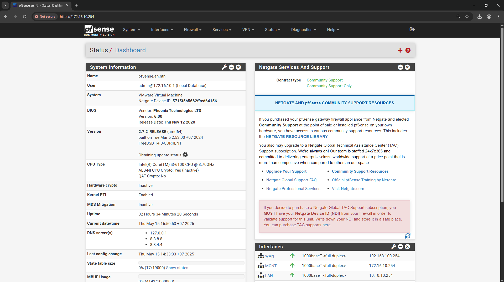

<!-- TOC -->
## Dựng các Lab trên máy PC
***

<!-- TOC start (generated with https://github.com/derlin/bitdowntoc) -->

- [Dựng các Lab trên máy PC](#dng-các-lab-trên-máy-pc)
   * [Wordpress tách 2 node web và database](#wordpress-tách-2-node-web-và-database)
   * [Zimbra](#zimbra)
   * [MDaemon ](#mdaemon)
   * [Promethes + Grafana](#promethes-grafana)
   * [HAProxy + Keepalived](#haproxy-keepalived)
   * [Pfsense + OpenVPN](#pfsense-openvpn)

<!-- TOC end -->

<!-- TOC -->
### Wordpress tách 2 node web và database
- 1 Ubuntu Database Server `10.10.10.129`
- 1 Ubuntu Webserver `192.168.100.133` - `10.10.10.130`
- Mô hình
- 
- Cài đặt theo docs [Triển khai wordpress mô hình 2 node Webserver - Database Server](https://github.com/anthanh264/thuctapnhanhoa/blob/main/06.05.25/2.%20WP_LAMP_LEMP(2%20node).md)
- Kết quả
- 

<!-- TOC -->
### Zimbra
- Trên Ubuntu Mail server `192.168.100.128`
- Cài đặt theo docs [Triển khai Zimbra trên Ubuntu 22.04](https://github.com/anthanh264/thuctapnhanhoa/blob/main/07.05.25/0.%20Tri%E1%BB%83n%20khai%20s%E1%BB%AD%20d%E1%BB%A5ng%20Zimbra%20tr%C3%AAn%20Ubuntu%2022.04.md)
- Kết quả 
- Web admin
- 
- Webmail
- 

<!-- TOC -->
### MDaemon 
- Trên Windows Server 2022 `192.168.100.129`
- Cài đặt theo docs [MDaemon trên Windows Server](https://github.com/anthanh264/thuctapnhanhoa/blob/main/08.05.25/0.%20Tri%E1%BB%83n%20khai%20MDaemon%20tr%C3%AAn%20Windows%20Server.md)
- Kết quả 
- Webmail
- 
- Web Admin
- 

<!-- TOC -->
### Promethes + Grafana 
- Cài đặt theo docs [Triển khai Promethues + Grafana](https://github.com/anthanh264/thuctapnhanhoa/blob/main/08.05.25/1.%20Tri%E1%BB%83n%20khai%20Prometheus%20v%C3%A0%20Grafana.md)
- 1 Ubuntu `192.168.100.132`
- 

<!-- TOC -->
### HAProxy + Keepalived
- Mô hình
- 
- Cài đặt theo docs [Tìm hiểu, triển khai HAProxy](https://github.com/anthanh264/thuctapnhanhoa/blob/main/08.05.25/4.%20T%C3%ACm%20hi%E1%BB%83u%2C%20tri%E1%BB%83n%20khai%20HAProxy.md)
- 2 Ubuntu `192.168.100.130` `192.168.100.131`
- Kết quả: VIP 192.168.100.50 tự cần bằng về 2 webserver 
- 
- 
- Web static của haproxy
- 

<!-- TOC -->
### Pfsense + OpenVPN
- Mô hình
- 
- Cài đặt theo docs [Tìm hiểu triển khai Pfsense](https://github.com/anthanh264/thuctapnhanhoa/blob/main/09.05.25/0.%20T%C3%ACm%20hi%E1%BB%83u%20tri%E1%BB%83n%20khai%20Pfsense.md)
- 1 Ubuntu Webserver `10.10.10.120`
- 1 Pfsense	`192.168.100.254/172.16.10.254/10.10.10.254`
- 1 Windows Client  `192.168.100.129`
- Kết quả 
- 
- OpenVPN Tap (1194)
- 
- OpenVPN Tun (1195)
- 