<!-- TOC start (generated with https://github.com/derlin/bitdowntoc) -->

- [Plesk Customer](#plesk-customer)
   * [Websites and Domains ](#websites-and-domains)
   * [Mail](#mail)
   * [Applications](#applications)
   * [Files](#files)
   * [Databases](#databases)
   * [Statistics](#statistics)
   * [Users](#users)
   * [Account ](#account)
   * [WordPress ](#wordpress)
      + [Installation](#installation)
      + [Plugins](#plugins)
      + [Themes](#themes)
   * [SEO](#seo)
   * [Laravel](#laravel)

<!-- TOC end -->

<!-- TOC -->
# Plesk Customer
- Sau khi đã tìm hiểu về giao diện dành cho Reseller — nơi các đối tác trung gian có thể quản lý khách hàng và phân phối dịch vụ hosting — mình tiếp tục chuyển sang vai trò cuối cùng trong hệ thống Plesk: **Customer View**.  
- Đây là giao diện dành cho người dùng cuối (end user), tức là các khách hàng trực tiếp sử dụng dịch vụ hosting để vận hành website, email, cơ sở dữ liệu và các ứng dụng web khác.  
- Giao diện Customer được thiết kế đơn giản, trực quan, tập trung vào các chức năng cần thiết để quản lý dịch vụ đã được cấp phát. Người dùng không cần kiến thức chuyên sâu về hệ thống máy chủ vẫn có thể dễ dàng thao tác.  
- Trong vai trò này, khách hàng có thể:
  - Quản lý tên miền, subdomain, và DNS.
  - Tạo và quản lý tài khoản email.
  - Cài đặt và vận hành website, ứng dụng web, cơ sở dữ liệu.
  - Theo dõi mức sử dụng tài nguyên như dung lượng đĩa, băng thông.
  - Thiết lập bảo mật cơ bản như chứng chỉ SSL, tường lửa ứng dụng.
- Tuy nhiên, khách hàng không có quyền truy cập vào các thiết lập hệ thống, không thể tạo thêm người dùng khác, và không thể thay đổi cấu hình dịch vụ đã được cấp phát bởi Reseller hoặc Admin.  
- Trong phần tiếp theo, mình sẽ trình bày chi tiết các nhóm chức năng trong giao diện Customer, giúp bạn hiểu rõ cách người dùng cuối tương tác với hệ thống Plesk để quản lý dịch vụ hosting của mình.
- Đăng nhập vào 1 tài khoản user quản trị domain
	- Truy cập https://<domain>:8443 
	- Đăng nhập bằng thông tin tài khoản quản trị 
	- 
- Tổng quan giao diện 
- 
- Các khu vực cấu hình chính trong giao diện này, bao gồm:
	- **Websites & Domains** – Quản lý tên miền, subdomain, DNS và cài đặt hosting.  
	- **Mail** – Tạo và quản lý tài khoản email, chống spam, chuyển tiếp.  
	- **Applications** – Cài đặt nhanh các ứng dụng web như WordPress, Joomla.  
	- **Files** – Quản lý tệp tin và thư mục trên hosting.  
	- **Databases** – Tạo và quản lý cơ sở dữ liệu MySQL/PostgreSQL.  
	- **Statistics** – Xem thống kê sử dụng tài nguyên và nhật ký truy cập.  
	- **Users** – Tạo người dùng phụ và phân quyền truy cập.  
	- **Account** – Xem thông tin gói dịch vụ và cập nhật tài khoản.  
	- **WordPress** – Quản lý cài đặt, plugin, theme và bảo mật WordPress.  
	- **SEO** – Phân tích và đề xuất cải thiện SEO cho website.  
	- **Laravel** – Hỗ trợ triển khai và cấu hình ứng dụng Laravel.

<!-- TOC -->
## Websites and Domains 
- Giao diện Websites & Domains dùng để quản lý toàn bộ website, tên miền, và các dịch vụ liên quan như email, cơ sở dữ liệu, SSL, và DNS. Đây là nơi bạn cấu hình và kiểm soát hoạt động của từng website trên hosting.
- Các nút chức năng 
	- Add Domain: Dùng thêm domain mới
		- Click chọn để thêm tên miền mới 
		- 
		- Tại giao diện khởi tạo cung cấp nhiều lựa chọn cấu hình
		- 
		- Sau khi đã chọn kiểu khởi tạo chuyển tới phần cấu hình 
		- Các trường cấu hình
		- 	
			- Domain name: Tên miền bạn muốn tạo
			- Webspace: Cấu hình Subscription.
			- Hosting type: Chọn loại dịch vụ lưu trữ. Web Hosting/ Forwarding/ No Hosting 
			- Activate the DNS service: Bật dịch vụ DNS để tên miền hoạt động.
			- Activate the mail service: Bật dịch vụ email cho tên miền.
			- Hosting Settings
				- Document root: Thư mục gốc của website trên máy chủ, ví dụ: /demo3.io.vn.
				- Preferred domain: Chọn định dạng tên miền ưu tiên để chuyển hướng người dùng hoặc không chuyển hướng (None)
		- Sau khi đã cấu hình xong chọn Add domain để tiến hành thêm 
		- 
	- Add SubDomain: Dùng thêm subdomain 
		- Click mở giao diện cấu hình tạo subdomain 
		- 
		- 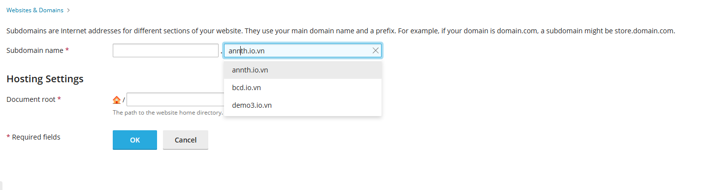
			- Subdomain name: Cấu hình subdomain, chọn domain cần tạo. 
			- Hosting Settings: Cấu hình thư mục lưu trữ 
- Danh sách các domain quản lý
	- 
	- Hiển thị danh sách các website(domain hoặc subdomain) bạn đang quản lý.
	- Mỗi website sẽ có các công cụ riêng để cấu hình và kiểm soát. (Trình bày cụ thể bên dưới) 
	- Gồm các cột thông tin
		- Domain Name : Tên miền 
		- Status: Trạng thái. Có thể cấu hình trạng thái nhanh tại đây. 
		- 
		- Disk usage: Dung lượng đã sử dụng 
		- Traffic: Lưu lượng đã sử dụng MB/tháng 
		- Các nút tắt để mở các phần cấu hình: 
			- 
			- Wordpress Management: Click chuyển tới giao diện quản lý WP-Toolkit đối với website sử dụng 
			- Sitejet Builder: Chuyển tới giao diện CMS Sitejet tạo website đối với website sử dụng 
			- File Manager: Chuyển tới giao diện quản lý tệp tin của hosting 
			- Mail Account: Cấu hình tài khoản mail chuyển tới giao diện quản lý mail 
			- Databases: Chuyển tới giao diện quản lý database 
			- Hosting Settings: Quản lý các cài đặt cấu hình của hosting 
				- 
			- Các nút thao tác khác: 
				- 
				- Move Domain: Chuyển tên miền tới subscription khác 
				- Change Domain Name: Thay đổi tên tên miền 
				- Remove Website: Xoá website đã khởi tạo với tên miền trên hosting 

- Giao diện chứa công cụ riêng để cấu hình và kiểm soát từng website
- Giao diện này nằm trong danh sách các domain của subscription
	- 	
- Giao diện này gồm 
- Khung preview website kèm nút chức năng mở website/ mở preview 
	- 	
	- Bên dưới là các thông kê về 
		- Dung lượng ổ đĩa đã sử dụng
		- Lưu lượng đã sử dụng trong tháng 
		- Nút chức năng `More Statistics` xem các phân tích chi tiết hơn
			- Web Statistics: Phân tích chi tiết về website 
			- Data Transfer: Phân tích về lưu lượng data.
			- Diskspace and traffic: Phân tích về dung lượng, băng thông. 
- Các tab quản lý 
	- Wordpress: Giao diện quản lý Wordpress của tiện ích WP-Toolkit. Trình bày chi tiết tại phần tìm hiểu tiện ích WP-Toolkits
	- Dashboard: Các cấu hình quản lý chung của website 
	- Hosting & DNS: Các cấu hình liên quan tới hosting là DNS 
	- Mail: Các cấu hình dịch vụ mail 
	- Get started: Giao diện khởi tạo đối với website mới. 

- Dashboard: Cung cấp các cấu hình quản lý chính cho website. 
	- 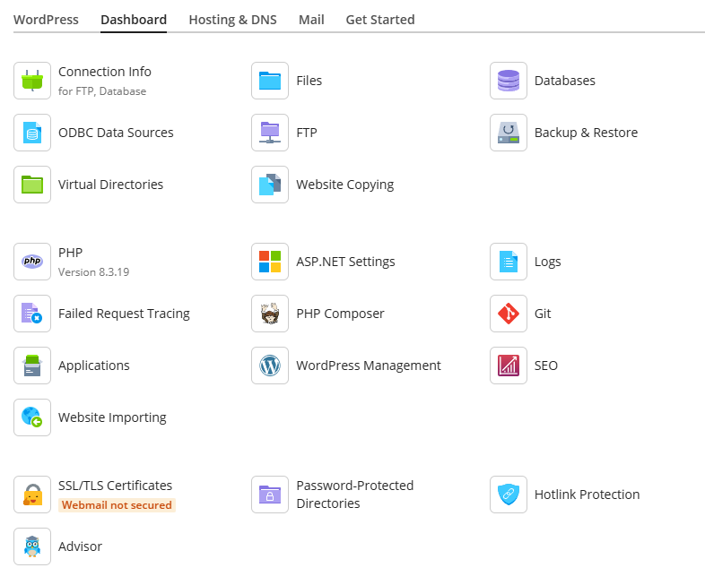	
	- Cấu hình cơ bản & Dữ liệu: 
	- Connection Info – Thông tin truy cập FTP, DB.
		- Click mở giao diện cung cấp thông tin tài khoản mật khẩu FTP/Database 
		- 	
		- Thông tin người dùng hệ thống: 
			- IP máy chủ, Tài khoản, Mật khẩu để đăng nhập vào Plesk quản lý Hosting 
			- Các nút chức năng 
				- Additional FTP accounts: Click chuyển tới giao diện quản lý tài khoản FTP 
				- Manage Access: Click chuyển tới thiết lập truy cập trong Cài đặt Hosting 
		- Thông tin cơ sở dữ liệu 
			- Host, tên database, tài khoản, mật khẩu truy cập 
			- Các nút chức năng 
				- phpMyAdmin: Click chuyển tới web đăng nhập phpMyAdmin
				- Manage Databases: Click chuyển tới giao diện quản lý các DB có trong Domain 
	- Files – Quản lý tệp tin trên hosting. Tại đây bạn có thể quản lý tệp tin, down/upload file source website. 
		- 	
	- Databases – Tạo/quản lý CSDL.
		- 	
		- Tại đây là giao diện tạo mới, quản lý các database.
			- Gồm danh sách các Database hiện có:
				- Thông tin: Host, user, bảng trong database, Kích thước 
				- Các nút chức năng: 
					- 	
					- phpMyAdmin: Click mở giao diện phpmyadmin 
					- Connection Info: Click mở giao diện thông tin kết nối tới DB
						- 
					- Copy: Sao chép database tới 1 DB có sẵn hoặc tạo 1 DB mới 
						- 
					- Export/Import Dump: Dùng xuất và nhập file Dump dữ liệu 
						- 
						- 
					- Check and repair: Kiểm tra và sửa chữa lỗi DB 
						- 
					- Remote Database: Xoá cơ sở dữ liệu 
						- 
				- Nút chức năng 
					- User Management: Quản lý người dùng cơ sở dữ liệu 
						- 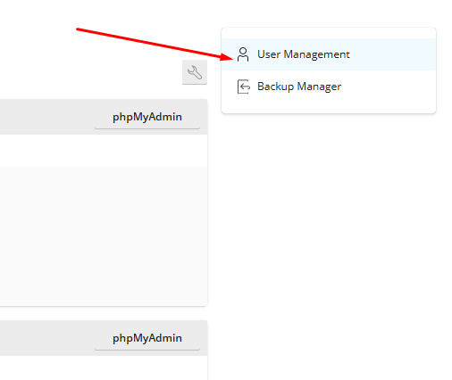
						- 
						- Các nút chức năng: 
							- Add Database User: Thêm người dùng DB mới.
							- 
							- 
							- Các cấu hình: 
								- Database Server: Máy chủ CSDL 
								- Database username: tên người dùng 
								- Password: Mật khẩu
								- Database: Chọn DB muốn thêm user 
							- Danh sách các tài khoản cơ sở dữ liệu 
								- 
								- Name: Tên tài khoản
									- Click để chuyển tới giao diện chỉnh sửa tài khoản 
									- 							
									- 							
									- Tại đây có thể 
										- Cấu hình username/password. 
										- Chọn database
										- Cấu hình roles và phân quyền chi tiết 
										- Cấu hình quản lý truy cập 
								- Database: Tên CSDL 
								- Database Server: Tên máy chủ hoạt động 
							- Remove: Xoá tài khoản đang chọn 
					- Backup & Restore : Quản lý sao lưu và phục hồi 
						- 
						- 
						- Các nút chức năng:
							- Tạo backup mới 
								- 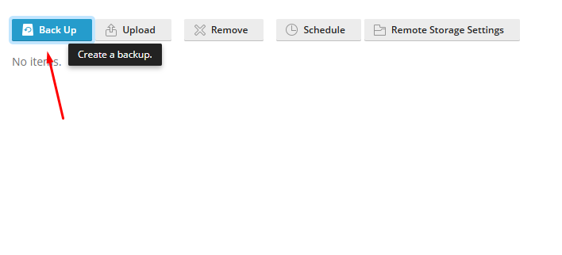
								- 
								- Có thể cấu hình 
									- Nội dung bản sao lưu: Cấu hình, Mail, Tệp người dùng, CSDL 
									- Nơi lưu trữ
									- Loại sao lưu: Đầy đủ/Chỉ sao lưu thay đổi 
									- Ghi chú:
									- Các cài đặt bổ sung: Bỏ qua file log, bỏ qua tệp đặc biệt, gửi thông báo,...
							- Tải lên bản backup
								- 
								- Bạn có thể chọn file sao lưu từ máy tính để tải lên Plesk.
									- Dung lượng tối đa cho mỗi file là 2 GB.
									- Có tùy chọn Upload More Files nếu bạn cần tải nhiều file.
								- Cài đặt bảo mật cho sao lưu
									- Plesk sẽ kiểm tra cấu trúc và chữ ký của file sao lưu.
									- Nếu file bị sửa đổi, hỏng, hoặc tạo từ máy chủ khác, Plesk sẽ không tin tưởng file đó.
									- Bạn có thể chọn "Upload backup files without a valid signature" nếu bạn tin tưởng nguồn file, nhưng có rủi ro bảo mật.
								- Bảo vệ bằng mật khẩu
									- Nếu file sao lưu có mật khẩu, bạn cần nhập vào để khôi phục.
									- Nếu nhập sai mật khẩu, Plesk vẫn tải lên file, nhưng sẽ yêu cầu mật khẩu đúng khi khôi phục.
							- Xoá bản backup: Xoá bản backup đang chọn
							- Schedule: Lên lịch Backup
								- 
								- Gồm các cấu hình: 
									- Kích hoạt task 
									- Cấu hình thời gian thực thi
									- Chọn kiểu backup
									- Cấu hình thời gian thực hiện tác vụ backup full
									- Cấu hình số lượng các bản full backup được lưu trữ. 
									- Các cài đặt cấu hình của bản backup.
							- Cấu hình Server lưu trữ từ xa sử dụng FTPS
								- Click tới giao diện thêm máy chủ FTPS để cấu hình 
								- 
	- ODBC Data Sources – Quản lý nguồn kết nối dữ liệu ODBC
		- 
		- Khởi tạo ODBC DSN mới 
		- Nút chức năng	
			- Tạo kết nối mới : Các thông số cấu hình 
				- Tên kết nối 
				- Mô tả kết nối 
				- Kiểu driver 
					- SQL Server: Các thông số cấu hình
					- 
						- Thông tin kết nối chính
							- [DRIVER] Driver: Trình điều khiển sử dụng – SQL Server.
							- [SERVER]: Tên máy chủ cơ sở dữ liệu 
							- [UID] Login ID: Tên đăng nhập để truy cập SQL Server.
							- [PWD] Password: Mật khẩu tương ứng với UID.
						- Tùy chọn bổ sung
							- [DATABASE] Default database: Tên cơ sở dữ liệu mặc định sẽ kết nối.
							- [APP] Application name: Tên ứng dụng đang sử dụng kết nối này.
							- [WSID] Workstation ID: ID của máy trạm đang thực hiện kết nối.
							- [LANGUAGE] Default language: Ngôn ngữ mặc định cho kết nối.
							- [OEMTOANSI]: Tùy chọn chuyển đổi ký tự mở rộng sang mã OEM.
					- Microsoft Access Driver: Các thông số cấu hình 
					- 
						- Thông tin kết nối cơ bản
							- [DRIVER]: Trình điều khiển sử dụng – Microsoft Access Driver (-.mdb).
							- [DBQ]: Đường dẫn đến file cơ sở dữ liệu Access (.mdb) – bắt buộc phải nhập.
							- [UID]: Tên đăng nhập để truy cập cơ sở dữ liệu.
							- [PWD]: Mật khẩu tương ứng với UID.
						- Tùy chọn nâng cao
							- [PAGETIMEOUT]: Thời gian giữ trang trong bộ đệm (tính bằng phần mười giây).
							- [MAXBUFFERSIZE]: Kích thước bộ đệm nội bộ (KB), căn chỉnh theo 256 KB.
							- [READONLY]: Đánh dấu cơ sở dữ liệu là chỉ đọc (không cho phép cập nhật).
							- [EXCLUSIVE]: Đánh dấu cơ sở dữ liệu là độc quyền (không chia sẻ cập nhật).
							- [SAFETRANSACTIONS]:
								- 0: Giao dịch được commit ngay.
								- 1: Giao dịch chỉ được ghi khi thực hiện commit (an toàn hơn nhưng chậm hơn).
							- [THREADS]: Số luồng nền mà engine sử dụng (ở đây là 3).
							- [MAXSCANROWS]: Số dòng quét để xác định kiểu dữ liệu của cột (ở đây là 8).
							- [IMPLICITCOMMITSYNC]: Quy định cách ghi thay đổi ngoài giao dịch.
							- [USERCOMMITSYNC]: Quy định việc commit giao dịch do người dùng có thực hiện bất đồng bộ hay không.			
					- Microsoft Excel Driver: Các thông số cần cấu hình 
					- 
						- [DRIVER] Driver: Trình điều khiển dùng để kết nối – Microsoft Excel Driver (*.xls), dùng cho file Excel định dạng cũ (.xls).
						- [DBQ] Database file path: Đường dẫn đến file Excel cần kết nối.
						- [DefaultDir] Default data directory: Thư mục dữ liệu mặc định.
						- [FIL] Database version: Phiên bản cơ sở dữ liệu.
						- [MaxBufferSize]: Kích thước bộ đệm tối đa – mặc định là 2048.
						- [PageTimeout]: Thời gian chờ trang – mặc định là 5 giây.
				- Nút chức năng kiểm tra kết nối và lưu 	
			- Remove: Xoá kết nối đang chọn 
			- 
		- Danh sách các kết nối ODBC hiện có. Gồm các cột thông tin 
			- 
			- Trạng thái kết nối 
			- Tên kết nối 
			- Kiểu Driver 
			- Mô tả của kết nối 
	- FTP – Tài khoản FTP.
		- 
		- Các nút chức năng 
			- Add an FTP account: Thêm tài khoản FTP mới 
				- 
				- Các cấu hình với giao diện tạo tài khoản FTP 
					- Thông tin tài khoản FTP
						- FTP account name: Tên tài khoản FTP (bắt buộc).
						- Home directory: Thư mục gốc mà tài khoản FTP có quyền truy cập (bắt buộc).
						- Password: Mật khẩu cho tài khoản FTP.
						- Có thể tạo tự động (Generate) hoặc hiển thị (Show).
						- Confirm password: Nhập lại mật khẩu để xác nhận.
					- Dung lượng ổ đĩa
						- Hard disk quota: Giới hạn dung lượng mà tài khoản FTP được sử dụng.
						- Có thể nhập số MB hoặc chọn Unlimited (không giới hạn).
					- Phân quyền truy cập
						- Read permission: Cho phép đọc dữ liệu.
						- Write permission: Cho phép ghi dữ liệu (tải lên, chỉnh sửa).
				- Remove: Xoá tài khoản FTP đang chọn 
		- Danh sách các tài khoản FTP hiện có:
			- 	
			- Name: Tên tài khoản. Click để mở giao diện chỉnh sửa thông tin tài khoản 
			- 	
			- Home: Đường dẫn thư mục FTP 
	- Backup & Restore : Quản lý sao lưu và phục hồi 
		- 
		- 
		- Các nút chức năng:
			- Tạo backup mới 
				- 
				- 
				- Có thể cấu hình 
				- Nội dung bản sao lưu: Cấu hình, Mail, Tệp người dùng, CSDL 
				- Nơi lưu trữ
				- Loại sao lưu: Đầy đủ/Chỉ sao lưu thay đổi 
				- Ghi chú:
				- Các cài đặt bổ sung: Bỏ qua file log, bỏ qua tệp đặc biệt, gửi thông báo,...
				- Tải lên bản backup
				- 
				- Bạn có thể chọn file sao lưu từ máy tính để tải lên Plesk.
				- Dung lượng tối đa cho mỗi file là 2 GB.
				- Có tùy chọn Upload More Files nếu bạn cần tải nhiều file.
				- Cài đặt bảo mật cho sao lưu
				- Plesk sẽ kiểm tra cấu trúc và chữ ký của file sao lưu.
				- Nếu file bị sửa đổi, hỏng, hoặc tạo từ máy chủ khác, Plesk sẽ không tin tưởng file đó.
				- Bạn có thể chọn "Upload backup files without a valid signature" nếu bạn tin tưởng nguồn file, nhưng có rủi ro bảo mật.
				- Bảo vệ bằng mật khẩu
				- Nếu file sao lưu có mật khẩu, bạn cần nhập vào để khôi phục.
				- Nếu nhập sai mật khẩu, Plesk vẫn tải lên file, nhưng sẽ yêu cầu mật khẩu đúng khi khôi phục.
			- Xoá bản backup: Xoá bản backup đang chọn
			- Schedule: Lên lịch Backup
				- 
				- Gồm các cấu hình: 
				- Kích hoạt task 
				- Cấu hình thời gian thực thi
				- Chọn kiểu backup
				- Cấu hình thời gian thực hiện tác vụ backup full
				- Cấu hình số lượng các bản full backup được lưu trữ. 
				- Các cài đặt cấu hình của bản backup.
			- Cấu hình Server lưu trữ từ xa sử dụng FTPS
				- Click tới giao diện thêm máy chủ FTPS để cấu hình 
				- 

	- Virtual Directories – Thư mục ảo (cho IIS, ASP.NET).
	- Giao diện gồm 
		- Các tab quản trị 
		- 	
			- Directories: Quản lý danh sách các thư mục: Tạo, sửa, xoá thư mục 
			- MIME Types: Cấu hình các kiểu dữ liệu được hỗ trợ 
			- Error Documents: Tuỳ chỉnh trang lỗi 
			- Protection: Thiết lập bảo vệ thư mục bằng mật khẩu. 
		- Các nút cấu hình
		- 	
			- Directory Properties: Hiển thị và cấu hình thông tin chi tiết của thư mục gốc httpdocs 
				- 
				- Virtual Directory
					- Path: htdocs – thư mục vật lý được ánh xạ.
					- Script source access: Cấu hình cho phép truy cập mã nguồn script.
					- Read permission: Cấu hình cho phép đọc dữ liệu .
					- Write permission: Cấu hình cho phép ghi dữ liệu.
					- Directory browsing: Cấu hình cho phép duyệt thư mục.
					- Log visits: Cấu hình ghi lại lượt truy cập.
				- Application Settings
					- Create application: Thư mục này hoạt động như một ứng dụng web.
					- Execute permissions: Cấu hình cho phép chạy script, script and executables hoặc không.
					- Allow to use parent paths: Cấu hình cho phép dùng đường dẫn cha (..).
					- Allow application execution in MTA mode: Cấu hình bật chế độ đa luồng.
				- Directory Security
					- Anonymous authentication: Cấu hình cho phép truy cập không cần đăng nhập (✓).
					- Windows authentication: Cấu hình bật xác thực Windows.
					- Require SSL/TLS: Cấu hình yêu cầu kết nối bảo mật.
				- Documents
					- Use default documents: Đã bật – cho phép dùng file mặc định khi truy cập thư mục.
					- Search order: Thứ tự ưu tiên các file mặc định:
						- Index.html
						- Index.htm
						- Index.cfm
						- Index.shtml
					- Có thể thêm bằng cách điền vào textbox và chọn Add
			- Directory Access Permissions: Hiển thị và cấu hình thông tin chi tiết về quyền truy cập của thư mục đang cấu hình 
				- 
				- Tùy chọn kế thừa quyền
					- Cho phép kế thừa quyền từ thư mục cha đến thư mục này và các thư mục con.
					- Thay thế quyền hiện tại của thư mục con bằng quyền hiển thị ở đây.
				- Bảng các nhóm, người dùng và chi tiết quyền 
						- Có thể thêm người dùng và cấp quyền bằng cách chọn user, click icon thêm, sau đó cấu hình quyền tạo cột permissions 
						- 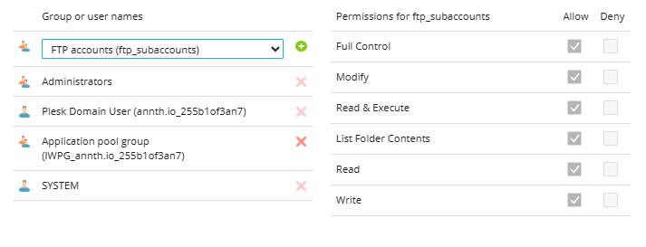	
				- Click `Advanced` để mở phần cấu hình nâng cao. Click chọn các user tạo bảng user và cấu hình quyền chi tiết ở bảng dưới. 
					- 	
			- ASP.NET: Cấu hình các thiết lập của ASP.NET 
				- 	
				- Framework Version
					- Version: 4.8.0: Phiên bản ASP.NET đang sử dụng. Có thể thay đổi nếu cần tương thích với ứng dụng bằng nút `Change Version`
					- 	
					- Connection String Manager
						- Chuỗi kết nối đến cơ sở dữ liệu SQL Server cục bộ.
						- Có thể thêm nhiều chuỗi kết nối khác nếu ứng dụng dùng nhiều nguồn dữ liệu bằng nút `Add one more`
						- 	
				- Custom Error Settings
					- Custom error mode: On/Off/RemoteOnly. Cấu hình hiển thị trang lỗi tuỳ chỉnh: Bật/Tắt/ RemoteOnly (Hiển thị lỗi chi tiết khi truy cập từ máy cục bộ, còn từ xa thì hiển thị trang lỗi tùy chỉnh.)
					- Custom errors: Định nghĩa lỗi tùy chỉnh. 
						- Cấu trúc: Mã lỗi : Đường dẫn chuyển hướng 
						- Có thể thêm nhiều mã lỗi bằng nút `Add one more`
				- Compilation and Debugging
					- Default webpage language: Cấu hình Ngôn ngữ mặc định của trang web ASP.NET.
					- 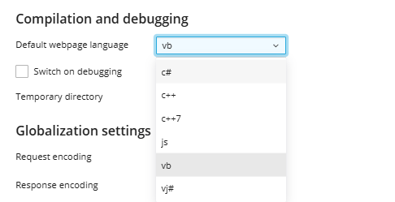	
					- Switch on debugging: Cấu hình bật chế độ gỡ lỗi.
					- Temporary directory: Cấu hình thư mục tạm dùng khi biên dịch.
				- Globalization Settings
					- Request encoding: utf-8
					- Response encoding: utf-8
					- File encoding: Windows-1252
					- Culture: Invariant 
					- UI Culture: Invariant
					- Các thiết lập này kiểm soát cách ứng dụng xử lý ngôn ngữ, mã hóa và định dạng văn bản.
				- Code Access Security (CAS) Trust level: Full/High/Medium/Low/Minimal Cấu hình mức độ cho phép ứng dụng ASP.NET truy cập tài nguyên hệ thống.
				- Session Settings
					- Authentication mode: Windows/Forms/Passport/None: Cấu hình chế độ xác thực người dùng truy cập.
					- Session timeout: Cấu hình thời gian hết hạn phiên làm việc của người dùng.
			- PHP: Cấu hình phiên bản PHP 
				- 	
	- Directories: Quản lý danh sách các thư mục: Tạo, sửa, xoá thư mục 
		- 	
		- Các nút chức năng 
			- Create Virtual Directory: Tạo thư mục ảo mới 
				- 	
				- Virtual Directory (Thư mục ảo):
					- Name: Tên của thư mục ảo bạn muốn tạo.
					- Path: Đường dẫn vật lý trên máy chủ nơi thư mục sẽ được lưu.
					- Create a physical directory...: Tùy chọn để tạo thư mục vật lý trùng tên với thư mục ảo.
					- Script source access: Cho phép truy cập mã nguồn của các script.
					- Read permission: Cho phép đọc nội dung trong thư mục.
					- Write permission: Cho phép ghi dữ liệu vào thư mục.
					- Directory browsing: Cho phép người dùng duyệt nội dung thư mục qua trình duyệt.
					- Log visits: Ghi lại nhật ký truy cập vào thư mục.
				- Application Settings (Cài đặt ứng dụng):
					- Create application: Tạo một ứng dụng web từ thư mục ảo này.
					- Execute permissions: Cấu hình quyền thực thi: None/ Scripts Only/ Script & Executables (chỉ cho phép thực thi script như ASP, PHP...).
			- Create Directory: Tạo thư mục mới 
				- 	
			- Remove: Xoá file, thư mục được chọn 
				- 	
		- Danh sách các file, thư mục: Gồm các cột thông tin 
			- 	
			- P: Protect: Hiển thị trạng thái bảo vệ của thư mục/ tệp tin. Click chuyển tới cấu hình bảo vệ. 
				- 	
				- Click chọn `Protect` để kích hoạt bảo vệ 
				- 	
				- Cấu hình tài khoản mật khẩu cho phép truy cập thư mục 
				- 	
				- Cấu hình hoàn tất 
				- 	
				- Kiểm tra truy cập thư mục đã được bảo vệ 
				- 	
			- Name: Tên thư mục/ Tệp tin 
			- Truy cập thư mục/ tệp bằng trình duyệt.
			- Quản lý quyền của tệp/ thư mục: Mở giao diện quản lý quyền tương tự nút chức năng `Directory Access Permissions`
	- MIME Types: Cấu hình các kiểu dữ liệu được hỗ trợ loại MIME (MIME types) cùng với phần mở rộng tập tin (file extension) và kiểu nội dung (content type) tương ứng
		- 
		- Các nút chức năng 
			- `Add MIME Type`: Thêm MIME mới. Click mở giao diện thêm 
			- 
			- 
				- Extensions: Cấu hình phần mở rộng 
				- Content: Cấu hình loại nội dung, có thể chọn từ danh sách hoặc tự định nghĩa 
				- 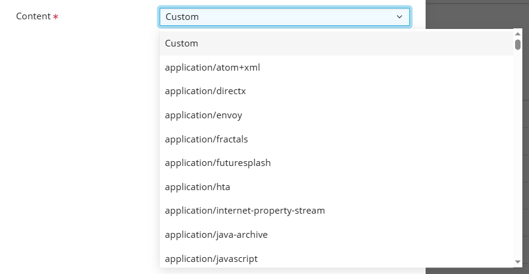
			- `Remove`: Xoá MIME được chọn 
				- 
		- Danh sách các MIME types gồm các cột thông tin:
			- 
			- Extension 
			- Content 
			- Nút thao tác chỉnh sửa MIME 
			- 
	- Error Documents: Tuỳ chỉnh trang lỗi
		-  
		- Danh sách các trang sẽ hiển thị với các mã lỗi HTTP 
		- Mã lỗi, Mô tả, Loại cấu hình sẽ hiển thị, vị trí file/url, nút chỉnh sửa 
			- 
				- Mã lỗi
				- Loại xử lý: Default/File/URL 
				- 
	- Protect: Cấu hình bảo vệ thư mục/ tệp tin bằng mật khẩu 
		- 
		- Hiển thị các cấu hình bảo vệ với thư mục đang cấu hình
			- Nếu thư mục, file chưa bật bảo vệ kích hoạt bằng việc click chọn `Protect` 
				- 
				- Cấu hình tài khoản bảo vệ. 
				- Click `Create` để khởi tạo 
				- 
				- 
			- Các nút chức năng 
				- Add user: Dùng thêm user dùng đăng nhập truy cập thư mục/ tệp tin 
					- 
					- 
				- Remove: Dùng xoá user đang chọn 
					- 
				- Remove Protection: Gỡ bỏ bảo vệ thư mục/tệp tin 
					- 
				- Setting: Dùng xem đường dẫn thư mục bảo vệ và cấu hình tiêu đề cho khu vực bảo vệ 
					- 
					- 
			- Danh sách các tài khoản: Tên, nút chức năng chỉnh sửa mật khẩu 
				- 
	- Website Copying – Sao chép website.
	- 
	- Dùng để sao chép dữ liệu website sang một địa chỉ khác
	- Gồm các lựa chọn 
		- Sao chép sang trong cùng Plesk (Website in Plesk)
			- Tên website đích: Chọn trong danh sách 
			- Tùy chọn xử lý dữ liệu đã có ở website đích:
				- Giữ lại các tập tin hiện có: Chỉ ghi đè những tập tin trùng tên.
				- Xóa toàn bộ tập tin hiện có: Xóa sạch trước khi sao chép.
		- Sao chép sang máy chủ khác thông qua kết nối FTP 
			- Tên máy chủ (host name)
			- Cổng (port): Mặc định là 21
			- Thư mục đích
			- Tên đăng nhập/ Mật khẩu của tài khoản FTP 
			- Phương thức kết nối 
				- Active mode: Plesk sẽ gửi IP và cổng để nhận kết nối từ máy chủ FTP. Dùng khi không có firewall.
				- Passive mode: Dùng khi có firewall, Plesk sẽ chủ động kết nối đến máy chủ FTP.
	- Lập trình & Tính năng nâng cao 
	- PHP (v8.3.19) – Cấu hình PHP.
	- Thiết lập cấu hình chi tiết PHP cho website 
		- 
	- Cấu hình hỗ trợ PHP, phiên bản, kiểu khởi chạy. Có thể chọn phiên bản PHP tuỳ chỉnh tại đây. 
		- 
	- Các cấu hình PHP 
		- Performance and security settings: Cấu hình hiệu năng và bảo mật 
			- 
			- memory_limit: Giới hạn bộ nhớ tối đa mà một script PHP có thể sử dụng. Nếu vượt quá, script sẽ bị dừng.
			- max_execution_time: Thời gian tối đa một script PHP được phép chạy. Nếu vượt quá, script sẽ bị ngắt.
			- max_input_time: Thời gian tối đa để xử lý dữ liệu đầu vào (ví dụ: từ biểu mẫu).
			- post_max_size: Dung lượng tối đa cho dữ liệu gửi qua phương thức POST. Nên lớn hơn upload_max_filesize.
			- upload_max_filesize: Dung lượng tối đa cho mỗi tập tin được tải lên qua biểu mẫu.
			- opcache.enable: Bật bộ nhớ đệm mã PHP để tăng tốc độ thực thi. Giúp website chạy nhanh hơn.
		- Common settings: Các cấu hình phổ biến 
			- 
			- include_path: Đây là danh sách các thư mục mà PHP sẽ tìm kiếm khi bạn sử dụng các hàm như include hoặc require. Nó giống như biến PATH của hệ điều hành. Trên Windows dùng dấu chấm phẩy (;) để phân cách, còn trên Linux dùng dấu hai chấm (:).
			- session.save_path: Đây là thư mục nơi PHP lưu trữ các file session tạm thời. Trong trường hợp này là C:\Windows\Temp.
			- open_basedir: Giới hạn các thư mục mà script PHP được phép truy cập. Điều này giúp tăng cường bảo mật bằng cách ngăn script truy cập vào các thư mục không mong muốn. Biến {WEBSPACEROOT} và {TMP} là các đường dẫn động.
			- error_reporting: Xác định mức độ báo lỗi của PHP. Thiết lập này cho phép hiển thị tất cả lỗi trừ các lỗi nhỏ như NOTICE, STRICT, và DEPRECATED.
			- display_errors: Nếu bật, lỗi sẽ được hiển thị trực tiếp trên trình duyệt. Trong cấu hình này, nó đang tắt để tránh lộ thông tin nhạy cảm.
			- log_errors: Cho phép ghi lại lỗi vào file log. Điều này rất hữu ích để kiểm tra và khắc phục sự cố mà không cần hiển thị lỗi ra ngoài.
			- short_open_tag: Cho phép sử dụng cú pháp ngắn của PHP (<? ?>) thay vì cú pháp đầy đủ (<?php ?>). Một số mã cũ có thể dùng cú pháp ngắn này.

		- FastCGI settings: Cấu hình FastCGI 
			- 
			- `Enable FastCGI settings`: Bật chế độ FastCGI. Đây là một giao thức giúp tăng hiệu suất xử lý PHP bằng cách giữ tiến trình hoạt động lâu hơn thay vì khởi động lại mỗi lần có yêu cầu.
			- `maxInstances`: Số lượng tiến trình FastCGI tối đa được phép chạy. Nếu đặt là 0, hệ thống sẽ tự động điều chỉnh theo nhu cầu.
			- `activityTimeout`: Thời gian tối đa (tính bằng giây) mà một tiến trình FastCGI được giữ mở khi không có hoạt động.
			- `requestTimeout`: Thời gian tối đa để xử lý một yêu cầu FastCGI. Nếu vượt quá, tiến trình sẽ bị ngắt.
			- `instanceMaxRequests`: Số lượng yêu cầu tối đa mà một tiến trình FastCGI có thể xử lý trước khi bị khởi động lại.
			- `queueLength`: Số lượng yêu cầu có thể được xếp hàng chờ xử lý khi tất cả tiến trình FastCGI đang bận.
			- `rapidFailsPerMinute`: Số lần lỗi cho phép trong một phút trước khi tiến trình bị đánh dấu là không ổn định.

	- ASP.NET Settings – Dành cho .NET.
		- 
		- Framework Version
		- Version: 4.8.0: Phiên bản ASP.NET đang sử dụng. Có thể thay đổi nếu cần tương thích với ứng dụng bằng nút `Change Version`
		- 	
		- Connection String Manager
			- Chuỗi kết nối đến cơ sở dữ liệu SQL Server cục bộ.
			- Có thể thêm nhiều chuỗi kết nối khác nếu ứng dụng dùng nhiều nguồn dữ liệu bằng nút `Add one more`
			- 	
		- Custom Error Settings
			- Custom error mode: On/Off/RemoteOnly. Cấu hình hiển thị trang lỗi tuỳ chỉnh: Bật/Tắt/ RemoteOnly (Hiển thị lỗi chi tiết khi truy cập từ máy cục bộ, còn từ xa thì hiển thị trang lỗi tùy chỉnh.)
			- Custom errors: Định nghĩa lỗi tùy chỉnh. 
				- Cấu trúc: Mã lỗi : Đường dẫn chuyển hướng 
				- Có thể thêm nhiều mã lỗi bằng nút `Add one more`
						- Compilation and Debugging
		- Default webpage language: Cấu hình Ngôn ngữ mặc định của trang web ASP.NET.
			- 	
			- Switch on debugging: Cấu hình bật chế độ gỡ lỗi.
			- Temporary directory: Cấu hình thư mục tạm dùng khi biên dịch.
		- Globalization Settings
			- Request encoding: utf-8
			- Response encoding: utf-8
			- File encoding: Windows-1252
			- Culture: Invariant 
			- UI Culture: Invariant
			- Các thiết lập này kiểm soát cách ứng dụng xử lý ngôn ngữ, mã hóa và định dạng văn bản.
		- Code Access Security (CAS) Trust level: Full/High/Medium/Low/Minimal Cấu hình mức độ cho phép ứng dụng ASP.NET truy cập tài nguyên hệ thống.
		- Session Settings
			- Authentication mode: Windows/Forms/Passport/None: Cấu hình chế độ xác thực người dùng truy cập.
			- Session timeout: Cấu hình thời gian hết hạn phiên làm việc của người dùng.
		- Các nút chức năng 
			- Save: Lưu và thoát 
			- Apply: Áp dụng cấu hình 
			- Restore Default configuration: Khôi phụ cấu hình mặc định 
			- Cancel: Huỷ thao tác 
		
	- Logs – Nhật ký hệ thống.
		- Quản lý các bản ghi được theo dõi của website 
		- 	
		- Các nút chức năng 
			- 	
			- `Start real-time updates`: Dùng bật/tắt cập nhật bản ghi theo thời gian thực 
			- 	
			- `Refresh`": Làm mới dữ liệu bản ghi 
			- `Manage Log Files`: Mở giao diện quản lý các tệp bản ghi 
				- 	
				- 	
				- Các nút chức năng	
					- `Add custom log`: Tạo bản ghi tuỳ chỉnh thêm vào để theo dõi. Tạo giao diện cấu hình chọn tới file bản ghi cần thêm.
					- 	
					- `Log Rotation`: Cấu hình quay vòng bản ghi 
					- 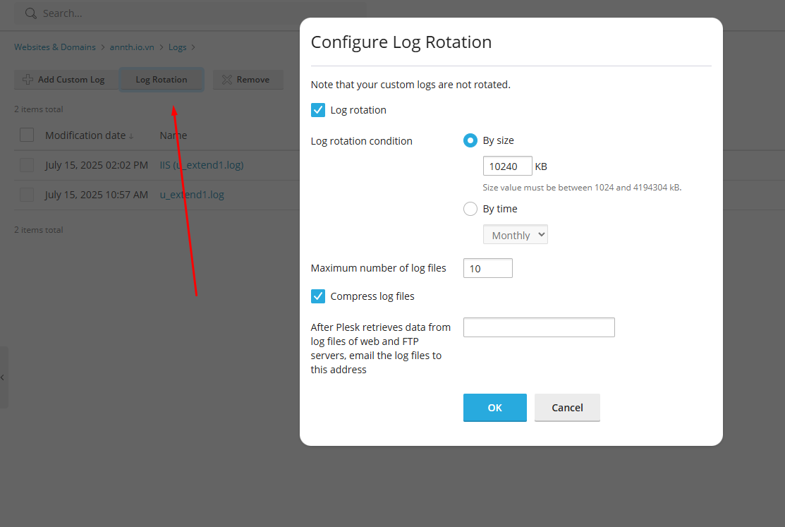	
						- **Log rotation**: Khi bật tính năng này, hệ thống sẽ tự động xoay vòng (rotate) các file log cũ để tránh việc file log trở nên quá lớn và chiếm nhiều dung lượng.
						- **Log rotation condition**:
						  - **By size**: File log sẽ được xoay vòng khi đạt đến kích thước nhất định. Trong hình là `10240 KB` (tức 10MB). Giá trị hợp lệ nằm trong khoảng từ `1024 KB` đến `4194304 KB` (1MB đến 4GB).
						  - **By time**: Bạn có thể chọn xoay vòng theo thời gian, ví dụ: hàng tháng (Monthly).
						- **Maximum number of log files**: Số lượng file log tối đa được lưu giữ. Trong hình là `10`, nghĩa là hệ thống sẽ giữ lại 10 file log gần nhất, các file cũ hơn sẽ bị xóa.
						- **Compress log files**: Khi bật, các file log sau khi xoay vòng sẽ được nén lại để tiết kiệm dung lượng lưu trữ.
						- **Email log files**: Sau khi Plesk xử lý xong log từ máy chủ web và FTP, nó có thể gửi các file log này đến địa chỉ email bạn chỉ định.
					- `Remove`: Xoá file log được chọn 
				- Danh sách các file log đang theo dõi 
					- 	
					- `Modification date`: Ngày chỉnh sửa 
					- `Name`: Tên file log. Click để xem tệp tin 
						- 	
					- `Path`: Đường dẫn file log
					- `Size`: Kích thước 
					- Các nút chức năng 
						- 	
						- Untrack: Dừng theo dõi bản ghi từ tệp 
						- View: Sử dụng để mở tệp log trong tab mới 
						- Download: Sử dụng để tải xuống file log 
				- `Log Rotation`: Cấu hình quay vòng bản ghi 
					- 	
						- **Log rotation**: Khi bật tính năng này, hệ thống sẽ tự động xoay vòng (rotate) các file log cũ để tránh việc file log trở nên quá lớn và chiếm nhiều dung lượng.
						- **Log rotation condition**:
						  - **By size**: File log sẽ được xoay vòng khi đạt đến kích thước nhất định. Trong hình là `10240 KB` (tức 10MB). Giá trị hợp lệ nằm trong khoảng từ `1024 KB` đến `4194304 KB` (1MB đến 4GB).
						  - **By time**: Bạn có thể chọn xoay vòng theo thời gian, ví dụ: hàng tháng (Monthly).
						- **Maximum number of log files**: Số lượng file log tối đa được lưu giữ. Trong hình là `10`, nghĩa là hệ thống sẽ giữ lại 10 file log gần nhất, các file cũ hơn sẽ bị xóa.
						- **Compress log files**: Khi bật, các file log sau khi xoay vòng sẽ được nén lại để tiết kiệm dung lượng lưu trữ.
						- **Email log files**: Sau khi Plesk xử lý xong log từ máy chủ web và FTP, nó có thể gửi các file log này đến địa chỉ email bạn chỉ định.
				- Filter: Lọc hiển thị theo file log, hoặc hiển thị tất cả 
					- 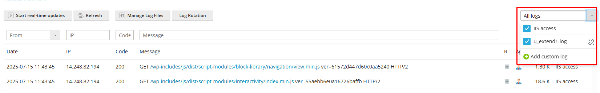	
		- Bảng hiển thị chi tiết các sự kiện trong bản ghi
			- Filter: Bộ lọc theo ngày tháng, IP, Mã code HTTP, Nội dung message
				- 	
			- Bảng gồm các cột thông tin 
				- 	
				- Date: Ngày tháng năm truy cập 
				- IP: Địa chỉ IP 
				- Code: Code HTTP xử lý 
				- Message: Nội dung thông điệp trao đổi. Nếu trong message có đường dẫn tới file click chọn để xem tệp tin. 
				- 	
				- Agent: Thông tin về agent. Di chuột vào icon để xem chi tiết agent 
				- 	
				- Size: Kích thước 
	- Failed Request Tracing – Truy vết lỗi.
		- Đây là chức năng giúp bạn theo dõi các yêu cầu đến website bị lỗi (ví dụ: lỗi 401, 404, 500...) để biết nguyên nhân và cách xử lý.
		- 
		- Click chọn `Start Tracing` để cấu hình 
			- 
			- Cấu hình Status Code cần theo dõi 
			- Cấu hình Provider: Là các thành phần hoặc module trong IIS mà bạn muốn ghi lại thông tin khi có lỗi xảy ra. 
		- Ví dụ: Tracing status code 404 trên tất cả module 
			- 
		- Giao diện quản lý 
			- Các nút chức năng 
				-  
				- `Stop Tracing`: Dừng theo dõi 
				-  
				- `Change Tracing Settings`: Chỉnh sửa cấu hình Tracing
				-  
				-  
				- `Refresh`: Làm mới danh sách tracing 
				-  
				- `Download`: Tải xuống bản ghi được chọn dạng zip 
				-  
				- `Remove`: Xoá bản ghi được chọn 
				-  
			- Bảng các bản ghi ghi nhận trong quá trình tracing 
				- Modification Date: Ngày tháng chỉnh sửa 
				- Name: Tên bản ghi. Click để mở chi tiết báo cáo phân tích tracing.
				-  
				-  
		- Lưu ý: Tracing sẽ tự động được tắt sau 3 ngày 

	- PHP Composer – Cài thư viện PHP qua Composer. Giao diện hỗ trợ cài đặt nhanh các gói hỗ trợ composer 
		- Plesk sẽ tự động quét trong thư mục gốc file `composer.json` để cấu hình 
		- 	
		- Các cấu hình chức năng 
			- Hiển thị thư mục đang cấu hình.
				- `Edit composer.json` click để chỉnh sửa file composer 
				- 	
				- 	
				- `Go to application folder`: Click để chuyển tới thư mục ứng dụng có file composer 
				- 	
				- 	
			- `Change mode`: Chuyển đổi chế độ của application: Production/Development
				- 	
			- `Enviroment variables`: Cấu hình thêm, sửa, xoá các biến môi trường 
				- 	
			- `Package Dependencies` : Quản trị các gói ứng dụng có thể thực hiện cài đặt/cập nhật các gói tại đây.
				- 
		- Danh sách các gói ứng dụng bổ trợ 
			- 
			- Name: Tên gói 
			- Version: Thông tin phiên bản 
			- Update: Thông tin bản cập nhật 
			- Description: Mô tả của gói 
			- Source: Click trỏ tới github source code của gói 
			- Status: Trạng thái của gói ứng dụng bổ trợ 
	- Git – Kết nối Git repo.
		- 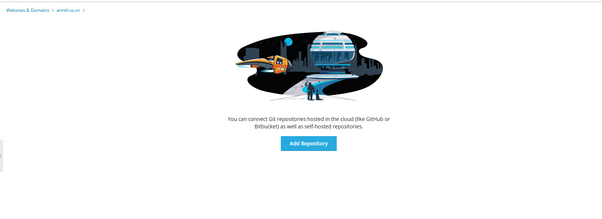
		- Sử dụng để import các repo chứa mã nguồn từ các git về máy chủ 
		- Gồm 2 tuỳ chọn 
		- Pull code: Plesk sẽ thực hiện kéo mã nguồn về máy chủ. Áp dụng trong TH mã nguồn của bạn nằm trên dịch vụ online như GitHub, GitLab… 
			- 
			- Repository URL: Đường dẫn đến kho mã nguồn. Có thể dùng giao thức HTTP(S) hoặc SSH.
			- Repository name: Tên kho mã nguồn. Tên này phải duy nhất trong tên miền bạn đang dùng.
			- Deployment settings – Cài đặt triển khai
			- Deployment mode:
				- Automatic: Mã nguồn sẽ được triển khai ngay khi có thay đổi trong kho.
				- Manual: Bạn sẽ tự triển khai khi cần.
				- Disabled: Tắt chức năng triển khai.
			- Server path: Thư mục trên máy chủ nơi mã nguồn sẽ được triển khai, ví dụ: \httpdocs.
			- Enable additional deployment actions: Cho phép bạn chạy các lệnh shell tùy chỉnh sau mỗi lần triển khai.
		- Push code: Plesk sẽ nhận mã nguồn được tải lên. Áp dụng trong TH mã nằm trên máy tính cá nhân hoặc máy chủ nội bộ → bạn sẽ tự đẩy mã nguồn lên Plesk bằng tay.
			- 
			- **Repository name**:
				- Là tên kho mã nguồn bạn đặt, phải **duy nhất trong tên miền**.
				- Tên này cũng sẽ xuất hiện trong URL của kho mã.
			-**Additional Users**:
				- Bạn có thể chọn **người dùng khác** có quyền truy cập kho mã qua HTTP/HTTPS và triển khai mã lên website.
				- Hữu ích khi làm việc nhóm hoặc có nhiều quản trị viên.
			- **Deployment mode**:
				- **Automatic**: Mã sẽ được triển khai ngay khi có thay đổi.
				- **Manual**: Bạn sẽ triển khai thủ công khi cần.
				- **Disabled**: Tắt chức năng triển khai.
			- **Server path**: Là thư mục trên máy chủ nơi mã nguồn sẽ được triển khai
			- **Include additional deployment actions**: Cho phép bạn thêm **lệnh shell** để chạy sau mỗi lần triển khai, ví dụ:
		- Ví dụ thêm 1 repo từ github 
			- Câu hình đường dẫn repo, tên repo, cài đặt triển khai 
			- 
			- Repo được thêm 
			- 
			- 

	- Applications – Cài CMS, phần mềm nhanh.
		- Giao diện quản lý các ứng dụng được cài, cài đặt ứng dụng mới 
		- Gồm các tab quản lý 
		- Manage My Applications: Hiển thị danh sách các ứng dụng được cài đặt 
		- 
			- Click `Scan` để làm mới danh sách 
			- Name: Tên ứng dụng. CLick để mở giao diện cấu hình riêng của từng ứng dụng 
			- Installation Path: Đường dẫn cài đặt 
			- Remove: Gỡ cài đặt ứng dụng
		- Featured Applications: Danh sách các ứng dụng được đề xuất và cài phổ biến. Có thể chọn cài đặt ứng dụng tại đây, custom phiên bản cần cài đặt. 
		- 
		- All Available Applications 
		- : Hiển thị danh sách tất cả các ứng dụng có thể cài. Có thể cài đặt ứng dụng tại đây bằng nút thao tác `Install` cạnh tên ứng dụng. 

	- WordPress Management – Quản lý WP.
		- Click mở giao diện tiện ích quản lý WP-Toolkit 
		- 

	- SEO – Tối ưu hóa công cụ tìm kiếm.
		- Click mở giao diện SEO Toolkit 
		- 

	- Website Importing – Nhập dữ liệu từ web khác.
		- 
		- Giao diện cấu hình nhập dữ liệu website từ máy chủ khác trong Plesk. Tính năng này cho phép bạn sao chép toàn bộ website (bao gồm mã nguồn, thư mục, và cơ sở dữ liệu) từ một tên miền khác về máy chủ hiện tại.
			- **Source domain name**: Tên miền của website bạn muốn sao chép dữ liệu từ đó (ví dụ: `annth.lov.vn`).
			- **Source website URL** *(tùy chọn)*: Đường dẫn đầy đủ đến website nguồn. Nếu để trống, Plesk sẽ tự động dò tìm.
			- **Source document root** *(tùy chọn)*: Đường dẫn thư mục gốc của website nguồn (liên quan đến thư mục gốc FTP). Nếu để trống, Plesk cũng sẽ tự động xác định.
			- **Hosting access (Truy cập FTP)**
				- **FTP username / password**: Tài khoản FTP dùng để đăng nhập vào máy chủ chứa website nguồn.
				- **Files root**: Thư mục bắt đầu quét dữ liệu (liên quan đến thư mục gốc FTP). Nếu để trống, Plesk sẽ dùng thư mục gốc FTP.
				- **Get list of files mode**: Chế độ lấy danh sách file. Mặc định là **tự động**, Plesk sẽ chọn cách phù hợp nhất.(FTP/PHP/PHP Failback to FTP)
			- **Use the same IP for FTP data connection**: Tùy chọn này giúp xử lý lỗi khi máy chủ FTP cấu hình sai IP trong chế độ passive. Nếu bật, Plesk sẽ dùng cùng một IP cho cả kết nối điều khiển và dữ liệu.
			- **Content transfer options (Tùy chọn truyền dữ liệu)**
				- **Way to transfer files**: Cách truyền file – để mặc định là **Automatic**.
				- **FTP server charset**: Bộ mã ký tự của máy chủ FTP. Mặc định là `UTF-8`, phù hợp với hầu hết các máy chủ hiện đại.
			- Plesk sẽ **tự động phát hiện và nhập** các ứng dụng như **WordPress, Joomla!, Drupal, Prestashop, Magento** cùng với toàn bộ file và cơ sở dữ liệu.
			- Bạn cũng có thể chọn **nhập từng thư mục hoặc cơ sở dữ liệu riêng lẻ** nếu không dùng CMS phổ biến.
		
	- Bảo mật Website 
	- SSL/TLS Certificates - Cấu hình cài đặt chứng chỉ SSL/TLS 
		- 
		- Gồm các tuỳ chọn
	- Install a free basic certificate provided by Let's Encrypt: Cài đặt chứng chỉ miễn phí từ Let's Encrypt 
		- 
		- Cấu hình địa chỉ email, cấu hình các mục cần bảo vệ 
			- Secure the domain name: Bảo vệ tên miền chính 
			- Secure the wildcard domain (including www and webmail): Bảo vệ tất cả tên miền con subdomain 1
			- Include a "www" subdomain for the domain and each selected alias: Bảo vệ `www` và các domain alias 
			- Secure webmail on this domain : Bảo vệ webmail 
			- Secure mail on this domain: Bảo vệ service mail 
			- Assign the certificate to the mail domain IMAP,POP, SMTP: Áp dụng chứng chỉ tới tên miền mail với các giao thức của dịch vụ mail 
		- Click `Get it free` để tiến hành lấy chứng chỉ và cài đặt. 
	- Upload a certificate you already purchased: Tải lên chứng chỉ đã có 
		- 	
		- Click chọn `Upload .pem file` để tải lên file chứng chỉ. Tải lên tự động sẽ được cài đặt 
	- Manage certificates: Quản lý các chứng chỉ. Click `Manage` mở giao diện quản lý 
		- 	
		- Giao diện gồm các phần 
		- Upload the certificate here: Chọn Upload file để tải lên file chứng chỉ đã có vào hosting 
			- 	
		- Các nút chức năng 
			- Add SSL/TLS certificate: Nút cấu hình thêm chứng chỉ 
				- 	
				- Certificate Name: Đặt tên cho chứng chỉ 
				- Phần cấu hình tạo CSR	 
					- CSR là yêu cầu để đăng ký chứng chỉ SSL từ một tổ chức cấp chứng chỉ (CA).
					- Khi bạn tạo CSR, hệ thống sẽ tự động tạo private key đi kèm và lưu lại.
					- Bạn cần điền các thông tin như:
						- Bits: Độ dài khóa mã hóa, thường là 2048.
						- Organization name, City, State, Country: Thông tin doanh nghiệp, Dữ liệu địa lý.
						- Domain name: Tên miền cần cấp chứng chỉ 
						- Email: Email liên hệ 
					- Sau khi đã cấu hình thông tin 
						- Nếu sử dụng chứng chỉ cấp bởi CA. Click `Request` để hệ thống sinh CSR, Private key. Bạn sử dụng CSR để thực hiện xin cấp chứng chỉ từ các CA 
							- Ví dụ: Tạo CSR. Click chọn Request thu được file CSR. Click tải xuống tạo danh sách các chứng chỉ. 
							- 	
							- 	
						- Nếu sử dụng chứng chỉ tự ký. Click `Self-Signed` để hệ thống sinh CSR, Private key và tự ký chứng chỉ để sử dụng. 
							- Ví dụ: Tạo CSR và tự ký. Click chọn `Self-Signed` thu được file chứng chỉ để sử dụng.
							- 	
							- 	
				- Phần tải lên chứng chỉ đã có: 
					- Dạng file: Tại đây bạn có thể tải lên các file thành phần gồm privatekey, certificate, CA certificate và chọn Upload để tải lên chứng chỉ vào hosting 
					- 	
					- Dạng text: Thay vì sử dụng file bạn có thể dán nội dung các thông số chứng chỉ vào plesk và chọn Upload để tải lên chứng chỉ vào hosting 
					- 	
			- Secure Webmail: Click để bảo vệ webmail bằng chứng chỉ đang chọn tại danh sách chứng chỉ
				- 	
			- Secure Mail: Click để bảo vệ dịch vụ Mail bằng chứng chỉ đang chọn tại danh sách chứng chỉ
				- 			
			- Remove: Click xoá chứng chỉ đang chọn tại danh sách chứng chỉ
				- 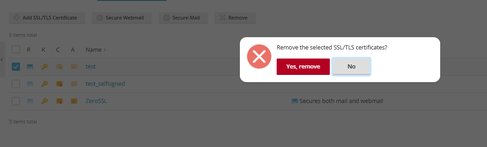			
		- Danh sách các chứng chỉ trong hệ thống 
			- 			
			- Mỗi chứng chỉ được thể hiện trên một dòng với các cột 
				- `R`: Icon thể hiện thành phần CSR 
				- `K`: Icon thể hiện thành phần Private Key 
				- `C`: Icon thể hiện thành phần Chứng chỉ
				- `A`: Icon thể hiện thành phần Chứng chỉ CA 
				- `Name`: Tên chứng chỉ 
				- Thông tin bảo vệ:
				- Used: Hiện thị số lượng các dịch vụ chứng chỉ bảo vệ 
	- Password-Protected Directories – Bảo vệ thư mục bằng mật khẩu.
		- Quản lý các thư mục được bảo vệ bằng mật khẩu 
		- 			
		- Các nút chức năng 
			- `Add Protected Directory`: Dùng thêm thư mục cần bảo vệ 
				- Cấu hình đường dẫn tới thư mục cần bảo vệ, Đặt tiêu đề cho khu vực bảo vệ 
				- 				
			- `Remove Protection`: Xoá bỏ bảo vệ đối với các thư mục được chọn 
				- 				
		- Danh sách các thư mục được bảo vệ
			- 				
				- `Name`: Đường dẫn thư mục được bảo vệ. Click mở giao diện cấu hình tài khoản bảo vệ thư mục 
					- Tại đây có thể cấu hình thêm user bằng nút `Add User` 
					- 				
					- 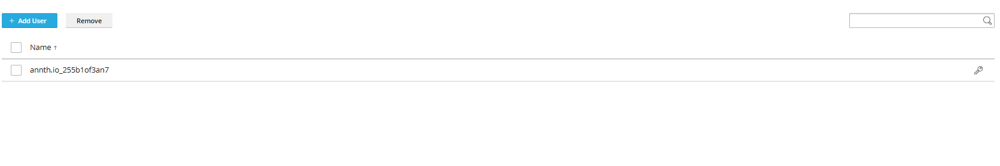	
					- 	
				- Xoá user bằng nút `Remove`
				- 			
				- Chỉnh sửa mật khẩu các user đã có tại danh sách user 
				- 	
			- `Title of the protected area`: Tiêu đề khu vực bảo vệ.
			- Nút chức năng Edit: Dùng chỉnh sửa đường dẫn, Tiêu đề 
				- 	
	- Hotlink Protection – Chống chèn link ảnh/video từ web bạn.
		- Cấu hình Hotlink Protection trong Plesk – một tính năng giúp ngăn chặn việc website khác sử dụng trực tiếp tài nguyên (hình ảnh, video...) từ website của bạn mà không được phép.
			- 	
			- Enable hotlink protection: Khi bật tùy chọn này, hệ thống sẽ chặn các website khác không được phép truy cập trực tiếp vào các file như hình ảnh, video... trên website của bạn.
			- Protected files extensions: Danh sách các loại tập tin được bảo vệ khỏi việc bị hotlink. Bao gồm:
				- Các định dạng ảnh phổ biến: bmp, gif, jpg, jpeg, png, webp, svg, tiff, v.v.
			- Addresses of friendly websites: Đây là nơi bạn nhập danh sách các website được phép liên kết trực tiếp đến tài nguyên của bạn. Ví dụ: nếu bạn có website phụ hoặc đối tác, bạn có thể thêm địa chỉ của họ vào đây để không bị chặn.
				- Add one more: Cho phép thêm nhiều địa chỉ website thân thiện.
			- Save / Cancel: Nhấn Save để lưu cấu hình, hoặc Cancel để hủy bỏ.
				
	- Advisor – Gợi ý hệ thống.
		- Click mở giao diện tiện ích đánh giá website 
		- 	

- Hosting & DNS: Các cấu hình liên quan tới hosting và DNS 
	- 	
	- Hosting: Cấu hình hosting
	- DNS: Quản lý bản ghi DNS cho tên miền.
	- Dedicated IIS Application Pool for Website: Quản lý cấu hình IIS Application Pool 
	- Hosting : Quản lý các cài đặt cấu hình của hosting 
		- 	
		- Domain name: Tên miền. 
		- Hosting type: 
			- Hosting type: Loại Hosting Website/ Forwarding / No Web Hosting 
			- Preferred Domain: Tên miền ưu tiên. Nếu chọn, Plesk sẽ chuyển hướng SEO-friendly (HTTP 301) từ các biến thể khác về tên miền này.
			- Document Root: Thư mục gốc chứa mã nguồn
		- SSL/TLS support
			- Enabled: Bật mã hóa kết nối giữa website và trình duyệt người dùng.
			- Redirect visitors from HTTP to HTTPS: Tự động chuyển hướng người dùng từ HTTP sang HTTPS bằng redirect 301 (tốt cho SEO).
			- Certificate: Cấu hình chứng chỉ SSL/TLS.
		- Web statistics: Cấu hình công cụ dùng phân tích website. Có thể cấu hình sử dụng Webalizer, AWStats hoặc tắt. 
		- Web scripting: Cho phép bật/tắt các ngôn ngữ lập trình web mà website có thể sử dụng
		- System user's credentials: Cấu hình thông tin đăng nhập của người dùng hệ thống gắn với domain 
			- Dùng để Truy cập FTP, Quản lý file qua File Manager, Thực hiện các tác vụ liên quan đến hosting.
			- Bao gồm: Username / Password. Có thể thay đổi mật khẩu hoặc tạo mới nếu cần.
		- Remote Desktop access: Bị cấm theo chính sách gói. 
		- IP addresses: Cấu hình IP sử dụng 
	- DNS: Quản lý bản ghi DNS cho tên miền.
	- 	
		- Records: Quản trị bản ghi của tên miền 
		- Settings: Các cài đặt DNS của tên miền 
		- Zone Tranfers: Cấu hình chuyển zone DNS. 
		- Records: Quản trị các bản ghi của tên miền 
			- Các nút chức năng 
				- Add Record: Thêm bản ghi mới. Click mở giao diện thêm bản ghi DNS mới 
					- 	
					- Record type (Loại bản ghi): Cấu hình loại bản ghi cần thêm 
					- 	
					- Domain name (Tên miền): Trường để nhập tên miền con (subdomain) mà bạn muốn tạo bản ghi. `@` với tên miền gốc
					- TTL (Time To Live): Là thời gian (tính bằng giây) mà bản ghi DNS được lưu trong bộ nhớ cache của các máy chủ DNS.
					- IP address: Trường bắt buộc (có dấu *) để nhập địa chỉ IP mà tên miền sẽ trỏ đến.
				- Disable: Tắt dịch vụ DNS local của tên miền.
				- 	
				- Switch to Secondary: Chuyển qua lại giữa vai trò là server DNS chính, phụ của tên miền đang cấu hình 
				- 	
				- Reset to Default: Đặt lại cấu hình bản ghi mặc định, tất cả các bản ghi tuỳ chỉnh sẽ bị xoá. 
				- 					
				- Remove: Xoá bản ghi đang được chọn 
				- 	
			- Danh sách các bản ghi có trong tên miền 
				- 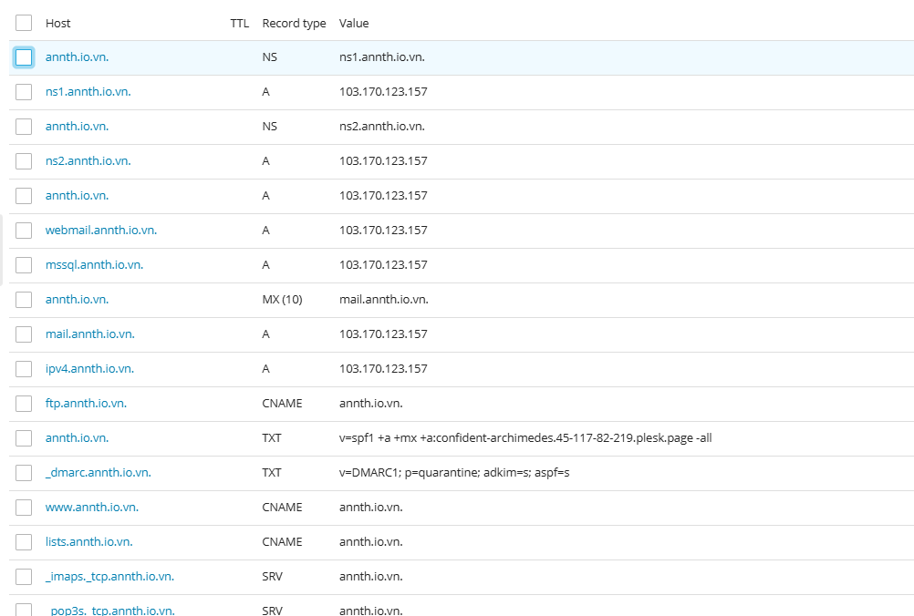	
				- Host: Tên bản ghi 
					- Click để mở giao diện chỉnh sửa bản ghi 
					- 	
				- TTL: Time-to-live của bản ghi 
				- Record Type: Loại bản ghi 
				- Value: Gía trị bản ghi 
		- Settings : Các cài đặt DNS 
		- 	
			- Các thành phần trong cấu hình DNS:
				- Primary Name Server: Là máy chủ DNS chính chịu trách nhiệm quản lý vùng DNS này. Có thể chọn chế độ Autoselect, tức là hệ thống sẽ tự động chọn máy chủ chính. Hoặc lựa chọn thủ công. 
				- Zone Defaults: TTL (Time To Live): Mặc định là 1 ngày. Đây là thời gian mà bản ghi DNS được lưu trong bộ nhớ cache của các máy chủ DNS khác trước khi được cập nhật lại.
				- SOA Record (Start of Authority): SOA là bản ghi đầu tiên trong một vùng DNS, chứa thông tin quản lý vùng. Các thông số:
					- Refresh (3 giờ):Khoảng thời gian máy chủ phụ chờ trước khi kiểm tra lại bản ghi từ máy chủ chính.
					- Retry (1 giờ): Nếu lần kiểm tra trước thất bại, máy chủ phụ sẽ thử lại sau thời gian này.
					- Expire (2 tuần): Nếu không thể liên lạc với máy chủ chính trong thời gian này, máy chủ phụ sẽ ngừng phục vụ bản ghi.
					- Minimum (3 giờ): Thời gian tối thiểu mà các máy chủ DNS khác nên lưu bản ghi trong cache.
				- Advanced DNS Features: Tính năng nâng cao 
					- Use the serial number format recommended by IETF and RIPE: Tùy chọn này bật định dạng số hiệu bản ghi (serial number) theo chuẩn quốc tế, giúp dễ quản lý và đồng bộ hóa bản ghi DNS.
		- Zone Tranfers: Cấu hình chuyển zone DNS. 
			- Vì lý do bảo mật, bạn chỉ nên cho phép chuyển vùng DNS đến các máy chủ được chỉ định trong bản ghi NS của vùng.
			- DNS zone transfer là quá trình sao chép toàn bộ dữ liệu DNS từ một máy chủ chính (primary) sang một máy chủ phụ (secondary).
			- Việc này giúp đảm bảo tính sẵn sàng và dự phòng cho hệ thống DNS.
			- Tuy nhiên, nếu không kiểm soát chặt chẽ, kẻ xấu có thể khai thác zone transfer để thu thập thông tin về hệ thống mạng của bạn.
			- Vì vậy, chỉ nên cho phép zone transfer đến các máy chủ DNS phụ đã được liệt kê trong bản ghi NS (Name Server) của vùng DNS.	-
			- Để chỉ định một hoặc nhiều máy chủ được phép chuyển vùng, hãy nhấn "Thêm địa chỉ IP" (Add IP Address).
			- Bạn sẽ nhập địa chỉ IP của các máy chủ phụ mà bạn cho phép thực hiện zone transfer.
			- Hệ thống sẽ chỉ cho phép các địa chỉ IP này truy cập và sao chép dữ liệu DNS.
			- 	
			- 	
			- Giao diện cấu hình gồm nút thêm IP, Xoá IP đã cấu hình, Danh sách các IP đã thêm. 
			- 	
		
	- Dedicated IIS Application Pool for Website: Quản lý môi trường riêng cho website chạy độc lập trong IIS 
		- Application Pool là một vùng cách ly trong IIS, nơi một hoặc nhiều website có thể chạy độc lập với các website khác. Mỗi pool có thể có:
			- Cấu hình riêng về hiệu năng
			- Quyền truy cập hệ thống riêng
			- Quản lý bộ nhớ và tiến trình riêng
		- IIS Application Pool của Customer dùng để:
			- Tách biệt website của từng khách hàng: Giúp bảo mật và ổn định hơn, nếu một site bị lỗi thì không ảnh hưởng đến site khác.
			- Tùy chỉnh cấu hình theo nhu cầu: bật/tắt chế độ 32-bit, cấu hình số lượng tiến trình, thời gian timeout, giới hạn bộ nhớ...
			- Quản lý hiệu năng và tài nguyên: Giúp tối ưu hóa tốc độ xử lý và giảm tải cho server.
			- Hỗ trợ các ứng dụng ASP.NET, .NET Core: Cho phép chạy các ứng dụng web hiện đại trên nền Windows.
		- 
		- Giao diện này gồm 
			- 
			- Nút chức năng kích hoạt sử dụng IIS Application Pool, Quản trị bật/tắt/khởi động lại. Click chọn `Switch On` để bật. 
			- 
			- General Setting: Cấu hình cài đặt chung một IIS Application Pool trong Plesk, dùng để cấu hình cách ứng dụng web ASP.NET hoạt động trên server Windows. 
				- 
				- Các tùy chọn cấu hình:
				- Managed pipeline mode: 
				- Integrated: Đây là chế độ xử lý yêu cầu web của IIS. ASP.NET được tích hợp trực tiếp vào pipeline xử lý của IIS, cho phép xử lý linh hoạt và hiệu quả hơn.
				- Classic: ASP.NET chạy như một ISAPI extension, phù hợp với các ứng dụng cũ.
				- Enable 32-bit applications: Nếu bật (✓), IIS sẽ cho phép chạy ứng dụng 32-bit trên hệ điều hành 64-bit. Dùng khi ứng dụng hoặc thư viện bạn triển khai chỉ hỗ trợ 32-bit.
				- Load the user profile: Nếu bật (✓), IIS sẽ tải profile người dùng khi khởi động ứng dụng. Cần thiết nếu ứng dụng cần truy cập registry, thư mục người dùng, hoặc các thiết lập cá nhân.
			- Performance Settings: Cấu hình cài đặt hiệu năng của một IIS Application Pool trong Plesk. Đây là nơi cấu hình hiệu năng và hành vi của tiến trình xử lý web.
				- 
				- **The maximum number of worker processes**: Chỉ cho phép một tiến trình làm việc chạy, đảm bảo tính nhất quán và tránh xung đột trạng thái.
				- **Idle timeout (minutes)**: Nếu không có yêu cầu nào trong vòng 5 phút, tiến trình sẽ bị coi là không hoạt động.
				- **Idle timeout action**: Khi hết thời gian chờ, tiến trình sẽ bị kết thúc để giải phóng tài nguyên.
				- **Maximum CPU usage (%)**: Không giới hạn mức sử dụng CPU, tiến trình có thể dùng toàn bộ tài nguyên khi cần.
				- **Recycling at regular time intervals (minutes)**: Application pool sẽ được tái chế sau mỗi 1740 phút để làm mới tiến trình và tránh rò rỉ bộ nhớ.
				- **Recycling when the maximum number of requests is reached**: Không giới hạn số lượng yêu cầu, tiến trình có thể xử lý liên tục mà không bị tái chế.
				- **Recycling when the maximum amount of virtual memory is used**: Không giới hạn lượng bộ nhớ ảo mà tiến trình có thể sử dụng trước khi bị tái chế.
				- **Recycling when the maximum amount of private memory is used**: Không giới hạn lượng bộ nhớ riêng mà tiến trình có thể sử dụng trước khi bị tái chế.

- Mail 
	- 
	- Gồm các phần 
		- Mail Accounts: Cấu hình tài khoản mail 
		- Mail Settings: Các cài đặt dịch vụ mail 
		- Mailling Lists: Cấu hình danh sách gửi thư 
		- Limit Outgoing Messages: Cấu hình giới hạn mail gửi đi 
		- Mail Importing: Nhập mail vào hệ thống 
	- Mail Accounts: Giao diện quản lý tài khoản Email. 
		- 
		- Có thể thao tác tạo tài khoản mới hoặc xoá. 
		- Tạo mới tài khoản mail bằng nút `Create mail address`
			- 
			- Chuyển tới giao diện cấu hình tài khoản 
			- General: Cấu hình chung với tài khoản mail 
				- 
				- Email address: Địa chỉ email. Đây cũng là username để đăng nhập vào Plesk nếu được cấp quyền.
				- External email address: Là địa chỉ email phụ bên ngoài (ví dụ: Gmail, Outlook). Có thể dùng để nhận thông báo hoặc khôi phục mật khẩu.
				- Password & Confirm password: Nhập mật khẩu cho tài khoản email.
					- Có nút Generate để tạo mật khẩu ngẫu nhiên.
					- Có thể hiện/ẩn mật khẩu khi nhập.
				- Password reset link: Tùy chọn hiển thị liên kết để đặt lại mật khẩu.
				- Mailbox size: Chọn dung lượng hộp thư:
					- Default size (Unlimited): không giới hạn.
					- Another size: nhập dung lượng cụ thể (MB/GB).
				- Description in Plesk: Mô tả tài khoản email. Mọi người có quyền truy cập tài khoản này sẽ thấy mô tả.
			- Forwarding: Cấu hình chuyển tiếp 
				- 
				- Switch on mail forwarding: Khi bật tùy chọn này, mọi email gửi đến địa chỉ gốc sẽ được chuyển tiếp đến địa chỉ email khác mà bạn chỉ định.
				- Do not deliver copies of forwarded emails to the Plesk mailbox: Nếu chọn tùy chọn này, email sẽ không được lưu lại trong hộp thư Plesk gốc. Email chỉ được chuyển tiếp đi, không giữ bản sao.
				- Email addresses để chuyển tiếp đến: Bạn có thể nhập một hoặc nhiều địa chỉ email để nhận email chuyển tiếp.
					- Mỗi địa chỉ trên một dòng.
					- Hoặc phân cách bằng dấu cách, dấu phẩy, hoặc dấu chấm phẩy.
			- Email alias: Cấu hình địa chỉ email phụ trỏ về một địa chỉ email chính
				- 
				- Danh sách các alias hiện có: Mỗi alias có nút Remove để xóa nếu không cần dùng nữa.
				- Thêm alias mới: Nhấp vào Add email alias để tạo địa chỉ phụ mới.
			- Auto-reply: Cấu hình tính năng trả lời tự động cho tài khoản Email 
				- 
				- Switch on auto-reply: Bật tính năng trả lời tự động cho email. Khi có ai đó gửi email đến địa chỉ này, hệ thống sẽ tự động gửi lại một tin nhắn phản hồi.
				- Auto-reply message subject: Tiêu đề của email phản hồi. Mặc định là: Re: <request_subject> → phản hồi theo tiêu đề email gốc.
				- Định dạng nội dung phản hồi
					- Plain text: văn bản đơn giản, tương thích với mọi ứng dụng email.
					- HTML: cho phép định dạng đẹp hơn (font, màu, v.v.), nhưng có thể không hiển thị đúng ở một số ứng dụng email.
				- Auto-reply message text: Nội dung email phản hồi tự động.
				- Forward to: Khi gửi phản hồi tự động, email gốc cũng sẽ được chuyển tiếp đến địa chỉ bạn chỉ định.
				- Giới hạn số lần phản hồi: Tùy chọn giới hạn số lần gửi phản hồi tự động đến cùng một địa chỉ email trong một ngày.
				- Switch off auto-reply on: Chọn ngày để tự động tắt chức năng trả lời tự động. Hữu ích khi bạn chỉ muốn bật auto-reply trong thời gian nghỉ phép, công tác,...
		- Danh sách các tài khoản Email: Tên email, Tên liên lạc, Usage: Dung lượng sử dụng, 
			- Click tên email để tới trang cấu hình tài khoản mail 
				- 
				- 
			- Các nút thao tác: Mail Client Setup (Mở pop-up hướng dẫn kết nối), Webmail (Click mở trang webmail) 
	- Mail Settings: Các thiết đặt về dịch vụ Mail với Domain cấu hình toàn bộ dịch vụ email cho domain, bao gồm bật/tắt dịch vụ, xử lý email lỗi, bảo mật bằng SSL, xác thực DKIM, và các tính năng nâng cao như webmail và autodiscover.
		- 
		- Mail service on this domain: Cấu hình dịch vụ Mail 
			- Enabled: Domain có thể gửi và nhận email.
			- Disabled: Plesk sẽ không cung cấp dịch vụ email cho domain này.
			- Not configured: Không chỉ tắt dịch vụ email mà còn xóa vĩnh viễn toàn bộ hộp thư và email đã gửi/nhận.
		- Xử lý email gửi đến người dùng không tồn tại
			- Forward to address: Chuyển email đến địa chỉ khác 
			- Redirect to external mail server: Chuyển tiếp đến máy chủ email bên ngoài qua địa chỉ IP.
			- Reject: Từ chối email gửi đến người dùng không tồn tại.
		- Webmail: Cấu hình giao diện webmail được sử dụng: MailEnable/ Horde / None 
		- SSL/TLS Certificates: Cấu hình chứng chỉ SSL cho Webmail và Mail service 
		- Các tùy chọn bổ sung
			- Enable mailing lists: bật chức năng danh sách gửi thư (newsletter, group mail,...).
			- Use DKIM: bật xác thực DKIM để chống spam, xác minh email gửi đi. Có thể chọn hoặc tạo DKIM Selector mới.
			- Enable mail autodiscover: bật tính năng tự động cấu hình email cho các ứng dụng như Outlook.
	- Mailling Lists: Cấu hình gửi email tới hàng loạt người dùng theo nhóm 
		- 
		- Các nút chức năng 
			- Tạo Mailling List mới: Click để mở giao diện tạo mailling list mới. 
				- 
				- 
				- Mailing list address: Nhập địa chỉ danh sách gửi thư. Đây là địa chỉ mà người gửi sẽ dùng để gửi email đến tất cả người đăng ký.
				- Switched on: Bật/tắt danh sách gửi thư.Nếu được chọn, danh sách sẽ hoạt động ngay sau khi tạo.
				- Mailing list administrator's email: Nhập địa chỉ email của người quản lý danh sách gửi thư. Người này sẽ nhận thông báo, quản lý người đăng ký, và xử lý các vấn đề liên quan.
				- Subscribers: Nhập danh sách email người nhận. Có thể nhập mỗi địa chỉ trên một dòng, hoặc phân cách bằng dấu cách, dấu phẩy, hoặc dấu chấm phẩy.
				- Notify administrator on the mailing list creation: Nếu được chọn, quản trị viên sẽ nhận email thông báo khi danh sách được tạo.	
			- Xoá Mailling List: Xoá mailling list được chọn 
				- 
		- Bảng liệt kê các Mailling List hiện có: 
			- 
			- Address: Tên mailling list 
			- Subscribers: Số lượng người đăng ký trong mailling list 
	- Limit Outgoing Messages: Cấu hình quản lý mail gửi đi dùng để kiểm soát số lượng email gửi đi từ các đối tượng trong Plesk
		- 
		- Các tùy chọn cấu hình
			- Default (50 messages per hour): Giới hạn mặc định: domain chỉ được gửi tối đa 50 email mỗi giờ.
			- Custom value for this domain: Cho phép nhập giá trị tùy chỉnh
				- `messages per hour`: cấu hình thông số cụ thể số mail được gửi / giờ
				- Unlimited: không giới hạn số lượng email gửi ra.	
	- Mail Importing: Nhập mail vào hệ thống 
		- 
		- Plesk hỗ trợ nhập mail thông qua IMAP 
		- Click chọn `Import Mail Messages` để cấu hình nhập email 
		- Giao diện cấu hình gồm các thông số 
			- Source email (login): Là địa chỉ email hoặc tên đăng nhập của tài khoản bạn muốn nhập dữ liệu từ.  
			- Source password: Mật khẩu của tài khoản email nguồn (để hệ thống có thể truy cập và lấy dữ liệu).
			- Import to: Chọn nơi sẽ nhập email vào:
				- **Existing mailbox**: Nhập vào một hộp thư đã có sẵn.
				- **Create a new mailbox**: Tạo hộp thư mới để chứa email được nhập.
			- Destination email: Là địa chỉ email đích trong hệ thống hiện tại.
			- **Advanced Options (Tùy chọn nâng cao)**
				- Source IMAP host: Tên miền hoặc địa chỉ IP của máy chủ email nguồn.  
				- Source IMAP port: Cổng kết nối đến máy chủ IMAP Mặc định: `143` (IMAP thường), `993` (IMAP qua SSL).
				- Source IMAP encryption: Chế độ mã hóa khi kết nối Automatic/IMAP over SSL/Plain IMAP
					- Automatic: Hệ thống sẽ thử kết nối qua SSL trước, nếu thất bại sẽ hỏi bạn có muốn thử kết nối không mã hóa (ít an toàn hơn).
					- IMAP over SSL: Sử dụng kết nối IMAP kèm SSL 
					- Plan IMAP: Sử dụng IMAP bản rõ không an toàn. 
				- Source IMAP timeout: Thời gian chờ kết nối (mặc định là 30 giây).
				- Source IMAP folder separator: Ký tự phân cách thư mục trong hệ thống IMAP (ví dụ: `/` hoặc `.`).  Thường được phát hiện tự động.
		- Nút chức năng
			- **OK**: Bắt đầu quá trình nhập email.
			- **Cancel**: Hủy thao tác.

- Get Started: Giao diện khởi tạo với website 
	- 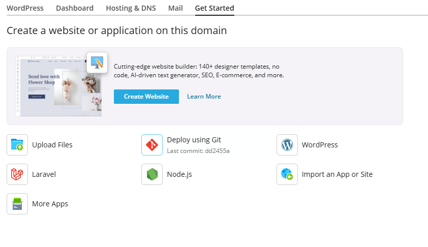
	- **Phần chính: Website Builder**
		- Quảng bá một công cụ tạo website hiện đại với các tính năng:
			- **140+ mẫu thiết kế chuyên nghiệp**
			- **Không cần viết mã (no-code)**
			- **Trình tạo nội dung bằng AI**
			- **Tối ưu SEO**
			- **Hỗ trợ thương mại điện tử (E-commerce)**

		- Các nút chức năng 
			- **Create Website**: Bắt đầu tạo website bằng công cụ này.
			- **Learn More**: Tìm hiểu thêm về công cụ.
	- **Các tùy chọn triển khai website hoặc ứng dụng:**
		- **Upload Files**: Tải lên mã nguồn hoặc nội dung website thủ công.Click chuyển tới giao diện quản lý file của hosting. Tại đây bạn có thể upload mã nguồn 1 cách thủ công. 
		- **Deploy using Git**: Triển khai website từ kho mã nguồn Git.  
			- Chuyển tới giao diện triển khai 
			- 
		- **WordPress**: Cài đặt website sử dụng nền tảng WordPress.
			- Chuyển tới giao diện khởi tạo với WP-Toolkit
			- Cấu hình các thông số với website WP: đường dẫn cài đặt, tiêu đề, theme, ngôn ngữ, phiên bản, tài khoản quản trị, ...
			- 
		- **Laravel**: Triển khai ứng dụng web sử dụng framework Laravel (PHP).
			- Chuyển tới giao diện triển khai ứng dụng Laravel 
			- 
		- **Node.js**: Triển khai ứng dụng sử dụng Node.js (JavaScript).
			- Chuyển tới giao diện sử dụng Nodejs 
			- 
			- Enable Nodejs và quản trị các cấu hình liên quan tới ứng dụng
			- `Run Nodejs Command` : Giao diện sử dụng để khởi chạy các lệnh nodejs 
			- 
		- **Import an App or Site**: Nhập một ứng dụng hoặc website đã có từ nơi khác.
			- 
		- **More Apps**: Khám phá thêm các ứng dụng có thể cài đặt (CMS, blog, shop,...).
			- Chuyển tới giao diện cài đặt ứng dụng 
			- 
	
<!-- TOC -->
## Mail
- Cấu hình email theo tên miền.
- Gồm các tab quản trị
	- Email Address: Tài khoản Email với tất cả domain thuộc cùng gói các thông số, cấu hình tương tự với phần quản trị từng domain. 
	- 
	- Mail Settings: Các cài đặt dịch vụ mail của các domain thuộc cùng gói
	- 
	- Các nút chức năng 
		- Activate/Deactivate Serivces: Bật/ tắt dịch vụ email đối với domain được chọn.
			- 
			- Các tùy chọn cấu hình:
				- Mail service: Cho phép bạn bật/tắt dịch vụ email cho tên miền. 
					- "Do not change", tức là giữ nguyên trạng thái hiện tại.
					- "Enabled", bật dịch vụ 
					- "Not configure", tắt không cấu hình. 
				- Mailing lists: Quản lý danh sách gửi thư (email hàng loạt). Các chế độ cấu hình tương tự dịch vụ mail trên. 
				- DKIM spam protection system: DKIM (DomainKeys Identified Mail) là hệ thống bảo vệ chống spam bằng cách ký điện tử các email gửi đi. Giúp xác minh email là từ tên miền hợp lệ và chưa bị giả mạo. Các chế độ cấu hình tương tự dịch vụ mail trên.
				- Applied to domains: Hiển thị tên miền mà các thiết lập này sẽ áp dụng.
				- Nút chức năng
					- OK: Áp dụng các thay đổi.
					- Cancel: Hủy thao tác.
		- Webmail: Cấu hình webmail của tên miền đang chọn 
			- 
			- Các tuỳ chọn cấu hình 
				- Webmail: Cấu hình chọn phần mềm webmail hoặc `No` không sử dụng webmail 
				- Applied to domains: Hiển thị tên miền mà các thiết lập này sẽ áp dụng.
				- Nút chức năng
					- OK: Áp dụng các thay đổi.
					- Cancel: Hủy thao tác.
		- Mail for Non-Existent Users: Cấu hình xử lý các mail không tồn tại 
			- 
			- Nơi bạn thiết lập cách hệ thống xử lý email gửi đến các địa chỉ không tồn tại trong tên miền.
			- Các tuỳ chọn cấu hình 
				- Các tuỳ chọn xử lý 
					- Forward to address: Chuyển tiếp email đến một địa chỉ hợp lệ trong cùng tên miền.Lưu ý: Chỉ quản trị viên mới có thể chỉ định địa chỉ bên ngoài hoặc dùng chung cho nhiều tên miền.
					- Redirect to an external mail server with the IP address: Chuyển email đến một máy chủ email khác thông qua địa chỉ IP. Dùng khi bạn có hệ thống xử lý email riêng bên ngoài.
					- Reject : Từ chối email gửi đến địa chỉ không tồn tại. Máy chủ sẽ trả về thông báo lỗi cho người gửi.			
				- Applied to domains: Hiển thị tên miền mà các thiết lập này sẽ áp dụng.
				- Nút chức năng
					- OK: Áp dụng các thay đổi.
					- Cancel: Hủy thao tác.
		- Limiting Outgoing Messages: Giới hạn mail gửi đi 
			- 
			- Các tuỳ chọn cấu hình 
				- Cấu hình giới hạn 
					- Default (50 messages per hour): Giới hạn mặc định: domain chỉ được gửi tối đa 50 email mỗi giờ.
					- Custom value for this domain: Cho phép nhập giá trị tùy chỉnh
						- `messages per hour`: cấu hình thông số cụ thể số mail được gửi / giờ
						- Unlimited: không giới hạn số lượng email gửi ra.	
				- Applied to domains: Hiển thị tên miền mà các thiết lập này sẽ áp dụng.
				- Nút chức năng
					- OK: Áp dụng các thay đổi.
					- Cancel: Hủy thao tác.		
	- Danh sách dịch vụ mail của các tên miền: 
		- 
		- Domain Name: Tên miền 
		- Mail Service: Trạng thái triển khai dịch vụ mail 
		- Webmail: Trạng thái cấu hình webmail 
		- Mail sent to non-existent users: Cấu hình xử lý mail không tồn tại. 
		- Number of outgoing messages: Click chọn để chỉnh sửa giới hạn mail gửi đi tương ứng với từng tên miền. 
	- Malling Lists: Cấu hình gửi email tới hàng loạt người dùng theo nhóm với tất cả domain thuộc subscription các thông số, cấu hình tương tự với phần quản trị từng domain. 
		- 
	- Outgoing Mail Control: Quản trị email gửi đi với tất cả domain thuộc subscription các thông số, cấu hình tương tự với phần quản trị từng domain. 
		- 
	

<!-- TOC -->
## Applications
- Cài đặt ứng dụng như WordPress, Joomla, v.v.
- 
- Giao diện quản lý các ứng dụng được cài, cài đặt ứng dụng mới 
- Gồm các tab quản lý 
- Manage My Applications: Hiển thị danh sách các ứng dụng được cài đặt 
	- 
	- Click `Scan` để làm mới danh sách 
	- Name: Tên ứng dụng. CLick để mở giao diện cấu hình riêng của từng ứng dụng 
	- Installation Path: Đường dẫn cài đặt 
	- Remove: Gỡ cài đặt ứng dụng
- Featured Applications: Danh sách các ứng dụng được đề xuất và cài phổ biến. Có thể chọn cài đặt ứng dụng tại đây, custom phiên bản cần cài đặt. 
- 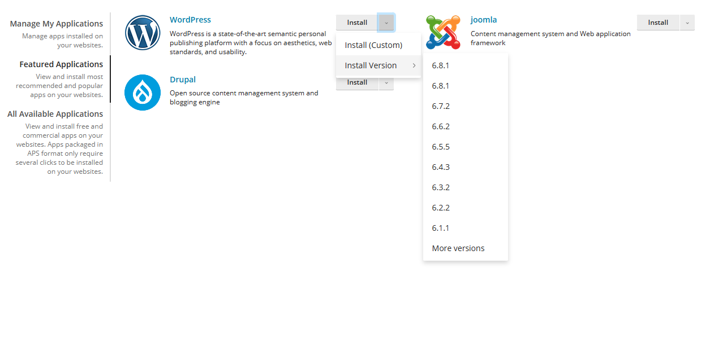
- All Available Applications 
- : Hiển thị danh sách tất cả các ứng dụng có thể cài. Có thể cài đặt ứng dụng tại đây bằng nút thao tác `Install` cạnh tên ứng dụng. 

<!-- TOC -->
## Files
- Quản lý tệp tin trên hosting.
- Trình quản lý tện tin tại đây có thể thao tác thêm, sửa, xoá tệp/ thư mục. Upload file, Nén tệp, ...
	- 
<!-- TOC -->
## Databases
- Tạo và quản lý cơ sở dữ liệu (MySQL, PostgreSQL...).
- Quản trị cấu hình cài đặt database với các domain các thao tác, cấu hình tương tự với phần quản trị từng domain. 
	- 

<!-- TOC -->
## Statistics
- Thống kê lưu lượng truy cập, dung lượng sử dụng.
- Hiển thị chi tiết các phân tích thông kê của hosting 
- 
- Gồm 2 biểu đồ 
	- Disk Usage: Lượng sử dụng ổ đĩa / Tài nguyên được cấp. Kèm theo biểu đồ phân tích dung lượng sử dụng của các dịch vụ 
	- Traffic: Băng thông đã sử dụng / Tài nguyên được cấp. Kèm theo biểu đồ phân tích băng thông sử dụng của các dịch vụ
- Các thông tin bổ sung 	
	- 
	- Data Transfer Statistics: Báo cáo lượng dữ liệu sử dụng bởi các dịch vụ với từng domain . 
		- Click chọn `View` với tên miền tương ứng để xem báo cáo 
		- 
		- Gồm các thông tin: Tên dịch vụ, Thông số lưu lượng sử dụng, In/Out/ tỉ lệ % chiếm trong tổng băng thông đã dùng. 
		- 
	- Web Statistics: Báo cáo về truy cập website: Lượng truy cập, webpages nào được truy cập nhiều nhất 
		- Click chọn `View` với tên miền tương ứng để xem báo cáo 
		- 
	
<!-- TOC -->
## Users
- Quản lý người dùng có quyền truy cập hosting.
- Quản trị user, cấu hình role trong Subscription
- UserAccounts: Tab quản lý user
	- 
	- Các nút chức năng 
		- `Create New Account`: Dùng tạo tài khoản mới 
			- 
			- 
			- Các thông số cấu hình 
				- Thông tin chung (General Information)
					- Contact name : Tên người dùng hoặc tên liên hệ. Là trường bắt buộc.
					- Email address: 
						- Địa chỉ email nội bộ thuộc tên miền `annth.io.vn`.  
						- Bạn nhập phần đầu, phần sau chọn từ danh sách.  
						- Là trường bắt buộc.
					- External email address: Email bên ngoài (không thuộc tên miền), dùng để liên hệ hoặc khôi phục tài khoản.
					- User role: Cấu hình vai trò của người dùng trong hệ thống (ví dụ: Application User, Administrator,...).
					- Access to subscriptions: Quyền truy cập đến các gói dịch vụ hoặc tài nguyên hosting.
				- Tùy chọn Plesk (Plesk Preferences)
					- Username: Tên đăng nhập vào hệ thống Plesk. Là trường bắt buộc.
					- Password / Confirm password : 
						- Mật khẩu đăng nhập và xác nhận lại.  
						- Có thể tạo tự động bằng nút **Generate** hoặc hiển thị bằng **Show**.
					- Plesk language: Cấu hình ngôn ngữ giao diện khi người dùng đăng nhập vào Plesk.
					- User is active: Nếu được chọn, người dùng có thể đăng nhập và sử dụng Plesk.
					- Activate account by email: Nếu được chọn, hệ thống sẽ gửi email kích hoạt tài khoản.
		- `Remove`: Dùng xoá tài khoản đang được chọn 
			- 
	- Danh sách các tài khoản 
		- 
		- Contact Name: Tên tài khoản 
			- Click chọn để mở giao diện chỉnh sửa tài khoản
			- Giao diện tóm tắt cài đặt, quyền của user. Click `Change Settings` để thay đổi cài đặt 
			- 
			- 
		- Email address: Email liên lạc 
		- Role: Hiển thị role được cấp của tài khoản 
- User Roles: Cấu hình các role user của Subscription
	- 
	- Các nút chức năng	
		- `Create User Role`: Dùng tạo role mới 
			- 
			- 
			- Các thông số cấu hình 
				- Phần: General (Thông tin chung)**
					- User role name: Nhập tên cho vai trò người dùng (ví dụ: "Editor", "Developer", "Mail Admin"...). Đây là trường bắt buộc.
					- Activate this role's accounts by email: Nếu được chọn, các tài khoản sử dụng vai trò này sẽ được kích hoạt qua email.
					- Access to Plesk services (Quyền truy cập dịch vụ Plesk): Bạn có thể cấp hoặc từ chối quyền cho vai trò này đối với từng chức năng sau:
						1. **Manage users and roles** – Quản lý người dùng và vai trò.
						2. **Create and manage sites** – Tạo và quản lý website.
						3. **Configure log rotation** – Cấu hình xoay vòng nhật ký (log).
						4. **Configure anonymous FTP service** – Cấu hình dịch vụ FTP ẩn danh.
						5. **Create and manage scheduled tasks** – Tạo và quản lý tác vụ định kỳ.
						6. **Configure spam filter** – Cấu hình bộ lọc thư rác.
						7. **Configure antivirus** – Cấu hình phần mềm chống virus.
						8. **Create and manage databases** – Tạo và quản lý cơ sở dữ liệu.
						9. **Configure and perform data backup and restoration** – Sao lưu và khôi phục dữ liệu.
						10. **View statistics** – Xem thống kê hệ thống.
						11. **Install and manage applications** – Cài đặt và quản lý ứng dụng.
						12. **Design sites in Presence Builder** – Thiết kế website bằng công cụ Presence Builder.
						13. **Upload and manage files** – Tải lên và quản lý tệp tin.
						14. **Create and manage additional FTP accounts** – Tạo và quản lý tài khoản FTP phụ.
						15. **Manage DNS settings** – Quản lý cài đặt DNS.
						16. **Create and manage mail accounts** – Tạo và quản lý tài khoản email.
						17. **Create and manage mailing lists** – Tạo và quản lý danh sách gửi thư.
				- Access to apps (Quyền truy cập ứng dụng): Bạn có thể cấp quyền truy cập đến các ứng dụng webmail đã cài đặt:
		- `Remove`: Dùng xoá role đang được chọn 
			- 
	- Danh sách các role
		- 
		- Role Name: Tên role
			- Click chọn để mở giao diện chỉnh sửa role
			- 
		- Users: Hiển thị số lượng user của mỗi role 

<!-- TOC -->
## Account 
- Trang này cung cấp thông tin chi tiết về phân bổ tài nguyên, tùy chọn lưu trữ và các quyền thao tác mà bạn có thể thực hiện trong Plesk theo điều khoản gói dịch vụ của bạn.
- 
- Gồm các phần 
	- Nút chức năng `My Profile`: Click chuyển tới giao diện cấu hình hồ sơ
		- Giao diện cấu hình hồ sơ người dùng, cho phép chỉnh sửa thông tin cá nhân, bảo mật đăng nhập và tùy chọn khác.
		- Tổng quan giao diện 
		- 
		- 
		- 
		- Giao diện gồm các phần 
			- General 
				- General Information: Cài đặt thông tin chung
					- Contact name: Tên người liên hệ chính.
					- Email address: Địa chỉ email được sử dụng để liên hệ 
					- External email address: Địa chỉ email bên ngoài hệ thống. 
				- Plesk Preferences: Cấu hình tài khoản plesk 
					- Username: tên người dùng 
					- Password: có thể cấu hình đổi tại đây. 
					- Plesk language: Cấu hình ngôn ngữ giao diện plesk 
				- Xác thực đa yếu tố (MFA)
					- Multi-Factor Authentication: Có thể thay đổi cài đặt xác thực đa yếu tố tại đây.
			- Contact Details 
				- Company name: Tên công ty (nếu có).
				- Phone number: Số điện thoại liên hệ.
				- Address, City, State/Province, Postal/ZIP code, Country:  Thông tin địa chỉ đầy đủ của người dùng.
				- Additional information: Trường nhập thêm thông tin tùy chọn.
	- Nút chức năng `Backup`: Click chuyển tới giao diện tạo, cấu hình backup 
	- Nút chức năng `Additional Service` 
		- 
		- Hiển thị nút tùy chỉnh: Cho phép hiển thị nút chỉ dành riêng cho người dùng hiện tại, không áp dụng cho toàn bộ hệ thống.
		- Cấu hình nút
			- Nhãn nút: Nhập văn bản sẽ hiển thị trực tiếp trên nút.
			- Văn bản gợi ý: Nhập nội dung sẽ hiển thị khi người dùng di chuột qua nút.
			- Hình nền: Chọn tệp hình ảnh để làm nền cho nút. Nếu không chọn, nút sẽ hiển thị với nền mặc định.
		- Vị trí: Xác định nơi nút sẽ xuất hiện trong giao diện Plesk
		- Ưu tiên: Nhập giá trị để xác định mức độ ưu tiên hiển thị của nút. Giá trị càng thấp thì nút càng được ưu tiên hiển thị trước.
		- URL
			- Địa chỉ URL: Nhập đường dẫn mà nút sẽ chuyển đến khi được nhấn.
			- Mở trong Plesk: Chọn cách hiển thị URL: trong giao diện Plesk hoặc mở ra một cửa sổ trình duyệt mới.
		- Không sử dụng khung: Quy định cách hiển thị nội dung URL: có thể hiển thị trong khung giao diện hoặc toàn màn hình.
		- Thêm tham số vào URL: Cho phép bổ sung thông tin động vào đường dẫn URL để phục vụ mục đích tích hợp hoặc định danh:
			- ID đăng ký, ID tên miền, ID bí danh tên miền: Thêm chuỗi `&dom_id=<dom_id>&site_id=<site_id>&alias_id=<alias_id>` vào URL.
			- Tên miền chính: Thêm `&dom_name=<dom_name>` vào URL.
			- Tên người dùng FTP: Thêm `&ftp_user=<ftp_user>` vào URL.
			- Mật khẩu FTP: Thêm `&ftp_pass=<ftp_pass>` vào URL.
			- ID khách hàng: Thêm `&cl_id=<cl_id>` vào URL.
			- Tên công ty của khách hàng: Thêm `&cname=<cname>` vào URL.
			- Tên liên hệ của khách hàng: Thêm `&pname=<pname>` vào URL.
			- Email của khách hàng: Thêm `&email=<email>` vào URL.
	- Thông tin chung về gói dịch vụ: Tên gói, Ngày thiết lập, Trạng thái
	- Các tab hiển thị chi tiết về tài nguyên được cấp, các cấu hình của hostings, các quyền, các dịch vụ đi kèm và trạng thái được kích hoạt/ không kích hoạt 
		- Resources
			- 
		- Hosting options
			- 
		- Permissions
			- 
		- Additional Services 
			- 

<!-- TOC -->
## WordPress 
- Giao diện quản lý của tiện ích WP-Toolkit
- Tổng quan 
- 	
- WP-Toolkit Dashboard chia thành 4 tab 
	- Installation: Quản lý cài đặt, triển khai, cấu hình các web wordpress.
		- 	
	- Plugins: Quản lý phần bổ trợ
		- 	 
	- Themes: Quản lý các themes - giao diện 
		- 	 

<!-- TOC -->
### Installation
- Giao diện quản lý các trang WordPress trong Plesk, cho phép thực hiện các thao tác như cài đặt, kết nối, quét, cập nhật và bảo mật các website WordPress. Mục đích là giúp quản trị viên dễ dàng kiểm soát và bảo trì hệ thống WordPress trên máy chủ.
- 	 
- Thanh công cụ quản lý WordPress: Tập hợp các nút chức năng chính để thao tác với các trang WordPress:
	- Install: Cài đặt mới một website WordPress trên máy chủ.
		- Click để mở giao diện triển khai website Wordpress mới
		- Giao diện cấu hình cài đặt
		- 	 
		- General
			- Installation Path: Cấu hình tên miền cài đặt và đường dẫn / nếu có. 
			- Website title: Tiêu đề trang WordPress
			- Plugins/theme set: Cấu hình set plugin/ giao diện 
			- Website Language: Cấu hình ngôn ngữ trang wordpress
			- Version: Cấu hình phiên bản cần cài đặt 
		- Wordpress Administrator
			- Username: Tên người dùng quản trị 
			- Password: Mật khẩu người dùng quản trị 
			- Email: Email người dùng quản trị 
		- Database 
			- 	 
			- Database name: Tên cơ sở dữ liệu 
			- Database table prefix: Cấu hình tiền tố bảng trong CSDL 
			- Database username: Tên người dùng CSDL 
			- Database user password: Mật khẩu người dùng CSDL 
		- Automatic Update Settings:
			- 	 
			- Các cấu hình WPToolkit tự động cài WP core, plugin và theme. 
			- Update WP automatically: Cập nhật WP tự động. 
				- Không tự động cài đặt bất kỳ bản cập nhật nào, kể cả bản vá bảo mật như 4.7.1 hoặc bản chính như 4.8.
				- Tự động cài đặt các bản vá bảo mật nhỏ (ví dụ: 4.7.1), nhưng không cập nhật các phiên bản chính (ví dụ: 4.8).
				- Tự động cài đặt cả bản vá bảo mật và các phiên bản chính.
			- Update plugins automatically: Cập nhật các plugin tự động 
				- Mỗi plugin có cài đặt cập nhật riêng biệt.
					- Tùy chọn: Bật cập nhật tự động mặc định cho plugin mới cài qua WP Toolkit.
				- Mỗi plugin có cài đặt riêng, nhưng nếu plugin có lỗ hổng bảo mật thì vẫn được cập nhật.
					- Bật cập nhật tự động mặc định cho plugin mới cài qua WP Toolkit.
					- Thay vì cập nhật plugin dễ bị tấn công, có thể vô hiệu hóa chúng hoặc áp dụng biện pháp bảo vệ nếu có.
				- Tất cả plugin sẽ được cập nhật bất kể cài đặt riêng.
					- Vô hiệu hóa plugin dễ bị tấn công hoặc áp dụng bảo vệ nếu có.
			- Update theme automatically: Cập nhật theme tự động
				- Mỗi theme có cài đặt cập nhật riêng biệt.
					- Bật cập nhật tự động mặc định cho theme mới cài qua WP Toolkit.
				- Mỗi theme có cài đặt riêng, nhưng nếu có lỗ hổng bảo mật thì vẫn được cập nhật
		- Sau khi đã cấu hình xong click chọn `Install` để triển khai cài đặt 
			- 	 
			- 	 
	
	- Scan: Quét hệ thống để phát hiện các trang WordPress chưa được quản lý hoặc kiểm tra tình trạng hiện tại.
	- Updates: 
		- Cập nhật phiên bản WordPress, plugin và theme cho các trang đang quản lý.
		- Click mở trình quản lý cập nhật 
		- Các nút chức năng 
			- `Update`: Cập nhật với web WP được chọn.
				- 
			- `Change Settings`: Thay đổi cài đặt cập nhập 
				- 
			- `Check Updates`: Kiểm tra các bản cập nhật mới. 
				- 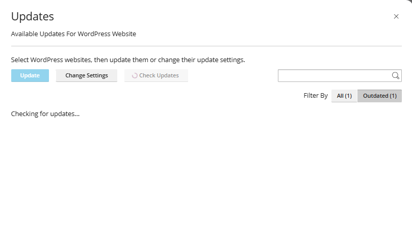
		- Danh sách các site wordpress có bản cập nhật 
		- 
			- Website URL: Đường dẫn website 
			- WordPress Core: Trạng thái cài đặt WP Core 
			- Plugins: Số lượng plugin đã cài 
			- Themes: Hiển thị cập nhật theme nếu có 
			- SmartUpdate: Trạng thái tính năng smartupdate 
			- Details: Mở giao diện hiển thị chi tiết các bản cập nhật với các tính năng của wp site 
				- 
			
	- Security
		- 
		- Kiểm tra và áp dụng các biện pháp bảo mật cho website WordPress.
		- Giao diện gồm 
			- Thanh thông tin 
				- Gợi ý các rủi ro an toàn được phát hiện 
				- Cấu hình bật Vulnerability Protection (trả phí)
				- Update: Hiển thị thông tin cập nhật 
			- Wordpress Vulnerabilities 
				- Hiển thị các rủi ro được Vulnerability Protection phát hiện, đề xuất sửa đổi 
				- 
			- Security Measures: 
				- Hiển thị các biện pháp đảm bảo an toàn được đề xuất 
				- Nút chức năng: 
					- Secure: Tích chọn áp dụng các biện pháp an toàn với site đã chọn. 
					- 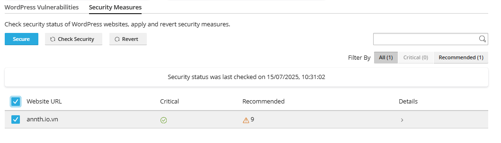
					- Check Security: Kiểm tra bảo mật các site. 
					- Revert: Bỏ áp dụng các biện pháp an toàn. Dùng trong trường hợp lỗi khi áp dụng các biện pháp. 
				- Danh sách các site wordpress
					- Website URL: Đường dẫn website 
					- Critical: Trạng thái rủi ro cần cập nhật, áp dụng biện pháp ngay 
					- Recommended: Số lượng các biện pháp đề xuất. 
					- Details: Hiển thị thông tin chi tiết. 
						- Hiển thị chi tiết các biện pháp bảo mật được đề xuất. 
						- 
						
	- Detach: Ngắt kết nối một trang WordPress khỏi WP Toolkit mà không xóa dữ liệu.
		- 
	- Remove: Xóa hoàn toàn một trang WordPress khỏi hệ thống, bao gồm cả dữ liệu.
		- 

- Danh sách các trang WordPress đang quản lý
	- 
	- Hiển thị các website WordPress đã được kết nối hoặc cài đặt trong hệ thống:
	- Với mỗi site gồm các tuỳ chọn
		- Nút chức năng `Open` mở tới site 
		- Có thể gắn nhãn để phân loại bằng nút chức năng `Add label`.
		- Các nút chức năng 
			- Logs: Mở giao diện quản lý bản ghi hoạt động của website 
				- 
			- File Manager: Mở trình quản lý file của site. 
			- Refresh: Làm mới các cài đặt, cấu hình. 
			- Các nút khác 
				- Check updates
				- Check Security
				- Update Site URL 
				- Detach
				- Remove
	- Click vào site cần quản lý để mở menu cấu hình chi tiết. 
	- 
- Cụ thể giao diện quản lý
	- Panel bên phải 
		- 	
		- Preview Website: Khung xem trước website  
		- Login: Nút chức năng click chuyển tới giao diện quản trị của wordpress admin 
		- Setup: Nút chức năng mở giao diện cấu hình cơ bản của WP site 
		- Hiển thị tên customer sở hữu
		- Manage Domain: Click chuyển tới giao diện quản lý tên miền. 
	- Tiêu đề trang có thể chỉnh sửa bằng nút Edit 
		- 
	- Các tab quản lý: Dashboard, Plugins, Themes, Database 
		- Dashboard: Tổng quan thông tin về WP site và các cấu hình bật tắt nhanh chức năng. 
		- 
			- Các nút chức năng:
				- File Manager: Click mở giao diện quản lý tệp tin site wordpress
				- Copy Data: Sao chép dữ liệu site WordPress
					- 
					- Location: Chọn nơi dữ liệu sẽ sao chép tới. 
					- Data to copy: Cấu hình loại dữ liệu sao chép: Tệp/CSDL/Cả hai
					- Database Tables: Cấu hình chọn bảng CSDL sẽ sao chép 
					- Restore: Tích chọn tạo restore point trước khi thực hiện 
				- Clone: Nhân bản site wordpress 
					- 
					- Location: Cấu hình nơi lưu nhân bản 
						- Create Subdomain: Cấu hình nhân bản ra 1 subdomain khác 
						- Use existing domain: Cấu hình nhân bản ra 1 domain hiện sở hữu.
					- Database: Cấu hình tên cơ sở dữ liệu sẽ tạo. 
				- Backup/restore: Quản lý sao lưu, phục hồi site.
					- 				
				- Logs: Hiển thị giao diện quản lý bản ghi của site 
					- 
				- WP-CLI: Mở giao diện lệnh WP nhằm áp dụng nhanh các cấu hình bằng lệnh thay vì sử dụng UI.
					- 
			- Status: Hiển thị các thông tin tổng quan
				- 
				- WordPress: Hiển thị số phiên bản WP được cài 
				- Plugins: Hiển thị số bản cập nhật plugin 
				- Themes: Hiển thị số bản cập nhật theme
				- Security: Hiển thị thông tin về các biện pháp an toàn được đề xuất
					- Click mở giao diện chi tiết 
					- 
				- PHP: Hiển thị thông tin về phiên bản PHP sử dụng 
				- SSL/TLS: Hiển thị thông tin về chứng chỉ SSL /TLS
				
			- Tools: Các công cụ 
				- 	
				- Search engine indexing: Bật index công cụ tìm kiếm tối ưu SEO 
				- Debugging: Cấu hình bật/tắt chế độ gỡ lỗi, cấu hình bằng click icon setting bên cạnh 
					- 	
					- WP_DEBUG: Kích hoạt chế độ gỡ lỗi chính của WordPress. Khi bật, các lỗi PHP và cảnh báo sẽ được hiển thị, giúp phát hiện vấn đề trong mã nguồn.
					- WP_DEBUG_LOG: Ghi lại tất cả lỗi vào tệp debug.log trong thư mục wp-content. Hữu ích để kiểm tra lỗi sau khi xảy ra.
					- WP_DEBUG_DISPLAY: Hiển thị lỗi trực tiếp trên trang HTML. Phù hợp khi cần thấy lỗi ngay trong trình duyệt.
					- SCRIPT_DEBUG: Buộc WordPress sử dụng các tệp CSS và JavaScript chưa nén. Hữu ích khi cần kiểm tra hoặc chỉnh sửa các tệp này trong quá trình phát triển.
					- SAVEQUERIES: Lưu lại các truy vấn cơ sở dữ liệu vào một mảng để phân tích. Tuy nhiên, có thể làm giảm hiệu suất nên chỉ nên bật khi cần gỡ lỗi.
				- Password Protection: Cấu hình bảo vệ site bằng wordpress 
					- 	
				- Take over wp-cron.php: Cấu hình sử dụng wp-cron 
					- 	
				- Enable hotlink protection: Bật/tắt chức năng bảo vệ hotlink 
					- 	
					- Cấu hình các trusted domain cho phép và loại mở rộng tệp được bảo vệ.
		
		- Plugins: Quản lý các plugins của site 
			- Các nút chức năng
				- Install: Cài đặt plugin mới 
					- 
					- 
				- Remove: Xoá plugin đang chọn 
					- 
				- Auto update all plugins: Bật tự động cập nhật tất cả 
			- Danh sách các plugin 
				- 
				- Name: Tên plugin
				- Active: Trạng thái kích hoạt. Có thể bật tắt nhanh 
				- AutoUpdate: Trạng thái cập nhật tự động. Có thể bật tắt nhanh. 
				- Remove: Xoá plugin 
		- Themes: Quản lý các themes của site
			- Giao diện tương tự như plugins. 
			- 
		- Database: Quản lý CSDL của site wordpress 
			- 
			- Database Name: Tên CSDL 
				- Click chọn open in phpmyadmin để mở trang phpmyadmin tương ứng 
			- Database Table Plefix: Tiền tố bảng của CSDL 
			- Database User name: tên tài khoản quản trị 
				- Có thể cấu hình bằng nút `Change` 
				- 
			- Database server: Địa chỉ máy chủ CSDL 
			
- Các cấu hình khác 
	- 
	- Updates: Kiểm tra cập nhập 
	- AutoUpdate Settings: Mở giao diện cấu hình tự động cập nhật 
	- 
	- SmartUpdate: Bật tắt tính năng SmartUpdate (Trả phí)
	- Check WordPress Integrity: Kiểm tra tính toàn vẹn của WordPress.
		- Sử dụng khi nghi ngờ WP khởi chạy không đúng hoặc bị ảnh hưởng mở mã độc 
		- 
		- Verify Checksums: Click chọn để verify lại source wordpress
		- Reinstall WordPress core: Click chọn để cài đặt lại core WP nếu cần thiết. 
	- Maintenance Mode: Bật/tắt chế độ bảo trì.
		- Click vào icon bên cạnh để cấu hình
		- 
		- Restrict access to WordPress admin dashboard: Hạn chế quyền truy cập vào bảng điều khiển quản trị khi chế độ bảo trì được kích hoạt.
		- Template : Cho phép thay đổi mẫu giao diện của màn hình bảo trì. Có hai lựa chọn:
			- Change screen template: Chọn mẫu giao diện khác.
			- Restore Default: Khôi phục về mẫu mặc định.
		- Screen Text: Tùy chỉnh nội dung văn bản hiển thị trên màn hình bảo trì.
			- Browser page title: Đây là tiêu đề hiển thị trên tab trình duyệt khi trang web đang bảo trì.
			- Text block 1 (larger font): Thông báo chính cho người dùng biết website đang được bảo trì theo lịch trình.
			- Text block 2 (smaller font): Lời xin lỗi và thông báo rằng website sẽ sớm hoạt động trở lại.
		- 
		- Countdown timer: Hiển thị bộ đếm thời gian cho đến khi kết thúc quá trình bảo trì. Có thể thiết lập thời gian cụ thể gồm số ngày, giờ và phút để hiển thị bộ đếm.
		- Social Network Links: Cho phép nhập liên kết đến các trang mạng xã hội. Nếu trường liên kết bị bỏ trống, biểu tượng tương ứng sẽ không hiển thị trên giao diện người dùng.
			- Default links
				- Remove: Xóa toàn bộ liên kết mặc định.
				- Restore: Khôi phục lại các liên kết mặc định ban đầu.
			- Các trường liên kết cụ thể:
				- Facebook
				- Instagram
				- X (trước đây là Twitter)
		- Cuối giao diện có hai nút chức năng:
			- Save: Lưu lại các thiết lập đã cấu hình.
			- Preview: Xem trước giao diện bảo trì sau khi cấu hình.

<!-- TOC -->
### Plugins
- Trình quản lý các plugin của WP-Toolkit
- 

- Gồm các nút chức năng 
	- Install: Dùng cài đặt plugin 
		- Click mở giao diện tìm kiếm plugin cần cài 
			- 
		- Tìm kiếm plugin cần cài và cài đặt 
			- Tích chọn và -> Select Website để chuyển tới phần cấu hình cài 
			- 
		- Chọn Website cài đặt, tuỳ chọn `Active after Installation` sẽ kích hoạt plugin ngay khi cài đặt xong 
			- 
		- Click install để cài đặt. Cài đặt hoàn tất
			- 
	- Upload Plugin: Tải lên file plugins. 
		- Click mở giao diện cấu hình 
		- 
		- Gồm các tuỳ chọn 
			- Select Plugin: Nơi để tải lên file plugin (Zip)
			- WordPress Site: Chọn Website muốn cài 
			- Tích chọn `Activate after installation`: Kích hoạt ngay sau khi cài đặt xong plugin.
			- 
			
	- Activate: Dùng kích hoạt plugin đã chọn 
		- 
	- Deactivate: Dùng huỷ kích hoạt plugin đã chọn 
		- 
	- Uninstall: Gỡ cài đặt plugin đang chọn 
		- 
	- Update: Dùng cập nhật plugin đang chọn 
		- 
	
- Danh sách các plugin 
	- Name: Tên plugin 
	- Installed at: Hiển thị danh sách các site mà plugin đã được cài. 
	- 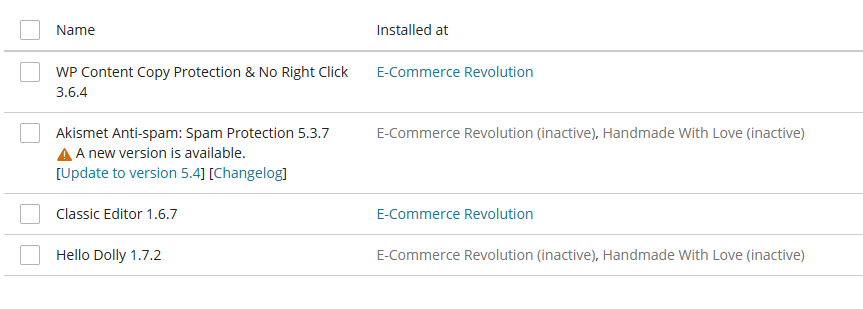

<!-- TOC -->
### Themes
- Trình quản lý giao diện theme của WP-Toolkit
- 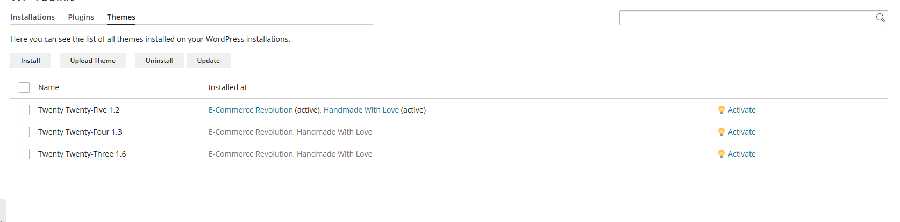

- Gồm các nút chức năng 
	- Install: Dùng cài đặt theme  
		- Click mở giao diện tìm kiếm plugin cần cài 
			- 
		- Tìm kiếm plugin cần cài và cài đặt 
			- Tích chọn và -> Select Website để chuyển tới phần cấu hình cài 
			- 
		- Chọn Website cài đặt, tuỳ chọn `Active after Installation` sẽ kích hoạt plugin ngay khi cài đặt xong 
			- 
		- Click install để cài đặt. Cài đặt hoàn tất
			- 
	- Upload Plugin: Tải lên file Theme. 
		- Click mở giao diện cấu hình 
		- 
		- Gồm các tuỳ chọn 
			- Select Theme: Nơi để tải lên file plugin (Zip)
			- WordPress Site: Chọn Website muốn cài 
			- Tích chọn `Activate after installation`: Kích hoạt ngay sau khi cài đặt xong plugin.
	- Uninstall: Gỡ cài đặt Theme đang chọn 
		- 
	- Update: Dùng cập nhật Theme đang chọn 
		- 
	
- Danh sách các Theme 
- 
	- Name: Tên Theme 
	- Installed at: Hiển thị danh sách các site mà Theme đã được cài. 
	- Nút chức năng `Activate` kích hoạt theme. 
		- 
		- 

<!-- TOC -->
## SEO
- SEO Toolkit – một tiện ích mở rộng trong Plesk giúp người dùng:
	- Phân tích thứ hạng website trên công cụ tìm kiếm.
	- Đánh giá mức độ tiếp cận trên mạng xã hội.
	- Nhận các đề xuất tối ưu hóa nội dung để tăng lượng truy cập và nhận diện thương hiệu.
- Tổng quan giao diện 
	- 
	- Các nút chức năng 
		- `SEO Toolkit Wizard` : Mở công cụ hướng dẫn từng bước sử dụng tiện ích.
		- `Plesk University` : Mở đường dẫn tới nơi cung cấp khóa học và tài liệu hướng dẫn chi tiết về SEO Toolkit.
	- Danh sách các tên miền đã được thêm vào để sử dụng SEO Toolkit:
		- 
		- Click chọn tên danh sách tên miền để mở giao diện cấu hình quản lý SEO Toolkit cụ thể 
		- 
		- 
		- Mỗi tên miền có các tùy chọn:
			- Site Audit: Trạng thái kiểm tra SEO tổng thể của website. 
			- Rank Tracker: 
				- Theo dõi thứ hạng từ khóa trên công cụ tìm kiếm.
				- Hiển thị số lượng từ khóa đã thêm, có thể thêm mới bằng nút `Add Keyword` 
			- Competitors
				- Phân tích đối thủ cạnh tranh.
				- Tính năng này chỉ khả dụng nếu nâng cấp lên bản trả phí.
			- Log File Analyzer
				- Phân tích file nhật ký truy cập web.
				- Hiển thị trạng thái có hoặc không có file log.

- Để hiểu chi tiết hơn ví dụ sử dụng `Wizard` để cấu hình 
	- Tại dashboard của SEO Toolkit chọn `SEO Toolkit Wizard`
		- 
	- Chọn tên miền cần cấu hình và Next 
		- 
	- Các điều kiện để có thể sử dụng SEO Toolkit với website 
		- 
		- Site Audit: Quét website để phát hiện các vấn đề SEO phổ biến (ví dụ: thẻ meta thiếu, liên kết hỏng, tốc độ tải chậm...).
		- Log File Analyzer: Phân tích hoạt động của các công cụ tìm kiếm (crawler) trên website thông qua file nhật ký truy cập (access logs).
		- Rank Tracker: Theo dõi thứ hạng của website với các từ khóa do bạn tự chọn. Bạn có thể thêm từ khóa ở bước tiếp theo để bắt đầu theo dõi.
	- Đảm bảo các điều kiện thoả mãn, click next để chuyển giao diện thêm từ khoá:
		- 
		- Gồm các trường cấu hình 
			- Add a keyword: Nhập từ khóa bạn muốn theo dõi.
			- Search engine: Chọn công cụ tìm kiếm – mặc định là Google toàn cầu.
			- Available keywords: Hiển thị số lượng từ khóa được cấp cấu hình.
			- Wildcard subdomain: Cho biết tên miền có sử dụng wildcard cho subdomain hay không.
			- Suggested keywords: Gợi ý từ khóa liên quan (nếu có).
		- Ví dụ: Với các keyword `thiết kế website chuyên nghiệp, dịch vụ hosting giá rẻ, đăng ký tên miền .vn, bảo mật website WordPress, tối ưu tốc độ website`	
		- 
	- Sau khi đã cấu hình xong các từ khoá click next để tới giao diện cấu hình thêm các website đối thủ 
		- 
		- Competitors: Gợi ý đối thủ cạnh tranh theo từ khóa (tính năng này có thể bị giới hạn nếu chưa nâng cấp bản quyền).
		- Có thêm các tên miền đối thủ cạnh tranh cần theo dõi tại đây.
	- Cấu hình khởi tạo hoàn tất
		- 
- Giao diện cấu hình quản lý SEO Toolkit cụ thể từng tên miền  	
	- Tại dashboard của SEO Toolkit phần danh sách tên miền click chọn tên miền muốn cấu hình 
		- 
	- Giao diện này cung cấp cái nhìn tổng thể về hiệu suất SEO của một website sau khi thực hiện quét kiểm tra (audit). Các phần chính bao gồm:
		- 	
		- Site Audit
			- 	
			- Điểm tổng thể: đánh giá chất lượng SEO tổng thể của website.
			- Phân tích theo nhóm:
				- Content: chất lượng nội dung (ví dụ: thẻ meta, tiêu đề, mô tả...).
				- SEO: các yếu tố kỹ thuật SEO như robots.txt, sitemap, thẻ canonical...
				- Technology: công nghệ sử dụng như tốc độ tải, bảo mật, responsive...
			- Thời gian quét gần nhất: thời gian gần nhất thực hiện quét
			- Số lượng vấn đề phát hiện:
			- Tổng cộng: 
				- Vấn đề nghiêm trọng (Critical)
				- Cảnh báo (Warnings)
				- Thông báo (Notices)
			- Click chọn `Open Details` để hiển thị thông tin chi tiết.
			- 	
		- Tasks
			- 
			- Hiển thị **tiến độ xử lý các nhiệm vụ** liên quan đến cải thiện SEO.
			- Click chọn `Open Tasks` để hiển thị thông tin chi tiết 
			- 
			- Có thanh tiến trình và danh sách các nhiệm vụ cụ thể (ví dụ: sửa lỗi, tối ưu nội dung...).
			- Các nút thao tác `Set Done`, `Skip`
		- Rank Tracking
			- 
			- Theo dõi **thứ hạng từ khóa** trên công cụ tìm kiếm.
			- Hiển thị từ khóa đang được theo dõi và vị trí hiện tại của chúng.
			- Các nút chức năng 
				- Add Keywords: Thêm từ khoá. Click mở giao diện thêm từ khoá mới. 
					- 
					- Keywords: Thêm các từ khóa bạn muốn theo dõi thứ hạng trên công cụ tìm kiếm.
					- Available keywords: Hiển thị số lượng từ khoá có thể thêm 
					- Wildcard subdomain: Cấu hình sử dụng wildcard cho subdomain.
					- Search engines: Chọn công cụ tìm kiếm để theo dõi thứ hạng từ khóa. Có thể thêm công cụ tìm kiếm khác bằng nút Add search engine.
					- Competitors: Thêm tên miền của đối thủ để so sánh thứ hạng từ khóa.
						→ Tính năng này bị khóa, chỉ khả dụng nếu nâng cấp bản quyền.
					- Suggested keywords: Các từ khoá được đề xuất 
					- Suggested Competitors: Các đối thủ được đề xuất 
				- Show all keywords: Mở giao diện thông tin chi tiết tất cả các từ khoá hiện có.
					- 
					- Phần bộ lọc cho phép lọc dữ liệu từ khóa theo tên miền, công cụ tìm kiếm, thay đổi vị trí, khoảng vị trí, từ khóa và URL. Có thể áp dụng hoặc đặt lại bộ lọc.
					- Phần xu hướng từ khóa hiển thị biểu đồ theo dõi sự thay đổi thứ hạng từ khóa theo thời gian.
					- Phần danh sách từ khóa liệt kê các từ khóa đang được theo dõi, kèm theo vị trí hiện tại trên công cụ tìm kiếm, URL đang xếp hạng và công cụ tìm kiếm tương ứng.
		- **Log File Analyzer**
			- Hiện tại **chưa có file log nào được phân tích**.
			- Đây là công cụ dùng để kiểm tra hoạt động của các crawler (bot tìm kiếm) trên website.

<!-- TOC -->
## Laravel
- Công cụ hỗ trợ triển khai và quản lý các ứng dụng web phổ biến.  
- Giao diện tổng quan 
- 
- Các nút chức năng 
	- Install Application: Cài đặt ứng dụng mới
		- 
		- Chọn Domain cần triển khai, chọn source code triển khai ở đây demo mẫu chọn cài Laravel skeleton. 
		- 
		- Triển khai thành công 
		- 
		- 
	- Scan: Click để plesk tự động dò quét trong bộ nhớ website triển khai lavarel để quản trị.
		- 	
- Danh sách các domain triển khai lavarel 
	- 	
	- Click chọn tên domain để vào giao diện quản trị chi tiết. 
- Giao diện quản trị chi tiết 
	- Giao diện này giúp theo dõi thông tin ứng dụng, chỉnh sửa biến môi trường, và quản lý các chức năng như tác vụ định kỳ, hàng đợi và chế độ bảo trì.
	- Tổng quan 
	- 	
	- Các nút chức năng	
		- Manage Domain: Click chuyển tới giao diện quản trị tên miền 
		- Logs: Mở giao diện quản bản ghi của website 
	- Các tab quản lý 
		- Dashboard
			- 	
			- Application Info - Thông tin ứng dụng 
				- URL: Địa chỉ truy cập chính của ứng dụng Laravel.
				- Repository: Thông tin cụ thể về kho mã nguồn triển khai.
				- Last Commit: Thông tin về lần cập nhật gần nhất. 
			- Settings - Các cài đặt 
				- Environment variables (.env): Có thể chỉnh sửa các biến môi trường của ứng dụng Laravel thông qua nút chức năng.
				- 	
				- Scheduled Tasks: Dùng để kích hoạt hoặc vô hiệu hóa các tác vụ định kỳ được Laravel xử lý qua cron.
				- Queue: Dùng để bật hoặc tắt hệ thống xử lý hàng đợi của Laravel, thường dùng cho các tác vụ nền.
				- Maintenance mode: Cấu hình bật/tắt chế độ bảo trì. 
		- Aristan, Composer, Node.js: Các trình quản lý lệnh chạy, hỗ trợ  thao tác trực tiếp với ứng dụng Laravel thông qua giao diện lệnh. 
		- Development: Quản lý quá trình triển khai ứng dụng.
			- 	
			- Deployment Mode: Automatic/Manual. Kiểu triển khai ứng dụng 
			- Deployment Script: Cấu hình script triển khai 
			- Deployment Steps: Cấu hình các bước triển khai  
			- Nút chức năng `Deploy` để bắt đầu triển khai 
		- Scheduled Task: Thiết lập các tác vụ định kỳ (cron jobs) như gửi email, cập nhật dữ liệu, hoặc chạy các lệnh Artisan theo lịch.
			- 	
		- Queue: Cấu hình quản lý hệ thống hàng đợi của Laravel.
			- 	
			- Stop Worker When Empty: Cho phép worker (trình xử lý hàng đợi) tự động dừng lại sau khi đã xử lý hết tất cả công việc hiện có. Hữu ích trong các môi trường không cần chạy liên tục.
			- Timeout: Thiết lập thời gian tối đa (tính bằng giây) mà một công việc được phép chạy. Nếu vượt quá thời gian này, công việc sẽ bị dừng.
			- Max Jobs: Giới hạn số lượng công việc mà worker sẽ xử lý trước khi tự động thoát.
			- Max Time: Giới hạn tổng thời gian (tính bằng giây) mà worker được phép hoạt động trước khi dừng.
			- Nút chức năng: Show failed jobs
				- Hiển thị danh sách các công việc đã bị lỗi trong quá trình xử lý, giúp kiểm tra và khắc phục sự cố.
