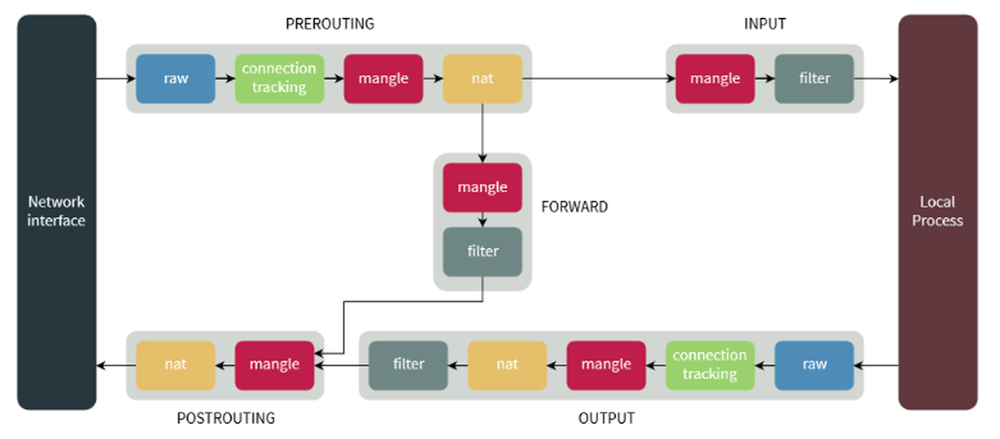
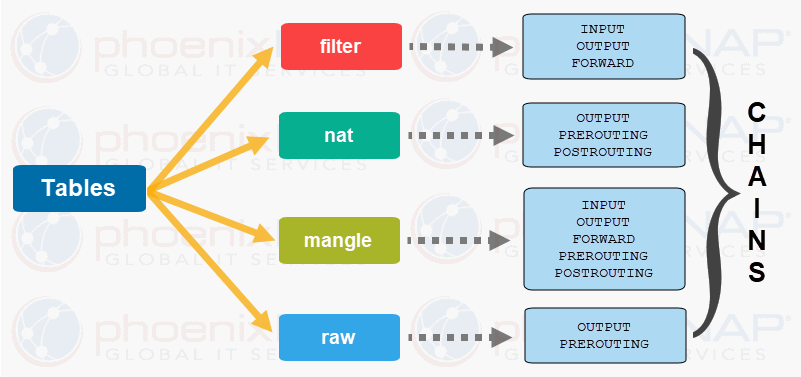

# Firewall
## 1. Firewall trên Linux
### 1.1. Tổng quan
- Chức năng tường lửa Linux được cung cấp bởi Netfilter. Netfilter là một mô-đun kernel có trong tất cả các bản phân phối Linux.
- Một số loại cơ bản: iptables, firewalld, ufw, csf, apf …
### 1.2. Yêu cầu cơ bản: 
- Giao thức: Quản trị tường lửa đề cập đến giao thức mạng (như TCP hoặc UDP) được sử dụng để giao tiếp. Tường lửa sử dụng thông tin giao thức này để xác định lưu lượng nào được phép hoặc chặn. Các quy tắc tường lửa thường được xác định dựa trên giao thức, cổng và địa chỉ IP.
	- Các giao thức phổ biến:
		- TCP: Truyền dữ liệu ổn định (HTTP, HTTPS, SSH).
		- UDP: Truyền nhanh, không đảm bảo (DNS, VoIP).
	- Cổng (Port) phổ biến: HTTP: 80, HTTPS: 443, SSH: 22, FTP: 21, MySQL: 3306…
- Quyền quản trị: Cần quyền root để thực hiện cài đặt, cấu hình tường lửa.
- OS tương ứng: Các bản distro của Linux, mỗi bản đều sẽ có các công cụ mặc định 
	- Debian/Ubuntu: ufw, iptables 
	- CentOS/Fedora: firewalld, iptables
- Kiến thức: 
#### 1.2.1 iptables
- là một ứng dụng dùng để quản lý filtering gói tin và NAT rules hoạt động trên console của linux rất nhỏ và tiện dụng. Được cung cấp miễn phí nhằm nâng cao tính bảo mật trên hệ thống Linux.
- iptables bao gồm 2 phần là netfilter nằm bên trong nhân Linux và iptables nằm ở vùng ngoài nhân. iptables chịu trách nhiệm giao tiếp với người dùng và sau đó đẩy rules của người dùng vào cho netfilter xử lý. netfilter thực hiện công việc lọc các gói tin ở mức IP. netfilter làm việc trực tiếp ở trong nhân của Linux nhanh và không làm giảm tốc độ của hệ thống
- Về cơ bản, IPtables chỉ là giao diện dòng lệnh để tương tác với packet filtering của netfilter framework.
- iptables cung cấp các tính năng sau:
    * Có khả năng phân tích gói tin hiệu quả.
    * Filtering gói tin dựa vào MAC và một số cờ hiệu (flags) trong TCP Header.
    * Cung cấp kỹ thuật NAT, chi tiết cho các tùy chọn để ghi nhận sự kiện hệ thống.
    * Có khả năng ngăn chặn một số cơ chế tấn công theo kiểu DoS.
    * Xây dựng một hệ thống tường lửa (firewall).
    * Cung cấp, xây dựng và quản lý các rule để xử lý các gói tin.
- Cơ chế packet filtering của IPtables hoạt động gồm 3 thành phần là Tables, Chains và Targets. Cụ thể hoạt động tương quan 3 thành phần như sau:
	- Table là một xử lý các gói tin theo những cách cụ thể. Nếu không chỉ định cụ thể thì mặc định là chúng ta sẽ làm việc với filter table, ngoài ra còn có các bảng khác.
	- Mỗi bảng sẽ được gắn thêm các chain. Việc gắn thêm chain vào table cho phép xử lý gói tin ở những giai đoạn khác nhau, ví dụ có thể xử lý gói tin ngay khi gói tin vừa đến interface hay xử lý các gói tin trước khi các gói này được đẩy ra interface.
	- Có thể tạo ra rule rất cụ thể, ví dụ gói tin đó đến từ port nào, đến từ IP nào sau đó chỉ định hành động (TARGET) sẽ áp dụng với gói tin này.
- Một vài khái niệm cần biết khi tìm hiểu iptables:
	- NAT  (Network address translation) : Mỗi một kết nối trước khi được xử lý đều có địa chỉ nguồn (source ip address) và địa chỉ đích (destination ip address) được chứa trong thông tin của các gói tin. NAT trong netfilter đơn giản là việc thực hiện thay đổi địa chỉ đích và port theo một cách mong muốn.
	- filtering: là quá trình chặn bắt gói tin theo một số tiêu chí đã đề ra 
	- mangle: Là quá trình bóc tách gói tin và chịu trách nhiệm thay đổi bits của QoS (Quality of Services) trong IP Header bởi vì mangle làm việc với các gói tin IP.
	- chain: là một quy tắc xử lý các gói tin bao gồm nhiều rules có liên quan tới nhau. Mỗi table sẽ được tạo với một hoặc nhiều chain. chain cho phép lọc gói tin tại các điểm khác nhau. iptable có thể được thiết lập đối với các loại chain như sau:
		- PREROUTING: Các rule thuộc chain này sẽ được áp dụng ngay sau khi gói tin vừa đi vào đến dải mạng (Network Interface). chain này chỉ có thể có ở table NAT, RAW và MANGLE.
		- INPUT: Các rule thuộc chain này sẽ áp dụng cho các gói tin ngay trước khi gói tin đi vào hệ thống. chain này có trong table MANGLE và FILTER.
		- OUTPUT: Các rule thuộc chain này áp dụng ngay cho các gói tin đi ra từ hệ thống. chain có trong table MANGLE, RAW và FILTER.
		- FORWARD: Các rule thuộc chain này áp dụng các gói tin được chuyển tiếp qua hệ thống. chain có trong table MANGLE.
		- POSTROUTING: Các rule thuộc chain này áp dụng cho các gói tin tới dải mạng (Network Interface). chain này có trong table MANGLE và NAT.
	- 
	- rule: là là một luật, hành động cụ thể xử lý gói tin ứng với mỗi trường hợp, tiêu chí được đề ra.
	- port: là một vị trí nào đó mà gói tin TCP/UDP vào và ra trong thiết bị. Một địa chỉ IP có rất nhiều port. Ví dụ: http port 80, dns port 53, ...
	- target: mỗi một chain là một danh sách các luật có thể được thiết lập cho các gói tin. Mỗi một luật sẽ cần phải khai báo những gì cần phải làm với gói tin được gọi là target.
		- Các hành động áp dụng cho các gói tin được gọi là target. Đối với những gói tin đúng theo rule mà chúng ta đặt ra thì các hành động (target) có thể thực hiện được đó là:
			* ACCEPT: chấp nhận gói tin, cho phép gói tin đi qua hay đi vào hệ thống.
			* DROP: loại bỏ gói tin, không phản hồi lại gói tin giống như việc gói tin đó được gửi đến một hệ thống không tồn tại.
			* RETURN: Dừng thực thi xử áp dụng rules tiếp theo trong chain hiện tại đối với gói tin. Việc kiểm soát sẽ được trả về đối với chain đang gọi.
			* REJECT: Thực hiện loại bỏ gói tin và gửi lại gói tin phản hồi thông báo lỗi. Ví dụ: 1 bản tin “connection reset” đối với gói TCP hoặc bản tin “destination host unreachable” đối với gói UDP và ICMP.
			* LOG: Chấp nhận gói tin và có ghi lại log.
- Cấu trúc iptables :
	- 
	- NAT Table: Cho phép route các gói tin đến các host khác nhau trong mạng bằng cách thay đổi IP nguồn và IP đích của gói tin. Table này quy định và cho phép các kết nối có thể truy cập tới các dịch vụ không được truy cập trực tiếp. Bao gồm 3 thành phần:
		- PREROUTING chain – Thay đổi gói tin trước khi định tuyến, điều này có nghĩa là việc dịch gói tin sẽ xảy ra ngay lập tức sau khi gói tin đến hệ thống. Điều này thực hiện thay đổi địa chỉ IP đích thành một địa chỉ nào đó sao cho phù hợp với việc định tuyến trên máy chủ cục bộ - DNAT.
		- POSTROUTING chain – Thay đổi gói tin sau khi định tuyến, điều này có nghĩa là dịch gói tin khi gói tin ra khỏi hệ thống. Điều này thực hiện thay đổi địa chỉ IP nguồn của gói tin thành một địa chỉ nào đó phù hợp với việc định tuyến trên máy chủ đích - SNAT.
		- OUTPUT chain – thực hiện NAT cho các gói tin được thực hiện cục bộ trên firewall.
	- FILTER Table: Đây là table được sử dụng mặc định bởi iptables khi bạn tạo các chain mà không khai báo cho chain` đó thuộc vào table nào. Table hoạt động với việc quy định việc quyết định có cho phép gói tin được chuyển đến địa chỉ đích hay không. Bao gồm 3 thành phần:
		- INPUT chain: Các gói tin đến firewall. Áp dụng đối với các gói tin đến máy chủ cục bộ.
		- OUTPUT chain: Các gói tin đi ra khỏi firewall. Áp dụng với các gói tin được tạo ra cục bộ và đi ra khỏi máy chủ.
		- FORWARD chain: Áp dụng đối với các gói tin được định tuyến đi qua máy chủ.
	- MANGLE Table: Table này liên quan đến việc sửa header của gói tin, ví dụ chỉnh sửa giá trị các trường TTL, MTU, Type of Service. Bao gồm các thành phần sau:
		- PREROUTING chain
		- OUTPUT chain
		- FORWARD chain
		- INPUT chain
		- POSTROUTING chain
	- RAW Table: Bảng này được sử dụng chủ yếu dành cho việc cấu hình sử dụng chain có sẵn. Bao gồm:
		- PREROUTING chain
		- OUTPUT chain
	- Security Table: Đây là bảng được sử dụng cho Mandatory Access Control (MAC) - kiểm soát truy cập bắt buộc đối với các rule về network. MAC được triển khai bởi Linux Security Modules được biết đến như là SELinux. Gói tin được chuyển đến table này sau khi đi qua FILTER table và cho phép một vài Discretionary Access Control (DAC) - kiểm soát truy cập tùy ý trong FILTER table gây ảnh hưởng trước các MAC rule. Table này cung cấp các chain có sẵn là:
		- INPUT chain.
		- OUTPUT chain.
		- FORWARD chain.
- Lệnh làm việc với iptables 

### 1.3. Tìm hiểu: Cấu hình, sử dụng
### 1.4. Thực hành

## 2. Firewall trên Windows
### 2.1. Tổng quan
-  Windows Defender Firewall
### 2.2. Yêu cầu cơ bản: 
giao thức, quyền quản trị, OS tương ứng, kiến thức dòng lệnh
### 2.3. Tìm hiểu: Cấu hình, sử dụng
-        Cấu hình qua GUI
-        Cấu hình qua Powershell

## 3. So sánh

## References 