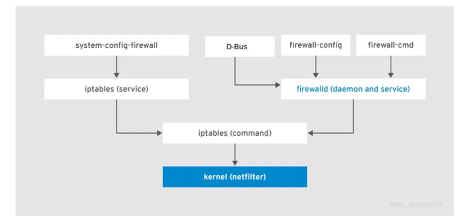
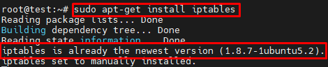

# Firewall
## 1. Firewall trên Linux
### 1.1. Tổng quan
- Chức năng tường lửa Linux được cung cấp bởi Netfilter. Netfilter là một mô-đun kernel có trong tất cả các bản phân phối Linux.
- Một số loại cơ bản: iptables, firewalld, ufw, csf, apf …
### 1.2. Yêu cầu cơ bản: 
- Giao thức: Quản trị tường lửa đề cập đến giao thức mạng (như TCP hoặc UDP) được sử dụng để giao tiếp. Tường lửa sử dụng thông tin giao thức này để xác định lưu lượng nào được phép hoặc chặn. Các quy tắc tường lửa thường được xác định dựa trên giao thức, cổng và địa chỉ IP.
	- Các giao thức phổ biến:
		- TCP: Truyền dữ liệu ổn định (HTTP, HTTPS, SSH).
		- UDP: Truyền nhanh, không đảm bảo (DNS, VoIP).
	- Cổng (Port) phổ biến: HTTP: 80, HTTPS: 443, SSH: 22, FTP: 21, MySQL: 3306…
- Quyền quản trị: Cần quyền root để thực hiện cài đặt, cấu hình tường lửa.
- OS tương ứng: Các bản distro của Linux, mỗi bản đều sẽ có các công cụ mặc định 
	- Debian/Ubuntu: ufw, iptables 
	- CentOS/Fedora: firewalld, iptables
- Kiến thức tìm hiểu về các loại firewall:
#### 1.2.1 iptables
- là một ứng dụng dùng để quản lý filtering gói tin và NAT rules hoạt động trên console của linux rất nhỏ và tiện dụng. Được cung cấp miễn phí nhằm nâng cao tính bảo mật trên hệ thống Linux.
- iptables bao gồm 2 phần là netfilter nằm bên trong nhân Linux và iptables nằm ở vùng ngoài nhân. iptables chịu trách nhiệm giao tiếp với người dùng và sau đó đẩy rules của người dùng vào cho netfilter xử lý. netfilter thực hiện công việc lọc các gói tin ở mức IP. netfilter làm việc trực tiếp ở trong nhân của Linux nhanh và không làm giảm tốc độ của hệ thống
- Về cơ bản, IPtables chỉ là giao diện dòng lệnh để tương tác với packet filtering của netfilter framework.
- iptables cung cấp các tính năng sau:
    * Có khả năng phân tích gói tin hiệu quả.
    * Filtering gói tin dựa vào MAC và một số cờ hiệu (flags) trong TCP Header.
    * Cung cấp kỹ thuật NAT, chi tiết cho các tùy chọn để ghi nhận sự kiện hệ thống.
    * Có khả năng ngăn chặn một số cơ chế tấn công theo kiểu DoS.
    * Xây dựng một hệ thống tường lửa (firewall).
    * Cung cấp, xây dựng và quản lý các rule để xử lý các gói tin.
- Cơ chế packet filtering của IPtables hoạt động gồm 3 thành phần là Tables, Chains và Targets. Cụ thể hoạt động tương quan 3 thành phần như sau:
	- Table là một xử lý các gói tin theo những cách cụ thể. Nếu không chỉ định cụ thể thì mặc định là chúng ta sẽ làm việc với filter table, ngoài ra còn có các bảng khác.
	- Mỗi bảng sẽ được gắn thêm các chain. Việc gắn thêm chain vào table cho phép xử lý gói tin ở những giai đoạn khác nhau, ví dụ có thể xử lý gói tin ngay khi gói tin vừa đến interface hay xử lý các gói tin trước khi các gói này được đẩy ra interface.
	- Có thể tạo ra rule rất cụ thể, ví dụ gói tin đó đến từ port nào, đến từ IP nào sau đó chỉ định hành động (TARGET) sẽ áp dụng với gói tin này.
- Một vài khái niệm cần biết khi tìm hiểu iptables:
	- NAT  (Network address translation) : Mỗi một kết nối trước khi được xử lý đều có địa chỉ nguồn (source ip address) và địa chỉ đích (destination ip address) được chứa trong thông tin của các gói tin. NAT trong netfilter đơn giản là việc thực hiện thay đổi địa chỉ đích và port theo một cách mong muốn.
	- filtering: là quá trình chặn bắt gói tin theo một số tiêu chí đã đề ra 
	- mangle: Là quá trình bóc tách gói tin và chịu trách nhiệm thay đổi bits của QoS (Quality of Services) trong IP Header bởi vì mangle làm việc với các gói tin IP.
	- chain: là một quy tắc xử lý các gói tin bao gồm nhiều rules có liên quan tới nhau. Mỗi table sẽ được tạo với một hoặc nhiều chain. chain cho phép lọc gói tin tại các điểm khác nhau. iptable có thể được thiết lập đối với các loại chain như sau:
		- PREROUTING: Các rule thuộc chain này sẽ được áp dụng ngay sau khi gói tin vừa đi vào đến dải mạng (Network Interface). chain này chỉ có thể có ở table NAT, RAW và MANGLE.
		- INPUT: Các rule thuộc chain này sẽ áp dụng cho các gói tin ngay trước khi gói tin đi vào hệ thống. chain này có trong table MANGLE và FILTER.
		- OUTPUT: Các rule thuộc chain này áp dụng ngay cho các gói tin đi ra từ hệ thống. chain có trong table MANGLE, RAW và FILTER.
		- FORWARD: Các rule thuộc chain này áp dụng các gói tin được chuyển tiếp qua hệ thống. chain có trong table MANGLE.
		- POSTROUTING: Các rule thuộc chain này áp dụng cho các gói tin tới dải mạng (Network Interface). chain này có trong table MANGLE và NAT.
	- 
	- rule: là là một luật, hành động cụ thể xử lý gói tin ứng với mỗi trường hợp, tiêu chí được đề ra.
	- port: là một vị trí nào đó mà gói tin TCP/UDP vào và ra trong thiết bị. Một địa chỉ IP có rất nhiều port. Ví dụ: http port 80, dns port 53, ...
	- target: mỗi một chain là một danh sách các luật có thể được thiết lập cho các gói tin. Mỗi một luật sẽ cần phải khai báo những gì cần phải làm với gói tin được gọi là target.
		- Các hành động áp dụng cho các gói tin được gọi là target. Đối với những gói tin đúng theo rule mà chúng ta đặt ra thì các hành động (target) có thể thực hiện được đó là:
			* ACCEPT: chấp nhận gói tin, cho phép gói tin đi qua hay đi vào hệ thống.
			* DROP: loại bỏ gói tin, không phản hồi lại gói tin giống như việc gói tin đó được gửi đến một hệ thống không tồn tại.
			* RETURN: Dừng thực thi xử áp dụng rules tiếp theo trong chain hiện tại đối với gói tin. Việc kiểm soát sẽ được trả về đối với chain đang gọi.
			* REJECT: Thực hiện loại bỏ gói tin và gửi lại gói tin phản hồi thông báo lỗi. 
			* LOG: Chấp nhận gói tin và có ghi lại log.
- Cấu trúc iptables :
	- 
	- FILTER Table: Đây là table được sử dụng mặc định bởi iptables khi bạn tạo các chain mà không khai báo cho chain` đó thuộc vào table nào. Table hoạt động với việc quy định việc quyết định có cho phép gói tin được chuyển đến địa chỉ đích hay không. Bao gồm 3 thành phần:
		- INPUT chain: Các gói tin đến firewall. Áp dụng đối với các gói tin đến máy chủ cục bộ.
		- OUTPUT chain: Các gói tin đi ra khỏi firewall. Áp dụng với các gói tin được tạo ra cục bộ và đi ra khỏi máy chủ.
		- FORWARD chain: Áp dụng đối với các gói tin được định tuyến đi qua máy chủ.
	- NAT Table: Cho phép route các gói tin đến các host khác nhau trong mạng bằng cách thay đổi IP nguồn và IP đích của gói tin. Table này quy định và cho phép các kết nối có thể truy cập tới các dịch vụ không được truy cập trực tiếp. Bao gồm 3 thành phần:
		- PREROUTING chain – Thay đổi gói tin trước khi định tuyến, điều này có nghĩa là việc dịch gói tin sẽ xảy ra ngay lập tức sau khi gói tin đến hệ thống. Điều này thực hiện thay đổi địa chỉ IP đích thành một địa chỉ nào đó sao cho phù hợp với việc định tuyến trên máy chủ cục bộ - DNAT.
		- POSTROUTING chain – Thay đổi gói tin sau khi định tuyến, điều này có nghĩa là dịch gói tin khi gói tin ra khỏi hệ thống. Điều này thực hiện thay đổi địa chỉ IP nguồn của gói tin thành một địa chỉ nào đó phù hợp với việc định tuyến trên máy chủ đích - SNAT.
		- OUTPUT chain – thực hiện NAT cho các gói tin được thực hiện cục bộ trên firewall.
	- MANGLE Table: Table này liên quan đến việc sửa header của gói tin, ví dụ chỉnh sửa giá trị các trường TTL, MTU, Type of Service. Bao gồm các thành phần sau:
		- PREROUTING chain
		- OUTPUT chain
		- FORWARD chain
		- INPUT chain
		- POSTROUTING chain
	- RAW Table: Bảng này được sử dụng chủ yếu dành cho việc cấu hình sử dụng chain có sẵn. Bao gồm:
		- PREROUTING chain
		- OUTPUT chain
	- Security Table: Đây là bảng được sử dụng cho Mandatory Access Control (MAC) - kiểm soát truy cập bắt buộc đối với các rule về network. MAC được triển khai bởi Linux Security Modules được biết đến như là SELinux. Gói tin được chuyển đến table này sau khi đi qua FILTER table và cho phép một vài Discretionary Access Control (DAC) - kiểm soát truy cập tùy ý trong FILTER table gây ảnh hưởng trước các MAC rule. Table này cung cấp các chain có sẵn là:
		- INPUT chain.
		- OUTPUT chain.
		- FORWARD chain.
#### 1.2.2 firewalld
- firewallD là giải pháp tường lửa mạnh mẽ, toàn diện được cài đặt mặc định trên RHEL 7 và CentOS 7.
- FirewallD sử dụng các zone và dịch vụ (service) thay vì chuỗi (chains)  và quy tắc (rules) như iptables 
- FirewallD quản lý các quy tắc được thiết lập tự động, có tác dụng ngay lập tức mà không làm mất đi các kết nối và session hiện có.
- Một vài khái niệm cần biết khi tìm hiểu firewalld:
	- Zone: zone là một nhóm các quy tắc nhằm chỉ ra những luồng dữ liệu được cho phép, dựa trên mức độ tin tưởng của điểm xuất phát luồng dữ liệu đó trong hệ thống mạng. Theo mặc định, firewalld được cài đặt với một loạt các zones được cấu hình sẵn. Một vùng là một tập hợp các quy tắc được cấu hình sẵn có thể được áp dụng cho hệ thống bất kỳ lúc nào để nhanh chóng triển khai các cấu hình tường lửa cho các tình huống cụ thể.
		- Các zone được xác định trước theo mức độ tin cậy, theo thứ tự từ “ít-tin-cậy-nhất” đến “đáng-tin-cậy-nhất”:
			* drop: ít tin cậy nhất – toàn bộ các kết nối đến sẽ bị từ chối mà không phản hồi, chỉ cho phép duy nhất kết nối đi ra.
			* block: tương tự như drop nhưng các kết nối đến bị từ chối và phản hồi bằng tin nhắn từ icmp-host-prohibited (hoặc icmp6-adm-prohibited).
			* public: đại diện cho mạng công cộng, không đáng tin cậy. Các máy tính/services khác không được tin tưởng trong hệ thống nhưng vẫn cho phép các kết nối đến trên cơ sở chọn từng trường hợp cụ thể.
			* external: hệ thống mạng bên ngoài trong trường hợp bạn sử dụng tường lửa làm gateway, được cấu hình giả lập NAT để giữ bảo mật mạng nội bộ mà vẫn có thể truy cập.
			* internal: đối lập với external zone, sử dụng cho phần nội bộ của gateway. Các máy tính/services thuộc zone này thì khá đáng tin cậy.
			* dmz: sử dụng cho các máy tính/service trong khu vực DMZ(Demilitarized) – cách ly không cho phép truy cập vào phần còn lại của hệ thống mạng, chỉ cho phép một số kết nối đến nhất định.
			* work: sử dụng trong công việc, tin tưởng hầu hết các máy tính và một vài services được cho phép hoạt động.
			* home: môi trường gia đình – tin tưởng hầu hết các máy tính khác và thêm một vài services được cho phép hoạt động.
			* trusted: đáng tin cậy nhất – tin tưởng toàn bộ thiết bị trong hệ thống.
	- Quy tắc Runtime/Permanent: các quy tắc được cấu hình thời gian hiệu lực Runtime hoặc Permanent
		- Runtime(mặc định): có tác dụng ngay lập tức, mất hiệu lực khi reboot hệ thống.
		- Permanent: không áp dụng cho hệ thống đang chạy, cần reload mới có hiệu lực, tác dụng vĩnh viễn cả khi reboot hệ thống.
		- Việc Restart/Reload sẽ hủy bộ các thiết lập Runtime đồng thời áp dụng thiết lập Permanent mà không hề phá vỡ các kết nối và session hiện tại. Điều này giúp kiểm tra hoạt động của các quy tắc trên tường lửa và dễ dàng khởi động lại nếu có vấn đề xảy ra.
- 

#### 1.2.3 ufw 
- UFW (uncomplicated firewall) là một công cụ cấu hình tường lửa chạy trên iptables, được bao gồm theo mặc định trong các bản phân phối Ubuntu. Nó cung cấp một giao diện hợp lý để cấu hình các trường hợp sử dụng tường lửa phổ biến thông qua dòng lệnh.
- UFW được phát triển nhằm cung cấp một giao diện thân thiện hơn cho iptables – một công cụ quản lý tường lửa phức tạp. Với UFW, ngay cả những người dùng không chuyên về bảo mật cũng có thể dễ dàng thiết lập và quản lý các quy tắc tường lửa chỉ với một vài lệnh đơn giản.
- UFW giúp: 
	* Kiểm soát lưu lượng mạng dễ dàng – UFW giúp quản trị viên thiết lập các quy tắc cho phép hoặc chặn kết nối chỉ với vài lệnh đơn giản.
	* Bảo vệ các cổng quan trọng – Ngăn chặn truy cập trái phép vào các dịch vụ quan trọng như SSH, HTTP, MySQL, giảm nguy cơ tấn công.
	* Ngăn chặn tấn công DDoS cơ bản – Hạn chế số lượng kết nối từ một IP để giảm nguy cơ quá tải hệ thống.
	* Giao diện đơn giản, dễ sử dụng – So với iptables, UFW giúp ngay cả những người không chuyên về bảo mật cũng có thể thiết lập tường lửa hiệu quả.
	* Tăng cường bảo mật cho hệ thống – Khi kết hợp với các công cụ bảo mật khác như Fail2Ban, UFW giúp bảo vệ server trước các cuộc tấn công phổ biến.
#### 1.2.4 csf 
- CSF (ConfigServer Security & Firewall) là tường lửa miễn phí và nâng cao dành cho hầu hết các bản phân phối Linux và VPS chạy trên nền tảng Linux. 
- Ngoài chức năng cơ bản của tường lửa – lọc gói tin – CSF còn bao gồm các tính năng bảo mật khác, chẳng hạn như phát hiện đăng nhập/xâm nhập/flood. 
- CSF bao gồm tích hợp giao diện người dùng cho cPanel, DirectAdmin và Webmin, nhưng hướng dẫn này chỉ đề cập đến cách sử dụng dòng lệnh. 
- CSF có thể nhận dạng nhiều cuộc tấn công, chẳng hạn như quét cổng, lũ lụt SYN và tấn công brute force đăng nhập vào nhiều dịch vụ. Nó được cấu hình để tạm thời chặn các máy khách bị phát hiện đang tấn công máy chủ đám mây.
- Tường lửa của Config Server cung cấp nhiều biện pháp bảo vệ cho VPS.
	* Xác thực lỗi đăng nhập: CSF sẽ thực hiện kiểm tra nhật ký để xem xét những trường hợp đăng nhập thất bại.. Có thể cấu hình các hành động mong muốn mà CSF thực hiện và sau bao nhiêu lần cố gắng trong tệp cấu hình.
		- Tính năng này hỗ trợ các ứng dụng 
			* Courier imap, Dovecot, uw-imap, Kerio
			* openSSH
			* cPanel, WHM, Webmail (cPanel servers only)
			* Pure-ftpd, vsftpd, Proftpd
			* Password protected web pages (htpasswd)
			* Mod_security failures (v1 and v2)
			* Suhosin failures
			* Exim SMTP AUTH
		- Theo dõi tiến trình : CSF có thể được cấu hình để theo dõi các tiến trình nhằm phát hiện các tiến trình đáng ngờ hoặc các cổng mạng mở và gửi email cho quản trị viên hệ thống nếu phát hiện thấy bất kỳ tiến trình nào.
		- Theo dõi thư mục: Theo dõi thư mục sẽ theo dõi /temp và các thư mục liên quan khác để tìm các tập lệnh độc hại và gửi email đến quản trị viên hệ thống khi phát hiện ra một tập lệnh.
		- Bảo vệ chống Port flood: Cài đặt này cung cấp khả năng bảo vệ chống lại các cuộc tấn công Port flood, chẳng hạn như các cuộc tấn công từ chối dịch vụ (DoS). 
		- Port knocking: Port knocking cho phép máy khách thiết lập kết nối với máy chủ mà không cần mở cổng. Máy chủ cho phép máy khách kết nối với các cổng chính chỉ sau chuỗi port knock thành công. 
		- Bảo vệ giới hạn kết nối: Tính năng này có thể được sử dụng để giới hạn số lượng kết nối đồng thời đang hoạt động từ một địa chỉ IP đến mỗi cổng. Khi được cấu hình đúng, tính năng này có thể ngăn chặn các hành vi lạm dụng trên máy chủ, chẳng hạn như các cuộc tấn công DoS.
		- Chuyển hướng địa chỉ cổng/IP: CSF có thể được cấu hình để chuyển hướng kết nối đến một IP/cổng sang một IP/cổng khác. Lưu ý: Sau khi chuyển hướng, địa chỉ nguồn của máy khách sẽ là địa chỉ IP của máy chủ. Đây không phải là tương đương với dịch địa chỉ mạng (NAT).
		- Danh sách chặn IP: Tính năng này cho phép CSF tự động tải xuống danh sách các địa chỉ IP bị chặn từ các nguồn xác định.
		- Tích hợp giao diện người dùng: Ngoài giao diện dòng lệnh, CSF còn cung cấp tích hợp giao diện người dùng cho cPanel và Webmin. 

#### 1.2.5 apf 
- Advanced Policy Firewall (APF) là hệ thống tường lửa dựa trên iptables(netfilter) được thiết kế xung quanh các nhu cầu thiết yếu của các máy chủ triển khai Internet ngày nay và các nhu cầu riêng biệt của các cài đặt Linux được triển khai tùy chỉnh. 
- Cấu hình của APF được thiết kế để cung cấp nhiều thông tin và cung cấp cho người dùng một quy trình dễ thực hiện, từ đầu đến cuối của tệp cấu hình. 
- Việc quản lý APF hàng ngày được thực hiện từ dòng lệnh với lệnh 'apf', bao gồm thông tin sử dụng chi tiết và tất cả các tính năng khả dụng.
- Mặt kỹ thuật của APF là nó bao gồm các tính năng ổn định mới nhất được đưa ra bởi dự án iptables(netfilter) để cung cấp một tường lửa rất mạnh mẽ và mạnh mẽ. Bộ lọc được thực hiện bởi APF có ba phần:
	- Static rule based policies: Chính sách dựa trên quy tắc tĩnh là phương pháp truyền thống nhất của tường lửa, khi tường lửa có một bộ hướng dẫn không thay đổi (quy tắc) về cách xử lý lưu lượng truy cập trong các điều kiện nhất định. 
	- Connection based stateful policies: Chính sách dựa trên trạng thái kết nối là phương tiện để phân biệt các gói tin hợp lệ cho các loại kết nối khác nhau. Chỉ các gói tin khớp với một kết nối đã biết mới được tường lửa cho phép; các gói tin khác sẽ bị từ chối.
	- Sanity based policies : là khả năng của tường lửa để khớp nhiều mẫu lưu lượng truy cập khác nhau với các phương pháp tấn công đã biết hoặc kiểm tra lưu lượng truy cập để tuân thủ các tiêu chuẩn Internet.
- Ba phương pháp lọc chính trên được APF sử dụng chỉ đơn giản là khái quát về cách tường lửa được xây dựng ở cấp độ thiết kế kỹ thuật, còn rất nhiều tính năng khác trong APF có thể được sử dụng.
- APF Firewall là một tường lửa có khả năng chặn khá tốt (ở mức cơ bản) những kết nối không mong muốn.
### 1.3. Tìm hiểu: Cấu hình, sử dụng

#### 1.3.1 iptables 
- iptables được cài đặt theo mặc định trên hầu hết các hệ thống Linux. Có thể kiểm tra xác nhận bằng lệnh cài đặt
```
sudo apt-get install iptables
```
- 
- Sau khi cài đặt xong, thư mục iptables sẽ chứa hai tệp cho các quy tắc IPV4 và IPV6:
	* `/etc/iptables/rules.v4`
	* `/etc/iptables/rules.v6`
	* 
- Cú pháp cơ bản của IPTables như sau:
```iptables -t {type of table} -options {chain points} {condition or matching component} {action} ```
	- Phần đầu tiên là `-`t, tại đây có thể chọn từ `5` tùy chọn bảng có sẵn và nếu xóa phần `-t` khỏi lệnh, lệnh sẽ sử dụng bảng FILTER vì đây là loại bảng mặc định.
	- Phần thứ hai dành cho chuỗi (Chain). Ở đây có thể chọn từ các tùy chọn khác nhau như:
		* `-A` – APPEND: Thêm một quy tắc mới vào chuỗi ở cuối chuỗi.
		* `-D` – DELELTE: Cho phép người dùng xóa một quy tắc hiện có khỏi chuỗi.
		* `-F` – FLUSH: Thao tác này sẽ xóa từng quy tắc do người dùng xác định.
		* `-I` – INSERT: Cho phép người dùng thêm một quy tắc mới tại vị trí đã chỉ định.
		* `-N` – NEW CHAIN: Tạo một chuỗi hoàn toàn mới.
		* `-X` – DELETE CHAIN: Xóa chuỗi.
		* `-L` - LIST: Liệt kê tất cả các quy tắc trong chuỗi đã chọn. Nếu không có chuỗi nào được chọn, tất cả các chuỗi sẽ được liệt kê.
		* `-v` - VERBOSE: Hiển thị thêm thông tin khi sử dụng tùy chọn danh sách.
	- Phần thứ ba là các tùy chọn khớp (matching component) là điều kiện để kiểm tra yêu cầu của chuỗi. Có nhiều tùy chọn khác nhau:
		* `-p` Protocols 
		* `-s` Source IP 
		* `-d` Destination IP 
		* `-i IN interface 
		* `-o` OUT interface 
		* Với TCP options này là :
			* `-sport`
			* `-dport`
			* `--tcp-flags`
	- Phần cuối là phần hành động, các tùy chọn khả dụng phụ thuộc vào loại bảng như NAT và bảng mangle có nhiều tùy chọn hơn so với các bảng khác. Hành động được sử dụng nhiều nhất là Jump (-j) sẽ cung cấp cho chúng ta một số tùy chọn như sau:
		* `ACCEPT` – Được sử dụng để chấp nhận các gói tin và kết thúc việc truyền tải.
		* `DROP` – Được sử dụng để loại bỏ các gói tin và kết thúc việc truyền tải.
		* `REJECT` – Khá giống với DROP nhưng nó gửi các gói tin bị từ chối đến nguồn.
		* `RETURN` – Điều này sẽ dừng việc truyền tải gói tin trong chuỗi con và sẽ gửi gói tin cụ thể đến chuỗi cấp trên mà không có tác dụng gì.

	- Ví dụ: Lệnh cấu hình rule: Cho phép tất cả kết nối đến cổng 80 (web server HTTP) từ mọi địa chỉ IP bên ngoài.
	```
	sudo iptables -A INPUT -p tcp --dport 80 -j ACCEPT
	```
- Bảng các lệnh và tuỳ chọn của iptables 
| **Lệnh**         | **Ví dụ**                                             | **Giải thích** |
|------------------|-------------------------------------------------------|----------------|
| `-A`, `--append` | `iptables -A INPUT ...`                               | Thêm quy tắc vào cuối chuỗi. Luôn được kiểm tra sau cùng (trừ khi có quy tắc khác thêm vào sau). |
| `-D`, `--delete` | `iptables -D INPUT --dport 80 -j DROP`<br>`iptables -D INPUT 1` | Xóa quy tắc khỏi chuỗi. Có thể xóa bằng cách ghi đầy đủ quy tắc hoặc chỉ định số thứ tự của quy tắc trong chuỗi. |
| `-R`, `--replace`| `iptables -R INPUT 1 -s 192.168.0.1 -j DROP`          | Thay thế quy tắc tại dòng chỉ định. Giống `--delete` nhưng thay vì xóa thì thay bằng quy tắc mới. |
| `-I`, `--insert` | `iptables -I INPUT 1 --dport 80 -j ACCEPT`           | Chèn quy tắc vào vị trí cụ thể trong chuỗi. Ví dụ trên chèn vào vị trí đầu tiên (rule 1). |
| `-L`, `--list`   | `iptables -L INPUT`                                   | Liệt kê tất cả các quy tắc trong chuỗi chỉ định. Nếu không chỉ định, sẽ liệt kê toàn bộ chuỗi trong bảng mặc định. |
| `-F`, `--flush`  | `iptables -F INPUT`                                   | Xóa toàn bộ quy tắc trong chuỗi chỉ định. Có thể dùng không tham số để xóa mọi quy tắc trong bảng. |
| `-Z`, `--zero`   | `iptables -Z INPUT`                                   | Đặt lại bộ đếm gói tin và byte của chuỗi hoặc toàn bộ bảng về 0. Dùng cùng `-L` để vừa hiển thị vừa reset. |
| `-N`, `--new-chain` | `iptables -N allowed`                             | Tạo chuỗi mới có tên xác định trong bảng. Tên chuỗi không được trùng với chuỗi hoặc target đã tồn tại. |
| `-X`, `--delete-chain` | `iptables -X allowed`                         | Xóa chuỗi xác định. Chỉ có thể xóa chuỗi nếu không còn quy tắc nào liên quan đến chuỗi đó. |
| `-P`, `--policy` | `iptables -P INPUT DROP`                              | Thiết lập chính sách mặc định cho chuỗi. Những gói không khớp với bất kỳ quy tắc nào sẽ dùng chính sách này. |
| `-E`, `--rename-chain` | `iptables -E allowed disallowed`              | Đổi tên chuỗi. Chỉ thay đổi tên hiển thị, không thay đổi cách hoạt động của chuỗi. |

| **Tùy chọn**         | **Dùng với lệnh**                            | **Giải thích** |
|----------------------|----------------------------------------------|----------------|
| `-v`, `--verbose`     | `--list`, `--append`, `--insert`, `--delete`, `--replace` | Hiển thị chi tiết. Với `--list`, hiển thị địa chỉ giao diện, tùy chọn, byte và gói. Với các lệnh khác, in thông tin chi tiết khi thêm/xóa/thay quy tắc. |
| `-x`, `--exact`       | `--list`                                    | Hiển thị chính xác số lượng byte/gói mà không dùng đơn vị K/M/G. |
| `-n`, `--numeric`     | `--list`                                    | Hiển thị địa chỉ IP và cổng dạng số, không phân giải tên miền/ứng dụng. |
| `--line-numbers`      | `--list`                                    | Hiển thị số dòng của từng quy tắc – rất hữu ích khi cần chèn hoặc xóa quy tắc cụ thể. |
| `-c`, `--set-counters`| `--insert`, `--append`, `--replace`         | Thiết lập giá trị ban đầu cho bộ đếm gói và byte (ví dụ: `--set-counters 20 4000`). |
| `--modprobe`          | Tất cả                                       | Xác định lệnh `modprobe` khi iptables cần nạp mô-đun vào kernel (trường hợp mặc định không tìm thấy modprobe). |
 
 matching component

| **Match**                | **Ví dụ**                                | **Giải thích** |
|--------------------------|------------------------------------------|----------------|
| `-p`, `--protocol`       | `iptables -A INPUT -p tcp`               | Kiểm tra giao thức (TCP, UDP, ICMP). Có thể sử dụng tên giao thức hoặc giá trị số (ví dụ: ICMP = 1, TCP = 6, UDP = 17). Dùng `ALL` để chỉ khớp TCP, UDP và ICMP. Có thể dùng danh sách phân cách bằng dấu phẩy (`udp,tcp`). Giá trị `0` tương đương với tất cả giao thức. Có thể đảo ngược điều kiện bằng `!` (ví dụ: `--protocol ! tcp`). |
| `-s`, `--src`, `--source`| `iptables -A INPUT -s 192.168.1.1`       | Khớp địa chỉ IP nguồn. Có thể là địa chỉ đơn, CIDR (`/24`) hoặc netmask đầy đủ (`/255.255.255.0`). Có thể phủ định với `!`, ví dụ: `--source ! 192.168.0.0/24`. Mặc định là khớp mọi IP nguồn. |
| `-d`, `--dst`, `--destination` | `iptables -A INPUT -d 192.168.1.1` | Khớp địa chỉ IP đích. Cách dùng giống như `--source`, cũng hỗ trợ CIDR, netmask và phủ định bằng `!`. |
| `-i`, `--in-interface`   | `iptables -A INPUT -i eth0`              | Khớp giao diện vào (giao diện nhận gói tin). Chỉ hợp lệ trong các chain: `INPUT`, `FORWARD`, `PREROUTING`. Có thể dùng `+` để khớp chuỗi ký tự, ví dụ: `eth+` (tất cả thiết bị Ethernet). Có thể phủ định bằng `!`, ví dụ: `-i ! eth0`. |
| `-o`, `--out-interface`  | `iptables -A FORWARD -o eth0`            | Khớp giao diện ra (giao diện gửi gói tin). Chỉ hợp lệ trong các chain: `OUTPUT`, `FORWARD`, `POSTROUTING`. Cách dùng giống `--in-interface`, có thể dùng `+`, hoặc phủ định bằng `!`. |
| `-f`, `--fragment`       | `iptables -A INPUT -f`                   | Khớp các phân mảnh thứ hai trở đi của một gói tin bị phân mảnh. Không thể dùng các match khác như port hoặc loại ICMP với fragment. Có thể phủ định bằng `! -f` để khớp các gói chưa bị phân mảnh hoặc fragment đầu tiên. Dành cho các trường hợp đặc biệt, thường sẽ được xử lý bởi chức năng connection tracking của kernel. |

| **Match**                      | **Ví dụ**                                      | **Giải thích** |
|-------------------------------|------------------------------------------------|----------------|
| `--sport`, `--source-port` (TCP) | `iptables -A INPUT -p tcp --sport 22`         | Khớp gói tin dựa trên cổng nguồn TCP. Có thể dùng số cổng hoặc tên dịch vụ (từ `/etc/services`). Hỗ trợ dải cổng (`--sport 22:80`), tự động hoán đổi nếu dải ngược (`80:22`). Có thể phủ định bằng `!`, ví dụ: `--sport ! 22:80`. Không hỗ trợ nhiều cổng tách biệt – dùng `multiport` nếu cần. |
| `--dport`, `--destination-port` (TCP) | `iptables -A INPUT -p tcp --dport 22`     | Giống `--sport`, nhưng áp dụng cho cổng đích TCP. Cũng hỗ trợ tên dịch vụ, dải cổng, và phủ định bằng `!`. |
| `--tcp-flags`                 | `iptables -p tcp --tcp-flags SYN,FIN,ACK SYN` | So khớp gói tin theo cờ TCP (SYN, ACK, FIN, RST, URG, PSH). Cú pháp: danh sách cờ cần kiểm tra, sau đó là cờ phải bật. Hỗ trợ từ khóa `ALL`, `NONE`. Có thể phủ định bằng `!`. Không có dấu cách giữa các cờ. |
| `--syn`                       | `iptables -p tcp --syn`                        | Di sản từ ipchains, khớp gói có cờ SYN bật, và RST/ACK tắt. Tương đương: `--tcp-flags SYN,RST,ACK SYN`. Dùng để chặn yêu cầu kết nối mới. Có thể đảo bằng `! --syn`. |
| `--tcp-option`                | `iptables -p tcp --tcp-option 16`             | Khớp theo giá trị tùy chọn TCP (số thập phân). Có thể đảo bằng `!`. Dùng để xử lý các tùy chọn cụ thể trong header TCP. |
| `--sport`, `--source-port` (UDP) | `iptables -A INPUT -p udp --sport 53`         | Khớp gói UDP theo cổng nguồn. Cách dùng giống TCP: hỗ trợ dải, phủ định bằng `!`, tên dịch vụ từ `/etc/services`. Không hỗ trợ nhiều cổng tách biệt – dùng `multiport`. |
| `--dport`, `--destination-port` (UDP) | `iptables -A INPUT -p udp --dport 53`     | Khớp gói UDP theo cổng đích. Cách dùng tương tự `--sport`. Hỗ trợ dải, phủ định, tên dịch vụ. |


### 1.4. Thực hành

## 2. Firewall trên Windows
### 2.1. Tổng quan
-  Windows Defender Firewall
### 2.2. Yêu cầu cơ bản: 
giao thức, quyền quản trị, OS tương ứng, kiến thức dòng lệnh
### 2.3. Tìm hiểu: Cấu hình, sử dụng
-        Cấu hình qua GUI
-        Cấu hình qua Powershell


## 3. So sánh

## References 