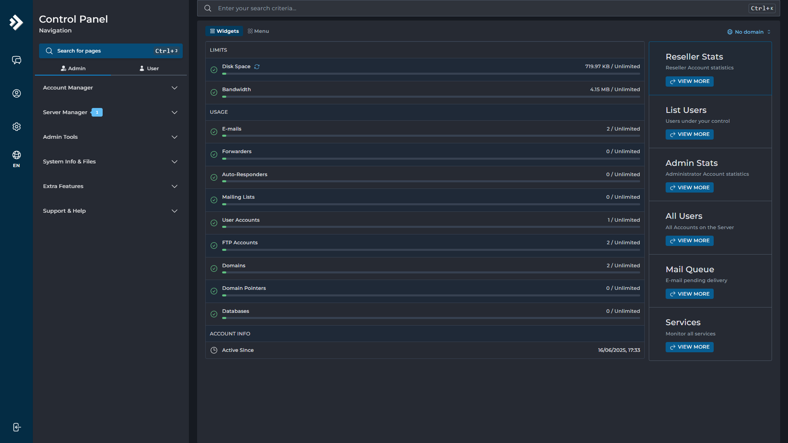
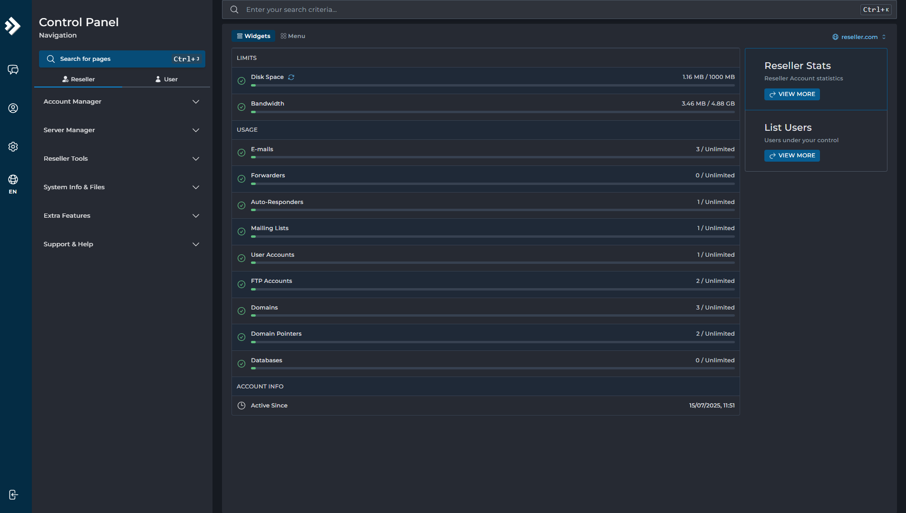
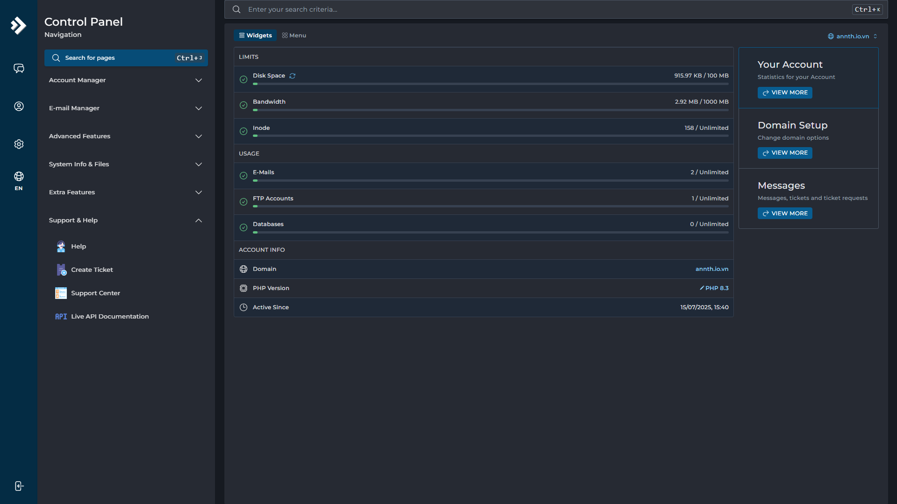
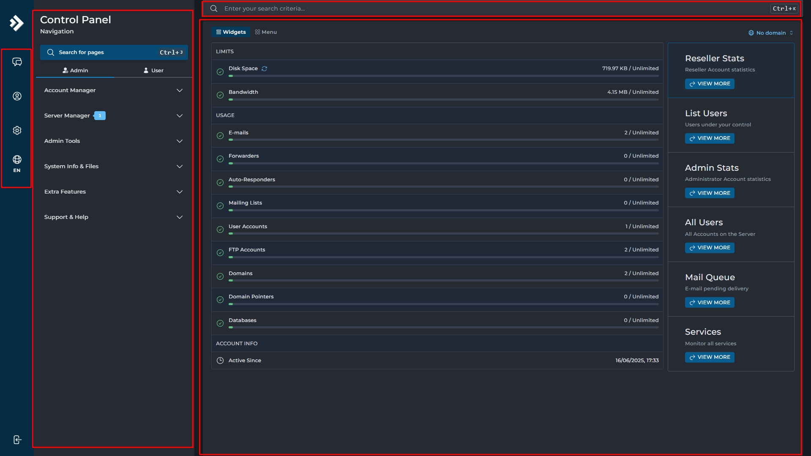
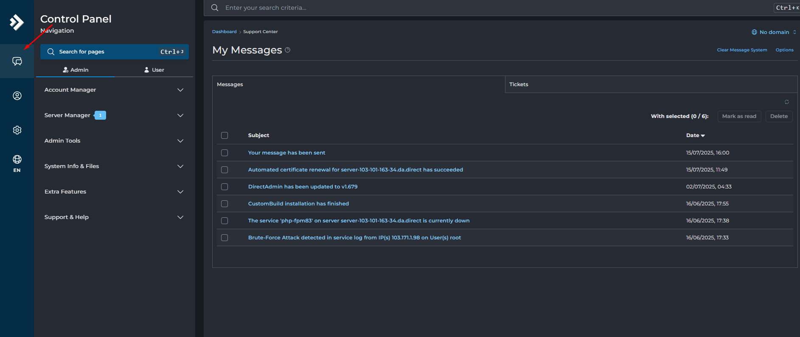
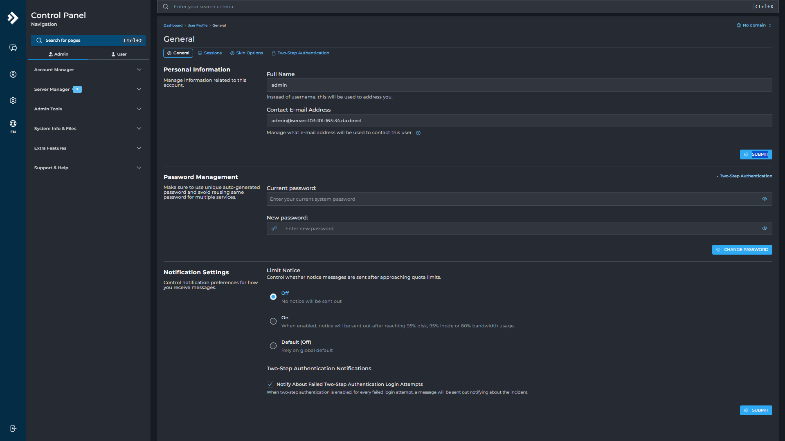
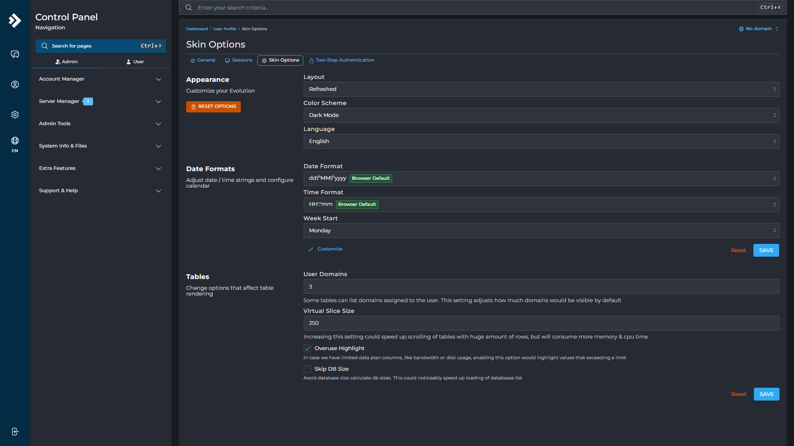
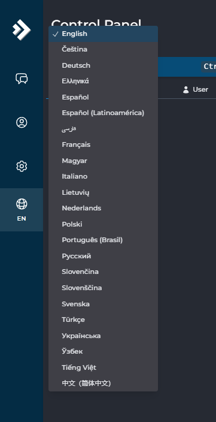
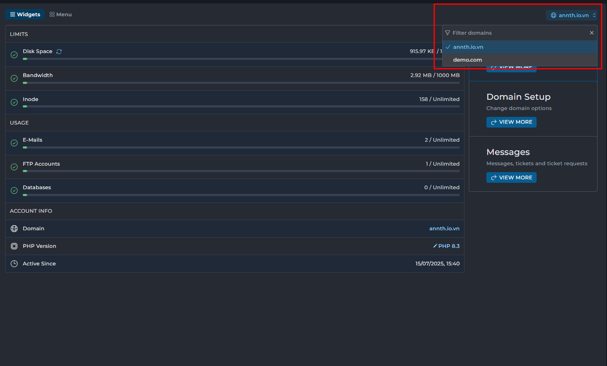

# Direct Admin (DA) - Overview
## Tổng quan 
- DirectAdmin là một công cụ quản lý web hosting được phát triển bởi JBMC Software, tập trung vào việc cung cấp giao diện quản trị đơn giản và dễ sử dụng. Nó hỗ trợ quản lý tài khoản, tệp tin, cơ sở dữ liệu, và email trên nền tảng Linux. So với các công cụ khác như cPanel, công cụ quản lý này được đánh giá là nhẹ, tiết kiệm tài nguyên và dễ sử dụng.
- Phần mềm này hỗ trợ nhiều ngôn ngữ, bao gồm cả tiếng Việt, giúp người dùng Việt Nam dễ dàng quản lý web hosting. Nó cung cấp nhiều tính năng như quản lý domain, DNS, FTP, MySQL, tạo email theo tên miền, SSH, SSL, và quản lý file thông qua File Manager.
- Công cụ quản lý này hoạt động tốt trên các hệ điều hành Linux như CloudLinux, CentOS, Ubuntu, Debian, Red Hat, nhưng không hỗ trợ trên Windows. Được phát hành lần đầu vào năm 2003, DA được duy trì và phát triển liên tục.
- DirectAdmin hướng đến sự đơn giản, tiện dụng, tốc độ và sự ổn định. Nhưng vẫn có đầy đủ các tính năng cần thiết cho một quản trị hosting server. Đặc biệt khi sử dụng DirectAdmin, các nhiệm vụ đều sẽ được tự động hoá. Việc quản trị máy chủ và chia sẻ trang web sẽ được thực hiện một cách dễ dàng hơn
- Các cấp độ user trong DirectAdmin được phân thành 3 nhóm như sau:
	- Nhóm Admin: Đây là cấp độ user cao nhất của DirectAdmin. Nhóm này có các quyền chỉnh sửa cũng như thay đối cấu hình của toàn bộ hệ thống, xem lịch sử thông tin, tạo ra 2 nhóm còn lại…
	- Nhóm Reseller: Nhóm này có cấp bậc sau nhóm Admin. Với cấp bậc Reseller, nhóm này chỉ có thể quản trị và thay đổi cấu hình của nhóm user do chính Reseller đó tạo ra mà thôi.
	- Nhóm User: Đây là cấp độ có quyền hạn thấp nhất. Mỗi user sẽ do admin hoặc reseller tạo ra. Và mỗi user chỉ có quyền thay đổi thông tin đối với tài khoản của mình.
- Ngoài việc xây dựng 3 cấp độ user với mỗi cấp độ có những chức năng riêng biệt giúp quản trị dễ dàng hơn, DirectAdmin còn có những chức năng nổi bật sau:
	- Ticket Support System: tính năng này giúp cho việc quản lý, hỗ trợ user và khách hàng trở nên đơn giản hơn.
	- Two-Factor Authentication: với chức năng này, tài khoản đăng nhập DirectAdmin vó thể sử dụng trên điện thoại.
	- Completely Customizable: thay đổi giao diện hệ thống.
	- Automatic Recovery From Crashes: với chức năng này, khi xảy ra lỗi, phần mềm sẽ tự khởi động lại hệ thống.
- Các tính năng của DA 
	- Tính năng phục vụ admin 
		* Giúp cho việc tạo và thay đổi các tài khoản quản lý và đại lý trở nên nhanh chóng, dễ dàng hơn.
		* Tạo ra các gói tài nguyên cho tài khoản đại lý và phân phối đến tài khoản user cuối.
		* Xem, sắp xếp và thay đổi thông tin của người dùng.
		* Xây dựng, sửa hoặc xóa các bản ghi DNS trên hệ thống.
		* Cài đặt địa chỉ IP trên máy chủ cho người dùng.
		* Cho phép truy cập thông tin về trạng thái hoạt động của các dịch vụ trên máy chủ.
		* Hỗ trợ thống kê các thông số của hệ thống và các thông tin về tài nguyên đã sử dụng.
	- Tính năng cho đại lý
		* Giúp cài đặt và quy định mục đích sử dụng IP trên máy chủ và quy định mục đích sử dụng IP cho người dùng.
		* Cho phép đại lý thống kê, sắp xếp các thông tin về tài nguyên sử dụng của khách hàng.
		* Hỗ trợ tạo, thay đổi và xóa tài khoản dễ dàng hơn.
		* Tự tạo các gói tài nguyên riêng cho khách hàng.
		* Cho phép thêm và thay đổi giao diện hệ thống.
		* Cho phép truy cập thông tin về trạng thái hoạt động của các dịch vụ trên máy chủ.
		* Tạo ra thông tin máy chủ ảo với khách hàng.
	- Tính năng cho người dùng
		* Tạo email, tự động trả lời hoặc từ chối email, lọc, bản ghi MX, webmail, xác thực SMTP.
		* Tạo, thay đổi và xóa tài khoản FTP, tên miềm phụ, quy định đăng nhập nặc danh, tạo FTP cho tài khoản với tên miền phụ.
		* Thay đổi DNS, bản ghi A, bản ghi CNAME, bản ghi NS, bản ghi MX và bản ghi PTR.
		* Thống kê và kiểm tra tài nguyên đã sử dụng, thông tin về tài khoản, cáclượt truy cập…
		* Tối ưu hóa việc sử dụng các website tạo bởi MS FrontPage.
		* Quản lý, sao chép, di chuyển, đổi tên, xóa và thay đổi quyền truy cập, sửa và tạo file.
		* Tạo và xóa CSDL, tạo tài khoản có quyền truy cập, thay đổi mật khẩu truy cập, sử dụng phpMyAdmin.
		* Tạo bản sao và khôi phục website từ các bản sao.
		* Cho phép người dùng tạo tài khoản và mật khẩu để hạn chế quyền truy cập vào một số thư mục nhất định.
		* Cài đặt xác thực SSL, xem các thông tin về máy chủ, cài đặt các tác vụ định kỳ, liên kết các domain song song…
- Ưu điểm 
	- Phương thức sử dụng đơn giản: Giao diện sử dụng của DirectAdmin mặc dù tương đối đơn giản nhưng vẫn đầy đủ những tính năng cần thiết. Phần mềm này đươc phân cấp thành 3 loại tài khoản, thứ tự từ cấp quyền cao đến thấp là Administrator, Reseller, và User. Đặc biệt hơn cả, chỉ trong một lần đăng nhập với phần mềm này, người dùng có thể dễ dàng chuyển đổi giữa 3 loại tài khoản một cách dễ dàng.
	- Tốc độ xử lý cực nhanh, ít tiêu tốn ít tài nguyên: Ưu điểm của DirectAdmin là tốc độ xử lý cực kỳ nhanh chóng và khả năng thích ứng cao. Bên cạnh đó, giao diện của phần mềm này cũng được thiết kế theo hướng tối giản, dễ sử dụng và ít tiêu tốn tài nguyên hệ thống.
	- Ổn định: Đặc biệt, tính ổn định của DirectAdmin rất cao. Nó có thể hoạt động trong thời gian dài mà không mắc phải lỗi hệ thống như các phần mềm quản trị hosting khác. Thêm vào đó, DirectAdmin còn có khả năng tự phục hồi trong trường hợp xảy ra lỗi bằng cách khởi động lại hệ thống.
	- Giá bản quyền thấp: Dù có nhiều tính năng vượt trội nhưng giá bản quyền của DirectAdmin khá thấp, chỉ với 89$ có thể sử dụng trọn đời.
- Nhược điểm 
	- Các tính năng chưa được hoàn thiện đầy đủ như cPanel hay một số phần mềm quản trị khác.
	- DirectAdmin không tương thích với dòng font unicode nên rất khó để để sửa khi file sử dụng các ngôn ngữ không phải là tiếng Anh.

## Tổng quan giao diện 
- Tương tự như các Web Hosting Manager khác , DirectAdmin chia giao diện thành 3 chế độ hiển thị (view), tương ứng với 3 cấp độ người dùng:
- Admin View – Giao diện quản trị viên
	- 
	- Đây là chế độ dành cho quản trị viên hệ thống, người có toàn quyền kiểm soát máy chủ. Giao diện này bao gồm:
		- Quản lý toàn bộ tài khoản: người dùng, đại lý (reseller), và các dịch vụ liên quan.
		- Cấu hình máy chủ: theo dõi trạng thái dịch vụ, hàng đợi email, tài nguyên hệ thống.
		- Truy cập công cụ nâng cao: như quản lý tệp tin, backup, bảo mật, và các tính năng mở rộng.
		- Thống kê tổng thể: hiển thị chi tiết về dung lượng, băng thông, số lượng tài khoản, tên miền, email, v.v.
- Reseller View – Giao diện đại lý
	- 
	- Chế độ này dành cho reseller – người bán lại dịch vụ hosting cho khách hàng. Giao diện cho phép:
		- Tạo và quản lý tài khoản người dùng cấp dưới.
		- Phân bổ tài nguyên: dung lượng, băng thông, số lượng email, tên miền, v.v.
		- Theo dõi thống kê riêng: giúp kiểm soát hiệu quả hoạt động của từng khách hàng.
- User View – Giao diện người dùng cuối
	- 
	- Đây là chế độ dành cho người dùng cuối, thường là chủ website hoặc người sử dụng dịch vụ email. Giao diện này bao gồm:
		- Quản lý tên miền, email, FTP, cơ sở dữ liệu.
		- Cấu hình các tính năng cá nhân: như chuyển tiếp email, trả lời tự động, bảo mật thư mục.
		- Theo dõi tài nguyên sử dụng: dung lượng, băng thông, số lượng dịch vụ đang hoạt động.
- Giao diện DirectAdmin được thiết kế trực quan, chia thành nhiều khu vực chức năng rõ ràng, giúp người dùng dễ dàng thao tác và quản lý hệ thống. Cấu trúc tổng thể bao gồm:
	- 
	- Thanh tìm kiếm nhanh
		- Nằm ở phía trên cùng của giao diện.
		- Cho phép người dùng nhập từ khóa để tìm kiếm nhanh các chức năng hoặc trang cài đặt trong hệ thống.
	- Các nút chức năng nhanh: 
		- Nằm ở góc trên bên phải, bao gồm:
		- Thông báo: Hiển thị các thông báo hệ thống, cảnh báo hoặc cập nhật.
			- 
		- User Profile: Truy cập thông tin tài khoản đang đăng nhập.
			- 
			- Thông tin cá nhân (Personal Information)
				- Full Name: Nhập tên đầy đủ của người dùng. Tên này sẽ được sử dụng để hiển thị thay cho tên đăng nhập trong các thông báo và giao diện.
				- Contact E-mail Address: Địa chỉ email liên lạc chính của người dùng. Hệ thống sẽ sử dụng email này để gửi các thông báo quan trọng như cảnh báo tài nguyên, xác thực, hoặc thông tin hệ thống.
			- Quản lý mật khẩu (Password Management)
				- Current Password: Nhập mật khẩu hiện tại để xác nhận trước khi thay đổi mật khẩu mới.
				- New Password: Nhập mật khẩu mới để cập nhật. Mật khẩu nên đủ mạnh để đảm bảo an toàn cho tài khoản.
			- Cài đặt thông báo (Notification Settings)
				- Giới hạn thông báo (Limit Notice): Tùy chọn bật/tắt việc gửi email cảnh báo khi tài nguyên như CPU, RAM, hoặc băng thông gần đạt giới hạn sử dụng.
					- Bật: Hệ thống sẽ gửi email cảnh báo khi các ngưỡng tài nguyên bị vượt quá.
					- Tắt: Không gửi cảnh báo qua email.
					- Thông báo mặc định (Default Off): Cho phép thiết lập trạng thái mặc định của thông báo giới hạn tài nguyên.
						- Bật: Áp dụng chế độ mặc định là gửi thông báo.
						- Tắt: Không gửi thông báo theo mặc định.
				- Thông báo xác thực hai bước (Two-Step Authentication Notifications):Quản lý việc nhận thông báo khi có đăng nhập thất bại qua xác thực hai bước.
					- Bật: Nhận email cảnh báo khi có đăng nhập thất bại.
					- Tắt: Không nhận cảnh báo.
			- Skin Options: Tùy chỉnh giao diện hiển thị (giao diện sáng/tối, bố cục...).
			- 
				- Giao diện (Appearance)
					- Layout: Lựa chọn bố cục hiển thị của bảng điều khiển.  
						- Standard
						- Sidebar 
						- Icons Grid 
						- Refreshed 
					- Color Scheme: Lựa chọn màu sắc tổng thể của giao diện.  
						- Dark Mode 
						- Light Mode 
						- Follow System Settings 
					- Language: Ngôn ngữ hiển thị của bảng điều khiển.  
					- Nút chức năng: Reset Options – Đặt lại tất cả tùy chọn về mặc định ban đầu.
				- Định dạng dữ liệu (Data Formats)
					- Định dạng ngày tháng (Date Format): Lựa chọn cách hiển thị ngày tháng trong hệ thống.  
					- Định dạng thời gian (Time Format): Lựa chọn cách hiển thị thời gian.  
					- Nút chức năng: Save – Lưu lại các thay đổi đã thực hiện.
				- Cài đặt bảng biểu (Tables)
					- User Domains: Thiết lập số lượng tên miền mà người dùng có thể nhìn thấy mặc định trong các bảng liệt kê.
					- Virtual Slice Size: Điều chỉnh kích thước bộ nhớ tạm dùng để cuộn các bảng lớn. Giá trị càng cao thì việc cuộn bảng càng mượt, nhưng sẽ tiêu tốn nhiều bộ nhớ và tài nguyên CPU hơn.
					- Overuse Highlight: Bật hoặc tắt việc làm nổi bật các giá trị vượt quá giới hạn trong bảng biểu. Khi bật, các giá trị như băng thông hoặc dung lượng vượt mức sẽ được đánh dấu để dễ nhận biết.
					- Skip DB Size: Bỏ qua việc tính toán kích thước cơ sở dữ liệu khi tải danh sách. Khi bật, giúp tăng tốc độ tải trang nhưng không hiển thị kích thước của từng cơ sở dữ liệu.
		- Language: Thay đổi ngôn ngữ hiển thị của bảng điều khiển.
			- 
	- Bảng điều hướng (Navigation Panel)
		- Nằm ở bên trái giao diện, là nơi tập trung các nhóm chức năng chính:
			- Admin: Các công cụ và tính năng dành cho quản trị viên hệ thống.
			- Reseller: Các chức năng quản lý tài khoản người dùng cấp dưới (dành cho đại lý).
			- User: Các tính năng dành cho người dùng cuối như quản lý tên miền, email, FTP, cơ sở dữ liệu...
	- Vùng hiển thị nội dung (Main Display Area)
		- Là khu vực trung tâm của giao diện, nơi hiển thị nội dung tương ứng với mục được chọn ở bảng điều hướng bên trái.
		- Tại góc trên bên phải của khu vực này có bộ lọc tên miền, cho phép lọc và thao tác nhanh với từng tên miền cụ thể.
		- 
	- Nút đăng xuất (Logout)
		- Nằm ở góc trên cùng bên phải.
		- Cho phép người dùng thoát khỏi phiên làm việc một cách an toàn.
