# Direct Admin (DA) - Admin
## Tổng quan 
- DirectAdmin là một hệ thống quản trị hosting mạnh mẽ, được thiết kế với giao diện trực quan và phân cấp rõ ràng theo từng vai trò người dùng. Trong đó, Admin View là chế độ dành riêng cho quản trị viên hệ thống, người có toàn quyền kiểm soát và cấu hình toàn bộ máy chủ.
- Giao diện quản trị viên cung cấp đầy đủ các công cụ cần thiết để:
	- Quản lý tài khoản người dùng và đại lý (reseller).
	- Giám sát tài nguyên hệ thống như dung lượng, băng thông, dịch vụ đang hoạt động.
	- Cấu hình máy chủ, bảo mật, sao lưu và khôi phục dữ liệu.
	- Theo dõi thống kê tổng thể và xử lý các tác vụ kỹ thuật nâng cao.
- Trong các phần tiếp theo, tài liệu sẽ trình bày chi tiết từng nhóm chức năng trong Admin View, giúp người dùng nắm bắt nhanh cách sử dụng và khai thác hiệu quả các công cụ quản trị trong DirectAdmin.
- Giao diện quản trị viên (Admin View) trong DirectAdmin được thiết kế để cung cấp đầy đủ công cụ và thông tin cần thiết cho việc quản lý toàn bộ hệ thống hosting. Giao diện này bao gồm các khu vực chức năng chính sau:
	- Dashboard – Giao diện thông tin tổng quát: Đây là màn hình chính khi đăng nhập vào chế độ quản trị viên. Tại đây, người dùng có thể:
		- Xem nhanh các thống kê hệ thống như dung lượng, băng thông, số lượng tài khoản, tên miền, dịch vụ đang hoạt động.
		- Truy cập nhanh các chức năng quản trị thông qua các widget và bảng điều khiển.
	- Bảng điều hướng – Nhóm chức năng dành cho quản trị viên
		- Phần Admin trong bảng điều hướng bên trái được chia thành các cụm chức năng chính:
		- Account Manager
			- Quản lý tài khoản người dùng, đại lý (reseller), và các dịch vụ liên quan như email, FTP, tên miền.
			- Cho phép tạo, sửa, xóa và phân quyền tài khoản.
		- Server Manager
			- Cấu hình và giám sát các dịch vụ máy chủ như DNS, web server, email server, cron jobs.
			- Quản lý trạng thái hoạt động và tài nguyên hệ thống.
		- Admin Tools
			- Cung cấp các công cụ nâng cao như sao lưu dữ liệu, khôi phục, bảo mật, cập nhật hệ thống.
			- Hỗ trợ xử lý sự cố và tối ưu hóa hiệu suất máy chủ.
		- System Info & Files
			- Hiển thị thông tin chi tiết về hệ thống như phiên bản phần mềm, trạng thái dịch vụ, nhật ký hệ thống.
			- Quản lý tệp tin hệ thống và cấu hình.
		- Extra Features
			- Các tính năng bổ sung như API, cấu hình giao diện, tùy chọn người dùng nâng cao.
			- Hỗ trợ mở rộng khả năng tùy biến và tích hợp.
		- Support & Help
			- Truy cập tài liệu hướng dẫn, liên hệ hỗ trợ kỹ thuật, và các công cụ trợ giúp khác.
			- Hữu ích khi cần tra cứu thông tin hoặc xử lý lỗi.


## Dashboard
- Giao diện này cung cấp cái nhìn tổng quan về tình trạng sử dụng tài nguyên, số lượng dịch vụ đang hoạt động, và thông tin tài khoản. Đây là khu vực quan trọng giúp quản trị viên theo dõi hiệu suất hệ thống và xử lý các vấn đề kịp thời.
- Gồm các tab
	- Widget 
		- Khu vực hiển thị các khối thông tin nhanh (widget) về tài nguyên và dịch vụ
		- Các liên kết bên phải giao diện click để hiển thị thông tin nhanh, click `View More` để tới phần cấu hình chi tiết tương ứng 
			- Reseller Stats: Xem thống kê tài khoản đại lý.
			- 
			- List Users: Danh sách người dùng do quản trị viên quản lý.
			- 
			- Admin Stats: Thống kê tài khoản quản trị viên.
			- 
			- All Users: Danh sách toàn bộ tài khoản trên máy chủ.
			- 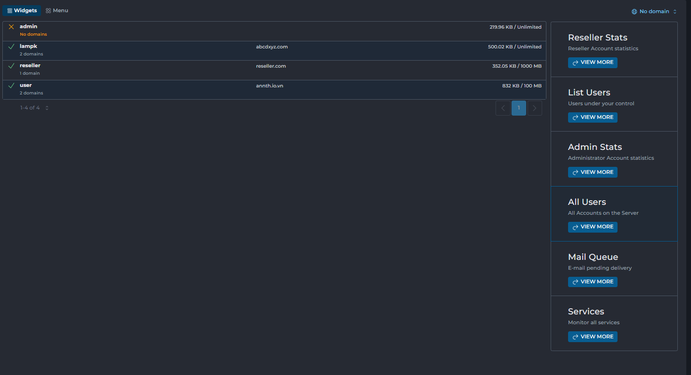
			- Mail Queue: Kiểm tra các email đang chờ gửi.
			- 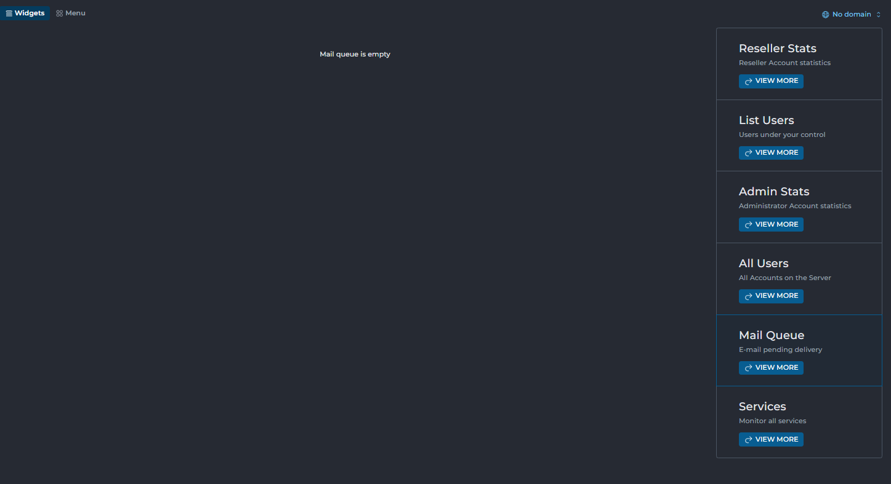
			- Services: Theo dõi trạng thái hoạt động của các dịch vụ hệ thống.
			- 
	- Menu: 
		- Hiển thị toàn bộ các nhóm chức năng cấu hình trong hệ thống.
		- Cho phép truy cập nhanh đến các khu vực như: Account Manager, Server Manager, Admin Tools, System Info & Files, v.v.
			- 

## Account Manager
- Account Manager là nhóm chức năng trung tâm trong giao diện quản trị viên, cho phép quản lý toàn bộ tài khoản người dùng, đại lý (reseller), và quản trị viên trên hệ thống. Tại đây, quản trị viên có thể thực hiện các thao tác tạo mới, chỉnh sửa, phân quyền, chuyển đổi và kiểm soát thông tin tài khoản.
- Nhóm chức năng quản lý tài khoản gồm 
	- Quản lý người dùng (User Management)
		- Add New User: Tạo tài khoản người dùng mới với các thông tin cơ bản như tên đăng nhập, mật khẩu, gói dịch vụ.
		- Show All Users: Hiển thị danh sách toàn bộ người dùng trên hệ thống.
		- My Users : Danh sách các tài khoản người dùng thuộc quyền quản lý của quản trị viên hiện tại.
		- Manage User Packages: Quản lý các gói dịch vụ dành cho người dùng: tạo, sửa, xóa gói.
		- Move Users between Resellers: Chuyển tài khoản người dùng từ đại lý này sang đại lý khác.
		- Edit User Message: Chỉnh sửa nội dung thông báo hiển thị cho người dùng khi đăng nhập.
		- Change Passwords: Thay đổi mật khẩu cho một hoặc nhiều tài khoản người dùng.
	- Quản lý đại lý (Reseller Management)
		- Create Reseller: Tạo tài khoản đại lý mới, có quyền tạo và quản lý người dùng cấp dưới.
		- List Resellers: Hiển thị danh sách tất cả các tài khoản đại lý trên hệ thống.
		- Manage Reseller Packages: Quản lý các gói dịch vụ dành cho đại lý: tạo, sửa, xóa gói.
	- Quản lý quản trị viên (Administrator Management)
		- Create Administrator: Tạo tài khoản quản trị viên mới với toàn quyền truy cập hệ thống.
		- List Administrators: Hiển thị danh sách các tài khoản quản trị viên hiện có.
		- Suspension Message: Thiết lập nội dung thông báo hiển thị cho người dùng khi tài khoản bị khóa hoặc tạm ngưng.

### User Management
- Nhóm các chức năng quản lý người dùng 
#### Add New User
- Admin -> Account Manager -> Add New User
- Giao diện khởi tạo tài khoản người dùng mới. 
- 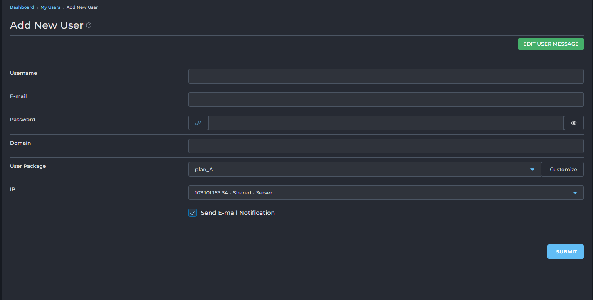
- Các thông số cấu hình 
	- Username: Tài khoản đăng nhập DA 
	- E-mail: Địa chỉ email của người dùng.
	- Password: Mật khẩu đăng nhập có thể tạo ngẫu nhiên bằng click chọn icon `Xúc xắc` hoặc xem mật khẩu bằng icon `con mắt` 
	- Domain:  Cấu hình tên miền liên kết với người dùng.
	- User Packages: Cấu hình gói dịch vụ gán cho người dùng 
		- 
		- Có thể chọn từ list có sẵn 
		- Hoặc click `Customize` để tự thiết lập cấu hình tất cả các thông số. 
			- Các thông số trình bày chi tiết trong phần tạo gói cho user. 
			- 
	- IP: Gán địa chỉ IP cho user. 	
	- Tuỳ chọn Send E-mail Notification: Đánh dấu chọn để gửi email thông báo cho người dùng mới.
		- Có thể chỉnh sửa cấu trúc email tại nút `EDIT USER MESSAGE` click chuyển tới phần cấu hình `Edit User Message`
	
- Ví dụ Tạo user mới: User tạo từ admin sẽ thuộc reseller admin 
	- Admin -> Account Manager -> Add New User
		- Username: user1
		- Password: u1_test@annth.io.vn
		- Password: Random 
		- Domain: user1.com.vn
		- User Package: plan_A
		- IP: Shared 
	- Click submit để tạo 
	- 
	- Khởi tạo thành công 
	- 
	- Đăng nhập 
	- 
	- 

#### Show All Users
- Hiển thị danh sách các tài khoản người dùng hiện có trong hệ thống và cho phép quản lý chúng.
- 
- Các nút chức năng 
	- `Add New User`: Click chuyển tới giao diện tạo người dùng mới. 
	- Send a Message: Gửi tin nhắn đến người dùng đã chọn.
		- 
		- 
			- Cấu hình tiêu đề, nội dung tin nhắn, tuỳ chọn chỉ gửi email. 
	- Suspend: Tạm ngưng hoạt động của tài khoản người dùng đã chọn.
		- 
		- 	
			- Cấu hình lý do, thông tin chi tiết.
	- Unsuspend: Kích hoạt lại tài khoản người dùng đã bị tạm ngưng.
		- 	
	- Delete: Xóa tài khoản người dùng đã chọn.	 
		- 	
		- 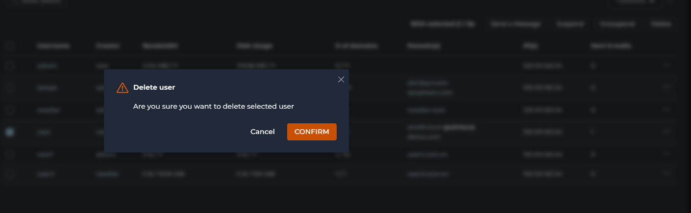	
	
- Danh sách các tài khoản người dùng trong hệ thống 
	- Username: Tên đăng nhập của người dùng.
		- Click chuyển tới giao diện chi tiết thông tin của người dùng - phần My Users
	- Creator: Người đã tạo tài khoản này 
		- Click chuyển tới giao diện chi tiết thông tin của người cấp - phần List Resellers 
	- Bandwidth: Lượng băng thông đã sử dụng / tổng băng thông được cấp 
	- Disk Usage: Dung lượng đĩa đã sử dụng / tổng dung lượng được cấp.
	- `# of domains`: Số lượng tên miền hiện có / số lượng tên miền tối đa được phép.
	- Domain(s): Liệt kê các tên miền được liên kết với tài khoản này.
	- IP(s): Địa chỉ IP mà tài khoản người dùng được gán.
	- Sent E-mails: Số lượng email đã gửi từ tài khoản này.
	- ... (biểu tượng ba chấm): Nút tùy chọn cho phép thực hiện các hành động cụ thể cho từng người dùng 
		- 
		- Send a Message: Gửi tin nhắn đến người dùng.
		- Suspend: Tạm ngưng tài khoản.
		- Login as [Username]: Đăng nhập vào tài khoản của người dùng đó (để hỗ trợ).
		- Change user's password: Đổi mật khẩu của người dùng.
		- Remove: Xóa vĩnh viễn tài khoản.
	
#### My Users 
- Hiển thị danh sách các tài khoản người dùng mà người dùng đăng nhập hiện tại có quyền quản lý và tạo ra.
- 
- Các nút chức năng
	- ADD NEW USER: Nút để chuyển đến giao diện thêm người dùng mới.
	- MODIFY YOUR OWN USER DATA: Nút này có thể dùng để chỉnh sửa thông tin hoặc cấu hình của chính tài khoản người dùng hiện tại đang đăng nhập.
	- 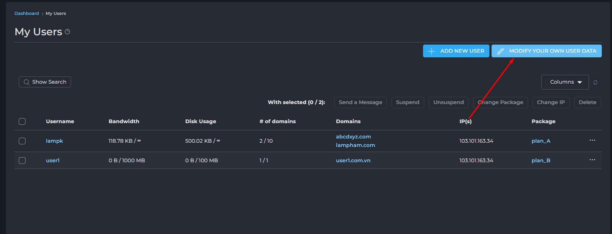
	- 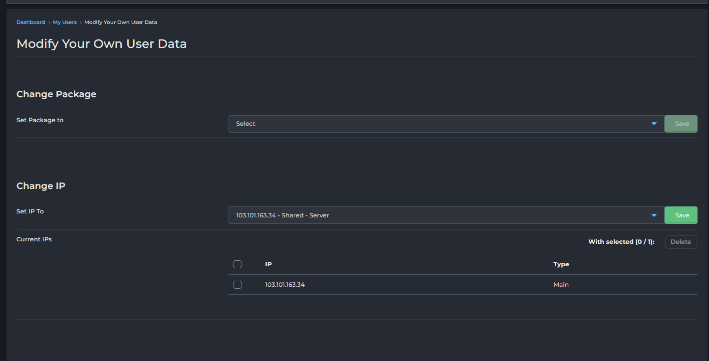
	- Tại đây có thể cấu hình 
		- Change Package: Thay đổi gói được cấu hình cho user hiện tại 
		- Change IP: Thay đổi địa chỉ IP được gán 
		- Manual Change Settings: Cấu hình các thông số khác 
			- 
			- 
			- Các giới hạn tài nguyên:
				- Bandwidth (MB): Dung lượng băng thông (dữ liệu truyền tải) được cấp cho tài khoản. Có thể nhập số cụ thể hoặc chọn "Unlimited" (Không giới hạn).
				- Disk Space (MB): Dung lượng ổ đĩa được cấp cho tài khoản. Có thể nhập số cụ thể hoặc chọn "Unlimited".
				- Inode: Số lượng tệp tin và thư mục tối đa mà tài khoản có thể tạo. Có thể nhập số cụ thể hoặc chọn "Unlimited".
			- Các giới hạn số lượng khác:
				- Domains: Số lượng tên miền chính tối đa mà tài khoản có thể thêm.
				- Sub-Domains: Số lượng tên miền con tối đa.
				- E-mail Accounts: Số lượng tài khoản email tối đa.
				- E-mail Forwarders: Số lượng chuyển tiếp email tối đa.
				- Mailing Lists: Số lượng danh sách gửi thư tối đa.
				- Autoresponders: Số lượng trả lời tự động email tối đa.
				- MySQL Databases: Số lượng cơ sở dữ liệu MySQL tối đa.
				- Domain Pointers: Số lượng con trỏ tên miền (domain alias/parked domain) tối đa.
				- FTP Accounts: Số lượng tài khoản FTP tối đa.
				- Anonymous FTP Accounts: Số lượng tài khoản FTP ẩn danh tối đa.
			- Các quyền truy cập tính năng: Các hộp kiểm (checkbox) này cho phép bật/tắt các tính năng cụ thể cho tài khoản:
				- CGI Access: Quyền truy cập và thực thi các tập lệnh CGI.
				- PHP Access: Quyền truy cập và thực thi các tập lệnh PHP .
				- SpamAssassin: Kích hoạt bộ lọc thư rác SpamAssassin .
				- Catch-All E-mail: Kích hoạt chức năng email Catch-All (nhận tất cả email gửi đến các địa chỉ không tồn tại trong tên miền).
				- SSL Access: Quyền truy cập và sử dụng chứng chỉ SSL.
				- SSH Access: Quyền truy cập SSH vào máy chủ.
				- Cron Jobs: Quyền tạo và quản lý các tác vụ định kỳ (cron jobs). 
				- System Info: Quyền xem thông tin hệ thống. 
				- Login Keys: Quyền tạo và quản lý khóa đăng nhập. 
				- DNS Control: Quyền quản lý các bản ghi DNS cho tên miền của tài khoản. 
				- Suspend at Limit: Tự động tạm ngưng tài khoản nếu đạt đến giới hạn tài nguyên được cấp. 
				- Automatic security.txt (RFC9116): Tự động tạo tệp security.txt theo tiêu chuẩn RFC9116. 
				- Jailed: Kích hoạt môi trường "giam giữ" (jailed shell) cho SSH, tăng cường bảo mật bằng cách hạn chế truy cập của người dùng vào các phần khác của hệ thống. 
				- Skin: Một menu thả xuống cho phép bạn chọn giao diện (theme) mà tài khoản người dùng sẽ thấy khi họ đăng nhập vào bảng điều khiển của mình.
			- Chính sách Plugin (Plugins Allow/Deny): Mục này xác định cách các plugin được cài đặt trên hệ thống sẽ được áp dụng hoặc hạn chế đối với tài khoản này.
				- Allow All: Cho phép tài khoản sử dụng tất cả các plugin có sẵn. 
				- Deny Selected: Không cho phép tài khoản sử dụng các plugin được chọn cụ thể (tức là cho phép tất cả trừ những cái bị từ chối).
				- Allow Selected: Chỉ cho phép tài khoản sử dụng các plugin được chọn cụ thể (tức là từ chối tất cả trừ những cái được phép).
			- Máy chủ tên miền (NS - Name Servers):
				- Phần này cho phép bạn định nghĩa các máy chủ tên miền chính (Name Servers) mà tài khoản sẽ sử dụng hoặc được gán.
				- NS1: Máy chủ tên miền thứ nhất.
				- NS2: Máy chủ tên miền thứ hai. 
	- Send a Message: Gửi tin nhắn đến người dùng đã chọn.
	- Suspend: Tạm ngưng hoạt động của tài khoản người dùng đã chọn.
	- Unsuspend: Kích hoạt lại tài khoản người dùng đã bị tạm ngưng.
	- Change Package: Thay đổi gói dịch vụ (User Package) cho người dùng đã chọn.
		- 
		- 
	- Change IP: Thay đổi địa chỉ IP cho người dùng đã chọn.
		- 
		- 
	- Delete: Xóa tài khoản người dùng đã chọn.
- Danh sách người dùng và thông tin chi tiết: Mỗi hàng trong bảng đại diện cho một tài khoản người dùng do bạn quản lý với các thông tin sau (lưu ý cột "Creator" đã không còn ở đây vì tất cả đều do bạn tạo/quản lý):
	- Username: Tên đăng nhập của người dùng.
		- Click chuyển tới giao diện chỉnh sửa cấu hình chi tiết người dùng. 
	- Bandwidth: Lượng băng thông đã sử dụng / tổng băng thông được cấp.
	- Disk Usage: Dung lượng đĩa đã sử dụng / tổng dung lượng được cấp.
	- `# of domains`: Số lượng tên miền hiện có / số lượng tên miền tối đa được phép.
	- Domains: Liệt kê các tên miền được liên kết với tài khoản này.
	- IP(s): Địa chỉ IP mà tài khoản người dùng được gán.
	- Package: Gói dịch vụ (User Package) mà người dùng đang sử dụng.
		- Click chuyển tới giao diện chỉnh sửa cấu hình gói - Phần Manage User Packages
	- ... (biểu tượng ba chấm): Nút tùy chọn cho phép thực hiện các hành động cụ thể cho từng người dùng.
		- Send a Message: Gửi tin nhắn đến người dùng.
		- Suspend: Tạm ngưng tài khoản.
		- Login as [Username]: Đăng nhập vào tài khoản của người dùng đó (để hỗ trợ).
		- Change user's password: Đổi mật khẩu của người dùng.
		- Remove: Xóa vĩnh viễn tài khoản.

- Giao diện thông tin chi tiết người dùng
- 
- Giao diện "View User: [username]" cung cấp cái nhìn tổng quan và các tùy chọn quản lý chi tiết cho một tài khoản người dùng cụ thể.
- Thông tin chung và tác vụ chính:
	- 
	- User History: Nút để xem lịch sử hoạt động của người dùng.
	- Change Password: Nút để thay đổi mật khẩu của người dùng này.
		- Click để đổi mật khẩu, có thể tạo ngẫu nhiên bằng click chọn icon `Xúc xắc` hoặc xem mật khẩu bằng icon `con mắt`.
		- Click `Save` để thay đổi. 
		- 
	- Bandwidth: Hiển thị băng thông đã sử dụng / tổng băng thông được cấp cho người dùng (ví dụ: 0 B / 1000 MB).
	- Disk Usage: Hiển thị dung lượng đĩa đã sử dụng / tổng dung lượng được cấp (ví dụ: 0 B / 100 MB).
	- Các nút hành động nhanh:
		- LOGIN AS [USERNAME]: Đăng nhập vào tài khoản của người dùng (dành cho quản trị viên/reseller hỗ trợ).
		- RESEND WELCOME EMAIL: Gửi lại email chào mừng có thông tin tài khoản cho người dùng.
		- SUSPEND: Tạm ngưng hoạt động của tài khoản người dùng này.
		- DELETE: Xóa vĩnh viễn tài khoản người dùng này.
- Các tab thông tin chi tiết:
	- Giao diện được tổ chức thành các tab để hiển thị các loại thông tin khác nhau:
		- Domains : Hiển thị danh sách các tên miền liên kết với tài khoản này cùng với thông tin chi tiết về từng tên miền.
		- Usage Statistics: Thống kê chi tiết việc sử dụng tài nguyên của người dùng.
		- Account Info: Thông tin chi tiết về tài khoản người dùng.
		- Comments: Ghi chú hoặc bình luận về tài khoản.
		- Modify: Tab để chỉnh sửa các cài đặt của người dùng
	- Domains: Hiển thị danh sách các tên miền mà người dùng quản lý
		- 
		- Domain: Tên miền 
		- Bandwidth: Băng thông đã sử dụng cho tên miền đó.
		- Disk Usage: Dung lượng đĩa đã sử dụng cho tên miền đó.
		- Log Usage: Dung lượng tệp nhật ký (logs) đã sử dụng.
		- Subdomains: Số lượng tên miền con.
		- Pointers: Số lượng con trỏ tên miền (domain alias/parked domain).
		- Settings: Trạng thái các tính năng chính của tên miền (CGI, PHP, SSL).
			- CGI: Quyền thực thi CGI.
			- PHP: Quyền thực thi PHP.
			- SSL: Quyền sử dụng SSL.
	- Usage Statistics: Chi tiết về việc sử dụng tài nguyên hiện tại của một tài khoản người dùng và các giới hạn tài nguyên đã được thiết lập cho tài khoản đó
		- 
		- Các thông số tài nguyên chính: 
			- Bandwidth:
				- Usage: Lượng băng thông đã sử dụng bởi tài khoản (ví dụ: 0 B).
				- Limit: Giới hạn băng thông tối đa được cấp cho tài khoản (ví dụ: 1000 MB).
				- (Additional Bandwidth: 0 B): Có thể hiển thị băng thông bổ sung nếu có.
					- Click chọn icon `Edit` để chỉnh sửa tăng thêm băng thông tạm thời 
					- 
					- Cấu hình thông số cần thêm: theo MB/GB/TB. Click chọn Increase Bandwidth để xác nhận 
					- 
					- Ví dụ cấu hình thêm 1 GB bandwidth 
					- 
			- Disk Usage:
				- Usage: Dung lượng ổ đĩa đã sử dụng bởi tài khoản (ví dụ: 0 B).
				- Limit: Giới hạn dung lượng ổ đĩa tối đa được cấp cho tài khoản (ví dụ: 100 MB).
			- E-mail Disk Usage: Dung lượng ổ đĩa dành riêng cho email đã sử dụng.
			- Database Disk Usage: Dung lượng ổ đĩa dành riêng cho cơ sở dữ liệu đã sử dụng.
			- Inodes:
				- Usage: Số lượng Inode (tệp tin/thư mục) đã sử dụng.
				- Limit: Giới hạn số lượng Inode tối đa (ví dụ: Unlimited).
		- Các giới hạn số lượng mục:
			- `# of Domains`:
				- Usage: Số lượng tên miền chính hiện có.
				- Limit: Giới hạn số lượng tên miền chính tối đa (ví dụ: 1).
			- `# of Subdomains`: Số lượng tên miền con hiện có / giới hạn tối đa.
			- E-mail Accounts: Số lượng tài khoản email hiện có / giới hạn tối đa.
			- E-mail Forwarders: Số lượng chuyển tiếp email hiện có / giới hạn tối đa.
			- Mailing Lists: Số lượng danh sách gửi thư hiện có / giới hạn tối đa.
			- Autoresponders: Số lượng trả lời tự động email hiện có / giới hạn tối đa.
			- Sent E-mails: Số lượng email đã gửi / giới hạn gửi email mỗi ngày (ví dụ: 1000 / Day).
					- Click chọn icon `Edit` để chỉnh sửa giới hạn 
					- 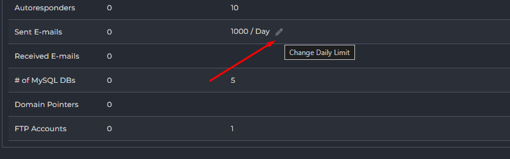
					- Cấu hình số lượng mail giới hạn gửi trong ngày. 
					- 
					- Nút chức năng: 	
						- Save: Lưu thông số đã cấu hình 
						- Reset to Defaults: Đặt lại giới hạn mặc định.
			- Received E-mails: Số lượng email đã nhận.
			- `# of MySQL DBs`: Số lượng cơ sở dữ liệu MySQL hiện có / giới hạn tối đa.
			- Domain Pointers: Số lượng con trỏ tên miền hiện có / giới hạn tối đa.
			- FTP Accounts: Số lượng tài khoản FTP hiện có / giới hạn tối đa.
	- Account Info: Cung cấp thông tin tổng quan và các chỉnh sửa các thông tin cơ bản và cài đặt của một tài khoản người dùng.
		- 
		- 
		- Thông tin liên hệ và cơ bản:
			- Contact E-mail: Địa chỉ email liên hệ chính của tài khoản. Có nút "Save E-mail" để lưu thay đổi.
			- Name: Tên hiển thị của tài khoản người dùng. Có nút "Save Name" để lưu thay đổi.
			- Language: Ngôn ngữ giao diện bảng điều khiển của tài khoản.
		- Cấu hình máy chủ tên miền và giao diện:
			- Name Server 1 / Name Server 2: Các máy chủ tên miền được gán cho tài khoản này. Có nút "Save Name Servers" để lưu thay đổi.
			- Skin: Giao diện (theme) bảng điều khiển mà tài khoản đang sử dụng. 
			- IP: Địa chỉ IP mà tài khoản được gán. 
		- Thông tin hệ thống và phân loại:
			- Date Created: Ngày và thời gian tài khoản được tạo
			- Package: Gói dịch vụ (User Package) mà tài khoản này đang sử dụng
			- User Type: Loại người dùng của tài khoản này 
			- Creator: Người hoặc tài khoản đã tạo ra tài khoản này 
		- Mục "Features" liệt kê các tính năng cụ thể cho tài khoản người dùng đang được cấu hình. 
			- Shell Access (SSH): Quyền truy cập vào máy chủ thông qua SSH. 
			- Secure Socket Layer (SSL): Quyền sử dụng và quản lý chứng chỉ SSL cho tên miền. 
			- CGI-Bin: Quyền thực thi các tập lệnh CGI. 
			- Git: Quyền sử dụng hệ thống kiểm soát phiên bản Git. 
			- WordPress: Quyền cài đặt hoặc quản lý WordPress (thông qua công cụ tự động). 
			- ClamAV: Kích hoạt trình quét virus ClamAV cho email hoặc tệp. 
			- Nginx Unit: Kích hoạt Nginx Unit (máy chủ ứng dụng đa ngôn ngữ). 
			- PHP: Quyền thực thi các tập lệnh PHP. 
			- SpamAssassin: Kích hoạt bộ lọc thư rác SpamAssassin. 
			- Catch-All E-mail: Quyền sử dụng chức năng email Catch-All. 
			- Anonymous FTP: Quyền tạo và quản lý tài khoản FTP ẩn danh. 
			- Cron Jobs: Quyền tạo và quản lý các tác vụ định kỳ (cron jobs). 
			- Redis: Quyền sử dụng bộ nhớ đệm Redis. 
			- System Info: Quyền xem thông tin hệ thống. 
			- Login Keys: Quyền tạo và quản lý khóa đăng nhập. 
			- DNS Control: Quyền quản lý các bản ghi DNS cho tên miền. 
			- Suspend at Limit: Tự động tạm ngưng tài khoản nếu đạt đến giới hạn tài nguyên được cấp. 		
	- Comments: Ghi chú hoặc bình luận về tài khoản.
		- 
	- Modify: Chỉnh sửa thông tin hoặc cấu hình của tài khoản người dùng
		- 
		- 
		- Thay đổi Gói Dịch Vụ (Change Package for User):
			- Set Package to: Một menu thả xuống cho phép chọn một gói dịch vụ (User Package) khác cho tài khoản này.
			- Save: Nút để áp dụng thay đổi gói dịch vụ.
		- Thay đổi Địa chỉ IP của Người Dùng (Change the User's IP):
			- Set IP To: Một menu thả xuống để chọn địa chỉ IP mới cho tài khoản.
			- Current IPs: Liệt kê các địa chỉ IP hiện tại của tài khoản. Có hộp kiểm để chọn và nút "Delete" để xóa IP (nếu có nhiều IP).
			- Save: Nút để áp dụng thay đổi địa chỉ IP.
		- Thay đổi Cài đặt Thủ công (Manually Change Settings):
			- Phần này cung cấp các tùy chọn để ghi đè các cài đặt từ gói dịch vụ (Package) đã chọn, cho phép tùy chỉnh riêng biệt cho tài khoản này.
			- Giới hạn tài nguyên:
				- Bandwidth (MB): Giới hạn băng thông (ví dụ: 1000). Có thể chọn "Unlimited".
				- Disk Space (MB): Giới hạn dung lượng đĩa (ví dụ: 100). Có thể chọn "Unlimited".
				- Inode: Giới hạn số lượng tệp/thư mục. Có thể chọn "Unlimited".
				- Các giới hạn số lượng mục khác: Domains, Sub-Domains, E-mail Accounts, E-mail Forwarders, Mailing Lists, Autoresponders, MySQL Databases, Domain Pointers, FTP Accounts. Tất cả đều có thể được đặt số cụ thể hoặc "Unlimited".
			- Quyền truy cập tính năng:
			- Anonymous FTP Accounts: Quyền cho phép các tài khoản FTP Anonymous
			- CGI Access: Quyền sử dụng CGI
			- PHP Access: Quyền thực thi PHP. 
			- SpamAssassin: Kích hoạt bộ lọc thư rác. 
			- Catch-All E-mail: Kích hoạt email Catch-All. 
			- SSL Access: Quyền sử dụng SSL. 
			- SSH Access: Quyền truy cập SSH. 
			- Cron Jobs: Quyền tạo tác vụ định kỳ. 
			- System Info: Quyền xem thông tin hệ thống. 
			- Login Keys: Quyền tạo khóa đăng nhập. 
			- DNS Control: Quyền quản lý DNS. 
			- Suspend at Limit: Tự động tạm ngưng khi đạt giới hạn. 
			- Automatic security.txt (RFC9116): Tự động tạo security.txt. 
			- Jailed: Kích hoạt môi trường "giam giữ" (jailed shell). 
			- Giao diện và Name Servers:
				- Skin: Chọn giao diện bảng điều khiển cho người dùng. (Hiện Evolution)
				- NS1 / NS2: Cấu hình máy chủ tên miền chính. (Đã điền địa chỉ)
				- Max limit user can set per email: Giới hạn tối đa mà người dùng có thể đặt cho mỗi email.
					- Global Limit: Hộp kiểm này có thể cho phép sử dụng giới hạn toàn cục của hệ thống thay vì giới hạn tùy chỉnh.
					- Click để chỉnh sửa limit 
					- 
					- 
						- Global Limit: 200
						- Unlimited: Không giới hạn 
						- Custom: Tuỳ chỉnh thông số giới hạn cụ thể. 
						- CLick `Set Limit` để áp dụng. 
		- Bộ tính năng (Feature Sets):
			- Allow All Commands: Cho phép tất cả các lệnh/tính năng.
			- Allow Selected Features: Chỉ cho phép các tính năng được chọn.
				- Khi chọn Allow Selected Features, một giao diện tùy chọn sẽ xuất hiện, cho phép bạn chọn từ các bộ tính năng hoặc nhóm tính năng được định nghĩa trước:
				- 
				- Core Functions: Bao gồm các chức năng cốt lõi và cơ bản nhất để quản lý hosting (ví dụ: quản lý tệp, cơ sở dữ liệu cơ bản, v.v.).
				- DNS Only: Giới hạn tài khoản chỉ có thể quản lý các cài đặt DNS.
				- E-mail only: Giới hạn tài khoản chỉ có thể quản lý các chức năng liên quan đến email (tạo tài khoản email, chuyển tiếp, v.v.).
		- Chính sách Plugin (Plugins Allow/Deny):
			- Allow All: Cho phép tất cả các plugin.
			- Deny Selected: Từ chối các plugin được chọn.
			- Allow Selected: Chỉ cho phép các plugin được chọn.
			- Khi bạn chọn chính sách Deny Selected hoặc Allow Selected, một khung lựa chọn các plugin sẽ tự động hiển thị bên dưới, cho phép bạn chỉ định cụ thể các plugin cần áp dụng chính sách:
				- 
				- Select All: Một hộp kiểm cho phép bạn nhanh chóng chọn hoặc bỏ chọn tất cả các plugin trong danh sách chỉ với một cú nhấp chuột.
				- Search: Một ô tìm kiếm tiện lợi giúp bạn lọc nhanh danh sách các plugin, đặc biệt hữu ích khi hệ thống của bạn có nhiều plugin được cài đặt.
				- Danh sách các Plugin: Dưới đây là danh sách các plugin hiện có trên hệ thống của bạn. Bạn sẽ đánh dấu vào hộp kiểm bên cạnh tên plugin (ví dụ: csf) để chọn hoặc bỏ chọn nó theo chính sách "Deny Selected" hoặc "Allow Selected" mà bạn đã thiết lập.		
			
			

#### Manage User Packages
- Giao diện "Manage User Packages" cho phép bạn tạo, chỉnh sửa, nhập và quản lý các gói dịch vụ mà bạn cung cấp cho các tài khoản người dùng của mình. Mỗi gói định nghĩa các giới hạn tài nguyên và tính năng mà một tài khoản người dùng sẽ nhận được khi được gán gói đó.
- 
- Các nút chức năng 
	- 
	- ADD PACKAGE: Nút để tạo một gói dịch vụ mới.
		- Chi tiết các thông số cấu hình trình bày bên dưới.
	- IMPORT PACKAGES: Nút để nhập các gói dịch vụ.
		- Click chọn để import 
		- 
		- Paste nội dung gói đã export và click Import
		- 
		- Import thành công 
		- 
	- Delete: Xóa các gói dịch vụ đã chọn.
		- 
		- 
	- Export: Xuất cấu hình của các gói dịch vụ đã chọn.
		- 
		- 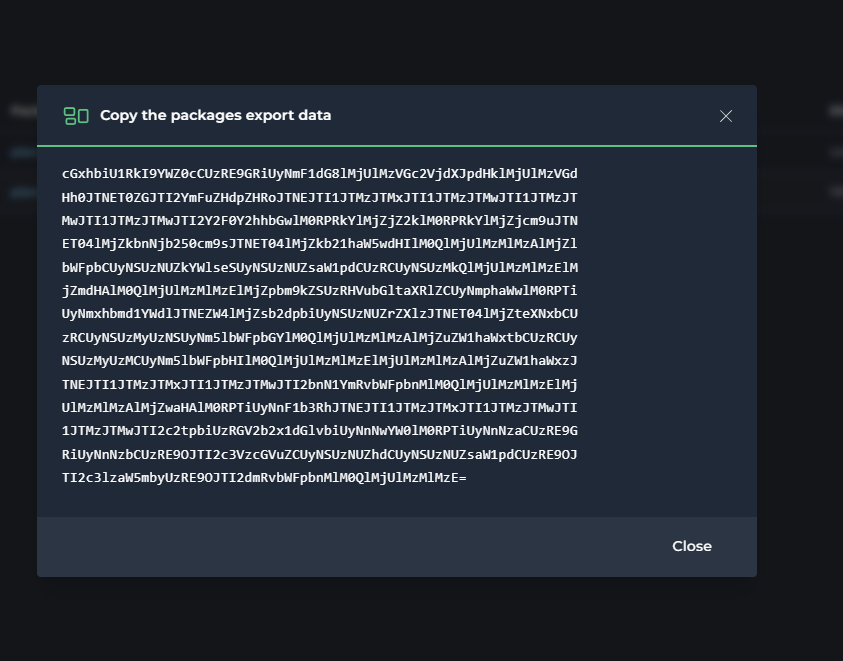
- Danh sách Gói dịch vụ: Bảng này hiển thị tất cả các gói dịch vụ đã được tạo trong hệ thống của bạn, với các thông tin cơ bản:
	- 
	- Package: Tên của gói dịch vụ . Đây là tên mà bạn sẽ thấy khi gán gói cho người dùng mới hoặc thay đổi gói của người dùng hiện tại.
		- Click tên gói để mở giao diện chỉnh sửa gói. 
			- 
	- Bandwidth: Giới hạn băng thông (dữ liệu truyền tải) được cấp cho các tài khoản sử dụng gói này. 
	- Disk Usage: Giới hạn dung lượng ổ đĩa được cấp cho các tài khoản sử dụng gói này.
	- ... (biểu tượng ba chấm): Nút tùy chọn cho phép thực hiện các hành động cụ thể cho từng gói.
		- Rename: Đổi tên gói. 
			- 
			- 
		- Copy: Sao chép gói. 
			- 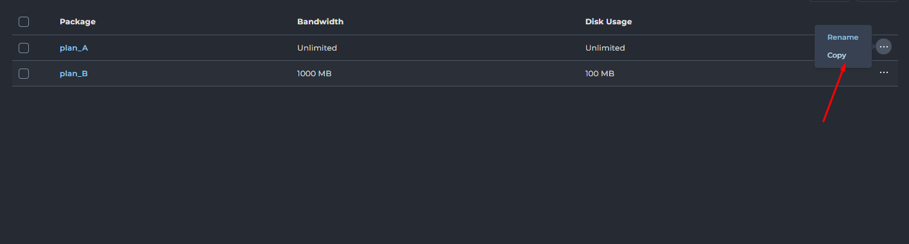
			- 

- Tạo gói dịch vụ mới 
	- Click chọn Add Package
		- 
	- Chi tiết các cấu hình 
		- Giới hạn tài nguyên:
			- 
			- Bandwidth (MB): Giới hạn băng thông (ví dụ: 1000). Có thể chọn "Unlimited".
			- Disk Space (MB): Giới hạn dung lượng đĩa (ví dụ: 100). Có thể chọn "Unlimited".
			- Inode: Giới hạn số lượng tệp/thư mục. Có thể chọn "Unlimited".
			- Các giới hạn số lượng mục khác: Domains, Sub-Domains, E-mail Accounts, E-mail Forwarders, Mailing Lists, Autoresponders, MySQL Databases, Domain Pointers, FTP Accounts, E-mail Daily Limit. Tất cả đều có thể được đặt số cụ thể hoặc "Unlimited".
		- Quyền truy cập tính năng:
			- 
			- Anonymous FTP Accounts: Quyền cho phép các tài khoản FTP Anonymous
			- CGI Access: Quyền sử dụng CGI
			- PHP Access: Quyền thực thi PHP. 
			- SpamAssassin: Kích hoạt bộ lọc thư rác. 
			- Catch-All E-mail: Kích hoạt email Catch-All. 
			- SSL Access: Quyền sử dụng SSL. 
			- SSH Access: Quyền truy cập SSH. 
			- Cron Jobs: Quyền tạo tác vụ định kỳ. 
			- System Info: Quyền xem thông tin hệ thống. 
			- Login Keys: Quyền tạo khóa đăng nhập. 
			- DNS Control: Quyền quản lý DNS. 
			- Suspend at Limit: Tự động tạm ngưng khi đạt giới hạn. 
			- Automatic security.txt (RFC9116): Tự động tạo security.txt. 
			- Jailed: Kích hoạt môi trường "giam giữ" (jailed shell). 
			- Skin: Chọn giao diện bảng điều khiển cho người dùng. 
			- Language: Ngôn ngữ giao diện bảng điều khiển của tài khoản.
		- Bộ tính năng (Feature Sets):
			- 
			- Allow All Commands: Cho phép tất cả các lệnh/tính năng.
			- Allow Selected Features: Chỉ cho phép các tính năng được chọn.
				- Khi chọn Allow Selected Features, một giao diện tùy chọn sẽ xuất hiện, cho phép bạn chọn từ các bộ tính năng hoặc nhóm tính năng được định nghĩa trước:
				- Core Functions: Bao gồm các chức năng cốt lõi và cơ bản nhất để quản lý hosting (ví dụ: quản lý tệp, cơ sở dữ liệu cơ bản, v.v.).
				- DNS Only: Giới hạn tài khoản chỉ có thể quản lý các cài đặt DNS.
				- E-mail only: Giới hạn tài khoản chỉ có thể quản lý các chức năng liên quan đến email (tạo tài khoản email, chuyển tiếp, v.v.).
		- Chính sách Plugin (Plugins Allow/Deny):
			- 
			- Allow All: Cho phép tất cả các plugin.
			- Deny Selected: Từ chối các plugin được chọn.
			- Allow Selected: Chỉ cho phép các plugin được chọn.
			- Khi bạn chọn chính sách Deny Selected hoặc Allow Selected, một khung lựa chọn các plugin sẽ tự động hiển thị bên dưới, cho phép bạn chỉ định cụ thể các plugin cần áp dụng chính sách:
				- Select All: Một hộp kiểm cho phép bạn nhanh chóng chọn hoặc bỏ chọn tất cả các plugin trong danh sách chỉ với một cú nhấp chuột.
				- Search: Một ô tìm kiếm tiện lợi giúp bạn lọc nhanh danh sách các plugin, đặc biệt hữu ích khi hệ thống của bạn có nhiều plugin được cài đặt.
				- Danh sách các Plugin: Dưới đây là danh sách các plugin hiện có trên hệ thống của bạn. Bạn sẽ đánh dấu vào hộp kiểm bên cạnh tên plugin (ví dụ: csf) để chọn hoặc bỏ chọn nó theo chính sách "Deny Selected" hoặc "Allow Selected" mà bạn đã thiết lập.
		- Cấu hình tên cho gói (Package Name): Nhập tên định danh cho gói dịch vụ mới 
			- 
		- Nút chức năng `Save`: Lưu cấu hình tạo gói dịch vụ mới.
#### Move Users between Resellers
- Giao diện "Move Users Between Resellers" cho phép quản trị viên di chuyển các tài khoản người dùng từ một đại lý (reseller) này sang một đại lý khác trong cùng hệ thống DirectAdmin. Chức năng này hữu ích trong các trường hợp tái cấu trúc tài khoản, chuyển nhượng khách hàng giữa các reseller, hoặc khi một reseller ngừng hoạt động.
- Mục đích:
	- Quản lý cấu trúc tài khoản: Cho phép quản trị viên tổ chức lại tài khoản người dùng dưới các reseller khác nhau.
	- Chuyển giao khách hàng: Hỗ trợ việc chuyển giao khách hàng giữa các reseller một cách hiệu quả và an toàn.
	- Đơn giản hóa quy trình: Tự động hóa quá trình di chuyển tài khoản, tránh việc phải tạo lại tài khoản thủ công dưới reseller mới.
- Giao diện tổng quan 
- 
	- Chọn Người Dùng (Select Users):
		- 
		- Phần này hiển thị danh sách tất cả các tài khoản người dùng và tài khoản đại lý (reseller) hiện có trong hệ thống.
		- Select All: Hộp kiểm cho phép bạn chọn tất cả người dùng và reseller trong danh sách.
		- Search: Ô tìm kiếm để lọc nhanh danh sách người dùng/reseller.
		- Danh sách tài khoản:
			- Các mục có định dạng "Reseller: [Tên Reseller]" (ví dụ: Reseller: admin, Reseller: reseller) đại diện cho các tài khoản đại lý (reseller) có trong hệ thống.
			- Các mục có định dạng [Tên Người dùng] (ví dụ: lampk, user1, user, user2) đại diện cho các tài khoản người dùng cuối (client accounts) được quản lý bởi các reseller.
			- Bạn sẽ đánh dấu vào hộp kiểm bên cạnh tên người dùng mà bạn muốn di chuyển.
	- Chọn Đại lý Đích (Select Reseller):
		- 
		- Select: Một menu thả xuống cho phép bạn chọn tài khoản đại lý (reseller) mà bạn muốn chuyển các người dùng đã chọn đến. Danh sách này sẽ bao gồm các tài khoản reseller hiện có trong hệ thống.
	- Thực hiện di chuyển:
		- MOVE USERS: Nút hành động. Sau khi bạn đã chọn người dùng cần di chuyển và đại lý đích, nhấn nút này để thực hiện quá trình chuyển đổi.
- Ví Dụ Thực Hiện: Di Chuyển Người Dùng Giữa Các Đại lý
	- Trong ví dụ này, chúng ta sẽ thực hiện di chuyển tài khoản người dùng user2 hiện đang thuộc quyền quản lý của đại lý reseller sang quyền quản lý của đại lý reseller1.
	- Các bước thực hiện:
		- Bước 1: Chọn người dùng cần di chuyển.
			- Truy cập giao diện "Move Users Between Resellers".
			- Trong phần Select Users, tìm và đánh dấu vào hộp kiểm bên cạnh tên người dùng mà bạn muốn di chuyển.
			- Ví dụ minh họa: Chọn user2 dưới mục Reseller: reseller.
			- 
		- Bước 2: Chọn đại lý đích để chuyển đến.
			- Trong phần Select Reseller ở phía dưới, nhấp vào menu thả xuống.
			- Chọn tên của đại lý mà bạn muốn chuyển người dùng đã chọn sang.
			- Ví dụ minh họa: Chọn reseller1.
			- 
		- Bước 3: Xác nhận di chuyển.
			- Sau khi đã chọn người dùng và đại lý đích, nhấp vào nút MOVE USERS.
			- Ví dụ minh họa: Nút "MOVE USERS" sẽ được kích hoạt.
			- 
		- Bước 4: Kiểm tra kết quả.
			- Sau khi quá trình di chuyển hoàn tất, bạn có thể kiểm tra lại trong giao diện quản lý người dùng (ví dụ: "Users" hoặc "My Users" của reseller đích) để xác nhận rằng tài khoản người dùng đã được chuyển giao thành công.
			- Ví dụ minh họa: Kiểm tra trong danh sách người dùng, user2 giờ đây sẽ xuất hiện dưới quyền quản lý của reseller1.
			- 

#### Edit User Message
- Giao diện "Edit User Message" cho phép quản trị viên hoặc reseller tùy chỉnh nội dung của email chào mừng được gửi tự động đến người dùng mới khi tài khoản của họ được tạo ra trên hệ thống DirectAdmin.
- Mục đích:
	- Cho phép quản trị viên/reseller tùy chỉnh thông điệp chào mừng, cung cấp thông tin cần thiết và hướng dẫn rõ ràng cho người dùng mới ngay sau khi tài khoản của họ được kích hoạt.
	- Đảm bảo tính chuyên nghiệp và đồng nhất trong giao tiếp với khách hàng.
- Tổng quan giao diện 
	- Tiêu đề Email (Subject):
		- Subject: Trường này chứa tiêu đề của email chào mừng.
			- Ví dụ mặc định: `Your account for |DOMAIN| is now ready for use.`
			- Bạn có thể sử dụng các biến (ví dụ `|DOMAIN|`) để tự động điền thông tin cụ thể của người dùng.
	- Nội dung Email (Message):
		- Message: Đây là khu vực nơi bạn có thể soạn thảo nội dung chính của email chào mừng.
		- Nội dung mẫu thường bao gồm lời cảm ơn, thông tin chi tiết tài khoản, và hướng dẫn đăng nhập.
		- Bạn có thể sử dụng các biến (placeholder) để hệ thống tự động điền thông tin tài khoản của người dùng mới:
			- `|USERNAME|`: Tên đăng nhập của người dùng.
			- `|PASSWORD|`: Mật khẩu của người dùng.
			- `|DOMAIN|`: Tên miền chính của tài khoản.
			- `|IP|`: Địa chỉ IP của máy chủ.
			- `|PORT|`: Cổng đăng nhập.
			- `|BANDWIDTH|`: Giới hạn băng thông của gói dịch vụ.
			- `|DISKSPACE|`: Giới hạn dung lượng đĩa của gói dịch vụ.
		- Các biến này giúp cá nhân hóa email cho từng người dùng mà không cần chỉnh sửa thủ công.
	- Các nút hành động:
		- RESET TO DEFAULT: Nút này sẽ khôi phục tiêu đề và nội dung email về trạng thái mặc định ban đầu của hệ thống.
		- SAVE: Nút này để lưu lại các thay đổi bạn đã thực hiện trong tiêu đề và nội dung email.

#### Change Passwords
- Giao diện trong DirectAdmin cho phép người dùng hoặc quản trị viên thay đổi mật khẩu cho một tài khoản cụ thể.
- 
	- "Username" (Tên người dùng): Trường nhập liệu này dùng để nhập tên người dùng của tài khoản mà bạn muốn thay đổi mật khẩu.
	- "Enter Password" (Nhập Mật khẩu): Trường nhập liệu này dùng để nhập mật khẩu mới mà bạn muốn đặt cho tài khoản đã chọn.
		- Bên cạnh trường mật khẩu, có một icon `con mắt` cho phép bạn hiển thị hoặc ẩn mật khẩu đã nhập để dễ dàng kiểm tra.
		- Cũng có một icon `xúc xắc` kích hoạt tính năng tạo mật khẩu ngẫu nhiên.
	- Nút "SUBMIT" (Gửi): Sau khi nhập tên người dùng và mật khẩu mới, nhấp vào nút này để lưu thay đổi và áp dụng mật khẩu mới cho tài khoản.
- Ví dụ đổi password user `user` 
- 
- 
- 

### Reseller Management
- Nhóm các chức năng quản lý reseller - đại lý 	
#### Create Reseller 
- Giao diện này trong DirectAdmin được sử dụng để tạo một tài khoản reseller mới, cho phép họ quản lý và bán các gói hosting của riêng mình cho người dùng cuối.
	- 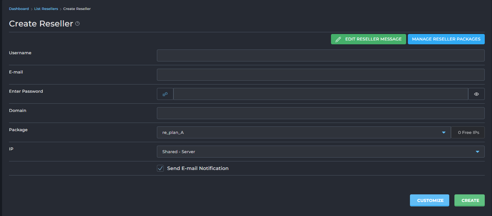
- Các nút chức năng 
	- EDIT RESELLER MESSAGE: Cho phép chỉnh sửa mẫu email chào mừng sẽ gửi cho reseller mới được tạo.
	- 
	- 
		- Tương tự như phần `Edit User Message` có thể cấu hình subject, nội dung mail gửi tới khi tạo tài khoản hoàn tất. 
	- MANAGE RESELLER PACKAGES: Click chuyển tới đến giao diện quản lý các gói reseller hiện có.
	- CUSTOMIZE: Cho phép tùy chỉnh sâu hơn các cài đặt của reseller không sử dụng các plan đã tạo trước khi tạo.
		- Click sẽ mở giao diện cấu hình chi tiết các thông số. Các thông số này sẽ được trình bày chi tiết tại phần tại plan Reseller
		- 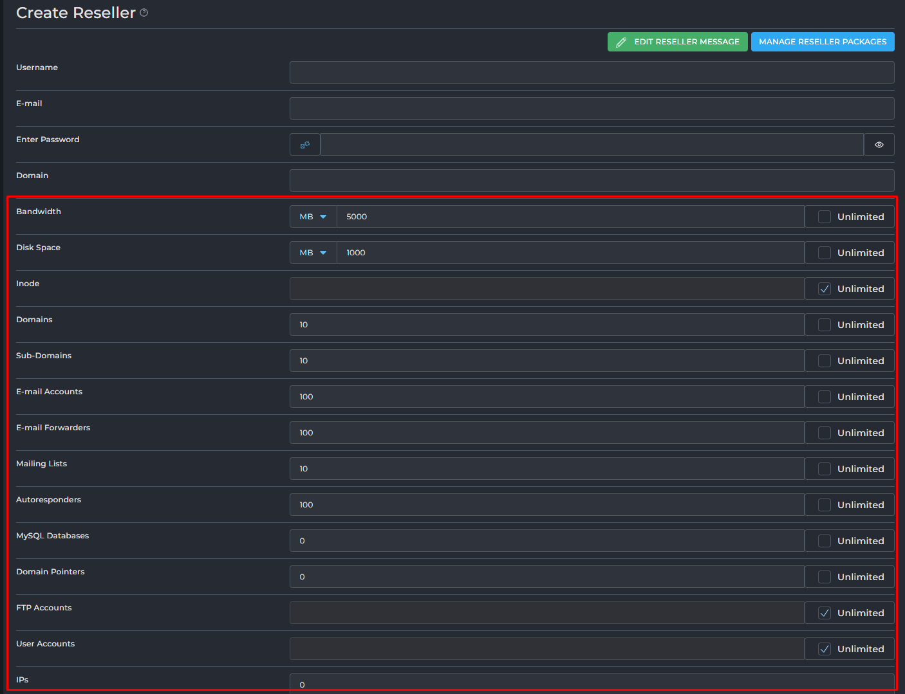
	- CREATE: Dùng để hoàn tất việc tạo tài khoản reseller với các thông tin đã nhập.
- Các trường cấu hình 
	- "Username" (Tên người dùng): Trường nhập liệu để đặt tên đăng nhập cho tài khoản reseller mới.
	- "E-mail" (Email): Trường nhập liệu để nhập địa chỉ email liên hệ cho tài khoản reseller.
	- "Enter Password" (Nhập Mật khẩu): Trường nhập liệu để đặt mật khẩu cho tài khoản reseller mới. Có biểu tượng mắt để hiện/ẩn mật khẩu và một biểu tượng `xúc xắc` tạo mật khẩu ngẫu nhiên. 
	- "Domain" (Tên miền): Trường nhập liệu để đặt tên miền chính cho tài khoản reseller.
	- "Package" (Gói): Menu thả xuống để chọn gói reseller (Reseller Package) sẽ được gán cho tài khoản này . Bên cạnh đó hiển thị số lượng IP miễn phí còn lại.
	- "IP": Menu thả xuống để chọn loại IP sẽ được gán cho reseller.
		- Shared - Server (IP Chia sẻ - Máy chủ): Reseller và các tài khoản người dùng của họ sẽ sử dụng địa chỉ IP chính của máy chủ. Đây là IP được chia sẻ với nhiều tài khoản khác trên cùng server.
		- Shared - Reseller IP (IP Chia sẻ - IP của Reseller): Nếu reseller có IP riêng được gán, tùy chọn này cho phép các tài khoản người dùng của họ chia sẻ IP đó của reseller, thay vì IP chính của máy chủ.
		- Assigned (IP Đã được gán): Gán một địa chỉ IP riêng biệt, độc lập trực tiếp cho reseller đó. Thường dùng khi reseller cần IP riêng cho mục đích đặc biệt (ví dụ: SSL riêng).
	- "Send E-mail Notification" (Gửi Thông báo Email): Tuỳ chọn khi được bật sẽ tự động gửi email thông báo tạo tài khoản reseller đến địa chỉ email đã cung cấp.

- Ví dụ: Tạo reseller sử dụng gói được thiết lập sẵn
	- Bước 1: Truy cập Giao diện Tạo Reseller
		- Đăng nhập vào bảng điều khiển DirectAdmin của bạn với quyền quản trị viên (Admin).
		- Tìm và nhấp vào mục "Create Reseller" (Tạo Reseller) trong menu điều hướng.
	- Bước 2: Nhập Thông tin Tài khoản Reseller
		- Trong giao diện "Create Reseller", bạn sẽ điền các thông tin cơ bản cho reseller mới:
		- Username (Tên người dùng): Nhập một tên đăng nhập duy nhất cho reseller này (ví dụ: `reseller3`).
		- E-mail (Email): Nhập địa chỉ email liên hệ của reseller (ví dụ: `reseller@example.com`).
		- Enter Password (Nhập Mật khẩu): Đặt mật khẩu an toàn cho tài khoản reseller. Bạn có thể nhập thủ công hoặc sử dụng công cụ tạo mật khẩu ngẫu nhiên nếu có.
		- Domain (Tên miền): Nhập tên miền chính cho tài khoản reseller (ví dụ: `resellerdomain.com`).
	- Bước 3: Gán Gói Reseller Có Sẵn
		- Tại phần "Package" trong cùng giao diện "Create Reseller":
		- Package (Gói): Sử dụng menu thả xuống để chọn một gói reseller đã được định nghĩa sẵn trong hệ thống của bạn (ví dụ: `re_plan_full`).
	- Bước 4: Cấu hình IP và Thông báo (Tùy chọn)
		- IP: Chọn loại IP mà reseller này sẽ sử dụng. Tùy chọn phổ biến là "Shared - Server" (IP chia sẻ của máy chủ).
		- Send E-mail Notification (Gửi Thông báo Email): Đánh dấu vào ô kiểm này nếu bạn muốn hệ thống tự động gửi email chào mừng với thông tin tài khoản đến địa chỉ email của reseller.
	- 
	- Bước 5: Hoàn tất Tạo Reseller
		- Nhấp vào nút "CREATE" ở cuối trang để tạo tài khoản reseller với các cài đặt đã chọn.
		- 	
		- Sau khi nhấn "CREATE", tài khoản reseller sẽ được thiết lập với gói dịch vụ đã chọn, và họ có thể đăng nhập để bắt đầu quản lý các tài khoản người dùng của riêng họ.
		- 	
		- 	
		
- Ví dụ: Tạo reseller customize 
	- Bước 1: Truy cập Giao diện Tạo Reseller
		- Đăng nhập vào bảng điều khiển DirectAdmin của bạn với quyền quản trị viên (Admin).
		- Tìm và nhấp vào mục "Create Reseller" (Tạo Reseller) trong menu điều hướng.
	- Bước 2: Nhập Thông tin Cơ bản của Tài khoản Reseller
		- Trong giao diện "Create Reseller", bạn sẽ điền các thông tin bắt buộc cho reseller mới:
		- Username (Tên người dùng): Nhập một tên đăng nhập duy nhất cho reseller này (ví dụ: reseller4).
		- E-mail (Email): Nhập địa chỉ email liên hệ của reseller (ví dụ: reseller4@example.com).
		- Enter Password (Nhập Mật khẩu): Đặt mật khẩu an toàn cho tài khoản reseller.
		- Domain (Tên miền): Nhập tên miền chính cho tài khoản reseller (ví dụ: reseller4.com).
		- IP: Chọn loại IP sẽ được gán cho reseller (ví dụ: "Shared - Server").
		- Send E-mail Notification (Gửi Thông báo Email): Đánh dấu vào ô kiểm này nếu bạn muốn gửi email chào mừng tự động.
		- 	
	- Bước 3: Bỏ qua lựa chọn gói và Chọn "CUSTOMIZE"
		- Tại phần "Package", bạn có thể thấy một gói mặc định được chọn (ví dụ: re_plan_A). Không cần thay đổi lựa chọn này, vì chúng ta sẽ ghi đè lên nó bằng các cài đặt tùy chỉnh.
		- Nhấp vào nút "CUSTOMIZE" ở cuối giao diện (bên cạnh nút "CREATE").
		- 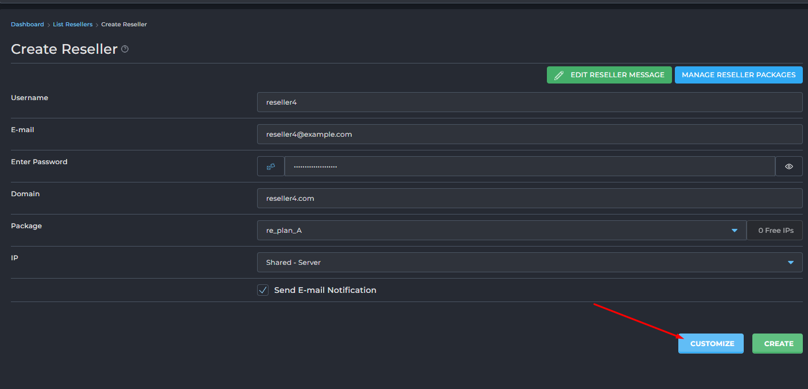	
	- Bước 4: Tùy chỉnh Cài đặt Gói (Giao diện mới xuất hiện)
		- Giao diện xuất hiện sau khi nhấn "CUSTOMIZE" cho phép bạn thiết lập mọi khía cạnh của gói reseller:
		- Giới hạn Tài nguyên:
			- Bandwidth (Băng thông): Đặt giới hạn băng thông tối đa (ví dụ: 5000 MB), hoặc chọn "Unlimited" nếu không giới hạn.
			- Disk Space (Dung lượng đĩa): Đặt giới hạn dung lượng lưu trữ tối đa (ví dụ: 1000 MB), hoặc "Unlimited".
			- Inode: Đặt giới hạn về số lượng tệp và thư mục (thường là "Unlimited" hoặc một số lượng lớn).
			- Domains (Số tên miền): Đặt số lượng tên miền tối đa mà reseller này có thể thêm (ví dụ: 10 tên miền).
			- Sub-Domains (Số tên miền con): Đặt số lượng tên miền con tối đa mà reseller có thể tạo (ví dụ: 10 tên miền con).
			- E-mail Accounts (Tài khoản Email): Đặt số lượng tài khoản email tối đa (ví dụ: 100 tài khoản).
			- E-mail Forwarders (Chuyển tiếp Email): Đặt số lượng bộ chuyển tiếp email tối đa (ví dụ: 100).
			- Mailing Lists (Danh sách gửi thư): Đặt số lượng danh sách gửi thư tối đa (ví dụ: 10).
			- Autoresponders (Trả lời tự động): Đặt số lượng bộ trả lời tự động tối đa (ví dụ: 100).
			- MySQL Databases (Cơ sở dữ liệu MySQL): Đặt số lượng cơ sở dữ liệu tối đa (ví dụ: 20).
			- Domain Pointers (Con trỏ tên miền): Đặt số lượng con trỏ tên miền tối đa (ví dụ: 20).
			- FTP Accounts (Tài khoản FTP): Đặt số lượng tài khoản FTP tối đa (ví dụ: 20).
			- User Accounts (Tài khoản người dùng): Đặt số lượng tài khoản người dùng reseler được tạo (ví dụ: 200)
			- IPs: Cấu hình số lượng IP reseller sở hữu (ví dụ: 0) 
			- 	
		- Quyền truy cập Tính năng:
			- Anonymous FTP Accounts (Tài khoản FTP ẩn danh): Chọn ô kiểm để kích hoạt tính năng này.
			- CGI Access (Truy cập CGI): Chọn ô kiểm để cho phép thực thi các tập lệnh CGI.
			- PHP Access (Truy cập PHP): Chọn ô kiểm để cho phép thực thi các tập lệnh PHP.
			- SpamAssassin: Chọn ô kiểm để kích hoạt tính năng lọc spam SpamAssassin.
			- Catch-All E-mail (Email bắt tất cả): Chọn ô kiểm để cho phép thiết lập địa chỉ email bắt tất cả.
			- SSL Access (Truy cập SSL): Chọn ô kiểm để cho phép sử dụng chứng chỉ SSL.
			- SSH Access (Truy cập SSH): Chọn ô kiểm để cấp quyền truy cập SSH Shell.
			- SSH Access for Users: (Truy cập SSH cho người dùng): Chọn ô kiểm để cấp quyền truy cập SSH Shell cho người dùng cuối.
			- Allow Overselling: (Cho phép bán quá tài nguyên được cấp): Chọn ô kiểm để cấp quyền 
			- Cron Jobs: Chọn ô kiểm để cho phép tạo và quản lý các tác vụ định kỳ (cron jobs).
			- System Info (Thông tin hệ thống): Chọn ô kiểm để cho phép xem thông tin hệ thống.
			- Login Keys (Khóa đăng nhập): Chọn ô kiểm để cho phép quản lý khóa đăng nhập.
			- DNS Control (Kiểm soát DNS): Chọn ô kiểm để cho phép quản lý các bản ghi DNS.
			- Personal DNS's: Cấu hình số lượng địa chỉ IP gán cho reseller sử dụng cho NS và Domain. 
				- `None` (Không có): 
					- Reseller sẽ không có Nameservers riêng. Họ sẽ phải sử dụng Nameservers của nhà cung cấp dịch vụ hoặc Nameservers mặc định của hệ thống.
					- Thích hợp cho reseller nhỏ, không muốn quản lý IP hoặc khi nhà cung cấp muốn hạn chế số lượng IP cấp cho reseller.
				- `Uses 2 IPs, domain uses one of them` (Sử dụng 2 IP, tên miền sử dụng một trong số đó):
					- Hệ thống sẽ cấp 2 địa chỉ IP riêng biệt cho reseller. Reseller có thể tạo Nameservers cá nhân (ví dụ: `ns1.yourresellerdomain.com` trỏ đến IP1, `ns2.yourresellerdomain.com` trỏ đến IP2). Đồng thời, tên miền chính của reseller (`yourresellerdomain.com`) sẽ được gán cho 1 trong 2 IP này.
					- Cung cấp tính chuyên nghiệp và dự phòng (DNS redundancy) cho reseller. Đây là lựa chọn phổ biến.
				- `Uses 3 IPs, domain gets own IP` (Sử dụng 3 IP, tên miền có IP riêng):
					- Hệ thống cấp 3 địa chỉ IP riêng biệt. Reseller có thể tạo 3 Nameservers (ví dụ: `ns1`, `ns2`, `ns3` trỏ đến 3 IP khác nhau). Đặc biệt, tên miền chính của reseller (`yourresellerdomain.com`) sẽ được gán một địa chỉ IP thứ 4 riêng biệt, không trùng với 3 IP của Nameservers.
					- Cung cấp mức độ tách biệt và dự phòng cao nhất, thường dành cho các reseller lớn, đòi hỏi tối ưu hiệu suất và độ tin cậy cho cả Nameservers và website chính của reseller.
			- Share Server IP : Tuỳ chọn `Allow Reseller to create sites with server IP` cho phép reseller tạo website với địa chỉ IP máy chủ. 
			- 	
	- Bước 5: Hoàn tất Tạo Reseller với Cài đặt Tùy chỉnh
		- Sau khi đã cấu hình tất cả các cài đặt tùy chỉnh, hãy cuộn xuống cuối trang và nhấp vào nút "SAVE" (hoặc "CREATE" tùy theo giao diện cụ thể sau khi customize) để tạo tài khoản reseller với các thiết lập riêng này.
			- 	
			- 	
			- 	
		
#### List Resellers 
- Quản lý danh sách các tài khoản người bán lại (Reseller)
- 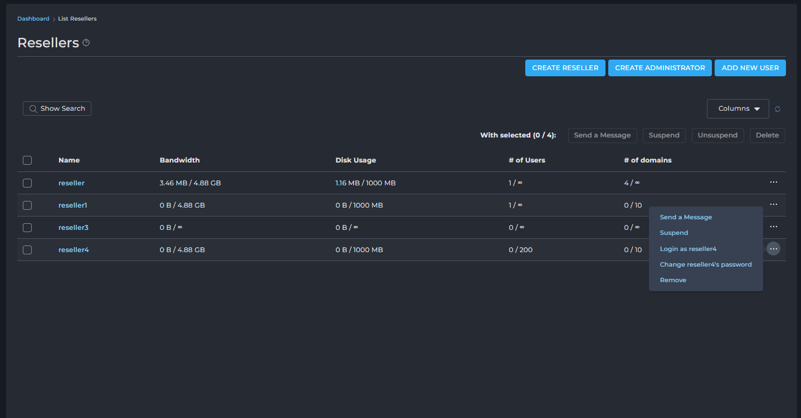	
- Các nút chức năng :
	- CREATE RESELLER: Click chuyển tới giao diện tạo một tài khoản reseller mới.
	- CREATE ADMINISTRATOR: Click chuyển tới giao diện tạo tài khoản quản trị viên mới.
	- ADD NEW USER: Click chuyển tới giao diện thêm một tài khoản người dùng cuối (customer) mới.
	- Send a Message: Gửi tin nhắn cho reseller đã chọn.
		- 
		- 	
		-	 Cấu hình tiêu đề, nội dung tin nhắn, tuỳ chọn chỉ gửi email. 
	- Suspend: Tạm đình chỉ tài khoản reseller đã chọn (ngừng hoạt động).
		- 	
		- 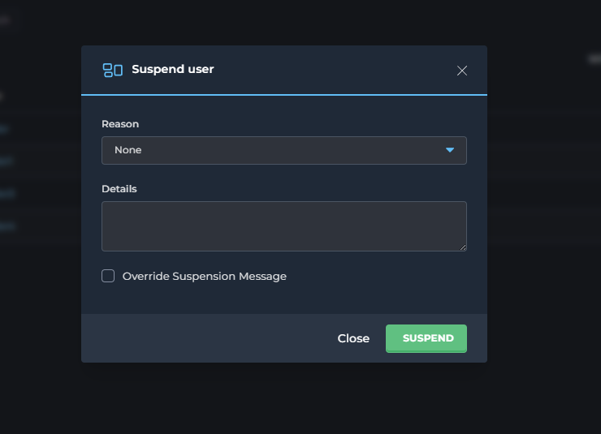	
	- Cấu hình lý do, thông tin chi tiết.
		- Unsuspend: Khôi phục tài khoản reseller đã đình chỉ.
		- 	
	- Delete: Xóa vĩnh viễn tài khoản reseller đã chọn.
		- 	
		- 	
- Bảng danh sách Resellers:
	- Bảng này hiển thị thông tin chi tiết về từng tài khoản người bán lại hiện có:
	- Name (Tên): Tên đăng nhập hoặc tên hiển thị của tài khoản reseller.
	- Click để mở giao diện thông tin chi tiết reseller
	- Bandwidth (Băng thông): Lượng băng thông đã sử dụng trên tổng số băng thông được cấp phát cho reseller đó.
	- Disk Usage (Dung lượng đĩa): Lượng dung lượng lưu trữ đã sử dụng trên tổng số dung lượng được cấp phát cho reseller đó.
	- `# of Users` (Số lượng Người dùng): Số lượng tài khoản người dùng cuối (khách hàng) mà reseller đó đang quản lý trên tổng số lượng người dùng tối đa được phép.
	- `# of domains` (Số lượng tên miền): Số lượng tên miền (website) mà reseller đó đang quản lý trên tổng số lượng tên miền tối đa được phép.
	- ... (biểu tượng ba chấm): Nút tùy chọn cho phép thực hiện các hành động cụ thể cho từng reseller
		- Send a Message: Gửi tin nhắn riêng cho [username].
		- Suspend: Tạm đình chỉ tài khoản [username].
		- Login as [username]: Đăng nhập vào tài khoản của [username] với tư cách quản trị viên (rất hữu ích để hỗ trợ hoặc kiểm tra).
		- Change [username]'s password: Thay đổi mật khẩu của tài khoản [username].
		- Remove: Xóa vĩnh viễn tài khoản [username].

- Giao diện thông tin, cấu hình chi tiết reseller 
	- 	
	- Giao diện "View Reseller: [username]" cung cấp cái nhìn tổng quan và các tùy chọn quản lý chi tiết cho một tài khoản reseller cụ thể.
	- Thông tin chung và tác vụ chính:
		- 
		- Change Password: Nút để thay đổi mật khẩu của reseller này.
			- Click để đổi mật khẩu, có thể tạo ngẫu nhiên bằng click chọn icon `Xúc xắc` hoặc xem mật khẩu bằng icon `con mắt`.
			- Click `Save` để thay đổi. 
			- 
		- Các nút chức năng:
			- LOGIN AS [USERNAME]: Đăng nhập vào tài khoản của reseller (dành cho quản trị viên hỗ trợ).
			- DELETE: Xóa vĩnh viễn tài khoản reseller này.
	- Các tab thông tin chi tiết:
		- Giao diện được tổ chức thành các tab để hiển thị các loại thông tin khác nhau:
			- Users : Hiển thị danh sách các tài khoản reseller quản lý bởi reseller này cùng với thông tin chi tiết về từng tài khoản.
			- Usage Statistics: Thống kê chi tiết việc sử dụng tài nguyên của reseller.
			- Info: Thông tin chi tiết về tài khoản reseller.
			- Comments: Ghi chú hoặc bình luận về tài khoản.
			- Modify: Tab để chỉnh sửa các cài đặt của reseller
		- Users : Hiển thị danh sách các tài khoản reseller quản lý bởi reseller.
			- 
			- Username: Tên người dùng 
			- Bandwidth: Băng thông đã sử dụng của user.
			- Disk Usage: Dung lượng đĩa đã sử dụng của user.
			- `# of domains`: Số lượng tên miền mà user đó đang quản lý trên tổng số lượng tên miền tối đa được phép.

		- Usage Statistics: Chi tiết về việc sử dụng tài nguyên hiện tại của một tài khoản reseller và các giới hạn tài nguyên đã được thiết lập cho tài khoản đó
			- Bandwidth (Băng thông):
				- Usage: Băng thông chính reseller đã dùng.
				- Allocated: Tổng băng thông mà reseller này được phép phân bổ cho tất cả các gói hosting của khách hàng mà họ tạo ra.
				- Limit: Tổng băng thông mà reseller này được phép sử dụng cho chính tài khoản reseller của họ và cộng dồn từ tất cả các khách hàng của họ. 
				- Dòng "Additional Bandwidth" thể hiện băng thông được cấp thêm. 
					- Click chọn icon `Edit` để chỉnh sửa tăng thêm băng thông tạm thời 
					- 
					- Cấu hình thông số cần thêm: theo MB/GB/TB. Click chọn Increase Bandwidth để xác nhận 
					- 
					- Ví dụ cấu hình thêm 1 GB bandwidth 
					- 
			- Disk Usage (Dung lượng đĩa):
				- Usage: Dung lượng đĩa chính reseller đã dùng.
				- Allocated: Tổng dung lượng đĩa mà reseller này được phép phân bổ cho tất cả các gói hosting của khách hàng mà họ tạo ra.
				- Limit: Tổng dung lượng đĩa mà reseller này được phép sử dụng cho chính tài khoản reseller của họ và cộng dồn từ tất cả các khách hàng của họ.
			- Inode:
				- Usage: Số lượng file/folder chính reseller đang có.
				- Allocated (Unlimited): Reseller có thể cấp phát không giới hạn số lượng inode cho các gói khách hàng.
				- Limit (Unlimited): Tài khoản reseller và tất cả khách hàng dưới quyền không bị giới hạn về tổng số inode.
			- `# of Domains` (Số lượng tên miền):
				- Usage: Số lượng tên miền chính reseller đang host.
				- Allocated (Unlimited): Reseller có thể cấp phát không giới hạn số lượng tên miền cho các gói khách hàng.
				- Limit (Unlimited): Reseller và các khách hàng dưới quyền không bị giới hạn về tổng số tên miền.
			- `# of Subdomains` (Số lượng tên miền phụ): Tương tự như tên miền chính, không giới hạn.
			- E-mail Accounts (Tài khoản Email): Tương tự, không giới hạn số lượng tài khoản email mà reseller có thể tạo cho khách hàng của mình.
			- E-mail Forwarders (Chuyển tiếp Email): Không giới hạn.
			- Mailing Lists (Danh sách gửi thư): Không giới hạn.
			- Autoresponders (Tự động trả lời Email): Không giới hạn.
			- `# of DBs` (Số lượng Cơ sở dữ liệu): Không giới hạn số lượng cơ sở dữ liệu mà reseller có thể tạo cho khách hàng.
			- Domain Pointers (Trỏ tên miền): Không giới hạn.
			- FTP Accounts (Tài khoản FTP): Không giới hạn số lượng tài khoản FTP mà reseller có thể tạo cho khách hàng.
			- User Accounts (Tài khoản Người dùng):
				- Usage: Số lượng tài khoản người dùng (khách hàng) reseller đã tạo.
				- Allocated (Unlimited): Reseller có thể tạo không giới hạn số lượng tài khoản người dùng cuối.
				- Limit (Unlimited): Không có giới hạn tổng số tài khoản người dùng mà reseller có thể quản lý.
		- Info: Hiển thị các tính năng và giới hạn được áp dụng cho reseller
			- 
			- Các thông số chính:
				- `# of IPs`: Số lượng địa chỉ IP được cấp.
				- Nameserver 1 & 2: Các Nameserver Reseller đang sử dụng làm máy chủ tên miền.
				- Package: Gói hiện tại là "custom" (tùy chỉnh), dựa trên gói gốc "Test".		
			- Các tính năng:
				- Enabled (Bật):
					- SSH: Cho phép truy cập dòng lệnh vào server.
					- SSL: Cho phép cài đặt chứng chỉ bảo mật HTTPS.
					- CGI: Cho phép chạy script CGI.
					- PHP: Cho phép sử dụng ngôn ngữ lập trình PHP.
					- SpamAssassin: Bật bộ lọc thư rác.
					- Cron Jobs: Cho phép tạo tác vụ tự động.
					- System Info: Cho phép xem thông tin hệ thống.
					- Login Keys: Bật tính năng khóa đăng nhập.
					- DNS Control: Cho phép quản lý bản ghi DNS.
					- Oversell: Cho phép reseller bán quá mức tài nguyên 
					- Can use Server IP: Cho phép sử dụng IP chung của máy chủ.
				- Disabled (Tắt):
					- User SSH: Người dùng con (của reseller) không được phép dùng SSH.
					- GIT: Tính năng cài đặt/hỗ trợ GIT tự động bị tắt.
					- WordPress: Tính năng cài đặt/hỗ trợ WordPress tự động bị tắt.
					- ClamAV: Phần mềm quét virus ClamAV bị tắt.
					- Nginx Unit: Nền tảng ứng dụng Nginx Unit bị tắt.
					- Catch-All E-mail: Tính năng nhận tất cả email không xác định bị tắt.
					- Anonymous FTP: FTP ẩn danh bị tắt.
		- Comments: Ghi chú hoặc bình luận về tài khoản.
			- 
		- Modify: Chỉnh sửa thông tin hoặc cấu hình của tài khoản reseller
			- 
			- 
			- Thay đổi Gói Dịch Vụ (Change Package for Reseller):
				- Set Package to: Một menu thả xuống cho phép chọn một gói dịch vụ (Package) khác cho tài khoản này.
				- Save: Nút để áp dụng thay đổi gói dịch vụ.
			- Thay đổi Cài đặt Thủ công (Manually Change Settings):
				- Phần này cung cấp các tùy chọn để ghi đè các cài đặt từ gói dịch vụ (Package) đã chọn, cho phép tùy chỉnh riêng biệt cho tài khoản này.
				- Giới hạn tài nguyên:
					- Bandwidth (MB): Giới hạn băng thông (ví dụ: 1000). Có thể chọn "Unlimited".
					- Disk Space (MB): Giới hạn dung lượng đĩa (ví dụ: 100). Có thể chọn "Unlimited".
					- Inode: Giới hạn số lượng tệp/thư mục. Có thể chọn "Unlimited".
					- Các giới hạn số lượng mục khác: Domains, Sub-Domains, E-mail Accounts, E-mail Forwarders, Mailing Lists, Autoresponders, MySQL Databases, Domain Pointers, FTP Accounts, User Accounts. Tất cả đều có thể được đặt số cụ thể hoặc "Unlimited".
				- Quyền truy cập tính năng:
					- Anonymous FTP Accounts: Quyền cho phép các tài khoản FTP Anonymous
					- CGI Access: Quyền sử dụng CGI
					- PHP Access: Quyền thực thi PHP. 
					- SpamAssassin: Kích hoạt bộ lọc thư rác. 
					- Catch-All E-mail: Kích hoạt email Catch-All. 
					- SSL Access: Quyền sử dụng SSL. 
					- SSH Access: Quyền truy cập SSH. 
					- SSH Access for Users: Quyền truy cập SSH của người dùng cuối. 
					- Allow Overselling: Cho phép reseller bán quá mức tài nguyên được cấp. 
					- Cron Jobs: Quyền tạo tác vụ định kỳ. 
					- System Info: Quyền xem thông tin hệ thống. 
					- Login Keys: Quyền tạo khóa đăng nhập. 
					- DNS Control: Quyền quản lý DNS. 

#### Manage Reseller Packages
- Giao diện "Manage Reseller Packages" cho phép bạn tạo, chỉnh sửa, import và quản lý các gói dịch vụ mà bạn cung cấp cho các tài khoản reseller của mình. Mỗi gói định nghĩa các giới hạn tài nguyên và tính năng mà một tài khoản reseller sẽ nhận được khi được gán gói đó.
- 
- Các nút chức năng 
	- 
	- CREATE PACKAGE: Nút để tạo một gói dịch vụ mới.
		- Chi tiết các thông số cấu hình trình bày bên dưới.
	- IMPORT PACKAGES: Nút để nhập các gói dịch vụ.
		- Click chọn để import 
		- 
		- Paste nội dung gói đã export và click Import
		- 
		- Import thành công 
		- 
	- Delete: Xóa các gói dịch vụ đã chọn.
		- 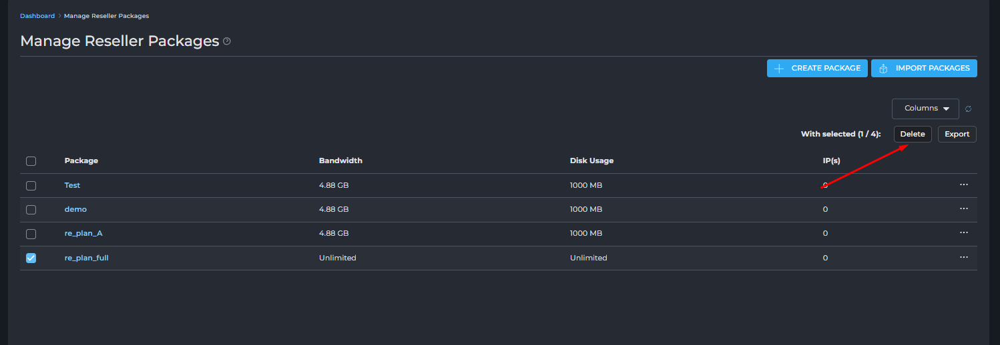
		- 
	- Export: Xuất cấu hình của các gói dịch vụ đã chọn.
		- 
		- 
- Danh sách Gói dịch vụ: Bảng này hiển thị tất cả các gói dịch vụ đã được tạo trong hệ thống của bạn, với các thông tin cơ bản:
	- 
	- Package: Tên của gói dịch vụ . Đây là tên mà bạn sẽ thấy khi gán gói cho reseller mới hoặc thay đổi gói của reseller hiện tại.
		- Click tên gói để mở giao diện chỉnh sửa gói. 
			- 
	- Bandwidth: Giới hạn băng thông (dữ liệu truyền tải) được cấp cho các tài khoản sử dụng gói này. 
	- Disk Usage: Giới hạn dung lượng ổ đĩa được cấp cho các tài khoản sử dụng gói này.
	- IP(s): Số lượng địa chỉ IP được cấp. 
	- ... (biểu tượng ba chấm): Nút tùy chọn cho phép thực hiện các hành động cụ thể cho từng gói.
		- Rename: Đổi tên gói. 
			- 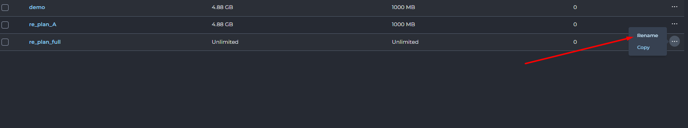
			- 
		- Copy: Sao chép gói. 
			- 
			- 

- Tạo gói dịch vụ mới 
	- Click chọn Create Package
		- 
	- Chi tiết các cấu hình 
		- Giới hạn tài nguyên:
			- 
			- Bandwidth (MB): Giới hạn băng thông (ví dụ: 5000). Có thể chọn "Unlimited".
			- Disk Space (MB): Giới hạn dung lượng đĩa (ví dụ: 1000). Có thể chọn "Unlimited".
			- Inode: Giới hạn số lượng tệp/thư mục. Có thể chọn "Unlimited".
			- IP: Cấu hình số lượng IP được gán cho gói.
			- Các giới hạn số lượng mục khác: Domains, Sub-Domains, E-mail Accounts, E-mail Forwarders, Mailing Lists, Autoresponders, MySQL Databases, Domain Pointers, FTP Accounts, User Accounts. Tất cả đều có thể được đặt số cụ thể hoặc "Unlimited".
		- Quyền truy cập tính năng:
			- 
			- Anonymous FTP Accounts: Quyền cho phép các tài khoản FTP Anonymous
			- CGI Access: Quyền sử dụng CGI
			- PHP Access: Quyền thực thi PHP. 
			- SpamAssassin: Kích hoạt bộ lọc thư rác. 
			- Catch-All E-mail: Kích hoạt email Catch-All. 
			- SSL Access: Quyền sử dụng SSL. 
			- SSH Access: Quyền truy cập SSH. 
			- SSH Access for Users: Quyền truy cập SSH của người dùng cuối. 
			- Allow Overselling: Cho phép reseller bán quá mức tài nguyên được cấp. 
			- Cron Jobs: Quyền tạo tác vụ định kỳ. 
			- System Info: Quyền xem thông tin hệ thống. 
			- Login Keys: Quyền tạo khóa đăng nhập. 
			- DNS Control: Quyền quản lý DNS. 
		- 
		- Personal DNS's: Cấu hình số lượng địa chỉ IP gán cho reseller sử dụng cho NS và Domain. 
			- `None` (Không có): 
				- Reseller sẽ không có Nameservers riêng. Họ sẽ phải sử dụng Nameservers của nhà cung cấp dịch vụ hoặc Nameservers mặc định của hệ thống.
				- Thích hợp cho reseller nhỏ, không muốn quản lý IP hoặc khi nhà cung cấp muốn hạn chế số lượng IP cấp cho reseller.
			- `Uses 2 IPs, domain uses one of them` (Sử dụng 2 IP, tên miền sử dụng một trong số đó):
				- Hệ thống sẽ cấp 2 địa chỉ IP riêng biệt cho reseller. Reseller có thể tạo Nameservers cá nhân (ví dụ: `ns1.yourresellerdomain.com` trỏ đến IP1, `ns2.yourresellerdomain.com` trỏ đến IP2). Đồng thời, tên miền chính của reseller (`yourresellerdomain.com`) sẽ được gán cho 1 trong 2 IP này.
				- Cung cấp tính chuyên nghiệp và dự phòng (DNS redundancy) cho reseller. Đây là lựa chọn phổ biến.
			- `Uses 3 IPs, domain gets own IP` (Sử dụng 3 IP, tên miền có IP riêng):
				- Hệ thống cấp 3 địa chỉ IP riêng biệt. Reseller có thể tạo 3 Nameservers (ví dụ: `ns1`, `ns2`, `ns3` trỏ đến 3 IP khác nhau). Đặc biệt, tên miền chính của reseller (`yourresellerdomain.com`) sẽ được gán một địa chỉ IP thứ 4 riêng biệt, không trùng với 3 IP của Nameservers.
				- Cung cấp mức độ tách biệt và dự phòng cao nhất, thường dành cho các reseller lớn, đòi hỏi tối ưu hiệu suất và độ tin cậy cho cả Nameservers và website chính của reseller.
		- Share Server IP : Tuỳ chọn `Allow Reseller to create sites with server IP` cho phép reseller tạo website với địa chỉ IP máy chủ. 
		- Cấu hình tên cho gói (Package Name): Nhập tên định danh cho gói dịch vụ mới 
	- Nút chức năng `Save`: Lưu cấu hình tạo gói dịch vụ mới.
### Administrator Management
- Nhóm các chức năng quản lý quản trị viên 
#### Create Administrator 
- Giao diện khởi tạo tài khoản quản trị mới. 
- 
- Nút chức năng 
	- `Edit Admin Message` 
		- Cho phép chỉnh sửa mẫu email chào mừng sẽ gửi cho reseller mới được tạo.
		- 
		- 
			- Tương tự như phần `Edit User Message` có thể cấu hình subject, nội dung mail gửi tới khi tạo tài khoản hoàn tất. 
	- `Create`: Tạo tài khoản mới. 
- Các thông số cấu hình 
	- Username: Tài khoản đăng nhập DA 
	- E-mail: Địa chỉ email của người dùng.
	- Password: Mật khẩu đăng nhập có thể tạo ngẫu nhiên bằng click chọn icon `Xúc xắc` hoặc xem mật khẩu bằng icon `con mắt` 
	- Tuỳ chọn Send E-mail Notification: Đánh dấu chọn để gửi email thông báo cho người dùng mới.
		- Có thể chỉnh sửa cấu trúc email tại nút `Edit Admin Message`.
- Ví dụ:
	- Giả sử bạn muốn tạo một tài khoản Admin với thông tin sau:
		- Username: adminnew
		- E-mail: admin.new@example.com
		- Password: <random>
		- Bạn không muốn gửi thông báo email về tài khoản này.
	- Các bước thực hiện trên giao diện:
		- Username: Nhập adminnew vào ô nhập liệu.
		- E-mail: Nhập admin.new@example.com vào ô nhập liệu.
		- Enter Password: Nhấp vào biểu tượng `xúc xắc` để tạo mật khẩu ngẫu nhiên. Nhấp biểu tượng con mắt để hiển thị mật khẩu.
		- Send E-mail Notification: Bỏ chọn ô này (vì bạn không muốn gửi thông báo email).
		- Nhấp vào nút CREATE ở góc dưới bên phải để hoàn tất việc tạo tài khoản Admin.
		- 
	- Khởi tạo thành công
		- 
		- 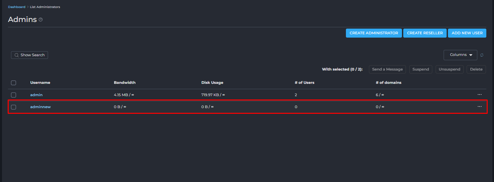
		
#### List Administrators 
- Quản lý danh sách các tài khoản quản trị. 
- 	
- Các nút chức năng :
	- CREATE ADMINISTRATOR: Click chuyển tới giao diện tạo tài khoản quản trị viên mới.
	- CREATE RESELLER: Click chuyển tới giao diện tạo một tài khoản reseller mới.
	- ADD NEW USER: Click chuyển tới giao diện thêm một tài khoản người dùng cuối (customer) mới.
	- Send a Message: Gửi tin nhắn cho admin đã chọn.
		- 
		- 	
			- Cấu hình tiêu đề, nội dung tin nhắn, tuỳ chọn chỉ gửi email. 
	- Suspend: Tạm đình chỉ tài khoản admin đã chọn (ngừng hoạt động).
		- 	
		- 	
			- Cấu hình lý do, thông tin chi tiết.
	- Unsuspend: Khôi phục tài khoản admin đã đình chỉ.
		- 	
	- Delete: Xóa vĩnh viễn tài khoản admin đã chọn.
		- 	
		- 	
- Bảng danh sách Admin:
	- Bảng này hiển thị thông tin chi tiết về từng tài khoản quản trị hiện có:
	- Name (Tên): Tên đăng nhập hoặc tên hiển thị của tài khoản admin.
		- Click để mở giao diện thông tin chi tiết admin với 2 vai trò Reseller, User.
	- Bandwidth (Băng thông): Lượng băng thông đã sử dụng trên tổng số băng thông được cấp phát cho admin đó.
	- Disk Usage (Dung lượng đĩa): Lượng dung lượng lưu trữ đã sử dụng trên tổng số dung lượng được cấp phát cho admin đó.
	- `# of Users` (Số lượng Người dùng): Số lượng tài khoản người dùng cuối (khách hàng) mà admin đó đang quản lý trên tổng số lượng người dùng tối đa được phép.
	- `# of domains` (Số lượng tên miền): Số lượng tên miền (website) mà admin đó đang quản lý trên tổng số lượng tên miền tối đa được phép.
	- ... (biểu tượng ba chấm): Nút tùy chọn cho phép thực hiện các hành động cụ thể cho từng admin
		- Send a Message: Gửi tin nhắn riêng cho [username].
		- Suspend: Tạm đình chỉ tài khoản [username].
		- Login as [username]: Đăng nhập vào tài khoản của [username] 
		- Change [username]'s password: Thay đổi mật khẩu của tài khoản [username].
		- Remove: Xóa vĩnh viễn tài khoản [username].
		

		
#### Suspension Message
- Tùy chỉnh nội dung email thông báo sẽ được gửi tự động khi một tài khoản (User, Reseller hoặc Admin) bị đình chỉ.
- 
- Các tùy chọn cấu hình:
	- User Level (Cấp độ người dùng):
		- 
		- Bạn có thể chọn loại tài khoản nào mà tin nhắn này sẽ áp dụng. Các tùy chọn thường bao gồm:
			- User: Tin nhắn này sẽ được gửi khi một tài khoản người dùng cuối (customer) bị đình chỉ.
			- Reseller: Tin nhắn này sẽ được gửi khi một tài khoản reseller bị đình chỉ.
			- Admin: Tin nhắn này sẽ được gửi khi một tài khoản admin bị đình chỉ (ít phổ biến hơn).
			- Bạn cần phải cấu hình tin nhắn riêng cho từng cấp độ người dùng để phù hợp với đối tượng.
	- Subject (Tiêu đề): Đây là dòng tiêu đề của email thông báo.
		- `[USERNAME]`: Đây là một biến tự động thay thế bằng tên đăng nhập của tài khoản bị đình chỉ.
		- `[REASON]`: Đây là một biến tự động thay thế bằng lý do đình chỉ mà bạn nhập khi thực hiện đình chỉ tài khoản.
	- Message (Nội dung tin nhắn): Đây là phần nội dung chính của email thông báo.
		- Cũng sử dụng các biến `[USERNAME]` và `[REASON]` để cá nhân hóa nội dung.
		- `[MSG_FOOTER]`: Đây là một biến khác, thường được tự động thay thế bằng thông tin chân trang của email (ví dụ: tên công ty, thông tin liên hệ, logo), được cấu hình ở một nơi khác trong DirectAdmin.
	- Notify (Thông báo): Khi ô này được chọn, hệ thống sẽ tự động gửi email thông báo đình chỉ theo mẫu này đến tài khoản bị đình chỉ khi bạn thực hiện hành động "Suspend" (Đình chỉ). Nếu không chọn, tài khoản vẫn bị đình chỉ nhưng không nhận được email thông báo.
- Các nút chức năng:
	- RESET (góc trên bên phải): Nút này sẽ đặt lại tiêu đề và nội dung tin nhắn về giá trị mặc định của hệ thống.
	- SAVE (góc dưới bên phải): Nút này sẽ lưu các thay đổi của bạn đối với tin nhắn đình chỉ.


## Server Manager
- "Server Manager" (Quản lý Máy chủ) là một trong những khu vực quan trọng nhất trong bảng điều khiển DirectAdmin dành cho quản trị viên (Admin). Nó tập trung các công cụ và cài đặt cấp độ máy chủ, cho phép người dùng có quyền quản trị viên kiểm soát sâu sắc các khía cạnh hoạt động, hiệu suất và bảo mật của toàn bộ máy chủ hosting.
- Không giống như các phần quản lý người dùng, reseller hay gói hosting, Server Manager quản lý trực tiếp các dịch vụ cốt lõi chạy trên máy chủ (như web server, DNS server, PHP, v.v.), cấu hình mạng, và các thiết lập chung ảnh hưởng đến tất cả các tài khoản trên server. Đây là nơi bạn thực hiện các tác vụ như quản lý IP, cấu hình DNS, thiết lập chứng chỉ SSL cho server, hoặc điều chỉnh các thông số PHP.
- 
- Server Manager trong DirectAdmin là nơi quản trị viên quản lý các cài đặt và dịch vụ cốt lõi của toàn bộ máy chủ hosting. Các mục chính:
	- Administrator Settings: Cấu hình chung của DirectAdmin và giới hạn server.
	- Custom HTTPD Configurations: Tùy chỉnh máy chủ web (Apache/Nginx).
	- DNS Administration: Quản lý các bản ghi DNS cho tên miền.
	- IP Management: Thêm, xóa, quản lý địa chỉ IP của server.
	- Name Servers: Thiết lập các máy chủ tên miền chính (ns1, ns2...).
	- Multi Server Setup: Cấu hình cho nhiều máy chủ DirectAdmin hoạt động cùng nhau.
	- PHP Configuration: Quản lý phiên bản và cài đặt PHP.
	- Server TLS Certificate: Cài đặt chứng chỉ SSL cho bảng điều khiển và dịch vụ server.
	- CustomBuild: Công cụ để cài đặt, cập nhật, biên dịch lại các phần mềm quan trọng của máy chủ (Apache, PHP, MySQL...).

### Administrator Settings
- Administrator Settings là nơi quản trị viên cấp cao nhất cấu hình các thiết lập chung cho toàn bộ hệ thống, ảnh hưởng đến hoạt động của server, tài khoản người dùng, đại lý, cũng như các dịch vụ cốt lõi. Đây là một phần quan trọng để tối ưu hóa hiệu suất, bảo mật và quản lý tự động DirectAdmin.
- 
- Khi bạn truy cập vào mục "Cài đặt Quản trị viên", bạn sẽ được điều hướng đến một giao diện với các tab riêng biệt, mỗi tab phụ trách một nhóm cài đặt cụ thể:
	- Chung (General)
	- Máy chủ (Server)
	- Bảo mật (Security)
	- Email (E-Mail)
	- Dịch vụ Cơ sở dữ liệu (Database Service)
#### Tab "General" (Cài đặt Chung)
- 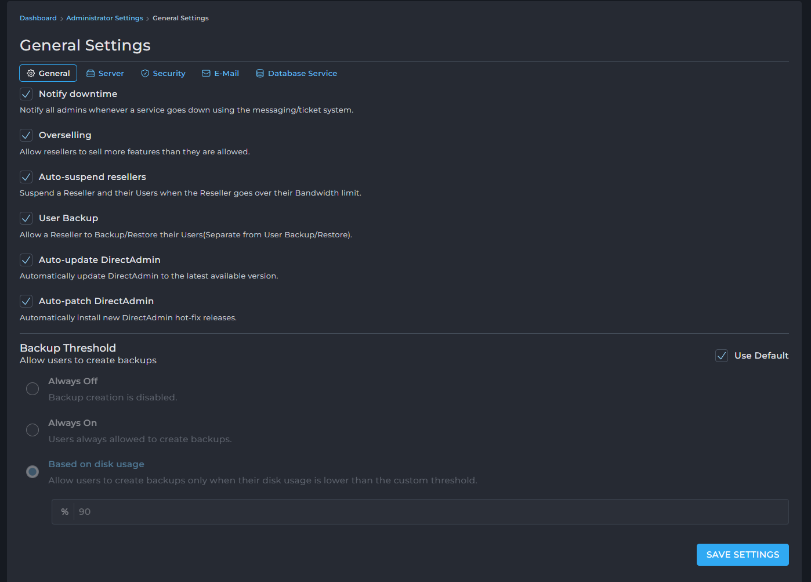
- Đây là nơi bạn có thể cấu hình các tùy chọn tổng quát ảnh hưởng đến hoạt động chung của DirectAdmin và các chính sách quản lý tài khoản.
- Notify downtime (Thông báo ngừng hoạt động):
	- Khi được bật, hệ thống sẽ gửi thông báo đến tất cả các quản trị viên thông qua hệ thống tin nhắn/ticket mỗi khi một dịch vụ trên máy chủ bị ngừng hoạt động (ví dụ: Apache, MySQL, Mail server). Điều này giúp quản trị viên nắm bắt sự cố kịp thời để xử lý.
- Overselling (Bán quá mức):
	- Khi được bật, tùy chọn này cho phép các đại lý (reseller) bán các gói tài nguyên (ví dụ: dung lượng đĩa, băng thông) vượt quá tổng số tài nguyên mà họ được cấp. Ví dụ, một đại lý được cấp 100GB dung lượng nhưng có thể tạo ra các gói dịch vụ với tổng dung lượng lên tới 150GB, với giả định rằng không phải tất cả người dùng sẽ sử dụng hết tài nguyên được cấp cùng một lúc.
	- Lưu ý quan trọng: Việc Overselling cần được cân nhắc kỹ lưỡng vì nếu tất cả người dùng sử dụng hết tài nguyên, server có thể quá tải.
- Auto-suspend resellers (Tự động đình chỉ đại lý):
	- Khi được bật, DirectAdmin sẽ tự động đình chỉ tài khoản của một đại lý và tất cả các tài khoản người dùng dưới quyền của đại lý đó nếu đại lý vượt quá giới hạn băng thông được cấp. Đây là một cơ chế kiểm soát tài nguyên tự động.
- User Backup (Sao lưu Người dùng):
	- Khi được bật, tùy chọn này cho phép đại lý tự sao lưu hoặc khôi phục dữ liệu của người dùng của họ. Tùy chọn này hoạt động độc lập với tính năng sao lưu/khôi phục của người dùng thông thường. Điều này hữu ích cho các đại lý muốn chủ động quản lý dữ liệu của khách hàng.
- Auto-update DirectAdmin (Tự động cập nhật DirectAdmin):
	- Khi được bật, DirectAdmin sẽ tự động cập nhật lên phiên bản mới nhất khi có bản phát hành. Điều này giúp hệ thống luôn được vá lỗi bảo mật và có các tính năng mới nhất mà không cần can thiệp thủ công.
- Auto-patch DirectAdmin (Tự động vá lỗi DirectAdmin):
	- Khi được bật, hệ thống sẽ tự động cài đặt các bản vá lỗi khẩn cấp (hot-fix releases) của DirectAdmin ngay khi chúng được phát hành. Điều này đặc biệt quan trọng để duy trì bảo mật và ổn định cho máy chủ.
- Backup Threshold (Ngưỡng Sao lưu):
	- Phần này cho phép bạn kiểm soát khi nào người dùng được phép tạo bản sao lưu tài khoản của họ, nhằm tránh tình trạng sao lưu làm quá tải hệ thống hoặc chiếm dụng quá nhiều tài nguyên đĩa.
	- Bạn có thể chọn một trong các tùy chọn sau:
		- Use Default: Sử dụng cài đặt mặc định của hệ thống.
		- Always Off: Vô hiệu hóa hoàn toàn chức năng tạo bản sao lưu cho người dùng.
		- Always On: Luôn cho phép người dùng tạo bản sao lưu.
		- Based on disk usage (Dựa trên mức sử dụng đĩa):
			- Cho phép người dùng tạo bản sao lưu chỉ khi mức sử dụng dung lượng đĩa của họ thấp hơn một ngưỡng tùy chỉnh. 
			- Bạn sẽ nhập một giá trị phần trăm (%) vào ô bên dưới.
			- Ví dụ, nếu đặt là 90%, người dùng chỉ có thể sao lưu khi mức sử dụng đĩa của họ dưới 90% tổng dung lượng được cấp. 
			-> Điều này giúp ngăn chặn việc tạo bản sao lưu khi dung lượng đĩa gần đầy, gây ra lỗi hoặc làm chậm server.
	
#### Tab `Server` (Cài đặt Máy chủ)
- 
- Tab "Server" trong Administrator Settings cho phép quản trị viên cấu hình các thông tin cơ bản và quan trọng nhất của máy chủ, bao gồm tên máy chủ, máy chủ tên miền (Name Server) và các thiết lập về thời gian chờ (timeout) cho các yêu cầu.
- Hostname (Tên máy chủ)
	- 
	- Hostname được sử dụng để nhận dạng duy nhất máy chủ và cung cấp một tên có thể phân giải DNS để truy cập từ bên ngoài.
	- Lưu ý: Hostname nên được đặt thành Tên miền đầy đủ đủ điều kiện (Fully Qualified Domain Name - FQDN) của máy chủ, và FQDN này phải phân giải được tới địa chỉ IP chính của máy chủ.
	- Bạn có thể thay đổi hostname của máy chủ tại đây bằng cách nhấp vào nút "CHANGE HOSTNAME".
- 
- Name Server 1 và Name Server 2 (Máy chủ tên miền chính và phụ)
	- Name Server 1 (Máy chủ tên miền chính): Đây là máy chủ định danh chính (tên miền). Nó chỉ được sử dụng khi tạo tài khoản quản trị viên ban đầu hoặc khôi phục tài khoản quản trị viên/đại lý mà chưa có máy chủ định danh được cấu hình.
	- Name Server 2 (Máy chủ tên miền phụ): Đây là máy chủ định danh phụ (tên miền). Nó cũng chỉ được sử dụng khi tạo tài khoản quản trị viên ban đầu hoặc khôi phục tài khoản quản trị viên/đại lý mà chưa có máy chủ định danh được cấu hình.
- Session (Phiên làm việc)
	- Single Request Timeout (Thời gian chờ tối đa cho một yêu cầu):
		- Giá trị mặc định ví dụ: 60 giây.
		- Đây là lượng thời gian tối đa cho phép một yêu cầu duy nhất tới dịch vụ DirectAdmin được chạy. Nếu yêu cầu không hoàn thành trong khoảng thời gian này, nó sẽ bị chấm dứt.
	- Session Timeout (Thời gian chờ phiên làm việc):
		- Giá trị mặc định ví dụ: 10 phút.
		- Đây là khoảng thời gian người dùng sẽ duy trì trạng thái đăng nhập nếu không có yêu cầu nào được gửi đến máy chủ. Sau khoảng thời gian này, người dùng sẽ tự động bị đăng xuất.
- Number of Web Server Logs (Số lượng tệp nhật ký máy chủ web): Đây là số lượng tệp nhật ký (log) đã được xoay vòng sẽ được giữ lại trong thư mục chính của người dùng.
- Partition Usage Threshold (Ngưỡng sử dụng phân vùng): Nếu mức sử dụng của phân vùng dữ liệu vượt quá giá trị ngưỡng này, một email sẽ được gửi đến tất cả các tài khoản quản trị viên. Email thông báo chỉ được gửi một lần mỗi ngày nếu mức sử dụng không giảm hoặc cài đặt không thay đổi.
- Max Request/Upload Size (Kích thước yêu cầu/tải lên tối đa): Kích thước yêu cầu POST tối đa. Không áp dụng cho các điểm cuối API mới.
- Check usage interval (Khoảng thời gian kiểm tra sử dụng)
	- Đơn vị: Ngày.
	- Mức sử dụng phân vùng sẽ được kiểm tra với khoảng thời gian đã chỉ định.
- Max Username Length (Độ dài tên người dùng tối đa): Độ dài tên người dùng tối đa cho phép không được lớn hơn 30 ký tự.
- Time Zone (Múi giờ)
	- Múi giờ của máy chủ là một cài đặt toàn cầu (toàn server) cho tất cả các ứng dụng. Nó mô tả các quy tắc về cách biểu diễn các giá trị thời gian cho người dùng. Cấu hình phổ biến nhất cho các máy chủ là không thực hiện chuyển đổi thời gian và luôn sử dụng UTC (Giờ phối hợp quốc tế) để biểu diễn thời gian.
	- Giá trị hiện tại ví dụ: Asia/Ho Chi Minh.
	- Bạn có thể thay đổi múi giờ của máy chủ bằng cách nhấp vào nút "CHANGE TIMEZONE".
- Sau khi thực hiện bất kỳ thay đổi nào trong tab "Server", click chọn nút 
	- "SAVE SETTINGS" (Lưu Cài đặt) ở cuối trang để áp dụng các thay đổi

#### Tab "Security" (Cài đặt Bảo mật)
- 
- Phần này cho phép quản trị viên cấu hình các tính năng bảo mật chủ chốt, bao gồm giám sát tấn công vét cạn (Brute Force Monitor), quản lý mật khẩu và các tùy chọn bảo mật liên quan đến tên miền.
- 
- Lost password recovery (Khôi phục mật khẩu đã mất): Khi tùy chọn này được bật, người dùng có thể sử dụng chức năng "Quên mật khẩu" để khôi phục quyền truy cập vào tài khoản của họ thông qua email hoặc các phương thức khác. Điều này giúp giảm tải cho quản trị viên nhưng cũng cần cân nhắc về bảo mật nếu email của người dùng bị lộ.
- Difficult password enforcement (Buộc sử dụng mật khẩu mạnh): Khi được bật, hệ thống sẽ yêu cầu người dùng và đại lý đặt mật khẩu có độ khó cao hơn (ví dụ: yêu cầu sử dụng cả chữ cái viết hoa, chữ thường, số và ký tự đặc biệt, cùng với độ dài tối thiểu). Điều này tăng cường bảo mật cho các tài khoản người dùng và giảm thiểu rủi ro bị đoán mật khẩu.
- Check domain owner for subdomain creation (Kiểm tra chủ sở hữu tên miền khi tạo tên miền phụ): Khi tùy chọn này được bật, DirectAdmin sẽ kiểm tra xem người dùng có sở hữu tên miền chính trước khi cho phép họ tạo tên miền phụ (subdomain) cho tên miền đó. Điều này ngăn chặn việc tạo tên miền phụ trái phép cho các tên miền không thuộc sở hữu của người dùng.
- Brute Force Monitor (Giám sát tấn công vét cạn) 
	- 
	- Giám sát tấn công vét cạn ngăn chặn các nỗ lực đoán mật khẩu người dùng bằng cách thử các kết hợp mật khẩu khác nhau. Nó bảo vệ quyền truy cập vào giao diện web DirectAdmin bằng cách chặn địa chỉ IP của máy khách sau nhiều lần đăng nhập không thành công.
	- Enable Brute Force Monitor (Kích hoạt Giám sát tấn công vét cạn): Đánh dấu vào ô này để bật tính năng bảo mật quan trọng này.
		- Login attempts threshold (Ngưỡng số lần thử đăng nhập):
		- Đây là số lần thử đăng nhập không thành công tối đa trước khi một địa chỉ IP bị đưa vào danh sách đen (blacklist). Ví dụ: "Blacklists after 20 failed login attempts".
		- Giá trị khuyến nghị cho các cuộc tấn công đăng nhập xâm nhập là khoảng 10-20.
		- Cài đặt này áp dụng cho các lần thử đăng nhập không thành công, ví dụ như sai tên người dùng hoặc mật khẩu.
	- Unauthorized request threshold (Ngưỡng yêu cầu trái phép):
		- Mặc định: 100.
		- Cài đặt này dành cho các yêu cầu trái phép đến trang đăng nhập DirectAdmin. Nói cách khác, nếu trang đăng nhập nhận quá nhiều yêu cầu, IP đó sẽ bị đưa vào danh sách đen.
		- Exempt local block (Miễn trừ chặn cục bộ): Khi được bật, các yêu cầu từ cùng một máy chủ (local host) sẽ không bị chặn bởi Brute Force Monitor. Điều này hữu ích cho các tác vụ nội bộ của máy chủ.
	- Failed login reset timeout (Thời gian chờ đặt lại số lần đăng nhập thất bại):
		- Mặc định: 3600 giây.
		- Sau lần đăng nhập không thành công cuối cùng, nếu khoảng thời gian này trôi qua, số lần đăng nhập không thành công sẽ được đặt lại về 0.
	- Blacklist removal timeout (Thời gian chờ gỡ bỏ khỏi danh sách đen):
		- Mặc định: 86400 phút.
		- Địa chỉ IP sẽ được gỡ khỏi danh sách đen sau khoảng thời gian đã chỉ định.
- Brute force log scanner (Máy quét nhật ký tấn công vét cạn) 
	- 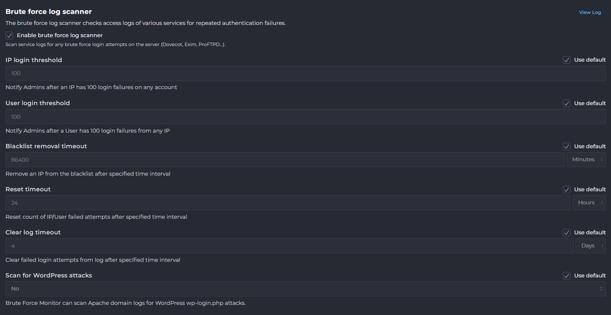
	- Máy quét nhật ký tấn công vét cạn kiểm tra nhật ký truy cập của các dịch vụ khác nhau để tìm các lần xác thực thất bại lặp đi lặp lại.
	- Enable brute force log scanner (Kích hoạt máy quét nhật ký tấn công vét cạn): Đánh dấu vào ô này để bật tính năng này.
		- IP login threshold (Ngưỡng đăng nhập IP):
		- Mặc định: 100.
		- Thông báo sẽ được gửi đến quản trị viên sau khi có 100 lần đăng nhập thất bại từ bất kỳ IP nào trên bất kỳ tài khoản nào.
	- User login threshold (Ngưỡng đăng nhập người dùng):
		- Mặc định: 100.
		- Thông báo sẽ được gửi đến quản trị viên sau khi một người dùng có 100 lần đăng nhập thất bại từ bất kỳ IP nào.
	- Blacklist removal timeout (Thời gian chờ gỡ bỏ khỏi danh sách đen): Gỡ bỏ khỏi danh sách đen sau khoảng thời gian đã chỉ định.
	- Reset timeout (Thời gian chờ đặt lại): Đặt lại số lần thử đã theo dõi sau khoảng thời gian đã chỉ định.
	- Clear log timeout (Thời gian chờ xóa nhật ký): Xóa các lần đăng nhập thất bại khỏi nhật ký sau khoảng thời gian đã chỉ định.
	- Scan for WordPress attacks (Quét tìm các cuộc tấn công WordPress): Khi được bật, Brute Force Monitor có thể quét nhật ký tên miền Apache để tìm các cuộc tấn công vào tệp `wp-login.php` của WordPress.
		- All logs: Tùy chọn này cho phép Brute Force Monitor quét tất cả các tên miền để tìm các cuộc tấn công wp-login.php.
		- Manual: Với tùy chọn này, Brute Force Monitor chỉ quét các tên miền được thêm thủ công vào tệp brute.conf để tìm các cuộc tấn công wp-login.php.
		- No: Tùy chọn này có nghĩa là Brute Force Monitor sẽ không quét các cuộc tấn công wp-login.php.
- Sau khi thực hiện bất kỳ thay đổi nào trong tab "Security", click vào nút "SAVE SETTINGS"(Lưu Cài đặt) ở cuối trang để áp dụng các thay đổi.

####  Tab "E-Mail" (Cài đặt Email)
- 
- Phần này cho phép quản trị viên thiết lập các chính sách liên quan đến việc gửi và nhận email, giúp kiểm soát việc sử dụng tài nguyên và chống spam.
- Email Settings (Cài đặt Email)
	- 
	- Allow user to set limits for its own e-mail accounts (Cho phép người dùng tự đặt giới hạn cho tài khoản email của họ):
		- Khi được bật, tùy chọn này cho phép người dùng tự cấu hình giới hạn gửi email hàng ngày cho các tài khoản email riêng của họ.
		- Lưu ý:Người dùng sẽ không được phép vượt quá giới hạn email tổng thể trên toàn cầu của tài khoản chính của họ.
	- Daily email limit per mailbox (Giới hạn email hàng ngày cho mỗi hộp thư):
		- Mặc định: 200 email.
		- Đây là số lượng email tối đa mà một người dùng có thể cấu hình cho một hộp thư cụ thể.
		- Các tài khoản người dùng cá nhân có thể có các giới hạn hộp thư khác nhau được cấu hình trong cài đặt người dùng hoặc gói dịch vụ của họ.
		- Lưu ý:Giới hạn này không được phép vượt quá giới hạn email tổng thể của người dùng hoặc giới hạn gói dịch vụ của họ.
		- Bạn có thể chọn "Use Default"để sử dụng giá trị mặc định của hệ thống hoặc đặt "Unlimited"(Không giới hạn) cho hộp thư.
	- Purge Old Spam and Trash Emails (Xóa email Spam và Thùng rác cũ):
		- Mặc định: 0 ngày.
		- Cài đặt này xác định số ngày mà các email trong thư mục Spam hoặc Trash (Thùng rác) sẽ được giữ lại trước khi bị xóa vĩnh viễn.
		- Nếu được bật, hệ thống sẽ kiểm tra hàng ngày và xóa các email trong thư mục Spam hoặc Trash cũ hơn số ngày đã cho.
		- Bạn có thể chọn "Use Default" hoặc đánh dấu "Disabled" để tắt tính năng này.
	- Daily E-mail limit per DirectAdmin User (Giới hạn email hàng ngày cho mỗi Người dùng DirectAdmin):
		- Mặc định: 1000 email.
		- Đây là giới hạn số lượng email mà một người dùng DirectAdmin có thể gửi mỗi ngày.
		- Lưu ý:Đây chỉ là cài đặt toàn cục và có thể bị ghi đè bởi giới hạn cụ thể của từng người dùng.
		- Bạn có thể đặt giá trị 0 cho không giới hạn (Unlimited).
	- RBL Blocking in Exim (Chặn RBL trong Exim):
		- RBL (Realtime Blackhole List) là một phương pháp xác định các máy chủ có liên quan đến việc gửi thư rác.
		- Cài đặt này dùng để bật tính năng chặn RBL trong Exim (Mail Transfer Agent của DirectAdmin).
		- Lưu ý :Việc bật RBL có thể quá nghiêm ngặt đối với RBL gốc trong SpamAssassin và không nên bật tùy chọn này.
- Blocked Users (Người dùng bị chặn)
	- 
	- Phần này là danh sách các tài khoản người dùng không được phép gửi email đi.
	- Khối chặn email có thể được áp dụng cho toàn bộ email gửi qua SMTP (đối với tất cả các hộp thư thuộc tài khoản người dùng đó), hoặc email được gửi từ các script PHP, hoặc cả hai.
	- Bạn có thể nhập tên người dùng và chọn loại chặn mong muốn, sau đó nhấp vào nút "Block"để thêm vào danh sách.
	- Các tùy chọn loại chặn (Block Type) bao gồm:
		- SMTP Access & CLI/Scripts: Chặn cả email gửi qua SMTP và email gửi từ các script PHP/CLI (Command Line Interface).
		- CLI/Scripts: Chỉ chặn email được gửi thông qua các script CLI/PHP.
		- SMTP Access: Chỉ chặn email gửi qua SMTP, chặn tất cả các hộp thư thuộc người dùng đó.
- Blocked Mailboxes (Hộp thư bị chặn)
	- 
	- Đây là danh sách các hộp thư cụ thể không được phép gửi email đi.
	- Điều này cho phép kiểm soát chi tiết hơn, chỉ chặn một hộp thư bị xâm nhập thay vì toàn bộ tài khoản người dùng.
	- Bạn có thể nhập địa chỉ email của hộp thư và nhấp vào nút "Block"để thêm vào danh sách.

#### Tab "Database Service" (Cài đặt Dịch vụ Cơ sở dữ liệu)
- 
- Phần này cho phép quản trị viên quản lý và cấu hình các khía cạnh khác nhau của dịch vụ cơ sở dữ liệu, bao gồm khả năng sẵn sàng của tính năng, cài đặt kết nối và các tùy chọn bổ sung khác.
- General feature availability
	- 
	- Phần này cho phép quản trị viên bật hoặc tắt hoàn toàn tất cả các tính năng quản lý dịch vụ cơ sở dữ liệu trong DirectAdmin.
	- Điều này có thể hữu ích trong các môi trường cụ thể nơi dịch vụ cơ sở dữ liệu không cần thiết hoặc được quản lý bởi một hệ thống khác.
	- Bạn có thể đánh dấu vào ô "Database management features are entirely enabled"để bật hoặc bỏ chọn để vô hiệu hóa tất cả các tính năng quản lý cơ sở dữ liệu.
- Connection configuration (Cấu hình kết nối)
	- 
	- Phần này thiết lập địa chỉ và thông tin đăng nhập được sử dụng để DirectAdmin kết nối với máy chủ cơ sở dữ liệu để thực hiện các hành động quản lý.
	- Address (Địa chỉ):
		- Trường địa chỉ có thể là địa chỉ IP hoặc tên miền của máy chủ cơ sở dữ liệu, cùng với số cổng tùy chọn nếu máy chủ sử dụng cổng TCP không tiêu chuẩn (khác 3306).
		- Nếu chế độ UNIX socket được sử dụng, địa chỉ phải là đường dẫn hệ thống tệp đến socket UNIX.
		- Giá trị ví dụ:`/var/lib/mysql/mysql.sock`.
	- UNIX Socket : Khi tùy chọn này được đánh dấu, kết nối sẽ được thiết lập bằng cách sử dụng socket.
	- Username (Tên người dùng): Tên người dùng được sử dụng để kết nối với máy chủ cơ sở dữ liệu.
	- Password (Mật khẩu): Mật khẩu cho tên người dùng cơ sở dữ liệu.
	- Test configuration (Kiểm tra cấu hình): Nút này cho phép bạn kiểm tra xem DirectAdmin có thể kết nối thành công với máy chủ cơ sở dữ liệu bằng các cài đặt đã cung cấp hay không.
	- Sau khi thay đổi cài đặt kết nối, nhấp vào "SAVE CONFIGURATION".
- Additional settings (Cài đặt bổ sung)
	- 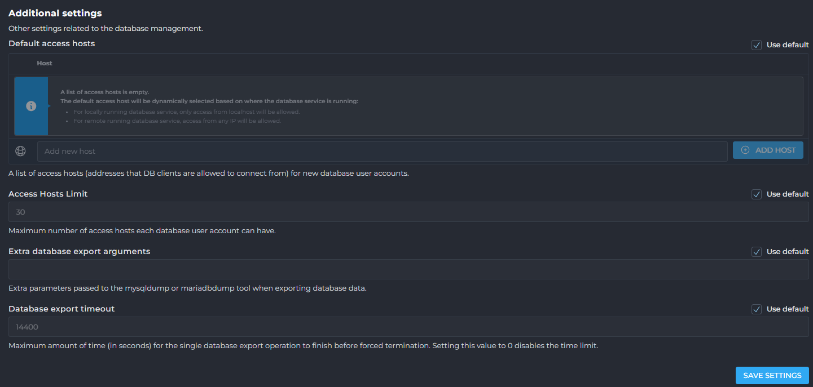
	- Phần này chứa các cài đặt khác liên quan đến quản lý cơ sở dữ liệu.
	- Default access hosts (Máy chủ truy cập mặc định):
	- Đây là danh sách các máy chủ truy cập (địa chỉ mà các ứng dụng khách cơ sở dữ liệu được phép kết nối từ đó) cho các tài khoản người dùng cơ sở dữ liệu mới.
	- Access Hosts Limit (Giới hạn máy chủ truy cập): Số lượng máy chủ truy cập tối đa mà mỗi tài khoản người dùng cơ sở dữ liệu có thể có.
	- Extra database export arguments (Tham số bổ sung khi xuất cơ sở dữ liệu): Các tham số bổ sung được truyền cho công cụ `mysqldump` hoặc `mariadbdump` khi xuất dữ liệu cơ sở dữ liệu.
	- Database export timeout (Thời gian chờ xuất cơ sở dữ liệu): Thời gian tối đa (tính bằng giây) cho một thao tác xuất cơ sở dữ liệu đơn lẻ hoàn thành trước khi bị buộc chấm dứt. Đặt giá trị này thành 0 sẽ tắt giới hạn thời gian.

### Custom HTTPD Configurations
- 
- 
- Mục này cung cấp một giao diện để bạn xem và chỉnh sửa các tệp cấu hình của máy chủ web HTTPD cho từng tên miền hoặc người dùng trên hệ thống. 
- Mục "Custom HTTPD Configurations" là công cụ mạnh mẽ dành cho quản trị viên muốn tùy chỉnh sâu hơn môi trường web cho từng tên miền cụ thể, đáp ứng các yêu cầu đặc biệt của ứng dụng hoặc tối ưu hóa hiệu suất.
- Việc tùy chỉnh này cho phép bạn áp dụng các cài đặt nâng cao hoặc đặc thù mà không làm ảnh hưởng đến cấu hình mặc định của toàn bộ máy chủ.
- Khi truy cập vào "Custom HTTPD Configurations", bạn sẽ thấy một bảng hiển thị danh sách các tên miền và các tệp cấu hình liên quan của chúng:
- Show Domains that... (Hiển thị tên miền theo...):  Phần này cung cấp các tùy chọn để lọc danh sách tên miền. Bạn có thể tìm kiếm theo tên miền bắt đầu bằng một ký tự hoặc chuỗi nhất định ("Starts With") hoặc chứa một chuỗi cụ thể.
- Danh sách gồm các cột: 
	- Domain (Tên miền): Cột này hiển thị tên miền của trang web.
	- User (Người dùng): Cột này hiển thị tên người dùng DirectAdmin sở hữu tên miền đó.
	- Conf. Files (Tệp cấu hình): Cột này liệt kê các tệp cấu hình chính liên quan đến HTTPD cho tên miền đó. Các tệp phổ biến bao gồm:
		- `httpd.conf`  : Đây là tệp cấu hình chính của máy chủ web (Apache hoặc Nginx). Bạn có thể chỉnh sửa tệp này để thêm các chỉ thị tùy chỉnh cho tên miền, ví dụ như rewrite rules, caching headers, hoặc các thiết lập bảo mật riêng.
		- `php-fpm.conf` (ví dụ: `php-fpm.conf 8.3` hoặc `php-fpm.conf 5.6`): Tệp này chứa cấu hình cho PHP-FPM (FastCGI Process Manager) được sử dụng để xử lý các tập lệnh PHP. Việc chỉnh sửa tệp này cho phép bạn thay đổi các cài đặt PHP cấp độ tên miền, như `memory_limit`, `upload_max_filesize`, hoặc các module PHP được tải.
- Các chức năng chính:  
	- Chỉnh sửa cấu hình: Bằng cách nhấp vào tên của tệp cấu hình trong cột "Conf. Files", bạn có thể mở một trình soạn thảo văn bản để chỉnh sửa nội dung của tệp đó.
	- DA BUILD REWRITE_CONFS: Sử dụn để xây dựng lại các tệp cấu hình HTTPD. Sau khi bạn thực hiện các thay đổi thủ công và lưu lại, việc chạy lệnh này sẽ đảm bảo rằng các thay đổi của bạn được áp dụng và cấu hình của máy chủ web được cập nhật. Đây là bước cần thiết để kích hoạt các thay đổi bạn đã thực hiện.

#### Giao diện "HTTPD Configuration" (Cấu hình HTTPD)
- Các thành phần của giao diện:
- Các nút chức năng:
	- View All Available Tokens:  Hiển thị danh sách tất cả các "token" hoặc biến mà bạn có thể sử dụng trong các tệp cấu hình.
		- 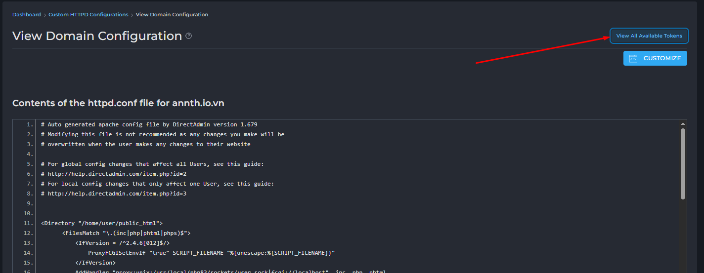
		- 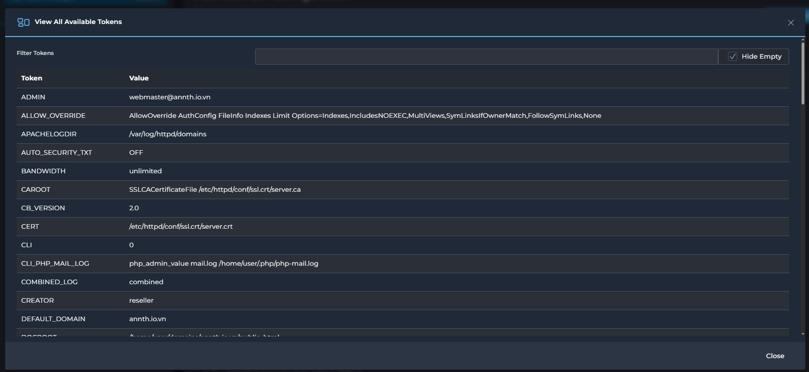
		- Cung cấp một danh sách chi tiết các biến (token) và giá trị tương ứng của chúng, được sử dụng trong quá trình cấu hình tên miền hoặc máy chủ. 
		- Việc hiểu các token này giúp quản trị viên nắm rõ hơn về các thông số được áp dụng và cách chúng ảnh hưởng đến cấu hình.
			- Thanh tìm kiếm và tùy chọn lọc:
				- "Filter Tokens": Một ô nhập liệu cho phép bạn lọc nhanh danh sách các token bằng cách gõ từ khóa. Khi bạn nhập, danh sách bên dưới sẽ tự động hiển thị các token có chứa từ khóa đó trong tên hoặc giá trị của chúng.
				- "Hide Empty": Một hộp kiểm (checkbox) mà khi được chọn, sẽ ẩn đi các token không có giá trị (trống). Điều này giúp tập trung vào các token đang có giá trị được định nghĩa.
		- Bảng hiển thị Token và Giá trị: Giao diện hiển thị một bảng gồm hai cột chính:
			- "Token": Cột này liệt kê tên của các biến cấu hình. Mỗi tên token đại diện cho một thuộc tính hoặc cài đặt cụ thể.
			- "Value": Cột này hiển thị giá trị hiện tại được gán cho từng token tương ứng.
	- Customize: Nút này dùng để chuyển đổi chế độ cấu hình. 
		- 
		- 
		- Giao diện này cho phép bạn tùy chỉnh cấu hình httpd.conf cho tên miền bằng cách thêm các đoạn mã tùy chỉnh vào các vị trí được định sẵn trong tệp cấu hình.
		- Các thành phần chính của giao diện bao gồm:
			- View All Available Tokens: Nút này tương tự như ở giao diện trước, cho phép bạn xem lại tất cả các token có sẵn để sử dụng trong các tùy chỉnh của mình.
			- VIEW: Nút này có thể dùng để xem trước kết quả cấu hình sau khi áp dụng các tùy chỉnh, trước khi lưu.
		- "httpd.conf customization for domain":
			- Đây là một vùng văn bản, nơi bạn có thể nhập các đoạn mã cấu hình Apache tùy chỉnh mà bạn muốn thêm vào tệp httpd.conf cho tên miền .
			- Các đoạn mã này sẽ được chèn vào một vị trí cụ thể trong tệp cấu hình chính, thường là ở một vị trí chung hoặc mặc định.
		- "Additional CUSTOM tokens":
			- Phần này cung cấp các vùng nhập liệu cho các "token" tùy chỉnh bổ sung (CUSTOM1, CUSTOM2, CUSTOM3, CUSTOM4), cho phép bạn chèn mã vào các vị trí rất cụ thể trong tệp cấu hình.
			- Mỗi "token" tùy chỉnh này có một mô tả rõ ràng về vị trí mà đoạn mã bạn nhập vào sẽ xuất hiện trong tệp cấu hình:
			- CUSTOM1: "Appears at the very top of the template, before setting the variables." (Xuất hiện ở đầu tiên của template, trước khi thiết lập các biến).
			- CUSTOM2: "Appears just before the <Directory> section." (Xuất hiện ngay trước phần <Directory>).
			- CUSTOM3: "Appears just before the webapps include." (Xuất hiện ngay trước phần bao gồm các webapps).
			- CUSTOM4: "The very last entry." (Mục cuối cùng).
		- Bạn có thể sử dụng các vùng văn bản này để thêm các chỉ thị Apache tùy chỉnh, các quy tắc Rewrite, hoặc bất kỳ cấu hình nào bạn cần chèn vào các vị trí cụ thể trong httpd.conf.
- Contents of the httpd.conf file for<domain>: Đây là một vùng văn bản hiển thị toàn bộ nội dung của tệp httpd.conf dành riêng cho miền.
	- 
- Templates: 
	- 
	- 
	- Phần này hiển thị danh sách các tệp mẫu cấu hình (templates).
	- Việc click vào các tệp mẫu này có thể sẽ hiển thị nội dung của chúng, giúp quản trị viên có thể xem hoặc sử dụng chúng để tạo cấu hình mới

#### Giao diện "PHP-FPM Configuration" (Cấu hình PHP-FPM)
- Giao diện này cho phép bạn tùy chỉnh cấu hình của PHP-FPM (FastCGI Process Manager) cho người dùng.
- Giao diện này cung cấp một công cụ mạnh mẽ để tùy chỉnh cấu hình PHP-FPM cho người dùng và từng phiên bản PHP cụ thể, cho phép quản trị viên điều chỉnh hiệu suất và hành vi của PHP trên máy chủ.  
- Các thành phần chính của giao diện bao gồm:
	- "Available Tokens": Một nút ở góc trên bên phải, khi click vào có thể hiển thị danh sách các token (biến) có sẵn để sử dụng trong các tùy chỉnh cấu hình PHP-FPM.
		- 
		- 
		- Cung cấp một danh sách chi tiết các biến (token) và giá trị tương ứng của chúng, được sử dụng trong quá trình cấu hình tên miền hoặc máy chủ. 
		- Việc hiểu các token này giúp quản trị viên nắm rõ hơn về các thông số được áp dụng và cách chúng ảnh hưởng đến cấu hình.
		- Thanh tìm kiếm và tùy chọn lọc:
			- "Filter Tokens": Một ô nhập liệu cho phép bạn lọc nhanh danh sách các token bằng cách gõ từ khóa. Khi bạn nhập, danh sách bên dưới sẽ tự động hiển thị các token có chứa từ khóa đó trong tên hoặc giá trị của chúng.
			- "Hide Empty": Một hộp kiểm (checkbox) mà khi được chọn, sẽ ẩn đi các token không có giá trị (trống). Điều này giúp tập trung vào các token đang có giá trị được định nghĩa.
		- Bảng hiển thị Token và Giá trị: Giao diện hiển thị một bảng gồm hai cột chính:
			- "Token": Cột này liệt kê tên của các biến cấu hình. Mỗi tên token đại diện cho một thuộc tính hoặc cài đặt cụ thể.
			- "Value": Cột này hiển thị giá trị hiện tại được gán cho từng token tương ứng.
	- "PHP-FPM config customization for user php-fpm":
		- Đây là phần chính để thêm mã tùy chỉnh vào cấu hình PHP-FPM.
		- Nó cung cấp các tab hoặc vùng nhập liệu cho các tùy chỉnh, được chia thành hai loại chính:
			- php-fpm Global [CUSTOM1] và php-fpm Global [CUSTOM2]: Các tùy chỉnh này áp dụng cho tất cả các phiên bản PHP và được thêm vào trước các token tùy chỉnh riêng cho từng phiên bản PHP.
			- php-fpm 8.3 [CUSTOM1] và php-fpm 8.3 [CUSTOM2]: Các tùy chỉnh này dành riêng cho phiên bản PHP-FPM 8.3.
		- Bạn có thể nhập các chỉ thị cấu hình PHP-FPM vào các vùng văn bản này.
		- "Global custom tokens apply to all php version, but only for this User. Global is added before per-php tokens.": Dòng mô tả này làm rõ rằng các tùy chỉnh "Global custom tokens" sẽ được áp dụng cho tất cả các phiên bản PHP được sử dụng bởi người dùng hiện tại, và chúng sẽ được chèn vào trước các tùy chỉnh dành riêng cho từng phiên bản PHP.
		- "Save for all PHP versions": Một hộp kiểm (checkbox) mà khi được chọn, có thể sẽ áp dụng các tùy chỉnh đã nhập cho tất cả các phiên bản PHP mà người dùng đang sử dụng (không chỉ PHP 8.3).
		- "SAVE": Nút này dùng để lưu các thay đổi cấu hình PHP-FPM của bạn.
	- "/usr/local/directadmin/data/templates/php-fpm.conf":
		- Đây là một vùng hiển thị nội dung của tệp mẫu cấu hình `php-fpm.conf`.
		- Tương tự như các tệp mẫu HTTPD, nó sử dụng các placeholder (ví dụ: `|PHP_VER-54|`, `|OPEN_BASEDIR_PATH|`, `|PHP1_RELEASE|`, `|PHP_VER|`, `|ACTIVE_USR_LOCAL_PHP_LIB|`, `|EMAIL|`, `|USER|`, `|DOMAIN|`, `|MAX_CHILDREN|`, `|MAX_REQUESTS|`, `|CUSTOM1|`) sẽ được thay thế bằng các giá trị thực khi cấu hình được tạo.
		- Ví dụ các dòng trong template:
		```
		`listen = /usr/local/php83/sockets/$pool.sock`: Cấu hình đường dẫn socket để lắng nghe kết nối.  
		`user = $pool`, `group = $pool`: Chỉ định user và group mà các tiến trình PHP-FPM sẽ chạy.  
		`pm = ondemand`: Chế độ quản lý tiến trình (process manager) là "ondemand" (theo yêu cầu).  
		`pm.max_children = 10`, `pm.process_idle_timeout = 20`, `pm.max_requests = 500`: Các cài đặt chi tiết cho quản lý tiến trình, như số lượng tiến trình con tối đa, thời gian chờ rảnh rỗi của tiến trình, và số lượng yêu cầu tối đa mà một tiến trình con sẽ xử lý trước khi khởi động lại.  
		`|CUSTOM1|`: Placeholder cho tùy chỉnh số 1.
		```
	- "/data/users/user/php/php-fpm83.conf":  
		- Đây là phần hiển thị nội dung của tệp cấu hình PHP-FPM thực tế cho người dùng và phiên bản PHP 8.3 sau khi đã được tạo ra từ template và áp dụng các giá trị.  
		- Nó cho thấy các giá trị cụ thể đã được thay thế cho các token trong template.  
		- Ví dụ các dòng trong tệp cấu hình đã được tạo:
		```
		`[user]`: Tên của pool PHP-FPM.  
		`user = $pool`, `group = $pool`: User và group cho pool, giá trị `$pool` sẽ được thay thế bằng tên người dùng thực tế.  
		`listen = /usr/local/php83/sockets/$pool.sock`: Đường dẫn socket cụ thể cho PHP 8.3.  
		`listen.owner = $pool`, `listen.group = apache`, `listen.mode = 660`: Cấu hình quyền sở hữu và chế độ cho socket.  
		`pm = ondemand`, `pm.max_children = 10`, `pm.process_idle_timeout = 20`, `pm.max_requests = 500`: Các giá trị đã được thiết lập cho quản lý tiến trình.  
		```