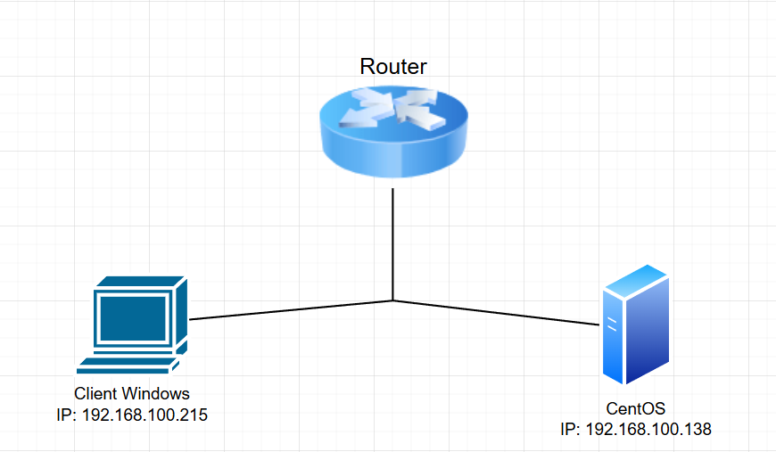
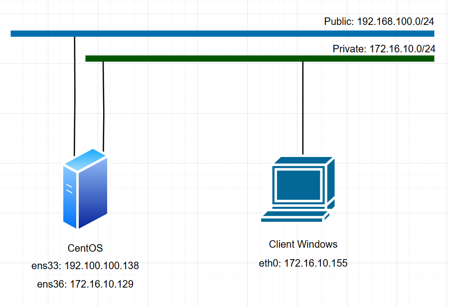

# Thực hành các tường lửa trên Linux 
## 1. iptables 
### 1.1 Cấu hình INPUT Chain: Allow Only SSH
- Mục tiêu: Chỉ cho phép kết nối SSH đến server, chặn tất cả dịch vụ khác.
- Cấu hình iptables :
* Từ chối các kết nối đi tới.
* Cho phép gói tin đi ra từ hệ thống.
* Cho phép thiết lập các kết nối đi vào hệ thống.
* Chấp nhận các kết nối loopback
* Chấp nhận kết nối SSH cho việc remote xuất phát từ mạng LAN.
- Mô hình 
- 
- Thực hiện trên CentOS7
- Mặc định CentOS7 sử dụng firewalld cần chạy lệnh disable firewalld để sử dụng iptables 
```
sudo systemctl mask firewalld
sudo systemctl stop firewalld
sudo systemctl status firewalld
``` 
- 
- Trước khi cấu hình iptables thực hiện xoá hết các rules cũ 
```
iptables -F
iptables -X
```
- 
- Cấu hình 
	* Từ chối các kết nối đi tới.
		```
		iptables -P INPUT DROP
		```
		* `-P`: Đặt chính sách mặc định.
		* `INPUT`: Chuỗi xử lý gói tin đến.
		* `DROP`: Hành động: loại bỏ gói tin.
	* Cho phép gói tin đi ra từ hệ thống.
		```
		iptables -P OUTPUT ACCEPT
		```
		* `-P`: Đặt chính sách mặc định.
		* `OUTPUT`: Chuỗi xử lý gói đi ra.
		* `DROP`: Hành động: loại bỏ gói tin.
	* Cho phép thiết lập các kết nối đi vào hệ thống.
		```
		iptables -A INPUT -m state --state ESTABLISHED,RELATED -j ACCEPT
		```
		* -A INPUT: Thêm (append) một quy tắc vào cuối chuỗi INPUT (gói tin đến).
		* -m state: Sử dụng module mở rộng state để theo dõi trạng thái kết nối.
		* --state ESTABLISHED,RELATED: Lọc các gói tin thuộc về một kết nối đã được thiết lập (ESTABLISHED) hoặc liên quan đến một kết nối đã được thiết lập (ví dụ: FTP data connection - RELATED).
		* -j ACCEPT: Hành động: chấp nhận (cho phép) gói tin đi qua.
	* Chấp nhận các kết nối loopback
		```
		iptables -A INPUT -s 127.0.0.1 -d 127.0.0.1 -j ACCEPT
		```
		* -A INPUT: Thêm (append) một quy tắc vào cuối chuỗi INPUT (gói tin đến).
		* -s 127.0.0.1: Lọc các gói tin có địa chỉ nguồn là 127.0.0.1 (localhost/loopback).
		* -d 127.0.0.1: Lọc các gói tin có địa chỉ đích là 127.0.0.1 (localhost/loopback).
		* -j ACCEPT: Hành động: chấp nhận (cho phép) gói tin đi qua.
	* Chấp nhận kết nối SSH cho việc remote xuất phát từ mạng LAN.
		```
		iptables -A INPUT -p tcp -m state --state NEW -m tcp -s 192.168.100.0/24  -d 192.168.100.138 --dport 22 -j ACCEPT
		```
		* -A INPUT: Thêm (append) một quy tắc vào cuối chuỗi INPUT (gói tin đến).
		* -p tcp: Chỉ áp dụng cho giao thức TCP.
		* -m state: Sử dụng module state để theo dõi trạng thái kết nối.
		* --state NEW: Chỉ áp dụng cho các gói tin bắt đầu một kết nối mới.
		* -m tcp: Sử dụng module tcp (có thể không cần thiết ở đây vì đã có -p tcp).
		* -s 192.168.100.0/24: Lọc các gói tin có địa chỉ nguồn thuộc dải mạng 192.168.100.0/24.
		* -d 192.168.100.138: Lọc các gói tin có địa chỉ đích là 192.168.100.138.
		* --dport 22: Lọc các gói tin TCP có cổng đích là 22 (thường là SSH).
		* -j ACCEPT: Hành động: chấp nhận (cho phép) gói tin đi qua.
- 
- Kiểm tra 
* Thêm card mạng vào máy CentOS7 có IP `172.16.10.128` và thực hiện ssh vào thu kết quả báo lỗi do rule đã set chỉ ssh được từ dải 192.168.100.0/24
- 
- 
* Từ máy client trong dải IP đã cho phép ssh thành công.
- 

### 1.2 NAT: Masquerade for Internet Access 
- Mục tiêu: Cho phép máy trong LAN truy cập Internet thông qua NAT trên máy Linux.
- Cấu hình iptables: 
	* Từ chối các kết nối được chuyển hướng (FORWARD) theo mặc định.
	* Bật IP Forwarding trong kernel.
	* Thiết lập NAT (Masquerade)
	* Chấp nhận các gói tin đi qua Server từ mạng LAN.
- Mô hình 
- 
- Thực hiện trên CentOS7
- Mặc định CentOS7 sử dụng firewalld cần chạy lệnh disable firewalld để sử dụng iptables 
```
sudo systemctl mask firewalld
sudo systemctl stop firewalld
sudo systemctl status firewalld
``` 
- 
- Trước khi cấu hình iptables thực hiện xoá hết các rules cũ 
```
sudo iptables -F
sudo iptables -X
sudo iptables -t nat -F
sudo iptables -t nat -X
```
- 
- Cấu hình 
	* Từ chối các kết nối được chuyển hướng (FORWARD) theo mặc định.
		```
		sudo iptables -P FORWARD DROP
		sudo iptables -P INPUT ACCEPT
		sudo iptables -P OUTPUT ACCEPT
		```
		* `-P`: Đặt chính sách mặc định.
		* `INPUT/FORWARD/OUTPUT`: Chuỗi xử lý gói tin.
		* `DROP`: Hành động: loại bỏ gói tin.
	* Bật IP Forwarding trong kernel.
		```
		sudo sysctl -w net.ipv4.ip_forward=1
		```
	* Chấp nhận các gói tin đi qua Server từ mạng LAN.
		```
		sudo iptables -A FORWARD -i ens36 -o ens33 -j ACCEPT
		```
		* -A FORWARD: Thêm (append) một quy tắc mới vào cuối chuỗi FORWARD. Chuỗi FORWARD xử lý các gói tin đi qua hệ thống (không phải đến hoặc đi từ chính hệ thống).
		* -i ens36: Chỉ định giao diện mạng đầu vào (input interface) là ens36. Quy tắc này chỉ áp dụng cho các gói tin đi vào hệ thống thông qua giao diện ens36.
		* -o ens33: Chỉ định giao diện mạng đầu ra (output interface) là ens33. Quy tắc này chỉ áp dụng cho các gói tin sau đó được định tuyến ra thông qua giao diện ens33.
		* -j ACCEPT: Hành động: chấp nhận (cho phép) gói tin đi qua.
		```
		sudo iptables -A FORWARD -i ens33 -o ens36 -m state --state RELATED,ESTABLISHED -j ACCEPT
		```
		* -A FORWARD: Thêm (append) một quy tắc mới vào cuối chuỗi FORWARD.
		* -i ens33: Chỉ định giao diện mạng đầu vào là ens33. Quy tắc này chỉ áp dụng cho các gói tin đi vào hệ thống thông qua giao diện ens33.
		* -o ens36: Chỉ định giao diện mạng đầu ra là ens36. Quy tắc này chỉ áp dụng cho các gói tin sau đó được định tuyến ra thông qua giao diện ens36.
		* -m state: Sử dụng module mở rộng state để theo dõi trạng thái kết nối.
		* --state RELATED,ESTABLISHED: Lọc các gói tin thuộc về một kết nối đã được thiết lập (ESTABLISHED) hoặc liên quan đến một kết nối đã được thiết lập (RELATED).
		* -j ACCEPT: Hành động: chấp nhận (cho phép) gói tin đi qua.
	* Thiết lập NAT (Masquerade)
		```
		sudo iptables -t nat -A POSTROUTING -o ens33 -j MASQUERADE
		```
		* -t nat: Chỉ định bảng NAT (Network Address Translation). Bảng này được sử dụng để thay đổi địa chỉ IP và cổng của các gói tin.
		* -A POSTROUTING: Thêm (append) một quy tắc vào cuối chuỗi POSTROUTING. Chuỗi này xử lý các gói tin ngay trước khi chúng rời khỏi hệ thống.
		* -o ens33: Chỉ định giao diện mạng ra (output interface) là ens33. Quy tắc này chỉ áp dụng cho các gói tin đi ra thông qua giao diện ens33.
		* -j MASQUERADE: Hành động: thực hiện MASQUERADE. MASQUERADE là một dạng của SNAT (Source Network Address Translation) động. Nó sẽ tự động thay đổi địa chỉ IP nguồn của các gói tin đi ra thông qua giao diện ens33 thành địa chỉ IP công cộng 
- 
- Kiểm tra kết quả từ máy client truy cập được mạng Internet thông qua máy CentOS
- 

### 1.3  Cho phép truy cập LAN từ Internet thông qua Port Forwarding với iptables
- Mục tiêu: Từ internet qua iptables truy cập được vào IISWebserver trong LAN 
- Cấu hình iptables 
	* Mặc định từ chối các kết nối đến hệ thống.
	* Mặc định chấp nhận các kết nối đi ra khỏi hệ thống.
	* Mặc định từ chối các kết nối được chuyển hướng.
	* Cho phép các kết nối được thiết lập
	* Cho phép các kết nối từ loopback
	* Chuyển kết nối đến interface ens36 port 80 đến port 80 trên IISWebserver.
- Mô hình 
- 
- Thực hiện trên CentOS7
- Mặc định CentOS7 sử dụng firewalld cần chạy lệnh disable firewalld để sử dụng iptables 
```
sudo systemctl mask firewalld
sudo systemctl stop firewalld
sudo systemctl status firewalld
``` 
- 
- Cấu hình 
	* Mặc định từ chối các kết nối đến hệ thống.
		```
		iptables -P INPUT DROP
		```
	* Mặc định chấp nhận các kết nối đi ra khỏi hệ thống.
		```
		iptables -P OUTPUT ACCEPT
		```
	* Mặc định từ chối các kết nối được chuyển hướng.
		```
		iptables -P FORWARD DROP
		```
	* Cho phép các kết nối được thiết lập
		```
		iptables -A FORWARD -i ens33 -o ens36 -s 172.16.10.0/24 -j ACCEPT
		```
		* -A FORWARD: Thêm (append) một quy tắc vào cuối chuỗi FORWARD (xử lý các gói tin đi qua hệ thống).
		* -i ens33: Chỉ định giao diện mạng đầu vào (input interface) là ens33. Quy tắc này chỉ áp dụng cho các gói tin đi vào hệ thống thông qua ens33.
		* -o ens36: Chỉ định giao diện mạng đầu ra (output interface) là ens36. Quy tắc này chỉ áp dụng cho các gói tin sau đó được định tuyến ra qua ens36.
		* -s 172.16.10.0/24: Lọc các gói tin có địa chỉ nguồn thuộc dải mạng 172.16.10.0/24.
		* -j ACCEPT: Hành động: chấp nhận (cho phép) gói tin đi qua.
		```
		iptables -A FORWARD -m state --state ESTABLISHED,RELATED -j ACCEPT
		```
		* -A FORWARD: Thêm (append) một quy tắc vào cuối chuỗi FORWARD (xử lý các gói tin đi qua hệ thống).
		* -m state: Sử dụng module mở rộng state để theo dõi trạng thái kết nối.
		* --state ESTABLISHED,RELATED: Lọc các gói tin thuộc về một kết nối đã được thiết lập (ESTABLISHED) hoặc liên quan đến một kết nối đã được thiết lập (RELATED).
		* -j ACCEPT: Hành động: chấp nhận (cho phép) gói tin đi qua.
	* Cho phép các kết nối từ loopback
		```
		iptables -A INPUT -s 127.0.0.1 -d 127.0.0.1 -j ACCEPT
		```
		* -A INPUT: Thêm (append) một quy tắc vào cuối chuỗi INPUT (gói tin đến hệ thống).
		* -s 127.0.0.1: Lọc các gói tin có địa chỉ nguồn là 127.0.0.1 (localhost/loopback).
		* -d 127.0.0.1: Lọc các gói tin có địa chỉ đích là 127.0.0.1 (localhost/loopback).
		* -j ACCEPT: Hành động: chấp nhận (cho phép) gói tin đi vào.
		```
		iptables -A INPUT -m state --state ESTABLISHED,RELATED -j ACCEPT
		```
		* -A INPUT: Thêm (append) một quy tắc vào cuối chuỗi INPUT (gói tin đến hệ thống).
		* -m state: Sử dụng module mở rộng state để theo dõi trạng thái kết nối.
		* --state ESTABLISHED,RELATED: Lọc các gói tin thuộc về một kết nối đã được thiết lập (ESTABLISHED) hoặc liên quan đến một kết nối đã được thiết lập (RELATED).
		* -j ACCEPT: Hành động: chấp nhận (cho phép) gói tin đi vào.
	* Chấp nhận kết nối chuyển hướng đến port 80 trên IISWebserver
		```
		iptables -A FORWARD -p tcp -d 172.16.10.155 --dport 80 -j ACCEPT
		```
		* -A FORWARD: Thêm (append) một quy tắc vào cuối chuỗi FORWARD (xử lý các gói tin đi qua hệ thống).
		* -p tcp: Chỉ áp dụng cho giao thức TCP.
		* -d 172.16.10.155: Lọc các gói tin có địa chỉ đích là 172.16.10.155.
		* --dport 80: Lọc các gói tin TCP có cổng đích là 80 (thường là HTTP).
		* -j ACCEPT: Hành động: chấp nhận (cho phép) gói tin đi qua.

	* Chuyển kết nối đến interface ens36 port 80 đến port 80 trên IISWebserver.
		```
		iptables -t nat -A PREROUTING -p tcp -d 192.168.100.138 --dport 80 -j DNAT --to-destination 172.16.10.155:80
		```
		* -t nat: Chỉ định bảng NAT (Network Address Translation).
		* -A PREROUTING: Thêm (append) một quy tắc vào cuối chuỗi PREROUTING. Chuỗi này xử lý các gói tin ngay khi chúng vừa đến hệ thống.
		* -p tcp: Chỉ áp dụng cho giao thức TCP.
		* -d 192.168.100.138: Lọc các gói tin có địa chỉ đích là 192.168.100.138.
		* --dport 80: Lọc các gói tin TCP có cổng đích là 80 (thường là HTTP).
		* -j DNAT: Hành động: thực hiện Destination Network Address Translation (DNAT). DNAT thay đổi địa chỉ đích của gói tin.
		* --to-destination 172.16.10.155:80: Chỉ định địa chỉ IP và cổng đích mới cho gói tin. Trong trường hợp này, địa chỉ đích sẽ được thay đổi thành 172.16.10.155 và cổng đích vẫn là 80.
		```
		iptables -t nat -A POSTROUTING -p tcp -d 172.16.10.155 --dport 80 -j SNAT --to-source 172.16.10.128
		```
		* -t nat: Chỉ định bảng NAT (Network Address Translation).
		* -A POSTROUTING: Thêm (append) một quy tắc vào cuối chuỗi POSTROUTING. Chuỗi này xử lý các gói tin ngay trước khi chúng rời khỏi hệ thống.
		* -p tcp: Chỉ áp dụng cho giao thức TCP.
		* -d 172.16.10.155: Lọc các gói tin có địa chỉ đích là 172.16.10.155.
		* --dport 80: Lọc các gói tin TCP có cổng đích là 80.
		* -j SNAT: Hành động: thực hiện Source Network Address Translation (SNAT). SNAT thay đổi địa chỉ nguồn của gói tin.
		* --to-source 172.16.10.129: Chỉ định địa chỉ IP nguồn mới cho gói tin. Trong trường hợp này, địa chỉ nguồn sẽ được thay đổi thành 172.16.10.128.
- 
- Kiểm tra kết quả từ máy ngoài truy cập vào ip của máy iptables hiển thị webpage của IISServer trong LAN 
- 

## 2. firewalld
### 2.1 
